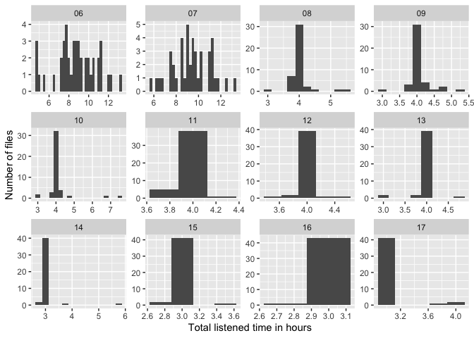
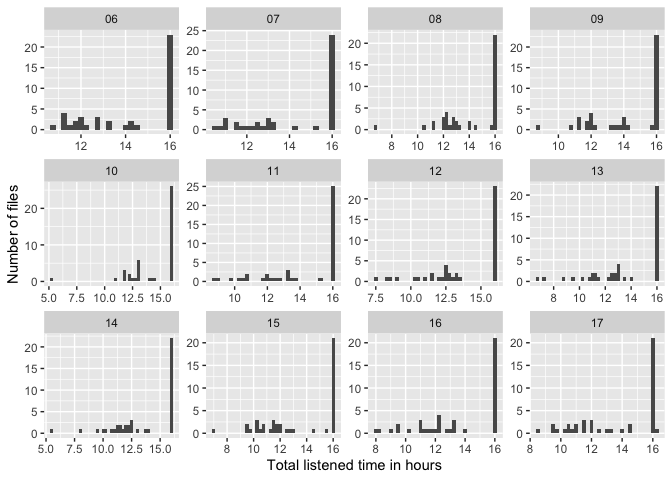

Listened time analysis by month
================
Sarp Uner

<style>
  .bigTable {
    float:left
  }
</style>

## 0.1 Listened Time

The final listened time output generated by the python script. Below, we
read the Total_Listen_Time_Summary.csv file, and pull the month data
from the filename for later use.

### 0.1.1 Definition of Variables

You can find more detailed information [here, on
gitbook](https://bergelsonlab.gitbook.io/blab/data-pipeline/audio/skips-silences-make-up-time-and-extra-time)

Ideally, all of these regions should be marked clearly in all of the cha
files as comment lines. Here are brief definitions of different regions:

***Subregions***

-   Subregions are 1 hour long chunks that have been chosen by scripts
    for having the highest amount of ‘activity’.
-   These are the regions that we have listened to in months 8-17. For
    months 6 and 7, we listened to the whole file, so there was no need
    to introduce subregions.
-   For all recordings in months 8-17, ideally, 5 subregions were
    identified. Depending on target length of time to listen to (for
    months 8-13 target length is 3, whereas for 14-17 it is 3), the
    subregions were ranked from best to worst (in terms of activity) and
    listened to accordingly.

***Skips***

-   Skips are sections of recording (at least 10 minutes long) that do
    not contain any decipherable language.
-   Naps, car rides without decipherable speech, shopping trips without
    speech are all examples of skips.
-   For months 6 and 7, these are not modified. For months 8-17, we
    modify their start-end timestamps for calculation listened time.
    More detailed information about this can be found below in the Month
    6 and 7 section.

***Silences***

-   Silences are silent regions as detected by a script (everything is
    below a certain dB value for example).
-   These were not listened to in any of the months. However, their
    calculation in final listened time depends on the months.

***Make ups***

-   If a skip or silence overlaps with a subregion of a rank where we
    would have liked to listen to (for instance, a subregion ranked 1
    has a small overlap with a skip region), then we make up for that
    time that we didn’t listen to by listening to a portion of a lesser
    ranked subregion.
-   Since months 6 and 7 do not have subregions, they also do not have
    make up regions.

***Extra Time***

-   If the strategy for make up time doesn’t work (if the lower ranked
    subregions are not usable for some reason), then any time we listen
    to that does not fall within a subregion is called Extra Time.
-   Since months 6 and 7 do not have subregions, they also do not have
    extra time regions.

Let’s see what we’ve got in listened_time

``` r
listened_time <- read_csv("../output/Total_Listen_Time_Summary.csv")
listened_time_with_months <- listened_time %>% 
  separate(filename, into = c("subj","month"), sep = "_", extra="drop",remove=F)
skim(listened_time_with_months)
```

<table style="width: auto;" class="table table-condensed">
<caption>
Table 1: Data summary
</caption>
<thead>
<tr>
<th style="text-align:left;">
</th>
<th style="text-align:left;">
</th>
</tr>
</thead>
<tbody>
<tr>
<td style="text-align:left;">
Name
</td>
<td style="text-align:left;">
listened_time_with_months
</td>
</tr>
<tr>
<td style="text-align:left;">
Number of rows
</td>
<td style="text-align:left;">
527
</td>
</tr>
<tr>
<td style="text-align:left;">
Number of columns
</td>
<td style="text-align:left;">
31
</td>
</tr>
<tr>
<td style="text-align:left;">
\_\_\_\_\_\_\_\_\_\_\_\_\_\_\_\_\_\_\_\_\_\_\_
</td>
<td style="text-align:left;">
</td>
</tr>
<tr>
<td style="text-align:left;">
Column type frequency:
</td>
<td style="text-align:left;">
</td>
</tr>
<tr>
<td style="text-align:left;">
character
</td>
<td style="text-align:left;">
8
</td>
</tr>
<tr>
<td style="text-align:left;">
numeric
</td>
<td style="text-align:left;">
23
</td>
</tr>
<tr>
<td style="text-align:left;">
\_\_\_\_\_\_\_\_\_\_\_\_\_\_\_\_\_\_\_\_\_\_\_\_
</td>
<td style="text-align:left;">
</td>
</tr>
<tr>
<td style="text-align:left;">
Group variables
</td>
<td style="text-align:left;">
None
</td>
</tr>
</tbody>
</table>

**Variable type: character**

<table>
<thead>
<tr>
<th style="text-align:left;">
skim_variable
</th>
<th style="text-align:right;">
n_missing
</th>
<th style="text-align:right;">
complete_rate
</th>
<th style="text-align:right;">
min
</th>
<th style="text-align:right;">
max
</th>
<th style="text-align:right;">
empty
</th>
<th style="text-align:right;">
n_unique
</th>
<th style="text-align:right;">
whitespace
</th>
</tr>
</thead>
<tbody>
<tr>
<td style="text-align:left;">
filename
</td>
<td style="text-align:right;">
0
</td>
<td style="text-align:right;">
1
</td>
<td style="text-align:right;">
21
</td>
<td style="text-align:right;">
21
</td>
<td style="text-align:right;">
0
</td>
<td style="text-align:right;">
527
</td>
<td style="text-align:right;">
0
</td>
</tr>
<tr>
<td style="text-align:left;">
subj
</td>
<td style="text-align:right;">
0
</td>
<td style="text-align:right;">
1
</td>
<td style="text-align:right;">
2
</td>
<td style="text-align:right;">
2
</td>
<td style="text-align:right;">
0
</td>
<td style="text-align:right;">
44
</td>
<td style="text-align:right;">
0
</td>
</tr>
<tr>
<td style="text-align:left;">
month
</td>
<td style="text-align:right;">
0
</td>
<td style="text-align:right;">
1
</td>
<td style="text-align:right;">
2
</td>
<td style="text-align:right;">
2
</td>
<td style="text-align:right;">
0
</td>
<td style="text-align:right;">
12
</td>
<td style="text-align:right;">
0
</td>
</tr>
<tr>
<td style="text-align:left;">
subregions
</td>
<td style="text-align:right;">
0
</td>
<td style="text-align:right;">
1
</td>
<td style="text-align:right;">
2
</td>
<td style="text-align:right;">
120
</td>
<td style="text-align:right;">
0
</td>
<td style="text-align:right;">
123
</td>
<td style="text-align:right;">
0
</td>
</tr>
<tr>
<td style="text-align:left;">
positions
</td>
<td style="text-align:right;">
0
</td>
<td style="text-align:right;">
1
</td>
<td style="text-align:right;">
2
</td>
<td style="text-align:right;">
25
</td>
<td style="text-align:right;">
0
</td>
<td style="text-align:right;">
3
</td>
<td style="text-align:right;">
0
</td>
</tr>
<tr>
<td style="text-align:left;">
ranks
</td>
<td style="text-align:right;">
0
</td>
<td style="text-align:right;">
1
</td>
<td style="text-align:right;">
2
</td>
<td style="text-align:right;">
25
</td>
<td style="text-align:right;">
0
</td>
<td style="text-align:right;">
123
</td>
<td style="text-align:right;">
0
</td>
</tr>
<tr>
<td style="text-align:left;">
counts
</td>
<td style="text-align:right;">
0
</td>
<td style="text-align:right;">
1
</td>
<td style="text-align:right;">
15
</td>
<td style="text-align:right;">
24
</td>
<td style="text-align:right;">
0
</td>
<td style="text-align:right;">
440
</td>
<td style="text-align:right;">
0
</td>
</tr>
<tr>
<td style="text-align:left;">
removals
</td>
<td style="text-align:right;">
0
</td>
<td style="text-align:right;">
1
</td>
<td style="text-align:right;">
20
</td>
<td style="text-align:right;">
158
</td>
<td style="text-align:right;">
0
</td>
<td style="text-align:right;">
44
</td>
<td style="text-align:right;">
0
</td>
</tr>
</tbody>
</table>

**Variable type: numeric**

<table>
<thead>
<tr>
<th style="text-align:left;">
skim_variable
</th>
<th style="text-align:right;">
n_missing
</th>
<th style="text-align:right;">
complete_rate
</th>
<th style="text-align:right;">
mean
</th>
<th style="text-align:right;">
sd
</th>
<th style="text-align:right;">
p0
</th>
<th style="text-align:right;">
p25
</th>
<th style="text-align:right;">
p50
</th>
<th style="text-align:right;">
p75
</th>
<th style="text-align:right;">
p100
</th>
<th style="text-align:left;">
hist
</th>
</tr>
</thead>
<tbody>
<tr>
<td style="text-align:left;">
subregion_time
</td>
<td style="text-align:right;">
0
</td>
<td style="text-align:right;">
1
</td>
<td style="text-align:right;">
10745311.01
</td>
<td style="text-align:right;">
5090854.25
</td>
<td style="text-align:right;">
0.00
</td>
<td style="text-align:right;">
1.080e+07
</td>
<td style="text-align:right;">
10800000.00
</td>
<td style="text-align:right;">
14400000.00
</td>
<td style="text-align:right;">
17999990.00
</td>
<td style="text-align:left;">
▃▁▁▆▇
</td>
</tr>
<tr>
<td style="text-align:left;">
skip_time
</td>
<td style="text-align:right;">
0
</td>
<td style="text-align:right;">
1
</td>
<td style="text-align:right;">
1237970.17
</td>
<td style="text-align:right;">
3793628.19
</td>
<td style="text-align:right;">
0.00
</td>
<td style="text-align:right;">
0.000e+00
</td>
<td style="text-align:right;">
0.00
</td>
<td style="text-align:right;">
776225.00
</td>
<td style="text-align:right;">
33834120.00
</td>
<td style="text-align:left;">
▇▁▁▁▁
</td>
</tr>
<tr>
<td style="text-align:left;">
num_makeup_region
</td>
<td style="text-align:right;">
0
</td>
<td style="text-align:right;">
1
</td>
<td style="text-align:right;">
0.30
</td>
<td style="text-align:right;">
0.48
</td>
<td style="text-align:right;">
0.00
</td>
<td style="text-align:right;">
0.000e+00
</td>
<td style="text-align:right;">
0.00
</td>
<td style="text-align:right;">
1.00
</td>
<td style="text-align:right;">
2.00
</td>
<td style="text-align:left;">
▇▁▃▁▁
</td>
</tr>
<tr>
<td style="text-align:left;">
num_subregion_with_annot
</td>
<td style="text-align:right;">
0
</td>
<td style="text-align:right;">
1
</td>
<td style="text-align:right;">
2.98
</td>
<td style="text-align:right;">
1.41
</td>
<td style="text-align:right;">
0.00
</td>
<td style="text-align:right;">
3.000e+00
</td>
<td style="text-align:right;">
3.00
</td>
<td style="text-align:right;">
4.00
</td>
<td style="text-align:right;">
5.00
</td>
<td style="text-align:left;">
▃▁▆▇▁
</td>
</tr>
<tr>
<td style="text-align:left;">
total_listen_time
</td>
<td style="text-align:right;">
0
</td>
<td style="text-align:right;">
1
</td>
<td style="text-align:right;">
16288036.12
</td>
<td style="text-align:right;">
8046766.63
</td>
<td style="text-align:right;">
9710580.00
</td>
<td style="text-align:right;">
1.080e+07
</td>
<td style="text-align:right;">
14376419.00
</td>
<td style="text-align:right;">
14492880.00
</td>
<td style="text-align:right;">
48007730.00
</td>
<td style="text-align:left;">
▇▁▁▁▁
</td>
</tr>
<tr>
<td style="text-align:left;">
num_extra_region
</td>
<td style="text-align:right;">
0
</td>
<td style="text-align:right;">
1
</td>
<td style="text-align:right;">
0.07
</td>
<td style="text-align:right;">
0.44
</td>
<td style="text-align:right;">
0.00
</td>
<td style="text-align:right;">
0.000e+00
</td>
<td style="text-align:right;">
0.00
</td>
<td style="text-align:right;">
0.00
</td>
<td style="text-align:right;">
5.00
</td>
<td style="text-align:left;">
▇▁▁▁▁
</td>
</tr>
<tr>
<td style="text-align:left;">
silence_time
</td>
<td style="text-align:right;">
0
</td>
<td style="text-align:right;">
1
</td>
<td style="text-align:right;">
2671553.15
</td>
<td style="text-align:right;">
6469896.93
</td>
<td style="text-align:right;">
0.00
</td>
<td style="text-align:right;">
0.000e+00
</td>
<td style="text-align:right;">
0.00
</td>
<td style="text-align:right;">
714585.00
</td>
<td style="text-align:right;">
34481370.00
</td>
<td style="text-align:left;">
▇▁▁▁▁
</td>
</tr>
<tr>
<td style="text-align:left;">
num_surplus_region
</td>
<td style="text-align:right;">
0
</td>
<td style="text-align:right;">
1
</td>
<td style="text-align:right;">
0.07
</td>
<td style="text-align:right;">
0.38
</td>
<td style="text-align:right;">
0.00
</td>
<td style="text-align:right;">
0.000e+00
</td>
<td style="text-align:right;">
0.00
</td>
<td style="text-align:right;">
0.00
</td>
<td style="text-align:right;">
4.00
</td>
<td style="text-align:left;">
▇▁▁▁▁
</td>
</tr>
<tr>
<td style="text-align:left;">
surplus_time
</td>
<td style="text-align:right;">
0
</td>
<td style="text-align:right;">
1
</td>
<td style="text-align:right;">
144127.06
</td>
<td style="text-align:right;">
978842.55
</td>
<td style="text-align:right;">
0.00
</td>
<td style="text-align:right;">
0.000e+00
</td>
<td style="text-align:right;">
0.00
</td>
<td style="text-align:right;">
0.00
</td>
<td style="text-align:right;">
12708920.00
</td>
<td style="text-align:left;">
▇▁▁▁▁
</td>
</tr>
<tr>
<td style="text-align:left;">
makeup_time
</td>
<td style="text-align:right;">
0
</td>
<td style="text-align:right;">
1
</td>
<td style="text-align:right;">
387500.85
</td>
<td style="text-align:right;">
785275.49
</td>
<td style="text-align:right;">
0.00
</td>
<td style="text-align:right;">
0.000e+00
</td>
<td style="text-align:right;">
0.00
</td>
<td style="text-align:right;">
467645.00
</td>
<td style="text-align:right;">
3601840.00
</td>
<td style="text-align:left;">
▇▁▁▁▁
</td>
</tr>
<tr>
<td style="text-align:left;">
extra_time
</td>
<td style="text-align:right;">
0
</td>
<td style="text-align:right;">
1
</td>
<td style="text-align:right;">
51731.29
</td>
<td style="text-align:right;">
363313.06
</td>
<td style="text-align:right;">
0.00
</td>
<td style="text-align:right;">
0.000e+00
</td>
<td style="text-align:right;">
0.00
</td>
<td style="text-align:right;">
0.00
</td>
<td style="text-align:right;">
5101780.00
</td>
<td style="text-align:left;">
▇▁▁▁▁
</td>
</tr>
<tr>
<td style="text-align:left;">
extra_time_hour
</td>
<td style="text-align:right;">
0
</td>
<td style="text-align:right;">
1
</td>
<td style="text-align:right;">
0.01
</td>
<td style="text-align:right;">
0.10
</td>
<td style="text-align:right;">
0.00
</td>
<td style="text-align:right;">
0.000e+00
</td>
<td style="text-align:right;">
0.00
</td>
<td style="text-align:right;">
0.00
</td>
<td style="text-align:right;">
1.42
</td>
<td style="text-align:left;">
▇▁▁▁▁
</td>
</tr>
<tr>
<td style="text-align:left;">
makeup_time_hour
</td>
<td style="text-align:right;">
0
</td>
<td style="text-align:right;">
1
</td>
<td style="text-align:right;">
0.11
</td>
<td style="text-align:right;">
0.22
</td>
<td style="text-align:right;">
0.00
</td>
<td style="text-align:right;">
0.000e+00
</td>
<td style="text-align:right;">
0.00
</td>
<td style="text-align:right;">
0.13
</td>
<td style="text-align:right;">
1.00
</td>
<td style="text-align:left;">
▇▁▁▁▁
</td>
</tr>
<tr>
<td style="text-align:left;">
surplus_time_hour
</td>
<td style="text-align:right;">
0
</td>
<td style="text-align:right;">
1
</td>
<td style="text-align:right;">
0.04
</td>
<td style="text-align:right;">
0.27
</td>
<td style="text-align:right;">
0.00
</td>
<td style="text-align:right;">
0.000e+00
</td>
<td style="text-align:right;">
0.00
</td>
<td style="text-align:right;">
0.00
</td>
<td style="text-align:right;">
3.53
</td>
<td style="text-align:left;">
▇▁▁▁▁
</td>
</tr>
<tr>
<td style="text-align:left;">
silence_time_hour
</td>
<td style="text-align:right;">
0
</td>
<td style="text-align:right;">
1
</td>
<td style="text-align:right;">
0.74
</td>
<td style="text-align:right;">
1.80
</td>
<td style="text-align:right;">
0.00
</td>
<td style="text-align:right;">
0.000e+00
</td>
<td style="text-align:right;">
0.00
</td>
<td style="text-align:right;">
0.20
</td>
<td style="text-align:right;">
9.58
</td>
<td style="text-align:left;">
▇▁▁▁▁
</td>
</tr>
<tr>
<td style="text-align:left;">
subregion_time_hour
</td>
<td style="text-align:right;">
0
</td>
<td style="text-align:right;">
1
</td>
<td style="text-align:right;">
2.98
</td>
<td style="text-align:right;">
1.41
</td>
<td style="text-align:right;">
0.00
</td>
<td style="text-align:right;">
3.000e+00
</td>
<td style="text-align:right;">
3.00
</td>
<td style="text-align:right;">
4.00
</td>
<td style="text-align:right;">
5.00
</td>
<td style="text-align:left;">
▃▁▆▇▁
</td>
</tr>
<tr>
<td style="text-align:left;">
skip_time_hour
</td>
<td style="text-align:right;">
0
</td>
<td style="text-align:right;">
1
</td>
<td style="text-align:right;">
0.34
</td>
<td style="text-align:right;">
1.05
</td>
<td style="text-align:right;">
0.00
</td>
<td style="text-align:right;">
0.000e+00
</td>
<td style="text-align:right;">
0.00
</td>
<td style="text-align:right;">
0.22
</td>
<td style="text-align:right;">
9.40
</td>
<td style="text-align:left;">
▇▁▁▁▁
</td>
</tr>
<tr>
<td style="text-align:left;">
skip_silence_overlap_hour
</td>
<td style="text-align:right;">
0
</td>
<td style="text-align:right;">
1
</td>
<td style="text-align:right;">
0.07
</td>
<td style="text-align:right;">
0.59
</td>
<td style="text-align:right;">
0.00
</td>
<td style="text-align:right;">
0.000e+00
</td>
<td style="text-align:right;">
0.00
</td>
<td style="text-align:right;">
0.00
</td>
<td style="text-align:right;">
6.71
</td>
<td style="text-align:left;">
▇▁▁▁▁
</td>
</tr>
<tr>
<td style="text-align:left;">
end_time_hour
</td>
<td style="text-align:right;">
0
</td>
<td style="text-align:right;">
1
</td>
<td style="text-align:right;">
14.00
</td>
<td style="text-align:right;">
2.40
</td>
<td style="text-align:right;">
5.33
</td>
<td style="text-align:right;">
1.209e+01
</td>
<td style="text-align:right;">
16.00
</td>
<td style="text-align:right;">
16.00
</td>
<td style="text-align:right;">
16.17
</td>
<td style="text-align:left;">
▁▁▂▃▇
</td>
</tr>
<tr>
<td style="text-align:left;">
total_listen_time_hour
</td>
<td style="text-align:right;">
0
</td>
<td style="text-align:right;">
1
</td>
<td style="text-align:right;">
4.52
</td>
<td style="text-align:right;">
2.24
</td>
<td style="text-align:right;">
2.70
</td>
<td style="text-align:right;">
3.000e+00
</td>
<td style="text-align:right;">
3.99
</td>
<td style="text-align:right;">
4.03
</td>
<td style="text-align:right;">
13.34
</td>
<td style="text-align:left;">
▇▁▁▁▁
</td>
</tr>
<tr>
<td style="text-align:left;">
silence_raw_hour
</td>
<td style="text-align:right;">
0
</td>
<td style="text-align:right;">
1
</td>
<td style="text-align:right;">
4.25
</td>
<td style="text-align:right;">
2.52
</td>
<td style="text-align:right;">
0.00
</td>
<td style="text-align:right;">
2.120e+00
</td>
<td style="text-align:right;">
3.90
</td>
<td style="text-align:right;">
6.15
</td>
<td style="text-align:right;">
12.48
</td>
<td style="text-align:left;">
▇▇▆▃▁
</td>
</tr>
<tr>
<td style="text-align:left;">
subregion_raw_hour
</td>
<td style="text-align:right;">
0
</td>
<td style="text-align:right;">
1
</td>
<td style="text-align:right;">
4.16
</td>
<td style="text-align:right;">
1.87
</td>
<td style="text-align:right;">
0.00
</td>
<td style="text-align:right;">
5.000e+00
</td>
<td style="text-align:right;">
5.00
</td>
<td style="text-align:right;">
5.00
</td>
<td style="text-align:right;">
5.00
</td>
<td style="text-align:left;">
▂▁▁▁▇
</td>
</tr>
<tr>
<td style="text-align:left;">
num_raw_subregion
</td>
<td style="text-align:right;">
0
</td>
<td style="text-align:right;">
1
</td>
<td style="text-align:right;">
4.16
</td>
<td style="text-align:right;">
1.87
</td>
<td style="text-align:right;">
0.00
</td>
<td style="text-align:right;">
5.000e+00
</td>
<td style="text-align:right;">
5.00
</td>
<td style="text-align:right;">
5.00
</td>
<td style="text-align:right;">
5.00
</td>
<td style="text-align:left;">
▂▁▁▁▇
</td>
</tr>
</tbody>
</table>

Here we calculate the average, minimum and maximum listen time per month
in hours, rounded to two decimal places. These should be a general
indication of issues for that month’s listened times.

``` r
avgs <- listened_time_with_months %>% 
  group_by(month) %>% 
  summarise(mean_listen_time = round(mean(total_listen_time_hour), 2),
            sd_listen_time = round(sd(total_listen_time_hour),2),
            max = max(total_listen_time_hour), 
            min = min(total_listen_time_hour)
            )
knitr::kable(
  avgs,
  caption = "Mean, maximum and minimum listened time per month in hours"
) %>%
  kable_styling(bootstrap_options = c("striped", "hover", "condensed"), full_width = T, fixed_thead = T)
```

<table class="table table-striped table-hover table-condensed" style="margin-left: auto; margin-right: auto;">
<caption>
Table 2: Mean, maximum and minimum listened time per month in hours
</caption>
<thead>
<tr>
<th style="text-align:left;position: sticky; top:0; background-color: #FFFFFF;">
month
</th>
<th style="text-align:right;position: sticky; top:0; background-color: #FFFFFF;">
mean_listen_time
</th>
<th style="text-align:right;position: sticky; top:0; background-color: #FFFFFF;">
sd_listen_time
</th>
<th style="text-align:right;position: sticky; top:0; background-color: #FFFFFF;">
max
</th>
<th style="text-align:right;position: sticky; top:0; background-color: #FFFFFF;">
min
</th>
</tr>
</thead>
<tbody>
<tr>
<td style="text-align:left;">
06
</td>
<td style="text-align:right;">
8.74
</td>
<td style="text-align:right;">
2.04
</td>
<td style="text-align:right;">
13.13
</td>
<td style="text-align:right;">
4.65
</td>
</tr>
<tr>
<td style="text-align:left;">
07
</td>
<td style="text-align:right;">
9.37
</td>
<td style="text-align:right;">
1.65
</td>
<td style="text-align:right;">
13.34
</td>
<td style="text-align:right;">
5.87
</td>
</tr>
<tr>
<td style="text-align:left;">
08
</td>
<td style="text-align:right;">
4.02
</td>
<td style="text-align:right;">
0.35
</td>
<td style="text-align:right;">
5.38
</td>
<td style="text-align:right;">
3.02
</td>
</tr>
<tr>
<td style="text-align:left;">
09
</td>
<td style="text-align:right;">
4.07
</td>
<td style="text-align:right;">
0.35
</td>
<td style="text-align:right;">
5.22
</td>
<td style="text-align:right;">
3.00
</td>
</tr>
<tr>
<td style="text-align:left;">
10
</td>
<td style="text-align:right;">
4.11
</td>
<td style="text-align:right;">
0.72
</td>
<td style="text-align:right;">
7.53
</td>
<td style="text-align:right;">
2.93
</td>
</tr>
<tr>
<td style="text-align:left;">
11
</td>
<td style="text-align:right;">
3.95
</td>
<td style="text-align:right;">
0.16
</td>
<td style="text-align:right;">
4.17
</td>
<td style="text-align:right;">
3.05
</td>
</tr>
<tr>
<td style="text-align:left;">
12
</td>
<td style="text-align:right;">
4.00
</td>
<td style="text-align:right;">
0.12
</td>
<td style="text-align:right;">
4.56
</td>
<td style="text-align:right;">
3.64
</td>
</tr>
<tr>
<td style="text-align:left;">
13
</td>
<td style="text-align:right;">
3.96
</td>
<td style="text-align:right;">
0.16
</td>
<td style="text-align:right;">
4.10
</td>
<td style="text-align:right;">
3.00
</td>
</tr>
<tr>
<td style="text-align:left;">
14
</td>
<td style="text-align:right;">
3.07
</td>
<td style="text-align:right;">
0.44
</td>
<td style="text-align:right;">
5.78
</td>
<td style="text-align:right;">
2.70
</td>
</tr>
<tr>
<td style="text-align:left;">
15
</td>
<td style="text-align:right;">
2.99
</td>
<td style="text-align:right;">
0.09
</td>
<td style="text-align:right;">
3.50
</td>
<td style="text-align:right;">
2.74
</td>
</tr>
<tr>
<td style="text-align:left;">
16
</td>
<td style="text-align:right;">
2.99
</td>
<td style="text-align:right;">
0.03
</td>
<td style="text-align:right;">
3.00
</td>
<td style="text-align:right;">
2.81
</td>
</tr>
<tr>
<td style="text-align:left;">
17
</td>
<td style="text-align:right;">
3.01
</td>
<td style="text-align:right;">
0.12
</td>
<td style="text-align:right;">
3.78
</td>
<td style="text-align:right;">
2.91
</td>
</tr>
</tbody>
</table>

Here is the silence time in hours by month.

``` r
avgs_silence <- listened_time_with_months %>% 
  group_by(month) %>% 
  summarise(mean_silence_time = round(mean(silence_raw_hour), 2),
            sd_silence_time = round(sd(silence_raw_hour),2),
            max = max(silence_raw_hour), 
            min = min(silence_raw_hour),
            mean_length_of_recording = round(mean(end_time_hour), 2),
            sd_recording_length = round(sd(end_time_hour),2),
            max_length = max(end_time_hour), 
            min_length = min(end_time_hour),)
knitr::kable(
  avgs_silence,
  caption = "Mean, maximum and minimum silence time per month in hours"
) %>%
  kable_styling(bootstrap_options = c("striped", "hover", "condensed"), full_width = T, fixed_thead = T)
```

<table class="table table-striped table-hover table-condensed" style="margin-left: auto; margin-right: auto;">
<caption>
Table 3: Mean, maximum and minimum silence time per month in hours
</caption>
<thead>
<tr>
<th style="text-align:left;position: sticky; top:0; background-color: #FFFFFF;">
month
</th>
<th style="text-align:right;position: sticky; top:0; background-color: #FFFFFF;">
mean_silence_time
</th>
<th style="text-align:right;position: sticky; top:0; background-color: #FFFFFF;">
sd_silence_time
</th>
<th style="text-align:right;position: sticky; top:0; background-color: #FFFFFF;">
max
</th>
<th style="text-align:right;position: sticky; top:0; background-color: #FFFFFF;">
min
</th>
<th style="text-align:right;position: sticky; top:0; background-color: #FFFFFF;">
mean_length_of_recording
</th>
<th style="text-align:right;position: sticky; top:0; background-color: #FFFFFF;">
sd_recording_length
</th>
<th style="text-align:right;position: sticky; top:0; background-color: #FFFFFF;">
max_length
</th>
<th style="text-align:right;position: sticky; top:0; background-color: #FFFFFF;">
min_length
</th>
</tr>
</thead>
<tbody>
<tr>
<td style="text-align:left;">
06
</td>
<td style="text-align:right;">
4.19
</td>
<td style="text-align:right;">
2.38
</td>
<td style="text-align:right;">
8.38
</td>
<td style="text-align:right;">
0.50
</td>
<td style="text-align:right;">
14.30
</td>
<td style="text-align:right;">
1.97
</td>
<td style="text-align:right;">
16.00
</td>
<td style="text-align:right;">
10.67
</td>
</tr>
<tr>
<td style="text-align:left;">
07
</td>
<td style="text-align:right;">
4.11
</td>
<td style="text-align:right;">
2.26
</td>
<td style="text-align:right;">
9.58
</td>
<td style="text-align:right;">
0.00
</td>
<td style="text-align:right;">
14.31
</td>
<td style="text-align:right;">
2.04
</td>
<td style="text-align:right;">
16.00
</td>
<td style="text-align:right;">
10.58
</td>
</tr>
<tr>
<td style="text-align:left;">
08
</td>
<td style="text-align:right;">
4.02
</td>
<td style="text-align:right;">
2.51
</td>
<td style="text-align:right;">
8.53
</td>
<td style="text-align:right;">
0.00
</td>
<td style="text-align:right;">
14.20
</td>
<td style="text-align:right;">
2.18
</td>
<td style="text-align:right;">
16.00
</td>
<td style="text-align:right;">
6.67
</td>
</tr>
<tr>
<td style="text-align:left;">
09
</td>
<td style="text-align:right;">
4.42
</td>
<td style="text-align:right;">
2.42
</td>
<td style="text-align:right;">
10.18
</td>
<td style="text-align:right;">
0.55
</td>
<td style="text-align:right;">
14.35
</td>
<td style="text-align:right;">
2.09
</td>
<td style="text-align:right;">
16.00
</td>
<td style="text-align:right;">
8.63
</td>
</tr>
<tr>
<td style="text-align:left;">
10
</td>
<td style="text-align:right;">
4.26
</td>
<td style="text-align:right;">
2.69
</td>
<td style="text-align:right;">
10.11
</td>
<td style="text-align:right;">
0.00
</td>
<td style="text-align:right;">
14.50
</td>
<td style="text-align:right;">
2.20
</td>
<td style="text-align:right;">
16.00
</td>
<td style="text-align:right;">
5.33
</td>
</tr>
<tr>
<td style="text-align:left;">
11
</td>
<td style="text-align:right;">
4.08
</td>
<td style="text-align:right;">
2.62
</td>
<td style="text-align:right;">
12.48
</td>
<td style="text-align:right;">
0.77
</td>
<td style="text-align:right;">
14.22
</td>
<td style="text-align:right;">
2.35
</td>
<td style="text-align:right;">
16.00
</td>
<td style="text-align:right;">
8.83
</td>
</tr>
<tr>
<td style="text-align:left;">
12
</td>
<td style="text-align:right;">
4.41
</td>
<td style="text-align:right;">
2.43
</td>
<td style="text-align:right;">
9.04
</td>
<td style="text-align:right;">
0.95
</td>
<td style="text-align:right;">
13.84
</td>
<td style="text-align:right;">
2.60
</td>
<td style="text-align:right;">
16.00
</td>
<td style="text-align:right;">
7.46
</td>
</tr>
<tr>
<td style="text-align:left;">
13
</td>
<td style="text-align:right;">
4.12
</td>
<td style="text-align:right;">
2.51
</td>
<td style="text-align:right;">
9.86
</td>
<td style="text-align:right;">
0.01
</td>
<td style="text-align:right;">
13.73
</td>
<td style="text-align:right;">
2.67
</td>
<td style="text-align:right;">
16.00
</td>
<td style="text-align:right;">
6.74
</td>
</tr>
<tr>
<td style="text-align:left;">
14
</td>
<td style="text-align:right;">
4.46
</td>
<td style="text-align:right;">
2.76
</td>
<td style="text-align:right;">
9.22
</td>
<td style="text-align:right;">
0.00
</td>
<td style="text-align:right;">
13.67
</td>
<td style="text-align:right;">
2.69
</td>
<td style="text-align:right;">
16.00
</td>
<td style="text-align:right;">
5.58
</td>
</tr>
<tr>
<td style="text-align:left;">
15
</td>
<td style="text-align:right;">
4.37
</td>
<td style="text-align:right;">
2.72
</td>
<td style="text-align:right;">
10.90
</td>
<td style="text-align:right;">
0.44
</td>
<td style="text-align:right;">
13.55
</td>
<td style="text-align:right;">
2.68
</td>
<td style="text-align:right;">
16.00
</td>
<td style="text-align:right;">
6.90
</td>
</tr>
<tr>
<td style="text-align:left;">
16
</td>
<td style="text-align:right;">
4.26
</td>
<td style="text-align:right;">
2.62
</td>
<td style="text-align:right;">
11.13
</td>
<td style="text-align:right;">
0.00
</td>
<td style="text-align:right;">
13.60
</td>
<td style="text-align:right;">
2.60
</td>
<td style="text-align:right;">
16.00
</td>
<td style="text-align:right;">
7.92
</td>
</tr>
<tr>
<td style="text-align:left;">
17
</td>
<td style="text-align:right;">
4.30
</td>
<td style="text-align:right;">
2.60
</td>
<td style="text-align:right;">
9.69
</td>
<td style="text-align:right;">
0.00
</td>
<td style="text-align:right;">
13.77
</td>
<td style="text-align:right;">
2.54
</td>
<td style="text-align:right;">
16.17
</td>
<td style="text-align:right;">
8.52
</td>
</tr>
</tbody>
</table>
Below is a short section of the format of the csv file with only the
**hour variables**. This should help with quick sanity checks. Note that
for months 6 and 7, total listen time is calculated by subtracting skip
and silence times from the last available time stamp in a file. **These
files are not listed here because they are problematic! (As in there is
nothing wrong with them, they are just displayed here as an example)**
<table class="table table-striped table-hover table-condensed" style="width: auto !important; ">
<caption>
Table 4: A tibble of listened time csv file
</caption>
<thead>
<tr>
<th style="text-align:left;">
filename
</th>
<th style="text-align:right;">
extra_time_hour
</th>
<th style="text-align:right;">
makeup_time_hour
</th>
<th style="text-align:right;">
surplus_time_hour
</th>
<th style="text-align:right;">
silence_time_hour
</th>
<th style="text-align:right;">
subregion_time_hour
</th>
<th style="text-align:right;">
skip_time_hour
</th>
<th style="text-align:right;">
skip_silence_overlap_hour
</th>
<th style="text-align:right;">
end_time_hour
</th>
<th style="text-align:right;">
total_listen_time_hour
</th>
<th style="text-align:right;">
silence_raw_hour
</th>
<th style="text-align:right;">
subregion_raw_hour
</th>
</tr>
</thead>
<tbody>
<tr>
<td style="text-align:left;">
01_06_sparse_code.cha
</td>
<td style="text-align:right;">
0.00
</td>
<td style="text-align:right;">
0
</td>
<td style="text-align:right;">
0.00
</td>
<td style="text-align:right;">
5.86
</td>
<td style="text-align:right;">
0
</td>
<td style="text-align:right;">
6.59
</td>
<td style="text-align:right;">
4.83
</td>
<td style="text-align:right;">
16
</td>
<td style="text-align:right;">
8.38
</td>
<td style="text-align:right;">
5.86
</td>
<td style="text-align:right;">
0
</td>
</tr>
<tr>
<td style="text-align:left;">
01_07_sparse_code.cha
</td>
<td style="text-align:right;">
0.00
</td>
<td style="text-align:right;">
0
</td>
<td style="text-align:right;">
0.00
</td>
<td style="text-align:right;">
6.19
</td>
<td style="text-align:right;">
0
</td>
<td style="text-align:right;">
0.20
</td>
<td style="text-align:right;">
0.00
</td>
<td style="text-align:right;">
16
</td>
<td style="text-align:right;">
9.61
</td>
<td style="text-align:right;">
6.19
</td>
<td style="text-align:right;">
0
</td>
</tr>
<tr>
<td style="text-align:left;">
01_08_sparse_code.cha
</td>
<td style="text-align:right;">
0.08
</td>
<td style="text-align:right;">
0
</td>
<td style="text-align:right;">
1.69
</td>
<td style="text-align:right;">
0.00
</td>
<td style="text-align:right;">
2
</td>
<td style="text-align:right;">
0.00
</td>
<td style="text-align:right;">
0.00
</td>
<td style="text-align:right;">
16
</td>
<td style="text-align:right;">
3.78
</td>
<td style="text-align:right;">
5.03
</td>
<td style="text-align:right;">
5
</td>
</tr>
<tr>
<td style="text-align:left;">
01_09_sparse_code.cha
</td>
<td style="text-align:right;">
0.00
</td>
<td style="text-align:right;">
0
</td>
<td style="text-align:right;">
0.72
</td>
<td style="text-align:right;">
0.00
</td>
<td style="text-align:right;">
4
</td>
<td style="text-align:right;">
0.00
</td>
<td style="text-align:right;">
0.00
</td>
<td style="text-align:right;">
16
</td>
<td style="text-align:right;">
4.72
</td>
<td style="text-align:right;">
1.53
</td>
<td style="text-align:right;">
5
</td>
</tr>
<tr>
<td style="text-align:left;">
01_10_sparse_code.cha
</td>
<td style="text-align:right;">
0.00
</td>
<td style="text-align:right;">
0
</td>
<td style="text-align:right;">
0.24
</td>
<td style="text-align:right;">
0.00
</td>
<td style="text-align:right;">
4
</td>
<td style="text-align:right;">
0.00
</td>
<td style="text-align:right;">
0.00
</td>
<td style="text-align:right;">
16
</td>
<td style="text-align:right;">
4.24
</td>
<td style="text-align:right;">
3.58
</td>
<td style="text-align:right;">
5
</td>
</tr>
</tbody>
</table>

## 0.2 Listen Time Histograms

Below are the histograms for each month.

<details>
<summary>
Click for month by month histograms
</summary>

<div>

``` r
ggplot(data = listened_time_with_months) + geom_histogram(mapping = aes(x = total_listen_time_hour),binwidth=.25) + facet_wrap(~ month, scales = "free") +
  labs(x = "Total listened time in hours", y = "Number of files")
```



</div>

</details>
<details>
<summary>
Click for month by month total recording time histograms
</summary>

<div>

``` r
ggplot(data = listened_time_with_months) + geom_histogram(mapping = aes(x = end_time_hour),binwidth=.25) + facet_wrap(~ month, scales = "free") +
  labs(x = "Total listened time in hours", y = "Number of files")
```



</div>

</details>

## 0.3 Problem File List

Please find below additional analysis and listings of possibly
problematics files.

## 0.4 Month 6 and 7

As a reminder: in month 6 and 7 ‘silence finder’ process demarcated
silences, and skips were marked to denote time that someone in the
future probably needn’t listen to at all (e.g. long car rides with a
radio playing) \[in months 8-17 skips carried a different meaning, see
below\].

There are 88 6 and 7 month files.

Calculation formula for these months is as follows:

*t**o**t**a**l*\_*l**i**s**t**e**n*\_*t**i**m**e*\_*h**o**u**r* = *e**n**d*\_*t**i**m**e*\_*h**o**u**r* − (*s**k**i**p*\_*t**i**m**e*\_*h**o**u**r*+*s**i**l**e**n**c**e*\_*t**i**m**e*\_*h**o**u**r*−*s**k**i**p*\_*s**i**l**e**n**c**e*\_*o**v**e**r**l**a**p*\_*h**o**u**r*)
According to this calculation, the files below are listed as
**potentially problematic** since their total listen time is either \>12
hours (unlikely for infants this age to be awake that much) or \<8 hours
(should double check for any errors in the file since that’s \<50% of
full recording capacity). Note the silence_raw_hour variable here will
be the same as the silence_time_hour variable. That is, for months 6 and
7, silent and skip regions are **not modified**, hence we do not include
their raw versions (instead we calculate their overlap, which is not
done for the rest of the months).

<details>
<summary>
Click for months 6-7 problematic files
</summary>

<div>

``` r
headers <- c(
  "filename", 
  "month", 
  "silence_time_hour", 
  "skip_time_hour", 
  "skip_silence_overlap_hour", 
  "end_time_hour", 
  "total_listen_time_hour"
  )
sixseven_summary <- 
  listened_time_with_months %>%
  select(headers) %>%
  filter(month %in% c("06","07") & (total_listen_time_hour>12 | total_listen_time_hour<8)) %>%
  mutate(calculation_of_listen_time_hour = sprintf("= %s - (%s + %s - %s)", end_time_hour, skip_time_hour, silence_time_hour, skip_silence_overlap_hour)) %>% 
  arrange(total_listen_time_hour)

write_csv(sixseven_summary, 'sixseven_problems')

knitr::kable(sixseven_summary) %>%
  kable_styling(bootstrap_options = c("striped", "hover", "condensed", "bordered"), full_width = F, fixed_thead = T)
```

<table class="table table-striped table-hover table-condensed table-bordered" style="width: auto !important; margin-left: auto; margin-right: auto;">
<thead>
<tr>
<th style="text-align:left;position: sticky; top:0; background-color: #FFFFFF;">
filename
</th>
<th style="text-align:left;position: sticky; top:0; background-color: #FFFFFF;">
month
</th>
<th style="text-align:right;position: sticky; top:0; background-color: #FFFFFF;">
silence_time_hour
</th>
<th style="text-align:right;position: sticky; top:0; background-color: #FFFFFF;">
skip_time_hour
</th>
<th style="text-align:right;position: sticky; top:0; background-color: #FFFFFF;">
skip_silence_overlap_hour
</th>
<th style="text-align:right;position: sticky; top:0; background-color: #FFFFFF;">
end_time_hour
</th>
<th style="text-align:right;position: sticky; top:0; background-color: #FFFFFF;">
total_listen_time_hour
</th>
<th style="text-align:left;position: sticky; top:0; background-color: #FFFFFF;">
calculation_of_listen_time_hour
</th>
</tr>
</thead>
<tbody>
<tr>
<td style="text-align:left;">
08_06_sparse_code.cha
</td>
<td style="text-align:left;">
06
</td>
<td style="text-align:right;">
4.67
</td>
<td style="text-align:right;">
6.68
</td>
<td style="text-align:right;">
0.00
</td>
<td style="text-align:right;">
16.00
</td>
<td style="text-align:right;">
4.65
</td>
<td style="text-align:left;">
= 16 - (6.68 + 4.67 - 0)
</td>
</tr>
<tr>
<td style="text-align:left;">
13_06_sparse_code.cha
</td>
<td style="text-align:left;">
06
</td>
<td style="text-align:right;">
2.95
</td>
<td style="text-align:right;">
3.86
</td>
<td style="text-align:right;">
0.00
</td>
<td style="text-align:right;">
11.53
</td>
<td style="text-align:right;">
4.72
</td>
<td style="text-align:left;">
= 11.53 - (3.86 + 2.95 - 0)
</td>
</tr>
<tr>
<td style="text-align:left;">
21_06_sparse_code.cha
</td>
<td style="text-align:left;">
06
</td>
<td style="text-align:right;">
2.54
</td>
<td style="text-align:right;">
6.98
</td>
<td style="text-align:right;">
0.00
</td>
<td style="text-align:right;">
14.24
</td>
<td style="text-align:right;">
4.72
</td>
<td style="text-align:left;">
= 14.24 - (6.98 + 2.54 - 0)
</td>
</tr>
<tr>
<td style="text-align:left;">
19_06_sparse_code.cha
</td>
<td style="text-align:left;">
06
</td>
<td style="text-align:right;">
3.55
</td>
<td style="text-align:right;">
5.17
</td>
<td style="text-align:right;">
1.93
</td>
<td style="text-align:right;">
11.91
</td>
<td style="text-align:right;">
5.12
</td>
<td style="text-align:left;">
= 11.91 - (5.17 + 3.55 - 1.93)
</td>
</tr>
<tr>
<td style="text-align:left;">
17_06_sparse_code.cha
</td>
<td style="text-align:left;">
06
</td>
<td style="text-align:right;">
7.32
</td>
<td style="text-align:right;">
3.12
</td>
<td style="text-align:right;">
0.00
</td>
<td style="text-align:right;">
16.00
</td>
<td style="text-align:right;">
5.57
</td>
<td style="text-align:left;">
= 16 - (3.12 + 7.32 - 0)
</td>
</tr>
<tr>
<td style="text-align:left;">
03_07_sparse_code.cha
</td>
<td style="text-align:left;">
07
</td>
<td style="text-align:right;">
6.99
</td>
<td style="text-align:right;">
6.70
</td>
<td style="text-align:right;">
3.55
</td>
<td style="text-align:right;">
16.00
</td>
<td style="text-align:right;">
5.87
</td>
<td style="text-align:left;">
= 16 - (6.7 + 6.99 - 3.55)
</td>
</tr>
<tr>
<td style="text-align:left;">
14_07_sparse_code.cha
</td>
<td style="text-align:left;">
07
</td>
<td style="text-align:right;">
6.62
</td>
<td style="text-align:right;">
9.40
</td>
<td style="text-align:right;">
6.30
</td>
<td style="text-align:right;">
16.00
</td>
<td style="text-align:right;">
6.28
</td>
<td style="text-align:left;">
= 16 - (9.4 + 6.62 - 6.3)
</td>
</tr>
<tr>
<td style="text-align:left;">
26_07_sparse_code.cha
</td>
<td style="text-align:left;">
07
</td>
<td style="text-align:right;">
9.58
</td>
<td style="text-align:right;">
0.00
</td>
<td style="text-align:right;">
0.00
</td>
<td style="text-align:right;">
16.00
</td>
<td style="text-align:right;">
6.42
</td>
<td style="text-align:left;">
= 16 - (0 + 9.58 - 0)
</td>
</tr>
<tr>
<td style="text-align:left;">
27_06_sparse_code.cha
</td>
<td style="text-align:left;">
06
</td>
<td style="text-align:right;">
5.99
</td>
<td style="text-align:right;">
3.54
</td>
<td style="text-align:right;">
0.00
</td>
<td style="text-align:right;">
16.00
</td>
<td style="text-align:right;">
6.47
</td>
<td style="text-align:left;">
= 16 - (3.54 + 5.99 - 0)
</td>
</tr>
<tr>
<td style="text-align:left;">
06_07_sparse_code.cha
</td>
<td style="text-align:left;">
07
</td>
<td style="text-align:right;">
9.17
</td>
<td style="text-align:right;">
0.00
</td>
<td style="text-align:right;">
0.00
</td>
<td style="text-align:right;">
16.00
</td>
<td style="text-align:right;">
6.83
</td>
<td style="text-align:left;">
= 16 - (0 + 9.17 - 0)
</td>
</tr>
<tr>
<td style="text-align:left;">
04_06_sparse_code.cha
</td>
<td style="text-align:left;">
06
</td>
<td style="text-align:right;">
3.49
</td>
<td style="text-align:right;">
1.15
</td>
<td style="text-align:right;">
0.00
</td>
<td style="text-align:right;">
11.86
</td>
<td style="text-align:right;">
7.22
</td>
<td style="text-align:left;">
= 11.86 - (1.15 + 3.49 - 0)
</td>
</tr>
<tr>
<td style="text-align:left;">
43_06_sparse_code.cha
</td>
<td style="text-align:left;">
06
</td>
<td style="text-align:right;">
0.54
</td>
<td style="text-align:right;">
2.87
</td>
<td style="text-align:right;">
0.00
</td>
<td style="text-align:right;">
10.67
</td>
<td style="text-align:right;">
7.26
</td>
<td style="text-align:left;">
= 10.67 - (2.87 + 0.54 - 0)
</td>
</tr>
<tr>
<td style="text-align:left;">
44_06_sparse_code.cha
</td>
<td style="text-align:left;">
06
</td>
<td style="text-align:right;">
7.76
</td>
<td style="text-align:right;">
0.84
</td>
<td style="text-align:right;">
0.00
</td>
<td style="text-align:right;">
16.00
</td>
<td style="text-align:right;">
7.40
</td>
<td style="text-align:left;">
= 16 - (0.84 + 7.76 - 0)
</td>
</tr>
<tr>
<td style="text-align:left;">
45_07_sparse_code.cha
</td>
<td style="text-align:left;">
07
</td>
<td style="text-align:right;">
2.69
</td>
<td style="text-align:right;">
0.45
</td>
<td style="text-align:right;">
0.00
</td>
<td style="text-align:right;">
10.58
</td>
<td style="text-align:right;">
7.44
</td>
<td style="text-align:left;">
= 10.58 - (0.45 + 2.69 - 0)
</td>
</tr>
<tr>
<td style="text-align:left;">
21_07_sparse_code.cha
</td>
<td style="text-align:left;">
07
</td>
<td style="text-align:right;">
2.31
</td>
<td style="text-align:right;">
1.80
</td>
<td style="text-align:right;">
0.00
</td>
<td style="text-align:right;">
11.56
</td>
<td style="text-align:right;">
7.45
</td>
<td style="text-align:left;">
= 11.56 - (1.8 + 2.31 - 0)
</td>
</tr>
<tr>
<td style="text-align:left;">
31_06_sparse_code.cha
</td>
<td style="text-align:left;">
06
</td>
<td style="text-align:right;">
7.51
</td>
<td style="text-align:right;">
0.97
</td>
<td style="text-align:right;">
0.00
</td>
<td style="text-align:right;">
16.00
</td>
<td style="text-align:right;">
7.52
</td>
<td style="text-align:left;">
= 16 - (0.97 + 7.51 - 0)
</td>
</tr>
<tr>
<td style="text-align:left;">
19_07_sparse_code.cha
</td>
<td style="text-align:left;">
07
</td>
<td style="text-align:right;">
1.03
</td>
<td style="text-align:right;">
2.31
</td>
<td style="text-align:right;">
0.00
</td>
<td style="text-align:right;">
10.93
</td>
<td style="text-align:right;">
7.60
</td>
<td style="text-align:left;">
= 10.93 - (2.31 + 1.03 - 0)
</td>
</tr>
<tr>
<td style="text-align:left;">
07_06_sparse_code.cha
</td>
<td style="text-align:left;">
06
</td>
<td style="text-align:right;">
8.38
</td>
<td style="text-align:right;">
0.00
</td>
<td style="text-align:right;">
0.00
</td>
<td style="text-align:right;">
16.00
</td>
<td style="text-align:right;">
7.62
</td>
<td style="text-align:left;">
= 16 - (0 + 8.38 - 0)
</td>
</tr>
<tr>
<td style="text-align:left;">
28_06_sparse_code.cha
</td>
<td style="text-align:left;">
06
</td>
<td style="text-align:right;">
4.38
</td>
<td style="text-align:right;">
0.00
</td>
<td style="text-align:right;">
0.00
</td>
<td style="text-align:right;">
12.09
</td>
<td style="text-align:right;">
7.71
</td>
<td style="text-align:left;">
= 12.09 - (0 + 4.38 - 0)
</td>
</tr>
<tr>
<td style="text-align:left;">
25_07_sparse_code.cha
</td>
<td style="text-align:left;">
07
</td>
<td style="text-align:right;">
3.77
</td>
<td style="text-align:right;">
0.00
</td>
<td style="text-align:right;">
0.00
</td>
<td style="text-align:right;">
11.50
</td>
<td style="text-align:right;">
7.73
</td>
<td style="text-align:left;">
= 11.5 - (0 + 3.77 - 0)
</td>
</tr>
<tr>
<td style="text-align:left;">
26_06_sparse_code.cha
</td>
<td style="text-align:left;">
06
</td>
<td style="text-align:right;">
8.20
</td>
<td style="text-align:right;">
0.00
</td>
<td style="text-align:right;">
0.00
</td>
<td style="text-align:right;">
16.00
</td>
<td style="text-align:right;">
7.80
</td>
<td style="text-align:left;">
= 16 - (0 + 8.2 - 0)
</td>
</tr>
<tr>
<td style="text-align:left;">
03_06_sparse_code.cha
</td>
<td style="text-align:left;">
06
</td>
<td style="text-align:right;">
7.09
</td>
<td style="text-align:right;">
7.69
</td>
<td style="text-align:right;">
6.59
</td>
<td style="text-align:right;">
16.00
</td>
<td style="text-align:right;">
7.81
</td>
<td style="text-align:left;">
= 16 - (7.69 + 7.09 - 6.59)
</td>
</tr>
<tr>
<td style="text-align:left;">
37_06_sparse_code.cha
</td>
<td style="text-align:left;">
06
</td>
<td style="text-align:right;">
7.79
</td>
<td style="text-align:right;">
0.37
</td>
<td style="text-align:right;">
0.00
</td>
<td style="text-align:right;">
16.00
</td>
<td style="text-align:right;">
7.84
</td>
<td style="text-align:left;">
= 16 - (0.37 + 7.79 - 0)
</td>
</tr>
<tr>
<td style="text-align:left;">
13_07_sparse_code.cha
</td>
<td style="text-align:left;">
07
</td>
<td style="text-align:right;">
4.16
</td>
<td style="text-align:right;">
0.00
</td>
<td style="text-align:right;">
0.00
</td>
<td style="text-align:right;">
12.01
</td>
<td style="text-align:right;">
7.85
</td>
<td style="text-align:left;">
= 12.01 - (0 + 4.16 - 0)
</td>
</tr>
<tr>
<td style="text-align:left;">
35_06_sparse_code.cha
</td>
<td style="text-align:left;">
06
</td>
<td style="text-align:right;">
3.45
</td>
<td style="text-align:right;">
0.40
</td>
<td style="text-align:right;">
0.00
</td>
<td style="text-align:right;">
11.79
</td>
<td style="text-align:right;">
7.94
</td>
<td style="text-align:left;">
= 11.79 - (0.4 + 3.45 - 0)
</td>
</tr>
<tr>
<td style="text-align:left;">
29_06_sparse_code.cha
</td>
<td style="text-align:left;">
06
</td>
<td style="text-align:right;">
2.03
</td>
<td style="text-align:right;">
0.00
</td>
<td style="text-align:right;">
0.00
</td>
<td style="text-align:right;">
14.08
</td>
<td style="text-align:right;">
12.05
</td>
<td style="text-align:left;">
= 14.08 - (0 + 2.03 - 0)
</td>
</tr>
<tr>
<td style="text-align:left;">
30_06_sparse_code.cha
</td>
<td style="text-align:left;">
06
</td>
<td style="text-align:right;">
3.65
</td>
<td style="text-align:right;">
0.04
</td>
<td style="text-align:right;">
0.00
</td>
<td style="text-align:right;">
16.00
</td>
<td style="text-align:right;">
12.30
</td>
<td style="text-align:left;">
= 16 - (0.04 + 3.65 - 0)
</td>
</tr>
<tr>
<td style="text-align:left;">
08_07_sparse_code.cha
</td>
<td style="text-align:left;">
07
</td>
<td style="text-align:right;">
3.62
</td>
<td style="text-align:right;">
0.00
</td>
<td style="text-align:right;">
0.00
</td>
<td style="text-align:right;">
16.00
</td>
<td style="text-align:right;">
12.38
</td>
<td style="text-align:left;">
= 16 - (0 + 3.62 - 0)
</td>
</tr>
<tr>
<td style="text-align:left;">
14_06_sparse_code.cha
</td>
<td style="text-align:left;">
06
</td>
<td style="text-align:right;">
2.87
</td>
<td style="text-align:right;">
0.00
</td>
<td style="text-align:right;">
0.00
</td>
<td style="text-align:right;">
16.00
</td>
<td style="text-align:right;">
13.13
</td>
<td style="text-align:left;">
= 16 - (0 + 2.87 - 0)
</td>
</tr>
<tr>
<td style="text-align:left;">
32_07_sparse_code.cha
</td>
<td style="text-align:left;">
07
</td>
<td style="text-align:right;">
2.50
</td>
<td style="text-align:right;">
0.17
</td>
<td style="text-align:right;">
0.00
</td>
<td style="text-align:right;">
16.00
</td>
<td style="text-align:right;">
13.34
</td>
<td style="text-align:left;">
= 16 - (0.17 + 2.5 - 0)
</td>
</tr>
</tbody>
</table>

</div>

</details>

As we can see above, n = 5 (calculated interactively) files have \>12
hours, and n = 25 (calculated interactively) have \<8 hours.

Alternatively, we can assume that all skip time was technically
**listened** to in the sense that it was part of the file and human
coders checked manually that silences were really silent. So, we can
either assume:

-   The overlap between skip and silence was listened to (it is
    considered skip, **column case1**)
-   The overlap between skip and silence was not listened to (it is part
    of silence, **column case2**)

In each case, we have a different calculation as shown below. The
resulting listen times are also in the table below, within their
respective case columns:
*t**o**t**a**l*\_*l**i**s**t**e**n*\_*t**i**m**e*\_*h**o**u**r* = *e**n**d*\_*t**i**m**e*\_*h**o**u**r* − (*s**i**l**e**n**c**e*\_*t**i**m**e*\_*h**o**u**r*−*s**k**i**p*\_*s**i**l**e**n**c**e*\_*o**v**e**r**l**a**p*\_*h**o**u**r*)
*t**o**t**a**l*\_*l**i**s**t**e**n*\_*t**i**m**e*\_*h**o**u**r* = *e**n**d*\_*t**i**m**e*\_*h**o**u**r* − *s**i**l**e**n**c**e*\_*t**i**m**e*\_*h**o**u**r*
Using these calculations, and assuming the previous thresholds, the
files below are flagged as **potentially problematic**, based on either
their case1 or case2 values.

``` r
alternative <- listened_time_with_months %>%
  filter(month %in% c("06", "07")) %>%
  select(headers) %>%
  mutate(case1 = end_time_hour - (silence_time_hour - skip_silence_overlap_hour), case2 = end_time_hour - silence_time_hour) %>%
  filter(case1 > 12 | case1 < 8 | case2 > 12 | case2 < 8) %>% 
  arrange(total_listen_time_hour)

knitr::kable(alternative) %>%
  kable_styling(bootstrap_options = c("striped", "hover", "condensed", "bordered"), full_width = F, fixed_thead = T)
```

<table class="table table-striped table-hover table-condensed table-bordered" style="width: auto !important; margin-left: auto; margin-right: auto;">
<thead>
<tr>
<th style="text-align:left;position: sticky; top:0; background-color: #FFFFFF;">
filename
</th>
<th style="text-align:left;position: sticky; top:0; background-color: #FFFFFF;">
month
</th>
<th style="text-align:right;position: sticky; top:0; background-color: #FFFFFF;">
silence_time_hour
</th>
<th style="text-align:right;position: sticky; top:0; background-color: #FFFFFF;">
skip_time_hour
</th>
<th style="text-align:right;position: sticky; top:0; background-color: #FFFFFF;">
skip_silence_overlap_hour
</th>
<th style="text-align:right;position: sticky; top:0; background-color: #FFFFFF;">
end_time_hour
</th>
<th style="text-align:right;position: sticky; top:0; background-color: #FFFFFF;">
total_listen_time_hour
</th>
<th style="text-align:right;position: sticky; top:0; background-color: #FFFFFF;">
case1
</th>
<th style="text-align:right;position: sticky; top:0; background-color: #FFFFFF;">
case2
</th>
</tr>
</thead>
<tbody>
<tr>
<td style="text-align:left;">
03_07_sparse_code.cha
</td>
<td style="text-align:left;">
07
</td>
<td style="text-align:right;">
6.99
</td>
<td style="text-align:right;">
6.70
</td>
<td style="text-align:right;">
3.55
</td>
<td style="text-align:right;">
16.00
</td>
<td style="text-align:right;">
5.87
</td>
<td style="text-align:right;">
12.56
</td>
<td style="text-align:right;">
9.01
</td>
</tr>
<tr>
<td style="text-align:left;">
14_07_sparse_code.cha
</td>
<td style="text-align:left;">
07
</td>
<td style="text-align:right;">
6.62
</td>
<td style="text-align:right;">
9.40
</td>
<td style="text-align:right;">
6.30
</td>
<td style="text-align:right;">
16.00
</td>
<td style="text-align:right;">
6.28
</td>
<td style="text-align:right;">
15.68
</td>
<td style="text-align:right;">
9.38
</td>
</tr>
<tr>
<td style="text-align:left;">
26_07_sparse_code.cha
</td>
<td style="text-align:left;">
07
</td>
<td style="text-align:right;">
9.58
</td>
<td style="text-align:right;">
0.00
</td>
<td style="text-align:right;">
0.00
</td>
<td style="text-align:right;">
16.00
</td>
<td style="text-align:right;">
6.42
</td>
<td style="text-align:right;">
6.42
</td>
<td style="text-align:right;">
6.42
</td>
</tr>
<tr>
<td style="text-align:left;">
06_07_sparse_code.cha
</td>
<td style="text-align:left;">
07
</td>
<td style="text-align:right;">
9.17
</td>
<td style="text-align:right;">
0.00
</td>
<td style="text-align:right;">
0.00
</td>
<td style="text-align:right;">
16.00
</td>
<td style="text-align:right;">
6.83
</td>
<td style="text-align:right;">
6.83
</td>
<td style="text-align:right;">
6.83
</td>
</tr>
<tr>
<td style="text-align:left;">
45_07_sparse_code.cha
</td>
<td style="text-align:left;">
07
</td>
<td style="text-align:right;">
2.69
</td>
<td style="text-align:right;">
0.45
</td>
<td style="text-align:right;">
0.00
</td>
<td style="text-align:right;">
10.58
</td>
<td style="text-align:right;">
7.44
</td>
<td style="text-align:right;">
7.89
</td>
<td style="text-align:right;">
7.89
</td>
</tr>
<tr>
<td style="text-align:left;">
07_06_sparse_code.cha
</td>
<td style="text-align:left;">
06
</td>
<td style="text-align:right;">
8.38
</td>
<td style="text-align:right;">
0.00
</td>
<td style="text-align:right;">
0.00
</td>
<td style="text-align:right;">
16.00
</td>
<td style="text-align:right;">
7.62
</td>
<td style="text-align:right;">
7.62
</td>
<td style="text-align:right;">
7.62
</td>
</tr>
<tr>
<td style="text-align:left;">
28_06_sparse_code.cha
</td>
<td style="text-align:left;">
06
</td>
<td style="text-align:right;">
4.38
</td>
<td style="text-align:right;">
0.00
</td>
<td style="text-align:right;">
0.00
</td>
<td style="text-align:right;">
12.09
</td>
<td style="text-align:right;">
7.71
</td>
<td style="text-align:right;">
7.71
</td>
<td style="text-align:right;">
7.71
</td>
</tr>
<tr>
<td style="text-align:left;">
25_07_sparse_code.cha
</td>
<td style="text-align:left;">
07
</td>
<td style="text-align:right;">
3.77
</td>
<td style="text-align:right;">
0.00
</td>
<td style="text-align:right;">
0.00
</td>
<td style="text-align:right;">
11.50
</td>
<td style="text-align:right;">
7.73
</td>
<td style="text-align:right;">
7.73
</td>
<td style="text-align:right;">
7.73
</td>
</tr>
<tr>
<td style="text-align:left;">
26_06_sparse_code.cha
</td>
<td style="text-align:left;">
06
</td>
<td style="text-align:right;">
8.20
</td>
<td style="text-align:right;">
0.00
</td>
<td style="text-align:right;">
0.00
</td>
<td style="text-align:right;">
16.00
</td>
<td style="text-align:right;">
7.80
</td>
<td style="text-align:right;">
7.80
</td>
<td style="text-align:right;">
7.80
</td>
</tr>
<tr>
<td style="text-align:left;">
03_06_sparse_code.cha
</td>
<td style="text-align:left;">
06
</td>
<td style="text-align:right;">
7.09
</td>
<td style="text-align:right;">
7.69
</td>
<td style="text-align:right;">
6.59
</td>
<td style="text-align:right;">
16.00
</td>
<td style="text-align:right;">
7.81
</td>
<td style="text-align:right;">
15.50
</td>
<td style="text-align:right;">
8.91
</td>
</tr>
<tr>
<td style="text-align:left;">
13_07_sparse_code.cha
</td>
<td style="text-align:left;">
07
</td>
<td style="text-align:right;">
4.16
</td>
<td style="text-align:right;">
0.00
</td>
<td style="text-align:right;">
0.00
</td>
<td style="text-align:right;">
12.01
</td>
<td style="text-align:right;">
7.85
</td>
<td style="text-align:right;">
7.85
</td>
<td style="text-align:right;">
7.85
</td>
</tr>
<tr>
<td style="text-align:left;">
02_06_sparse_code.cha
</td>
<td style="text-align:left;">
06
</td>
<td style="text-align:right;">
7.23
</td>
<td style="text-align:right;">
7.46
</td>
<td style="text-align:right;">
6.71
</td>
<td style="text-align:right;">
16.00
</td>
<td style="text-align:right;">
8.02
</td>
<td style="text-align:right;">
15.48
</td>
<td style="text-align:right;">
8.77
</td>
</tr>
<tr>
<td style="text-align:left;">
01_06_sparse_code.cha
</td>
<td style="text-align:left;">
06
</td>
<td style="text-align:right;">
5.86
</td>
<td style="text-align:right;">
6.59
</td>
<td style="text-align:right;">
4.83
</td>
<td style="text-align:right;">
16.00
</td>
<td style="text-align:right;">
8.38
</td>
<td style="text-align:right;">
14.97
</td>
<td style="text-align:right;">
10.14
</td>
</tr>
<tr>
<td style="text-align:left;">
23_07_sparse_code.cha
</td>
<td style="text-align:left;">
07
</td>
<td style="text-align:right;">
3.78
</td>
<td style="text-align:right;">
3.77
</td>
<td style="text-align:right;">
0.00
</td>
<td style="text-align:right;">
16.00
</td>
<td style="text-align:right;">
8.45
</td>
<td style="text-align:right;">
12.22
</td>
<td style="text-align:right;">
12.22
</td>
</tr>
<tr>
<td style="text-align:left;">
34_06_sparse_code.cha
</td>
<td style="text-align:left;">
06
</td>
<td style="text-align:right;">
1.93
</td>
<td style="text-align:right;">
5.06
</td>
<td style="text-align:right;">
0.00
</td>
<td style="text-align:right;">
16.00
</td>
<td style="text-align:right;">
9.01
</td>
<td style="text-align:right;">
14.07
</td>
<td style="text-align:right;">
14.07
</td>
</tr>
<tr>
<td style="text-align:left;">
37_07_sparse_code.cha
</td>
<td style="text-align:left;">
07
</td>
<td style="text-align:right;">
5.97
</td>
<td style="text-align:right;">
3.87
</td>
<td style="text-align:right;">
3.47
</td>
<td style="text-align:right;">
16.00
</td>
<td style="text-align:right;">
9.64
</td>
<td style="text-align:right;">
13.50
</td>
<td style="text-align:right;">
10.03
</td>
</tr>
<tr>
<td style="text-align:left;">
33_06_sparse_code.cha
</td>
<td style="text-align:left;">
06
</td>
<td style="text-align:right;">
2.22
</td>
<td style="text-align:right;">
3.66
</td>
<td style="text-align:right;">
2.21
</td>
<td style="text-align:right;">
13.34
</td>
<td style="text-align:right;">
9.68
</td>
<td style="text-align:right;">
13.33
</td>
<td style="text-align:right;">
11.12
</td>
</tr>
<tr>
<td style="text-align:left;">
41_07_sparse_code.cha
</td>
<td style="text-align:left;">
07
</td>
<td style="text-align:right;">
2.07
</td>
<td style="text-align:right;">
2.80
</td>
<td style="text-align:right;">
0.00
</td>
<td style="text-align:right;">
16.00
</td>
<td style="text-align:right;">
11.13
</td>
<td style="text-align:right;">
13.93
</td>
<td style="text-align:right;">
13.93
</td>
</tr>
<tr>
<td style="text-align:left;">
30_07_sparse_code.cha
</td>
<td style="text-align:left;">
07
</td>
<td style="text-align:right;">
3.27
</td>
<td style="text-align:right;">
1.50
</td>
<td style="text-align:right;">
0.00
</td>
<td style="text-align:right;">
16.00
</td>
<td style="text-align:right;">
11.22
</td>
<td style="text-align:right;">
12.73
</td>
<td style="text-align:right;">
12.73
</td>
</tr>
<tr>
<td style="text-align:left;">
12_07_sparse_code.cha
</td>
<td style="text-align:left;">
07
</td>
<td style="text-align:right;">
3.93
</td>
<td style="text-align:right;">
0.80
</td>
<td style="text-align:right;">
0.00
</td>
<td style="text-align:right;">
16.00
</td>
<td style="text-align:right;">
11.28
</td>
<td style="text-align:right;">
12.07
</td>
<td style="text-align:right;">
12.07
</td>
</tr>
<tr>
<td style="text-align:left;">
38_06_sparse_code.cha
</td>
<td style="text-align:left;">
06
</td>
<td style="text-align:right;">
0.50
</td>
<td style="text-align:right;">
1.33
</td>
<td style="text-align:right;">
0.00
</td>
<td style="text-align:right;">
13.16
</td>
<td style="text-align:right;">
11.33
</td>
<td style="text-align:right;">
12.66
</td>
<td style="text-align:right;">
12.66
</td>
</tr>
<tr>
<td style="text-align:left;">
07_07_sparse_code.cha
</td>
<td style="text-align:left;">
07
</td>
<td style="text-align:right;">
0.00
</td>
<td style="text-align:right;">
4.59
</td>
<td style="text-align:right;">
0.00
</td>
<td style="text-align:right;">
16.00
</td>
<td style="text-align:right;">
11.41
</td>
<td style="text-align:right;">
16.00
</td>
<td style="text-align:right;">
16.00
</td>
</tr>
<tr>
<td style="text-align:left;">
29_06_sparse_code.cha
</td>
<td style="text-align:left;">
06
</td>
<td style="text-align:right;">
2.03
</td>
<td style="text-align:right;">
0.00
</td>
<td style="text-align:right;">
0.00
</td>
<td style="text-align:right;">
14.08
</td>
<td style="text-align:right;">
12.05
</td>
<td style="text-align:right;">
12.05
</td>
<td style="text-align:right;">
12.05
</td>
</tr>
<tr>
<td style="text-align:left;">
30_06_sparse_code.cha
</td>
<td style="text-align:left;">
06
</td>
<td style="text-align:right;">
3.65
</td>
<td style="text-align:right;">
0.04
</td>
<td style="text-align:right;">
0.00
</td>
<td style="text-align:right;">
16.00
</td>
<td style="text-align:right;">
12.30
</td>
<td style="text-align:right;">
12.35
</td>
<td style="text-align:right;">
12.35
</td>
</tr>
<tr>
<td style="text-align:left;">
08_07_sparse_code.cha
</td>
<td style="text-align:left;">
07
</td>
<td style="text-align:right;">
3.62
</td>
<td style="text-align:right;">
0.00
</td>
<td style="text-align:right;">
0.00
</td>
<td style="text-align:right;">
16.00
</td>
<td style="text-align:right;">
12.38
</td>
<td style="text-align:right;">
12.38
</td>
<td style="text-align:right;">
12.38
</td>
</tr>
<tr>
<td style="text-align:left;">
14_06_sparse_code.cha
</td>
<td style="text-align:left;">
06
</td>
<td style="text-align:right;">
2.87
</td>
<td style="text-align:right;">
0.00
</td>
<td style="text-align:right;">
0.00
</td>
<td style="text-align:right;">
16.00
</td>
<td style="text-align:right;">
13.13
</td>
<td style="text-align:right;">
13.13
</td>
<td style="text-align:right;">
13.13
</td>
</tr>
<tr>
<td style="text-align:left;">
32_07_sparse_code.cha
</td>
<td style="text-align:left;">
07
</td>
<td style="text-align:right;">
2.50
</td>
<td style="text-align:right;">
0.17
</td>
<td style="text-align:right;">
0.00
</td>
<td style="text-align:right;">
16.00
</td>
<td style="text-align:right;">
13.34
</td>
<td style="text-align:right;">
13.50
</td>
<td style="text-align:right;">
13.50
</td>
</tr>
</tbody>
</table>

As seen in the table, above, 27 (interactively calculated) files are
worth double checking for one of these cases.

## 0.5 Month 8-17: Subregions and other types of regions.

For these months, the calculation of listened time is as follows:
*t**o**t**a**l*\_*t**i**m**e* = *s**u**b**r**e**g**i**o**n*\_*t**i**m**e* + *e**x**t**r**a*\_*t**i**m**e* + *m**a**k**e**u**p*\_*t**i**m**e* + *s**u**r**p**l**u**s*\_*t**i**m**e* − *s**i**l**e**n**c**e*\_*t**i**m**e* − *s**k**i**p*\_*t**i**m**e*
Unlike months 6 and 7, total_time is obtained by adding up regions,
rather than subtracting from the recording’s end time. Before using this
formula, the script preprocesses all the regions according to certain
rules. Some assumptions/procedures/rules the script follows in this
calculation:

-   Any region of any type completely nested within a skip is removed.

-   silence_time is the sum of all silent regions that **overlap with**
    any subregion. So if a silent region is not embedded in a subregion,
    it is not included in silence_time.

-   subregions without any annotations are not included.

-   subregions that have any nested makeup or surplus are removed from
    the subregion_time sum, since only the surplus or makeup within that
    region needs to be included.

-   subregions that have any partial overlap with surplus are also
    removed from this sum.

Also note the raw variables, which are unmodified totals. So, for
example, while `num_subregion_with_annot` variable only includes the
number of subregions with annotations, `num_raw_subregion` includes the
count of all subregions.

Note: `subregion_raw_hour` and `silence_raw_hour` are the totals of
these types of regions without the removals according to the rules
above.

We separately display files with \< 5 subregions in the file. These
should be double checked for audio recording length, as **potential
concerns**

### 0.5.1 month 8-13

Assumed target length: 4 hours; listing **problematic** files that are
\<3.75 or \>4.25

First let’s print out any files that don’t have 5 subregions, and
provide an overview

``` r
eight2thirteen <- 
  listened_time_with_months %>% 
  filter(month %in% c("08","09","10","11","12","13") & (total_listen_time_hour>4.25 | total_listen_time_hour<3.75 | num_raw_subregion<5)) %>%
  select(filename, month, ends_with("hour"),  -skip_silence_overlap_hour, contains("raw")) %>% 
  arrange(total_listen_time_hour)

write_csv(eight2thirteen, 'eight2thirteen_problems')

listened_time_with_months %>% 
   filter(month %in% c("08","09","10","11","12","13") & num_raw_subregion<5) %>% 
  select(filename, month, ends_with("hour"),  -skip_silence_overlap_hour, contains("raw")) %>% 
  arrange(total_listen_time_hour) %>%
  knitr::kable() %>%
  kable_styling(bootstrap_options = c("striped", "hover", "condensed", "bordered"), full_width = F, fixed_thead = T)
```

<table class="table table-striped table-hover table-condensed table-bordered" style="width: auto !important; margin-left: auto; margin-right: auto;">
<thead>
<tr>
<th style="text-align:left;position: sticky; top:0; background-color: #FFFFFF;">
filename
</th>
<th style="text-align:left;position: sticky; top:0; background-color: #FFFFFF;">
month
</th>
<th style="text-align:right;position: sticky; top:0; background-color: #FFFFFF;">
extra_time_hour
</th>
<th style="text-align:right;position: sticky; top:0; background-color: #FFFFFF;">
makeup_time_hour
</th>
<th style="text-align:right;position: sticky; top:0; background-color: #FFFFFF;">
surplus_time_hour
</th>
<th style="text-align:right;position: sticky; top:0; background-color: #FFFFFF;">
silence_time_hour
</th>
<th style="text-align:right;position: sticky; top:0; background-color: #FFFFFF;">
subregion_time_hour
</th>
<th style="text-align:right;position: sticky; top:0; background-color: #FFFFFF;">
skip_time_hour
</th>
<th style="text-align:right;position: sticky; top:0; background-color: #FFFFFF;">
end_time_hour
</th>
<th style="text-align:right;position: sticky; top:0; background-color: #FFFFFF;">
total_listen_time_hour
</th>
<th style="text-align:right;position: sticky; top:0; background-color: #FFFFFF;">
silence_raw_hour
</th>
<th style="text-align:right;position: sticky; top:0; background-color: #FFFFFF;">
subregion_raw_hour
</th>
<th style="text-align:right;position: sticky; top:0; background-color: #FFFFFF;">
num_raw_subregion
</th>
</tr>
</thead>
<tbody>
<tr>
<td style="text-align:left;">
45_10_sparse_code.cha
</td>
<td style="text-align:left;">
10
</td>
<td style="text-align:right;">
0
</td>
<td style="text-align:right;">
0
</td>
<td style="text-align:right;">
0
</td>
<td style="text-align:right;">
0
</td>
<td style="text-align:right;">
4
</td>
<td style="text-align:right;">
0
</td>
<td style="text-align:right;">
5.33
</td>
<td style="text-align:right;">
4
</td>
<td style="text-align:right;">
0
</td>
<td style="text-align:right;">
4
</td>
<td style="text-align:right;">
4
</td>
</tr>
</tbody>
</table>

Out of 263 (interactively calculated) recordings at 8-13 months, (one
recording, 22_09 was never collected):

12 (interactively calculated) are \>4.25 & 9 (interactively calculated)
are \<3.75 hours of listened time.

Just one had \< 5 subregions (`45_10` which was only 5.33 hours long).
Moving on to the problematic files:

<details>
<summary>
Click for months 8-13 problematic files
</summary>

<div>

``` r
knitr::kable(eight2thirteen, table.attr='class="bigTable"') %>%
    kable_styling(bootstrap_options = c("striped", "hover", "condensed", "bordered"), full_width = F, fixed_thead = T, position="left")
```

<table class="bigTable table table-striped table-hover table-condensed table-bordered" style="width: auto !important; ">
<thead>
<tr>
<th style="text-align:left;position: sticky; top:0; background-color: #FFFFFF;">
filename
</th>
<th style="text-align:left;position: sticky; top:0; background-color: #FFFFFF;">
month
</th>
<th style="text-align:right;position: sticky; top:0; background-color: #FFFFFF;">
extra_time_hour
</th>
<th style="text-align:right;position: sticky; top:0; background-color: #FFFFFF;">
makeup_time_hour
</th>
<th style="text-align:right;position: sticky; top:0; background-color: #FFFFFF;">
surplus_time_hour
</th>
<th style="text-align:right;position: sticky; top:0; background-color: #FFFFFF;">
silence_time_hour
</th>
<th style="text-align:right;position: sticky; top:0; background-color: #FFFFFF;">
subregion_time_hour
</th>
<th style="text-align:right;position: sticky; top:0; background-color: #FFFFFF;">
skip_time_hour
</th>
<th style="text-align:right;position: sticky; top:0; background-color: #FFFFFF;">
end_time_hour
</th>
<th style="text-align:right;position: sticky; top:0; background-color: #FFFFFF;">
total_listen_time_hour
</th>
<th style="text-align:right;position: sticky; top:0; background-color: #FFFFFF;">
silence_raw_hour
</th>
<th style="text-align:right;position: sticky; top:0; background-color: #FFFFFF;">
subregion_raw_hour
</th>
<th style="text-align:right;position: sticky; top:0; background-color: #FFFFFF;">
num_raw_subregion
</th>
</tr>
</thead>
<tbody>
<tr>
<td style="text-align:left;">
34_10_sparse_code.cha
</td>
<td style="text-align:left;">
10
</td>
<td style="text-align:right;">
0.00
</td>
<td style="text-align:right;">
0.00
</td>
<td style="text-align:right;">
0.00
</td>
<td style="text-align:right;">
0.07
</td>
<td style="text-align:right;">
3
</td>
<td style="text-align:right;">
0.00
</td>
<td style="text-align:right;">
16.00
</td>
<td style="text-align:right;">
2.93
</td>
<td style="text-align:right;">
9.53
</td>
<td style="text-align:right;">
5
</td>
<td style="text-align:right;">
5
</td>
</tr>
<tr>
<td style="text-align:left;">
25_10_sparse_code.cha
</td>
<td style="text-align:left;">
10
</td>
<td style="text-align:right;">
0.00
</td>
<td style="text-align:right;">
0.00
</td>
<td style="text-align:right;">
0.00
</td>
<td style="text-align:right;">
0.00
</td>
<td style="text-align:right;">
3
</td>
<td style="text-align:right;">
0.00
</td>
<td style="text-align:right;">
12.80
</td>
<td style="text-align:right;">
3.00
</td>
<td style="text-align:right;">
1.30
</td>
<td style="text-align:right;">
5
</td>
<td style="text-align:right;">
5
</td>
</tr>
<tr>
<td style="text-align:left;">
34_13_sparse_code.cha
</td>
<td style="text-align:left;">
13
</td>
<td style="text-align:right;">
0.00
</td>
<td style="text-align:right;">
0.00
</td>
<td style="text-align:right;">
0.00
</td>
<td style="text-align:right;">
0.00
</td>
<td style="text-align:right;">
3
</td>
<td style="text-align:right;">
0.00
</td>
<td style="text-align:right;">
7.36
</td>
<td style="text-align:right;">
3.00
</td>
<td style="text-align:right;">
3.14
</td>
<td style="text-align:right;">
5
</td>
<td style="text-align:right;">
5
</td>
</tr>
<tr>
<td style="text-align:left;">
38_09_sparse_code.cha
</td>
<td style="text-align:left;">
09
</td>
<td style="text-align:right;">
0.00
</td>
<td style="text-align:right;">
0.00
</td>
<td style="text-align:right;">
0.00
</td>
<td style="text-align:right;">
0.00
</td>
<td style="text-align:right;">
3
</td>
<td style="text-align:right;">
0.00
</td>
<td style="text-align:right;">
13.57
</td>
<td style="text-align:right;">
3.00
</td>
<td style="text-align:right;">
2.92
</td>
<td style="text-align:right;">
5
</td>
<td style="text-align:right;">
5
</td>
</tr>
<tr>
<td style="text-align:left;">
25_08_sparse_code.cha
</td>
<td style="text-align:left;">
08
</td>
<td style="text-align:right;">
0.00
</td>
<td style="text-align:right;">
0.26
</td>
<td style="text-align:right;">
0.00
</td>
<td style="text-align:right;">
0.00
</td>
<td style="text-align:right;">
3
</td>
<td style="text-align:right;">
0.24
</td>
<td style="text-align:right;">
6.67
</td>
<td style="text-align:right;">
3.02
</td>
<td style="text-align:right;">
0.00
</td>
<td style="text-align:right;">
5
</td>
<td style="text-align:right;">
5
</td>
</tr>
<tr>
<td style="text-align:left;">
21_11_sparse_code.cha
</td>
<td style="text-align:left;">
11
</td>
<td style="text-align:right;">
0.00
</td>
<td style="text-align:right;">
0.98
</td>
<td style="text-align:right;">
0.00
</td>
<td style="text-align:right;">
0.00
</td>
<td style="text-align:right;">
3
</td>
<td style="text-align:right;">
0.93
</td>
<td style="text-align:right;">
10.43
</td>
<td style="text-align:right;">
3.05
</td>
<td style="text-align:right;">
1.50
</td>
<td style="text-align:right;">
5
</td>
<td style="text-align:right;">
5
</td>
</tr>
<tr>
<td style="text-align:left;">
08_12_sparse_code.cha
</td>
<td style="text-align:left;">
12
</td>
<td style="text-align:right;">
0.00
</td>
<td style="text-align:right;">
0.17
</td>
<td style="text-align:right;">
0.00
</td>
<td style="text-align:right;">
0.00
</td>
<td style="text-align:right;">
4
</td>
<td style="text-align:right;">
0.53
</td>
<td style="text-align:right;">
16.00
</td>
<td style="text-align:right;">
3.64
</td>
<td style="text-align:right;">
6.70
</td>
<td style="text-align:right;">
5
</td>
<td style="text-align:right;">
5
</td>
</tr>
<tr>
<td style="text-align:left;">
40_11_sparse_code.cha
</td>
<td style="text-align:left;">
11
</td>
<td style="text-align:right;">
0.52
</td>
<td style="text-align:right;">
0.01
</td>
<td style="text-align:right;">
0.00
</td>
<td style="text-align:right;">
0.87
</td>
<td style="text-align:right;">
4
</td>
<td style="text-align:right;">
0.00
</td>
<td style="text-align:right;">
16.00
</td>
<td style="text-align:right;">
3.66
</td>
<td style="text-align:right;">
12.48
</td>
<td style="text-align:right;">
5
</td>
<td style="text-align:right;">
5
</td>
</tr>
<tr>
<td style="text-align:left;">
17_08_sparse_code.cha
</td>
<td style="text-align:left;">
08
</td>
<td style="text-align:right;">
0.00
</td>
<td style="text-align:right;">
0.22
</td>
<td style="text-align:right;">
0.00
</td>
<td style="text-align:right;">
0.04
</td>
<td style="text-align:right;">
4
</td>
<td style="text-align:right;">
0.45
</td>
<td style="text-align:right;">
16.00
</td>
<td style="text-align:right;">
3.73
</td>
<td style="text-align:right;">
7.62
</td>
<td style="text-align:right;">
5
</td>
<td style="text-align:right;">
5
</td>
</tr>
<tr>
<td style="text-align:left;">
45_10_sparse_code.cha
</td>
<td style="text-align:left;">
10
</td>
<td style="text-align:right;">
0.00
</td>
<td style="text-align:right;">
0.00
</td>
<td style="text-align:right;">
0.00
</td>
<td style="text-align:right;">
0.00
</td>
<td style="text-align:right;">
4
</td>
<td style="text-align:right;">
0.00
</td>
<td style="text-align:right;">
5.33
</td>
<td style="text-align:right;">
4.00
</td>
<td style="text-align:right;">
0.00
</td>
<td style="text-align:right;">
4
</td>
<td style="text-align:right;">
4
</td>
</tr>
<tr>
<td style="text-align:left;">
15_09_sparse_code.cha
</td>
<td style="text-align:left;">
09
</td>
<td style="text-align:right;">
0.00
</td>
<td style="text-align:right;">
0.99
</td>
<td style="text-align:right;">
0.00
</td>
<td style="text-align:right;">
0.13
</td>
<td style="text-align:right;">
4
</td>
<td style="text-align:right;">
0.54
</td>
<td style="text-align:right;">
16.00
</td>
<td style="text-align:right;">
4.36
</td>
<td style="text-align:right;">
6.71
</td>
<td style="text-align:right;">
5
</td>
<td style="text-align:right;">
5
</td>
</tr>
<tr>
<td style="text-align:left;">
04_08_sparse_code.cha
</td>
<td style="text-align:left;">
08
</td>
<td style="text-align:right;">
0.16
</td>
<td style="text-align:right;">
0.43
</td>
<td style="text-align:right;">
0.30
</td>
<td style="text-align:right;">
0.00
</td>
<td style="text-align:right;">
4
</td>
<td style="text-align:right;">
0.43
</td>
<td style="text-align:right;">
13.37
</td>
<td style="text-align:right;">
4.47
</td>
<td style="text-align:right;">
1.75
</td>
<td style="text-align:right;">
5
</td>
<td style="text-align:right;">
5
</td>
</tr>
<tr>
<td style="text-align:left;">
09_12_sparse_code.cha
</td>
<td style="text-align:left;">
12
</td>
<td style="text-align:right;">
1.00
</td>
<td style="text-align:right;">
0.00
</td>
<td style="text-align:right;">
0.42
</td>
<td style="text-align:right;">
0.69
</td>
<td style="text-align:right;">
4
</td>
<td style="text-align:right;">
0.17
</td>
<td style="text-align:right;">
16.00
</td>
<td style="text-align:right;">
4.56
</td>
<td style="text-align:right;">
6.40
</td>
<td style="text-align:right;">
5
</td>
<td style="text-align:right;">
5
</td>
</tr>
<tr>
<td style="text-align:left;">
01_09_sparse_code.cha
</td>
<td style="text-align:left;">
09
</td>
<td style="text-align:right;">
0.00
</td>
<td style="text-align:right;">
0.00
</td>
<td style="text-align:right;">
0.72
</td>
<td style="text-align:right;">
0.00
</td>
<td style="text-align:right;">
4
</td>
<td style="text-align:right;">
0.00
</td>
<td style="text-align:right;">
16.00
</td>
<td style="text-align:right;">
4.72
</td>
<td style="text-align:right;">
1.53
</td>
<td style="text-align:right;">
5
</td>
<td style="text-align:right;">
5
</td>
</tr>
<tr>
<td style="text-align:left;">
04_10_sparse_code.cha
</td>
<td style="text-align:left;">
10
</td>
<td style="text-align:right;">
0.00
</td>
<td style="text-align:right;">
0.22
</td>
<td style="text-align:right;">
0.74
</td>
<td style="text-align:right;">
0.21
</td>
<td style="text-align:right;">
4
</td>
<td style="text-align:right;">
0.00
</td>
<td style="text-align:right;">
12.92
</td>
<td style="text-align:right;">
4.75
</td>
<td style="text-align:right;">
2.70
</td>
<td style="text-align:right;">
5
</td>
<td style="text-align:right;">
5
</td>
</tr>
<tr>
<td style="text-align:left;">
04_09_sparse_code.cha
</td>
<td style="text-align:left;">
09
</td>
<td style="text-align:right;">
0.00
</td>
<td style="text-align:right;">
0.14
</td>
<td style="text-align:right;">
0.73
</td>
<td style="text-align:right;">
0.04
</td>
<td style="text-align:right;">
4
</td>
<td style="text-align:right;">
0.00
</td>
<td style="text-align:right;">
10.71
</td>
<td style="text-align:right;">
4.83
</td>
<td style="text-align:right;">
2.60
</td>
<td style="text-align:right;">
5
</td>
<td style="text-align:right;">
5
</td>
</tr>
<tr>
<td style="text-align:left;">
11_09_sparse_code.cha
</td>
<td style="text-align:left;">
09
</td>
<td style="text-align:right;">
0.39
</td>
<td style="text-align:right;">
0.00
</td>
<td style="text-align:right;">
1.00
</td>
<td style="text-align:right;">
0.28
</td>
<td style="text-align:right;">
4
</td>
<td style="text-align:right;">
0.05
</td>
<td style="text-align:right;">
12.12
</td>
<td style="text-align:right;">
5.11
</td>
<td style="text-align:right;">
1.98
</td>
<td style="text-align:right;">
5
</td>
<td style="text-align:right;">
5
</td>
</tr>
<tr>
<td style="text-align:left;">
02_09_sparse_code.cha
</td>
<td style="text-align:left;">
09
</td>
<td style="text-align:right;">
0.00
</td>
<td style="text-align:right;">
0.00
</td>
<td style="text-align:right;">
1.22
</td>
<td style="text-align:right;">
0.00
</td>
<td style="text-align:right;">
4
</td>
<td style="text-align:right;">
0.00
</td>
<td style="text-align:right;">
16.00
</td>
<td style="text-align:right;">
5.22
</td>
<td style="text-align:right;">
6.96
</td>
<td style="text-align:right;">
5
</td>
<td style="text-align:right;">
5
</td>
</tr>
<tr>
<td style="text-align:left;">
02_08_sparse_code.cha
</td>
<td style="text-align:left;">
08
</td>
<td style="text-align:right;">
0.00
</td>
<td style="text-align:right;">
0.00
</td>
<td style="text-align:right;">
1.30
</td>
<td style="text-align:right;">
0.00
</td>
<td style="text-align:right;">
4
</td>
<td style="text-align:right;">
0.00
</td>
<td style="text-align:right;">
16.00
</td>
<td style="text-align:right;">
5.30
</td>
<td style="text-align:right;">
5.61
</td>
<td style="text-align:right;">
5
</td>
<td style="text-align:right;">
5
</td>
</tr>
<tr>
<td style="text-align:left;">
07_08_sparse_code.cha
</td>
<td style="text-align:left;">
08
</td>
<td style="text-align:right;">
0.00
</td>
<td style="text-align:right;">
0.33
</td>
<td style="text-align:right;">
1.37
</td>
<td style="text-align:right;">
0.00
</td>
<td style="text-align:right;">
4
</td>
<td style="text-align:right;">
0.32
</td>
<td style="text-align:right;">
14.44
</td>
<td style="text-align:right;">
5.38
</td>
<td style="text-align:right;">
2.69
</td>
<td style="text-align:right;">
5
</td>
<td style="text-align:right;">
5
</td>
</tr>
<tr>
<td style="text-align:left;">
08_10_sparse_code.cha
</td>
<td style="text-align:left;">
10
</td>
<td style="text-align:right;">
0.00
</td>
<td style="text-align:right;">
0.00
</td>
<td style="text-align:right;">
2.73
</td>
<td style="text-align:right;">
0.00
</td>
<td style="text-align:right;">
4
</td>
<td style="text-align:right;">
0.00
</td>
<td style="text-align:right;">
16.00
</td>
<td style="text-align:right;">
6.73
</td>
<td style="text-align:right;">
1.19
</td>
<td style="text-align:right;">
5
</td>
<td style="text-align:right;">
5
</td>
</tr>
<tr>
<td style="text-align:left;">
20_10_sparse_code.cha
</td>
<td style="text-align:left;">
10
</td>
<td style="text-align:right;">
0.00
</td>
<td style="text-align:right;">
0.17
</td>
<td style="text-align:right;">
3.53
</td>
<td style="text-align:right;">
0.17
</td>
<td style="text-align:right;">
4
</td>
<td style="text-align:right;">
0.00
</td>
<td style="text-align:right;">
16.00
</td>
<td style="text-align:right;">
7.53
</td>
<td style="text-align:right;">
8.03
</td>
<td style="text-align:right;">
5
</td>
<td style="text-align:right;">
5
</td>
</tr>
</tbody>
</table>

</div>

</details>

### 0.5.2 month 14-17

For these months, the calculation is exactly the same as months 8-13,
but it the target length is 3 hours. Assumed target length: 3 hours,
listing \>3.25 and \<2.75 as **problematic**

First let’s print out any files that don’t have 5 subregions, and
provide an overview

``` r
fourteen2seventeen <-
  listened_time_with_months %>% 
  filter(month %in% c("14","15","16","17") & (total_listen_time_hour>3.25 | total_listen_time_hour<2.75)) %>%
  select(filename, month, ends_with("hour"),  -skip_silence_overlap_hour, contains("raw")) %>% 
  arrange(total_listen_time_hour)

write_csv(fourteen2seventeen, 'fourteen2seventeen_problems')
listened_time_with_months %>% 
   filter(month %in% c("14","15","16","17") & num_raw_subregion<5) %>% 
  select(filename, month, ends_with("hour"),  -skip_silence_overlap_hour, contains("raw")) %>% 
  arrange(total_listen_time_hour) %>%
  knitr::kable() %>%
  kable_styling(bootstrap_options = c("striped", "hover", "condensed", "bordered"), full_width = F, fixed_thead = T)
```

<table class="table table-striped table-hover table-condensed table-bordered" style="width: auto !important; margin-left: auto; margin-right: auto;">
<thead>
<tr>
<th style="text-align:left;position: sticky; top:0; background-color: #FFFFFF;">
filename
</th>
<th style="text-align:left;position: sticky; top:0; background-color: #FFFFFF;">
month
</th>
<th style="text-align:right;position: sticky; top:0; background-color: #FFFFFF;">
extra_time_hour
</th>
<th style="text-align:right;position: sticky; top:0; background-color: #FFFFFF;">
makeup_time_hour
</th>
<th style="text-align:right;position: sticky; top:0; background-color: #FFFFFF;">
surplus_time_hour
</th>
<th style="text-align:right;position: sticky; top:0; background-color: #FFFFFF;">
silence_time_hour
</th>
<th style="text-align:right;position: sticky; top:0; background-color: #FFFFFF;">
subregion_time_hour
</th>
<th style="text-align:right;position: sticky; top:0; background-color: #FFFFFF;">
skip_time_hour
</th>
<th style="text-align:right;position: sticky; top:0; background-color: #FFFFFF;">
end_time_hour
</th>
<th style="text-align:right;position: sticky; top:0; background-color: #FFFFFF;">
total_listen_time_hour
</th>
<th style="text-align:right;position: sticky; top:0; background-color: #FFFFFF;">
silence_raw_hour
</th>
<th style="text-align:right;position: sticky; top:0; background-color: #FFFFFF;">
subregion_raw_hour
</th>
<th style="text-align:right;position: sticky; top:0; background-color: #FFFFFF;">
num_raw_subregion
</th>
</tr>
</thead>
<tbody>
<tr>
<td style="text-align:left;">
21_14_sparse_code.cha
</td>
<td style="text-align:left;">
14
</td>
<td style="text-align:right;">
0
</td>
<td style="text-align:right;">
0.18
</td>
<td style="text-align:right;">
0
</td>
<td style="text-align:right;">
0
</td>
<td style="text-align:right;">
3
</td>
<td style="text-align:right;">
0.18
</td>
<td style="text-align:right;">
5.58
</td>
<td style="text-align:right;">
3
</td>
<td style="text-align:right;">
0
</td>
<td style="text-align:right;">
4
</td>
<td style="text-align:right;">
4
</td>
</tr>
</tbody>
</table>

Listing the potentially problematic files:

``` r
knitr::kable(fourteen2seventeen) %>%
      kable_styling(bootstrap_options = c("striped", "hover", "condensed", "bordered"), full_width = F, fixed_thead = T, position="left")
```

<table class="table table-striped table-hover table-condensed table-bordered" style="width: auto !important; ">
<thead>
<tr>
<th style="text-align:left;position: sticky; top:0; background-color: #FFFFFF;">
filename
</th>
<th style="text-align:left;position: sticky; top:0; background-color: #FFFFFF;">
month
</th>
<th style="text-align:right;position: sticky; top:0; background-color: #FFFFFF;">
extra_time_hour
</th>
<th style="text-align:right;position: sticky; top:0; background-color: #FFFFFF;">
makeup_time_hour
</th>
<th style="text-align:right;position: sticky; top:0; background-color: #FFFFFF;">
surplus_time_hour
</th>
<th style="text-align:right;position: sticky; top:0; background-color: #FFFFFF;">
silence_time_hour
</th>
<th style="text-align:right;position: sticky; top:0; background-color: #FFFFFF;">
subregion_time_hour
</th>
<th style="text-align:right;position: sticky; top:0; background-color: #FFFFFF;">
skip_time_hour
</th>
<th style="text-align:right;position: sticky; top:0; background-color: #FFFFFF;">
end_time_hour
</th>
<th style="text-align:right;position: sticky; top:0; background-color: #FFFFFF;">
total_listen_time_hour
</th>
<th style="text-align:right;position: sticky; top:0; background-color: #FFFFFF;">
silence_raw_hour
</th>
<th style="text-align:right;position: sticky; top:0; background-color: #FFFFFF;">
subregion_raw_hour
</th>
<th style="text-align:right;position: sticky; top:0; background-color: #FFFFFF;">
num_raw_subregion
</th>
</tr>
</thead>
<tbody>
<tr>
<td style="text-align:left;">
26_14_sparse_code.cha
</td>
<td style="text-align:left;">
14
</td>
<td style="text-align:right;">
0
</td>
<td style="text-align:right;">
0
</td>
<td style="text-align:right;">
0.00
</td>
<td style="text-align:right;">
0.30
</td>
<td style="text-align:right;">
3
</td>
<td style="text-align:right;">
0
</td>
<td style="text-align:right;">
16.00
</td>
<td style="text-align:right;">
2.70
</td>
<td style="text-align:right;">
7.19
</td>
<td style="text-align:right;">
5
</td>
<td style="text-align:right;">
5
</td>
</tr>
<tr>
<td style="text-align:left;">
30_15_sparse_code.cha
</td>
<td style="text-align:left;">
15
</td>
<td style="text-align:right;">
0
</td>
<td style="text-align:right;">
0
</td>
<td style="text-align:right;">
0.00
</td>
<td style="text-align:right;">
0.26
</td>
<td style="text-align:right;">
3
</td>
<td style="text-align:right;">
0
</td>
<td style="text-align:right;">
16.00
</td>
<td style="text-align:right;">
2.74
</td>
<td style="text-align:right;">
7.16
</td>
<td style="text-align:right;">
5
</td>
<td style="text-align:right;">
5
</td>
</tr>
<tr>
<td style="text-align:left;">
18_15_sparse_code.cha
</td>
<td style="text-align:left;">
15
</td>
<td style="text-align:right;">
0
</td>
<td style="text-align:right;">
0
</td>
<td style="text-align:right;">
0.50
</td>
<td style="text-align:right;">
0.00
</td>
<td style="text-align:right;">
3
</td>
<td style="text-align:right;">
0
</td>
<td style="text-align:right;">
11.54
</td>
<td style="text-align:right;">
3.50
</td>
<td style="text-align:right;">
0.54
</td>
<td style="text-align:right;">
5
</td>
<td style="text-align:right;">
5
</td>
</tr>
<tr>
<td style="text-align:left;">
37_17_sparse_code.cha
</td>
<td style="text-align:left;">
17
</td>
<td style="text-align:right;">
0
</td>
<td style="text-align:right;">
0
</td>
<td style="text-align:right;">
0.00
</td>
<td style="text-align:right;">
0.22
</td>
<td style="text-align:right;">
4
</td>
<td style="text-align:right;">
0
</td>
<td style="text-align:right;">
16.00
</td>
<td style="text-align:right;">
3.78
</td>
<td style="text-align:right;">
7.46
</td>
<td style="text-align:right;">
5
</td>
<td style="text-align:right;">
5
</td>
</tr>
<tr>
<td style="text-align:left;">
14_14_sparse_code.cha
</td>
<td style="text-align:left;">
14
</td>
<td style="text-align:right;">
0
</td>
<td style="text-align:right;">
0
</td>
<td style="text-align:right;">
0.86
</td>
<td style="text-align:right;">
0.00
</td>
<td style="text-align:right;">
3
</td>
<td style="text-align:right;">
0
</td>
<td style="text-align:right;">
16.00
</td>
<td style="text-align:right;">
3.86
</td>
<td style="text-align:right;">
6.66
</td>
<td style="text-align:right;">
5
</td>
<td style="text-align:right;">
5
</td>
</tr>
<tr>
<td style="text-align:left;">
23_14_sparse_code.cha
</td>
<td style="text-align:left;">
14
</td>
<td style="text-align:right;">
0
</td>
<td style="text-align:right;">
0
</td>
<td style="text-align:right;">
2.78
</td>
<td style="text-align:right;">
0.00
</td>
<td style="text-align:right;">
3
</td>
<td style="text-align:right;">
0
</td>
<td style="text-align:right;">
16.00
</td>
<td style="text-align:right;">
5.78
</td>
<td style="text-align:right;">
4.74
</td>
<td style="text-align:right;">
5
</td>
<td style="text-align:right;">
5
</td>
</tr>
</tbody>
</table>

Out of 176 (interactively calculated) recordings at 14-17 months:

4 (interactively calculated) are \>3.25 & 2 (interactively calculated)
are \<2.75 hours of listened time.

Just one had \< 5 subregions (`21_14` which was only 5.58 hours long)

### 0.5.3 Months 8-17 listened time with and without surplus:

Here we provide the same tables above with the addition of with and
without surplus columns for total listen time for months 8-17. Note that
we only include files for which these two values are different (hence
surplus time is not zero).

``` r
bind_rows(eight2thirteen, fourteen2seventeen) %>%
    mutate(
        without_surplus = total_listen_time_hour - surplus_time_hour
    ) %>%
    filter(
        total_listen_time_hour != without_surplus
    ) %>%
  select(filename, total_listen_time_hour, without_surplus, everything()) %>%
  knitr::kable() %>%
  kable_styling(bootstrap_options = c("striped", "hover", "condensed", "bordered"), full_width = F, fixed_thead = T)
```

<table class="table table-striped table-hover table-condensed table-bordered" style="width: auto !important; margin-left: auto; margin-right: auto;">
<thead>
<tr>
<th style="text-align:left;position: sticky; top:0; background-color: #FFFFFF;">
filename
</th>
<th style="text-align:right;position: sticky; top:0; background-color: #FFFFFF;">
total_listen_time_hour
</th>
<th style="text-align:right;position: sticky; top:0; background-color: #FFFFFF;">
without_surplus
</th>
<th style="text-align:left;position: sticky; top:0; background-color: #FFFFFF;">
month
</th>
<th style="text-align:right;position: sticky; top:0; background-color: #FFFFFF;">
extra_time_hour
</th>
<th style="text-align:right;position: sticky; top:0; background-color: #FFFFFF;">
makeup_time_hour
</th>
<th style="text-align:right;position: sticky; top:0; background-color: #FFFFFF;">
surplus_time_hour
</th>
<th style="text-align:right;position: sticky; top:0; background-color: #FFFFFF;">
silence_time_hour
</th>
<th style="text-align:right;position: sticky; top:0; background-color: #FFFFFF;">
subregion_time_hour
</th>
<th style="text-align:right;position: sticky; top:0; background-color: #FFFFFF;">
skip_time_hour
</th>
<th style="text-align:right;position: sticky; top:0; background-color: #FFFFFF;">
end_time_hour
</th>
<th style="text-align:right;position: sticky; top:0; background-color: #FFFFFF;">
silence_raw_hour
</th>
<th style="text-align:right;position: sticky; top:0; background-color: #FFFFFF;">
subregion_raw_hour
</th>
<th style="text-align:right;position: sticky; top:0; background-color: #FFFFFF;">
num_raw_subregion
</th>
</tr>
</thead>
<tbody>
<tr>
<td style="text-align:left;">
04_08_sparse_code.cha
</td>
<td style="text-align:right;">
4.47
</td>
<td style="text-align:right;">
4.17
</td>
<td style="text-align:left;">
08
</td>
<td style="text-align:right;">
0.16
</td>
<td style="text-align:right;">
0.43
</td>
<td style="text-align:right;">
0.30
</td>
<td style="text-align:right;">
0.00
</td>
<td style="text-align:right;">
4
</td>
<td style="text-align:right;">
0.43
</td>
<td style="text-align:right;">
13.37
</td>
<td style="text-align:right;">
1.75
</td>
<td style="text-align:right;">
5
</td>
<td style="text-align:right;">
5
</td>
</tr>
<tr>
<td style="text-align:left;">
09_12_sparse_code.cha
</td>
<td style="text-align:right;">
4.56
</td>
<td style="text-align:right;">
4.14
</td>
<td style="text-align:left;">
12
</td>
<td style="text-align:right;">
1.00
</td>
<td style="text-align:right;">
0.00
</td>
<td style="text-align:right;">
0.42
</td>
<td style="text-align:right;">
0.69
</td>
<td style="text-align:right;">
4
</td>
<td style="text-align:right;">
0.17
</td>
<td style="text-align:right;">
16.00
</td>
<td style="text-align:right;">
6.40
</td>
<td style="text-align:right;">
5
</td>
<td style="text-align:right;">
5
</td>
</tr>
<tr>
<td style="text-align:left;">
01_09_sparse_code.cha
</td>
<td style="text-align:right;">
4.72
</td>
<td style="text-align:right;">
4.00
</td>
<td style="text-align:left;">
09
</td>
<td style="text-align:right;">
0.00
</td>
<td style="text-align:right;">
0.00
</td>
<td style="text-align:right;">
0.72
</td>
<td style="text-align:right;">
0.00
</td>
<td style="text-align:right;">
4
</td>
<td style="text-align:right;">
0.00
</td>
<td style="text-align:right;">
16.00
</td>
<td style="text-align:right;">
1.53
</td>
<td style="text-align:right;">
5
</td>
<td style="text-align:right;">
5
</td>
</tr>
<tr>
<td style="text-align:left;">
04_10_sparse_code.cha
</td>
<td style="text-align:right;">
4.75
</td>
<td style="text-align:right;">
4.01
</td>
<td style="text-align:left;">
10
</td>
<td style="text-align:right;">
0.00
</td>
<td style="text-align:right;">
0.22
</td>
<td style="text-align:right;">
0.74
</td>
<td style="text-align:right;">
0.21
</td>
<td style="text-align:right;">
4
</td>
<td style="text-align:right;">
0.00
</td>
<td style="text-align:right;">
12.92
</td>
<td style="text-align:right;">
2.70
</td>
<td style="text-align:right;">
5
</td>
<td style="text-align:right;">
5
</td>
</tr>
<tr>
<td style="text-align:left;">
04_09_sparse_code.cha
</td>
<td style="text-align:right;">
4.83
</td>
<td style="text-align:right;">
4.10
</td>
<td style="text-align:left;">
09
</td>
<td style="text-align:right;">
0.00
</td>
<td style="text-align:right;">
0.14
</td>
<td style="text-align:right;">
0.73
</td>
<td style="text-align:right;">
0.04
</td>
<td style="text-align:right;">
4
</td>
<td style="text-align:right;">
0.00
</td>
<td style="text-align:right;">
10.71
</td>
<td style="text-align:right;">
2.60
</td>
<td style="text-align:right;">
5
</td>
<td style="text-align:right;">
5
</td>
</tr>
<tr>
<td style="text-align:left;">
11_09_sparse_code.cha
</td>
<td style="text-align:right;">
5.11
</td>
<td style="text-align:right;">
4.11
</td>
<td style="text-align:left;">
09
</td>
<td style="text-align:right;">
0.39
</td>
<td style="text-align:right;">
0.00
</td>
<td style="text-align:right;">
1.00
</td>
<td style="text-align:right;">
0.28
</td>
<td style="text-align:right;">
4
</td>
<td style="text-align:right;">
0.05
</td>
<td style="text-align:right;">
12.12
</td>
<td style="text-align:right;">
1.98
</td>
<td style="text-align:right;">
5
</td>
<td style="text-align:right;">
5
</td>
</tr>
<tr>
<td style="text-align:left;">
02_09_sparse_code.cha
</td>
<td style="text-align:right;">
5.22
</td>
<td style="text-align:right;">
4.00
</td>
<td style="text-align:left;">
09
</td>
<td style="text-align:right;">
0.00
</td>
<td style="text-align:right;">
0.00
</td>
<td style="text-align:right;">
1.22
</td>
<td style="text-align:right;">
0.00
</td>
<td style="text-align:right;">
4
</td>
<td style="text-align:right;">
0.00
</td>
<td style="text-align:right;">
16.00
</td>
<td style="text-align:right;">
6.96
</td>
<td style="text-align:right;">
5
</td>
<td style="text-align:right;">
5
</td>
</tr>
<tr>
<td style="text-align:left;">
02_08_sparse_code.cha
</td>
<td style="text-align:right;">
5.30
</td>
<td style="text-align:right;">
4.00
</td>
<td style="text-align:left;">
08
</td>
<td style="text-align:right;">
0.00
</td>
<td style="text-align:right;">
0.00
</td>
<td style="text-align:right;">
1.30
</td>
<td style="text-align:right;">
0.00
</td>
<td style="text-align:right;">
4
</td>
<td style="text-align:right;">
0.00
</td>
<td style="text-align:right;">
16.00
</td>
<td style="text-align:right;">
5.61
</td>
<td style="text-align:right;">
5
</td>
<td style="text-align:right;">
5
</td>
</tr>
<tr>
<td style="text-align:left;">
07_08_sparse_code.cha
</td>
<td style="text-align:right;">
5.38
</td>
<td style="text-align:right;">
4.01
</td>
<td style="text-align:left;">
08
</td>
<td style="text-align:right;">
0.00
</td>
<td style="text-align:right;">
0.33
</td>
<td style="text-align:right;">
1.37
</td>
<td style="text-align:right;">
0.00
</td>
<td style="text-align:right;">
4
</td>
<td style="text-align:right;">
0.32
</td>
<td style="text-align:right;">
14.44
</td>
<td style="text-align:right;">
2.69
</td>
<td style="text-align:right;">
5
</td>
<td style="text-align:right;">
5
</td>
</tr>
<tr>
<td style="text-align:left;">
08_10_sparse_code.cha
</td>
<td style="text-align:right;">
6.73
</td>
<td style="text-align:right;">
4.00
</td>
<td style="text-align:left;">
10
</td>
<td style="text-align:right;">
0.00
</td>
<td style="text-align:right;">
0.00
</td>
<td style="text-align:right;">
2.73
</td>
<td style="text-align:right;">
0.00
</td>
<td style="text-align:right;">
4
</td>
<td style="text-align:right;">
0.00
</td>
<td style="text-align:right;">
16.00
</td>
<td style="text-align:right;">
1.19
</td>
<td style="text-align:right;">
5
</td>
<td style="text-align:right;">
5
</td>
</tr>
<tr>
<td style="text-align:left;">
20_10_sparse_code.cha
</td>
<td style="text-align:right;">
7.53
</td>
<td style="text-align:right;">
4.00
</td>
<td style="text-align:left;">
10
</td>
<td style="text-align:right;">
0.00
</td>
<td style="text-align:right;">
0.17
</td>
<td style="text-align:right;">
3.53
</td>
<td style="text-align:right;">
0.17
</td>
<td style="text-align:right;">
4
</td>
<td style="text-align:right;">
0.00
</td>
<td style="text-align:right;">
16.00
</td>
<td style="text-align:right;">
8.03
</td>
<td style="text-align:right;">
5
</td>
<td style="text-align:right;">
5
</td>
</tr>
<tr>
<td style="text-align:left;">
18_15_sparse_code.cha
</td>
<td style="text-align:right;">
3.50
</td>
<td style="text-align:right;">
3.00
</td>
<td style="text-align:left;">
15
</td>
<td style="text-align:right;">
0.00
</td>
<td style="text-align:right;">
0.00
</td>
<td style="text-align:right;">
0.50
</td>
<td style="text-align:right;">
0.00
</td>
<td style="text-align:right;">
3
</td>
<td style="text-align:right;">
0.00
</td>
<td style="text-align:right;">
11.54
</td>
<td style="text-align:right;">
0.54
</td>
<td style="text-align:right;">
5
</td>
<td style="text-align:right;">
5
</td>
</tr>
<tr>
<td style="text-align:left;">
14_14_sparse_code.cha
</td>
<td style="text-align:right;">
3.86
</td>
<td style="text-align:right;">
3.00
</td>
<td style="text-align:left;">
14
</td>
<td style="text-align:right;">
0.00
</td>
<td style="text-align:right;">
0.00
</td>
<td style="text-align:right;">
0.86
</td>
<td style="text-align:right;">
0.00
</td>
<td style="text-align:right;">
3
</td>
<td style="text-align:right;">
0.00
</td>
<td style="text-align:right;">
16.00
</td>
<td style="text-align:right;">
6.66
</td>
<td style="text-align:right;">
5
</td>
<td style="text-align:right;">
5
</td>
</tr>
<tr>
<td style="text-align:left;">
23_14_sparse_code.cha
</td>
<td style="text-align:right;">
5.78
</td>
<td style="text-align:right;">
3.00
</td>
<td style="text-align:left;">
14
</td>
<td style="text-align:right;">
0.00
</td>
<td style="text-align:right;">
0.00
</td>
<td style="text-align:right;">
2.78
</td>
<td style="text-align:right;">
0.00
</td>
<td style="text-align:right;">
3
</td>
<td style="text-align:right;">
0.00
</td>
<td style="text-align:right;">
16.00
</td>
<td style="text-align:right;">
4.74
</td>
<td style="text-align:right;">
5
</td>
<td style="text-align:right;">
5
</td>
</tr>
</tbody>
</table>

## 0.6 Positions and Ranks of subregions

Below, we calculate a table of subregion positions and ranks for each
file. I.e., we gather the subregion positions, ranks and number of
annotations in each subregion for each file in all files There is also
information in the last column about the reasons for removing the
subregion (NA means the subregion is not removed from the final listened
time summary).

``` r
mini_listened_time_data <- listened_time_with_months %>% 
  dplyr::select(filename, subj, month, subregions, positions, ranks, counts, removals)

ranks_fixed <- mini_listened_time_data %>% 
  separate(ranks,  into= c("r1","r2","r3","r4","r5"), sep = "', '", remove = F) %>% 
  mutate( r1 = str_extract(r1, "\\d"),
          r2 = str_extract(r2, "\\d"),
          r3 = str_extract(r3, "\\d"),
          r4 = str_extract(r4, "\\d"),
          r5 = str_extract(r5, "\\d")) 

ranks_long <- ranks_fixed %>%  
  dplyr::select(filename, subj, month, r1:r5) %>% 
  pivot_longer(cols = r1:r5, names_to = "slot", values_to = "rank") %>% 
  mutate(slot = str_extract(slot, "\\d"))

positions_fixed <- mini_listened_time_data %>% 
  separate(positions,  into= c("p1","p2","p3","p4","p5"), sep = "', '", remove = F) %>%
  mutate( p1 = str_extract(p1, "\\d"),
          p2 = str_extract(p2, "\\d"),
          p3 = str_extract(p3, "\\d"),
          p4 = str_extract(p4, "\\d"),
          p5 = str_extract(p5, "\\d")) 

positions_long <- positions_fixed %>% 
  dplyr::select(filename, subj, month, p1:p5) %>% 
  pivot_longer(cols = p1:p5, names_to = "slot", values_to = "position") %>% 
  mutate(slot = str_extract(slot, "\\d"))

counts_fixed <- mini_listened_time_data %>%
  separate(counts, into= c("c1","c2","c3","c4","c5"), sep = ",", remove = F) %>%
  mutate( c1 = str_extract(c1, "\\d+"),
          c2 = str_extract(c2, "\\d+"),
          c3 = str_extract(c3, "\\d+"),
          c4 = str_extract(c4, "\\d+"),
          c5 = str_extract(c5, '\\d+')
    )

counts_long <- counts_fixed %>%
  select(filename, subj, month, c1:c5) %>%
  pivot_longer(cols = c1:c5, names_to = 'slot', values_to = 'counts') %>%
  mutate(slot = str_extract(slot, '\\d'))

removals_fixed <- mini_listened_time_data %>%
  separate(removals, into= c('re1', 're2', 're3', 're4', 're5'), sep = "', '", remove = FALSE) %>%
  mutate(
    re1 = str_extract(re1, "[A-Za-z\\s]+"),
    re2 = str_extract(re2, "[A-Za-z\\s]+"),
    re3 = str_extract(re3, "[A-Za-z\\s]+"),
    re4 = str_extract(re4, "[A-Za-z\\s]+"),
    re5 = str_extract(re5, "[A-Za-z\\s]+")
  )

removals_long <- removals_fixed %>%
  select(filename, subj, month, re1:re5) %>%
  pivot_longer(cols = re1:re5, names_to = 'slot', values_to = 'removals') %>%
  mutate(slot = str_extract(slot, '\\d'))
  

  
voila <- positions_long %>%
  left_join(ranks_long) %>%
  left_join(counts_long) %>%
  left_join(removals_long)
```

Let’s first skim the result:

``` r
final <- 
  voila %>%
  filter(!(month %in% c('06', '07'))) %>%
  arrange(filename, position) %>%
  select(-slot)

skim(final)
```

<table style="width: auto;" class="table table-condensed">
<caption>
(#tab:Problem analysis45)Data summary
</caption>
<thead>
<tr>
<th style="text-align:left;">
</th>
<th style="text-align:left;">
</th>
</tr>
</thead>
<tbody>
<tr>
<td style="text-align:left;">
Name
</td>
<td style="text-align:left;">
final
</td>
</tr>
<tr>
<td style="text-align:left;">
Number of rows
</td>
<td style="text-align:left;">
2195
</td>
</tr>
<tr>
<td style="text-align:left;">
Number of columns
</td>
<td style="text-align:left;">
7
</td>
</tr>
<tr>
<td style="text-align:left;">
\_\_\_\_\_\_\_\_\_\_\_\_\_\_\_\_\_\_\_\_\_\_\_
</td>
<td style="text-align:left;">
</td>
</tr>
<tr>
<td style="text-align:left;">
Column type frequency:
</td>
<td style="text-align:left;">
</td>
</tr>
<tr>
<td style="text-align:left;">
character
</td>
<td style="text-align:left;">
7
</td>
</tr>
<tr>
<td style="text-align:left;">
\_\_\_\_\_\_\_\_\_\_\_\_\_\_\_\_\_\_\_\_\_\_\_\_
</td>
<td style="text-align:left;">
</td>
</tr>
<tr>
<td style="text-align:left;">
Group variables
</td>
<td style="text-align:left;">
None
</td>
</tr>
</tbody>
</table>

**Variable type: character**

<table>
<thead>
<tr>
<th style="text-align:left;">
skim_variable
</th>
<th style="text-align:right;">
n_missing
</th>
<th style="text-align:right;">
complete_rate
</th>
<th style="text-align:right;">
min
</th>
<th style="text-align:right;">
max
</th>
<th style="text-align:right;">
empty
</th>
<th style="text-align:right;">
n_unique
</th>
<th style="text-align:right;">
whitespace
</th>
</tr>
</thead>
<tbody>
<tr>
<td style="text-align:left;">
filename
</td>
<td style="text-align:right;">
0
</td>
<td style="text-align:right;">
1.00
</td>
<td style="text-align:right;">
21
</td>
<td style="text-align:right;">
21
</td>
<td style="text-align:right;">
0
</td>
<td style="text-align:right;">
439
</td>
<td style="text-align:right;">
0
</td>
</tr>
<tr>
<td style="text-align:left;">
subj
</td>
<td style="text-align:right;">
0
</td>
<td style="text-align:right;">
1.00
</td>
<td style="text-align:right;">
2
</td>
<td style="text-align:right;">
2
</td>
<td style="text-align:right;">
0
</td>
<td style="text-align:right;">
44
</td>
<td style="text-align:right;">
0
</td>
</tr>
<tr>
<td style="text-align:left;">
month
</td>
<td style="text-align:right;">
0
</td>
<td style="text-align:right;">
1.00
</td>
<td style="text-align:right;">
2
</td>
<td style="text-align:right;">
2
</td>
<td style="text-align:right;">
0
</td>
<td style="text-align:right;">
10
</td>
<td style="text-align:right;">
0
</td>
</tr>
<tr>
<td style="text-align:left;">
position
</td>
<td style="text-align:right;">
2
</td>
<td style="text-align:right;">
1.00
</td>
<td style="text-align:right;">
1
</td>
<td style="text-align:right;">
1
</td>
<td style="text-align:right;">
0
</td>
<td style="text-align:right;">
5
</td>
<td style="text-align:right;">
0
</td>
</tr>
<tr>
<td style="text-align:left;">
rank
</td>
<td style="text-align:right;">
2
</td>
<td style="text-align:right;">
1.00
</td>
<td style="text-align:right;">
1
</td>
<td style="text-align:right;">
1
</td>
<td style="text-align:right;">
0
</td>
<td style="text-align:right;">
5
</td>
<td style="text-align:right;">
0
</td>
</tr>
<tr>
<td style="text-align:left;">
counts
</td>
<td style="text-align:right;">
0
</td>
<td style="text-align:right;">
1.00
</td>
<td style="text-align:right;">
1
</td>
<td style="text-align:right;">
3
</td>
<td style="text-align:right;">
0
</td>
<td style="text-align:right;">
267
</td>
<td style="text-align:right;">
0
</td>
</tr>
<tr>
<td style="text-align:left;">
removals
</td>
<td style="text-align:right;">
1575
</td>
<td style="text-align:right;">
0.28
</td>
<td style="text-align:right;">
46
</td>
<td style="text-align:right;">
62
</td>
<td style="text-align:right;">
0
</td>
<td style="text-align:right;">
3
</td>
<td style="text-align:right;">
0
</td>
</tr>
</tbody>
</table>

``` r
# t1 <- final %>%
#   semi_join(eight2thirteen, by="filename")
# t2 <- final %>%
#   semi_join(fourteen2seventeen, by="filename")

# knitr::kable(t1, caption = 'Subregion summary for months 8 to 13') %>%
#       kable_styling(bootstrap_options = c("striped", "hover", "condensed", "bordered"), full_width = F, fixed_thead = T, position="left")
# 
# knitr::kable(t2, caption = 'Subregion summary for months 14 to 17') %>%
#       kable_styling(bootstrap_options = c("striped", "hover", "condensed", "bordered"), full_width = F, fixed_thead = T, position="left")
```

Uhoh, the skim shows 141 subregions with a position but no rank
information. What’s going on?

``` r
files_missing_rank <- final %>% 
  filter(is.na(rank)) %>% 
  group_by(filename, subj, month) %>% 
  summarise(num_sr_perfile = n_distinct(position)) %>% 
  arrange(num_sr_perfile, month)
```

    ## `summarise()` has grouped output by 'filename', 'subj'. You can override using the `.groups` argument.

``` r
files_missing_rank
```

    ## # A tibble: 2 × 4
    ## # Groups:   filename, subj [2]
    ##   filename              subj  month num_sr_perfile
    ##   <chr>                 <chr> <chr>          <int>
    ## 1 45_10_sparse_code.cha 45    10                 1
    ## 2 21_14_sparse_code.cha 21    14                 1

See above, there appear to be 2 files with at least 1 missing subregion.
This is **problematic** and needs to be looked into. (I think at some
point subregion 5 was just called ‘last’, but this should be fixed)

Let’s do some more sanity checks. There should be 44 (kids) \* 10
(months 8-17) *5 (subregions) - (7 (i missing file, 2 missing
subregions)) subregions total, i.e. 44*10\*5 - 7 = 2193. And there are :

2193 Phew.

### 0.6.1 Which files have subregions that have counts in them but shouldn’t?

``` r
final %>% 
  filter(month %in% c("08","09","10","11","12","13") & rank=="5" & counts != "0" & is.na(removals))
```

    ## # A tibble: 3 × 7
    ##   filename              subj  month position rank  counts removals
    ##   <chr>                 <chr> <chr> <chr>    <chr> <chr>  <chr>   
    ## 1 20_12_sparse_code.cha 20    12    4        5     27     <NA>    
    ## 2 22_13_sparse_code.cha 22    13    4        5     28     <NA>    
    ## 3 25_12_sparse_code.cha 25    12    5        5     9      <NA>

``` r
final %>% 
  filter(month %in% c("14","15","16","17") & (rank=="5"| rank=="4")  & counts != "0" & is.na(removals))
```

    ## # A tibble: 5 × 7
    ##   filename              subj  month position rank  counts removals
    ##   <chr>                 <chr> <chr> <chr>    <chr> <chr>  <chr>   
    ## 1 07_15_sparse_code.cha 07    15    1        4     184    <NA>    
    ## 2 22_16_sparse_code.cha 22    16    2        4     67     <NA>    
    ## 3 37_17_sparse_code.cha 37    17    2        5     37     <NA>    
    ## 4 41_17_sparse_code.cha 41    17    1        4     273    <NA>    
    ## 5 42_17_sparse_code.cha 42    17    4        4     162    <NA>

### 0.6.2 Which files have subregions that have don’t have counts in them but should?

``` r
final %>% 
  filter(month %in% c("08","09","10","11","12","13") & rank!="5" & counts == "0")
```

    ## # A tibble: 9 × 7
    ##   filename              subj  month position rank  counts removals              
    ##   <chr>                 <chr> <chr> <chr>    <chr> <chr>  <chr>                 
    ## 1 20_12_sparse_code.cha 20    12    3        3     0      Subregion removed for…
    ## 2 21_11_sparse_code.cha 21    11    4        1     0      Subregion removed for…
    ## 3 22_13_sparse_code.cha 22    13    3        1     0      Subregion removed for…
    ## 4 25_08_sparse_code.cha 25    08    5        2     0      Subregion removed for…
    ## 5 25_10_sparse_code.cha 25    10    5        4     0      Subregion removed for…
    ## 6 34_09_sparse_code.cha 34    09    1        4     0      Subregion removed for…
    ## 7 34_10_sparse_code.cha 34    10    3        3     0      Subregion removed for…
    ## 8 34_13_sparse_code.cha 34    13    3        4     0      Subregion removed for…
    ## 9 38_09_sparse_code.cha 38    09    5        3     0      Subregion removed for…

``` r
final %>% 
  filter(month %in% c("14","15","16","17") & (rank!="5"&  rank!="4")  & counts == "0")
```

    ## # A tibble: 4 × 7
    ##   filename              subj  month position rank  counts removals              
    ##   <chr>                 <chr> <chr> <chr>    <chr> <chr>  <chr>                 
    ## 1 07_15_sparse_code.cha 07    15    2        1     0      Subregion removed for…
    ## 2 22_16_sparse_code.cha 22    16    3        1     0      Subregion removed for…
    ## 3 41_17_sparse_code.cha 41    17    5        2     0      Subregion removed for…
    ## 4 42_17_sparse_code.cha 42    17    5        3     0      Subregion removed for…

<details>
<summary>
Click here to view the subregion summary for the entire 8-17 month set
of files in the corpus.
</summary>

``` r
knitr::kable(final, caption = 'Subregion summary for the entire corpus') %>%
       kable_styling(bootstrap_options = c("striped", "hover", "condensed", "bordered"), full_width = F, fixed_thead = T, position="left")
```

<table class="table table-striped table-hover table-condensed table-bordered" style="width: auto !important; ">
<caption>
(#tab:final table)Subregion summary for the entire corpus
</caption>
<thead>
<tr>
<th style="text-align:left;position: sticky; top:0; background-color: #FFFFFF;">
filename
</th>
<th style="text-align:left;position: sticky; top:0; background-color: #FFFFFF;">
subj
</th>
<th style="text-align:left;position: sticky; top:0; background-color: #FFFFFF;">
month
</th>
<th style="text-align:left;position: sticky; top:0; background-color: #FFFFFF;">
position
</th>
<th style="text-align:left;position: sticky; top:0; background-color: #FFFFFF;">
rank
</th>
<th style="text-align:left;position: sticky; top:0; background-color: #FFFFFF;">
counts
</th>
<th style="text-align:left;position: sticky; top:0; background-color: #FFFFFF;">
removals
</th>
</tr>
</thead>
<tbody>
<tr>
<td style="text-align:left;">
01_08_sparse_code.cha
</td>
<td style="text-align:left;">
01
</td>
<td style="text-align:left;">
08
</td>
<td style="text-align:left;">
1
</td>
<td style="text-align:left;">
1
</td>
<td style="text-align:left;">
137
</td>
<td style="text-align:left;">
Subregion removed for overlapping with surplus
</td>
</tr>
<tr>
<td style="text-align:left;">
01_08_sparse_code.cha
</td>
<td style="text-align:left;">
01
</td>
<td style="text-align:left;">
08
</td>
<td style="text-align:left;">
2
</td>
<td style="text-align:left;">
5
</td>
<td style="text-align:left;">
58
</td>
<td style="text-align:left;">
Subregion removed for overlapping with surplus
</td>
</tr>
<tr>
<td style="text-align:left;">
01_08_sparse_code.cha
</td>
<td style="text-align:left;">
01
</td>
<td style="text-align:left;">
08
</td>
<td style="text-align:left;">
3
</td>
<td style="text-align:left;">
2
</td>
<td style="text-align:left;">
37
</td>
<td style="text-align:left;">
Subregion removed for overlapping with surplus
</td>
</tr>
<tr>
<td style="text-align:left;">
01_08_sparse_code.cha
</td>
<td style="text-align:left;">
01
</td>
<td style="text-align:left;">
08
</td>
<td style="text-align:left;">
4
</td>
<td style="text-align:left;">
4
</td>
<td style="text-align:left;">
65
</td>
<td style="text-align:left;">
NA
</td>
</tr>
<tr>
<td style="text-align:left;">
01_08_sparse_code.cha
</td>
<td style="text-align:left;">
01
</td>
<td style="text-align:left;">
08
</td>
<td style="text-align:left;">
5
</td>
<td style="text-align:left;">
3
</td>
<td style="text-align:left;">
51
</td>
<td style="text-align:left;">
NA
</td>
</tr>
<tr>
<td style="text-align:left;">
01_09_sparse_code.cha
</td>
<td style="text-align:left;">
01
</td>
<td style="text-align:left;">
09
</td>
<td style="text-align:left;">
1
</td>
<td style="text-align:left;">
5
</td>
<td style="text-align:left;">
0
</td>
<td style="text-align:left;">
Subregion removed for not having any annotations
</td>
</tr>
<tr>
<td style="text-align:left;">
01_09_sparse_code.cha
</td>
<td style="text-align:left;">
01
</td>
<td style="text-align:left;">
09
</td>
<td style="text-align:left;">
2
</td>
<td style="text-align:left;">
2
</td>
<td style="text-align:left;">
67
</td>
<td style="text-align:left;">
NA
</td>
</tr>
<tr>
<td style="text-align:left;">
01_09_sparse_code.cha
</td>
<td style="text-align:left;">
01
</td>
<td style="text-align:left;">
09
</td>
<td style="text-align:left;">
3
</td>
<td style="text-align:left;">
3
</td>
<td style="text-align:left;">
182
</td>
<td style="text-align:left;">
NA
</td>
</tr>
<tr>
<td style="text-align:left;">
01_09_sparse_code.cha
</td>
<td style="text-align:left;">
01
</td>
<td style="text-align:left;">
09
</td>
<td style="text-align:left;">
4
</td>
<td style="text-align:left;">
4
</td>
<td style="text-align:left;">
61
</td>
<td style="text-align:left;">
NA
</td>
</tr>
<tr>
<td style="text-align:left;">
01_09_sparse_code.cha
</td>
<td style="text-align:left;">
01
</td>
<td style="text-align:left;">
09
</td>
<td style="text-align:left;">
5
</td>
<td style="text-align:left;">
1
</td>
<td style="text-align:left;">
38
</td>
<td style="text-align:left;">
NA
</td>
</tr>
<tr>
<td style="text-align:left;">
01_10_sparse_code.cha
</td>
<td style="text-align:left;">
01
</td>
<td style="text-align:left;">
10
</td>
<td style="text-align:left;">
1
</td>
<td style="text-align:left;">
2
</td>
<td style="text-align:left;">
226
</td>
<td style="text-align:left;">
NA
</td>
</tr>
<tr>
<td style="text-align:left;">
01_10_sparse_code.cha
</td>
<td style="text-align:left;">
01
</td>
<td style="text-align:left;">
10
</td>
<td style="text-align:left;">
2
</td>
<td style="text-align:left;">
5
</td>
<td style="text-align:left;">
27
</td>
<td style="text-align:left;">
Subregion removed for overlapping with surplus
</td>
</tr>
<tr>
<td style="text-align:left;">
01_10_sparse_code.cha
</td>
<td style="text-align:left;">
01
</td>
<td style="text-align:left;">
10
</td>
<td style="text-align:left;">
3
</td>
<td style="text-align:left;">
4
</td>
<td style="text-align:left;">
132
</td>
<td style="text-align:left;">
NA
</td>
</tr>
<tr>
<td style="text-align:left;">
01_10_sparse_code.cha
</td>
<td style="text-align:left;">
01
</td>
<td style="text-align:left;">
10
</td>
<td style="text-align:left;">
4
</td>
<td style="text-align:left;">
3
</td>
<td style="text-align:left;">
280
</td>
<td style="text-align:left;">
NA
</td>
</tr>
<tr>
<td style="text-align:left;">
01_10_sparse_code.cha
</td>
<td style="text-align:left;">
01
</td>
<td style="text-align:left;">
10
</td>
<td style="text-align:left;">
5
</td>
<td style="text-align:left;">
1
</td>
<td style="text-align:left;">
89
</td>
<td style="text-align:left;">
NA
</td>
</tr>
<tr>
<td style="text-align:left;">
01_11_sparse_code.cha
</td>
<td style="text-align:left;">
01
</td>
<td style="text-align:left;">
11
</td>
<td style="text-align:left;">
1
</td>
<td style="text-align:left;">
3
</td>
<td style="text-align:left;">
227
</td>
<td style="text-align:left;">
NA
</td>
</tr>
<tr>
<td style="text-align:left;">
01_11_sparse_code.cha
</td>
<td style="text-align:left;">
01
</td>
<td style="text-align:left;">
11
</td>
<td style="text-align:left;">
2
</td>
<td style="text-align:left;">
2
</td>
<td style="text-align:left;">
129
</td>
<td style="text-align:left;">
NA
</td>
</tr>
<tr>
<td style="text-align:left;">
01_11_sparse_code.cha
</td>
<td style="text-align:left;">
01
</td>
<td style="text-align:left;">
11
</td>
<td style="text-align:left;">
3
</td>
<td style="text-align:left;">
1
</td>
<td style="text-align:left;">
103
</td>
<td style="text-align:left;">
NA
</td>
</tr>
<tr>
<td style="text-align:left;">
01_11_sparse_code.cha
</td>
<td style="text-align:left;">
01
</td>
<td style="text-align:left;">
11
</td>
<td style="text-align:left;">
4
</td>
<td style="text-align:left;">
4
</td>
<td style="text-align:left;">
139
</td>
<td style="text-align:left;">
NA
</td>
</tr>
<tr>
<td style="text-align:left;">
01_11_sparse_code.cha
</td>
<td style="text-align:left;">
01
</td>
<td style="text-align:left;">
11
</td>
<td style="text-align:left;">
5
</td>
<td style="text-align:left;">
5
</td>
<td style="text-align:left;">
0
</td>
<td style="text-align:left;">
Subregion removed for not having any annotations
</td>
</tr>
<tr>
<td style="text-align:left;">
01_12_sparse_code.cha
</td>
<td style="text-align:left;">
01
</td>
<td style="text-align:left;">
12
</td>
<td style="text-align:left;">
1
</td>
<td style="text-align:left;">
2
</td>
<td style="text-align:left;">
171
</td>
<td style="text-align:left;">
NA
</td>
</tr>
<tr>
<td style="text-align:left;">
01_12_sparse_code.cha
</td>
<td style="text-align:left;">
01
</td>
<td style="text-align:left;">
12
</td>
<td style="text-align:left;">
2
</td>
<td style="text-align:left;">
4
</td>
<td style="text-align:left;">
89
</td>
<td style="text-align:left;">
NA
</td>
</tr>
<tr>
<td style="text-align:left;">
01_12_sparse_code.cha
</td>
<td style="text-align:left;">
01
</td>
<td style="text-align:left;">
12
</td>
<td style="text-align:left;">
3
</td>
<td style="text-align:left;">
1
</td>
<td style="text-align:left;">
163
</td>
<td style="text-align:left;">
NA
</td>
</tr>
<tr>
<td style="text-align:left;">
01_12_sparse_code.cha
</td>
<td style="text-align:left;">
01
</td>
<td style="text-align:left;">
12
</td>
<td style="text-align:left;">
4
</td>
<td style="text-align:left;">
5
</td>
<td style="text-align:left;">
0
</td>
<td style="text-align:left;">
Subregion removed for not having any annotations
</td>
</tr>
<tr>
<td style="text-align:left;">
01_12_sparse_code.cha
</td>
<td style="text-align:left;">
01
</td>
<td style="text-align:left;">
12
</td>
<td style="text-align:left;">
5
</td>
<td style="text-align:left;">
3
</td>
<td style="text-align:left;">
171
</td>
<td style="text-align:left;">
NA
</td>
</tr>
<tr>
<td style="text-align:left;">
01_13_sparse_code.cha
</td>
<td style="text-align:left;">
01
</td>
<td style="text-align:left;">
13
</td>
<td style="text-align:left;">
1
</td>
<td style="text-align:left;">
5
</td>
<td style="text-align:left;">
3
</td>
<td style="text-align:left;">
Subregion removed for having a nested makeup or surplus region
</td>
</tr>
<tr>
<td style="text-align:left;">
01_13_sparse_code.cha
</td>
<td style="text-align:left;">
01
</td>
<td style="text-align:left;">
13
</td>
<td style="text-align:left;">
2
</td>
<td style="text-align:left;">
1
</td>
<td style="text-align:left;">
135
</td>
<td style="text-align:left;">
NA
</td>
</tr>
<tr>
<td style="text-align:left;">
01_13_sparse_code.cha
</td>
<td style="text-align:left;">
01
</td>
<td style="text-align:left;">
13
</td>
<td style="text-align:left;">
3
</td>
<td style="text-align:left;">
4
</td>
<td style="text-align:left;">
37
</td>
<td style="text-align:left;">
NA
</td>
</tr>
<tr>
<td style="text-align:left;">
01_13_sparse_code.cha
</td>
<td style="text-align:left;">
01
</td>
<td style="text-align:left;">
13
</td>
<td style="text-align:left;">
4
</td>
<td style="text-align:left;">
2
</td>
<td style="text-align:left;">
128
</td>
<td style="text-align:left;">
NA
</td>
</tr>
<tr>
<td style="text-align:left;">
01_13_sparse_code.cha
</td>
<td style="text-align:left;">
01
</td>
<td style="text-align:left;">
13
</td>
<td style="text-align:left;">
5
</td>
<td style="text-align:left;">
3
</td>
<td style="text-align:left;">
59
</td>
<td style="text-align:left;">
NA
</td>
</tr>
<tr>
<td style="text-align:left;">
01_14_sparse_code.cha
</td>
<td style="text-align:left;">
01
</td>
<td style="text-align:left;">
14
</td>
<td style="text-align:left;">
1
</td>
<td style="text-align:left;">
2
</td>
<td style="text-align:left;">
127
</td>
<td style="text-align:left;">
NA
</td>
</tr>
<tr>
<td style="text-align:left;">
01_14_sparse_code.cha
</td>
<td style="text-align:left;">
01
</td>
<td style="text-align:left;">
14
</td>
<td style="text-align:left;">
2
</td>
<td style="text-align:left;">
3
</td>
<td style="text-align:left;">
135
</td>
<td style="text-align:left;">
NA
</td>
</tr>
<tr>
<td style="text-align:left;">
01_14_sparse_code.cha
</td>
<td style="text-align:left;">
01
</td>
<td style="text-align:left;">
14
</td>
<td style="text-align:left;">
3
</td>
<td style="text-align:left;">
1
</td>
<td style="text-align:left;">
28
</td>
<td style="text-align:left;">
NA
</td>
</tr>
<tr>
<td style="text-align:left;">
01_14_sparse_code.cha
</td>
<td style="text-align:left;">
01
</td>
<td style="text-align:left;">
14
</td>
<td style="text-align:left;">
4
</td>
<td style="text-align:left;">
5
</td>
<td style="text-align:left;">
0
</td>
<td style="text-align:left;">
Subregion removed for not having any annotations
</td>
</tr>
<tr>
<td style="text-align:left;">
01_14_sparse_code.cha
</td>
<td style="text-align:left;">
01
</td>
<td style="text-align:left;">
14
</td>
<td style="text-align:left;">
5
</td>
<td style="text-align:left;">
4
</td>
<td style="text-align:left;">
0
</td>
<td style="text-align:left;">
Subregion removed for not having any annotations
</td>
</tr>
<tr>
<td style="text-align:left;">
01_15_sparse_code.cha
</td>
<td style="text-align:left;">
01
</td>
<td style="text-align:left;">
15
</td>
<td style="text-align:left;">
1
</td>
<td style="text-align:left;">
2
</td>
<td style="text-align:left;">
141
</td>
<td style="text-align:left;">
NA
</td>
</tr>
<tr>
<td style="text-align:left;">
01_15_sparse_code.cha
</td>
<td style="text-align:left;">
01
</td>
<td style="text-align:left;">
15
</td>
<td style="text-align:left;">
2
</td>
<td style="text-align:left;">
4
</td>
<td style="text-align:left;">
0
</td>
<td style="text-align:left;">
Subregion removed for not having any annotations
</td>
</tr>
<tr>
<td style="text-align:left;">
01_15_sparse_code.cha
</td>
<td style="text-align:left;">
01
</td>
<td style="text-align:left;">
15
</td>
<td style="text-align:left;">
3
</td>
<td style="text-align:left;">
1
</td>
<td style="text-align:left;">
146
</td>
<td style="text-align:left;">
NA
</td>
</tr>
<tr>
<td style="text-align:left;">
01_15_sparse_code.cha
</td>
<td style="text-align:left;">
01
</td>
<td style="text-align:left;">
15
</td>
<td style="text-align:left;">
4
</td>
<td style="text-align:left;">
3
</td>
<td style="text-align:left;">
247
</td>
<td style="text-align:left;">
NA
</td>
</tr>
<tr>
<td style="text-align:left;">
01_15_sparse_code.cha
</td>
<td style="text-align:left;">
01
</td>
<td style="text-align:left;">
15
</td>
<td style="text-align:left;">
5
</td>
<td style="text-align:left;">
5
</td>
<td style="text-align:left;">
0
</td>
<td style="text-align:left;">
Subregion removed for not having any annotations
</td>
</tr>
<tr>
<td style="text-align:left;">
01_16_sparse_code.cha
</td>
<td style="text-align:left;">
01
</td>
<td style="text-align:left;">
16
</td>
<td style="text-align:left;">
1
</td>
<td style="text-align:left;">
1
</td>
<td style="text-align:left;">
156
</td>
<td style="text-align:left;">
NA
</td>
</tr>
<tr>
<td style="text-align:left;">
01_16_sparse_code.cha
</td>
<td style="text-align:left;">
01
</td>
<td style="text-align:left;">
16
</td>
<td style="text-align:left;">
2
</td>
<td style="text-align:left;">
3
</td>
<td style="text-align:left;">
117
</td>
<td style="text-align:left;">
NA
</td>
</tr>
<tr>
<td style="text-align:left;">
01_16_sparse_code.cha
</td>
<td style="text-align:left;">
01
</td>
<td style="text-align:left;">
16
</td>
<td style="text-align:left;">
3
</td>
<td style="text-align:left;">
5
</td>
<td style="text-align:left;">
0
</td>
<td style="text-align:left;">
Subregion removed for not having any annotations
</td>
</tr>
<tr>
<td style="text-align:left;">
01_16_sparse_code.cha
</td>
<td style="text-align:left;">
01
</td>
<td style="text-align:left;">
16
</td>
<td style="text-align:left;">
4
</td>
<td style="text-align:left;">
4
</td>
<td style="text-align:left;">
0
</td>
<td style="text-align:left;">
Subregion removed for not having any annotations
</td>
</tr>
<tr>
<td style="text-align:left;">
01_16_sparse_code.cha
</td>
<td style="text-align:left;">
01
</td>
<td style="text-align:left;">
16
</td>
<td style="text-align:left;">
5
</td>
<td style="text-align:left;">
2
</td>
<td style="text-align:left;">
111
</td>
<td style="text-align:left;">
NA
</td>
</tr>
<tr>
<td style="text-align:left;">
01_17_sparse_code.cha
</td>
<td style="text-align:left;">
01
</td>
<td style="text-align:left;">
17
</td>
<td style="text-align:left;">
1
</td>
<td style="text-align:left;">
1
</td>
<td style="text-align:left;">
143
</td>
<td style="text-align:left;">
NA
</td>
</tr>
<tr>
<td style="text-align:left;">
01_17_sparse_code.cha
</td>
<td style="text-align:left;">
01
</td>
<td style="text-align:left;">
17
</td>
<td style="text-align:left;">
2
</td>
<td style="text-align:left;">
3
</td>
<td style="text-align:left;">
174
</td>
<td style="text-align:left;">
NA
</td>
</tr>
<tr>
<td style="text-align:left;">
01_17_sparse_code.cha
</td>
<td style="text-align:left;">
01
</td>
<td style="text-align:left;">
17
</td>
<td style="text-align:left;">
3
</td>
<td style="text-align:left;">
2
</td>
<td style="text-align:left;">
166
</td>
<td style="text-align:left;">
NA
</td>
</tr>
<tr>
<td style="text-align:left;">
01_17_sparse_code.cha
</td>
<td style="text-align:left;">
01
</td>
<td style="text-align:left;">
17
</td>
<td style="text-align:left;">
4
</td>
<td style="text-align:left;">
5
</td>
<td style="text-align:left;">
0
</td>
<td style="text-align:left;">
Subregion removed for not having any annotations
</td>
</tr>
<tr>
<td style="text-align:left;">
01_17_sparse_code.cha
</td>
<td style="text-align:left;">
01
</td>
<td style="text-align:left;">
17
</td>
<td style="text-align:left;">
5
</td>
<td style="text-align:left;">
4
</td>
<td style="text-align:left;">
0
</td>
<td style="text-align:left;">
Subregion removed for not having any annotations
</td>
</tr>
<tr>
<td style="text-align:left;">
02_08_sparse_code.cha
</td>
<td style="text-align:left;">
02
</td>
<td style="text-align:left;">
08
</td>
<td style="text-align:left;">
1
</td>
<td style="text-align:left;">
2
</td>
<td style="text-align:left;">
117
</td>
<td style="text-align:left;">
NA
</td>
</tr>
<tr>
<td style="text-align:left;">
02_08_sparse_code.cha
</td>
<td style="text-align:left;">
02
</td>
<td style="text-align:left;">
08
</td>
<td style="text-align:left;">
2
</td>
<td style="text-align:left;">
4
</td>
<td style="text-align:left;">
112
</td>
<td style="text-align:left;">
NA
</td>
</tr>
<tr>
<td style="text-align:left;">
02_08_sparse_code.cha
</td>
<td style="text-align:left;">
02
</td>
<td style="text-align:left;">
08
</td>
<td style="text-align:left;">
3
</td>
<td style="text-align:left;">
1
</td>
<td style="text-align:left;">
70
</td>
<td style="text-align:left;">
NA
</td>
</tr>
<tr>
<td style="text-align:left;">
02_08_sparse_code.cha
</td>
<td style="text-align:left;">
02
</td>
<td style="text-align:left;">
08
</td>
<td style="text-align:left;">
4
</td>
<td style="text-align:left;">
3
</td>
<td style="text-align:left;">
56
</td>
<td style="text-align:left;">
NA
</td>
</tr>
<tr>
<td style="text-align:left;">
02_08_sparse_code.cha
</td>
<td style="text-align:left;">
02
</td>
<td style="text-align:left;">
08
</td>
<td style="text-align:left;">
5
</td>
<td style="text-align:left;">
5
</td>
<td style="text-align:left;">
67
</td>
<td style="text-align:left;">
Subregion removed for overlapping with surplus
</td>
</tr>
<tr>
<td style="text-align:left;">
02_09_sparse_code.cha
</td>
<td style="text-align:left;">
02
</td>
<td style="text-align:left;">
09
</td>
<td style="text-align:left;">
1
</td>
<td style="text-align:left;">
2
</td>
<td style="text-align:left;">
157
</td>
<td style="text-align:left;">
NA
</td>
</tr>
<tr>
<td style="text-align:left;">
02_09_sparse_code.cha
</td>
<td style="text-align:left;">
02
</td>
<td style="text-align:left;">
09
</td>
<td style="text-align:left;">
2
</td>
<td style="text-align:left;">
5
</td>
<td style="text-align:left;">
0
</td>
<td style="text-align:left;">
Subregion removed for not having any annotations
</td>
</tr>
<tr>
<td style="text-align:left;">
02_09_sparse_code.cha
</td>
<td style="text-align:left;">
02
</td>
<td style="text-align:left;">
09
</td>
<td style="text-align:left;">
3
</td>
<td style="text-align:left;">
4
</td>
<td style="text-align:left;">
134
</td>
<td style="text-align:left;">
NA
</td>
</tr>
<tr>
<td style="text-align:left;">
02_09_sparse_code.cha
</td>
<td style="text-align:left;">
02
</td>
<td style="text-align:left;">
09
</td>
<td style="text-align:left;">
4
</td>
<td style="text-align:left;">
3
</td>
<td style="text-align:left;">
72
</td>
<td style="text-align:left;">
NA
</td>
</tr>
<tr>
<td style="text-align:left;">
02_09_sparse_code.cha
</td>
<td style="text-align:left;">
02
</td>
<td style="text-align:left;">
09
</td>
<td style="text-align:left;">
5
</td>
<td style="text-align:left;">
1
</td>
<td style="text-align:left;">
61
</td>
<td style="text-align:left;">
NA
</td>
</tr>
<tr>
<td style="text-align:left;">
02_10_sparse_code.cha
</td>
<td style="text-align:left;">
02
</td>
<td style="text-align:left;">
10
</td>
<td style="text-align:left;">
1
</td>
<td style="text-align:left;">
4
</td>
<td style="text-align:left;">
26
</td>
<td style="text-align:left;">
NA
</td>
</tr>
<tr>
<td style="text-align:left;">
02_10_sparse_code.cha
</td>
<td style="text-align:left;">
02
</td>
<td style="text-align:left;">
10
</td>
<td style="text-align:left;">
2
</td>
<td style="text-align:left;">
3
</td>
<td style="text-align:left;">
41
</td>
<td style="text-align:left;">
NA
</td>
</tr>
<tr>
<td style="text-align:left;">
02_10_sparse_code.cha
</td>
<td style="text-align:left;">
02
</td>
<td style="text-align:left;">
10
</td>
<td style="text-align:left;">
3
</td>
<td style="text-align:left;">
1
</td>
<td style="text-align:left;">
18
</td>
<td style="text-align:left;">
NA
</td>
</tr>
<tr>
<td style="text-align:left;">
02_10_sparse_code.cha
</td>
<td style="text-align:left;">
02
</td>
<td style="text-align:left;">
10
</td>
<td style="text-align:left;">
4
</td>
<td style="text-align:left;">
2
</td>
<td style="text-align:left;">
68
</td>
<td style="text-align:left;">
NA
</td>
</tr>
<tr>
<td style="text-align:left;">
02_10_sparse_code.cha
</td>
<td style="text-align:left;">
02
</td>
<td style="text-align:left;">
10
</td>
<td style="text-align:left;">
5
</td>
<td style="text-align:left;">
5
</td>
<td style="text-align:left;">
89
</td>
<td style="text-align:left;">
Subregion removed for having a nested makeup or surplus region
</td>
</tr>
<tr>
<td style="text-align:left;">
02_11_sparse_code.cha
</td>
<td style="text-align:left;">
02
</td>
<td style="text-align:left;">
11
</td>
<td style="text-align:left;">
1
</td>
<td style="text-align:left;">
1
</td>
<td style="text-align:left;">
84
</td>
<td style="text-align:left;">
NA
</td>
</tr>
<tr>
<td style="text-align:left;">
02_11_sparse_code.cha
</td>
<td style="text-align:left;">
02
</td>
<td style="text-align:left;">
11
</td>
<td style="text-align:left;">
2
</td>
<td style="text-align:left;">
5
</td>
<td style="text-align:left;">
36
</td>
<td style="text-align:left;">
Subregion removed for having a nested makeup or surplus region
</td>
</tr>
<tr>
<td style="text-align:left;">
02_11_sparse_code.cha
</td>
<td style="text-align:left;">
02
</td>
<td style="text-align:left;">
11
</td>
<td style="text-align:left;">
3
</td>
<td style="text-align:left;">
4
</td>
<td style="text-align:left;">
72
</td>
<td style="text-align:left;">
NA
</td>
</tr>
<tr>
<td style="text-align:left;">
02_11_sparse_code.cha
</td>
<td style="text-align:left;">
02
</td>
<td style="text-align:left;">
11
</td>
<td style="text-align:left;">
4
</td>
<td style="text-align:left;">
2
</td>
<td style="text-align:left;">
89
</td>
<td style="text-align:left;">
NA
</td>
</tr>
<tr>
<td style="text-align:left;">
02_11_sparse_code.cha
</td>
<td style="text-align:left;">
02
</td>
<td style="text-align:left;">
11
</td>
<td style="text-align:left;">
5
</td>
<td style="text-align:left;">
3
</td>
<td style="text-align:left;">
169
</td>
<td style="text-align:left;">
NA
</td>
</tr>
<tr>
<td style="text-align:left;">
02_12_sparse_code.cha
</td>
<td style="text-align:left;">
02
</td>
<td style="text-align:left;">
12
</td>
<td style="text-align:left;">
1
</td>
<td style="text-align:left;">
3
</td>
<td style="text-align:left;">
182
</td>
<td style="text-align:left;">
NA
</td>
</tr>
<tr>
<td style="text-align:left;">
02_12_sparse_code.cha
</td>
<td style="text-align:left;">
02
</td>
<td style="text-align:left;">
12
</td>
<td style="text-align:left;">
2
</td>
<td style="text-align:left;">
2
</td>
<td style="text-align:left;">
137
</td>
<td style="text-align:left;">
NA
</td>
</tr>
<tr>
<td style="text-align:left;">
02_12_sparse_code.cha
</td>
<td style="text-align:left;">
02
</td>
<td style="text-align:left;">
12
</td>
<td style="text-align:left;">
3
</td>
<td style="text-align:left;">
1
</td>
<td style="text-align:left;">
146
</td>
<td style="text-align:left;">
NA
</td>
</tr>
<tr>
<td style="text-align:left;">
02_12_sparse_code.cha
</td>
<td style="text-align:left;">
02
</td>
<td style="text-align:left;">
12
</td>
<td style="text-align:left;">
4
</td>
<td style="text-align:left;">
5
</td>
<td style="text-align:left;">
2
</td>
<td style="text-align:left;">
Subregion removed for having a nested makeup or surplus region
</td>
</tr>
<tr>
<td style="text-align:left;">
02_12_sparse_code.cha
</td>
<td style="text-align:left;">
02
</td>
<td style="text-align:left;">
12
</td>
<td style="text-align:left;">
5
</td>
<td style="text-align:left;">
4
</td>
<td style="text-align:left;">
61
</td>
<td style="text-align:left;">
NA
</td>
</tr>
<tr>
<td style="text-align:left;">
02_13_sparse_code.cha
</td>
<td style="text-align:left;">
02
</td>
<td style="text-align:left;">
13
</td>
<td style="text-align:left;">
1
</td>
<td style="text-align:left;">
4
</td>
<td style="text-align:left;">
164
</td>
<td style="text-align:left;">
NA
</td>
</tr>
<tr>
<td style="text-align:left;">
02_13_sparse_code.cha
</td>
<td style="text-align:left;">
02
</td>
<td style="text-align:left;">
13
</td>
<td style="text-align:left;">
2
</td>
<td style="text-align:left;">
1
</td>
<td style="text-align:left;">
106
</td>
<td style="text-align:left;">
NA
</td>
</tr>
<tr>
<td style="text-align:left;">
02_13_sparse_code.cha
</td>
<td style="text-align:left;">
02
</td>
<td style="text-align:left;">
13
</td>
<td style="text-align:left;">
3
</td>
<td style="text-align:left;">
2
</td>
<td style="text-align:left;">
116
</td>
<td style="text-align:left;">
NA
</td>
</tr>
<tr>
<td style="text-align:left;">
02_13_sparse_code.cha
</td>
<td style="text-align:left;">
02
</td>
<td style="text-align:left;">
13
</td>
<td style="text-align:left;">
4
</td>
<td style="text-align:left;">
3
</td>
<td style="text-align:left;">
135
</td>
<td style="text-align:left;">
NA
</td>
</tr>
<tr>
<td style="text-align:left;">
02_13_sparse_code.cha
</td>
<td style="text-align:left;">
02
</td>
<td style="text-align:left;">
13
</td>
<td style="text-align:left;">
5
</td>
<td style="text-align:left;">
5
</td>
<td style="text-align:left;">
3
</td>
<td style="text-align:left;">
Subregion removed for having a nested makeup or surplus region
</td>
</tr>
<tr>
<td style="text-align:left;">
02_14_sparse_code.cha
</td>
<td style="text-align:left;">
02
</td>
<td style="text-align:left;">
14
</td>
<td style="text-align:left;">
1
</td>
<td style="text-align:left;">
1
</td>
<td style="text-align:left;">
88
</td>
<td style="text-align:left;">
NA
</td>
</tr>
<tr>
<td style="text-align:left;">
02_14_sparse_code.cha
</td>
<td style="text-align:left;">
02
</td>
<td style="text-align:left;">
14
</td>
<td style="text-align:left;">
2
</td>
<td style="text-align:left;">
4
</td>
<td style="text-align:left;">
0
</td>
<td style="text-align:left;">
Subregion removed for not having any annotations
</td>
</tr>
<tr>
<td style="text-align:left;">
02_14_sparse_code.cha
</td>
<td style="text-align:left;">
02
</td>
<td style="text-align:left;">
14
</td>
<td style="text-align:left;">
3
</td>
<td style="text-align:left;">
2
</td>
<td style="text-align:left;">
60
</td>
<td style="text-align:left;">
NA
</td>
</tr>
<tr>
<td style="text-align:left;">
02_14_sparse_code.cha
</td>
<td style="text-align:left;">
02
</td>
<td style="text-align:left;">
14
</td>
<td style="text-align:left;">
4
</td>
<td style="text-align:left;">
5
</td>
<td style="text-align:left;">
0
</td>
<td style="text-align:left;">
Subregion removed for not having any annotations
</td>
</tr>
<tr>
<td style="text-align:left;">
02_14_sparse_code.cha
</td>
<td style="text-align:left;">
02
</td>
<td style="text-align:left;">
14
</td>
<td style="text-align:left;">
5
</td>
<td style="text-align:left;">
3
</td>
<td style="text-align:left;">
163
</td>
<td style="text-align:left;">
NA
</td>
</tr>
<tr>
<td style="text-align:left;">
02_15_sparse_code.cha
</td>
<td style="text-align:left;">
02
</td>
<td style="text-align:left;">
15
</td>
<td style="text-align:left;">
1
</td>
<td style="text-align:left;">
3
</td>
<td style="text-align:left;">
94
</td>
<td style="text-align:left;">
NA
</td>
</tr>
<tr>
<td style="text-align:left;">
02_15_sparse_code.cha
</td>
<td style="text-align:left;">
02
</td>
<td style="text-align:left;">
15
</td>
<td style="text-align:left;">
2
</td>
<td style="text-align:left;">
2
</td>
<td style="text-align:left;">
139
</td>
<td style="text-align:left;">
NA
</td>
</tr>
<tr>
<td style="text-align:left;">
02_15_sparse_code.cha
</td>
<td style="text-align:left;">
02
</td>
<td style="text-align:left;">
15
</td>
<td style="text-align:left;">
3
</td>
<td style="text-align:left;">
4
</td>
<td style="text-align:left;">
0
</td>
<td style="text-align:left;">
Subregion removed for not having any annotations
</td>
</tr>
<tr>
<td style="text-align:left;">
02_15_sparse_code.cha
</td>
<td style="text-align:left;">
02
</td>
<td style="text-align:left;">
15
</td>
<td style="text-align:left;">
4
</td>
<td style="text-align:left;">
5
</td>
<td style="text-align:left;">
0
</td>
<td style="text-align:left;">
Subregion removed for not having any annotations
</td>
</tr>
<tr>
<td style="text-align:left;">
02_15_sparse_code.cha
</td>
<td style="text-align:left;">
02
</td>
<td style="text-align:left;">
15
</td>
<td style="text-align:left;">
5
</td>
<td style="text-align:left;">
1
</td>
<td style="text-align:left;">
131
</td>
<td style="text-align:left;">
NA
</td>
</tr>
<tr>
<td style="text-align:left;">
02_16_sparse_code.cha
</td>
<td style="text-align:left;">
02
</td>
<td style="text-align:left;">
16
</td>
<td style="text-align:left;">
1
</td>
<td style="text-align:left;">
4
</td>
<td style="text-align:left;">
0
</td>
<td style="text-align:left;">
Subregion removed for not having any annotations
</td>
</tr>
<tr>
<td style="text-align:left;">
02_16_sparse_code.cha
</td>
<td style="text-align:left;">
02
</td>
<td style="text-align:left;">
16
</td>
<td style="text-align:left;">
2
</td>
<td style="text-align:left;">
5
</td>
<td style="text-align:left;">
0
</td>
<td style="text-align:left;">
Subregion removed for not having any annotations
</td>
</tr>
<tr>
<td style="text-align:left;">
02_16_sparse_code.cha
</td>
<td style="text-align:left;">
02
</td>
<td style="text-align:left;">
16
</td>
<td style="text-align:left;">
3
</td>
<td style="text-align:left;">
1
</td>
<td style="text-align:left;">
120
</td>
<td style="text-align:left;">
NA
</td>
</tr>
<tr>
<td style="text-align:left;">
02_16_sparse_code.cha
</td>
<td style="text-align:left;">
02
</td>
<td style="text-align:left;">
16
</td>
<td style="text-align:left;">
4
</td>
<td style="text-align:left;">
3
</td>
<td style="text-align:left;">
260
</td>
<td style="text-align:left;">
NA
</td>
</tr>
<tr>
<td style="text-align:left;">
02_16_sparse_code.cha
</td>
<td style="text-align:left;">
02
</td>
<td style="text-align:left;">
16
</td>
<td style="text-align:left;">
5
</td>
<td style="text-align:left;">
2
</td>
<td style="text-align:left;">
134
</td>
<td style="text-align:left;">
NA
</td>
</tr>
<tr>
<td style="text-align:left;">
02_17_sparse_code.cha
</td>
<td style="text-align:left;">
02
</td>
<td style="text-align:left;">
17
</td>
<td style="text-align:left;">
1
</td>
<td style="text-align:left;">
2
</td>
<td style="text-align:left;">
90
</td>
<td style="text-align:left;">
NA
</td>
</tr>
<tr>
<td style="text-align:left;">
02_17_sparse_code.cha
</td>
<td style="text-align:left;">
02
</td>
<td style="text-align:left;">
17
</td>
<td style="text-align:left;">
2
</td>
<td style="text-align:left;">
3
</td>
<td style="text-align:left;">
64
</td>
<td style="text-align:left;">
NA
</td>
</tr>
<tr>
<td style="text-align:left;">
02_17_sparse_code.cha
</td>
<td style="text-align:left;">
02
</td>
<td style="text-align:left;">
17
</td>
<td style="text-align:left;">
3
</td>
<td style="text-align:left;">
1
</td>
<td style="text-align:left;">
161
</td>
<td style="text-align:left;">
NA
</td>
</tr>
<tr>
<td style="text-align:left;">
02_17_sparse_code.cha
</td>
<td style="text-align:left;">
02
</td>
<td style="text-align:left;">
17
</td>
<td style="text-align:left;">
4
</td>
<td style="text-align:left;">
5
</td>
<td style="text-align:left;">
0
</td>
<td style="text-align:left;">
Subregion removed for not having any annotations
</td>
</tr>
<tr>
<td style="text-align:left;">
02_17_sparse_code.cha
</td>
<td style="text-align:left;">
02
</td>
<td style="text-align:left;">
17
</td>
<td style="text-align:left;">
5
</td>
<td style="text-align:left;">
4
</td>
<td style="text-align:left;">
0
</td>
<td style="text-align:left;">
Subregion removed for not having any annotations
</td>
</tr>
<tr>
<td style="text-align:left;">
03_08_sparse_code.cha
</td>
<td style="text-align:left;">
03
</td>
<td style="text-align:left;">
08
</td>
<td style="text-align:left;">
1
</td>
<td style="text-align:left;">
3
</td>
<td style="text-align:left;">
146
</td>
<td style="text-align:left;">
NA
</td>
</tr>
<tr>
<td style="text-align:left;">
03_08_sparse_code.cha
</td>
<td style="text-align:left;">
03
</td>
<td style="text-align:left;">
08
</td>
<td style="text-align:left;">
2
</td>
<td style="text-align:left;">
2
</td>
<td style="text-align:left;">
193
</td>
<td style="text-align:left;">
NA
</td>
</tr>
<tr>
<td style="text-align:left;">
03_08_sparse_code.cha
</td>
<td style="text-align:left;">
03
</td>
<td style="text-align:left;">
08
</td>
<td style="text-align:left;">
3
</td>
<td style="text-align:left;">
4
</td>
<td style="text-align:left;">
129
</td>
<td style="text-align:left;">
NA
</td>
</tr>
<tr>
<td style="text-align:left;">
03_08_sparse_code.cha
</td>
<td style="text-align:left;">
03
</td>
<td style="text-align:left;">
08
</td>
<td style="text-align:left;">
4
</td>
<td style="text-align:left;">
1
</td>
<td style="text-align:left;">
36
</td>
<td style="text-align:left;">
NA
</td>
</tr>
<tr>
<td style="text-align:left;">
03_08_sparse_code.cha
</td>
<td style="text-align:left;">
03
</td>
<td style="text-align:left;">
08
</td>
<td style="text-align:left;">
5
</td>
<td style="text-align:left;">
5
</td>
<td style="text-align:left;">
29
</td>
<td style="text-align:left;">
Subregion removed for having a nested makeup or surplus region
</td>
</tr>
<tr>
<td style="text-align:left;">
03_09_sparse_code.cha
</td>
<td style="text-align:left;">
03
</td>
<td style="text-align:left;">
09
</td>
<td style="text-align:left;">
1
</td>
<td style="text-align:left;">
4
</td>
<td style="text-align:left;">
80
</td>
<td style="text-align:left;">
NA
</td>
</tr>
<tr>
<td style="text-align:left;">
03_09_sparse_code.cha
</td>
<td style="text-align:left;">
03
</td>
<td style="text-align:left;">
09
</td>
<td style="text-align:left;">
2
</td>
<td style="text-align:left;">
1
</td>
<td style="text-align:left;">
14
</td>
<td style="text-align:left;">
NA
</td>
</tr>
<tr>
<td style="text-align:left;">
03_09_sparse_code.cha
</td>
<td style="text-align:left;">
03
</td>
<td style="text-align:left;">
09
</td>
<td style="text-align:left;">
3
</td>
<td style="text-align:left;">
2
</td>
<td style="text-align:left;">
121
</td>
<td style="text-align:left;">
NA
</td>
</tr>
<tr>
<td style="text-align:left;">
03_09_sparse_code.cha
</td>
<td style="text-align:left;">
03
</td>
<td style="text-align:left;">
09
</td>
<td style="text-align:left;">
4
</td>
<td style="text-align:left;">
3
</td>
<td style="text-align:left;">
71
</td>
<td style="text-align:left;">
NA
</td>
</tr>
<tr>
<td style="text-align:left;">
03_09_sparse_code.cha
</td>
<td style="text-align:left;">
03
</td>
<td style="text-align:left;">
09
</td>
<td style="text-align:left;">
5
</td>
<td style="text-align:left;">
5
</td>
<td style="text-align:left;">
26
</td>
<td style="text-align:left;">
Subregion removed for having a nested makeup or surplus region
</td>
</tr>
<tr>
<td style="text-align:left;">
03_10_sparse_code.cha
</td>
<td style="text-align:left;">
03
</td>
<td style="text-align:left;">
10
</td>
<td style="text-align:left;">
1
</td>
<td style="text-align:left;">
2
</td>
<td style="text-align:left;">
124
</td>
<td style="text-align:left;">
NA
</td>
</tr>
<tr>
<td style="text-align:left;">
03_10_sparse_code.cha
</td>
<td style="text-align:left;">
03
</td>
<td style="text-align:left;">
10
</td>
<td style="text-align:left;">
2
</td>
<td style="text-align:left;">
1
</td>
<td style="text-align:left;">
74
</td>
<td style="text-align:left;">
NA
</td>
</tr>
<tr>
<td style="text-align:left;">
03_10_sparse_code.cha
</td>
<td style="text-align:left;">
03
</td>
<td style="text-align:left;">
10
</td>
<td style="text-align:left;">
3
</td>
<td style="text-align:left;">
5
</td>
<td style="text-align:left;">
14
</td>
<td style="text-align:left;">
Subregion removed for having a nested makeup or surplus region
</td>
</tr>
<tr>
<td style="text-align:left;">
03_10_sparse_code.cha
</td>
<td style="text-align:left;">
03
</td>
<td style="text-align:left;">
10
</td>
<td style="text-align:left;">
4
</td>
<td style="text-align:left;">
4
</td>
<td style="text-align:left;">
51
</td>
<td style="text-align:left;">
NA
</td>
</tr>
<tr>
<td style="text-align:left;">
03_10_sparse_code.cha
</td>
<td style="text-align:left;">
03
</td>
<td style="text-align:left;">
10
</td>
<td style="text-align:left;">
5
</td>
<td style="text-align:left;">
3
</td>
<td style="text-align:left;">
54
</td>
<td style="text-align:left;">
NA
</td>
</tr>
<tr>
<td style="text-align:left;">
03_11_sparse_code.cha
</td>
<td style="text-align:left;">
03
</td>
<td style="text-align:left;">
11
</td>
<td style="text-align:left;">
1
</td>
<td style="text-align:left;">
1
</td>
<td style="text-align:left;">
61
</td>
<td style="text-align:left;">
NA
</td>
</tr>
<tr>
<td style="text-align:left;">
03_11_sparse_code.cha
</td>
<td style="text-align:left;">
03
</td>
<td style="text-align:left;">
11
</td>
<td style="text-align:left;">
2
</td>
<td style="text-align:left;">
2
</td>
<td style="text-align:left;">
79
</td>
<td style="text-align:left;">
NA
</td>
</tr>
<tr>
<td style="text-align:left;">
03_11_sparse_code.cha
</td>
<td style="text-align:left;">
03
</td>
<td style="text-align:left;">
11
</td>
<td style="text-align:left;">
3
</td>
<td style="text-align:left;">
5
</td>
<td style="text-align:left;">
5
</td>
<td style="text-align:left;">
Subregion removed for having a nested makeup or surplus region
</td>
</tr>
<tr>
<td style="text-align:left;">
03_11_sparse_code.cha
</td>
<td style="text-align:left;">
03
</td>
<td style="text-align:left;">
11
</td>
<td style="text-align:left;">
4
</td>
<td style="text-align:left;">
4
</td>
<td style="text-align:left;">
45
</td>
<td style="text-align:left;">
NA
</td>
</tr>
<tr>
<td style="text-align:left;">
03_11_sparse_code.cha
</td>
<td style="text-align:left;">
03
</td>
<td style="text-align:left;">
11
</td>
<td style="text-align:left;">
5
</td>
<td style="text-align:left;">
3
</td>
<td style="text-align:left;">
99
</td>
<td style="text-align:left;">
NA
</td>
</tr>
<tr>
<td style="text-align:left;">
03_12_sparse_code.cha
</td>
<td style="text-align:left;">
03
</td>
<td style="text-align:left;">
12
</td>
<td style="text-align:left;">
1
</td>
<td style="text-align:left;">
2
</td>
<td style="text-align:left;">
49
</td>
<td style="text-align:left;">
NA
</td>
</tr>
<tr>
<td style="text-align:left;">
03_12_sparse_code.cha
</td>
<td style="text-align:left;">
03
</td>
<td style="text-align:left;">
12
</td>
<td style="text-align:left;">
2
</td>
<td style="text-align:left;">
3
</td>
<td style="text-align:left;">
18
</td>
<td style="text-align:left;">
NA
</td>
</tr>
<tr>
<td style="text-align:left;">
03_12_sparse_code.cha
</td>
<td style="text-align:left;">
03
</td>
<td style="text-align:left;">
12
</td>
<td style="text-align:left;">
3
</td>
<td style="text-align:left;">
4
</td>
<td style="text-align:left;">
44
</td>
<td style="text-align:left;">
NA
</td>
</tr>
<tr>
<td style="text-align:left;">
03_12_sparse_code.cha
</td>
<td style="text-align:left;">
03
</td>
<td style="text-align:left;">
12
</td>
<td style="text-align:left;">
4
</td>
<td style="text-align:left;">
1
</td>
<td style="text-align:left;">
93
</td>
<td style="text-align:left;">
NA
</td>
</tr>
<tr>
<td style="text-align:left;">
03_12_sparse_code.cha
</td>
<td style="text-align:left;">
03
</td>
<td style="text-align:left;">
12
</td>
<td style="text-align:left;">
5
</td>
<td style="text-align:left;">
5
</td>
<td style="text-align:left;">
41
</td>
<td style="text-align:left;">
Subregion removed for having a nested makeup or surplus region
</td>
</tr>
<tr>
<td style="text-align:left;">
03_13_sparse_code.cha
</td>
<td style="text-align:left;">
03
</td>
<td style="text-align:left;">
13
</td>
<td style="text-align:left;">
1
</td>
<td style="text-align:left;">
5
</td>
<td style="text-align:left;">
15
</td>
<td style="text-align:left;">
Subregion removed for having a nested makeup or surplus region
</td>
</tr>
<tr>
<td style="text-align:left;">
03_13_sparse_code.cha
</td>
<td style="text-align:left;">
03
</td>
<td style="text-align:left;">
13
</td>
<td style="text-align:left;">
2
</td>
<td style="text-align:left;">
2
</td>
<td style="text-align:left;">
42
</td>
<td style="text-align:left;">
NA
</td>
</tr>
<tr>
<td style="text-align:left;">
03_13_sparse_code.cha
</td>
<td style="text-align:left;">
03
</td>
<td style="text-align:left;">
13
</td>
<td style="text-align:left;">
3
</td>
<td style="text-align:left;">
3
</td>
<td style="text-align:left;">
15
</td>
<td style="text-align:left;">
NA
</td>
</tr>
<tr>
<td style="text-align:left;">
03_13_sparse_code.cha
</td>
<td style="text-align:left;">
03
</td>
<td style="text-align:left;">
13
</td>
<td style="text-align:left;">
4
</td>
<td style="text-align:left;">
1
</td>
<td style="text-align:left;">
16
</td>
<td style="text-align:left;">
NA
</td>
</tr>
<tr>
<td style="text-align:left;">
03_13_sparse_code.cha
</td>
<td style="text-align:left;">
03
</td>
<td style="text-align:left;">
13
</td>
<td style="text-align:left;">
5
</td>
<td style="text-align:left;">
4
</td>
<td style="text-align:left;">
21
</td>
<td style="text-align:left;">
NA
</td>
</tr>
<tr>
<td style="text-align:left;">
03_14_sparse_code.cha
</td>
<td style="text-align:left;">
03
</td>
<td style="text-align:left;">
14
</td>
<td style="text-align:left;">
1
</td>
<td style="text-align:left;">
2
</td>
<td style="text-align:left;">
45
</td>
<td style="text-align:left;">
NA
</td>
</tr>
<tr>
<td style="text-align:left;">
03_14_sparse_code.cha
</td>
<td style="text-align:left;">
03
</td>
<td style="text-align:left;">
14
</td>
<td style="text-align:left;">
2
</td>
<td style="text-align:left;">
1
</td>
<td style="text-align:left;">
38
</td>
<td style="text-align:left;">
NA
</td>
</tr>
<tr>
<td style="text-align:left;">
03_14_sparse_code.cha
</td>
<td style="text-align:left;">
03
</td>
<td style="text-align:left;">
14
</td>
<td style="text-align:left;">
3
</td>
<td style="text-align:left;">
4
</td>
<td style="text-align:left;">
7
</td>
<td style="text-align:left;">
Subregion removed for having a nested makeup or surplus region
</td>
</tr>
<tr>
<td style="text-align:left;">
03_14_sparse_code.cha
</td>
<td style="text-align:left;">
03
</td>
<td style="text-align:left;">
14
</td>
<td style="text-align:left;">
4
</td>
<td style="text-align:left;">
3
</td>
<td style="text-align:left;">
22
</td>
<td style="text-align:left;">
NA
</td>
</tr>
<tr>
<td style="text-align:left;">
03_14_sparse_code.cha
</td>
<td style="text-align:left;">
03
</td>
<td style="text-align:left;">
14
</td>
<td style="text-align:left;">
5
</td>
<td style="text-align:left;">
5
</td>
<td style="text-align:left;">
0
</td>
<td style="text-align:left;">
Subregion removed for not having any annotations
</td>
</tr>
<tr>
<td style="text-align:left;">
03_15_sparse_code.cha
</td>
<td style="text-align:left;">
03
</td>
<td style="text-align:left;">
15
</td>
<td style="text-align:left;">
1
</td>
<td style="text-align:left;">
1
</td>
<td style="text-align:left;">
66
</td>
<td style="text-align:left;">
NA
</td>
</tr>
<tr>
<td style="text-align:left;">
03_15_sparse_code.cha
</td>
<td style="text-align:left;">
03
</td>
<td style="text-align:left;">
15
</td>
<td style="text-align:left;">
2
</td>
<td style="text-align:left;">
2
</td>
<td style="text-align:left;">
70
</td>
<td style="text-align:left;">
NA
</td>
</tr>
<tr>
<td style="text-align:left;">
03_15_sparse_code.cha
</td>
<td style="text-align:left;">
03
</td>
<td style="text-align:left;">
15
</td>
<td style="text-align:left;">
3
</td>
<td style="text-align:left;">
5
</td>
<td style="text-align:left;">
0
</td>
<td style="text-align:left;">
Subregion removed for not having any annotations
</td>
</tr>
<tr>
<td style="text-align:left;">
03_15_sparse_code.cha
</td>
<td style="text-align:left;">
03
</td>
<td style="text-align:left;">
15
</td>
<td style="text-align:left;">
4
</td>
<td style="text-align:left;">
4
</td>
<td style="text-align:left;">
0
</td>
<td style="text-align:left;">
Subregion removed for not having any annotations
</td>
</tr>
<tr>
<td style="text-align:left;">
03_15_sparse_code.cha
</td>
<td style="text-align:left;">
03
</td>
<td style="text-align:left;">
15
</td>
<td style="text-align:left;">
5
</td>
<td style="text-align:left;">
3
</td>
<td style="text-align:left;">
62
</td>
<td style="text-align:left;">
NA
</td>
</tr>
<tr>
<td style="text-align:left;">
03_16_sparse_code.cha
</td>
<td style="text-align:left;">
03
</td>
<td style="text-align:left;">
16
</td>
<td style="text-align:left;">
1
</td>
<td style="text-align:left;">
5
</td>
<td style="text-align:left;">
0
</td>
<td style="text-align:left;">
Subregion removed for not having any annotations
</td>
</tr>
<tr>
<td style="text-align:left;">
03_16_sparse_code.cha
</td>
<td style="text-align:left;">
03
</td>
<td style="text-align:left;">
16
</td>
<td style="text-align:left;">
2
</td>
<td style="text-align:left;">
1
</td>
<td style="text-align:left;">
71
</td>
<td style="text-align:left;">
NA
</td>
</tr>
<tr>
<td style="text-align:left;">
03_16_sparse_code.cha
</td>
<td style="text-align:left;">
03
</td>
<td style="text-align:left;">
16
</td>
<td style="text-align:left;">
3
</td>
<td style="text-align:left;">
4
</td>
<td style="text-align:left;">
0
</td>
<td style="text-align:left;">
Subregion removed for not having any annotations
</td>
</tr>
<tr>
<td style="text-align:left;">
03_16_sparse_code.cha
</td>
<td style="text-align:left;">
03
</td>
<td style="text-align:left;">
16
</td>
<td style="text-align:left;">
4
</td>
<td style="text-align:left;">
3
</td>
<td style="text-align:left;">
107
</td>
<td style="text-align:left;">
NA
</td>
</tr>
<tr>
<td style="text-align:left;">
03_16_sparse_code.cha
</td>
<td style="text-align:left;">
03
</td>
<td style="text-align:left;">
16
</td>
<td style="text-align:left;">
5
</td>
<td style="text-align:left;">
2
</td>
<td style="text-align:left;">
110
</td>
<td style="text-align:left;">
NA
</td>
</tr>
<tr>
<td style="text-align:left;">
03_17_sparse_code.cha
</td>
<td style="text-align:left;">
03
</td>
<td style="text-align:left;">
17
</td>
<td style="text-align:left;">
1
</td>
<td style="text-align:left;">
5
</td>
<td style="text-align:left;">
0
</td>
<td style="text-align:left;">
Subregion removed for not having any annotations
</td>
</tr>
<tr>
<td style="text-align:left;">
03_17_sparse_code.cha
</td>
<td style="text-align:left;">
03
</td>
<td style="text-align:left;">
17
</td>
<td style="text-align:left;">
2
</td>
<td style="text-align:left;">
2
</td>
<td style="text-align:left;">
83
</td>
<td style="text-align:left;">
NA
</td>
</tr>
<tr>
<td style="text-align:left;">
03_17_sparse_code.cha
</td>
<td style="text-align:left;">
03
</td>
<td style="text-align:left;">
17
</td>
<td style="text-align:left;">
3
</td>
<td style="text-align:left;">
3
</td>
<td style="text-align:left;">
65
</td>
<td style="text-align:left;">
NA
</td>
</tr>
<tr>
<td style="text-align:left;">
03_17_sparse_code.cha
</td>
<td style="text-align:left;">
03
</td>
<td style="text-align:left;">
17
</td>
<td style="text-align:left;">
4
</td>
<td style="text-align:left;">
4
</td>
<td style="text-align:left;">
0
</td>
<td style="text-align:left;">
Subregion removed for not having any annotations
</td>
</tr>
<tr>
<td style="text-align:left;">
03_17_sparse_code.cha
</td>
<td style="text-align:left;">
03
</td>
<td style="text-align:left;">
17
</td>
<td style="text-align:left;">
5
</td>
<td style="text-align:left;">
1
</td>
<td style="text-align:left;">
59
</td>
<td style="text-align:left;">
NA
</td>
</tr>
<tr>
<td style="text-align:left;">
04_08_sparse_code.cha
</td>
<td style="text-align:left;">
04
</td>
<td style="text-align:left;">
08
</td>
<td style="text-align:left;">
1
</td>
<td style="text-align:left;">
4
</td>
<td style="text-align:left;">
94
</td>
<td style="text-align:left;">
NA
</td>
</tr>
<tr>
<td style="text-align:left;">
04_08_sparse_code.cha
</td>
<td style="text-align:left;">
04
</td>
<td style="text-align:left;">
08
</td>
<td style="text-align:left;">
2
</td>
<td style="text-align:left;">
3
</td>
<td style="text-align:left;">
50
</td>
<td style="text-align:left;">
NA
</td>
</tr>
<tr>
<td style="text-align:left;">
04_08_sparse_code.cha
</td>
<td style="text-align:left;">
04
</td>
<td style="text-align:left;">
08
</td>
<td style="text-align:left;">
3
</td>
<td style="text-align:left;">
1
</td>
<td style="text-align:left;">
90
</td>
<td style="text-align:left;">
NA
</td>
</tr>
<tr>
<td style="text-align:left;">
04_08_sparse_code.cha
</td>
<td style="text-align:left;">
04
</td>
<td style="text-align:left;">
08
</td>
<td style="text-align:left;">
4
</td>
<td style="text-align:left;">
2
</td>
<td style="text-align:left;">
114
</td>
<td style="text-align:left;">
NA
</td>
</tr>
<tr>
<td style="text-align:left;">
04_08_sparse_code.cha
</td>
<td style="text-align:left;">
04
</td>
<td style="text-align:left;">
08
</td>
<td style="text-align:left;">
5
</td>
<td style="text-align:left;">
5
</td>
<td style="text-align:left;">
21
</td>
<td style="text-align:left;">
Subregion removed for overlapping with surplus
</td>
</tr>
<tr>
<td style="text-align:left;">
04_09_sparse_code.cha
</td>
<td style="text-align:left;">
04
</td>
<td style="text-align:left;">
09
</td>
<td style="text-align:left;">
1
</td>
<td style="text-align:left;">
5
</td>
<td style="text-align:left;">
195
</td>
<td style="text-align:left;">
Subregion removed for overlapping with surplus
</td>
</tr>
<tr>
<td style="text-align:left;">
04_09_sparse_code.cha
</td>
<td style="text-align:left;">
04
</td>
<td style="text-align:left;">
09
</td>
<td style="text-align:left;">
2
</td>
<td style="text-align:left;">
1
</td>
<td style="text-align:left;">
161
</td>
<td style="text-align:left;">
NA
</td>
</tr>
<tr>
<td style="text-align:left;">
04_09_sparse_code.cha
</td>
<td style="text-align:left;">
04
</td>
<td style="text-align:left;">
09
</td>
<td style="text-align:left;">
3
</td>
<td style="text-align:left;">
4
</td>
<td style="text-align:left;">
80
</td>
<td style="text-align:left;">
NA
</td>
</tr>
<tr>
<td style="text-align:left;">
04_09_sparse_code.cha
</td>
<td style="text-align:left;">
04
</td>
<td style="text-align:left;">
09
</td>
<td style="text-align:left;">
4
</td>
<td style="text-align:left;">
3
</td>
<td style="text-align:left;">
71
</td>
<td style="text-align:left;">
NA
</td>
</tr>
<tr>
<td style="text-align:left;">
04_09_sparse_code.cha
</td>
<td style="text-align:left;">
04
</td>
<td style="text-align:left;">
09
</td>
<td style="text-align:left;">
5
</td>
<td style="text-align:left;">
2
</td>
<td style="text-align:left;">
125
</td>
<td style="text-align:left;">
NA
</td>
</tr>
<tr>
<td style="text-align:left;">
04_10_sparse_code.cha
</td>
<td style="text-align:left;">
04
</td>
<td style="text-align:left;">
10
</td>
<td style="text-align:left;">
1
</td>
<td style="text-align:left;">
1
</td>
<td style="text-align:left;">
146
</td>
<td style="text-align:left;">
NA
</td>
</tr>
<tr>
<td style="text-align:left;">
04_10_sparse_code.cha
</td>
<td style="text-align:left;">
04
</td>
<td style="text-align:left;">
10
</td>
<td style="text-align:left;">
2
</td>
<td style="text-align:left;">
5
</td>
<td style="text-align:left;">
84
</td>
<td style="text-align:left;">
Subregion removed for overlapping with surplus
</td>
</tr>
<tr>
<td style="text-align:left;">
04_10_sparse_code.cha
</td>
<td style="text-align:left;">
04
</td>
<td style="text-align:left;">
10
</td>
<td style="text-align:left;">
3
</td>
<td style="text-align:left;">
4
</td>
<td style="text-align:left;">
91
</td>
<td style="text-align:left;">
NA
</td>
</tr>
<tr>
<td style="text-align:left;">
04_10_sparse_code.cha
</td>
<td style="text-align:left;">
04
</td>
<td style="text-align:left;">
10
</td>
<td style="text-align:left;">
4
</td>
<td style="text-align:left;">
2
</td>
<td style="text-align:left;">
131
</td>
<td style="text-align:left;">
NA
</td>
</tr>
<tr>
<td style="text-align:left;">
04_10_sparse_code.cha
</td>
<td style="text-align:left;">
04
</td>
<td style="text-align:left;">
10
</td>
<td style="text-align:left;">
5
</td>
<td style="text-align:left;">
3
</td>
<td style="text-align:left;">
57
</td>
<td style="text-align:left;">
NA
</td>
</tr>
<tr>
<td style="text-align:left;">
04_11_sparse_code.cha
</td>
<td style="text-align:left;">
04
</td>
<td style="text-align:left;">
11
</td>
<td style="text-align:left;">
1
</td>
<td style="text-align:left;">
1
</td>
<td style="text-align:left;">
197
</td>
<td style="text-align:left;">
NA
</td>
</tr>
<tr>
<td style="text-align:left;">
04_11_sparse_code.cha
</td>
<td style="text-align:left;">
04
</td>
<td style="text-align:left;">
11
</td>
<td style="text-align:left;">
2
</td>
<td style="text-align:left;">
4
</td>
<td style="text-align:left;">
181
</td>
<td style="text-align:left;">
NA
</td>
</tr>
<tr>
<td style="text-align:left;">
04_11_sparse_code.cha
</td>
<td style="text-align:left;">
04
</td>
<td style="text-align:left;">
11
</td>
<td style="text-align:left;">
3
</td>
<td style="text-align:left;">
5
</td>
<td style="text-align:left;">
0
</td>
<td style="text-align:left;">
Subregion removed for not having any annotations
</td>
</tr>
<tr>
<td style="text-align:left;">
04_11_sparse_code.cha
</td>
<td style="text-align:left;">
04
</td>
<td style="text-align:left;">
11
</td>
<td style="text-align:left;">
4
</td>
<td style="text-align:left;">
2
</td>
<td style="text-align:left;">
203
</td>
<td style="text-align:left;">
NA
</td>
</tr>
<tr>
<td style="text-align:left;">
04_11_sparse_code.cha
</td>
<td style="text-align:left;">
04
</td>
<td style="text-align:left;">
11
</td>
<td style="text-align:left;">
5
</td>
<td style="text-align:left;">
3
</td>
<td style="text-align:left;">
195
</td>
<td style="text-align:left;">
NA
</td>
</tr>
<tr>
<td style="text-align:left;">
04_12_sparse_code.cha
</td>
<td style="text-align:left;">
04
</td>
<td style="text-align:left;">
12
</td>
<td style="text-align:left;">
1
</td>
<td style="text-align:left;">
2
</td>
<td style="text-align:left;">
67
</td>
<td style="text-align:left;">
NA
</td>
</tr>
<tr>
<td style="text-align:left;">
04_12_sparse_code.cha
</td>
<td style="text-align:left;">
04
</td>
<td style="text-align:left;">
12
</td>
<td style="text-align:left;">
2
</td>
<td style="text-align:left;">
3
</td>
<td style="text-align:left;">
85
</td>
<td style="text-align:left;">
NA
</td>
</tr>
<tr>
<td style="text-align:left;">
04_12_sparse_code.cha
</td>
<td style="text-align:left;">
04
</td>
<td style="text-align:left;">
12
</td>
<td style="text-align:left;">
3
</td>
<td style="text-align:left;">
5
</td>
<td style="text-align:left;">
0
</td>
<td style="text-align:left;">
Subregion removed for not having any annotations
</td>
</tr>
<tr>
<td style="text-align:left;">
04_12_sparse_code.cha
</td>
<td style="text-align:left;">
04
</td>
<td style="text-align:left;">
12
</td>
<td style="text-align:left;">
4
</td>
<td style="text-align:left;">
1
</td>
<td style="text-align:left;">
51
</td>
<td style="text-align:left;">
NA
</td>
</tr>
<tr>
<td style="text-align:left;">
04_12_sparse_code.cha
</td>
<td style="text-align:left;">
04
</td>
<td style="text-align:left;">
12
</td>
<td style="text-align:left;">
5
</td>
<td style="text-align:left;">
4
</td>
<td style="text-align:left;">
29
</td>
<td style="text-align:left;">
NA
</td>
</tr>
<tr>
<td style="text-align:left;">
04_13_sparse_code.cha
</td>
<td style="text-align:left;">
04
</td>
<td style="text-align:left;">
13
</td>
<td style="text-align:left;">
1
</td>
<td style="text-align:left;">
5
</td>
<td style="text-align:left;">
27
</td>
<td style="text-align:left;">
Subregion removed for having a nested makeup or surplus region
</td>
</tr>
<tr>
<td style="text-align:left;">
04_13_sparse_code.cha
</td>
<td style="text-align:left;">
04
</td>
<td style="text-align:left;">
13
</td>
<td style="text-align:left;">
2
</td>
<td style="text-align:left;">
4
</td>
<td style="text-align:left;">
78
</td>
<td style="text-align:left;">
NA
</td>
</tr>
<tr>
<td style="text-align:left;">
04_13_sparse_code.cha
</td>
<td style="text-align:left;">
04
</td>
<td style="text-align:left;">
13
</td>
<td style="text-align:left;">
3
</td>
<td style="text-align:left;">
2
</td>
<td style="text-align:left;">
82
</td>
<td style="text-align:left;">
NA
</td>
</tr>
<tr>
<td style="text-align:left;">
04_13_sparse_code.cha
</td>
<td style="text-align:left;">
04
</td>
<td style="text-align:left;">
13
</td>
<td style="text-align:left;">
4
</td>
<td style="text-align:left;">
1
</td>
<td style="text-align:left;">
53
</td>
<td style="text-align:left;">
NA
</td>
</tr>
<tr>
<td style="text-align:left;">
04_13_sparse_code.cha
</td>
<td style="text-align:left;">
04
</td>
<td style="text-align:left;">
13
</td>
<td style="text-align:left;">
5
</td>
<td style="text-align:left;">
3
</td>
<td style="text-align:left;">
86
</td>
<td style="text-align:left;">
NA
</td>
</tr>
<tr>
<td style="text-align:left;">
04_14_sparse_code.cha
</td>
<td style="text-align:left;">
04
</td>
<td style="text-align:left;">
14
</td>
<td style="text-align:left;">
1
</td>
<td style="text-align:left;">
4
</td>
<td style="text-align:left;">
0
</td>
<td style="text-align:left;">
Subregion removed for not having any annotations
</td>
</tr>
<tr>
<td style="text-align:left;">
04_14_sparse_code.cha
</td>
<td style="text-align:left;">
04
</td>
<td style="text-align:left;">
14
</td>
<td style="text-align:left;">
2
</td>
<td style="text-align:left;">
2
</td>
<td style="text-align:left;">
208
</td>
<td style="text-align:left;">
NA
</td>
</tr>
<tr>
<td style="text-align:left;">
04_14_sparse_code.cha
</td>
<td style="text-align:left;">
04
</td>
<td style="text-align:left;">
14
</td>
<td style="text-align:left;">
3
</td>
<td style="text-align:left;">
5
</td>
<td style="text-align:left;">
2
</td>
<td style="text-align:left;">
Subregion removed for having a nested makeup or surplus region
</td>
</tr>
<tr>
<td style="text-align:left;">
04_14_sparse_code.cha
</td>
<td style="text-align:left;">
04
</td>
<td style="text-align:left;">
14
</td>
<td style="text-align:left;">
4
</td>
<td style="text-align:left;">
1
</td>
<td style="text-align:left;">
108
</td>
<td style="text-align:left;">
NA
</td>
</tr>
<tr>
<td style="text-align:left;">
04_14_sparse_code.cha
</td>
<td style="text-align:left;">
04
</td>
<td style="text-align:left;">
14
</td>
<td style="text-align:left;">
5
</td>
<td style="text-align:left;">
3
</td>
<td style="text-align:left;">
134
</td>
<td style="text-align:left;">
NA
</td>
</tr>
<tr>
<td style="text-align:left;">
04_15_sparse_code.cha
</td>
<td style="text-align:left;">
04
</td>
<td style="text-align:left;">
15
</td>
<td style="text-align:left;">
1
</td>
<td style="text-align:left;">
1
</td>
<td style="text-align:left;">
92
</td>
<td style="text-align:left;">
NA
</td>
</tr>
<tr>
<td style="text-align:left;">
04_15_sparse_code.cha
</td>
<td style="text-align:left;">
04
</td>
<td style="text-align:left;">
15
</td>
<td style="text-align:left;">
2
</td>
<td style="text-align:left;">
3
</td>
<td style="text-align:left;">
11
</td>
<td style="text-align:left;">
NA
</td>
</tr>
<tr>
<td style="text-align:left;">
04_15_sparse_code.cha
</td>
<td style="text-align:left;">
04
</td>
<td style="text-align:left;">
15
</td>
<td style="text-align:left;">
3
</td>
<td style="text-align:left;">
4
</td>
<td style="text-align:left;">
0
</td>
<td style="text-align:left;">
Subregion removed for not having any annotations
</td>
</tr>
<tr>
<td style="text-align:left;">
04_15_sparse_code.cha
</td>
<td style="text-align:left;">
04
</td>
<td style="text-align:left;">
15
</td>
<td style="text-align:left;">
4
</td>
<td style="text-align:left;">
5
</td>
<td style="text-align:left;">
0
</td>
<td style="text-align:left;">
Subregion removed for not having any annotations
</td>
</tr>
<tr>
<td style="text-align:left;">
04_15_sparse_code.cha
</td>
<td style="text-align:left;">
04
</td>
<td style="text-align:left;">
15
</td>
<td style="text-align:left;">
5
</td>
<td style="text-align:left;">
2
</td>
<td style="text-align:left;">
70
</td>
<td style="text-align:left;">
NA
</td>
</tr>
<tr>
<td style="text-align:left;">
04_16_sparse_code.cha
</td>
<td style="text-align:left;">
04
</td>
<td style="text-align:left;">
16
</td>
<td style="text-align:left;">
1
</td>
<td style="text-align:left;">
4
</td>
<td style="text-align:left;">
0
</td>
<td style="text-align:left;">
Subregion removed for not having any annotations
</td>
</tr>
<tr>
<td style="text-align:left;">
04_16_sparse_code.cha
</td>
<td style="text-align:left;">
04
</td>
<td style="text-align:left;">
16
</td>
<td style="text-align:left;">
2
</td>
<td style="text-align:left;">
2
</td>
<td style="text-align:left;">
139
</td>
<td style="text-align:left;">
NA
</td>
</tr>
<tr>
<td style="text-align:left;">
04_16_sparse_code.cha
</td>
<td style="text-align:left;">
04
</td>
<td style="text-align:left;">
16
</td>
<td style="text-align:left;">
3
</td>
<td style="text-align:left;">
1
</td>
<td style="text-align:left;">
187
</td>
<td style="text-align:left;">
NA
</td>
</tr>
<tr>
<td style="text-align:left;">
04_16_sparse_code.cha
</td>
<td style="text-align:left;">
04
</td>
<td style="text-align:left;">
16
</td>
<td style="text-align:left;">
4
</td>
<td style="text-align:left;">
5
</td>
<td style="text-align:left;">
0
</td>
<td style="text-align:left;">
Subregion removed for not having any annotations
</td>
</tr>
<tr>
<td style="text-align:left;">
04_16_sparse_code.cha
</td>
<td style="text-align:left;">
04
</td>
<td style="text-align:left;">
16
</td>
<td style="text-align:left;">
5
</td>
<td style="text-align:left;">
3
</td>
<td style="text-align:left;">
181
</td>
<td style="text-align:left;">
NA
</td>
</tr>
<tr>
<td style="text-align:left;">
04_17_sparse_code.cha
</td>
<td style="text-align:left;">
04
</td>
<td style="text-align:left;">
17
</td>
<td style="text-align:left;">
1
</td>
<td style="text-align:left;">
5
</td>
<td style="text-align:left;">
0
</td>
<td style="text-align:left;">
Subregion removed for not having any annotations
</td>
</tr>
<tr>
<td style="text-align:left;">
04_17_sparse_code.cha
</td>
<td style="text-align:left;">
04
</td>
<td style="text-align:left;">
17
</td>
<td style="text-align:left;">
2
</td>
<td style="text-align:left;">
1
</td>
<td style="text-align:left;">
49
</td>
<td style="text-align:left;">
NA
</td>
</tr>
<tr>
<td style="text-align:left;">
04_17_sparse_code.cha
</td>
<td style="text-align:left;">
04
</td>
<td style="text-align:left;">
17
</td>
<td style="text-align:left;">
3
</td>
<td style="text-align:left;">
2
</td>
<td style="text-align:left;">
178
</td>
<td style="text-align:left;">
NA
</td>
</tr>
<tr>
<td style="text-align:left;">
04_17_sparse_code.cha
</td>
<td style="text-align:left;">
04
</td>
<td style="text-align:left;">
17
</td>
<td style="text-align:left;">
4
</td>
<td style="text-align:left;">
3
</td>
<td style="text-align:left;">
22
</td>
<td style="text-align:left;">
NA
</td>
</tr>
<tr>
<td style="text-align:left;">
04_17_sparse_code.cha
</td>
<td style="text-align:left;">
04
</td>
<td style="text-align:left;">
17
</td>
<td style="text-align:left;">
5
</td>
<td style="text-align:left;">
4
</td>
<td style="text-align:left;">
0
</td>
<td style="text-align:left;">
Subregion removed for not having any annotations
</td>
</tr>
<tr>
<td style="text-align:left;">
06_08_sparse_code.cha
</td>
<td style="text-align:left;">
06
</td>
<td style="text-align:left;">
08
</td>
<td style="text-align:left;">
1
</td>
<td style="text-align:left;">
4
</td>
<td style="text-align:left;">
7
</td>
<td style="text-align:left;">
NA
</td>
</tr>
<tr>
<td style="text-align:left;">
06_08_sparse_code.cha
</td>
<td style="text-align:left;">
06
</td>
<td style="text-align:left;">
08
</td>
<td style="text-align:left;">
2
</td>
<td style="text-align:left;">
2
</td>
<td style="text-align:left;">
153
</td>
<td style="text-align:left;">
NA
</td>
</tr>
<tr>
<td style="text-align:left;">
06_08_sparse_code.cha
</td>
<td style="text-align:left;">
06
</td>
<td style="text-align:left;">
08
</td>
<td style="text-align:left;">
3
</td>
<td style="text-align:left;">
1
</td>
<td style="text-align:left;">
58
</td>
<td style="text-align:left;">
NA
</td>
</tr>
<tr>
<td style="text-align:left;">
06_08_sparse_code.cha
</td>
<td style="text-align:left;">
06
</td>
<td style="text-align:left;">
08
</td>
<td style="text-align:left;">
4
</td>
<td style="text-align:left;">
5
</td>
<td style="text-align:left;">
59
</td>
<td style="text-align:left;">
Subregion removed for having a nested makeup or surplus region
</td>
</tr>
<tr>
<td style="text-align:left;">
06_08_sparse_code.cha
</td>
<td style="text-align:left;">
06
</td>
<td style="text-align:left;">
08
</td>
<td style="text-align:left;">
5
</td>
<td style="text-align:left;">
3
</td>
<td style="text-align:left;">
99
</td>
<td style="text-align:left;">
NA
</td>
</tr>
<tr>
<td style="text-align:left;">
06_09_sparse_code.cha
</td>
<td style="text-align:left;">
06
</td>
<td style="text-align:left;">
09
</td>
<td style="text-align:left;">
1
</td>
<td style="text-align:left;">
3
</td>
<td style="text-align:left;">
139
</td>
<td style="text-align:left;">
NA
</td>
</tr>
<tr>
<td style="text-align:left;">
06_09_sparse_code.cha
</td>
<td style="text-align:left;">
06
</td>
<td style="text-align:left;">
09
</td>
<td style="text-align:left;">
2
</td>
<td style="text-align:left;">
1
</td>
<td style="text-align:left;">
90
</td>
<td style="text-align:left;">
NA
</td>
</tr>
<tr>
<td style="text-align:left;">
06_09_sparse_code.cha
</td>
<td style="text-align:left;">
06
</td>
<td style="text-align:left;">
09
</td>
<td style="text-align:left;">
3
</td>
<td style="text-align:left;">
4
</td>
<td style="text-align:left;">
72
</td>
<td style="text-align:left;">
NA
</td>
</tr>
<tr>
<td style="text-align:left;">
06_09_sparse_code.cha
</td>
<td style="text-align:left;">
06
</td>
<td style="text-align:left;">
09
</td>
<td style="text-align:left;">
4
</td>
<td style="text-align:left;">
2
</td>
<td style="text-align:left;">
60
</td>
<td style="text-align:left;">
NA
</td>
</tr>
<tr>
<td style="text-align:left;">
06_09_sparse_code.cha
</td>
<td style="text-align:left;">
06
</td>
<td style="text-align:left;">
09
</td>
<td style="text-align:left;">
5
</td>
<td style="text-align:left;">
5
</td>
<td style="text-align:left;">
43
</td>
<td style="text-align:left;">
Subregion removed for having a nested makeup or surplus region
</td>
</tr>
<tr>
<td style="text-align:left;">
06_10_sparse_code.cha
</td>
<td style="text-align:left;">
06
</td>
<td style="text-align:left;">
10
</td>
<td style="text-align:left;">
1
</td>
<td style="text-align:left;">
1
</td>
<td style="text-align:left;">
78
</td>
<td style="text-align:left;">
NA
</td>
</tr>
<tr>
<td style="text-align:left;">
06_10_sparse_code.cha
</td>
<td style="text-align:left;">
06
</td>
<td style="text-align:left;">
10
</td>
<td style="text-align:left;">
2
</td>
<td style="text-align:left;">
5
</td>
<td style="text-align:left;">
30
</td>
<td style="text-align:left;">
Subregion removed for having a nested makeup or surplus region
</td>
</tr>
<tr>
<td style="text-align:left;">
06_10_sparse_code.cha
</td>
<td style="text-align:left;">
06
</td>
<td style="text-align:left;">
10
</td>
<td style="text-align:left;">
3
</td>
<td style="text-align:left;">
4
</td>
<td style="text-align:left;">
42
</td>
<td style="text-align:left;">
NA
</td>
</tr>
<tr>
<td style="text-align:left;">
06_10_sparse_code.cha
</td>
<td style="text-align:left;">
06
</td>
<td style="text-align:left;">
10
</td>
<td style="text-align:left;">
4
</td>
<td style="text-align:left;">
2
</td>
<td style="text-align:left;">
54
</td>
<td style="text-align:left;">
NA
</td>
</tr>
<tr>
<td style="text-align:left;">
06_10_sparse_code.cha
</td>
<td style="text-align:left;">
06
</td>
<td style="text-align:left;">
10
</td>
<td style="text-align:left;">
5
</td>
<td style="text-align:left;">
3
</td>
<td style="text-align:left;">
99
</td>
<td style="text-align:left;">
NA
</td>
</tr>
<tr>
<td style="text-align:left;">
06_11_sparse_code.cha
</td>
<td style="text-align:left;">
06
</td>
<td style="text-align:left;">
11
</td>
<td style="text-align:left;">
1
</td>
<td style="text-align:left;">
2
</td>
<td style="text-align:left;">
88
</td>
<td style="text-align:left;">
NA
</td>
</tr>
<tr>
<td style="text-align:left;">
06_11_sparse_code.cha
</td>
<td style="text-align:left;">
06
</td>
<td style="text-align:left;">
11
</td>
<td style="text-align:left;">
2
</td>
<td style="text-align:left;">
5
</td>
<td style="text-align:left;">
17
</td>
<td style="text-align:left;">
Subregion removed for having a nested makeup or surplus region
</td>
</tr>
<tr>
<td style="text-align:left;">
06_11_sparse_code.cha
</td>
<td style="text-align:left;">
06
</td>
<td style="text-align:left;">
11
</td>
<td style="text-align:left;">
3
</td>
<td style="text-align:left;">
4
</td>
<td style="text-align:left;">
72
</td>
<td style="text-align:left;">
NA
</td>
</tr>
<tr>
<td style="text-align:left;">
06_11_sparse_code.cha
</td>
<td style="text-align:left;">
06
</td>
<td style="text-align:left;">
11
</td>
<td style="text-align:left;">
4
</td>
<td style="text-align:left;">
3
</td>
<td style="text-align:left;">
116
</td>
<td style="text-align:left;">
NA
</td>
</tr>
<tr>
<td style="text-align:left;">
06_11_sparse_code.cha
</td>
<td style="text-align:left;">
06
</td>
<td style="text-align:left;">
11
</td>
<td style="text-align:left;">
5
</td>
<td style="text-align:left;">
1
</td>
<td style="text-align:left;">
62
</td>
<td style="text-align:left;">
NA
</td>
</tr>
<tr>
<td style="text-align:left;">
06_12_sparse_code.cha
</td>
<td style="text-align:left;">
06
</td>
<td style="text-align:left;">
12
</td>
<td style="text-align:left;">
1
</td>
<td style="text-align:left;">
3
</td>
<td style="text-align:left;">
51
</td>
<td style="text-align:left;">
NA
</td>
</tr>
<tr>
<td style="text-align:left;">
06_12_sparse_code.cha
</td>
<td style="text-align:left;">
06
</td>
<td style="text-align:left;">
12
</td>
<td style="text-align:left;">
2
</td>
<td style="text-align:left;">
4
</td>
<td style="text-align:left;">
58
</td>
<td style="text-align:left;">
NA
</td>
</tr>
<tr>
<td style="text-align:left;">
06_12_sparse_code.cha
</td>
<td style="text-align:left;">
06
</td>
<td style="text-align:left;">
12
</td>
<td style="text-align:left;">
3
</td>
<td style="text-align:left;">
1
</td>
<td style="text-align:left;">
45
</td>
<td style="text-align:left;">
NA
</td>
</tr>
<tr>
<td style="text-align:left;">
06_12_sparse_code.cha
</td>
<td style="text-align:left;">
06
</td>
<td style="text-align:left;">
12
</td>
<td style="text-align:left;">
4
</td>
<td style="text-align:left;">
2
</td>
<td style="text-align:left;">
52
</td>
<td style="text-align:left;">
NA
</td>
</tr>
<tr>
<td style="text-align:left;">
06_12_sparse_code.cha
</td>
<td style="text-align:left;">
06
</td>
<td style="text-align:left;">
12
</td>
<td style="text-align:left;">
5
</td>
<td style="text-align:left;">
5
</td>
<td style="text-align:left;">
3
</td>
<td style="text-align:left;">
Subregion removed for having a nested makeup or surplus region
</td>
</tr>
<tr>
<td style="text-align:left;">
06_13_sparse_code.cha
</td>
<td style="text-align:left;">
06
</td>
<td style="text-align:left;">
13
</td>
<td style="text-align:left;">
1
</td>
<td style="text-align:left;">
3
</td>
<td style="text-align:left;">
66
</td>
<td style="text-align:left;">
NA
</td>
</tr>
<tr>
<td style="text-align:left;">
06_13_sparse_code.cha
</td>
<td style="text-align:left;">
06
</td>
<td style="text-align:left;">
13
</td>
<td style="text-align:left;">
2
</td>
<td style="text-align:left;">
5
</td>
<td style="text-align:left;">
29
</td>
<td style="text-align:left;">
Subregion removed for having a nested makeup or surplus region
</td>
</tr>
<tr>
<td style="text-align:left;">
06_13_sparse_code.cha
</td>
<td style="text-align:left;">
06
</td>
<td style="text-align:left;">
13
</td>
<td style="text-align:left;">
3
</td>
<td style="text-align:left;">
4
</td>
<td style="text-align:left;">
81
</td>
<td style="text-align:left;">
NA
</td>
</tr>
<tr>
<td style="text-align:left;">
06_13_sparse_code.cha
</td>
<td style="text-align:left;">
06
</td>
<td style="text-align:left;">
13
</td>
<td style="text-align:left;">
4
</td>
<td style="text-align:left;">
1
</td>
<td style="text-align:left;">
230
</td>
<td style="text-align:left;">
NA
</td>
</tr>
<tr>
<td style="text-align:left;">
06_13_sparse_code.cha
</td>
<td style="text-align:left;">
06
</td>
<td style="text-align:left;">
13
</td>
<td style="text-align:left;">
5
</td>
<td style="text-align:left;">
2
</td>
<td style="text-align:left;">
70
</td>
<td style="text-align:left;">
NA
</td>
</tr>
<tr>
<td style="text-align:left;">
06_14_sparse_code.cha
</td>
<td style="text-align:left;">
06
</td>
<td style="text-align:left;">
14
</td>
<td style="text-align:left;">
1
</td>
<td style="text-align:left;">
3
</td>
<td style="text-align:left;">
96
</td>
<td style="text-align:left;">
NA
</td>
</tr>
<tr>
<td style="text-align:left;">
06_14_sparse_code.cha
</td>
<td style="text-align:left;">
06
</td>
<td style="text-align:left;">
14
</td>
<td style="text-align:left;">
2
</td>
<td style="text-align:left;">
4
</td>
<td style="text-align:left;">
0
</td>
<td style="text-align:left;">
Subregion removed for not having any annotations
</td>
</tr>
<tr>
<td style="text-align:left;">
06_14_sparse_code.cha
</td>
<td style="text-align:left;">
06
</td>
<td style="text-align:left;">
14
</td>
<td style="text-align:left;">
3
</td>
<td style="text-align:left;">
1
</td>
<td style="text-align:left;">
104
</td>
<td style="text-align:left;">
NA
</td>
</tr>
<tr>
<td style="text-align:left;">
06_14_sparse_code.cha
</td>
<td style="text-align:left;">
06
</td>
<td style="text-align:left;">
14
</td>
<td style="text-align:left;">
4
</td>
<td style="text-align:left;">
2
</td>
<td style="text-align:left;">
138
</td>
<td style="text-align:left;">
NA
</td>
</tr>
<tr>
<td style="text-align:left;">
06_14_sparse_code.cha
</td>
<td style="text-align:left;">
06
</td>
<td style="text-align:left;">
14
</td>
<td style="text-align:left;">
5
</td>
<td style="text-align:left;">
5
</td>
<td style="text-align:left;">
0
</td>
<td style="text-align:left;">
Subregion removed for not having any annotations
</td>
</tr>
<tr>
<td style="text-align:left;">
06_15_sparse_code.cha
</td>
<td style="text-align:left;">
06
</td>
<td style="text-align:left;">
15
</td>
<td style="text-align:left;">
1
</td>
<td style="text-align:left;">
2
</td>
<td style="text-align:left;">
104
</td>
<td style="text-align:left;">
NA
</td>
</tr>
<tr>
<td style="text-align:left;">
06_15_sparse_code.cha
</td>
<td style="text-align:left;">
06
</td>
<td style="text-align:left;">
15
</td>
<td style="text-align:left;">
2
</td>
<td style="text-align:left;">
1
</td>
<td style="text-align:left;">
173
</td>
<td style="text-align:left;">
NA
</td>
</tr>
<tr>
<td style="text-align:left;">
06_15_sparse_code.cha
</td>
<td style="text-align:left;">
06
</td>
<td style="text-align:left;">
15
</td>
<td style="text-align:left;">
3
</td>
<td style="text-align:left;">
3
</td>
<td style="text-align:left;">
89
</td>
<td style="text-align:left;">
NA
</td>
</tr>
<tr>
<td style="text-align:left;">
06_15_sparse_code.cha
</td>
<td style="text-align:left;">
06
</td>
<td style="text-align:left;">
15
</td>
<td style="text-align:left;">
4
</td>
<td style="text-align:left;">
4
</td>
<td style="text-align:left;">
0
</td>
<td style="text-align:left;">
Subregion removed for not having any annotations
</td>
</tr>
<tr>
<td style="text-align:left;">
06_15_sparse_code.cha
</td>
<td style="text-align:left;">
06
</td>
<td style="text-align:left;">
15
</td>
<td style="text-align:left;">
5
</td>
<td style="text-align:left;">
5
</td>
<td style="text-align:left;">
0
</td>
<td style="text-align:left;">
Subregion removed for not having any annotations
</td>
</tr>
<tr>
<td style="text-align:left;">
06_16_sparse_code.cha
</td>
<td style="text-align:left;">
06
</td>
<td style="text-align:left;">
16
</td>
<td style="text-align:left;">
1
</td>
<td style="text-align:left;">
1
</td>
<td style="text-align:left;">
240
</td>
<td style="text-align:left;">
NA
</td>
</tr>
<tr>
<td style="text-align:left;">
06_16_sparse_code.cha
</td>
<td style="text-align:left;">
06
</td>
<td style="text-align:left;">
16
</td>
<td style="text-align:left;">
2
</td>
<td style="text-align:left;">
4
</td>
<td style="text-align:left;">
0
</td>
<td style="text-align:left;">
Subregion removed for not having any annotations
</td>
</tr>
<tr>
<td style="text-align:left;">
06_16_sparse_code.cha
</td>
<td style="text-align:left;">
06
</td>
<td style="text-align:left;">
16
</td>
<td style="text-align:left;">
3
</td>
<td style="text-align:left;">
5
</td>
<td style="text-align:left;">
0
</td>
<td style="text-align:left;">
Subregion removed for not having any annotations
</td>
</tr>
<tr>
<td style="text-align:left;">
06_16_sparse_code.cha
</td>
<td style="text-align:left;">
06
</td>
<td style="text-align:left;">
16
</td>
<td style="text-align:left;">
4
</td>
<td style="text-align:left;">
3
</td>
<td style="text-align:left;">
151
</td>
<td style="text-align:left;">
NA
</td>
</tr>
<tr>
<td style="text-align:left;">
06_16_sparse_code.cha
</td>
<td style="text-align:left;">
06
</td>
<td style="text-align:left;">
16
</td>
<td style="text-align:left;">
5
</td>
<td style="text-align:left;">
2
</td>
<td style="text-align:left;">
204
</td>
<td style="text-align:left;">
NA
</td>
</tr>
<tr>
<td style="text-align:left;">
06_17_sparse_code.cha
</td>
<td style="text-align:left;">
06
</td>
<td style="text-align:left;">
17
</td>
<td style="text-align:left;">
1
</td>
<td style="text-align:left;">
4
</td>
<td style="text-align:left;">
0
</td>
<td style="text-align:left;">
Subregion removed for not having any annotations
</td>
</tr>
<tr>
<td style="text-align:left;">
06_17_sparse_code.cha
</td>
<td style="text-align:left;">
06
</td>
<td style="text-align:left;">
17
</td>
<td style="text-align:left;">
2
</td>
<td style="text-align:left;">
1
</td>
<td style="text-align:left;">
160
</td>
<td style="text-align:left;">
NA
</td>
</tr>
<tr>
<td style="text-align:left;">
06_17_sparse_code.cha
</td>
<td style="text-align:left;">
06
</td>
<td style="text-align:left;">
17
</td>
<td style="text-align:left;">
3
</td>
<td style="text-align:left;">
5
</td>
<td style="text-align:left;">
0
</td>
<td style="text-align:left;">
Subregion removed for not having any annotations
</td>
</tr>
<tr>
<td style="text-align:left;">
06_17_sparse_code.cha
</td>
<td style="text-align:left;">
06
</td>
<td style="text-align:left;">
17
</td>
<td style="text-align:left;">
4
</td>
<td style="text-align:left;">
3
</td>
<td style="text-align:left;">
99
</td>
<td style="text-align:left;">
NA
</td>
</tr>
<tr>
<td style="text-align:left;">
06_17_sparse_code.cha
</td>
<td style="text-align:left;">
06
</td>
<td style="text-align:left;">
17
</td>
<td style="text-align:left;">
5
</td>
<td style="text-align:left;">
2
</td>
<td style="text-align:left;">
97
</td>
<td style="text-align:left;">
NA
</td>
</tr>
<tr>
<td style="text-align:left;">
07_08_sparse_code.cha
</td>
<td style="text-align:left;">
07
</td>
<td style="text-align:left;">
08
</td>
<td style="text-align:left;">
1
</td>
<td style="text-align:left;">
5
</td>
<td style="text-align:left;">
38
</td>
<td style="text-align:left;">
Subregion removed for overlapping with surplus
</td>
</tr>
<tr>
<td style="text-align:left;">
07_08_sparse_code.cha
</td>
<td style="text-align:left;">
07
</td>
<td style="text-align:left;">
08
</td>
<td style="text-align:left;">
2
</td>
<td style="text-align:left;">
2
</td>
<td style="text-align:left;">
75
</td>
<td style="text-align:left;">
NA
</td>
</tr>
<tr>
<td style="text-align:left;">
07_08_sparse_code.cha
</td>
<td style="text-align:left;">
07
</td>
<td style="text-align:left;">
08
</td>
<td style="text-align:left;">
3
</td>
<td style="text-align:left;">
4
</td>
<td style="text-align:left;">
119
</td>
<td style="text-align:left;">
NA
</td>
</tr>
<tr>
<td style="text-align:left;">
07_08_sparse_code.cha
</td>
<td style="text-align:left;">
07
</td>
<td style="text-align:left;">
08
</td>
<td style="text-align:left;">
4
</td>
<td style="text-align:left;">
1
</td>
<td style="text-align:left;">
114
</td>
<td style="text-align:left;">
NA
</td>
</tr>
<tr>
<td style="text-align:left;">
07_08_sparse_code.cha
</td>
<td style="text-align:left;">
07
</td>
<td style="text-align:left;">
08
</td>
<td style="text-align:left;">
5
</td>
<td style="text-align:left;">
3
</td>
<td style="text-align:left;">
115
</td>
<td style="text-align:left;">
NA
</td>
</tr>
<tr>
<td style="text-align:left;">
07_09_sparse_code.cha
</td>
<td style="text-align:left;">
07
</td>
<td style="text-align:left;">
09
</td>
<td style="text-align:left;">
1
</td>
<td style="text-align:left;">
4
</td>
<td style="text-align:left;">
134
</td>
<td style="text-align:left;">
NA
</td>
</tr>
<tr>
<td style="text-align:left;">
07_09_sparse_code.cha
</td>
<td style="text-align:left;">
07
</td>
<td style="text-align:left;">
09
</td>
<td style="text-align:left;">
2
</td>
<td style="text-align:left;">
1
</td>
<td style="text-align:left;">
61
</td>
<td style="text-align:left;">
NA
</td>
</tr>
<tr>
<td style="text-align:left;">
07_09_sparse_code.cha
</td>
<td style="text-align:left;">
07
</td>
<td style="text-align:left;">
09
</td>
<td style="text-align:left;">
3
</td>
<td style="text-align:left;">
3
</td>
<td style="text-align:left;">
97
</td>
<td style="text-align:left;">
NA
</td>
</tr>
<tr>
<td style="text-align:left;">
07_09_sparse_code.cha
</td>
<td style="text-align:left;">
07
</td>
<td style="text-align:left;">
09
</td>
<td style="text-align:left;">
4
</td>
<td style="text-align:left;">
5
</td>
<td style="text-align:left;">
66
</td>
<td style="text-align:left;">
Subregion removed for having a nested makeup or surplus region
</td>
</tr>
<tr>
<td style="text-align:left;">
07_09_sparse_code.cha
</td>
<td style="text-align:left;">
07
</td>
<td style="text-align:left;">
09
</td>
<td style="text-align:left;">
5
</td>
<td style="text-align:left;">
2
</td>
<td style="text-align:left;">
77
</td>
<td style="text-align:left;">
NA
</td>
</tr>
<tr>
<td style="text-align:left;">
07_10_sparse_code.cha
</td>
<td style="text-align:left;">
07
</td>
<td style="text-align:left;">
10
</td>
<td style="text-align:left;">
1
</td>
<td style="text-align:left;">
2
</td>
<td style="text-align:left;">
85
</td>
<td style="text-align:left;">
NA
</td>
</tr>
<tr>
<td style="text-align:left;">
07_10_sparse_code.cha
</td>
<td style="text-align:left;">
07
</td>
<td style="text-align:left;">
10
</td>
<td style="text-align:left;">
2
</td>
<td style="text-align:left;">
1
</td>
<td style="text-align:left;">
70
</td>
<td style="text-align:left;">
NA
</td>
</tr>
<tr>
<td style="text-align:left;">
07_10_sparse_code.cha
</td>
<td style="text-align:left;">
07
</td>
<td style="text-align:left;">
10
</td>
<td style="text-align:left;">
3
</td>
<td style="text-align:left;">
5
</td>
<td style="text-align:left;">
0
</td>
<td style="text-align:left;">
Subregion removed for not having any annotations
</td>
</tr>
<tr>
<td style="text-align:left;">
07_10_sparse_code.cha
</td>
<td style="text-align:left;">
07
</td>
<td style="text-align:left;">
10
</td>
<td style="text-align:left;">
4
</td>
<td style="text-align:left;">
3
</td>
<td style="text-align:left;">
213
</td>
<td style="text-align:left;">
NA
</td>
</tr>
<tr>
<td style="text-align:left;">
07_10_sparse_code.cha
</td>
<td style="text-align:left;">
07
</td>
<td style="text-align:left;">
10
</td>
<td style="text-align:left;">
5
</td>
<td style="text-align:left;">
4
</td>
<td style="text-align:left;">
52
</td>
<td style="text-align:left;">
NA
</td>
</tr>
<tr>
<td style="text-align:left;">
07_11_sparse_code.cha
</td>
<td style="text-align:left;">
07
</td>
<td style="text-align:left;">
11
</td>
<td style="text-align:left;">
1
</td>
<td style="text-align:left;">
5
</td>
<td style="text-align:left;">
81
</td>
<td style="text-align:left;">
Subregion removed for having a nested makeup or surplus region
</td>
</tr>
<tr>
<td style="text-align:left;">
07_11_sparse_code.cha
</td>
<td style="text-align:left;">
07
</td>
<td style="text-align:left;">
11
</td>
<td style="text-align:left;">
2
</td>
<td style="text-align:left;">
3
</td>
<td style="text-align:left;">
124
</td>
<td style="text-align:left;">
NA
</td>
</tr>
<tr>
<td style="text-align:left;">
07_11_sparse_code.cha
</td>
<td style="text-align:left;">
07
</td>
<td style="text-align:left;">
11
</td>
<td style="text-align:left;">
3
</td>
<td style="text-align:left;">
2
</td>
<td style="text-align:left;">
48
</td>
<td style="text-align:left;">
NA
</td>
</tr>
<tr>
<td style="text-align:left;">
07_11_sparse_code.cha
</td>
<td style="text-align:left;">
07
</td>
<td style="text-align:left;">
11
</td>
<td style="text-align:left;">
4
</td>
<td style="text-align:left;">
4
</td>
<td style="text-align:left;">
9
</td>
<td style="text-align:left;">
NA
</td>
</tr>
<tr>
<td style="text-align:left;">
07_11_sparse_code.cha
</td>
<td style="text-align:left;">
07
</td>
<td style="text-align:left;">
11
</td>
<td style="text-align:left;">
5
</td>
<td style="text-align:left;">
1
</td>
<td style="text-align:left;">
59
</td>
<td style="text-align:left;">
NA
</td>
</tr>
<tr>
<td style="text-align:left;">
07_12_sparse_code.cha
</td>
<td style="text-align:left;">
07
</td>
<td style="text-align:left;">
12
</td>
<td style="text-align:left;">
1
</td>
<td style="text-align:left;">
1
</td>
<td style="text-align:left;">
99
</td>
<td style="text-align:left;">
NA
</td>
</tr>
<tr>
<td style="text-align:left;">
07_12_sparse_code.cha
</td>
<td style="text-align:left;">
07
</td>
<td style="text-align:left;">
12
</td>
<td style="text-align:left;">
2
</td>
<td style="text-align:left;">
2
</td>
<td style="text-align:left;">
50
</td>
<td style="text-align:left;">
NA
</td>
</tr>
<tr>
<td style="text-align:left;">
07_12_sparse_code.cha
</td>
<td style="text-align:left;">
07
</td>
<td style="text-align:left;">
12
</td>
<td style="text-align:left;">
3
</td>
<td style="text-align:left;">
3
</td>
<td style="text-align:left;">
56
</td>
<td style="text-align:left;">
NA
</td>
</tr>
<tr>
<td style="text-align:left;">
07_12_sparse_code.cha
</td>
<td style="text-align:left;">
07
</td>
<td style="text-align:left;">
12
</td>
<td style="text-align:left;">
4
</td>
<td style="text-align:left;">
4
</td>
<td style="text-align:left;">
27
</td>
<td style="text-align:left;">
NA
</td>
</tr>
<tr>
<td style="text-align:left;">
07_12_sparse_code.cha
</td>
<td style="text-align:left;">
07
</td>
<td style="text-align:left;">
12
</td>
<td style="text-align:left;">
5
</td>
<td style="text-align:left;">
5
</td>
<td style="text-align:left;">
41
</td>
<td style="text-align:left;">
Subregion removed for having a nested makeup or surplus region
</td>
</tr>
<tr>
<td style="text-align:left;">
07_13_sparse_code.cha
</td>
<td style="text-align:left;">
07
</td>
<td style="text-align:left;">
13
</td>
<td style="text-align:left;">
1
</td>
<td style="text-align:left;">
3
</td>
<td style="text-align:left;">
99
</td>
<td style="text-align:left;">
NA
</td>
</tr>
<tr>
<td style="text-align:left;">
07_13_sparse_code.cha
</td>
<td style="text-align:left;">
07
</td>
<td style="text-align:left;">
13
</td>
<td style="text-align:left;">
2
</td>
<td style="text-align:left;">
2
</td>
<td style="text-align:left;">
130
</td>
<td style="text-align:left;">
NA
</td>
</tr>
<tr>
<td style="text-align:left;">
07_13_sparse_code.cha
</td>
<td style="text-align:left;">
07
</td>
<td style="text-align:left;">
13
</td>
<td style="text-align:left;">
3
</td>
<td style="text-align:left;">
5
</td>
<td style="text-align:left;">
24
</td>
<td style="text-align:left;">
Subregion removed for having a nested makeup or surplus region
</td>
</tr>
<tr>
<td style="text-align:left;">
07_13_sparse_code.cha
</td>
<td style="text-align:left;">
07
</td>
<td style="text-align:left;">
13
</td>
<td style="text-align:left;">
4
</td>
<td style="text-align:left;">
1
</td>
<td style="text-align:left;">
70
</td>
<td style="text-align:left;">
NA
</td>
</tr>
<tr>
<td style="text-align:left;">
07_13_sparse_code.cha
</td>
<td style="text-align:left;">
07
</td>
<td style="text-align:left;">
13
</td>
<td style="text-align:left;">
5
</td>
<td style="text-align:left;">
4
</td>
<td style="text-align:left;">
64
</td>
<td style="text-align:left;">
NA
</td>
</tr>
<tr>
<td style="text-align:left;">
07_14_sparse_code.cha
</td>
<td style="text-align:left;">
07
</td>
<td style="text-align:left;">
14
</td>
<td style="text-align:left;">
1
</td>
<td style="text-align:left;">
1
</td>
<td style="text-align:left;">
60
</td>
<td style="text-align:left;">
NA
</td>
</tr>
<tr>
<td style="text-align:left;">
07_14_sparse_code.cha
</td>
<td style="text-align:left;">
07
</td>
<td style="text-align:left;">
14
</td>
<td style="text-align:left;">
2
</td>
<td style="text-align:left;">
4
</td>
<td style="text-align:left;">
0
</td>
<td style="text-align:left;">
Subregion removed for not having any annotations
</td>
</tr>
<tr>
<td style="text-align:left;">
07_14_sparse_code.cha
</td>
<td style="text-align:left;">
07
</td>
<td style="text-align:left;">
14
</td>
<td style="text-align:left;">
3
</td>
<td style="text-align:left;">
2
</td>
<td style="text-align:left;">
93
</td>
<td style="text-align:left;">
NA
</td>
</tr>
<tr>
<td style="text-align:left;">
07_14_sparse_code.cha
</td>
<td style="text-align:left;">
07
</td>
<td style="text-align:left;">
14
</td>
<td style="text-align:left;">
4
</td>
<td style="text-align:left;">
5
</td>
<td style="text-align:left;">
0
</td>
<td style="text-align:left;">
Subregion removed for not having any annotations
</td>
</tr>
<tr>
<td style="text-align:left;">
07_14_sparse_code.cha
</td>
<td style="text-align:left;">
07
</td>
<td style="text-align:left;">
14
</td>
<td style="text-align:left;">
5
</td>
<td style="text-align:left;">
3
</td>
<td style="text-align:left;">
114
</td>
<td style="text-align:left;">
NA
</td>
</tr>
<tr>
<td style="text-align:left;">
07_15_sparse_code.cha
</td>
<td style="text-align:left;">
07
</td>
<td style="text-align:left;">
15
</td>
<td style="text-align:left;">
1
</td>
<td style="text-align:left;">
4
</td>
<td style="text-align:left;">
184
</td>
<td style="text-align:left;">
NA
</td>
</tr>
<tr>
<td style="text-align:left;">
07_15_sparse_code.cha
</td>
<td style="text-align:left;">
07
</td>
<td style="text-align:left;">
15
</td>
<td style="text-align:left;">
2
</td>
<td style="text-align:left;">
1
</td>
<td style="text-align:left;">
0
</td>
<td style="text-align:left;">
Subregion removed for not having any annotations
</td>
</tr>
<tr>
<td style="text-align:left;">
07_15_sparse_code.cha
</td>
<td style="text-align:left;">
07
</td>
<td style="text-align:left;">
15
</td>
<td style="text-align:left;">
3
</td>
<td style="text-align:left;">
2
</td>
<td style="text-align:left;">
103
</td>
<td style="text-align:left;">
NA
</td>
</tr>
<tr>
<td style="text-align:left;">
07_15_sparse_code.cha
</td>
<td style="text-align:left;">
07
</td>
<td style="text-align:left;">
15
</td>
<td style="text-align:left;">
4
</td>
<td style="text-align:left;">
3
</td>
<td style="text-align:left;">
94
</td>
<td style="text-align:left;">
NA
</td>
</tr>
<tr>
<td style="text-align:left;">
07_15_sparse_code.cha
</td>
<td style="text-align:left;">
07
</td>
<td style="text-align:left;">
15
</td>
<td style="text-align:left;">
5
</td>
<td style="text-align:left;">
5
</td>
<td style="text-align:left;">
0
</td>
<td style="text-align:left;">
Subregion removed for not having any annotations
</td>
</tr>
<tr>
<td style="text-align:left;">
07_16_sparse_code.cha
</td>
<td style="text-align:left;">
07
</td>
<td style="text-align:left;">
16
</td>
<td style="text-align:left;">
1
</td>
<td style="text-align:left;">
2
</td>
<td style="text-align:left;">
118
</td>
<td style="text-align:left;">
NA
</td>
</tr>
<tr>
<td style="text-align:left;">
07_16_sparse_code.cha
</td>
<td style="text-align:left;">
07
</td>
<td style="text-align:left;">
16
</td>
<td style="text-align:left;">
2
</td>
<td style="text-align:left;">
1
</td>
<td style="text-align:left;">
96
</td>
<td style="text-align:left;">
NA
</td>
</tr>
<tr>
<td style="text-align:left;">
07_16_sparse_code.cha
</td>
<td style="text-align:left;">
07
</td>
<td style="text-align:left;">
16
</td>
<td style="text-align:left;">
3
</td>
<td style="text-align:left;">
3
</td>
<td style="text-align:left;">
89
</td>
<td style="text-align:left;">
NA
</td>
</tr>
<tr>
<td style="text-align:left;">
07_16_sparse_code.cha
</td>
<td style="text-align:left;">
07
</td>
<td style="text-align:left;">
16
</td>
<td style="text-align:left;">
4
</td>
<td style="text-align:left;">
5
</td>
<td style="text-align:left;">
20
</td>
<td style="text-align:left;">
Subregion removed for having a nested makeup or surplus region
</td>
</tr>
<tr>
<td style="text-align:left;">
07_16_sparse_code.cha
</td>
<td style="text-align:left;">
07
</td>
<td style="text-align:left;">
16
</td>
<td style="text-align:left;">
5
</td>
<td style="text-align:left;">
4
</td>
<td style="text-align:left;">
0
</td>
<td style="text-align:left;">
Subregion removed for not having any annotations
</td>
</tr>
<tr>
<td style="text-align:left;">
07_17_sparse_code.cha
</td>
<td style="text-align:left;">
07
</td>
<td style="text-align:left;">
17
</td>
<td style="text-align:left;">
1
</td>
<td style="text-align:left;">
4
</td>
<td style="text-align:left;">
0
</td>
<td style="text-align:left;">
Subregion removed for not having any annotations
</td>
</tr>
<tr>
<td style="text-align:left;">
07_17_sparse_code.cha
</td>
<td style="text-align:left;">
07
</td>
<td style="text-align:left;">
17
</td>
<td style="text-align:left;">
2
</td>
<td style="text-align:left;">
2
</td>
<td style="text-align:left;">
27
</td>
<td style="text-align:left;">
NA
</td>
</tr>
<tr>
<td style="text-align:left;">
07_17_sparse_code.cha
</td>
<td style="text-align:left;">
07
</td>
<td style="text-align:left;">
17
</td>
<td style="text-align:left;">
3
</td>
<td style="text-align:left;">
5
</td>
<td style="text-align:left;">
0
</td>
<td style="text-align:left;">
Subregion removed for not having any annotations
</td>
</tr>
<tr>
<td style="text-align:left;">
07_17_sparse_code.cha
</td>
<td style="text-align:left;">
07
</td>
<td style="text-align:left;">
17
</td>
<td style="text-align:left;">
4
</td>
<td style="text-align:left;">
1
</td>
<td style="text-align:left;">
99
</td>
<td style="text-align:left;">
NA
</td>
</tr>
<tr>
<td style="text-align:left;">
07_17_sparse_code.cha
</td>
<td style="text-align:left;">
07
</td>
<td style="text-align:left;">
17
</td>
<td style="text-align:left;">
5
</td>
<td style="text-align:left;">
3
</td>
<td style="text-align:left;">
109
</td>
<td style="text-align:left;">
NA
</td>
</tr>
<tr>
<td style="text-align:left;">
08_08_sparse_code.cha
</td>
<td style="text-align:left;">
08
</td>
<td style="text-align:left;">
08
</td>
<td style="text-align:left;">
1
</td>
<td style="text-align:left;">
4
</td>
<td style="text-align:left;">
79
</td>
<td style="text-align:left;">
NA
</td>
</tr>
<tr>
<td style="text-align:left;">
08_08_sparse_code.cha
</td>
<td style="text-align:left;">
08
</td>
<td style="text-align:left;">
08
</td>
<td style="text-align:left;">
2
</td>
<td style="text-align:left;">
1
</td>
<td style="text-align:left;">
141
</td>
<td style="text-align:left;">
NA
</td>
</tr>
<tr>
<td style="text-align:left;">
08_08_sparse_code.cha
</td>
<td style="text-align:left;">
08
</td>
<td style="text-align:left;">
08
</td>
<td style="text-align:left;">
3
</td>
<td style="text-align:left;">
2
</td>
<td style="text-align:left;">
89
</td>
<td style="text-align:left;">
NA
</td>
</tr>
<tr>
<td style="text-align:left;">
08_08_sparse_code.cha
</td>
<td style="text-align:left;">
08
</td>
<td style="text-align:left;">
08
</td>
<td style="text-align:left;">
4
</td>
<td style="text-align:left;">
3
</td>
<td style="text-align:left;">
65
</td>
<td style="text-align:left;">
NA
</td>
</tr>
<tr>
<td style="text-align:left;">
08_08_sparse_code.cha
</td>
<td style="text-align:left;">
08
</td>
<td style="text-align:left;">
08
</td>
<td style="text-align:left;">
5
</td>
<td style="text-align:left;">
5
</td>
<td style="text-align:left;">
0
</td>
<td style="text-align:left;">
Subregion removed for not having any annotations
</td>
</tr>
<tr>
<td style="text-align:left;">
08_09_sparse_code.cha
</td>
<td style="text-align:left;">
08
</td>
<td style="text-align:left;">
09
</td>
<td style="text-align:left;">
1
</td>
<td style="text-align:left;">
5
</td>
<td style="text-align:left;">
52
</td>
<td style="text-align:left;">
Subregion removed for having a nested makeup or surplus region
</td>
</tr>
<tr>
<td style="text-align:left;">
08_09_sparse_code.cha
</td>
<td style="text-align:left;">
08
</td>
<td style="text-align:left;">
09
</td>
<td style="text-align:left;">
2
</td>
<td style="text-align:left;">
3
</td>
<td style="text-align:left;">
45
</td>
<td style="text-align:left;">
NA
</td>
</tr>
<tr>
<td style="text-align:left;">
08_09_sparse_code.cha
</td>
<td style="text-align:left;">
08
</td>
<td style="text-align:left;">
09
</td>
<td style="text-align:left;">
3
</td>
<td style="text-align:left;">
1
</td>
<td style="text-align:left;">
30
</td>
<td style="text-align:left;">
NA
</td>
</tr>
<tr>
<td style="text-align:left;">
08_09_sparse_code.cha
</td>
<td style="text-align:left;">
08
</td>
<td style="text-align:left;">
09
</td>
<td style="text-align:left;">
4
</td>
<td style="text-align:left;">
2
</td>
<td style="text-align:left;">
70
</td>
<td style="text-align:left;">
NA
</td>
</tr>
<tr>
<td style="text-align:left;">
08_09_sparse_code.cha
</td>
<td style="text-align:left;">
08
</td>
<td style="text-align:left;">
09
</td>
<td style="text-align:left;">
5
</td>
<td style="text-align:left;">
4
</td>
<td style="text-align:left;">
68
</td>
<td style="text-align:left;">
NA
</td>
</tr>
<tr>
<td style="text-align:left;">
08_10_sparse_code.cha
</td>
<td style="text-align:left;">
08
</td>
<td style="text-align:left;">
10
</td>
<td style="text-align:left;">
1
</td>
<td style="text-align:left;">
5
</td>
<td style="text-align:left;">
103
</td>
<td style="text-align:left;">
Subregion removed for overlapping with surplus
</td>
</tr>
<tr>
<td style="text-align:left;">
08_10_sparse_code.cha
</td>
<td style="text-align:left;">
08
</td>
<td style="text-align:left;">
10
</td>
<td style="text-align:left;">
2
</td>
<td style="text-align:left;">
4
</td>
<td style="text-align:left;">
91
</td>
<td style="text-align:left;">
NA
</td>
</tr>
<tr>
<td style="text-align:left;">
08_10_sparse_code.cha
</td>
<td style="text-align:left;">
08
</td>
<td style="text-align:left;">
10
</td>
<td style="text-align:left;">
3
</td>
<td style="text-align:left;">
2
</td>
<td style="text-align:left;">
25
</td>
<td style="text-align:left;">
NA
</td>
</tr>
<tr>
<td style="text-align:left;">
08_10_sparse_code.cha
</td>
<td style="text-align:left;">
08
</td>
<td style="text-align:left;">
10
</td>
<td style="text-align:left;">
4
</td>
<td style="text-align:left;">
3
</td>
<td style="text-align:left;">
68
</td>
<td style="text-align:left;">
NA
</td>
</tr>
<tr>
<td style="text-align:left;">
08_10_sparse_code.cha
</td>
<td style="text-align:left;">
08
</td>
<td style="text-align:left;">
10
</td>
<td style="text-align:left;">
5
</td>
<td style="text-align:left;">
1
</td>
<td style="text-align:left;">
132
</td>
<td style="text-align:left;">
NA
</td>
</tr>
<tr>
<td style="text-align:left;">
08_11_sparse_code.cha
</td>
<td style="text-align:left;">
08
</td>
<td style="text-align:left;">
11
</td>
<td style="text-align:left;">
1
</td>
<td style="text-align:left;">
4
</td>
<td style="text-align:left;">
67
</td>
<td style="text-align:left;">
NA
</td>
</tr>
<tr>
<td style="text-align:left;">
08_11_sparse_code.cha
</td>
<td style="text-align:left;">
08
</td>
<td style="text-align:left;">
11
</td>
<td style="text-align:left;">
2
</td>
<td style="text-align:left;">
3
</td>
<td style="text-align:left;">
95
</td>
<td style="text-align:left;">
NA
</td>
</tr>
<tr>
<td style="text-align:left;">
08_11_sparse_code.cha
</td>
<td style="text-align:left;">
08
</td>
<td style="text-align:left;">
11
</td>
<td style="text-align:left;">
3
</td>
<td style="text-align:left;">
1
</td>
<td style="text-align:left;">
94
</td>
<td style="text-align:left;">
NA
</td>
</tr>
<tr>
<td style="text-align:left;">
08_11_sparse_code.cha
</td>
<td style="text-align:left;">
08
</td>
<td style="text-align:left;">
11
</td>
<td style="text-align:left;">
4
</td>
<td style="text-align:left;">
5
</td>
<td style="text-align:left;">
156
</td>
<td style="text-align:left;">
Subregion removed for having a nested makeup or surplus region
</td>
</tr>
<tr>
<td style="text-align:left;">
08_11_sparse_code.cha
</td>
<td style="text-align:left;">
08
</td>
<td style="text-align:left;">
11
</td>
<td style="text-align:left;">
5
</td>
<td style="text-align:left;">
2
</td>
<td style="text-align:left;">
145
</td>
<td style="text-align:left;">
NA
</td>
</tr>
<tr>
<td style="text-align:left;">
08_12_sparse_code.cha
</td>
<td style="text-align:left;">
08
</td>
<td style="text-align:left;">
12
</td>
<td style="text-align:left;">
1
</td>
<td style="text-align:left;">
5
</td>
<td style="text-align:left;">
28
</td>
<td style="text-align:left;">
Subregion removed for having a nested makeup or surplus region
</td>
</tr>
<tr>
<td style="text-align:left;">
08_12_sparse_code.cha
</td>
<td style="text-align:left;">
08
</td>
<td style="text-align:left;">
12
</td>
<td style="text-align:left;">
2
</td>
<td style="text-align:left;">
1
</td>
<td style="text-align:left;">
104
</td>
<td style="text-align:left;">
NA
</td>
</tr>
<tr>
<td style="text-align:left;">
08_12_sparse_code.cha
</td>
<td style="text-align:left;">
08
</td>
<td style="text-align:left;">
12
</td>
<td style="text-align:left;">
3
</td>
<td style="text-align:left;">
3
</td>
<td style="text-align:left;">
185
</td>
<td style="text-align:left;">
NA
</td>
</tr>
<tr>
<td style="text-align:left;">
08_12_sparse_code.cha
</td>
<td style="text-align:left;">
08
</td>
<td style="text-align:left;">
12
</td>
<td style="text-align:left;">
4
</td>
<td style="text-align:left;">
2
</td>
<td style="text-align:left;">
156
</td>
<td style="text-align:left;">
NA
</td>
</tr>
<tr>
<td style="text-align:left;">
08_12_sparse_code.cha
</td>
<td style="text-align:left;">
08
</td>
<td style="text-align:left;">
12
</td>
<td style="text-align:left;">
5
</td>
<td style="text-align:left;">
4
</td>
<td style="text-align:left;">
74
</td>
<td style="text-align:left;">
NA
</td>
</tr>
<tr>
<td style="text-align:left;">
08_13_sparse_code.cha
</td>
<td style="text-align:left;">
08
</td>
<td style="text-align:left;">
13
</td>
<td style="text-align:left;">
1
</td>
<td style="text-align:left;">
5
</td>
<td style="text-align:left;">
45
</td>
<td style="text-align:left;">
Subregion removed for having a nested makeup or surplus region
</td>
</tr>
<tr>
<td style="text-align:left;">
08_13_sparse_code.cha
</td>
<td style="text-align:left;">
08
</td>
<td style="text-align:left;">
13
</td>
<td style="text-align:left;">
2
</td>
<td style="text-align:left;">
2
</td>
<td style="text-align:left;">
84
</td>
<td style="text-align:left;">
NA
</td>
</tr>
<tr>
<td style="text-align:left;">
08_13_sparse_code.cha
</td>
<td style="text-align:left;">
08
</td>
<td style="text-align:left;">
13
</td>
<td style="text-align:left;">
3
</td>
<td style="text-align:left;">
3
</td>
<td style="text-align:left;">
53
</td>
<td style="text-align:left;">
NA
</td>
</tr>
<tr>
<td style="text-align:left;">
08_13_sparse_code.cha
</td>
<td style="text-align:left;">
08
</td>
<td style="text-align:left;">
13
</td>
<td style="text-align:left;">
4
</td>
<td style="text-align:left;">
4
</td>
<td style="text-align:left;">
192
</td>
<td style="text-align:left;">
NA
</td>
</tr>
<tr>
<td style="text-align:left;">
08_13_sparse_code.cha
</td>
<td style="text-align:left;">
08
</td>
<td style="text-align:left;">
13
</td>
<td style="text-align:left;">
5
</td>
<td style="text-align:left;">
1
</td>
<td style="text-align:left;">
149
</td>
<td style="text-align:left;">
NA
</td>
</tr>
<tr>
<td style="text-align:left;">
08_14_sparse_code.cha
</td>
<td style="text-align:left;">
08
</td>
<td style="text-align:left;">
14
</td>
<td style="text-align:left;">
1
</td>
<td style="text-align:left;">
2
</td>
<td style="text-align:left;">
140
</td>
<td style="text-align:left;">
NA
</td>
</tr>
<tr>
<td style="text-align:left;">
08_14_sparse_code.cha
</td>
<td style="text-align:left;">
08
</td>
<td style="text-align:left;">
14
</td>
<td style="text-align:left;">
2
</td>
<td style="text-align:left;">
3
</td>
<td style="text-align:left;">
85
</td>
<td style="text-align:left;">
NA
</td>
</tr>
<tr>
<td style="text-align:left;">
08_14_sparse_code.cha
</td>
<td style="text-align:left;">
08
</td>
<td style="text-align:left;">
14
</td>
<td style="text-align:left;">
3
</td>
<td style="text-align:left;">
4
</td>
<td style="text-align:left;">
0
</td>
<td style="text-align:left;">
Subregion removed for not having any annotations
</td>
</tr>
<tr>
<td style="text-align:left;">
08_14_sparse_code.cha
</td>
<td style="text-align:left;">
08
</td>
<td style="text-align:left;">
14
</td>
<td style="text-align:left;">
4
</td>
<td style="text-align:left;">
1
</td>
<td style="text-align:left;">
142
</td>
<td style="text-align:left;">
NA
</td>
</tr>
<tr>
<td style="text-align:left;">
08_14_sparse_code.cha
</td>
<td style="text-align:left;">
08
</td>
<td style="text-align:left;">
14
</td>
<td style="text-align:left;">
5
</td>
<td style="text-align:left;">
5
</td>
<td style="text-align:left;">
0
</td>
<td style="text-align:left;">
Subregion removed for not having any annotations
</td>
</tr>
<tr>
<td style="text-align:left;">
08_15_sparse_code.cha
</td>
<td style="text-align:left;">
08
</td>
<td style="text-align:left;">
15
</td>
<td style="text-align:left;">
1
</td>
<td style="text-align:left;">
5
</td>
<td style="text-align:left;">
0
</td>
<td style="text-align:left;">
Subregion removed for not having any annotations
</td>
</tr>
<tr>
<td style="text-align:left;">
08_15_sparse_code.cha
</td>
<td style="text-align:left;">
08
</td>
<td style="text-align:left;">
15
</td>
<td style="text-align:left;">
2
</td>
<td style="text-align:left;">
3
</td>
<td style="text-align:left;">
248
</td>
<td style="text-align:left;">
NA
</td>
</tr>
<tr>
<td style="text-align:left;">
08_15_sparse_code.cha
</td>
<td style="text-align:left;">
08
</td>
<td style="text-align:left;">
15
</td>
<td style="text-align:left;">
3
</td>
<td style="text-align:left;">
4
</td>
<td style="text-align:left;">
0
</td>
<td style="text-align:left;">
Subregion removed for not having any annotations
</td>
</tr>
<tr>
<td style="text-align:left;">
08_15_sparse_code.cha
</td>
<td style="text-align:left;">
08
</td>
<td style="text-align:left;">
15
</td>
<td style="text-align:left;">
4
</td>
<td style="text-align:left;">
1
</td>
<td style="text-align:left;">
266
</td>
<td style="text-align:left;">
NA
</td>
</tr>
<tr>
<td style="text-align:left;">
08_15_sparse_code.cha
</td>
<td style="text-align:left;">
08
</td>
<td style="text-align:left;">
15
</td>
<td style="text-align:left;">
5
</td>
<td style="text-align:left;">
2
</td>
<td style="text-align:left;">
208
</td>
<td style="text-align:left;">
NA
</td>
</tr>
<tr>
<td style="text-align:left;">
08_16_sparse_code.cha
</td>
<td style="text-align:left;">
08
</td>
<td style="text-align:left;">
16
</td>
<td style="text-align:left;">
1
</td>
<td style="text-align:left;">
4
</td>
<td style="text-align:left;">
0
</td>
<td style="text-align:left;">
Subregion removed for not having any annotations
</td>
</tr>
<tr>
<td style="text-align:left;">
08_16_sparse_code.cha
</td>
<td style="text-align:left;">
08
</td>
<td style="text-align:left;">
16
</td>
<td style="text-align:left;">
2
</td>
<td style="text-align:left;">
3
</td>
<td style="text-align:left;">
173
</td>
<td style="text-align:left;">
NA
</td>
</tr>
<tr>
<td style="text-align:left;">
08_16_sparse_code.cha
</td>
<td style="text-align:left;">
08
</td>
<td style="text-align:left;">
16
</td>
<td style="text-align:left;">
3
</td>
<td style="text-align:left;">
5
</td>
<td style="text-align:left;">
0
</td>
<td style="text-align:left;">
Subregion removed for not having any annotations
</td>
</tr>
<tr>
<td style="text-align:left;">
08_16_sparse_code.cha
</td>
<td style="text-align:left;">
08
</td>
<td style="text-align:left;">
16
</td>
<td style="text-align:left;">
4
</td>
<td style="text-align:left;">
2
</td>
<td style="text-align:left;">
185
</td>
<td style="text-align:left;">
NA
</td>
</tr>
<tr>
<td style="text-align:left;">
08_16_sparse_code.cha
</td>
<td style="text-align:left;">
08
</td>
<td style="text-align:left;">
16
</td>
<td style="text-align:left;">
5
</td>
<td style="text-align:left;">
1
</td>
<td style="text-align:left;">
226
</td>
<td style="text-align:left;">
NA
</td>
</tr>
<tr>
<td style="text-align:left;">
08_17_sparse_code.cha
</td>
<td style="text-align:left;">
08
</td>
<td style="text-align:left;">
17
</td>
<td style="text-align:left;">
1
</td>
<td style="text-align:left;">
2
</td>
<td style="text-align:left;">
253
</td>
<td style="text-align:left;">
NA
</td>
</tr>
<tr>
<td style="text-align:left;">
08_17_sparse_code.cha
</td>
<td style="text-align:left;">
08
</td>
<td style="text-align:left;">
17
</td>
<td style="text-align:left;">
2
</td>
<td style="text-align:left;">
5
</td>
<td style="text-align:left;">
0
</td>
<td style="text-align:left;">
Subregion removed for not having any annotations
</td>
</tr>
<tr>
<td style="text-align:left;">
08_17_sparse_code.cha
</td>
<td style="text-align:left;">
08
</td>
<td style="text-align:left;">
17
</td>
<td style="text-align:left;">
3
</td>
<td style="text-align:left;">
3
</td>
<td style="text-align:left;">
258
</td>
<td style="text-align:left;">
NA
</td>
</tr>
<tr>
<td style="text-align:left;">
08_17_sparse_code.cha
</td>
<td style="text-align:left;">
08
</td>
<td style="text-align:left;">
17
</td>
<td style="text-align:left;">
4
</td>
<td style="text-align:left;">
4
</td>
<td style="text-align:left;">
0
</td>
<td style="text-align:left;">
Subregion removed for not having any annotations
</td>
</tr>
<tr>
<td style="text-align:left;">
08_17_sparse_code.cha
</td>
<td style="text-align:left;">
08
</td>
<td style="text-align:left;">
17
</td>
<td style="text-align:left;">
5
</td>
<td style="text-align:left;">
1
</td>
<td style="text-align:left;">
129
</td>
<td style="text-align:left;">
NA
</td>
</tr>
<tr>
<td style="text-align:left;">
09_08_sparse_code.cha
</td>
<td style="text-align:left;">
09
</td>
<td style="text-align:left;">
08
</td>
<td style="text-align:left;">
1
</td>
<td style="text-align:left;">
1
</td>
<td style="text-align:left;">
133
</td>
<td style="text-align:left;">
NA
</td>
</tr>
<tr>
<td style="text-align:left;">
09_08_sparse_code.cha
</td>
<td style="text-align:left;">
09
</td>
<td style="text-align:left;">
08
</td>
<td style="text-align:left;">
2
</td>
<td style="text-align:left;">
5
</td>
<td style="text-align:left;">
34
</td>
<td style="text-align:left;">
Subregion removed for having a nested makeup or surplus region
</td>
</tr>
<tr>
<td style="text-align:left;">
09_08_sparse_code.cha
</td>
<td style="text-align:left;">
09
</td>
<td style="text-align:left;">
08
</td>
<td style="text-align:left;">
3
</td>
<td style="text-align:left;">
3
</td>
<td style="text-align:left;">
22
</td>
<td style="text-align:left;">
NA
</td>
</tr>
<tr>
<td style="text-align:left;">
09_08_sparse_code.cha
</td>
<td style="text-align:left;">
09
</td>
<td style="text-align:left;">
08
</td>
<td style="text-align:left;">
4
</td>
<td style="text-align:left;">
2
</td>
<td style="text-align:left;">
78
</td>
<td style="text-align:left;">
NA
</td>
</tr>
<tr>
<td style="text-align:left;">
09_08_sparse_code.cha
</td>
<td style="text-align:left;">
09
</td>
<td style="text-align:left;">
08
</td>
<td style="text-align:left;">
5
</td>
<td style="text-align:left;">
4
</td>
<td style="text-align:left;">
109
</td>
<td style="text-align:left;">
NA
</td>
</tr>
<tr>
<td style="text-align:left;">
09_09_sparse_code.cha
</td>
<td style="text-align:left;">
09
</td>
<td style="text-align:left;">
09
</td>
<td style="text-align:left;">
1
</td>
<td style="text-align:left;">
1
</td>
<td style="text-align:left;">
64
</td>
<td style="text-align:left;">
NA
</td>
</tr>
<tr>
<td style="text-align:left;">
09_09_sparse_code.cha
</td>
<td style="text-align:left;">
09
</td>
<td style="text-align:left;">
09
</td>
<td style="text-align:left;">
2
</td>
<td style="text-align:left;">
3
</td>
<td style="text-align:left;">
67
</td>
<td style="text-align:left;">
NA
</td>
</tr>
<tr>
<td style="text-align:left;">
09_09_sparse_code.cha
</td>
<td style="text-align:left;">
09
</td>
<td style="text-align:left;">
09
</td>
<td style="text-align:left;">
3
</td>
<td style="text-align:left;">
2
</td>
<td style="text-align:left;">
104
</td>
<td style="text-align:left;">
NA
</td>
</tr>
<tr>
<td style="text-align:left;">
09_09_sparse_code.cha
</td>
<td style="text-align:left;">
09
</td>
<td style="text-align:left;">
09
</td>
<td style="text-align:left;">
4
</td>
<td style="text-align:left;">
5
</td>
<td style="text-align:left;">
0
</td>
<td style="text-align:left;">
Subregion removed for not having any annotations
</td>
</tr>
<tr>
<td style="text-align:left;">
09_09_sparse_code.cha
</td>
<td style="text-align:left;">
09
</td>
<td style="text-align:left;">
09
</td>
<td style="text-align:left;">
5
</td>
<td style="text-align:left;">
4
</td>
<td style="text-align:left;">
105
</td>
<td style="text-align:left;">
NA
</td>
</tr>
<tr>
<td style="text-align:left;">
09_10_sparse_code.cha
</td>
<td style="text-align:left;">
09
</td>
<td style="text-align:left;">
10
</td>
<td style="text-align:left;">
1
</td>
<td style="text-align:left;">
2
</td>
<td style="text-align:left;">
119
</td>
<td style="text-align:left;">
NA
</td>
</tr>
<tr>
<td style="text-align:left;">
09_10_sparse_code.cha
</td>
<td style="text-align:left;">
09
</td>
<td style="text-align:left;">
10
</td>
<td style="text-align:left;">
2
</td>
<td style="text-align:left;">
3
</td>
<td style="text-align:left;">
53
</td>
<td style="text-align:left;">
NA
</td>
</tr>
<tr>
<td style="text-align:left;">
09_10_sparse_code.cha
</td>
<td style="text-align:left;">
09
</td>
<td style="text-align:left;">
10
</td>
<td style="text-align:left;">
3
</td>
<td style="text-align:left;">
4
</td>
<td style="text-align:left;">
55
</td>
<td style="text-align:left;">
NA
</td>
</tr>
<tr>
<td style="text-align:left;">
09_10_sparse_code.cha
</td>
<td style="text-align:left;">
09
</td>
<td style="text-align:left;">
10
</td>
<td style="text-align:left;">
4
</td>
<td style="text-align:left;">
1
</td>
<td style="text-align:left;">
17
</td>
<td style="text-align:left;">
NA
</td>
</tr>
<tr>
<td style="text-align:left;">
09_10_sparse_code.cha
</td>
<td style="text-align:left;">
09
</td>
<td style="text-align:left;">
10
</td>
<td style="text-align:left;">
5
</td>
<td style="text-align:left;">
5
</td>
<td style="text-align:left;">
42
</td>
<td style="text-align:left;">
Subregion removed for having a nested makeup or surplus region
</td>
</tr>
<tr>
<td style="text-align:left;">
09_11_sparse_code.cha
</td>
<td style="text-align:left;">
09
</td>
<td style="text-align:left;">
11
</td>
<td style="text-align:left;">
1
</td>
<td style="text-align:left;">
2
</td>
<td style="text-align:left;">
41
</td>
<td style="text-align:left;">
NA
</td>
</tr>
<tr>
<td style="text-align:left;">
09_11_sparse_code.cha
</td>
<td style="text-align:left;">
09
</td>
<td style="text-align:left;">
11
</td>
<td style="text-align:left;">
2
</td>
<td style="text-align:left;">
5
</td>
<td style="text-align:left;">
7
</td>
<td style="text-align:left;">
Subregion removed for having a nested makeup or surplus region
</td>
</tr>
<tr>
<td style="text-align:left;">
09_11_sparse_code.cha
</td>
<td style="text-align:left;">
09
</td>
<td style="text-align:left;">
11
</td>
<td style="text-align:left;">
3
</td>
<td style="text-align:left;">
1
</td>
<td style="text-align:left;">
30
</td>
<td style="text-align:left;">
NA
</td>
</tr>
<tr>
<td style="text-align:left;">
09_11_sparse_code.cha
</td>
<td style="text-align:left;">
09
</td>
<td style="text-align:left;">
11
</td>
<td style="text-align:left;">
4
</td>
<td style="text-align:left;">
4
</td>
<td style="text-align:left;">
29
</td>
<td style="text-align:left;">
NA
</td>
</tr>
<tr>
<td style="text-align:left;">
09_11_sparse_code.cha
</td>
<td style="text-align:left;">
09
</td>
<td style="text-align:left;">
11
</td>
<td style="text-align:left;">
5
</td>
<td style="text-align:left;">
3
</td>
<td style="text-align:left;">
64
</td>
<td style="text-align:left;">
NA
</td>
</tr>
<tr>
<td style="text-align:left;">
09_12_sparse_code.cha
</td>
<td style="text-align:left;">
09
</td>
<td style="text-align:left;">
12
</td>
<td style="text-align:left;">
1
</td>
<td style="text-align:left;">
2
</td>
<td style="text-align:left;">
66
</td>
<td style="text-align:left;">
NA
</td>
</tr>
<tr>
<td style="text-align:left;">
09_12_sparse_code.cha
</td>
<td style="text-align:left;">
09
</td>
<td style="text-align:left;">
12
</td>
<td style="text-align:left;">
2
</td>
<td style="text-align:left;">
5
</td>
<td style="text-align:left;">
29
</td>
<td style="text-align:left;">
Subregion removed for overlapping with surplus
</td>
</tr>
<tr>
<td style="text-align:left;">
09_12_sparse_code.cha
</td>
<td style="text-align:left;">
09
</td>
<td style="text-align:left;">
12
</td>
<td style="text-align:left;">
3
</td>
<td style="text-align:left;">
3
</td>
<td style="text-align:left;">
66
</td>
<td style="text-align:left;">
NA
</td>
</tr>
<tr>
<td style="text-align:left;">
09_12_sparse_code.cha
</td>
<td style="text-align:left;">
09
</td>
<td style="text-align:left;">
12
</td>
<td style="text-align:left;">
4
</td>
<td style="text-align:left;">
4
</td>
<td style="text-align:left;">
59
</td>
<td style="text-align:left;">
NA
</td>
</tr>
<tr>
<td style="text-align:left;">
09_12_sparse_code.cha
</td>
<td style="text-align:left;">
09
</td>
<td style="text-align:left;">
12
</td>
<td style="text-align:left;">
5
</td>
<td style="text-align:left;">
1
</td>
<td style="text-align:left;">
113
</td>
<td style="text-align:left;">
NA
</td>
</tr>
<tr>
<td style="text-align:left;">
09_13_sparse_code.cha
</td>
<td style="text-align:left;">
09
</td>
<td style="text-align:left;">
13
</td>
<td style="text-align:left;">
1
</td>
<td style="text-align:left;">
2
</td>
<td style="text-align:left;">
88
</td>
<td style="text-align:left;">
NA
</td>
</tr>
<tr>
<td style="text-align:left;">
09_13_sparse_code.cha
</td>
<td style="text-align:left;">
09
</td>
<td style="text-align:left;">
13
</td>
<td style="text-align:left;">
2
</td>
<td style="text-align:left;">
3
</td>
<td style="text-align:left;">
91
</td>
<td style="text-align:left;">
NA
</td>
</tr>
<tr>
<td style="text-align:left;">
09_13_sparse_code.cha
</td>
<td style="text-align:left;">
09
</td>
<td style="text-align:left;">
13
</td>
<td style="text-align:left;">
3
</td>
<td style="text-align:left;">
5
</td>
<td style="text-align:left;">
32
</td>
<td style="text-align:left;">
Subregion removed for having a nested makeup or surplus region
</td>
</tr>
<tr>
<td style="text-align:left;">
09_13_sparse_code.cha
</td>
<td style="text-align:left;">
09
</td>
<td style="text-align:left;">
13
</td>
<td style="text-align:left;">
4
</td>
<td style="text-align:left;">
1
</td>
<td style="text-align:left;">
56
</td>
<td style="text-align:left;">
NA
</td>
</tr>
<tr>
<td style="text-align:left;">
09_13_sparse_code.cha
</td>
<td style="text-align:left;">
09
</td>
<td style="text-align:left;">
13
</td>
<td style="text-align:left;">
5
</td>
<td style="text-align:left;">
4
</td>
<td style="text-align:left;">
93
</td>
<td style="text-align:left;">
NA
</td>
</tr>
<tr>
<td style="text-align:left;">
09_14_sparse_code.cha
</td>
<td style="text-align:left;">
09
</td>
<td style="text-align:left;">
14
</td>
<td style="text-align:left;">
1
</td>
<td style="text-align:left;">
3
</td>
<td style="text-align:left;">
27
</td>
<td style="text-align:left;">
NA
</td>
</tr>
<tr>
<td style="text-align:left;">
09_14_sparse_code.cha
</td>
<td style="text-align:left;">
09
</td>
<td style="text-align:left;">
14
</td>
<td style="text-align:left;">
2
</td>
<td style="text-align:left;">
5
</td>
<td style="text-align:left;">
0
</td>
<td style="text-align:left;">
Subregion removed for not having any annotations
</td>
</tr>
<tr>
<td style="text-align:left;">
09_14_sparse_code.cha
</td>
<td style="text-align:left;">
09
</td>
<td style="text-align:left;">
14
</td>
<td style="text-align:left;">
3
</td>
<td style="text-align:left;">
1
</td>
<td style="text-align:left;">
69
</td>
<td style="text-align:left;">
NA
</td>
</tr>
<tr>
<td style="text-align:left;">
09_14_sparse_code.cha
</td>
<td style="text-align:left;">
09
</td>
<td style="text-align:left;">
14
</td>
<td style="text-align:left;">
4
</td>
<td style="text-align:left;">
2
</td>
<td style="text-align:left;">
134
</td>
<td style="text-align:left;">
NA
</td>
</tr>
<tr>
<td style="text-align:left;">
09_14_sparse_code.cha
</td>
<td style="text-align:left;">
09
</td>
<td style="text-align:left;">
14
</td>
<td style="text-align:left;">
5
</td>
<td style="text-align:left;">
4
</td>
<td style="text-align:left;">
0
</td>
<td style="text-align:left;">
Subregion removed for not having any annotations
</td>
</tr>
<tr>
<td style="text-align:left;">
09_15_sparse_code.cha
</td>
<td style="text-align:left;">
09
</td>
<td style="text-align:left;">
15
</td>
<td style="text-align:left;">
1
</td>
<td style="text-align:left;">
2
</td>
<td style="text-align:left;">
77
</td>
<td style="text-align:left;">
NA
</td>
</tr>
<tr>
<td style="text-align:left;">
09_15_sparse_code.cha
</td>
<td style="text-align:left;">
09
</td>
<td style="text-align:left;">
15
</td>
<td style="text-align:left;">
2
</td>
<td style="text-align:left;">
5
</td>
<td style="text-align:left;">
0
</td>
<td style="text-align:left;">
Subregion removed for not having any annotations
</td>
</tr>
<tr>
<td style="text-align:left;">
09_15_sparse_code.cha
</td>
<td style="text-align:left;">
09
</td>
<td style="text-align:left;">
15
</td>
<td style="text-align:left;">
3
</td>
<td style="text-align:left;">
1
</td>
<td style="text-align:left;">
32
</td>
<td style="text-align:left;">
NA
</td>
</tr>
<tr>
<td style="text-align:left;">
09_15_sparse_code.cha
</td>
<td style="text-align:left;">
09
</td>
<td style="text-align:left;">
15
</td>
<td style="text-align:left;">
4
</td>
<td style="text-align:left;">
4
</td>
<td style="text-align:left;">
65
</td>
<td style="text-align:left;">
Subregion removed for having a nested makeup or surplus region
</td>
</tr>
<tr>
<td style="text-align:left;">
09_15_sparse_code.cha
</td>
<td style="text-align:left;">
09
</td>
<td style="text-align:left;">
15
</td>
<td style="text-align:left;">
5
</td>
<td style="text-align:left;">
3
</td>
<td style="text-align:left;">
77
</td>
<td style="text-align:left;">
NA
</td>
</tr>
<tr>
<td style="text-align:left;">
09_16_sparse_code.cha
</td>
<td style="text-align:left;">
09
</td>
<td style="text-align:left;">
16
</td>
<td style="text-align:left;">
1
</td>
<td style="text-align:left;">
1
</td>
<td style="text-align:left;">
113
</td>
<td style="text-align:left;">
NA
</td>
</tr>
<tr>
<td style="text-align:left;">
09_16_sparse_code.cha
</td>
<td style="text-align:left;">
09
</td>
<td style="text-align:left;">
16
</td>
<td style="text-align:left;">
2
</td>
<td style="text-align:left;">
3
</td>
<td style="text-align:left;">
110
</td>
<td style="text-align:left;">
NA
</td>
</tr>
<tr>
<td style="text-align:left;">
09_16_sparse_code.cha
</td>
<td style="text-align:left;">
09
</td>
<td style="text-align:left;">
16
</td>
<td style="text-align:left;">
3
</td>
<td style="text-align:left;">
4
</td>
<td style="text-align:left;">
26
</td>
<td style="text-align:left;">
Subregion removed for having a nested makeup or surplus region
</td>
</tr>
<tr>
<td style="text-align:left;">
09_16_sparse_code.cha
</td>
<td style="text-align:left;">
09
</td>
<td style="text-align:left;">
16
</td>
<td style="text-align:left;">
4
</td>
<td style="text-align:left;">
5
</td>
<td style="text-align:left;">
0
</td>
<td style="text-align:left;">
Subregion removed for not having any annotations
</td>
</tr>
<tr>
<td style="text-align:left;">
09_16_sparse_code.cha
</td>
<td style="text-align:left;">
09
</td>
<td style="text-align:left;">
16
</td>
<td style="text-align:left;">
5
</td>
<td style="text-align:left;">
2
</td>
<td style="text-align:left;">
32
</td>
<td style="text-align:left;">
NA
</td>
</tr>
<tr>
<td style="text-align:left;">
09_17_sparse_code.cha
</td>
<td style="text-align:left;">
09
</td>
<td style="text-align:left;">
17
</td>
<td style="text-align:left;">
1
</td>
<td style="text-align:left;">
1
</td>
<td style="text-align:left;">
146
</td>
<td style="text-align:left;">
NA
</td>
</tr>
<tr>
<td style="text-align:left;">
09_17_sparse_code.cha
</td>
<td style="text-align:left;">
09
</td>
<td style="text-align:left;">
17
</td>
<td style="text-align:left;">
2
</td>
<td style="text-align:left;">
5
</td>
<td style="text-align:left;">
0
</td>
<td style="text-align:left;">
Subregion removed for not having any annotations
</td>
</tr>
<tr>
<td style="text-align:left;">
09_17_sparse_code.cha
</td>
<td style="text-align:left;">
09
</td>
<td style="text-align:left;">
17
</td>
<td style="text-align:left;">
3
</td>
<td style="text-align:left;">
3
</td>
<td style="text-align:left;">
31
</td>
<td style="text-align:left;">
NA
</td>
</tr>
<tr>
<td style="text-align:left;">
09_17_sparse_code.cha
</td>
<td style="text-align:left;">
09
</td>
<td style="text-align:left;">
17
</td>
<td style="text-align:left;">
4
</td>
<td style="text-align:left;">
2
</td>
<td style="text-align:left;">
91
</td>
<td style="text-align:left;">
NA
</td>
</tr>
<tr>
<td style="text-align:left;">
09_17_sparse_code.cha
</td>
<td style="text-align:left;">
09
</td>
<td style="text-align:left;">
17
</td>
<td style="text-align:left;">
5
</td>
<td style="text-align:left;">
4
</td>
<td style="text-align:left;">
21
</td>
<td style="text-align:left;">
Subregion removed for having a nested makeup or surplus region
</td>
</tr>
<tr>
<td style="text-align:left;">
10_08_sparse_code.cha
</td>
<td style="text-align:left;">
10
</td>
<td style="text-align:left;">
08
</td>
<td style="text-align:left;">
1
</td>
<td style="text-align:left;">
4
</td>
<td style="text-align:left;">
165
</td>
<td style="text-align:left;">
NA
</td>
</tr>
<tr>
<td style="text-align:left;">
10_08_sparse_code.cha
</td>
<td style="text-align:left;">
10
</td>
<td style="text-align:left;">
08
</td>
<td style="text-align:left;">
2
</td>
<td style="text-align:left;">
3
</td>
<td style="text-align:left;">
282
</td>
<td style="text-align:left;">
NA
</td>
</tr>
<tr>
<td style="text-align:left;">
10_08_sparse_code.cha
</td>
<td style="text-align:left;">
10
</td>
<td style="text-align:left;">
08
</td>
<td style="text-align:left;">
3
</td>
<td style="text-align:left;">
5
</td>
<td style="text-align:left;">
0
</td>
<td style="text-align:left;">
Subregion removed for not having any annotations
</td>
</tr>
<tr>
<td style="text-align:left;">
10_08_sparse_code.cha
</td>
<td style="text-align:left;">
10
</td>
<td style="text-align:left;">
08
</td>
<td style="text-align:left;">
4
</td>
<td style="text-align:left;">
1
</td>
<td style="text-align:left;">
285
</td>
<td style="text-align:left;">
NA
</td>
</tr>
<tr>
<td style="text-align:left;">
10_08_sparse_code.cha
</td>
<td style="text-align:left;">
10
</td>
<td style="text-align:left;">
08
</td>
<td style="text-align:left;">
5
</td>
<td style="text-align:left;">
2
</td>
<td style="text-align:left;">
327
</td>
<td style="text-align:left;">
NA
</td>
</tr>
<tr>
<td style="text-align:left;">
10_09_sparse_code.cha
</td>
<td style="text-align:left;">
10
</td>
<td style="text-align:left;">
09
</td>
<td style="text-align:left;">
1
</td>
<td style="text-align:left;">
3
</td>
<td style="text-align:left;">
143
</td>
<td style="text-align:left;">
NA
</td>
</tr>
<tr>
<td style="text-align:left;">
10_09_sparse_code.cha
</td>
<td style="text-align:left;">
10
</td>
<td style="text-align:left;">
09
</td>
<td style="text-align:left;">
2
</td>
<td style="text-align:left;">
1
</td>
<td style="text-align:left;">
16
</td>
<td style="text-align:left;">
NA
</td>
</tr>
<tr>
<td style="text-align:left;">
10_09_sparse_code.cha
</td>
<td style="text-align:left;">
10
</td>
<td style="text-align:left;">
09
</td>
<td style="text-align:left;">
3
</td>
<td style="text-align:left;">
5
</td>
<td style="text-align:left;">
36
</td>
<td style="text-align:left;">
Subregion removed for having a nested makeup or surplus region
</td>
</tr>
<tr>
<td style="text-align:left;">
10_09_sparse_code.cha
</td>
<td style="text-align:left;">
10
</td>
<td style="text-align:left;">
09
</td>
<td style="text-align:left;">
4
</td>
<td style="text-align:left;">
2
</td>
<td style="text-align:left;">
77
</td>
<td style="text-align:left;">
NA
</td>
</tr>
<tr>
<td style="text-align:left;">
10_09_sparse_code.cha
</td>
<td style="text-align:left;">
10
</td>
<td style="text-align:left;">
09
</td>
<td style="text-align:left;">
5
</td>
<td style="text-align:left;">
4
</td>
<td style="text-align:left;">
261
</td>
<td style="text-align:left;">
NA
</td>
</tr>
<tr>
<td style="text-align:left;">
10_10_sparse_code.cha
</td>
<td style="text-align:left;">
10
</td>
<td style="text-align:left;">
10
</td>
<td style="text-align:left;">
1
</td>
<td style="text-align:left;">
3
</td>
<td style="text-align:left;">
247
</td>
<td style="text-align:left;">
NA
</td>
</tr>
<tr>
<td style="text-align:left;">
10_10_sparse_code.cha
</td>
<td style="text-align:left;">
10
</td>
<td style="text-align:left;">
10
</td>
<td style="text-align:left;">
2
</td>
<td style="text-align:left;">
1
</td>
<td style="text-align:left;">
98
</td>
<td style="text-align:left;">
NA
</td>
</tr>
<tr>
<td style="text-align:left;">
10_10_sparse_code.cha
</td>
<td style="text-align:left;">
10
</td>
<td style="text-align:left;">
10
</td>
<td style="text-align:left;">
3
</td>
<td style="text-align:left;">
4
</td>
<td style="text-align:left;">
149
</td>
<td style="text-align:left;">
NA
</td>
</tr>
<tr>
<td style="text-align:left;">
10_10_sparse_code.cha
</td>
<td style="text-align:left;">
10
</td>
<td style="text-align:left;">
10
</td>
<td style="text-align:left;">
4
</td>
<td style="text-align:left;">
2
</td>
<td style="text-align:left;">
28
</td>
<td style="text-align:left;">
NA
</td>
</tr>
<tr>
<td style="text-align:left;">
10_10_sparse_code.cha
</td>
<td style="text-align:left;">
10
</td>
<td style="text-align:left;">
10
</td>
<td style="text-align:left;">
5
</td>
<td style="text-align:left;">
5
</td>
<td style="text-align:left;">
41
</td>
<td style="text-align:left;">
Subregion removed for having a nested makeup or surplus region
</td>
</tr>
<tr>
<td style="text-align:left;">
10_11_sparse_code.cha
</td>
<td style="text-align:left;">
10
</td>
<td style="text-align:left;">
11
</td>
<td style="text-align:left;">
1
</td>
<td style="text-align:left;">
1
</td>
<td style="text-align:left;">
96
</td>
<td style="text-align:left;">
NA
</td>
</tr>
<tr>
<td style="text-align:left;">
10_11_sparse_code.cha
</td>
<td style="text-align:left;">
10
</td>
<td style="text-align:left;">
11
</td>
<td style="text-align:left;">
2
</td>
<td style="text-align:left;">
3
</td>
<td style="text-align:left;">
90
</td>
<td style="text-align:left;">
NA
</td>
</tr>
<tr>
<td style="text-align:left;">
10_11_sparse_code.cha
</td>
<td style="text-align:left;">
10
</td>
<td style="text-align:left;">
11
</td>
<td style="text-align:left;">
3
</td>
<td style="text-align:left;">
5
</td>
<td style="text-align:left;">
20
</td>
<td style="text-align:left;">
Subregion removed for having a nested makeup or surplus region
</td>
</tr>
<tr>
<td style="text-align:left;">
10_11_sparse_code.cha
</td>
<td style="text-align:left;">
10
</td>
<td style="text-align:left;">
11
</td>
<td style="text-align:left;">
4
</td>
<td style="text-align:left;">
2
</td>
<td style="text-align:left;">
146
</td>
<td style="text-align:left;">
NA
</td>
</tr>
<tr>
<td style="text-align:left;">
10_11_sparse_code.cha
</td>
<td style="text-align:left;">
10
</td>
<td style="text-align:left;">
11
</td>
<td style="text-align:left;">
5
</td>
<td style="text-align:left;">
4
</td>
<td style="text-align:left;">
108
</td>
<td style="text-align:left;">
NA
</td>
</tr>
<tr>
<td style="text-align:left;">
10_12_sparse_code.cha
</td>
<td style="text-align:left;">
10
</td>
<td style="text-align:left;">
12
</td>
<td style="text-align:left;">
1
</td>
<td style="text-align:left;">
1
</td>
<td style="text-align:left;">
110
</td>
<td style="text-align:left;">
NA
</td>
</tr>
<tr>
<td style="text-align:left;">
10_12_sparse_code.cha
</td>
<td style="text-align:left;">
10
</td>
<td style="text-align:left;">
12
</td>
<td style="text-align:left;">
2
</td>
<td style="text-align:left;">
2
</td>
<td style="text-align:left;">
139
</td>
<td style="text-align:left;">
NA
</td>
</tr>
<tr>
<td style="text-align:left;">
10_12_sparse_code.cha
</td>
<td style="text-align:left;">
10
</td>
<td style="text-align:left;">
12
</td>
<td style="text-align:left;">
3
</td>
<td style="text-align:left;">
3
</td>
<td style="text-align:left;">
60
</td>
<td style="text-align:left;">
NA
</td>
</tr>
<tr>
<td style="text-align:left;">
10_12_sparse_code.cha
</td>
<td style="text-align:left;">
10
</td>
<td style="text-align:left;">
12
</td>
<td style="text-align:left;">
4
</td>
<td style="text-align:left;">
4
</td>
<td style="text-align:left;">
141
</td>
<td style="text-align:left;">
NA
</td>
</tr>
<tr>
<td style="text-align:left;">
10_12_sparse_code.cha
</td>
<td style="text-align:left;">
10
</td>
<td style="text-align:left;">
12
</td>
<td style="text-align:left;">
5
</td>
<td style="text-align:left;">
5
</td>
<td style="text-align:left;">
0
</td>
<td style="text-align:left;">
Subregion removed for not having any annotations
</td>
</tr>
<tr>
<td style="text-align:left;">
10_13_sparse_code.cha
</td>
<td style="text-align:left;">
10
</td>
<td style="text-align:left;">
13
</td>
<td style="text-align:left;">
1
</td>
<td style="text-align:left;">
4
</td>
<td style="text-align:left;">
107
</td>
<td style="text-align:left;">
NA
</td>
</tr>
<tr>
<td style="text-align:left;">
10_13_sparse_code.cha
</td>
<td style="text-align:left;">
10
</td>
<td style="text-align:left;">
13
</td>
<td style="text-align:left;">
2
</td>
<td style="text-align:left;">
5
</td>
<td style="text-align:left;">
0
</td>
<td style="text-align:left;">
Subregion removed for not having any annotations
</td>
</tr>
<tr>
<td style="text-align:left;">
10_13_sparse_code.cha
</td>
<td style="text-align:left;">
10
</td>
<td style="text-align:left;">
13
</td>
<td style="text-align:left;">
3
</td>
<td style="text-align:left;">
3
</td>
<td style="text-align:left;">
45
</td>
<td style="text-align:left;">
NA
</td>
</tr>
<tr>
<td style="text-align:left;">
10_13_sparse_code.cha
</td>
<td style="text-align:left;">
10
</td>
<td style="text-align:left;">
13
</td>
<td style="text-align:left;">
4
</td>
<td style="text-align:left;">
1
</td>
<td style="text-align:left;">
116
</td>
<td style="text-align:left;">
NA
</td>
</tr>
<tr>
<td style="text-align:left;">
10_13_sparse_code.cha
</td>
<td style="text-align:left;">
10
</td>
<td style="text-align:left;">
13
</td>
<td style="text-align:left;">
5
</td>
<td style="text-align:left;">
2
</td>
<td style="text-align:left;">
126
</td>
<td style="text-align:left;">
NA
</td>
</tr>
<tr>
<td style="text-align:left;">
10_14_sparse_code.cha
</td>
<td style="text-align:left;">
10
</td>
<td style="text-align:left;">
14
</td>
<td style="text-align:left;">
1
</td>
<td style="text-align:left;">
2
</td>
<td style="text-align:left;">
175
</td>
<td style="text-align:left;">
NA
</td>
</tr>
<tr>
<td style="text-align:left;">
10_14_sparse_code.cha
</td>
<td style="text-align:left;">
10
</td>
<td style="text-align:left;">
14
</td>
<td style="text-align:left;">
2
</td>
<td style="text-align:left;">
3
</td>
<td style="text-align:left;">
95
</td>
<td style="text-align:left;">
NA
</td>
</tr>
<tr>
<td style="text-align:left;">
10_14_sparse_code.cha
</td>
<td style="text-align:left;">
10
</td>
<td style="text-align:left;">
14
</td>
<td style="text-align:left;">
3
</td>
<td style="text-align:left;">
1
</td>
<td style="text-align:left;">
139
</td>
<td style="text-align:left;">
NA
</td>
</tr>
<tr>
<td style="text-align:left;">
10_14_sparse_code.cha
</td>
<td style="text-align:left;">
10
</td>
<td style="text-align:left;">
14
</td>
<td style="text-align:left;">
4
</td>
<td style="text-align:left;">
4
</td>
<td style="text-align:left;">
0
</td>
<td style="text-align:left;">
Subregion removed for not having any annotations
</td>
</tr>
<tr>
<td style="text-align:left;">
10_14_sparse_code.cha
</td>
<td style="text-align:left;">
10
</td>
<td style="text-align:left;">
14
</td>
<td style="text-align:left;">
5
</td>
<td style="text-align:left;">
5
</td>
<td style="text-align:left;">
0
</td>
<td style="text-align:left;">
Subregion removed for not having any annotations
</td>
</tr>
<tr>
<td style="text-align:left;">
10_15_sparse_code.cha
</td>
<td style="text-align:left;">
10
</td>
<td style="text-align:left;">
15
</td>
<td style="text-align:left;">
1
</td>
<td style="text-align:left;">
4
</td>
<td style="text-align:left;">
0
</td>
<td style="text-align:left;">
Subregion removed for not having any annotations
</td>
</tr>
<tr>
<td style="text-align:left;">
10_15_sparse_code.cha
</td>
<td style="text-align:left;">
10
</td>
<td style="text-align:left;">
15
</td>
<td style="text-align:left;">
2
</td>
<td style="text-align:left;">
2
</td>
<td style="text-align:left;">
107
</td>
<td style="text-align:left;">
NA
</td>
</tr>
<tr>
<td style="text-align:left;">
10_15_sparse_code.cha
</td>
<td style="text-align:left;">
10
</td>
<td style="text-align:left;">
15
</td>
<td style="text-align:left;">
3
</td>
<td style="text-align:left;">
3
</td>
<td style="text-align:left;">
272
</td>
<td style="text-align:left;">
NA
</td>
</tr>
<tr>
<td style="text-align:left;">
10_15_sparse_code.cha
</td>
<td style="text-align:left;">
10
</td>
<td style="text-align:left;">
15
</td>
<td style="text-align:left;">
4
</td>
<td style="text-align:left;">
1
</td>
<td style="text-align:left;">
218
</td>
<td style="text-align:left;">
NA
</td>
</tr>
<tr>
<td style="text-align:left;">
10_15_sparse_code.cha
</td>
<td style="text-align:left;">
10
</td>
<td style="text-align:left;">
15
</td>
<td style="text-align:left;">
5
</td>
<td style="text-align:left;">
5
</td>
<td style="text-align:left;">
0
</td>
<td style="text-align:left;">
Subregion removed for not having any annotations
</td>
</tr>
<tr>
<td style="text-align:left;">
10_16_sparse_code.cha
</td>
<td style="text-align:left;">
10
</td>
<td style="text-align:left;">
16
</td>
<td style="text-align:left;">
1
</td>
<td style="text-align:left;">
4
</td>
<td style="text-align:left;">
0
</td>
<td style="text-align:left;">
Subregion removed for not having any annotations
</td>
</tr>
<tr>
<td style="text-align:left;">
10_16_sparse_code.cha
</td>
<td style="text-align:left;">
10
</td>
<td style="text-align:left;">
16
</td>
<td style="text-align:left;">
2
</td>
<td style="text-align:left;">
3
</td>
<td style="text-align:left;">
187
</td>
<td style="text-align:left;">
NA
</td>
</tr>
<tr>
<td style="text-align:left;">
10_16_sparse_code.cha
</td>
<td style="text-align:left;">
10
</td>
<td style="text-align:left;">
16
</td>
<td style="text-align:left;">
3
</td>
<td style="text-align:left;">
1
</td>
<td style="text-align:left;">
314
</td>
<td style="text-align:left;">
NA
</td>
</tr>
<tr>
<td style="text-align:left;">
10_16_sparse_code.cha
</td>
<td style="text-align:left;">
10
</td>
<td style="text-align:left;">
16
</td>
<td style="text-align:left;">
4
</td>
<td style="text-align:left;">
2
</td>
<td style="text-align:left;">
150
</td>
<td style="text-align:left;">
NA
</td>
</tr>
<tr>
<td style="text-align:left;">
10_16_sparse_code.cha
</td>
<td style="text-align:left;">
10
</td>
<td style="text-align:left;">
16
</td>
<td style="text-align:left;">
5
</td>
<td style="text-align:left;">
5
</td>
<td style="text-align:left;">
0
</td>
<td style="text-align:left;">
Subregion removed for not having any annotations
</td>
</tr>
<tr>
<td style="text-align:left;">
10_17_sparse_code.cha
</td>
<td style="text-align:left;">
10
</td>
<td style="text-align:left;">
17
</td>
<td style="text-align:left;">
1
</td>
<td style="text-align:left;">
4
</td>
<td style="text-align:left;">
56
</td>
<td style="text-align:left;">
Subregion removed for having a nested makeup or surplus region
</td>
</tr>
<tr>
<td style="text-align:left;">
10_17_sparse_code.cha
</td>
<td style="text-align:left;">
10
</td>
<td style="text-align:left;">
17
</td>
<td style="text-align:left;">
2
</td>
<td style="text-align:left;">
2
</td>
<td style="text-align:left;">
111
</td>
<td style="text-align:left;">
NA
</td>
</tr>
<tr>
<td style="text-align:left;">
10_17_sparse_code.cha
</td>
<td style="text-align:left;">
10
</td>
<td style="text-align:left;">
17
</td>
<td style="text-align:left;">
3
</td>
<td style="text-align:left;">
3
</td>
<td style="text-align:left;">
240
</td>
<td style="text-align:left;">
NA
</td>
</tr>
<tr>
<td style="text-align:left;">
10_17_sparse_code.cha
</td>
<td style="text-align:left;">
10
</td>
<td style="text-align:left;">
17
</td>
<td style="text-align:left;">
4
</td>
<td style="text-align:left;">
5
</td>
<td style="text-align:left;">
0
</td>
<td style="text-align:left;">
Subregion removed for not having any annotations
</td>
</tr>
<tr>
<td style="text-align:left;">
10_17_sparse_code.cha
</td>
<td style="text-align:left;">
10
</td>
<td style="text-align:left;">
17
</td>
<td style="text-align:left;">
5
</td>
<td style="text-align:left;">
1
</td>
<td style="text-align:left;">
222
</td>
<td style="text-align:left;">
NA
</td>
</tr>
<tr>
<td style="text-align:left;">
11_08_sparse_code.cha
</td>
<td style="text-align:left;">
11
</td>
<td style="text-align:left;">
08
</td>
<td style="text-align:left;">
1
</td>
<td style="text-align:left;">
2
</td>
<td style="text-align:left;">
76
</td>
<td style="text-align:left;">
NA
</td>
</tr>
<tr>
<td style="text-align:left;">
11_08_sparse_code.cha
</td>
<td style="text-align:left;">
11
</td>
<td style="text-align:left;">
08
</td>
<td style="text-align:left;">
2
</td>
<td style="text-align:left;">
3
</td>
<td style="text-align:left;">
10
</td>
<td style="text-align:left;">
NA
</td>
</tr>
<tr>
<td style="text-align:left;">
11_08_sparse_code.cha
</td>
<td style="text-align:left;">
11
</td>
<td style="text-align:left;">
08
</td>
<td style="text-align:left;">
3
</td>
<td style="text-align:left;">
5
</td>
<td style="text-align:left;">
18
</td>
<td style="text-align:left;">
Subregion removed for having a nested makeup or surplus region
</td>
</tr>
<tr>
<td style="text-align:left;">
11_08_sparse_code.cha
</td>
<td style="text-align:left;">
11
</td>
<td style="text-align:left;">
08
</td>
<td style="text-align:left;">
4
</td>
<td style="text-align:left;">
1
</td>
<td style="text-align:left;">
178
</td>
<td style="text-align:left;">
NA
</td>
</tr>
<tr>
<td style="text-align:left;">
11_08_sparse_code.cha
</td>
<td style="text-align:left;">
11
</td>
<td style="text-align:left;">
08
</td>
<td style="text-align:left;">
5
</td>
<td style="text-align:left;">
4
</td>
<td style="text-align:left;">
98
</td>
<td style="text-align:left;">
NA
</td>
</tr>
<tr>
<td style="text-align:left;">
11_09_sparse_code.cha
</td>
<td style="text-align:left;">
11
</td>
<td style="text-align:left;">
09
</td>
<td style="text-align:left;">
1
</td>
<td style="text-align:left;">
5
</td>
<td style="text-align:left;">
114
</td>
<td style="text-align:left;">
Subregion removed for overlapping with surplus
</td>
</tr>
<tr>
<td style="text-align:left;">
11_09_sparse_code.cha
</td>
<td style="text-align:left;">
11
</td>
<td style="text-align:left;">
09
</td>
<td style="text-align:left;">
2
</td>
<td style="text-align:left;">
1
</td>
<td style="text-align:left;">
17
</td>
<td style="text-align:left;">
NA
</td>
</tr>
<tr>
<td style="text-align:left;">
11_09_sparse_code.cha
</td>
<td style="text-align:left;">
11
</td>
<td style="text-align:left;">
09
</td>
<td style="text-align:left;">
3
</td>
<td style="text-align:left;">
4
</td>
<td style="text-align:left;">
88
</td>
<td style="text-align:left;">
NA
</td>
</tr>
<tr>
<td style="text-align:left;">
11_09_sparse_code.cha
</td>
<td style="text-align:left;">
11
</td>
<td style="text-align:left;">
09
</td>
<td style="text-align:left;">
4
</td>
<td style="text-align:left;">
2
</td>
<td style="text-align:left;">
86
</td>
<td style="text-align:left;">
NA
</td>
</tr>
<tr>
<td style="text-align:left;">
11_09_sparse_code.cha
</td>
<td style="text-align:left;">
11
</td>
<td style="text-align:left;">
09
</td>
<td style="text-align:left;">
5
</td>
<td style="text-align:left;">
3
</td>
<td style="text-align:left;">
18
</td>
<td style="text-align:left;">
NA
</td>
</tr>
<tr>
<td style="text-align:left;">
11_10_sparse_code.cha
</td>
<td style="text-align:left;">
11
</td>
<td style="text-align:left;">
10
</td>
<td style="text-align:left;">
1
</td>
<td style="text-align:left;">
3
</td>
<td style="text-align:left;">
121
</td>
<td style="text-align:left;">
NA
</td>
</tr>
<tr>
<td style="text-align:left;">
11_10_sparse_code.cha
</td>
<td style="text-align:left;">
11
</td>
<td style="text-align:left;">
10
</td>
<td style="text-align:left;">
2
</td>
<td style="text-align:left;">
4
</td>
<td style="text-align:left;">
23
</td>
<td style="text-align:left;">
NA
</td>
</tr>
<tr>
<td style="text-align:left;">
11_10_sparse_code.cha
</td>
<td style="text-align:left;">
11
</td>
<td style="text-align:left;">
10
</td>
<td style="text-align:left;">
3
</td>
<td style="text-align:left;">
1
</td>
<td style="text-align:left;">
141
</td>
<td style="text-align:left;">
NA
</td>
</tr>
<tr>
<td style="text-align:left;">
11_10_sparse_code.cha
</td>
<td style="text-align:left;">
11
</td>
<td style="text-align:left;">
10
</td>
<td style="text-align:left;">
4
</td>
<td style="text-align:left;">
2
</td>
<td style="text-align:left;">
75
</td>
<td style="text-align:left;">
NA
</td>
</tr>
<tr>
<td style="text-align:left;">
11_10_sparse_code.cha
</td>
<td style="text-align:left;">
11
</td>
<td style="text-align:left;">
10
</td>
<td style="text-align:left;">
5
</td>
<td style="text-align:left;">
5
</td>
<td style="text-align:left;">
75
</td>
<td style="text-align:left;">
Subregion removed for having a nested makeup or surplus region
</td>
</tr>
<tr>
<td style="text-align:left;">
11_11_sparse_code.cha
</td>
<td style="text-align:left;">
11
</td>
<td style="text-align:left;">
11
</td>
<td style="text-align:left;">
1
</td>
<td style="text-align:left;">
5
</td>
<td style="text-align:left;">
19
</td>
<td style="text-align:left;">
Subregion removed for having a nested makeup or surplus region
</td>
</tr>
<tr>
<td style="text-align:left;">
11_11_sparse_code.cha
</td>
<td style="text-align:left;">
11
</td>
<td style="text-align:left;">
11
</td>
<td style="text-align:left;">
2
</td>
<td style="text-align:left;">
1
</td>
<td style="text-align:left;">
85
</td>
<td style="text-align:left;">
NA
</td>
</tr>
<tr>
<td style="text-align:left;">
11_11_sparse_code.cha
</td>
<td style="text-align:left;">
11
</td>
<td style="text-align:left;">
11
</td>
<td style="text-align:left;">
3
</td>
<td style="text-align:left;">
3
</td>
<td style="text-align:left;">
93
</td>
<td style="text-align:left;">
NA
</td>
</tr>
<tr>
<td style="text-align:left;">
11_11_sparse_code.cha
</td>
<td style="text-align:left;">
11
</td>
<td style="text-align:left;">
11
</td>
<td style="text-align:left;">
4
</td>
<td style="text-align:left;">
2
</td>
<td style="text-align:left;">
38
</td>
<td style="text-align:left;">
NA
</td>
</tr>
<tr>
<td style="text-align:left;">
11_11_sparse_code.cha
</td>
<td style="text-align:left;">
11
</td>
<td style="text-align:left;">
11
</td>
<td style="text-align:left;">
5
</td>
<td style="text-align:left;">
4
</td>
<td style="text-align:left;">
102
</td>
<td style="text-align:left;">
NA
</td>
</tr>
<tr>
<td style="text-align:left;">
11_12_sparse_code.cha
</td>
<td style="text-align:left;">
11
</td>
<td style="text-align:left;">
12
</td>
<td style="text-align:left;">
1
</td>
<td style="text-align:left;">
2
</td>
<td style="text-align:left;">
47
</td>
<td style="text-align:left;">
NA
</td>
</tr>
<tr>
<td style="text-align:left;">
11_12_sparse_code.cha
</td>
<td style="text-align:left;">
11
</td>
<td style="text-align:left;">
12
</td>
<td style="text-align:left;">
2
</td>
<td style="text-align:left;">
4
</td>
<td style="text-align:left;">
18
</td>
<td style="text-align:left;">
NA
</td>
</tr>
<tr>
<td style="text-align:left;">
11_12_sparse_code.cha
</td>
<td style="text-align:left;">
11
</td>
<td style="text-align:left;">
12
</td>
<td style="text-align:left;">
3
</td>
<td style="text-align:left;">
1
</td>
<td style="text-align:left;">
75
</td>
<td style="text-align:left;">
NA
</td>
</tr>
<tr>
<td style="text-align:left;">
11_12_sparse_code.cha
</td>
<td style="text-align:left;">
11
</td>
<td style="text-align:left;">
12
</td>
<td style="text-align:left;">
4
</td>
<td style="text-align:left;">
5
</td>
<td style="text-align:left;">
41
</td>
<td style="text-align:left;">
Subregion removed for having a nested makeup or surplus region
</td>
</tr>
<tr>
<td style="text-align:left;">
11_12_sparse_code.cha
</td>
<td style="text-align:left;">
11
</td>
<td style="text-align:left;">
12
</td>
<td style="text-align:left;">
5
</td>
<td style="text-align:left;">
3
</td>
<td style="text-align:left;">
99
</td>
<td style="text-align:left;">
NA
</td>
</tr>
<tr>
<td style="text-align:left;">
11_13_sparse_code.cha
</td>
<td style="text-align:left;">
11
</td>
<td style="text-align:left;">
13
</td>
<td style="text-align:left;">
1
</td>
<td style="text-align:left;">
1
</td>
<td style="text-align:left;">
81
</td>
<td style="text-align:left;">
NA
</td>
</tr>
<tr>
<td style="text-align:left;">
11_13_sparse_code.cha
</td>
<td style="text-align:left;">
11
</td>
<td style="text-align:left;">
13
</td>
<td style="text-align:left;">
2
</td>
<td style="text-align:left;">
5
</td>
<td style="text-align:left;">
14
</td>
<td style="text-align:left;">
Subregion removed for having a nested makeup or surplus region
</td>
</tr>
<tr>
<td style="text-align:left;">
11_13_sparse_code.cha
</td>
<td style="text-align:left;">
11
</td>
<td style="text-align:left;">
13
</td>
<td style="text-align:left;">
3
</td>
<td style="text-align:left;">
2
</td>
<td style="text-align:left;">
61
</td>
<td style="text-align:left;">
NA
</td>
</tr>
<tr>
<td style="text-align:left;">
11_13_sparse_code.cha
</td>
<td style="text-align:left;">
11
</td>
<td style="text-align:left;">
13
</td>
<td style="text-align:left;">
4
</td>
<td style="text-align:left;">
4
</td>
<td style="text-align:left;">
108
</td>
<td style="text-align:left;">
NA
</td>
</tr>
<tr>
<td style="text-align:left;">
11_13_sparse_code.cha
</td>
<td style="text-align:left;">
11
</td>
<td style="text-align:left;">
13
</td>
<td style="text-align:left;">
5
</td>
<td style="text-align:left;">
3
</td>
<td style="text-align:left;">
85
</td>
<td style="text-align:left;">
NA
</td>
</tr>
<tr>
<td style="text-align:left;">
11_14_sparse_code.cha
</td>
<td style="text-align:left;">
11
</td>
<td style="text-align:left;">
14
</td>
<td style="text-align:left;">
1
</td>
<td style="text-align:left;">
2
</td>
<td style="text-align:left;">
102
</td>
<td style="text-align:left;">
NA
</td>
</tr>
<tr>
<td style="text-align:left;">
11_14_sparse_code.cha
</td>
<td style="text-align:left;">
11
</td>
<td style="text-align:left;">
14
</td>
<td style="text-align:left;">
2
</td>
<td style="text-align:left;">
4
</td>
<td style="text-align:left;">
0
</td>
<td style="text-align:left;">
Subregion removed for not having any annotations
</td>
</tr>
<tr>
<td style="text-align:left;">
11_14_sparse_code.cha
</td>
<td style="text-align:left;">
11
</td>
<td style="text-align:left;">
14
</td>
<td style="text-align:left;">
3
</td>
<td style="text-align:left;">
1
</td>
<td style="text-align:left;">
137
</td>
<td style="text-align:left;">
NA
</td>
</tr>
<tr>
<td style="text-align:left;">
11_14_sparse_code.cha
</td>
<td style="text-align:left;">
11
</td>
<td style="text-align:left;">
14
</td>
<td style="text-align:left;">
4
</td>
<td style="text-align:left;">
5
</td>
<td style="text-align:left;">
0
</td>
<td style="text-align:left;">
Subregion removed for not having any annotations
</td>
</tr>
<tr>
<td style="text-align:left;">
11_14_sparse_code.cha
</td>
<td style="text-align:left;">
11
</td>
<td style="text-align:left;">
14
</td>
<td style="text-align:left;">
5
</td>
<td style="text-align:left;">
3
</td>
<td style="text-align:left;">
35
</td>
<td style="text-align:left;">
NA
</td>
</tr>
<tr>
<td style="text-align:left;">
11_15_sparse_code.cha
</td>
<td style="text-align:left;">
11
</td>
<td style="text-align:left;">
15
</td>
<td style="text-align:left;">
1
</td>
<td style="text-align:left;">
2
</td>
<td style="text-align:left;">
169
</td>
<td style="text-align:left;">
NA
</td>
</tr>
<tr>
<td style="text-align:left;">
11_15_sparse_code.cha
</td>
<td style="text-align:left;">
11
</td>
<td style="text-align:left;">
15
</td>
<td style="text-align:left;">
2
</td>
<td style="text-align:left;">
4
</td>
<td style="text-align:left;">
0
</td>
<td style="text-align:left;">
Subregion removed for not having any annotations
</td>
</tr>
<tr>
<td style="text-align:left;">
11_15_sparse_code.cha
</td>
<td style="text-align:left;">
11
</td>
<td style="text-align:left;">
15
</td>
<td style="text-align:left;">
3
</td>
<td style="text-align:left;">
1
</td>
<td style="text-align:left;">
160
</td>
<td style="text-align:left;">
NA
</td>
</tr>
<tr>
<td style="text-align:left;">
11_15_sparse_code.cha
</td>
<td style="text-align:left;">
11
</td>
<td style="text-align:left;">
15
</td>
<td style="text-align:left;">
4
</td>
<td style="text-align:left;">
3
</td>
<td style="text-align:left;">
80
</td>
<td style="text-align:left;">
NA
</td>
</tr>
<tr>
<td style="text-align:left;">
11_15_sparse_code.cha
</td>
<td style="text-align:left;">
11
</td>
<td style="text-align:left;">
15
</td>
<td style="text-align:left;">
5
</td>
<td style="text-align:left;">
5
</td>
<td style="text-align:left;">
0
</td>
<td style="text-align:left;">
Subregion removed for not having any annotations
</td>
</tr>
<tr>
<td style="text-align:left;">
11_16_sparse_code.cha
</td>
<td style="text-align:left;">
11
</td>
<td style="text-align:left;">
16
</td>
<td style="text-align:left;">
1
</td>
<td style="text-align:left;">
1
</td>
<td style="text-align:left;">
51
</td>
<td style="text-align:left;">
NA
</td>
</tr>
<tr>
<td style="text-align:left;">
11_16_sparse_code.cha
</td>
<td style="text-align:left;">
11
</td>
<td style="text-align:left;">
16
</td>
<td style="text-align:left;">
2
</td>
<td style="text-align:left;">
5
</td>
<td style="text-align:left;">
0
</td>
<td style="text-align:left;">
Subregion removed for not having any annotations
</td>
</tr>
<tr>
<td style="text-align:left;">
11_16_sparse_code.cha
</td>
<td style="text-align:left;">
11
</td>
<td style="text-align:left;">
16
</td>
<td style="text-align:left;">
3
</td>
<td style="text-align:left;">
2
</td>
<td style="text-align:left;">
123
</td>
<td style="text-align:left;">
NA
</td>
</tr>
<tr>
<td style="text-align:left;">
11_16_sparse_code.cha
</td>
<td style="text-align:left;">
11
</td>
<td style="text-align:left;">
16
</td>
<td style="text-align:left;">
4
</td>
<td style="text-align:left;">
4
</td>
<td style="text-align:left;">
0
</td>
<td style="text-align:left;">
Subregion removed for not having any annotations
</td>
</tr>
<tr>
<td style="text-align:left;">
11_16_sparse_code.cha
</td>
<td style="text-align:left;">
11
</td>
<td style="text-align:left;">
16
</td>
<td style="text-align:left;">
5
</td>
<td style="text-align:left;">
3
</td>
<td style="text-align:left;">
77
</td>
<td style="text-align:left;">
NA
</td>
</tr>
<tr>
<td style="text-align:left;">
11_17_sparse_code.cha
</td>
<td style="text-align:left;">
11
</td>
<td style="text-align:left;">
17
</td>
<td style="text-align:left;">
1
</td>
<td style="text-align:left;">
1
</td>
<td style="text-align:left;">
148
</td>
<td style="text-align:left;">
NA
</td>
</tr>
<tr>
<td style="text-align:left;">
11_17_sparse_code.cha
</td>
<td style="text-align:left;">
11
</td>
<td style="text-align:left;">
17
</td>
<td style="text-align:left;">
2
</td>
<td style="text-align:left;">
3
</td>
<td style="text-align:left;">
46
</td>
<td style="text-align:left;">
NA
</td>
</tr>
<tr>
<td style="text-align:left;">
11_17_sparse_code.cha
</td>
<td style="text-align:left;">
11
</td>
<td style="text-align:left;">
17
</td>
<td style="text-align:left;">
3
</td>
<td style="text-align:left;">
5
</td>
<td style="text-align:left;">
0
</td>
<td style="text-align:left;">
Subregion removed for not having any annotations
</td>
</tr>
<tr>
<td style="text-align:left;">
11_17_sparse_code.cha
</td>
<td style="text-align:left;">
11
</td>
<td style="text-align:left;">
17
</td>
<td style="text-align:left;">
4
</td>
<td style="text-align:left;">
4
</td>
<td style="text-align:left;">
52
</td>
<td style="text-align:left;">
Subregion removed for having a nested makeup or surplus region
</td>
</tr>
<tr>
<td style="text-align:left;">
11_17_sparse_code.cha
</td>
<td style="text-align:left;">
11
</td>
<td style="text-align:left;">
17
</td>
<td style="text-align:left;">
5
</td>
<td style="text-align:left;">
2
</td>
<td style="text-align:left;">
102
</td>
<td style="text-align:left;">
NA
</td>
</tr>
<tr>
<td style="text-align:left;">
12_08_sparse_code.cha
</td>
<td style="text-align:left;">
12
</td>
<td style="text-align:left;">
08
</td>
<td style="text-align:left;">
1
</td>
<td style="text-align:left;">
3
</td>
<td style="text-align:left;">
206
</td>
<td style="text-align:left;">
NA
</td>
</tr>
<tr>
<td style="text-align:left;">
12_08_sparse_code.cha
</td>
<td style="text-align:left;">
12
</td>
<td style="text-align:left;">
08
</td>
<td style="text-align:left;">
2
</td>
<td style="text-align:left;">
1
</td>
<td style="text-align:left;">
143
</td>
<td style="text-align:left;">
NA
</td>
</tr>
<tr>
<td style="text-align:left;">
12_08_sparse_code.cha
</td>
<td style="text-align:left;">
12
</td>
<td style="text-align:left;">
08
</td>
<td style="text-align:left;">
3
</td>
<td style="text-align:left;">
5
</td>
<td style="text-align:left;">
0
</td>
<td style="text-align:left;">
Subregion removed for not having any annotations
</td>
</tr>
<tr>
<td style="text-align:left;">
12_08_sparse_code.cha
</td>
<td style="text-align:left;">
12
</td>
<td style="text-align:left;">
08
</td>
<td style="text-align:left;">
4
</td>
<td style="text-align:left;">
2
</td>
<td style="text-align:left;">
135
</td>
<td style="text-align:left;">
NA
</td>
</tr>
<tr>
<td style="text-align:left;">
12_08_sparse_code.cha
</td>
<td style="text-align:left;">
12
</td>
<td style="text-align:left;">
08
</td>
<td style="text-align:left;">
5
</td>
<td style="text-align:left;">
4
</td>
<td style="text-align:left;">
133
</td>
<td style="text-align:left;">
NA
</td>
</tr>
<tr>
<td style="text-align:left;">
12_09_sparse_code.cha
</td>
<td style="text-align:left;">
12
</td>
<td style="text-align:left;">
09
</td>
<td style="text-align:left;">
1
</td>
<td style="text-align:left;">
3
</td>
<td style="text-align:left;">
103
</td>
<td style="text-align:left;">
NA
</td>
</tr>
<tr>
<td style="text-align:left;">
12_09_sparse_code.cha
</td>
<td style="text-align:left;">
12
</td>
<td style="text-align:left;">
09
</td>
<td style="text-align:left;">
2
</td>
<td style="text-align:left;">
5
</td>
<td style="text-align:left;">
0
</td>
<td style="text-align:left;">
Subregion removed for not having any annotations
</td>
</tr>
<tr>
<td style="text-align:left;">
12_09_sparse_code.cha
</td>
<td style="text-align:left;">
12
</td>
<td style="text-align:left;">
09
</td>
<td style="text-align:left;">
3
</td>
<td style="text-align:left;">
1
</td>
<td style="text-align:left;">
43
</td>
<td style="text-align:left;">
NA
</td>
</tr>
<tr>
<td style="text-align:left;">
12_09_sparse_code.cha
</td>
<td style="text-align:left;">
12
</td>
<td style="text-align:left;">
09
</td>
<td style="text-align:left;">
4
</td>
<td style="text-align:left;">
2
</td>
<td style="text-align:left;">
78
</td>
<td style="text-align:left;">
NA
</td>
</tr>
<tr>
<td style="text-align:left;">
12_09_sparse_code.cha
</td>
<td style="text-align:left;">
12
</td>
<td style="text-align:left;">
09
</td>
<td style="text-align:left;">
5
</td>
<td style="text-align:left;">
4
</td>
<td style="text-align:left;">
72
</td>
<td style="text-align:left;">
NA
</td>
</tr>
<tr>
<td style="text-align:left;">
12_10_sparse_code.cha
</td>
<td style="text-align:left;">
12
</td>
<td style="text-align:left;">
10
</td>
<td style="text-align:left;">
1
</td>
<td style="text-align:left;">
1
</td>
<td style="text-align:left;">
92
</td>
<td style="text-align:left;">
NA
</td>
</tr>
<tr>
<td style="text-align:left;">
12_10_sparse_code.cha
</td>
<td style="text-align:left;">
12
</td>
<td style="text-align:left;">
10
</td>
<td style="text-align:left;">
2
</td>
<td style="text-align:left;">
2
</td>
<td style="text-align:left;">
52
</td>
<td style="text-align:left;">
NA
</td>
</tr>
<tr>
<td style="text-align:left;">
12_10_sparse_code.cha
</td>
<td style="text-align:left;">
12
</td>
<td style="text-align:left;">
10
</td>
<td style="text-align:left;">
3
</td>
<td style="text-align:left;">
5
</td>
<td style="text-align:left;">
0
</td>
<td style="text-align:left;">
Subregion removed for not having any annotations
</td>
</tr>
<tr>
<td style="text-align:left;">
12_10_sparse_code.cha
</td>
<td style="text-align:left;">
12
</td>
<td style="text-align:left;">
10
</td>
<td style="text-align:left;">
4
</td>
<td style="text-align:left;">
3
</td>
<td style="text-align:left;">
119
</td>
<td style="text-align:left;">
NA
</td>
</tr>
<tr>
<td style="text-align:left;">
12_10_sparse_code.cha
</td>
<td style="text-align:left;">
12
</td>
<td style="text-align:left;">
10
</td>
<td style="text-align:left;">
5
</td>
<td style="text-align:left;">
4
</td>
<td style="text-align:left;">
122
</td>
<td style="text-align:left;">
NA
</td>
</tr>
<tr>
<td style="text-align:left;">
12_11_sparse_code.cha
</td>
<td style="text-align:left;">
12
</td>
<td style="text-align:left;">
11
</td>
<td style="text-align:left;">
1
</td>
<td style="text-align:left;">
1
</td>
<td style="text-align:left;">
119
</td>
<td style="text-align:left;">
NA
</td>
</tr>
<tr>
<td style="text-align:left;">
12_11_sparse_code.cha
</td>
<td style="text-align:left;">
12
</td>
<td style="text-align:left;">
11
</td>
<td style="text-align:left;">
2
</td>
<td style="text-align:left;">
2
</td>
<td style="text-align:left;">
92
</td>
<td style="text-align:left;">
NA
</td>
</tr>
<tr>
<td style="text-align:left;">
12_11_sparse_code.cha
</td>
<td style="text-align:left;">
12
</td>
<td style="text-align:left;">
11
</td>
<td style="text-align:left;">
3
</td>
<td style="text-align:left;">
4
</td>
<td style="text-align:left;">
93
</td>
<td style="text-align:left;">
NA
</td>
</tr>
<tr>
<td style="text-align:left;">
12_11_sparse_code.cha
</td>
<td style="text-align:left;">
12
</td>
<td style="text-align:left;">
11
</td>
<td style="text-align:left;">
4
</td>
<td style="text-align:left;">
5
</td>
<td style="text-align:left;">
0
</td>
<td style="text-align:left;">
Subregion removed for not having any annotations
</td>
</tr>
<tr>
<td style="text-align:left;">
12_11_sparse_code.cha
</td>
<td style="text-align:left;">
12
</td>
<td style="text-align:left;">
11
</td>
<td style="text-align:left;">
5
</td>
<td style="text-align:left;">
3
</td>
<td style="text-align:left;">
111
</td>
<td style="text-align:left;">
NA
</td>
</tr>
<tr>
<td style="text-align:left;">
12_12_sparse_code.cha
</td>
<td style="text-align:left;">
12
</td>
<td style="text-align:left;">
12
</td>
<td style="text-align:left;">
1
</td>
<td style="text-align:left;">
3
</td>
<td style="text-align:left;">
165
</td>
<td style="text-align:left;">
NA
</td>
</tr>
<tr>
<td style="text-align:left;">
12_12_sparse_code.cha
</td>
<td style="text-align:left;">
12
</td>
<td style="text-align:left;">
12
</td>
<td style="text-align:left;">
2
</td>
<td style="text-align:left;">
4
</td>
<td style="text-align:left;">
174
</td>
<td style="text-align:left;">
NA
</td>
</tr>
<tr>
<td style="text-align:left;">
12_12_sparse_code.cha
</td>
<td style="text-align:left;">
12
</td>
<td style="text-align:left;">
12
</td>
<td style="text-align:left;">
3
</td>
<td style="text-align:left;">
5
</td>
<td style="text-align:left;">
0
</td>
<td style="text-align:left;">
Subregion removed for not having any annotations
</td>
</tr>
<tr>
<td style="text-align:left;">
12_12_sparse_code.cha
</td>
<td style="text-align:left;">
12
</td>
<td style="text-align:left;">
12
</td>
<td style="text-align:left;">
4
</td>
<td style="text-align:left;">
2
</td>
<td style="text-align:left;">
80
</td>
<td style="text-align:left;">
NA
</td>
</tr>
<tr>
<td style="text-align:left;">
12_12_sparse_code.cha
</td>
<td style="text-align:left;">
12
</td>
<td style="text-align:left;">
12
</td>
<td style="text-align:left;">
5
</td>
<td style="text-align:left;">
1
</td>
<td style="text-align:left;">
4
</td>
<td style="text-align:left;">
NA
</td>
</tr>
<tr>
<td style="text-align:left;">
12_13_sparse_code.cha
</td>
<td style="text-align:left;">
12
</td>
<td style="text-align:left;">
13
</td>
<td style="text-align:left;">
1
</td>
<td style="text-align:left;">
3
</td>
<td style="text-align:left;">
82
</td>
<td style="text-align:left;">
NA
</td>
</tr>
<tr>
<td style="text-align:left;">
12_13_sparse_code.cha
</td>
<td style="text-align:left;">
12
</td>
<td style="text-align:left;">
13
</td>
<td style="text-align:left;">
2
</td>
<td style="text-align:left;">
2
</td>
<td style="text-align:left;">
131
</td>
<td style="text-align:left;">
NA
</td>
</tr>
<tr>
<td style="text-align:left;">
12_13_sparse_code.cha
</td>
<td style="text-align:left;">
12
</td>
<td style="text-align:left;">
13
</td>
<td style="text-align:left;">
3
</td>
<td style="text-align:left;">
1
</td>
<td style="text-align:left;">
150
</td>
<td style="text-align:left;">
NA
</td>
</tr>
<tr>
<td style="text-align:left;">
12_13_sparse_code.cha
</td>
<td style="text-align:left;">
12
</td>
<td style="text-align:left;">
13
</td>
<td style="text-align:left;">
4
</td>
<td style="text-align:left;">
4
</td>
<td style="text-align:left;">
164
</td>
<td style="text-align:left;">
NA
</td>
</tr>
<tr>
<td style="text-align:left;">
12_13_sparse_code.cha
</td>
<td style="text-align:left;">
12
</td>
<td style="text-align:left;">
13
</td>
<td style="text-align:left;">
5
</td>
<td style="text-align:left;">
5
</td>
<td style="text-align:left;">
28
</td>
<td style="text-align:left;">
Subregion removed for having a nested makeup or surplus region
</td>
</tr>
<tr>
<td style="text-align:left;">
12_14_sparse_code.cha
</td>
<td style="text-align:left;">
12
</td>
<td style="text-align:left;">
14
</td>
<td style="text-align:left;">
1
</td>
<td style="text-align:left;">
4
</td>
<td style="text-align:left;">
0
</td>
<td style="text-align:left;">
Subregion removed for not having any annotations
</td>
</tr>
<tr>
<td style="text-align:left;">
12_14_sparse_code.cha
</td>
<td style="text-align:left;">
12
</td>
<td style="text-align:left;">
14
</td>
<td style="text-align:left;">
2
</td>
<td style="text-align:left;">
3
</td>
<td style="text-align:left;">
128
</td>
<td style="text-align:left;">
NA
</td>
</tr>
<tr>
<td style="text-align:left;">
12_14_sparse_code.cha
</td>
<td style="text-align:left;">
12
</td>
<td style="text-align:left;">
14
</td>
<td style="text-align:left;">
3
</td>
<td style="text-align:left;">
2
</td>
<td style="text-align:left;">
129
</td>
<td style="text-align:left;">
NA
</td>
</tr>
<tr>
<td style="text-align:left;">
12_14_sparse_code.cha
</td>
<td style="text-align:left;">
12
</td>
<td style="text-align:left;">
14
</td>
<td style="text-align:left;">
4
</td>
<td style="text-align:left;">
5
</td>
<td style="text-align:left;">
0
</td>
<td style="text-align:left;">
Subregion removed for not having any annotations
</td>
</tr>
<tr>
<td style="text-align:left;">
12_14_sparse_code.cha
</td>
<td style="text-align:left;">
12
</td>
<td style="text-align:left;">
14
</td>
<td style="text-align:left;">
5
</td>
<td style="text-align:left;">
1
</td>
<td style="text-align:left;">
101
</td>
<td style="text-align:left;">
NA
</td>
</tr>
<tr>
<td style="text-align:left;">
12_15_sparse_code.cha
</td>
<td style="text-align:left;">
12
</td>
<td style="text-align:left;">
15
</td>
<td style="text-align:left;">
1
</td>
<td style="text-align:left;">
4
</td>
<td style="text-align:left;">
0
</td>
<td style="text-align:left;">
Subregion removed for not having any annotations
</td>
</tr>
<tr>
<td style="text-align:left;">
12_15_sparse_code.cha
</td>
<td style="text-align:left;">
12
</td>
<td style="text-align:left;">
15
</td>
<td style="text-align:left;">
2
</td>
<td style="text-align:left;">
2
</td>
<td style="text-align:left;">
98
</td>
<td style="text-align:left;">
NA
</td>
</tr>
<tr>
<td style="text-align:left;">
12_15_sparse_code.cha
</td>
<td style="text-align:left;">
12
</td>
<td style="text-align:left;">
15
</td>
<td style="text-align:left;">
3
</td>
<td style="text-align:left;">
5
</td>
<td style="text-align:left;">
0
</td>
<td style="text-align:left;">
Subregion removed for not having any annotations
</td>
</tr>
<tr>
<td style="text-align:left;">
12_15_sparse_code.cha
</td>
<td style="text-align:left;">
12
</td>
<td style="text-align:left;">
15
</td>
<td style="text-align:left;">
4
</td>
<td style="text-align:left;">
1
</td>
<td style="text-align:left;">
156
</td>
<td style="text-align:left;">
NA
</td>
</tr>
<tr>
<td style="text-align:left;">
12_15_sparse_code.cha
</td>
<td style="text-align:left;">
12
</td>
<td style="text-align:left;">
15
</td>
<td style="text-align:left;">
5
</td>
<td style="text-align:left;">
3
</td>
<td style="text-align:left;">
206
</td>
<td style="text-align:left;">
NA
</td>
</tr>
<tr>
<td style="text-align:left;">
12_16_sparse_code.cha
</td>
<td style="text-align:left;">
12
</td>
<td style="text-align:left;">
16
</td>
<td style="text-align:left;">
1
</td>
<td style="text-align:left;">
4
</td>
<td style="text-align:left;">
0
</td>
<td style="text-align:left;">
Subregion removed for not having any annotations
</td>
</tr>
<tr>
<td style="text-align:left;">
12_16_sparse_code.cha
</td>
<td style="text-align:left;">
12
</td>
<td style="text-align:left;">
16
</td>
<td style="text-align:left;">
2
</td>
<td style="text-align:left;">
3
</td>
<td style="text-align:left;">
168
</td>
<td style="text-align:left;">
NA
</td>
</tr>
<tr>
<td style="text-align:left;">
12_16_sparse_code.cha
</td>
<td style="text-align:left;">
12
</td>
<td style="text-align:left;">
16
</td>
<td style="text-align:left;">
3
</td>
<td style="text-align:left;">
2
</td>
<td style="text-align:left;">
112
</td>
<td style="text-align:left;">
NA
</td>
</tr>
<tr>
<td style="text-align:left;">
12_16_sparse_code.cha
</td>
<td style="text-align:left;">
12
</td>
<td style="text-align:left;">
16
</td>
<td style="text-align:left;">
4
</td>
<td style="text-align:left;">
1
</td>
<td style="text-align:left;">
137
</td>
<td style="text-align:left;">
NA
</td>
</tr>
<tr>
<td style="text-align:left;">
12_16_sparse_code.cha
</td>
<td style="text-align:left;">
12
</td>
<td style="text-align:left;">
16
</td>
<td style="text-align:left;">
5
</td>
<td style="text-align:left;">
5
</td>
<td style="text-align:left;">
0
</td>
<td style="text-align:left;">
Subregion removed for not having any annotations
</td>
</tr>
<tr>
<td style="text-align:left;">
12_17_sparse_code.cha
</td>
<td style="text-align:left;">
12
</td>
<td style="text-align:left;">
17
</td>
<td style="text-align:left;">
1
</td>
<td style="text-align:left;">
2
</td>
<td style="text-align:left;">
159
</td>
<td style="text-align:left;">
NA
</td>
</tr>
<tr>
<td style="text-align:left;">
12_17_sparse_code.cha
</td>
<td style="text-align:left;">
12
</td>
<td style="text-align:left;">
17
</td>
<td style="text-align:left;">
2
</td>
<td style="text-align:left;">
4
</td>
<td style="text-align:left;">
3
</td>
<td style="text-align:left;">
Subregion removed for having a nested makeup or surplus region
</td>
</tr>
<tr>
<td style="text-align:left;">
12_17_sparse_code.cha
</td>
<td style="text-align:left;">
12
</td>
<td style="text-align:left;">
17
</td>
<td style="text-align:left;">
3
</td>
<td style="text-align:left;">
3
</td>
<td style="text-align:left;">
208
</td>
<td style="text-align:left;">
NA
</td>
</tr>
<tr>
<td style="text-align:left;">
12_17_sparse_code.cha
</td>
<td style="text-align:left;">
12
</td>
<td style="text-align:left;">
17
</td>
<td style="text-align:left;">
4
</td>
<td style="text-align:left;">
1
</td>
<td style="text-align:left;">
227
</td>
<td style="text-align:left;">
NA
</td>
</tr>
<tr>
<td style="text-align:left;">
12_17_sparse_code.cha
</td>
<td style="text-align:left;">
12
</td>
<td style="text-align:left;">
17
</td>
<td style="text-align:left;">
5
</td>
<td style="text-align:left;">
5
</td>
<td style="text-align:left;">
0
</td>
<td style="text-align:left;">
Subregion removed for not having any annotations
</td>
</tr>
<tr>
<td style="text-align:left;">
13_08_sparse_code.cha
</td>
<td style="text-align:left;">
13
</td>
<td style="text-align:left;">
08
</td>
<td style="text-align:left;">
1
</td>
<td style="text-align:left;">
4
</td>
<td style="text-align:left;">
73
</td>
<td style="text-align:left;">
NA
</td>
</tr>
<tr>
<td style="text-align:left;">
13_08_sparse_code.cha
</td>
<td style="text-align:left;">
13
</td>
<td style="text-align:left;">
08
</td>
<td style="text-align:left;">
2
</td>
<td style="text-align:left;">
2
</td>
<td style="text-align:left;">
92
</td>
<td style="text-align:left;">
NA
</td>
</tr>
<tr>
<td style="text-align:left;">
13_08_sparse_code.cha
</td>
<td style="text-align:left;">
13
</td>
<td style="text-align:left;">
08
</td>
<td style="text-align:left;">
3
</td>
<td style="text-align:left;">
1
</td>
<td style="text-align:left;">
78
</td>
<td style="text-align:left;">
NA
</td>
</tr>
<tr>
<td style="text-align:left;">
13_08_sparse_code.cha
</td>
<td style="text-align:left;">
13
</td>
<td style="text-align:left;">
08
</td>
<td style="text-align:left;">
4
</td>
<td style="text-align:left;">
3
</td>
<td style="text-align:left;">
115
</td>
<td style="text-align:left;">
NA
</td>
</tr>
<tr>
<td style="text-align:left;">
13_08_sparse_code.cha
</td>
<td style="text-align:left;">
13
</td>
<td style="text-align:left;">
08
</td>
<td style="text-align:left;">
5
</td>
<td style="text-align:left;">
5
</td>
<td style="text-align:left;">
0
</td>
<td style="text-align:left;">
Subregion removed for not having any annotations
</td>
</tr>
<tr>
<td style="text-align:left;">
13_09_sparse_code.cha
</td>
<td style="text-align:left;">
13
</td>
<td style="text-align:left;">
09
</td>
<td style="text-align:left;">
1
</td>
<td style="text-align:left;">
2
</td>
<td style="text-align:left;">
36
</td>
<td style="text-align:left;">
NA
</td>
</tr>
<tr>
<td style="text-align:left;">
13_09_sparse_code.cha
</td>
<td style="text-align:left;">
13
</td>
<td style="text-align:left;">
09
</td>
<td style="text-align:left;">
2
</td>
<td style="text-align:left;">
4
</td>
<td style="text-align:left;">
42
</td>
<td style="text-align:left;">
NA
</td>
</tr>
<tr>
<td style="text-align:left;">
13_09_sparse_code.cha
</td>
<td style="text-align:left;">
13
</td>
<td style="text-align:left;">
09
</td>
<td style="text-align:left;">
3
</td>
<td style="text-align:left;">
5
</td>
<td style="text-align:left;">
37
</td>
<td style="text-align:left;">
Subregion removed for having a nested makeup or surplus region
</td>
</tr>
<tr>
<td style="text-align:left;">
13_09_sparse_code.cha
</td>
<td style="text-align:left;">
13
</td>
<td style="text-align:left;">
09
</td>
<td style="text-align:left;">
4
</td>
<td style="text-align:left;">
1
</td>
<td style="text-align:left;">
59
</td>
<td style="text-align:left;">
NA
</td>
</tr>
<tr>
<td style="text-align:left;">
13_09_sparse_code.cha
</td>
<td style="text-align:left;">
13
</td>
<td style="text-align:left;">
09
</td>
<td style="text-align:left;">
5
</td>
<td style="text-align:left;">
3
</td>
<td style="text-align:left;">
42
</td>
<td style="text-align:left;">
NA
</td>
</tr>
<tr>
<td style="text-align:left;">
13_10_sparse_code.cha
</td>
<td style="text-align:left;">
13
</td>
<td style="text-align:left;">
10
</td>
<td style="text-align:left;">
1
</td>
<td style="text-align:left;">
1
</td>
<td style="text-align:left;">
21
</td>
<td style="text-align:left;">
NA
</td>
</tr>
<tr>
<td style="text-align:left;">
13_10_sparse_code.cha
</td>
<td style="text-align:left;">
13
</td>
<td style="text-align:left;">
10
</td>
<td style="text-align:left;">
2
</td>
<td style="text-align:left;">
3
</td>
<td style="text-align:left;">
152
</td>
<td style="text-align:left;">
NA
</td>
</tr>
<tr>
<td style="text-align:left;">
13_10_sparse_code.cha
</td>
<td style="text-align:left;">
13
</td>
<td style="text-align:left;">
10
</td>
<td style="text-align:left;">
3
</td>
<td style="text-align:left;">
4
</td>
<td style="text-align:left;">
76
</td>
<td style="text-align:left;">
NA
</td>
</tr>
<tr>
<td style="text-align:left;">
13_10_sparse_code.cha
</td>
<td style="text-align:left;">
13
</td>
<td style="text-align:left;">
10
</td>
<td style="text-align:left;">
4
</td>
<td style="text-align:left;">
2
</td>
<td style="text-align:left;">
94
</td>
<td style="text-align:left;">
NA
</td>
</tr>
<tr>
<td style="text-align:left;">
13_10_sparse_code.cha
</td>
<td style="text-align:left;">
13
</td>
<td style="text-align:left;">
10
</td>
<td style="text-align:left;">
5
</td>
<td style="text-align:left;">
5
</td>
<td style="text-align:left;">
46
</td>
<td style="text-align:left;">
Subregion removed for overlapping with surplus
</td>
</tr>
<tr>
<td style="text-align:left;">
13_11_sparse_code.cha
</td>
<td style="text-align:left;">
13
</td>
<td style="text-align:left;">
11
</td>
<td style="text-align:left;">
1
</td>
<td style="text-align:left;">
2
</td>
<td style="text-align:left;">
123
</td>
<td style="text-align:left;">
NA
</td>
</tr>
<tr>
<td style="text-align:left;">
13_11_sparse_code.cha
</td>
<td style="text-align:left;">
13
</td>
<td style="text-align:left;">
11
</td>
<td style="text-align:left;">
2
</td>
<td style="text-align:left;">
5
</td>
<td style="text-align:left;">
9
</td>
<td style="text-align:left;">
Subregion removed for having a nested makeup or surplus region
</td>
</tr>
<tr>
<td style="text-align:left;">
13_11_sparse_code.cha
</td>
<td style="text-align:left;">
13
</td>
<td style="text-align:left;">
11
</td>
<td style="text-align:left;">
3
</td>
<td style="text-align:left;">
1
</td>
<td style="text-align:left;">
91
</td>
<td style="text-align:left;">
NA
</td>
</tr>
<tr>
<td style="text-align:left;">
13_11_sparse_code.cha
</td>
<td style="text-align:left;">
13
</td>
<td style="text-align:left;">
11
</td>
<td style="text-align:left;">
4
</td>
<td style="text-align:left;">
3
</td>
<td style="text-align:left;">
29
</td>
<td style="text-align:left;">
NA
</td>
</tr>
<tr>
<td style="text-align:left;">
13_11_sparse_code.cha
</td>
<td style="text-align:left;">
13
</td>
<td style="text-align:left;">
11
</td>
<td style="text-align:left;">
5
</td>
<td style="text-align:left;">
4
</td>
<td style="text-align:left;">
53
</td>
<td style="text-align:left;">
NA
</td>
</tr>
<tr>
<td style="text-align:left;">
13_12_sparse_code.cha
</td>
<td style="text-align:left;">
13
</td>
<td style="text-align:left;">
12
</td>
<td style="text-align:left;">
1
</td>
<td style="text-align:left;">
4
</td>
<td style="text-align:left;">
85
</td>
<td style="text-align:left;">
NA
</td>
</tr>
<tr>
<td style="text-align:left;">
13_12_sparse_code.cha
</td>
<td style="text-align:left;">
13
</td>
<td style="text-align:left;">
12
</td>
<td style="text-align:left;">
2
</td>
<td style="text-align:left;">
1
</td>
<td style="text-align:left;">
37
</td>
<td style="text-align:left;">
NA
</td>
</tr>
<tr>
<td style="text-align:left;">
13_12_sparse_code.cha
</td>
<td style="text-align:left;">
13
</td>
<td style="text-align:left;">
12
</td>
<td style="text-align:left;">
3
</td>
<td style="text-align:left;">
5
</td>
<td style="text-align:left;">
0
</td>
<td style="text-align:left;">
Subregion removed for not having any annotations
</td>
</tr>
<tr>
<td style="text-align:left;">
13_12_sparse_code.cha
</td>
<td style="text-align:left;">
13
</td>
<td style="text-align:left;">
12
</td>
<td style="text-align:left;">
4
</td>
<td style="text-align:left;">
3
</td>
<td style="text-align:left;">
53
</td>
<td style="text-align:left;">
NA
</td>
</tr>
<tr>
<td style="text-align:left;">
13_12_sparse_code.cha
</td>
<td style="text-align:left;">
13
</td>
<td style="text-align:left;">
12
</td>
<td style="text-align:left;">
5
</td>
<td style="text-align:left;">
2
</td>
<td style="text-align:left;">
54
</td>
<td style="text-align:left;">
NA
</td>
</tr>
<tr>
<td style="text-align:left;">
13_13_sparse_code.cha
</td>
<td style="text-align:left;">
13
</td>
<td style="text-align:left;">
13
</td>
<td style="text-align:left;">
1
</td>
<td style="text-align:left;">
2
</td>
<td style="text-align:left;">
24
</td>
<td style="text-align:left;">
NA
</td>
</tr>
<tr>
<td style="text-align:left;">
13_13_sparse_code.cha
</td>
<td style="text-align:left;">
13
</td>
<td style="text-align:left;">
13
</td>
<td style="text-align:left;">
2
</td>
<td style="text-align:left;">
1
</td>
<td style="text-align:left;">
80
</td>
<td style="text-align:left;">
NA
</td>
</tr>
<tr>
<td style="text-align:left;">
13_13_sparse_code.cha
</td>
<td style="text-align:left;">
13
</td>
<td style="text-align:left;">
13
</td>
<td style="text-align:left;">
3
</td>
<td style="text-align:left;">
5
</td>
<td style="text-align:left;">
0
</td>
<td style="text-align:left;">
Subregion removed for not having any annotations
</td>
</tr>
<tr>
<td style="text-align:left;">
13_13_sparse_code.cha
</td>
<td style="text-align:left;">
13
</td>
<td style="text-align:left;">
13
</td>
<td style="text-align:left;">
4
</td>
<td style="text-align:left;">
3
</td>
<td style="text-align:left;">
9
</td>
<td style="text-align:left;">
NA
</td>
</tr>
<tr>
<td style="text-align:left;">
13_13_sparse_code.cha
</td>
<td style="text-align:left;">
13
</td>
<td style="text-align:left;">
13
</td>
<td style="text-align:left;">
5
</td>
<td style="text-align:left;">
4
</td>
<td style="text-align:left;">
25
</td>
<td style="text-align:left;">
NA
</td>
</tr>
<tr>
<td style="text-align:left;">
13_14_sparse_code.cha
</td>
<td style="text-align:left;">
13
</td>
<td style="text-align:left;">
14
</td>
<td style="text-align:left;">
1
</td>
<td style="text-align:left;">
2
</td>
<td style="text-align:left;">
144
</td>
<td style="text-align:left;">
NA
</td>
</tr>
<tr>
<td style="text-align:left;">
13_14_sparse_code.cha
</td>
<td style="text-align:left;">
13
</td>
<td style="text-align:left;">
14
</td>
<td style="text-align:left;">
2
</td>
<td style="text-align:left;">
3
</td>
<td style="text-align:left;">
71
</td>
<td style="text-align:left;">
NA
</td>
</tr>
<tr>
<td style="text-align:left;">
13_14_sparse_code.cha
</td>
<td style="text-align:left;">
13
</td>
<td style="text-align:left;">
14
</td>
<td style="text-align:left;">
3
</td>
<td style="text-align:left;">
5
</td>
<td style="text-align:left;">
0
</td>
<td style="text-align:left;">
Subregion removed for not having any annotations
</td>
</tr>
<tr>
<td style="text-align:left;">
13_14_sparse_code.cha
</td>
<td style="text-align:left;">
13
</td>
<td style="text-align:left;">
14
</td>
<td style="text-align:left;">
4
</td>
<td style="text-align:left;">
4
</td>
<td style="text-align:left;">
0
</td>
<td style="text-align:left;">
Subregion removed for not having any annotations
</td>
</tr>
<tr>
<td style="text-align:left;">
13_14_sparse_code.cha
</td>
<td style="text-align:left;">
13
</td>
<td style="text-align:left;">
14
</td>
<td style="text-align:left;">
5
</td>
<td style="text-align:left;">
1
</td>
<td style="text-align:left;">
110
</td>
<td style="text-align:left;">
NA
</td>
</tr>
<tr>
<td style="text-align:left;">
13_15_sparse_code.cha
</td>
<td style="text-align:left;">
13
</td>
<td style="text-align:left;">
15
</td>
<td style="text-align:left;">
1
</td>
<td style="text-align:left;">
3
</td>
<td style="text-align:left;">
190
</td>
<td style="text-align:left;">
NA
</td>
</tr>
<tr>
<td style="text-align:left;">
13_15_sparse_code.cha
</td>
<td style="text-align:left;">
13
</td>
<td style="text-align:left;">
15
</td>
<td style="text-align:left;">
2
</td>
<td style="text-align:left;">
2
</td>
<td style="text-align:left;">
188
</td>
<td style="text-align:left;">
NA
</td>
</tr>
<tr>
<td style="text-align:left;">
13_15_sparse_code.cha
</td>
<td style="text-align:left;">
13
</td>
<td style="text-align:left;">
15
</td>
<td style="text-align:left;">
3
</td>
<td style="text-align:left;">
1
</td>
<td style="text-align:left;">
159
</td>
<td style="text-align:left;">
NA
</td>
</tr>
<tr>
<td style="text-align:left;">
13_15_sparse_code.cha
</td>
<td style="text-align:left;">
13
</td>
<td style="text-align:left;">
15
</td>
<td style="text-align:left;">
4
</td>
<td style="text-align:left;">
4
</td>
<td style="text-align:left;">
0
</td>
<td style="text-align:left;">
Subregion removed for not having any annotations
</td>
</tr>
<tr>
<td style="text-align:left;">
13_15_sparse_code.cha
</td>
<td style="text-align:left;">
13
</td>
<td style="text-align:left;">
15
</td>
<td style="text-align:left;">
5
</td>
<td style="text-align:left;">
5
</td>
<td style="text-align:left;">
0
</td>
<td style="text-align:left;">
Subregion removed for not having any annotations
</td>
</tr>
<tr>
<td style="text-align:left;">
13_16_sparse_code.cha
</td>
<td style="text-align:left;">
13
</td>
<td style="text-align:left;">
16
</td>
<td style="text-align:left;">
1
</td>
<td style="text-align:left;">
4
</td>
<td style="text-align:left;">
11
</td>
<td style="text-align:left;">
Subregion removed for having a nested makeup or surplus region
</td>
</tr>
<tr>
<td style="text-align:left;">
13_16_sparse_code.cha
</td>
<td style="text-align:left;">
13
</td>
<td style="text-align:left;">
16
</td>
<td style="text-align:left;">
2
</td>
<td style="text-align:left;">
3
</td>
<td style="text-align:left;">
46
</td>
<td style="text-align:left;">
NA
</td>
</tr>
<tr>
<td style="text-align:left;">
13_16_sparse_code.cha
</td>
<td style="text-align:left;">
13
</td>
<td style="text-align:left;">
16
</td>
<td style="text-align:left;">
3
</td>
<td style="text-align:left;">
2
</td>
<td style="text-align:left;">
116
</td>
<td style="text-align:left;">
NA
</td>
</tr>
<tr>
<td style="text-align:left;">
13_16_sparse_code.cha
</td>
<td style="text-align:left;">
13
</td>
<td style="text-align:left;">
16
</td>
<td style="text-align:left;">
4
</td>
<td style="text-align:left;">
1
</td>
<td style="text-align:left;">
114
</td>
<td style="text-align:left;">
NA
</td>
</tr>
<tr>
<td style="text-align:left;">
13_16_sparse_code.cha
</td>
<td style="text-align:left;">
13
</td>
<td style="text-align:left;">
16
</td>
<td style="text-align:left;">
5
</td>
<td style="text-align:left;">
5
</td>
<td style="text-align:left;">
0
</td>
<td style="text-align:left;">
Subregion removed for not having any annotations
</td>
</tr>
<tr>
<td style="text-align:left;">
13_17_sparse_code.cha
</td>
<td style="text-align:left;">
13
</td>
<td style="text-align:left;">
17
</td>
<td style="text-align:left;">
1
</td>
<td style="text-align:left;">
2
</td>
<td style="text-align:left;">
54
</td>
<td style="text-align:left;">
NA
</td>
</tr>
<tr>
<td style="text-align:left;">
13_17_sparse_code.cha
</td>
<td style="text-align:left;">
13
</td>
<td style="text-align:left;">
17
</td>
<td style="text-align:left;">
2
</td>
<td style="text-align:left;">
3
</td>
<td style="text-align:left;">
43
</td>
<td style="text-align:left;">
NA
</td>
</tr>
<tr>
<td style="text-align:left;">
13_17_sparse_code.cha
</td>
<td style="text-align:left;">
13
</td>
<td style="text-align:left;">
17
</td>
<td style="text-align:left;">
3
</td>
<td style="text-align:left;">
5
</td>
<td style="text-align:left;">
0
</td>
<td style="text-align:left;">
Subregion removed for not having any annotations
</td>
</tr>
<tr>
<td style="text-align:left;">
13_17_sparse_code.cha
</td>
<td style="text-align:left;">
13
</td>
<td style="text-align:left;">
17
</td>
<td style="text-align:left;">
4
</td>
<td style="text-align:left;">
1
</td>
<td style="text-align:left;">
90
</td>
<td style="text-align:left;">
NA
</td>
</tr>
<tr>
<td style="text-align:left;">
13_17_sparse_code.cha
</td>
<td style="text-align:left;">
13
</td>
<td style="text-align:left;">
17
</td>
<td style="text-align:left;">
5
</td>
<td style="text-align:left;">
4
</td>
<td style="text-align:left;">
6
</td>
<td style="text-align:left;">
Subregion removed for having a nested makeup or surplus region
</td>
</tr>
<tr>
<td style="text-align:left;">
14_08_sparse_code.cha
</td>
<td style="text-align:left;">
14
</td>
<td style="text-align:left;">
08
</td>
<td style="text-align:left;">
1
</td>
<td style="text-align:left;">
5
</td>
<td style="text-align:left;">
0
</td>
<td style="text-align:left;">
Subregion removed for not having any annotations
</td>
</tr>
<tr>
<td style="text-align:left;">
14_08_sparse_code.cha
</td>
<td style="text-align:left;">
14
</td>
<td style="text-align:left;">
08
</td>
<td style="text-align:left;">
2
</td>
<td style="text-align:left;">
3
</td>
<td style="text-align:left;">
116
</td>
<td style="text-align:left;">
NA
</td>
</tr>
<tr>
<td style="text-align:left;">
14_08_sparse_code.cha
</td>
<td style="text-align:left;">
14
</td>
<td style="text-align:left;">
08
</td>
<td style="text-align:left;">
3
</td>
<td style="text-align:left;">
1
</td>
<td style="text-align:left;">
120
</td>
<td style="text-align:left;">
NA
</td>
</tr>
<tr>
<td style="text-align:left;">
14_08_sparse_code.cha
</td>
<td style="text-align:left;">
14
</td>
<td style="text-align:left;">
08
</td>
<td style="text-align:left;">
4
</td>
<td style="text-align:left;">
4
</td>
<td style="text-align:left;">
85
</td>
<td style="text-align:left;">
NA
</td>
</tr>
<tr>
<td style="text-align:left;">
14_08_sparse_code.cha
</td>
<td style="text-align:left;">
14
</td>
<td style="text-align:left;">
08
</td>
<td style="text-align:left;">
5
</td>
<td style="text-align:left;">
2
</td>
<td style="text-align:left;">
64
</td>
<td style="text-align:left;">
NA
</td>
</tr>
<tr>
<td style="text-align:left;">
14_09_sparse_code.cha
</td>
<td style="text-align:left;">
14
</td>
<td style="text-align:left;">
09
</td>
<td style="text-align:left;">
1
</td>
<td style="text-align:left;">
1
</td>
<td style="text-align:left;">
41
</td>
<td style="text-align:left;">
NA
</td>
</tr>
<tr>
<td style="text-align:left;">
14_09_sparse_code.cha
</td>
<td style="text-align:left;">
14
</td>
<td style="text-align:left;">
09
</td>
<td style="text-align:left;">
2
</td>
<td style="text-align:left;">
3
</td>
<td style="text-align:left;">
27
</td>
<td style="text-align:left;">
NA
</td>
</tr>
<tr>
<td style="text-align:left;">
14_09_sparse_code.cha
</td>
<td style="text-align:left;">
14
</td>
<td style="text-align:left;">
09
</td>
<td style="text-align:left;">
3
</td>
<td style="text-align:left;">
2
</td>
<td style="text-align:left;">
59
</td>
<td style="text-align:left;">
NA
</td>
</tr>
<tr>
<td style="text-align:left;">
14_09_sparse_code.cha
</td>
<td style="text-align:left;">
14
</td>
<td style="text-align:left;">
09
</td>
<td style="text-align:left;">
4
</td>
<td style="text-align:left;">
4
</td>
<td style="text-align:left;">
157
</td>
<td style="text-align:left;">
NA
</td>
</tr>
<tr>
<td style="text-align:left;">
14_09_sparse_code.cha
</td>
<td style="text-align:left;">
14
</td>
<td style="text-align:left;">
09
</td>
<td style="text-align:left;">
5
</td>
<td style="text-align:left;">
5
</td>
<td style="text-align:left;">
0
</td>
<td style="text-align:left;">
Subregion removed for not having any annotations
</td>
</tr>
<tr>
<td style="text-align:left;">
14_10_sparse_code.cha
</td>
<td style="text-align:left;">
14
</td>
<td style="text-align:left;">
10
</td>
<td style="text-align:left;">
1
</td>
<td style="text-align:left;">
4
</td>
<td style="text-align:left;">
127
</td>
<td style="text-align:left;">
NA
</td>
</tr>
<tr>
<td style="text-align:left;">
14_10_sparse_code.cha
</td>
<td style="text-align:left;">
14
</td>
<td style="text-align:left;">
10
</td>
<td style="text-align:left;">
2
</td>
<td style="text-align:left;">
1
</td>
<td style="text-align:left;">
8
</td>
<td style="text-align:left;">
NA
</td>
</tr>
<tr>
<td style="text-align:left;">
14_10_sparse_code.cha
</td>
<td style="text-align:left;">
14
</td>
<td style="text-align:left;">
10
</td>
<td style="text-align:left;">
3
</td>
<td style="text-align:left;">
3
</td>
<td style="text-align:left;">
86
</td>
<td style="text-align:left;">
NA
</td>
</tr>
<tr>
<td style="text-align:left;">
14_10_sparse_code.cha
</td>
<td style="text-align:left;">
14
</td>
<td style="text-align:left;">
10
</td>
<td style="text-align:left;">
4
</td>
<td style="text-align:left;">
5
</td>
<td style="text-align:left;">
0
</td>
<td style="text-align:left;">
Subregion removed for not having any annotations
</td>
</tr>
<tr>
<td style="text-align:left;">
14_10_sparse_code.cha
</td>
<td style="text-align:left;">
14
</td>
<td style="text-align:left;">
10
</td>
<td style="text-align:left;">
5
</td>
<td style="text-align:left;">
2
</td>
<td style="text-align:left;">
45
</td>
<td style="text-align:left;">
NA
</td>
</tr>
<tr>
<td style="text-align:left;">
14_11_sparse_code.cha
</td>
<td style="text-align:left;">
14
</td>
<td style="text-align:left;">
11
</td>
<td style="text-align:left;">
1
</td>
<td style="text-align:left;">
2
</td>
<td style="text-align:left;">
79
</td>
<td style="text-align:left;">
NA
</td>
</tr>
<tr>
<td style="text-align:left;">
14_11_sparse_code.cha
</td>
<td style="text-align:left;">
14
</td>
<td style="text-align:left;">
11
</td>
<td style="text-align:left;">
2
</td>
<td style="text-align:left;">
1
</td>
<td style="text-align:left;">
52
</td>
<td style="text-align:left;">
NA
</td>
</tr>
<tr>
<td style="text-align:left;">
14_11_sparse_code.cha
</td>
<td style="text-align:left;">
14
</td>
<td style="text-align:left;">
11
</td>
<td style="text-align:left;">
3
</td>
<td style="text-align:left;">
3
</td>
<td style="text-align:left;">
95
</td>
<td style="text-align:left;">
NA
</td>
</tr>
<tr>
<td style="text-align:left;">
14_11_sparse_code.cha
</td>
<td style="text-align:left;">
14
</td>
<td style="text-align:left;">
11
</td>
<td style="text-align:left;">
4
</td>
<td style="text-align:left;">
5
</td>
<td style="text-align:left;">
0
</td>
<td style="text-align:left;">
Subregion removed for not having any annotations
</td>
</tr>
<tr>
<td style="text-align:left;">
14_11_sparse_code.cha
</td>
<td style="text-align:left;">
14
</td>
<td style="text-align:left;">
11
</td>
<td style="text-align:left;">
5
</td>
<td style="text-align:left;">
4
</td>
<td style="text-align:left;">
86
</td>
<td style="text-align:left;">
NA
</td>
</tr>
<tr>
<td style="text-align:left;">
14_12_sparse_code.cha
</td>
<td style="text-align:left;">
14
</td>
<td style="text-align:left;">
12
</td>
<td style="text-align:left;">
1
</td>
<td style="text-align:left;">
4
</td>
<td style="text-align:left;">
118
</td>
<td style="text-align:left;">
NA
</td>
</tr>
<tr>
<td style="text-align:left;">
14_12_sparse_code.cha
</td>
<td style="text-align:left;">
14
</td>
<td style="text-align:left;">
12
</td>
<td style="text-align:left;">
2
</td>
<td style="text-align:left;">
5
</td>
<td style="text-align:left;">
0
</td>
<td style="text-align:left;">
Subregion removed for not having any annotations
</td>
</tr>
<tr>
<td style="text-align:left;">
14_12_sparse_code.cha
</td>
<td style="text-align:left;">
14
</td>
<td style="text-align:left;">
12
</td>
<td style="text-align:left;">
3
</td>
<td style="text-align:left;">
3
</td>
<td style="text-align:left;">
72
</td>
<td style="text-align:left;">
NA
</td>
</tr>
<tr>
<td style="text-align:left;">
14_12_sparse_code.cha
</td>
<td style="text-align:left;">
14
</td>
<td style="text-align:left;">
12
</td>
<td style="text-align:left;">
4
</td>
<td style="text-align:left;">
1
</td>
<td style="text-align:left;">
99
</td>
<td style="text-align:left;">
NA
</td>
</tr>
<tr>
<td style="text-align:left;">
14_12_sparse_code.cha
</td>
<td style="text-align:left;">
14
</td>
<td style="text-align:left;">
12
</td>
<td style="text-align:left;">
5
</td>
<td style="text-align:left;">
2
</td>
<td style="text-align:left;">
87
</td>
<td style="text-align:left;">
NA
</td>
</tr>
<tr>
<td style="text-align:left;">
14_13_sparse_code.cha
</td>
<td style="text-align:left;">
14
</td>
<td style="text-align:left;">
13
</td>
<td style="text-align:left;">
1
</td>
<td style="text-align:left;">
3
</td>
<td style="text-align:left;">
92
</td>
<td style="text-align:left;">
NA
</td>
</tr>
<tr>
<td style="text-align:left;">
14_13_sparse_code.cha
</td>
<td style="text-align:left;">
14
</td>
<td style="text-align:left;">
13
</td>
<td style="text-align:left;">
2
</td>
<td style="text-align:left;">
1
</td>
<td style="text-align:left;">
64
</td>
<td style="text-align:left;">
NA
</td>
</tr>
<tr>
<td style="text-align:left;">
14_13_sparse_code.cha
</td>
<td style="text-align:left;">
14
</td>
<td style="text-align:left;">
13
</td>
<td style="text-align:left;">
3
</td>
<td style="text-align:left;">
4
</td>
<td style="text-align:left;">
129
</td>
<td style="text-align:left;">
NA
</td>
</tr>
<tr>
<td style="text-align:left;">
14_13_sparse_code.cha
</td>
<td style="text-align:left;">
14
</td>
<td style="text-align:left;">
13
</td>
<td style="text-align:left;">
4
</td>
<td style="text-align:left;">
5
</td>
<td style="text-align:left;">
0
</td>
<td style="text-align:left;">
Subregion removed for not having any annotations
</td>
</tr>
<tr>
<td style="text-align:left;">
14_13_sparse_code.cha
</td>
<td style="text-align:left;">
14
</td>
<td style="text-align:left;">
13
</td>
<td style="text-align:left;">
5
</td>
<td style="text-align:left;">
2
</td>
<td style="text-align:left;">
89
</td>
<td style="text-align:left;">
NA
</td>
</tr>
<tr>
<td style="text-align:left;">
14_14_sparse_code.cha
</td>
<td style="text-align:left;">
14
</td>
<td style="text-align:left;">
14
</td>
<td style="text-align:left;">
1
</td>
<td style="text-align:left;">
1
</td>
<td style="text-align:left;">
225
</td>
<td style="text-align:left;">
NA
</td>
</tr>
<tr>
<td style="text-align:left;">
14_14_sparse_code.cha
</td>
<td style="text-align:left;">
14
</td>
<td style="text-align:left;">
14
</td>
<td style="text-align:left;">
2
</td>
<td style="text-align:left;">
4
</td>
<td style="text-align:left;">
100
</td>
<td style="text-align:left;">
Subregion removed for overlapping with surplus
</td>
</tr>
<tr>
<td style="text-align:left;">
14_14_sparse_code.cha
</td>
<td style="text-align:left;">
14
</td>
<td style="text-align:left;">
14
</td>
<td style="text-align:left;">
3
</td>
<td style="text-align:left;">
2
</td>
<td style="text-align:left;">
63
</td>
<td style="text-align:left;">
NA
</td>
</tr>
<tr>
<td style="text-align:left;">
14_14_sparse_code.cha
</td>
<td style="text-align:left;">
14
</td>
<td style="text-align:left;">
14
</td>
<td style="text-align:left;">
4
</td>
<td style="text-align:left;">
3
</td>
<td style="text-align:left;">
73
</td>
<td style="text-align:left;">
NA
</td>
</tr>
<tr>
<td style="text-align:left;">
14_14_sparse_code.cha
</td>
<td style="text-align:left;">
14
</td>
<td style="text-align:left;">
14
</td>
<td style="text-align:left;">
5
</td>
<td style="text-align:left;">
5
</td>
<td style="text-align:left;">
0
</td>
<td style="text-align:left;">
Subregion removed for not having any annotations
</td>
</tr>
<tr>
<td style="text-align:left;">
14_15_sparse_code.cha
</td>
<td style="text-align:left;">
14
</td>
<td style="text-align:left;">
15
</td>
<td style="text-align:left;">
1
</td>
<td style="text-align:left;">
4
</td>
<td style="text-align:left;">
0
</td>
<td style="text-align:left;">
Subregion removed for not having any annotations
</td>
</tr>
<tr>
<td style="text-align:left;">
14_15_sparse_code.cha
</td>
<td style="text-align:left;">
14
</td>
<td style="text-align:left;">
15
</td>
<td style="text-align:left;">
2
</td>
<td style="text-align:left;">
5
</td>
<td style="text-align:left;">
0
</td>
<td style="text-align:left;">
Subregion removed for not having any annotations
</td>
</tr>
<tr>
<td style="text-align:left;">
14_15_sparse_code.cha
</td>
<td style="text-align:left;">
14
</td>
<td style="text-align:left;">
15
</td>
<td style="text-align:left;">
3
</td>
<td style="text-align:left;">
3
</td>
<td style="text-align:left;">
66
</td>
<td style="text-align:left;">
NA
</td>
</tr>
<tr>
<td style="text-align:left;">
14_15_sparse_code.cha
</td>
<td style="text-align:left;">
14
</td>
<td style="text-align:left;">
15
</td>
<td style="text-align:left;">
4
</td>
<td style="text-align:left;">
1
</td>
<td style="text-align:left;">
51
</td>
<td style="text-align:left;">
NA
</td>
</tr>
<tr>
<td style="text-align:left;">
14_15_sparse_code.cha
</td>
<td style="text-align:left;">
14
</td>
<td style="text-align:left;">
15
</td>
<td style="text-align:left;">
5
</td>
<td style="text-align:left;">
2
</td>
<td style="text-align:left;">
55
</td>
<td style="text-align:left;">
NA
</td>
</tr>
<tr>
<td style="text-align:left;">
14_16_sparse_code.cha
</td>
<td style="text-align:left;">
14
</td>
<td style="text-align:left;">
16
</td>
<td style="text-align:left;">
1
</td>
<td style="text-align:left;">
5
</td>
<td style="text-align:left;">
0
</td>
<td style="text-align:left;">
Subregion removed for not having any annotations
</td>
</tr>
<tr>
<td style="text-align:left;">
14_16_sparse_code.cha
</td>
<td style="text-align:left;">
14
</td>
<td style="text-align:left;">
16
</td>
<td style="text-align:left;">
2
</td>
<td style="text-align:left;">
3
</td>
<td style="text-align:left;">
157
</td>
<td style="text-align:left;">
NA
</td>
</tr>
<tr>
<td style="text-align:left;">
14_16_sparse_code.cha
</td>
<td style="text-align:left;">
14
</td>
<td style="text-align:left;">
16
</td>
<td style="text-align:left;">
3
</td>
<td style="text-align:left;">
1
</td>
<td style="text-align:left;">
184
</td>
<td style="text-align:left;">
NA
</td>
</tr>
<tr>
<td style="text-align:left;">
14_16_sparse_code.cha
</td>
<td style="text-align:left;">
14
</td>
<td style="text-align:left;">
16
</td>
<td style="text-align:left;">
4
</td>
<td style="text-align:left;">
2
</td>
<td style="text-align:left;">
118
</td>
<td style="text-align:left;">
NA
</td>
</tr>
<tr>
<td style="text-align:left;">
14_16_sparse_code.cha
</td>
<td style="text-align:left;">
14
</td>
<td style="text-align:left;">
16
</td>
<td style="text-align:left;">
5
</td>
<td style="text-align:left;">
4
</td>
<td style="text-align:left;">
0
</td>
<td style="text-align:left;">
Subregion removed for not having any annotations
</td>
</tr>
<tr>
<td style="text-align:left;">
14_17_sparse_code.cha
</td>
<td style="text-align:left;">
14
</td>
<td style="text-align:left;">
17
</td>
<td style="text-align:left;">
1
</td>
<td style="text-align:left;">
1
</td>
<td style="text-align:left;">
156
</td>
<td style="text-align:left;">
NA
</td>
</tr>
<tr>
<td style="text-align:left;">
14_17_sparse_code.cha
</td>
<td style="text-align:left;">
14
</td>
<td style="text-align:left;">
17
</td>
<td style="text-align:left;">
2
</td>
<td style="text-align:left;">
4
</td>
<td style="text-align:left;">
0
</td>
<td style="text-align:left;">
Subregion removed for not having any annotations
</td>
</tr>
<tr>
<td style="text-align:left;">
14_17_sparse_code.cha
</td>
<td style="text-align:left;">
14
</td>
<td style="text-align:left;">
17
</td>
<td style="text-align:left;">
3
</td>
<td style="text-align:left;">
3
</td>
<td style="text-align:left;">
102
</td>
<td style="text-align:left;">
NA
</td>
</tr>
<tr>
<td style="text-align:left;">
14_17_sparse_code.cha
</td>
<td style="text-align:left;">
14
</td>
<td style="text-align:left;">
17
</td>
<td style="text-align:left;">
4
</td>
<td style="text-align:left;">
5
</td>
<td style="text-align:left;">
0
</td>
<td style="text-align:left;">
Subregion removed for not having any annotations
</td>
</tr>
<tr>
<td style="text-align:left;">
14_17_sparse_code.cha
</td>
<td style="text-align:left;">
14
</td>
<td style="text-align:left;">
17
</td>
<td style="text-align:left;">
5
</td>
<td style="text-align:left;">
2
</td>
<td style="text-align:left;">
128
</td>
<td style="text-align:left;">
NA
</td>
</tr>
<tr>
<td style="text-align:left;">
15_08_sparse_code.cha
</td>
<td style="text-align:left;">
15
</td>
<td style="text-align:left;">
08
</td>
<td style="text-align:left;">
1
</td>
<td style="text-align:left;">
4
</td>
<td style="text-align:left;">
182
</td>
<td style="text-align:left;">
NA
</td>
</tr>
<tr>
<td style="text-align:left;">
15_08_sparse_code.cha
</td>
<td style="text-align:left;">
15
</td>
<td style="text-align:left;">
08
</td>
<td style="text-align:left;">
2
</td>
<td style="text-align:left;">
2
</td>
<td style="text-align:left;">
44
</td>
<td style="text-align:left;">
NA
</td>
</tr>
<tr>
<td style="text-align:left;">
15_08_sparse_code.cha
</td>
<td style="text-align:left;">
15
</td>
<td style="text-align:left;">
08
</td>
<td style="text-align:left;">
3
</td>
<td style="text-align:left;">
5
</td>
<td style="text-align:left;">
37
</td>
<td style="text-align:left;">
Subregion removed for having a nested makeup or surplus region
</td>
</tr>
<tr>
<td style="text-align:left;">
15_08_sparse_code.cha
</td>
<td style="text-align:left;">
15
</td>
<td style="text-align:left;">
08
</td>
<td style="text-align:left;">
4
</td>
<td style="text-align:left;">
3
</td>
<td style="text-align:left;">
113
</td>
<td style="text-align:left;">
NA
</td>
</tr>
<tr>
<td style="text-align:left;">
15_08_sparse_code.cha
</td>
<td style="text-align:left;">
15
</td>
<td style="text-align:left;">
08
</td>
<td style="text-align:left;">
5
</td>
<td style="text-align:left;">
1
</td>
<td style="text-align:left;">
133
</td>
<td style="text-align:left;">
NA
</td>
</tr>
<tr>
<td style="text-align:left;">
15_09_sparse_code.cha
</td>
<td style="text-align:left;">
15
</td>
<td style="text-align:left;">
09
</td>
<td style="text-align:left;">
1
</td>
<td style="text-align:left;">
5
</td>
<td style="text-align:left;">
26
</td>
<td style="text-align:left;">
Subregion removed for having a nested makeup or surplus region
</td>
</tr>
<tr>
<td style="text-align:left;">
15_09_sparse_code.cha
</td>
<td style="text-align:left;">
15
</td>
<td style="text-align:left;">
09
</td>
<td style="text-align:left;">
2
</td>
<td style="text-align:left;">
2
</td>
<td style="text-align:left;">
67
</td>
<td style="text-align:left;">
NA
</td>
</tr>
<tr>
<td style="text-align:left;">
15_09_sparse_code.cha
</td>
<td style="text-align:left;">
15
</td>
<td style="text-align:left;">
09
</td>
<td style="text-align:left;">
3
</td>
<td style="text-align:left;">
3
</td>
<td style="text-align:left;">
68
</td>
<td style="text-align:left;">
NA
</td>
</tr>
<tr>
<td style="text-align:left;">
15_09_sparse_code.cha
</td>
<td style="text-align:left;">
15
</td>
<td style="text-align:left;">
09
</td>
<td style="text-align:left;">
4
</td>
<td style="text-align:left;">
4
</td>
<td style="text-align:left;">
19
</td>
<td style="text-align:left;">
NA
</td>
</tr>
<tr>
<td style="text-align:left;">
15_09_sparse_code.cha
</td>
<td style="text-align:left;">
15
</td>
<td style="text-align:left;">
09
</td>
<td style="text-align:left;">
5
</td>
<td style="text-align:left;">
1
</td>
<td style="text-align:left;">
99
</td>
<td style="text-align:left;">
NA
</td>
</tr>
<tr>
<td style="text-align:left;">
15_10_sparse_code.cha
</td>
<td style="text-align:left;">
15
</td>
<td style="text-align:left;">
10
</td>
<td style="text-align:left;">
1
</td>
<td style="text-align:left;">
2
</td>
<td style="text-align:left;">
53
</td>
<td style="text-align:left;">
NA
</td>
</tr>
<tr>
<td style="text-align:left;">
15_10_sparse_code.cha
</td>
<td style="text-align:left;">
15
</td>
<td style="text-align:left;">
10
</td>
<td style="text-align:left;">
2
</td>
<td style="text-align:left;">
4
</td>
<td style="text-align:left;">
19
</td>
<td style="text-align:left;">
NA
</td>
</tr>
<tr>
<td style="text-align:left;">
15_10_sparse_code.cha
</td>
<td style="text-align:left;">
15
</td>
<td style="text-align:left;">
10
</td>
<td style="text-align:left;">
3
</td>
<td style="text-align:left;">
3
</td>
<td style="text-align:left;">
17
</td>
<td style="text-align:left;">
NA
</td>
</tr>
<tr>
<td style="text-align:left;">
15_10_sparse_code.cha
</td>
<td style="text-align:left;">
15
</td>
<td style="text-align:left;">
10
</td>
<td style="text-align:left;">
4
</td>
<td style="text-align:left;">
5
</td>
<td style="text-align:left;">
61
</td>
<td style="text-align:left;">
Subregion removed for having a nested makeup or surplus region
</td>
</tr>
<tr>
<td style="text-align:left;">
15_10_sparse_code.cha
</td>
<td style="text-align:left;">
15
</td>
<td style="text-align:left;">
10
</td>
<td style="text-align:left;">
5
</td>
<td style="text-align:left;">
1
</td>
<td style="text-align:left;">
158
</td>
<td style="text-align:left;">
NA
</td>
</tr>
<tr>
<td style="text-align:left;">
15_11_sparse_code.cha
</td>
<td style="text-align:left;">
15
</td>
<td style="text-align:left;">
11
</td>
<td style="text-align:left;">
1
</td>
<td style="text-align:left;">
2
</td>
<td style="text-align:left;">
70
</td>
<td style="text-align:left;">
NA
</td>
</tr>
<tr>
<td style="text-align:left;">
15_11_sparse_code.cha
</td>
<td style="text-align:left;">
15
</td>
<td style="text-align:left;">
11
</td>
<td style="text-align:left;">
2
</td>
<td style="text-align:left;">
3
</td>
<td style="text-align:left;">
46
</td>
<td style="text-align:left;">
NA
</td>
</tr>
<tr>
<td style="text-align:left;">
15_11_sparse_code.cha
</td>
<td style="text-align:left;">
15
</td>
<td style="text-align:left;">
11
</td>
<td style="text-align:left;">
3
</td>
<td style="text-align:left;">
4
</td>
<td style="text-align:left;">
85
</td>
<td style="text-align:left;">
NA
</td>
</tr>
<tr>
<td style="text-align:left;">
15_11_sparse_code.cha
</td>
<td style="text-align:left;">
15
</td>
<td style="text-align:left;">
11
</td>
<td style="text-align:left;">
4
</td>
<td style="text-align:left;">
1
</td>
<td style="text-align:left;">
36
</td>
<td style="text-align:left;">
NA
</td>
</tr>
<tr>
<td style="text-align:left;">
15_11_sparse_code.cha
</td>
<td style="text-align:left;">
15
</td>
<td style="text-align:left;">
11
</td>
<td style="text-align:left;">
5
</td>
<td style="text-align:left;">
5
</td>
<td style="text-align:left;">
0
</td>
<td style="text-align:left;">
Subregion removed for not having any annotations
</td>
</tr>
<tr>
<td style="text-align:left;">
15_12_sparse_code.cha
</td>
<td style="text-align:left;">
15
</td>
<td style="text-align:left;">
12
</td>
<td style="text-align:left;">
1
</td>
<td style="text-align:left;">
1
</td>
<td style="text-align:left;">
152
</td>
<td style="text-align:left;">
NA
</td>
</tr>
<tr>
<td style="text-align:left;">
15_12_sparse_code.cha
</td>
<td style="text-align:left;">
15
</td>
<td style="text-align:left;">
12
</td>
<td style="text-align:left;">
2
</td>
<td style="text-align:left;">
4
</td>
<td style="text-align:left;">
58
</td>
<td style="text-align:left;">
NA
</td>
</tr>
<tr>
<td style="text-align:left;">
15_12_sparse_code.cha
</td>
<td style="text-align:left;">
15
</td>
<td style="text-align:left;">
12
</td>
<td style="text-align:left;">
3
</td>
<td style="text-align:left;">
2
</td>
<td style="text-align:left;">
54
</td>
<td style="text-align:left;">
NA
</td>
</tr>
<tr>
<td style="text-align:left;">
15_12_sparse_code.cha
</td>
<td style="text-align:left;">
15
</td>
<td style="text-align:left;">
12
</td>
<td style="text-align:left;">
4
</td>
<td style="text-align:left;">
5
</td>
<td style="text-align:left;">
84
</td>
<td style="text-align:left;">
Subregion removed for having a nested makeup or surplus region
</td>
</tr>
<tr>
<td style="text-align:left;">
15_12_sparse_code.cha
</td>
<td style="text-align:left;">
15
</td>
<td style="text-align:left;">
12
</td>
<td style="text-align:left;">
5
</td>
<td style="text-align:left;">
3
</td>
<td style="text-align:left;">
44
</td>
<td style="text-align:left;">
NA
</td>
</tr>
<tr>
<td style="text-align:left;">
15_13_sparse_code.cha
</td>
<td style="text-align:left;">
15
</td>
<td style="text-align:left;">
13
</td>
<td style="text-align:left;">
1
</td>
<td style="text-align:left;">
4
</td>
<td style="text-align:left;">
134
</td>
<td style="text-align:left;">
NA
</td>
</tr>
<tr>
<td style="text-align:left;">
15_13_sparse_code.cha
</td>
<td style="text-align:left;">
15
</td>
<td style="text-align:left;">
13
</td>
<td style="text-align:left;">
2
</td>
<td style="text-align:left;">
2
</td>
<td style="text-align:left;">
85
</td>
<td style="text-align:left;">
NA
</td>
</tr>
<tr>
<td style="text-align:left;">
15_13_sparse_code.cha
</td>
<td style="text-align:left;">
15
</td>
<td style="text-align:left;">
13
</td>
<td style="text-align:left;">
3
</td>
<td style="text-align:left;">
5
</td>
<td style="text-align:left;">
0
</td>
<td style="text-align:left;">
Subregion removed for not having any annotations
</td>
</tr>
<tr>
<td style="text-align:left;">
15_13_sparse_code.cha
</td>
<td style="text-align:left;">
15
</td>
<td style="text-align:left;">
13
</td>
<td style="text-align:left;">
4
</td>
<td style="text-align:left;">
1
</td>
<td style="text-align:left;">
130
</td>
<td style="text-align:left;">
NA
</td>
</tr>
<tr>
<td style="text-align:left;">
15_13_sparse_code.cha
</td>
<td style="text-align:left;">
15
</td>
<td style="text-align:left;">
13
</td>
<td style="text-align:left;">
5
</td>
<td style="text-align:left;">
3
</td>
<td style="text-align:left;">
94
</td>
<td style="text-align:left;">
NA
</td>
</tr>
<tr>
<td style="text-align:left;">
15_14_sparse_code.cha
</td>
<td style="text-align:left;">
15
</td>
<td style="text-align:left;">
14
</td>
<td style="text-align:left;">
1
</td>
<td style="text-align:left;">
5
</td>
<td style="text-align:left;">
0
</td>
<td style="text-align:left;">
Subregion removed for not having any annotations
</td>
</tr>
<tr>
<td style="text-align:left;">
15_14_sparse_code.cha
</td>
<td style="text-align:left;">
15
</td>
<td style="text-align:left;">
14
</td>
<td style="text-align:left;">
2
</td>
<td style="text-align:left;">
4
</td>
<td style="text-align:left;">
30
</td>
<td style="text-align:left;">
Subregion removed for having a nested makeup or surplus region
</td>
</tr>
<tr>
<td style="text-align:left;">
15_14_sparse_code.cha
</td>
<td style="text-align:left;">
15
</td>
<td style="text-align:left;">
14
</td>
<td style="text-align:left;">
3
</td>
<td style="text-align:left;">
3
</td>
<td style="text-align:left;">
90
</td>
<td style="text-align:left;">
NA
</td>
</tr>
<tr>
<td style="text-align:left;">
15_14_sparse_code.cha
</td>
<td style="text-align:left;">
15
</td>
<td style="text-align:left;">
14
</td>
<td style="text-align:left;">
4
</td>
<td style="text-align:left;">
2
</td>
<td style="text-align:left;">
118
</td>
<td style="text-align:left;">
NA
</td>
</tr>
<tr>
<td style="text-align:left;">
15_14_sparse_code.cha
</td>
<td style="text-align:left;">
15
</td>
<td style="text-align:left;">
14
</td>
<td style="text-align:left;">
5
</td>
<td style="text-align:left;">
1
</td>
<td style="text-align:left;">
134
</td>
<td style="text-align:left;">
NA
</td>
</tr>
<tr>
<td style="text-align:left;">
15_15_sparse_code.cha
</td>
<td style="text-align:left;">
15
</td>
<td style="text-align:left;">
15
</td>
<td style="text-align:left;">
1
</td>
<td style="text-align:left;">
3
</td>
<td style="text-align:left;">
72
</td>
<td style="text-align:left;">
NA
</td>
</tr>
<tr>
<td style="text-align:left;">
15_15_sparse_code.cha
</td>
<td style="text-align:left;">
15
</td>
<td style="text-align:left;">
15
</td>
<td style="text-align:left;">
2
</td>
<td style="text-align:left;">
4
</td>
<td style="text-align:left;">
0
</td>
<td style="text-align:left;">
Subregion removed for not having any annotations
</td>
</tr>
<tr>
<td style="text-align:left;">
15_15_sparse_code.cha
</td>
<td style="text-align:left;">
15
</td>
<td style="text-align:left;">
15
</td>
<td style="text-align:left;">
3
</td>
<td style="text-align:left;">
5
</td>
<td style="text-align:left;">
0
</td>
<td style="text-align:left;">
Subregion removed for not having any annotations
</td>
</tr>
<tr>
<td style="text-align:left;">
15_15_sparse_code.cha
</td>
<td style="text-align:left;">
15
</td>
<td style="text-align:left;">
15
</td>
<td style="text-align:left;">
4
</td>
<td style="text-align:left;">
1
</td>
<td style="text-align:left;">
228
</td>
<td style="text-align:left;">
NA
</td>
</tr>
<tr>
<td style="text-align:left;">
15_15_sparse_code.cha
</td>
<td style="text-align:left;">
15
</td>
<td style="text-align:left;">
15
</td>
<td style="text-align:left;">
5
</td>
<td style="text-align:left;">
2
</td>
<td style="text-align:left;">
118
</td>
<td style="text-align:left;">
NA
</td>
</tr>
<tr>
<td style="text-align:left;">
15_16_sparse_code.cha
</td>
<td style="text-align:left;">
15
</td>
<td style="text-align:left;">
16
</td>
<td style="text-align:left;">
1
</td>
<td style="text-align:left;">
3
</td>
<td style="text-align:left;">
88
</td>
<td style="text-align:left;">
NA
</td>
</tr>
<tr>
<td style="text-align:left;">
15_16_sparse_code.cha
</td>
<td style="text-align:left;">
15
</td>
<td style="text-align:left;">
16
</td>
<td style="text-align:left;">
2
</td>
<td style="text-align:left;">
4
</td>
<td style="text-align:left;">
0
</td>
<td style="text-align:left;">
Subregion removed for not having any annotations
</td>
</tr>
<tr>
<td style="text-align:left;">
15_16_sparse_code.cha
</td>
<td style="text-align:left;">
15
</td>
<td style="text-align:left;">
16
</td>
<td style="text-align:left;">
3
</td>
<td style="text-align:left;">
5
</td>
<td style="text-align:left;">
0
</td>
<td style="text-align:left;">
Subregion removed for not having any annotations
</td>
</tr>
<tr>
<td style="text-align:left;">
15_16_sparse_code.cha
</td>
<td style="text-align:left;">
15
</td>
<td style="text-align:left;">
16
</td>
<td style="text-align:left;">
4
</td>
<td style="text-align:left;">
2
</td>
<td style="text-align:left;">
255
</td>
<td style="text-align:left;">
NA
</td>
</tr>
<tr>
<td style="text-align:left;">
15_16_sparse_code.cha
</td>
<td style="text-align:left;">
15
</td>
<td style="text-align:left;">
16
</td>
<td style="text-align:left;">
5
</td>
<td style="text-align:left;">
1
</td>
<td style="text-align:left;">
324
</td>
<td style="text-align:left;">
NA
</td>
</tr>
<tr>
<td style="text-align:left;">
15_17_sparse_code.cha
</td>
<td style="text-align:left;">
15
</td>
<td style="text-align:left;">
17
</td>
<td style="text-align:left;">
1
</td>
<td style="text-align:left;">
3
</td>
<td style="text-align:left;">
118
</td>
<td style="text-align:left;">
NA
</td>
</tr>
<tr>
<td style="text-align:left;">
15_17_sparse_code.cha
</td>
<td style="text-align:left;">
15
</td>
<td style="text-align:left;">
17
</td>
<td style="text-align:left;">
2
</td>
<td style="text-align:left;">
5
</td>
<td style="text-align:left;">
0
</td>
<td style="text-align:left;">
Subregion removed for not having any annotations
</td>
</tr>
<tr>
<td style="text-align:left;">
15_17_sparse_code.cha
</td>
<td style="text-align:left;">
15
</td>
<td style="text-align:left;">
17
</td>
<td style="text-align:left;">
3
</td>
<td style="text-align:left;">
2
</td>
<td style="text-align:left;">
73
</td>
<td style="text-align:left;">
NA
</td>
</tr>
<tr>
<td style="text-align:left;">
15_17_sparse_code.cha
</td>
<td style="text-align:left;">
15
</td>
<td style="text-align:left;">
17
</td>
<td style="text-align:left;">
4
</td>
<td style="text-align:left;">
4
</td>
<td style="text-align:left;">
0
</td>
<td style="text-align:left;">
Subregion removed for not having any annotations
</td>
</tr>
<tr>
<td style="text-align:left;">
15_17_sparse_code.cha
</td>
<td style="text-align:left;">
15
</td>
<td style="text-align:left;">
17
</td>
<td style="text-align:left;">
5
</td>
<td style="text-align:left;">
1
</td>
<td style="text-align:left;">
143
</td>
<td style="text-align:left;">
NA
</td>
</tr>
<tr>
<td style="text-align:left;">
16_08_sparse_code.cha
</td>
<td style="text-align:left;">
16
</td>
<td style="text-align:left;">
08
</td>
<td style="text-align:left;">
1
</td>
<td style="text-align:left;">
2
</td>
<td style="text-align:left;">
93
</td>
<td style="text-align:left;">
NA
</td>
</tr>
<tr>
<td style="text-align:left;">
16_08_sparse_code.cha
</td>
<td style="text-align:left;">
16
</td>
<td style="text-align:left;">
08
</td>
<td style="text-align:left;">
2
</td>
<td style="text-align:left;">
4
</td>
<td style="text-align:left;">
161
</td>
<td style="text-align:left;">
NA
</td>
</tr>
<tr>
<td style="text-align:left;">
16_08_sparse_code.cha
</td>
<td style="text-align:left;">
16
</td>
<td style="text-align:left;">
08
</td>
<td style="text-align:left;">
3
</td>
<td style="text-align:left;">
3
</td>
<td style="text-align:left;">
169
</td>
<td style="text-align:left;">
NA
</td>
</tr>
<tr>
<td style="text-align:left;">
16_08_sparse_code.cha
</td>
<td style="text-align:left;">
16
</td>
<td style="text-align:left;">
08
</td>
<td style="text-align:left;">
4
</td>
<td style="text-align:left;">
1
</td>
<td style="text-align:left;">
67
</td>
<td style="text-align:left;">
NA
</td>
</tr>
<tr>
<td style="text-align:left;">
16_08_sparse_code.cha
</td>
<td style="text-align:left;">
16
</td>
<td style="text-align:left;">
08
</td>
<td style="text-align:left;">
5
</td>
<td style="text-align:left;">
5
</td>
<td style="text-align:left;">
0
</td>
<td style="text-align:left;">
Subregion removed for having a nested makeup or surplus region
</td>
</tr>
<tr>
<td style="text-align:left;">
16_09_sparse_code.cha
</td>
<td style="text-align:left;">
16
</td>
<td style="text-align:left;">
09
</td>
<td style="text-align:left;">
1
</td>
<td style="text-align:left;">
3
</td>
<td style="text-align:left;">
119
</td>
<td style="text-align:left;">
NA
</td>
</tr>
<tr>
<td style="text-align:left;">
16_09_sparse_code.cha
</td>
<td style="text-align:left;">
16
</td>
<td style="text-align:left;">
09
</td>
<td style="text-align:left;">
2
</td>
<td style="text-align:left;">
5
</td>
<td style="text-align:left;">
0
</td>
<td style="text-align:left;">
Subregion removed for not having any annotations
</td>
</tr>
<tr>
<td style="text-align:left;">
16_09_sparse_code.cha
</td>
<td style="text-align:left;">
16
</td>
<td style="text-align:left;">
09
</td>
<td style="text-align:left;">
3
</td>
<td style="text-align:left;">
4
</td>
<td style="text-align:left;">
107
</td>
<td style="text-align:left;">
NA
</td>
</tr>
<tr>
<td style="text-align:left;">
16_09_sparse_code.cha
</td>
<td style="text-align:left;">
16
</td>
<td style="text-align:left;">
09
</td>
<td style="text-align:left;">
4
</td>
<td style="text-align:left;">
2
</td>
<td style="text-align:left;">
160
</td>
<td style="text-align:left;">
NA
</td>
</tr>
<tr>
<td style="text-align:left;">
16_09_sparse_code.cha
</td>
<td style="text-align:left;">
16
</td>
<td style="text-align:left;">
09
</td>
<td style="text-align:left;">
5
</td>
<td style="text-align:left;">
1
</td>
<td style="text-align:left;">
116
</td>
<td style="text-align:left;">
NA
</td>
</tr>
<tr>
<td style="text-align:left;">
16_10_sparse_code.cha
</td>
<td style="text-align:left;">
16
</td>
<td style="text-align:left;">
10
</td>
<td style="text-align:left;">
1
</td>
<td style="text-align:left;">
2
</td>
<td style="text-align:left;">
42
</td>
<td style="text-align:left;">
NA
</td>
</tr>
<tr>
<td style="text-align:left;">
16_10_sparse_code.cha
</td>
<td style="text-align:left;">
16
</td>
<td style="text-align:left;">
10
</td>
<td style="text-align:left;">
2
</td>
<td style="text-align:left;">
3
</td>
<td style="text-align:left;">
57
</td>
<td style="text-align:left;">
NA
</td>
</tr>
<tr>
<td style="text-align:left;">
16_10_sparse_code.cha
</td>
<td style="text-align:left;">
16
</td>
<td style="text-align:left;">
10
</td>
<td style="text-align:left;">
3
</td>
<td style="text-align:left;">
1
</td>
<td style="text-align:left;">
63
</td>
<td style="text-align:left;">
NA
</td>
</tr>
<tr>
<td style="text-align:left;">
16_10_sparse_code.cha
</td>
<td style="text-align:left;">
16
</td>
<td style="text-align:left;">
10
</td>
<td style="text-align:left;">
4
</td>
<td style="text-align:left;">
4
</td>
<td style="text-align:left;">
75
</td>
<td style="text-align:left;">
NA
</td>
</tr>
<tr>
<td style="text-align:left;">
16_10_sparse_code.cha
</td>
<td style="text-align:left;">
16
</td>
<td style="text-align:left;">
10
</td>
<td style="text-align:left;">
5
</td>
<td style="text-align:left;">
5
</td>
<td style="text-align:left;">
18
</td>
<td style="text-align:left;">
Subregion removed for having a nested makeup or surplus region
</td>
</tr>
<tr>
<td style="text-align:left;">
16_11_sparse_code.cha
</td>
<td style="text-align:left;">
16
</td>
<td style="text-align:left;">
11
</td>
<td style="text-align:left;">
1
</td>
<td style="text-align:left;">
1
</td>
<td style="text-align:left;">
120
</td>
<td style="text-align:left;">
NA
</td>
</tr>
<tr>
<td style="text-align:left;">
16_11_sparse_code.cha
</td>
<td style="text-align:left;">
16
</td>
<td style="text-align:left;">
11
</td>
<td style="text-align:left;">
2
</td>
<td style="text-align:left;">
2
</td>
<td style="text-align:left;">
170
</td>
<td style="text-align:left;">
NA
</td>
</tr>
<tr>
<td style="text-align:left;">
16_11_sparse_code.cha
</td>
<td style="text-align:left;">
16
</td>
<td style="text-align:left;">
11
</td>
<td style="text-align:left;">
3
</td>
<td style="text-align:left;">
5
</td>
<td style="text-align:left;">
0
</td>
<td style="text-align:left;">
Subregion removed for not having any annotations
</td>
</tr>
<tr>
<td style="text-align:left;">
16_11_sparse_code.cha
</td>
<td style="text-align:left;">
16
</td>
<td style="text-align:left;">
11
</td>
<td style="text-align:left;">
4
</td>
<td style="text-align:left;">
3
</td>
<td style="text-align:left;">
119
</td>
<td style="text-align:left;">
NA
</td>
</tr>
<tr>
<td style="text-align:left;">
16_11_sparse_code.cha
</td>
<td style="text-align:left;">
16
</td>
<td style="text-align:left;">
11
</td>
<td style="text-align:left;">
5
</td>
<td style="text-align:left;">
4
</td>
<td style="text-align:left;">
46
</td>
<td style="text-align:left;">
NA
</td>
</tr>
<tr>
<td style="text-align:left;">
16_12_sparse_code.cha
</td>
<td style="text-align:left;">
16
</td>
<td style="text-align:left;">
12
</td>
<td style="text-align:left;">
1
</td>
<td style="text-align:left;">
4
</td>
<td style="text-align:left;">
54
</td>
<td style="text-align:left;">
NA
</td>
</tr>
<tr>
<td style="text-align:left;">
16_12_sparse_code.cha
</td>
<td style="text-align:left;">
16
</td>
<td style="text-align:left;">
12
</td>
<td style="text-align:left;">
2
</td>
<td style="text-align:left;">
1
</td>
<td style="text-align:left;">
234
</td>
<td style="text-align:left;">
NA
</td>
</tr>
<tr>
<td style="text-align:left;">
16_12_sparse_code.cha
</td>
<td style="text-align:left;">
16
</td>
<td style="text-align:left;">
12
</td>
<td style="text-align:left;">
3
</td>
<td style="text-align:left;">
3
</td>
<td style="text-align:left;">
151
</td>
<td style="text-align:left;">
NA
</td>
</tr>
<tr>
<td style="text-align:left;">
16_12_sparse_code.cha
</td>
<td style="text-align:left;">
16
</td>
<td style="text-align:left;">
12
</td>
<td style="text-align:left;">
4
</td>
<td style="text-align:left;">
2
</td>
<td style="text-align:left;">
145
</td>
<td style="text-align:left;">
NA
</td>
</tr>
<tr>
<td style="text-align:left;">
16_12_sparse_code.cha
</td>
<td style="text-align:left;">
16
</td>
<td style="text-align:left;">
12
</td>
<td style="text-align:left;">
5
</td>
<td style="text-align:left;">
5
</td>
<td style="text-align:left;">
15
</td>
<td style="text-align:left;">
Subregion removed for having a nested makeup or surplus region
</td>
</tr>
<tr>
<td style="text-align:left;">
16_13_sparse_code.cha
</td>
<td style="text-align:left;">
16
</td>
<td style="text-align:left;">
13
</td>
<td style="text-align:left;">
1
</td>
<td style="text-align:left;">
1
</td>
<td style="text-align:left;">
194
</td>
<td style="text-align:left;">
NA
</td>
</tr>
<tr>
<td style="text-align:left;">
16_13_sparse_code.cha
</td>
<td style="text-align:left;">
16
</td>
<td style="text-align:left;">
13
</td>
<td style="text-align:left;">
2
</td>
<td style="text-align:left;">
4
</td>
<td style="text-align:left;">
127
</td>
<td style="text-align:left;">
NA
</td>
</tr>
<tr>
<td style="text-align:left;">
16_13_sparse_code.cha
</td>
<td style="text-align:left;">
16
</td>
<td style="text-align:left;">
13
</td>
<td style="text-align:left;">
3
</td>
<td style="text-align:left;">
2
</td>
<td style="text-align:left;">
239
</td>
<td style="text-align:left;">
NA
</td>
</tr>
<tr>
<td style="text-align:left;">
16_13_sparse_code.cha
</td>
<td style="text-align:left;">
16
</td>
<td style="text-align:left;">
13
</td>
<td style="text-align:left;">
4
</td>
<td style="text-align:left;">
5
</td>
<td style="text-align:left;">
0
</td>
<td style="text-align:left;">
Subregion removed for not having any annotations
</td>
</tr>
<tr>
<td style="text-align:left;">
16_13_sparse_code.cha
</td>
<td style="text-align:left;">
16
</td>
<td style="text-align:left;">
13
</td>
<td style="text-align:left;">
5
</td>
<td style="text-align:left;">
3
</td>
<td style="text-align:left;">
152
</td>
<td style="text-align:left;">
NA
</td>
</tr>
<tr>
<td style="text-align:left;">
16_14_sparse_code.cha
</td>
<td style="text-align:left;">
16
</td>
<td style="text-align:left;">
14
</td>
<td style="text-align:left;">
1
</td>
<td style="text-align:left;">
3
</td>
<td style="text-align:left;">
74
</td>
<td style="text-align:left;">
NA
</td>
</tr>
<tr>
<td style="text-align:left;">
16_14_sparse_code.cha
</td>
<td style="text-align:left;">
16
</td>
<td style="text-align:left;">
14
</td>
<td style="text-align:left;">
2
</td>
<td style="text-align:left;">
5
</td>
<td style="text-align:left;">
0
</td>
<td style="text-align:left;">
Subregion removed for not having any annotations
</td>
</tr>
<tr>
<td style="text-align:left;">
16_14_sparse_code.cha
</td>
<td style="text-align:left;">
16
</td>
<td style="text-align:left;">
14
</td>
<td style="text-align:left;">
3
</td>
<td style="text-align:left;">
1
</td>
<td style="text-align:left;">
102
</td>
<td style="text-align:left;">
NA
</td>
</tr>
<tr>
<td style="text-align:left;">
16_14_sparse_code.cha
</td>
<td style="text-align:left;">
16
</td>
<td style="text-align:left;">
14
</td>
<td style="text-align:left;">
4
</td>
<td style="text-align:left;">
4
</td>
<td style="text-align:left;">
0
</td>
<td style="text-align:left;">
Subregion removed for not having any annotations
</td>
</tr>
<tr>
<td style="text-align:left;">
16_14_sparse_code.cha
</td>
<td style="text-align:left;">
16
</td>
<td style="text-align:left;">
14
</td>
<td style="text-align:left;">
5
</td>
<td style="text-align:left;">
2
</td>
<td style="text-align:left;">
153
</td>
<td style="text-align:left;">
NA
</td>
</tr>
<tr>
<td style="text-align:left;">
16_15_sparse_code.cha
</td>
<td style="text-align:left;">
16
</td>
<td style="text-align:left;">
15
</td>
<td style="text-align:left;">
1
</td>
<td style="text-align:left;">
3
</td>
<td style="text-align:left;">
377
</td>
<td style="text-align:left;">
NA
</td>
</tr>
<tr>
<td style="text-align:left;">
16_15_sparse_code.cha
</td>
<td style="text-align:left;">
16
</td>
<td style="text-align:left;">
15
</td>
<td style="text-align:left;">
2
</td>
<td style="text-align:left;">
2
</td>
<td style="text-align:left;">
348
</td>
<td style="text-align:left;">
NA
</td>
</tr>
<tr>
<td style="text-align:left;">
16_15_sparse_code.cha
</td>
<td style="text-align:left;">
16
</td>
<td style="text-align:left;">
15
</td>
<td style="text-align:left;">
3
</td>
<td style="text-align:left;">
4
</td>
<td style="text-align:left;">
0
</td>
<td style="text-align:left;">
Subregion removed for not having any annotations
</td>
</tr>
<tr>
<td style="text-align:left;">
16_15_sparse_code.cha
</td>
<td style="text-align:left;">
16
</td>
<td style="text-align:left;">
15
</td>
<td style="text-align:left;">
4
</td>
<td style="text-align:left;">
1
</td>
<td style="text-align:left;">
324
</td>
<td style="text-align:left;">
NA
</td>
</tr>
<tr>
<td style="text-align:left;">
16_15_sparse_code.cha
</td>
<td style="text-align:left;">
16
</td>
<td style="text-align:left;">
15
</td>
<td style="text-align:left;">
5
</td>
<td style="text-align:left;">
5
</td>
<td style="text-align:left;">
0
</td>
<td style="text-align:left;">
Subregion removed for not having any annotations
</td>
</tr>
<tr>
<td style="text-align:left;">
16_16_sparse_code.cha
</td>
<td style="text-align:left;">
16
</td>
<td style="text-align:left;">
16
</td>
<td style="text-align:left;">
1
</td>
<td style="text-align:left;">
4
</td>
<td style="text-align:left;">
0
</td>
<td style="text-align:left;">
Subregion removed for not having any annotations
</td>
</tr>
<tr>
<td style="text-align:left;">
16_16_sparse_code.cha
</td>
<td style="text-align:left;">
16
</td>
<td style="text-align:left;">
16
</td>
<td style="text-align:left;">
2
</td>
<td style="text-align:left;">
1
</td>
<td style="text-align:left;">
113
</td>
<td style="text-align:left;">
NA
</td>
</tr>
<tr>
<td style="text-align:left;">
16_16_sparse_code.cha
</td>
<td style="text-align:left;">
16
</td>
<td style="text-align:left;">
16
</td>
<td style="text-align:left;">
3
</td>
<td style="text-align:left;">
2
</td>
<td style="text-align:left;">
228
</td>
<td style="text-align:left;">
NA
</td>
</tr>
<tr>
<td style="text-align:left;">
16_16_sparse_code.cha
</td>
<td style="text-align:left;">
16
</td>
<td style="text-align:left;">
16
</td>
<td style="text-align:left;">
4
</td>
<td style="text-align:left;">
3
</td>
<td style="text-align:left;">
108
</td>
<td style="text-align:left;">
NA
</td>
</tr>
<tr>
<td style="text-align:left;">
16_16_sparse_code.cha
</td>
<td style="text-align:left;">
16
</td>
<td style="text-align:left;">
16
</td>
<td style="text-align:left;">
5
</td>
<td style="text-align:left;">
5
</td>
<td style="text-align:left;">
0
</td>
<td style="text-align:left;">
Subregion removed for not having any annotations
</td>
</tr>
<tr>
<td style="text-align:left;">
16_17_sparse_code.cha
</td>
<td style="text-align:left;">
16
</td>
<td style="text-align:left;">
17
</td>
<td style="text-align:left;">
1
</td>
<td style="text-align:left;">
2
</td>
<td style="text-align:left;">
139
</td>
<td style="text-align:left;">
NA
</td>
</tr>
<tr>
<td style="text-align:left;">
16_17_sparse_code.cha
</td>
<td style="text-align:left;">
16
</td>
<td style="text-align:left;">
17
</td>
<td style="text-align:left;">
2
</td>
<td style="text-align:left;">
4
</td>
<td style="text-align:left;">
0
</td>
<td style="text-align:left;">
Subregion removed for not having any annotations
</td>
</tr>
<tr>
<td style="text-align:left;">
16_17_sparse_code.cha
</td>
<td style="text-align:left;">
16
</td>
<td style="text-align:left;">
17
</td>
<td style="text-align:left;">
3
</td>
<td style="text-align:left;">
1
</td>
<td style="text-align:left;">
118
</td>
<td style="text-align:left;">
NA
</td>
</tr>
<tr>
<td style="text-align:left;">
16_17_sparse_code.cha
</td>
<td style="text-align:left;">
16
</td>
<td style="text-align:left;">
17
</td>
<td style="text-align:left;">
4
</td>
<td style="text-align:left;">
5
</td>
<td style="text-align:left;">
0
</td>
<td style="text-align:left;">
Subregion removed for not having any annotations
</td>
</tr>
<tr>
<td style="text-align:left;">
16_17_sparse_code.cha
</td>
<td style="text-align:left;">
16
</td>
<td style="text-align:left;">
17
</td>
<td style="text-align:left;">
5
</td>
<td style="text-align:left;">
3
</td>
<td style="text-align:left;">
176
</td>
<td style="text-align:left;">
NA
</td>
</tr>
<tr>
<td style="text-align:left;">
17_08_sparse_code.cha
</td>
<td style="text-align:left;">
17
</td>
<td style="text-align:left;">
08
</td>
<td style="text-align:left;">
1
</td>
<td style="text-align:left;">
4
</td>
<td style="text-align:left;">
59
</td>
<td style="text-align:left;">
NA
</td>
</tr>
<tr>
<td style="text-align:left;">
17_08_sparse_code.cha
</td>
<td style="text-align:left;">
17
</td>
<td style="text-align:left;">
08
</td>
<td style="text-align:left;">
2
</td>
<td style="text-align:left;">
1
</td>
<td style="text-align:left;">
96
</td>
<td style="text-align:left;">
NA
</td>
</tr>
<tr>
<td style="text-align:left;">
17_08_sparse_code.cha
</td>
<td style="text-align:left;">
17
</td>
<td style="text-align:left;">
08
</td>
<td style="text-align:left;">
3
</td>
<td style="text-align:left;">
5
</td>
<td style="text-align:left;">
12
</td>
<td style="text-align:left;">
Subregion removed for having a nested makeup or surplus region
</td>
</tr>
<tr>
<td style="text-align:left;">
17_08_sparse_code.cha
</td>
<td style="text-align:left;">
17
</td>
<td style="text-align:left;">
08
</td>
<td style="text-align:left;">
4
</td>
<td style="text-align:left;">
2
</td>
<td style="text-align:left;">
21
</td>
<td style="text-align:left;">
NA
</td>
</tr>
<tr>
<td style="text-align:left;">
17_08_sparse_code.cha
</td>
<td style="text-align:left;">
17
</td>
<td style="text-align:left;">
08
</td>
<td style="text-align:left;">
5
</td>
<td style="text-align:left;">
3
</td>
<td style="text-align:left;">
82
</td>
<td style="text-align:left;">
NA
</td>
</tr>
<tr>
<td style="text-align:left;">
17_09_sparse_code.cha
</td>
<td style="text-align:left;">
17
</td>
<td style="text-align:left;">
09
</td>
<td style="text-align:left;">
1
</td>
<td style="text-align:left;">
5
</td>
<td style="text-align:left;">
0
</td>
<td style="text-align:left;">
Subregion removed for not having any annotations
</td>
</tr>
<tr>
<td style="text-align:left;">
17_09_sparse_code.cha
</td>
<td style="text-align:left;">
17
</td>
<td style="text-align:left;">
09
</td>
<td style="text-align:left;">
2
</td>
<td style="text-align:left;">
3
</td>
<td style="text-align:left;">
52
</td>
<td style="text-align:left;">
NA
</td>
</tr>
<tr>
<td style="text-align:left;">
17_09_sparse_code.cha
</td>
<td style="text-align:left;">
17
</td>
<td style="text-align:left;">
09
</td>
<td style="text-align:left;">
3
</td>
<td style="text-align:left;">
2
</td>
<td style="text-align:left;">
153
</td>
<td style="text-align:left;">
NA
</td>
</tr>
<tr>
<td style="text-align:left;">
17_09_sparse_code.cha
</td>
<td style="text-align:left;">
17
</td>
<td style="text-align:left;">
09
</td>
<td style="text-align:left;">
4
</td>
<td style="text-align:left;">
1
</td>
<td style="text-align:left;">
171
</td>
<td style="text-align:left;">
NA
</td>
</tr>
<tr>
<td style="text-align:left;">
17_09_sparse_code.cha
</td>
<td style="text-align:left;">
17
</td>
<td style="text-align:left;">
09
</td>
<td style="text-align:left;">
5
</td>
<td style="text-align:left;">
4
</td>
<td style="text-align:left;">
36
</td>
<td style="text-align:left;">
NA
</td>
</tr>
<tr>
<td style="text-align:left;">
17_10_sparse_code.cha
</td>
<td style="text-align:left;">
17
</td>
<td style="text-align:left;">
10
</td>
<td style="text-align:left;">
1
</td>
<td style="text-align:left;">
5
</td>
<td style="text-align:left;">
65
</td>
<td style="text-align:left;">
Subregion removed for having a nested makeup or surplus region
</td>
</tr>
<tr>
<td style="text-align:left;">
17_10_sparse_code.cha
</td>
<td style="text-align:left;">
17
</td>
<td style="text-align:left;">
10
</td>
<td style="text-align:left;">
2
</td>
<td style="text-align:left;">
2
</td>
<td style="text-align:left;">
229
</td>
<td style="text-align:left;">
NA
</td>
</tr>
<tr>
<td style="text-align:left;">
17_10_sparse_code.cha
</td>
<td style="text-align:left;">
17
</td>
<td style="text-align:left;">
10
</td>
<td style="text-align:left;">
3
</td>
<td style="text-align:left;">
1
</td>
<td style="text-align:left;">
71
</td>
<td style="text-align:left;">
NA
</td>
</tr>
<tr>
<td style="text-align:left;">
17_10_sparse_code.cha
</td>
<td style="text-align:left;">
17
</td>
<td style="text-align:left;">
10
</td>
<td style="text-align:left;">
4
</td>
<td style="text-align:left;">
4
</td>
<td style="text-align:left;">
139
</td>
<td style="text-align:left;">
NA
</td>
</tr>
<tr>
<td style="text-align:left;">
17_10_sparse_code.cha
</td>
<td style="text-align:left;">
17
</td>
<td style="text-align:left;">
10
</td>
<td style="text-align:left;">
5
</td>
<td style="text-align:left;">
3
</td>
<td style="text-align:left;">
146
</td>
<td style="text-align:left;">
NA
</td>
</tr>
<tr>
<td style="text-align:left;">
17_11_sparse_code.cha
</td>
<td style="text-align:left;">
17
</td>
<td style="text-align:left;">
11
</td>
<td style="text-align:left;">
1
</td>
<td style="text-align:left;">
2
</td>
<td style="text-align:left;">
130
</td>
<td style="text-align:left;">
NA
</td>
</tr>
<tr>
<td style="text-align:left;">
17_11_sparse_code.cha
</td>
<td style="text-align:left;">
17
</td>
<td style="text-align:left;">
11
</td>
<td style="text-align:left;">
2
</td>
<td style="text-align:left;">
5
</td>
<td style="text-align:left;">
0
</td>
<td style="text-align:left;">
Subregion removed for having a nested makeup or surplus region
</td>
</tr>
<tr>
<td style="text-align:left;">
17_11_sparse_code.cha
</td>
<td style="text-align:left;">
17
</td>
<td style="text-align:left;">
11
</td>
<td style="text-align:left;">
3
</td>
<td style="text-align:left;">
4
</td>
<td style="text-align:left;">
34
</td>
<td style="text-align:left;">
NA
</td>
</tr>
<tr>
<td style="text-align:left;">
17_11_sparse_code.cha
</td>
<td style="text-align:left;">
17
</td>
<td style="text-align:left;">
11
</td>
<td style="text-align:left;">
4
</td>
<td style="text-align:left;">
3
</td>
<td style="text-align:left;">
64
</td>
<td style="text-align:left;">
NA
</td>
</tr>
<tr>
<td style="text-align:left;">
17_11_sparse_code.cha
</td>
<td style="text-align:left;">
17
</td>
<td style="text-align:left;">
11
</td>
<td style="text-align:left;">
5
</td>
<td style="text-align:left;">
1
</td>
<td style="text-align:left;">
59
</td>
<td style="text-align:left;">
NA
</td>
</tr>
<tr>
<td style="text-align:left;">
17_12_sparse_code.cha
</td>
<td style="text-align:left;">
17
</td>
<td style="text-align:left;">
12
</td>
<td style="text-align:left;">
1
</td>
<td style="text-align:left;">
1
</td>
<td style="text-align:left;">
60
</td>
<td style="text-align:left;">
NA
</td>
</tr>
<tr>
<td style="text-align:left;">
17_12_sparse_code.cha
</td>
<td style="text-align:left;">
17
</td>
<td style="text-align:left;">
12
</td>
<td style="text-align:left;">
2
</td>
<td style="text-align:left;">
3
</td>
<td style="text-align:left;">
44
</td>
<td style="text-align:left;">
NA
</td>
</tr>
<tr>
<td style="text-align:left;">
17_12_sparse_code.cha
</td>
<td style="text-align:left;">
17
</td>
<td style="text-align:left;">
12
</td>
<td style="text-align:left;">
3
</td>
<td style="text-align:left;">
4
</td>
<td style="text-align:left;">
40
</td>
<td style="text-align:left;">
NA
</td>
</tr>
<tr>
<td style="text-align:left;">
17_12_sparse_code.cha
</td>
<td style="text-align:left;">
17
</td>
<td style="text-align:left;">
12
</td>
<td style="text-align:left;">
4
</td>
<td style="text-align:left;">
2
</td>
<td style="text-align:left;">
67
</td>
<td style="text-align:left;">
NA
</td>
</tr>
<tr>
<td style="text-align:left;">
17_12_sparse_code.cha
</td>
<td style="text-align:left;">
17
</td>
<td style="text-align:left;">
12
</td>
<td style="text-align:left;">
5
</td>
<td style="text-align:left;">
5
</td>
<td style="text-align:left;">
0
</td>
<td style="text-align:left;">
Subregion removed for not having any annotations
</td>
</tr>
<tr>
<td style="text-align:left;">
17_13_sparse_code.cha
</td>
<td style="text-align:left;">
17
</td>
<td style="text-align:left;">
13
</td>
<td style="text-align:left;">
1
</td>
<td style="text-align:left;">
2
</td>
<td style="text-align:left;">
140
</td>
<td style="text-align:left;">
NA
</td>
</tr>
<tr>
<td style="text-align:left;">
17_13_sparse_code.cha
</td>
<td style="text-align:left;">
17
</td>
<td style="text-align:left;">
13
</td>
<td style="text-align:left;">
2
</td>
<td style="text-align:left;">
4
</td>
<td style="text-align:left;">
106
</td>
<td style="text-align:left;">
NA
</td>
</tr>
<tr>
<td style="text-align:left;">
17_13_sparse_code.cha
</td>
<td style="text-align:left;">
17
</td>
<td style="text-align:left;">
13
</td>
<td style="text-align:left;">
3
</td>
<td style="text-align:left;">
5
</td>
<td style="text-align:left;">
0
</td>
<td style="text-align:left;">
Subregion removed for not having any annotations
</td>
</tr>
<tr>
<td style="text-align:left;">
17_13_sparse_code.cha
</td>
<td style="text-align:left;">
17
</td>
<td style="text-align:left;">
13
</td>
<td style="text-align:left;">
4
</td>
<td style="text-align:left;">
1
</td>
<td style="text-align:left;">
162
</td>
<td style="text-align:left;">
NA
</td>
</tr>
<tr>
<td style="text-align:left;">
17_13_sparse_code.cha
</td>
<td style="text-align:left;">
17
</td>
<td style="text-align:left;">
13
</td>
<td style="text-align:left;">
5
</td>
<td style="text-align:left;">
3
</td>
<td style="text-align:left;">
125
</td>
<td style="text-align:left;">
NA
</td>
</tr>
<tr>
<td style="text-align:left;">
17_14_sparse_code.cha
</td>
<td style="text-align:left;">
17
</td>
<td style="text-align:left;">
14
</td>
<td style="text-align:left;">
1
</td>
<td style="text-align:left;">
4
</td>
<td style="text-align:left;">
0
</td>
<td style="text-align:left;">
Subregion removed for not having any annotations
</td>
</tr>
<tr>
<td style="text-align:left;">
17_14_sparse_code.cha
</td>
<td style="text-align:left;">
17
</td>
<td style="text-align:left;">
14
</td>
<td style="text-align:left;">
2
</td>
<td style="text-align:left;">
2
</td>
<td style="text-align:left;">
312
</td>
<td style="text-align:left;">
NA
</td>
</tr>
<tr>
<td style="text-align:left;">
17_14_sparse_code.cha
</td>
<td style="text-align:left;">
17
</td>
<td style="text-align:left;">
14
</td>
<td style="text-align:left;">
3
</td>
<td style="text-align:left;">
5
</td>
<td style="text-align:left;">
0
</td>
<td style="text-align:left;">
Subregion removed for not having any annotations
</td>
</tr>
<tr>
<td style="text-align:left;">
17_14_sparse_code.cha
</td>
<td style="text-align:left;">
17
</td>
<td style="text-align:left;">
14
</td>
<td style="text-align:left;">
4
</td>
<td style="text-align:left;">
3
</td>
<td style="text-align:left;">
154
</td>
<td style="text-align:left;">
NA
</td>
</tr>
<tr>
<td style="text-align:left;">
17_14_sparse_code.cha
</td>
<td style="text-align:left;">
17
</td>
<td style="text-align:left;">
14
</td>
<td style="text-align:left;">
5
</td>
<td style="text-align:left;">
1
</td>
<td style="text-align:left;">
212
</td>
<td style="text-align:left;">
NA
</td>
</tr>
<tr>
<td style="text-align:left;">
17_15_sparse_code.cha
</td>
<td style="text-align:left;">
17
</td>
<td style="text-align:left;">
15
</td>
<td style="text-align:left;">
1
</td>
<td style="text-align:left;">
2
</td>
<td style="text-align:left;">
258
</td>
<td style="text-align:left;">
NA
</td>
</tr>
<tr>
<td style="text-align:left;">
17_15_sparse_code.cha
</td>
<td style="text-align:left;">
17
</td>
<td style="text-align:left;">
15
</td>
<td style="text-align:left;">
2
</td>
<td style="text-align:left;">
4
</td>
<td style="text-align:left;">
0
</td>
<td style="text-align:left;">
Subregion removed for not having any annotations
</td>
</tr>
<tr>
<td style="text-align:left;">
17_15_sparse_code.cha
</td>
<td style="text-align:left;">
17
</td>
<td style="text-align:left;">
15
</td>
<td style="text-align:left;">
3
</td>
<td style="text-align:left;">
1
</td>
<td style="text-align:left;">
217
</td>
<td style="text-align:left;">
NA
</td>
</tr>
<tr>
<td style="text-align:left;">
17_15_sparse_code.cha
</td>
<td style="text-align:left;">
17
</td>
<td style="text-align:left;">
15
</td>
<td style="text-align:left;">
4
</td>
<td style="text-align:left;">
5
</td>
<td style="text-align:left;">
0
</td>
<td style="text-align:left;">
Subregion removed for not having any annotations
</td>
</tr>
<tr>
<td style="text-align:left;">
17_15_sparse_code.cha
</td>
<td style="text-align:left;">
17
</td>
<td style="text-align:left;">
15
</td>
<td style="text-align:left;">
5
</td>
<td style="text-align:left;">
3
</td>
<td style="text-align:left;">
327
</td>
<td style="text-align:left;">
NA
</td>
</tr>
<tr>
<td style="text-align:left;">
17_16_sparse_code.cha
</td>
<td style="text-align:left;">
17
</td>
<td style="text-align:left;">
16
</td>
<td style="text-align:left;">
1
</td>
<td style="text-align:left;">
3
</td>
<td style="text-align:left;">
232
</td>
<td style="text-align:left;">
NA
</td>
</tr>
<tr>
<td style="text-align:left;">
17_16_sparse_code.cha
</td>
<td style="text-align:left;">
17
</td>
<td style="text-align:left;">
16
</td>
<td style="text-align:left;">
2
</td>
<td style="text-align:left;">
5
</td>
<td style="text-align:left;">
0
</td>
<td style="text-align:left;">
Subregion removed for not having any annotations
</td>
</tr>
<tr>
<td style="text-align:left;">
17_16_sparse_code.cha
</td>
<td style="text-align:left;">
17
</td>
<td style="text-align:left;">
16
</td>
<td style="text-align:left;">
3
</td>
<td style="text-align:left;">
1
</td>
<td style="text-align:left;">
187
</td>
<td style="text-align:left;">
NA
</td>
</tr>
<tr>
<td style="text-align:left;">
17_16_sparse_code.cha
</td>
<td style="text-align:left;">
17
</td>
<td style="text-align:left;">
16
</td>
<td style="text-align:left;">
4
</td>
<td style="text-align:left;">
2
</td>
<td style="text-align:left;">
175
</td>
<td style="text-align:left;">
NA
</td>
</tr>
<tr>
<td style="text-align:left;">
17_16_sparse_code.cha
</td>
<td style="text-align:left;">
17
</td>
<td style="text-align:left;">
16
</td>
<td style="text-align:left;">
5
</td>
<td style="text-align:left;">
4
</td>
<td style="text-align:left;">
0
</td>
<td style="text-align:left;">
Subregion removed for not having any annotations
</td>
</tr>
<tr>
<td style="text-align:left;">
17_17_sparse_code.cha
</td>
<td style="text-align:left;">
17
</td>
<td style="text-align:left;">
17
</td>
<td style="text-align:left;">
1
</td>
<td style="text-align:left;">
3
</td>
<td style="text-align:left;">
285
</td>
<td style="text-align:left;">
NA
</td>
</tr>
<tr>
<td style="text-align:left;">
17_17_sparse_code.cha
</td>
<td style="text-align:left;">
17
</td>
<td style="text-align:left;">
17
</td>
<td style="text-align:left;">
2
</td>
<td style="text-align:left;">
5
</td>
<td style="text-align:left;">
0
</td>
<td style="text-align:left;">
Subregion removed for not having any annotations
</td>
</tr>
<tr>
<td style="text-align:left;">
17_17_sparse_code.cha
</td>
<td style="text-align:left;">
17
</td>
<td style="text-align:left;">
17
</td>
<td style="text-align:left;">
3
</td>
<td style="text-align:left;">
2
</td>
<td style="text-align:left;">
311
</td>
<td style="text-align:left;">
NA
</td>
</tr>
<tr>
<td style="text-align:left;">
17_17_sparse_code.cha
</td>
<td style="text-align:left;">
17
</td>
<td style="text-align:left;">
17
</td>
<td style="text-align:left;">
4
</td>
<td style="text-align:left;">
1
</td>
<td style="text-align:left;">
241
</td>
<td style="text-align:left;">
NA
</td>
</tr>
<tr>
<td style="text-align:left;">
17_17_sparse_code.cha
</td>
<td style="text-align:left;">
17
</td>
<td style="text-align:left;">
17
</td>
<td style="text-align:left;">
5
</td>
<td style="text-align:left;">
4
</td>
<td style="text-align:left;">
0
</td>
<td style="text-align:left;">
Subregion removed for not having any annotations
</td>
</tr>
<tr>
<td style="text-align:left;">
18_08_sparse_code.cha
</td>
<td style="text-align:left;">
18
</td>
<td style="text-align:left;">
08
</td>
<td style="text-align:left;">
1
</td>
<td style="text-align:left;">
3
</td>
<td style="text-align:left;">
162
</td>
<td style="text-align:left;">
NA
</td>
</tr>
<tr>
<td style="text-align:left;">
18_08_sparse_code.cha
</td>
<td style="text-align:left;">
18
</td>
<td style="text-align:left;">
08
</td>
<td style="text-align:left;">
2
</td>
<td style="text-align:left;">
1
</td>
<td style="text-align:left;">
54
</td>
<td style="text-align:left;">
NA
</td>
</tr>
<tr>
<td style="text-align:left;">
18_08_sparse_code.cha
</td>
<td style="text-align:left;">
18
</td>
<td style="text-align:left;">
08
</td>
<td style="text-align:left;">
3
</td>
<td style="text-align:left;">
4
</td>
<td style="text-align:left;">
48
</td>
<td style="text-align:left;">
NA
</td>
</tr>
<tr>
<td style="text-align:left;">
18_08_sparse_code.cha
</td>
<td style="text-align:left;">
18
</td>
<td style="text-align:left;">
08
</td>
<td style="text-align:left;">
4
</td>
<td style="text-align:left;">
2
</td>
<td style="text-align:left;">
58
</td>
<td style="text-align:left;">
NA
</td>
</tr>
<tr>
<td style="text-align:left;">
18_08_sparse_code.cha
</td>
<td style="text-align:left;">
18
</td>
<td style="text-align:left;">
08
</td>
<td style="text-align:left;">
5
</td>
<td style="text-align:left;">
5
</td>
<td style="text-align:left;">
29
</td>
<td style="text-align:left;">
Subregion removed for having a nested makeup or surplus region
</td>
</tr>
<tr>
<td style="text-align:left;">
18_09_sparse_code.cha
</td>
<td style="text-align:left;">
18
</td>
<td style="text-align:left;">
09
</td>
<td style="text-align:left;">
1
</td>
<td style="text-align:left;">
2
</td>
<td style="text-align:left;">
4
</td>
<td style="text-align:left;">
NA
</td>
</tr>
<tr>
<td style="text-align:left;">
18_09_sparse_code.cha
</td>
<td style="text-align:left;">
18
</td>
<td style="text-align:left;">
09
</td>
<td style="text-align:left;">
2
</td>
<td style="text-align:left;">
1
</td>
<td style="text-align:left;">
87
</td>
<td style="text-align:left;">
NA
</td>
</tr>
<tr>
<td style="text-align:left;">
18_09_sparse_code.cha
</td>
<td style="text-align:left;">
18
</td>
<td style="text-align:left;">
09
</td>
<td style="text-align:left;">
3
</td>
<td style="text-align:left;">
5
</td>
<td style="text-align:left;">
22
</td>
<td style="text-align:left;">
Subregion removed for having a nested makeup or surplus region
</td>
</tr>
<tr>
<td style="text-align:left;">
18_09_sparse_code.cha
</td>
<td style="text-align:left;">
18
</td>
<td style="text-align:left;">
09
</td>
<td style="text-align:left;">
4
</td>
<td style="text-align:left;">
3
</td>
<td style="text-align:left;">
93
</td>
<td style="text-align:left;">
NA
</td>
</tr>
<tr>
<td style="text-align:left;">
18_09_sparse_code.cha
</td>
<td style="text-align:left;">
18
</td>
<td style="text-align:left;">
09
</td>
<td style="text-align:left;">
5
</td>
<td style="text-align:left;">
4
</td>
<td style="text-align:left;">
35
</td>
<td style="text-align:left;">
NA
</td>
</tr>
<tr>
<td style="text-align:left;">
18_10_sparse_code.cha
</td>
<td style="text-align:left;">
18
</td>
<td style="text-align:left;">
10
</td>
<td style="text-align:left;">
1
</td>
<td style="text-align:left;">
3
</td>
<td style="text-align:left;">
195
</td>
<td style="text-align:left;">
NA
</td>
</tr>
<tr>
<td style="text-align:left;">
18_10_sparse_code.cha
</td>
<td style="text-align:left;">
18
</td>
<td style="text-align:left;">
10
</td>
<td style="text-align:left;">
2
</td>
<td style="text-align:left;">
5
</td>
<td style="text-align:left;">
0
</td>
<td style="text-align:left;">
Subregion removed for not having any annotations
</td>
</tr>
<tr>
<td style="text-align:left;">
18_10_sparse_code.cha
</td>
<td style="text-align:left;">
18
</td>
<td style="text-align:left;">
10
</td>
<td style="text-align:left;">
3
</td>
<td style="text-align:left;">
4
</td>
<td style="text-align:left;">
85
</td>
<td style="text-align:left;">
NA
</td>
</tr>
<tr>
<td style="text-align:left;">
18_10_sparse_code.cha
</td>
<td style="text-align:left;">
18
</td>
<td style="text-align:left;">
10
</td>
<td style="text-align:left;">
4
</td>
<td style="text-align:left;">
2
</td>
<td style="text-align:left;">
81
</td>
<td style="text-align:left;">
NA
</td>
</tr>
<tr>
<td style="text-align:left;">
18_10_sparse_code.cha
</td>
<td style="text-align:left;">
18
</td>
<td style="text-align:left;">
10
</td>
<td style="text-align:left;">
5
</td>
<td style="text-align:left;">
1
</td>
<td style="text-align:left;">
96
</td>
<td style="text-align:left;">
NA
</td>
</tr>
<tr>
<td style="text-align:left;">
18_11_sparse_code.cha
</td>
<td style="text-align:left;">
18
</td>
<td style="text-align:left;">
11
</td>
<td style="text-align:left;">
1
</td>
<td style="text-align:left;">
1
</td>
<td style="text-align:left;">
112
</td>
<td style="text-align:left;">
NA
</td>
</tr>
<tr>
<td style="text-align:left;">
18_11_sparse_code.cha
</td>
<td style="text-align:left;">
18
</td>
<td style="text-align:left;">
11
</td>
<td style="text-align:left;">
2
</td>
<td style="text-align:left;">
5
</td>
<td style="text-align:left;">
0
</td>
<td style="text-align:left;">
Subregion removed for not having any annotations
</td>
</tr>
<tr>
<td style="text-align:left;">
18_11_sparse_code.cha
</td>
<td style="text-align:left;">
18
</td>
<td style="text-align:left;">
11
</td>
<td style="text-align:left;">
3
</td>
<td style="text-align:left;">
2
</td>
<td style="text-align:left;">
45
</td>
<td style="text-align:left;">
NA
</td>
</tr>
<tr>
<td style="text-align:left;">
18_11_sparse_code.cha
</td>
<td style="text-align:left;">
18
</td>
<td style="text-align:left;">
11
</td>
<td style="text-align:left;">
4
</td>
<td style="text-align:left;">
3
</td>
<td style="text-align:left;">
55
</td>
<td style="text-align:left;">
NA
</td>
</tr>
<tr>
<td style="text-align:left;">
18_11_sparse_code.cha
</td>
<td style="text-align:left;">
18
</td>
<td style="text-align:left;">
11
</td>
<td style="text-align:left;">
5
</td>
<td style="text-align:left;">
4
</td>
<td style="text-align:left;">
115
</td>
<td style="text-align:left;">
NA
</td>
</tr>
<tr>
<td style="text-align:left;">
18_12_sparse_code.cha
</td>
<td style="text-align:left;">
18
</td>
<td style="text-align:left;">
12
</td>
<td style="text-align:left;">
1
</td>
<td style="text-align:left;">
5
</td>
<td style="text-align:left;">
0
</td>
<td style="text-align:left;">
Subregion removed for not having any annotations
</td>
</tr>
<tr>
<td style="text-align:left;">
18_12_sparse_code.cha
</td>
<td style="text-align:left;">
18
</td>
<td style="text-align:left;">
12
</td>
<td style="text-align:left;">
2
</td>
<td style="text-align:left;">
2
</td>
<td style="text-align:left;">
80
</td>
<td style="text-align:left;">
NA
</td>
</tr>
<tr>
<td style="text-align:left;">
18_12_sparse_code.cha
</td>
<td style="text-align:left;">
18
</td>
<td style="text-align:left;">
12
</td>
<td style="text-align:left;">
3
</td>
<td style="text-align:left;">
3
</td>
<td style="text-align:left;">
76
</td>
<td style="text-align:left;">
NA
</td>
</tr>
<tr>
<td style="text-align:left;">
18_12_sparse_code.cha
</td>
<td style="text-align:left;">
18
</td>
<td style="text-align:left;">
12
</td>
<td style="text-align:left;">
4
</td>
<td style="text-align:left;">
1
</td>
<td style="text-align:left;">
85
</td>
<td style="text-align:left;">
NA
</td>
</tr>
<tr>
<td style="text-align:left;">
18_12_sparse_code.cha
</td>
<td style="text-align:left;">
18
</td>
<td style="text-align:left;">
12
</td>
<td style="text-align:left;">
5
</td>
<td style="text-align:left;">
4
</td>
<td style="text-align:left;">
41
</td>
<td style="text-align:left;">
NA
</td>
</tr>
<tr>
<td style="text-align:left;">
18_13_sparse_code.cha
</td>
<td style="text-align:left;">
18
</td>
<td style="text-align:left;">
13
</td>
<td style="text-align:left;">
1
</td>
<td style="text-align:left;">
1
</td>
<td style="text-align:left;">
90
</td>
<td style="text-align:left;">
NA
</td>
</tr>
<tr>
<td style="text-align:left;">
18_13_sparse_code.cha
</td>
<td style="text-align:left;">
18
</td>
<td style="text-align:left;">
13
</td>
<td style="text-align:left;">
2
</td>
<td style="text-align:left;">
5
</td>
<td style="text-align:left;">
0
</td>
<td style="text-align:left;">
Subregion removed for not having any annotations
</td>
</tr>
<tr>
<td style="text-align:left;">
18_13_sparse_code.cha
</td>
<td style="text-align:left;">
18
</td>
<td style="text-align:left;">
13
</td>
<td style="text-align:left;">
3
</td>
<td style="text-align:left;">
3
</td>
<td style="text-align:left;">
69
</td>
<td style="text-align:left;">
NA
</td>
</tr>
<tr>
<td style="text-align:left;">
18_13_sparse_code.cha
</td>
<td style="text-align:left;">
18
</td>
<td style="text-align:left;">
13
</td>
<td style="text-align:left;">
4
</td>
<td style="text-align:left;">
4
</td>
<td style="text-align:left;">
56
</td>
<td style="text-align:left;">
NA
</td>
</tr>
<tr>
<td style="text-align:left;">
18_13_sparse_code.cha
</td>
<td style="text-align:left;">
18
</td>
<td style="text-align:left;">
13
</td>
<td style="text-align:left;">
5
</td>
<td style="text-align:left;">
2
</td>
<td style="text-align:left;">
93
</td>
<td style="text-align:left;">
NA
</td>
</tr>
<tr>
<td style="text-align:left;">
18_14_sparse_code.cha
</td>
<td style="text-align:left;">
18
</td>
<td style="text-align:left;">
14
</td>
<td style="text-align:left;">
1
</td>
<td style="text-align:left;">
4
</td>
<td style="text-align:left;">
0
</td>
<td style="text-align:left;">
Subregion removed for not having any annotations
</td>
</tr>
<tr>
<td style="text-align:left;">
18_14_sparse_code.cha
</td>
<td style="text-align:left;">
18
</td>
<td style="text-align:left;">
14
</td>
<td style="text-align:left;">
2
</td>
<td style="text-align:left;">
5
</td>
<td style="text-align:left;">
0
</td>
<td style="text-align:left;">
Subregion removed for not having any annotations
</td>
</tr>
<tr>
<td style="text-align:left;">
18_14_sparse_code.cha
</td>
<td style="text-align:left;">
18
</td>
<td style="text-align:left;">
14
</td>
<td style="text-align:left;">
3
</td>
<td style="text-align:left;">
1
</td>
<td style="text-align:left;">
80
</td>
<td style="text-align:left;">
NA
</td>
</tr>
<tr>
<td style="text-align:left;">
18_14_sparse_code.cha
</td>
<td style="text-align:left;">
18
</td>
<td style="text-align:left;">
14
</td>
<td style="text-align:left;">
4
</td>
<td style="text-align:left;">
3
</td>
<td style="text-align:left;">
64
</td>
<td style="text-align:left;">
NA
</td>
</tr>
<tr>
<td style="text-align:left;">
18_14_sparse_code.cha
</td>
<td style="text-align:left;">
18
</td>
<td style="text-align:left;">
14
</td>
<td style="text-align:left;">
5
</td>
<td style="text-align:left;">
2
</td>
<td style="text-align:left;">
73
</td>
<td style="text-align:left;">
NA
</td>
</tr>
<tr>
<td style="text-align:left;">
18_15_sparse_code.cha
</td>
<td style="text-align:left;">
18
</td>
<td style="text-align:left;">
15
</td>
<td style="text-align:left;">
1
</td>
<td style="text-align:left;">
3
</td>
<td style="text-align:left;">
79
</td>
<td style="text-align:left;">
NA
</td>
</tr>
<tr>
<td style="text-align:left;">
18_15_sparse_code.cha
</td>
<td style="text-align:left;">
18
</td>
<td style="text-align:left;">
15
</td>
<td style="text-align:left;">
2
</td>
<td style="text-align:left;">
4
</td>
<td style="text-align:left;">
67
</td>
<td style="text-align:left;">
Subregion removed for overlapping with surplus
</td>
</tr>
<tr>
<td style="text-align:left;">
18_15_sparse_code.cha
</td>
<td style="text-align:left;">
18
</td>
<td style="text-align:left;">
15
</td>
<td style="text-align:left;">
3
</td>
<td style="text-align:left;">
1
</td>
<td style="text-align:left;">
115
</td>
<td style="text-align:left;">
NA
</td>
</tr>
<tr>
<td style="text-align:left;">
18_15_sparse_code.cha
</td>
<td style="text-align:left;">
18
</td>
<td style="text-align:left;">
15
</td>
<td style="text-align:left;">
4
</td>
<td style="text-align:left;">
2
</td>
<td style="text-align:left;">
25
</td>
<td style="text-align:left;">
NA
</td>
</tr>
<tr>
<td style="text-align:left;">
18_15_sparse_code.cha
</td>
<td style="text-align:left;">
18
</td>
<td style="text-align:left;">
15
</td>
<td style="text-align:left;">
5
</td>
<td style="text-align:left;">
5
</td>
<td style="text-align:left;">
0
</td>
<td style="text-align:left;">
Subregion removed for not having any annotations
</td>
</tr>
<tr>
<td style="text-align:left;">
18_16_sparse_code.cha
</td>
<td style="text-align:left;">
18
</td>
<td style="text-align:left;">
16
</td>
<td style="text-align:left;">
1
</td>
<td style="text-align:left;">
1
</td>
<td style="text-align:left;">
110
</td>
<td style="text-align:left;">
NA
</td>
</tr>
<tr>
<td style="text-align:left;">
18_16_sparse_code.cha
</td>
<td style="text-align:left;">
18
</td>
<td style="text-align:left;">
16
</td>
<td style="text-align:left;">
2
</td>
<td style="text-align:left;">
3
</td>
<td style="text-align:left;">
235
</td>
<td style="text-align:left;">
NA
</td>
</tr>
<tr>
<td style="text-align:left;">
18_16_sparse_code.cha
</td>
<td style="text-align:left;">
18
</td>
<td style="text-align:left;">
16
</td>
<td style="text-align:left;">
3
</td>
<td style="text-align:left;">
2
</td>
<td style="text-align:left;">
211
</td>
<td style="text-align:left;">
NA
</td>
</tr>
<tr>
<td style="text-align:left;">
18_16_sparse_code.cha
</td>
<td style="text-align:left;">
18
</td>
<td style="text-align:left;">
16
</td>
<td style="text-align:left;">
4
</td>
<td style="text-align:left;">
5
</td>
<td style="text-align:left;">
0
</td>
<td style="text-align:left;">
Subregion removed for not having any annotations
</td>
</tr>
<tr>
<td style="text-align:left;">
18_16_sparse_code.cha
</td>
<td style="text-align:left;">
18
</td>
<td style="text-align:left;">
16
</td>
<td style="text-align:left;">
5
</td>
<td style="text-align:left;">
4
</td>
<td style="text-align:left;">
0
</td>
<td style="text-align:left;">
Subregion removed for not having any annotations
</td>
</tr>
<tr>
<td style="text-align:left;">
18_17_sparse_code.cha
</td>
<td style="text-align:left;">
18
</td>
<td style="text-align:left;">
17
</td>
<td style="text-align:left;">
1
</td>
<td style="text-align:left;">
2
</td>
<td style="text-align:left;">
148
</td>
<td style="text-align:left;">
NA
</td>
</tr>
<tr>
<td style="text-align:left;">
18_17_sparse_code.cha
</td>
<td style="text-align:left;">
18
</td>
<td style="text-align:left;">
17
</td>
<td style="text-align:left;">
2
</td>
<td style="text-align:left;">
3
</td>
<td style="text-align:left;">
139
</td>
<td style="text-align:left;">
NA
</td>
</tr>
<tr>
<td style="text-align:left;">
18_17_sparse_code.cha
</td>
<td style="text-align:left;">
18
</td>
<td style="text-align:left;">
17
</td>
<td style="text-align:left;">
3
</td>
<td style="text-align:left;">
1
</td>
<td style="text-align:left;">
60
</td>
<td style="text-align:left;">
NA
</td>
</tr>
<tr>
<td style="text-align:left;">
18_17_sparse_code.cha
</td>
<td style="text-align:left;">
18
</td>
<td style="text-align:left;">
17
</td>
<td style="text-align:left;">
4
</td>
<td style="text-align:left;">
4
</td>
<td style="text-align:left;">
0
</td>
<td style="text-align:left;">
Subregion removed for not having any annotations
</td>
</tr>
<tr>
<td style="text-align:left;">
18_17_sparse_code.cha
</td>
<td style="text-align:left;">
18
</td>
<td style="text-align:left;">
17
</td>
<td style="text-align:left;">
5
</td>
<td style="text-align:left;">
5
</td>
<td style="text-align:left;">
0
</td>
<td style="text-align:left;">
Subregion removed for not having any annotations
</td>
</tr>
<tr>
<td style="text-align:left;">
19_08_sparse_code.cha
</td>
<td style="text-align:left;">
19
</td>
<td style="text-align:left;">
08
</td>
<td style="text-align:left;">
1
</td>
<td style="text-align:left;">
2
</td>
<td style="text-align:left;">
126
</td>
<td style="text-align:left;">
NA
</td>
</tr>
<tr>
<td style="text-align:left;">
19_08_sparse_code.cha
</td>
<td style="text-align:left;">
19
</td>
<td style="text-align:left;">
08
</td>
<td style="text-align:left;">
2
</td>
<td style="text-align:left;">
5
</td>
<td style="text-align:left;">
0
</td>
<td style="text-align:left;">
Subregion removed for not having any annotations
</td>
</tr>
<tr>
<td style="text-align:left;">
19_08_sparse_code.cha
</td>
<td style="text-align:left;">
19
</td>
<td style="text-align:left;">
08
</td>
<td style="text-align:left;">
3
</td>
<td style="text-align:left;">
3
</td>
<td style="text-align:left;">
119
</td>
<td style="text-align:left;">
NA
</td>
</tr>
<tr>
<td style="text-align:left;">
19_08_sparse_code.cha
</td>
<td style="text-align:left;">
19
</td>
<td style="text-align:left;">
08
</td>
<td style="text-align:left;">
4
</td>
<td style="text-align:left;">
4
</td>
<td style="text-align:left;">
94
</td>
<td style="text-align:left;">
NA
</td>
</tr>
<tr>
<td style="text-align:left;">
19_08_sparse_code.cha
</td>
<td style="text-align:left;">
19
</td>
<td style="text-align:left;">
08
</td>
<td style="text-align:left;">
5
</td>
<td style="text-align:left;">
1
</td>
<td style="text-align:left;">
81
</td>
<td style="text-align:left;">
NA
</td>
</tr>
<tr>
<td style="text-align:left;">
19_09_sparse_code.cha
</td>
<td style="text-align:left;">
19
</td>
<td style="text-align:left;">
09
</td>
<td style="text-align:left;">
1
</td>
<td style="text-align:left;">
4
</td>
<td style="text-align:left;">
114
</td>
<td style="text-align:left;">
NA
</td>
</tr>
<tr>
<td style="text-align:left;">
19_09_sparse_code.cha
</td>
<td style="text-align:left;">
19
</td>
<td style="text-align:left;">
09
</td>
<td style="text-align:left;">
2
</td>
<td style="text-align:left;">
5
</td>
<td style="text-align:left;">
0
</td>
<td style="text-align:left;">
Subregion removed for not having any annotations
</td>
</tr>
<tr>
<td style="text-align:left;">
19_09_sparse_code.cha
</td>
<td style="text-align:left;">
19
</td>
<td style="text-align:left;">
09
</td>
<td style="text-align:left;">
3
</td>
<td style="text-align:left;">
3
</td>
<td style="text-align:left;">
190
</td>
<td style="text-align:left;">
NA
</td>
</tr>
<tr>
<td style="text-align:left;">
19_09_sparse_code.cha
</td>
<td style="text-align:left;">
19
</td>
<td style="text-align:left;">
09
</td>
<td style="text-align:left;">
4
</td>
<td style="text-align:left;">
1
</td>
<td style="text-align:left;">
119
</td>
<td style="text-align:left;">
NA
</td>
</tr>
<tr>
<td style="text-align:left;">
19_09_sparse_code.cha
</td>
<td style="text-align:left;">
19
</td>
<td style="text-align:left;">
09
</td>
<td style="text-align:left;">
5
</td>
<td style="text-align:left;">
2
</td>
<td style="text-align:left;">
187
</td>
<td style="text-align:left;">
NA
</td>
</tr>
<tr>
<td style="text-align:left;">
19_10_sparse_code.cha
</td>
<td style="text-align:left;">
19
</td>
<td style="text-align:left;">
10
</td>
<td style="text-align:left;">
1
</td>
<td style="text-align:left;">
2
</td>
<td style="text-align:left;">
71
</td>
<td style="text-align:left;">
NA
</td>
</tr>
<tr>
<td style="text-align:left;">
19_10_sparse_code.cha
</td>
<td style="text-align:left;">
19
</td>
<td style="text-align:left;">
10
</td>
<td style="text-align:left;">
2
</td>
<td style="text-align:left;">
5
</td>
<td style="text-align:left;">
0
</td>
<td style="text-align:left;">
Subregion removed for not having any annotations
</td>
</tr>
<tr>
<td style="text-align:left;">
19_10_sparse_code.cha
</td>
<td style="text-align:left;">
19
</td>
<td style="text-align:left;">
10
</td>
<td style="text-align:left;">
3
</td>
<td style="text-align:left;">
3
</td>
<td style="text-align:left;">
80
</td>
<td style="text-align:left;">
NA
</td>
</tr>
<tr>
<td style="text-align:left;">
19_10_sparse_code.cha
</td>
<td style="text-align:left;">
19
</td>
<td style="text-align:left;">
10
</td>
<td style="text-align:left;">
4
</td>
<td style="text-align:left;">
1
</td>
<td style="text-align:left;">
127
</td>
<td style="text-align:left;">
NA
</td>
</tr>
<tr>
<td style="text-align:left;">
19_10_sparse_code.cha
</td>
<td style="text-align:left;">
19
</td>
<td style="text-align:left;">
10
</td>
<td style="text-align:left;">
5
</td>
<td style="text-align:left;">
4
</td>
<td style="text-align:left;">
150
</td>
<td style="text-align:left;">
NA
</td>
</tr>
<tr>
<td style="text-align:left;">
19_11_sparse_code.cha
</td>
<td style="text-align:left;">
19
</td>
<td style="text-align:left;">
11
</td>
<td style="text-align:left;">
1
</td>
<td style="text-align:left;">
5
</td>
<td style="text-align:left;">
0
</td>
<td style="text-align:left;">
Subregion removed for not having any annotations
</td>
</tr>
<tr>
<td style="text-align:left;">
19_11_sparse_code.cha
</td>
<td style="text-align:left;">
19
</td>
<td style="text-align:left;">
11
</td>
<td style="text-align:left;">
2
</td>
<td style="text-align:left;">
1
</td>
<td style="text-align:left;">
129
</td>
<td style="text-align:left;">
NA
</td>
</tr>
<tr>
<td style="text-align:left;">
19_11_sparse_code.cha
</td>
<td style="text-align:left;">
19
</td>
<td style="text-align:left;">
11
</td>
<td style="text-align:left;">
3
</td>
<td style="text-align:left;">
3
</td>
<td style="text-align:left;">
48
</td>
<td style="text-align:left;">
NA
</td>
</tr>
<tr>
<td style="text-align:left;">
19_11_sparse_code.cha
</td>
<td style="text-align:left;">
19
</td>
<td style="text-align:left;">
11
</td>
<td style="text-align:left;">
4
</td>
<td style="text-align:left;">
2
</td>
<td style="text-align:left;">
203
</td>
<td style="text-align:left;">
NA
</td>
</tr>
<tr>
<td style="text-align:left;">
19_11_sparse_code.cha
</td>
<td style="text-align:left;">
19
</td>
<td style="text-align:left;">
11
</td>
<td style="text-align:left;">
5
</td>
<td style="text-align:left;">
4
</td>
<td style="text-align:left;">
80
</td>
<td style="text-align:left;">
NA
</td>
</tr>
<tr>
<td style="text-align:left;">
19_12_sparse_code.cha
</td>
<td style="text-align:left;">
19
</td>
<td style="text-align:left;">
12
</td>
<td style="text-align:left;">
1
</td>
<td style="text-align:left;">
5
</td>
<td style="text-align:left;">
0
</td>
<td style="text-align:left;">
Subregion removed for not having any annotations
</td>
</tr>
<tr>
<td style="text-align:left;">
19_12_sparse_code.cha
</td>
<td style="text-align:left;">
19
</td>
<td style="text-align:left;">
12
</td>
<td style="text-align:left;">
2
</td>
<td style="text-align:left;">
4
</td>
<td style="text-align:left;">
129
</td>
<td style="text-align:left;">
NA
</td>
</tr>
<tr>
<td style="text-align:left;">
19_12_sparse_code.cha
</td>
<td style="text-align:left;">
19
</td>
<td style="text-align:left;">
12
</td>
<td style="text-align:left;">
3
</td>
<td style="text-align:left;">
3
</td>
<td style="text-align:left;">
155
</td>
<td style="text-align:left;">
NA
</td>
</tr>
<tr>
<td style="text-align:left;">
19_12_sparse_code.cha
</td>
<td style="text-align:left;">
19
</td>
<td style="text-align:left;">
12
</td>
<td style="text-align:left;">
4
</td>
<td style="text-align:left;">
1
</td>
<td style="text-align:left;">
296
</td>
<td style="text-align:left;">
NA
</td>
</tr>
<tr>
<td style="text-align:left;">
19_12_sparse_code.cha
</td>
<td style="text-align:left;">
19
</td>
<td style="text-align:left;">
12
</td>
<td style="text-align:left;">
5
</td>
<td style="text-align:left;">
2
</td>
<td style="text-align:left;">
119
</td>
<td style="text-align:left;">
NA
</td>
</tr>
<tr>
<td style="text-align:left;">
19_13_sparse_code.cha
</td>
<td style="text-align:left;">
19
</td>
<td style="text-align:left;">
13
</td>
<td style="text-align:left;">
1
</td>
<td style="text-align:left;">
4
</td>
<td style="text-align:left;">
298
</td>
<td style="text-align:left;">
NA
</td>
</tr>
<tr>
<td style="text-align:left;">
19_13_sparse_code.cha
</td>
<td style="text-align:left;">
19
</td>
<td style="text-align:left;">
13
</td>
<td style="text-align:left;">
2
</td>
<td style="text-align:left;">
1
</td>
<td style="text-align:left;">
187
</td>
<td style="text-align:left;">
NA
</td>
</tr>
<tr>
<td style="text-align:left;">
19_13_sparse_code.cha
</td>
<td style="text-align:left;">
19
</td>
<td style="text-align:left;">
13
</td>
<td style="text-align:left;">
3
</td>
<td style="text-align:left;">
3
</td>
<td style="text-align:left;">
294
</td>
<td style="text-align:left;">
NA
</td>
</tr>
<tr>
<td style="text-align:left;">
19_13_sparse_code.cha
</td>
<td style="text-align:left;">
19
</td>
<td style="text-align:left;">
13
</td>
<td style="text-align:left;">
4
</td>
<td style="text-align:left;">
2
</td>
<td style="text-align:left;">
139
</td>
<td style="text-align:left;">
NA
</td>
</tr>
<tr>
<td style="text-align:left;">
19_13_sparse_code.cha
</td>
<td style="text-align:left;">
19
</td>
<td style="text-align:left;">
13
</td>
<td style="text-align:left;">
5
</td>
<td style="text-align:left;">
5
</td>
<td style="text-align:left;">
0
</td>
<td style="text-align:left;">
Subregion removed for not having any annotations
</td>
</tr>
<tr>
<td style="text-align:left;">
19_14_sparse_code.cha
</td>
<td style="text-align:left;">
19
</td>
<td style="text-align:left;">
14
</td>
<td style="text-align:left;">
1
</td>
<td style="text-align:left;">
3
</td>
<td style="text-align:left;">
218
</td>
<td style="text-align:left;">
NA
</td>
</tr>
<tr>
<td style="text-align:left;">
19_14_sparse_code.cha
</td>
<td style="text-align:left;">
19
</td>
<td style="text-align:left;">
14
</td>
<td style="text-align:left;">
2
</td>
<td style="text-align:left;">
2
</td>
<td style="text-align:left;">
245
</td>
<td style="text-align:left;">
NA
</td>
</tr>
<tr>
<td style="text-align:left;">
19_14_sparse_code.cha
</td>
<td style="text-align:left;">
19
</td>
<td style="text-align:left;">
14
</td>
<td style="text-align:left;">
3
</td>
<td style="text-align:left;">
4
</td>
<td style="text-align:left;">
0
</td>
<td style="text-align:left;">
Subregion removed for not having any annotations
</td>
</tr>
<tr>
<td style="text-align:left;">
19_14_sparse_code.cha
</td>
<td style="text-align:left;">
19
</td>
<td style="text-align:left;">
14
</td>
<td style="text-align:left;">
4
</td>
<td style="text-align:left;">
5
</td>
<td style="text-align:left;">
0
</td>
<td style="text-align:left;">
Subregion removed for not having any annotations
</td>
</tr>
<tr>
<td style="text-align:left;">
19_14_sparse_code.cha
</td>
<td style="text-align:left;">
19
</td>
<td style="text-align:left;">
14
</td>
<td style="text-align:left;">
5
</td>
<td style="text-align:left;">
1
</td>
<td style="text-align:left;">
282
</td>
<td style="text-align:left;">
NA
</td>
</tr>
<tr>
<td style="text-align:left;">
19_15_sparse_code.cha
</td>
<td style="text-align:left;">
19
</td>
<td style="text-align:left;">
15
</td>
<td style="text-align:left;">
1
</td>
<td style="text-align:left;">
4
</td>
<td style="text-align:left;">
0
</td>
<td style="text-align:left;">
Subregion removed for not having any annotations
</td>
</tr>
<tr>
<td style="text-align:left;">
19_15_sparse_code.cha
</td>
<td style="text-align:left;">
19
</td>
<td style="text-align:left;">
15
</td>
<td style="text-align:left;">
2
</td>
<td style="text-align:left;">
2
</td>
<td style="text-align:left;">
328
</td>
<td style="text-align:left;">
NA
</td>
</tr>
<tr>
<td style="text-align:left;">
19_15_sparse_code.cha
</td>
<td style="text-align:left;">
19
</td>
<td style="text-align:left;">
15
</td>
<td style="text-align:left;">
3
</td>
<td style="text-align:left;">
5
</td>
<td style="text-align:left;">
0
</td>
<td style="text-align:left;">
Subregion removed for not having any annotations
</td>
</tr>
<tr>
<td style="text-align:left;">
19_15_sparse_code.cha
</td>
<td style="text-align:left;">
19
</td>
<td style="text-align:left;">
15
</td>
<td style="text-align:left;">
4
</td>
<td style="text-align:left;">
1
</td>
<td style="text-align:left;">
175
</td>
<td style="text-align:left;">
NA
</td>
</tr>
<tr>
<td style="text-align:left;">
19_15_sparse_code.cha
</td>
<td style="text-align:left;">
19
</td>
<td style="text-align:left;">
15
</td>
<td style="text-align:left;">
5
</td>
<td style="text-align:left;">
3
</td>
<td style="text-align:left;">
341
</td>
<td style="text-align:left;">
NA
</td>
</tr>
<tr>
<td style="text-align:left;">
19_16_sparse_code.cha
</td>
<td style="text-align:left;">
19
</td>
<td style="text-align:left;">
16
</td>
<td style="text-align:left;">
1
</td>
<td style="text-align:left;">
3
</td>
<td style="text-align:left;">
276
</td>
<td style="text-align:left;">
NA
</td>
</tr>
<tr>
<td style="text-align:left;">
19_16_sparse_code.cha
</td>
<td style="text-align:left;">
19
</td>
<td style="text-align:left;">
16
</td>
<td style="text-align:left;">
2
</td>
<td style="text-align:left;">
4
</td>
<td style="text-align:left;">
0
</td>
<td style="text-align:left;">
Subregion removed for not having any annotations
</td>
</tr>
<tr>
<td style="text-align:left;">
19_16_sparse_code.cha
</td>
<td style="text-align:left;">
19
</td>
<td style="text-align:left;">
16
</td>
<td style="text-align:left;">
3
</td>
<td style="text-align:left;">
2
</td>
<td style="text-align:left;">
295
</td>
<td style="text-align:left;">
NA
</td>
</tr>
<tr>
<td style="text-align:left;">
19_16_sparse_code.cha
</td>
<td style="text-align:left;">
19
</td>
<td style="text-align:left;">
16
</td>
<td style="text-align:left;">
4
</td>
<td style="text-align:left;">
5
</td>
<td style="text-align:left;">
0
</td>
<td style="text-align:left;">
Subregion removed for not having any annotations
</td>
</tr>
<tr>
<td style="text-align:left;">
19_16_sparse_code.cha
</td>
<td style="text-align:left;">
19
</td>
<td style="text-align:left;">
16
</td>
<td style="text-align:left;">
5
</td>
<td style="text-align:left;">
1
</td>
<td style="text-align:left;">
312
</td>
<td style="text-align:left;">
NA
</td>
</tr>
<tr>
<td style="text-align:left;">
19_17_sparse_code.cha
</td>
<td style="text-align:left;">
19
</td>
<td style="text-align:left;">
17
</td>
<td style="text-align:left;">
1
</td>
<td style="text-align:left;">
1
</td>
<td style="text-align:left;">
344
</td>
<td style="text-align:left;">
NA
</td>
</tr>
<tr>
<td style="text-align:left;">
19_17_sparse_code.cha
</td>
<td style="text-align:left;">
19
</td>
<td style="text-align:left;">
17
</td>
<td style="text-align:left;">
2
</td>
<td style="text-align:left;">
2
</td>
<td style="text-align:left;">
293
</td>
<td style="text-align:left;">
NA
</td>
</tr>
<tr>
<td style="text-align:left;">
19_17_sparse_code.cha
</td>
<td style="text-align:left;">
19
</td>
<td style="text-align:left;">
17
</td>
<td style="text-align:left;">
3
</td>
<td style="text-align:left;">
3
</td>
<td style="text-align:left;">
235
</td>
<td style="text-align:left;">
NA
</td>
</tr>
<tr>
<td style="text-align:left;">
19_17_sparse_code.cha
</td>
<td style="text-align:left;">
19
</td>
<td style="text-align:left;">
17
</td>
<td style="text-align:left;">
4
</td>
<td style="text-align:left;">
5
</td>
<td style="text-align:left;">
0
</td>
<td style="text-align:left;">
Subregion removed for not having any annotations
</td>
</tr>
<tr>
<td style="text-align:left;">
19_17_sparse_code.cha
</td>
<td style="text-align:left;">
19
</td>
<td style="text-align:left;">
17
</td>
<td style="text-align:left;">
5
</td>
<td style="text-align:left;">
4
</td>
<td style="text-align:left;">
0
</td>
<td style="text-align:left;">
Subregion removed for not having any annotations
</td>
</tr>
<tr>
<td style="text-align:left;">
20_08_sparse_code.cha
</td>
<td style="text-align:left;">
20
</td>
<td style="text-align:left;">
08
</td>
<td style="text-align:left;">
1
</td>
<td style="text-align:left;">
1
</td>
<td style="text-align:left;">
76
</td>
<td style="text-align:left;">
NA
</td>
</tr>
<tr>
<td style="text-align:left;">
20_08_sparse_code.cha
</td>
<td style="text-align:left;">
20
</td>
<td style="text-align:left;">
08
</td>
<td style="text-align:left;">
2
</td>
<td style="text-align:left;">
2
</td>
<td style="text-align:left;">
52
</td>
<td style="text-align:left;">
NA
</td>
</tr>
<tr>
<td style="text-align:left;">
20_08_sparse_code.cha
</td>
<td style="text-align:left;">
20
</td>
<td style="text-align:left;">
08
</td>
<td style="text-align:left;">
3
</td>
<td style="text-align:left;">
5
</td>
<td style="text-align:left;">
0
</td>
<td style="text-align:left;">
Subregion removed for not having any annotations
</td>
</tr>
<tr>
<td style="text-align:left;">
20_08_sparse_code.cha
</td>
<td style="text-align:left;">
20
</td>
<td style="text-align:left;">
08
</td>
<td style="text-align:left;">
4
</td>
<td style="text-align:left;">
4
</td>
<td style="text-align:left;">
59
</td>
<td style="text-align:left;">
NA
</td>
</tr>
<tr>
<td style="text-align:left;">
20_08_sparse_code.cha
</td>
<td style="text-align:left;">
20
</td>
<td style="text-align:left;">
08
</td>
<td style="text-align:left;">
5
</td>
<td style="text-align:left;">
3
</td>
<td style="text-align:left;">
106
</td>
<td style="text-align:left;">
NA
</td>
</tr>
<tr>
<td style="text-align:left;">
20_09_sparse_code.cha
</td>
<td style="text-align:left;">
20
</td>
<td style="text-align:left;">
09
</td>
<td style="text-align:left;">
1
</td>
<td style="text-align:left;">
1
</td>
<td style="text-align:left;">
96
</td>
<td style="text-align:left;">
NA
</td>
</tr>
<tr>
<td style="text-align:left;">
20_09_sparse_code.cha
</td>
<td style="text-align:left;">
20
</td>
<td style="text-align:left;">
09
</td>
<td style="text-align:left;">
2
</td>
<td style="text-align:left;">
5
</td>
<td style="text-align:left;">
22
</td>
<td style="text-align:left;">
Subregion removed for having a nested makeup or surplus region
</td>
</tr>
<tr>
<td style="text-align:left;">
20_09_sparse_code.cha
</td>
<td style="text-align:left;">
20
</td>
<td style="text-align:left;">
09
</td>
<td style="text-align:left;">
3
</td>
<td style="text-align:left;">
3
</td>
<td style="text-align:left;">
87
</td>
<td style="text-align:left;">
NA
</td>
</tr>
<tr>
<td style="text-align:left;">
20_09_sparse_code.cha
</td>
<td style="text-align:left;">
20
</td>
<td style="text-align:left;">
09
</td>
<td style="text-align:left;">
4
</td>
<td style="text-align:left;">
2
</td>
<td style="text-align:left;">
75
</td>
<td style="text-align:left;">
NA
</td>
</tr>
<tr>
<td style="text-align:left;">
20_09_sparse_code.cha
</td>
<td style="text-align:left;">
20
</td>
<td style="text-align:left;">
09
</td>
<td style="text-align:left;">
5
</td>
<td style="text-align:left;">
4
</td>
<td style="text-align:left;">
83
</td>
<td style="text-align:left;">
NA
</td>
</tr>
<tr>
<td style="text-align:left;">
20_10_sparse_code.cha
</td>
<td style="text-align:left;">
20
</td>
<td style="text-align:left;">
10
</td>
<td style="text-align:left;">
1
</td>
<td style="text-align:left;">
5
</td>
<td style="text-align:left;">
12
</td>
<td style="text-align:left;">
Subregion removed for overlapping with surplus
</td>
</tr>
<tr>
<td style="text-align:left;">
20_10_sparse_code.cha
</td>
<td style="text-align:left;">
20
</td>
<td style="text-align:left;">
10
</td>
<td style="text-align:left;">
2
</td>
<td style="text-align:left;">
3
</td>
<td style="text-align:left;">
66
</td>
<td style="text-align:left;">
NA
</td>
</tr>
<tr>
<td style="text-align:left;">
20_10_sparse_code.cha
</td>
<td style="text-align:left;">
20
</td>
<td style="text-align:left;">
10
</td>
<td style="text-align:left;">
3
</td>
<td style="text-align:left;">
4
</td>
<td style="text-align:left;">
48
</td>
<td style="text-align:left;">
NA
</td>
</tr>
<tr>
<td style="text-align:left;">
20_10_sparse_code.cha
</td>
<td style="text-align:left;">
20
</td>
<td style="text-align:left;">
10
</td>
<td style="text-align:left;">
4
</td>
<td style="text-align:left;">
1
</td>
<td style="text-align:left;">
154
</td>
<td style="text-align:left;">
NA
</td>
</tr>
<tr>
<td style="text-align:left;">
20_10_sparse_code.cha
</td>
<td style="text-align:left;">
20
</td>
<td style="text-align:left;">
10
</td>
<td style="text-align:left;">
5
</td>
<td style="text-align:left;">
2
</td>
<td style="text-align:left;">
87
</td>
<td style="text-align:left;">
NA
</td>
</tr>
<tr>
<td style="text-align:left;">
20_11_sparse_code.cha
</td>
<td style="text-align:left;">
20
</td>
<td style="text-align:left;">
11
</td>
<td style="text-align:left;">
1
</td>
<td style="text-align:left;">
4
</td>
<td style="text-align:left;">
39
</td>
<td style="text-align:left;">
NA
</td>
</tr>
<tr>
<td style="text-align:left;">
20_11_sparse_code.cha
</td>
<td style="text-align:left;">
20
</td>
<td style="text-align:left;">
11
</td>
<td style="text-align:left;">
2
</td>
<td style="text-align:left;">
1
</td>
<td style="text-align:left;">
70
</td>
<td style="text-align:left;">
NA
</td>
</tr>
<tr>
<td style="text-align:left;">
20_11_sparse_code.cha
</td>
<td style="text-align:left;">
20
</td>
<td style="text-align:left;">
11
</td>
<td style="text-align:left;">
3
</td>
<td style="text-align:left;">
3
</td>
<td style="text-align:left;">
125
</td>
<td style="text-align:left;">
NA
</td>
</tr>
<tr>
<td style="text-align:left;">
20_11_sparse_code.cha
</td>
<td style="text-align:left;">
20
</td>
<td style="text-align:left;">
11
</td>
<td style="text-align:left;">
4
</td>
<td style="text-align:left;">
5
</td>
<td style="text-align:left;">
0
</td>
<td style="text-align:left;">
Subregion removed for not having any annotations
</td>
</tr>
<tr>
<td style="text-align:left;">
20_11_sparse_code.cha
</td>
<td style="text-align:left;">
20
</td>
<td style="text-align:left;">
11
</td>
<td style="text-align:left;">
5
</td>
<td style="text-align:left;">
2
</td>
<td style="text-align:left;">
40
</td>
<td style="text-align:left;">
NA
</td>
</tr>
<tr>
<td style="text-align:left;">
20_12_sparse_code.cha
</td>
<td style="text-align:left;">
20
</td>
<td style="text-align:left;">
12
</td>
<td style="text-align:left;">
1
</td>
<td style="text-align:left;">
1
</td>
<td style="text-align:left;">
53
</td>
<td style="text-align:left;">
NA
</td>
</tr>
<tr>
<td style="text-align:left;">
20_12_sparse_code.cha
</td>
<td style="text-align:left;">
20
</td>
<td style="text-align:left;">
12
</td>
<td style="text-align:left;">
2
</td>
<td style="text-align:left;">
4
</td>
<td style="text-align:left;">
71
</td>
<td style="text-align:left;">
NA
</td>
</tr>
<tr>
<td style="text-align:left;">
20_12_sparse_code.cha
</td>
<td style="text-align:left;">
20
</td>
<td style="text-align:left;">
12
</td>
<td style="text-align:left;">
3
</td>
<td style="text-align:left;">
3
</td>
<td style="text-align:left;">
0
</td>
<td style="text-align:left;">
Subregion removed for not having any annotations
</td>
</tr>
<tr>
<td style="text-align:left;">
20_12_sparse_code.cha
</td>
<td style="text-align:left;">
20
</td>
<td style="text-align:left;">
12
</td>
<td style="text-align:left;">
4
</td>
<td style="text-align:left;">
5
</td>
<td style="text-align:left;">
27
</td>
<td style="text-align:left;">
NA
</td>
</tr>
<tr>
<td style="text-align:left;">
20_12_sparse_code.cha
</td>
<td style="text-align:left;">
20
</td>
<td style="text-align:left;">
12
</td>
<td style="text-align:left;">
5
</td>
<td style="text-align:left;">
2
</td>
<td style="text-align:left;">
81
</td>
<td style="text-align:left;">
NA
</td>
</tr>
<tr>
<td style="text-align:left;">
20_13_sparse_code.cha
</td>
<td style="text-align:left;">
20
</td>
<td style="text-align:left;">
13
</td>
<td style="text-align:left;">
1
</td>
<td style="text-align:left;">
3
</td>
<td style="text-align:left;">
98
</td>
<td style="text-align:left;">
NA
</td>
</tr>
<tr>
<td style="text-align:left;">
20_13_sparse_code.cha
</td>
<td style="text-align:left;">
20
</td>
<td style="text-align:left;">
13
</td>
<td style="text-align:left;">
2
</td>
<td style="text-align:left;">
1
</td>
<td style="text-align:left;">
63
</td>
<td style="text-align:left;">
NA
</td>
</tr>
<tr>
<td style="text-align:left;">
20_13_sparse_code.cha
</td>
<td style="text-align:left;">
20
</td>
<td style="text-align:left;">
13
</td>
<td style="text-align:left;">
3
</td>
<td style="text-align:left;">
5
</td>
<td style="text-align:left;">
0
</td>
<td style="text-align:left;">
Subregion removed for not having any annotations
</td>
</tr>
<tr>
<td style="text-align:left;">
20_13_sparse_code.cha
</td>
<td style="text-align:left;">
20
</td>
<td style="text-align:left;">
13
</td>
<td style="text-align:left;">
4
</td>
<td style="text-align:left;">
2
</td>
<td style="text-align:left;">
125
</td>
<td style="text-align:left;">
NA
</td>
</tr>
<tr>
<td style="text-align:left;">
20_13_sparse_code.cha
</td>
<td style="text-align:left;">
20
</td>
<td style="text-align:left;">
13
</td>
<td style="text-align:left;">
5
</td>
<td style="text-align:left;">
4
</td>
<td style="text-align:left;">
98
</td>
<td style="text-align:left;">
NA
</td>
</tr>
<tr>
<td style="text-align:left;">
20_14_sparse_code.cha
</td>
<td style="text-align:left;">
20
</td>
<td style="text-align:left;">
14
</td>
<td style="text-align:left;">
1
</td>
<td style="text-align:left;">
1
</td>
<td style="text-align:left;">
85
</td>
<td style="text-align:left;">
NA
</td>
</tr>
<tr>
<td style="text-align:left;">
20_14_sparse_code.cha
</td>
<td style="text-align:left;">
20
</td>
<td style="text-align:left;">
14
</td>
<td style="text-align:left;">
2
</td>
<td style="text-align:left;">
4
</td>
<td style="text-align:left;">
0
</td>
<td style="text-align:left;">
Subregion removed for not having any annotations
</td>
</tr>
<tr>
<td style="text-align:left;">
20_14_sparse_code.cha
</td>
<td style="text-align:left;">
20
</td>
<td style="text-align:left;">
14
</td>
<td style="text-align:left;">
3
</td>
<td style="text-align:left;">
3
</td>
<td style="text-align:left;">
58
</td>
<td style="text-align:left;">
NA
</td>
</tr>
<tr>
<td style="text-align:left;">
20_14_sparse_code.cha
</td>
<td style="text-align:left;">
20
</td>
<td style="text-align:left;">
14
</td>
<td style="text-align:left;">
4
</td>
<td style="text-align:left;">
5
</td>
<td style="text-align:left;">
0
</td>
<td style="text-align:left;">
Subregion removed for not having any annotations
</td>
</tr>
<tr>
<td style="text-align:left;">
20_14_sparse_code.cha
</td>
<td style="text-align:left;">
20
</td>
<td style="text-align:left;">
14
</td>
<td style="text-align:left;">
5
</td>
<td style="text-align:left;">
2
</td>
<td style="text-align:left;">
116
</td>
<td style="text-align:left;">
NA
</td>
</tr>
<tr>
<td style="text-align:left;">
20_15_sparse_code.cha
</td>
<td style="text-align:left;">
20
</td>
<td style="text-align:left;">
15
</td>
<td style="text-align:left;">
1
</td>
<td style="text-align:left;">
3
</td>
<td style="text-align:left;">
71
</td>
<td style="text-align:left;">
NA
</td>
</tr>
<tr>
<td style="text-align:left;">
20_15_sparse_code.cha
</td>
<td style="text-align:left;">
20
</td>
<td style="text-align:left;">
15
</td>
<td style="text-align:left;">
2
</td>
<td style="text-align:left;">
4
</td>
<td style="text-align:left;">
0
</td>
<td style="text-align:left;">
Subregion removed for not having any annotations
</td>
</tr>
<tr>
<td style="text-align:left;">
20_15_sparse_code.cha
</td>
<td style="text-align:left;">
20
</td>
<td style="text-align:left;">
15
</td>
<td style="text-align:left;">
3
</td>
<td style="text-align:left;">
1
</td>
<td style="text-align:left;">
93
</td>
<td style="text-align:left;">
NA
</td>
</tr>
<tr>
<td style="text-align:left;">
20_15_sparse_code.cha
</td>
<td style="text-align:left;">
20
</td>
<td style="text-align:left;">
15
</td>
<td style="text-align:left;">
4
</td>
<td style="text-align:left;">
5
</td>
<td style="text-align:left;">
0
</td>
<td style="text-align:left;">
Subregion removed for not having any annotations
</td>
</tr>
<tr>
<td style="text-align:left;">
20_15_sparse_code.cha
</td>
<td style="text-align:left;">
20
</td>
<td style="text-align:left;">
15
</td>
<td style="text-align:left;">
5
</td>
<td style="text-align:left;">
2
</td>
<td style="text-align:left;">
95
</td>
<td style="text-align:left;">
NA
</td>
</tr>
<tr>
<td style="text-align:left;">
20_16_sparse_code.cha
</td>
<td style="text-align:left;">
20
</td>
<td style="text-align:left;">
16
</td>
<td style="text-align:left;">
1
</td>
<td style="text-align:left;">
5
</td>
<td style="text-align:left;">
0
</td>
<td style="text-align:left;">
Subregion removed for not having any annotations
</td>
</tr>
<tr>
<td style="text-align:left;">
20_16_sparse_code.cha
</td>
<td style="text-align:left;">
20
</td>
<td style="text-align:left;">
16
</td>
<td style="text-align:left;">
2
</td>
<td style="text-align:left;">
1
</td>
<td style="text-align:left;">
261
</td>
<td style="text-align:left;">
NA
</td>
</tr>
<tr>
<td style="text-align:left;">
20_16_sparse_code.cha
</td>
<td style="text-align:left;">
20
</td>
<td style="text-align:left;">
16
</td>
<td style="text-align:left;">
3
</td>
<td style="text-align:left;">
4
</td>
<td style="text-align:left;">
0
</td>
<td style="text-align:left;">
Subregion removed for not having any annotations
</td>
</tr>
<tr>
<td style="text-align:left;">
20_16_sparse_code.cha
</td>
<td style="text-align:left;">
20
</td>
<td style="text-align:left;">
16
</td>
<td style="text-align:left;">
4
</td>
<td style="text-align:left;">
2
</td>
<td style="text-align:left;">
198
</td>
<td style="text-align:left;">
NA
</td>
</tr>
<tr>
<td style="text-align:left;">
20_16_sparse_code.cha
</td>
<td style="text-align:left;">
20
</td>
<td style="text-align:left;">
16
</td>
<td style="text-align:left;">
5
</td>
<td style="text-align:left;">
3
</td>
<td style="text-align:left;">
197
</td>
<td style="text-align:left;">
NA
</td>
</tr>
<tr>
<td style="text-align:left;">
20_17_sparse_code.cha
</td>
<td style="text-align:left;">
20
</td>
<td style="text-align:left;">
17
</td>
<td style="text-align:left;">
1
</td>
<td style="text-align:left;">
2
</td>
<td style="text-align:left;">
151
</td>
<td style="text-align:left;">
NA
</td>
</tr>
<tr>
<td style="text-align:left;">
20_17_sparse_code.cha
</td>
<td style="text-align:left;">
20
</td>
<td style="text-align:left;">
17
</td>
<td style="text-align:left;">
2
</td>
<td style="text-align:left;">
1
</td>
<td style="text-align:left;">
108
</td>
<td style="text-align:left;">
NA
</td>
</tr>
<tr>
<td style="text-align:left;">
20_17_sparse_code.cha
</td>
<td style="text-align:left;">
20
</td>
<td style="text-align:left;">
17
</td>
<td style="text-align:left;">
3
</td>
<td style="text-align:left;">
4
</td>
<td style="text-align:left;">
0
</td>
<td style="text-align:left;">
Subregion removed for not having any annotations
</td>
</tr>
<tr>
<td style="text-align:left;">
20_17_sparse_code.cha
</td>
<td style="text-align:left;">
20
</td>
<td style="text-align:left;">
17
</td>
<td style="text-align:left;">
4
</td>
<td style="text-align:left;">
5
</td>
<td style="text-align:left;">
0
</td>
<td style="text-align:left;">
Subregion removed for not having any annotations
</td>
</tr>
<tr>
<td style="text-align:left;">
20_17_sparse_code.cha
</td>
<td style="text-align:left;">
20
</td>
<td style="text-align:left;">
17
</td>
<td style="text-align:left;">
5
</td>
<td style="text-align:left;">
3
</td>
<td style="text-align:left;">
162
</td>
<td style="text-align:left;">
NA
</td>
</tr>
<tr>
<td style="text-align:left;">
21_08_sparse_code.cha
</td>
<td style="text-align:left;">
21
</td>
<td style="text-align:left;">
08
</td>
<td style="text-align:left;">
1
</td>
<td style="text-align:left;">
4
</td>
<td style="text-align:left;">
25
</td>
<td style="text-align:left;">
NA
</td>
</tr>
<tr>
<td style="text-align:left;">
21_08_sparse_code.cha
</td>
<td style="text-align:left;">
21
</td>
<td style="text-align:left;">
08
</td>
<td style="text-align:left;">
2
</td>
<td style="text-align:left;">
1
</td>
<td style="text-align:left;">
35
</td>
<td style="text-align:left;">
NA
</td>
</tr>
<tr>
<td style="text-align:left;">
21_08_sparse_code.cha
</td>
<td style="text-align:left;">
21
</td>
<td style="text-align:left;">
08
</td>
<td style="text-align:left;">
3
</td>
<td style="text-align:left;">
2
</td>
<td style="text-align:left;">
8
</td>
<td style="text-align:left;">
NA
</td>
</tr>
<tr>
<td style="text-align:left;">
21_08_sparse_code.cha
</td>
<td style="text-align:left;">
21
</td>
<td style="text-align:left;">
08
</td>
<td style="text-align:left;">
4
</td>
<td style="text-align:left;">
5
</td>
<td style="text-align:left;">
0
</td>
<td style="text-align:left;">
Subregion removed for not having any annotations
</td>
</tr>
<tr>
<td style="text-align:left;">
21_08_sparse_code.cha
</td>
<td style="text-align:left;">
21
</td>
<td style="text-align:left;">
08
</td>
<td style="text-align:left;">
5
</td>
<td style="text-align:left;">
3
</td>
<td style="text-align:left;">
76
</td>
<td style="text-align:left;">
NA
</td>
</tr>
<tr>
<td style="text-align:left;">
21_09_sparse_code.cha
</td>
<td style="text-align:left;">
21
</td>
<td style="text-align:left;">
09
</td>
<td style="text-align:left;">
1
</td>
<td style="text-align:left;">
3
</td>
<td style="text-align:left;">
10
</td>
<td style="text-align:left;">
NA
</td>
</tr>
<tr>
<td style="text-align:left;">
21_09_sparse_code.cha
</td>
<td style="text-align:left;">
21
</td>
<td style="text-align:left;">
09
</td>
<td style="text-align:left;">
2
</td>
<td style="text-align:left;">
1
</td>
<td style="text-align:left;">
49
</td>
<td style="text-align:left;">
NA
</td>
</tr>
<tr>
<td style="text-align:left;">
21_09_sparse_code.cha
</td>
<td style="text-align:left;">
21
</td>
<td style="text-align:left;">
09
</td>
<td style="text-align:left;">
3
</td>
<td style="text-align:left;">
2
</td>
<td style="text-align:left;">
45
</td>
<td style="text-align:left;">
NA
</td>
</tr>
<tr>
<td style="text-align:left;">
21_09_sparse_code.cha
</td>
<td style="text-align:left;">
21
</td>
<td style="text-align:left;">
09
</td>
<td style="text-align:left;">
4
</td>
<td style="text-align:left;">
5
</td>
<td style="text-align:left;">
20
</td>
<td style="text-align:left;">
Subregion removed for having a nested makeup or surplus region
</td>
</tr>
<tr>
<td style="text-align:left;">
21_09_sparse_code.cha
</td>
<td style="text-align:left;">
21
</td>
<td style="text-align:left;">
09
</td>
<td style="text-align:left;">
5
</td>
<td style="text-align:left;">
4
</td>
<td style="text-align:left;">
6
</td>
<td style="text-align:left;">
NA
</td>
</tr>
<tr>
<td style="text-align:left;">
21_10_sparse_code.cha
</td>
<td style="text-align:left;">
21
</td>
<td style="text-align:left;">
10
</td>
<td style="text-align:left;">
1
</td>
<td style="text-align:left;">
1
</td>
<td style="text-align:left;">
65
</td>
<td style="text-align:left;">
NA
</td>
</tr>
<tr>
<td style="text-align:left;">
21_10_sparse_code.cha
</td>
<td style="text-align:left;">
21
</td>
<td style="text-align:left;">
10
</td>
<td style="text-align:left;">
2
</td>
<td style="text-align:left;">
5
</td>
<td style="text-align:left;">
3
</td>
<td style="text-align:left;">
Subregion removed for having a nested makeup or surplus region
</td>
</tr>
<tr>
<td style="text-align:left;">
21_10_sparse_code.cha
</td>
<td style="text-align:left;">
21
</td>
<td style="text-align:left;">
10
</td>
<td style="text-align:left;">
3
</td>
<td style="text-align:left;">
2
</td>
<td style="text-align:left;">
23
</td>
<td style="text-align:left;">
NA
</td>
</tr>
<tr>
<td style="text-align:left;">
21_10_sparse_code.cha
</td>
<td style="text-align:left;">
21
</td>
<td style="text-align:left;">
10
</td>
<td style="text-align:left;">
4
</td>
<td style="text-align:left;">
3
</td>
<td style="text-align:left;">
59
</td>
<td style="text-align:left;">
NA
</td>
</tr>
<tr>
<td style="text-align:left;">
21_10_sparse_code.cha
</td>
<td style="text-align:left;">
21
</td>
<td style="text-align:left;">
10
</td>
<td style="text-align:left;">
5
</td>
<td style="text-align:left;">
4
</td>
<td style="text-align:left;">
47
</td>
<td style="text-align:left;">
NA
</td>
</tr>
<tr>
<td style="text-align:left;">
21_11_sparse_code.cha
</td>
<td style="text-align:left;">
21
</td>
<td style="text-align:left;">
11
</td>
<td style="text-align:left;">
1
</td>
<td style="text-align:left;">
3
</td>
<td style="text-align:left;">
16
</td>
<td style="text-align:left;">
NA
</td>
</tr>
<tr>
<td style="text-align:left;">
21_11_sparse_code.cha
</td>
<td style="text-align:left;">
21
</td>
<td style="text-align:left;">
11
</td>
<td style="text-align:left;">
2
</td>
<td style="text-align:left;">
2
</td>
<td style="text-align:left;">
34
</td>
<td style="text-align:left;">
NA
</td>
</tr>
<tr>
<td style="text-align:left;">
21_11_sparse_code.cha
</td>
<td style="text-align:left;">
21
</td>
<td style="text-align:left;">
11
</td>
<td style="text-align:left;">
3
</td>
<td style="text-align:left;">
5
</td>
<td style="text-align:left;">
42
</td>
<td style="text-align:left;">
Subregion removed for having a nested makeup or surplus region
</td>
</tr>
<tr>
<td style="text-align:left;">
21_11_sparse_code.cha
</td>
<td style="text-align:left;">
21
</td>
<td style="text-align:left;">
11
</td>
<td style="text-align:left;">
4
</td>
<td style="text-align:left;">
1
</td>
<td style="text-align:left;">
0
</td>
<td style="text-align:left;">
Subregion removed for not having any annotations
</td>
</tr>
<tr>
<td style="text-align:left;">
21_11_sparse_code.cha
</td>
<td style="text-align:left;">
21
</td>
<td style="text-align:left;">
11
</td>
<td style="text-align:left;">
5
</td>
<td style="text-align:left;">
4
</td>
<td style="text-align:left;">
22
</td>
<td style="text-align:left;">
NA
</td>
</tr>
<tr>
<td style="text-align:left;">
21_12_sparse_code.cha
</td>
<td style="text-align:left;">
21
</td>
<td style="text-align:left;">
12
</td>
<td style="text-align:left;">
1
</td>
<td style="text-align:left;">
1
</td>
<td style="text-align:left;">
76
</td>
<td style="text-align:left;">
NA
</td>
</tr>
<tr>
<td style="text-align:left;">
21_12_sparse_code.cha
</td>
<td style="text-align:left;">
21
</td>
<td style="text-align:left;">
12
</td>
<td style="text-align:left;">
2
</td>
<td style="text-align:left;">
5
</td>
<td style="text-align:left;">
0
</td>
<td style="text-align:left;">
Subregion removed for not having any annotations
</td>
</tr>
<tr>
<td style="text-align:left;">
21_12_sparse_code.cha
</td>
<td style="text-align:left;">
21
</td>
<td style="text-align:left;">
12
</td>
<td style="text-align:left;">
3
</td>
<td style="text-align:left;">
3
</td>
<td style="text-align:left;">
86
</td>
<td style="text-align:left;">
NA
</td>
</tr>
<tr>
<td style="text-align:left;">
21_12_sparse_code.cha
</td>
<td style="text-align:left;">
21
</td>
<td style="text-align:left;">
12
</td>
<td style="text-align:left;">
4
</td>
<td style="text-align:left;">
4
</td>
<td style="text-align:left;">
50
</td>
<td style="text-align:left;">
NA
</td>
</tr>
<tr>
<td style="text-align:left;">
21_12_sparse_code.cha
</td>
<td style="text-align:left;">
21
</td>
<td style="text-align:left;">
12
</td>
<td style="text-align:left;">
5
</td>
<td style="text-align:left;">
2
</td>
<td style="text-align:left;">
57
</td>
<td style="text-align:left;">
NA
</td>
</tr>
<tr>
<td style="text-align:left;">
21_13_sparse_code.cha
</td>
<td style="text-align:left;">
21
</td>
<td style="text-align:left;">
13
</td>
<td style="text-align:left;">
1
</td>
<td style="text-align:left;">
4
</td>
<td style="text-align:left;">
130
</td>
<td style="text-align:left;">
NA
</td>
</tr>
<tr>
<td style="text-align:left;">
21_13_sparse_code.cha
</td>
<td style="text-align:left;">
21
</td>
<td style="text-align:left;">
13
</td>
<td style="text-align:left;">
2
</td>
<td style="text-align:left;">
3
</td>
<td style="text-align:left;">
68
</td>
<td style="text-align:left;">
NA
</td>
</tr>
<tr>
<td style="text-align:left;">
21_13_sparse_code.cha
</td>
<td style="text-align:left;">
21
</td>
<td style="text-align:left;">
13
</td>
<td style="text-align:left;">
3
</td>
<td style="text-align:left;">
5
</td>
<td style="text-align:left;">
0
</td>
<td style="text-align:left;">
Subregion removed for not having any annotations
</td>
</tr>
<tr>
<td style="text-align:left;">
21_13_sparse_code.cha
</td>
<td style="text-align:left;">
21
</td>
<td style="text-align:left;">
13
</td>
<td style="text-align:left;">
4
</td>
<td style="text-align:left;">
1
</td>
<td style="text-align:left;">
91
</td>
<td style="text-align:left;">
NA
</td>
</tr>
<tr>
<td style="text-align:left;">
21_13_sparse_code.cha
</td>
<td style="text-align:left;">
21
</td>
<td style="text-align:left;">
13
</td>
<td style="text-align:left;">
5
</td>
<td style="text-align:left;">
2
</td>
<td style="text-align:left;">
90
</td>
<td style="text-align:left;">
NA
</td>
</tr>
<tr>
<td style="text-align:left;">
21_14_sparse_code.cha
</td>
<td style="text-align:left;">
21
</td>
<td style="text-align:left;">
14
</td>
<td style="text-align:left;">
1
</td>
<td style="text-align:left;">
1
</td>
<td style="text-align:left;">
93
</td>
<td style="text-align:left;">
NA
</td>
</tr>
<tr>
<td style="text-align:left;">
21_14_sparse_code.cha
</td>
<td style="text-align:left;">
21
</td>
<td style="text-align:left;">
14
</td>
<td style="text-align:left;">
2
</td>
<td style="text-align:left;">
2
</td>
<td style="text-align:left;">
56
</td>
<td style="text-align:left;">
NA
</td>
</tr>
<tr>
<td style="text-align:left;">
21_14_sparse_code.cha
</td>
<td style="text-align:left;">
21
</td>
<td style="text-align:left;">
14
</td>
<td style="text-align:left;">
3
</td>
<td style="text-align:left;">
3
</td>
<td style="text-align:left;">
84
</td>
<td style="text-align:left;">
NA
</td>
</tr>
<tr>
<td style="text-align:left;">
21_14_sparse_code.cha
</td>
<td style="text-align:left;">
21
</td>
<td style="text-align:left;">
14
</td>
<td style="text-align:left;">
4
</td>
<td style="text-align:left;">
4
</td>
<td style="text-align:left;">
0
</td>
<td style="text-align:left;">
Subregion removed for having a nested makeup or surplus region
</td>
</tr>
<tr>
<td style="text-align:left;">
21_14_sparse_code.cha
</td>
<td style="text-align:left;">
21
</td>
<td style="text-align:left;">
14
</td>
<td style="text-align:left;">
NA
</td>
<td style="text-align:left;">
NA
</td>
<td style="text-align:left;">
0
</td>
<td style="text-align:left;">
NA
</td>
</tr>
<tr>
<td style="text-align:left;">
21_15_sparse_code.cha
</td>
<td style="text-align:left;">
21
</td>
<td style="text-align:left;">
15
</td>
<td style="text-align:left;">
1
</td>
<td style="text-align:left;">
4
</td>
<td style="text-align:left;">
0
</td>
<td style="text-align:left;">
Subregion removed for not having any annotations
</td>
</tr>
<tr>
<td style="text-align:left;">
21_15_sparse_code.cha
</td>
<td style="text-align:left;">
21
</td>
<td style="text-align:left;">
15
</td>
<td style="text-align:left;">
2
</td>
<td style="text-align:left;">
1
</td>
<td style="text-align:left;">
53
</td>
<td style="text-align:left;">
NA
</td>
</tr>
<tr>
<td style="text-align:left;">
21_15_sparse_code.cha
</td>
<td style="text-align:left;">
21
</td>
<td style="text-align:left;">
15
</td>
<td style="text-align:left;">
3
</td>
<td style="text-align:left;">
3
</td>
<td style="text-align:left;">
50
</td>
<td style="text-align:left;">
NA
</td>
</tr>
<tr>
<td style="text-align:left;">
21_15_sparse_code.cha
</td>
<td style="text-align:left;">
21
</td>
<td style="text-align:left;">
15
</td>
<td style="text-align:left;">
4
</td>
<td style="text-align:left;">
5
</td>
<td style="text-align:left;">
0
</td>
<td style="text-align:left;">
Subregion removed for not having any annotations
</td>
</tr>
<tr>
<td style="text-align:left;">
21_15_sparse_code.cha
</td>
<td style="text-align:left;">
21
</td>
<td style="text-align:left;">
15
</td>
<td style="text-align:left;">
5
</td>
<td style="text-align:left;">
2
</td>
<td style="text-align:left;">
33
</td>
<td style="text-align:left;">
NA
</td>
</tr>
<tr>
<td style="text-align:left;">
21_16_sparse_code.cha
</td>
<td style="text-align:left;">
21
</td>
<td style="text-align:left;">
16
</td>
<td style="text-align:left;">
1
</td>
<td style="text-align:left;">
4
</td>
<td style="text-align:left;">
0
</td>
<td style="text-align:left;">
Subregion removed for not having any annotations
</td>
</tr>
<tr>
<td style="text-align:left;">
21_16_sparse_code.cha
</td>
<td style="text-align:left;">
21
</td>
<td style="text-align:left;">
16
</td>
<td style="text-align:left;">
2
</td>
<td style="text-align:left;">
1
</td>
<td style="text-align:left;">
104
</td>
<td style="text-align:left;">
NA
</td>
</tr>
<tr>
<td style="text-align:left;">
21_16_sparse_code.cha
</td>
<td style="text-align:left;">
21
</td>
<td style="text-align:left;">
16
</td>
<td style="text-align:left;">
3
</td>
<td style="text-align:left;">
5
</td>
<td style="text-align:left;">
0
</td>
<td style="text-align:left;">
Subregion removed for not having any annotations
</td>
</tr>
<tr>
<td style="text-align:left;">
21_16_sparse_code.cha
</td>
<td style="text-align:left;">
21
</td>
<td style="text-align:left;">
16
</td>
<td style="text-align:left;">
4
</td>
<td style="text-align:left;">
2
</td>
<td style="text-align:left;">
23
</td>
<td style="text-align:left;">
NA
</td>
</tr>
<tr>
<td style="text-align:left;">
21_16_sparse_code.cha
</td>
<td style="text-align:left;">
21
</td>
<td style="text-align:left;">
16
</td>
<td style="text-align:left;">
5
</td>
<td style="text-align:left;">
3
</td>
<td style="text-align:left;">
41
</td>
<td style="text-align:left;">
NA
</td>
</tr>
<tr>
<td style="text-align:left;">
21_17_sparse_code.cha
</td>
<td style="text-align:left;">
21
</td>
<td style="text-align:left;">
17
</td>
<td style="text-align:left;">
1
</td>
<td style="text-align:left;">
4
</td>
<td style="text-align:left;">
0
</td>
<td style="text-align:left;">
Subregion removed for not having any annotations
</td>
</tr>
<tr>
<td style="text-align:left;">
21_17_sparse_code.cha
</td>
<td style="text-align:left;">
21
</td>
<td style="text-align:left;">
17
</td>
<td style="text-align:left;">
2
</td>
<td style="text-align:left;">
1
</td>
<td style="text-align:left;">
111
</td>
<td style="text-align:left;">
NA
</td>
</tr>
<tr>
<td style="text-align:left;">
21_17_sparse_code.cha
</td>
<td style="text-align:left;">
21
</td>
<td style="text-align:left;">
17
</td>
<td style="text-align:left;">
3
</td>
<td style="text-align:left;">
3
</td>
<td style="text-align:left;">
207
</td>
<td style="text-align:left;">
NA
</td>
</tr>
<tr>
<td style="text-align:left;">
21_17_sparse_code.cha
</td>
<td style="text-align:left;">
21
</td>
<td style="text-align:left;">
17
</td>
<td style="text-align:left;">
4
</td>
<td style="text-align:left;">
2
</td>
<td style="text-align:left;">
50
</td>
<td style="text-align:left;">
NA
</td>
</tr>
<tr>
<td style="text-align:left;">
21_17_sparse_code.cha
</td>
<td style="text-align:left;">
21
</td>
<td style="text-align:left;">
17
</td>
<td style="text-align:left;">
5
</td>
<td style="text-align:left;">
5
</td>
<td style="text-align:left;">
0
</td>
<td style="text-align:left;">
Subregion removed for not having any annotations
</td>
</tr>
<tr>
<td style="text-align:left;">
22_08_sparse_code.cha
</td>
<td style="text-align:left;">
22
</td>
<td style="text-align:left;">
08
</td>
<td style="text-align:left;">
1
</td>
<td style="text-align:left;">
2
</td>
<td style="text-align:left;">
80
</td>
<td style="text-align:left;">
NA
</td>
</tr>
<tr>
<td style="text-align:left;">
22_08_sparse_code.cha
</td>
<td style="text-align:left;">
22
</td>
<td style="text-align:left;">
08
</td>
<td style="text-align:left;">
2
</td>
<td style="text-align:left;">
5
</td>
<td style="text-align:left;">
35
</td>
<td style="text-align:left;">
Subregion removed for having a nested makeup or surplus region
</td>
</tr>
<tr>
<td style="text-align:left;">
22_08_sparse_code.cha
</td>
<td style="text-align:left;">
22
</td>
<td style="text-align:left;">
08
</td>
<td style="text-align:left;">
3
</td>
<td style="text-align:left;">
3
</td>
<td style="text-align:left;">
11
</td>
<td style="text-align:left;">
NA
</td>
</tr>
<tr>
<td style="text-align:left;">
22_08_sparse_code.cha
</td>
<td style="text-align:left;">
22
</td>
<td style="text-align:left;">
08
</td>
<td style="text-align:left;">
4
</td>
<td style="text-align:left;">
1
</td>
<td style="text-align:left;">
18
</td>
<td style="text-align:left;">
NA
</td>
</tr>
<tr>
<td style="text-align:left;">
22_08_sparse_code.cha
</td>
<td style="text-align:left;">
22
</td>
<td style="text-align:left;">
08
</td>
<td style="text-align:left;">
5
</td>
<td style="text-align:left;">
4
</td>
<td style="text-align:left;">
15
</td>
<td style="text-align:left;">
NA
</td>
</tr>
<tr>
<td style="text-align:left;">
22_10_sparse_code.cha
</td>
<td style="text-align:left;">
22
</td>
<td style="text-align:left;">
10
</td>
<td style="text-align:left;">
1
</td>
<td style="text-align:left;">
2
</td>
<td style="text-align:left;">
2
</td>
<td style="text-align:left;">
NA
</td>
</tr>
<tr>
<td style="text-align:left;">
22_10_sparse_code.cha
</td>
<td style="text-align:left;">
22
</td>
<td style="text-align:left;">
10
</td>
<td style="text-align:left;">
2
</td>
<td style="text-align:left;">
5
</td>
<td style="text-align:left;">
22
</td>
<td style="text-align:left;">
Subregion removed for having a nested makeup or surplus region
</td>
</tr>
<tr>
<td style="text-align:left;">
22_10_sparse_code.cha
</td>
<td style="text-align:left;">
22
</td>
<td style="text-align:left;">
10
</td>
<td style="text-align:left;">
3
</td>
<td style="text-align:left;">
1
</td>
<td style="text-align:left;">
9
</td>
<td style="text-align:left;">
NA
</td>
</tr>
<tr>
<td style="text-align:left;">
22_10_sparse_code.cha
</td>
<td style="text-align:left;">
22
</td>
<td style="text-align:left;">
10
</td>
<td style="text-align:left;">
4
</td>
<td style="text-align:left;">
3
</td>
<td style="text-align:left;">
11
</td>
<td style="text-align:left;">
NA
</td>
</tr>
<tr>
<td style="text-align:left;">
22_10_sparse_code.cha
</td>
<td style="text-align:left;">
22
</td>
<td style="text-align:left;">
10
</td>
<td style="text-align:left;">
5
</td>
<td style="text-align:left;">
4
</td>
<td style="text-align:left;">
36
</td>
<td style="text-align:left;">
NA
</td>
</tr>
<tr>
<td style="text-align:left;">
22_11_sparse_code.cha
</td>
<td style="text-align:left;">
22
</td>
<td style="text-align:left;">
11
</td>
<td style="text-align:left;">
1
</td>
<td style="text-align:left;">
5
</td>
<td style="text-align:left;">
28
</td>
<td style="text-align:left;">
Subregion removed for having a nested makeup or surplus region
</td>
</tr>
<tr>
<td style="text-align:left;">
22_11_sparse_code.cha
</td>
<td style="text-align:left;">
22
</td>
<td style="text-align:left;">
11
</td>
<td style="text-align:left;">
2
</td>
<td style="text-align:left;">
1
</td>
<td style="text-align:left;">
24
</td>
<td style="text-align:left;">
NA
</td>
</tr>
<tr>
<td style="text-align:left;">
22_11_sparse_code.cha
</td>
<td style="text-align:left;">
22
</td>
<td style="text-align:left;">
11
</td>
<td style="text-align:left;">
3
</td>
<td style="text-align:left;">
2
</td>
<td style="text-align:left;">
11
</td>
<td style="text-align:left;">
NA
</td>
</tr>
<tr>
<td style="text-align:left;">
22_11_sparse_code.cha
</td>
<td style="text-align:left;">
22
</td>
<td style="text-align:left;">
11
</td>
<td style="text-align:left;">
4
</td>
<td style="text-align:left;">
3
</td>
<td style="text-align:left;">
25
</td>
<td style="text-align:left;">
NA
</td>
</tr>
<tr>
<td style="text-align:left;">
22_11_sparse_code.cha
</td>
<td style="text-align:left;">
22
</td>
<td style="text-align:left;">
11
</td>
<td style="text-align:left;">
5
</td>
<td style="text-align:left;">
4
</td>
<td style="text-align:left;">
49
</td>
<td style="text-align:left;">
NA
</td>
</tr>
<tr>
<td style="text-align:left;">
22_12_sparse_code.cha
</td>
<td style="text-align:left;">
22
</td>
<td style="text-align:left;">
12
</td>
<td style="text-align:left;">
1
</td>
<td style="text-align:left;">
1
</td>
<td style="text-align:left;">
23
</td>
<td style="text-align:left;">
NA
</td>
</tr>
<tr>
<td style="text-align:left;">
22_12_sparse_code.cha
</td>
<td style="text-align:left;">
22
</td>
<td style="text-align:left;">
12
</td>
<td style="text-align:left;">
2
</td>
<td style="text-align:left;">
3
</td>
<td style="text-align:left;">
50
</td>
<td style="text-align:left;">
NA
</td>
</tr>
<tr>
<td style="text-align:left;">
22_12_sparse_code.cha
</td>
<td style="text-align:left;">
22
</td>
<td style="text-align:left;">
12
</td>
<td style="text-align:left;">
3
</td>
<td style="text-align:left;">
2
</td>
<td style="text-align:left;">
30
</td>
<td style="text-align:left;">
NA
</td>
</tr>
<tr>
<td style="text-align:left;">
22_12_sparse_code.cha
</td>
<td style="text-align:left;">
22
</td>
<td style="text-align:left;">
12
</td>
<td style="text-align:left;">
4
</td>
<td style="text-align:left;">
4
</td>
<td style="text-align:left;">
13
</td>
<td style="text-align:left;">
NA
</td>
</tr>
<tr>
<td style="text-align:left;">
22_12_sparse_code.cha
</td>
<td style="text-align:left;">
22
</td>
<td style="text-align:left;">
12
</td>
<td style="text-align:left;">
5
</td>
<td style="text-align:left;">
5
</td>
<td style="text-align:left;">
43
</td>
<td style="text-align:left;">
Subregion removed for having a nested makeup or surplus region
</td>
</tr>
<tr>
<td style="text-align:left;">
22_13_sparse_code.cha
</td>
<td style="text-align:left;">
22
</td>
<td style="text-align:left;">
13
</td>
<td style="text-align:left;">
1
</td>
<td style="text-align:left;">
2
</td>
<td style="text-align:left;">
63
</td>
<td style="text-align:left;">
NA
</td>
</tr>
<tr>
<td style="text-align:left;">
22_13_sparse_code.cha
</td>
<td style="text-align:left;">
22
</td>
<td style="text-align:left;">
13
</td>
<td style="text-align:left;">
2
</td>
<td style="text-align:left;">
3
</td>
<td style="text-align:left;">
40
</td>
<td style="text-align:left;">
NA
</td>
</tr>
<tr>
<td style="text-align:left;">
22_13_sparse_code.cha
</td>
<td style="text-align:left;">
22
</td>
<td style="text-align:left;">
13
</td>
<td style="text-align:left;">
3
</td>
<td style="text-align:left;">
1
</td>
<td style="text-align:left;">
0
</td>
<td style="text-align:left;">
Subregion removed for not having any annotations
</td>
</tr>
<tr>
<td style="text-align:left;">
22_13_sparse_code.cha
</td>
<td style="text-align:left;">
22
</td>
<td style="text-align:left;">
13
</td>
<td style="text-align:left;">
4
</td>
<td style="text-align:left;">
5
</td>
<td style="text-align:left;">
28
</td>
<td style="text-align:left;">
NA
</td>
</tr>
<tr>
<td style="text-align:left;">
22_13_sparse_code.cha
</td>
<td style="text-align:left;">
22
</td>
<td style="text-align:left;">
13
</td>
<td style="text-align:left;">
5
</td>
<td style="text-align:left;">
4
</td>
<td style="text-align:left;">
100
</td>
<td style="text-align:left;">
NA
</td>
</tr>
<tr>
<td style="text-align:left;">
22_14_sparse_code.cha
</td>
<td style="text-align:left;">
22
</td>
<td style="text-align:left;">
14
</td>
<td style="text-align:left;">
1
</td>
<td style="text-align:left;">
3
</td>
<td style="text-align:left;">
19
</td>
<td style="text-align:left;">
NA
</td>
</tr>
<tr>
<td style="text-align:left;">
22_14_sparse_code.cha
</td>
<td style="text-align:left;">
22
</td>
<td style="text-align:left;">
14
</td>
<td style="text-align:left;">
2
</td>
<td style="text-align:left;">
2
</td>
<td style="text-align:left;">
50
</td>
<td style="text-align:left;">
NA
</td>
</tr>
<tr>
<td style="text-align:left;">
22_14_sparse_code.cha
</td>
<td style="text-align:left;">
22
</td>
<td style="text-align:left;">
14
</td>
<td style="text-align:left;">
3
</td>
<td style="text-align:left;">
4
</td>
<td style="text-align:left;">
0
</td>
<td style="text-align:left;">
Subregion removed for not having any annotations
</td>
</tr>
<tr>
<td style="text-align:left;">
22_14_sparse_code.cha
</td>
<td style="text-align:left;">
22
</td>
<td style="text-align:left;">
14
</td>
<td style="text-align:left;">
4
</td>
<td style="text-align:left;">
5
</td>
<td style="text-align:left;">
0
</td>
<td style="text-align:left;">
Subregion removed for not having any annotations
</td>
</tr>
<tr>
<td style="text-align:left;">
22_14_sparse_code.cha
</td>
<td style="text-align:left;">
22
</td>
<td style="text-align:left;">
14
</td>
<td style="text-align:left;">
5
</td>
<td style="text-align:left;">
1
</td>
<td style="text-align:left;">
59
</td>
<td style="text-align:left;">
NA
</td>
</tr>
<tr>
<td style="text-align:left;">
22_15_sparse_code.cha
</td>
<td style="text-align:left;">
22
</td>
<td style="text-align:left;">
15
</td>
<td style="text-align:left;">
1
</td>
<td style="text-align:left;">
1
</td>
<td style="text-align:left;">
20
</td>
<td style="text-align:left;">
NA
</td>
</tr>
<tr>
<td style="text-align:left;">
22_15_sparse_code.cha
</td>
<td style="text-align:left;">
22
</td>
<td style="text-align:left;">
15
</td>
<td style="text-align:left;">
2
</td>
<td style="text-align:left;">
4
</td>
<td style="text-align:left;">
21
</td>
<td style="text-align:left;">
Subregion removed for having a nested makeup or surplus region
</td>
</tr>
<tr>
<td style="text-align:left;">
22_15_sparse_code.cha
</td>
<td style="text-align:left;">
22
</td>
<td style="text-align:left;">
15
</td>
<td style="text-align:left;">
3
</td>
<td style="text-align:left;">
5
</td>
<td style="text-align:left;">
0
</td>
<td style="text-align:left;">
Subregion removed for not having any annotations
</td>
</tr>
<tr>
<td style="text-align:left;">
22_15_sparse_code.cha
</td>
<td style="text-align:left;">
22
</td>
<td style="text-align:left;">
15
</td>
<td style="text-align:left;">
4
</td>
<td style="text-align:left;">
3
</td>
<td style="text-align:left;">
23
</td>
<td style="text-align:left;">
NA
</td>
</tr>
<tr>
<td style="text-align:left;">
22_15_sparse_code.cha
</td>
<td style="text-align:left;">
22
</td>
<td style="text-align:left;">
15
</td>
<td style="text-align:left;">
5
</td>
<td style="text-align:left;">
2
</td>
<td style="text-align:left;">
41
</td>
<td style="text-align:left;">
NA
</td>
</tr>
<tr>
<td style="text-align:left;">
22_16_sparse_code.cha
</td>
<td style="text-align:left;">
22
</td>
<td style="text-align:left;">
16
</td>
<td style="text-align:left;">
1
</td>
<td style="text-align:left;">
3
</td>
<td style="text-align:left;">
55
</td>
<td style="text-align:left;">
NA
</td>
</tr>
<tr>
<td style="text-align:left;">
22_16_sparse_code.cha
</td>
<td style="text-align:left;">
22
</td>
<td style="text-align:left;">
16
</td>
<td style="text-align:left;">
2
</td>
<td style="text-align:left;">
4
</td>
<td style="text-align:left;">
67
</td>
<td style="text-align:left;">
NA
</td>
</tr>
<tr>
<td style="text-align:left;">
22_16_sparse_code.cha
</td>
<td style="text-align:left;">
22
</td>
<td style="text-align:left;">
16
</td>
<td style="text-align:left;">
3
</td>
<td style="text-align:left;">
1
</td>
<td style="text-align:left;">
0
</td>
<td style="text-align:left;">
Subregion removed for not having any annotations
</td>
</tr>
<tr>
<td style="text-align:left;">
22_16_sparse_code.cha
</td>
<td style="text-align:left;">
22
</td>
<td style="text-align:left;">
16
</td>
<td style="text-align:left;">
4
</td>
<td style="text-align:left;">
5
</td>
<td style="text-align:left;">
0
</td>
<td style="text-align:left;">
Subregion removed for not having any annotations
</td>
</tr>
<tr>
<td style="text-align:left;">
22_16_sparse_code.cha
</td>
<td style="text-align:left;">
22
</td>
<td style="text-align:left;">
16
</td>
<td style="text-align:left;">
5
</td>
<td style="text-align:left;">
2
</td>
<td style="text-align:left;">
57
</td>
<td style="text-align:left;">
NA
</td>
</tr>
<tr>
<td style="text-align:left;">
22_17_sparse_code.cha
</td>
<td style="text-align:left;">
22
</td>
<td style="text-align:left;">
17
</td>
<td style="text-align:left;">
1
</td>
<td style="text-align:left;">
2
</td>
<td style="text-align:left;">
78
</td>
<td style="text-align:left;">
NA
</td>
</tr>
<tr>
<td style="text-align:left;">
22_17_sparse_code.cha
</td>
<td style="text-align:left;">
22
</td>
<td style="text-align:left;">
17
</td>
<td style="text-align:left;">
2
</td>
<td style="text-align:left;">
5
</td>
<td style="text-align:left;">
0
</td>
<td style="text-align:left;">
Subregion removed for not having any annotations
</td>
</tr>
<tr>
<td style="text-align:left;">
22_17_sparse_code.cha
</td>
<td style="text-align:left;">
22
</td>
<td style="text-align:left;">
17
</td>
<td style="text-align:left;">
3
</td>
<td style="text-align:left;">
4
</td>
<td style="text-align:left;">
0
</td>
<td style="text-align:left;">
Subregion removed for not having any annotations
</td>
</tr>
<tr>
<td style="text-align:left;">
22_17_sparse_code.cha
</td>
<td style="text-align:left;">
22
</td>
<td style="text-align:left;">
17
</td>
<td style="text-align:left;">
4
</td>
<td style="text-align:left;">
3
</td>
<td style="text-align:left;">
65
</td>
<td style="text-align:left;">
NA
</td>
</tr>
<tr>
<td style="text-align:left;">
22_17_sparse_code.cha
</td>
<td style="text-align:left;">
22
</td>
<td style="text-align:left;">
17
</td>
<td style="text-align:left;">
5
</td>
<td style="text-align:left;">
1
</td>
<td style="text-align:left;">
48
</td>
<td style="text-align:left;">
NA
</td>
</tr>
<tr>
<td style="text-align:left;">
23_08_sparse_code.cha
</td>
<td style="text-align:left;">
23
</td>
<td style="text-align:left;">
08
</td>
<td style="text-align:left;">
1
</td>
<td style="text-align:left;">
3
</td>
<td style="text-align:left;">
103
</td>
<td style="text-align:left;">
NA
</td>
</tr>
<tr>
<td style="text-align:left;">
23_08_sparse_code.cha
</td>
<td style="text-align:left;">
23
</td>
<td style="text-align:left;">
08
</td>
<td style="text-align:left;">
2
</td>
<td style="text-align:left;">
5
</td>
<td style="text-align:left;">
0
</td>
<td style="text-align:left;">
Subregion removed for not having any annotations
</td>
</tr>
<tr>
<td style="text-align:left;">
23_08_sparse_code.cha
</td>
<td style="text-align:left;">
23
</td>
<td style="text-align:left;">
08
</td>
<td style="text-align:left;">
3
</td>
<td style="text-align:left;">
2
</td>
<td style="text-align:left;">
33
</td>
<td style="text-align:left;">
NA
</td>
</tr>
<tr>
<td style="text-align:left;">
23_08_sparse_code.cha
</td>
<td style="text-align:left;">
23
</td>
<td style="text-align:left;">
08
</td>
<td style="text-align:left;">
4
</td>
<td style="text-align:left;">
4
</td>
<td style="text-align:left;">
85
</td>
<td style="text-align:left;">
NA
</td>
</tr>
<tr>
<td style="text-align:left;">
23_08_sparse_code.cha
</td>
<td style="text-align:left;">
23
</td>
<td style="text-align:left;">
08
</td>
<td style="text-align:left;">
5
</td>
<td style="text-align:left;">
1
</td>
<td style="text-align:left;">
32
</td>
<td style="text-align:left;">
NA
</td>
</tr>
<tr>
<td style="text-align:left;">
23_09_sparse_code.cha
</td>
<td style="text-align:left;">
23
</td>
<td style="text-align:left;">
09
</td>
<td style="text-align:left;">
1
</td>
<td style="text-align:left;">
1
</td>
<td style="text-align:left;">
66
</td>
<td style="text-align:left;">
NA
</td>
</tr>
<tr>
<td style="text-align:left;">
23_09_sparse_code.cha
</td>
<td style="text-align:left;">
23
</td>
<td style="text-align:left;">
09
</td>
<td style="text-align:left;">
2
</td>
<td style="text-align:left;">
3
</td>
<td style="text-align:left;">
44
</td>
<td style="text-align:left;">
NA
</td>
</tr>
<tr>
<td style="text-align:left;">
23_09_sparse_code.cha
</td>
<td style="text-align:left;">
23
</td>
<td style="text-align:left;">
09
</td>
<td style="text-align:left;">
3
</td>
<td style="text-align:left;">
4
</td>
<td style="text-align:left;">
10
</td>
<td style="text-align:left;">
NA
</td>
</tr>
<tr>
<td style="text-align:left;">
23_09_sparse_code.cha
</td>
<td style="text-align:left;">
23
</td>
<td style="text-align:left;">
09
</td>
<td style="text-align:left;">
4
</td>
<td style="text-align:left;">
5
</td>
<td style="text-align:left;">
7
</td>
<td style="text-align:left;">
Subregion removed for having a nested makeup or surplus region
</td>
</tr>
<tr>
<td style="text-align:left;">
23_09_sparse_code.cha
</td>
<td style="text-align:left;">
23
</td>
<td style="text-align:left;">
09
</td>
<td style="text-align:left;">
5
</td>
<td style="text-align:left;">
2
</td>
<td style="text-align:left;">
25
</td>
<td style="text-align:left;">
NA
</td>
</tr>
<tr>
<td style="text-align:left;">
23_10_sparse_code.cha
</td>
<td style="text-align:left;">
23
</td>
<td style="text-align:left;">
10
</td>
<td style="text-align:left;">
1
</td>
<td style="text-align:left;">
4
</td>
<td style="text-align:left;">
9
</td>
<td style="text-align:left;">
NA
</td>
</tr>
<tr>
<td style="text-align:left;">
23_10_sparse_code.cha
</td>
<td style="text-align:left;">
23
</td>
<td style="text-align:left;">
10
</td>
<td style="text-align:left;">
2
</td>
<td style="text-align:left;">
2
</td>
<td style="text-align:left;">
7
</td>
<td style="text-align:left;">
NA
</td>
</tr>
<tr>
<td style="text-align:left;">
23_10_sparse_code.cha
</td>
<td style="text-align:left;">
23
</td>
<td style="text-align:left;">
10
</td>
<td style="text-align:left;">
3
</td>
<td style="text-align:left;">
5
</td>
<td style="text-align:left;">
0
</td>
<td style="text-align:left;">
Subregion removed for not having any annotations
</td>
</tr>
<tr>
<td style="text-align:left;">
23_10_sparse_code.cha
</td>
<td style="text-align:left;">
23
</td>
<td style="text-align:left;">
10
</td>
<td style="text-align:left;">
4
</td>
<td style="text-align:left;">
1
</td>
<td style="text-align:left;">
22
</td>
<td style="text-align:left;">
NA
</td>
</tr>
<tr>
<td style="text-align:left;">
23_10_sparse_code.cha
</td>
<td style="text-align:left;">
23
</td>
<td style="text-align:left;">
10
</td>
<td style="text-align:left;">
5
</td>
<td style="text-align:left;">
3
</td>
<td style="text-align:left;">
47
</td>
<td style="text-align:left;">
NA
</td>
</tr>
<tr>
<td style="text-align:left;">
23_11_sparse_code.cha
</td>
<td style="text-align:left;">
23
</td>
<td style="text-align:left;">
11
</td>
<td style="text-align:left;">
1
</td>
<td style="text-align:left;">
1
</td>
<td style="text-align:left;">
105
</td>
<td style="text-align:left;">
NA
</td>
</tr>
<tr>
<td style="text-align:left;">
23_11_sparse_code.cha
</td>
<td style="text-align:left;">
23
</td>
<td style="text-align:left;">
11
</td>
<td style="text-align:left;">
2
</td>
<td style="text-align:left;">
2
</td>
<td style="text-align:left;">
65
</td>
<td style="text-align:left;">
NA
</td>
</tr>
<tr>
<td style="text-align:left;">
23_11_sparse_code.cha
</td>
<td style="text-align:left;">
23
</td>
<td style="text-align:left;">
11
</td>
<td style="text-align:left;">
3
</td>
<td style="text-align:left;">
4
</td>
<td style="text-align:left;">
91
</td>
<td style="text-align:left;">
NA
</td>
</tr>
<tr>
<td style="text-align:left;">
23_11_sparse_code.cha
</td>
<td style="text-align:left;">
23
</td>
<td style="text-align:left;">
11
</td>
<td style="text-align:left;">
4
</td>
<td style="text-align:left;">
5
</td>
<td style="text-align:left;">
0
</td>
<td style="text-align:left;">
Subregion removed for not having any annotations
</td>
</tr>
<tr>
<td style="text-align:left;">
23_11_sparse_code.cha
</td>
<td style="text-align:left;">
23
</td>
<td style="text-align:left;">
11
</td>
<td style="text-align:left;">
5
</td>
<td style="text-align:left;">
3
</td>
<td style="text-align:left;">
86
</td>
<td style="text-align:left;">
NA
</td>
</tr>
<tr>
<td style="text-align:left;">
23_12_sparse_code.cha
</td>
<td style="text-align:left;">
23
</td>
<td style="text-align:left;">
12
</td>
<td style="text-align:left;">
1
</td>
<td style="text-align:left;">
4
</td>
<td style="text-align:left;">
46
</td>
<td style="text-align:left;">
NA
</td>
</tr>
<tr>
<td style="text-align:left;">
23_12_sparse_code.cha
</td>
<td style="text-align:left;">
23
</td>
<td style="text-align:left;">
12
</td>
<td style="text-align:left;">
2
</td>
<td style="text-align:left;">
3
</td>
<td style="text-align:left;">
85
</td>
<td style="text-align:left;">
NA
</td>
</tr>
<tr>
<td style="text-align:left;">
23_12_sparse_code.cha
</td>
<td style="text-align:left;">
23
</td>
<td style="text-align:left;">
12
</td>
<td style="text-align:left;">
3
</td>
<td style="text-align:left;">
2
</td>
<td style="text-align:left;">
12
</td>
<td style="text-align:left;">
NA
</td>
</tr>
<tr>
<td style="text-align:left;">
23_12_sparse_code.cha
</td>
<td style="text-align:left;">
23
</td>
<td style="text-align:left;">
12
</td>
<td style="text-align:left;">
4
</td>
<td style="text-align:left;">
1
</td>
<td style="text-align:left;">
26
</td>
<td style="text-align:left;">
NA
</td>
</tr>
<tr>
<td style="text-align:left;">
23_12_sparse_code.cha
</td>
<td style="text-align:left;">
23
</td>
<td style="text-align:left;">
12
</td>
<td style="text-align:left;">
5
</td>
<td style="text-align:left;">
5
</td>
<td style="text-align:left;">
39
</td>
<td style="text-align:left;">
Subregion removed for having a nested makeup or surplus region
</td>
</tr>
<tr>
<td style="text-align:left;">
23_13_sparse_code.cha
</td>
<td style="text-align:left;">
23
</td>
<td style="text-align:left;">
13
</td>
<td style="text-align:left;">
1
</td>
<td style="text-align:left;">
5
</td>
<td style="text-align:left;">
0
</td>
<td style="text-align:left;">
Subregion removed for not having any annotations
</td>
</tr>
<tr>
<td style="text-align:left;">
23_13_sparse_code.cha
</td>
<td style="text-align:left;">
23
</td>
<td style="text-align:left;">
13
</td>
<td style="text-align:left;">
2
</td>
<td style="text-align:left;">
1
</td>
<td style="text-align:left;">
52
</td>
<td style="text-align:left;">
NA
</td>
</tr>
<tr>
<td style="text-align:left;">
23_13_sparse_code.cha
</td>
<td style="text-align:left;">
23
</td>
<td style="text-align:left;">
13
</td>
<td style="text-align:left;">
3
</td>
<td style="text-align:left;">
3
</td>
<td style="text-align:left;">
51
</td>
<td style="text-align:left;">
NA
</td>
</tr>
<tr>
<td style="text-align:left;">
23_13_sparse_code.cha
</td>
<td style="text-align:left;">
23
</td>
<td style="text-align:left;">
13
</td>
<td style="text-align:left;">
4
</td>
<td style="text-align:left;">
4
</td>
<td style="text-align:left;">
38
</td>
<td style="text-align:left;">
NA
</td>
</tr>
<tr>
<td style="text-align:left;">
23_13_sparse_code.cha
</td>
<td style="text-align:left;">
23
</td>
<td style="text-align:left;">
13
</td>
<td style="text-align:left;">
5
</td>
<td style="text-align:left;">
2
</td>
<td style="text-align:left;">
67
</td>
<td style="text-align:left;">
NA
</td>
</tr>
<tr>
<td style="text-align:left;">
23_14_sparse_code.cha
</td>
<td style="text-align:left;">
23
</td>
<td style="text-align:left;">
14
</td>
<td style="text-align:left;">
1
</td>
<td style="text-align:left;">
5
</td>
<td style="text-align:left;">
0
</td>
<td style="text-align:left;">
Subregion removed for not having any annotations
</td>
</tr>
<tr>
<td style="text-align:left;">
23_14_sparse_code.cha
</td>
<td style="text-align:left;">
23
</td>
<td style="text-align:left;">
14
</td>
<td style="text-align:left;">
2
</td>
<td style="text-align:left;">
3
</td>
<td style="text-align:left;">
20
</td>
<td style="text-align:left;">
NA
</td>
</tr>
<tr>
<td style="text-align:left;">
23_14_sparse_code.cha
</td>
<td style="text-align:left;">
23
</td>
<td style="text-align:left;">
14
</td>
<td style="text-align:left;">
3
</td>
<td style="text-align:left;">
1
</td>
<td style="text-align:left;">
77
</td>
<td style="text-align:left;">
NA
</td>
</tr>
<tr>
<td style="text-align:left;">
23_14_sparse_code.cha
</td>
<td style="text-align:left;">
23
</td>
<td style="text-align:left;">
14
</td>
<td style="text-align:left;">
4
</td>
<td style="text-align:left;">
4
</td>
<td style="text-align:left;">
0
</td>
<td style="text-align:left;">
Subregion removed for not having any annotations
</td>
</tr>
<tr>
<td style="text-align:left;">
23_14_sparse_code.cha
</td>
<td style="text-align:left;">
23
</td>
<td style="text-align:left;">
14
</td>
<td style="text-align:left;">
5
</td>
<td style="text-align:left;">
2
</td>
<td style="text-align:left;">
31
</td>
<td style="text-align:left;">
NA
</td>
</tr>
<tr>
<td style="text-align:left;">
23_15_sparse_code.cha
</td>
<td style="text-align:left;">
23
</td>
<td style="text-align:left;">
15
</td>
<td style="text-align:left;">
1
</td>
<td style="text-align:left;">
1
</td>
<td style="text-align:left;">
53
</td>
<td style="text-align:left;">
NA
</td>
</tr>
<tr>
<td style="text-align:left;">
23_15_sparse_code.cha
</td>
<td style="text-align:left;">
23
</td>
<td style="text-align:left;">
15
</td>
<td style="text-align:left;">
2
</td>
<td style="text-align:left;">
3
</td>
<td style="text-align:left;">
23
</td>
<td style="text-align:left;">
NA
</td>
</tr>
<tr>
<td style="text-align:left;">
23_15_sparse_code.cha
</td>
<td style="text-align:left;">
23
</td>
<td style="text-align:left;">
15
</td>
<td style="text-align:left;">
3
</td>
<td style="text-align:left;">
4
</td>
<td style="text-align:left;">
0
</td>
<td style="text-align:left;">
Subregion removed for not having any annotations
</td>
</tr>
<tr>
<td style="text-align:left;">
23_15_sparse_code.cha
</td>
<td style="text-align:left;">
23
</td>
<td style="text-align:left;">
15
</td>
<td style="text-align:left;">
4
</td>
<td style="text-align:left;">
5
</td>
<td style="text-align:left;">
0
</td>
<td style="text-align:left;">
Subregion removed for not having any annotations
</td>
</tr>
<tr>
<td style="text-align:left;">
23_15_sparse_code.cha
</td>
<td style="text-align:left;">
23
</td>
<td style="text-align:left;">
15
</td>
<td style="text-align:left;">
5
</td>
<td style="text-align:left;">
2
</td>
<td style="text-align:left;">
57
</td>
<td style="text-align:left;">
NA
</td>
</tr>
<tr>
<td style="text-align:left;">
23_16_sparse_code.cha
</td>
<td style="text-align:left;">
23
</td>
<td style="text-align:left;">
16
</td>
<td style="text-align:left;">
1
</td>
<td style="text-align:left;">
1
</td>
<td style="text-align:left;">
65
</td>
<td style="text-align:left;">
NA
</td>
</tr>
<tr>
<td style="text-align:left;">
23_16_sparse_code.cha
</td>
<td style="text-align:left;">
23
</td>
<td style="text-align:left;">
16
</td>
<td style="text-align:left;">
2
</td>
<td style="text-align:left;">
5
</td>
<td style="text-align:left;">
0
</td>
<td style="text-align:left;">
Subregion removed for not having any annotations
</td>
</tr>
<tr>
<td style="text-align:left;">
23_16_sparse_code.cha
</td>
<td style="text-align:left;">
23
</td>
<td style="text-align:left;">
16
</td>
<td style="text-align:left;">
3
</td>
<td style="text-align:left;">
3
</td>
<td style="text-align:left;">
34
</td>
<td style="text-align:left;">
NA
</td>
</tr>
<tr>
<td style="text-align:left;">
23_16_sparse_code.cha
</td>
<td style="text-align:left;">
23
</td>
<td style="text-align:left;">
16
</td>
<td style="text-align:left;">
4
</td>
<td style="text-align:left;">
4
</td>
<td style="text-align:left;">
0
</td>
<td style="text-align:left;">
Subregion removed for not having any annotations
</td>
</tr>
<tr>
<td style="text-align:left;">
23_16_sparse_code.cha
</td>
<td style="text-align:left;">
23
</td>
<td style="text-align:left;">
16
</td>
<td style="text-align:left;">
5
</td>
<td style="text-align:left;">
2
</td>
<td style="text-align:left;">
140
</td>
<td style="text-align:left;">
NA
</td>
</tr>
<tr>
<td style="text-align:left;">
23_17_sparse_code.cha
</td>
<td style="text-align:left;">
23
</td>
<td style="text-align:left;">
17
</td>
<td style="text-align:left;">
1
</td>
<td style="text-align:left;">
4
</td>
<td style="text-align:left;">
19
</td>
<td style="text-align:left;">
Subregion removed for having a nested makeup or surplus region
</td>
</tr>
<tr>
<td style="text-align:left;">
23_17_sparse_code.cha
</td>
<td style="text-align:left;">
23
</td>
<td style="text-align:left;">
17
</td>
<td style="text-align:left;">
2
</td>
<td style="text-align:left;">
2
</td>
<td style="text-align:left;">
23
</td>
<td style="text-align:left;">
NA
</td>
</tr>
<tr>
<td style="text-align:left;">
23_17_sparse_code.cha
</td>
<td style="text-align:left;">
23
</td>
<td style="text-align:left;">
17
</td>
<td style="text-align:left;">
3
</td>
<td style="text-align:left;">
1
</td>
<td style="text-align:left;">
80
</td>
<td style="text-align:left;">
NA
</td>
</tr>
<tr>
<td style="text-align:left;">
23_17_sparse_code.cha
</td>
<td style="text-align:left;">
23
</td>
<td style="text-align:left;">
17
</td>
<td style="text-align:left;">
4
</td>
<td style="text-align:left;">
3
</td>
<td style="text-align:left;">
29
</td>
<td style="text-align:left;">
NA
</td>
</tr>
<tr>
<td style="text-align:left;">
23_17_sparse_code.cha
</td>
<td style="text-align:left;">
23
</td>
<td style="text-align:left;">
17
</td>
<td style="text-align:left;">
5
</td>
<td style="text-align:left;">
5
</td>
<td style="text-align:left;">
0
</td>
<td style="text-align:left;">
Subregion removed for not having any annotations
</td>
</tr>
<tr>
<td style="text-align:left;">
25_08_sparse_code.cha
</td>
<td style="text-align:left;">
25
</td>
<td style="text-align:left;">
08
</td>
<td style="text-align:left;">
1
</td>
<td style="text-align:left;">
4
</td>
<td style="text-align:left;">
40
</td>
<td style="text-align:left;">
NA
</td>
</tr>
<tr>
<td style="text-align:left;">
25_08_sparse_code.cha
</td>
<td style="text-align:left;">
25
</td>
<td style="text-align:left;">
08
</td>
<td style="text-align:left;">
2
</td>
<td style="text-align:left;">
3
</td>
<td style="text-align:left;">
9
</td>
<td style="text-align:left;">
NA
</td>
</tr>
<tr>
<td style="text-align:left;">
25_08_sparse_code.cha
</td>
<td style="text-align:left;">
25
</td>
<td style="text-align:left;">
08
</td>
<td style="text-align:left;">
3
</td>
<td style="text-align:left;">
1
</td>
<td style="text-align:left;">
11
</td>
<td style="text-align:left;">
NA
</td>
</tr>
<tr>
<td style="text-align:left;">
25_08_sparse_code.cha
</td>
<td style="text-align:left;">
25
</td>
<td style="text-align:left;">
08
</td>
<td style="text-align:left;">
4
</td>
<td style="text-align:left;">
5
</td>
<td style="text-align:left;">
1
</td>
<td style="text-align:left;">
Subregion removed for having a nested makeup or surplus region
</td>
</tr>
<tr>
<td style="text-align:left;">
25_08_sparse_code.cha
</td>
<td style="text-align:left;">
25
</td>
<td style="text-align:left;">
08
</td>
<td style="text-align:left;">
5
</td>
<td style="text-align:left;">
2
</td>
<td style="text-align:left;">
0
</td>
<td style="text-align:left;">
Subregion removed for not having any annotations
</td>
</tr>
<tr>
<td style="text-align:left;">
25_09_sparse_code.cha
</td>
<td style="text-align:left;">
25
</td>
<td style="text-align:left;">
09
</td>
<td style="text-align:left;">
1
</td>
<td style="text-align:left;">
3
</td>
<td style="text-align:left;">
36
</td>
<td style="text-align:left;">
NA
</td>
</tr>
<tr>
<td style="text-align:left;">
25_09_sparse_code.cha
</td>
<td style="text-align:left;">
25
</td>
<td style="text-align:left;">
09
</td>
<td style="text-align:left;">
2
</td>
<td style="text-align:left;">
5
</td>
<td style="text-align:left;">
27
</td>
<td style="text-align:left;">
Subregion removed for having a nested makeup or surplus region
</td>
</tr>
<tr>
<td style="text-align:left;">
25_09_sparse_code.cha
</td>
<td style="text-align:left;">
25
</td>
<td style="text-align:left;">
09
</td>
<td style="text-align:left;">
3
</td>
<td style="text-align:left;">
1
</td>
<td style="text-align:left;">
36
</td>
<td style="text-align:left;">
NA
</td>
</tr>
<tr>
<td style="text-align:left;">
25_09_sparse_code.cha
</td>
<td style="text-align:left;">
25
</td>
<td style="text-align:left;">
09
</td>
<td style="text-align:left;">
4
</td>
<td style="text-align:left;">
4
</td>
<td style="text-align:left;">
53
</td>
<td style="text-align:left;">
NA
</td>
</tr>
<tr>
<td style="text-align:left;">
25_09_sparse_code.cha
</td>
<td style="text-align:left;">
25
</td>
<td style="text-align:left;">
09
</td>
<td style="text-align:left;">
5
</td>
<td style="text-align:left;">
2
</td>
<td style="text-align:left;">
48
</td>
<td style="text-align:left;">
NA
</td>
</tr>
<tr>
<td style="text-align:left;">
25_10_sparse_code.cha
</td>
<td style="text-align:left;">
25
</td>
<td style="text-align:left;">
10
</td>
<td style="text-align:left;">
1
</td>
<td style="text-align:left;">
2
</td>
<td style="text-align:left;">
38
</td>
<td style="text-align:left;">
NA
</td>
</tr>
<tr>
<td style="text-align:left;">
25_10_sparse_code.cha
</td>
<td style="text-align:left;">
25
</td>
<td style="text-align:left;">
10
</td>
<td style="text-align:left;">
2
</td>
<td style="text-align:left;">
5
</td>
<td style="text-align:left;">
1
</td>
<td style="text-align:left;">
Subregion removed for having a nested makeup or surplus region
</td>
</tr>
<tr>
<td style="text-align:left;">
25_10_sparse_code.cha
</td>
<td style="text-align:left;">
25
</td>
<td style="text-align:left;">
10
</td>
<td style="text-align:left;">
3
</td>
<td style="text-align:left;">
1
</td>
<td style="text-align:left;">
4
</td>
<td style="text-align:left;">
NA
</td>
</tr>
<tr>
<td style="text-align:left;">
25_10_sparse_code.cha
</td>
<td style="text-align:left;">
25
</td>
<td style="text-align:left;">
10
</td>
<td style="text-align:left;">
4
</td>
<td style="text-align:left;">
3
</td>
<td style="text-align:left;">
42
</td>
<td style="text-align:left;">
NA
</td>
</tr>
<tr>
<td style="text-align:left;">
25_10_sparse_code.cha
</td>
<td style="text-align:left;">
25
</td>
<td style="text-align:left;">
10
</td>
<td style="text-align:left;">
5
</td>
<td style="text-align:left;">
4
</td>
<td style="text-align:left;">
0
</td>
<td style="text-align:left;">
Subregion removed for not having any annotations
</td>
</tr>
<tr>
<td style="text-align:left;">
25_11_sparse_code.cha
</td>
<td style="text-align:left;">
25
</td>
<td style="text-align:left;">
11
</td>
<td style="text-align:left;">
1
</td>
<td style="text-align:left;">
5
</td>
<td style="text-align:left;">
0
</td>
<td style="text-align:left;">
Subregion removed for not having any annotations
</td>
</tr>
<tr>
<td style="text-align:left;">
25_11_sparse_code.cha
</td>
<td style="text-align:left;">
25
</td>
<td style="text-align:left;">
11
</td>
<td style="text-align:left;">
2
</td>
<td style="text-align:left;">
2
</td>
<td style="text-align:left;">
75
</td>
<td style="text-align:left;">
NA
</td>
</tr>
<tr>
<td style="text-align:left;">
25_11_sparse_code.cha
</td>
<td style="text-align:left;">
25
</td>
<td style="text-align:left;">
11
</td>
<td style="text-align:left;">
3
</td>
<td style="text-align:left;">
3
</td>
<td style="text-align:left;">
23
</td>
<td style="text-align:left;">
NA
</td>
</tr>
<tr>
<td style="text-align:left;">
25_11_sparse_code.cha
</td>
<td style="text-align:left;">
25
</td>
<td style="text-align:left;">
11
</td>
<td style="text-align:left;">
4
</td>
<td style="text-align:left;">
4
</td>
<td style="text-align:left;">
25
</td>
<td style="text-align:left;">
NA
</td>
</tr>
<tr>
<td style="text-align:left;">
25_11_sparse_code.cha
</td>
<td style="text-align:left;">
25
</td>
<td style="text-align:left;">
11
</td>
<td style="text-align:left;">
5
</td>
<td style="text-align:left;">
1
</td>
<td style="text-align:left;">
27
</td>
<td style="text-align:left;">
NA
</td>
</tr>
<tr>
<td style="text-align:left;">
25_12_sparse_code.cha
</td>
<td style="text-align:left;">
25
</td>
<td style="text-align:left;">
12
</td>
<td style="text-align:left;">
1
</td>
<td style="text-align:left;">
2
</td>
<td style="text-align:left;">
40
</td>
<td style="text-align:left;">
NA
</td>
</tr>
<tr>
<td style="text-align:left;">
25_12_sparse_code.cha
</td>
<td style="text-align:left;">
25
</td>
<td style="text-align:left;">
12
</td>
<td style="text-align:left;">
2
</td>
<td style="text-align:left;">
4
</td>
<td style="text-align:left;">
4
</td>
<td style="text-align:left;">
NA
</td>
</tr>
<tr>
<td style="text-align:left;">
25_12_sparse_code.cha
</td>
<td style="text-align:left;">
25
</td>
<td style="text-align:left;">
12
</td>
<td style="text-align:left;">
3
</td>
<td style="text-align:left;">
3
</td>
<td style="text-align:left;">
6
</td>
<td style="text-align:left;">
NA
</td>
</tr>
<tr>
<td style="text-align:left;">
25_12_sparse_code.cha
</td>
<td style="text-align:left;">
25
</td>
<td style="text-align:left;">
12
</td>
<td style="text-align:left;">
4
</td>
<td style="text-align:left;">
1
</td>
<td style="text-align:left;">
8
</td>
<td style="text-align:left;">
NA
</td>
</tr>
<tr>
<td style="text-align:left;">
25_12_sparse_code.cha
</td>
<td style="text-align:left;">
25
</td>
<td style="text-align:left;">
12
</td>
<td style="text-align:left;">
5
</td>
<td style="text-align:left;">
5
</td>
<td style="text-align:left;">
9
</td>
<td style="text-align:left;">
NA
</td>
</tr>
<tr>
<td style="text-align:left;">
25_13_sparse_code.cha
</td>
<td style="text-align:left;">
25
</td>
<td style="text-align:left;">
13
</td>
<td style="text-align:left;">
1
</td>
<td style="text-align:left;">
2
</td>
<td style="text-align:left;">
49
</td>
<td style="text-align:left;">
NA
</td>
</tr>
<tr>
<td style="text-align:left;">
25_13_sparse_code.cha
</td>
<td style="text-align:left;">
25
</td>
<td style="text-align:left;">
13
</td>
<td style="text-align:left;">
2
</td>
<td style="text-align:left;">
5
</td>
<td style="text-align:left;">
20
</td>
<td style="text-align:left;">
Subregion removed for having a nested makeup or surplus region
</td>
</tr>
<tr>
<td style="text-align:left;">
25_13_sparse_code.cha
</td>
<td style="text-align:left;">
25
</td>
<td style="text-align:left;">
13
</td>
<td style="text-align:left;">
3
</td>
<td style="text-align:left;">
1
</td>
<td style="text-align:left;">
67
</td>
<td style="text-align:left;">
NA
</td>
</tr>
<tr>
<td style="text-align:left;">
25_13_sparse_code.cha
</td>
<td style="text-align:left;">
25
</td>
<td style="text-align:left;">
13
</td>
<td style="text-align:left;">
4
</td>
<td style="text-align:left;">
4
</td>
<td style="text-align:left;">
26
</td>
<td style="text-align:left;">
NA
</td>
</tr>
<tr>
<td style="text-align:left;">
25_13_sparse_code.cha
</td>
<td style="text-align:left;">
25
</td>
<td style="text-align:left;">
13
</td>
<td style="text-align:left;">
5
</td>
<td style="text-align:left;">
3
</td>
<td style="text-align:left;">
80
</td>
<td style="text-align:left;">
NA
</td>
</tr>
<tr>
<td style="text-align:left;">
25_14_sparse_code.cha
</td>
<td style="text-align:left;">
25
</td>
<td style="text-align:left;">
14
</td>
<td style="text-align:left;">
1
</td>
<td style="text-align:left;">
5
</td>
<td style="text-align:left;">
0
</td>
<td style="text-align:left;">
Subregion removed for not having any annotations
</td>
</tr>
<tr>
<td style="text-align:left;">
25_14_sparse_code.cha
</td>
<td style="text-align:left;">
25
</td>
<td style="text-align:left;">
14
</td>
<td style="text-align:left;">
2
</td>
<td style="text-align:left;">
3
</td>
<td style="text-align:left;">
90
</td>
<td style="text-align:left;">
NA
</td>
</tr>
<tr>
<td style="text-align:left;">
25_14_sparse_code.cha
</td>
<td style="text-align:left;">
25
</td>
<td style="text-align:left;">
14
</td>
<td style="text-align:left;">
3
</td>
<td style="text-align:left;">
2
</td>
<td style="text-align:left;">
76
</td>
<td style="text-align:left;">
NA
</td>
</tr>
<tr>
<td style="text-align:left;">
25_14_sparse_code.cha
</td>
<td style="text-align:left;">
25
</td>
<td style="text-align:left;">
14
</td>
<td style="text-align:left;">
4
</td>
<td style="text-align:left;">
1
</td>
<td style="text-align:left;">
66
</td>
<td style="text-align:left;">
NA
</td>
</tr>
<tr>
<td style="text-align:left;">
25_14_sparse_code.cha
</td>
<td style="text-align:left;">
25
</td>
<td style="text-align:left;">
14
</td>
<td style="text-align:left;">
5
</td>
<td style="text-align:left;">
4
</td>
<td style="text-align:left;">
0
</td>
<td style="text-align:left;">
Subregion removed for not having any annotations
</td>
</tr>
<tr>
<td style="text-align:left;">
25_15_sparse_code.cha
</td>
<td style="text-align:left;">
25
</td>
<td style="text-align:left;">
15
</td>
<td style="text-align:left;">
1
</td>
<td style="text-align:left;">
5
</td>
<td style="text-align:left;">
0
</td>
<td style="text-align:left;">
Subregion removed for not having any annotations
</td>
</tr>
<tr>
<td style="text-align:left;">
25_15_sparse_code.cha
</td>
<td style="text-align:left;">
25
</td>
<td style="text-align:left;">
15
</td>
<td style="text-align:left;">
2
</td>
<td style="text-align:left;">
2
</td>
<td style="text-align:left;">
10
</td>
<td style="text-align:left;">
NA
</td>
</tr>
<tr>
<td style="text-align:left;">
25_15_sparse_code.cha
</td>
<td style="text-align:left;">
25
</td>
<td style="text-align:left;">
15
</td>
<td style="text-align:left;">
3
</td>
<td style="text-align:left;">
3
</td>
<td style="text-align:left;">
5
</td>
<td style="text-align:left;">
NA
</td>
</tr>
<tr>
<td style="text-align:left;">
25_15_sparse_code.cha
</td>
<td style="text-align:left;">
25
</td>
<td style="text-align:left;">
15
</td>
<td style="text-align:left;">
4
</td>
<td style="text-align:left;">
4
</td>
<td style="text-align:left;">
0
</td>
<td style="text-align:left;">
Subregion removed for not having any annotations
</td>
</tr>
<tr>
<td style="text-align:left;">
25_15_sparse_code.cha
</td>
<td style="text-align:left;">
25
</td>
<td style="text-align:left;">
15
</td>
<td style="text-align:left;">
5
</td>
<td style="text-align:left;">
1
</td>
<td style="text-align:left;">
12
</td>
<td style="text-align:left;">
NA
</td>
</tr>
<tr>
<td style="text-align:left;">
25_16_sparse_code.cha
</td>
<td style="text-align:left;">
25
</td>
<td style="text-align:left;">
16
</td>
<td style="text-align:left;">
1
</td>
<td style="text-align:left;">
5
</td>
<td style="text-align:left;">
0
</td>
<td style="text-align:left;">
Subregion removed for not having any annotations
</td>
</tr>
<tr>
<td style="text-align:left;">
25_16_sparse_code.cha
</td>
<td style="text-align:left;">
25
</td>
<td style="text-align:left;">
16
</td>
<td style="text-align:left;">
2
</td>
<td style="text-align:left;">
4
</td>
<td style="text-align:left;">
0
</td>
<td style="text-align:left;">
Subregion removed for not having any annotations
</td>
</tr>
<tr>
<td style="text-align:left;">
25_16_sparse_code.cha
</td>
<td style="text-align:left;">
25
</td>
<td style="text-align:left;">
16
</td>
<td style="text-align:left;">
3
</td>
<td style="text-align:left;">
2
</td>
<td style="text-align:left;">
71
</td>
<td style="text-align:left;">
NA
</td>
</tr>
<tr>
<td style="text-align:left;">
25_16_sparse_code.cha
</td>
<td style="text-align:left;">
25
</td>
<td style="text-align:left;">
16
</td>
<td style="text-align:left;">
4
</td>
<td style="text-align:left;">
3
</td>
<td style="text-align:left;">
8
</td>
<td style="text-align:left;">
NA
</td>
</tr>
<tr>
<td style="text-align:left;">
25_16_sparse_code.cha
</td>
<td style="text-align:left;">
25
</td>
<td style="text-align:left;">
16
</td>
<td style="text-align:left;">
5
</td>
<td style="text-align:left;">
1
</td>
<td style="text-align:left;">
34
</td>
<td style="text-align:left;">
NA
</td>
</tr>
<tr>
<td style="text-align:left;">
25_17_sparse_code.cha
</td>
<td style="text-align:left;">
25
</td>
<td style="text-align:left;">
17
</td>
<td style="text-align:left;">
1
</td>
<td style="text-align:left;">
3
</td>
<td style="text-align:left;">
211
</td>
<td style="text-align:left;">
NA
</td>
</tr>
<tr>
<td style="text-align:left;">
25_17_sparse_code.cha
</td>
<td style="text-align:left;">
25
</td>
<td style="text-align:left;">
17
</td>
<td style="text-align:left;">
2
</td>
<td style="text-align:left;">
5
</td>
<td style="text-align:left;">
0
</td>
<td style="text-align:left;">
Subregion removed for not having any annotations
</td>
</tr>
<tr>
<td style="text-align:left;">
25_17_sparse_code.cha
</td>
<td style="text-align:left;">
25
</td>
<td style="text-align:left;">
17
</td>
<td style="text-align:left;">
3
</td>
<td style="text-align:left;">
2
</td>
<td style="text-align:left;">
91
</td>
<td style="text-align:left;">
NA
</td>
</tr>
<tr>
<td style="text-align:left;">
25_17_sparse_code.cha
</td>
<td style="text-align:left;">
25
</td>
<td style="text-align:left;">
17
</td>
<td style="text-align:left;">
4
</td>
<td style="text-align:left;">
1
</td>
<td style="text-align:left;">
36
</td>
<td style="text-align:left;">
NA
</td>
</tr>
<tr>
<td style="text-align:left;">
25_17_sparse_code.cha
</td>
<td style="text-align:left;">
25
</td>
<td style="text-align:left;">
17
</td>
<td style="text-align:left;">
5
</td>
<td style="text-align:left;">
4
</td>
<td style="text-align:left;">
0
</td>
<td style="text-align:left;">
Subregion removed for not having any annotations
</td>
</tr>
<tr>
<td style="text-align:left;">
26_08_sparse_code.cha
</td>
<td style="text-align:left;">
26
</td>
<td style="text-align:left;">
08
</td>
<td style="text-align:left;">
1
</td>
<td style="text-align:left;">
5
</td>
<td style="text-align:left;">
41
</td>
<td style="text-align:left;">
Subregion removed for having a nested makeup or surplus region
</td>
</tr>
<tr>
<td style="text-align:left;">
26_08_sparse_code.cha
</td>
<td style="text-align:left;">
26
</td>
<td style="text-align:left;">
08
</td>
<td style="text-align:left;">
2
</td>
<td style="text-align:left;">
1
</td>
<td style="text-align:left;">
38
</td>
<td style="text-align:left;">
NA
</td>
</tr>
<tr>
<td style="text-align:left;">
26_08_sparse_code.cha
</td>
<td style="text-align:left;">
26
</td>
<td style="text-align:left;">
08
</td>
<td style="text-align:left;">
3
</td>
<td style="text-align:left;">
2
</td>
<td style="text-align:left;">
35
</td>
<td style="text-align:left;">
NA
</td>
</tr>
<tr>
<td style="text-align:left;">
26_08_sparse_code.cha
</td>
<td style="text-align:left;">
26
</td>
<td style="text-align:left;">
08
</td>
<td style="text-align:left;">
4
</td>
<td style="text-align:left;">
3
</td>
<td style="text-align:left;">
35
</td>
<td style="text-align:left;">
NA
</td>
</tr>
<tr>
<td style="text-align:left;">
26_08_sparse_code.cha
</td>
<td style="text-align:left;">
26
</td>
<td style="text-align:left;">
08
</td>
<td style="text-align:left;">
5
</td>
<td style="text-align:left;">
4
</td>
<td style="text-align:left;">
34
</td>
<td style="text-align:left;">
NA
</td>
</tr>
<tr>
<td style="text-align:left;">
26_09_sparse_code.cha
</td>
<td style="text-align:left;">
26
</td>
<td style="text-align:left;">
09
</td>
<td style="text-align:left;">
1
</td>
<td style="text-align:left;">
5
</td>
<td style="text-align:left;">
0
</td>
<td style="text-align:left;">
Subregion removed for not having any annotations
</td>
</tr>
<tr>
<td style="text-align:left;">
26_09_sparse_code.cha
</td>
<td style="text-align:left;">
26
</td>
<td style="text-align:left;">
09
</td>
<td style="text-align:left;">
2
</td>
<td style="text-align:left;">
3
</td>
<td style="text-align:left;">
72
</td>
<td style="text-align:left;">
NA
</td>
</tr>
<tr>
<td style="text-align:left;">
26_09_sparse_code.cha
</td>
<td style="text-align:left;">
26
</td>
<td style="text-align:left;">
09
</td>
<td style="text-align:left;">
3
</td>
<td style="text-align:left;">
4
</td>
<td style="text-align:left;">
42
</td>
<td style="text-align:left;">
NA
</td>
</tr>
<tr>
<td style="text-align:left;">
26_09_sparse_code.cha
</td>
<td style="text-align:left;">
26
</td>
<td style="text-align:left;">
09
</td>
<td style="text-align:left;">
4
</td>
<td style="text-align:left;">
1
</td>
<td style="text-align:left;">
44
</td>
<td style="text-align:left;">
NA
</td>
</tr>
<tr>
<td style="text-align:left;">
26_09_sparse_code.cha
</td>
<td style="text-align:left;">
26
</td>
<td style="text-align:left;">
09
</td>
<td style="text-align:left;">
5
</td>
<td style="text-align:left;">
2
</td>
<td style="text-align:left;">
10
</td>
<td style="text-align:left;">
NA
</td>
</tr>
<tr>
<td style="text-align:left;">
26_10_sparse_code.cha
</td>
<td style="text-align:left;">
26
</td>
<td style="text-align:left;">
10
</td>
<td style="text-align:left;">
1
</td>
<td style="text-align:left;">
3
</td>
<td style="text-align:left;">
73
</td>
<td style="text-align:left;">
NA
</td>
</tr>
<tr>
<td style="text-align:left;">
26_10_sparse_code.cha
</td>
<td style="text-align:left;">
26
</td>
<td style="text-align:left;">
10
</td>
<td style="text-align:left;">
2
</td>
<td style="text-align:left;">
1
</td>
<td style="text-align:left;">
38
</td>
<td style="text-align:left;">
NA
</td>
</tr>
<tr>
<td style="text-align:left;">
26_10_sparse_code.cha
</td>
<td style="text-align:left;">
26
</td>
<td style="text-align:left;">
10
</td>
<td style="text-align:left;">
3
</td>
<td style="text-align:left;">
2
</td>
<td style="text-align:left;">
24
</td>
<td style="text-align:left;">
NA
</td>
</tr>
<tr>
<td style="text-align:left;">
26_10_sparse_code.cha
</td>
<td style="text-align:left;">
26
</td>
<td style="text-align:left;">
10
</td>
<td style="text-align:left;">
4
</td>
<td style="text-align:left;">
4
</td>
<td style="text-align:left;">
68
</td>
<td style="text-align:left;">
NA
</td>
</tr>
<tr>
<td style="text-align:left;">
26_10_sparse_code.cha
</td>
<td style="text-align:left;">
26
</td>
<td style="text-align:left;">
10
</td>
<td style="text-align:left;">
5
</td>
<td style="text-align:left;">
5
</td>
<td style="text-align:left;">
5
</td>
<td style="text-align:left;">
Subregion removed for having a nested makeup or surplus region
</td>
</tr>
<tr>
<td style="text-align:left;">
26_11_sparse_code.cha
</td>
<td style="text-align:left;">
26
</td>
<td style="text-align:left;">
11
</td>
<td style="text-align:left;">
1
</td>
<td style="text-align:left;">
5
</td>
<td style="text-align:left;">
5
</td>
<td style="text-align:left;">
Subregion removed for having a nested makeup or surplus region
</td>
</tr>
<tr>
<td style="text-align:left;">
26_11_sparse_code.cha
</td>
<td style="text-align:left;">
26
</td>
<td style="text-align:left;">
11
</td>
<td style="text-align:left;">
2
</td>
<td style="text-align:left;">
2
</td>
<td style="text-align:left;">
31
</td>
<td style="text-align:left;">
NA
</td>
</tr>
<tr>
<td style="text-align:left;">
26_11_sparse_code.cha
</td>
<td style="text-align:left;">
26
</td>
<td style="text-align:left;">
11
</td>
<td style="text-align:left;">
3
</td>
<td style="text-align:left;">
4
</td>
<td style="text-align:left;">
67
</td>
<td style="text-align:left;">
NA
</td>
</tr>
<tr>
<td style="text-align:left;">
26_11_sparse_code.cha
</td>
<td style="text-align:left;">
26
</td>
<td style="text-align:left;">
11
</td>
<td style="text-align:left;">
4
</td>
<td style="text-align:left;">
1
</td>
<td style="text-align:left;">
69
</td>
<td style="text-align:left;">
NA
</td>
</tr>
<tr>
<td style="text-align:left;">
26_11_sparse_code.cha
</td>
<td style="text-align:left;">
26
</td>
<td style="text-align:left;">
11
</td>
<td style="text-align:left;">
5
</td>
<td style="text-align:left;">
3
</td>
<td style="text-align:left;">
85
</td>
<td style="text-align:left;">
NA
</td>
</tr>
<tr>
<td style="text-align:left;">
26_12_sparse_code.cha
</td>
<td style="text-align:left;">
26
</td>
<td style="text-align:left;">
12
</td>
<td style="text-align:left;">
1
</td>
<td style="text-align:left;">
2
</td>
<td style="text-align:left;">
48
</td>
<td style="text-align:left;">
NA
</td>
</tr>
<tr>
<td style="text-align:left;">
26_12_sparse_code.cha
</td>
<td style="text-align:left;">
26
</td>
<td style="text-align:left;">
12
</td>
<td style="text-align:left;">
2
</td>
<td style="text-align:left;">
3
</td>
<td style="text-align:left;">
32
</td>
<td style="text-align:left;">
NA
</td>
</tr>
<tr>
<td style="text-align:left;">
26_12_sparse_code.cha
</td>
<td style="text-align:left;">
26
</td>
<td style="text-align:left;">
12
</td>
<td style="text-align:left;">
3
</td>
<td style="text-align:left;">
4
</td>
<td style="text-align:left;">
10
</td>
<td style="text-align:left;">
NA
</td>
</tr>
<tr>
<td style="text-align:left;">
26_12_sparse_code.cha
</td>
<td style="text-align:left;">
26
</td>
<td style="text-align:left;">
12
</td>
<td style="text-align:left;">
4
</td>
<td style="text-align:left;">
1
</td>
<td style="text-align:left;">
30
</td>
<td style="text-align:left;">
NA
</td>
</tr>
<tr>
<td style="text-align:left;">
26_12_sparse_code.cha
</td>
<td style="text-align:left;">
26
</td>
<td style="text-align:left;">
12
</td>
<td style="text-align:left;">
5
</td>
<td style="text-align:left;">
5
</td>
<td style="text-align:left;">
0
</td>
<td style="text-align:left;">
Subregion removed for not having any annotations
</td>
</tr>
<tr>
<td style="text-align:left;">
26_13_sparse_code.cha
</td>
<td style="text-align:left;">
26
</td>
<td style="text-align:left;">
13
</td>
<td style="text-align:left;">
1
</td>
<td style="text-align:left;">
3
</td>
<td style="text-align:left;">
76
</td>
<td style="text-align:left;">
NA
</td>
</tr>
<tr>
<td style="text-align:left;">
26_13_sparse_code.cha
</td>
<td style="text-align:left;">
26
</td>
<td style="text-align:left;">
13
</td>
<td style="text-align:left;">
2
</td>
<td style="text-align:left;">
5
</td>
<td style="text-align:left;">
0
</td>
<td style="text-align:left;">
Subregion removed for not having any annotations
</td>
</tr>
<tr>
<td style="text-align:left;">
26_13_sparse_code.cha
</td>
<td style="text-align:left;">
26
</td>
<td style="text-align:left;">
13
</td>
<td style="text-align:left;">
3
</td>
<td style="text-align:left;">
1
</td>
<td style="text-align:left;">
68
</td>
<td style="text-align:left;">
NA
</td>
</tr>
<tr>
<td style="text-align:left;">
26_13_sparse_code.cha
</td>
<td style="text-align:left;">
26
</td>
<td style="text-align:left;">
13
</td>
<td style="text-align:left;">
4
</td>
<td style="text-align:left;">
2
</td>
<td style="text-align:left;">
101
</td>
<td style="text-align:left;">
NA
</td>
</tr>
<tr>
<td style="text-align:left;">
26_13_sparse_code.cha
</td>
<td style="text-align:left;">
26
</td>
<td style="text-align:left;">
13
</td>
<td style="text-align:left;">
5
</td>
<td style="text-align:left;">
4
</td>
<td style="text-align:left;">
77
</td>
<td style="text-align:left;">
NA
</td>
</tr>
<tr>
<td style="text-align:left;">
26_14_sparse_code.cha
</td>
<td style="text-align:left;">
26
</td>
<td style="text-align:left;">
14
</td>
<td style="text-align:left;">
1
</td>
<td style="text-align:left;">
5
</td>
<td style="text-align:left;">
0
</td>
<td style="text-align:left;">
Subregion removed for not having any annotations
</td>
</tr>
<tr>
<td style="text-align:left;">
26_14_sparse_code.cha
</td>
<td style="text-align:left;">
26
</td>
<td style="text-align:left;">
14
</td>
<td style="text-align:left;">
2
</td>
<td style="text-align:left;">
1
</td>
<td style="text-align:left;">
38
</td>
<td style="text-align:left;">
NA
</td>
</tr>
<tr>
<td style="text-align:left;">
26_14_sparse_code.cha
</td>
<td style="text-align:left;">
26
</td>
<td style="text-align:left;">
14
</td>
<td style="text-align:left;">
3
</td>
<td style="text-align:left;">
2
</td>
<td style="text-align:left;">
46
</td>
<td style="text-align:left;">
NA
</td>
</tr>
<tr>
<td style="text-align:left;">
26_14_sparse_code.cha
</td>
<td style="text-align:left;">
26
</td>
<td style="text-align:left;">
14
</td>
<td style="text-align:left;">
4
</td>
<td style="text-align:left;">
3
</td>
<td style="text-align:left;">
73
</td>
<td style="text-align:left;">
NA
</td>
</tr>
<tr>
<td style="text-align:left;">
26_14_sparse_code.cha
</td>
<td style="text-align:left;">
26
</td>
<td style="text-align:left;">
14
</td>
<td style="text-align:left;">
5
</td>
<td style="text-align:left;">
4
</td>
<td style="text-align:left;">
0
</td>
<td style="text-align:left;">
Subregion removed for not having any annotations
</td>
</tr>
<tr>
<td style="text-align:left;">
26_15_sparse_code.cha
</td>
<td style="text-align:left;">
26
</td>
<td style="text-align:left;">
15
</td>
<td style="text-align:left;">
1
</td>
<td style="text-align:left;">
5
</td>
<td style="text-align:left;">
0
</td>
<td style="text-align:left;">
Subregion removed for not having any annotations
</td>
</tr>
<tr>
<td style="text-align:left;">
26_15_sparse_code.cha
</td>
<td style="text-align:left;">
26
</td>
<td style="text-align:left;">
15
</td>
<td style="text-align:left;">
2
</td>
<td style="text-align:left;">
4
</td>
<td style="text-align:left;">
38
</td>
<td style="text-align:left;">
Subregion removed for having a nested makeup or surplus region
</td>
</tr>
<tr>
<td style="text-align:left;">
26_15_sparse_code.cha
</td>
<td style="text-align:left;">
26
</td>
<td style="text-align:left;">
15
</td>
<td style="text-align:left;">
3
</td>
<td style="text-align:left;">
1
</td>
<td style="text-align:left;">
90
</td>
<td style="text-align:left;">
NA
</td>
</tr>
<tr>
<td style="text-align:left;">
26_15_sparse_code.cha
</td>
<td style="text-align:left;">
26
</td>
<td style="text-align:left;">
15
</td>
<td style="text-align:left;">
4
</td>
<td style="text-align:left;">
2
</td>
<td style="text-align:left;">
47
</td>
<td style="text-align:left;">
NA
</td>
</tr>
<tr>
<td style="text-align:left;">
26_15_sparse_code.cha
</td>
<td style="text-align:left;">
26
</td>
<td style="text-align:left;">
15
</td>
<td style="text-align:left;">
5
</td>
<td style="text-align:left;">
3
</td>
<td style="text-align:left;">
17
</td>
<td style="text-align:left;">
NA
</td>
</tr>
<tr>
<td style="text-align:left;">
26_16_sparse_code.cha
</td>
<td style="text-align:left;">
26
</td>
<td style="text-align:left;">
16
</td>
<td style="text-align:left;">
1
</td>
<td style="text-align:left;">
2
</td>
<td style="text-align:left;">
118
</td>
<td style="text-align:left;">
NA
</td>
</tr>
<tr>
<td style="text-align:left;">
26_16_sparse_code.cha
</td>
<td style="text-align:left;">
26
</td>
<td style="text-align:left;">
16
</td>
<td style="text-align:left;">
2
</td>
<td style="text-align:left;">
1
</td>
<td style="text-align:left;">
95
</td>
<td style="text-align:left;">
NA
</td>
</tr>
<tr>
<td style="text-align:left;">
26_16_sparse_code.cha
</td>
<td style="text-align:left;">
26
</td>
<td style="text-align:left;">
16
</td>
<td style="text-align:left;">
3
</td>
<td style="text-align:left;">
5
</td>
<td style="text-align:left;">
0
</td>
<td style="text-align:left;">
Subregion removed for not having any annotations
</td>
</tr>
<tr>
<td style="text-align:left;">
26_16_sparse_code.cha
</td>
<td style="text-align:left;">
26
</td>
<td style="text-align:left;">
16
</td>
<td style="text-align:left;">
4
</td>
<td style="text-align:left;">
3
</td>
<td style="text-align:left;">
62
</td>
<td style="text-align:left;">
NA
</td>
</tr>
<tr>
<td style="text-align:left;">
26_16_sparse_code.cha
</td>
<td style="text-align:left;">
26
</td>
<td style="text-align:left;">
16
</td>
<td style="text-align:left;">
5
</td>
<td style="text-align:left;">
4
</td>
<td style="text-align:left;">
0
</td>
<td style="text-align:left;">
Subregion removed for not having any annotations
</td>
</tr>
<tr>
<td style="text-align:left;">
26_17_sparse_code.cha
</td>
<td style="text-align:left;">
26
</td>
<td style="text-align:left;">
17
</td>
<td style="text-align:left;">
1
</td>
<td style="text-align:left;">
4
</td>
<td style="text-align:left;">
0
</td>
<td style="text-align:left;">
Subregion removed for not having any annotations
</td>
</tr>
<tr>
<td style="text-align:left;">
26_17_sparse_code.cha
</td>
<td style="text-align:left;">
26
</td>
<td style="text-align:left;">
17
</td>
<td style="text-align:left;">
2
</td>
<td style="text-align:left;">
3
</td>
<td style="text-align:left;">
57
</td>
<td style="text-align:left;">
NA
</td>
</tr>
<tr>
<td style="text-align:left;">
26_17_sparse_code.cha
</td>
<td style="text-align:left;">
26
</td>
<td style="text-align:left;">
17
</td>
<td style="text-align:left;">
3
</td>
<td style="text-align:left;">
2
</td>
<td style="text-align:left;">
125
</td>
<td style="text-align:left;">
NA
</td>
</tr>
<tr>
<td style="text-align:left;">
26_17_sparse_code.cha
</td>
<td style="text-align:left;">
26
</td>
<td style="text-align:left;">
17
</td>
<td style="text-align:left;">
4
</td>
<td style="text-align:left;">
1
</td>
<td style="text-align:left;">
90
</td>
<td style="text-align:left;">
NA
</td>
</tr>
<tr>
<td style="text-align:left;">
26_17_sparse_code.cha
</td>
<td style="text-align:left;">
26
</td>
<td style="text-align:left;">
17
</td>
<td style="text-align:left;">
5
</td>
<td style="text-align:left;">
5
</td>
<td style="text-align:left;">
0
</td>
<td style="text-align:left;">
Subregion removed for not having any annotations
</td>
</tr>
<tr>
<td style="text-align:left;">
27_08_sparse_code.cha
</td>
<td style="text-align:left;">
27
</td>
<td style="text-align:left;">
08
</td>
<td style="text-align:left;">
1
</td>
<td style="text-align:left;">
1
</td>
<td style="text-align:left;">
161
</td>
<td style="text-align:left;">
NA
</td>
</tr>
<tr>
<td style="text-align:left;">
27_08_sparse_code.cha
</td>
<td style="text-align:left;">
27
</td>
<td style="text-align:left;">
08
</td>
<td style="text-align:left;">
2
</td>
<td style="text-align:left;">
4
</td>
<td style="text-align:left;">
96
</td>
<td style="text-align:left;">
NA
</td>
</tr>
<tr>
<td style="text-align:left;">
27_08_sparse_code.cha
</td>
<td style="text-align:left;">
27
</td>
<td style="text-align:left;">
08
</td>
<td style="text-align:left;">
3
</td>
<td style="text-align:left;">
2
</td>
<td style="text-align:left;">
52
</td>
<td style="text-align:left;">
NA
</td>
</tr>
<tr>
<td style="text-align:left;">
27_08_sparse_code.cha
</td>
<td style="text-align:left;">
27
</td>
<td style="text-align:left;">
08
</td>
<td style="text-align:left;">
4
</td>
<td style="text-align:left;">
5
</td>
<td style="text-align:left;">
0
</td>
<td style="text-align:left;">
Subregion removed for not having any annotations
</td>
</tr>
<tr>
<td style="text-align:left;">
27_08_sparse_code.cha
</td>
<td style="text-align:left;">
27
</td>
<td style="text-align:left;">
08
</td>
<td style="text-align:left;">
5
</td>
<td style="text-align:left;">
3
</td>
<td style="text-align:left;">
93
</td>
<td style="text-align:left;">
NA
</td>
</tr>
<tr>
<td style="text-align:left;">
27_09_sparse_code.cha
</td>
<td style="text-align:left;">
27
</td>
<td style="text-align:left;">
09
</td>
<td style="text-align:left;">
1
</td>
<td style="text-align:left;">
4
</td>
<td style="text-align:left;">
74
</td>
<td style="text-align:left;">
NA
</td>
</tr>
<tr>
<td style="text-align:left;">
27_09_sparse_code.cha
</td>
<td style="text-align:left;">
27
</td>
<td style="text-align:left;">
09
</td>
<td style="text-align:left;">
2
</td>
<td style="text-align:left;">
3
</td>
<td style="text-align:left;">
21
</td>
<td style="text-align:left;">
NA
</td>
</tr>
<tr>
<td style="text-align:left;">
27_09_sparse_code.cha
</td>
<td style="text-align:left;">
27
</td>
<td style="text-align:left;">
09
</td>
<td style="text-align:left;">
3
</td>
<td style="text-align:left;">
1
</td>
<td style="text-align:left;">
120
</td>
<td style="text-align:left;">
NA
</td>
</tr>
<tr>
<td style="text-align:left;">
27_09_sparse_code.cha
</td>
<td style="text-align:left;">
27
</td>
<td style="text-align:left;">
09
</td>
<td style="text-align:left;">
4
</td>
<td style="text-align:left;">
5
</td>
<td style="text-align:left;">
42
</td>
<td style="text-align:left;">
Subregion removed for having a nested makeup or surplus region
</td>
</tr>
<tr>
<td style="text-align:left;">
27_09_sparse_code.cha
</td>
<td style="text-align:left;">
27
</td>
<td style="text-align:left;">
09
</td>
<td style="text-align:left;">
5
</td>
<td style="text-align:left;">
2
</td>
<td style="text-align:left;">
77
</td>
<td style="text-align:left;">
NA
</td>
</tr>
<tr>
<td style="text-align:left;">
27_10_sparse_code.cha
</td>
<td style="text-align:left;">
27
</td>
<td style="text-align:left;">
10
</td>
<td style="text-align:left;">
1
</td>
<td style="text-align:left;">
4
</td>
<td style="text-align:left;">
111
</td>
<td style="text-align:left;">
NA
</td>
</tr>
<tr>
<td style="text-align:left;">
27_10_sparse_code.cha
</td>
<td style="text-align:left;">
27
</td>
<td style="text-align:left;">
10
</td>
<td style="text-align:left;">
2
</td>
<td style="text-align:left;">
3
</td>
<td style="text-align:left;">
78
</td>
<td style="text-align:left;">
NA
</td>
</tr>
<tr>
<td style="text-align:left;">
27_10_sparse_code.cha
</td>
<td style="text-align:left;">
27
</td>
<td style="text-align:left;">
10
</td>
<td style="text-align:left;">
3
</td>
<td style="text-align:left;">
1
</td>
<td style="text-align:left;">
33
</td>
<td style="text-align:left;">
NA
</td>
</tr>
<tr>
<td style="text-align:left;">
27_10_sparse_code.cha
</td>
<td style="text-align:left;">
27
</td>
<td style="text-align:left;">
10
</td>
<td style="text-align:left;">
4
</td>
<td style="text-align:left;">
5
</td>
<td style="text-align:left;">
29
</td>
<td style="text-align:left;">
Subregion removed for having a nested makeup or surplus region
</td>
</tr>
<tr>
<td style="text-align:left;">
27_10_sparse_code.cha
</td>
<td style="text-align:left;">
27
</td>
<td style="text-align:left;">
10
</td>
<td style="text-align:left;">
5
</td>
<td style="text-align:left;">
2
</td>
<td style="text-align:left;">
221
</td>
<td style="text-align:left;">
NA
</td>
</tr>
<tr>
<td style="text-align:left;">
27_11_sparse_code.cha
</td>
<td style="text-align:left;">
27
</td>
<td style="text-align:left;">
11
</td>
<td style="text-align:left;">
1
</td>
<td style="text-align:left;">
5
</td>
<td style="text-align:left;">
0
</td>
<td style="text-align:left;">
Subregion removed for not having any annotations
</td>
</tr>
<tr>
<td style="text-align:left;">
27_11_sparse_code.cha
</td>
<td style="text-align:left;">
27
</td>
<td style="text-align:left;">
11
</td>
<td style="text-align:left;">
2
</td>
<td style="text-align:left;">
2
</td>
<td style="text-align:left;">
150
</td>
<td style="text-align:left;">
NA
</td>
</tr>
<tr>
<td style="text-align:left;">
27_11_sparse_code.cha
</td>
<td style="text-align:left;">
27
</td>
<td style="text-align:left;">
11
</td>
<td style="text-align:left;">
3
</td>
<td style="text-align:left;">
4
</td>
<td style="text-align:left;">
44
</td>
<td style="text-align:left;">
NA
</td>
</tr>
<tr>
<td style="text-align:left;">
27_11_sparse_code.cha
</td>
<td style="text-align:left;">
27
</td>
<td style="text-align:left;">
11
</td>
<td style="text-align:left;">
4
</td>
<td style="text-align:left;">
3
</td>
<td style="text-align:left;">
25
</td>
<td style="text-align:left;">
NA
</td>
</tr>
<tr>
<td style="text-align:left;">
27_11_sparse_code.cha
</td>
<td style="text-align:left;">
27
</td>
<td style="text-align:left;">
11
</td>
<td style="text-align:left;">
5
</td>
<td style="text-align:left;">
1
</td>
<td style="text-align:left;">
143
</td>
<td style="text-align:left;">
NA
</td>
</tr>
<tr>
<td style="text-align:left;">
27_12_sparse_code.cha
</td>
<td style="text-align:left;">
27
</td>
<td style="text-align:left;">
12
</td>
<td style="text-align:left;">
1
</td>
<td style="text-align:left;">
4
</td>
<td style="text-align:left;">
110
</td>
<td style="text-align:left;">
NA
</td>
</tr>
<tr>
<td style="text-align:left;">
27_12_sparse_code.cha
</td>
<td style="text-align:left;">
27
</td>
<td style="text-align:left;">
12
</td>
<td style="text-align:left;">
2
</td>
<td style="text-align:left;">
3
</td>
<td style="text-align:left;">
207
</td>
<td style="text-align:left;">
NA
</td>
</tr>
<tr>
<td style="text-align:left;">
27_12_sparse_code.cha
</td>
<td style="text-align:left;">
27
</td>
<td style="text-align:left;">
12
</td>
<td style="text-align:left;">
3
</td>
<td style="text-align:left;">
2
</td>
<td style="text-align:left;">
105
</td>
<td style="text-align:left;">
NA
</td>
</tr>
<tr>
<td style="text-align:left;">
27_12_sparse_code.cha
</td>
<td style="text-align:left;">
27
</td>
<td style="text-align:left;">
12
</td>
<td style="text-align:left;">
4
</td>
<td style="text-align:left;">
1
</td>
<td style="text-align:left;">
131
</td>
<td style="text-align:left;">
NA
</td>
</tr>
<tr>
<td style="text-align:left;">
27_12_sparse_code.cha
</td>
<td style="text-align:left;">
27
</td>
<td style="text-align:left;">
12
</td>
<td style="text-align:left;">
5
</td>
<td style="text-align:left;">
5
</td>
<td style="text-align:left;">
8
</td>
<td style="text-align:left;">
Subregion removed for having a nested makeup or surplus region
</td>
</tr>
<tr>
<td style="text-align:left;">
27_13_sparse_code.cha
</td>
<td style="text-align:left;">
27
</td>
<td style="text-align:left;">
13
</td>
<td style="text-align:left;">
1
</td>
<td style="text-align:left;">
1
</td>
<td style="text-align:left;">
236
</td>
<td style="text-align:left;">
NA
</td>
</tr>
<tr>
<td style="text-align:left;">
27_13_sparse_code.cha
</td>
<td style="text-align:left;">
27
</td>
<td style="text-align:left;">
13
</td>
<td style="text-align:left;">
2
</td>
<td style="text-align:left;">
5
</td>
<td style="text-align:left;">
25
</td>
<td style="text-align:left;">
Subregion removed for having a nested makeup or surplus region
</td>
</tr>
<tr>
<td style="text-align:left;">
27_13_sparse_code.cha
</td>
<td style="text-align:left;">
27
</td>
<td style="text-align:left;">
13
</td>
<td style="text-align:left;">
3
</td>
<td style="text-align:left;">
2
</td>
<td style="text-align:left;">
184
</td>
<td style="text-align:left;">
NA
</td>
</tr>
<tr>
<td style="text-align:left;">
27_13_sparse_code.cha
</td>
<td style="text-align:left;">
27
</td>
<td style="text-align:left;">
13
</td>
<td style="text-align:left;">
4
</td>
<td style="text-align:left;">
3
</td>
<td style="text-align:left;">
179
</td>
<td style="text-align:left;">
NA
</td>
</tr>
<tr>
<td style="text-align:left;">
27_13_sparse_code.cha
</td>
<td style="text-align:left;">
27
</td>
<td style="text-align:left;">
13
</td>
<td style="text-align:left;">
5
</td>
<td style="text-align:left;">
4
</td>
<td style="text-align:left;">
161
</td>
<td style="text-align:left;">
NA
</td>
</tr>
<tr>
<td style="text-align:left;">
27_14_sparse_code.cha
</td>
<td style="text-align:left;">
27
</td>
<td style="text-align:left;">
14
</td>
<td style="text-align:left;">
1
</td>
<td style="text-align:left;">
2
</td>
<td style="text-align:left;">
593
</td>
<td style="text-align:left;">
NA
</td>
</tr>
<tr>
<td style="text-align:left;">
27_14_sparse_code.cha
</td>
<td style="text-align:left;">
27
</td>
<td style="text-align:left;">
14
</td>
<td style="text-align:left;">
2
</td>
<td style="text-align:left;">
1
</td>
<td style="text-align:left;">
153
</td>
<td style="text-align:left;">
NA
</td>
</tr>
<tr>
<td style="text-align:left;">
27_14_sparse_code.cha
</td>
<td style="text-align:left;">
27
</td>
<td style="text-align:left;">
14
</td>
<td style="text-align:left;">
3
</td>
<td style="text-align:left;">
3
</td>
<td style="text-align:left;">
212
</td>
<td style="text-align:left;">
NA
</td>
</tr>
<tr>
<td style="text-align:left;">
27_14_sparse_code.cha
</td>
<td style="text-align:left;">
27
</td>
<td style="text-align:left;">
14
</td>
<td style="text-align:left;">
4
</td>
<td style="text-align:left;">
4
</td>
<td style="text-align:left;">
0
</td>
<td style="text-align:left;">
Subregion removed for not having any annotations
</td>
</tr>
<tr>
<td style="text-align:left;">
27_14_sparse_code.cha
</td>
<td style="text-align:left;">
27
</td>
<td style="text-align:left;">
14
</td>
<td style="text-align:left;">
5
</td>
<td style="text-align:left;">
5
</td>
<td style="text-align:left;">
0
</td>
<td style="text-align:left;">
Subregion removed for not having any annotations
</td>
</tr>
<tr>
<td style="text-align:left;">
27_15_sparse_code.cha
</td>
<td style="text-align:left;">
27
</td>
<td style="text-align:left;">
15
</td>
<td style="text-align:left;">
1
</td>
<td style="text-align:left;">
4
</td>
<td style="text-align:left;">
0
</td>
<td style="text-align:left;">
Subregion removed for not having any annotations
</td>
</tr>
<tr>
<td style="text-align:left;">
27_15_sparse_code.cha
</td>
<td style="text-align:left;">
27
</td>
<td style="text-align:left;">
15
</td>
<td style="text-align:left;">
2
</td>
<td style="text-align:left;">
1
</td>
<td style="text-align:left;">
173
</td>
<td style="text-align:left;">
NA
</td>
</tr>
<tr>
<td style="text-align:left;">
27_15_sparse_code.cha
</td>
<td style="text-align:left;">
27
</td>
<td style="text-align:left;">
15
</td>
<td style="text-align:left;">
3
</td>
<td style="text-align:left;">
2
</td>
<td style="text-align:left;">
182
</td>
<td style="text-align:left;">
NA
</td>
</tr>
<tr>
<td style="text-align:left;">
27_15_sparse_code.cha
</td>
<td style="text-align:left;">
27
</td>
<td style="text-align:left;">
15
</td>
<td style="text-align:left;">
4
</td>
<td style="text-align:left;">
5
</td>
<td style="text-align:left;">
0
</td>
<td style="text-align:left;">
Subregion removed for not having any annotations
</td>
</tr>
<tr>
<td style="text-align:left;">
27_15_sparse_code.cha
</td>
<td style="text-align:left;">
27
</td>
<td style="text-align:left;">
15
</td>
<td style="text-align:left;">
5
</td>
<td style="text-align:left;">
3
</td>
<td style="text-align:left;">
77
</td>
<td style="text-align:left;">
NA
</td>
</tr>
<tr>
<td style="text-align:left;">
27_16_sparse_code.cha
</td>
<td style="text-align:left;">
27
</td>
<td style="text-align:left;">
16
</td>
<td style="text-align:left;">
1
</td>
<td style="text-align:left;">
4
</td>
<td style="text-align:left;">
48
</td>
<td style="text-align:left;">
Subregion removed for having a nested makeup or surplus region
</td>
</tr>
<tr>
<td style="text-align:left;">
27_16_sparse_code.cha
</td>
<td style="text-align:left;">
27
</td>
<td style="text-align:left;">
16
</td>
<td style="text-align:left;">
2
</td>
<td style="text-align:left;">
5
</td>
<td style="text-align:left;">
0
</td>
<td style="text-align:left;">
Subregion removed for not having any annotations
</td>
</tr>
<tr>
<td style="text-align:left;">
27_16_sparse_code.cha
</td>
<td style="text-align:left;">
27
</td>
<td style="text-align:left;">
16
</td>
<td style="text-align:left;">
3
</td>
<td style="text-align:left;">
2
</td>
<td style="text-align:left;">
205
</td>
<td style="text-align:left;">
NA
</td>
</tr>
<tr>
<td style="text-align:left;">
27_16_sparse_code.cha
</td>
<td style="text-align:left;">
27
</td>
<td style="text-align:left;">
16
</td>
<td style="text-align:left;">
4
</td>
<td style="text-align:left;">
1
</td>
<td style="text-align:left;">
226
</td>
<td style="text-align:left;">
NA
</td>
</tr>
<tr>
<td style="text-align:left;">
27_16_sparse_code.cha
</td>
<td style="text-align:left;">
27
</td>
<td style="text-align:left;">
16
</td>
<td style="text-align:left;">
5
</td>
<td style="text-align:left;">
3
</td>
<td style="text-align:left;">
125
</td>
<td style="text-align:left;">
NA
</td>
</tr>
<tr>
<td style="text-align:left;">
27_17_sparse_code.cha
</td>
<td style="text-align:left;">
27
</td>
<td style="text-align:left;">
17
</td>
<td style="text-align:left;">
1
</td>
<td style="text-align:left;">
4
</td>
<td style="text-align:left;">
0
</td>
<td style="text-align:left;">
Subregion removed for not having any annotations
</td>
</tr>
<tr>
<td style="text-align:left;">
27_17_sparse_code.cha
</td>
<td style="text-align:left;">
27
</td>
<td style="text-align:left;">
17
</td>
<td style="text-align:left;">
2
</td>
<td style="text-align:left;">
5
</td>
<td style="text-align:left;">
0
</td>
<td style="text-align:left;">
Subregion removed for not having any annotations
</td>
</tr>
<tr>
<td style="text-align:left;">
27_17_sparse_code.cha
</td>
<td style="text-align:left;">
27
</td>
<td style="text-align:left;">
17
</td>
<td style="text-align:left;">
3
</td>
<td style="text-align:left;">
3
</td>
<td style="text-align:left;">
223
</td>
<td style="text-align:left;">
NA
</td>
</tr>
<tr>
<td style="text-align:left;">
27_17_sparse_code.cha
</td>
<td style="text-align:left;">
27
</td>
<td style="text-align:left;">
17
</td>
<td style="text-align:left;">
4
</td>
<td style="text-align:left;">
2
</td>
<td style="text-align:left;">
144
</td>
<td style="text-align:left;">
NA
</td>
</tr>
<tr>
<td style="text-align:left;">
27_17_sparse_code.cha
</td>
<td style="text-align:left;">
27
</td>
<td style="text-align:left;">
17
</td>
<td style="text-align:left;">
5
</td>
<td style="text-align:left;">
1
</td>
<td style="text-align:left;">
278
</td>
<td style="text-align:left;">
NA
</td>
</tr>
<tr>
<td style="text-align:left;">
28_08_sparse_code.cha
</td>
<td style="text-align:left;">
28
</td>
<td style="text-align:left;">
08
</td>
<td style="text-align:left;">
1
</td>
<td style="text-align:left;">
1
</td>
<td style="text-align:left;">
115
</td>
<td style="text-align:left;">
NA
</td>
</tr>
<tr>
<td style="text-align:left;">
28_08_sparse_code.cha
</td>
<td style="text-align:left;">
28
</td>
<td style="text-align:left;">
08
</td>
<td style="text-align:left;">
2
</td>
<td style="text-align:left;">
5
</td>
<td style="text-align:left;">
2
</td>
<td style="text-align:left;">
Subregion removed for having a nested makeup or surplus region
</td>
</tr>
<tr>
<td style="text-align:left;">
28_08_sparse_code.cha
</td>
<td style="text-align:left;">
28
</td>
<td style="text-align:left;">
08
</td>
<td style="text-align:left;">
3
</td>
<td style="text-align:left;">
4
</td>
<td style="text-align:left;">
34
</td>
<td style="text-align:left;">
NA
</td>
</tr>
<tr>
<td style="text-align:left;">
28_08_sparse_code.cha
</td>
<td style="text-align:left;">
28
</td>
<td style="text-align:left;">
08
</td>
<td style="text-align:left;">
4
</td>
<td style="text-align:left;">
2
</td>
<td style="text-align:left;">
169
</td>
<td style="text-align:left;">
NA
</td>
</tr>
<tr>
<td style="text-align:left;">
28_08_sparse_code.cha
</td>
<td style="text-align:left;">
28
</td>
<td style="text-align:left;">
08
</td>
<td style="text-align:left;">
5
</td>
<td style="text-align:left;">
3
</td>
<td style="text-align:left;">
55
</td>
<td style="text-align:left;">
NA
</td>
</tr>
<tr>
<td style="text-align:left;">
28_09_sparse_code.cha
</td>
<td style="text-align:left;">
28
</td>
<td style="text-align:left;">
09
</td>
<td style="text-align:left;">
1
</td>
<td style="text-align:left;">
2
</td>
<td style="text-align:left;">
91
</td>
<td style="text-align:left;">
NA
</td>
</tr>
<tr>
<td style="text-align:left;">
28_09_sparse_code.cha
</td>
<td style="text-align:left;">
28
</td>
<td style="text-align:left;">
09
</td>
<td style="text-align:left;">
2
</td>
<td style="text-align:left;">
5
</td>
<td style="text-align:left;">
19
</td>
<td style="text-align:left;">
Subregion removed for having a nested makeup or surplus region
</td>
</tr>
<tr>
<td style="text-align:left;">
28_09_sparse_code.cha
</td>
<td style="text-align:left;">
28
</td>
<td style="text-align:left;">
09
</td>
<td style="text-align:left;">
3
</td>
<td style="text-align:left;">
3
</td>
<td style="text-align:left;">
72
</td>
<td style="text-align:left;">
NA
</td>
</tr>
<tr>
<td style="text-align:left;">
28_09_sparse_code.cha
</td>
<td style="text-align:left;">
28
</td>
<td style="text-align:left;">
09
</td>
<td style="text-align:left;">
4
</td>
<td style="text-align:left;">
4
</td>
<td style="text-align:left;">
49
</td>
<td style="text-align:left;">
NA
</td>
</tr>
<tr>
<td style="text-align:left;">
28_09_sparse_code.cha
</td>
<td style="text-align:left;">
28
</td>
<td style="text-align:left;">
09
</td>
<td style="text-align:left;">
5
</td>
<td style="text-align:left;">
1
</td>
<td style="text-align:left;">
65
</td>
<td style="text-align:left;">
NA
</td>
</tr>
<tr>
<td style="text-align:left;">
28_10_sparse_code.cha
</td>
<td style="text-align:left;">
28
</td>
<td style="text-align:left;">
10
</td>
<td style="text-align:left;">
1
</td>
<td style="text-align:left;">
2
</td>
<td style="text-align:left;">
88
</td>
<td style="text-align:left;">
NA
</td>
</tr>
<tr>
<td style="text-align:left;">
28_10_sparse_code.cha
</td>
<td style="text-align:left;">
28
</td>
<td style="text-align:left;">
10
</td>
<td style="text-align:left;">
2
</td>
<td style="text-align:left;">
4
</td>
<td style="text-align:left;">
104
</td>
<td style="text-align:left;">
NA
</td>
</tr>
<tr>
<td style="text-align:left;">
28_10_sparse_code.cha
</td>
<td style="text-align:left;">
28
</td>
<td style="text-align:left;">
10
</td>
<td style="text-align:left;">
3
</td>
<td style="text-align:left;">
5
</td>
<td style="text-align:left;">
18
</td>
<td style="text-align:left;">
Subregion removed for having a nested makeup or surplus region
</td>
</tr>
<tr>
<td style="text-align:left;">
28_10_sparse_code.cha
</td>
<td style="text-align:left;">
28
</td>
<td style="text-align:left;">
10
</td>
<td style="text-align:left;">
4
</td>
<td style="text-align:left;">
3
</td>
<td style="text-align:left;">
31
</td>
<td style="text-align:left;">
NA
</td>
</tr>
<tr>
<td style="text-align:left;">
28_10_sparse_code.cha
</td>
<td style="text-align:left;">
28
</td>
<td style="text-align:left;">
10
</td>
<td style="text-align:left;">
5
</td>
<td style="text-align:left;">
1
</td>
<td style="text-align:left;">
61
</td>
<td style="text-align:left;">
NA
</td>
</tr>
<tr>
<td style="text-align:left;">
28_11_sparse_code.cha
</td>
<td style="text-align:left;">
28
</td>
<td style="text-align:left;">
11
</td>
<td style="text-align:left;">
1
</td>
<td style="text-align:left;">
3
</td>
<td style="text-align:left;">
44
</td>
<td style="text-align:left;">
NA
</td>
</tr>
<tr>
<td style="text-align:left;">
28_11_sparse_code.cha
</td>
<td style="text-align:left;">
28
</td>
<td style="text-align:left;">
11
</td>
<td style="text-align:left;">
2
</td>
<td style="text-align:left;">
5
</td>
<td style="text-align:left;">
0
</td>
<td style="text-align:left;">
Subregion removed for not having any annotations
</td>
</tr>
<tr>
<td style="text-align:left;">
28_11_sparse_code.cha
</td>
<td style="text-align:left;">
28
</td>
<td style="text-align:left;">
11
</td>
<td style="text-align:left;">
3
</td>
<td style="text-align:left;">
1
</td>
<td style="text-align:left;">
31
</td>
<td style="text-align:left;">
NA
</td>
</tr>
<tr>
<td style="text-align:left;">
28_11_sparse_code.cha
</td>
<td style="text-align:left;">
28
</td>
<td style="text-align:left;">
11
</td>
<td style="text-align:left;">
4
</td>
<td style="text-align:left;">
2
</td>
<td style="text-align:left;">
88
</td>
<td style="text-align:left;">
NA
</td>
</tr>
<tr>
<td style="text-align:left;">
28_11_sparse_code.cha
</td>
<td style="text-align:left;">
28
</td>
<td style="text-align:left;">
11
</td>
<td style="text-align:left;">
5
</td>
<td style="text-align:left;">
4
</td>
<td style="text-align:left;">
76
</td>
<td style="text-align:left;">
NA
</td>
</tr>
<tr>
<td style="text-align:left;">
28_12_sparse_code.cha
</td>
<td style="text-align:left;">
28
</td>
<td style="text-align:left;">
12
</td>
<td style="text-align:left;">
1
</td>
<td style="text-align:left;">
3
</td>
<td style="text-align:left;">
96
</td>
<td style="text-align:left;">
NA
</td>
</tr>
<tr>
<td style="text-align:left;">
28_12_sparse_code.cha
</td>
<td style="text-align:left;">
28
</td>
<td style="text-align:left;">
12
</td>
<td style="text-align:left;">
2
</td>
<td style="text-align:left;">
1
</td>
<td style="text-align:left;">
76
</td>
<td style="text-align:left;">
NA
</td>
</tr>
<tr>
<td style="text-align:left;">
28_12_sparse_code.cha
</td>
<td style="text-align:left;">
28
</td>
<td style="text-align:left;">
12
</td>
<td style="text-align:left;">
3
</td>
<td style="text-align:left;">
4
</td>
<td style="text-align:left;">
23
</td>
<td style="text-align:left;">
NA
</td>
</tr>
<tr>
<td style="text-align:left;">
28_12_sparse_code.cha
</td>
<td style="text-align:left;">
28
</td>
<td style="text-align:left;">
12
</td>
<td style="text-align:left;">
4
</td>
<td style="text-align:left;">
5
</td>
<td style="text-align:left;">
0
</td>
<td style="text-align:left;">
Subregion removed for not having any annotations
</td>
</tr>
<tr>
<td style="text-align:left;">
28_12_sparse_code.cha
</td>
<td style="text-align:left;">
28
</td>
<td style="text-align:left;">
12
</td>
<td style="text-align:left;">
5
</td>
<td style="text-align:left;">
2
</td>
<td style="text-align:left;">
162
</td>
<td style="text-align:left;">
NA
</td>
</tr>
<tr>
<td style="text-align:left;">
28_13_sparse_code.cha
</td>
<td style="text-align:left;">
28
</td>
<td style="text-align:left;">
13
</td>
<td style="text-align:left;">
1
</td>
<td style="text-align:left;">
2
</td>
<td style="text-align:left;">
131
</td>
<td style="text-align:left;">
NA
</td>
</tr>
<tr>
<td style="text-align:left;">
28_13_sparse_code.cha
</td>
<td style="text-align:left;">
28
</td>
<td style="text-align:left;">
13
</td>
<td style="text-align:left;">
2
</td>
<td style="text-align:left;">
5
</td>
<td style="text-align:left;">
0
</td>
<td style="text-align:left;">
Subregion removed for not having any annotations
</td>
</tr>
<tr>
<td style="text-align:left;">
28_13_sparse_code.cha
</td>
<td style="text-align:left;">
28
</td>
<td style="text-align:left;">
13
</td>
<td style="text-align:left;">
3
</td>
<td style="text-align:left;">
4
</td>
<td style="text-align:left;">
47
</td>
<td style="text-align:left;">
NA
</td>
</tr>
<tr>
<td style="text-align:left;">
28_13_sparse_code.cha
</td>
<td style="text-align:left;">
28
</td>
<td style="text-align:left;">
13
</td>
<td style="text-align:left;">
4
</td>
<td style="text-align:left;">
3
</td>
<td style="text-align:left;">
74
</td>
<td style="text-align:left;">
NA
</td>
</tr>
<tr>
<td style="text-align:left;">
28_13_sparse_code.cha
</td>
<td style="text-align:left;">
28
</td>
<td style="text-align:left;">
13
</td>
<td style="text-align:left;">
5
</td>
<td style="text-align:left;">
1
</td>
<td style="text-align:left;">
30
</td>
<td style="text-align:left;">
NA
</td>
</tr>
<tr>
<td style="text-align:left;">
28_14_sparse_code.cha
</td>
<td style="text-align:left;">
28
</td>
<td style="text-align:left;">
14
</td>
<td style="text-align:left;">
1
</td>
<td style="text-align:left;">
3
</td>
<td style="text-align:left;">
63
</td>
<td style="text-align:left;">
NA
</td>
</tr>
<tr>
<td style="text-align:left;">
28_14_sparse_code.cha
</td>
<td style="text-align:left;">
28
</td>
<td style="text-align:left;">
14
</td>
<td style="text-align:left;">
2
</td>
<td style="text-align:left;">
4
</td>
<td style="text-align:left;">
0
</td>
<td style="text-align:left;">
Subregion removed for not having any annotations
</td>
</tr>
<tr>
<td style="text-align:left;">
28_14_sparse_code.cha
</td>
<td style="text-align:left;">
28
</td>
<td style="text-align:left;">
14
</td>
<td style="text-align:left;">
3
</td>
<td style="text-align:left;">
1
</td>
<td style="text-align:left;">
391
</td>
<td style="text-align:left;">
NA
</td>
</tr>
<tr>
<td style="text-align:left;">
28_14_sparse_code.cha
</td>
<td style="text-align:left;">
28
</td>
<td style="text-align:left;">
14
</td>
<td style="text-align:left;">
4
</td>
<td style="text-align:left;">
5
</td>
<td style="text-align:left;">
0
</td>
<td style="text-align:left;">
Subregion removed for not having any annotations
</td>
</tr>
<tr>
<td style="text-align:left;">
28_14_sparse_code.cha
</td>
<td style="text-align:left;">
28
</td>
<td style="text-align:left;">
14
</td>
<td style="text-align:left;">
5
</td>
<td style="text-align:left;">
2
</td>
<td style="text-align:left;">
93
</td>
<td style="text-align:left;">
NA
</td>
</tr>
<tr>
<td style="text-align:left;">
28_15_sparse_code.cha
</td>
<td style="text-align:left;">
28
</td>
<td style="text-align:left;">
15
</td>
<td style="text-align:left;">
1
</td>
<td style="text-align:left;">
5
</td>
<td style="text-align:left;">
0
</td>
<td style="text-align:left;">
Subregion removed for not having any annotations
</td>
</tr>
<tr>
<td style="text-align:left;">
28_15_sparse_code.cha
</td>
<td style="text-align:left;">
28
</td>
<td style="text-align:left;">
15
</td>
<td style="text-align:left;">
2
</td>
<td style="text-align:left;">
2
</td>
<td style="text-align:left;">
148
</td>
<td style="text-align:left;">
NA
</td>
</tr>
<tr>
<td style="text-align:left;">
28_15_sparse_code.cha
</td>
<td style="text-align:left;">
28
</td>
<td style="text-align:left;">
15
</td>
<td style="text-align:left;">
3
</td>
<td style="text-align:left;">
4
</td>
<td style="text-align:left;">
0
</td>
<td style="text-align:left;">
Subregion removed for not having any annotations
</td>
</tr>
<tr>
<td style="text-align:left;">
28_15_sparse_code.cha
</td>
<td style="text-align:left;">
28
</td>
<td style="text-align:left;">
15
</td>
<td style="text-align:left;">
4
</td>
<td style="text-align:left;">
3
</td>
<td style="text-align:left;">
49
</td>
<td style="text-align:left;">
NA
</td>
</tr>
<tr>
<td style="text-align:left;">
28_15_sparse_code.cha
</td>
<td style="text-align:left;">
28
</td>
<td style="text-align:left;">
15
</td>
<td style="text-align:left;">
5
</td>
<td style="text-align:left;">
1
</td>
<td style="text-align:left;">
84
</td>
<td style="text-align:left;">
NA
</td>
</tr>
<tr>
<td style="text-align:left;">
28_16_sparse_code.cha
</td>
<td style="text-align:left;">
28
</td>
<td style="text-align:left;">
16
</td>
<td style="text-align:left;">
1
</td>
<td style="text-align:left;">
2
</td>
<td style="text-align:left;">
103
</td>
<td style="text-align:left;">
NA
</td>
</tr>
<tr>
<td style="text-align:left;">
28_16_sparse_code.cha
</td>
<td style="text-align:left;">
28
</td>
<td style="text-align:left;">
16
</td>
<td style="text-align:left;">
2
</td>
<td style="text-align:left;">
3
</td>
<td style="text-align:left;">
81
</td>
<td style="text-align:left;">
NA
</td>
</tr>
<tr>
<td style="text-align:left;">
28_16_sparse_code.cha
</td>
<td style="text-align:left;">
28
</td>
<td style="text-align:left;">
16
</td>
<td style="text-align:left;">
3
</td>
<td style="text-align:left;">
4
</td>
<td style="text-align:left;">
0
</td>
<td style="text-align:left;">
Subregion removed for not having any annotations
</td>
</tr>
<tr>
<td style="text-align:left;">
28_16_sparse_code.cha
</td>
<td style="text-align:left;">
28
</td>
<td style="text-align:left;">
16
</td>
<td style="text-align:left;">
4
</td>
<td style="text-align:left;">
5
</td>
<td style="text-align:left;">
0
</td>
<td style="text-align:left;">
Subregion removed for not having any annotations
</td>
</tr>
<tr>
<td style="text-align:left;">
28_16_sparse_code.cha
</td>
<td style="text-align:left;">
28
</td>
<td style="text-align:left;">
16
</td>
<td style="text-align:left;">
5
</td>
<td style="text-align:left;">
1
</td>
<td style="text-align:left;">
191
</td>
<td style="text-align:left;">
NA
</td>
</tr>
<tr>
<td style="text-align:left;">
28_17_sparse_code.cha
</td>
<td style="text-align:left;">
28
</td>
<td style="text-align:left;">
17
</td>
<td style="text-align:left;">
1
</td>
<td style="text-align:left;">
2
</td>
<td style="text-align:left;">
44
</td>
<td style="text-align:left;">
NA
</td>
</tr>
<tr>
<td style="text-align:left;">
28_17_sparse_code.cha
</td>
<td style="text-align:left;">
28
</td>
<td style="text-align:left;">
17
</td>
<td style="text-align:left;">
2
</td>
<td style="text-align:left;">
4
</td>
<td style="text-align:left;">
0
</td>
<td style="text-align:left;">
Subregion removed for not having any annotations
</td>
</tr>
<tr>
<td style="text-align:left;">
28_17_sparse_code.cha
</td>
<td style="text-align:left;">
28
</td>
<td style="text-align:left;">
17
</td>
<td style="text-align:left;">
3
</td>
<td style="text-align:left;">
3
</td>
<td style="text-align:left;">
54
</td>
<td style="text-align:left;">
NA
</td>
</tr>
<tr>
<td style="text-align:left;">
28_17_sparse_code.cha
</td>
<td style="text-align:left;">
28
</td>
<td style="text-align:left;">
17
</td>
<td style="text-align:left;">
4
</td>
<td style="text-align:left;">
1
</td>
<td style="text-align:left;">
77
</td>
<td style="text-align:left;">
NA
</td>
</tr>
<tr>
<td style="text-align:left;">
28_17_sparse_code.cha
</td>
<td style="text-align:left;">
28
</td>
<td style="text-align:left;">
17
</td>
<td style="text-align:left;">
5
</td>
<td style="text-align:left;">
5
</td>
<td style="text-align:left;">
0
</td>
<td style="text-align:left;">
Subregion removed for not having any annotations
</td>
</tr>
<tr>
<td style="text-align:left;">
29_08_sparse_code.cha
</td>
<td style="text-align:left;">
29
</td>
<td style="text-align:left;">
08
</td>
<td style="text-align:left;">
1
</td>
<td style="text-align:left;">
4
</td>
<td style="text-align:left;">
163
</td>
<td style="text-align:left;">
NA
</td>
</tr>
<tr>
<td style="text-align:left;">
29_08_sparse_code.cha
</td>
<td style="text-align:left;">
29
</td>
<td style="text-align:left;">
08
</td>
<td style="text-align:left;">
2
</td>
<td style="text-align:left;">
1
</td>
<td style="text-align:left;">
193
</td>
<td style="text-align:left;">
NA
</td>
</tr>
<tr>
<td style="text-align:left;">
29_08_sparse_code.cha
</td>
<td style="text-align:left;">
29
</td>
<td style="text-align:left;">
08
</td>
<td style="text-align:left;">
3
</td>
<td style="text-align:left;">
5
</td>
<td style="text-align:left;">
0
</td>
<td style="text-align:left;">
Subregion removed for not having any annotations
</td>
</tr>
<tr>
<td style="text-align:left;">
29_08_sparse_code.cha
</td>
<td style="text-align:left;">
29
</td>
<td style="text-align:left;">
08
</td>
<td style="text-align:left;">
4
</td>
<td style="text-align:left;">
3
</td>
<td style="text-align:left;">
141
</td>
<td style="text-align:left;">
NA
</td>
</tr>
<tr>
<td style="text-align:left;">
29_08_sparse_code.cha
</td>
<td style="text-align:left;">
29
</td>
<td style="text-align:left;">
08
</td>
<td style="text-align:left;">
5
</td>
<td style="text-align:left;">
2
</td>
<td style="text-align:left;">
173
</td>
<td style="text-align:left;">
NA
</td>
</tr>
<tr>
<td style="text-align:left;">
29_09_sparse_code.cha
</td>
<td style="text-align:left;">
29
</td>
<td style="text-align:left;">
09
</td>
<td style="text-align:left;">
1
</td>
<td style="text-align:left;">
3
</td>
<td style="text-align:left;">
78
</td>
<td style="text-align:left;">
NA
</td>
</tr>
<tr>
<td style="text-align:left;">
29_09_sparse_code.cha
</td>
<td style="text-align:left;">
29
</td>
<td style="text-align:left;">
09
</td>
<td style="text-align:left;">
2
</td>
<td style="text-align:left;">
5
</td>
<td style="text-align:left;">
0
</td>
<td style="text-align:left;">
Subregion removed for not having any annotations
</td>
</tr>
<tr>
<td style="text-align:left;">
29_09_sparse_code.cha
</td>
<td style="text-align:left;">
29
</td>
<td style="text-align:left;">
09
</td>
<td style="text-align:left;">
3
</td>
<td style="text-align:left;">
1
</td>
<td style="text-align:left;">
71
</td>
<td style="text-align:left;">
NA
</td>
</tr>
<tr>
<td style="text-align:left;">
29_09_sparse_code.cha
</td>
<td style="text-align:left;">
29
</td>
<td style="text-align:left;">
09
</td>
<td style="text-align:left;">
4
</td>
<td style="text-align:left;">
2
</td>
<td style="text-align:left;">
97
</td>
<td style="text-align:left;">
NA
</td>
</tr>
<tr>
<td style="text-align:left;">
29_09_sparse_code.cha
</td>
<td style="text-align:left;">
29
</td>
<td style="text-align:left;">
09
</td>
<td style="text-align:left;">
5
</td>
<td style="text-align:left;">
4
</td>
<td style="text-align:left;">
59
</td>
<td style="text-align:left;">
NA
</td>
</tr>
<tr>
<td style="text-align:left;">
29_10_sparse_code.cha
</td>
<td style="text-align:left;">
29
</td>
<td style="text-align:left;">
10
</td>
<td style="text-align:left;">
1
</td>
<td style="text-align:left;">
4
</td>
<td style="text-align:left;">
78
</td>
<td style="text-align:left;">
NA
</td>
</tr>
<tr>
<td style="text-align:left;">
29_10_sparse_code.cha
</td>
<td style="text-align:left;">
29
</td>
<td style="text-align:left;">
10
</td>
<td style="text-align:left;">
2
</td>
<td style="text-align:left;">
3
</td>
<td style="text-align:left;">
89
</td>
<td style="text-align:left;">
NA
</td>
</tr>
<tr>
<td style="text-align:left;">
29_10_sparse_code.cha
</td>
<td style="text-align:left;">
29
</td>
<td style="text-align:left;">
10
</td>
<td style="text-align:left;">
3
</td>
<td style="text-align:left;">
2
</td>
<td style="text-align:left;">
58
</td>
<td style="text-align:left;">
NA
</td>
</tr>
<tr>
<td style="text-align:left;">
29_10_sparse_code.cha
</td>
<td style="text-align:left;">
29
</td>
<td style="text-align:left;">
10
</td>
<td style="text-align:left;">
4
</td>
<td style="text-align:left;">
5
</td>
<td style="text-align:left;">
0
</td>
<td style="text-align:left;">
Subregion removed for not having any annotations
</td>
</tr>
<tr>
<td style="text-align:left;">
29_10_sparse_code.cha
</td>
<td style="text-align:left;">
29
</td>
<td style="text-align:left;">
10
</td>
<td style="text-align:left;">
5
</td>
<td style="text-align:left;">
1
</td>
<td style="text-align:left;">
92
</td>
<td style="text-align:left;">
NA
</td>
</tr>
<tr>
<td style="text-align:left;">
29_11_sparse_code.cha
</td>
<td style="text-align:left;">
29
</td>
<td style="text-align:left;">
11
</td>
<td style="text-align:left;">
1
</td>
<td style="text-align:left;">
2
</td>
<td style="text-align:left;">
154
</td>
<td style="text-align:left;">
NA
</td>
</tr>
<tr>
<td style="text-align:left;">
29_11_sparse_code.cha
</td>
<td style="text-align:left;">
29
</td>
<td style="text-align:left;">
11
</td>
<td style="text-align:left;">
2
</td>
<td style="text-align:left;">
4
</td>
<td style="text-align:left;">
65
</td>
<td style="text-align:left;">
NA
</td>
</tr>
<tr>
<td style="text-align:left;">
29_11_sparse_code.cha
</td>
<td style="text-align:left;">
29
</td>
<td style="text-align:left;">
11
</td>
<td style="text-align:left;">
3
</td>
<td style="text-align:left;">
1
</td>
<td style="text-align:left;">
110
</td>
<td style="text-align:left;">
NA
</td>
</tr>
<tr>
<td style="text-align:left;">
29_11_sparse_code.cha
</td>
<td style="text-align:left;">
29
</td>
<td style="text-align:left;">
11
</td>
<td style="text-align:left;">
4
</td>
<td style="text-align:left;">
3
</td>
<td style="text-align:left;">
229
</td>
<td style="text-align:left;">
NA
</td>
</tr>
<tr>
<td style="text-align:left;">
29_11_sparse_code.cha
</td>
<td style="text-align:left;">
29
</td>
<td style="text-align:left;">
11
</td>
<td style="text-align:left;">
5
</td>
<td style="text-align:left;">
5
</td>
<td style="text-align:left;">
0
</td>
<td style="text-align:left;">
Subregion removed for not having any annotations
</td>
</tr>
<tr>
<td style="text-align:left;">
29_12_sparse_code.cha
</td>
<td style="text-align:left;">
29
</td>
<td style="text-align:left;">
12
</td>
<td style="text-align:left;">
1
</td>
<td style="text-align:left;">
4
</td>
<td style="text-align:left;">
150
</td>
<td style="text-align:left;">
NA
</td>
</tr>
<tr>
<td style="text-align:left;">
29_12_sparse_code.cha
</td>
<td style="text-align:left;">
29
</td>
<td style="text-align:left;">
12
</td>
<td style="text-align:left;">
2
</td>
<td style="text-align:left;">
1
</td>
<td style="text-align:left;">
184
</td>
<td style="text-align:left;">
NA
</td>
</tr>
<tr>
<td style="text-align:left;">
29_12_sparse_code.cha
</td>
<td style="text-align:left;">
29
</td>
<td style="text-align:left;">
12
</td>
<td style="text-align:left;">
3
</td>
<td style="text-align:left;">
2
</td>
<td style="text-align:left;">
135
</td>
<td style="text-align:left;">
NA
</td>
</tr>
<tr>
<td style="text-align:left;">
29_12_sparse_code.cha
</td>
<td style="text-align:left;">
29
</td>
<td style="text-align:left;">
12
</td>
<td style="text-align:left;">
4
</td>
<td style="text-align:left;">
3
</td>
<td style="text-align:left;">
71
</td>
<td style="text-align:left;">
NA
</td>
</tr>
<tr>
<td style="text-align:left;">
29_12_sparse_code.cha
</td>
<td style="text-align:left;">
29
</td>
<td style="text-align:left;">
12
</td>
<td style="text-align:left;">
5
</td>
<td style="text-align:left;">
5
</td>
<td style="text-align:left;">
0
</td>
<td style="text-align:left;">
Subregion removed for not having any annotations
</td>
</tr>
<tr>
<td style="text-align:left;">
29_13_sparse_code.cha
</td>
<td style="text-align:left;">
29
</td>
<td style="text-align:left;">
13
</td>
<td style="text-align:left;">
1
</td>
<td style="text-align:left;">
1
</td>
<td style="text-align:left;">
113
</td>
<td style="text-align:left;">
NA
</td>
</tr>
<tr>
<td style="text-align:left;">
29_13_sparse_code.cha
</td>
<td style="text-align:left;">
29
</td>
<td style="text-align:left;">
13
</td>
<td style="text-align:left;">
2
</td>
<td style="text-align:left;">
2
</td>
<td style="text-align:left;">
145
</td>
<td style="text-align:left;">
NA
</td>
</tr>
<tr>
<td style="text-align:left;">
29_13_sparse_code.cha
</td>
<td style="text-align:left;">
29
</td>
<td style="text-align:left;">
13
</td>
<td style="text-align:left;">
3
</td>
<td style="text-align:left;">
4
</td>
<td style="text-align:left;">
138
</td>
<td style="text-align:left;">
NA
</td>
</tr>
<tr>
<td style="text-align:left;">
29_13_sparse_code.cha
</td>
<td style="text-align:left;">
29
</td>
<td style="text-align:left;">
13
</td>
<td style="text-align:left;">
4
</td>
<td style="text-align:left;">
5
</td>
<td style="text-align:left;">
0
</td>
<td style="text-align:left;">
Subregion removed for not having any annotations
</td>
</tr>
<tr>
<td style="text-align:left;">
29_13_sparse_code.cha
</td>
<td style="text-align:left;">
29
</td>
<td style="text-align:left;">
13
</td>
<td style="text-align:left;">
5
</td>
<td style="text-align:left;">
3
</td>
<td style="text-align:left;">
103
</td>
<td style="text-align:left;">
NA
</td>
</tr>
<tr>
<td style="text-align:left;">
29_14_sparse_code.cha
</td>
<td style="text-align:left;">
29
</td>
<td style="text-align:left;">
14
</td>
<td style="text-align:left;">
1
</td>
<td style="text-align:left;">
1
</td>
<td style="text-align:left;">
83
</td>
<td style="text-align:left;">
NA
</td>
</tr>
<tr>
<td style="text-align:left;">
29_14_sparse_code.cha
</td>
<td style="text-align:left;">
29
</td>
<td style="text-align:left;">
14
</td>
<td style="text-align:left;">
2
</td>
<td style="text-align:left;">
3
</td>
<td style="text-align:left;">
71
</td>
<td style="text-align:left;">
NA
</td>
</tr>
<tr>
<td style="text-align:left;">
29_14_sparse_code.cha
</td>
<td style="text-align:left;">
29
</td>
<td style="text-align:left;">
14
</td>
<td style="text-align:left;">
3
</td>
<td style="text-align:left;">
5
</td>
<td style="text-align:left;">
0
</td>
<td style="text-align:left;">
Subregion removed for not having any annotations
</td>
</tr>
<tr>
<td style="text-align:left;">
29_14_sparse_code.cha
</td>
<td style="text-align:left;">
29
</td>
<td style="text-align:left;">
14
</td>
<td style="text-align:left;">
4
</td>
<td style="text-align:left;">
4
</td>
<td style="text-align:left;">
0
</td>
<td style="text-align:left;">
Subregion removed for not having any annotations
</td>
</tr>
<tr>
<td style="text-align:left;">
29_14_sparse_code.cha
</td>
<td style="text-align:left;">
29
</td>
<td style="text-align:left;">
14
</td>
<td style="text-align:left;">
5
</td>
<td style="text-align:left;">
2
</td>
<td style="text-align:left;">
164
</td>
<td style="text-align:left;">
NA
</td>
</tr>
<tr>
<td style="text-align:left;">
29_15_sparse_code.cha
</td>
<td style="text-align:left;">
29
</td>
<td style="text-align:left;">
15
</td>
<td style="text-align:left;">
1
</td>
<td style="text-align:left;">
3
</td>
<td style="text-align:left;">
170
</td>
<td style="text-align:left;">
NA
</td>
</tr>
<tr>
<td style="text-align:left;">
29_15_sparse_code.cha
</td>
<td style="text-align:left;">
29
</td>
<td style="text-align:left;">
15
</td>
<td style="text-align:left;">
2
</td>
<td style="text-align:left;">
4
</td>
<td style="text-align:left;">
0
</td>
<td style="text-align:left;">
Subregion removed for not having any annotations
</td>
</tr>
<tr>
<td style="text-align:left;">
29_15_sparse_code.cha
</td>
<td style="text-align:left;">
29
</td>
<td style="text-align:left;">
15
</td>
<td style="text-align:left;">
3
</td>
<td style="text-align:left;">
2
</td>
<td style="text-align:left;">
144
</td>
<td style="text-align:left;">
NA
</td>
</tr>
<tr>
<td style="text-align:left;">
29_15_sparse_code.cha
</td>
<td style="text-align:left;">
29
</td>
<td style="text-align:left;">
15
</td>
<td style="text-align:left;">
4
</td>
<td style="text-align:left;">
5
</td>
<td style="text-align:left;">
0
</td>
<td style="text-align:left;">
Subregion removed for not having any annotations
</td>
</tr>
<tr>
<td style="text-align:left;">
29_15_sparse_code.cha
</td>
<td style="text-align:left;">
29
</td>
<td style="text-align:left;">
15
</td>
<td style="text-align:left;">
5
</td>
<td style="text-align:left;">
1
</td>
<td style="text-align:left;">
114
</td>
<td style="text-align:left;">
NA
</td>
</tr>
<tr>
<td style="text-align:left;">
29_16_sparse_code.cha
</td>
<td style="text-align:left;">
29
</td>
<td style="text-align:left;">
16
</td>
<td style="text-align:left;">
1
</td>
<td style="text-align:left;">
4
</td>
<td style="text-align:left;">
0
</td>
<td style="text-align:left;">
Subregion removed for not having any annotations
</td>
</tr>
<tr>
<td style="text-align:left;">
29_16_sparse_code.cha
</td>
<td style="text-align:left;">
29
</td>
<td style="text-align:left;">
16
</td>
<td style="text-align:left;">
2
</td>
<td style="text-align:left;">
2
</td>
<td style="text-align:left;">
98
</td>
<td style="text-align:left;">
NA
</td>
</tr>
<tr>
<td style="text-align:left;">
29_16_sparse_code.cha
</td>
<td style="text-align:left;">
29
</td>
<td style="text-align:left;">
16
</td>
<td style="text-align:left;">
3
</td>
<td style="text-align:left;">
1
</td>
<td style="text-align:left;">
89
</td>
<td style="text-align:left;">
NA
</td>
</tr>
<tr>
<td style="text-align:left;">
29_16_sparse_code.cha
</td>
<td style="text-align:left;">
29
</td>
<td style="text-align:left;">
16
</td>
<td style="text-align:left;">
4
</td>
<td style="text-align:left;">
3
</td>
<td style="text-align:left;">
203
</td>
<td style="text-align:left;">
NA
</td>
</tr>
<tr>
<td style="text-align:left;">
29_16_sparse_code.cha
</td>
<td style="text-align:left;">
29
</td>
<td style="text-align:left;">
16
</td>
<td style="text-align:left;">
5
</td>
<td style="text-align:left;">
5
</td>
<td style="text-align:left;">
0
</td>
<td style="text-align:left;">
Subregion removed for not having any annotations
</td>
</tr>
<tr>
<td style="text-align:left;">
29_17_sparse_code.cha
</td>
<td style="text-align:left;">
29
</td>
<td style="text-align:left;">
17
</td>
<td style="text-align:left;">
1
</td>
<td style="text-align:left;">
1
</td>
<td style="text-align:left;">
206
</td>
<td style="text-align:left;">
NA
</td>
</tr>
<tr>
<td style="text-align:left;">
29_17_sparse_code.cha
</td>
<td style="text-align:left;">
29
</td>
<td style="text-align:left;">
17
</td>
<td style="text-align:left;">
2
</td>
<td style="text-align:left;">
2
</td>
<td style="text-align:left;">
122
</td>
<td style="text-align:left;">
NA
</td>
</tr>
<tr>
<td style="text-align:left;">
29_17_sparse_code.cha
</td>
<td style="text-align:left;">
29
</td>
<td style="text-align:left;">
17
</td>
<td style="text-align:left;">
3
</td>
<td style="text-align:left;">
3
</td>
<td style="text-align:left;">
131
</td>
<td style="text-align:left;">
NA
</td>
</tr>
<tr>
<td style="text-align:left;">
29_17_sparse_code.cha
</td>
<td style="text-align:left;">
29
</td>
<td style="text-align:left;">
17
</td>
<td style="text-align:left;">
4
</td>
<td style="text-align:left;">
4
</td>
<td style="text-align:left;">
0
</td>
<td style="text-align:left;">
Subregion removed for not having any annotations
</td>
</tr>
<tr>
<td style="text-align:left;">
29_17_sparse_code.cha
</td>
<td style="text-align:left;">
29
</td>
<td style="text-align:left;">
17
</td>
<td style="text-align:left;">
5
</td>
<td style="text-align:left;">
5
</td>
<td style="text-align:left;">
0
</td>
<td style="text-align:left;">
Subregion removed for not having any annotations
</td>
</tr>
<tr>
<td style="text-align:left;">
30_08_sparse_code.cha
</td>
<td style="text-align:left;">
30
</td>
<td style="text-align:left;">
08
</td>
<td style="text-align:left;">
1
</td>
<td style="text-align:left;">
3
</td>
<td style="text-align:left;">
107
</td>
<td style="text-align:left;">
NA
</td>
</tr>
<tr>
<td style="text-align:left;">
30_08_sparse_code.cha
</td>
<td style="text-align:left;">
30
</td>
<td style="text-align:left;">
08
</td>
<td style="text-align:left;">
2
</td>
<td style="text-align:left;">
2
</td>
<td style="text-align:left;">
147
</td>
<td style="text-align:left;">
NA
</td>
</tr>
<tr>
<td style="text-align:left;">
30_08_sparse_code.cha
</td>
<td style="text-align:left;">
30
</td>
<td style="text-align:left;">
08
</td>
<td style="text-align:left;">
3
</td>
<td style="text-align:left;">
4
</td>
<td style="text-align:left;">
139
</td>
<td style="text-align:left;">
NA
</td>
</tr>
<tr>
<td style="text-align:left;">
30_08_sparse_code.cha
</td>
<td style="text-align:left;">
30
</td>
<td style="text-align:left;">
08
</td>
<td style="text-align:left;">
4
</td>
<td style="text-align:left;">
5
</td>
<td style="text-align:left;">
0
</td>
<td style="text-align:left;">
Subregion removed for not having any annotations
</td>
</tr>
<tr>
<td style="text-align:left;">
30_08_sparse_code.cha
</td>
<td style="text-align:left;">
30
</td>
<td style="text-align:left;">
08
</td>
<td style="text-align:left;">
5
</td>
<td style="text-align:left;">
1
</td>
<td style="text-align:left;">
194
</td>
<td style="text-align:left;">
NA
</td>
</tr>
<tr>
<td style="text-align:left;">
30_09_sparse_code.cha
</td>
<td style="text-align:left;">
30
</td>
<td style="text-align:left;">
09
</td>
<td style="text-align:left;">
1
</td>
<td style="text-align:left;">
3
</td>
<td style="text-align:left;">
109
</td>
<td style="text-align:left;">
NA
</td>
</tr>
<tr>
<td style="text-align:left;">
30_09_sparse_code.cha
</td>
<td style="text-align:left;">
30
</td>
<td style="text-align:left;">
09
</td>
<td style="text-align:left;">
2
</td>
<td style="text-align:left;">
5
</td>
<td style="text-align:left;">
81
</td>
<td style="text-align:left;">
Subregion removed for having a nested makeup or surplus region
</td>
</tr>
<tr>
<td style="text-align:left;">
30_09_sparse_code.cha
</td>
<td style="text-align:left;">
30
</td>
<td style="text-align:left;">
09
</td>
<td style="text-align:left;">
3
</td>
<td style="text-align:left;">
4
</td>
<td style="text-align:left;">
68
</td>
<td style="text-align:left;">
NA
</td>
</tr>
<tr>
<td style="text-align:left;">
30_09_sparse_code.cha
</td>
<td style="text-align:left;">
30
</td>
<td style="text-align:left;">
09
</td>
<td style="text-align:left;">
4
</td>
<td style="text-align:left;">
2
</td>
<td style="text-align:left;">
66
</td>
<td style="text-align:left;">
NA
</td>
</tr>
<tr>
<td style="text-align:left;">
30_09_sparse_code.cha
</td>
<td style="text-align:left;">
30
</td>
<td style="text-align:left;">
09
</td>
<td style="text-align:left;">
5
</td>
<td style="text-align:left;">
1
</td>
<td style="text-align:left;">
94
</td>
<td style="text-align:left;">
NA
</td>
</tr>
<tr>
<td style="text-align:left;">
30_10_sparse_code.cha
</td>
<td style="text-align:left;">
30
</td>
<td style="text-align:left;">
10
</td>
<td style="text-align:left;">
1
</td>
<td style="text-align:left;">
3
</td>
<td style="text-align:left;">
220
</td>
<td style="text-align:left;">
NA
</td>
</tr>
<tr>
<td style="text-align:left;">
30_10_sparse_code.cha
</td>
<td style="text-align:left;">
30
</td>
<td style="text-align:left;">
10
</td>
<td style="text-align:left;">
2
</td>
<td style="text-align:left;">
4
</td>
<td style="text-align:left;">
97
</td>
<td style="text-align:left;">
NA
</td>
</tr>
<tr>
<td style="text-align:left;">
30_10_sparse_code.cha
</td>
<td style="text-align:left;">
30
</td>
<td style="text-align:left;">
10
</td>
<td style="text-align:left;">
3
</td>
<td style="text-align:left;">
2
</td>
<td style="text-align:left;">
106
</td>
<td style="text-align:left;">
NA
</td>
</tr>
<tr>
<td style="text-align:left;">
30_10_sparse_code.cha
</td>
<td style="text-align:left;">
30
</td>
<td style="text-align:left;">
10
</td>
<td style="text-align:left;">
4
</td>
<td style="text-align:left;">
1
</td>
<td style="text-align:left;">
129
</td>
<td style="text-align:left;">
NA
</td>
</tr>
<tr>
<td style="text-align:left;">
30_10_sparse_code.cha
</td>
<td style="text-align:left;">
30
</td>
<td style="text-align:left;">
10
</td>
<td style="text-align:left;">
5
</td>
<td style="text-align:left;">
5
</td>
<td style="text-align:left;">
0
</td>
<td style="text-align:left;">
Subregion removed for not having any annotations
</td>
</tr>
<tr>
<td style="text-align:left;">
30_11_sparse_code.cha
</td>
<td style="text-align:left;">
30
</td>
<td style="text-align:left;">
11
</td>
<td style="text-align:left;">
1
</td>
<td style="text-align:left;">
5
</td>
<td style="text-align:left;">
13
</td>
<td style="text-align:left;">
Subregion removed for having a nested makeup or surplus region
</td>
</tr>
<tr>
<td style="text-align:left;">
30_11_sparse_code.cha
</td>
<td style="text-align:left;">
30
</td>
<td style="text-align:left;">
11
</td>
<td style="text-align:left;">
2
</td>
<td style="text-align:left;">
3
</td>
<td style="text-align:left;">
96
</td>
<td style="text-align:left;">
NA
</td>
</tr>
<tr>
<td style="text-align:left;">
30_11_sparse_code.cha
</td>
<td style="text-align:left;">
30
</td>
<td style="text-align:left;">
11
</td>
<td style="text-align:left;">
3
</td>
<td style="text-align:left;">
1
</td>
<td style="text-align:left;">
112
</td>
<td style="text-align:left;">
NA
</td>
</tr>
<tr>
<td style="text-align:left;">
30_11_sparse_code.cha
</td>
<td style="text-align:left;">
30
</td>
<td style="text-align:left;">
11
</td>
<td style="text-align:left;">
4
</td>
<td style="text-align:left;">
4
</td>
<td style="text-align:left;">
106
</td>
<td style="text-align:left;">
NA
</td>
</tr>
<tr>
<td style="text-align:left;">
30_11_sparse_code.cha
</td>
<td style="text-align:left;">
30
</td>
<td style="text-align:left;">
11
</td>
<td style="text-align:left;">
5
</td>
<td style="text-align:left;">
2
</td>
<td style="text-align:left;">
20
</td>
<td style="text-align:left;">
NA
</td>
</tr>
<tr>
<td style="text-align:left;">
30_12_sparse_code.cha
</td>
<td style="text-align:left;">
30
</td>
<td style="text-align:left;">
12
</td>
<td style="text-align:left;">
1
</td>
<td style="text-align:left;">
1
</td>
<td style="text-align:left;">
124
</td>
<td style="text-align:left;">
NA
</td>
</tr>
<tr>
<td style="text-align:left;">
30_12_sparse_code.cha
</td>
<td style="text-align:left;">
30
</td>
<td style="text-align:left;">
12
</td>
<td style="text-align:left;">
2
</td>
<td style="text-align:left;">
2
</td>
<td style="text-align:left;">
119
</td>
<td style="text-align:left;">
NA
</td>
</tr>
<tr>
<td style="text-align:left;">
30_12_sparse_code.cha
</td>
<td style="text-align:left;">
30
</td>
<td style="text-align:left;">
12
</td>
<td style="text-align:left;">
3
</td>
<td style="text-align:left;">
3
</td>
<td style="text-align:left;">
64
</td>
<td style="text-align:left;">
NA
</td>
</tr>
<tr>
<td style="text-align:left;">
30_12_sparse_code.cha
</td>
<td style="text-align:left;">
30
</td>
<td style="text-align:left;">
12
</td>
<td style="text-align:left;">
4
</td>
<td style="text-align:left;">
5
</td>
<td style="text-align:left;">
55
</td>
<td style="text-align:left;">
Subregion removed for having a nested makeup or surplus region
</td>
</tr>
<tr>
<td style="text-align:left;">
30_12_sparse_code.cha
</td>
<td style="text-align:left;">
30
</td>
<td style="text-align:left;">
12
</td>
<td style="text-align:left;">
5
</td>
<td style="text-align:left;">
4
</td>
<td style="text-align:left;">
193
</td>
<td style="text-align:left;">
NA
</td>
</tr>
<tr>
<td style="text-align:left;">
30_13_sparse_code.cha
</td>
<td style="text-align:left;">
30
</td>
<td style="text-align:left;">
13
</td>
<td style="text-align:left;">
1
</td>
<td style="text-align:left;">
5
</td>
<td style="text-align:left;">
48
</td>
<td style="text-align:left;">
Subregion removed for having a nested makeup or surplus region
</td>
</tr>
<tr>
<td style="text-align:left;">
30_13_sparse_code.cha
</td>
<td style="text-align:left;">
30
</td>
<td style="text-align:left;">
13
</td>
<td style="text-align:left;">
2
</td>
<td style="text-align:left;">
2
</td>
<td style="text-align:left;">
71
</td>
<td style="text-align:left;">
NA
</td>
</tr>
<tr>
<td style="text-align:left;">
30_13_sparse_code.cha
</td>
<td style="text-align:left;">
30
</td>
<td style="text-align:left;">
13
</td>
<td style="text-align:left;">
3
</td>
<td style="text-align:left;">
1
</td>
<td style="text-align:left;">
60
</td>
<td style="text-align:left;">
NA
</td>
</tr>
<tr>
<td style="text-align:left;">
30_13_sparse_code.cha
</td>
<td style="text-align:left;">
30
</td>
<td style="text-align:left;">
13
</td>
<td style="text-align:left;">
4
</td>
<td style="text-align:left;">
3
</td>
<td style="text-align:left;">
150
</td>
<td style="text-align:left;">
NA
</td>
</tr>
<tr>
<td style="text-align:left;">
30_13_sparse_code.cha
</td>
<td style="text-align:left;">
30
</td>
<td style="text-align:left;">
13
</td>
<td style="text-align:left;">
5
</td>
<td style="text-align:left;">
4
</td>
<td style="text-align:left;">
133
</td>
<td style="text-align:left;">
NA
</td>
</tr>
<tr>
<td style="text-align:left;">
30_14_sparse_code.cha
</td>
<td style="text-align:left;">
30
</td>
<td style="text-align:left;">
14
</td>
<td style="text-align:left;">
1
</td>
<td style="text-align:left;">
5
</td>
<td style="text-align:left;">
0
</td>
<td style="text-align:left;">
Subregion removed for not having any annotations
</td>
</tr>
<tr>
<td style="text-align:left;">
30_14_sparse_code.cha
</td>
<td style="text-align:left;">
30
</td>
<td style="text-align:left;">
14
</td>
<td style="text-align:left;">
2
</td>
<td style="text-align:left;">
1
</td>
<td style="text-align:left;">
266
</td>
<td style="text-align:left;">
NA
</td>
</tr>
<tr>
<td style="text-align:left;">
30_14_sparse_code.cha
</td>
<td style="text-align:left;">
30
</td>
<td style="text-align:left;">
14
</td>
<td style="text-align:left;">
3
</td>
<td style="text-align:left;">
2
</td>
<td style="text-align:left;">
106
</td>
<td style="text-align:left;">
NA
</td>
</tr>
<tr>
<td style="text-align:left;">
30_14_sparse_code.cha
</td>
<td style="text-align:left;">
30
</td>
<td style="text-align:left;">
14
</td>
<td style="text-align:left;">
4
</td>
<td style="text-align:left;">
3
</td>
<td style="text-align:left;">
137
</td>
<td style="text-align:left;">
NA
</td>
</tr>
<tr>
<td style="text-align:left;">
30_14_sparse_code.cha
</td>
<td style="text-align:left;">
30
</td>
<td style="text-align:left;">
14
</td>
<td style="text-align:left;">
5
</td>
<td style="text-align:left;">
4
</td>
<td style="text-align:left;">
0
</td>
<td style="text-align:left;">
Subregion removed for not having any annotations
</td>
</tr>
<tr>
<td style="text-align:left;">
30_15_sparse_code.cha
</td>
<td style="text-align:left;">
30
</td>
<td style="text-align:left;">
15
</td>
<td style="text-align:left;">
1
</td>
<td style="text-align:left;">
2
</td>
<td style="text-align:left;">
108
</td>
<td style="text-align:left;">
NA
</td>
</tr>
<tr>
<td style="text-align:left;">
30_15_sparse_code.cha
</td>
<td style="text-align:left;">
30
</td>
<td style="text-align:left;">
15
</td>
<td style="text-align:left;">
2
</td>
<td style="text-align:left;">
5
</td>
<td style="text-align:left;">
0
</td>
<td style="text-align:left;">
Subregion removed for not having any annotations
</td>
</tr>
<tr>
<td style="text-align:left;">
30_15_sparse_code.cha
</td>
<td style="text-align:left;">
30
</td>
<td style="text-align:left;">
15
</td>
<td style="text-align:left;">
3
</td>
<td style="text-align:left;">
4
</td>
<td style="text-align:left;">
0
</td>
<td style="text-align:left;">
Subregion removed for not having any annotations
</td>
</tr>
<tr>
<td style="text-align:left;">
30_15_sparse_code.cha
</td>
<td style="text-align:left;">
30
</td>
<td style="text-align:left;">
15
</td>
<td style="text-align:left;">
4
</td>
<td style="text-align:left;">
3
</td>
<td style="text-align:left;">
95
</td>
<td style="text-align:left;">
NA
</td>
</tr>
<tr>
<td style="text-align:left;">
30_15_sparse_code.cha
</td>
<td style="text-align:left;">
30
</td>
<td style="text-align:left;">
15
</td>
<td style="text-align:left;">
5
</td>
<td style="text-align:left;">
1
</td>
<td style="text-align:left;">
169
</td>
<td style="text-align:left;">
NA
</td>
</tr>
<tr>
<td style="text-align:left;">
30_16_sparse_code.cha
</td>
<td style="text-align:left;">
30
</td>
<td style="text-align:left;">
16
</td>
<td style="text-align:left;">
1
</td>
<td style="text-align:left;">
1
</td>
<td style="text-align:left;">
252
</td>
<td style="text-align:left;">
NA
</td>
</tr>
<tr>
<td style="text-align:left;">
30_16_sparse_code.cha
</td>
<td style="text-align:left;">
30
</td>
<td style="text-align:left;">
16
</td>
<td style="text-align:left;">
2
</td>
<td style="text-align:left;">
5
</td>
<td style="text-align:left;">
0
</td>
<td style="text-align:left;">
Subregion removed for not having any annotations
</td>
</tr>
<tr>
<td style="text-align:left;">
30_16_sparse_code.cha
</td>
<td style="text-align:left;">
30
</td>
<td style="text-align:left;">
16
</td>
<td style="text-align:left;">
3
</td>
<td style="text-align:left;">
3
</td>
<td style="text-align:left;">
92
</td>
<td style="text-align:left;">
NA
</td>
</tr>
<tr>
<td style="text-align:left;">
30_16_sparse_code.cha
</td>
<td style="text-align:left;">
30
</td>
<td style="text-align:left;">
16
</td>
<td style="text-align:left;">
4
</td>
<td style="text-align:left;">
2
</td>
<td style="text-align:left;">
191
</td>
<td style="text-align:left;">
NA
</td>
</tr>
<tr>
<td style="text-align:left;">
30_16_sparse_code.cha
</td>
<td style="text-align:left;">
30
</td>
<td style="text-align:left;">
16
</td>
<td style="text-align:left;">
5
</td>
<td style="text-align:left;">
4
</td>
<td style="text-align:left;">
0
</td>
<td style="text-align:left;">
Subregion removed for not having any annotations
</td>
</tr>
<tr>
<td style="text-align:left;">
30_17_sparse_code.cha
</td>
<td style="text-align:left;">
30
</td>
<td style="text-align:left;">
17
</td>
<td style="text-align:left;">
1
</td>
<td style="text-align:left;">
5
</td>
<td style="text-align:left;">
0
</td>
<td style="text-align:left;">
Subregion removed for not having any annotations
</td>
</tr>
<tr>
<td style="text-align:left;">
30_17_sparse_code.cha
</td>
<td style="text-align:left;">
30
</td>
<td style="text-align:left;">
17
</td>
<td style="text-align:left;">
2
</td>
<td style="text-align:left;">
2
</td>
<td style="text-align:left;">
188
</td>
<td style="text-align:left;">
NA
</td>
</tr>
<tr>
<td style="text-align:left;">
30_17_sparse_code.cha
</td>
<td style="text-align:left;">
30
</td>
<td style="text-align:left;">
17
</td>
<td style="text-align:left;">
3
</td>
<td style="text-align:left;">
4
</td>
<td style="text-align:left;">
0
</td>
<td style="text-align:left;">
Subregion removed for not having any annotations
</td>
</tr>
<tr>
<td style="text-align:left;">
30_17_sparse_code.cha
</td>
<td style="text-align:left;">
30
</td>
<td style="text-align:left;">
17
</td>
<td style="text-align:left;">
4
</td>
<td style="text-align:left;">
3
</td>
<td style="text-align:left;">
201
</td>
<td style="text-align:left;">
NA
</td>
</tr>
<tr>
<td style="text-align:left;">
30_17_sparse_code.cha
</td>
<td style="text-align:left;">
30
</td>
<td style="text-align:left;">
17
</td>
<td style="text-align:left;">
5
</td>
<td style="text-align:left;">
1
</td>
<td style="text-align:left;">
233
</td>
<td style="text-align:left;">
NA
</td>
</tr>
<tr>
<td style="text-align:left;">
31_08_sparse_code.cha
</td>
<td style="text-align:left;">
31
</td>
<td style="text-align:left;">
08
</td>
<td style="text-align:left;">
1
</td>
<td style="text-align:left;">
5
</td>
<td style="text-align:left;">
0
</td>
<td style="text-align:left;">
Subregion removed for not having any annotations
</td>
</tr>
<tr>
<td style="text-align:left;">
31_08_sparse_code.cha
</td>
<td style="text-align:left;">
31
</td>
<td style="text-align:left;">
08
</td>
<td style="text-align:left;">
2
</td>
<td style="text-align:left;">
3
</td>
<td style="text-align:left;">
11
</td>
<td style="text-align:left;">
NA
</td>
</tr>
<tr>
<td style="text-align:left;">
31_08_sparse_code.cha
</td>
<td style="text-align:left;">
31
</td>
<td style="text-align:left;">
08
</td>
<td style="text-align:left;">
3
</td>
<td style="text-align:left;">
1
</td>
<td style="text-align:left;">
3
</td>
<td style="text-align:left;">
NA
</td>
</tr>
<tr>
<td style="text-align:left;">
31_08_sparse_code.cha
</td>
<td style="text-align:left;">
31
</td>
<td style="text-align:left;">
08
</td>
<td style="text-align:left;">
4
</td>
<td style="text-align:left;">
2
</td>
<td style="text-align:left;">
139
</td>
<td style="text-align:left;">
NA
</td>
</tr>
<tr>
<td style="text-align:left;">
31_08_sparse_code.cha
</td>
<td style="text-align:left;">
31
</td>
<td style="text-align:left;">
08
</td>
<td style="text-align:left;">
5
</td>
<td style="text-align:left;">
4
</td>
<td style="text-align:left;">
79
</td>
<td style="text-align:left;">
NA
</td>
</tr>
<tr>
<td style="text-align:left;">
31_09_sparse_code.cha
</td>
<td style="text-align:left;">
31
</td>
<td style="text-align:left;">
09
</td>
<td style="text-align:left;">
1
</td>
<td style="text-align:left;">
2
</td>
<td style="text-align:left;">
138
</td>
<td style="text-align:left;">
NA
</td>
</tr>
<tr>
<td style="text-align:left;">
31_09_sparse_code.cha
</td>
<td style="text-align:left;">
31
</td>
<td style="text-align:left;">
09
</td>
<td style="text-align:left;">
2
</td>
<td style="text-align:left;">
5
</td>
<td style="text-align:left;">
0
</td>
<td style="text-align:left;">
Subregion removed for not having any annotations
</td>
</tr>
<tr>
<td style="text-align:left;">
31_09_sparse_code.cha
</td>
<td style="text-align:left;">
31
</td>
<td style="text-align:left;">
09
</td>
<td style="text-align:left;">
3
</td>
<td style="text-align:left;">
3
</td>
<td style="text-align:left;">
103
</td>
<td style="text-align:left;">
NA
</td>
</tr>
<tr>
<td style="text-align:left;">
31_09_sparse_code.cha
</td>
<td style="text-align:left;">
31
</td>
<td style="text-align:left;">
09
</td>
<td style="text-align:left;">
4
</td>
<td style="text-align:left;">
4
</td>
<td style="text-align:left;">
69
</td>
<td style="text-align:left;">
NA
</td>
</tr>
<tr>
<td style="text-align:left;">
31_09_sparse_code.cha
</td>
<td style="text-align:left;">
31
</td>
<td style="text-align:left;">
09
</td>
<td style="text-align:left;">
5
</td>
<td style="text-align:left;">
1
</td>
<td style="text-align:left;">
100
</td>
<td style="text-align:left;">
NA
</td>
</tr>
<tr>
<td style="text-align:left;">
31_10_sparse_code.cha
</td>
<td style="text-align:left;">
31
</td>
<td style="text-align:left;">
10
</td>
<td style="text-align:left;">
1
</td>
<td style="text-align:left;">
3
</td>
<td style="text-align:left;">
144
</td>
<td style="text-align:left;">
NA
</td>
</tr>
<tr>
<td style="text-align:left;">
31_10_sparse_code.cha
</td>
<td style="text-align:left;">
31
</td>
<td style="text-align:left;">
10
</td>
<td style="text-align:left;">
2
</td>
<td style="text-align:left;">
2
</td>
<td style="text-align:left;">
118
</td>
<td style="text-align:left;">
NA
</td>
</tr>
<tr>
<td style="text-align:left;">
31_10_sparse_code.cha
</td>
<td style="text-align:left;">
31
</td>
<td style="text-align:left;">
10
</td>
<td style="text-align:left;">
3
</td>
<td style="text-align:left;">
1
</td>
<td style="text-align:left;">
21
</td>
<td style="text-align:left;">
NA
</td>
</tr>
<tr>
<td style="text-align:left;">
31_10_sparse_code.cha
</td>
<td style="text-align:left;">
31
</td>
<td style="text-align:left;">
10
</td>
<td style="text-align:left;">
4
</td>
<td style="text-align:left;">
4
</td>
<td style="text-align:left;">
143
</td>
<td style="text-align:left;">
NA
</td>
</tr>
<tr>
<td style="text-align:left;">
31_10_sparse_code.cha
</td>
<td style="text-align:left;">
31
</td>
<td style="text-align:left;">
10
</td>
<td style="text-align:left;">
5
</td>
<td style="text-align:left;">
5
</td>
<td style="text-align:left;">
0
</td>
<td style="text-align:left;">
Subregion removed for not having any annotations
</td>
</tr>
<tr>
<td style="text-align:left;">
31_11_sparse_code.cha
</td>
<td style="text-align:left;">
31
</td>
<td style="text-align:left;">
11
</td>
<td style="text-align:left;">
1
</td>
<td style="text-align:left;">
4
</td>
<td style="text-align:left;">
64
</td>
<td style="text-align:left;">
NA
</td>
</tr>
<tr>
<td style="text-align:left;">
31_11_sparse_code.cha
</td>
<td style="text-align:left;">
31
</td>
<td style="text-align:left;">
11
</td>
<td style="text-align:left;">
2
</td>
<td style="text-align:left;">
3
</td>
<td style="text-align:left;">
54
</td>
<td style="text-align:left;">
NA
</td>
</tr>
<tr>
<td style="text-align:left;">
31_11_sparse_code.cha
</td>
<td style="text-align:left;">
31
</td>
<td style="text-align:left;">
11
</td>
<td style="text-align:left;">
3
</td>
<td style="text-align:left;">
1
</td>
<td style="text-align:left;">
65
</td>
<td style="text-align:left;">
NA
</td>
</tr>
<tr>
<td style="text-align:left;">
31_11_sparse_code.cha
</td>
<td style="text-align:left;">
31
</td>
<td style="text-align:left;">
11
</td>
<td style="text-align:left;">
4
</td>
<td style="text-align:left;">
5
</td>
<td style="text-align:left;">
0
</td>
<td style="text-align:left;">
Subregion removed for not having any annotations
</td>
</tr>
<tr>
<td style="text-align:left;">
31_11_sparse_code.cha
</td>
<td style="text-align:left;">
31
</td>
<td style="text-align:left;">
11
</td>
<td style="text-align:left;">
5
</td>
<td style="text-align:left;">
2
</td>
<td style="text-align:left;">
181
</td>
<td style="text-align:left;">
NA
</td>
</tr>
<tr>
<td style="text-align:left;">
31_12_sparse_code.cha
</td>
<td style="text-align:left;">
31
</td>
<td style="text-align:left;">
12
</td>
<td style="text-align:left;">
1
</td>
<td style="text-align:left;">
1
</td>
<td style="text-align:left;">
59
</td>
<td style="text-align:left;">
NA
</td>
</tr>
<tr>
<td style="text-align:left;">
31_12_sparse_code.cha
</td>
<td style="text-align:left;">
31
</td>
<td style="text-align:left;">
12
</td>
<td style="text-align:left;">
2
</td>
<td style="text-align:left;">
3
</td>
<td style="text-align:left;">
60
</td>
<td style="text-align:left;">
NA
</td>
</tr>
<tr>
<td style="text-align:left;">
31_12_sparse_code.cha
</td>
<td style="text-align:left;">
31
</td>
<td style="text-align:left;">
12
</td>
<td style="text-align:left;">
3
</td>
<td style="text-align:left;">
2
</td>
<td style="text-align:left;">
165
</td>
<td style="text-align:left;">
NA
</td>
</tr>
<tr>
<td style="text-align:left;">
31_12_sparse_code.cha
</td>
<td style="text-align:left;">
31
</td>
<td style="text-align:left;">
12
</td>
<td style="text-align:left;">
4
</td>
<td style="text-align:left;">
4
</td>
<td style="text-align:left;">
120
</td>
<td style="text-align:left;">
NA
</td>
</tr>
<tr>
<td style="text-align:left;">
31_12_sparse_code.cha
</td>
<td style="text-align:left;">
31
</td>
<td style="text-align:left;">
12
</td>
<td style="text-align:left;">
5
</td>
<td style="text-align:left;">
5
</td>
<td style="text-align:left;">
0
</td>
<td style="text-align:left;">
Subregion removed for not having any annotations
</td>
</tr>
<tr>
<td style="text-align:left;">
31_13_sparse_code.cha
</td>
<td style="text-align:left;">
31
</td>
<td style="text-align:left;">
13
</td>
<td style="text-align:left;">
1
</td>
<td style="text-align:left;">
1
</td>
<td style="text-align:left;">
87
</td>
<td style="text-align:left;">
NA
</td>
</tr>
<tr>
<td style="text-align:left;">
31_13_sparse_code.cha
</td>
<td style="text-align:left;">
31
</td>
<td style="text-align:left;">
13
</td>
<td style="text-align:left;">
2
</td>
<td style="text-align:left;">
3
</td>
<td style="text-align:left;">
31
</td>
<td style="text-align:left;">
NA
</td>
</tr>
<tr>
<td style="text-align:left;">
31_13_sparse_code.cha
</td>
<td style="text-align:left;">
31
</td>
<td style="text-align:left;">
13
</td>
<td style="text-align:left;">
3
</td>
<td style="text-align:left;">
2
</td>
<td style="text-align:left;">
82
</td>
<td style="text-align:left;">
NA
</td>
</tr>
<tr>
<td style="text-align:left;">
31_13_sparse_code.cha
</td>
<td style="text-align:left;">
31
</td>
<td style="text-align:left;">
13
</td>
<td style="text-align:left;">
4
</td>
<td style="text-align:left;">
4
</td>
<td style="text-align:left;">
120
</td>
<td style="text-align:left;">
NA
</td>
</tr>
<tr>
<td style="text-align:left;">
31_13_sparse_code.cha
</td>
<td style="text-align:left;">
31
</td>
<td style="text-align:left;">
13
</td>
<td style="text-align:left;">
5
</td>
<td style="text-align:left;">
5
</td>
<td style="text-align:left;">
4
</td>
<td style="text-align:left;">
Subregion removed for having a nested makeup or surplus region
</td>
</tr>
<tr>
<td style="text-align:left;">
31_14_sparse_code.cha
</td>
<td style="text-align:left;">
31
</td>
<td style="text-align:left;">
14
</td>
<td style="text-align:left;">
1
</td>
<td style="text-align:left;">
1
</td>
<td style="text-align:left;">
156
</td>
<td style="text-align:left;">
NA
</td>
</tr>
<tr>
<td style="text-align:left;">
31_14_sparse_code.cha
</td>
<td style="text-align:left;">
31
</td>
<td style="text-align:left;">
14
</td>
<td style="text-align:left;">
2
</td>
<td style="text-align:left;">
2
</td>
<td style="text-align:left;">
100
</td>
<td style="text-align:left;">
NA
</td>
</tr>
<tr>
<td style="text-align:left;">
31_14_sparse_code.cha
</td>
<td style="text-align:left;">
31
</td>
<td style="text-align:left;">
14
</td>
<td style="text-align:left;">
3
</td>
<td style="text-align:left;">
3
</td>
<td style="text-align:left;">
51
</td>
<td style="text-align:left;">
NA
</td>
</tr>
<tr>
<td style="text-align:left;">
31_14_sparse_code.cha
</td>
<td style="text-align:left;">
31
</td>
<td style="text-align:left;">
14
</td>
<td style="text-align:left;">
4
</td>
<td style="text-align:left;">
5
</td>
<td style="text-align:left;">
0
</td>
<td style="text-align:left;">
Subregion removed for not having any annotations
</td>
</tr>
<tr>
<td style="text-align:left;">
31_14_sparse_code.cha
</td>
<td style="text-align:left;">
31
</td>
<td style="text-align:left;">
14
</td>
<td style="text-align:left;">
5
</td>
<td style="text-align:left;">
4
</td>
<td style="text-align:left;">
95
</td>
<td style="text-align:left;">
Subregion removed for having a nested makeup or surplus region
</td>
</tr>
<tr>
<td style="text-align:left;">
31_15_sparse_code.cha
</td>
<td style="text-align:left;">
31
</td>
<td style="text-align:left;">
15
</td>
<td style="text-align:left;">
1
</td>
<td style="text-align:left;">
4
</td>
<td style="text-align:left;">
0
</td>
<td style="text-align:left;">
Subregion removed for not having any annotations
</td>
</tr>
<tr>
<td style="text-align:left;">
31_15_sparse_code.cha
</td>
<td style="text-align:left;">
31
</td>
<td style="text-align:left;">
15
</td>
<td style="text-align:left;">
2
</td>
<td style="text-align:left;">
2
</td>
<td style="text-align:left;">
72
</td>
<td style="text-align:left;">
NA
</td>
</tr>
<tr>
<td style="text-align:left;">
31_15_sparse_code.cha
</td>
<td style="text-align:left;">
31
</td>
<td style="text-align:left;">
15
</td>
<td style="text-align:left;">
3
</td>
<td style="text-align:left;">
5
</td>
<td style="text-align:left;">
0
</td>
<td style="text-align:left;">
Subregion removed for not having any annotations
</td>
</tr>
<tr>
<td style="text-align:left;">
31_15_sparse_code.cha
</td>
<td style="text-align:left;">
31
</td>
<td style="text-align:left;">
15
</td>
<td style="text-align:left;">
4
</td>
<td style="text-align:left;">
1
</td>
<td style="text-align:left;">
18
</td>
<td style="text-align:left;">
NA
</td>
</tr>
<tr>
<td style="text-align:left;">
31_15_sparse_code.cha
</td>
<td style="text-align:left;">
31
</td>
<td style="text-align:left;">
15
</td>
<td style="text-align:left;">
5
</td>
<td style="text-align:left;">
3
</td>
<td style="text-align:left;">
122
</td>
<td style="text-align:left;">
NA
</td>
</tr>
<tr>
<td style="text-align:left;">
31_16_sparse_code.cha
</td>
<td style="text-align:left;">
31
</td>
<td style="text-align:left;">
16
</td>
<td style="text-align:left;">
1
</td>
<td style="text-align:left;">
1
</td>
<td style="text-align:left;">
84
</td>
<td style="text-align:left;">
NA
</td>
</tr>
<tr>
<td style="text-align:left;">
31_16_sparse_code.cha
</td>
<td style="text-align:left;">
31
</td>
<td style="text-align:left;">
16
</td>
<td style="text-align:left;">
2
</td>
<td style="text-align:left;">
4
</td>
<td style="text-align:left;">
0
</td>
<td style="text-align:left;">
Subregion removed for not having any annotations
</td>
</tr>
<tr>
<td style="text-align:left;">
31_16_sparse_code.cha
</td>
<td style="text-align:left;">
31
</td>
<td style="text-align:left;">
16
</td>
<td style="text-align:left;">
3
</td>
<td style="text-align:left;">
5
</td>
<td style="text-align:left;">
0
</td>
<td style="text-align:left;">
Subregion removed for not having any annotations
</td>
</tr>
<tr>
<td style="text-align:left;">
31_16_sparse_code.cha
</td>
<td style="text-align:left;">
31
</td>
<td style="text-align:left;">
16
</td>
<td style="text-align:left;">
4
</td>
<td style="text-align:left;">
2
</td>
<td style="text-align:left;">
116
</td>
<td style="text-align:left;">
NA
</td>
</tr>
<tr>
<td style="text-align:left;">
31_16_sparse_code.cha
</td>
<td style="text-align:left;">
31
</td>
<td style="text-align:left;">
16
</td>
<td style="text-align:left;">
5
</td>
<td style="text-align:left;">
3
</td>
<td style="text-align:left;">
161
</td>
<td style="text-align:left;">
NA
</td>
</tr>
<tr>
<td style="text-align:left;">
31_17_sparse_code.cha
</td>
<td style="text-align:left;">
31
</td>
<td style="text-align:left;">
17
</td>
<td style="text-align:left;">
1
</td>
<td style="text-align:left;">
5
</td>
<td style="text-align:left;">
0
</td>
<td style="text-align:left;">
Subregion removed for not having any annotations
</td>
</tr>
<tr>
<td style="text-align:left;">
31_17_sparse_code.cha
</td>
<td style="text-align:left;">
31
</td>
<td style="text-align:left;">
17
</td>
<td style="text-align:left;">
2
</td>
<td style="text-align:left;">
3
</td>
<td style="text-align:left;">
93
</td>
<td style="text-align:left;">
NA
</td>
</tr>
<tr>
<td style="text-align:left;">
31_17_sparse_code.cha
</td>
<td style="text-align:left;">
31
</td>
<td style="text-align:left;">
17
</td>
<td style="text-align:left;">
3
</td>
<td style="text-align:left;">
1
</td>
<td style="text-align:left;">
147
</td>
<td style="text-align:left;">
NA
</td>
</tr>
<tr>
<td style="text-align:left;">
31_17_sparse_code.cha
</td>
<td style="text-align:left;">
31
</td>
<td style="text-align:left;">
17
</td>
<td style="text-align:left;">
4
</td>
<td style="text-align:left;">
4
</td>
<td style="text-align:left;">
0
</td>
<td style="text-align:left;">
Subregion removed for not having any annotations
</td>
</tr>
<tr>
<td style="text-align:left;">
31_17_sparse_code.cha
</td>
<td style="text-align:left;">
31
</td>
<td style="text-align:left;">
17
</td>
<td style="text-align:left;">
5
</td>
<td style="text-align:left;">
2
</td>
<td style="text-align:left;">
175
</td>
<td style="text-align:left;">
NA
</td>
</tr>
<tr>
<td style="text-align:left;">
32_08_sparse_code.cha
</td>
<td style="text-align:left;">
32
</td>
<td style="text-align:left;">
08
</td>
<td style="text-align:left;">
1
</td>
<td style="text-align:left;">
3
</td>
<td style="text-align:left;">
127
</td>
<td style="text-align:left;">
NA
</td>
</tr>
<tr>
<td style="text-align:left;">
32_08_sparse_code.cha
</td>
<td style="text-align:left;">
32
</td>
<td style="text-align:left;">
08
</td>
<td style="text-align:left;">
2
</td>
<td style="text-align:left;">
2
</td>
<td style="text-align:left;">
123
</td>
<td style="text-align:left;">
NA
</td>
</tr>
<tr>
<td style="text-align:left;">
32_08_sparse_code.cha
</td>
<td style="text-align:left;">
32
</td>
<td style="text-align:left;">
08
</td>
<td style="text-align:left;">
3
</td>
<td style="text-align:left;">
1
</td>
<td style="text-align:left;">
123
</td>
<td style="text-align:left;">
NA
</td>
</tr>
<tr>
<td style="text-align:left;">
32_08_sparse_code.cha
</td>
<td style="text-align:left;">
32
</td>
<td style="text-align:left;">
08
</td>
<td style="text-align:left;">
4
</td>
<td style="text-align:left;">
4
</td>
<td style="text-align:left;">
66
</td>
<td style="text-align:left;">
NA
</td>
</tr>
<tr>
<td style="text-align:left;">
32_08_sparse_code.cha
</td>
<td style="text-align:left;">
32
</td>
<td style="text-align:left;">
08
</td>
<td style="text-align:left;">
5
</td>
<td style="text-align:left;">
5
</td>
<td style="text-align:left;">
0
</td>
<td style="text-align:left;">
Subregion removed for not having any annotations
</td>
</tr>
<tr>
<td style="text-align:left;">
32_09_sparse_code.cha
</td>
<td style="text-align:left;">
32
</td>
<td style="text-align:left;">
09
</td>
<td style="text-align:left;">
1
</td>
<td style="text-align:left;">
3
</td>
<td style="text-align:left;">
21
</td>
<td style="text-align:left;">
NA
</td>
</tr>
<tr>
<td style="text-align:left;">
32_09_sparse_code.cha
</td>
<td style="text-align:left;">
32
</td>
<td style="text-align:left;">
09
</td>
<td style="text-align:left;">
2
</td>
<td style="text-align:left;">
1
</td>
<td style="text-align:left;">
41
</td>
<td style="text-align:left;">
NA
</td>
</tr>
<tr>
<td style="text-align:left;">
32_09_sparse_code.cha
</td>
<td style="text-align:left;">
32
</td>
<td style="text-align:left;">
09
</td>
<td style="text-align:left;">
3
</td>
<td style="text-align:left;">
2
</td>
<td style="text-align:left;">
30
</td>
<td style="text-align:left;">
NA
</td>
</tr>
<tr>
<td style="text-align:left;">
32_09_sparse_code.cha
</td>
<td style="text-align:left;">
32
</td>
<td style="text-align:left;">
09
</td>
<td style="text-align:left;">
4
</td>
<td style="text-align:left;">
5
</td>
<td style="text-align:left;">
0
</td>
<td style="text-align:left;">
Subregion removed for not having any annotations
</td>
</tr>
<tr>
<td style="text-align:left;">
32_09_sparse_code.cha
</td>
<td style="text-align:left;">
32
</td>
<td style="text-align:left;">
09
</td>
<td style="text-align:left;">
5
</td>
<td style="text-align:left;">
4
</td>
<td style="text-align:left;">
54
</td>
<td style="text-align:left;">
NA
</td>
</tr>
<tr>
<td style="text-align:left;">
32_10_sparse_code.cha
</td>
<td style="text-align:left;">
32
</td>
<td style="text-align:left;">
10
</td>
<td style="text-align:left;">
1
</td>
<td style="text-align:left;">
5
</td>
<td style="text-align:left;">
0
</td>
<td style="text-align:left;">
Subregion removed for not having any annotations
</td>
</tr>
<tr>
<td style="text-align:left;">
32_10_sparse_code.cha
</td>
<td style="text-align:left;">
32
</td>
<td style="text-align:left;">
10
</td>
<td style="text-align:left;">
2
</td>
<td style="text-align:left;">
3
</td>
<td style="text-align:left;">
6
</td>
<td style="text-align:left;">
NA
</td>
</tr>
<tr>
<td style="text-align:left;">
32_10_sparse_code.cha
</td>
<td style="text-align:left;">
32
</td>
<td style="text-align:left;">
10
</td>
<td style="text-align:left;">
3
</td>
<td style="text-align:left;">
4
</td>
<td style="text-align:left;">
85
</td>
<td style="text-align:left;">
NA
</td>
</tr>
<tr>
<td style="text-align:left;">
32_10_sparse_code.cha
</td>
<td style="text-align:left;">
32
</td>
<td style="text-align:left;">
10
</td>
<td style="text-align:left;">
4
</td>
<td style="text-align:left;">
2
</td>
<td style="text-align:left;">
12
</td>
<td style="text-align:left;">
NA
</td>
</tr>
<tr>
<td style="text-align:left;">
32_10_sparse_code.cha
</td>
<td style="text-align:left;">
32
</td>
<td style="text-align:left;">
10
</td>
<td style="text-align:left;">
5
</td>
<td style="text-align:left;">
1
</td>
<td style="text-align:left;">
5
</td>
<td style="text-align:left;">
NA
</td>
</tr>
<tr>
<td style="text-align:left;">
32_11_sparse_code.cha
</td>
<td style="text-align:left;">
32
</td>
<td style="text-align:left;">
11
</td>
<td style="text-align:left;">
1
</td>
<td style="text-align:left;">
5
</td>
<td style="text-align:left;">
9
</td>
<td style="text-align:left;">
Subregion removed for having a nested makeup or surplus region
</td>
</tr>
<tr>
<td style="text-align:left;">
32_11_sparse_code.cha
</td>
<td style="text-align:left;">
32
</td>
<td style="text-align:left;">
11
</td>
<td style="text-align:left;">
2
</td>
<td style="text-align:left;">
4
</td>
<td style="text-align:left;">
58
</td>
<td style="text-align:left;">
NA
</td>
</tr>
<tr>
<td style="text-align:left;">
32_11_sparse_code.cha
</td>
<td style="text-align:left;">
32
</td>
<td style="text-align:left;">
11
</td>
<td style="text-align:left;">
3
</td>
<td style="text-align:left;">
3
</td>
<td style="text-align:left;">
41
</td>
<td style="text-align:left;">
NA
</td>
</tr>
<tr>
<td style="text-align:left;">
32_11_sparse_code.cha
</td>
<td style="text-align:left;">
32
</td>
<td style="text-align:left;">
11
</td>
<td style="text-align:left;">
4
</td>
<td style="text-align:left;">
1
</td>
<td style="text-align:left;">
72
</td>
<td style="text-align:left;">
NA
</td>
</tr>
<tr>
<td style="text-align:left;">
32_11_sparse_code.cha
</td>
<td style="text-align:left;">
32
</td>
<td style="text-align:left;">
11
</td>
<td style="text-align:left;">
5
</td>
<td style="text-align:left;">
2
</td>
<td style="text-align:left;">
71
</td>
<td style="text-align:left;">
NA
</td>
</tr>
<tr>
<td style="text-align:left;">
32_12_sparse_code.cha
</td>
<td style="text-align:left;">
32
</td>
<td style="text-align:left;">
12
</td>
<td style="text-align:left;">
1
</td>
<td style="text-align:left;">
2
</td>
<td style="text-align:left;">
73
</td>
<td style="text-align:left;">
NA
</td>
</tr>
<tr>
<td style="text-align:left;">
32_12_sparse_code.cha
</td>
<td style="text-align:left;">
32
</td>
<td style="text-align:left;">
12
</td>
<td style="text-align:left;">
2
</td>
<td style="text-align:left;">
4
</td>
<td style="text-align:left;">
16
</td>
<td style="text-align:left;">
NA
</td>
</tr>
<tr>
<td style="text-align:left;">
32_12_sparse_code.cha
</td>
<td style="text-align:left;">
32
</td>
<td style="text-align:left;">
12
</td>
<td style="text-align:left;">
3
</td>
<td style="text-align:left;">
5
</td>
<td style="text-align:left;">
35
</td>
<td style="text-align:left;">
Subregion removed for having a nested makeup or surplus region
</td>
</tr>
<tr>
<td style="text-align:left;">
32_12_sparse_code.cha
</td>
<td style="text-align:left;">
32
</td>
<td style="text-align:left;">
12
</td>
<td style="text-align:left;">
4
</td>
<td style="text-align:left;">
3
</td>
<td style="text-align:left;">
104
</td>
<td style="text-align:left;">
NA
</td>
</tr>
<tr>
<td style="text-align:left;">
32_12_sparse_code.cha
</td>
<td style="text-align:left;">
32
</td>
<td style="text-align:left;">
12
</td>
<td style="text-align:left;">
5
</td>
<td style="text-align:left;">
1
</td>
<td style="text-align:left;">
48
</td>
<td style="text-align:left;">
NA
</td>
</tr>
<tr>
<td style="text-align:left;">
32_13_sparse_code.cha
</td>
<td style="text-align:left;">
32
</td>
<td style="text-align:left;">
13
</td>
<td style="text-align:left;">
1
</td>
<td style="text-align:left;">
1
</td>
<td style="text-align:left;">
33
</td>
<td style="text-align:left;">
NA
</td>
</tr>
<tr>
<td style="text-align:left;">
32_13_sparse_code.cha
</td>
<td style="text-align:left;">
32
</td>
<td style="text-align:left;">
13
</td>
<td style="text-align:left;">
2
</td>
<td style="text-align:left;">
2
</td>
<td style="text-align:left;">
36
</td>
<td style="text-align:left;">
NA
</td>
</tr>
<tr>
<td style="text-align:left;">
32_13_sparse_code.cha
</td>
<td style="text-align:left;">
32
</td>
<td style="text-align:left;">
13
</td>
<td style="text-align:left;">
3
</td>
<td style="text-align:left;">
4
</td>
<td style="text-align:left;">
20
</td>
<td style="text-align:left;">
NA
</td>
</tr>
<tr>
<td style="text-align:left;">
32_13_sparse_code.cha
</td>
<td style="text-align:left;">
32
</td>
<td style="text-align:left;">
13
</td>
<td style="text-align:left;">
4
</td>
<td style="text-align:left;">
3
</td>
<td style="text-align:left;">
45
</td>
<td style="text-align:left;">
NA
</td>
</tr>
<tr>
<td style="text-align:left;">
32_13_sparse_code.cha
</td>
<td style="text-align:left;">
32
</td>
<td style="text-align:left;">
13
</td>
<td style="text-align:left;">
5
</td>
<td style="text-align:left;">
5
</td>
<td style="text-align:left;">
71
</td>
<td style="text-align:left;">
Subregion removed for having a nested makeup or surplus region
</td>
</tr>
<tr>
<td style="text-align:left;">
32_14_sparse_code.cha
</td>
<td style="text-align:left;">
32
</td>
<td style="text-align:left;">
14
</td>
<td style="text-align:left;">
1
</td>
<td style="text-align:left;">
1
</td>
<td style="text-align:left;">
79
</td>
<td style="text-align:left;">
NA
</td>
</tr>
<tr>
<td style="text-align:left;">
32_14_sparse_code.cha
</td>
<td style="text-align:left;">
32
</td>
<td style="text-align:left;">
14
</td>
<td style="text-align:left;">
2
</td>
<td style="text-align:left;">
4
</td>
<td style="text-align:left;">
5
</td>
<td style="text-align:left;">
Subregion removed for having a nested makeup or surplus region
</td>
</tr>
<tr>
<td style="text-align:left;">
32_14_sparse_code.cha
</td>
<td style="text-align:left;">
32
</td>
<td style="text-align:left;">
14
</td>
<td style="text-align:left;">
3
</td>
<td style="text-align:left;">
2
</td>
<td style="text-align:left;">
7
</td>
<td style="text-align:left;">
NA
</td>
</tr>
<tr>
<td style="text-align:left;">
32_14_sparse_code.cha
</td>
<td style="text-align:left;">
32
</td>
<td style="text-align:left;">
14
</td>
<td style="text-align:left;">
4
</td>
<td style="text-align:left;">
5
</td>
<td style="text-align:left;">
0
</td>
<td style="text-align:left;">
Subregion removed for not having any annotations
</td>
</tr>
<tr>
<td style="text-align:left;">
32_14_sparse_code.cha
</td>
<td style="text-align:left;">
32
</td>
<td style="text-align:left;">
14
</td>
<td style="text-align:left;">
5
</td>
<td style="text-align:left;">
3
</td>
<td style="text-align:left;">
101
</td>
<td style="text-align:left;">
NA
</td>
</tr>
<tr>
<td style="text-align:left;">
32_15_sparse_code.cha
</td>
<td style="text-align:left;">
32
</td>
<td style="text-align:left;">
15
</td>
<td style="text-align:left;">
1
</td>
<td style="text-align:left;">
1
</td>
<td style="text-align:left;">
13
</td>
<td style="text-align:left;">
NA
</td>
</tr>
<tr>
<td style="text-align:left;">
32_15_sparse_code.cha
</td>
<td style="text-align:left;">
32
</td>
<td style="text-align:left;">
15
</td>
<td style="text-align:left;">
2
</td>
<td style="text-align:left;">
5
</td>
<td style="text-align:left;">
0
</td>
<td style="text-align:left;">
Subregion removed for not having any annotations
</td>
</tr>
<tr>
<td style="text-align:left;">
32_15_sparse_code.cha
</td>
<td style="text-align:left;">
32
</td>
<td style="text-align:left;">
15
</td>
<td style="text-align:left;">
3
</td>
<td style="text-align:left;">
3
</td>
<td style="text-align:left;">
78
</td>
<td style="text-align:left;">
NA
</td>
</tr>
<tr>
<td style="text-align:left;">
32_15_sparse_code.cha
</td>
<td style="text-align:left;">
32
</td>
<td style="text-align:left;">
15
</td>
<td style="text-align:left;">
4
</td>
<td style="text-align:left;">
2
</td>
<td style="text-align:left;">
70
</td>
<td style="text-align:left;">
NA
</td>
</tr>
<tr>
<td style="text-align:left;">
32_15_sparse_code.cha
</td>
<td style="text-align:left;">
32
</td>
<td style="text-align:left;">
15
</td>
<td style="text-align:left;">
5
</td>
<td style="text-align:left;">
4
</td>
<td style="text-align:left;">
0
</td>
<td style="text-align:left;">
Subregion removed for not having any annotations
</td>
</tr>
<tr>
<td style="text-align:left;">
32_16_sparse_code.cha
</td>
<td style="text-align:left;">
32
</td>
<td style="text-align:left;">
16
</td>
<td style="text-align:left;">
1
</td>
<td style="text-align:left;">
3
</td>
<td style="text-align:left;">
88
</td>
<td style="text-align:left;">
NA
</td>
</tr>
<tr>
<td style="text-align:left;">
32_16_sparse_code.cha
</td>
<td style="text-align:left;">
32
</td>
<td style="text-align:left;">
16
</td>
<td style="text-align:left;">
2
</td>
<td style="text-align:left;">
2
</td>
<td style="text-align:left;">
86
</td>
<td style="text-align:left;">
NA
</td>
</tr>
<tr>
<td style="text-align:left;">
32_16_sparse_code.cha
</td>
<td style="text-align:left;">
32
</td>
<td style="text-align:left;">
16
</td>
<td style="text-align:left;">
3
</td>
<td style="text-align:left;">
4
</td>
<td style="text-align:left;">
0
</td>
<td style="text-align:left;">
Subregion removed for not having any annotations
</td>
</tr>
<tr>
<td style="text-align:left;">
32_16_sparse_code.cha
</td>
<td style="text-align:left;">
32
</td>
<td style="text-align:left;">
16
</td>
<td style="text-align:left;">
4
</td>
<td style="text-align:left;">
1
</td>
<td style="text-align:left;">
37
</td>
<td style="text-align:left;">
NA
</td>
</tr>
<tr>
<td style="text-align:left;">
32_16_sparse_code.cha
</td>
<td style="text-align:left;">
32
</td>
<td style="text-align:left;">
16
</td>
<td style="text-align:left;">
5
</td>
<td style="text-align:left;">
5
</td>
<td style="text-align:left;">
0
</td>
<td style="text-align:left;">
Subregion removed for not having any annotations
</td>
</tr>
<tr>
<td style="text-align:left;">
32_17_sparse_code.cha
</td>
<td style="text-align:left;">
32
</td>
<td style="text-align:left;">
17
</td>
<td style="text-align:left;">
1
</td>
<td style="text-align:left;">
5
</td>
<td style="text-align:left;">
0
</td>
<td style="text-align:left;">
Subregion removed for not having any annotations
</td>
</tr>
<tr>
<td style="text-align:left;">
32_17_sparse_code.cha
</td>
<td style="text-align:left;">
32
</td>
<td style="text-align:left;">
17
</td>
<td style="text-align:left;">
2
</td>
<td style="text-align:left;">
2
</td>
<td style="text-align:left;">
91
</td>
<td style="text-align:left;">
NA
</td>
</tr>
<tr>
<td style="text-align:left;">
32_17_sparse_code.cha
</td>
<td style="text-align:left;">
32
</td>
<td style="text-align:left;">
17
</td>
<td style="text-align:left;">
3
</td>
<td style="text-align:left;">
1
</td>
<td style="text-align:left;">
136
</td>
<td style="text-align:left;">
NA
</td>
</tr>
<tr>
<td style="text-align:left;">
32_17_sparse_code.cha
</td>
<td style="text-align:left;">
32
</td>
<td style="text-align:left;">
17
</td>
<td style="text-align:left;">
4
</td>
<td style="text-align:left;">
3
</td>
<td style="text-align:left;">
80
</td>
<td style="text-align:left;">
NA
</td>
</tr>
<tr>
<td style="text-align:left;">
32_17_sparse_code.cha
</td>
<td style="text-align:left;">
32
</td>
<td style="text-align:left;">
17
</td>
<td style="text-align:left;">
5
</td>
<td style="text-align:left;">
4
</td>
<td style="text-align:left;">
0
</td>
<td style="text-align:left;">
Subregion removed for not having any annotations
</td>
</tr>
<tr>
<td style="text-align:left;">
33_08_sparse_code.cha
</td>
<td style="text-align:left;">
33
</td>
<td style="text-align:left;">
08
</td>
<td style="text-align:left;">
1
</td>
<td style="text-align:left;">
1
</td>
<td style="text-align:left;">
174
</td>
<td style="text-align:left;">
NA
</td>
</tr>
<tr>
<td style="text-align:left;">
33_08_sparse_code.cha
</td>
<td style="text-align:left;">
33
</td>
<td style="text-align:left;">
08
</td>
<td style="text-align:left;">
2
</td>
<td style="text-align:left;">
2
</td>
<td style="text-align:left;">
83
</td>
<td style="text-align:left;">
NA
</td>
</tr>
<tr>
<td style="text-align:left;">
33_08_sparse_code.cha
</td>
<td style="text-align:left;">
33
</td>
<td style="text-align:left;">
08
</td>
<td style="text-align:left;">
3
</td>
<td style="text-align:left;">
4
</td>
<td style="text-align:left;">
117
</td>
<td style="text-align:left;">
NA
</td>
</tr>
<tr>
<td style="text-align:left;">
33_08_sparse_code.cha
</td>
<td style="text-align:left;">
33
</td>
<td style="text-align:left;">
08
</td>
<td style="text-align:left;">
4
</td>
<td style="text-align:left;">
5
</td>
<td style="text-align:left;">
0
</td>
<td style="text-align:left;">
Subregion removed for not having any annotations
</td>
</tr>
<tr>
<td style="text-align:left;">
33_08_sparse_code.cha
</td>
<td style="text-align:left;">
33
</td>
<td style="text-align:left;">
08
</td>
<td style="text-align:left;">
5
</td>
<td style="text-align:left;">
3
</td>
<td style="text-align:left;">
113
</td>
<td style="text-align:left;">
NA
</td>
</tr>
<tr>
<td style="text-align:left;">
33_09_sparse_code.cha
</td>
<td style="text-align:left;">
33
</td>
<td style="text-align:left;">
09
</td>
<td style="text-align:left;">
1
</td>
<td style="text-align:left;">
3
</td>
<td style="text-align:left;">
233
</td>
<td style="text-align:left;">
NA
</td>
</tr>
<tr>
<td style="text-align:left;">
33_09_sparse_code.cha
</td>
<td style="text-align:left;">
33
</td>
<td style="text-align:left;">
09
</td>
<td style="text-align:left;">
2
</td>
<td style="text-align:left;">
5
</td>
<td style="text-align:left;">
0
</td>
<td style="text-align:left;">
Subregion removed for not having any annotations
</td>
</tr>
<tr>
<td style="text-align:left;">
33_09_sparse_code.cha
</td>
<td style="text-align:left;">
33
</td>
<td style="text-align:left;">
09
</td>
<td style="text-align:left;">
3
</td>
<td style="text-align:left;">
2
</td>
<td style="text-align:left;">
139
</td>
<td style="text-align:left;">
NA
</td>
</tr>
<tr>
<td style="text-align:left;">
33_09_sparse_code.cha
</td>
<td style="text-align:left;">
33
</td>
<td style="text-align:left;">
09
</td>
<td style="text-align:left;">
4
</td>
<td style="text-align:left;">
4
</td>
<td style="text-align:left;">
191
</td>
<td style="text-align:left;">
NA
</td>
</tr>
<tr>
<td style="text-align:left;">
33_09_sparse_code.cha
</td>
<td style="text-align:left;">
33
</td>
<td style="text-align:left;">
09
</td>
<td style="text-align:left;">
5
</td>
<td style="text-align:left;">
1
</td>
<td style="text-align:left;">
128
</td>
<td style="text-align:left;">
NA
</td>
</tr>
<tr>
<td style="text-align:left;">
33_10_sparse_code.cha
</td>
<td style="text-align:left;">
33
</td>
<td style="text-align:left;">
10
</td>
<td style="text-align:left;">
1
</td>
<td style="text-align:left;">
5
</td>
<td style="text-align:left;">
0
</td>
<td style="text-align:left;">
Subregion removed for not having any annotations
</td>
</tr>
<tr>
<td style="text-align:left;">
33_10_sparse_code.cha
</td>
<td style="text-align:left;">
33
</td>
<td style="text-align:left;">
10
</td>
<td style="text-align:left;">
2
</td>
<td style="text-align:left;">
3
</td>
<td style="text-align:left;">
39
</td>
<td style="text-align:left;">
NA
</td>
</tr>
<tr>
<td style="text-align:left;">
33_10_sparse_code.cha
</td>
<td style="text-align:left;">
33
</td>
<td style="text-align:left;">
10
</td>
<td style="text-align:left;">
3
</td>
<td style="text-align:left;">
1
</td>
<td style="text-align:left;">
94
</td>
<td style="text-align:left;">
NA
</td>
</tr>
<tr>
<td style="text-align:left;">
33_10_sparse_code.cha
</td>
<td style="text-align:left;">
33
</td>
<td style="text-align:left;">
10
</td>
<td style="text-align:left;">
4
</td>
<td style="text-align:left;">
4
</td>
<td style="text-align:left;">
75
</td>
<td style="text-align:left;">
NA
</td>
</tr>
<tr>
<td style="text-align:left;">
33_10_sparse_code.cha
</td>
<td style="text-align:left;">
33
</td>
<td style="text-align:left;">
10
</td>
<td style="text-align:left;">
5
</td>
<td style="text-align:left;">
2
</td>
<td style="text-align:left;">
147
</td>
<td style="text-align:left;">
NA
</td>
</tr>
<tr>
<td style="text-align:left;">
33_11_sparse_code.cha
</td>
<td style="text-align:left;">
33
</td>
<td style="text-align:left;">
11
</td>
<td style="text-align:left;">
1
</td>
<td style="text-align:left;">
4
</td>
<td style="text-align:left;">
143
</td>
<td style="text-align:left;">
NA
</td>
</tr>
<tr>
<td style="text-align:left;">
33_11_sparse_code.cha
</td>
<td style="text-align:left;">
33
</td>
<td style="text-align:left;">
11
</td>
<td style="text-align:left;">
2
</td>
<td style="text-align:left;">
3
</td>
<td style="text-align:left;">
91
</td>
<td style="text-align:left;">
NA
</td>
</tr>
<tr>
<td style="text-align:left;">
33_11_sparse_code.cha
</td>
<td style="text-align:left;">
33
</td>
<td style="text-align:left;">
11
</td>
<td style="text-align:left;">
3
</td>
<td style="text-align:left;">
1
</td>
<td style="text-align:left;">
68
</td>
<td style="text-align:left;">
NA
</td>
</tr>
<tr>
<td style="text-align:left;">
33_11_sparse_code.cha
</td>
<td style="text-align:left;">
33
</td>
<td style="text-align:left;">
11
</td>
<td style="text-align:left;">
4
</td>
<td style="text-align:left;">
2
</td>
<td style="text-align:left;">
88
</td>
<td style="text-align:left;">
NA
</td>
</tr>
<tr>
<td style="text-align:left;">
33_11_sparse_code.cha
</td>
<td style="text-align:left;">
33
</td>
<td style="text-align:left;">
11
</td>
<td style="text-align:left;">
5
</td>
<td style="text-align:left;">
5
</td>
<td style="text-align:left;">
32
</td>
<td style="text-align:left;">
Subregion removed for having a nested makeup or surplus region
</td>
</tr>
<tr>
<td style="text-align:left;">
33_12_sparse_code.cha
</td>
<td style="text-align:left;">
33
</td>
<td style="text-align:left;">
12
</td>
<td style="text-align:left;">
1
</td>
<td style="text-align:left;">
2
</td>
<td style="text-align:left;">
122
</td>
<td style="text-align:left;">
NA
</td>
</tr>
<tr>
<td style="text-align:left;">
33_12_sparse_code.cha
</td>
<td style="text-align:left;">
33
</td>
<td style="text-align:left;">
12
</td>
<td style="text-align:left;">
2
</td>
<td style="text-align:left;">
3
</td>
<td style="text-align:left;">
281
</td>
<td style="text-align:left;">
NA
</td>
</tr>
<tr>
<td style="text-align:left;">
33_12_sparse_code.cha
</td>
<td style="text-align:left;">
33
</td>
<td style="text-align:left;">
12
</td>
<td style="text-align:left;">
3
</td>
<td style="text-align:left;">
5
</td>
<td style="text-align:left;">
0
</td>
<td style="text-align:left;">
Subregion removed for not having any annotations
</td>
</tr>
<tr>
<td style="text-align:left;">
33_12_sparse_code.cha
</td>
<td style="text-align:left;">
33
</td>
<td style="text-align:left;">
12
</td>
<td style="text-align:left;">
4
</td>
<td style="text-align:left;">
1
</td>
<td style="text-align:left;">
114
</td>
<td style="text-align:left;">
NA
</td>
</tr>
<tr>
<td style="text-align:left;">
33_12_sparse_code.cha
</td>
<td style="text-align:left;">
33
</td>
<td style="text-align:left;">
12
</td>
<td style="text-align:left;">
5
</td>
<td style="text-align:left;">
4
</td>
<td style="text-align:left;">
107
</td>
<td style="text-align:left;">
NA
</td>
</tr>
<tr>
<td style="text-align:left;">
33_13_sparse_code.cha
</td>
<td style="text-align:left;">
33
</td>
<td style="text-align:left;">
13
</td>
<td style="text-align:left;">
1
</td>
<td style="text-align:left;">
3
</td>
<td style="text-align:left;">
176
</td>
<td style="text-align:left;">
NA
</td>
</tr>
<tr>
<td style="text-align:left;">
33_13_sparse_code.cha
</td>
<td style="text-align:left;">
33
</td>
<td style="text-align:left;">
13
</td>
<td style="text-align:left;">
2
</td>
<td style="text-align:left;">
4
</td>
<td style="text-align:left;">
235
</td>
<td style="text-align:left;">
NA
</td>
</tr>
<tr>
<td style="text-align:left;">
33_13_sparse_code.cha
</td>
<td style="text-align:left;">
33
</td>
<td style="text-align:left;">
13
</td>
<td style="text-align:left;">
3
</td>
<td style="text-align:left;">
2
</td>
<td style="text-align:left;">
207
</td>
<td style="text-align:left;">
NA
</td>
</tr>
<tr>
<td style="text-align:left;">
33_13_sparse_code.cha
</td>
<td style="text-align:left;">
33
</td>
<td style="text-align:left;">
13
</td>
<td style="text-align:left;">
4
</td>
<td style="text-align:left;">
1
</td>
<td style="text-align:left;">
272
</td>
<td style="text-align:left;">
NA
</td>
</tr>
<tr>
<td style="text-align:left;">
33_13_sparse_code.cha
</td>
<td style="text-align:left;">
33
</td>
<td style="text-align:left;">
13
</td>
<td style="text-align:left;">
5
</td>
<td style="text-align:left;">
5
</td>
<td style="text-align:left;">
0
</td>
<td style="text-align:left;">
Subregion removed for not having any annotations
</td>
</tr>
<tr>
<td style="text-align:left;">
33_14_sparse_code.cha
</td>
<td style="text-align:left;">
33
</td>
<td style="text-align:left;">
14
</td>
<td style="text-align:left;">
1
</td>
<td style="text-align:left;">
5
</td>
<td style="text-align:left;">
0
</td>
<td style="text-align:left;">
Subregion removed for not having any annotations
</td>
</tr>
<tr>
<td style="text-align:left;">
33_14_sparse_code.cha
</td>
<td style="text-align:left;">
33
</td>
<td style="text-align:left;">
14
</td>
<td style="text-align:left;">
2
</td>
<td style="text-align:left;">
3
</td>
<td style="text-align:left;">
177
</td>
<td style="text-align:left;">
NA
</td>
</tr>
<tr>
<td style="text-align:left;">
33_14_sparse_code.cha
</td>
<td style="text-align:left;">
33
</td>
<td style="text-align:left;">
14
</td>
<td style="text-align:left;">
3
</td>
<td style="text-align:left;">
1
</td>
<td style="text-align:left;">
288
</td>
<td style="text-align:left;">
NA
</td>
</tr>
<tr>
<td style="text-align:left;">
33_14_sparse_code.cha
</td>
<td style="text-align:left;">
33
</td>
<td style="text-align:left;">
14
</td>
<td style="text-align:left;">
4
</td>
<td style="text-align:left;">
4
</td>
<td style="text-align:left;">
0
</td>
<td style="text-align:left;">
Subregion removed for not having any annotations
</td>
</tr>
<tr>
<td style="text-align:left;">
33_14_sparse_code.cha
</td>
<td style="text-align:left;">
33
</td>
<td style="text-align:left;">
14
</td>
<td style="text-align:left;">
5
</td>
<td style="text-align:left;">
2
</td>
<td style="text-align:left;">
165
</td>
<td style="text-align:left;">
NA
</td>
</tr>
<tr>
<td style="text-align:left;">
33_15_sparse_code.cha
</td>
<td style="text-align:left;">
33
</td>
<td style="text-align:left;">
15
</td>
<td style="text-align:left;">
1
</td>
<td style="text-align:left;">
3
</td>
<td style="text-align:left;">
98
</td>
<td style="text-align:left;">
NA
</td>
</tr>
<tr>
<td style="text-align:left;">
33_15_sparse_code.cha
</td>
<td style="text-align:left;">
33
</td>
<td style="text-align:left;">
15
</td>
<td style="text-align:left;">
2
</td>
<td style="text-align:left;">
1
</td>
<td style="text-align:left;">
159
</td>
<td style="text-align:left;">
NA
</td>
</tr>
<tr>
<td style="text-align:left;">
33_15_sparse_code.cha
</td>
<td style="text-align:left;">
33
</td>
<td style="text-align:left;">
15
</td>
<td style="text-align:left;">
3
</td>
<td style="text-align:left;">
5
</td>
<td style="text-align:left;">
0
</td>
<td style="text-align:left;">
Subregion removed for not having any annotations
</td>
</tr>
<tr>
<td style="text-align:left;">
33_15_sparse_code.cha
</td>
<td style="text-align:left;">
33
</td>
<td style="text-align:left;">
15
</td>
<td style="text-align:left;">
4
</td>
<td style="text-align:left;">
2
</td>
<td style="text-align:left;">
228
</td>
<td style="text-align:left;">
NA
</td>
</tr>
<tr>
<td style="text-align:left;">
33_15_sparse_code.cha
</td>
<td style="text-align:left;">
33
</td>
<td style="text-align:left;">
15
</td>
<td style="text-align:left;">
5
</td>
<td style="text-align:left;">
4
</td>
<td style="text-align:left;">
0
</td>
<td style="text-align:left;">
Subregion removed for not having any annotations
</td>
</tr>
<tr>
<td style="text-align:left;">
33_16_sparse_code.cha
</td>
<td style="text-align:left;">
33
</td>
<td style="text-align:left;">
16
</td>
<td style="text-align:left;">
1
</td>
<td style="text-align:left;">
3
</td>
<td style="text-align:left;">
250
</td>
<td style="text-align:left;">
NA
</td>
</tr>
<tr>
<td style="text-align:left;">
33_16_sparse_code.cha
</td>
<td style="text-align:left;">
33
</td>
<td style="text-align:left;">
16
</td>
<td style="text-align:left;">
2
</td>
<td style="text-align:left;">
5
</td>
<td style="text-align:left;">
0
</td>
<td style="text-align:left;">
Subregion removed for not having any annotations
</td>
</tr>
<tr>
<td style="text-align:left;">
33_16_sparse_code.cha
</td>
<td style="text-align:left;">
33
</td>
<td style="text-align:left;">
16
</td>
<td style="text-align:left;">
3
</td>
<td style="text-align:left;">
2
</td>
<td style="text-align:left;">
187
</td>
<td style="text-align:left;">
NA
</td>
</tr>
<tr>
<td style="text-align:left;">
33_16_sparse_code.cha
</td>
<td style="text-align:left;">
33
</td>
<td style="text-align:left;">
16
</td>
<td style="text-align:left;">
4
</td>
<td style="text-align:left;">
4
</td>
<td style="text-align:left;">
0
</td>
<td style="text-align:left;">
Subregion removed for not having any annotations
</td>
</tr>
<tr>
<td style="text-align:left;">
33_16_sparse_code.cha
</td>
<td style="text-align:left;">
33
</td>
<td style="text-align:left;">
16
</td>
<td style="text-align:left;">
5
</td>
<td style="text-align:left;">
1
</td>
<td style="text-align:left;">
324
</td>
<td style="text-align:left;">
NA
</td>
</tr>
<tr>
<td style="text-align:left;">
33_17_sparse_code.cha
</td>
<td style="text-align:left;">
33
</td>
<td style="text-align:left;">
17
</td>
<td style="text-align:left;">
1
</td>
<td style="text-align:left;">
2
</td>
<td style="text-align:left;">
243
</td>
<td style="text-align:left;">
NA
</td>
</tr>
<tr>
<td style="text-align:left;">
33_17_sparse_code.cha
</td>
<td style="text-align:left;">
33
</td>
<td style="text-align:left;">
17
</td>
<td style="text-align:left;">
2
</td>
<td style="text-align:left;">
5
</td>
<td style="text-align:left;">
0
</td>
<td style="text-align:left;">
Subregion removed for not having any annotations
</td>
</tr>
<tr>
<td style="text-align:left;">
33_17_sparse_code.cha
</td>
<td style="text-align:left;">
33
</td>
<td style="text-align:left;">
17
</td>
<td style="text-align:left;">
3
</td>
<td style="text-align:left;">
3
</td>
<td style="text-align:left;">
288
</td>
<td style="text-align:left;">
NA
</td>
</tr>
<tr>
<td style="text-align:left;">
33_17_sparse_code.cha
</td>
<td style="text-align:left;">
33
</td>
<td style="text-align:left;">
17
</td>
<td style="text-align:left;">
4
</td>
<td style="text-align:left;">
4
</td>
<td style="text-align:left;">
0
</td>
<td style="text-align:left;">
Subregion removed for not having any annotations
</td>
</tr>
<tr>
<td style="text-align:left;">
33_17_sparse_code.cha
</td>
<td style="text-align:left;">
33
</td>
<td style="text-align:left;">
17
</td>
<td style="text-align:left;">
5
</td>
<td style="text-align:left;">
1
</td>
<td style="text-align:left;">
342
</td>
<td style="text-align:left;">
NA
</td>
</tr>
<tr>
<td style="text-align:left;">
34_08_sparse_code.cha
</td>
<td style="text-align:left;">
34
</td>
<td style="text-align:left;">
08
</td>
<td style="text-align:left;">
1
</td>
<td style="text-align:left;">
5
</td>
<td style="text-align:left;">
0
</td>
<td style="text-align:left;">
Subregion removed for not having any annotations
</td>
</tr>
<tr>
<td style="text-align:left;">
34_08_sparse_code.cha
</td>
<td style="text-align:left;">
34
</td>
<td style="text-align:left;">
08
</td>
<td style="text-align:left;">
2
</td>
<td style="text-align:left;">
1
</td>
<td style="text-align:left;">
20
</td>
<td style="text-align:left;">
NA
</td>
</tr>
<tr>
<td style="text-align:left;">
34_08_sparse_code.cha
</td>
<td style="text-align:left;">
34
</td>
<td style="text-align:left;">
08
</td>
<td style="text-align:left;">
3
</td>
<td style="text-align:left;">
3
</td>
<td style="text-align:left;">
58
</td>
<td style="text-align:left;">
NA
</td>
</tr>
<tr>
<td style="text-align:left;">
34_08_sparse_code.cha
</td>
<td style="text-align:left;">
34
</td>
<td style="text-align:left;">
08
</td>
<td style="text-align:left;">
4
</td>
<td style="text-align:left;">
2
</td>
<td style="text-align:left;">
32
</td>
<td style="text-align:left;">
NA
</td>
</tr>
<tr>
<td style="text-align:left;">
34_08_sparse_code.cha
</td>
<td style="text-align:left;">
34
</td>
<td style="text-align:left;">
08
</td>
<td style="text-align:left;">
5
</td>
<td style="text-align:left;">
4
</td>
<td style="text-align:left;">
4
</td>
<td style="text-align:left;">
NA
</td>
</tr>
<tr>
<td style="text-align:left;">
34_09_sparse_code.cha
</td>
<td style="text-align:left;">
34
</td>
<td style="text-align:left;">
09
</td>
<td style="text-align:left;">
1
</td>
<td style="text-align:left;">
4
</td>
<td style="text-align:left;">
0
</td>
<td style="text-align:left;">
Subregion removed for not having any annotations
</td>
</tr>
<tr>
<td style="text-align:left;">
34_09_sparse_code.cha
</td>
<td style="text-align:left;">
34
</td>
<td style="text-align:left;">
09
</td>
<td style="text-align:left;">
2
</td>
<td style="text-align:left;">
3
</td>
<td style="text-align:left;">
4
</td>
<td style="text-align:left;">
NA
</td>
</tr>
<tr>
<td style="text-align:left;">
34_09_sparse_code.cha
</td>
<td style="text-align:left;">
34
</td>
<td style="text-align:left;">
09
</td>
<td style="text-align:left;">
3
</td>
<td style="text-align:left;">
2
</td>
<td style="text-align:left;">
41
</td>
<td style="text-align:left;">
NA
</td>
</tr>
<tr>
<td style="text-align:left;">
34_09_sparse_code.cha
</td>
<td style="text-align:left;">
34
</td>
<td style="text-align:left;">
09
</td>
<td style="text-align:left;">
4
</td>
<td style="text-align:left;">
5
</td>
<td style="text-align:left;">
0
</td>
<td style="text-align:left;">
Subregion removed for not having any annotations
</td>
</tr>
<tr>
<td style="text-align:left;">
34_09_sparse_code.cha
</td>
<td style="text-align:left;">
34
</td>
<td style="text-align:left;">
09
</td>
<td style="text-align:left;">
5
</td>
<td style="text-align:left;">
1
</td>
<td style="text-align:left;">
17
</td>
<td style="text-align:left;">
NA
</td>
</tr>
<tr>
<td style="text-align:left;">
34_10_sparse_code.cha
</td>
<td style="text-align:left;">
34
</td>
<td style="text-align:left;">
10
</td>
<td style="text-align:left;">
1
</td>
<td style="text-align:left;">
2
</td>
<td style="text-align:left;">
1
</td>
<td style="text-align:left;">
NA
</td>
</tr>
<tr>
<td style="text-align:left;">
34_10_sparse_code.cha
</td>
<td style="text-align:left;">
34
</td>
<td style="text-align:left;">
10
</td>
<td style="text-align:left;">
2
</td>
<td style="text-align:left;">
1
</td>
<td style="text-align:left;">
30
</td>
<td style="text-align:left;">
NA
</td>
</tr>
<tr>
<td style="text-align:left;">
34_10_sparse_code.cha
</td>
<td style="text-align:left;">
34
</td>
<td style="text-align:left;">
10
</td>
<td style="text-align:left;">
3
</td>
<td style="text-align:left;">
3
</td>
<td style="text-align:left;">
0
</td>
<td style="text-align:left;">
Subregion removed for not having any annotations
</td>
</tr>
<tr>
<td style="text-align:left;">
34_10_sparse_code.cha
</td>
<td style="text-align:left;">
34
</td>
<td style="text-align:left;">
10
</td>
<td style="text-align:left;">
4
</td>
<td style="text-align:left;">
4
</td>
<td style="text-align:left;">
8
</td>
<td style="text-align:left;">
NA
</td>
</tr>
<tr>
<td style="text-align:left;">
34_10_sparse_code.cha
</td>
<td style="text-align:left;">
34
</td>
<td style="text-align:left;">
10
</td>
<td style="text-align:left;">
5
</td>
<td style="text-align:left;">
5
</td>
<td style="text-align:left;">
0
</td>
<td style="text-align:left;">
Subregion removed for not having any annotations
</td>
</tr>
<tr>
<td style="text-align:left;">
34_11_sparse_code.cha
</td>
<td style="text-align:left;">
34
</td>
<td style="text-align:left;">
11
</td>
<td style="text-align:left;">
1
</td>
<td style="text-align:left;">
3
</td>
<td style="text-align:left;">
16
</td>
<td style="text-align:left;">
NA
</td>
</tr>
<tr>
<td style="text-align:left;">
34_11_sparse_code.cha
</td>
<td style="text-align:left;">
34
</td>
<td style="text-align:left;">
11
</td>
<td style="text-align:left;">
2
</td>
<td style="text-align:left;">
2
</td>
<td style="text-align:left;">
7
</td>
<td style="text-align:left;">
NA
</td>
</tr>
<tr>
<td style="text-align:left;">
34_11_sparse_code.cha
</td>
<td style="text-align:left;">
34
</td>
<td style="text-align:left;">
11
</td>
<td style="text-align:left;">
3
</td>
<td style="text-align:left;">
5
</td>
<td style="text-align:left;">
0
</td>
<td style="text-align:left;">
Subregion removed for not having any annotations
</td>
</tr>
<tr>
<td style="text-align:left;">
34_11_sparse_code.cha
</td>
<td style="text-align:left;">
34
</td>
<td style="text-align:left;">
11
</td>
<td style="text-align:left;">
4
</td>
<td style="text-align:left;">
1
</td>
<td style="text-align:left;">
51
</td>
<td style="text-align:left;">
NA
</td>
</tr>
<tr>
<td style="text-align:left;">
34_11_sparse_code.cha
</td>
<td style="text-align:left;">
34
</td>
<td style="text-align:left;">
11
</td>
<td style="text-align:left;">
5
</td>
<td style="text-align:left;">
4
</td>
<td style="text-align:left;">
13
</td>
<td style="text-align:left;">
NA
</td>
</tr>
<tr>
<td style="text-align:left;">
34_12_sparse_code.cha
</td>
<td style="text-align:left;">
34
</td>
<td style="text-align:left;">
12
</td>
<td style="text-align:left;">
1
</td>
<td style="text-align:left;">
1
</td>
<td style="text-align:left;">
19
</td>
<td style="text-align:left;">
NA
</td>
</tr>
<tr>
<td style="text-align:left;">
34_12_sparse_code.cha
</td>
<td style="text-align:left;">
34
</td>
<td style="text-align:left;">
12
</td>
<td style="text-align:left;">
2
</td>
<td style="text-align:left;">
4
</td>
<td style="text-align:left;">
2
</td>
<td style="text-align:left;">
NA
</td>
</tr>
<tr>
<td style="text-align:left;">
34_12_sparse_code.cha
</td>
<td style="text-align:left;">
34
</td>
<td style="text-align:left;">
12
</td>
<td style="text-align:left;">
3
</td>
<td style="text-align:left;">
5
</td>
<td style="text-align:left;">
7
</td>
<td style="text-align:left;">
Subregion removed for having a nested makeup or surplus region
</td>
</tr>
<tr>
<td style="text-align:left;">
34_12_sparse_code.cha
</td>
<td style="text-align:left;">
34
</td>
<td style="text-align:left;">
12
</td>
<td style="text-align:left;">
4
</td>
<td style="text-align:left;">
3
</td>
<td style="text-align:left;">
19
</td>
<td style="text-align:left;">
NA
</td>
</tr>
<tr>
<td style="text-align:left;">
34_12_sparse_code.cha
</td>
<td style="text-align:left;">
34
</td>
<td style="text-align:left;">
12
</td>
<td style="text-align:left;">
5
</td>
<td style="text-align:left;">
2
</td>
<td style="text-align:left;">
8
</td>
<td style="text-align:left;">
NA
</td>
</tr>
<tr>
<td style="text-align:left;">
34_13_sparse_code.cha
</td>
<td style="text-align:left;">
34
</td>
<td style="text-align:left;">
13
</td>
<td style="text-align:left;">
1
</td>
<td style="text-align:left;">
1
</td>
<td style="text-align:left;">
2
</td>
<td style="text-align:left;">
NA
</td>
</tr>
<tr>
<td style="text-align:left;">
34_13_sparse_code.cha
</td>
<td style="text-align:left;">
34
</td>
<td style="text-align:left;">
13
</td>
<td style="text-align:left;">
2
</td>
<td style="text-align:left;">
5
</td>
<td style="text-align:left;">
0
</td>
<td style="text-align:left;">
Subregion removed for not having any annotations
</td>
</tr>
<tr>
<td style="text-align:left;">
34_13_sparse_code.cha
</td>
<td style="text-align:left;">
34
</td>
<td style="text-align:left;">
13
</td>
<td style="text-align:left;">
3
</td>
<td style="text-align:left;">
4
</td>
<td style="text-align:left;">
0
</td>
<td style="text-align:left;">
Subregion removed for not having any annotations
</td>
</tr>
<tr>
<td style="text-align:left;">
34_13_sparse_code.cha
</td>
<td style="text-align:left;">
34
</td>
<td style="text-align:left;">
13
</td>
<td style="text-align:left;">
4
</td>
<td style="text-align:left;">
3
</td>
<td style="text-align:left;">
35
</td>
<td style="text-align:left;">
NA
</td>
</tr>
<tr>
<td style="text-align:left;">
34_13_sparse_code.cha
</td>
<td style="text-align:left;">
34
</td>
<td style="text-align:left;">
13
</td>
<td style="text-align:left;">
5
</td>
<td style="text-align:left;">
2
</td>
<td style="text-align:left;">
51
</td>
<td style="text-align:left;">
NA
</td>
</tr>
<tr>
<td style="text-align:left;">
34_14_sparse_code.cha
</td>
<td style="text-align:left;">
34
</td>
<td style="text-align:left;">
14
</td>
<td style="text-align:left;">
1
</td>
<td style="text-align:left;">
4
</td>
<td style="text-align:left;">
4
</td>
<td style="text-align:left;">
Subregion removed for having a nested makeup or surplus region
</td>
</tr>
<tr>
<td style="text-align:left;">
34_14_sparse_code.cha
</td>
<td style="text-align:left;">
34
</td>
<td style="text-align:left;">
14
</td>
<td style="text-align:left;">
2
</td>
<td style="text-align:left;">
3
</td>
<td style="text-align:left;">
3
</td>
<td style="text-align:left;">
NA
</td>
</tr>
<tr>
<td style="text-align:left;">
34_14_sparse_code.cha
</td>
<td style="text-align:left;">
34
</td>
<td style="text-align:left;">
14
</td>
<td style="text-align:left;">
3
</td>
<td style="text-align:left;">
1
</td>
<td style="text-align:left;">
27
</td>
<td style="text-align:left;">
NA
</td>
</tr>
<tr>
<td style="text-align:left;">
34_14_sparse_code.cha
</td>
<td style="text-align:left;">
34
</td>
<td style="text-align:left;">
14
</td>
<td style="text-align:left;">
4
</td>
<td style="text-align:left;">
2
</td>
<td style="text-align:left;">
13
</td>
<td style="text-align:left;">
NA
</td>
</tr>
<tr>
<td style="text-align:left;">
34_14_sparse_code.cha
</td>
<td style="text-align:left;">
34
</td>
<td style="text-align:left;">
14
</td>
<td style="text-align:left;">
5
</td>
<td style="text-align:left;">
5
</td>
<td style="text-align:left;">
0
</td>
<td style="text-align:left;">
Subregion removed for not having any annotations
</td>
</tr>
<tr>
<td style="text-align:left;">
34_15_sparse_code.cha
</td>
<td style="text-align:left;">
34
</td>
<td style="text-align:left;">
15
</td>
<td style="text-align:left;">
1
</td>
<td style="text-align:left;">
4
</td>
<td style="text-align:left;">
0
</td>
<td style="text-align:left;">
Subregion removed for not having any annotations
</td>
</tr>
<tr>
<td style="text-align:left;">
34_15_sparse_code.cha
</td>
<td style="text-align:left;">
34
</td>
<td style="text-align:left;">
15
</td>
<td style="text-align:left;">
2
</td>
<td style="text-align:left;">
1
</td>
<td style="text-align:left;">
20
</td>
<td style="text-align:left;">
NA
</td>
</tr>
<tr>
<td style="text-align:left;">
34_15_sparse_code.cha
</td>
<td style="text-align:left;">
34
</td>
<td style="text-align:left;">
15
</td>
<td style="text-align:left;">
3
</td>
<td style="text-align:left;">
5
</td>
<td style="text-align:left;">
0
</td>
<td style="text-align:left;">
Subregion removed for not having any annotations
</td>
</tr>
<tr>
<td style="text-align:left;">
34_15_sparse_code.cha
</td>
<td style="text-align:left;">
34
</td>
<td style="text-align:left;">
15
</td>
<td style="text-align:left;">
4
</td>
<td style="text-align:left;">
2
</td>
<td style="text-align:left;">
43
</td>
<td style="text-align:left;">
NA
</td>
</tr>
<tr>
<td style="text-align:left;">
34_15_sparse_code.cha
</td>
<td style="text-align:left;">
34
</td>
<td style="text-align:left;">
15
</td>
<td style="text-align:left;">
5
</td>
<td style="text-align:left;">
3
</td>
<td style="text-align:left;">
39
</td>
<td style="text-align:left;">
NA
</td>
</tr>
<tr>
<td style="text-align:left;">
34_16_sparse_code.cha
</td>
<td style="text-align:left;">
34
</td>
<td style="text-align:left;">
16
</td>
<td style="text-align:left;">
1
</td>
<td style="text-align:left;">
3
</td>
<td style="text-align:left;">
11
</td>
<td style="text-align:left;">
NA
</td>
</tr>
<tr>
<td style="text-align:left;">
34_16_sparse_code.cha
</td>
<td style="text-align:left;">
34
</td>
<td style="text-align:left;">
16
</td>
<td style="text-align:left;">
2
</td>
<td style="text-align:left;">
1
</td>
<td style="text-align:left;">
16
</td>
<td style="text-align:left;">
NA
</td>
</tr>
<tr>
<td style="text-align:left;">
34_16_sparse_code.cha
</td>
<td style="text-align:left;">
34
</td>
<td style="text-align:left;">
16
</td>
<td style="text-align:left;">
3
</td>
<td style="text-align:left;">
2
</td>
<td style="text-align:left;">
37
</td>
<td style="text-align:left;">
NA
</td>
</tr>
<tr>
<td style="text-align:left;">
34_16_sparse_code.cha
</td>
<td style="text-align:left;">
34
</td>
<td style="text-align:left;">
16
</td>
<td style="text-align:left;">
4
</td>
<td style="text-align:left;">
5
</td>
<td style="text-align:left;">
3
</td>
<td style="text-align:left;">
Subregion removed for having a nested makeup or surplus region
</td>
</tr>
<tr>
<td style="text-align:left;">
34_16_sparse_code.cha
</td>
<td style="text-align:left;">
34
</td>
<td style="text-align:left;">
16
</td>
<td style="text-align:left;">
5
</td>
<td style="text-align:left;">
4
</td>
<td style="text-align:left;">
0
</td>
<td style="text-align:left;">
Subregion removed for not having any annotations
</td>
</tr>
<tr>
<td style="text-align:left;">
34_17_sparse_code.cha
</td>
<td style="text-align:left;">
34
</td>
<td style="text-align:left;">
17
</td>
<td style="text-align:left;">
1
</td>
<td style="text-align:left;">
4
</td>
<td style="text-align:left;">
0
</td>
<td style="text-align:left;">
Subregion removed for not having any annotations
</td>
</tr>
<tr>
<td style="text-align:left;">
34_17_sparse_code.cha
</td>
<td style="text-align:left;">
34
</td>
<td style="text-align:left;">
17
</td>
<td style="text-align:left;">
2
</td>
<td style="text-align:left;">
2
</td>
<td style="text-align:left;">
81
</td>
<td style="text-align:left;">
NA
</td>
</tr>
<tr>
<td style="text-align:left;">
34_17_sparse_code.cha
</td>
<td style="text-align:left;">
34
</td>
<td style="text-align:left;">
17
</td>
<td style="text-align:left;">
3
</td>
<td style="text-align:left;">
1
</td>
<td style="text-align:left;">
24
</td>
<td style="text-align:left;">
NA
</td>
</tr>
<tr>
<td style="text-align:left;">
34_17_sparse_code.cha
</td>
<td style="text-align:left;">
34
</td>
<td style="text-align:left;">
17
</td>
<td style="text-align:left;">
4
</td>
<td style="text-align:left;">
5
</td>
<td style="text-align:left;">
0
</td>
<td style="text-align:left;">
Subregion removed for not having any annotations
</td>
</tr>
<tr>
<td style="text-align:left;">
34_17_sparse_code.cha
</td>
<td style="text-align:left;">
34
</td>
<td style="text-align:left;">
17
</td>
<td style="text-align:left;">
5
</td>
<td style="text-align:left;">
3
</td>
<td style="text-align:left;">
14
</td>
<td style="text-align:left;">
NA
</td>
</tr>
<tr>
<td style="text-align:left;">
35_08_sparse_code.cha
</td>
<td style="text-align:left;">
35
</td>
<td style="text-align:left;">
08
</td>
<td style="text-align:left;">
1
</td>
<td style="text-align:left;">
4
</td>
<td style="text-align:left;">
69
</td>
<td style="text-align:left;">
NA
</td>
</tr>
<tr>
<td style="text-align:left;">
35_08_sparse_code.cha
</td>
<td style="text-align:left;">
35
</td>
<td style="text-align:left;">
08
</td>
<td style="text-align:left;">
2
</td>
<td style="text-align:left;">
2
</td>
<td style="text-align:left;">
28
</td>
<td style="text-align:left;">
NA
</td>
</tr>
<tr>
<td style="text-align:left;">
35_08_sparse_code.cha
</td>
<td style="text-align:left;">
35
</td>
<td style="text-align:left;">
08
</td>
<td style="text-align:left;">
3
</td>
<td style="text-align:left;">
3
</td>
<td style="text-align:left;">
87
</td>
<td style="text-align:left;">
NA
</td>
</tr>
<tr>
<td style="text-align:left;">
35_08_sparse_code.cha
</td>
<td style="text-align:left;">
35
</td>
<td style="text-align:left;">
08
</td>
<td style="text-align:left;">
4
</td>
<td style="text-align:left;">
5
</td>
<td style="text-align:left;">
0
</td>
<td style="text-align:left;">
Subregion removed for having a nested makeup or surplus region
</td>
</tr>
<tr>
<td style="text-align:left;">
35_08_sparse_code.cha
</td>
<td style="text-align:left;">
35
</td>
<td style="text-align:left;">
08
</td>
<td style="text-align:left;">
5
</td>
<td style="text-align:left;">
1
</td>
<td style="text-align:left;">
3
</td>
<td style="text-align:left;">
NA
</td>
</tr>
<tr>
<td style="text-align:left;">
35_09_sparse_code.cha
</td>
<td style="text-align:left;">
35
</td>
<td style="text-align:left;">
09
</td>
<td style="text-align:left;">
1
</td>
<td style="text-align:left;">
4
</td>
<td style="text-align:left;">
39
</td>
<td style="text-align:left;">
NA
</td>
</tr>
<tr>
<td style="text-align:left;">
35_09_sparse_code.cha
</td>
<td style="text-align:left;">
35
</td>
<td style="text-align:left;">
09
</td>
<td style="text-align:left;">
2
</td>
<td style="text-align:left;">
2
</td>
<td style="text-align:left;">
49
</td>
<td style="text-align:left;">
NA
</td>
</tr>
<tr>
<td style="text-align:left;">
35_09_sparse_code.cha
</td>
<td style="text-align:left;">
35
</td>
<td style="text-align:left;">
09
</td>
<td style="text-align:left;">
3
</td>
<td style="text-align:left;">
3
</td>
<td style="text-align:left;">
38
</td>
<td style="text-align:left;">
NA
</td>
</tr>
<tr>
<td style="text-align:left;">
35_09_sparse_code.cha
</td>
<td style="text-align:left;">
35
</td>
<td style="text-align:left;">
09
</td>
<td style="text-align:left;">
4
</td>
<td style="text-align:left;">
1
</td>
<td style="text-align:left;">
74
</td>
<td style="text-align:left;">
NA
</td>
</tr>
<tr>
<td style="text-align:left;">
35_09_sparse_code.cha
</td>
<td style="text-align:left;">
35
</td>
<td style="text-align:left;">
09
</td>
<td style="text-align:left;">
5
</td>
<td style="text-align:left;">
5
</td>
<td style="text-align:left;">
4
</td>
<td style="text-align:left;">
Subregion removed for having a nested makeup or surplus region
</td>
</tr>
<tr>
<td style="text-align:left;">
35_10_sparse_code.cha
</td>
<td style="text-align:left;">
35
</td>
<td style="text-align:left;">
10
</td>
<td style="text-align:left;">
1
</td>
<td style="text-align:left;">
4
</td>
<td style="text-align:left;">
116
</td>
<td style="text-align:left;">
NA
</td>
</tr>
<tr>
<td style="text-align:left;">
35_10_sparse_code.cha
</td>
<td style="text-align:left;">
35
</td>
<td style="text-align:left;">
10
</td>
<td style="text-align:left;">
2
</td>
<td style="text-align:left;">
1
</td>
<td style="text-align:left;">
54
</td>
<td style="text-align:left;">
NA
</td>
</tr>
<tr>
<td style="text-align:left;">
35_10_sparse_code.cha
</td>
<td style="text-align:left;">
35
</td>
<td style="text-align:left;">
10
</td>
<td style="text-align:left;">
3
</td>
<td style="text-align:left;">
3
</td>
<td style="text-align:left;">
132
</td>
<td style="text-align:left;">
NA
</td>
</tr>
<tr>
<td style="text-align:left;">
35_10_sparse_code.cha
</td>
<td style="text-align:left;">
35
</td>
<td style="text-align:left;">
10
</td>
<td style="text-align:left;">
4
</td>
<td style="text-align:left;">
5
</td>
<td style="text-align:left;">
0
</td>
<td style="text-align:left;">
Subregion removed for not having any annotations
</td>
</tr>
<tr>
<td style="text-align:left;">
35_10_sparse_code.cha
</td>
<td style="text-align:left;">
35
</td>
<td style="text-align:left;">
10
</td>
<td style="text-align:left;">
5
</td>
<td style="text-align:left;">
2
</td>
<td style="text-align:left;">
42
</td>
<td style="text-align:left;">
NA
</td>
</tr>
<tr>
<td style="text-align:left;">
35_11_sparse_code.cha
</td>
<td style="text-align:left;">
35
</td>
<td style="text-align:left;">
11
</td>
<td style="text-align:left;">
1
</td>
<td style="text-align:left;">
5
</td>
<td style="text-align:left;">
0
</td>
<td style="text-align:left;">
Subregion removed for not having any annotations
</td>
</tr>
<tr>
<td style="text-align:left;">
35_11_sparse_code.cha
</td>
<td style="text-align:left;">
35
</td>
<td style="text-align:left;">
11
</td>
<td style="text-align:left;">
2
</td>
<td style="text-align:left;">
2
</td>
<td style="text-align:left;">
74
</td>
<td style="text-align:left;">
NA
</td>
</tr>
<tr>
<td style="text-align:left;">
35_11_sparse_code.cha
</td>
<td style="text-align:left;">
35
</td>
<td style="text-align:left;">
11
</td>
<td style="text-align:left;">
3
</td>
<td style="text-align:left;">
4
</td>
<td style="text-align:left;">
12
</td>
<td style="text-align:left;">
NA
</td>
</tr>
<tr>
<td style="text-align:left;">
35_11_sparse_code.cha
</td>
<td style="text-align:left;">
35
</td>
<td style="text-align:left;">
11
</td>
<td style="text-align:left;">
4
</td>
<td style="text-align:left;">
3
</td>
<td style="text-align:left;">
13
</td>
<td style="text-align:left;">
NA
</td>
</tr>
<tr>
<td style="text-align:left;">
35_11_sparse_code.cha
</td>
<td style="text-align:left;">
35
</td>
<td style="text-align:left;">
11
</td>
<td style="text-align:left;">
5
</td>
<td style="text-align:left;">
1
</td>
<td style="text-align:left;">
50
</td>
<td style="text-align:left;">
NA
</td>
</tr>
<tr>
<td style="text-align:left;">
35_12_sparse_code.cha
</td>
<td style="text-align:left;">
35
</td>
<td style="text-align:left;">
12
</td>
<td style="text-align:left;">
1
</td>
<td style="text-align:left;">
5
</td>
<td style="text-align:left;">
10
</td>
<td style="text-align:left;">
Subregion removed for having a nested makeup or surplus region
</td>
</tr>
<tr>
<td style="text-align:left;">
35_12_sparse_code.cha
</td>
<td style="text-align:left;">
35
</td>
<td style="text-align:left;">
12
</td>
<td style="text-align:left;">
2
</td>
<td style="text-align:left;">
3
</td>
<td style="text-align:left;">
162
</td>
<td style="text-align:left;">
NA
</td>
</tr>
<tr>
<td style="text-align:left;">
35_12_sparse_code.cha
</td>
<td style="text-align:left;">
35
</td>
<td style="text-align:left;">
12
</td>
<td style="text-align:left;">
3
</td>
<td style="text-align:left;">
1
</td>
<td style="text-align:left;">
98
</td>
<td style="text-align:left;">
NA
</td>
</tr>
<tr>
<td style="text-align:left;">
35_12_sparse_code.cha
</td>
<td style="text-align:left;">
35
</td>
<td style="text-align:left;">
12
</td>
<td style="text-align:left;">
4
</td>
<td style="text-align:left;">
2
</td>
<td style="text-align:left;">
84
</td>
<td style="text-align:left;">
NA
</td>
</tr>
<tr>
<td style="text-align:left;">
35_12_sparse_code.cha
</td>
<td style="text-align:left;">
35
</td>
<td style="text-align:left;">
12
</td>
<td style="text-align:left;">
5
</td>
<td style="text-align:left;">
4
</td>
<td style="text-align:left;">
78
</td>
<td style="text-align:left;">
NA
</td>
</tr>
<tr>
<td style="text-align:left;">
35_13_sparse_code.cha
</td>
<td style="text-align:left;">
35
</td>
<td style="text-align:left;">
13
</td>
<td style="text-align:left;">
1
</td>
<td style="text-align:left;">
4
</td>
<td style="text-align:left;">
155
</td>
<td style="text-align:left;">
NA
</td>
</tr>
<tr>
<td style="text-align:left;">
35_13_sparse_code.cha
</td>
<td style="text-align:left;">
35
</td>
<td style="text-align:left;">
13
</td>
<td style="text-align:left;">
2
</td>
<td style="text-align:left;">
5
</td>
<td style="text-align:left;">
14
</td>
<td style="text-align:left;">
Subregion removed for having a nested makeup or surplus region
</td>
</tr>
<tr>
<td style="text-align:left;">
35_13_sparse_code.cha
</td>
<td style="text-align:left;">
35
</td>
<td style="text-align:left;">
13
</td>
<td style="text-align:left;">
3
</td>
<td style="text-align:left;">
1
</td>
<td style="text-align:left;">
77
</td>
<td style="text-align:left;">
NA
</td>
</tr>
<tr>
<td style="text-align:left;">
35_13_sparse_code.cha
</td>
<td style="text-align:left;">
35
</td>
<td style="text-align:left;">
13
</td>
<td style="text-align:left;">
4
</td>
<td style="text-align:left;">
3
</td>
<td style="text-align:left;">
106
</td>
<td style="text-align:left;">
NA
</td>
</tr>
<tr>
<td style="text-align:left;">
35_13_sparse_code.cha
</td>
<td style="text-align:left;">
35
</td>
<td style="text-align:left;">
13
</td>
<td style="text-align:left;">
5
</td>
<td style="text-align:left;">
2
</td>
<td style="text-align:left;">
132
</td>
<td style="text-align:left;">
NA
</td>
</tr>
<tr>
<td style="text-align:left;">
35_14_sparse_code.cha
</td>
<td style="text-align:left;">
35
</td>
<td style="text-align:left;">
14
</td>
<td style="text-align:left;">
1
</td>
<td style="text-align:left;">
5
</td>
<td style="text-align:left;">
0
</td>
<td style="text-align:left;">
Subregion removed for not having any annotations
</td>
</tr>
<tr>
<td style="text-align:left;">
35_14_sparse_code.cha
</td>
<td style="text-align:left;">
35
</td>
<td style="text-align:left;">
14
</td>
<td style="text-align:left;">
2
</td>
<td style="text-align:left;">
4
</td>
<td style="text-align:left;">
0
</td>
<td style="text-align:left;">
Subregion removed for not having any annotations
</td>
</tr>
<tr>
<td style="text-align:left;">
35_14_sparse_code.cha
</td>
<td style="text-align:left;">
35
</td>
<td style="text-align:left;">
14
</td>
<td style="text-align:left;">
3
</td>
<td style="text-align:left;">
2
</td>
<td style="text-align:left;">
49
</td>
<td style="text-align:left;">
NA
</td>
</tr>
<tr>
<td style="text-align:left;">
35_14_sparse_code.cha
</td>
<td style="text-align:left;">
35
</td>
<td style="text-align:left;">
14
</td>
<td style="text-align:left;">
4
</td>
<td style="text-align:left;">
3
</td>
<td style="text-align:left;">
84
</td>
<td style="text-align:left;">
NA
</td>
</tr>
<tr>
<td style="text-align:left;">
35_14_sparse_code.cha
</td>
<td style="text-align:left;">
35
</td>
<td style="text-align:left;">
14
</td>
<td style="text-align:left;">
5
</td>
<td style="text-align:left;">
1
</td>
<td style="text-align:left;">
117
</td>
<td style="text-align:left;">
NA
</td>
</tr>
<tr>
<td style="text-align:left;">
35_15_sparse_code.cha
</td>
<td style="text-align:left;">
35
</td>
<td style="text-align:left;">
15
</td>
<td style="text-align:left;">
1
</td>
<td style="text-align:left;">
4
</td>
<td style="text-align:left;">
34
</td>
<td style="text-align:left;">
Subregion removed for having a nested makeup or surplus region
</td>
</tr>
<tr>
<td style="text-align:left;">
35_15_sparse_code.cha
</td>
<td style="text-align:left;">
35
</td>
<td style="text-align:left;">
15
</td>
<td style="text-align:left;">
2
</td>
<td style="text-align:left;">
1
</td>
<td style="text-align:left;">
45
</td>
<td style="text-align:left;">
NA
</td>
</tr>
<tr>
<td style="text-align:left;">
35_15_sparse_code.cha
</td>
<td style="text-align:left;">
35
</td>
<td style="text-align:left;">
15
</td>
<td style="text-align:left;">
3
</td>
<td style="text-align:left;">
3
</td>
<td style="text-align:left;">
97
</td>
<td style="text-align:left;">
NA
</td>
</tr>
<tr>
<td style="text-align:left;">
35_15_sparse_code.cha
</td>
<td style="text-align:left;">
35
</td>
<td style="text-align:left;">
15
</td>
<td style="text-align:left;">
4
</td>
<td style="text-align:left;">
2
</td>
<td style="text-align:left;">
28
</td>
<td style="text-align:left;">
NA
</td>
</tr>
<tr>
<td style="text-align:left;">
35_15_sparse_code.cha
</td>
<td style="text-align:left;">
35
</td>
<td style="text-align:left;">
15
</td>
<td style="text-align:left;">
5
</td>
<td style="text-align:left;">
5
</td>
<td style="text-align:left;">
0
</td>
<td style="text-align:left;">
Subregion removed for not having any annotations
</td>
</tr>
<tr>
<td style="text-align:left;">
35_16_sparse_code.cha
</td>
<td style="text-align:left;">
35
</td>
<td style="text-align:left;">
16
</td>
<td style="text-align:left;">
1
</td>
<td style="text-align:left;">
3
</td>
<td style="text-align:left;">
43
</td>
<td style="text-align:left;">
NA
</td>
</tr>
<tr>
<td style="text-align:left;">
35_16_sparse_code.cha
</td>
<td style="text-align:left;">
35
</td>
<td style="text-align:left;">
16
</td>
<td style="text-align:left;">
2
</td>
<td style="text-align:left;">
1
</td>
<td style="text-align:left;">
107
</td>
<td style="text-align:left;">
NA
</td>
</tr>
<tr>
<td style="text-align:left;">
35_16_sparse_code.cha
</td>
<td style="text-align:left;">
35
</td>
<td style="text-align:left;">
16
</td>
<td style="text-align:left;">
3
</td>
<td style="text-align:left;">
4
</td>
<td style="text-align:left;">
0
</td>
<td style="text-align:left;">
Subregion removed for not having any annotations
</td>
</tr>
<tr>
<td style="text-align:left;">
35_16_sparse_code.cha
</td>
<td style="text-align:left;">
35
</td>
<td style="text-align:left;">
16
</td>
<td style="text-align:left;">
4
</td>
<td style="text-align:left;">
2
</td>
<td style="text-align:left;">
36
</td>
<td style="text-align:left;">
NA
</td>
</tr>
<tr>
<td style="text-align:left;">
35_16_sparse_code.cha
</td>
<td style="text-align:left;">
35
</td>
<td style="text-align:left;">
16
</td>
<td style="text-align:left;">
5
</td>
<td style="text-align:left;">
5
</td>
<td style="text-align:left;">
0
</td>
<td style="text-align:left;">
Subregion removed for not having any annotations
</td>
</tr>
<tr>
<td style="text-align:left;">
35_17_sparse_code.cha
</td>
<td style="text-align:left;">
35
</td>
<td style="text-align:left;">
17
</td>
<td style="text-align:left;">
1
</td>
<td style="text-align:left;">
4
</td>
<td style="text-align:left;">
0
</td>
<td style="text-align:left;">
Subregion removed for not having any annotations
</td>
</tr>
<tr>
<td style="text-align:left;">
35_17_sparse_code.cha
</td>
<td style="text-align:left;">
35
</td>
<td style="text-align:left;">
17
</td>
<td style="text-align:left;">
2
</td>
<td style="text-align:left;">
3
</td>
<td style="text-align:left;">
88
</td>
<td style="text-align:left;">
NA
</td>
</tr>
<tr>
<td style="text-align:left;">
35_17_sparse_code.cha
</td>
<td style="text-align:left;">
35
</td>
<td style="text-align:left;">
17
</td>
<td style="text-align:left;">
3
</td>
<td style="text-align:left;">
2
</td>
<td style="text-align:left;">
211
</td>
<td style="text-align:left;">
NA
</td>
</tr>
<tr>
<td style="text-align:left;">
35_17_sparse_code.cha
</td>
<td style="text-align:left;">
35
</td>
<td style="text-align:left;">
17
</td>
<td style="text-align:left;">
4
</td>
<td style="text-align:left;">
1
</td>
<td style="text-align:left;">
81
</td>
<td style="text-align:left;">
NA
</td>
</tr>
<tr>
<td style="text-align:left;">
35_17_sparse_code.cha
</td>
<td style="text-align:left;">
35
</td>
<td style="text-align:left;">
17
</td>
<td style="text-align:left;">
5
</td>
<td style="text-align:left;">
5
</td>
<td style="text-align:left;">
0
</td>
<td style="text-align:left;">
Subregion removed for not having any annotations
</td>
</tr>
<tr>
<td style="text-align:left;">
36_08_sparse_code.cha
</td>
<td style="text-align:left;">
36
</td>
<td style="text-align:left;">
08
</td>
<td style="text-align:left;">
1
</td>
<td style="text-align:left;">
2
</td>
<td style="text-align:left;">
93
</td>
<td style="text-align:left;">
NA
</td>
</tr>
<tr>
<td style="text-align:left;">
36_08_sparse_code.cha
</td>
<td style="text-align:left;">
36
</td>
<td style="text-align:left;">
08
</td>
<td style="text-align:left;">
2
</td>
<td style="text-align:left;">
1
</td>
<td style="text-align:left;">
63
</td>
<td style="text-align:left;">
NA
</td>
</tr>
<tr>
<td style="text-align:left;">
36_08_sparse_code.cha
</td>
<td style="text-align:left;">
36
</td>
<td style="text-align:left;">
08
</td>
<td style="text-align:left;">
3
</td>
<td style="text-align:left;">
4
</td>
<td style="text-align:left;">
87
</td>
<td style="text-align:left;">
NA
</td>
</tr>
<tr>
<td style="text-align:left;">
36_08_sparse_code.cha
</td>
<td style="text-align:left;">
36
</td>
<td style="text-align:left;">
08
</td>
<td style="text-align:left;">
4
</td>
<td style="text-align:left;">
5
</td>
<td style="text-align:left;">
0
</td>
<td style="text-align:left;">
Subregion removed for not having any annotations
</td>
</tr>
<tr>
<td style="text-align:left;">
36_08_sparse_code.cha
</td>
<td style="text-align:left;">
36
</td>
<td style="text-align:left;">
08
</td>
<td style="text-align:left;">
5
</td>
<td style="text-align:left;">
3
</td>
<td style="text-align:left;">
100
</td>
<td style="text-align:left;">
NA
</td>
</tr>
<tr>
<td style="text-align:left;">
36_09_sparse_code.cha
</td>
<td style="text-align:left;">
36
</td>
<td style="text-align:left;">
09
</td>
<td style="text-align:left;">
1
</td>
<td style="text-align:left;">
4
</td>
<td style="text-align:left;">
56
</td>
<td style="text-align:left;">
NA
</td>
</tr>
<tr>
<td style="text-align:left;">
36_09_sparse_code.cha
</td>
<td style="text-align:left;">
36
</td>
<td style="text-align:left;">
09
</td>
<td style="text-align:left;">
2
</td>
<td style="text-align:left;">
5
</td>
<td style="text-align:left;">
0
</td>
<td style="text-align:left;">
Subregion removed for not having any annotations
</td>
</tr>
<tr>
<td style="text-align:left;">
36_09_sparse_code.cha
</td>
<td style="text-align:left;">
36
</td>
<td style="text-align:left;">
09
</td>
<td style="text-align:left;">
3
</td>
<td style="text-align:left;">
1
</td>
<td style="text-align:left;">
58
</td>
<td style="text-align:left;">
NA
</td>
</tr>
<tr>
<td style="text-align:left;">
36_09_sparse_code.cha
</td>
<td style="text-align:left;">
36
</td>
<td style="text-align:left;">
09
</td>
<td style="text-align:left;">
4
</td>
<td style="text-align:left;">
2
</td>
<td style="text-align:left;">
67
</td>
<td style="text-align:left;">
NA
</td>
</tr>
<tr>
<td style="text-align:left;">
36_09_sparse_code.cha
</td>
<td style="text-align:left;">
36
</td>
<td style="text-align:left;">
09
</td>
<td style="text-align:left;">
5
</td>
<td style="text-align:left;">
3
</td>
<td style="text-align:left;">
62
</td>
<td style="text-align:left;">
NA
</td>
</tr>
<tr>
<td style="text-align:left;">
36_10_sparse_code.cha
</td>
<td style="text-align:left;">
36
</td>
<td style="text-align:left;">
10
</td>
<td style="text-align:left;">
1
</td>
<td style="text-align:left;">
1
</td>
<td style="text-align:left;">
86
</td>
<td style="text-align:left;">
NA
</td>
</tr>
<tr>
<td style="text-align:left;">
36_10_sparse_code.cha
</td>
<td style="text-align:left;">
36
</td>
<td style="text-align:left;">
10
</td>
<td style="text-align:left;">
2
</td>
<td style="text-align:left;">
5
</td>
<td style="text-align:left;">
0
</td>
<td style="text-align:left;">
Subregion removed for not having any annotations
</td>
</tr>
<tr>
<td style="text-align:left;">
36_10_sparse_code.cha
</td>
<td style="text-align:left;">
36
</td>
<td style="text-align:left;">
10
</td>
<td style="text-align:left;">
3
</td>
<td style="text-align:left;">
2
</td>
<td style="text-align:left;">
68
</td>
<td style="text-align:left;">
NA
</td>
</tr>
<tr>
<td style="text-align:left;">
36_10_sparse_code.cha
</td>
<td style="text-align:left;">
36
</td>
<td style="text-align:left;">
10
</td>
<td style="text-align:left;">
4
</td>
<td style="text-align:left;">
3
</td>
<td style="text-align:left;">
77
</td>
<td style="text-align:left;">
NA
</td>
</tr>
<tr>
<td style="text-align:left;">
36_10_sparse_code.cha
</td>
<td style="text-align:left;">
36
</td>
<td style="text-align:left;">
10
</td>
<td style="text-align:left;">
5
</td>
<td style="text-align:left;">
4
</td>
<td style="text-align:left;">
28
</td>
<td style="text-align:left;">
NA
</td>
</tr>
<tr>
<td style="text-align:left;">
36_11_sparse_code.cha
</td>
<td style="text-align:left;">
36
</td>
<td style="text-align:left;">
11
</td>
<td style="text-align:left;">
1
</td>
<td style="text-align:left;">
4
</td>
<td style="text-align:left;">
7
</td>
<td style="text-align:left;">
NA
</td>
</tr>
<tr>
<td style="text-align:left;">
36_11_sparse_code.cha
</td>
<td style="text-align:left;">
36
</td>
<td style="text-align:left;">
11
</td>
<td style="text-align:left;">
2
</td>
<td style="text-align:left;">
3
</td>
<td style="text-align:left;">
36
</td>
<td style="text-align:left;">
NA
</td>
</tr>
<tr>
<td style="text-align:left;">
36_11_sparse_code.cha
</td>
<td style="text-align:left;">
36
</td>
<td style="text-align:left;">
11
</td>
<td style="text-align:left;">
3
</td>
<td style="text-align:left;">
2
</td>
<td style="text-align:left;">
69
</td>
<td style="text-align:left;">
NA
</td>
</tr>
<tr>
<td style="text-align:left;">
36_11_sparse_code.cha
</td>
<td style="text-align:left;">
36
</td>
<td style="text-align:left;">
11
</td>
<td style="text-align:left;">
4
</td>
<td style="text-align:left;">
5
</td>
<td style="text-align:left;">
0
</td>
<td style="text-align:left;">
Subregion removed for not having any annotations
</td>
</tr>
<tr>
<td style="text-align:left;">
36_11_sparse_code.cha
</td>
<td style="text-align:left;">
36
</td>
<td style="text-align:left;">
11
</td>
<td style="text-align:left;">
5
</td>
<td style="text-align:left;">
1
</td>
<td style="text-align:left;">
98
</td>
<td style="text-align:left;">
NA
</td>
</tr>
<tr>
<td style="text-align:left;">
36_12_sparse_code.cha
</td>
<td style="text-align:left;">
36
</td>
<td style="text-align:left;">
12
</td>
<td style="text-align:left;">
1
</td>
<td style="text-align:left;">
3
</td>
<td style="text-align:left;">
9
</td>
<td style="text-align:left;">
NA
</td>
</tr>
<tr>
<td style="text-align:left;">
36_12_sparse_code.cha
</td>
<td style="text-align:left;">
36
</td>
<td style="text-align:left;">
12
</td>
<td style="text-align:left;">
2
</td>
<td style="text-align:left;">
4
</td>
<td style="text-align:left;">
28
</td>
<td style="text-align:left;">
NA
</td>
</tr>
<tr>
<td style="text-align:left;">
36_12_sparse_code.cha
</td>
<td style="text-align:left;">
36
</td>
<td style="text-align:left;">
12
</td>
<td style="text-align:left;">
3
</td>
<td style="text-align:left;">
5
</td>
<td style="text-align:left;">
0
</td>
<td style="text-align:left;">
Subregion removed for not having any annotations
</td>
</tr>
<tr>
<td style="text-align:left;">
36_12_sparse_code.cha
</td>
<td style="text-align:left;">
36
</td>
<td style="text-align:left;">
12
</td>
<td style="text-align:left;">
4
</td>
<td style="text-align:left;">
2
</td>
<td style="text-align:left;">
102
</td>
<td style="text-align:left;">
NA
</td>
</tr>
<tr>
<td style="text-align:left;">
36_12_sparse_code.cha
</td>
<td style="text-align:left;">
36
</td>
<td style="text-align:left;">
12
</td>
<td style="text-align:left;">
5
</td>
<td style="text-align:left;">
1
</td>
<td style="text-align:left;">
163
</td>
<td style="text-align:left;">
NA
</td>
</tr>
<tr>
<td style="text-align:left;">
36_13_sparse_code.cha
</td>
<td style="text-align:left;">
36
</td>
<td style="text-align:left;">
13
</td>
<td style="text-align:left;">
1
</td>
<td style="text-align:left;">
4
</td>
<td style="text-align:left;">
71
</td>
<td style="text-align:left;">
NA
</td>
</tr>
<tr>
<td style="text-align:left;">
36_13_sparse_code.cha
</td>
<td style="text-align:left;">
36
</td>
<td style="text-align:left;">
13
</td>
<td style="text-align:left;">
2
</td>
<td style="text-align:left;">
3
</td>
<td style="text-align:left;">
67
</td>
<td style="text-align:left;">
NA
</td>
</tr>
<tr>
<td style="text-align:left;">
36_13_sparse_code.cha
</td>
<td style="text-align:left;">
36
</td>
<td style="text-align:left;">
13
</td>
<td style="text-align:left;">
3
</td>
<td style="text-align:left;">
1
</td>
<td style="text-align:left;">
103
</td>
<td style="text-align:left;">
NA
</td>
</tr>
<tr>
<td style="text-align:left;">
36_13_sparse_code.cha
</td>
<td style="text-align:left;">
36
</td>
<td style="text-align:left;">
13
</td>
<td style="text-align:left;">
4
</td>
<td style="text-align:left;">
5
</td>
<td style="text-align:left;">
0
</td>
<td style="text-align:left;">
Subregion removed for not having any annotations
</td>
</tr>
<tr>
<td style="text-align:left;">
36_13_sparse_code.cha
</td>
<td style="text-align:left;">
36
</td>
<td style="text-align:left;">
13
</td>
<td style="text-align:left;">
5
</td>
<td style="text-align:left;">
2
</td>
<td style="text-align:left;">
45
</td>
<td style="text-align:left;">
NA
</td>
</tr>
<tr>
<td style="text-align:left;">
36_14_sparse_code.cha
</td>
<td style="text-align:left;">
36
</td>
<td style="text-align:left;">
14
</td>
<td style="text-align:left;">
1
</td>
<td style="text-align:left;">
4
</td>
<td style="text-align:left;">
0
</td>
<td style="text-align:left;">
Subregion removed for not having any annotations
</td>
</tr>
<tr>
<td style="text-align:left;">
36_14_sparse_code.cha
</td>
<td style="text-align:left;">
36
</td>
<td style="text-align:left;">
14
</td>
<td style="text-align:left;">
2
</td>
<td style="text-align:left;">
3
</td>
<td style="text-align:left;">
42
</td>
<td style="text-align:left;">
NA
</td>
</tr>
<tr>
<td style="text-align:left;">
36_14_sparse_code.cha
</td>
<td style="text-align:left;">
36
</td>
<td style="text-align:left;">
14
</td>
<td style="text-align:left;">
3
</td>
<td style="text-align:left;">
5
</td>
<td style="text-align:left;">
0
</td>
<td style="text-align:left;">
Subregion removed for not having any annotations
</td>
</tr>
<tr>
<td style="text-align:left;">
36_14_sparse_code.cha
</td>
<td style="text-align:left;">
36
</td>
<td style="text-align:left;">
14
</td>
<td style="text-align:left;">
4
</td>
<td style="text-align:left;">
1
</td>
<td style="text-align:left;">
30
</td>
<td style="text-align:left;">
NA
</td>
</tr>
<tr>
<td style="text-align:left;">
36_14_sparse_code.cha
</td>
<td style="text-align:left;">
36
</td>
<td style="text-align:left;">
14
</td>
<td style="text-align:left;">
5
</td>
<td style="text-align:left;">
2
</td>
<td style="text-align:left;">
226
</td>
<td style="text-align:left;">
NA
</td>
</tr>
<tr>
<td style="text-align:left;">
36_15_sparse_code.cha
</td>
<td style="text-align:left;">
36
</td>
<td style="text-align:left;">
15
</td>
<td style="text-align:left;">
1
</td>
<td style="text-align:left;">
3
</td>
<td style="text-align:left;">
72
</td>
<td style="text-align:left;">
NA
</td>
</tr>
<tr>
<td style="text-align:left;">
36_15_sparse_code.cha
</td>
<td style="text-align:left;">
36
</td>
<td style="text-align:left;">
15
</td>
<td style="text-align:left;">
2
</td>
<td style="text-align:left;">
1
</td>
<td style="text-align:left;">
5
</td>
<td style="text-align:left;">
NA
</td>
</tr>
<tr>
<td style="text-align:left;">
36_15_sparse_code.cha
</td>
<td style="text-align:left;">
36
</td>
<td style="text-align:left;">
15
</td>
<td style="text-align:left;">
3
</td>
<td style="text-align:left;">
2
</td>
<td style="text-align:left;">
55
</td>
<td style="text-align:left;">
NA
</td>
</tr>
<tr>
<td style="text-align:left;">
36_15_sparse_code.cha
</td>
<td style="text-align:left;">
36
</td>
<td style="text-align:left;">
15
</td>
<td style="text-align:left;">
4
</td>
<td style="text-align:left;">
5
</td>
<td style="text-align:left;">
0
</td>
<td style="text-align:left;">
Subregion removed for not having any annotations
</td>
</tr>
<tr>
<td style="text-align:left;">
36_15_sparse_code.cha
</td>
<td style="text-align:left;">
36
</td>
<td style="text-align:left;">
15
</td>
<td style="text-align:left;">
5
</td>
<td style="text-align:left;">
4
</td>
<td style="text-align:left;">
45
</td>
<td style="text-align:left;">
Subregion removed for having a nested makeup or surplus region
</td>
</tr>
<tr>
<td style="text-align:left;">
36_16_sparse_code.cha
</td>
<td style="text-align:left;">
36
</td>
<td style="text-align:left;">
16
</td>
<td style="text-align:left;">
1
</td>
<td style="text-align:left;">
5
</td>
<td style="text-align:left;">
0
</td>
<td style="text-align:left;">
Subregion removed for not having any annotations
</td>
</tr>
<tr>
<td style="text-align:left;">
36_16_sparse_code.cha
</td>
<td style="text-align:left;">
36
</td>
<td style="text-align:left;">
16
</td>
<td style="text-align:left;">
2
</td>
<td style="text-align:left;">
4
</td>
<td style="text-align:left;">
0
</td>
<td style="text-align:left;">
Subregion removed for not having any annotations
</td>
</tr>
<tr>
<td style="text-align:left;">
36_16_sparse_code.cha
</td>
<td style="text-align:left;">
36
</td>
<td style="text-align:left;">
16
</td>
<td style="text-align:left;">
3
</td>
<td style="text-align:left;">
1
</td>
<td style="text-align:left;">
97
</td>
<td style="text-align:left;">
NA
</td>
</tr>
<tr>
<td style="text-align:left;">
36_16_sparse_code.cha
</td>
<td style="text-align:left;">
36
</td>
<td style="text-align:left;">
16
</td>
<td style="text-align:left;">
4
</td>
<td style="text-align:left;">
3
</td>
<td style="text-align:left;">
139
</td>
<td style="text-align:left;">
NA
</td>
</tr>
<tr>
<td style="text-align:left;">
36_16_sparse_code.cha
</td>
<td style="text-align:left;">
36
</td>
<td style="text-align:left;">
16
</td>
<td style="text-align:left;">
5
</td>
<td style="text-align:left;">
2
</td>
<td style="text-align:left;">
126
</td>
<td style="text-align:left;">
NA
</td>
</tr>
<tr>
<td style="text-align:left;">
36_17_sparse_code.cha
</td>
<td style="text-align:left;">
36
</td>
<td style="text-align:left;">
17
</td>
<td style="text-align:left;">
1
</td>
<td style="text-align:left;">
1
</td>
<td style="text-align:left;">
125
</td>
<td style="text-align:left;">
NA
</td>
</tr>
<tr>
<td style="text-align:left;">
36_17_sparse_code.cha
</td>
<td style="text-align:left;">
36
</td>
<td style="text-align:left;">
17
</td>
<td style="text-align:left;">
2
</td>
<td style="text-align:left;">
5
</td>
<td style="text-align:left;">
0
</td>
<td style="text-align:left;">
Subregion removed for not having any annotations
</td>
</tr>
<tr>
<td style="text-align:left;">
36_17_sparse_code.cha
</td>
<td style="text-align:left;">
36
</td>
<td style="text-align:left;">
17
</td>
<td style="text-align:left;">
3
</td>
<td style="text-align:left;">
3
</td>
<td style="text-align:left;">
57
</td>
<td style="text-align:left;">
NA
</td>
</tr>
<tr>
<td style="text-align:left;">
36_17_sparse_code.cha
</td>
<td style="text-align:left;">
36
</td>
<td style="text-align:left;">
17
</td>
<td style="text-align:left;">
4
</td>
<td style="text-align:left;">
4
</td>
<td style="text-align:left;">
0
</td>
<td style="text-align:left;">
Subregion removed for not having any annotations
</td>
</tr>
<tr>
<td style="text-align:left;">
36_17_sparse_code.cha
</td>
<td style="text-align:left;">
36
</td>
<td style="text-align:left;">
17
</td>
<td style="text-align:left;">
5
</td>
<td style="text-align:left;">
2
</td>
<td style="text-align:left;">
69
</td>
<td style="text-align:left;">
NA
</td>
</tr>
<tr>
<td style="text-align:left;">
37_08_sparse_code.cha
</td>
<td style="text-align:left;">
37
</td>
<td style="text-align:left;">
08
</td>
<td style="text-align:left;">
1
</td>
<td style="text-align:left;">
4
</td>
<td style="text-align:left;">
36
</td>
<td style="text-align:left;">
NA
</td>
</tr>
<tr>
<td style="text-align:left;">
37_08_sparse_code.cha
</td>
<td style="text-align:left;">
37
</td>
<td style="text-align:left;">
08
</td>
<td style="text-align:left;">
2
</td>
<td style="text-align:left;">
1
</td>
<td style="text-align:left;">
75
</td>
<td style="text-align:left;">
NA
</td>
</tr>
<tr>
<td style="text-align:left;">
37_08_sparse_code.cha
</td>
<td style="text-align:left;">
37
</td>
<td style="text-align:left;">
08
</td>
<td style="text-align:left;">
3
</td>
<td style="text-align:left;">
5
</td>
<td style="text-align:left;">
0
</td>
<td style="text-align:left;">
Subregion removed for not having any annotations
</td>
</tr>
<tr>
<td style="text-align:left;">
37_08_sparse_code.cha
</td>
<td style="text-align:left;">
37
</td>
<td style="text-align:left;">
08
</td>
<td style="text-align:left;">
4
</td>
<td style="text-align:left;">
3
</td>
<td style="text-align:left;">
37
</td>
<td style="text-align:left;">
NA
</td>
</tr>
<tr>
<td style="text-align:left;">
37_08_sparse_code.cha
</td>
<td style="text-align:left;">
37
</td>
<td style="text-align:left;">
08
</td>
<td style="text-align:left;">
5
</td>
<td style="text-align:left;">
2
</td>
<td style="text-align:left;">
78
</td>
<td style="text-align:left;">
NA
</td>
</tr>
<tr>
<td style="text-align:left;">
37_09_sparse_code.cha
</td>
<td style="text-align:left;">
37
</td>
<td style="text-align:left;">
09
</td>
<td style="text-align:left;">
1
</td>
<td style="text-align:left;">
4
</td>
<td style="text-align:left;">
69
</td>
<td style="text-align:left;">
NA
</td>
</tr>
<tr>
<td style="text-align:left;">
37_09_sparse_code.cha
</td>
<td style="text-align:left;">
37
</td>
<td style="text-align:left;">
09
</td>
<td style="text-align:left;">
2
</td>
<td style="text-align:left;">
1
</td>
<td style="text-align:left;">
51
</td>
<td style="text-align:left;">
NA
</td>
</tr>
<tr>
<td style="text-align:left;">
37_09_sparse_code.cha
</td>
<td style="text-align:left;">
37
</td>
<td style="text-align:left;">
09
</td>
<td style="text-align:left;">
3
</td>
<td style="text-align:left;">
5
</td>
<td style="text-align:left;">
0
</td>
<td style="text-align:left;">
Subregion removed for not having any annotations
</td>
</tr>
<tr>
<td style="text-align:left;">
37_09_sparse_code.cha
</td>
<td style="text-align:left;">
37
</td>
<td style="text-align:left;">
09
</td>
<td style="text-align:left;">
4
</td>
<td style="text-align:left;">
3
</td>
<td style="text-align:left;">
36
</td>
<td style="text-align:left;">
NA
</td>
</tr>
<tr>
<td style="text-align:left;">
37_09_sparse_code.cha
</td>
<td style="text-align:left;">
37
</td>
<td style="text-align:left;">
09
</td>
<td style="text-align:left;">
5
</td>
<td style="text-align:left;">
2
</td>
<td style="text-align:left;">
53
</td>
<td style="text-align:left;">
NA
</td>
</tr>
<tr>
<td style="text-align:left;">
37_10_sparse_code.cha
</td>
<td style="text-align:left;">
37
</td>
<td style="text-align:left;">
10
</td>
<td style="text-align:left;">
1
</td>
<td style="text-align:left;">
5
</td>
<td style="text-align:left;">
0
</td>
<td style="text-align:left;">
Subregion removed for not having any annotations
</td>
</tr>
<tr>
<td style="text-align:left;">
37_10_sparse_code.cha
</td>
<td style="text-align:left;">
37
</td>
<td style="text-align:left;">
10
</td>
<td style="text-align:left;">
2
</td>
<td style="text-align:left;">
3
</td>
<td style="text-align:left;">
45
</td>
<td style="text-align:left;">
NA
</td>
</tr>
<tr>
<td style="text-align:left;">
37_10_sparse_code.cha
</td>
<td style="text-align:left;">
37
</td>
<td style="text-align:left;">
10
</td>
<td style="text-align:left;">
3
</td>
<td style="text-align:left;">
4
</td>
<td style="text-align:left;">
92
</td>
<td style="text-align:left;">
NA
</td>
</tr>
<tr>
<td style="text-align:left;">
37_10_sparse_code.cha
</td>
<td style="text-align:left;">
37
</td>
<td style="text-align:left;">
10
</td>
<td style="text-align:left;">
4
</td>
<td style="text-align:left;">
2
</td>
<td style="text-align:left;">
40
</td>
<td style="text-align:left;">
NA
</td>
</tr>
<tr>
<td style="text-align:left;">
37_10_sparse_code.cha
</td>
<td style="text-align:left;">
37
</td>
<td style="text-align:left;">
10
</td>
<td style="text-align:left;">
5
</td>
<td style="text-align:left;">
1
</td>
<td style="text-align:left;">
113
</td>
<td style="text-align:left;">
NA
</td>
</tr>
<tr>
<td style="text-align:left;">
37_11_sparse_code.cha
</td>
<td style="text-align:left;">
37
</td>
<td style="text-align:left;">
11
</td>
<td style="text-align:left;">
1
</td>
<td style="text-align:left;">
5
</td>
<td style="text-align:left;">
0
</td>
<td style="text-align:left;">
Subregion removed for not having any annotations
</td>
</tr>
<tr>
<td style="text-align:left;">
37_11_sparse_code.cha
</td>
<td style="text-align:left;">
37
</td>
<td style="text-align:left;">
11
</td>
<td style="text-align:left;">
2
</td>
<td style="text-align:left;">
3
</td>
<td style="text-align:left;">
115
</td>
<td style="text-align:left;">
NA
</td>
</tr>
<tr>
<td style="text-align:left;">
37_11_sparse_code.cha
</td>
<td style="text-align:left;">
37
</td>
<td style="text-align:left;">
11
</td>
<td style="text-align:left;">
3
</td>
<td style="text-align:left;">
2
</td>
<td style="text-align:left;">
32
</td>
<td style="text-align:left;">
NA
</td>
</tr>
<tr>
<td style="text-align:left;">
37_11_sparse_code.cha
</td>
<td style="text-align:left;">
37
</td>
<td style="text-align:left;">
11
</td>
<td style="text-align:left;">
4
</td>
<td style="text-align:left;">
1
</td>
<td style="text-align:left;">
99
</td>
<td style="text-align:left;">
NA
</td>
</tr>
<tr>
<td style="text-align:left;">
37_11_sparse_code.cha
</td>
<td style="text-align:left;">
37
</td>
<td style="text-align:left;">
11
</td>
<td style="text-align:left;">
5
</td>
<td style="text-align:left;">
4
</td>
<td style="text-align:left;">
40
</td>
<td style="text-align:left;">
NA
</td>
</tr>
<tr>
<td style="text-align:left;">
37_12_sparse_code.cha
</td>
<td style="text-align:left;">
37
</td>
<td style="text-align:left;">
12
</td>
<td style="text-align:left;">
1
</td>
<td style="text-align:left;">
4
</td>
<td style="text-align:left;">
78
</td>
<td style="text-align:left;">
NA
</td>
</tr>
<tr>
<td style="text-align:left;">
37_12_sparse_code.cha
</td>
<td style="text-align:left;">
37
</td>
<td style="text-align:left;">
12
</td>
<td style="text-align:left;">
2
</td>
<td style="text-align:left;">
5
</td>
<td style="text-align:left;">
0
</td>
<td style="text-align:left;">
Subregion removed for not having any annotations
</td>
</tr>
<tr>
<td style="text-align:left;">
37_12_sparse_code.cha
</td>
<td style="text-align:left;">
37
</td>
<td style="text-align:left;">
12
</td>
<td style="text-align:left;">
3
</td>
<td style="text-align:left;">
1
</td>
<td style="text-align:left;">
59
</td>
<td style="text-align:left;">
NA
</td>
</tr>
<tr>
<td style="text-align:left;">
37_12_sparse_code.cha
</td>
<td style="text-align:left;">
37
</td>
<td style="text-align:left;">
12
</td>
<td style="text-align:left;">
4
</td>
<td style="text-align:left;">
2
</td>
<td style="text-align:left;">
153
</td>
<td style="text-align:left;">
NA
</td>
</tr>
<tr>
<td style="text-align:left;">
37_12_sparse_code.cha
</td>
<td style="text-align:left;">
37
</td>
<td style="text-align:left;">
12
</td>
<td style="text-align:left;">
5
</td>
<td style="text-align:left;">
3
</td>
<td style="text-align:left;">
68
</td>
<td style="text-align:left;">
NA
</td>
</tr>
<tr>
<td style="text-align:left;">
37_13_sparse_code.cha
</td>
<td style="text-align:left;">
37
</td>
<td style="text-align:left;">
13
</td>
<td style="text-align:left;">
1
</td>
<td style="text-align:left;">
4
</td>
<td style="text-align:left;">
75
</td>
<td style="text-align:left;">
NA
</td>
</tr>
<tr>
<td style="text-align:left;">
37_13_sparse_code.cha
</td>
<td style="text-align:left;">
37
</td>
<td style="text-align:left;">
13
</td>
<td style="text-align:left;">
2
</td>
<td style="text-align:left;">
5
</td>
<td style="text-align:left;">
0
</td>
<td style="text-align:left;">
Subregion removed for not having any annotations
</td>
</tr>
<tr>
<td style="text-align:left;">
37_13_sparse_code.cha
</td>
<td style="text-align:left;">
37
</td>
<td style="text-align:left;">
13
</td>
<td style="text-align:left;">
3
</td>
<td style="text-align:left;">
1
</td>
<td style="text-align:left;">
60
</td>
<td style="text-align:left;">
NA
</td>
</tr>
<tr>
<td style="text-align:left;">
37_13_sparse_code.cha
</td>
<td style="text-align:left;">
37
</td>
<td style="text-align:left;">
13
</td>
<td style="text-align:left;">
4
</td>
<td style="text-align:left;">
3
</td>
<td style="text-align:left;">
22
</td>
<td style="text-align:left;">
NA
</td>
</tr>
<tr>
<td style="text-align:left;">
37_13_sparse_code.cha
</td>
<td style="text-align:left;">
37
</td>
<td style="text-align:left;">
13
</td>
<td style="text-align:left;">
5
</td>
<td style="text-align:left;">
2
</td>
<td style="text-align:left;">
43
</td>
<td style="text-align:left;">
NA
</td>
</tr>
<tr>
<td style="text-align:left;">
37_14_sparse_code.cha
</td>
<td style="text-align:left;">
37
</td>
<td style="text-align:left;">
14
</td>
<td style="text-align:left;">
1
</td>
<td style="text-align:left;">
1
</td>
<td style="text-align:left;">
83
</td>
<td style="text-align:left;">
NA
</td>
</tr>
<tr>
<td style="text-align:left;">
37_14_sparse_code.cha
</td>
<td style="text-align:left;">
37
</td>
<td style="text-align:left;">
14
</td>
<td style="text-align:left;">
2
</td>
<td style="text-align:left;">
3
</td>
<td style="text-align:left;">
94
</td>
<td style="text-align:left;">
NA
</td>
</tr>
<tr>
<td style="text-align:left;">
37_14_sparse_code.cha
</td>
<td style="text-align:left;">
37
</td>
<td style="text-align:left;">
14
</td>
<td style="text-align:left;">
3
</td>
<td style="text-align:left;">
5
</td>
<td style="text-align:left;">
0
</td>
<td style="text-align:left;">
Subregion removed for not having any annotations
</td>
</tr>
<tr>
<td style="text-align:left;">
37_14_sparse_code.cha
</td>
<td style="text-align:left;">
37
</td>
<td style="text-align:left;">
14
</td>
<td style="text-align:left;">
4
</td>
<td style="text-align:left;">
2
</td>
<td style="text-align:left;">
93
</td>
<td style="text-align:left;">
NA
</td>
</tr>
<tr>
<td style="text-align:left;">
37_14_sparse_code.cha
</td>
<td style="text-align:left;">
37
</td>
<td style="text-align:left;">
14
</td>
<td style="text-align:left;">
5
</td>
<td style="text-align:left;">
4
</td>
<td style="text-align:left;">
0
</td>
<td style="text-align:left;">
Subregion removed for not having any annotations
</td>
</tr>
<tr>
<td style="text-align:left;">
37_15_sparse_code.cha
</td>
<td style="text-align:left;">
37
</td>
<td style="text-align:left;">
15
</td>
<td style="text-align:left;">
1
</td>
<td style="text-align:left;">
4
</td>
<td style="text-align:left;">
0
</td>
<td style="text-align:left;">
Subregion removed for not having any annotations
</td>
</tr>
<tr>
<td style="text-align:left;">
37_15_sparse_code.cha
</td>
<td style="text-align:left;">
37
</td>
<td style="text-align:left;">
15
</td>
<td style="text-align:left;">
2
</td>
<td style="text-align:left;">
2
</td>
<td style="text-align:left;">
32
</td>
<td style="text-align:left;">
NA
</td>
</tr>
<tr>
<td style="text-align:left;">
37_15_sparse_code.cha
</td>
<td style="text-align:left;">
37
</td>
<td style="text-align:left;">
15
</td>
<td style="text-align:left;">
3
</td>
<td style="text-align:left;">
3
</td>
<td style="text-align:left;">
28
</td>
<td style="text-align:left;">
NA
</td>
</tr>
<tr>
<td style="text-align:left;">
37_15_sparse_code.cha
</td>
<td style="text-align:left;">
37
</td>
<td style="text-align:left;">
15
</td>
<td style="text-align:left;">
4
</td>
<td style="text-align:left;">
1
</td>
<td style="text-align:left;">
93
</td>
<td style="text-align:left;">
NA
</td>
</tr>
<tr>
<td style="text-align:left;">
37_15_sparse_code.cha
</td>
<td style="text-align:left;">
37
</td>
<td style="text-align:left;">
15
</td>
<td style="text-align:left;">
5
</td>
<td style="text-align:left;">
5
</td>
<td style="text-align:left;">
0
</td>
<td style="text-align:left;">
Subregion removed for not having any annotations
</td>
</tr>
<tr>
<td style="text-align:left;">
37_16_sparse_code.cha
</td>
<td style="text-align:left;">
37
</td>
<td style="text-align:left;">
16
</td>
<td style="text-align:left;">
1
</td>
<td style="text-align:left;">
1
</td>
<td style="text-align:left;">
64
</td>
<td style="text-align:left;">
NA
</td>
</tr>
<tr>
<td style="text-align:left;">
37_16_sparse_code.cha
</td>
<td style="text-align:left;">
37
</td>
<td style="text-align:left;">
16
</td>
<td style="text-align:left;">
2
</td>
<td style="text-align:left;">
3
</td>
<td style="text-align:left;">
113
</td>
<td style="text-align:left;">
NA
</td>
</tr>
<tr>
<td style="text-align:left;">
37_16_sparse_code.cha
</td>
<td style="text-align:left;">
37
</td>
<td style="text-align:left;">
16
</td>
<td style="text-align:left;">
3
</td>
<td style="text-align:left;">
4
</td>
<td style="text-align:left;">
0
</td>
<td style="text-align:left;">
Subregion removed for not having any annotations
</td>
</tr>
<tr>
<td style="text-align:left;">
37_16_sparse_code.cha
</td>
<td style="text-align:left;">
37
</td>
<td style="text-align:left;">
16
</td>
<td style="text-align:left;">
4
</td>
<td style="text-align:left;">
2
</td>
<td style="text-align:left;">
41
</td>
<td style="text-align:left;">
NA
</td>
</tr>
<tr>
<td style="text-align:left;">
37_16_sparse_code.cha
</td>
<td style="text-align:left;">
37
</td>
<td style="text-align:left;">
16
</td>
<td style="text-align:left;">
5
</td>
<td style="text-align:left;">
5
</td>
<td style="text-align:left;">
0
</td>
<td style="text-align:left;">
Subregion removed for not having any annotations
</td>
</tr>
<tr>
<td style="text-align:left;">
37_17_sparse_code.cha
</td>
<td style="text-align:left;">
37
</td>
<td style="text-align:left;">
17
</td>
<td style="text-align:left;">
1
</td>
<td style="text-align:left;">
1
</td>
<td style="text-align:left;">
107
</td>
<td style="text-align:left;">
NA
</td>
</tr>
<tr>
<td style="text-align:left;">
37_17_sparse_code.cha
</td>
<td style="text-align:left;">
37
</td>
<td style="text-align:left;">
17
</td>
<td style="text-align:left;">
2
</td>
<td style="text-align:left;">
5
</td>
<td style="text-align:left;">
37
</td>
<td style="text-align:left;">
NA
</td>
</tr>
<tr>
<td style="text-align:left;">
37_17_sparse_code.cha
</td>
<td style="text-align:left;">
37
</td>
<td style="text-align:left;">
17
</td>
<td style="text-align:left;">
3
</td>
<td style="text-align:left;">
2
</td>
<td style="text-align:left;">
67
</td>
<td style="text-align:left;">
NA
</td>
</tr>
<tr>
<td style="text-align:left;">
37_17_sparse_code.cha
</td>
<td style="text-align:left;">
37
</td>
<td style="text-align:left;">
17
</td>
<td style="text-align:left;">
4
</td>
<td style="text-align:left;">
3
</td>
<td style="text-align:left;">
151
</td>
<td style="text-align:left;">
NA
</td>
</tr>
<tr>
<td style="text-align:left;">
37_17_sparse_code.cha
</td>
<td style="text-align:left;">
37
</td>
<td style="text-align:left;">
17
</td>
<td style="text-align:left;">
5
</td>
<td style="text-align:left;">
4
</td>
<td style="text-align:left;">
0
</td>
<td style="text-align:left;">
Subregion removed for not having any annotations
</td>
</tr>
<tr>
<td style="text-align:left;">
38_08_sparse_code.cha
</td>
<td style="text-align:left;">
38
</td>
<td style="text-align:left;">
08
</td>
<td style="text-align:left;">
1
</td>
<td style="text-align:left;">
2
</td>
<td style="text-align:left;">
70
</td>
<td style="text-align:left;">
NA
</td>
</tr>
<tr>
<td style="text-align:left;">
38_08_sparse_code.cha
</td>
<td style="text-align:left;">
38
</td>
<td style="text-align:left;">
08
</td>
<td style="text-align:left;">
2
</td>
<td style="text-align:left;">
5
</td>
<td style="text-align:left;">
0
</td>
<td style="text-align:left;">
Subregion removed for not having any annotations
</td>
</tr>
<tr>
<td style="text-align:left;">
38_08_sparse_code.cha
</td>
<td style="text-align:left;">
38
</td>
<td style="text-align:left;">
08
</td>
<td style="text-align:left;">
3
</td>
<td style="text-align:left;">
4
</td>
<td style="text-align:left;">
136
</td>
<td style="text-align:left;">
NA
</td>
</tr>
<tr>
<td style="text-align:left;">
38_08_sparse_code.cha
</td>
<td style="text-align:left;">
38
</td>
<td style="text-align:left;">
08
</td>
<td style="text-align:left;">
4
</td>
<td style="text-align:left;">
1
</td>
<td style="text-align:left;">
103
</td>
<td style="text-align:left;">
NA
</td>
</tr>
<tr>
<td style="text-align:left;">
38_08_sparse_code.cha
</td>
<td style="text-align:left;">
38
</td>
<td style="text-align:left;">
08
</td>
<td style="text-align:left;">
5
</td>
<td style="text-align:left;">
3
</td>
<td style="text-align:left;">
30
</td>
<td style="text-align:left;">
NA
</td>
</tr>
<tr>
<td style="text-align:left;">
38_09_sparse_code.cha
</td>
<td style="text-align:left;">
38
</td>
<td style="text-align:left;">
09
</td>
<td style="text-align:left;">
1
</td>
<td style="text-align:left;">
1
</td>
<td style="text-align:left;">
32
</td>
<td style="text-align:left;">
NA
</td>
</tr>
<tr>
<td style="text-align:left;">
38_09_sparse_code.cha
</td>
<td style="text-align:left;">
38
</td>
<td style="text-align:left;">
09
</td>
<td style="text-align:left;">
2
</td>
<td style="text-align:left;">
2
</td>
<td style="text-align:left;">
26
</td>
<td style="text-align:left;">
NA
</td>
</tr>
<tr>
<td style="text-align:left;">
38_09_sparse_code.cha
</td>
<td style="text-align:left;">
38
</td>
<td style="text-align:left;">
09
</td>
<td style="text-align:left;">
3
</td>
<td style="text-align:left;">
4
</td>
<td style="text-align:left;">
23
</td>
<td style="text-align:left;">
NA
</td>
</tr>
<tr>
<td style="text-align:left;">
38_09_sparse_code.cha
</td>
<td style="text-align:left;">
38
</td>
<td style="text-align:left;">
09
</td>
<td style="text-align:left;">
4
</td>
<td style="text-align:left;">
5
</td>
<td style="text-align:left;">
0
</td>
<td style="text-align:left;">
Subregion removed for not having any annotations
</td>
</tr>
<tr>
<td style="text-align:left;">
38_09_sparse_code.cha
</td>
<td style="text-align:left;">
38
</td>
<td style="text-align:left;">
09
</td>
<td style="text-align:left;">
5
</td>
<td style="text-align:left;">
3
</td>
<td style="text-align:left;">
0
</td>
<td style="text-align:left;">
Subregion removed for not having any annotations
</td>
</tr>
<tr>
<td style="text-align:left;">
38_10_sparse_code.cha
</td>
<td style="text-align:left;">
38
</td>
<td style="text-align:left;">
10
</td>
<td style="text-align:left;">
1
</td>
<td style="text-align:left;">
3
</td>
<td style="text-align:left;">
69
</td>
<td style="text-align:left;">
NA
</td>
</tr>
<tr>
<td style="text-align:left;">
38_10_sparse_code.cha
</td>
<td style="text-align:left;">
38
</td>
<td style="text-align:left;">
10
</td>
<td style="text-align:left;">
2
</td>
<td style="text-align:left;">
5
</td>
<td style="text-align:left;">
0
</td>
<td style="text-align:left;">
Subregion removed for not having any annotations
</td>
</tr>
<tr>
<td style="text-align:left;">
38_10_sparse_code.cha
</td>
<td style="text-align:left;">
38
</td>
<td style="text-align:left;">
10
</td>
<td style="text-align:left;">
3
</td>
<td style="text-align:left;">
2
</td>
<td style="text-align:left;">
40
</td>
<td style="text-align:left;">
NA
</td>
</tr>
<tr>
<td style="text-align:left;">
38_10_sparse_code.cha
</td>
<td style="text-align:left;">
38
</td>
<td style="text-align:left;">
10
</td>
<td style="text-align:left;">
4
</td>
<td style="text-align:left;">
1
</td>
<td style="text-align:left;">
65
</td>
<td style="text-align:left;">
NA
</td>
</tr>
<tr>
<td style="text-align:left;">
38_10_sparse_code.cha
</td>
<td style="text-align:left;">
38
</td>
<td style="text-align:left;">
10
</td>
<td style="text-align:left;">
5
</td>
<td style="text-align:left;">
4
</td>
<td style="text-align:left;">
14
</td>
<td style="text-align:left;">
NA
</td>
</tr>
<tr>
<td style="text-align:left;">
38_11_sparse_code.cha
</td>
<td style="text-align:left;">
38
</td>
<td style="text-align:left;">
11
</td>
<td style="text-align:left;">
1
</td>
<td style="text-align:left;">
4
</td>
<td style="text-align:left;">
77
</td>
<td style="text-align:left;">
NA
</td>
</tr>
<tr>
<td style="text-align:left;">
38_11_sparse_code.cha
</td>
<td style="text-align:left;">
38
</td>
<td style="text-align:left;">
11
</td>
<td style="text-align:left;">
2
</td>
<td style="text-align:left;">
5
</td>
<td style="text-align:left;">
0
</td>
<td style="text-align:left;">
Subregion removed for not having any annotations
</td>
</tr>
<tr>
<td style="text-align:left;">
38_11_sparse_code.cha
</td>
<td style="text-align:left;">
38
</td>
<td style="text-align:left;">
11
</td>
<td style="text-align:left;">
3
</td>
<td style="text-align:left;">
2
</td>
<td style="text-align:left;">
66
</td>
<td style="text-align:left;">
NA
</td>
</tr>
<tr>
<td style="text-align:left;">
38_11_sparse_code.cha
</td>
<td style="text-align:left;">
38
</td>
<td style="text-align:left;">
11
</td>
<td style="text-align:left;">
4
</td>
<td style="text-align:left;">
3
</td>
<td style="text-align:left;">
80
</td>
<td style="text-align:left;">
NA
</td>
</tr>
<tr>
<td style="text-align:left;">
38_11_sparse_code.cha
</td>
<td style="text-align:left;">
38
</td>
<td style="text-align:left;">
11
</td>
<td style="text-align:left;">
5
</td>
<td style="text-align:left;">
1
</td>
<td style="text-align:left;">
114
</td>
<td style="text-align:left;">
NA
</td>
</tr>
<tr>
<td style="text-align:left;">
38_12_sparse_code.cha
</td>
<td style="text-align:left;">
38
</td>
<td style="text-align:left;">
12
</td>
<td style="text-align:left;">
1
</td>
<td style="text-align:left;">
2
</td>
<td style="text-align:left;">
67
</td>
<td style="text-align:left;">
NA
</td>
</tr>
<tr>
<td style="text-align:left;">
38_12_sparse_code.cha
</td>
<td style="text-align:left;">
38
</td>
<td style="text-align:left;">
12
</td>
<td style="text-align:left;">
2
</td>
<td style="text-align:left;">
3
</td>
<td style="text-align:left;">
55
</td>
<td style="text-align:left;">
NA
</td>
</tr>
<tr>
<td style="text-align:left;">
38_12_sparse_code.cha
</td>
<td style="text-align:left;">
38
</td>
<td style="text-align:left;">
12
</td>
<td style="text-align:left;">
3
</td>
<td style="text-align:left;">
5
</td>
<td style="text-align:left;">
36
</td>
<td style="text-align:left;">
Subregion removed for having a nested makeup or surplus region
</td>
</tr>
<tr>
<td style="text-align:left;">
38_12_sparse_code.cha
</td>
<td style="text-align:left;">
38
</td>
<td style="text-align:left;">
12
</td>
<td style="text-align:left;">
4
</td>
<td style="text-align:left;">
4
</td>
<td style="text-align:left;">
29
</td>
<td style="text-align:left;">
NA
</td>
</tr>
<tr>
<td style="text-align:left;">
38_12_sparse_code.cha
</td>
<td style="text-align:left;">
38
</td>
<td style="text-align:left;">
12
</td>
<td style="text-align:left;">
5
</td>
<td style="text-align:left;">
1
</td>
<td style="text-align:left;">
39
</td>
<td style="text-align:left;">
NA
</td>
</tr>
<tr>
<td style="text-align:left;">
38_13_sparse_code.cha
</td>
<td style="text-align:left;">
38
</td>
<td style="text-align:left;">
13
</td>
<td style="text-align:left;">
1
</td>
<td style="text-align:left;">
2
</td>
<td style="text-align:left;">
130
</td>
<td style="text-align:left;">
NA
</td>
</tr>
<tr>
<td style="text-align:left;">
38_13_sparse_code.cha
</td>
<td style="text-align:left;">
38
</td>
<td style="text-align:left;">
13
</td>
<td style="text-align:left;">
2
</td>
<td style="text-align:left;">
1
</td>
<td style="text-align:left;">
111
</td>
<td style="text-align:left;">
NA
</td>
</tr>
<tr>
<td style="text-align:left;">
38_13_sparse_code.cha
</td>
<td style="text-align:left;">
38
</td>
<td style="text-align:left;">
13
</td>
<td style="text-align:left;">
3
</td>
<td style="text-align:left;">
3
</td>
<td style="text-align:left;">
92
</td>
<td style="text-align:left;">
NA
</td>
</tr>
<tr>
<td style="text-align:left;">
38_13_sparse_code.cha
</td>
<td style="text-align:left;">
38
</td>
<td style="text-align:left;">
13
</td>
<td style="text-align:left;">
4
</td>
<td style="text-align:left;">
5
</td>
<td style="text-align:left;">
0
</td>
<td style="text-align:left;">
Subregion removed for not having any annotations
</td>
</tr>
<tr>
<td style="text-align:left;">
38_13_sparse_code.cha
</td>
<td style="text-align:left;">
38
</td>
<td style="text-align:left;">
13
</td>
<td style="text-align:left;">
5
</td>
<td style="text-align:left;">
4
</td>
<td style="text-align:left;">
78
</td>
<td style="text-align:left;">
NA
</td>
</tr>
<tr>
<td style="text-align:left;">
38_14_sparse_code.cha
</td>
<td style="text-align:left;">
38
</td>
<td style="text-align:left;">
14
</td>
<td style="text-align:left;">
1
</td>
<td style="text-align:left;">
1
</td>
<td style="text-align:left;">
106
</td>
<td style="text-align:left;">
NA
</td>
</tr>
<tr>
<td style="text-align:left;">
38_14_sparse_code.cha
</td>
<td style="text-align:left;">
38
</td>
<td style="text-align:left;">
14
</td>
<td style="text-align:left;">
2
</td>
<td style="text-align:left;">
2
</td>
<td style="text-align:left;">
92
</td>
<td style="text-align:left;">
NA
</td>
</tr>
<tr>
<td style="text-align:left;">
38_14_sparse_code.cha
</td>
<td style="text-align:left;">
38
</td>
<td style="text-align:left;">
14
</td>
<td style="text-align:left;">
3
</td>
<td style="text-align:left;">
3
</td>
<td style="text-align:left;">
165
</td>
<td style="text-align:left;">
NA
</td>
</tr>
<tr>
<td style="text-align:left;">
38_14_sparse_code.cha
</td>
<td style="text-align:left;">
38
</td>
<td style="text-align:left;">
14
</td>
<td style="text-align:left;">
4
</td>
<td style="text-align:left;">
5
</td>
<td style="text-align:left;">
0
</td>
<td style="text-align:left;">
Subregion removed for not having any annotations
</td>
</tr>
<tr>
<td style="text-align:left;">
38_14_sparse_code.cha
</td>
<td style="text-align:left;">
38
</td>
<td style="text-align:left;">
14
</td>
<td style="text-align:left;">
5
</td>
<td style="text-align:left;">
4
</td>
<td style="text-align:left;">
0
</td>
<td style="text-align:left;">
Subregion removed for not having any annotations
</td>
</tr>
<tr>
<td style="text-align:left;">
38_15_sparse_code.cha
</td>
<td style="text-align:left;">
38
</td>
<td style="text-align:left;">
15
</td>
<td style="text-align:left;">
1
</td>
<td style="text-align:left;">
5
</td>
<td style="text-align:left;">
0
</td>
<td style="text-align:left;">
Subregion removed for not having any annotations
</td>
</tr>
<tr>
<td style="text-align:left;">
38_15_sparse_code.cha
</td>
<td style="text-align:left;">
38
</td>
<td style="text-align:left;">
15
</td>
<td style="text-align:left;">
2
</td>
<td style="text-align:left;">
2
</td>
<td style="text-align:left;">
191
</td>
<td style="text-align:left;">
NA
</td>
</tr>
<tr>
<td style="text-align:left;">
38_15_sparse_code.cha
</td>
<td style="text-align:left;">
38
</td>
<td style="text-align:left;">
15
</td>
<td style="text-align:left;">
3
</td>
<td style="text-align:left;">
1
</td>
<td style="text-align:left;">
230
</td>
<td style="text-align:left;">
NA
</td>
</tr>
<tr>
<td style="text-align:left;">
38_15_sparse_code.cha
</td>
<td style="text-align:left;">
38
</td>
<td style="text-align:left;">
15
</td>
<td style="text-align:left;">
4
</td>
<td style="text-align:left;">
3
</td>
<td style="text-align:left;">
120
</td>
<td style="text-align:left;">
NA
</td>
</tr>
<tr>
<td style="text-align:left;">
38_15_sparse_code.cha
</td>
<td style="text-align:left;">
38
</td>
<td style="text-align:left;">
15
</td>
<td style="text-align:left;">
5
</td>
<td style="text-align:left;">
4
</td>
<td style="text-align:left;">
0
</td>
<td style="text-align:left;">
Subregion removed for not having any annotations
</td>
</tr>
<tr>
<td style="text-align:left;">
38_16_sparse_code.cha
</td>
<td style="text-align:left;">
38
</td>
<td style="text-align:left;">
16
</td>
<td style="text-align:left;">
1
</td>
<td style="text-align:left;">
4
</td>
<td style="text-align:left;">
0
</td>
<td style="text-align:left;">
Subregion removed for not having any annotations
</td>
</tr>
<tr>
<td style="text-align:left;">
38_16_sparse_code.cha
</td>
<td style="text-align:left;">
38
</td>
<td style="text-align:left;">
16
</td>
<td style="text-align:left;">
2
</td>
<td style="text-align:left;">
1
</td>
<td style="text-align:left;">
103
</td>
<td style="text-align:left;">
NA
</td>
</tr>
<tr>
<td style="text-align:left;">
38_16_sparse_code.cha
</td>
<td style="text-align:left;">
38
</td>
<td style="text-align:left;">
16
</td>
<td style="text-align:left;">
3
</td>
<td style="text-align:left;">
2
</td>
<td style="text-align:left;">
267
</td>
<td style="text-align:left;">
NA
</td>
</tr>
<tr>
<td style="text-align:left;">
38_16_sparse_code.cha
</td>
<td style="text-align:left;">
38
</td>
<td style="text-align:left;">
16
</td>
<td style="text-align:left;">
4
</td>
<td style="text-align:left;">
5
</td>
<td style="text-align:left;">
0
</td>
<td style="text-align:left;">
Subregion removed for not having any annotations
</td>
</tr>
<tr>
<td style="text-align:left;">
38_16_sparse_code.cha
</td>
<td style="text-align:left;">
38
</td>
<td style="text-align:left;">
16
</td>
<td style="text-align:left;">
5
</td>
<td style="text-align:left;">
3
</td>
<td style="text-align:left;">
92
</td>
<td style="text-align:left;">
NA
</td>
</tr>
<tr>
<td style="text-align:left;">
38_17_sparse_code.cha
</td>
<td style="text-align:left;">
38
</td>
<td style="text-align:left;">
17
</td>
<td style="text-align:left;">
1
</td>
<td style="text-align:left;">
5
</td>
<td style="text-align:left;">
0
</td>
<td style="text-align:left;">
Subregion removed for not having any annotations
</td>
</tr>
<tr>
<td style="text-align:left;">
38_17_sparse_code.cha
</td>
<td style="text-align:left;">
38
</td>
<td style="text-align:left;">
17
</td>
<td style="text-align:left;">
2
</td>
<td style="text-align:left;">
4
</td>
<td style="text-align:left;">
0
</td>
<td style="text-align:left;">
Subregion removed for not having any annotations
</td>
</tr>
<tr>
<td style="text-align:left;">
38_17_sparse_code.cha
</td>
<td style="text-align:left;">
38
</td>
<td style="text-align:left;">
17
</td>
<td style="text-align:left;">
3
</td>
<td style="text-align:left;">
2
</td>
<td style="text-align:left;">
106
</td>
<td style="text-align:left;">
NA
</td>
</tr>
<tr>
<td style="text-align:left;">
38_17_sparse_code.cha
</td>
<td style="text-align:left;">
38
</td>
<td style="text-align:left;">
17
</td>
<td style="text-align:left;">
4
</td>
<td style="text-align:left;">
3
</td>
<td style="text-align:left;">
121
</td>
<td style="text-align:left;">
NA
</td>
</tr>
<tr>
<td style="text-align:left;">
38_17_sparse_code.cha
</td>
<td style="text-align:left;">
38
</td>
<td style="text-align:left;">
17
</td>
<td style="text-align:left;">
5
</td>
<td style="text-align:left;">
1
</td>
<td style="text-align:left;">
46
</td>
<td style="text-align:left;">
NA
</td>
</tr>
<tr>
<td style="text-align:left;">
39_08_sparse_code.cha
</td>
<td style="text-align:left;">
39
</td>
<td style="text-align:left;">
08
</td>
<td style="text-align:left;">
1
</td>
<td style="text-align:left;">
1
</td>
<td style="text-align:left;">
37
</td>
<td style="text-align:left;">
NA
</td>
</tr>
<tr>
<td style="text-align:left;">
39_08_sparse_code.cha
</td>
<td style="text-align:left;">
39
</td>
<td style="text-align:left;">
08
</td>
<td style="text-align:left;">
2
</td>
<td style="text-align:left;">
5
</td>
<td style="text-align:left;">
6
</td>
<td style="text-align:left;">
Subregion removed for having a nested makeup or surplus region
</td>
</tr>
<tr>
<td style="text-align:left;">
39_08_sparse_code.cha
</td>
<td style="text-align:left;">
39
</td>
<td style="text-align:left;">
08
</td>
<td style="text-align:left;">
3
</td>
<td style="text-align:left;">
3
</td>
<td style="text-align:left;">
105
</td>
<td style="text-align:left;">
NA
</td>
</tr>
<tr>
<td style="text-align:left;">
39_08_sparse_code.cha
</td>
<td style="text-align:left;">
39
</td>
<td style="text-align:left;">
08
</td>
<td style="text-align:left;">
4
</td>
<td style="text-align:left;">
4
</td>
<td style="text-align:left;">
52
</td>
<td style="text-align:left;">
NA
</td>
</tr>
<tr>
<td style="text-align:left;">
39_08_sparse_code.cha
</td>
<td style="text-align:left;">
39
</td>
<td style="text-align:left;">
08
</td>
<td style="text-align:left;">
5
</td>
<td style="text-align:left;">
2
</td>
<td style="text-align:left;">
55
</td>
<td style="text-align:left;">
NA
</td>
</tr>
<tr>
<td style="text-align:left;">
39_09_sparse_code.cha
</td>
<td style="text-align:left;">
39
</td>
<td style="text-align:left;">
09
</td>
<td style="text-align:left;">
1
</td>
<td style="text-align:left;">
1
</td>
<td style="text-align:left;">
191
</td>
<td style="text-align:left;">
NA
</td>
</tr>
<tr>
<td style="text-align:left;">
39_09_sparse_code.cha
</td>
<td style="text-align:left;">
39
</td>
<td style="text-align:left;">
09
</td>
<td style="text-align:left;">
2
</td>
<td style="text-align:left;">
4
</td>
<td style="text-align:left;">
76
</td>
<td style="text-align:left;">
NA
</td>
</tr>
<tr>
<td style="text-align:left;">
39_09_sparse_code.cha
</td>
<td style="text-align:left;">
39
</td>
<td style="text-align:left;">
09
</td>
<td style="text-align:left;">
3
</td>
<td style="text-align:left;">
2
</td>
<td style="text-align:left;">
22
</td>
<td style="text-align:left;">
NA
</td>
</tr>
<tr>
<td style="text-align:left;">
39_09_sparse_code.cha
</td>
<td style="text-align:left;">
39
</td>
<td style="text-align:left;">
09
</td>
<td style="text-align:left;">
4
</td>
<td style="text-align:left;">
3
</td>
<td style="text-align:left;">
24
</td>
<td style="text-align:left;">
NA
</td>
</tr>
<tr>
<td style="text-align:left;">
39_09_sparse_code.cha
</td>
<td style="text-align:left;">
39
</td>
<td style="text-align:left;">
09
</td>
<td style="text-align:left;">
5
</td>
<td style="text-align:left;">
5
</td>
<td style="text-align:left;">
2
</td>
<td style="text-align:left;">
Subregion removed for having a nested makeup or surplus region
</td>
</tr>
<tr>
<td style="text-align:left;">
39_10_sparse_code.cha
</td>
<td style="text-align:left;">
39
</td>
<td style="text-align:left;">
10
</td>
<td style="text-align:left;">
1
</td>
<td style="text-align:left;">
2
</td>
<td style="text-align:left;">
54
</td>
<td style="text-align:left;">
NA
</td>
</tr>
<tr>
<td style="text-align:left;">
39_10_sparse_code.cha
</td>
<td style="text-align:left;">
39
</td>
<td style="text-align:left;">
10
</td>
<td style="text-align:left;">
2
</td>
<td style="text-align:left;">
5
</td>
<td style="text-align:left;">
0
</td>
<td style="text-align:left;">
Subregion removed for not having any annotations
</td>
</tr>
<tr>
<td style="text-align:left;">
39_10_sparse_code.cha
</td>
<td style="text-align:left;">
39
</td>
<td style="text-align:left;">
10
</td>
<td style="text-align:left;">
3
</td>
<td style="text-align:left;">
3
</td>
<td style="text-align:left;">
13
</td>
<td style="text-align:left;">
NA
</td>
</tr>
<tr>
<td style="text-align:left;">
39_10_sparse_code.cha
</td>
<td style="text-align:left;">
39
</td>
<td style="text-align:left;">
10
</td>
<td style="text-align:left;">
4
</td>
<td style="text-align:left;">
4
</td>
<td style="text-align:left;">
2
</td>
<td style="text-align:left;">
NA
</td>
</tr>
<tr>
<td style="text-align:left;">
39_10_sparse_code.cha
</td>
<td style="text-align:left;">
39
</td>
<td style="text-align:left;">
10
</td>
<td style="text-align:left;">
5
</td>
<td style="text-align:left;">
1
</td>
<td style="text-align:left;">
5
</td>
<td style="text-align:left;">
NA
</td>
</tr>
<tr>
<td style="text-align:left;">
39_11_sparse_code.cha
</td>
<td style="text-align:left;">
39
</td>
<td style="text-align:left;">
11
</td>
<td style="text-align:left;">
1
</td>
<td style="text-align:left;">
1
</td>
<td style="text-align:left;">
54
</td>
<td style="text-align:left;">
NA
</td>
</tr>
<tr>
<td style="text-align:left;">
39_11_sparse_code.cha
</td>
<td style="text-align:left;">
39
</td>
<td style="text-align:left;">
11
</td>
<td style="text-align:left;">
2
</td>
<td style="text-align:left;">
4
</td>
<td style="text-align:left;">
27
</td>
<td style="text-align:left;">
NA
</td>
</tr>
<tr>
<td style="text-align:left;">
39_11_sparse_code.cha
</td>
<td style="text-align:left;">
39
</td>
<td style="text-align:left;">
11
</td>
<td style="text-align:left;">
3
</td>
<td style="text-align:left;">
5
</td>
<td style="text-align:left;">
0
</td>
<td style="text-align:left;">
Subregion removed for not having any annotations
</td>
</tr>
<tr>
<td style="text-align:left;">
39_11_sparse_code.cha
</td>
<td style="text-align:left;">
39
</td>
<td style="text-align:left;">
11
</td>
<td style="text-align:left;">
4
</td>
<td style="text-align:left;">
3
</td>
<td style="text-align:left;">
53
</td>
<td style="text-align:left;">
NA
</td>
</tr>
<tr>
<td style="text-align:left;">
39_11_sparse_code.cha
</td>
<td style="text-align:left;">
39
</td>
<td style="text-align:left;">
11
</td>
<td style="text-align:left;">
5
</td>
<td style="text-align:left;">
2
</td>
<td style="text-align:left;">
79
</td>
<td style="text-align:left;">
NA
</td>
</tr>
<tr>
<td style="text-align:left;">
39_12_sparse_code.cha
</td>
<td style="text-align:left;">
39
</td>
<td style="text-align:left;">
12
</td>
<td style="text-align:left;">
1
</td>
<td style="text-align:left;">
1
</td>
<td style="text-align:left;">
82
</td>
<td style="text-align:left;">
NA
</td>
</tr>
<tr>
<td style="text-align:left;">
39_12_sparse_code.cha
</td>
<td style="text-align:left;">
39
</td>
<td style="text-align:left;">
12
</td>
<td style="text-align:left;">
2
</td>
<td style="text-align:left;">
4
</td>
<td style="text-align:left;">
77
</td>
<td style="text-align:left;">
NA
</td>
</tr>
<tr>
<td style="text-align:left;">
39_12_sparse_code.cha
</td>
<td style="text-align:left;">
39
</td>
<td style="text-align:left;">
12
</td>
<td style="text-align:left;">
3
</td>
<td style="text-align:left;">
3
</td>
<td style="text-align:left;">
44
</td>
<td style="text-align:left;">
NA
</td>
</tr>
<tr>
<td style="text-align:left;">
39_12_sparse_code.cha
</td>
<td style="text-align:left;">
39
</td>
<td style="text-align:left;">
12
</td>
<td style="text-align:left;">
4
</td>
<td style="text-align:left;">
2
</td>
<td style="text-align:left;">
46
</td>
<td style="text-align:left;">
NA
</td>
</tr>
<tr>
<td style="text-align:left;">
39_12_sparse_code.cha
</td>
<td style="text-align:left;">
39
</td>
<td style="text-align:left;">
12
</td>
<td style="text-align:left;">
5
</td>
<td style="text-align:left;">
5
</td>
<td style="text-align:left;">
0
</td>
<td style="text-align:left;">
Subregion removed for not having any annotations
</td>
</tr>
<tr>
<td style="text-align:left;">
39_13_sparse_code.cha
</td>
<td style="text-align:left;">
39
</td>
<td style="text-align:left;">
13
</td>
<td style="text-align:left;">
1
</td>
<td style="text-align:left;">
3
</td>
<td style="text-align:left;">
54
</td>
<td style="text-align:left;">
NA
</td>
</tr>
<tr>
<td style="text-align:left;">
39_13_sparse_code.cha
</td>
<td style="text-align:left;">
39
</td>
<td style="text-align:left;">
13
</td>
<td style="text-align:left;">
2
</td>
<td style="text-align:left;">
1
</td>
<td style="text-align:left;">
14
</td>
<td style="text-align:left;">
NA
</td>
</tr>
<tr>
<td style="text-align:left;">
39_13_sparse_code.cha
</td>
<td style="text-align:left;">
39
</td>
<td style="text-align:left;">
13
</td>
<td style="text-align:left;">
3
</td>
<td style="text-align:left;">
5
</td>
<td style="text-align:left;">
0
</td>
<td style="text-align:left;">
Subregion removed for not having any annotations
</td>
</tr>
<tr>
<td style="text-align:left;">
39_13_sparse_code.cha
</td>
<td style="text-align:left;">
39
</td>
<td style="text-align:left;">
13
</td>
<td style="text-align:left;">
4
</td>
<td style="text-align:left;">
4
</td>
<td style="text-align:left;">
2
</td>
<td style="text-align:left;">
NA
</td>
</tr>
<tr>
<td style="text-align:left;">
39_13_sparse_code.cha
</td>
<td style="text-align:left;">
39
</td>
<td style="text-align:left;">
13
</td>
<td style="text-align:left;">
5
</td>
<td style="text-align:left;">
2
</td>
<td style="text-align:left;">
43
</td>
<td style="text-align:left;">
NA
</td>
</tr>
<tr>
<td style="text-align:left;">
39_14_sparse_code.cha
</td>
<td style="text-align:left;">
39
</td>
<td style="text-align:left;">
14
</td>
<td style="text-align:left;">
1
</td>
<td style="text-align:left;">
3
</td>
<td style="text-align:left;">
69
</td>
<td style="text-align:left;">
NA
</td>
</tr>
<tr>
<td style="text-align:left;">
39_14_sparse_code.cha
</td>
<td style="text-align:left;">
39
</td>
<td style="text-align:left;">
14
</td>
<td style="text-align:left;">
2
</td>
<td style="text-align:left;">
1
</td>
<td style="text-align:left;">
45
</td>
<td style="text-align:left;">
NA
</td>
</tr>
<tr>
<td style="text-align:left;">
39_14_sparse_code.cha
</td>
<td style="text-align:left;">
39
</td>
<td style="text-align:left;">
14
</td>
<td style="text-align:left;">
3
</td>
<td style="text-align:left;">
5
</td>
<td style="text-align:left;">
0
</td>
<td style="text-align:left;">
Subregion removed for not having any annotations
</td>
</tr>
<tr>
<td style="text-align:left;">
39_14_sparse_code.cha
</td>
<td style="text-align:left;">
39
</td>
<td style="text-align:left;">
14
</td>
<td style="text-align:left;">
4
</td>
<td style="text-align:left;">
2
</td>
<td style="text-align:left;">
88
</td>
<td style="text-align:left;">
NA
</td>
</tr>
<tr>
<td style="text-align:left;">
39_14_sparse_code.cha
</td>
<td style="text-align:left;">
39
</td>
<td style="text-align:left;">
14
</td>
<td style="text-align:left;">
5
</td>
<td style="text-align:left;">
4
</td>
<td style="text-align:left;">
0
</td>
<td style="text-align:left;">
Subregion removed for not having any annotations
</td>
</tr>
<tr>
<td style="text-align:left;">
39_15_sparse_code.cha
</td>
<td style="text-align:left;">
39
</td>
<td style="text-align:left;">
15
</td>
<td style="text-align:left;">
1
</td>
<td style="text-align:left;">
1
</td>
<td style="text-align:left;">
25
</td>
<td style="text-align:left;">
NA
</td>
</tr>
<tr>
<td style="text-align:left;">
39_15_sparse_code.cha
</td>
<td style="text-align:left;">
39
</td>
<td style="text-align:left;">
15
</td>
<td style="text-align:left;">
2
</td>
<td style="text-align:left;">
5
</td>
<td style="text-align:left;">
0
</td>
<td style="text-align:left;">
Subregion removed for not having any annotations
</td>
</tr>
<tr>
<td style="text-align:left;">
39_15_sparse_code.cha
</td>
<td style="text-align:left;">
39
</td>
<td style="text-align:left;">
15
</td>
<td style="text-align:left;">
3
</td>
<td style="text-align:left;">
3
</td>
<td style="text-align:left;">
54
</td>
<td style="text-align:left;">
NA
</td>
</tr>
<tr>
<td style="text-align:left;">
39_15_sparse_code.cha
</td>
<td style="text-align:left;">
39
</td>
<td style="text-align:left;">
15
</td>
<td style="text-align:left;">
4
</td>
<td style="text-align:left;">
4
</td>
<td style="text-align:left;">
0
</td>
<td style="text-align:left;">
Subregion removed for not having any annotations
</td>
</tr>
<tr>
<td style="text-align:left;">
39_15_sparse_code.cha
</td>
<td style="text-align:left;">
39
</td>
<td style="text-align:left;">
15
</td>
<td style="text-align:left;">
5
</td>
<td style="text-align:left;">
2
</td>
<td style="text-align:left;">
13
</td>
<td style="text-align:left;">
NA
</td>
</tr>
<tr>
<td style="text-align:left;">
39_16_sparse_code.cha
</td>
<td style="text-align:left;">
39
</td>
<td style="text-align:left;">
16
</td>
<td style="text-align:left;">
1
</td>
<td style="text-align:left;">
3
</td>
<td style="text-align:left;">
26
</td>
<td style="text-align:left;">
NA
</td>
</tr>
<tr>
<td style="text-align:left;">
39_16_sparse_code.cha
</td>
<td style="text-align:left;">
39
</td>
<td style="text-align:left;">
16
</td>
<td style="text-align:left;">
2
</td>
<td style="text-align:left;">
1
</td>
<td style="text-align:left;">
88
</td>
<td style="text-align:left;">
NA
</td>
</tr>
<tr>
<td style="text-align:left;">
39_16_sparse_code.cha
</td>
<td style="text-align:left;">
39
</td>
<td style="text-align:left;">
16
</td>
<td style="text-align:left;">
3
</td>
<td style="text-align:left;">
4
</td>
<td style="text-align:left;">
0
</td>
<td style="text-align:left;">
Subregion removed for not having any annotations
</td>
</tr>
<tr>
<td style="text-align:left;">
39_16_sparse_code.cha
</td>
<td style="text-align:left;">
39
</td>
<td style="text-align:left;">
16
</td>
<td style="text-align:left;">
4
</td>
<td style="text-align:left;">
5
</td>
<td style="text-align:left;">
0
</td>
<td style="text-align:left;">
Subregion removed for not having any annotations
</td>
</tr>
<tr>
<td style="text-align:left;">
39_16_sparse_code.cha
</td>
<td style="text-align:left;">
39
</td>
<td style="text-align:left;">
16
</td>
<td style="text-align:left;">
5
</td>
<td style="text-align:left;">
2
</td>
<td style="text-align:left;">
137
</td>
<td style="text-align:left;">
NA
</td>
</tr>
<tr>
<td style="text-align:left;">
39_17_sparse_code.cha
</td>
<td style="text-align:left;">
39
</td>
<td style="text-align:left;">
17
</td>
<td style="text-align:left;">
1
</td>
<td style="text-align:left;">
5
</td>
<td style="text-align:left;">
0
</td>
<td style="text-align:left;">
Subregion removed for not having any annotations
</td>
</tr>
<tr>
<td style="text-align:left;">
39_17_sparse_code.cha
</td>
<td style="text-align:left;">
39
</td>
<td style="text-align:left;">
17
</td>
<td style="text-align:left;">
2
</td>
<td style="text-align:left;">
2
</td>
<td style="text-align:left;">
47
</td>
<td style="text-align:left;">
NA
</td>
</tr>
<tr>
<td style="text-align:left;">
39_17_sparse_code.cha
</td>
<td style="text-align:left;">
39
</td>
<td style="text-align:left;">
17
</td>
<td style="text-align:left;">
3
</td>
<td style="text-align:left;">
4
</td>
<td style="text-align:left;">
4
</td>
<td style="text-align:left;">
Subregion removed for having a nested makeup or surplus region
</td>
</tr>
<tr>
<td style="text-align:left;">
39_17_sparse_code.cha
</td>
<td style="text-align:left;">
39
</td>
<td style="text-align:left;">
17
</td>
<td style="text-align:left;">
4
</td>
<td style="text-align:left;">
1
</td>
<td style="text-align:left;">
62
</td>
<td style="text-align:left;">
NA
</td>
</tr>
<tr>
<td style="text-align:left;">
39_17_sparse_code.cha
</td>
<td style="text-align:left;">
39
</td>
<td style="text-align:left;">
17
</td>
<td style="text-align:left;">
5
</td>
<td style="text-align:left;">
3
</td>
<td style="text-align:left;">
68
</td>
<td style="text-align:left;">
NA
</td>
</tr>
<tr>
<td style="text-align:left;">
40_08_sparse_code.cha
</td>
<td style="text-align:left;">
40
</td>
<td style="text-align:left;">
08
</td>
<td style="text-align:left;">
1
</td>
<td style="text-align:left;">
3
</td>
<td style="text-align:left;">
26
</td>
<td style="text-align:left;">
NA
</td>
</tr>
<tr>
<td style="text-align:left;">
40_08_sparse_code.cha
</td>
<td style="text-align:left;">
40
</td>
<td style="text-align:left;">
08
</td>
<td style="text-align:left;">
2
</td>
<td style="text-align:left;">
4
</td>
<td style="text-align:left;">
81
</td>
<td style="text-align:left;">
NA
</td>
</tr>
<tr>
<td style="text-align:left;">
40_08_sparse_code.cha
</td>
<td style="text-align:left;">
40
</td>
<td style="text-align:left;">
08
</td>
<td style="text-align:left;">
3
</td>
<td style="text-align:left;">
1
</td>
<td style="text-align:left;">
69
</td>
<td style="text-align:left;">
NA
</td>
</tr>
<tr>
<td style="text-align:left;">
40_08_sparse_code.cha
</td>
<td style="text-align:left;">
40
</td>
<td style="text-align:left;">
08
</td>
<td style="text-align:left;">
4
</td>
<td style="text-align:left;">
5
</td>
<td style="text-align:left;">
0
</td>
<td style="text-align:left;">
Subregion removed for not having any annotations
</td>
</tr>
<tr>
<td style="text-align:left;">
40_08_sparse_code.cha
</td>
<td style="text-align:left;">
40
</td>
<td style="text-align:left;">
08
</td>
<td style="text-align:left;">
5
</td>
<td style="text-align:left;">
2
</td>
<td style="text-align:left;">
52
</td>
<td style="text-align:left;">
NA
</td>
</tr>
<tr>
<td style="text-align:left;">
40_09_sparse_code.cha
</td>
<td style="text-align:left;">
40
</td>
<td style="text-align:left;">
09
</td>
<td style="text-align:left;">
1
</td>
<td style="text-align:left;">
4
</td>
<td style="text-align:left;">
91
</td>
<td style="text-align:left;">
NA
</td>
</tr>
<tr>
<td style="text-align:left;">
40_09_sparse_code.cha
</td>
<td style="text-align:left;">
40
</td>
<td style="text-align:left;">
09
</td>
<td style="text-align:left;">
2
</td>
<td style="text-align:left;">
5
</td>
<td style="text-align:left;">
0
</td>
<td style="text-align:left;">
Subregion removed for not having any annotations
</td>
</tr>
<tr>
<td style="text-align:left;">
40_09_sparse_code.cha
</td>
<td style="text-align:left;">
40
</td>
<td style="text-align:left;">
09
</td>
<td style="text-align:left;">
3
</td>
<td style="text-align:left;">
2
</td>
<td style="text-align:left;">
113
</td>
<td style="text-align:left;">
NA
</td>
</tr>
<tr>
<td style="text-align:left;">
40_09_sparse_code.cha
</td>
<td style="text-align:left;">
40
</td>
<td style="text-align:left;">
09
</td>
<td style="text-align:left;">
4
</td>
<td style="text-align:left;">
3
</td>
<td style="text-align:left;">
91
</td>
<td style="text-align:left;">
NA
</td>
</tr>
<tr>
<td style="text-align:left;">
40_09_sparse_code.cha
</td>
<td style="text-align:left;">
40
</td>
<td style="text-align:left;">
09
</td>
<td style="text-align:left;">
5
</td>
<td style="text-align:left;">
1
</td>
<td style="text-align:left;">
74
</td>
<td style="text-align:left;">
NA
</td>
</tr>
<tr>
<td style="text-align:left;">
40_10_sparse_code.cha
</td>
<td style="text-align:left;">
40
</td>
<td style="text-align:left;">
10
</td>
<td style="text-align:left;">
1
</td>
<td style="text-align:left;">
1
</td>
<td style="text-align:left;">
44
</td>
<td style="text-align:left;">
NA
</td>
</tr>
<tr>
<td style="text-align:left;">
40_10_sparse_code.cha
</td>
<td style="text-align:left;">
40
</td>
<td style="text-align:left;">
10
</td>
<td style="text-align:left;">
2
</td>
<td style="text-align:left;">
2
</td>
<td style="text-align:left;">
31
</td>
<td style="text-align:left;">
NA
</td>
</tr>
<tr>
<td style="text-align:left;">
40_10_sparse_code.cha
</td>
<td style="text-align:left;">
40
</td>
<td style="text-align:left;">
10
</td>
<td style="text-align:left;">
3
</td>
<td style="text-align:left;">
3
</td>
<td style="text-align:left;">
14
</td>
<td style="text-align:left;">
NA
</td>
</tr>
<tr>
<td style="text-align:left;">
40_10_sparse_code.cha
</td>
<td style="text-align:left;">
40
</td>
<td style="text-align:left;">
10
</td>
<td style="text-align:left;">
4
</td>
<td style="text-align:left;">
5
</td>
<td style="text-align:left;">
5
</td>
<td style="text-align:left;">
Subregion removed for having a nested makeup or surplus region
</td>
</tr>
<tr>
<td style="text-align:left;">
40_10_sparse_code.cha
</td>
<td style="text-align:left;">
40
</td>
<td style="text-align:left;">
10
</td>
<td style="text-align:left;">
5
</td>
<td style="text-align:left;">
4
</td>
<td style="text-align:left;">
20
</td>
<td style="text-align:left;">
NA
</td>
</tr>
<tr>
<td style="text-align:left;">
40_11_sparse_code.cha
</td>
<td style="text-align:left;">
40
</td>
<td style="text-align:left;">
11
</td>
<td style="text-align:left;">
1
</td>
<td style="text-align:left;">
4
</td>
<td style="text-align:left;">
2
</td>
<td style="text-align:left;">
NA
</td>
</tr>
<tr>
<td style="text-align:left;">
40_11_sparse_code.cha
</td>
<td style="text-align:left;">
40
</td>
<td style="text-align:left;">
11
</td>
<td style="text-align:left;">
2
</td>
<td style="text-align:left;">
2
</td>
<td style="text-align:left;">
98
</td>
<td style="text-align:left;">
NA
</td>
</tr>
<tr>
<td style="text-align:left;">
40_11_sparse_code.cha
</td>
<td style="text-align:left;">
40
</td>
<td style="text-align:left;">
11
</td>
<td style="text-align:left;">
3
</td>
<td style="text-align:left;">
3
</td>
<td style="text-align:left;">
69
</td>
<td style="text-align:left;">
NA
</td>
</tr>
<tr>
<td style="text-align:left;">
40_11_sparse_code.cha
</td>
<td style="text-align:left;">
40
</td>
<td style="text-align:left;">
11
</td>
<td style="text-align:left;">
4
</td>
<td style="text-align:left;">
1
</td>
<td style="text-align:left;">
100
</td>
<td style="text-align:left;">
NA
</td>
</tr>
<tr>
<td style="text-align:left;">
40_11_sparse_code.cha
</td>
<td style="text-align:left;">
40
</td>
<td style="text-align:left;">
11
</td>
<td style="text-align:left;">
5
</td>
<td style="text-align:left;">
5
</td>
<td style="text-align:left;">
1
</td>
<td style="text-align:left;">
Subregion removed for having a nested makeup or surplus region
</td>
</tr>
<tr>
<td style="text-align:left;">
40_12_sparse_code.cha
</td>
<td style="text-align:left;">
40
</td>
<td style="text-align:left;">
12
</td>
<td style="text-align:left;">
1
</td>
<td style="text-align:left;">
2
</td>
<td style="text-align:left;">
44
</td>
<td style="text-align:left;">
NA
</td>
</tr>
<tr>
<td style="text-align:left;">
40_12_sparse_code.cha
</td>
<td style="text-align:left;">
40
</td>
<td style="text-align:left;">
12
</td>
<td style="text-align:left;">
2
</td>
<td style="text-align:left;">
4
</td>
<td style="text-align:left;">
52
</td>
<td style="text-align:left;">
NA
</td>
</tr>
<tr>
<td style="text-align:left;">
40_12_sparse_code.cha
</td>
<td style="text-align:left;">
40
</td>
<td style="text-align:left;">
12
</td>
<td style="text-align:left;">
3
</td>
<td style="text-align:left;">
5
</td>
<td style="text-align:left;">
0
</td>
<td style="text-align:left;">
Subregion removed for not having any annotations
</td>
</tr>
<tr>
<td style="text-align:left;">
40_12_sparse_code.cha
</td>
<td style="text-align:left;">
40
</td>
<td style="text-align:left;">
12
</td>
<td style="text-align:left;">
4
</td>
<td style="text-align:left;">
1
</td>
<td style="text-align:left;">
31
</td>
<td style="text-align:left;">
NA
</td>
</tr>
<tr>
<td style="text-align:left;">
40_12_sparse_code.cha
</td>
<td style="text-align:left;">
40
</td>
<td style="text-align:left;">
12
</td>
<td style="text-align:left;">
5
</td>
<td style="text-align:left;">
3
</td>
<td style="text-align:left;">
46
</td>
<td style="text-align:left;">
NA
</td>
</tr>
<tr>
<td style="text-align:left;">
40_13_sparse_code.cha
</td>
<td style="text-align:left;">
40
</td>
<td style="text-align:left;">
13
</td>
<td style="text-align:left;">
1
</td>
<td style="text-align:left;">
3
</td>
<td style="text-align:left;">
46
</td>
<td style="text-align:left;">
NA
</td>
</tr>
<tr>
<td style="text-align:left;">
40_13_sparse_code.cha
</td>
<td style="text-align:left;">
40
</td>
<td style="text-align:left;">
13
</td>
<td style="text-align:left;">
2
</td>
<td style="text-align:left;">
2
</td>
<td style="text-align:left;">
39
</td>
<td style="text-align:left;">
NA
</td>
</tr>
<tr>
<td style="text-align:left;">
40_13_sparse_code.cha
</td>
<td style="text-align:left;">
40
</td>
<td style="text-align:left;">
13
</td>
<td style="text-align:left;">
3
</td>
<td style="text-align:left;">
1
</td>
<td style="text-align:left;">
11
</td>
<td style="text-align:left;">
NA
</td>
</tr>
<tr>
<td style="text-align:left;">
40_13_sparse_code.cha
</td>
<td style="text-align:left;">
40
</td>
<td style="text-align:left;">
13
</td>
<td style="text-align:left;">
4
</td>
<td style="text-align:left;">
4
</td>
<td style="text-align:left;">
26
</td>
<td style="text-align:left;">
NA
</td>
</tr>
<tr>
<td style="text-align:left;">
40_13_sparse_code.cha
</td>
<td style="text-align:left;">
40
</td>
<td style="text-align:left;">
13
</td>
<td style="text-align:left;">
5
</td>
<td style="text-align:left;">
5
</td>
<td style="text-align:left;">
0
</td>
<td style="text-align:left;">
Subregion removed for not having any annotations
</td>
</tr>
<tr>
<td style="text-align:left;">
40_14_sparse_code.cha
</td>
<td style="text-align:left;">
40
</td>
<td style="text-align:left;">
14
</td>
<td style="text-align:left;">
1
</td>
<td style="text-align:left;">
4
</td>
<td style="text-align:left;">
0
</td>
<td style="text-align:left;">
Subregion removed for not having any annotations
</td>
</tr>
<tr>
<td style="text-align:left;">
40_14_sparse_code.cha
</td>
<td style="text-align:left;">
40
</td>
<td style="text-align:left;">
14
</td>
<td style="text-align:left;">
2
</td>
<td style="text-align:left;">
3
</td>
<td style="text-align:left;">
43
</td>
<td style="text-align:left;">
NA
</td>
</tr>
<tr>
<td style="text-align:left;">
40_14_sparse_code.cha
</td>
<td style="text-align:left;">
40
</td>
<td style="text-align:left;">
14
</td>
<td style="text-align:left;">
3
</td>
<td style="text-align:left;">
5
</td>
<td style="text-align:left;">
0
</td>
<td style="text-align:left;">
Subregion removed for not having any annotations
</td>
</tr>
<tr>
<td style="text-align:left;">
40_14_sparse_code.cha
</td>
<td style="text-align:left;">
40
</td>
<td style="text-align:left;">
14
</td>
<td style="text-align:left;">
4
</td>
<td style="text-align:left;">
2
</td>
<td style="text-align:left;">
70
</td>
<td style="text-align:left;">
NA
</td>
</tr>
<tr>
<td style="text-align:left;">
40_14_sparse_code.cha
</td>
<td style="text-align:left;">
40
</td>
<td style="text-align:left;">
14
</td>
<td style="text-align:left;">
5
</td>
<td style="text-align:left;">
1
</td>
<td style="text-align:left;">
63
</td>
<td style="text-align:left;">
NA
</td>
</tr>
<tr>
<td style="text-align:left;">
40_15_sparse_code.cha
</td>
<td style="text-align:left;">
40
</td>
<td style="text-align:left;">
15
</td>
<td style="text-align:left;">
1
</td>
<td style="text-align:left;">
4
</td>
<td style="text-align:left;">
4
</td>
<td style="text-align:left;">
Subregion removed for having a nested makeup or surplus region
</td>
</tr>
<tr>
<td style="text-align:left;">
40_15_sparse_code.cha
</td>
<td style="text-align:left;">
40
</td>
<td style="text-align:left;">
15
</td>
<td style="text-align:left;">
2
</td>
<td style="text-align:left;">
2
</td>
<td style="text-align:left;">
73
</td>
<td style="text-align:left;">
NA
</td>
</tr>
<tr>
<td style="text-align:left;">
40_15_sparse_code.cha
</td>
<td style="text-align:left;">
40
</td>
<td style="text-align:left;">
15
</td>
<td style="text-align:left;">
3
</td>
<td style="text-align:left;">
5
</td>
<td style="text-align:left;">
0
</td>
<td style="text-align:left;">
Subregion removed for not having any annotations
</td>
</tr>
<tr>
<td style="text-align:left;">
40_15_sparse_code.cha
</td>
<td style="text-align:left;">
40
</td>
<td style="text-align:left;">
15
</td>
<td style="text-align:left;">
4
</td>
<td style="text-align:left;">
3
</td>
<td style="text-align:left;">
7
</td>
<td style="text-align:left;">
NA
</td>
</tr>
<tr>
<td style="text-align:left;">
40_15_sparse_code.cha
</td>
<td style="text-align:left;">
40
</td>
<td style="text-align:left;">
15
</td>
<td style="text-align:left;">
5
</td>
<td style="text-align:left;">
1
</td>
<td style="text-align:left;">
181
</td>
<td style="text-align:left;">
NA
</td>
</tr>
<tr>
<td style="text-align:left;">
40_16_sparse_code.cha
</td>
<td style="text-align:left;">
40
</td>
<td style="text-align:left;">
16
</td>
<td style="text-align:left;">
1
</td>
<td style="text-align:left;">
5
</td>
<td style="text-align:left;">
0
</td>
<td style="text-align:left;">
Subregion removed for not having any annotations
</td>
</tr>
<tr>
<td style="text-align:left;">
40_16_sparse_code.cha
</td>
<td style="text-align:left;">
40
</td>
<td style="text-align:left;">
16
</td>
<td style="text-align:left;">
2
</td>
<td style="text-align:left;">
3
</td>
<td style="text-align:left;">
13
</td>
<td style="text-align:left;">
NA
</td>
</tr>
<tr>
<td style="text-align:left;">
40_16_sparse_code.cha
</td>
<td style="text-align:left;">
40
</td>
<td style="text-align:left;">
16
</td>
<td style="text-align:left;">
3
</td>
<td style="text-align:left;">
1
</td>
<td style="text-align:left;">
171
</td>
<td style="text-align:left;">
NA
</td>
</tr>
<tr>
<td style="text-align:left;">
40_16_sparse_code.cha
</td>
<td style="text-align:left;">
40
</td>
<td style="text-align:left;">
16
</td>
<td style="text-align:left;">
4
</td>
<td style="text-align:left;">
2
</td>
<td style="text-align:left;">
63
</td>
<td style="text-align:left;">
NA
</td>
</tr>
<tr>
<td style="text-align:left;">
40_16_sparse_code.cha
</td>
<td style="text-align:left;">
40
</td>
<td style="text-align:left;">
16
</td>
<td style="text-align:left;">
5
</td>
<td style="text-align:left;">
4
</td>
<td style="text-align:left;">
0
</td>
<td style="text-align:left;">
Subregion removed for not having any annotations
</td>
</tr>
<tr>
<td style="text-align:left;">
40_17_sparse_code.cha
</td>
<td style="text-align:left;">
40
</td>
<td style="text-align:left;">
17
</td>
<td style="text-align:left;">
1
</td>
<td style="text-align:left;">
2
</td>
<td style="text-align:left;">
125
</td>
<td style="text-align:left;">
NA
</td>
</tr>
<tr>
<td style="text-align:left;">
40_17_sparse_code.cha
</td>
<td style="text-align:left;">
40
</td>
<td style="text-align:left;">
17
</td>
<td style="text-align:left;">
2
</td>
<td style="text-align:left;">
5
</td>
<td style="text-align:left;">
0
</td>
<td style="text-align:left;">
Subregion removed for not having any annotations
</td>
</tr>
<tr>
<td style="text-align:left;">
40_17_sparse_code.cha
</td>
<td style="text-align:left;">
40
</td>
<td style="text-align:left;">
17
</td>
<td style="text-align:left;">
3
</td>
<td style="text-align:left;">
1
</td>
<td style="text-align:left;">
122
</td>
<td style="text-align:left;">
NA
</td>
</tr>
<tr>
<td style="text-align:left;">
40_17_sparse_code.cha
</td>
<td style="text-align:left;">
40
</td>
<td style="text-align:left;">
17
</td>
<td style="text-align:left;">
4
</td>
<td style="text-align:left;">
4
</td>
<td style="text-align:left;">
0
</td>
<td style="text-align:left;">
Subregion removed for not having any annotations
</td>
</tr>
<tr>
<td style="text-align:left;">
40_17_sparse_code.cha
</td>
<td style="text-align:left;">
40
</td>
<td style="text-align:left;">
17
</td>
<td style="text-align:left;">
5
</td>
<td style="text-align:left;">
3
</td>
<td style="text-align:left;">
99
</td>
<td style="text-align:left;">
NA
</td>
</tr>
<tr>
<td style="text-align:left;">
41_08_sparse_code.cha
</td>
<td style="text-align:left;">
41
</td>
<td style="text-align:left;">
08
</td>
<td style="text-align:left;">
1
</td>
<td style="text-align:left;">
5
</td>
<td style="text-align:left;">
4
</td>
<td style="text-align:left;">
Subregion removed for having a nested makeup or surplus region
</td>
</tr>
<tr>
<td style="text-align:left;">
41_08_sparse_code.cha
</td>
<td style="text-align:left;">
41
</td>
<td style="text-align:left;">
08
</td>
<td style="text-align:left;">
2
</td>
<td style="text-align:left;">
2
</td>
<td style="text-align:left;">
99
</td>
<td style="text-align:left;">
NA
</td>
</tr>
<tr>
<td style="text-align:left;">
41_08_sparse_code.cha
</td>
<td style="text-align:left;">
41
</td>
<td style="text-align:left;">
08
</td>
<td style="text-align:left;">
3
</td>
<td style="text-align:left;">
3
</td>
<td style="text-align:left;">
66
</td>
<td style="text-align:left;">
NA
</td>
</tr>
<tr>
<td style="text-align:left;">
41_08_sparse_code.cha
</td>
<td style="text-align:left;">
41
</td>
<td style="text-align:left;">
08
</td>
<td style="text-align:left;">
4
</td>
<td style="text-align:left;">
1
</td>
<td style="text-align:left;">
61
</td>
<td style="text-align:left;">
NA
</td>
</tr>
<tr>
<td style="text-align:left;">
41_08_sparse_code.cha
</td>
<td style="text-align:left;">
41
</td>
<td style="text-align:left;">
08
</td>
<td style="text-align:left;">
5
</td>
<td style="text-align:left;">
4
</td>
<td style="text-align:left;">
93
</td>
<td style="text-align:left;">
NA
</td>
</tr>
<tr>
<td style="text-align:left;">
41_09_sparse_code.cha
</td>
<td style="text-align:left;">
41
</td>
<td style="text-align:left;">
09
</td>
<td style="text-align:left;">
1
</td>
<td style="text-align:left;">
2
</td>
<td style="text-align:left;">
160
</td>
<td style="text-align:left;">
NA
</td>
</tr>
<tr>
<td style="text-align:left;">
41_09_sparse_code.cha
</td>
<td style="text-align:left;">
41
</td>
<td style="text-align:left;">
09
</td>
<td style="text-align:left;">
2
</td>
<td style="text-align:left;">
4
</td>
<td style="text-align:left;">
29
</td>
<td style="text-align:left;">
NA
</td>
</tr>
<tr>
<td style="text-align:left;">
41_09_sparse_code.cha
</td>
<td style="text-align:left;">
41
</td>
<td style="text-align:left;">
09
</td>
<td style="text-align:left;">
3
</td>
<td style="text-align:left;">
5
</td>
<td style="text-align:left;">
47
</td>
<td style="text-align:left;">
Subregion removed for having a nested makeup or surplus region
</td>
</tr>
<tr>
<td style="text-align:left;">
41_09_sparse_code.cha
</td>
<td style="text-align:left;">
41
</td>
<td style="text-align:left;">
09
</td>
<td style="text-align:left;">
4
</td>
<td style="text-align:left;">
1
</td>
<td style="text-align:left;">
104
</td>
<td style="text-align:left;">
NA
</td>
</tr>
<tr>
<td style="text-align:left;">
41_09_sparse_code.cha
</td>
<td style="text-align:left;">
41
</td>
<td style="text-align:left;">
09
</td>
<td style="text-align:left;">
5
</td>
<td style="text-align:left;">
3
</td>
<td style="text-align:left;">
51
</td>
<td style="text-align:left;">
NA
</td>
</tr>
<tr>
<td style="text-align:left;">
41_10_sparse_code.cha
</td>
<td style="text-align:left;">
41
</td>
<td style="text-align:left;">
10
</td>
<td style="text-align:left;">
1
</td>
<td style="text-align:left;">
5
</td>
<td style="text-align:left;">
24
</td>
<td style="text-align:left;">
Subregion removed for having a nested makeup or surplus region
</td>
</tr>
<tr>
<td style="text-align:left;">
41_10_sparse_code.cha
</td>
<td style="text-align:left;">
41
</td>
<td style="text-align:left;">
10
</td>
<td style="text-align:left;">
2
</td>
<td style="text-align:left;">
3
</td>
<td style="text-align:left;">
143
</td>
<td style="text-align:left;">
NA
</td>
</tr>
<tr>
<td style="text-align:left;">
41_10_sparse_code.cha
</td>
<td style="text-align:left;">
41
</td>
<td style="text-align:left;">
10
</td>
<td style="text-align:left;">
3
</td>
<td style="text-align:left;">
4
</td>
<td style="text-align:left;">
101
</td>
<td style="text-align:left;">
NA
</td>
</tr>
<tr>
<td style="text-align:left;">
41_10_sparse_code.cha
</td>
<td style="text-align:left;">
41
</td>
<td style="text-align:left;">
10
</td>
<td style="text-align:left;">
4
</td>
<td style="text-align:left;">
1
</td>
<td style="text-align:left;">
81
</td>
<td style="text-align:left;">
NA
</td>
</tr>
<tr>
<td style="text-align:left;">
41_10_sparse_code.cha
</td>
<td style="text-align:left;">
41
</td>
<td style="text-align:left;">
10
</td>
<td style="text-align:left;">
5
</td>
<td style="text-align:left;">
2
</td>
<td style="text-align:left;">
257
</td>
<td style="text-align:left;">
NA
</td>
</tr>
<tr>
<td style="text-align:left;">
41_11_sparse_code.cha
</td>
<td style="text-align:left;">
41
</td>
<td style="text-align:left;">
11
</td>
<td style="text-align:left;">
1
</td>
<td style="text-align:left;">
5
</td>
<td style="text-align:left;">
21
</td>
<td style="text-align:left;">
Subregion removed for having a nested makeup or surplus region
</td>
</tr>
<tr>
<td style="text-align:left;">
41_11_sparse_code.cha
</td>
<td style="text-align:left;">
41
</td>
<td style="text-align:left;">
11
</td>
<td style="text-align:left;">
2
</td>
<td style="text-align:left;">
1
</td>
<td style="text-align:left;">
120
</td>
<td style="text-align:left;">
NA
</td>
</tr>
<tr>
<td style="text-align:left;">
41_11_sparse_code.cha
</td>
<td style="text-align:left;">
41
</td>
<td style="text-align:left;">
11
</td>
<td style="text-align:left;">
3
</td>
<td style="text-align:left;">
4
</td>
<td style="text-align:left;">
152
</td>
<td style="text-align:left;">
NA
</td>
</tr>
<tr>
<td style="text-align:left;">
41_11_sparse_code.cha
</td>
<td style="text-align:left;">
41
</td>
<td style="text-align:left;">
11
</td>
<td style="text-align:left;">
4
</td>
<td style="text-align:left;">
3
</td>
<td style="text-align:left;">
78
</td>
<td style="text-align:left;">
NA
</td>
</tr>
<tr>
<td style="text-align:left;">
41_11_sparse_code.cha
</td>
<td style="text-align:left;">
41
</td>
<td style="text-align:left;">
11
</td>
<td style="text-align:left;">
5
</td>
<td style="text-align:left;">
2
</td>
<td style="text-align:left;">
115
</td>
<td style="text-align:left;">
NA
</td>
</tr>
<tr>
<td style="text-align:left;">
41_12_sparse_code.cha
</td>
<td style="text-align:left;">
41
</td>
<td style="text-align:left;">
12
</td>
<td style="text-align:left;">
1
</td>
<td style="text-align:left;">
2
</td>
<td style="text-align:left;">
206
</td>
<td style="text-align:left;">
NA
</td>
</tr>
<tr>
<td style="text-align:left;">
41_12_sparse_code.cha
</td>
<td style="text-align:left;">
41
</td>
<td style="text-align:left;">
12
</td>
<td style="text-align:left;">
2
</td>
<td style="text-align:left;">
5
</td>
<td style="text-align:left;">
22
</td>
<td style="text-align:left;">
Subregion removed for having a nested makeup or surplus region
</td>
</tr>
<tr>
<td style="text-align:left;">
41_12_sparse_code.cha
</td>
<td style="text-align:left;">
41
</td>
<td style="text-align:left;">
12
</td>
<td style="text-align:left;">
3
</td>
<td style="text-align:left;">
4
</td>
<td style="text-align:left;">
67
</td>
<td style="text-align:left;">
NA
</td>
</tr>
<tr>
<td style="text-align:left;">
41_12_sparse_code.cha
</td>
<td style="text-align:left;">
41
</td>
<td style="text-align:left;">
12
</td>
<td style="text-align:left;">
4
</td>
<td style="text-align:left;">
1
</td>
<td style="text-align:left;">
110
</td>
<td style="text-align:left;">
NA
</td>
</tr>
<tr>
<td style="text-align:left;">
41_12_sparse_code.cha
</td>
<td style="text-align:left;">
41
</td>
<td style="text-align:left;">
12
</td>
<td style="text-align:left;">
5
</td>
<td style="text-align:left;">
3
</td>
<td style="text-align:left;">
114
</td>
<td style="text-align:left;">
NA
</td>
</tr>
<tr>
<td style="text-align:left;">
41_13_sparse_code.cha
</td>
<td style="text-align:left;">
41
</td>
<td style="text-align:left;">
13
</td>
<td style="text-align:left;">
1
</td>
<td style="text-align:left;">
2
</td>
<td style="text-align:left;">
180
</td>
<td style="text-align:left;">
NA
</td>
</tr>
<tr>
<td style="text-align:left;">
41_13_sparse_code.cha
</td>
<td style="text-align:left;">
41
</td>
<td style="text-align:left;">
13
</td>
<td style="text-align:left;">
2
</td>
<td style="text-align:left;">
1
</td>
<td style="text-align:left;">
75
</td>
<td style="text-align:left;">
NA
</td>
</tr>
<tr>
<td style="text-align:left;">
41_13_sparse_code.cha
</td>
<td style="text-align:left;">
41
</td>
<td style="text-align:left;">
13
</td>
<td style="text-align:left;">
3
</td>
<td style="text-align:left;">
4
</td>
<td style="text-align:left;">
213
</td>
<td style="text-align:left;">
NA
</td>
</tr>
<tr>
<td style="text-align:left;">
41_13_sparse_code.cha
</td>
<td style="text-align:left;">
41
</td>
<td style="text-align:left;">
13
</td>
<td style="text-align:left;">
4
</td>
<td style="text-align:left;">
5
</td>
<td style="text-align:left;">
90
</td>
<td style="text-align:left;">
Subregion removed for having a nested makeup or surplus region
</td>
</tr>
<tr>
<td style="text-align:left;">
41_13_sparse_code.cha
</td>
<td style="text-align:left;">
41
</td>
<td style="text-align:left;">
13
</td>
<td style="text-align:left;">
5
</td>
<td style="text-align:left;">
3
</td>
<td style="text-align:left;">
203
</td>
<td style="text-align:left;">
NA
</td>
</tr>
<tr>
<td style="text-align:left;">
41_14_sparse_code.cha
</td>
<td style="text-align:left;">
41
</td>
<td style="text-align:left;">
14
</td>
<td style="text-align:left;">
1
</td>
<td style="text-align:left;">
3
</td>
<td style="text-align:left;">
149
</td>
<td style="text-align:left;">
NA
</td>
</tr>
<tr>
<td style="text-align:left;">
41_14_sparse_code.cha
</td>
<td style="text-align:left;">
41
</td>
<td style="text-align:left;">
14
</td>
<td style="text-align:left;">
2
</td>
<td style="text-align:left;">
4
</td>
<td style="text-align:left;">
0
</td>
<td style="text-align:left;">
Subregion removed for not having any annotations
</td>
</tr>
<tr>
<td style="text-align:left;">
41_14_sparse_code.cha
</td>
<td style="text-align:left;">
41
</td>
<td style="text-align:left;">
14
</td>
<td style="text-align:left;">
3
</td>
<td style="text-align:left;">
5
</td>
<td style="text-align:left;">
0
</td>
<td style="text-align:left;">
Subregion removed for not having any annotations
</td>
</tr>
<tr>
<td style="text-align:left;">
41_14_sparse_code.cha
</td>
<td style="text-align:left;">
41
</td>
<td style="text-align:left;">
14
</td>
<td style="text-align:left;">
4
</td>
<td style="text-align:left;">
2
</td>
<td style="text-align:left;">
96
</td>
<td style="text-align:left;">
NA
</td>
</tr>
<tr>
<td style="text-align:left;">
41_14_sparse_code.cha
</td>
<td style="text-align:left;">
41
</td>
<td style="text-align:left;">
14
</td>
<td style="text-align:left;">
5
</td>
<td style="text-align:left;">
1
</td>
<td style="text-align:left;">
211
</td>
<td style="text-align:left;">
NA
</td>
</tr>
<tr>
<td style="text-align:left;">
41_15_sparse_code.cha
</td>
<td style="text-align:left;">
41
</td>
<td style="text-align:left;">
15
</td>
<td style="text-align:left;">
1
</td>
<td style="text-align:left;">
1
</td>
<td style="text-align:left;">
108
</td>
<td style="text-align:left;">
NA
</td>
</tr>
<tr>
<td style="text-align:left;">
41_15_sparse_code.cha
</td>
<td style="text-align:left;">
41
</td>
<td style="text-align:left;">
15
</td>
<td style="text-align:left;">
2
</td>
<td style="text-align:left;">
5
</td>
<td style="text-align:left;">
0
</td>
<td style="text-align:left;">
Subregion removed for not having any annotations
</td>
</tr>
<tr>
<td style="text-align:left;">
41_15_sparse_code.cha
</td>
<td style="text-align:left;">
41
</td>
<td style="text-align:left;">
15
</td>
<td style="text-align:left;">
3
</td>
<td style="text-align:left;">
3
</td>
<td style="text-align:left;">
140
</td>
<td style="text-align:left;">
NA
</td>
</tr>
<tr>
<td style="text-align:left;">
41_15_sparse_code.cha
</td>
<td style="text-align:left;">
41
</td>
<td style="text-align:left;">
15
</td>
<td style="text-align:left;">
4
</td>
<td style="text-align:left;">
4
</td>
<td style="text-align:left;">
0
</td>
<td style="text-align:left;">
Subregion removed for not having any annotations
</td>
</tr>
<tr>
<td style="text-align:left;">
41_15_sparse_code.cha
</td>
<td style="text-align:left;">
41
</td>
<td style="text-align:left;">
15
</td>
<td style="text-align:left;">
5
</td>
<td style="text-align:left;">
2
</td>
<td style="text-align:left;">
92
</td>
<td style="text-align:left;">
NA
</td>
</tr>
<tr>
<td style="text-align:left;">
41_16_sparse_code.cha
</td>
<td style="text-align:left;">
41
</td>
<td style="text-align:left;">
16
</td>
<td style="text-align:left;">
1
</td>
<td style="text-align:left;">
2
</td>
<td style="text-align:left;">
90
</td>
<td style="text-align:left;">
NA
</td>
</tr>
<tr>
<td style="text-align:left;">
41_16_sparse_code.cha
</td>
<td style="text-align:left;">
41
</td>
<td style="text-align:left;">
16
</td>
<td style="text-align:left;">
2
</td>
<td style="text-align:left;">
3
</td>
<td style="text-align:left;">
201
</td>
<td style="text-align:left;">
NA
</td>
</tr>
<tr>
<td style="text-align:left;">
41_16_sparse_code.cha
</td>
<td style="text-align:left;">
41
</td>
<td style="text-align:left;">
16
</td>
<td style="text-align:left;">
3
</td>
<td style="text-align:left;">
4
</td>
<td style="text-align:left;">
0
</td>
<td style="text-align:left;">
Subregion removed for not having any annotations
</td>
</tr>
<tr>
<td style="text-align:left;">
41_16_sparse_code.cha
</td>
<td style="text-align:left;">
41
</td>
<td style="text-align:left;">
16
</td>
<td style="text-align:left;">
4
</td>
<td style="text-align:left;">
1
</td>
<td style="text-align:left;">
122
</td>
<td style="text-align:left;">
NA
</td>
</tr>
<tr>
<td style="text-align:left;">
41_16_sparse_code.cha
</td>
<td style="text-align:left;">
41
</td>
<td style="text-align:left;">
16
</td>
<td style="text-align:left;">
5
</td>
<td style="text-align:left;">
5
</td>
<td style="text-align:left;">
0
</td>
<td style="text-align:left;">
Subregion removed for not having any annotations
</td>
</tr>
<tr>
<td style="text-align:left;">
41_17_sparse_code.cha
</td>
<td style="text-align:left;">
41
</td>
<td style="text-align:left;">
17
</td>
<td style="text-align:left;">
1
</td>
<td style="text-align:left;">
4
</td>
<td style="text-align:left;">
273
</td>
<td style="text-align:left;">
NA
</td>
</tr>
<tr>
<td style="text-align:left;">
41_17_sparse_code.cha
</td>
<td style="text-align:left;">
41
</td>
<td style="text-align:left;">
17
</td>
<td style="text-align:left;">
2
</td>
<td style="text-align:left;">
1
</td>
<td style="text-align:left;">
243
</td>
<td style="text-align:left;">
NA
</td>
</tr>
<tr>
<td style="text-align:left;">
41_17_sparse_code.cha
</td>
<td style="text-align:left;">
41
</td>
<td style="text-align:left;">
17
</td>
<td style="text-align:left;">
3
</td>
<td style="text-align:left;">
5
</td>
<td style="text-align:left;">
0
</td>
<td style="text-align:left;">
Subregion removed for not having any annotations
</td>
</tr>
<tr>
<td style="text-align:left;">
41_17_sparse_code.cha
</td>
<td style="text-align:left;">
41
</td>
<td style="text-align:left;">
17
</td>
<td style="text-align:left;">
4
</td>
<td style="text-align:left;">
3
</td>
<td style="text-align:left;">
164
</td>
<td style="text-align:left;">
NA
</td>
</tr>
<tr>
<td style="text-align:left;">
41_17_sparse_code.cha
</td>
<td style="text-align:left;">
41
</td>
<td style="text-align:left;">
17
</td>
<td style="text-align:left;">
5
</td>
<td style="text-align:left;">
2
</td>
<td style="text-align:left;">
0
</td>
<td style="text-align:left;">
Subregion removed for not having any annotations
</td>
</tr>
<tr>
<td style="text-align:left;">
42_08_sparse_code.cha
</td>
<td style="text-align:left;">
42
</td>
<td style="text-align:left;">
08
</td>
<td style="text-align:left;">
1
</td>
<td style="text-align:left;">
5
</td>
<td style="text-align:left;">
0
</td>
<td style="text-align:left;">
Subregion removed for not having any annotations
</td>
</tr>
<tr>
<td style="text-align:left;">
42_08_sparse_code.cha
</td>
<td style="text-align:left;">
42
</td>
<td style="text-align:left;">
08
</td>
<td style="text-align:left;">
2
</td>
<td style="text-align:left;">
1
</td>
<td style="text-align:left;">
44
</td>
<td style="text-align:left;">
NA
</td>
</tr>
<tr>
<td style="text-align:left;">
42_08_sparse_code.cha
</td>
<td style="text-align:left;">
42
</td>
<td style="text-align:left;">
08
</td>
<td style="text-align:left;">
3
</td>
<td style="text-align:left;">
3
</td>
<td style="text-align:left;">
73
</td>
<td style="text-align:left;">
NA
</td>
</tr>
<tr>
<td style="text-align:left;">
42_08_sparse_code.cha
</td>
<td style="text-align:left;">
42
</td>
<td style="text-align:left;">
08
</td>
<td style="text-align:left;">
4
</td>
<td style="text-align:left;">
2
</td>
<td style="text-align:left;">
93
</td>
<td style="text-align:left;">
NA
</td>
</tr>
<tr>
<td style="text-align:left;">
42_08_sparse_code.cha
</td>
<td style="text-align:left;">
42
</td>
<td style="text-align:left;">
08
</td>
<td style="text-align:left;">
5
</td>
<td style="text-align:left;">
4
</td>
<td style="text-align:left;">
47
</td>
<td style="text-align:left;">
NA
</td>
</tr>
<tr>
<td style="text-align:left;">
42_09_sparse_code.cha
</td>
<td style="text-align:left;">
42
</td>
<td style="text-align:left;">
09
</td>
<td style="text-align:left;">
1
</td>
<td style="text-align:left;">
2
</td>
<td style="text-align:left;">
136
</td>
<td style="text-align:left;">
NA
</td>
</tr>
<tr>
<td style="text-align:left;">
42_09_sparse_code.cha
</td>
<td style="text-align:left;">
42
</td>
<td style="text-align:left;">
09
</td>
<td style="text-align:left;">
2
</td>
<td style="text-align:left;">
4
</td>
<td style="text-align:left;">
51
</td>
<td style="text-align:left;">
NA
</td>
</tr>
<tr>
<td style="text-align:left;">
42_09_sparse_code.cha
</td>
<td style="text-align:left;">
42
</td>
<td style="text-align:left;">
09
</td>
<td style="text-align:left;">
3
</td>
<td style="text-align:left;">
3
</td>
<td style="text-align:left;">
87
</td>
<td style="text-align:left;">
NA
</td>
</tr>
<tr>
<td style="text-align:left;">
42_09_sparse_code.cha
</td>
<td style="text-align:left;">
42
</td>
<td style="text-align:left;">
09
</td>
<td style="text-align:left;">
4
</td>
<td style="text-align:left;">
1
</td>
<td style="text-align:left;">
160
</td>
<td style="text-align:left;">
NA
</td>
</tr>
<tr>
<td style="text-align:left;">
42_09_sparse_code.cha
</td>
<td style="text-align:left;">
42
</td>
<td style="text-align:left;">
09
</td>
<td style="text-align:left;">
5
</td>
<td style="text-align:left;">
5
</td>
<td style="text-align:left;">
0
</td>
<td style="text-align:left;">
Subregion removed for not having any annotations
</td>
</tr>
<tr>
<td style="text-align:left;">
42_10_sparse_code.cha
</td>
<td style="text-align:left;">
42
</td>
<td style="text-align:left;">
10
</td>
<td style="text-align:left;">
1
</td>
<td style="text-align:left;">
4
</td>
<td style="text-align:left;">
103
</td>
<td style="text-align:left;">
NA
</td>
</tr>
<tr>
<td style="text-align:left;">
42_10_sparse_code.cha
</td>
<td style="text-align:left;">
42
</td>
<td style="text-align:left;">
10
</td>
<td style="text-align:left;">
2
</td>
<td style="text-align:left;">
2
</td>
<td style="text-align:left;">
208
</td>
<td style="text-align:left;">
NA
</td>
</tr>
<tr>
<td style="text-align:left;">
42_10_sparse_code.cha
</td>
<td style="text-align:left;">
42
</td>
<td style="text-align:left;">
10
</td>
<td style="text-align:left;">
3
</td>
<td style="text-align:left;">
5
</td>
<td style="text-align:left;">
0
</td>
<td style="text-align:left;">
Subregion removed for not having any annotations
</td>
</tr>
<tr>
<td style="text-align:left;">
42_10_sparse_code.cha
</td>
<td style="text-align:left;">
42
</td>
<td style="text-align:left;">
10
</td>
<td style="text-align:left;">
4
</td>
<td style="text-align:left;">
1
</td>
<td style="text-align:left;">
130
</td>
<td style="text-align:left;">
NA
</td>
</tr>
<tr>
<td style="text-align:left;">
42_10_sparse_code.cha
</td>
<td style="text-align:left;">
42
</td>
<td style="text-align:left;">
10
</td>
<td style="text-align:left;">
5
</td>
<td style="text-align:left;">
3
</td>
<td style="text-align:left;">
67
</td>
<td style="text-align:left;">
NA
</td>
</tr>
<tr>
<td style="text-align:left;">
42_11_sparse_code.cha
</td>
<td style="text-align:left;">
42
</td>
<td style="text-align:left;">
11
</td>
<td style="text-align:left;">
1
</td>
<td style="text-align:left;">
4
</td>
<td style="text-align:left;">
145
</td>
<td style="text-align:left;">
NA
</td>
</tr>
<tr>
<td style="text-align:left;">
42_11_sparse_code.cha
</td>
<td style="text-align:left;">
42
</td>
<td style="text-align:left;">
11
</td>
<td style="text-align:left;">
2
</td>
<td style="text-align:left;">
1
</td>
<td style="text-align:left;">
96
</td>
<td style="text-align:left;">
NA
</td>
</tr>
<tr>
<td style="text-align:left;">
42_11_sparse_code.cha
</td>
<td style="text-align:left;">
42
</td>
<td style="text-align:left;">
11
</td>
<td style="text-align:left;">
3
</td>
<td style="text-align:left;">
2
</td>
<td style="text-align:left;">
94
</td>
<td style="text-align:left;">
NA
</td>
</tr>
<tr>
<td style="text-align:left;">
42_11_sparse_code.cha
</td>
<td style="text-align:left;">
42
</td>
<td style="text-align:left;">
11
</td>
<td style="text-align:left;">
4
</td>
<td style="text-align:left;">
3
</td>
<td style="text-align:left;">
85
</td>
<td style="text-align:left;">
NA
</td>
</tr>
<tr>
<td style="text-align:left;">
42_11_sparse_code.cha
</td>
<td style="text-align:left;">
42
</td>
<td style="text-align:left;">
11
</td>
<td style="text-align:left;">
5
</td>
<td style="text-align:left;">
5
</td>
<td style="text-align:left;">
90
</td>
<td style="text-align:left;">
Subregion removed for having a nested makeup or surplus region
</td>
</tr>
<tr>
<td style="text-align:left;">
42_12_sparse_code.cha
</td>
<td style="text-align:left;">
42
</td>
<td style="text-align:left;">
12
</td>
<td style="text-align:left;">
1
</td>
<td style="text-align:left;">
4
</td>
<td style="text-align:left;">
182
</td>
<td style="text-align:left;">
NA
</td>
</tr>
<tr>
<td style="text-align:left;">
42_12_sparse_code.cha
</td>
<td style="text-align:left;">
42
</td>
<td style="text-align:left;">
12
</td>
<td style="text-align:left;">
2
</td>
<td style="text-align:left;">
1
</td>
<td style="text-align:left;">
103
</td>
<td style="text-align:left;">
NA
</td>
</tr>
<tr>
<td style="text-align:left;">
42_12_sparse_code.cha
</td>
<td style="text-align:left;">
42
</td>
<td style="text-align:left;">
12
</td>
<td style="text-align:left;">
3
</td>
<td style="text-align:left;">
2
</td>
<td style="text-align:left;">
4
</td>
<td style="text-align:left;">
NA
</td>
</tr>
<tr>
<td style="text-align:left;">
42_12_sparse_code.cha
</td>
<td style="text-align:left;">
42
</td>
<td style="text-align:left;">
12
</td>
<td style="text-align:left;">
4
</td>
<td style="text-align:left;">
5
</td>
<td style="text-align:left;">
93
</td>
<td style="text-align:left;">
Subregion removed for having a nested makeup or surplus region
</td>
</tr>
<tr>
<td style="text-align:left;">
42_12_sparse_code.cha
</td>
<td style="text-align:left;">
42
</td>
<td style="text-align:left;">
12
</td>
<td style="text-align:left;">
5
</td>
<td style="text-align:left;">
3
</td>
<td style="text-align:left;">
121
</td>
<td style="text-align:left;">
NA
</td>
</tr>
<tr>
<td style="text-align:left;">
42_13_sparse_code.cha
</td>
<td style="text-align:left;">
42
</td>
<td style="text-align:left;">
13
</td>
<td style="text-align:left;">
1
</td>
<td style="text-align:left;">
1
</td>
<td style="text-align:left;">
173
</td>
<td style="text-align:left;">
NA
</td>
</tr>
<tr>
<td style="text-align:left;">
42_13_sparse_code.cha
</td>
<td style="text-align:left;">
42
</td>
<td style="text-align:left;">
13
</td>
<td style="text-align:left;">
2
</td>
<td style="text-align:left;">
3
</td>
<td style="text-align:left;">
202
</td>
<td style="text-align:left;">
NA
</td>
</tr>
<tr>
<td style="text-align:left;">
42_13_sparse_code.cha
</td>
<td style="text-align:left;">
42
</td>
<td style="text-align:left;">
13
</td>
<td style="text-align:left;">
3
</td>
<td style="text-align:left;">
5
</td>
<td style="text-align:left;">
0
</td>
<td style="text-align:left;">
Subregion removed for not having any annotations
</td>
</tr>
<tr>
<td style="text-align:left;">
42_13_sparse_code.cha
</td>
<td style="text-align:left;">
42
</td>
<td style="text-align:left;">
13
</td>
<td style="text-align:left;">
4
</td>
<td style="text-align:left;">
4
</td>
<td style="text-align:left;">
85
</td>
<td style="text-align:left;">
NA
</td>
</tr>
<tr>
<td style="text-align:left;">
42_13_sparse_code.cha
</td>
<td style="text-align:left;">
42
</td>
<td style="text-align:left;">
13
</td>
<td style="text-align:left;">
5
</td>
<td style="text-align:left;">
2
</td>
<td style="text-align:left;">
88
</td>
<td style="text-align:left;">
NA
</td>
</tr>
<tr>
<td style="text-align:left;">
42_14_sparse_code.cha
</td>
<td style="text-align:left;">
42
</td>
<td style="text-align:left;">
14
</td>
<td style="text-align:left;">
1
</td>
<td style="text-align:left;">
4
</td>
<td style="text-align:left;">
0
</td>
<td style="text-align:left;">
Subregion removed for not having any annotations
</td>
</tr>
<tr>
<td style="text-align:left;">
42_14_sparse_code.cha
</td>
<td style="text-align:left;">
42
</td>
<td style="text-align:left;">
14
</td>
<td style="text-align:left;">
2
</td>
<td style="text-align:left;">
5
</td>
<td style="text-align:left;">
0
</td>
<td style="text-align:left;">
Subregion removed for not having any annotations
</td>
</tr>
<tr>
<td style="text-align:left;">
42_14_sparse_code.cha
</td>
<td style="text-align:left;">
42
</td>
<td style="text-align:left;">
14
</td>
<td style="text-align:left;">
3
</td>
<td style="text-align:left;">
1
</td>
<td style="text-align:left;">
153
</td>
<td style="text-align:left;">
NA
</td>
</tr>
<tr>
<td style="text-align:left;">
42_14_sparse_code.cha
</td>
<td style="text-align:left;">
42
</td>
<td style="text-align:left;">
14
</td>
<td style="text-align:left;">
4
</td>
<td style="text-align:left;">
3
</td>
<td style="text-align:left;">
175
</td>
<td style="text-align:left;">
NA
</td>
</tr>
<tr>
<td style="text-align:left;">
42_14_sparse_code.cha
</td>
<td style="text-align:left;">
42
</td>
<td style="text-align:left;">
14
</td>
<td style="text-align:left;">
5
</td>
<td style="text-align:left;">
2
</td>
<td style="text-align:left;">
232
</td>
<td style="text-align:left;">
NA
</td>
</tr>
<tr>
<td style="text-align:left;">
42_15_sparse_code.cha
</td>
<td style="text-align:left;">
42
</td>
<td style="text-align:left;">
15
</td>
<td style="text-align:left;">
1
</td>
<td style="text-align:left;">
2
</td>
<td style="text-align:left;">
144
</td>
<td style="text-align:left;">
NA
</td>
</tr>
<tr>
<td style="text-align:left;">
42_15_sparse_code.cha
</td>
<td style="text-align:left;">
42
</td>
<td style="text-align:left;">
15
</td>
<td style="text-align:left;">
2
</td>
<td style="text-align:left;">
1
</td>
<td style="text-align:left;">
241
</td>
<td style="text-align:left;">
NA
</td>
</tr>
<tr>
<td style="text-align:left;">
42_15_sparse_code.cha
</td>
<td style="text-align:left;">
42
</td>
<td style="text-align:left;">
15
</td>
<td style="text-align:left;">
3
</td>
<td style="text-align:left;">
5
</td>
<td style="text-align:left;">
0
</td>
<td style="text-align:left;">
Subregion removed for not having any annotations
</td>
</tr>
<tr>
<td style="text-align:left;">
42_15_sparse_code.cha
</td>
<td style="text-align:left;">
42
</td>
<td style="text-align:left;">
15
</td>
<td style="text-align:left;">
4
</td>
<td style="text-align:left;">
3
</td>
<td style="text-align:left;">
221
</td>
<td style="text-align:left;">
NA
</td>
</tr>
<tr>
<td style="text-align:left;">
42_15_sparse_code.cha
</td>
<td style="text-align:left;">
42
</td>
<td style="text-align:left;">
15
</td>
<td style="text-align:left;">
5
</td>
<td style="text-align:left;">
4
</td>
<td style="text-align:left;">
0
</td>
<td style="text-align:left;">
Subregion removed for not having any annotations
</td>
</tr>
<tr>
<td style="text-align:left;">
42_16_sparse_code.cha
</td>
<td style="text-align:left;">
42
</td>
<td style="text-align:left;">
16
</td>
<td style="text-align:left;">
1
</td>
<td style="text-align:left;">
3
</td>
<td style="text-align:left;">
121
</td>
<td style="text-align:left;">
NA
</td>
</tr>
<tr>
<td style="text-align:left;">
42_16_sparse_code.cha
</td>
<td style="text-align:left;">
42
</td>
<td style="text-align:left;">
16
</td>
<td style="text-align:left;">
2
</td>
<td style="text-align:left;">
4
</td>
<td style="text-align:left;">
0
</td>
<td style="text-align:left;">
Subregion removed for not having any annotations
</td>
</tr>
<tr>
<td style="text-align:left;">
42_16_sparse_code.cha
</td>
<td style="text-align:left;">
42
</td>
<td style="text-align:left;">
16
</td>
<td style="text-align:left;">
3
</td>
<td style="text-align:left;">
2
</td>
<td style="text-align:left;">
198
</td>
<td style="text-align:left;">
NA
</td>
</tr>
<tr>
<td style="text-align:left;">
42_16_sparse_code.cha
</td>
<td style="text-align:left;">
42
</td>
<td style="text-align:left;">
16
</td>
<td style="text-align:left;">
4
</td>
<td style="text-align:left;">
1
</td>
<td style="text-align:left;">
148
</td>
<td style="text-align:left;">
NA
</td>
</tr>
<tr>
<td style="text-align:left;">
42_16_sparse_code.cha
</td>
<td style="text-align:left;">
42
</td>
<td style="text-align:left;">
16
</td>
<td style="text-align:left;">
5
</td>
<td style="text-align:left;">
5
</td>
<td style="text-align:left;">
0
</td>
<td style="text-align:left;">
Subregion removed for not having any annotations
</td>
</tr>
<tr>
<td style="text-align:left;">
42_17_sparse_code.cha
</td>
<td style="text-align:left;">
42
</td>
<td style="text-align:left;">
17
</td>
<td style="text-align:left;">
1
</td>
<td style="text-align:left;">
2
</td>
<td style="text-align:left;">
423
</td>
<td style="text-align:left;">
NA
</td>
</tr>
<tr>
<td style="text-align:left;">
42_17_sparse_code.cha
</td>
<td style="text-align:left;">
42
</td>
<td style="text-align:left;">
17
</td>
<td style="text-align:left;">
2
</td>
<td style="text-align:left;">
5
</td>
<td style="text-align:left;">
0
</td>
<td style="text-align:left;">
Subregion removed for not having any annotations
</td>
</tr>
<tr>
<td style="text-align:left;">
42_17_sparse_code.cha
</td>
<td style="text-align:left;">
42
</td>
<td style="text-align:left;">
17
</td>
<td style="text-align:left;">
3
</td>
<td style="text-align:left;">
1
</td>
<td style="text-align:left;">
250
</td>
<td style="text-align:left;">
NA
</td>
</tr>
<tr>
<td style="text-align:left;">
42_17_sparse_code.cha
</td>
<td style="text-align:left;">
42
</td>
<td style="text-align:left;">
17
</td>
<td style="text-align:left;">
4
</td>
<td style="text-align:left;">
4
</td>
<td style="text-align:left;">
162
</td>
<td style="text-align:left;">
NA
</td>
</tr>
<tr>
<td style="text-align:left;">
42_17_sparse_code.cha
</td>
<td style="text-align:left;">
42
</td>
<td style="text-align:left;">
17
</td>
<td style="text-align:left;">
5
</td>
<td style="text-align:left;">
3
</td>
<td style="text-align:left;">
0
</td>
<td style="text-align:left;">
Subregion removed for not having any annotations
</td>
</tr>
<tr>
<td style="text-align:left;">
43_08_sparse_code.cha
</td>
<td style="text-align:left;">
43
</td>
<td style="text-align:left;">
08
</td>
<td style="text-align:left;">
1
</td>
<td style="text-align:left;">
4
</td>
<td style="text-align:left;">
40
</td>
<td style="text-align:left;">
NA
</td>
</tr>
<tr>
<td style="text-align:left;">
43_08_sparse_code.cha
</td>
<td style="text-align:left;">
43
</td>
<td style="text-align:left;">
08
</td>
<td style="text-align:left;">
2
</td>
<td style="text-align:left;">
5
</td>
<td style="text-align:left;">
16
</td>
<td style="text-align:left;">
Subregion removed for having a nested makeup or surplus region
</td>
</tr>
<tr>
<td style="text-align:left;">
43_08_sparse_code.cha
</td>
<td style="text-align:left;">
43
</td>
<td style="text-align:left;">
08
</td>
<td style="text-align:left;">
3
</td>
<td style="text-align:left;">
1
</td>
<td style="text-align:left;">
57
</td>
<td style="text-align:left;">
NA
</td>
</tr>
<tr>
<td style="text-align:left;">
43_08_sparse_code.cha
</td>
<td style="text-align:left;">
43
</td>
<td style="text-align:left;">
08
</td>
<td style="text-align:left;">
4
</td>
<td style="text-align:left;">
3
</td>
<td style="text-align:left;">
37
</td>
<td style="text-align:left;">
NA
</td>
</tr>
<tr>
<td style="text-align:left;">
43_08_sparse_code.cha
</td>
<td style="text-align:left;">
43
</td>
<td style="text-align:left;">
08
</td>
<td style="text-align:left;">
5
</td>
<td style="text-align:left;">
2
</td>
<td style="text-align:left;">
2
</td>
<td style="text-align:left;">
NA
</td>
</tr>
<tr>
<td style="text-align:left;">
43_09_sparse_code.cha
</td>
<td style="text-align:left;">
43
</td>
<td style="text-align:left;">
09
</td>
<td style="text-align:left;">
1
</td>
<td style="text-align:left;">
1
</td>
<td style="text-align:left;">
55
</td>
<td style="text-align:left;">
NA
</td>
</tr>
<tr>
<td style="text-align:left;">
43_09_sparse_code.cha
</td>
<td style="text-align:left;">
43
</td>
<td style="text-align:left;">
09
</td>
<td style="text-align:left;">
2
</td>
<td style="text-align:left;">
2
</td>
<td style="text-align:left;">
52
</td>
<td style="text-align:left;">
NA
</td>
</tr>
<tr>
<td style="text-align:left;">
43_09_sparse_code.cha
</td>
<td style="text-align:left;">
43
</td>
<td style="text-align:left;">
09
</td>
<td style="text-align:left;">
3
</td>
<td style="text-align:left;">
5
</td>
<td style="text-align:left;">
14
</td>
<td style="text-align:left;">
Subregion removed for having a nested makeup or surplus region
</td>
</tr>
<tr>
<td style="text-align:left;">
43_09_sparse_code.cha
</td>
<td style="text-align:left;">
43
</td>
<td style="text-align:left;">
09
</td>
<td style="text-align:left;">
4
</td>
<td style="text-align:left;">
3
</td>
<td style="text-align:left;">
15
</td>
<td style="text-align:left;">
NA
</td>
</tr>
<tr>
<td style="text-align:left;">
43_09_sparse_code.cha
</td>
<td style="text-align:left;">
43
</td>
<td style="text-align:left;">
09
</td>
<td style="text-align:left;">
5
</td>
<td style="text-align:left;">
4
</td>
<td style="text-align:left;">
16
</td>
<td style="text-align:left;">
NA
</td>
</tr>
<tr>
<td style="text-align:left;">
43_10_sparse_code.cha
</td>
<td style="text-align:left;">
43
</td>
<td style="text-align:left;">
10
</td>
<td style="text-align:left;">
1
</td>
<td style="text-align:left;">
5
</td>
<td style="text-align:left;">
0
</td>
<td style="text-align:left;">
Subregion removed for not having any annotations
</td>
</tr>
<tr>
<td style="text-align:left;">
43_10_sparse_code.cha
</td>
<td style="text-align:left;">
43
</td>
<td style="text-align:left;">
10
</td>
<td style="text-align:left;">
2
</td>
<td style="text-align:left;">
3
</td>
<td style="text-align:left;">
38
</td>
<td style="text-align:left;">
NA
</td>
</tr>
<tr>
<td style="text-align:left;">
43_10_sparse_code.cha
</td>
<td style="text-align:left;">
43
</td>
<td style="text-align:left;">
10
</td>
<td style="text-align:left;">
3
</td>
<td style="text-align:left;">
1
</td>
<td style="text-align:left;">
61
</td>
<td style="text-align:left;">
NA
</td>
</tr>
<tr>
<td style="text-align:left;">
43_10_sparse_code.cha
</td>
<td style="text-align:left;">
43
</td>
<td style="text-align:left;">
10
</td>
<td style="text-align:left;">
4
</td>
<td style="text-align:left;">
4
</td>
<td style="text-align:left;">
46
</td>
<td style="text-align:left;">
NA
</td>
</tr>
<tr>
<td style="text-align:left;">
43_10_sparse_code.cha
</td>
<td style="text-align:left;">
43
</td>
<td style="text-align:left;">
10
</td>
<td style="text-align:left;">
5
</td>
<td style="text-align:left;">
2
</td>
<td style="text-align:left;">
29
</td>
<td style="text-align:left;">
NA
</td>
</tr>
<tr>
<td style="text-align:left;">
43_11_sparse_code.cha
</td>
<td style="text-align:left;">
43
</td>
<td style="text-align:left;">
11
</td>
<td style="text-align:left;">
1
</td>
<td style="text-align:left;">
3
</td>
<td style="text-align:left;">
113
</td>
<td style="text-align:left;">
NA
</td>
</tr>
<tr>
<td style="text-align:left;">
43_11_sparse_code.cha
</td>
<td style="text-align:left;">
43
</td>
<td style="text-align:left;">
11
</td>
<td style="text-align:left;">
2
</td>
<td style="text-align:left;">
1
</td>
<td style="text-align:left;">
32
</td>
<td style="text-align:left;">
NA
</td>
</tr>
<tr>
<td style="text-align:left;">
43_11_sparse_code.cha
</td>
<td style="text-align:left;">
43
</td>
<td style="text-align:left;">
11
</td>
<td style="text-align:left;">
3
</td>
<td style="text-align:left;">
5
</td>
<td style="text-align:left;">
20
</td>
<td style="text-align:left;">
Subregion removed for having a nested makeup or surplus region
</td>
</tr>
<tr>
<td style="text-align:left;">
43_11_sparse_code.cha
</td>
<td style="text-align:left;">
43
</td>
<td style="text-align:left;">
11
</td>
<td style="text-align:left;">
4
</td>
<td style="text-align:left;">
2
</td>
<td style="text-align:left;">
20
</td>
<td style="text-align:left;">
NA
</td>
</tr>
<tr>
<td style="text-align:left;">
43_11_sparse_code.cha
</td>
<td style="text-align:left;">
43
</td>
<td style="text-align:left;">
11
</td>
<td style="text-align:left;">
5
</td>
<td style="text-align:left;">
4
</td>
<td style="text-align:left;">
41
</td>
<td style="text-align:left;">
NA
</td>
</tr>
<tr>
<td style="text-align:left;">
43_12_sparse_code.cha
</td>
<td style="text-align:left;">
43
</td>
<td style="text-align:left;">
12
</td>
<td style="text-align:left;">
1
</td>
<td style="text-align:left;">
1
</td>
<td style="text-align:left;">
97
</td>
<td style="text-align:left;">
NA
</td>
</tr>
<tr>
<td style="text-align:left;">
43_12_sparse_code.cha
</td>
<td style="text-align:left;">
43
</td>
<td style="text-align:left;">
12
</td>
<td style="text-align:left;">
2
</td>
<td style="text-align:left;">
4
</td>
<td style="text-align:left;">
36
</td>
<td style="text-align:left;">
NA
</td>
</tr>
<tr>
<td style="text-align:left;">
43_12_sparse_code.cha
</td>
<td style="text-align:left;">
43
</td>
<td style="text-align:left;">
12
</td>
<td style="text-align:left;">
3
</td>
<td style="text-align:left;">
2
</td>
<td style="text-align:left;">
107
</td>
<td style="text-align:left;">
NA
</td>
</tr>
<tr>
<td style="text-align:left;">
43_12_sparse_code.cha
</td>
<td style="text-align:left;">
43
</td>
<td style="text-align:left;">
12
</td>
<td style="text-align:left;">
4
</td>
<td style="text-align:left;">
5
</td>
<td style="text-align:left;">
0
</td>
<td style="text-align:left;">
Subregion removed for not having any annotations
</td>
</tr>
<tr>
<td style="text-align:left;">
43_12_sparse_code.cha
</td>
<td style="text-align:left;">
43
</td>
<td style="text-align:left;">
12
</td>
<td style="text-align:left;">
5
</td>
<td style="text-align:left;">
3
</td>
<td style="text-align:left;">
71
</td>
<td style="text-align:left;">
NA
</td>
</tr>
<tr>
<td style="text-align:left;">
43_13_sparse_code.cha
</td>
<td style="text-align:left;">
43
</td>
<td style="text-align:left;">
13
</td>
<td style="text-align:left;">
1
</td>
<td style="text-align:left;">
5
</td>
<td style="text-align:left;">
22
</td>
<td style="text-align:left;">
Subregion removed for having a nested makeup or surplus region
</td>
</tr>
<tr>
<td style="text-align:left;">
43_13_sparse_code.cha
</td>
<td style="text-align:left;">
43
</td>
<td style="text-align:left;">
13
</td>
<td style="text-align:left;">
2
</td>
<td style="text-align:left;">
1
</td>
<td style="text-align:left;">
198
</td>
<td style="text-align:left;">
NA
</td>
</tr>
<tr>
<td style="text-align:left;">
43_13_sparse_code.cha
</td>
<td style="text-align:left;">
43
</td>
<td style="text-align:left;">
13
</td>
<td style="text-align:left;">
3
</td>
<td style="text-align:left;">
2
</td>
<td style="text-align:left;">
53
</td>
<td style="text-align:left;">
NA
</td>
</tr>
<tr>
<td style="text-align:left;">
43_13_sparse_code.cha
</td>
<td style="text-align:left;">
43
</td>
<td style="text-align:left;">
13
</td>
<td style="text-align:left;">
4
</td>
<td style="text-align:left;">
4
</td>
<td style="text-align:left;">
51
</td>
<td style="text-align:left;">
NA
</td>
</tr>
<tr>
<td style="text-align:left;">
43_13_sparse_code.cha
</td>
<td style="text-align:left;">
43
</td>
<td style="text-align:left;">
13
</td>
<td style="text-align:left;">
5
</td>
<td style="text-align:left;">
3
</td>
<td style="text-align:left;">
52
</td>
<td style="text-align:left;">
NA
</td>
</tr>
<tr>
<td style="text-align:left;">
43_14_sparse_code.cha
</td>
<td style="text-align:left;">
43
</td>
<td style="text-align:left;">
14
</td>
<td style="text-align:left;">
1
</td>
<td style="text-align:left;">
5
</td>
<td style="text-align:left;">
0
</td>
<td style="text-align:left;">
Subregion removed for not having any annotations
</td>
</tr>
<tr>
<td style="text-align:left;">
43_14_sparse_code.cha
</td>
<td style="text-align:left;">
43
</td>
<td style="text-align:left;">
14
</td>
<td style="text-align:left;">
2
</td>
<td style="text-align:left;">
3
</td>
<td style="text-align:left;">
56
</td>
<td style="text-align:left;">
NA
</td>
</tr>
<tr>
<td style="text-align:left;">
43_14_sparse_code.cha
</td>
<td style="text-align:left;">
43
</td>
<td style="text-align:left;">
14
</td>
<td style="text-align:left;">
3
</td>
<td style="text-align:left;">
1
</td>
<td style="text-align:left;">
36
</td>
<td style="text-align:left;">
NA
</td>
</tr>
<tr>
<td style="text-align:left;">
43_14_sparse_code.cha
</td>
<td style="text-align:left;">
43
</td>
<td style="text-align:left;">
14
</td>
<td style="text-align:left;">
4
</td>
<td style="text-align:left;">
4
</td>
<td style="text-align:left;">
0
</td>
<td style="text-align:left;">
Subregion removed for not having any annotations
</td>
</tr>
<tr>
<td style="text-align:left;">
43_14_sparse_code.cha
</td>
<td style="text-align:left;">
43
</td>
<td style="text-align:left;">
14
</td>
<td style="text-align:left;">
5
</td>
<td style="text-align:left;">
2
</td>
<td style="text-align:left;">
111
</td>
<td style="text-align:left;">
NA
</td>
</tr>
<tr>
<td style="text-align:left;">
43_15_sparse_code.cha
</td>
<td style="text-align:left;">
43
</td>
<td style="text-align:left;">
15
</td>
<td style="text-align:left;">
1
</td>
<td style="text-align:left;">
4
</td>
<td style="text-align:left;">
0
</td>
<td style="text-align:left;">
Subregion removed for not having any annotations
</td>
</tr>
<tr>
<td style="text-align:left;">
43_15_sparse_code.cha
</td>
<td style="text-align:left;">
43
</td>
<td style="text-align:left;">
15
</td>
<td style="text-align:left;">
2
</td>
<td style="text-align:left;">
1
</td>
<td style="text-align:left;">
62
</td>
<td style="text-align:left;">
NA
</td>
</tr>
<tr>
<td style="text-align:left;">
43_15_sparse_code.cha
</td>
<td style="text-align:left;">
43
</td>
<td style="text-align:left;">
15
</td>
<td style="text-align:left;">
3
</td>
<td style="text-align:left;">
2
</td>
<td style="text-align:left;">
65
</td>
<td style="text-align:left;">
NA
</td>
</tr>
<tr>
<td style="text-align:left;">
43_15_sparse_code.cha
</td>
<td style="text-align:left;">
43
</td>
<td style="text-align:left;">
15
</td>
<td style="text-align:left;">
4
</td>
<td style="text-align:left;">
3
</td>
<td style="text-align:left;">
171
</td>
<td style="text-align:left;">
NA
</td>
</tr>
<tr>
<td style="text-align:left;">
43_15_sparse_code.cha
</td>
<td style="text-align:left;">
43
</td>
<td style="text-align:left;">
15
</td>
<td style="text-align:left;">
5
</td>
<td style="text-align:left;">
5
</td>
<td style="text-align:left;">
0
</td>
<td style="text-align:left;">
Subregion removed for not having any annotations
</td>
</tr>
<tr>
<td style="text-align:left;">
43_16_sparse_code.cha
</td>
<td style="text-align:left;">
43
</td>
<td style="text-align:left;">
16
</td>
<td style="text-align:left;">
1
</td>
<td style="text-align:left;">
3
</td>
<td style="text-align:left;">
96
</td>
<td style="text-align:left;">
NA
</td>
</tr>
<tr>
<td style="text-align:left;">
43_16_sparse_code.cha
</td>
<td style="text-align:left;">
43
</td>
<td style="text-align:left;">
16
</td>
<td style="text-align:left;">
2
</td>
<td style="text-align:left;">
4
</td>
<td style="text-align:left;">
0
</td>
<td style="text-align:left;">
Subregion removed for not having any annotations
</td>
</tr>
<tr>
<td style="text-align:left;">
43_16_sparse_code.cha
</td>
<td style="text-align:left;">
43
</td>
<td style="text-align:left;">
16
</td>
<td style="text-align:left;">
3
</td>
<td style="text-align:left;">
2
</td>
<td style="text-align:left;">
162
</td>
<td style="text-align:left;">
NA
</td>
</tr>
<tr>
<td style="text-align:left;">
43_16_sparse_code.cha
</td>
<td style="text-align:left;">
43
</td>
<td style="text-align:left;">
16
</td>
<td style="text-align:left;">
4
</td>
<td style="text-align:left;">
5
</td>
<td style="text-align:left;">
0
</td>
<td style="text-align:left;">
Subregion removed for not having any annotations
</td>
</tr>
<tr>
<td style="text-align:left;">
43_16_sparse_code.cha
</td>
<td style="text-align:left;">
43
</td>
<td style="text-align:left;">
16
</td>
<td style="text-align:left;">
5
</td>
<td style="text-align:left;">
1
</td>
<td style="text-align:left;">
132
</td>
<td style="text-align:left;">
NA
</td>
</tr>
<tr>
<td style="text-align:left;">
43_17_sparse_code.cha
</td>
<td style="text-align:left;">
43
</td>
<td style="text-align:left;">
17
</td>
<td style="text-align:left;">
1
</td>
<td style="text-align:left;">
1
</td>
<td style="text-align:left;">
105
</td>
<td style="text-align:left;">
NA
</td>
</tr>
<tr>
<td style="text-align:left;">
43_17_sparse_code.cha
</td>
<td style="text-align:left;">
43
</td>
<td style="text-align:left;">
17
</td>
<td style="text-align:left;">
2
</td>
<td style="text-align:left;">
2
</td>
<td style="text-align:left;">
151
</td>
<td style="text-align:left;">
NA
</td>
</tr>
<tr>
<td style="text-align:left;">
43_17_sparse_code.cha
</td>
<td style="text-align:left;">
43
</td>
<td style="text-align:left;">
17
</td>
<td style="text-align:left;">
3
</td>
<td style="text-align:left;">
5
</td>
<td style="text-align:left;">
0
</td>
<td style="text-align:left;">
Subregion removed for not having any annotations
</td>
</tr>
<tr>
<td style="text-align:left;">
43_17_sparse_code.cha
</td>
<td style="text-align:left;">
43
</td>
<td style="text-align:left;">
17
</td>
<td style="text-align:left;">
4
</td>
<td style="text-align:left;">
4
</td>
<td style="text-align:left;">
0
</td>
<td style="text-align:left;">
Subregion removed for not having any annotations
</td>
</tr>
<tr>
<td style="text-align:left;">
43_17_sparse_code.cha
</td>
<td style="text-align:left;">
43
</td>
<td style="text-align:left;">
17
</td>
<td style="text-align:left;">
5
</td>
<td style="text-align:left;">
3
</td>
<td style="text-align:left;">
221
</td>
<td style="text-align:left;">
NA
</td>
</tr>
<tr>
<td style="text-align:left;">
44_08_sparse_code.cha
</td>
<td style="text-align:left;">
44
</td>
<td style="text-align:left;">
08
</td>
<td style="text-align:left;">
1
</td>
<td style="text-align:left;">
3
</td>
<td style="text-align:left;">
1
</td>
<td style="text-align:left;">
NA
</td>
</tr>
<tr>
<td style="text-align:left;">
44_08_sparse_code.cha
</td>
<td style="text-align:left;">
44
</td>
<td style="text-align:left;">
08
</td>
<td style="text-align:left;">
2
</td>
<td style="text-align:left;">
2
</td>
<td style="text-align:left;">
22
</td>
<td style="text-align:left;">
NA
</td>
</tr>
<tr>
<td style="text-align:left;">
44_08_sparse_code.cha
</td>
<td style="text-align:left;">
44
</td>
<td style="text-align:left;">
08
</td>
<td style="text-align:left;">
3
</td>
<td style="text-align:left;">
5
</td>
<td style="text-align:left;">
0
</td>
<td style="text-align:left;">
Subregion removed for not having any annotations
</td>
</tr>
<tr>
<td style="text-align:left;">
44_08_sparse_code.cha
</td>
<td style="text-align:left;">
44
</td>
<td style="text-align:left;">
08
</td>
<td style="text-align:left;">
4
</td>
<td style="text-align:left;">
1
</td>
<td style="text-align:left;">
10
</td>
<td style="text-align:left;">
NA
</td>
</tr>
<tr>
<td style="text-align:left;">
44_08_sparse_code.cha
</td>
<td style="text-align:left;">
44
</td>
<td style="text-align:left;">
08
</td>
<td style="text-align:left;">
5
</td>
<td style="text-align:left;">
4
</td>
<td style="text-align:left;">
14
</td>
<td style="text-align:left;">
NA
</td>
</tr>
<tr>
<td style="text-align:left;">
44_09_sparse_code.cha
</td>
<td style="text-align:left;">
44
</td>
<td style="text-align:left;">
09
</td>
<td style="text-align:left;">
1
</td>
<td style="text-align:left;">
3
</td>
<td style="text-align:left;">
5
</td>
<td style="text-align:left;">
NA
</td>
</tr>
<tr>
<td style="text-align:left;">
44_09_sparse_code.cha
</td>
<td style="text-align:left;">
44
</td>
<td style="text-align:left;">
09
</td>
<td style="text-align:left;">
2
</td>
<td style="text-align:left;">
5
</td>
<td style="text-align:left;">
0
</td>
<td style="text-align:left;">
Subregion removed for not having any annotations
</td>
</tr>
<tr>
<td style="text-align:left;">
44_09_sparse_code.cha
</td>
<td style="text-align:left;">
44
</td>
<td style="text-align:left;">
09
</td>
<td style="text-align:left;">
3
</td>
<td style="text-align:left;">
2
</td>
<td style="text-align:left;">
24
</td>
<td style="text-align:left;">
NA
</td>
</tr>
<tr>
<td style="text-align:left;">
44_09_sparse_code.cha
</td>
<td style="text-align:left;">
44
</td>
<td style="text-align:left;">
09
</td>
<td style="text-align:left;">
4
</td>
<td style="text-align:left;">
4
</td>
<td style="text-align:left;">
34
</td>
<td style="text-align:left;">
NA
</td>
</tr>
<tr>
<td style="text-align:left;">
44_09_sparse_code.cha
</td>
<td style="text-align:left;">
44
</td>
<td style="text-align:left;">
09
</td>
<td style="text-align:left;">
5
</td>
<td style="text-align:left;">
1
</td>
<td style="text-align:left;">
5
</td>
<td style="text-align:left;">
NA
</td>
</tr>
<tr>
<td style="text-align:left;">
44_10_sparse_code.cha
</td>
<td style="text-align:left;">
44
</td>
<td style="text-align:left;">
10
</td>
<td style="text-align:left;">
1
</td>
<td style="text-align:left;">
5
</td>
<td style="text-align:left;">
0
</td>
<td style="text-align:left;">
Subregion removed for not having any annotations
</td>
</tr>
<tr>
<td style="text-align:left;">
44_10_sparse_code.cha
</td>
<td style="text-align:left;">
44
</td>
<td style="text-align:left;">
10
</td>
<td style="text-align:left;">
2
</td>
<td style="text-align:left;">
1
</td>
<td style="text-align:left;">
13
</td>
<td style="text-align:left;">
NA
</td>
</tr>
<tr>
<td style="text-align:left;">
44_10_sparse_code.cha
</td>
<td style="text-align:left;">
44
</td>
<td style="text-align:left;">
10
</td>
<td style="text-align:left;">
3
</td>
<td style="text-align:left;">
4
</td>
<td style="text-align:left;">
9
</td>
<td style="text-align:left;">
NA
</td>
</tr>
<tr>
<td style="text-align:left;">
44_10_sparse_code.cha
</td>
<td style="text-align:left;">
44
</td>
<td style="text-align:left;">
10
</td>
<td style="text-align:left;">
4
</td>
<td style="text-align:left;">
3
</td>
<td style="text-align:left;">
21
</td>
<td style="text-align:left;">
NA
</td>
</tr>
<tr>
<td style="text-align:left;">
44_10_sparse_code.cha
</td>
<td style="text-align:left;">
44
</td>
<td style="text-align:left;">
10
</td>
<td style="text-align:left;">
5
</td>
<td style="text-align:left;">
2
</td>
<td style="text-align:left;">
72
</td>
<td style="text-align:left;">
NA
</td>
</tr>
<tr>
<td style="text-align:left;">
44_11_sparse_code.cha
</td>
<td style="text-align:left;">
44
</td>
<td style="text-align:left;">
11
</td>
<td style="text-align:left;">
1
</td>
<td style="text-align:left;">
1
</td>
<td style="text-align:left;">
13
</td>
<td style="text-align:left;">
NA
</td>
</tr>
<tr>
<td style="text-align:left;">
44_11_sparse_code.cha
</td>
<td style="text-align:left;">
44
</td>
<td style="text-align:left;">
11
</td>
<td style="text-align:left;">
2
</td>
<td style="text-align:left;">
2
</td>
<td style="text-align:left;">
69
</td>
<td style="text-align:left;">
NA
</td>
</tr>
<tr>
<td style="text-align:left;">
44_11_sparse_code.cha
</td>
<td style="text-align:left;">
44
</td>
<td style="text-align:left;">
11
</td>
<td style="text-align:left;">
3
</td>
<td style="text-align:left;">
4
</td>
<td style="text-align:left;">
42
</td>
<td style="text-align:left;">
NA
</td>
</tr>
<tr>
<td style="text-align:left;">
44_11_sparse_code.cha
</td>
<td style="text-align:left;">
44
</td>
<td style="text-align:left;">
11
</td>
<td style="text-align:left;">
4
</td>
<td style="text-align:left;">
3
</td>
<td style="text-align:left;">
18
</td>
<td style="text-align:left;">
NA
</td>
</tr>
<tr>
<td style="text-align:left;">
44_11_sparse_code.cha
</td>
<td style="text-align:left;">
44
</td>
<td style="text-align:left;">
11
</td>
<td style="text-align:left;">
5
</td>
<td style="text-align:left;">
5
</td>
<td style="text-align:left;">
0
</td>
<td style="text-align:left;">
Subregion removed for not having any annotations
</td>
</tr>
<tr>
<td style="text-align:left;">
44_12_sparse_code.cha
</td>
<td style="text-align:left;">
44
</td>
<td style="text-align:left;">
12
</td>
<td style="text-align:left;">
1
</td>
<td style="text-align:left;">
4
</td>
<td style="text-align:left;">
115
</td>
<td style="text-align:left;">
NA
</td>
</tr>
<tr>
<td style="text-align:left;">
44_12_sparse_code.cha
</td>
<td style="text-align:left;">
44
</td>
<td style="text-align:left;">
12
</td>
<td style="text-align:left;">
2
</td>
<td style="text-align:left;">
2
</td>
<td style="text-align:left;">
12
</td>
<td style="text-align:left;">
NA
</td>
</tr>
<tr>
<td style="text-align:left;">
44_12_sparse_code.cha
</td>
<td style="text-align:left;">
44
</td>
<td style="text-align:left;">
12
</td>
<td style="text-align:left;">
3
</td>
<td style="text-align:left;">
1
</td>
<td style="text-align:left;">
14
</td>
<td style="text-align:left;">
NA
</td>
</tr>
<tr>
<td style="text-align:left;">
44_12_sparse_code.cha
</td>
<td style="text-align:left;">
44
</td>
<td style="text-align:left;">
12
</td>
<td style="text-align:left;">
4
</td>
<td style="text-align:left;">
5
</td>
<td style="text-align:left;">
0
</td>
<td style="text-align:left;">
Subregion removed for not having any annotations
</td>
</tr>
<tr>
<td style="text-align:left;">
44_12_sparse_code.cha
</td>
<td style="text-align:left;">
44
</td>
<td style="text-align:left;">
12
</td>
<td style="text-align:left;">
5
</td>
<td style="text-align:left;">
3
</td>
<td style="text-align:left;">
29
</td>
<td style="text-align:left;">
NA
</td>
</tr>
<tr>
<td style="text-align:left;">
44_13_sparse_code.cha
</td>
<td style="text-align:left;">
44
</td>
<td style="text-align:left;">
13
</td>
<td style="text-align:left;">
1
</td>
<td style="text-align:left;">
4
</td>
<td style="text-align:left;">
19
</td>
<td style="text-align:left;">
NA
</td>
</tr>
<tr>
<td style="text-align:left;">
44_13_sparse_code.cha
</td>
<td style="text-align:left;">
44
</td>
<td style="text-align:left;">
13
</td>
<td style="text-align:left;">
2
</td>
<td style="text-align:left;">
5
</td>
<td style="text-align:left;">
0
</td>
<td style="text-align:left;">
Subregion removed for not having any annotations
</td>
</tr>
<tr>
<td style="text-align:left;">
44_13_sparse_code.cha
</td>
<td style="text-align:left;">
44
</td>
<td style="text-align:left;">
13
</td>
<td style="text-align:left;">
3
</td>
<td style="text-align:left;">
1
</td>
<td style="text-align:left;">
70
</td>
<td style="text-align:left;">
NA
</td>
</tr>
<tr>
<td style="text-align:left;">
44_13_sparse_code.cha
</td>
<td style="text-align:left;">
44
</td>
<td style="text-align:left;">
13
</td>
<td style="text-align:left;">
4
</td>
<td style="text-align:left;">
2
</td>
<td style="text-align:left;">
27
</td>
<td style="text-align:left;">
NA
</td>
</tr>
<tr>
<td style="text-align:left;">
44_13_sparse_code.cha
</td>
<td style="text-align:left;">
44
</td>
<td style="text-align:left;">
13
</td>
<td style="text-align:left;">
5
</td>
<td style="text-align:left;">
3
</td>
<td style="text-align:left;">
123
</td>
<td style="text-align:left;">
NA
</td>
</tr>
<tr>
<td style="text-align:left;">
44_14_sparse_code.cha
</td>
<td style="text-align:left;">
44
</td>
<td style="text-align:left;">
14
</td>
<td style="text-align:left;">
1
</td>
<td style="text-align:left;">
2
</td>
<td style="text-align:left;">
47
</td>
<td style="text-align:left;">
NA
</td>
</tr>
<tr>
<td style="text-align:left;">
44_14_sparse_code.cha
</td>
<td style="text-align:left;">
44
</td>
<td style="text-align:left;">
14
</td>
<td style="text-align:left;">
2
</td>
<td style="text-align:left;">
3
</td>
<td style="text-align:left;">
27
</td>
<td style="text-align:left;">
NA
</td>
</tr>
<tr>
<td style="text-align:left;">
44_14_sparse_code.cha
</td>
<td style="text-align:left;">
44
</td>
<td style="text-align:left;">
14
</td>
<td style="text-align:left;">
3
</td>
<td style="text-align:left;">
5
</td>
<td style="text-align:left;">
66
</td>
<td style="text-align:left;">
Subregion removed for having a nested makeup or surplus region
</td>
</tr>
<tr>
<td style="text-align:left;">
44_14_sparse_code.cha
</td>
<td style="text-align:left;">
44
</td>
<td style="text-align:left;">
14
</td>
<td style="text-align:left;">
4
</td>
<td style="text-align:left;">
1
</td>
<td style="text-align:left;">
20
</td>
<td style="text-align:left;">
NA
</td>
</tr>
<tr>
<td style="text-align:left;">
44_14_sparse_code.cha
</td>
<td style="text-align:left;">
44
</td>
<td style="text-align:left;">
14
</td>
<td style="text-align:left;">
5
</td>
<td style="text-align:left;">
4
</td>
<td style="text-align:left;">
0
</td>
<td style="text-align:left;">
Subregion removed for not having any annotations
</td>
</tr>
<tr>
<td style="text-align:left;">
44_15_sparse_code.cha
</td>
<td style="text-align:left;">
44
</td>
<td style="text-align:left;">
15
</td>
<td style="text-align:left;">
1
</td>
<td style="text-align:left;">
3
</td>
<td style="text-align:left;">
64
</td>
<td style="text-align:left;">
NA
</td>
</tr>
<tr>
<td style="text-align:left;">
44_15_sparse_code.cha
</td>
<td style="text-align:left;">
44
</td>
<td style="text-align:left;">
15
</td>
<td style="text-align:left;">
2
</td>
<td style="text-align:left;">
2
</td>
<td style="text-align:left;">
56
</td>
<td style="text-align:left;">
NA
</td>
</tr>
<tr>
<td style="text-align:left;">
44_15_sparse_code.cha
</td>
<td style="text-align:left;">
44
</td>
<td style="text-align:left;">
15
</td>
<td style="text-align:left;">
3
</td>
<td style="text-align:left;">
4
</td>
<td style="text-align:left;">
0
</td>
<td style="text-align:left;">
Subregion removed for not having any annotations
</td>
</tr>
<tr>
<td style="text-align:left;">
44_15_sparse_code.cha
</td>
<td style="text-align:left;">
44
</td>
<td style="text-align:left;">
15
</td>
<td style="text-align:left;">
4
</td>
<td style="text-align:left;">
1
</td>
<td style="text-align:left;">
48
</td>
<td style="text-align:left;">
NA
</td>
</tr>
<tr>
<td style="text-align:left;">
44_15_sparse_code.cha
</td>
<td style="text-align:left;">
44
</td>
<td style="text-align:left;">
15
</td>
<td style="text-align:left;">
5
</td>
<td style="text-align:left;">
5
</td>
<td style="text-align:left;">
0
</td>
<td style="text-align:left;">
Subregion removed for not having any annotations
</td>
</tr>
<tr>
<td style="text-align:left;">
44_16_sparse_code.cha
</td>
<td style="text-align:left;">
44
</td>
<td style="text-align:left;">
16
</td>
<td style="text-align:left;">
1
</td>
<td style="text-align:left;">
1
</td>
<td style="text-align:left;">
146
</td>
<td style="text-align:left;">
NA
</td>
</tr>
<tr>
<td style="text-align:left;">
44_16_sparse_code.cha
</td>
<td style="text-align:left;">
44
</td>
<td style="text-align:left;">
16
</td>
<td style="text-align:left;">
2
</td>
<td style="text-align:left;">
4
</td>
<td style="text-align:left;">
0
</td>
<td style="text-align:left;">
Subregion removed for not having any annotations
</td>
</tr>
<tr>
<td style="text-align:left;">
44_16_sparse_code.cha
</td>
<td style="text-align:left;">
44
</td>
<td style="text-align:left;">
16
</td>
<td style="text-align:left;">
3
</td>
<td style="text-align:left;">
2
</td>
<td style="text-align:left;">
220
</td>
<td style="text-align:left;">
NA
</td>
</tr>
<tr>
<td style="text-align:left;">
44_16_sparse_code.cha
</td>
<td style="text-align:left;">
44
</td>
<td style="text-align:left;">
16
</td>
<td style="text-align:left;">
4
</td>
<td style="text-align:left;">
3
</td>
<td style="text-align:left;">
80
</td>
<td style="text-align:left;">
NA
</td>
</tr>
<tr>
<td style="text-align:left;">
44_16_sparse_code.cha
</td>
<td style="text-align:left;">
44
</td>
<td style="text-align:left;">
16
</td>
<td style="text-align:left;">
5
</td>
<td style="text-align:left;">
5
</td>
<td style="text-align:left;">
0
</td>
<td style="text-align:left;">
Subregion removed for not having any annotations
</td>
</tr>
<tr>
<td style="text-align:left;">
44_17_sparse_code.cha
</td>
<td style="text-align:left;">
44
</td>
<td style="text-align:left;">
17
</td>
<td style="text-align:left;">
1
</td>
<td style="text-align:left;">
2
</td>
<td style="text-align:left;">
57
</td>
<td style="text-align:left;">
NA
</td>
</tr>
<tr>
<td style="text-align:left;">
44_17_sparse_code.cha
</td>
<td style="text-align:left;">
44
</td>
<td style="text-align:left;">
17
</td>
<td style="text-align:left;">
2
</td>
<td style="text-align:left;">
1
</td>
<td style="text-align:left;">
97
</td>
<td style="text-align:left;">
NA
</td>
</tr>
<tr>
<td style="text-align:left;">
44_17_sparse_code.cha
</td>
<td style="text-align:left;">
44
</td>
<td style="text-align:left;">
17
</td>
<td style="text-align:left;">
3
</td>
<td style="text-align:left;">
3
</td>
<td style="text-align:left;">
58
</td>
<td style="text-align:left;">
NA
</td>
</tr>
<tr>
<td style="text-align:left;">
44_17_sparse_code.cha
</td>
<td style="text-align:left;">
44
</td>
<td style="text-align:left;">
17
</td>
<td style="text-align:left;">
4
</td>
<td style="text-align:left;">
5
</td>
<td style="text-align:left;">
0
</td>
<td style="text-align:left;">
Subregion removed for not having any annotations
</td>
</tr>
<tr>
<td style="text-align:left;">
44_17_sparse_code.cha
</td>
<td style="text-align:left;">
44
</td>
<td style="text-align:left;">
17
</td>
<td style="text-align:left;">
5
</td>
<td style="text-align:left;">
4
</td>
<td style="text-align:left;">
0
</td>
<td style="text-align:left;">
Subregion removed for not having any annotations
</td>
</tr>
<tr>
<td style="text-align:left;">
45_08_sparse_code.cha
</td>
<td style="text-align:left;">
45
</td>
<td style="text-align:left;">
08
</td>
<td style="text-align:left;">
1
</td>
<td style="text-align:left;">
5
</td>
<td style="text-align:left;">
18
</td>
<td style="text-align:left;">
Subregion removed for overlapping with surplus
</td>
</tr>
<tr>
<td style="text-align:left;">
45_08_sparse_code.cha
</td>
<td style="text-align:left;">
45
</td>
<td style="text-align:left;">
08
</td>
<td style="text-align:left;">
2
</td>
<td style="text-align:left;">
2
</td>
<td style="text-align:left;">
2
</td>
<td style="text-align:left;">
NA
</td>
</tr>
<tr>
<td style="text-align:left;">
45_08_sparse_code.cha
</td>
<td style="text-align:left;">
45
</td>
<td style="text-align:left;">
08
</td>
<td style="text-align:left;">
3
</td>
<td style="text-align:left;">
1
</td>
<td style="text-align:left;">
14
</td>
<td style="text-align:left;">
NA
</td>
</tr>
<tr>
<td style="text-align:left;">
45_08_sparse_code.cha
</td>
<td style="text-align:left;">
45
</td>
<td style="text-align:left;">
08
</td>
<td style="text-align:left;">
4
</td>
<td style="text-align:left;">
4
</td>
<td style="text-align:left;">
48
</td>
<td style="text-align:left;">
NA
</td>
</tr>
<tr>
<td style="text-align:left;">
45_08_sparse_code.cha
</td>
<td style="text-align:left;">
45
</td>
<td style="text-align:left;">
08
</td>
<td style="text-align:left;">
5
</td>
<td style="text-align:left;">
3
</td>
<td style="text-align:left;">
28
</td>
<td style="text-align:left;">
NA
</td>
</tr>
<tr>
<td style="text-align:left;">
45_09_sparse_code.cha
</td>
<td style="text-align:left;">
45
</td>
<td style="text-align:left;">
09
</td>
<td style="text-align:left;">
1
</td>
<td style="text-align:left;">
2
</td>
<td style="text-align:left;">
29
</td>
<td style="text-align:left;">
NA
</td>
</tr>
<tr>
<td style="text-align:left;">
45_09_sparse_code.cha
</td>
<td style="text-align:left;">
45
</td>
<td style="text-align:left;">
09
</td>
<td style="text-align:left;">
2
</td>
<td style="text-align:left;">
1
</td>
<td style="text-align:left;">
19
</td>
<td style="text-align:left;">
NA
</td>
</tr>
<tr>
<td style="text-align:left;">
45_09_sparse_code.cha
</td>
<td style="text-align:left;">
45
</td>
<td style="text-align:left;">
09
</td>
<td style="text-align:left;">
3
</td>
<td style="text-align:left;">
5
</td>
<td style="text-align:left;">
17
</td>
<td style="text-align:left;">
Subregion removed for having a nested makeup or surplus region
</td>
</tr>
<tr>
<td style="text-align:left;">
45_09_sparse_code.cha
</td>
<td style="text-align:left;">
45
</td>
<td style="text-align:left;">
09
</td>
<td style="text-align:left;">
4
</td>
<td style="text-align:left;">
3
</td>
<td style="text-align:left;">
10
</td>
<td style="text-align:left;">
NA
</td>
</tr>
<tr>
<td style="text-align:left;">
45_09_sparse_code.cha
</td>
<td style="text-align:left;">
45
</td>
<td style="text-align:left;">
09
</td>
<td style="text-align:left;">
5
</td>
<td style="text-align:left;">
4
</td>
<td style="text-align:left;">
23
</td>
<td style="text-align:left;">
NA
</td>
</tr>
<tr>
<td style="text-align:left;">
45_10_sparse_code.cha
</td>
<td style="text-align:left;">
45
</td>
<td style="text-align:left;">
10
</td>
<td style="text-align:left;">
1
</td>
<td style="text-align:left;">
3
</td>
<td style="text-align:left;">
14
</td>
<td style="text-align:left;">
NA
</td>
</tr>
<tr>
<td style="text-align:left;">
45_10_sparse_code.cha
</td>
<td style="text-align:left;">
45
</td>
<td style="text-align:left;">
10
</td>
<td style="text-align:left;">
2
</td>
<td style="text-align:left;">
1
</td>
<td style="text-align:left;">
21
</td>
<td style="text-align:left;">
NA
</td>
</tr>
<tr>
<td style="text-align:left;">
45_10_sparse_code.cha
</td>
<td style="text-align:left;">
45
</td>
<td style="text-align:left;">
10
</td>
<td style="text-align:left;">
3
</td>
<td style="text-align:left;">
2
</td>
<td style="text-align:left;">
4
</td>
<td style="text-align:left;">
NA
</td>
</tr>
<tr>
<td style="text-align:left;">
45_10_sparse_code.cha
</td>
<td style="text-align:left;">
45
</td>
<td style="text-align:left;">
10
</td>
<td style="text-align:left;">
4
</td>
<td style="text-align:left;">
4
</td>
<td style="text-align:left;">
10
</td>
<td style="text-align:left;">
NA
</td>
</tr>
<tr>
<td style="text-align:left;">
45_10_sparse_code.cha
</td>
<td style="text-align:left;">
45
</td>
<td style="text-align:left;">
10
</td>
<td style="text-align:left;">
NA
</td>
<td style="text-align:left;">
NA
</td>
<td style="text-align:left;">
0
</td>
<td style="text-align:left;">
NA
</td>
</tr>
<tr>
<td style="text-align:left;">
45_11_sparse_code.cha
</td>
<td style="text-align:left;">
45
</td>
<td style="text-align:left;">
11
</td>
<td style="text-align:left;">
1
</td>
<td style="text-align:left;">
3
</td>
<td style="text-align:left;">
11
</td>
<td style="text-align:left;">
NA
</td>
</tr>
<tr>
<td style="text-align:left;">
45_11_sparse_code.cha
</td>
<td style="text-align:left;">
45
</td>
<td style="text-align:left;">
11
</td>
<td style="text-align:left;">
2
</td>
<td style="text-align:left;">
4
</td>
<td style="text-align:left;">
20
</td>
<td style="text-align:left;">
NA
</td>
</tr>
<tr>
<td style="text-align:left;">
45_11_sparse_code.cha
</td>
<td style="text-align:left;">
45
</td>
<td style="text-align:left;">
11
</td>
<td style="text-align:left;">
3
</td>
<td style="text-align:left;">
1
</td>
<td style="text-align:left;">
16
</td>
<td style="text-align:left;">
NA
</td>
</tr>
<tr>
<td style="text-align:left;">
45_11_sparse_code.cha
</td>
<td style="text-align:left;">
45
</td>
<td style="text-align:left;">
11
</td>
<td style="text-align:left;">
4
</td>
<td style="text-align:left;">
5
</td>
<td style="text-align:left;">
0
</td>
<td style="text-align:left;">
Subregion removed for not having any annotations
</td>
</tr>
<tr>
<td style="text-align:left;">
45_11_sparse_code.cha
</td>
<td style="text-align:left;">
45
</td>
<td style="text-align:left;">
11
</td>
<td style="text-align:left;">
5
</td>
<td style="text-align:left;">
2
</td>
<td style="text-align:left;">
22
</td>
<td style="text-align:left;">
NA
</td>
</tr>
<tr>
<td style="text-align:left;">
45_12_sparse_code.cha
</td>
<td style="text-align:left;">
45
</td>
<td style="text-align:left;">
12
</td>
<td style="text-align:left;">
1
</td>
<td style="text-align:left;">
1
</td>
<td style="text-align:left;">
37
</td>
<td style="text-align:left;">
NA
</td>
</tr>
<tr>
<td style="text-align:left;">
45_12_sparse_code.cha
</td>
<td style="text-align:left;">
45
</td>
<td style="text-align:left;">
12
</td>
<td style="text-align:left;">
2
</td>
<td style="text-align:left;">
5
</td>
<td style="text-align:left;">
0
</td>
<td style="text-align:left;">
Subregion removed for having a nested makeup or surplus region
</td>
</tr>
<tr>
<td style="text-align:left;">
45_12_sparse_code.cha
</td>
<td style="text-align:left;">
45
</td>
<td style="text-align:left;">
12
</td>
<td style="text-align:left;">
3
</td>
<td style="text-align:left;">
4
</td>
<td style="text-align:left;">
33
</td>
<td style="text-align:left;">
NA
</td>
</tr>
<tr>
<td style="text-align:left;">
45_12_sparse_code.cha
</td>
<td style="text-align:left;">
45
</td>
<td style="text-align:left;">
12
</td>
<td style="text-align:left;">
4
</td>
<td style="text-align:left;">
2
</td>
<td style="text-align:left;">
24
</td>
<td style="text-align:left;">
NA
</td>
</tr>
<tr>
<td style="text-align:left;">
45_12_sparse_code.cha
</td>
<td style="text-align:left;">
45
</td>
<td style="text-align:left;">
12
</td>
<td style="text-align:left;">
5
</td>
<td style="text-align:left;">
3
</td>
<td style="text-align:left;">
25
</td>
<td style="text-align:left;">
NA
</td>
</tr>
<tr>
<td style="text-align:left;">
45_13_sparse_code.cha
</td>
<td style="text-align:left;">
45
</td>
<td style="text-align:left;">
13
</td>
<td style="text-align:left;">
1
</td>
<td style="text-align:left;">
2
</td>
<td style="text-align:left;">
47
</td>
<td style="text-align:left;">
NA
</td>
</tr>
<tr>
<td style="text-align:left;">
45_13_sparse_code.cha
</td>
<td style="text-align:left;">
45
</td>
<td style="text-align:left;">
13
</td>
<td style="text-align:left;">
2
</td>
<td style="text-align:left;">
1
</td>
<td style="text-align:left;">
16
</td>
<td style="text-align:left;">
NA
</td>
</tr>
<tr>
<td style="text-align:left;">
45_13_sparse_code.cha
</td>
<td style="text-align:left;">
45
</td>
<td style="text-align:left;">
13
</td>
<td style="text-align:left;">
3
</td>
<td style="text-align:left;">
3
</td>
<td style="text-align:left;">
42
</td>
<td style="text-align:left;">
NA
</td>
</tr>
<tr>
<td style="text-align:left;">
45_13_sparse_code.cha
</td>
<td style="text-align:left;">
45
</td>
<td style="text-align:left;">
13
</td>
<td style="text-align:left;">
4
</td>
<td style="text-align:left;">
5
</td>
<td style="text-align:left;">
0
</td>
<td style="text-align:left;">
Subregion removed for not having any annotations
</td>
</tr>
<tr>
<td style="text-align:left;">
45_13_sparse_code.cha
</td>
<td style="text-align:left;">
45
</td>
<td style="text-align:left;">
13
</td>
<td style="text-align:left;">
5
</td>
<td style="text-align:left;">
4
</td>
<td style="text-align:left;">
42
</td>
<td style="text-align:left;">
NA
</td>
</tr>
<tr>
<td style="text-align:left;">
45_14_sparse_code.cha
</td>
<td style="text-align:left;">
45
</td>
<td style="text-align:left;">
14
</td>
<td style="text-align:left;">
1
</td>
<td style="text-align:left;">
2
</td>
<td style="text-align:left;">
84
</td>
<td style="text-align:left;">
NA
</td>
</tr>
<tr>
<td style="text-align:left;">
45_14_sparse_code.cha
</td>
<td style="text-align:left;">
45
</td>
<td style="text-align:left;">
14
</td>
<td style="text-align:left;">
2
</td>
<td style="text-align:left;">
5
</td>
<td style="text-align:left;">
0
</td>
<td style="text-align:left;">
Subregion removed for not having any annotations
</td>
</tr>
<tr>
<td style="text-align:left;">
45_14_sparse_code.cha
</td>
<td style="text-align:left;">
45
</td>
<td style="text-align:left;">
14
</td>
<td style="text-align:left;">
3
</td>
<td style="text-align:left;">
4
</td>
<td style="text-align:left;">
20
</td>
<td style="text-align:left;">
Subregion removed for having a nested makeup or surplus region
</td>
</tr>
<tr>
<td style="text-align:left;">
45_14_sparse_code.cha
</td>
<td style="text-align:left;">
45
</td>
<td style="text-align:left;">
14
</td>
<td style="text-align:left;">
4
</td>
<td style="text-align:left;">
3
</td>
<td style="text-align:left;">
50
</td>
<td style="text-align:left;">
NA
</td>
</tr>
<tr>
<td style="text-align:left;">
45_14_sparse_code.cha
</td>
<td style="text-align:left;">
45
</td>
<td style="text-align:left;">
14
</td>
<td style="text-align:left;">
5
</td>
<td style="text-align:left;">
1
</td>
<td style="text-align:left;">
144
</td>
<td style="text-align:left;">
NA
</td>
</tr>
<tr>
<td style="text-align:left;">
45_15_sparse_code.cha
</td>
<td style="text-align:left;">
45
</td>
<td style="text-align:left;">
15
</td>
<td style="text-align:left;">
1
</td>
<td style="text-align:left;">
2
</td>
<td style="text-align:left;">
34
</td>
<td style="text-align:left;">
NA
</td>
</tr>
<tr>
<td style="text-align:left;">
45_15_sparse_code.cha
</td>
<td style="text-align:left;">
45
</td>
<td style="text-align:left;">
15
</td>
<td style="text-align:left;">
2
</td>
<td style="text-align:left;">
5
</td>
<td style="text-align:left;">
0
</td>
<td style="text-align:left;">
Subregion removed for not having any annotations
</td>
</tr>
<tr>
<td style="text-align:left;">
45_15_sparse_code.cha
</td>
<td style="text-align:left;">
45
</td>
<td style="text-align:left;">
15
</td>
<td style="text-align:left;">
3
</td>
<td style="text-align:left;">
4
</td>
<td style="text-align:left;">
0
</td>
<td style="text-align:left;">
Subregion removed for not having any annotations
</td>
</tr>
<tr>
<td style="text-align:left;">
45_15_sparse_code.cha
</td>
<td style="text-align:left;">
45
</td>
<td style="text-align:left;">
15
</td>
<td style="text-align:left;">
4
</td>
<td style="text-align:left;">
1
</td>
<td style="text-align:left;">
22
</td>
<td style="text-align:left;">
NA
</td>
</tr>
<tr>
<td style="text-align:left;">
45_15_sparse_code.cha
</td>
<td style="text-align:left;">
45
</td>
<td style="text-align:left;">
15
</td>
<td style="text-align:left;">
5
</td>
<td style="text-align:left;">
3
</td>
<td style="text-align:left;">
43
</td>
<td style="text-align:left;">
NA
</td>
</tr>
<tr>
<td style="text-align:left;">
45_16_sparse_code.cha
</td>
<td style="text-align:left;">
45
</td>
<td style="text-align:left;">
16
</td>
<td style="text-align:left;">
1
</td>
<td style="text-align:left;">
4
</td>
<td style="text-align:left;">
6
</td>
<td style="text-align:left;">
Subregion removed for having a nested makeup or surplus region
</td>
</tr>
<tr>
<td style="text-align:left;">
45_16_sparse_code.cha
</td>
<td style="text-align:left;">
45
</td>
<td style="text-align:left;">
16
</td>
<td style="text-align:left;">
2
</td>
<td style="text-align:left;">
3
</td>
<td style="text-align:left;">
96
</td>
<td style="text-align:left;">
NA
</td>
</tr>
<tr>
<td style="text-align:left;">
45_16_sparse_code.cha
</td>
<td style="text-align:left;">
45
</td>
<td style="text-align:left;">
16
</td>
<td style="text-align:left;">
3
</td>
<td style="text-align:left;">
5
</td>
<td style="text-align:left;">
0
</td>
<td style="text-align:left;">
Subregion removed for not having any annotations
</td>
</tr>
<tr>
<td style="text-align:left;">
45_16_sparse_code.cha
</td>
<td style="text-align:left;">
45
</td>
<td style="text-align:left;">
16
</td>
<td style="text-align:left;">
4
</td>
<td style="text-align:left;">
2
</td>
<td style="text-align:left;">
72
</td>
<td style="text-align:left;">
NA
</td>
</tr>
<tr>
<td style="text-align:left;">
45_16_sparse_code.cha
</td>
<td style="text-align:left;">
45
</td>
<td style="text-align:left;">
16
</td>
<td style="text-align:left;">
5
</td>
<td style="text-align:left;">
1
</td>
<td style="text-align:left;">
27
</td>
<td style="text-align:left;">
NA
</td>
</tr>
<tr>
<td style="text-align:left;">
45_17_sparse_code.cha
</td>
<td style="text-align:left;">
45
</td>
<td style="text-align:left;">
17
</td>
<td style="text-align:left;">
1
</td>
<td style="text-align:left;">
3
</td>
<td style="text-align:left;">
75
</td>
<td style="text-align:left;">
NA
</td>
</tr>
<tr>
<td style="text-align:left;">
45_17_sparse_code.cha
</td>
<td style="text-align:left;">
45
</td>
<td style="text-align:left;">
17
</td>
<td style="text-align:left;">
2
</td>
<td style="text-align:left;">
2
</td>
<td style="text-align:left;">
62
</td>
<td style="text-align:left;">
NA
</td>
</tr>
<tr>
<td style="text-align:left;">
45_17_sparse_code.cha
</td>
<td style="text-align:left;">
45
</td>
<td style="text-align:left;">
17
</td>
<td style="text-align:left;">
3
</td>
<td style="text-align:left;">
5
</td>
<td style="text-align:left;">
0
</td>
<td style="text-align:left;">
Subregion removed for not having any annotations
</td>
</tr>
<tr>
<td style="text-align:left;">
45_17_sparse_code.cha
</td>
<td style="text-align:left;">
45
</td>
<td style="text-align:left;">
17
</td>
<td style="text-align:left;">
4
</td>
<td style="text-align:left;">
4
</td>
<td style="text-align:left;">
0
</td>
<td style="text-align:left;">
Subregion removed for having a nested makeup or surplus region
</td>
</tr>
<tr>
<td style="text-align:left;">
45_17_sparse_code.cha
</td>
<td style="text-align:left;">
45
</td>
<td style="text-align:left;">
17
</td>
<td style="text-align:left;">
5
</td>
<td style="text-align:left;">
1
</td>
<td style="text-align:left;">
123
</td>
<td style="text-align:left;">
NA
</td>
</tr>
<tr>
<td style="text-align:left;">
46_08_sparse_code.cha
</td>
<td style="text-align:left;">
46
</td>
<td style="text-align:left;">
08
</td>
<td style="text-align:left;">
1
</td>
<td style="text-align:left;">
4
</td>
<td style="text-align:left;">
26
</td>
<td style="text-align:left;">
NA
</td>
</tr>
<tr>
<td style="text-align:left;">
46_08_sparse_code.cha
</td>
<td style="text-align:left;">
46
</td>
<td style="text-align:left;">
08
</td>
<td style="text-align:left;">
2
</td>
<td style="text-align:left;">
1
</td>
<td style="text-align:left;">
33
</td>
<td style="text-align:left;">
NA
</td>
</tr>
<tr>
<td style="text-align:left;">
46_08_sparse_code.cha
</td>
<td style="text-align:left;">
46
</td>
<td style="text-align:left;">
08
</td>
<td style="text-align:left;">
3
</td>
<td style="text-align:left;">
3
</td>
<td style="text-align:left;">
10
</td>
<td style="text-align:left;">
NA
</td>
</tr>
<tr>
<td style="text-align:left;">
46_08_sparse_code.cha
</td>
<td style="text-align:left;">
46
</td>
<td style="text-align:left;">
08
</td>
<td style="text-align:left;">
4
</td>
<td style="text-align:left;">
2
</td>
<td style="text-align:left;">
38
</td>
<td style="text-align:left;">
NA
</td>
</tr>
<tr>
<td style="text-align:left;">
46_08_sparse_code.cha
</td>
<td style="text-align:left;">
46
</td>
<td style="text-align:left;">
08
</td>
<td style="text-align:left;">
5
</td>
<td style="text-align:left;">
5
</td>
<td style="text-align:left;">
47
</td>
<td style="text-align:left;">
Subregion removed for having a nested makeup or surplus region
</td>
</tr>
<tr>
<td style="text-align:left;">
46_09_sparse_code.cha
</td>
<td style="text-align:left;">
46
</td>
<td style="text-align:left;">
09
</td>
<td style="text-align:left;">
1
</td>
<td style="text-align:left;">
1
</td>
<td style="text-align:left;">
52
</td>
<td style="text-align:left;">
NA
</td>
</tr>
<tr>
<td style="text-align:left;">
46_09_sparse_code.cha
</td>
<td style="text-align:left;">
46
</td>
<td style="text-align:left;">
09
</td>
<td style="text-align:left;">
2
</td>
<td style="text-align:left;">
2
</td>
<td style="text-align:left;">
23
</td>
<td style="text-align:left;">
NA
</td>
</tr>
<tr>
<td style="text-align:left;">
46_09_sparse_code.cha
</td>
<td style="text-align:left;">
46
</td>
<td style="text-align:left;">
09
</td>
<td style="text-align:left;">
3
</td>
<td style="text-align:left;">
4
</td>
<td style="text-align:left;">
33
</td>
<td style="text-align:left;">
NA
</td>
</tr>
<tr>
<td style="text-align:left;">
46_09_sparse_code.cha
</td>
<td style="text-align:left;">
46
</td>
<td style="text-align:left;">
09
</td>
<td style="text-align:left;">
4
</td>
<td style="text-align:left;">
5
</td>
<td style="text-align:left;">
0
</td>
<td style="text-align:left;">
Subregion removed for not having any annotations
</td>
</tr>
<tr>
<td style="text-align:left;">
46_09_sparse_code.cha
</td>
<td style="text-align:left;">
46
</td>
<td style="text-align:left;">
09
</td>
<td style="text-align:left;">
5
</td>
<td style="text-align:left;">
3
</td>
<td style="text-align:left;">
25
</td>
<td style="text-align:left;">
NA
</td>
</tr>
<tr>
<td style="text-align:left;">
46_10_sparse_code.cha
</td>
<td style="text-align:left;">
46
</td>
<td style="text-align:left;">
10
</td>
<td style="text-align:left;">
1
</td>
<td style="text-align:left;">
2
</td>
<td style="text-align:left;">
30
</td>
<td style="text-align:left;">
NA
</td>
</tr>
<tr>
<td style="text-align:left;">
46_10_sparse_code.cha
</td>
<td style="text-align:left;">
46
</td>
<td style="text-align:left;">
10
</td>
<td style="text-align:left;">
2
</td>
<td style="text-align:left;">
3
</td>
<td style="text-align:left;">
21
</td>
<td style="text-align:left;">
NA
</td>
</tr>
<tr>
<td style="text-align:left;">
46_10_sparse_code.cha
</td>
<td style="text-align:left;">
46
</td>
<td style="text-align:left;">
10
</td>
<td style="text-align:left;">
3
</td>
<td style="text-align:left;">
4
</td>
<td style="text-align:left;">
8
</td>
<td style="text-align:left;">
NA
</td>
</tr>
<tr>
<td style="text-align:left;">
46_10_sparse_code.cha
</td>
<td style="text-align:left;">
46
</td>
<td style="text-align:left;">
10
</td>
<td style="text-align:left;">
4
</td>
<td style="text-align:left;">
5
</td>
<td style="text-align:left;">
1
</td>
<td style="text-align:left;">
Subregion removed for having a nested makeup or surplus region
</td>
</tr>
<tr>
<td style="text-align:left;">
46_10_sparse_code.cha
</td>
<td style="text-align:left;">
46
</td>
<td style="text-align:left;">
10
</td>
<td style="text-align:left;">
5
</td>
<td style="text-align:left;">
1
</td>
<td style="text-align:left;">
73
</td>
<td style="text-align:left;">
NA
</td>
</tr>
<tr>
<td style="text-align:left;">
46_11_sparse_code.cha
</td>
<td style="text-align:left;">
46
</td>
<td style="text-align:left;">
11
</td>
<td style="text-align:left;">
1
</td>
<td style="text-align:left;">
5
</td>
<td style="text-align:left;">
0
</td>
<td style="text-align:left;">
Subregion removed for not having any annotations
</td>
</tr>
<tr>
<td style="text-align:left;">
46_11_sparse_code.cha
</td>
<td style="text-align:left;">
46
</td>
<td style="text-align:left;">
11
</td>
<td style="text-align:left;">
2
</td>
<td style="text-align:left;">
3
</td>
<td style="text-align:left;">
65
</td>
<td style="text-align:left;">
NA
</td>
</tr>
<tr>
<td style="text-align:left;">
46_11_sparse_code.cha
</td>
<td style="text-align:left;">
46
</td>
<td style="text-align:left;">
11
</td>
<td style="text-align:left;">
3
</td>
<td style="text-align:left;">
1
</td>
<td style="text-align:left;">
25
</td>
<td style="text-align:left;">
NA
</td>
</tr>
<tr>
<td style="text-align:left;">
46_11_sparse_code.cha
</td>
<td style="text-align:left;">
46
</td>
<td style="text-align:left;">
11
</td>
<td style="text-align:left;">
4
</td>
<td style="text-align:left;">
2
</td>
<td style="text-align:left;">
22
</td>
<td style="text-align:left;">
NA
</td>
</tr>
<tr>
<td style="text-align:left;">
46_11_sparse_code.cha
</td>
<td style="text-align:left;">
46
</td>
<td style="text-align:left;">
11
</td>
<td style="text-align:left;">
5
</td>
<td style="text-align:left;">
4
</td>
<td style="text-align:left;">
98
</td>
<td style="text-align:left;">
NA
</td>
</tr>
<tr>
<td style="text-align:left;">
46_12_sparse_code.cha
</td>
<td style="text-align:left;">
46
</td>
<td style="text-align:left;">
12
</td>
<td style="text-align:left;">
1
</td>
<td style="text-align:left;">
3
</td>
<td style="text-align:left;">
31
</td>
<td style="text-align:left;">
NA
</td>
</tr>
<tr>
<td style="text-align:left;">
46_12_sparse_code.cha
</td>
<td style="text-align:left;">
46
</td>
<td style="text-align:left;">
12
</td>
<td style="text-align:left;">
2
</td>
<td style="text-align:left;">
1
</td>
<td style="text-align:left;">
51
</td>
<td style="text-align:left;">
NA
</td>
</tr>
<tr>
<td style="text-align:left;">
46_12_sparse_code.cha
</td>
<td style="text-align:left;">
46
</td>
<td style="text-align:left;">
12
</td>
<td style="text-align:left;">
3
</td>
<td style="text-align:left;">
2
</td>
<td style="text-align:left;">
69
</td>
<td style="text-align:left;">
NA
</td>
</tr>
<tr>
<td style="text-align:left;">
46_12_sparse_code.cha
</td>
<td style="text-align:left;">
46
</td>
<td style="text-align:left;">
12
</td>
<td style="text-align:left;">
4
</td>
<td style="text-align:left;">
5
</td>
<td style="text-align:left;">
0
</td>
<td style="text-align:left;">
Subregion removed for not having any annotations
</td>
</tr>
<tr>
<td style="text-align:left;">
46_12_sparse_code.cha
</td>
<td style="text-align:left;">
46
</td>
<td style="text-align:left;">
12
</td>
<td style="text-align:left;">
5
</td>
<td style="text-align:left;">
4
</td>
<td style="text-align:left;">
48
</td>
<td style="text-align:left;">
NA
</td>
</tr>
<tr>
<td style="text-align:left;">
46_13_sparse_code.cha
</td>
<td style="text-align:left;">
46
</td>
<td style="text-align:left;">
13
</td>
<td style="text-align:left;">
1
</td>
<td style="text-align:left;">
3
</td>
<td style="text-align:left;">
75
</td>
<td style="text-align:left;">
NA
</td>
</tr>
<tr>
<td style="text-align:left;">
46_13_sparse_code.cha
</td>
<td style="text-align:left;">
46
</td>
<td style="text-align:left;">
13
</td>
<td style="text-align:left;">
2
</td>
<td style="text-align:left;">
2
</td>
<td style="text-align:left;">
98
</td>
<td style="text-align:left;">
NA
</td>
</tr>
<tr>
<td style="text-align:left;">
46_13_sparse_code.cha
</td>
<td style="text-align:left;">
46
</td>
<td style="text-align:left;">
13
</td>
<td style="text-align:left;">
3
</td>
<td style="text-align:left;">
4
</td>
<td style="text-align:left;">
98
</td>
<td style="text-align:left;">
NA
</td>
</tr>
<tr>
<td style="text-align:left;">
46_13_sparse_code.cha
</td>
<td style="text-align:left;">
46
</td>
<td style="text-align:left;">
13
</td>
<td style="text-align:left;">
4
</td>
<td style="text-align:left;">
5
</td>
<td style="text-align:left;">
0
</td>
<td style="text-align:left;">
Subregion removed for not having any annotations
</td>
</tr>
<tr>
<td style="text-align:left;">
46_13_sparse_code.cha
</td>
<td style="text-align:left;">
46
</td>
<td style="text-align:left;">
13
</td>
<td style="text-align:left;">
5
</td>
<td style="text-align:left;">
1
</td>
<td style="text-align:left;">
89
</td>
<td style="text-align:left;">
NA
</td>
</tr>
<tr>
<td style="text-align:left;">
46_14_sparse_code.cha
</td>
<td style="text-align:left;">
46
</td>
<td style="text-align:left;">
14
</td>
<td style="text-align:left;">
1
</td>
<td style="text-align:left;">
4
</td>
<td style="text-align:left;">
0
</td>
<td style="text-align:left;">
Subregion removed for not having any annotations
</td>
</tr>
<tr>
<td style="text-align:left;">
46_14_sparse_code.cha
</td>
<td style="text-align:left;">
46
</td>
<td style="text-align:left;">
14
</td>
<td style="text-align:left;">
2
</td>
<td style="text-align:left;">
2
</td>
<td style="text-align:left;">
32
</td>
<td style="text-align:left;">
NA
</td>
</tr>
<tr>
<td style="text-align:left;">
46_14_sparse_code.cha
</td>
<td style="text-align:left;">
46
</td>
<td style="text-align:left;">
14
</td>
<td style="text-align:left;">
3
</td>
<td style="text-align:left;">
3
</td>
<td style="text-align:left;">
34
</td>
<td style="text-align:left;">
NA
</td>
</tr>
<tr>
<td style="text-align:left;">
46_14_sparse_code.cha
</td>
<td style="text-align:left;">
46
</td>
<td style="text-align:left;">
14
</td>
<td style="text-align:left;">
4
</td>
<td style="text-align:left;">
5
</td>
<td style="text-align:left;">
0
</td>
<td style="text-align:left;">
Subregion removed for not having any annotations
</td>
</tr>
<tr>
<td style="text-align:left;">
46_14_sparse_code.cha
</td>
<td style="text-align:left;">
46
</td>
<td style="text-align:left;">
14
</td>
<td style="text-align:left;">
5
</td>
<td style="text-align:left;">
1
</td>
<td style="text-align:left;">
107
</td>
<td style="text-align:left;">
NA
</td>
</tr>
<tr>
<td style="text-align:left;">
46_15_sparse_code.cha
</td>
<td style="text-align:left;">
46
</td>
<td style="text-align:left;">
15
</td>
<td style="text-align:left;">
1
</td>
<td style="text-align:left;">
2
</td>
<td style="text-align:left;">
89
</td>
<td style="text-align:left;">
NA
</td>
</tr>
<tr>
<td style="text-align:left;">
46_15_sparse_code.cha
</td>
<td style="text-align:left;">
46
</td>
<td style="text-align:left;">
15
</td>
<td style="text-align:left;">
2
</td>
<td style="text-align:left;">
4
</td>
<td style="text-align:left;">
0
</td>
<td style="text-align:left;">
Subregion removed for not having any annotations
</td>
</tr>
<tr>
<td style="text-align:left;">
46_15_sparse_code.cha
</td>
<td style="text-align:left;">
46
</td>
<td style="text-align:left;">
15
</td>
<td style="text-align:left;">
3
</td>
<td style="text-align:left;">
1
</td>
<td style="text-align:left;">
174
</td>
<td style="text-align:left;">
NA
</td>
</tr>
<tr>
<td style="text-align:left;">
46_15_sparse_code.cha
</td>
<td style="text-align:left;">
46
</td>
<td style="text-align:left;">
15
</td>
<td style="text-align:left;">
4
</td>
<td style="text-align:left;">
5
</td>
<td style="text-align:left;">
0
</td>
<td style="text-align:left;">
Subregion removed for not having any annotations
</td>
</tr>
<tr>
<td style="text-align:left;">
46_15_sparse_code.cha
</td>
<td style="text-align:left;">
46
</td>
<td style="text-align:left;">
15
</td>
<td style="text-align:left;">
5
</td>
<td style="text-align:left;">
3
</td>
<td style="text-align:left;">
34
</td>
<td style="text-align:left;">
NA
</td>
</tr>
<tr>
<td style="text-align:left;">
46_16_sparse_code.cha
</td>
<td style="text-align:left;">
46
</td>
<td style="text-align:left;">
16
</td>
<td style="text-align:left;">
1
</td>
<td style="text-align:left;">
4
</td>
<td style="text-align:left;">
0
</td>
<td style="text-align:left;">
Subregion removed for not having any annotations
</td>
</tr>
<tr>
<td style="text-align:left;">
46_16_sparse_code.cha
</td>
<td style="text-align:left;">
46
</td>
<td style="text-align:left;">
16
</td>
<td style="text-align:left;">
2
</td>
<td style="text-align:left;">
2
</td>
<td style="text-align:left;">
169
</td>
<td style="text-align:left;">
NA
</td>
</tr>
<tr>
<td style="text-align:left;">
46_16_sparse_code.cha
</td>
<td style="text-align:left;">
46
</td>
<td style="text-align:left;">
16
</td>
<td style="text-align:left;">
3
</td>
<td style="text-align:left;">
5
</td>
<td style="text-align:left;">
0
</td>
<td style="text-align:left;">
Subregion removed for not having any annotations
</td>
</tr>
<tr>
<td style="text-align:left;">
46_16_sparse_code.cha
</td>
<td style="text-align:left;">
46
</td>
<td style="text-align:left;">
16
</td>
<td style="text-align:left;">
4
</td>
<td style="text-align:left;">
3
</td>
<td style="text-align:left;">
138
</td>
<td style="text-align:left;">
NA
</td>
</tr>
<tr>
<td style="text-align:left;">
46_16_sparse_code.cha
</td>
<td style="text-align:left;">
46
</td>
<td style="text-align:left;">
16
</td>
<td style="text-align:left;">
5
</td>
<td style="text-align:left;">
1
</td>
<td style="text-align:left;">
287
</td>
<td style="text-align:left;">
NA
</td>
</tr>
<tr>
<td style="text-align:left;">
46_17_sparse_code.cha
</td>
<td style="text-align:left;">
46
</td>
<td style="text-align:left;">
17
</td>
<td style="text-align:left;">
1
</td>
<td style="text-align:left;">
3
</td>
<td style="text-align:left;">
141
</td>
<td style="text-align:left;">
NA
</td>
</tr>
<tr>
<td style="text-align:left;">
46_17_sparse_code.cha
</td>
<td style="text-align:left;">
46
</td>
<td style="text-align:left;">
17
</td>
<td style="text-align:left;">
2
</td>
<td style="text-align:left;">
4
</td>
<td style="text-align:left;">
0
</td>
<td style="text-align:left;">
Subregion removed for not having any annotations
</td>
</tr>
<tr>
<td style="text-align:left;">
46_17_sparse_code.cha
</td>
<td style="text-align:left;">
46
</td>
<td style="text-align:left;">
17
</td>
<td style="text-align:left;">
3
</td>
<td style="text-align:left;">
2
</td>
<td style="text-align:left;">
173
</td>
<td style="text-align:left;">
NA
</td>
</tr>
<tr>
<td style="text-align:left;">
46_17_sparse_code.cha
</td>
<td style="text-align:left;">
46
</td>
<td style="text-align:left;">
17
</td>
<td style="text-align:left;">
4
</td>
<td style="text-align:left;">
1
</td>
<td style="text-align:left;">
42
</td>
<td style="text-align:left;">
NA
</td>
</tr>
<tr>
<td style="text-align:left;">
46_17_sparse_code.cha
</td>
<td style="text-align:left;">
46
</td>
<td style="text-align:left;">
17
</td>
<td style="text-align:left;">
5
</td>
<td style="text-align:left;">
5
</td>
<td style="text-align:left;">
0
</td>
<td style="text-align:left;">
Subregion removed for not having any annotations
</td>
</tr>
</tbody>
</table>
</details>

## 0.7 Outside annotation counts:

Below is a summary of annotation counts inside subregions by position.
Months 6 and 7 are removed as usual since they do not contain any any
subregions. Some things to take note of: - The numbered variables
indicate number of annotations inside that subregion, **without removing
the subregion for any reason**. - The total, similarly, is the sum of
all annotations in a file. - outside variable is the number of
annotations that are not in a subregion, makeup region, or an extra
region (surplus is not considered as of now). Note that if a makeup
region is nested inside a given subregion, we remove that subregion,
hence any annotations inside that subregion **not inside the makeup
region** are considered outside. - The **inside** variable added via
mutate is the total number of annotations that are considered inside in
contrast to annotations outside as defined above. It is defined as total
number of annotations minus outside annotations. As a sanity check,
there are no files with negative number of inside annotations.

<details>
<summary>
Annotation counts for the entire corpus
</summary>

<div>

``` r
counts_by_region <- 
  read_csv('../output/counts_by_region.csv') %>%
  separate(filename, into = c("subj","month"), sep = "_", extra="drop",remove=F) %>%
  filter(!(month %in% c("06", "07"))) %>%
  mutate(inside = total - outside)

counts_by_region %>%
knitr::kable(caption = 'Annotation counts by subregion for the entire corpus') %>%
       kable_styling(bootstrap_options = c("striped", "hover", "condensed", "bordered"), full_width = F, fixed_thead = T, position="left")
```

<table class="table table-striped table-hover table-condensed table-bordered" style="width: auto !important; ">
<caption>
(#tab:subregion counts)Annotation counts by subregion for the entire
corpus
</caption>
<thead>
<tr>
<th style="text-align:left;position: sticky; top:0; background-color: #FFFFFF;">
filename
</th>
<th style="text-align:left;position: sticky; top:0; background-color: #FFFFFF;">
subj
</th>
<th style="text-align:left;position: sticky; top:0; background-color: #FFFFFF;">
month
</th>
<th style="text-align:right;position: sticky; top:0; background-color: #FFFFFF;">
1
</th>
<th style="text-align:right;position: sticky; top:0; background-color: #FFFFFF;">
2
</th>
<th style="text-align:right;position: sticky; top:0; background-color: #FFFFFF;">
3
</th>
<th style="text-align:right;position: sticky; top:0; background-color: #FFFFFF;">
4
</th>
<th style="text-align:right;position: sticky; top:0; background-color: #FFFFFF;">
5
</th>
<th style="text-align:right;position: sticky; top:0; background-color: #FFFFFF;">
total
</th>
<th style="text-align:right;position: sticky; top:0; background-color: #FFFFFF;">
outside
</th>
<th style="text-align:right;position: sticky; top:0; background-color: #FFFFFF;">
inside
</th>
</tr>
</thead>
<tbody>
<tr>
<td style="text-align:left;">
01_08_sparse_code.cha
</td>
<td style="text-align:left;">
01
</td>
<td style="text-align:left;">
08
</td>
<td style="text-align:right;">
144
</td>
<td style="text-align:right;">
63
</td>
<td style="text-align:right;">
45
</td>
<td style="text-align:right;">
68
</td>
<td style="text-align:right;">
63
</td>
<td style="text-align:right;">
555
</td>
<td style="text-align:right;">
155
</td>
<td style="text-align:right;">
400
</td>
</tr>
<tr>
<td style="text-align:left;">
01_09_sparse_code.cha
</td>
<td style="text-align:left;">
01
</td>
<td style="text-align:left;">
09
</td>
<td style="text-align:right;">
0
</td>
<td style="text-align:right;">
74
</td>
<td style="text-align:right;">
206
</td>
<td style="text-align:right;">
66
</td>
<td style="text-align:right;">
48
</td>
<td style="text-align:right;">
535
</td>
<td style="text-align:right;">
0
</td>
<td style="text-align:right;">
535
</td>
</tr>
<tr>
<td style="text-align:left;">
01_10_sparse_code.cha
</td>
<td style="text-align:left;">
01
</td>
<td style="text-align:left;">
10
</td>
<td style="text-align:right;">
282
</td>
<td style="text-align:right;">
32
</td>
<td style="text-align:right;">
156
</td>
<td style="text-align:right;">
366
</td>
<td style="text-align:right;">
97
</td>
<td style="text-align:right;">
933
</td>
<td style="text-align:right;">
0
</td>
<td style="text-align:right;">
933
</td>
</tr>
<tr>
<td style="text-align:left;">
01_11_sparse_code.cha
</td>
<td style="text-align:left;">
01
</td>
<td style="text-align:left;">
11
</td>
<td style="text-align:right;">
270
</td>
<td style="text-align:right;">
143
</td>
<td style="text-align:right;">
115
</td>
<td style="text-align:right;">
164
</td>
<td style="text-align:right;">
0
</td>
<td style="text-align:right;">
692
</td>
<td style="text-align:right;">
0
</td>
<td style="text-align:right;">
692
</td>
</tr>
<tr>
<td style="text-align:left;">
01_12_sparse_code.cha
</td>
<td style="text-align:left;">
01
</td>
<td style="text-align:left;">
12
</td>
<td style="text-align:right;">
202
</td>
<td style="text-align:right;">
100
</td>
<td style="text-align:right;">
188
</td>
<td style="text-align:right;">
0
</td>
<td style="text-align:right;">
213
</td>
<td style="text-align:right;">
703
</td>
<td style="text-align:right;">
0
</td>
<td style="text-align:right;">
703
</td>
</tr>
<tr>
<td style="text-align:left;">
01_13_sparse_code.cha
</td>
<td style="text-align:left;">
01
</td>
<td style="text-align:left;">
13
</td>
<td style="text-align:right;">
3
</td>
<td style="text-align:right;">
155
</td>
<td style="text-align:right;">
40
</td>
<td style="text-align:right;">
169
</td>
<td style="text-align:right;">
69
</td>
<td style="text-align:right;">
436
</td>
<td style="text-align:right;">
0
</td>
<td style="text-align:right;">
436
</td>
</tr>
<tr>
<td style="text-align:left;">
01_14_sparse_code.cha
</td>
<td style="text-align:left;">
01
</td>
<td style="text-align:left;">
14
</td>
<td style="text-align:right;">
106
</td>
<td style="text-align:right;">
154
</td>
<td style="text-align:right;">
23
</td>
<td style="text-align:right;">
0
</td>
<td style="text-align:right;">
0
</td>
<td style="text-align:right;">
283
</td>
<td style="text-align:right;">
0
</td>
<td style="text-align:right;">
283
</td>
</tr>
<tr>
<td style="text-align:left;">
01_15_sparse_code.cha
</td>
<td style="text-align:left;">
01
</td>
<td style="text-align:left;">
15
</td>
<td style="text-align:right;">
103
</td>
<td style="text-align:right;">
0
</td>
<td style="text-align:right;">
121
</td>
<td style="text-align:right;">
252
</td>
<td style="text-align:right;">
0
</td>
<td style="text-align:right;">
476
</td>
<td style="text-align:right;">
0
</td>
<td style="text-align:right;">
476
</td>
</tr>
<tr>
<td style="text-align:left;">
01_16_sparse_code.cha
</td>
<td style="text-align:left;">
01
</td>
<td style="text-align:left;">
16
</td>
<td style="text-align:right;">
177
</td>
<td style="text-align:right;">
131
</td>
<td style="text-align:right;">
0
</td>
<td style="text-align:right;">
0
</td>
<td style="text-align:right;">
136
</td>
<td style="text-align:right;">
444
</td>
<td style="text-align:right;">
0
</td>
<td style="text-align:right;">
444
</td>
</tr>
<tr>
<td style="text-align:left;">
01_17_sparse_code.cha
</td>
<td style="text-align:left;">
01
</td>
<td style="text-align:left;">
17
</td>
<td style="text-align:right;">
120
</td>
<td style="text-align:right;">
151
</td>
<td style="text-align:right;">
131
</td>
<td style="text-align:right;">
0
</td>
<td style="text-align:right;">
0
</td>
<td style="text-align:right;">
402
</td>
<td style="text-align:right;">
0
</td>
<td style="text-align:right;">
402
</td>
</tr>
<tr>
<td style="text-align:left;">
02_08_sparse_code.cha
</td>
<td style="text-align:left;">
02
</td>
<td style="text-align:left;">
08
</td>
<td style="text-align:right;">
136
</td>
<td style="text-align:right;">
126
</td>
<td style="text-align:right;">
81
</td>
<td style="text-align:right;">
60
</td>
<td style="text-align:right;">
72
</td>
<td style="text-align:right;">
611
</td>
<td style="text-align:right;">
136
</td>
<td style="text-align:right;">
475
</td>
</tr>
<tr>
<td style="text-align:left;">
02_09_sparse_code.cha
</td>
<td style="text-align:left;">
02
</td>
<td style="text-align:left;">
09
</td>
<td style="text-align:right;">
188
</td>
<td style="text-align:right;">
0
</td>
<td style="text-align:right;">
156
</td>
<td style="text-align:right;">
83
</td>
<td style="text-align:right;">
74
</td>
<td style="text-align:right;">
661
</td>
<td style="text-align:right;">
0
</td>
<td style="text-align:right;">
661
</td>
</tr>
<tr>
<td style="text-align:left;">
02_10_sparse_code.cha
</td>
<td style="text-align:left;">
02
</td>
<td style="text-align:left;">
10
</td>
<td style="text-align:right;">
27
</td>
<td style="text-align:right;">
42
</td>
<td style="text-align:right;">
21
</td>
<td style="text-align:right;">
76
</td>
<td style="text-align:right;">
106
</td>
<td style="text-align:right;">
273
</td>
<td style="text-align:right;">
1
</td>
<td style="text-align:right;">
272
</td>
</tr>
<tr>
<td style="text-align:left;">
02_11_sparse_code.cha
</td>
<td style="text-align:left;">
02
</td>
<td style="text-align:left;">
11
</td>
<td style="text-align:right;">
93
</td>
<td style="text-align:right;">
47
</td>
<td style="text-align:right;">
81
</td>
<td style="text-align:right;">
96
</td>
<td style="text-align:right;">
219
</td>
<td style="text-align:right;">
536
</td>
<td style="text-align:right;">
0
</td>
<td style="text-align:right;">
536
</td>
</tr>
<tr>
<td style="text-align:left;">
02_12_sparse_code.cha
</td>
<td style="text-align:left;">
02
</td>
<td style="text-align:left;">
12
</td>
<td style="text-align:right;">
236
</td>
<td style="text-align:right;">
154
</td>
<td style="text-align:right;">
162
</td>
<td style="text-align:right;">
2
</td>
<td style="text-align:right;">
65
</td>
<td style="text-align:right;">
628
</td>
<td style="text-align:right;">
0
</td>
<td style="text-align:right;">
628
</td>
</tr>
<tr>
<td style="text-align:left;">
02_13_sparse_code.cha
</td>
<td style="text-align:left;">
02
</td>
<td style="text-align:left;">
13
</td>
<td style="text-align:right;">
182
</td>
<td style="text-align:right;">
124
</td>
<td style="text-align:right;">
149
</td>
<td style="text-align:right;">
168
</td>
<td style="text-align:right;">
5
</td>
<td style="text-align:right;">
628
</td>
<td style="text-align:right;">
0
</td>
<td style="text-align:right;">
628
</td>
</tr>
<tr>
<td style="text-align:left;">
02_14_sparse_code.cha
</td>
<td style="text-align:left;">
02
</td>
<td style="text-align:left;">
14
</td>
<td style="text-align:right;">
76
</td>
<td style="text-align:right;">
0
</td>
<td style="text-align:right;">
54
</td>
<td style="text-align:right;">
0
</td>
<td style="text-align:right;">
161
</td>
<td style="text-align:right;">
291
</td>
<td style="text-align:right;">
0
</td>
<td style="text-align:right;">
291
</td>
</tr>
<tr>
<td style="text-align:left;">
02_15_sparse_code.cha
</td>
<td style="text-align:left;">
02
</td>
<td style="text-align:left;">
15
</td>
<td style="text-align:right;">
85
</td>
<td style="text-align:right;">
193
</td>
<td style="text-align:right;">
0
</td>
<td style="text-align:right;">
0
</td>
<td style="text-align:right;">
148
</td>
<td style="text-align:right;">
426
</td>
<td style="text-align:right;">
0
</td>
<td style="text-align:right;">
426
</td>
</tr>
<tr>
<td style="text-align:left;">
02_16_sparse_code.cha
</td>
<td style="text-align:left;">
02
</td>
<td style="text-align:left;">
16
</td>
<td style="text-align:right;">
0
</td>
<td style="text-align:right;">
0
</td>
<td style="text-align:right;">
55
</td>
<td style="text-align:right;">
94
</td>
<td style="text-align:right;">
46
</td>
<td style="text-align:right;">
195
</td>
<td style="text-align:right;">
0
</td>
<td style="text-align:right;">
195
</td>
</tr>
<tr>
<td style="text-align:left;">
02_17_sparse_code.cha
</td>
<td style="text-align:left;">
02
</td>
<td style="text-align:left;">
17
</td>
<td style="text-align:right;">
96
</td>
<td style="text-align:right;">
67
</td>
<td style="text-align:right;">
172
</td>
<td style="text-align:right;">
0
</td>
<td style="text-align:right;">
0
</td>
<td style="text-align:right;">
335
</td>
<td style="text-align:right;">
0
</td>
<td style="text-align:right;">
335
</td>
</tr>
<tr>
<td style="text-align:left;">
03_08_sparse_code.cha
</td>
<td style="text-align:left;">
03
</td>
<td style="text-align:left;">
08
</td>
<td style="text-align:right;">
161
</td>
<td style="text-align:right;">
235
</td>
<td style="text-align:right;">
171
</td>
<td style="text-align:right;">
37
</td>
<td style="text-align:right;">
31
</td>
<td style="text-align:right;">
673
</td>
<td style="text-align:right;">
0
</td>
<td style="text-align:right;">
673
</td>
</tr>
<tr>
<td style="text-align:left;">
03_09_sparse_code.cha
</td>
<td style="text-align:left;">
03
</td>
<td style="text-align:left;">
09
</td>
<td style="text-align:right;">
89
</td>
<td style="text-align:right;">
19
</td>
<td style="text-align:right;">
135
</td>
<td style="text-align:right;">
75
</td>
<td style="text-align:right;">
26
</td>
<td style="text-align:right;">
345
</td>
<td style="text-align:right;">
1
</td>
<td style="text-align:right;">
344
</td>
</tr>
<tr>
<td style="text-align:left;">
03_10_sparse_code.cha
</td>
<td style="text-align:left;">
03
</td>
<td style="text-align:left;">
10
</td>
<td style="text-align:right;">
133
</td>
<td style="text-align:right;">
78
</td>
<td style="text-align:right;">
14
</td>
<td style="text-align:right;">
53
</td>
<td style="text-align:right;">
58
</td>
<td style="text-align:right;">
336
</td>
<td style="text-align:right;">
0
</td>
<td style="text-align:right;">
336
</td>
</tr>
<tr>
<td style="text-align:left;">
03_11_sparse_code.cha
</td>
<td style="text-align:left;">
03
</td>
<td style="text-align:left;">
11
</td>
<td style="text-align:right;">
65
</td>
<td style="text-align:right;">
84
</td>
<td style="text-align:right;">
5
</td>
<td style="text-align:right;">
48
</td>
<td style="text-align:right;">
113
</td>
<td style="text-align:right;">
315
</td>
<td style="text-align:right;">
0
</td>
<td style="text-align:right;">
315
</td>
</tr>
<tr>
<td style="text-align:left;">
03_12_sparse_code.cha
</td>
<td style="text-align:left;">
03
</td>
<td style="text-align:left;">
12
</td>
<td style="text-align:right;">
57
</td>
<td style="text-align:right;">
20
</td>
<td style="text-align:right;">
46
</td>
<td style="text-align:right;">
105
</td>
<td style="text-align:right;">
51
</td>
<td style="text-align:right;">
279
</td>
<td style="text-align:right;">
0
</td>
<td style="text-align:right;">
279
</td>
</tr>
<tr>
<td style="text-align:left;">
03_13_sparse_code.cha
</td>
<td style="text-align:left;">
03
</td>
<td style="text-align:left;">
13
</td>
<td style="text-align:right;">
8
</td>
<td style="text-align:right;">
44
</td>
<td style="text-align:right;">
15
</td>
<td style="text-align:right;">
16
</td>
<td style="text-align:right;">
21
</td>
<td style="text-align:right;">
157
</td>
<td style="text-align:right;">
53
</td>
<td style="text-align:right;">
104
</td>
</tr>
<tr>
<td style="text-align:left;">
03_14_sparse_code.cha
</td>
<td style="text-align:left;">
03
</td>
<td style="text-align:left;">
14
</td>
<td style="text-align:right;">
47
</td>
<td style="text-align:right;">
35
</td>
<td style="text-align:right;">
7
</td>
<td style="text-align:right;">
17
</td>
<td style="text-align:right;">
0
</td>
<td style="text-align:right;">
106
</td>
<td style="text-align:right;">
0
</td>
<td style="text-align:right;">
106
</td>
</tr>
<tr>
<td style="text-align:left;">
03_15_sparse_code.cha
</td>
<td style="text-align:left;">
03
</td>
<td style="text-align:left;">
15
</td>
<td style="text-align:right;">
72
</td>
<td style="text-align:right;">
50
</td>
<td style="text-align:right;">
0
</td>
<td style="text-align:right;">
0
</td>
<td style="text-align:right;">
82
</td>
<td style="text-align:right;">
204
</td>
<td style="text-align:right;">
0
</td>
<td style="text-align:right;">
204
</td>
</tr>
<tr>
<td style="text-align:left;">
03_16_sparse_code.cha
</td>
<td style="text-align:left;">
03
</td>
<td style="text-align:left;">
16
</td>
<td style="text-align:right;">
0
</td>
<td style="text-align:right;">
38
</td>
<td style="text-align:right;">
0
</td>
<td style="text-align:right;">
79
</td>
<td style="text-align:right;">
116
</td>
<td style="text-align:right;">
233
</td>
<td style="text-align:right;">
0
</td>
<td style="text-align:right;">
233
</td>
</tr>
<tr>
<td style="text-align:left;">
03_17_sparse_code.cha
</td>
<td style="text-align:left;">
03
</td>
<td style="text-align:left;">
17
</td>
<td style="text-align:right;">
0
</td>
<td style="text-align:right;">
83
</td>
<td style="text-align:right;">
55
</td>
<td style="text-align:right;">
0
</td>
<td style="text-align:right;">
52
</td>
<td style="text-align:right;">
190
</td>
<td style="text-align:right;">
0
</td>
<td style="text-align:right;">
190
</td>
</tr>
<tr>
<td style="text-align:left;">
04_08_sparse_code.cha
</td>
<td style="text-align:left;">
04
</td>
<td style="text-align:left;">
08
</td>
<td style="text-align:right;">
107
</td>
<td style="text-align:right;">
58
</td>
<td style="text-align:right;">
102
</td>
<td style="text-align:right;">
136
</td>
<td style="text-align:right;">
0
</td>
<td style="text-align:right;">
447
</td>
<td style="text-align:right;">
0
</td>
<td style="text-align:right;">
447
</td>
</tr>
<tr>
<td style="text-align:left;">
04_09_sparse_code.cha
</td>
<td style="text-align:left;">
04
</td>
<td style="text-align:left;">
09
</td>
<td style="text-align:right;">
216
</td>
<td style="text-align:right;">
178
</td>
<td style="text-align:right;">
87
</td>
<td style="text-align:right;">
78
</td>
<td style="text-align:right;">
144
</td>
<td style="text-align:right;">
703
</td>
<td style="text-align:right;">
0
</td>
<td style="text-align:right;">
703
</td>
</tr>
<tr>
<td style="text-align:left;">
04_10_sparse_code.cha
</td>
<td style="text-align:left;">
04
</td>
<td style="text-align:left;">
10
</td>
<td style="text-align:right;">
161
</td>
<td style="text-align:right;">
104
</td>
<td style="text-align:right;">
102
</td>
<td style="text-align:right;">
152
</td>
<td style="text-align:right;">
76
</td>
<td style="text-align:right;">
595
</td>
<td style="text-align:right;">
0
</td>
<td style="text-align:right;">
595
</td>
</tr>
<tr>
<td style="text-align:left;">
04_11_sparse_code.cha
</td>
<td style="text-align:left;">
04
</td>
<td style="text-align:left;">
11
</td>
<td style="text-align:right;">
226
</td>
<td style="text-align:right;">
274
</td>
<td style="text-align:right;">
0
</td>
<td style="text-align:right;">
265
</td>
<td style="text-align:right;">
224
</td>
<td style="text-align:right;">
989
</td>
<td style="text-align:right;">
0
</td>
<td style="text-align:right;">
989
</td>
</tr>
<tr>
<td style="text-align:left;">
04_12_sparse_code.cha
</td>
<td style="text-align:left;">
04
</td>
<td style="text-align:left;">
12
</td>
<td style="text-align:right;">
68
</td>
<td style="text-align:right;">
91
</td>
<td style="text-align:right;">
0
</td>
<td style="text-align:right;">
53
</td>
<td style="text-align:right;">
31
</td>
<td style="text-align:right;">
243
</td>
<td style="text-align:right;">
0
</td>
<td style="text-align:right;">
243
</td>
</tr>
<tr>
<td style="text-align:left;">
04_13_sparse_code.cha
</td>
<td style="text-align:left;">
04
</td>
<td style="text-align:left;">
13
</td>
<td style="text-align:right;">
27
</td>
<td style="text-align:right;">
89
</td>
<td style="text-align:right;">
88
</td>
<td style="text-align:right;">
53
</td>
<td style="text-align:right;">
112
</td>
<td style="text-align:right;">
369
</td>
<td style="text-align:right;">
0
</td>
<td style="text-align:right;">
369
</td>
</tr>
<tr>
<td style="text-align:left;">
04_14_sparse_code.cha
</td>
<td style="text-align:left;">
04
</td>
<td style="text-align:left;">
14
</td>
<td style="text-align:right;">
0
</td>
<td style="text-align:right;">
227
</td>
<td style="text-align:right;">
2
</td>
<td style="text-align:right;">
74
</td>
<td style="text-align:right;">
117
</td>
<td style="text-align:right;">
420
</td>
<td style="text-align:right;">
0
</td>
<td style="text-align:right;">
420
</td>
</tr>
<tr>
<td style="text-align:left;">
04_15_sparse_code.cha
</td>
<td style="text-align:left;">
04
</td>
<td style="text-align:left;">
15
</td>
<td style="text-align:right;">
105
</td>
<td style="text-align:right;">
11
</td>
<td style="text-align:right;">
0
</td>
<td style="text-align:right;">
0
</td>
<td style="text-align:right;">
70
</td>
<td style="text-align:right;">
186
</td>
<td style="text-align:right;">
0
</td>
<td style="text-align:right;">
186
</td>
</tr>
<tr>
<td style="text-align:left;">
04_16_sparse_code.cha
</td>
<td style="text-align:left;">
04
</td>
<td style="text-align:left;">
16
</td>
<td style="text-align:right;">
0
</td>
<td style="text-align:right;">
51
</td>
<td style="text-align:right;">
102
</td>
<td style="text-align:right;">
0
</td>
<td style="text-align:right;">
51
</td>
<td style="text-align:right;">
204
</td>
<td style="text-align:right;">
0
</td>
<td style="text-align:right;">
204
</td>
</tr>
<tr>
<td style="text-align:left;">
04_17_sparse_code.cha
</td>
<td style="text-align:left;">
04
</td>
<td style="text-align:left;">
17
</td>
<td style="text-align:right;">
0
</td>
<td style="text-align:right;">
44
</td>
<td style="text-align:right;">
196
</td>
<td style="text-align:right;">
17
</td>
<td style="text-align:right;">
0
</td>
<td style="text-align:right;">
257
</td>
<td style="text-align:right;">
0
</td>
<td style="text-align:right;">
257
</td>
</tr>
<tr>
<td style="text-align:left;">
06_08_sparse_code.cha
</td>
<td style="text-align:left;">
06
</td>
<td style="text-align:left;">
08
</td>
<td style="text-align:right;">
7
</td>
<td style="text-align:right;">
171
</td>
<td style="text-align:right;">
67
</td>
<td style="text-align:right;">
59
</td>
<td style="text-align:right;">
110
</td>
<td style="text-align:right;">
414
</td>
<td style="text-align:right;">
0
</td>
<td style="text-align:right;">
414
</td>
</tr>
<tr>
<td style="text-align:left;">
06_09_sparse_code.cha
</td>
<td style="text-align:left;">
06
</td>
<td style="text-align:left;">
09
</td>
<td style="text-align:right;">
163
</td>
<td style="text-align:right;">
100
</td>
<td style="text-align:right;">
80
</td>
<td style="text-align:right;">
64
</td>
<td style="text-align:right;">
29
</td>
<td style="text-align:right;">
436
</td>
<td style="text-align:right;">
0
</td>
<td style="text-align:right;">
436
</td>
</tr>
<tr>
<td style="text-align:left;">
06_10_sparse_code.cha
</td>
<td style="text-align:left;">
06
</td>
<td style="text-align:left;">
10
</td>
<td style="text-align:right;">
81
</td>
<td style="text-align:right;">
33
</td>
<td style="text-align:right;">
51
</td>
<td style="text-align:right;">
70
</td>
<td style="text-align:right;">
114
</td>
<td style="text-align:right;">
349
</td>
<td style="text-align:right;">
0
</td>
<td style="text-align:right;">
349
</td>
</tr>
<tr>
<td style="text-align:left;">
06_11_sparse_code.cha
</td>
<td style="text-align:left;">
06
</td>
<td style="text-align:left;">
11
</td>
<td style="text-align:right;">
96
</td>
<td style="text-align:right;">
19
</td>
<td style="text-align:right;">
80
</td>
<td style="text-align:right;">
127
</td>
<td style="text-align:right;">
82
</td>
<td style="text-align:right;">
404
</td>
<td style="text-align:right;">
0
</td>
<td style="text-align:right;">
404
</td>
</tr>
<tr>
<td style="text-align:left;">
06_12_sparse_code.cha
</td>
<td style="text-align:left;">
06
</td>
<td style="text-align:left;">
12
</td>
<td style="text-align:right;">
55
</td>
<td style="text-align:right;">
60
</td>
<td style="text-align:right;">
46
</td>
<td style="text-align:right;">
53
</td>
<td style="text-align:right;">
3
</td>
<td style="text-align:right;">
217
</td>
<td style="text-align:right;">
0
</td>
<td style="text-align:right;">
217
</td>
</tr>
<tr>
<td style="text-align:left;">
06_13_sparse_code.cha
</td>
<td style="text-align:left;">
06
</td>
<td style="text-align:left;">
13
</td>
<td style="text-align:right;">
79
</td>
<td style="text-align:right;">
31
</td>
<td style="text-align:right;">
98
</td>
<td style="text-align:right;">
272
</td>
<td style="text-align:right;">
75
</td>
<td style="text-align:right;">
555
</td>
<td style="text-align:right;">
0
</td>
<td style="text-align:right;">
555
</td>
</tr>
<tr>
<td style="text-align:left;">
06_14_sparse_code.cha
</td>
<td style="text-align:left;">
06
</td>
<td style="text-align:left;">
14
</td>
<td style="text-align:right;">
98
</td>
<td style="text-align:right;">
0
</td>
<td style="text-align:right;">
106
</td>
<td style="text-align:right;">
126
</td>
<td style="text-align:right;">
0
</td>
<td style="text-align:right;">
330
</td>
<td style="text-align:right;">
0
</td>
<td style="text-align:right;">
330
</td>
</tr>
<tr>
<td style="text-align:left;">
06_15_sparse_code.cha
</td>
<td style="text-align:left;">
06
</td>
<td style="text-align:left;">
15
</td>
<td style="text-align:right;">
101
</td>
<td style="text-align:right;">
215
</td>
<td style="text-align:right;">
93
</td>
<td style="text-align:right;">
0
</td>
<td style="text-align:right;">
0
</td>
<td style="text-align:right;">
409
</td>
<td style="text-align:right;">
0
</td>
<td style="text-align:right;">
409
</td>
</tr>
<tr>
<td style="text-align:left;">
06_16_sparse_code.cha
</td>
<td style="text-align:left;">
06
</td>
<td style="text-align:left;">
16
</td>
<td style="text-align:right;">
251
</td>
<td style="text-align:right;">
0
</td>
<td style="text-align:right;">
0
</td>
<td style="text-align:right;">
144
</td>
<td style="text-align:right;">
231
</td>
<td style="text-align:right;">
626
</td>
<td style="text-align:right;">
0
</td>
<td style="text-align:right;">
626
</td>
</tr>
<tr>
<td style="text-align:left;">
06_17_sparse_code.cha
</td>
<td style="text-align:left;">
06
</td>
<td style="text-align:left;">
17
</td>
<td style="text-align:right;">
0
</td>
<td style="text-align:right;">
207
</td>
<td style="text-align:right;">
0
</td>
<td style="text-align:right;">
98
</td>
<td style="text-align:right;">
97
</td>
<td style="text-align:right;">
402
</td>
<td style="text-align:right;">
0
</td>
<td style="text-align:right;">
402
</td>
</tr>
<tr>
<td style="text-align:left;">
07_08_sparse_code.cha
</td>
<td style="text-align:left;">
07
</td>
<td style="text-align:left;">
08
</td>
<td style="text-align:right;">
13
</td>
<td style="text-align:right;">
82
</td>
<td style="text-align:right;">
127
</td>
<td style="text-align:right;">
147
</td>
<td style="text-align:right;">
145
</td>
<td style="text-align:right;">
716
</td>
<td style="text-align:right;">
202
</td>
<td style="text-align:right;">
514
</td>
</tr>
<tr>
<td style="text-align:left;">
07_09_sparse_code.cha
</td>
<td style="text-align:left;">
07
</td>
<td style="text-align:left;">
09
</td>
<td style="text-align:right;">
151
</td>
<td style="text-align:right;">
63
</td>
<td style="text-align:right;">
104
</td>
<td style="text-align:right;">
81
</td>
<td style="text-align:right;">
83
</td>
<td style="text-align:right;">
482
</td>
<td style="text-align:right;">
0
</td>
<td style="text-align:right;">
482
</td>
</tr>
<tr>
<td style="text-align:left;">
07_10_sparse_code.cha
</td>
<td style="text-align:left;">
07
</td>
<td style="text-align:left;">
10
</td>
<td style="text-align:right;">
116
</td>
<td style="text-align:right;">
77
</td>
<td style="text-align:right;">
0
</td>
<td style="text-align:right;">
238
</td>
<td style="text-align:right;">
61
</td>
<td style="text-align:right;">
492
</td>
<td style="text-align:right;">
0
</td>
<td style="text-align:right;">
492
</td>
</tr>
<tr>
<td style="text-align:left;">
07_11_sparse_code.cha
</td>
<td style="text-align:left;">
07
</td>
<td style="text-align:left;">
11
</td>
<td style="text-align:right;">
9
</td>
<td style="text-align:right;">
132
</td>
<td style="text-align:right;">
59
</td>
<td style="text-align:right;">
9
</td>
<td style="text-align:right;">
66
</td>
<td style="text-align:right;">
353
</td>
<td style="text-align:right;">
78
</td>
<td style="text-align:right;">
275
</td>
</tr>
<tr>
<td style="text-align:left;">
07_12_sparse_code.cha
</td>
<td style="text-align:left;">
07
</td>
<td style="text-align:left;">
12
</td>
<td style="text-align:right;">
103
</td>
<td style="text-align:right;">
56
</td>
<td style="text-align:right;">
62
</td>
<td style="text-align:right;">
33
</td>
<td style="text-align:right;">
45
</td>
<td style="text-align:right;">
302
</td>
<td style="text-align:right;">
0
</td>
<td style="text-align:right;">
302
</td>
</tr>
<tr>
<td style="text-align:left;">
07_13_sparse_code.cha
</td>
<td style="text-align:left;">
07
</td>
<td style="text-align:left;">
13
</td>
<td style="text-align:right;">
111
</td>
<td style="text-align:right;">
159
</td>
<td style="text-align:right;">
25
</td>
<td style="text-align:right;">
76
</td>
<td style="text-align:right;">
67
</td>
<td style="text-align:right;">
449
</td>
<td style="text-align:right;">
0
</td>
<td style="text-align:right;">
449
</td>
</tr>
<tr>
<td style="text-align:left;">
07_14_sparse_code.cha
</td>
<td style="text-align:left;">
07
</td>
<td style="text-align:left;">
14
</td>
<td style="text-align:right;">
58
</td>
<td style="text-align:right;">
0
</td>
<td style="text-align:right;">
78
</td>
<td style="text-align:right;">
0
</td>
<td style="text-align:right;">
112
</td>
<td style="text-align:right;">
248
</td>
<td style="text-align:right;">
0
</td>
<td style="text-align:right;">
248
</td>
</tr>
<tr>
<td style="text-align:left;">
07_15_sparse_code.cha
</td>
<td style="text-align:left;">
07
</td>
<td style="text-align:left;">
15
</td>
<td style="text-align:right;">
219
</td>
<td style="text-align:right;">
0
</td>
<td style="text-align:right;">
74
</td>
<td style="text-align:right;">
92
</td>
<td style="text-align:right;">
0
</td>
<td style="text-align:right;">
385
</td>
<td style="text-align:right;">
0
</td>
<td style="text-align:right;">
385
</td>
</tr>
<tr>
<td style="text-align:left;">
07_16_sparse_code.cha
</td>
<td style="text-align:left;">
07
</td>
<td style="text-align:left;">
16
</td>
<td style="text-align:right;">
131
</td>
<td style="text-align:right;">
101
</td>
<td style="text-align:right;">
78
</td>
<td style="text-align:right;">
20
</td>
<td style="text-align:right;">
0
</td>
<td style="text-align:right;">
330
</td>
<td style="text-align:right;">
0
</td>
<td style="text-align:right;">
330
</td>
</tr>
<tr>
<td style="text-align:left;">
07_17_sparse_code.cha
</td>
<td style="text-align:left;">
07
</td>
<td style="text-align:left;">
17
</td>
<td style="text-align:right;">
0
</td>
<td style="text-align:right;">
29
</td>
<td style="text-align:right;">
0
</td>
<td style="text-align:right;">
119
</td>
<td style="text-align:right;">
129
</td>
<td style="text-align:right;">
277
</td>
<td style="text-align:right;">
0
</td>
<td style="text-align:right;">
277
</td>
</tr>
<tr>
<td style="text-align:left;">
08_08_sparse_code.cha
</td>
<td style="text-align:left;">
08
</td>
<td style="text-align:left;">
08
</td>
<td style="text-align:right;">
86
</td>
<td style="text-align:right;">
167
</td>
<td style="text-align:right;">
97
</td>
<td style="text-align:right;">
73
</td>
<td style="text-align:right;">
0
</td>
<td style="text-align:right;">
444
</td>
<td style="text-align:right;">
0
</td>
<td style="text-align:right;">
444
</td>
</tr>
<tr>
<td style="text-align:left;">
08_09_sparse_code.cha
</td>
<td style="text-align:left;">
08
</td>
<td style="text-align:left;">
09
</td>
<td style="text-align:right;">
54
</td>
<td style="text-align:right;">
49
</td>
<td style="text-align:right;">
34
</td>
<td style="text-align:right;">
77
</td>
<td style="text-align:right;">
74
</td>
<td style="text-align:right;">
290
</td>
<td style="text-align:right;">
0
</td>
<td style="text-align:right;">
290
</td>
</tr>
<tr>
<td style="text-align:left;">
08_10_sparse_code.cha
</td>
<td style="text-align:left;">
08
</td>
<td style="text-align:left;">
10
</td>
<td style="text-align:right;">
119
</td>
<td style="text-align:right;">
98
</td>
<td style="text-align:right;">
29
</td>
<td style="text-align:right;">
81
</td>
<td style="text-align:right;">
182
</td>
<td style="text-align:right;">
651
</td>
<td style="text-align:right;">
0
</td>
<td style="text-align:right;">
651
</td>
</tr>
<tr>
<td style="text-align:left;">
08_11_sparse_code.cha
</td>
<td style="text-align:left;">
08
</td>
<td style="text-align:left;">
11
</td>
<td style="text-align:right;">
82
</td>
<td style="text-align:right;">
108
</td>
<td style="text-align:right;">
107
</td>
<td style="text-align:right;">
204
</td>
<td style="text-align:right;">
243
</td>
<td style="text-align:right;">
744
</td>
<td style="text-align:right;">
0
</td>
<td style="text-align:right;">
744
</td>
</tr>
<tr>
<td style="text-align:left;">
08_12_sparse_code.cha
</td>
<td style="text-align:left;">
08
</td>
<td style="text-align:left;">
12
</td>
<td style="text-align:right;">
36
</td>
<td style="text-align:right;">
130
</td>
<td style="text-align:right;">
219
</td>
<td style="text-align:right;">
191
</td>
<td style="text-align:right;">
82
</td>
<td style="text-align:right;">
658
</td>
<td style="text-align:right;">
0
</td>
<td style="text-align:right;">
658
</td>
</tr>
<tr>
<td style="text-align:left;">
08_13_sparse_code.cha
</td>
<td style="text-align:left;">
08
</td>
<td style="text-align:left;">
13
</td>
<td style="text-align:right;">
49
</td>
<td style="text-align:right;">
92
</td>
<td style="text-align:right;">
55
</td>
<td style="text-align:right;">
217
</td>
<td style="text-align:right;">
156
</td>
<td style="text-align:right;">
569
</td>
<td style="text-align:right;">
0
</td>
<td style="text-align:right;">
569
</td>
</tr>
<tr>
<td style="text-align:left;">
08_14_sparse_code.cha
</td>
<td style="text-align:left;">
08
</td>
<td style="text-align:left;">
14
</td>
<td style="text-align:right;">
132
</td>
<td style="text-align:right;">
84
</td>
<td style="text-align:right;">
0
</td>
<td style="text-align:right;">
137
</td>
<td style="text-align:right;">
0
</td>
<td style="text-align:right;">
353
</td>
<td style="text-align:right;">
0
</td>
<td style="text-align:right;">
353
</td>
</tr>
<tr>
<td style="text-align:left;">
08_15_sparse_code.cha
</td>
<td style="text-align:left;">
08
</td>
<td style="text-align:left;">
15
</td>
<td style="text-align:right;">
0
</td>
<td style="text-align:right;">
274
</td>
<td style="text-align:right;">
0
</td>
<td style="text-align:right;">
314
</td>
<td style="text-align:right;">
252
</td>
<td style="text-align:right;">
840
</td>
<td style="text-align:right;">
0
</td>
<td style="text-align:right;">
840
</td>
</tr>
<tr>
<td style="text-align:left;">
08_16_sparse_code.cha
</td>
<td style="text-align:left;">
08
</td>
<td style="text-align:left;">
16
</td>
<td style="text-align:right;">
0
</td>
<td style="text-align:right;">
179
</td>
<td style="text-align:right;">
0
</td>
<td style="text-align:right;">
171
</td>
<td style="text-align:right;">
248
</td>
<td style="text-align:right;">
598
</td>
<td style="text-align:right;">
0
</td>
<td style="text-align:right;">
598
</td>
</tr>
<tr>
<td style="text-align:left;">
08_17_sparse_code.cha
</td>
<td style="text-align:left;">
08
</td>
<td style="text-align:left;">
17
</td>
<td style="text-align:right;">
265
</td>
<td style="text-align:right;">
0
</td>
<td style="text-align:right;">
300
</td>
<td style="text-align:right;">
0
</td>
<td style="text-align:right;">
130
</td>
<td style="text-align:right;">
695
</td>
<td style="text-align:right;">
0
</td>
<td style="text-align:right;">
695
</td>
</tr>
<tr>
<td style="text-align:left;">
09_08_sparse_code.cha
</td>
<td style="text-align:left;">
09
</td>
<td style="text-align:left;">
08
</td>
<td style="text-align:right;">
143
</td>
<td style="text-align:right;">
44
</td>
<td style="text-align:right;">
27
</td>
<td style="text-align:right;">
87
</td>
<td style="text-align:right;">
128
</td>
<td style="text-align:right;">
429
</td>
<td style="text-align:right;">
0
</td>
<td style="text-align:right;">
429
</td>
</tr>
<tr>
<td style="text-align:left;">
09_09_sparse_code.cha
</td>
<td style="text-align:left;">
09
</td>
<td style="text-align:left;">
09
</td>
<td style="text-align:right;">
78
</td>
<td style="text-align:right;">
77
</td>
<td style="text-align:right;">
145
</td>
<td style="text-align:right;">
0
</td>
<td style="text-align:right;">
115
</td>
<td style="text-align:right;">
415
</td>
<td style="text-align:right;">
0
</td>
<td style="text-align:right;">
415
</td>
</tr>
<tr>
<td style="text-align:left;">
09_10_sparse_code.cha
</td>
<td style="text-align:left;">
09
</td>
<td style="text-align:left;">
10
</td>
<td style="text-align:right;">
142
</td>
<td style="text-align:right;">
56
</td>
<td style="text-align:right;">
62
</td>
<td style="text-align:right;">
17
</td>
<td style="text-align:right;">
49
</td>
<td style="text-align:right;">
326
</td>
<td style="text-align:right;">
0
</td>
<td style="text-align:right;">
326
</td>
</tr>
<tr>
<td style="text-align:left;">
09_11_sparse_code.cha
</td>
<td style="text-align:left;">
09
</td>
<td style="text-align:left;">
11
</td>
<td style="text-align:right;">
43
</td>
<td style="text-align:right;">
7
</td>
<td style="text-align:right;">
34
</td>
<td style="text-align:right;">
31
</td>
<td style="text-align:right;">
85
</td>
<td style="text-align:right;">
200
</td>
<td style="text-align:right;">
0
</td>
<td style="text-align:right;">
200
</td>
</tr>
<tr>
<td style="text-align:left;">
09_12_sparse_code.cha
</td>
<td style="text-align:left;">
09
</td>
<td style="text-align:left;">
12
</td>
<td style="text-align:right;">
71
</td>
<td style="text-align:right;">
30
</td>
<td style="text-align:right;">
71
</td>
<td style="text-align:right;">
72
</td>
<td style="text-align:right;">
129
</td>
<td style="text-align:right;">
492
</td>
<td style="text-align:right;">
0
</td>
<td style="text-align:right;">
492
</td>
</tr>
<tr>
<td style="text-align:left;">
09_13_sparse_code.cha
</td>
<td style="text-align:left;">
09
</td>
<td style="text-align:left;">
13
</td>
<td style="text-align:right;">
93
</td>
<td style="text-align:right;">
106
</td>
<td style="text-align:right;">
34
</td>
<td style="text-align:right;">
65
</td>
<td style="text-align:right;">
105
</td>
<td style="text-align:right;">
403
</td>
<td style="text-align:right;">
0
</td>
<td style="text-align:right;">
403
</td>
</tr>
<tr>
<td style="text-align:left;">
09_14_sparse_code.cha
</td>
<td style="text-align:left;">
09
</td>
<td style="text-align:left;">
14
</td>
<td style="text-align:right;">
20
</td>
<td style="text-align:right;">
0
</td>
<td style="text-align:right;">
42
</td>
<td style="text-align:right;">
137
</td>
<td style="text-align:right;">
0
</td>
<td style="text-align:right;">
199
</td>
<td style="text-align:right;">
0
</td>
<td style="text-align:right;">
199
</td>
</tr>
<tr>
<td style="text-align:left;">
09_15_sparse_code.cha
</td>
<td style="text-align:left;">
09
</td>
<td style="text-align:left;">
15
</td>
<td style="text-align:right;">
34
</td>
<td style="text-align:right;">
0
</td>
<td style="text-align:right;">
16
</td>
<td style="text-align:right;">
25
</td>
<td style="text-align:right;">
22
</td>
<td style="text-align:right;">
97
</td>
<td style="text-align:right;">
0
</td>
<td style="text-align:right;">
97
</td>
</tr>
<tr>
<td style="text-align:left;">
09_16_sparse_code.cha
</td>
<td style="text-align:left;">
09
</td>
<td style="text-align:left;">
16
</td>
<td style="text-align:right;">
118
</td>
<td style="text-align:right;">
100
</td>
<td style="text-align:right;">
27
</td>
<td style="text-align:right;">
0
</td>
<td style="text-align:right;">
32
</td>
<td style="text-align:right;">
277
</td>
<td style="text-align:right;">
0
</td>
<td style="text-align:right;">
277
</td>
</tr>
<tr>
<td style="text-align:left;">
09_17_sparse_code.cha
</td>
<td style="text-align:left;">
09
</td>
<td style="text-align:left;">
17
</td>
<td style="text-align:right;">
149
</td>
<td style="text-align:right;">
0
</td>
<td style="text-align:right;">
23
</td>
<td style="text-align:right;">
91
</td>
<td style="text-align:right;">
28
</td>
<td style="text-align:right;">
291
</td>
<td style="text-align:right;">
0
</td>
<td style="text-align:right;">
291
</td>
</tr>
<tr>
<td style="text-align:left;">
10_08_sparse_code.cha
</td>
<td style="text-align:left;">
10
</td>
<td style="text-align:left;">
08
</td>
<td style="text-align:right;">
193
</td>
<td style="text-align:right;">
315
</td>
<td style="text-align:right;">
0
</td>
<td style="text-align:right;">
360
</td>
<td style="text-align:right;">
403
</td>
<td style="text-align:right;">
1271
</td>
<td style="text-align:right;">
0
</td>
<td style="text-align:right;">
1271
</td>
</tr>
<tr>
<td style="text-align:left;">
10_09_sparse_code.cha
</td>
<td style="text-align:left;">
10
</td>
<td style="text-align:left;">
09
</td>
<td style="text-align:right;">
164
</td>
<td style="text-align:right;">
17
</td>
<td style="text-align:right;">
39
</td>
<td style="text-align:right;">
88
</td>
<td style="text-align:right;">
294
</td>
<td style="text-align:right;">
602
</td>
<td style="text-align:right;">
0
</td>
<td style="text-align:right;">
602
</td>
</tr>
<tr>
<td style="text-align:left;">
10_10_sparse_code.cha
</td>
<td style="text-align:left;">
10
</td>
<td style="text-align:left;">
10
</td>
<td style="text-align:right;">
298
</td>
<td style="text-align:right;">
117
</td>
<td style="text-align:right;">
169
</td>
<td style="text-align:right;">
29
</td>
<td style="text-align:right;">
47
</td>
<td style="text-align:right;">
660
</td>
<td style="text-align:right;">
0
</td>
<td style="text-align:right;">
660
</td>
</tr>
<tr>
<td style="text-align:left;">
10_11_sparse_code.cha
</td>
<td style="text-align:left;">
10
</td>
<td style="text-align:left;">
11
</td>
<td style="text-align:right;">
108
</td>
<td style="text-align:right;">
99
</td>
<td style="text-align:right;">
21
</td>
<td style="text-align:right;">
177
</td>
<td style="text-align:right;">
122
</td>
<td style="text-align:right;">
527
</td>
<td style="text-align:right;">
0
</td>
<td style="text-align:right;">
527
</td>
</tr>
<tr>
<td style="text-align:left;">
10_12_sparse_code.cha
</td>
<td style="text-align:left;">
10
</td>
<td style="text-align:left;">
12
</td>
<td style="text-align:right;">
118
</td>
<td style="text-align:right;">
161
</td>
<td style="text-align:right;">
68
</td>
<td style="text-align:right;">
167
</td>
<td style="text-align:right;">
0
</td>
<td style="text-align:right;">
1166
</td>
<td style="text-align:right;">
652
</td>
<td style="text-align:right;">
514
</td>
</tr>
<tr>
<td style="text-align:left;">
10_13_sparse_code.cha
</td>
<td style="text-align:left;">
10
</td>
<td style="text-align:left;">
13
</td>
<td style="text-align:right;">
127
</td>
<td style="text-align:right;">
0
</td>
<td style="text-align:right;">
49
</td>
<td style="text-align:right;">
131
</td>
<td style="text-align:right;">
137
</td>
<td style="text-align:right;">
444
</td>
<td style="text-align:right;">
0
</td>
<td style="text-align:right;">
444
</td>
</tr>
<tr>
<td style="text-align:left;">
10_14_sparse_code.cha
</td>
<td style="text-align:left;">
10
</td>
<td style="text-align:left;">
14
</td>
<td style="text-align:right;">
174
</td>
<td style="text-align:right;">
95
</td>
<td style="text-align:right;">
138
</td>
<td style="text-align:right;">
0
</td>
<td style="text-align:right;">
0
</td>
<td style="text-align:right;">
407
</td>
<td style="text-align:right;">
0
</td>
<td style="text-align:right;">
407
</td>
</tr>
<tr>
<td style="text-align:left;">
10_15_sparse_code.cha
</td>
<td style="text-align:left;">
10
</td>
<td style="text-align:left;">
15
</td>
<td style="text-align:right;">
0
</td>
<td style="text-align:right;">
91
</td>
<td style="text-align:right;">
263
</td>
<td style="text-align:right;">
167
</td>
<td style="text-align:right;">
0
</td>
<td style="text-align:right;">
521
</td>
<td style="text-align:right;">
0
</td>
<td style="text-align:right;">
521
</td>
</tr>
<tr>
<td style="text-align:left;">
10_16_sparse_code.cha
</td>
<td style="text-align:left;">
10
</td>
<td style="text-align:left;">
16
</td>
<td style="text-align:right;">
0
</td>
<td style="text-align:right;">
93
</td>
<td style="text-align:right;">
289
</td>
<td style="text-align:right;">
102
</td>
<td style="text-align:right;">
0
</td>
<td style="text-align:right;">
484
</td>
<td style="text-align:right;">
0
</td>
<td style="text-align:right;">
484
</td>
</tr>
<tr>
<td style="text-align:left;">
10_17_sparse_code.cha
</td>
<td style="text-align:left;">
10
</td>
<td style="text-align:left;">
17
</td>
<td style="text-align:right;">
37
</td>
<td style="text-align:right;">
33
</td>
<td style="text-align:right;">
103
</td>
<td style="text-align:right;">
0
</td>
<td style="text-align:right;">
33
</td>
<td style="text-align:right;">
206
</td>
<td style="text-align:right;">
0
</td>
<td style="text-align:right;">
206
</td>
</tr>
<tr>
<td style="text-align:left;">
11_08_sparse_code.cha
</td>
<td style="text-align:left;">
11
</td>
<td style="text-align:left;">
08
</td>
<td style="text-align:right;">
87
</td>
<td style="text-align:right;">
12
</td>
<td style="text-align:right;">
24
</td>
<td style="text-align:right;">
199
</td>
<td style="text-align:right;">
106
</td>
<td style="text-align:right;">
428
</td>
<td style="text-align:right;">
0
</td>
<td style="text-align:right;">
428
</td>
</tr>
<tr>
<td style="text-align:left;">
11_09_sparse_code.cha
</td>
<td style="text-align:left;">
11
</td>
<td style="text-align:left;">
09
</td>
<td style="text-align:right;">
127
</td>
<td style="text-align:right;">
17
</td>
<td style="text-align:right;">
99
</td>
<td style="text-align:right;">
94
</td>
<td style="text-align:right;">
18
</td>
<td style="text-align:right;">
403
</td>
<td style="text-align:right;">
0
</td>
<td style="text-align:right;">
403
</td>
</tr>
<tr>
<td style="text-align:left;">
11_10_sparse_code.cha
</td>
<td style="text-align:left;">
11
</td>
<td style="text-align:left;">
10
</td>
<td style="text-align:right;">
138
</td>
<td style="text-align:right;">
24
</td>
<td style="text-align:right;">
167
</td>
<td style="text-align:right;">
93
</td>
<td style="text-align:right;">
95
</td>
<td style="text-align:right;">
517
</td>
<td style="text-align:right;">
0
</td>
<td style="text-align:right;">
517
</td>
</tr>
<tr>
<td style="text-align:left;">
11_11_sparse_code.cha
</td>
<td style="text-align:left;">
11
</td>
<td style="text-align:left;">
11
</td>
<td style="text-align:right;">
22
</td>
<td style="text-align:right;">
95
</td>
<td style="text-align:right;">
98
</td>
<td style="text-align:right;">
41
</td>
<td style="text-align:right;">
111
</td>
<td style="text-align:right;">
367
</td>
<td style="text-align:right;">
0
</td>
<td style="text-align:right;">
367
</td>
</tr>
<tr>
<td style="text-align:left;">
11_12_sparse_code.cha
</td>
<td style="text-align:left;">
11
</td>
<td style="text-align:left;">
12
</td>
<td style="text-align:right;">
53
</td>
<td style="text-align:right;">
21
</td>
<td style="text-align:right;">
86
</td>
<td style="text-align:right;">
48
</td>
<td style="text-align:right;">
105
</td>
<td style="text-align:right;">
313
</td>
<td style="text-align:right;">
0
</td>
<td style="text-align:right;">
313
</td>
</tr>
<tr>
<td style="text-align:left;">
11_13_sparse_code.cha
</td>
<td style="text-align:left;">
11
</td>
<td style="text-align:left;">
13
</td>
<td style="text-align:right;">
93
</td>
<td style="text-align:right;">
16
</td>
<td style="text-align:right;">
75
</td>
<td style="text-align:right;">
143
</td>
<td style="text-align:right;">
92
</td>
<td style="text-align:right;">
419
</td>
<td style="text-align:right;">
0
</td>
<td style="text-align:right;">
419
</td>
</tr>
<tr>
<td style="text-align:left;">
11_14_sparse_code.cha
</td>
<td style="text-align:left;">
11
</td>
<td style="text-align:left;">
14
</td>
<td style="text-align:right;">
96
</td>
<td style="text-align:right;">
0
</td>
<td style="text-align:right;">
151
</td>
<td style="text-align:right;">
0
</td>
<td style="text-align:right;">
33
</td>
<td style="text-align:right;">
280
</td>
<td style="text-align:right;">
0
</td>
<td style="text-align:right;">
280
</td>
</tr>
<tr>
<td style="text-align:left;">
11_15_sparse_code.cha
</td>
<td style="text-align:left;">
11
</td>
<td style="text-align:left;">
15
</td>
<td style="text-align:right;">
74
</td>
<td style="text-align:right;">
0
</td>
<td style="text-align:right;">
62
</td>
<td style="text-align:right;">
62
</td>
<td style="text-align:right;">
0
</td>
<td style="text-align:right;">
198
</td>
<td style="text-align:right;">
0
</td>
<td style="text-align:right;">
198
</td>
</tr>
<tr>
<td style="text-align:left;">
11_16_sparse_code.cha
</td>
<td style="text-align:left;">
11
</td>
<td style="text-align:left;">
16
</td>
<td style="text-align:right;">
46
</td>
<td style="text-align:right;">
0
</td>
<td style="text-align:right;">
121
</td>
<td style="text-align:right;">
0
</td>
<td style="text-align:right;">
47
</td>
<td style="text-align:right;">
214
</td>
<td style="text-align:right;">
0
</td>
<td style="text-align:right;">
214
</td>
</tr>
<tr>
<td style="text-align:left;">
11_17_sparse_code.cha
</td>
<td style="text-align:left;">
11
</td>
<td style="text-align:left;">
17
</td>
<td style="text-align:right;">
132
</td>
<td style="text-align:right;">
50
</td>
<td style="text-align:right;">
0
</td>
<td style="text-align:right;">
57
</td>
<td style="text-align:right;">
96
</td>
<td style="text-align:right;">
336
</td>
<td style="text-align:right;">
1
</td>
<td style="text-align:right;">
335
</td>
</tr>
<tr>
<td style="text-align:left;">
12_08_sparse_code.cha
</td>
<td style="text-align:left;">
12
</td>
<td style="text-align:left;">
08
</td>
<td style="text-align:right;">
250
</td>
<td style="text-align:right;">
168
</td>
<td style="text-align:right;">
0
</td>
<td style="text-align:right;">
156
</td>
<td style="text-align:right;">
172
</td>
<td style="text-align:right;">
746
</td>
<td style="text-align:right;">
0
</td>
<td style="text-align:right;">
746
</td>
</tr>
<tr>
<td style="text-align:left;">
12_09_sparse_code.cha
</td>
<td style="text-align:left;">
12
</td>
<td style="text-align:left;">
09
</td>
<td style="text-align:right;">
130
</td>
<td style="text-align:right;">
0
</td>
<td style="text-align:right;">
48
</td>
<td style="text-align:right;">
86
</td>
<td style="text-align:right;">
86
</td>
<td style="text-align:right;">
365
</td>
<td style="text-align:right;">
0
</td>
<td style="text-align:right;">
365
</td>
</tr>
<tr>
<td style="text-align:left;">
12_10_sparse_code.cha
</td>
<td style="text-align:left;">
12
</td>
<td style="text-align:left;">
10
</td>
<td style="text-align:right;">
104
</td>
<td style="text-align:right;">
56
</td>
<td style="text-align:right;">
0
</td>
<td style="text-align:right;">
134
</td>
<td style="text-align:right;">
161
</td>
<td style="text-align:right;">
498
</td>
<td style="text-align:right;">
0
</td>
<td style="text-align:right;">
498
</td>
</tr>
<tr>
<td style="text-align:left;">
12_11_sparse_code.cha
</td>
<td style="text-align:left;">
12
</td>
<td style="text-align:left;">
11
</td>
<td style="text-align:right;">
128
</td>
<td style="text-align:right;">
107
</td>
<td style="text-align:right;">
108
</td>
<td style="text-align:right;">
0
</td>
<td style="text-align:right;">
130
</td>
<td style="text-align:right;">
473
</td>
<td style="text-align:right;">
0
</td>
<td style="text-align:right;">
473
</td>
</tr>
<tr>
<td style="text-align:left;">
12_12_sparse_code.cha
</td>
<td style="text-align:left;">
12
</td>
<td style="text-align:left;">
12
</td>
<td style="text-align:right;">
190
</td>
<td style="text-align:right;">
200
</td>
<td style="text-align:right;">
0
</td>
<td style="text-align:right;">
88
</td>
<td style="text-align:right;">
8
</td>
<td style="text-align:right;">
486
</td>
<td style="text-align:right;">
0
</td>
<td style="text-align:right;">
486
</td>
</tr>
<tr>
<td style="text-align:left;">
12_13_sparse_code.cha
</td>
<td style="text-align:left;">
12
</td>
<td style="text-align:left;">
13
</td>
<td style="text-align:right;">
85
</td>
<td style="text-align:right;">
154
</td>
<td style="text-align:right;">
123
</td>
<td style="text-align:right;">
186
</td>
<td style="text-align:right;">
0
</td>
<td style="text-align:right;">
548
</td>
<td style="text-align:right;">
0
</td>
<td style="text-align:right;">
548
</td>
</tr>
<tr>
<td style="text-align:left;">
12_14_sparse_code.cha
</td>
<td style="text-align:left;">
12
</td>
<td style="text-align:left;">
14
</td>
<td style="text-align:right;">
0
</td>
<td style="text-align:right;">
150
</td>
<td style="text-align:right;">
161
</td>
<td style="text-align:right;">
0
</td>
<td style="text-align:right;">
171
</td>
<td style="text-align:right;">
482
</td>
<td style="text-align:right;">
0
</td>
<td style="text-align:right;">
482
</td>
</tr>
<tr>
<td style="text-align:left;">
12_15_sparse_code.cha
</td>
<td style="text-align:left;">
12
</td>
<td style="text-align:left;">
15
</td>
<td style="text-align:right;">
0
</td>
<td style="text-align:right;">
86
</td>
<td style="text-align:right;">
0
</td>
<td style="text-align:right;">
164
</td>
<td style="text-align:right;">
220
</td>
<td style="text-align:right;">
470
</td>
<td style="text-align:right;">
0
</td>
<td style="text-align:right;">
470
</td>
</tr>
<tr>
<td style="text-align:left;">
12_16_sparse_code.cha
</td>
<td style="text-align:left;">
12
</td>
<td style="text-align:left;">
16
</td>
<td style="text-align:right;">
0
</td>
<td style="text-align:right;">
157
</td>
<td style="text-align:right;">
119
</td>
<td style="text-align:right;">
146
</td>
<td style="text-align:right;">
0
</td>
<td style="text-align:right;">
422
</td>
<td style="text-align:right;">
0
</td>
<td style="text-align:right;">
422
</td>
</tr>
<tr>
<td style="text-align:left;">
12_17_sparse_code.cha
</td>
<td style="text-align:left;">
12
</td>
<td style="text-align:left;">
17
</td>
<td style="text-align:right;">
129
</td>
<td style="text-align:right;">
2
</td>
<td style="text-align:right;">
242
</td>
<td style="text-align:right;">
235
</td>
<td style="text-align:right;">
0
</td>
<td style="text-align:right;">
609
</td>
<td style="text-align:right;">
1
</td>
<td style="text-align:right;">
608
</td>
</tr>
<tr>
<td style="text-align:left;">
13_08_sparse_code.cha
</td>
<td style="text-align:left;">
13
</td>
<td style="text-align:left;">
08
</td>
<td style="text-align:right;">
86
</td>
<td style="text-align:right;">
100
</td>
<td style="text-align:right;">
92
</td>
<td style="text-align:right;">
128
</td>
<td style="text-align:right;">
0
</td>
<td style="text-align:right;">
406
</td>
<td style="text-align:right;">
0
</td>
<td style="text-align:right;">
406
</td>
</tr>
<tr>
<td style="text-align:left;">
13_09_sparse_code.cha
</td>
<td style="text-align:left;">
13
</td>
<td style="text-align:left;">
09
</td>
<td style="text-align:right;">
37
</td>
<td style="text-align:right;">
45
</td>
<td style="text-align:right;">
38
</td>
<td style="text-align:right;">
66
</td>
<td style="text-align:right;">
52
</td>
<td style="text-align:right;">
245
</td>
<td style="text-align:right;">
0
</td>
<td style="text-align:right;">
245
</td>
</tr>
<tr>
<td style="text-align:left;">
13_10_sparse_code.cha
</td>
<td style="text-align:left;">
13
</td>
<td style="text-align:left;">
10
</td>
<td style="text-align:right;">
20
</td>
<td style="text-align:right;">
163
</td>
<td style="text-align:right;">
87
</td>
<td style="text-align:right;">
114
</td>
<td style="text-align:right;">
52
</td>
<td style="text-align:right;">
436
</td>
<td style="text-align:right;">
0
</td>
<td style="text-align:right;">
436
</td>
</tr>
<tr>
<td style="text-align:left;">
13_11_sparse_code.cha
</td>
<td style="text-align:left;">
13
</td>
<td style="text-align:left;">
11
</td>
<td style="text-align:right;">
146
</td>
<td style="text-align:right;">
9
</td>
<td style="text-align:right;">
107
</td>
<td style="text-align:right;">
31
</td>
<td style="text-align:right;">
54
</td>
<td style="text-align:right;">
347
</td>
<td style="text-align:right;">
0
</td>
<td style="text-align:right;">
347
</td>
</tr>
<tr>
<td style="text-align:left;">
13_12_sparse_code.cha
</td>
<td style="text-align:left;">
13
</td>
<td style="text-align:left;">
12
</td>
<td style="text-align:right;">
102
</td>
<td style="text-align:right;">
41
</td>
<td style="text-align:right;">
0
</td>
<td style="text-align:right;">
58
</td>
<td style="text-align:right;">
59
</td>
<td style="text-align:right;">
260
</td>
<td style="text-align:right;">
0
</td>
<td style="text-align:right;">
260
</td>
</tr>
<tr>
<td style="text-align:left;">
13_13_sparse_code.cha
</td>
<td style="text-align:left;">
13
</td>
<td style="text-align:left;">
13
</td>
<td style="text-align:right;">
27
</td>
<td style="text-align:right;">
122
</td>
<td style="text-align:right;">
0
</td>
<td style="text-align:right;">
9
</td>
<td style="text-align:right;">
27
</td>
<td style="text-align:right;">
185
</td>
<td style="text-align:right;">
0
</td>
<td style="text-align:right;">
185
</td>
</tr>
<tr>
<td style="text-align:left;">
13_14_sparse_code.cha
</td>
<td style="text-align:left;">
13
</td>
<td style="text-align:left;">
14
</td>
<td style="text-align:right;">
164
</td>
<td style="text-align:right;">
93
</td>
<td style="text-align:right;">
0
</td>
<td style="text-align:right;">
0
</td>
<td style="text-align:right;">
136
</td>
<td style="text-align:right;">
393
</td>
<td style="text-align:right;">
0
</td>
<td style="text-align:right;">
393
</td>
</tr>
<tr>
<td style="text-align:left;">
13_15_sparse_code.cha
</td>
<td style="text-align:left;">
13
</td>
<td style="text-align:left;">
15
</td>
<td style="text-align:right;">
199
</td>
<td style="text-align:right;">
199
</td>
<td style="text-align:right;">
188
</td>
<td style="text-align:right;">
0
</td>
<td style="text-align:right;">
0
</td>
<td style="text-align:right;">
586
</td>
<td style="text-align:right;">
0
</td>
<td style="text-align:right;">
586
</td>
</tr>
<tr>
<td style="text-align:left;">
13_16_sparse_code.cha
</td>
<td style="text-align:left;">
13
</td>
<td style="text-align:left;">
16
</td>
<td style="text-align:right;">
12
</td>
<td style="text-align:right;">
28
</td>
<td style="text-align:right;">
63
</td>
<td style="text-align:right;">
131
</td>
<td style="text-align:right;">
0
</td>
<td style="text-align:right;">
234
</td>
<td style="text-align:right;">
0
</td>
<td style="text-align:right;">
234
</td>
</tr>
<tr>
<td style="text-align:left;">
13_17_sparse_code.cha
</td>
<td style="text-align:left;">
13
</td>
<td style="text-align:left;">
17
</td>
<td style="text-align:right;">
21
</td>
<td style="text-align:right;">
32
</td>
<td style="text-align:right;">
0
</td>
<td style="text-align:right;">
41
</td>
<td style="text-align:right;">
3
</td>
<td style="text-align:right;">
97
</td>
<td style="text-align:right;">
0
</td>
<td style="text-align:right;">
97
</td>
</tr>
<tr>
<td style="text-align:left;">
14_08_sparse_code.cha
</td>
<td style="text-align:left;">
14
</td>
<td style="text-align:left;">
08
</td>
<td style="text-align:right;">
1
</td>
<td style="text-align:right;">
130
</td>
<td style="text-align:right;">
134
</td>
<td style="text-align:right;">
94
</td>
<td style="text-align:right;">
3
</td>
<td style="text-align:right;">
442
</td>
<td style="text-align:right;">
80
</td>
<td style="text-align:right;">
362
</td>
</tr>
<tr>
<td style="text-align:left;">
14_09_sparse_code.cha
</td>
<td style="text-align:left;">
14
</td>
<td style="text-align:left;">
09
</td>
<td style="text-align:right;">
41
</td>
<td style="text-align:right;">
28
</td>
<td style="text-align:right;">
68
</td>
<td style="text-align:right;">
175
</td>
<td style="text-align:right;">
0
</td>
<td style="text-align:right;">
312
</td>
<td style="text-align:right;">
0
</td>
<td style="text-align:right;">
312
</td>
</tr>
<tr>
<td style="text-align:left;">
14_10_sparse_code.cha
</td>
<td style="text-align:left;">
14
</td>
<td style="text-align:left;">
10
</td>
<td style="text-align:right;">
149
</td>
<td style="text-align:right;">
8
</td>
<td style="text-align:right;">
96
</td>
<td style="text-align:right;">
0
</td>
<td style="text-align:right;">
70
</td>
<td style="text-align:right;">
323
</td>
<td style="text-align:right;">
0
</td>
<td style="text-align:right;">
323
</td>
</tr>
<tr>
<td style="text-align:left;">
14_11_sparse_code.cha
</td>
<td style="text-align:left;">
14
</td>
<td style="text-align:left;">
11
</td>
<td style="text-align:right;">
96
</td>
<td style="text-align:right;">
54
</td>
<td style="text-align:right;">
111
</td>
<td style="text-align:right;">
0
</td>
<td style="text-align:right;">
96
</td>
<td style="text-align:right;">
357
</td>
<td style="text-align:right;">
0
</td>
<td style="text-align:right;">
357
</td>
</tr>
<tr>
<td style="text-align:left;">
14_12_sparse_code.cha
</td>
<td style="text-align:left;">
14
</td>
<td style="text-align:left;">
12
</td>
<td style="text-align:right;">
134
</td>
<td style="text-align:right;">
0
</td>
<td style="text-align:right;">
81
</td>
<td style="text-align:right;">
101
</td>
<td style="text-align:right;">
95
</td>
<td style="text-align:right;">
413
</td>
<td style="text-align:right;">
2
</td>
<td style="text-align:right;">
411
</td>
</tr>
<tr>
<td style="text-align:left;">
14_13_sparse_code.cha
</td>
<td style="text-align:left;">
14
</td>
<td style="text-align:left;">
13
</td>
<td style="text-align:right;">
101
</td>
<td style="text-align:right;">
70
</td>
<td style="text-align:right;">
142
</td>
<td style="text-align:right;">
0
</td>
<td style="text-align:right;">
101
</td>
<td style="text-align:right;">
414
</td>
<td style="text-align:right;">
0
</td>
<td style="text-align:right;">
414
</td>
</tr>
<tr>
<td style="text-align:left;">
14_14_sparse_code.cha
</td>
<td style="text-align:left;">
14
</td>
<td style="text-align:left;">
14
</td>
<td style="text-align:right;">
254
</td>
<td style="text-align:right;">
113
</td>
<td style="text-align:right;">
1
</td>
<td style="text-align:right;">
65
</td>
<td style="text-align:right;">
0
</td>
<td style="text-align:right;">
433
</td>
<td style="text-align:right;">
0
</td>
<td style="text-align:right;">
433
</td>
</tr>
<tr>
<td style="text-align:left;">
14_15_sparse_code.cha
</td>
<td style="text-align:left;">
14
</td>
<td style="text-align:left;">
15
</td>
<td style="text-align:right;">
0
</td>
<td style="text-align:right;">
0
</td>
<td style="text-align:right;">
56
</td>
<td style="text-align:right;">
32
</td>
<td style="text-align:right;">
58
</td>
<td style="text-align:right;">
146
</td>
<td style="text-align:right;">
0
</td>
<td style="text-align:right;">
146
</td>
</tr>
<tr>
<td style="text-align:left;">
14_16_sparse_code.cha
</td>
<td style="text-align:left;">
14
</td>
<td style="text-align:left;">
16
</td>
<td style="text-align:right;">
0
</td>
<td style="text-align:right;">
157
</td>
<td style="text-align:right;">
173
</td>
<td style="text-align:right;">
128
</td>
<td style="text-align:right;">
0
</td>
<td style="text-align:right;">
458
</td>
<td style="text-align:right;">
0
</td>
<td style="text-align:right;">
458
</td>
</tr>
<tr>
<td style="text-align:left;">
14_17_sparse_code.cha
</td>
<td style="text-align:left;">
14
</td>
<td style="text-align:left;">
17
</td>
<td style="text-align:right;">
152
</td>
<td style="text-align:right;">
0
</td>
<td style="text-align:right;">
85
</td>
<td style="text-align:right;">
0
</td>
<td style="text-align:right;">
112
</td>
<td style="text-align:right;">
349
</td>
<td style="text-align:right;">
0
</td>
<td style="text-align:right;">
349
</td>
</tr>
<tr>
<td style="text-align:left;">
15_08_sparse_code.cha
</td>
<td style="text-align:left;">
15
</td>
<td style="text-align:left;">
08
</td>
<td style="text-align:right;">
185
</td>
<td style="text-align:right;">
37
</td>
<td style="text-align:right;">
44
</td>
<td style="text-align:right;">
106
</td>
<td style="text-align:right;">
136
</td>
<td style="text-align:right;">
508
</td>
<td style="text-align:right;">
0
</td>
<td style="text-align:right;">
508
</td>
</tr>
<tr>
<td style="text-align:left;">
15_09_sparse_code.cha
</td>
<td style="text-align:left;">
15
</td>
<td style="text-align:left;">
09
</td>
<td style="text-align:right;">
29
</td>
<td style="text-align:right;">
76
</td>
<td style="text-align:right;">
77
</td>
<td style="text-align:right;">
25
</td>
<td style="text-align:right;">
115
</td>
<td style="text-align:right;">
322
</td>
<td style="text-align:right;">
0
</td>
<td style="text-align:right;">
322
</td>
</tr>
<tr>
<td style="text-align:left;">
15_10_sparse_code.cha
</td>
<td style="text-align:left;">
15
</td>
<td style="text-align:left;">
10
</td>
<td style="text-align:right;">
60
</td>
<td style="text-align:right;">
21
</td>
<td style="text-align:right;">
19
</td>
<td style="text-align:right;">
72
</td>
<td style="text-align:right;">
175
</td>
<td style="text-align:right;">
348
</td>
<td style="text-align:right;">
1
</td>
<td style="text-align:right;">
347
</td>
</tr>
<tr>
<td style="text-align:left;">
15_11_sparse_code.cha
</td>
<td style="text-align:left;">
15
</td>
<td style="text-align:left;">
11
</td>
<td style="text-align:right;">
77
</td>
<td style="text-align:right;">
50
</td>
<td style="text-align:right;">
92
</td>
<td style="text-align:right;">
40
</td>
<td style="text-align:right;">
0
</td>
<td style="text-align:right;">
259
</td>
<td style="text-align:right;">
0
</td>
<td style="text-align:right;">
259
</td>
</tr>
<tr>
<td style="text-align:left;">
15_12_sparse_code.cha
</td>
<td style="text-align:left;">
15
</td>
<td style="text-align:left;">
12
</td>
<td style="text-align:right;">
173
</td>
<td style="text-align:right;">
66
</td>
<td style="text-align:right;">
56
</td>
<td style="text-align:right;">
74
</td>
<td style="text-align:right;">
50
</td>
<td style="text-align:right;">
777
</td>
<td style="text-align:right;">
358
</td>
<td style="text-align:right;">
419
</td>
</tr>
<tr>
<td style="text-align:left;">
15_13_sparse_code.cha
</td>
<td style="text-align:left;">
15
</td>
<td style="text-align:left;">
13
</td>
<td style="text-align:right;">
155
</td>
<td style="text-align:right;">
96
</td>
<td style="text-align:right;">
0
</td>
<td style="text-align:right;">
149
</td>
<td style="text-align:right;">
101
</td>
<td style="text-align:right;">
501
</td>
<td style="text-align:right;">
0
</td>
<td style="text-align:right;">
501
</td>
</tr>
<tr>
<td style="text-align:left;">
15_14_sparse_code.cha
</td>
<td style="text-align:left;">
15
</td>
<td style="text-align:left;">
14
</td>
<td style="text-align:right;">
0
</td>
<td style="text-align:right;">
31
</td>
<td style="text-align:right;">
101
</td>
<td style="text-align:right;">
129
</td>
<td style="text-align:right;">
155
</td>
<td style="text-align:right;">
416
</td>
<td style="text-align:right;">
0
</td>
<td style="text-align:right;">
416
</td>
</tr>
<tr>
<td style="text-align:left;">
15_15_sparse_code.cha
</td>
<td style="text-align:left;">
15
</td>
<td style="text-align:left;">
15
</td>
<td style="text-align:right;">
39
</td>
<td style="text-align:right;">
0
</td>
<td style="text-align:right;">
0
</td>
<td style="text-align:right;">
129
</td>
<td style="text-align:right;">
78
</td>
<td style="text-align:right;">
246
</td>
<td style="text-align:right;">
0
</td>
<td style="text-align:right;">
246
</td>
</tr>
<tr>
<td style="text-align:left;">
15_16_sparse_code.cha
</td>
<td style="text-align:left;">
15
</td>
<td style="text-align:left;">
16
</td>
<td style="text-align:right;">
67
</td>
<td style="text-align:right;">
0
</td>
<td style="text-align:right;">
0
</td>
<td style="text-align:right;">
217
</td>
<td style="text-align:right;">
270
</td>
<td style="text-align:right;">
554
</td>
<td style="text-align:right;">
0
</td>
<td style="text-align:right;">
554
</td>
</tr>
<tr>
<td style="text-align:left;">
15_17_sparse_code.cha
</td>
<td style="text-align:left;">
15
</td>
<td style="text-align:left;">
17
</td>
<td style="text-align:right;">
92
</td>
<td style="text-align:right;">
0
</td>
<td style="text-align:right;">
42
</td>
<td style="text-align:right;">
0
</td>
<td style="text-align:right;">
71
</td>
<td style="text-align:right;">
205
</td>
<td style="text-align:right;">
0
</td>
<td style="text-align:right;">
205
</td>
</tr>
<tr>
<td style="text-align:left;">
16_08_sparse_code.cha
</td>
<td style="text-align:left;">
16
</td>
<td style="text-align:left;">
08
</td>
<td style="text-align:right;">
91
</td>
<td style="text-align:right;">
8
</td>
<td style="text-align:right;">
0
</td>
<td style="text-align:right;">
0
</td>
<td style="text-align:right;">
0
</td>
<td style="text-align:right;">
99
</td>
<td style="text-align:right;">
0
</td>
<td style="text-align:right;">
99
</td>
</tr>
<tr>
<td style="text-align:left;">
16_09_sparse_code.cha
</td>
<td style="text-align:left;">
16
</td>
<td style="text-align:left;">
09
</td>
<td style="text-align:right;">
130
</td>
<td style="text-align:right;">
0
</td>
<td style="text-align:right;">
124
</td>
<td style="text-align:right;">
194
</td>
<td style="text-align:right;">
131
</td>
<td style="text-align:right;">
579
</td>
<td style="text-align:right;">
0
</td>
<td style="text-align:right;">
579
</td>
</tr>
<tr>
<td style="text-align:left;">
16_10_sparse_code.cha
</td>
<td style="text-align:left;">
16
</td>
<td style="text-align:left;">
10
</td>
<td style="text-align:right;">
49
</td>
<td style="text-align:right;">
71
</td>
<td style="text-align:right;">
78
</td>
<td style="text-align:right;">
90
</td>
<td style="text-align:right;">
25
</td>
<td style="text-align:right;">
313
</td>
<td style="text-align:right;">
0
</td>
<td style="text-align:right;">
313
</td>
</tr>
<tr>
<td style="text-align:left;">
16_11_sparse_code.cha
</td>
<td style="text-align:left;">
16
</td>
<td style="text-align:left;">
11
</td>
<td style="text-align:right;">
139
</td>
<td style="text-align:right;">
208
</td>
<td style="text-align:right;">
0
</td>
<td style="text-align:right;">
150
</td>
<td style="text-align:right;">
54
</td>
<td style="text-align:right;">
551
</td>
<td style="text-align:right;">
0
</td>
<td style="text-align:right;">
551
</td>
</tr>
<tr>
<td style="text-align:left;">
16_12_sparse_code.cha
</td>
<td style="text-align:left;">
16
</td>
<td style="text-align:left;">
12
</td>
<td style="text-align:right;">
67
</td>
<td style="text-align:right;">
257
</td>
<td style="text-align:right;">
181
</td>
<td style="text-align:right;">
198
</td>
<td style="text-align:right;">
29
</td>
<td style="text-align:right;">
732
</td>
<td style="text-align:right;">
0
</td>
<td style="text-align:right;">
732
</td>
</tr>
<tr>
<td style="text-align:left;">
16_13_sparse_code.cha
</td>
<td style="text-align:left;">
16
</td>
<td style="text-align:left;">
13
</td>
<td style="text-align:right;">
233
</td>
<td style="text-align:right;">
141
</td>
<td style="text-align:right;">
285
</td>
<td style="text-align:right;">
0
</td>
<td style="text-align:right;">
164
</td>
<td style="text-align:right;">
823
</td>
<td style="text-align:right;">
0
</td>
<td style="text-align:right;">
823
</td>
</tr>
<tr>
<td style="text-align:left;">
16_14_sparse_code.cha
</td>
<td style="text-align:left;">
16
</td>
<td style="text-align:left;">
14
</td>
<td style="text-align:right;">
81
</td>
<td style="text-align:right;">
0
</td>
<td style="text-align:right;">
142
</td>
<td style="text-align:right;">
0
</td>
<td style="text-align:right;">
174
</td>
<td style="text-align:right;">
397
</td>
<td style="text-align:right;">
0
</td>
<td style="text-align:right;">
397
</td>
</tr>
<tr>
<td style="text-align:left;">
16_15_sparse_code.cha
</td>
<td style="text-align:left;">
16
</td>
<td style="text-align:left;">
15
</td>
<td style="text-align:right;">
389
</td>
<td style="text-align:right;">
361
</td>
<td style="text-align:right;">
0
</td>
<td style="text-align:right;">
363
</td>
<td style="text-align:right;">
0
</td>
<td style="text-align:right;">
1113
</td>
<td style="text-align:right;">
0
</td>
<td style="text-align:right;">
1113
</td>
</tr>
<tr>
<td style="text-align:left;">
16_16_sparse_code.cha
</td>
<td style="text-align:left;">
16
</td>
<td style="text-align:left;">
16
</td>
<td style="text-align:right;">
0
</td>
<td style="text-align:right;">
128
</td>
<td style="text-align:right;">
302
</td>
<td style="text-align:right;">
119
</td>
<td style="text-align:right;">
0
</td>
<td style="text-align:right;">
549
</td>
<td style="text-align:right;">
0
</td>
<td style="text-align:right;">
549
</td>
</tr>
<tr>
<td style="text-align:left;">
16_17_sparse_code.cha
</td>
<td style="text-align:left;">
16
</td>
<td style="text-align:left;">
17
</td>
<td style="text-align:right;">
93
</td>
<td style="text-align:right;">
0
</td>
<td style="text-align:right;">
86
</td>
<td style="text-align:right;">
0
</td>
<td style="text-align:right;">
98
</td>
<td style="text-align:right;">
277
</td>
<td style="text-align:right;">
0
</td>
<td style="text-align:right;">
277
</td>
</tr>
<tr>
<td style="text-align:left;">
17_08_sparse_code.cha
</td>
<td style="text-align:left;">
17
</td>
<td style="text-align:left;">
08
</td>
<td style="text-align:right;">
65
</td>
<td style="text-align:right;">
113
</td>
<td style="text-align:right;">
12
</td>
<td style="text-align:right;">
23
</td>
<td style="text-align:right;">
91
</td>
<td style="text-align:right;">
304
</td>
<td style="text-align:right;">
0
</td>
<td style="text-align:right;">
304
</td>
</tr>
<tr>
<td style="text-align:left;">
17_09_sparse_code.cha
</td>
<td style="text-align:left;">
17
</td>
<td style="text-align:left;">
09
</td>
<td style="text-align:right;">
0
</td>
<td style="text-align:right;">
58
</td>
<td style="text-align:right;">
178
</td>
<td style="text-align:right;">
188
</td>
<td style="text-align:right;">
42
</td>
<td style="text-align:right;">
466
</td>
<td style="text-align:right;">
0
</td>
<td style="text-align:right;">
466
</td>
</tr>
<tr>
<td style="text-align:left;">
17_10_sparse_code.cha
</td>
<td style="text-align:left;">
17
</td>
<td style="text-align:left;">
10
</td>
<td style="text-align:right;">
80
</td>
<td style="text-align:right;">
258
</td>
<td style="text-align:right;">
74
</td>
<td style="text-align:right;">
154
</td>
<td style="text-align:right;">
164
</td>
<td style="text-align:right;">
730
</td>
<td style="text-align:right;">
0
</td>
<td style="text-align:right;">
730
</td>
</tr>
<tr>
<td style="text-align:left;">
17_11_sparse_code.cha
</td>
<td style="text-align:left;">
17
</td>
<td style="text-align:left;">
11
</td>
<td style="text-align:right;">
153
</td>
<td style="text-align:right;">
0
</td>
<td style="text-align:right;">
42
</td>
<td style="text-align:right;">
74
</td>
<td style="text-align:right;">
65
</td>
<td style="text-align:right;">
334
</td>
<td style="text-align:right;">
0
</td>
<td style="text-align:right;">
334
</td>
</tr>
<tr>
<td style="text-align:left;">
17_12_sparse_code.cha
</td>
<td style="text-align:left;">
17
</td>
<td style="text-align:left;">
12
</td>
<td style="text-align:right;">
65
</td>
<td style="text-align:right;">
53
</td>
<td style="text-align:right;">
47
</td>
<td style="text-align:right;">
73
</td>
<td style="text-align:right;">
0
</td>
<td style="text-align:right;">
238
</td>
<td style="text-align:right;">
0
</td>
<td style="text-align:right;">
238
</td>
</tr>
<tr>
<td style="text-align:left;">
17_13_sparse_code.cha
</td>
<td style="text-align:left;">
17
</td>
<td style="text-align:left;">
13
</td>
<td style="text-align:right;">
145
</td>
<td style="text-align:right;">
146
</td>
<td style="text-align:right;">
0
</td>
<td style="text-align:right;">
183
</td>
<td style="text-align:right;">
145
</td>
<td style="text-align:right;">
619
</td>
<td style="text-align:right;">
0
</td>
<td style="text-align:right;">
619
</td>
</tr>
<tr>
<td style="text-align:left;">
17_14_sparse_code.cha
</td>
<td style="text-align:left;">
17
</td>
<td style="text-align:left;">
14
</td>
<td style="text-align:right;">
0
</td>
<td style="text-align:right;">
196
</td>
<td style="text-align:right;">
0
</td>
<td style="text-align:right;">
108
</td>
<td style="text-align:right;">
108
</td>
<td style="text-align:right;">
412
</td>
<td style="text-align:right;">
0
</td>
<td style="text-align:right;">
412
</td>
</tr>
<tr>
<td style="text-align:left;">
17_15_sparse_code.cha
</td>
<td style="text-align:left;">
17
</td>
<td style="text-align:left;">
15
</td>
<td style="text-align:right;">
212
</td>
<td style="text-align:right;">
0
</td>
<td style="text-align:right;">
240
</td>
<td style="text-align:right;">
0
</td>
<td style="text-align:right;">
274
</td>
<td style="text-align:right;">
726
</td>
<td style="text-align:right;">
0
</td>
<td style="text-align:right;">
726
</td>
</tr>
<tr>
<td style="text-align:left;">
17_16_sparse_code.cha
</td>
<td style="text-align:left;">
17
</td>
<td style="text-align:left;">
16
</td>
<td style="text-align:right;">
266
</td>
<td style="text-align:right;">
0
</td>
<td style="text-align:right;">
222
</td>
<td style="text-align:right;">
129
</td>
<td style="text-align:right;">
0
</td>
<td style="text-align:right;">
617
</td>
<td style="text-align:right;">
0
</td>
<td style="text-align:right;">
617
</td>
</tr>
<tr>
<td style="text-align:left;">
17_17_sparse_code.cha
</td>
<td style="text-align:left;">
17
</td>
<td style="text-align:left;">
17
</td>
<td style="text-align:right;">
264
</td>
<td style="text-align:right;">
0
</td>
<td style="text-align:right;">
267
</td>
<td style="text-align:right;">
228
</td>
<td style="text-align:right;">
0
</td>
<td style="text-align:right;">
759
</td>
<td style="text-align:right;">
0
</td>
<td style="text-align:right;">
759
</td>
</tr>
<tr>
<td style="text-align:left;">
18_08_sparse_code.cha
</td>
<td style="text-align:left;">
18
</td>
<td style="text-align:left;">
08
</td>
<td style="text-align:right;">
174
</td>
<td style="text-align:right;">
59
</td>
<td style="text-align:right;">
49
</td>
<td style="text-align:right;">
70
</td>
<td style="text-align:right;">
31
</td>
<td style="text-align:right;">
383
</td>
<td style="text-align:right;">
0
</td>
<td style="text-align:right;">
383
</td>
</tr>
<tr>
<td style="text-align:left;">
18_09_sparse_code.cha
</td>
<td style="text-align:left;">
18
</td>
<td style="text-align:left;">
09
</td>
<td style="text-align:right;">
7
</td>
<td style="text-align:right;">
97
</td>
<td style="text-align:right;">
25
</td>
<td style="text-align:right;">
137
</td>
<td style="text-align:right;">
51
</td>
<td style="text-align:right;">
317
</td>
<td style="text-align:right;">
0
</td>
<td style="text-align:right;">
317
</td>
</tr>
<tr>
<td style="text-align:left;">
18_10_sparse_code.cha
</td>
<td style="text-align:left;">
18
</td>
<td style="text-align:left;">
10
</td>
<td style="text-align:right;">
211
</td>
<td style="text-align:right;">
0
</td>
<td style="text-align:right;">
97
</td>
<td style="text-align:right;">
94
</td>
<td style="text-align:right;">
107
</td>
<td style="text-align:right;">
509
</td>
<td style="text-align:right;">
0
</td>
<td style="text-align:right;">
509
</td>
</tr>
<tr>
<td style="text-align:left;">
18_11_sparse_code.cha
</td>
<td style="text-align:left;">
18
</td>
<td style="text-align:left;">
11
</td>
<td style="text-align:right;">
135
</td>
<td style="text-align:right;">
0
</td>
<td style="text-align:right;">
48
</td>
<td style="text-align:right;">
57
</td>
<td style="text-align:right;">
128
</td>
<td style="text-align:right;">
368
</td>
<td style="text-align:right;">
0
</td>
<td style="text-align:right;">
368
</td>
</tr>
<tr>
<td style="text-align:left;">
18_12_sparse_code.cha
</td>
<td style="text-align:left;">
18
</td>
<td style="text-align:left;">
12
</td>
<td style="text-align:right;">
0
</td>
<td style="text-align:right;">
91
</td>
<td style="text-align:right;">
85
</td>
<td style="text-align:right;">
92
</td>
<td style="text-align:right;">
45
</td>
<td style="text-align:right;">
313
</td>
<td style="text-align:right;">
0
</td>
<td style="text-align:right;">
313
</td>
</tr>
<tr>
<td style="text-align:left;">
18_13_sparse_code.cha
</td>
<td style="text-align:left;">
18
</td>
<td style="text-align:left;">
13
</td>
<td style="text-align:right;">
100
</td>
<td style="text-align:right;">
0
</td>
<td style="text-align:right;">
92
</td>
<td style="text-align:right;">
63
</td>
<td style="text-align:right;">
103
</td>
<td style="text-align:right;">
358
</td>
<td style="text-align:right;">
0
</td>
<td style="text-align:right;">
358
</td>
</tr>
<tr>
<td style="text-align:left;">
18_14_sparse_code.cha
</td>
<td style="text-align:left;">
18
</td>
<td style="text-align:left;">
14
</td>
<td style="text-align:right;">
0
</td>
<td style="text-align:right;">
0
</td>
<td style="text-align:right;">
73
</td>
<td style="text-align:right;">
54
</td>
<td style="text-align:right;">
83
</td>
<td style="text-align:right;">
210
</td>
<td style="text-align:right;">
0
</td>
<td style="text-align:right;">
210
</td>
</tr>
<tr>
<td style="text-align:left;">
18_15_sparse_code.cha
</td>
<td style="text-align:left;">
18
</td>
<td style="text-align:left;">
15
</td>
<td style="text-align:right;">
78
</td>
<td style="text-align:right;">
33
</td>
<td style="text-align:right;">
105
</td>
<td style="text-align:right;">
27
</td>
<td style="text-align:right;">
0
</td>
<td style="text-align:right;">
243
</td>
<td style="text-align:right;">
0
</td>
<td style="text-align:right;">
243
</td>
</tr>
<tr>
<td style="text-align:left;">
18_16_sparse_code.cha
</td>
<td style="text-align:left;">
18
</td>
<td style="text-align:left;">
16
</td>
<td style="text-align:right;">
97
</td>
<td style="text-align:right;">
233
</td>
<td style="text-align:right;">
230
</td>
<td style="text-align:right;">
0
</td>
<td style="text-align:right;">
0
</td>
<td style="text-align:right;">
560
</td>
<td style="text-align:right;">
0
</td>
<td style="text-align:right;">
560
</td>
</tr>
<tr>
<td style="text-align:left;">
18_17_sparse_code.cha
</td>
<td style="text-align:left;">
18
</td>
<td style="text-align:left;">
17
</td>
<td style="text-align:right;">
175
</td>
<td style="text-align:right;">
155
</td>
<td style="text-align:right;">
61
</td>
<td style="text-align:right;">
0
</td>
<td style="text-align:right;">
0
</td>
<td style="text-align:right;">
391
</td>
<td style="text-align:right;">
0
</td>
<td style="text-align:right;">
391
</td>
</tr>
<tr>
<td style="text-align:left;">
19_08_sparse_code.cha
</td>
<td style="text-align:left;">
19
</td>
<td style="text-align:left;">
08
</td>
<td style="text-align:right;">
145
</td>
<td style="text-align:right;">
0
</td>
<td style="text-align:right;">
135
</td>
<td style="text-align:right;">
107
</td>
<td style="text-align:right;">
92
</td>
<td style="text-align:right;">
479
</td>
<td style="text-align:right;">
0
</td>
<td style="text-align:right;">
479
</td>
</tr>
<tr>
<td style="text-align:left;">
19_09_sparse_code.cha
</td>
<td style="text-align:left;">
19
</td>
<td style="text-align:left;">
09
</td>
<td style="text-align:right;">
124
</td>
<td style="text-align:right;">
0
</td>
<td style="text-align:right;">
207
</td>
<td style="text-align:right;">
130
</td>
<td style="text-align:right;">
223
</td>
<td style="text-align:right;">
684
</td>
<td style="text-align:right;">
0
</td>
<td style="text-align:right;">
684
</td>
</tr>
<tr>
<td style="text-align:left;">
19_10_sparse_code.cha
</td>
<td style="text-align:left;">
19
</td>
<td style="text-align:left;">
10
</td>
<td style="text-align:right;">
80
</td>
<td style="text-align:right;">
0
</td>
<td style="text-align:right;">
89
</td>
<td style="text-align:right;">
142
</td>
<td style="text-align:right;">
163
</td>
<td style="text-align:right;">
474
</td>
<td style="text-align:right;">
0
</td>
<td style="text-align:right;">
474
</td>
</tr>
<tr>
<td style="text-align:left;">
19_11_sparse_code.cha
</td>
<td style="text-align:left;">
19
</td>
<td style="text-align:left;">
11
</td>
<td style="text-align:right;">
0
</td>
<td style="text-align:right;">
146
</td>
<td style="text-align:right;">
52
</td>
<td style="text-align:right;">
262
</td>
<td style="text-align:right;">
84
</td>
<td style="text-align:right;">
544
</td>
<td style="text-align:right;">
0
</td>
<td style="text-align:right;">
544
</td>
</tr>
<tr>
<td style="text-align:left;">
19_12_sparse_code.cha
</td>
<td style="text-align:left;">
19
</td>
<td style="text-align:left;">
12
</td>
<td style="text-align:right;">
0
</td>
<td style="text-align:right;">
143
</td>
<td style="text-align:right;">
172
</td>
<td style="text-align:right;">
355
</td>
<td style="text-align:right;">
142
</td>
<td style="text-align:right;">
812
</td>
<td style="text-align:right;">
0
</td>
<td style="text-align:right;">
812
</td>
</tr>
<tr>
<td style="text-align:left;">
19_13_sparse_code.cha
</td>
<td style="text-align:left;">
19
</td>
<td style="text-align:left;">
13
</td>
<td style="text-align:right;">
349
</td>
<td style="text-align:right;">
317
</td>
<td style="text-align:right;">
528
</td>
<td style="text-align:right;">
167
</td>
<td style="text-align:right;">
0
</td>
<td style="text-align:right;">
1605
</td>
<td style="text-align:right;">
244
</td>
<td style="text-align:right;">
1361
</td>
</tr>
<tr>
<td style="text-align:left;">
19_14_sparse_code.cha
</td>
<td style="text-align:left;">
19
</td>
<td style="text-align:left;">
14
</td>
<td style="text-align:right;">
243
</td>
<td style="text-align:right;">
297
</td>
<td style="text-align:right;">
0
</td>
<td style="text-align:right;">
0
</td>
<td style="text-align:right;">
310
</td>
<td style="text-align:right;">
850
</td>
<td style="text-align:right;">
0
</td>
<td style="text-align:right;">
850
</td>
</tr>
<tr>
<td style="text-align:left;">
19_15_sparse_code.cha
</td>
<td style="text-align:left;">
19
</td>
<td style="text-align:left;">
15
</td>
<td style="text-align:right;">
0
</td>
<td style="text-align:right;">
359
</td>
<td style="text-align:right;">
0
</td>
<td style="text-align:right;">
159
</td>
<td style="text-align:right;">
406
</td>
<td style="text-align:right;">
924
</td>
<td style="text-align:right;">
0
</td>
<td style="text-align:right;">
924
</td>
</tr>
<tr>
<td style="text-align:left;">
19_16_sparse_code.cha
</td>
<td style="text-align:left;">
19
</td>
<td style="text-align:left;">
16
</td>
<td style="text-align:right;">
288
</td>
<td style="text-align:right;">
0
</td>
<td style="text-align:right;">
305
</td>
<td style="text-align:right;">
0
</td>
<td style="text-align:right;">
362
</td>
<td style="text-align:right;">
955
</td>
<td style="text-align:right;">
0
</td>
<td style="text-align:right;">
955
</td>
</tr>
<tr>
<td style="text-align:left;">
19_17_sparse_code.cha
</td>
<td style="text-align:left;">
19
</td>
<td style="text-align:left;">
17
</td>
<td style="text-align:right;">
325
</td>
<td style="text-align:right;">
320
</td>
<td style="text-align:right;">
208
</td>
<td style="text-align:right;">
0
</td>
<td style="text-align:right;">
0
</td>
<td style="text-align:right;">
853
</td>
<td style="text-align:right;">
0
</td>
<td style="text-align:right;">
853
</td>
</tr>
<tr>
<td style="text-align:left;">
20_08_sparse_code.cha
</td>
<td style="text-align:left;">
20
</td>
<td style="text-align:left;">
08
</td>
<td style="text-align:right;">
85
</td>
<td style="text-align:right;">
58
</td>
<td style="text-align:right;">
0
</td>
<td style="text-align:right;">
65
</td>
<td style="text-align:right;">
128
</td>
<td style="text-align:right;">
336
</td>
<td style="text-align:right;">
0
</td>
<td style="text-align:right;">
336
</td>
</tr>
<tr>
<td style="text-align:left;">
20_09_sparse_code.cha
</td>
<td style="text-align:left;">
20
</td>
<td style="text-align:left;">
09
</td>
<td style="text-align:right;">
109
</td>
<td style="text-align:right;">
26
</td>
<td style="text-align:right;">
96
</td>
<td style="text-align:right;">
97
</td>
<td style="text-align:right;">
91
</td>
<td style="text-align:right;">
419
</td>
<td style="text-align:right;">
0
</td>
<td style="text-align:right;">
419
</td>
</tr>
<tr>
<td style="text-align:left;">
20_10_sparse_code.cha
</td>
<td style="text-align:left;">
20
</td>
<td style="text-align:left;">
10
</td>
<td style="text-align:right;">
13
</td>
<td style="text-align:right;">
76
</td>
<td style="text-align:right;">
59
</td>
<td style="text-align:right;">
187
</td>
<td style="text-align:right;">
91
</td>
<td style="text-align:right;">
476
</td>
<td style="text-align:right;">
0
</td>
<td style="text-align:right;">
476
</td>
</tr>
<tr>
<td style="text-align:left;">
20_11_sparse_code.cha
</td>
<td style="text-align:left;">
20
</td>
<td style="text-align:left;">
11
</td>
<td style="text-align:right;">
43
</td>
<td style="text-align:right;">
75
</td>
<td style="text-align:right;">
143
</td>
<td style="text-align:right;">
0
</td>
<td style="text-align:right;">
42
</td>
<td style="text-align:right;">
303
</td>
<td style="text-align:right;">
0
</td>
<td style="text-align:right;">
303
</td>
</tr>
<tr>
<td style="text-align:left;">
20_12_sparse_code.cha
</td>
<td style="text-align:left;">
20
</td>
<td style="text-align:left;">
12
</td>
<td style="text-align:right;">
57
</td>
<td style="text-align:right;">
78
</td>
<td style="text-align:right;">
0
</td>
<td style="text-align:right;">
27
</td>
<td style="text-align:right;">
81
</td>
<td style="text-align:right;">
243
</td>
<td style="text-align:right;">
0
</td>
<td style="text-align:right;">
243
</td>
</tr>
<tr>
<td style="text-align:left;">
20_13_sparse_code.cha
</td>
<td style="text-align:left;">
20
</td>
<td style="text-align:left;">
13
</td>
<td style="text-align:right;">
107
</td>
<td style="text-align:right;">
72
</td>
<td style="text-align:right;">
0
</td>
<td style="text-align:right;">
141
</td>
<td style="text-align:right;">
106
</td>
<td style="text-align:right;">
426
</td>
<td style="text-align:right;">
0
</td>
<td style="text-align:right;">
426
</td>
</tr>
<tr>
<td style="text-align:left;">
20_14_sparse_code.cha
</td>
<td style="text-align:left;">
20
</td>
<td style="text-align:left;">
14
</td>
<td style="text-align:right;">
84
</td>
<td style="text-align:right;">
0
</td>
<td style="text-align:right;">
59
</td>
<td style="text-align:right;">
0
</td>
<td style="text-align:right;">
123
</td>
<td style="text-align:right;">
266
</td>
<td style="text-align:right;">
0
</td>
<td style="text-align:right;">
266
</td>
</tr>
<tr>
<td style="text-align:left;">
20_15_sparse_code.cha
</td>
<td style="text-align:left;">
20
</td>
<td style="text-align:left;">
15
</td>
<td style="text-align:right;">
73
</td>
<td style="text-align:right;">
0
</td>
<td style="text-align:right;">
100
</td>
<td style="text-align:right;">
0
</td>
<td style="text-align:right;">
94
</td>
<td style="text-align:right;">
267
</td>
<td style="text-align:right;">
0
</td>
<td style="text-align:right;">
267
</td>
</tr>
<tr>
<td style="text-align:left;">
20_16_sparse_code.cha
</td>
<td style="text-align:left;">
20
</td>
<td style="text-align:left;">
16
</td>
<td style="text-align:right;">
0
</td>
<td style="text-align:right;">
184
</td>
<td style="text-align:right;">
0
</td>
<td style="text-align:right;">
58
</td>
<td style="text-align:right;">
70
</td>
<td style="text-align:right;">
312
</td>
<td style="text-align:right;">
0
</td>
<td style="text-align:right;">
312
</td>
</tr>
<tr>
<td style="text-align:left;">
20_17_sparse_code.cha
</td>
<td style="text-align:left;">
20
</td>
<td style="text-align:left;">
17
</td>
<td style="text-align:right;">
163
</td>
<td style="text-align:right;">
111
</td>
<td style="text-align:right;">
0
</td>
<td style="text-align:right;">
0
</td>
<td style="text-align:right;">
152
</td>
<td style="text-align:right;">
426
</td>
<td style="text-align:right;">
0
</td>
<td style="text-align:right;">
426
</td>
</tr>
<tr>
<td style="text-align:left;">
21_08_sparse_code.cha
</td>
<td style="text-align:left;">
21
</td>
<td style="text-align:left;">
08
</td>
<td style="text-align:right;">
29
</td>
<td style="text-align:right;">
39
</td>
<td style="text-align:right;">
9
</td>
<td style="text-align:right;">
0
</td>
<td style="text-align:right;">
79
</td>
<td style="text-align:right;">
156
</td>
<td style="text-align:right;">
0
</td>
<td style="text-align:right;">
156
</td>
</tr>
<tr>
<td style="text-align:left;">
21_09_sparse_code.cha
</td>
<td style="text-align:left;">
21
</td>
<td style="text-align:left;">
09
</td>
<td style="text-align:right;">
10
</td>
<td style="text-align:right;">
54
</td>
<td style="text-align:right;">
47
</td>
<td style="text-align:right;">
0
</td>
<td style="text-align:right;">
7
</td>
<td style="text-align:right;">
119
</td>
<td style="text-align:right;">
1
</td>
<td style="text-align:right;">
118
</td>
</tr>
<tr>
<td style="text-align:left;">
21_10_sparse_code.cha
</td>
<td style="text-align:left;">
21
</td>
<td style="text-align:left;">
10
</td>
<td style="text-align:right;">
84
</td>
<td style="text-align:right;">
5
</td>
<td style="text-align:right;">
24
</td>
<td style="text-align:right;">
74
</td>
<td style="text-align:right;">
56
</td>
<td style="text-align:right;">
243
</td>
<td style="text-align:right;">
0
</td>
<td style="text-align:right;">
243
</td>
</tr>
<tr>
<td style="text-align:left;">
21_11_sparse_code.cha
</td>
<td style="text-align:left;">
21
</td>
<td style="text-align:left;">
11
</td>
<td style="text-align:right;">
20
</td>
<td style="text-align:right;">
38
</td>
<td style="text-align:right;">
44
</td>
<td style="text-align:right;">
0
</td>
<td style="text-align:right;">
24
</td>
<td style="text-align:right;">
126
</td>
<td style="text-align:right;">
0
</td>
<td style="text-align:right;">
126
</td>
</tr>
<tr>
<td style="text-align:left;">
21_12_sparse_code.cha
</td>
<td style="text-align:left;">
21
</td>
<td style="text-align:left;">
12
</td>
<td style="text-align:right;">
79
</td>
<td style="text-align:right;">
0
</td>
<td style="text-align:right;">
95
</td>
<td style="text-align:right;">
66
</td>
<td style="text-align:right;">
73
</td>
<td style="text-align:right;">
313
</td>
<td style="text-align:right;">
0
</td>
<td style="text-align:right;">
313
</td>
</tr>
<tr>
<td style="text-align:left;">
21_13_sparse_code.cha
</td>
<td style="text-align:left;">
21
</td>
<td style="text-align:left;">
13
</td>
<td style="text-align:right;">
152
</td>
<td style="text-align:right;">
79
</td>
<td style="text-align:right;">
0
</td>
<td style="text-align:right;">
101
</td>
<td style="text-align:right;">
103
</td>
<td style="text-align:right;">
435
</td>
<td style="text-align:right;">
0
</td>
<td style="text-align:right;">
435
</td>
</tr>
<tr>
<td style="text-align:left;">
21_14_sparse_code.cha
</td>
<td style="text-align:left;">
21
</td>
<td style="text-align:left;">
14
</td>
<td style="text-align:right;">
61
</td>
<td style="text-align:right;">
13
</td>
<td style="text-align:right;">
83
</td>
<td style="text-align:right;">
0
</td>
<td style="text-align:right;">
0
</td>
<td style="text-align:right;">
157
</td>
<td style="text-align:right;">
0
</td>
<td style="text-align:right;">
157
</td>
</tr>
<tr>
<td style="text-align:left;">
21_15_sparse_code.cha
</td>
<td style="text-align:left;">
21
</td>
<td style="text-align:left;">
15
</td>
<td style="text-align:right;">
0
</td>
<td style="text-align:right;">
60
</td>
<td style="text-align:right;">
53
</td>
<td style="text-align:right;">
0
</td>
<td style="text-align:right;">
32
</td>
<td style="text-align:right;">
145
</td>
<td style="text-align:right;">
0
</td>
<td style="text-align:right;">
145
</td>
</tr>
<tr>
<td style="text-align:left;">
21_16_sparse_code.cha
</td>
<td style="text-align:left;">
21
</td>
<td style="text-align:left;">
16
</td>
<td style="text-align:right;">
0
</td>
<td style="text-align:right;">
55
</td>
<td style="text-align:right;">
0
</td>
<td style="text-align:right;">
23
</td>
<td style="text-align:right;">
38
</td>
<td style="text-align:right;">
116
</td>
<td style="text-align:right;">
0
</td>
<td style="text-align:right;">
116
</td>
</tr>
<tr>
<td style="text-align:left;">
21_17_sparse_code.cha
</td>
<td style="text-align:left;">
21
</td>
<td style="text-align:left;">
17
</td>
<td style="text-align:right;">
0
</td>
<td style="text-align:right;">
95
</td>
<td style="text-align:right;">
209
</td>
<td style="text-align:right;">
45
</td>
<td style="text-align:right;">
0
</td>
<td style="text-align:right;">
349
</td>
<td style="text-align:right;">
0
</td>
<td style="text-align:right;">
349
</td>
</tr>
<tr>
<td style="text-align:left;">
22_08_sparse_code.cha
</td>
<td style="text-align:left;">
22
</td>
<td style="text-align:left;">
08
</td>
<td style="text-align:right;">
89
</td>
<td style="text-align:right;">
35
</td>
<td style="text-align:right;">
13
</td>
<td style="text-align:right;">
21
</td>
<td style="text-align:right;">
16
</td>
<td style="text-align:right;">
216
</td>
<td style="text-align:right;">
0
</td>
<td style="text-align:right;">
216
</td>
</tr>
<tr>
<td style="text-align:left;">
22_10_sparse_code.cha
</td>
<td style="text-align:left;">
22
</td>
<td style="text-align:left;">
10
</td>
<td style="text-align:right;">
2
</td>
<td style="text-align:right;">
24
</td>
<td style="text-align:right;">
9
</td>
<td style="text-align:right;">
12
</td>
<td style="text-align:right;">
41
</td>
<td style="text-align:right;">
88
</td>
<td style="text-align:right;">
0
</td>
<td style="text-align:right;">
88
</td>
</tr>
<tr>
<td style="text-align:left;">
22_11_sparse_code.cha
</td>
<td style="text-align:left;">
22
</td>
<td style="text-align:left;">
11
</td>
<td style="text-align:right;">
32
</td>
<td style="text-align:right;">
24
</td>
<td style="text-align:right;">
11
</td>
<td style="text-align:right;">
25
</td>
<td style="text-align:right;">
51
</td>
<td style="text-align:right;">
143
</td>
<td style="text-align:right;">
0
</td>
<td style="text-align:right;">
143
</td>
</tr>
<tr>
<td style="text-align:left;">
22_12_sparse_code.cha
</td>
<td style="text-align:left;">
22
</td>
<td style="text-align:left;">
12
</td>
<td style="text-align:right;">
27
</td>
<td style="text-align:right;">
53
</td>
<td style="text-align:right;">
31
</td>
<td style="text-align:right;">
13
</td>
<td style="text-align:right;">
49
</td>
<td style="text-align:right;">
173
</td>
<td style="text-align:right;">
0
</td>
<td style="text-align:right;">
173
</td>
</tr>
<tr>
<td style="text-align:left;">
22_13_sparse_code.cha
</td>
<td style="text-align:left;">
22
</td>
<td style="text-align:left;">
13
</td>
<td style="text-align:right;">
70
</td>
<td style="text-align:right;">
41
</td>
<td style="text-align:right;">
0
</td>
<td style="text-align:right;">
32
</td>
<td style="text-align:right;">
107
</td>
<td style="text-align:right;">
258
</td>
<td style="text-align:right;">
0
</td>
<td style="text-align:right;">
258
</td>
</tr>
<tr>
<td style="text-align:left;">
22_14_sparse_code.cha
</td>
<td style="text-align:left;">
22
</td>
<td style="text-align:left;">
14
</td>
<td style="text-align:right;">
20
</td>
<td style="text-align:right;">
41
</td>
<td style="text-align:right;">
0
</td>
<td style="text-align:right;">
0
</td>
<td style="text-align:right;">
57
</td>
<td style="text-align:right;">
118
</td>
<td style="text-align:right;">
0
</td>
<td style="text-align:right;">
118
</td>
</tr>
<tr>
<td style="text-align:left;">
22_15_sparse_code.cha
</td>
<td style="text-align:left;">
22
</td>
<td style="text-align:left;">
15
</td>
<td style="text-align:right;">
23
</td>
<td style="text-align:right;">
24
</td>
<td style="text-align:right;">
0
</td>
<td style="text-align:right;">
23
</td>
<td style="text-align:right;">
43
</td>
<td style="text-align:right;">
113
</td>
<td style="text-align:right;">
0
</td>
<td style="text-align:right;">
113
</td>
</tr>
<tr>
<td style="text-align:left;">
22_16_sparse_code.cha
</td>
<td style="text-align:left;">
22
</td>
<td style="text-align:left;">
16
</td>
<td style="text-align:right;">
56
</td>
<td style="text-align:right;">
75
</td>
<td style="text-align:right;">
0
</td>
<td style="text-align:right;">
0
</td>
<td style="text-align:right;">
65
</td>
<td style="text-align:right;">
196
</td>
<td style="text-align:right;">
0
</td>
<td style="text-align:right;">
196
</td>
</tr>
<tr>
<td style="text-align:left;">
22_17_sparse_code.cha
</td>
<td style="text-align:left;">
22
</td>
<td style="text-align:left;">
17
</td>
<td style="text-align:right;">
91
</td>
<td style="text-align:right;">
0
</td>
<td style="text-align:right;">
0
</td>
<td style="text-align:right;">
89
</td>
<td style="text-align:right;">
73
</td>
<td style="text-align:right;">
253
</td>
<td style="text-align:right;">
0
</td>
<td style="text-align:right;">
253
</td>
</tr>
<tr>
<td style="text-align:left;">
23_08_sparse_code.cha
</td>
<td style="text-align:left;">
23
</td>
<td style="text-align:left;">
08
</td>
<td style="text-align:right;">
120
</td>
<td style="text-align:right;">
0
</td>
<td style="text-align:right;">
34
</td>
<td style="text-align:right;">
96
</td>
<td style="text-align:right;">
44
</td>
<td style="text-align:right;">
294
</td>
<td style="text-align:right;">
0
</td>
<td style="text-align:right;">
294
</td>
</tr>
<tr>
<td style="text-align:left;">
23_09_sparse_code.cha
</td>
<td style="text-align:left;">
23
</td>
<td style="text-align:left;">
09
</td>
<td style="text-align:right;">
74
</td>
<td style="text-align:right;">
49
</td>
<td style="text-align:right;">
10
</td>
<td style="text-align:right;">
11
</td>
<td style="text-align:right;">
28
</td>
<td style="text-align:right;">
172
</td>
<td style="text-align:right;">
0
</td>
<td style="text-align:right;">
172
</td>
</tr>
<tr>
<td style="text-align:left;">
23_10_sparse_code.cha
</td>
<td style="text-align:left;">
23
</td>
<td style="text-align:left;">
10
</td>
<td style="text-align:right;">
9
</td>
<td style="text-align:right;">
9
</td>
<td style="text-align:right;">
0
</td>
<td style="text-align:right;">
23
</td>
<td style="text-align:right;">
50
</td>
<td style="text-align:right;">
91
</td>
<td style="text-align:right;">
0
</td>
<td style="text-align:right;">
91
</td>
</tr>
<tr>
<td style="text-align:left;">
23_11_sparse_code.cha
</td>
<td style="text-align:left;">
23
</td>
<td style="text-align:left;">
11
</td>
<td style="text-align:right;">
112
</td>
<td style="text-align:right;">
70
</td>
<td style="text-align:right;">
103
</td>
<td style="text-align:right;">
0
</td>
<td style="text-align:right;">
97
</td>
<td style="text-align:right;">
385
</td>
<td style="text-align:right;">
3
</td>
<td style="text-align:right;">
382
</td>
</tr>
<tr>
<td style="text-align:left;">
23_12_sparse_code.cha
</td>
<td style="text-align:left;">
23
</td>
<td style="text-align:left;">
12
</td>
<td style="text-align:right;">
48
</td>
<td style="text-align:right;">
89
</td>
<td style="text-align:right;">
13
</td>
<td style="text-align:right;">
30
</td>
<td style="text-align:right;">
1
</td>
<td style="text-align:right;">
355
</td>
<td style="text-align:right;">
174
</td>
<td style="text-align:right;">
181
</td>
</tr>
<tr>
<td style="text-align:left;">
23_13_sparse_code.cha
</td>
<td style="text-align:left;">
23
</td>
<td style="text-align:left;">
13
</td>
<td style="text-align:right;">
0
</td>
<td style="text-align:right;">
52
</td>
<td style="text-align:right;">
58
</td>
<td style="text-align:right;">
38
</td>
<td style="text-align:right;">
73
</td>
<td style="text-align:right;">
221
</td>
<td style="text-align:right;">
0
</td>
<td style="text-align:right;">
221
</td>
</tr>
<tr>
<td style="text-align:left;">
23_14_sparse_code.cha
</td>
<td style="text-align:left;">
23
</td>
<td style="text-align:left;">
14
</td>
<td style="text-align:right;">
0
</td>
<td style="text-align:right;">
16
</td>
<td style="text-align:right;">
75
</td>
<td style="text-align:right;">
0
</td>
<td style="text-align:right;">
36
</td>
<td style="text-align:right;">
127
</td>
<td style="text-align:right;">
0
</td>
<td style="text-align:right;">
127
</td>
</tr>
<tr>
<td style="text-align:left;">
23_15_sparse_code.cha
</td>
<td style="text-align:left;">
23
</td>
<td style="text-align:left;">
15
</td>
<td style="text-align:right;">
38
</td>
<td style="text-align:right;">
15
</td>
<td style="text-align:right;">
0
</td>
<td style="text-align:right;">
0
</td>
<td style="text-align:right;">
24
</td>
<td style="text-align:right;">
77
</td>
<td style="text-align:right;">
0
</td>
<td style="text-align:right;">
77
</td>
</tr>
<tr>
<td style="text-align:left;">
23_16_sparse_code.cha
</td>
<td style="text-align:left;">
23
</td>
<td style="text-align:left;">
16
</td>
<td style="text-align:right;">
32
</td>
<td style="text-align:right;">
0
</td>
<td style="text-align:right;">
21
</td>
<td style="text-align:right;">
0
</td>
<td style="text-align:right;">
58
</td>
<td style="text-align:right;">
111
</td>
<td style="text-align:right;">
0
</td>
<td style="text-align:right;">
111
</td>
</tr>
<tr>
<td style="text-align:left;">
23_17_sparse_code.cha
</td>
<td style="text-align:left;">
23
</td>
<td style="text-align:left;">
17
</td>
<td style="text-align:right;">
11
</td>
<td style="text-align:right;">
16
</td>
<td style="text-align:right;">
10
</td>
<td style="text-align:right;">
3
</td>
<td style="text-align:right;">
0
</td>
<td style="text-align:right;">
41
</td>
<td style="text-align:right;">
0
</td>
<td style="text-align:right;">
41
</td>
</tr>
<tr>
<td style="text-align:left;">
25_08_sparse_code.cha
</td>
<td style="text-align:left;">
25
</td>
<td style="text-align:left;">
08
</td>
<td style="text-align:right;">
46
</td>
<td style="text-align:right;">
11
</td>
<td style="text-align:right;">
11
</td>
<td style="text-align:right;">
1
</td>
<td style="text-align:right;">
0
</td>
<td style="text-align:right;">
69
</td>
<td style="text-align:right;">
0
</td>
<td style="text-align:right;">
69
</td>
</tr>
<tr>
<td style="text-align:left;">
25_09_sparse_code.cha
</td>
<td style="text-align:left;">
25
</td>
<td style="text-align:left;">
09
</td>
<td style="text-align:right;">
40
</td>
<td style="text-align:right;">
14
</td>
<td style="text-align:right;">
37
</td>
<td style="text-align:right;">
60
</td>
<td style="text-align:right;">
54
</td>
<td style="text-align:right;">
205
</td>
<td style="text-align:right;">
0
</td>
<td style="text-align:right;">
205
</td>
</tr>
<tr>
<td style="text-align:left;">
25_10_sparse_code.cha
</td>
<td style="text-align:left;">
25
</td>
<td style="text-align:left;">
10
</td>
<td style="text-align:right;">
41
</td>
<td style="text-align:right;">
1
</td>
<td style="text-align:right;">
4
</td>
<td style="text-align:right;">
46
</td>
<td style="text-align:right;">
0
</td>
<td style="text-align:right;">
92
</td>
<td style="text-align:right;">
0
</td>
<td style="text-align:right;">
92
</td>
</tr>
<tr>
<td style="text-align:left;">
25_11_sparse_code.cha
</td>
<td style="text-align:left;">
25
</td>
<td style="text-align:left;">
11
</td>
<td style="text-align:right;">
0
</td>
<td style="text-align:right;">
82
</td>
<td style="text-align:right;">
27
</td>
<td style="text-align:right;">
29
</td>
<td style="text-align:right;">
29
</td>
<td style="text-align:right;">
167
</td>
<td style="text-align:right;">
0
</td>
<td style="text-align:right;">
167
</td>
</tr>
<tr>
<td style="text-align:left;">
25_12_sparse_code.cha
</td>
<td style="text-align:left;">
25
</td>
<td style="text-align:left;">
12
</td>
<td style="text-align:right;">
44
</td>
<td style="text-align:right;">
6
</td>
<td style="text-align:right;">
6
</td>
<td style="text-align:right;">
8
</td>
<td style="text-align:right;">
9
</td>
<td style="text-align:right;">
90
</td>
<td style="text-align:right;">
0
</td>
<td style="text-align:right;">
90
</td>
</tr>
<tr>
<td style="text-align:left;">
25_13_sparse_code.cha
</td>
<td style="text-align:left;">
25
</td>
<td style="text-align:left;">
13
</td>
<td style="text-align:right;">
57
</td>
<td style="text-align:right;">
21
</td>
<td style="text-align:right;">
70
</td>
<td style="text-align:right;">
30
</td>
<td style="text-align:right;">
90
</td>
<td style="text-align:right;">
268
</td>
<td style="text-align:right;">
0
</td>
<td style="text-align:right;">
268
</td>
</tr>
<tr>
<td style="text-align:left;">
25_14_sparse_code.cha
</td>
<td style="text-align:left;">
25
</td>
<td style="text-align:left;">
14
</td>
<td style="text-align:right;">
0
</td>
<td style="text-align:right;">
104
</td>
<td style="text-align:right;">
84
</td>
<td style="text-align:right;">
68
</td>
<td style="text-align:right;">
0
</td>
<td style="text-align:right;">
256
</td>
<td style="text-align:right;">
0
</td>
<td style="text-align:right;">
256
</td>
</tr>
<tr>
<td style="text-align:left;">
25_15_sparse_code.cha
</td>
<td style="text-align:left;">
25
</td>
<td style="text-align:left;">
15
</td>
<td style="text-align:right;">
0
</td>
<td style="text-align:right;">
14
</td>
<td style="text-align:right;">
7
</td>
<td style="text-align:right;">
0
</td>
<td style="text-align:right;">
10
</td>
<td style="text-align:right;">
31
</td>
<td style="text-align:right;">
0
</td>
<td style="text-align:right;">
31
</td>
</tr>
<tr>
<td style="text-align:left;">
25_16_sparse_code.cha
</td>
<td style="text-align:left;">
25
</td>
<td style="text-align:left;">
16
</td>
<td style="text-align:right;">
0
</td>
<td style="text-align:right;">
0
</td>
<td style="text-align:right;">
72
</td>
<td style="text-align:right;">
8
</td>
<td style="text-align:right;">
31
</td>
<td style="text-align:right;">
111
</td>
<td style="text-align:right;">
0
</td>
<td style="text-align:right;">
111
</td>
</tr>
<tr>
<td style="text-align:left;">
25_17_sparse_code.cha
</td>
<td style="text-align:left;">
25
</td>
<td style="text-align:left;">
17
</td>
<td style="text-align:right;">
118
</td>
<td style="text-align:right;">
0
</td>
<td style="text-align:right;">
66
</td>
<td style="text-align:right;">
28
</td>
<td style="text-align:right;">
0
</td>
<td style="text-align:right;">
212
</td>
<td style="text-align:right;">
0
</td>
<td style="text-align:right;">
212
</td>
</tr>
<tr>
<td style="text-align:left;">
26_08_sparse_code.cha
</td>
<td style="text-align:left;">
26
</td>
<td style="text-align:left;">
08
</td>
<td style="text-align:right;">
46
</td>
<td style="text-align:right;">
41
</td>
<td style="text-align:right;">
40
</td>
<td style="text-align:right;">
41
</td>
<td style="text-align:right;">
36
</td>
<td style="text-align:right;">
215
</td>
<td style="text-align:right;">
1
</td>
<td style="text-align:right;">
214
</td>
</tr>
<tr>
<td style="text-align:left;">
26_09_sparse_code.cha
</td>
<td style="text-align:left;">
26
</td>
<td style="text-align:left;">
09
</td>
<td style="text-align:right;">
0
</td>
<td style="text-align:right;">
81
</td>
<td style="text-align:right;">
47
</td>
<td style="text-align:right;">
49
</td>
<td style="text-align:right;">
11
</td>
<td style="text-align:right;">
188
</td>
<td style="text-align:right;">
0
</td>
<td style="text-align:right;">
188
</td>
</tr>
<tr>
<td style="text-align:left;">
26_10_sparse_code.cha
</td>
<td style="text-align:left;">
26
</td>
<td style="text-align:left;">
10
</td>
<td style="text-align:right;">
82
</td>
<td style="text-align:right;">
44
</td>
<td style="text-align:right;">
24
</td>
<td style="text-align:right;">
72
</td>
<td style="text-align:right;">
5
</td>
<td style="text-align:right;">
227
</td>
<td style="text-align:right;">
0
</td>
<td style="text-align:right;">
227
</td>
</tr>
<tr>
<td style="text-align:left;">
26_11_sparse_code.cha
</td>
<td style="text-align:left;">
26
</td>
<td style="text-align:left;">
11
</td>
<td style="text-align:right;">
5
</td>
<td style="text-align:right;">
31
</td>
<td style="text-align:right;">
75
</td>
<td style="text-align:right;">
89
</td>
<td style="text-align:right;">
91
</td>
<td style="text-align:right;">
291
</td>
<td style="text-align:right;">
0
</td>
<td style="text-align:right;">
291
</td>
</tr>
<tr>
<td style="text-align:left;">
26_12_sparse_code.cha
</td>
<td style="text-align:left;">
26
</td>
<td style="text-align:left;">
12
</td>
<td style="text-align:right;">
51
</td>
<td style="text-align:right;">
34
</td>
<td style="text-align:right;">
10
</td>
<td style="text-align:right;">
34
</td>
<td style="text-align:right;">
0
</td>
<td style="text-align:right;">
129
</td>
<td style="text-align:right;">
0
</td>
<td style="text-align:right;">
129
</td>
</tr>
<tr>
<td style="text-align:left;">
26_13_sparse_code.cha
</td>
<td style="text-align:left;">
26
</td>
<td style="text-align:left;">
13
</td>
<td style="text-align:right;">
87
</td>
<td style="text-align:right;">
0
</td>
<td style="text-align:right;">
71
</td>
<td style="text-align:right;">
115
</td>
<td style="text-align:right;">
84
</td>
<td style="text-align:right;">
357
</td>
<td style="text-align:right;">
0
</td>
<td style="text-align:right;">
357
</td>
</tr>
<tr>
<td style="text-align:left;">
26_14_sparse_code.cha
</td>
<td style="text-align:left;">
26
</td>
<td style="text-align:left;">
14
</td>
<td style="text-align:right;">
0
</td>
<td style="text-align:right;">
33
</td>
<td style="text-align:right;">
45
</td>
<td style="text-align:right;">
81
</td>
<td style="text-align:right;">
0
</td>
<td style="text-align:right;">
159
</td>
<td style="text-align:right;">
0
</td>
<td style="text-align:right;">
159
</td>
</tr>
<tr>
<td style="text-align:left;">
26_15_sparse_code.cha
</td>
<td style="text-align:left;">
26
</td>
<td style="text-align:left;">
15
</td>
<td style="text-align:right;">
0
</td>
<td style="text-align:right;">
43
</td>
<td style="text-align:right;">
117
</td>
<td style="text-align:right;">
49
</td>
<td style="text-align:right;">
18
</td>
<td style="text-align:right;">
227
</td>
<td style="text-align:right;">
0
</td>
<td style="text-align:right;">
227
</td>
</tr>
<tr>
<td style="text-align:left;">
26_16_sparse_code.cha
</td>
<td style="text-align:left;">
26
</td>
<td style="text-align:left;">
16
</td>
<td style="text-align:right;">
130
</td>
<td style="text-align:right;">
91
</td>
<td style="text-align:right;">
0
</td>
<td style="text-align:right;">
62
</td>
<td style="text-align:right;">
0
</td>
<td style="text-align:right;">
283
</td>
<td style="text-align:right;">
0
</td>
<td style="text-align:right;">
283
</td>
</tr>
<tr>
<td style="text-align:left;">
26_17_sparse_code.cha
</td>
<td style="text-align:left;">
26
</td>
<td style="text-align:left;">
17
</td>
<td style="text-align:right;">
0
</td>
<td style="text-align:right;">
50
</td>
<td style="text-align:right;">
101
</td>
<td style="text-align:right;">
39
</td>
<td style="text-align:right;">
0
</td>
<td style="text-align:right;">
190
</td>
<td style="text-align:right;">
0
</td>
<td style="text-align:right;">
190
</td>
</tr>
<tr>
<td style="text-align:left;">
27_08_sparse_code.cha
</td>
<td style="text-align:left;">
27
</td>
<td style="text-align:left;">
08
</td>
<td style="text-align:right;">
175
</td>
<td style="text-align:right;">
110
</td>
<td style="text-align:right;">
57
</td>
<td style="text-align:right;">
0
</td>
<td style="text-align:right;">
106
</td>
<td style="text-align:right;">
448
</td>
<td style="text-align:right;">
0
</td>
<td style="text-align:right;">
448
</td>
</tr>
<tr>
<td style="text-align:left;">
27_09_sparse_code.cha
</td>
<td style="text-align:left;">
27
</td>
<td style="text-align:left;">
09
</td>
<td style="text-align:right;">
81
</td>
<td style="text-align:right;">
27
</td>
<td style="text-align:right;">
149
</td>
<td style="text-align:right;">
50
</td>
<td style="text-align:right;">
101
</td>
<td style="text-align:right;">
408
</td>
<td style="text-align:right;">
0
</td>
<td style="text-align:right;">
408
</td>
</tr>
<tr>
<td style="text-align:left;">
27_10_sparse_code.cha
</td>
<td style="text-align:left;">
27
</td>
<td style="text-align:left;">
10
</td>
<td style="text-align:right;">
119
</td>
<td style="text-align:right;">
107
</td>
<td style="text-align:right;">
36
</td>
<td style="text-align:right;">
34
</td>
<td style="text-align:right;">
309
</td>
<td style="text-align:right;">
605
</td>
<td style="text-align:right;">
0
</td>
<td style="text-align:right;">
605
</td>
</tr>
<tr>
<td style="text-align:left;">
27_11_sparse_code.cha
</td>
<td style="text-align:left;">
27
</td>
<td style="text-align:left;">
11
</td>
<td style="text-align:right;">
0
</td>
<td style="text-align:right;">
198
</td>
<td style="text-align:right;">
53
</td>
<td style="text-align:right;">
26
</td>
<td style="text-align:right;">
176
</td>
<td style="text-align:right;">
453
</td>
<td style="text-align:right;">
0
</td>
<td style="text-align:right;">
453
</td>
</tr>
<tr>
<td style="text-align:left;">
27_12_sparse_code.cha
</td>
<td style="text-align:left;">
27
</td>
<td style="text-align:left;">
12
</td>
<td style="text-align:right;">
124
</td>
<td style="text-align:right;">
261
</td>
<td style="text-align:right;">
123
</td>
<td style="text-align:right;">
153
</td>
<td style="text-align:right;">
10
</td>
<td style="text-align:right;">
671
</td>
<td style="text-align:right;">
0
</td>
<td style="text-align:right;">
671
</td>
</tr>
<tr>
<td style="text-align:left;">
27_13_sparse_code.cha
</td>
<td style="text-align:left;">
27
</td>
<td style="text-align:left;">
13
</td>
<td style="text-align:right;">
277
</td>
<td style="text-align:right;">
33
</td>
<td style="text-align:right;">
216
</td>
<td style="text-align:right;">
222
</td>
<td style="text-align:right;">
188
</td>
<td style="text-align:right;">
936
</td>
<td style="text-align:right;">
0
</td>
<td style="text-align:right;">
936
</td>
</tr>
<tr>
<td style="text-align:left;">
27_14_sparse_code.cha
</td>
<td style="text-align:left;">
27
</td>
<td style="text-align:left;">
14
</td>
<td style="text-align:right;">
667
</td>
<td style="text-align:right;">
152
</td>
<td style="text-align:right;">
230
</td>
<td style="text-align:right;">
0
</td>
<td style="text-align:right;">
0
</td>
<td style="text-align:right;">
1049
</td>
<td style="text-align:right;">
0
</td>
<td style="text-align:right;">
1049
</td>
</tr>
<tr>
<td style="text-align:left;">
27_15_sparse_code.cha
</td>
<td style="text-align:left;">
27
</td>
<td style="text-align:left;">
15
</td>
<td style="text-align:right;">
0
</td>
<td style="text-align:right;">
214
</td>
<td style="text-align:right;">
183
</td>
<td style="text-align:right;">
0
</td>
<td style="text-align:right;">
78
</td>
<td style="text-align:right;">
475
</td>
<td style="text-align:right;">
0
</td>
<td style="text-align:right;">
475
</td>
</tr>
<tr>
<td style="text-align:left;">
27_16_sparse_code.cha
</td>
<td style="text-align:left;">
27
</td>
<td style="text-align:left;">
16
</td>
<td style="text-align:right;">
55
</td>
<td style="text-align:right;">
0
</td>
<td style="text-align:right;">
208
</td>
<td style="text-align:right;">
241
</td>
<td style="text-align:right;">
133
</td>
<td style="text-align:right;">
637
</td>
<td style="text-align:right;">
0
</td>
<td style="text-align:right;">
637
</td>
</tr>
<tr>
<td style="text-align:left;">
27_17_sparse_code.cha
</td>
<td style="text-align:left;">
27
</td>
<td style="text-align:left;">
17
</td>
<td style="text-align:right;">
0
</td>
<td style="text-align:right;">
0
</td>
<td style="text-align:right;">
203
</td>
<td style="text-align:right;">
96
</td>
<td style="text-align:right;">
256
</td>
<td style="text-align:right;">
555
</td>
<td style="text-align:right;">
0
</td>
<td style="text-align:right;">
555
</td>
</tr>
<tr>
<td style="text-align:left;">
28_08_sparse_code.cha
</td>
<td style="text-align:left;">
28
</td>
<td style="text-align:left;">
08
</td>
<td style="text-align:right;">
130
</td>
<td style="text-align:right;">
0
</td>
<td style="text-align:right;">
35
</td>
<td style="text-align:right;">
227
</td>
<td style="text-align:right;">
57
</td>
<td style="text-align:right;">
449
</td>
<td style="text-align:right;">
0
</td>
<td style="text-align:right;">
449
</td>
</tr>
<tr>
<td style="text-align:left;">
28_09_sparse_code.cha
</td>
<td style="text-align:left;">
28
</td>
<td style="text-align:left;">
09
</td>
<td style="text-align:right;">
97
</td>
<td style="text-align:right;">
26
</td>
<td style="text-align:right;">
82
</td>
<td style="text-align:right;">
55
</td>
<td style="text-align:right;">
84
</td>
<td style="text-align:right;">
344
</td>
<td style="text-align:right;">
0
</td>
<td style="text-align:right;">
344
</td>
</tr>
<tr>
<td style="text-align:left;">
28_10_sparse_code.cha
</td>
<td style="text-align:left;">
28
</td>
<td style="text-align:left;">
10
</td>
<td style="text-align:right;">
107
</td>
<td style="text-align:right;">
134
</td>
<td style="text-align:right;">
18
</td>
<td style="text-align:right;">
33
</td>
<td style="text-align:right;">
65
</td>
<td style="text-align:right;">
357
</td>
<td style="text-align:right;">
0
</td>
<td style="text-align:right;">
357
</td>
</tr>
<tr>
<td style="text-align:left;">
28_11_sparse_code.cha
</td>
<td style="text-align:left;">
28
</td>
<td style="text-align:left;">
11
</td>
<td style="text-align:right;">
47
</td>
<td style="text-align:right;">
0
</td>
<td style="text-align:right;">
35
</td>
<td style="text-align:right;">
93
</td>
<td style="text-align:right;">
84
</td>
<td style="text-align:right;">
259
</td>
<td style="text-align:right;">
0
</td>
<td style="text-align:right;">
259
</td>
</tr>
<tr>
<td style="text-align:left;">
28_12_sparse_code.cha
</td>
<td style="text-align:left;">
28
</td>
<td style="text-align:left;">
12
</td>
<td style="text-align:right;">
123
</td>
<td style="text-align:right;">
97
</td>
<td style="text-align:right;">
27
</td>
<td style="text-align:right;">
0
</td>
<td style="text-align:right;">
187
</td>
<td style="text-align:right;">
434
</td>
<td style="text-align:right;">
0
</td>
<td style="text-align:right;">
434
</td>
</tr>
<tr>
<td style="text-align:left;">
28_13_sparse_code.cha
</td>
<td style="text-align:left;">
28
</td>
<td style="text-align:left;">
13
</td>
<td style="text-align:right;">
144
</td>
<td style="text-align:right;">
0
</td>
<td style="text-align:right;">
48
</td>
<td style="text-align:right;">
86
</td>
<td style="text-align:right;">
35
</td>
<td style="text-align:right;">
313
</td>
<td style="text-align:right;">
0
</td>
<td style="text-align:right;">
313
</td>
</tr>
<tr>
<td style="text-align:left;">
28_14_sparse_code.cha
</td>
<td style="text-align:left;">
28
</td>
<td style="text-align:left;">
14
</td>
<td style="text-align:right;">
68
</td>
<td style="text-align:right;">
0
</td>
<td style="text-align:right;">
478
</td>
<td style="text-align:right;">
0
</td>
<td style="text-align:right;">
103
</td>
<td style="text-align:right;">
649
</td>
<td style="text-align:right;">
0
</td>
<td style="text-align:right;">
649
</td>
</tr>
<tr>
<td style="text-align:left;">
28_15_sparse_code.cha
</td>
<td style="text-align:left;">
28
</td>
<td style="text-align:left;">
15
</td>
<td style="text-align:right;">
0
</td>
<td style="text-align:right;">
166
</td>
<td style="text-align:right;">
0
</td>
<td style="text-align:right;">
54
</td>
<td style="text-align:right;">
96
</td>
<td style="text-align:right;">
316
</td>
<td style="text-align:right;">
0
</td>
<td style="text-align:right;">
316
</td>
</tr>
<tr>
<td style="text-align:left;">
28_16_sparse_code.cha
</td>
<td style="text-align:left;">
28
</td>
<td style="text-align:left;">
16
</td>
<td style="text-align:right;">
97
</td>
<td style="text-align:right;">
71
</td>
<td style="text-align:right;">
0
</td>
<td style="text-align:right;">
0
</td>
<td style="text-align:right;">
162
</td>
<td style="text-align:right;">
330
</td>
<td style="text-align:right;">
0
</td>
<td style="text-align:right;">
330
</td>
</tr>
<tr>
<td style="text-align:left;">
28_17_sparse_code.cha
</td>
<td style="text-align:left;">
28
</td>
<td style="text-align:left;">
17
</td>
<td style="text-align:right;">
39
</td>
<td style="text-align:right;">
0
</td>
<td style="text-align:right;">
77
</td>
<td style="text-align:right;">
85
</td>
<td style="text-align:right;">
0
</td>
<td style="text-align:right;">
201
</td>
<td style="text-align:right;">
0
</td>
<td style="text-align:right;">
201
</td>
</tr>
<tr>
<td style="text-align:left;">
29_08_sparse_code.cha
</td>
<td style="text-align:left;">
29
</td>
<td style="text-align:left;">
08
</td>
<td style="text-align:right;">
192
</td>
<td style="text-align:right;">
229
</td>
<td style="text-align:right;">
0
</td>
<td style="text-align:right;">
164
</td>
<td style="text-align:right;">
193
</td>
<td style="text-align:right;">
778
</td>
<td style="text-align:right;">
0
</td>
<td style="text-align:right;">
778
</td>
</tr>
<tr>
<td style="text-align:left;">
29_09_sparse_code.cha
</td>
<td style="text-align:left;">
29
</td>
<td style="text-align:left;">
09
</td>
<td style="text-align:right;">
84
</td>
<td style="text-align:right;">
0
</td>
<td style="text-align:right;">
80
</td>
<td style="text-align:right;">
102
</td>
<td style="text-align:right;">
59
</td>
<td style="text-align:right;">
325
</td>
<td style="text-align:right;">
0
</td>
<td style="text-align:right;">
325
</td>
</tr>
<tr>
<td style="text-align:left;">
29_10_sparse_code.cha
</td>
<td style="text-align:left;">
29
</td>
<td style="text-align:left;">
10
</td>
<td style="text-align:right;">
92
</td>
<td style="text-align:right;">
99
</td>
<td style="text-align:right;">
60
</td>
<td style="text-align:right;">
0
</td>
<td style="text-align:right;">
116
</td>
<td style="text-align:right;">
367
</td>
<td style="text-align:right;">
0
</td>
<td style="text-align:right;">
367
</td>
</tr>
<tr>
<td style="text-align:left;">
29_11_sparse_code.cha
</td>
<td style="text-align:left;">
29
</td>
<td style="text-align:left;">
11
</td>
<td style="text-align:right;">
181
</td>
<td style="text-align:right;">
70
</td>
<td style="text-align:right;">
121
</td>
<td style="text-align:right;">
282
</td>
<td style="text-align:right;">
0
</td>
<td style="text-align:right;">
654
</td>
<td style="text-align:right;">
0
</td>
<td style="text-align:right;">
654
</td>
</tr>
<tr>
<td style="text-align:left;">
29_12_sparse_code.cha
</td>
<td style="text-align:left;">
29
</td>
<td style="text-align:left;">
12
</td>
<td style="text-align:right;">
179
</td>
<td style="text-align:right;">
210
</td>
<td style="text-align:right;">
156
</td>
<td style="text-align:right;">
80
</td>
<td style="text-align:right;">
0
</td>
<td style="text-align:right;">
625
</td>
<td style="text-align:right;">
0
</td>
<td style="text-align:right;">
625
</td>
</tr>
<tr>
<td style="text-align:left;">
29_13_sparse_code.cha
</td>
<td style="text-align:left;">
29
</td>
<td style="text-align:left;">
13
</td>
<td style="text-align:right;">
134
</td>
<td style="text-align:right;">
165
</td>
<td style="text-align:right;">
155
</td>
<td style="text-align:right;">
0
</td>
<td style="text-align:right;">
121
</td>
<td style="text-align:right;">
575
</td>
<td style="text-align:right;">
0
</td>
<td style="text-align:right;">
575
</td>
</tr>
<tr>
<td style="text-align:left;">
29_14_sparse_code.cha
</td>
<td style="text-align:left;">
29
</td>
<td style="text-align:left;">
14
</td>
<td style="text-align:right;">
90
</td>
<td style="text-align:right;">
76
</td>
<td style="text-align:right;">
0
</td>
<td style="text-align:right;">
0
</td>
<td style="text-align:right;">
178
</td>
<td style="text-align:right;">
344
</td>
<td style="text-align:right;">
0
</td>
<td style="text-align:right;">
344
</td>
</tr>
<tr>
<td style="text-align:left;">
29_15_sparse_code.cha
</td>
<td style="text-align:left;">
29
</td>
<td style="text-align:left;">
15
</td>
<td style="text-align:right;">
174
</td>
<td style="text-align:right;">
0
</td>
<td style="text-align:right;">
149
</td>
<td style="text-align:right;">
0
</td>
<td style="text-align:right;">
132
</td>
<td style="text-align:right;">
455
</td>
<td style="text-align:right;">
0
</td>
<td style="text-align:right;">
455
</td>
</tr>
<tr>
<td style="text-align:left;">
29_16_sparse_code.cha
</td>
<td style="text-align:left;">
29
</td>
<td style="text-align:left;">
16
</td>
<td style="text-align:right;">
0
</td>
<td style="text-align:right;">
79
</td>
<td style="text-align:right;">
73
</td>
<td style="text-align:right;">
198
</td>
<td style="text-align:right;">
0
</td>
<td style="text-align:right;">
350
</td>
<td style="text-align:right;">
0
</td>
<td style="text-align:right;">
350
</td>
</tr>
<tr>
<td style="text-align:left;">
29_17_sparse_code.cha
</td>
<td style="text-align:left;">
29
</td>
<td style="text-align:left;">
17
</td>
<td style="text-align:right;">
229
</td>
<td style="text-align:right;">
125
</td>
<td style="text-align:right;">
125
</td>
<td style="text-align:right;">
0
</td>
<td style="text-align:right;">
0
</td>
<td style="text-align:right;">
479
</td>
<td style="text-align:right;">
0
</td>
<td style="text-align:right;">
479
</td>
</tr>
<tr>
<td style="text-align:left;">
30_08_sparse_code.cha
</td>
<td style="text-align:left;">
30
</td>
<td style="text-align:left;">
08
</td>
<td style="text-align:right;">
117
</td>
<td style="text-align:right;">
175
</td>
<td style="text-align:right;">
168
</td>
<td style="text-align:right;">
0
</td>
<td style="text-align:right;">
224
</td>
<td style="text-align:right;">
684
</td>
<td style="text-align:right;">
0
</td>
<td style="text-align:right;">
684
</td>
</tr>
<tr>
<td style="text-align:left;">
30_09_sparse_code.cha
</td>
<td style="text-align:left;">
30
</td>
<td style="text-align:left;">
09
</td>
<td style="text-align:right;">
120
</td>
<td style="text-align:right;">
94
</td>
<td style="text-align:right;">
77
</td>
<td style="text-align:right;">
69
</td>
<td style="text-align:right;">
112
</td>
<td style="text-align:right;">
472
</td>
<td style="text-align:right;">
0
</td>
<td style="text-align:right;">
472
</td>
</tr>
<tr>
<td style="text-align:left;">
30_10_sparse_code.cha
</td>
<td style="text-align:left;">
30
</td>
<td style="text-align:left;">
10
</td>
<td style="text-align:right;">
260
</td>
<td style="text-align:right;">
106
</td>
<td style="text-align:right;">
122
</td>
<td style="text-align:right;">
138
</td>
<td style="text-align:right;">
0
</td>
<td style="text-align:right;">
626
</td>
<td style="text-align:right;">
0
</td>
<td style="text-align:right;">
626
</td>
</tr>
<tr>
<td style="text-align:left;">
30_11_sparse_code.cha
</td>
<td style="text-align:left;">
30
</td>
<td style="text-align:left;">
11
</td>
<td style="text-align:right;">
10
</td>
<td style="text-align:right;">
118
</td>
<td style="text-align:right;">
138
</td>
<td style="text-align:right;">
114
</td>
<td style="text-align:right;">
20
</td>
<td style="text-align:right;">
416
</td>
<td style="text-align:right;">
6
</td>
<td style="text-align:right;">
410
</td>
</tr>
<tr>
<td style="text-align:left;">
30_12_sparse_code.cha
</td>
<td style="text-align:left;">
30
</td>
<td style="text-align:left;">
12
</td>
<td style="text-align:right;">
141
</td>
<td style="text-align:right;">
151
</td>
<td style="text-align:right;">
74
</td>
<td style="text-align:right;">
59
</td>
<td style="text-align:right;">
232
</td>
<td style="text-align:right;">
657
</td>
<td style="text-align:right;">
0
</td>
<td style="text-align:right;">
657
</td>
</tr>
<tr>
<td style="text-align:left;">
30_13_sparse_code.cha
</td>
<td style="text-align:left;">
30
</td>
<td style="text-align:left;">
13
</td>
<td style="text-align:right;">
51
</td>
<td style="text-align:right;">
76
</td>
<td style="text-align:right;">
62
</td>
<td style="text-align:right;">
173
</td>
<td style="text-align:right;">
156
</td>
<td style="text-align:right;">
518
</td>
<td style="text-align:right;">
0
</td>
<td style="text-align:right;">
518
</td>
</tr>
<tr>
<td style="text-align:left;">
30_14_sparse_code.cha
</td>
<td style="text-align:left;">
30
</td>
<td style="text-align:left;">
14
</td>
<td style="text-align:right;">
0
</td>
<td style="text-align:right;">
327
</td>
<td style="text-align:right;">
98
</td>
<td style="text-align:right;">
131
</td>
<td style="text-align:right;">
0
</td>
<td style="text-align:right;">
556
</td>
<td style="text-align:right;">
0
</td>
<td style="text-align:right;">
556
</td>
</tr>
<tr>
<td style="text-align:left;">
30_15_sparse_code.cha
</td>
<td style="text-align:left;">
30
</td>
<td style="text-align:left;">
15
</td>
<td style="text-align:right;">
119
</td>
<td style="text-align:right;">
0
</td>
<td style="text-align:right;">
0
</td>
<td style="text-align:right;">
107
</td>
<td style="text-align:right;">
199
</td>
<td style="text-align:right;">
425
</td>
<td style="text-align:right;">
0
</td>
<td style="text-align:right;">
425
</td>
</tr>
<tr>
<td style="text-align:left;">
30_16_sparse_code.cha
</td>
<td style="text-align:left;">
30
</td>
<td style="text-align:left;">
16
</td>
<td style="text-align:right;">
239
</td>
<td style="text-align:right;">
0
</td>
<td style="text-align:right;">
100
</td>
<td style="text-align:right;">
178
</td>
<td style="text-align:right;">
0
</td>
<td style="text-align:right;">
517
</td>
<td style="text-align:right;">
0
</td>
<td style="text-align:right;">
517
</td>
</tr>
<tr>
<td style="text-align:left;">
30_17_sparse_code.cha
</td>
<td style="text-align:left;">
30
</td>
<td style="text-align:left;">
17
</td>
<td style="text-align:right;">
0
</td>
<td style="text-align:right;">
200
</td>
<td style="text-align:right;">
0
</td>
<td style="text-align:right;">
274
</td>
<td style="text-align:right;">
272
</td>
<td style="text-align:right;">
746
</td>
<td style="text-align:right;">
0
</td>
<td style="text-align:right;">
746
</td>
</tr>
<tr>
<td style="text-align:left;">
31_08_sparse_code.cha
</td>
<td style="text-align:left;">
31
</td>
<td style="text-align:left;">
08
</td>
<td style="text-align:right;">
0
</td>
<td style="text-align:right;">
11
</td>
<td style="text-align:right;">
3
</td>
<td style="text-align:right;">
189
</td>
<td style="text-align:right;">
87
</td>
<td style="text-align:right;">
290
</td>
<td style="text-align:right;">
0
</td>
<td style="text-align:right;">
290
</td>
</tr>
<tr>
<td style="text-align:left;">
31_09_sparse_code.cha
</td>
<td style="text-align:left;">
31
</td>
<td style="text-align:left;">
09
</td>
<td style="text-align:right;">
148
</td>
<td style="text-align:right;">
0
</td>
<td style="text-align:right;">
122
</td>
<td style="text-align:right;">
81
</td>
<td style="text-align:right;">
109
</td>
<td style="text-align:right;">
460
</td>
<td style="text-align:right;">
0
</td>
<td style="text-align:right;">
460
</td>
</tr>
<tr>
<td style="text-align:left;">
31_10_sparse_code.cha
</td>
<td style="text-align:left;">
31
</td>
<td style="text-align:left;">
10
</td>
<td style="text-align:right;">
176
</td>
<td style="text-align:right;">
144
</td>
<td style="text-align:right;">
22
</td>
<td style="text-align:right;">
168
</td>
<td style="text-align:right;">
0
</td>
<td style="text-align:right;">
510
</td>
<td style="text-align:right;">
0
</td>
<td style="text-align:right;">
510
</td>
</tr>
<tr>
<td style="text-align:left;">
31_11_sparse_code.cha
</td>
<td style="text-align:left;">
31
</td>
<td style="text-align:left;">
11
</td>
<td style="text-align:right;">
81
</td>
<td style="text-align:right;">
59
</td>
<td style="text-align:right;">
70
</td>
<td style="text-align:right;">
0
</td>
<td style="text-align:right;">
205
</td>
<td style="text-align:right;">
415
</td>
<td style="text-align:right;">
0
</td>
<td style="text-align:right;">
415
</td>
</tr>
<tr>
<td style="text-align:left;">
31_12_sparse_code.cha
</td>
<td style="text-align:left;">
31
</td>
<td style="text-align:left;">
12
</td>
<td style="text-align:right;">
77
</td>
<td style="text-align:right;">
65
</td>
<td style="text-align:right;">
193
</td>
<td style="text-align:right;">
136
</td>
<td style="text-align:right;">
0
</td>
<td style="text-align:right;">
471
</td>
<td style="text-align:right;">
0
</td>
<td style="text-align:right;">
471
</td>
</tr>
<tr>
<td style="text-align:left;">
31_13_sparse_code.cha
</td>
<td style="text-align:left;">
31
</td>
<td style="text-align:left;">
13
</td>
<td style="text-align:right;">
103
</td>
<td style="text-align:right;">
35
</td>
<td style="text-align:right;">
86
</td>
<td style="text-align:right;">
140
</td>
<td style="text-align:right;">
7
</td>
<td style="text-align:right;">
371
</td>
<td style="text-align:right;">
0
</td>
<td style="text-align:right;">
371
</td>
</tr>
<tr>
<td style="text-align:left;">
31_14_sparse_code.cha
</td>
<td style="text-align:left;">
31
</td>
<td style="text-align:left;">
14
</td>
<td style="text-align:right;">
184
</td>
<td style="text-align:right;">
115
</td>
<td style="text-align:right;">
52
</td>
<td style="text-align:right;">
0
</td>
<td style="text-align:right;">
103
</td>
<td style="text-align:right;">
454
</td>
<td style="text-align:right;">
0
</td>
<td style="text-align:right;">
454
</td>
</tr>
<tr>
<td style="text-align:left;">
31_15_sparse_code.cha
</td>
<td style="text-align:left;">
31
</td>
<td style="text-align:left;">
15
</td>
<td style="text-align:right;">
0
</td>
<td style="text-align:right;">
75
</td>
<td style="text-align:right;">
0
</td>
<td style="text-align:right;">
19
</td>
<td style="text-align:right;">
129
</td>
<td style="text-align:right;">
223
</td>
<td style="text-align:right;">
0
</td>
<td style="text-align:right;">
223
</td>
</tr>
<tr>
<td style="text-align:left;">
31_16_sparse_code.cha
</td>
<td style="text-align:left;">
31
</td>
<td style="text-align:left;">
16
</td>
<td style="text-align:right;">
58
</td>
<td style="text-align:right;">
0
</td>
<td style="text-align:right;">
0
</td>
<td style="text-align:right;">
111
</td>
<td style="text-align:right;">
160
</td>
<td style="text-align:right;">
329
</td>
<td style="text-align:right;">
0
</td>
<td style="text-align:right;">
329
</td>
</tr>
<tr>
<td style="text-align:left;">
31_17_sparse_code.cha
</td>
<td style="text-align:left;">
31
</td>
<td style="text-align:left;">
17
</td>
<td style="text-align:right;">
0
</td>
<td style="text-align:right;">
55
</td>
<td style="text-align:right;">
174
</td>
<td style="text-align:right;">
0
</td>
<td style="text-align:right;">
226
</td>
<td style="text-align:right;">
455
</td>
<td style="text-align:right;">
0
</td>
<td style="text-align:right;">
455
</td>
</tr>
<tr>
<td style="text-align:left;">
32_08_sparse_code.cha
</td>
<td style="text-align:left;">
32
</td>
<td style="text-align:left;">
08
</td>
<td style="text-align:right;">
163
</td>
<td style="text-align:right;">
143
</td>
<td style="text-align:right;">
142
</td>
<td style="text-align:right;">
69
</td>
<td style="text-align:right;">
0
</td>
<td style="text-align:right;">
517
</td>
<td style="text-align:right;">
0
</td>
<td style="text-align:right;">
517
</td>
</tr>
<tr>
<td style="text-align:left;">
32_09_sparse_code.cha
</td>
<td style="text-align:left;">
32
</td>
<td style="text-align:left;">
09
</td>
<td style="text-align:right;">
22
</td>
<td style="text-align:right;">
47
</td>
<td style="text-align:right;">
32
</td>
<td style="text-align:right;">
0
</td>
<td style="text-align:right;">
57
</td>
<td style="text-align:right;">
158
</td>
<td style="text-align:right;">
0
</td>
<td style="text-align:right;">
158
</td>
</tr>
<tr>
<td style="text-align:left;">
32_10_sparse_code.cha
</td>
<td style="text-align:left;">
32
</td>
<td style="text-align:left;">
10
</td>
<td style="text-align:right;">
0
</td>
<td style="text-align:right;">
7
</td>
<td style="text-align:right;">
91
</td>
<td style="text-align:right;">
18
</td>
<td style="text-align:right;">
5
</td>
<td style="text-align:right;">
121
</td>
<td style="text-align:right;">
0
</td>
<td style="text-align:right;">
121
</td>
</tr>
<tr>
<td style="text-align:left;">
32_11_sparse_code.cha
</td>
<td style="text-align:left;">
32
</td>
<td style="text-align:left;">
11
</td>
<td style="text-align:right;">
13
</td>
<td style="text-align:right;">
62
</td>
<td style="text-align:right;">
44
</td>
<td style="text-align:right;">
82
</td>
<td style="text-align:right;">
88
</td>
<td style="text-align:right;">
293
</td>
<td style="text-align:right;">
4
</td>
<td style="text-align:right;">
289
</td>
</tr>
<tr>
<td style="text-align:left;">
32_12_sparse_code.cha
</td>
<td style="text-align:left;">
32
</td>
<td style="text-align:left;">
12
</td>
<td style="text-align:right;">
83
</td>
<td style="text-align:right;">
16
</td>
<td style="text-align:right;">
37
</td>
<td style="text-align:right;">
135
</td>
<td style="text-align:right;">
58
</td>
<td style="text-align:right;">
329
</td>
<td style="text-align:right;">
0
</td>
<td style="text-align:right;">
329
</td>
</tr>
<tr>
<td style="text-align:left;">
32_13_sparse_code.cha
</td>
<td style="text-align:left;">
32
</td>
<td style="text-align:left;">
13
</td>
<td style="text-align:right;">
35
</td>
<td style="text-align:right;">
43
</td>
<td style="text-align:right;">
23
</td>
<td style="text-align:right;">
54
</td>
<td style="text-align:right;">
78
</td>
<td style="text-align:right;">
307
</td>
<td style="text-align:right;">
0
</td>
<td style="text-align:right;">
307
</td>
</tr>
<tr>
<td style="text-align:left;">
32_14_sparse_code.cha
</td>
<td style="text-align:left;">
32
</td>
<td style="text-align:left;">
14
</td>
<td style="text-align:right;">
50
</td>
<td style="text-align:right;">
7
</td>
<td style="text-align:right;">
7
</td>
<td style="text-align:right;">
0
</td>
<td style="text-align:right;">
116
</td>
<td style="text-align:right;">
180
</td>
<td style="text-align:right;">
0
</td>
<td style="text-align:right;">
180
</td>
</tr>
<tr>
<td style="text-align:left;">
32_15_sparse_code.cha
</td>
<td style="text-align:left;">
32
</td>
<td style="text-align:left;">
15
</td>
<td style="text-align:right;">
19
</td>
<td style="text-align:right;">
0
</td>
<td style="text-align:right;">
100
</td>
<td style="text-align:right;">
74
</td>
<td style="text-align:right;">
0
</td>
<td style="text-align:right;">
194
</td>
<td style="text-align:right;">
1
</td>
<td style="text-align:right;">
193
</td>
</tr>
<tr>
<td style="text-align:left;">
32_16_sparse_code.cha
</td>
<td style="text-align:left;">
32
</td>
<td style="text-align:left;">
16
</td>
<td style="text-align:right;">
91
</td>
<td style="text-align:right;">
86
</td>
<td style="text-align:right;">
0
</td>
<td style="text-align:right;">
28
</td>
<td style="text-align:right;">
0
</td>
<td style="text-align:right;">
205
</td>
<td style="text-align:right;">
0
</td>
<td style="text-align:right;">
205
</td>
</tr>
<tr>
<td style="text-align:left;">
32_17_sparse_code.cha
</td>
<td style="text-align:left;">
32
</td>
<td style="text-align:left;">
17
</td>
<td style="text-align:right;">
0
</td>
<td style="text-align:right;">
91
</td>
<td style="text-align:right;">
144
</td>
<td style="text-align:right;">
70
</td>
<td style="text-align:right;">
0
</td>
<td style="text-align:right;">
305
</td>
<td style="text-align:right;">
0
</td>
<td style="text-align:right;">
305
</td>
</tr>
<tr>
<td style="text-align:left;">
33_08_sparse_code.cha
</td>
<td style="text-align:left;">
33
</td>
<td style="text-align:left;">
08
</td>
<td style="text-align:right;">
189
</td>
<td style="text-align:right;">
91
</td>
<td style="text-align:right;">
119
</td>
<td style="text-align:right;">
0
</td>
<td style="text-align:right;">
121
</td>
<td style="text-align:right;">
520
</td>
<td style="text-align:right;">
0
</td>
<td style="text-align:right;">
520
</td>
</tr>
<tr>
<td style="text-align:left;">
33_09_sparse_code.cha
</td>
<td style="text-align:left;">
33
</td>
<td style="text-align:left;">
09
</td>
<td style="text-align:right;">
299
</td>
<td style="text-align:right;">
0
</td>
<td style="text-align:right;">
157
</td>
<td style="text-align:right;">
222
</td>
<td style="text-align:right;">
143
</td>
<td style="text-align:right;">
821
</td>
<td style="text-align:right;">
0
</td>
<td style="text-align:right;">
821
</td>
</tr>
<tr>
<td style="text-align:left;">
33_10_sparse_code.cha
</td>
<td style="text-align:left;">
33
</td>
<td style="text-align:left;">
10
</td>
<td style="text-align:right;">
0
</td>
<td style="text-align:right;">
42
</td>
<td style="text-align:right;">
110
</td>
<td style="text-align:right;">
89
</td>
<td style="text-align:right;">
169
</td>
<td style="text-align:right;">
410
</td>
<td style="text-align:right;">
0
</td>
<td style="text-align:right;">
410
</td>
</tr>
<tr>
<td style="text-align:left;">
33_11_sparse_code.cha
</td>
<td style="text-align:left;">
33
</td>
<td style="text-align:left;">
11
</td>
<td style="text-align:right;">
168
</td>
<td style="text-align:right;">
104
</td>
<td style="text-align:right;">
71
</td>
<td style="text-align:right;">
99
</td>
<td style="text-align:right;">
0
</td>
<td style="text-align:right;">
442
</td>
<td style="text-align:right;">
0
</td>
<td style="text-align:right;">
442
</td>
</tr>
<tr>
<td style="text-align:left;">
33_12_sparse_code.cha
</td>
<td style="text-align:left;">
33
</td>
<td style="text-align:left;">
12
</td>
<td style="text-align:right;">
133
</td>
<td style="text-align:right;">
335
</td>
<td style="text-align:right;">
0
</td>
<td style="text-align:right;">
123
</td>
<td style="text-align:right;">
190
</td>
<td style="text-align:right;">
781
</td>
<td style="text-align:right;">
0
</td>
<td style="text-align:right;">
781
</td>
</tr>
<tr>
<td style="text-align:left;">
33_13_sparse_code.cha
</td>
<td style="text-align:left;">
33
</td>
<td style="text-align:left;">
13
</td>
<td style="text-align:right;">
190
</td>
<td style="text-align:right;">
274
</td>
<td style="text-align:right;">
229
</td>
<td style="text-align:right;">
310
</td>
<td style="text-align:right;">
0
</td>
<td style="text-align:right;">
1003
</td>
<td style="text-align:right;">
0
</td>
<td style="text-align:right;">
1003
</td>
</tr>
<tr>
<td style="text-align:left;">
33_14_sparse_code.cha
</td>
<td style="text-align:left;">
33
</td>
<td style="text-align:left;">
14
</td>
<td style="text-align:right;">
0
</td>
<td style="text-align:right;">
180
</td>
<td style="text-align:right;">
355
</td>
<td style="text-align:right;">
0
</td>
<td style="text-align:right;">
149
</td>
<td style="text-align:right;">
684
</td>
<td style="text-align:right;">
0
</td>
<td style="text-align:right;">
684
</td>
</tr>
<tr>
<td style="text-align:left;">
33_15_sparse_code.cha
</td>
<td style="text-align:left;">
33
</td>
<td style="text-align:left;">
15
</td>
<td style="text-align:right;">
105
</td>
<td style="text-align:right;">
170
</td>
<td style="text-align:right;">
0
</td>
<td style="text-align:right;">
273
</td>
<td style="text-align:right;">
0
</td>
<td style="text-align:right;">
548
</td>
<td style="text-align:right;">
0
</td>
<td style="text-align:right;">
548
</td>
</tr>
<tr>
<td style="text-align:left;">
33_16_sparse_code.cha
</td>
<td style="text-align:left;">
33
</td>
<td style="text-align:left;">
16
</td>
<td style="text-align:right;">
253
</td>
<td style="text-align:right;">
0
</td>
<td style="text-align:right;">
185
</td>
<td style="text-align:right;">
0
</td>
<td style="text-align:right;">
351
</td>
<td style="text-align:right;">
789
</td>
<td style="text-align:right;">
0
</td>
<td style="text-align:right;">
789
</td>
</tr>
<tr>
<td style="text-align:left;">
33_17_sparse_code.cha
</td>
<td style="text-align:left;">
33
</td>
<td style="text-align:left;">
17
</td>
<td style="text-align:right;">
223
</td>
<td style="text-align:right;">
0
</td>
<td style="text-align:right;">
283
</td>
<td style="text-align:right;">
0
</td>
<td style="text-align:right;">
369
</td>
<td style="text-align:right;">
875
</td>
<td style="text-align:right;">
0
</td>
<td style="text-align:right;">
875
</td>
</tr>
<tr>
<td style="text-align:left;">
34_08_sparse_code.cha
</td>
<td style="text-align:left;">
34
</td>
<td style="text-align:left;">
08
</td>
<td style="text-align:right;">
0
</td>
<td style="text-align:right;">
21
</td>
<td style="text-align:right;">
66
</td>
<td style="text-align:right;">
33
</td>
<td style="text-align:right;">
5
</td>
<td style="text-align:right;">
125
</td>
<td style="text-align:right;">
0
</td>
<td style="text-align:right;">
125
</td>
</tr>
<tr>
<td style="text-align:left;">
34_09_sparse_code.cha
</td>
<td style="text-align:left;">
34
</td>
<td style="text-align:left;">
09
</td>
<td style="text-align:right;">
0
</td>
<td style="text-align:right;">
4
</td>
<td style="text-align:right;">
61
</td>
<td style="text-align:right;">
0
</td>
<td style="text-align:right;">
22
</td>
<td style="text-align:right;">
87
</td>
<td style="text-align:right;">
0
</td>
<td style="text-align:right;">
87
</td>
</tr>
<tr>
<td style="text-align:left;">
34_10_sparse_code.cha
</td>
<td style="text-align:left;">
34
</td>
<td style="text-align:left;">
10
</td>
<td style="text-align:right;">
1
</td>
<td style="text-align:right;">
34
</td>
<td style="text-align:right;">
0
</td>
<td style="text-align:right;">
9
</td>
<td style="text-align:right;">
0
</td>
<td style="text-align:right;">
44
</td>
<td style="text-align:right;">
0
</td>
<td style="text-align:right;">
44
</td>
</tr>
<tr>
<td style="text-align:left;">
34_11_sparse_code.cha
</td>
<td style="text-align:left;">
34
</td>
<td style="text-align:left;">
11
</td>
<td style="text-align:right;">
23
</td>
<td style="text-align:right;">
12
</td>
<td style="text-align:right;">
0
</td>
<td style="text-align:right;">
59
</td>
<td style="text-align:right;">
20
</td>
<td style="text-align:right;">
114
</td>
<td style="text-align:right;">
0
</td>
<td style="text-align:right;">
114
</td>
</tr>
<tr>
<td style="text-align:left;">
34_12_sparse_code.cha
</td>
<td style="text-align:left;">
34
</td>
<td style="text-align:left;">
12
</td>
<td style="text-align:right;">
25
</td>
<td style="text-align:right;">
2
</td>
<td style="text-align:right;">
3
</td>
<td style="text-align:right;">
19
</td>
<td style="text-align:right;">
8
</td>
<td style="text-align:right;">
80
</td>
<td style="text-align:right;">
23
</td>
<td style="text-align:right;">
57
</td>
</tr>
<tr>
<td style="text-align:left;">
34_13_sparse_code.cha
</td>
<td style="text-align:left;">
34
</td>
<td style="text-align:left;">
13
</td>
<td style="text-align:right;">
2
</td>
<td style="text-align:right;">
0
</td>
<td style="text-align:right;">
0
</td>
<td style="text-align:right;">
43
</td>
<td style="text-align:right;">
73
</td>
<td style="text-align:right;">
118
</td>
<td style="text-align:right;">
0
</td>
<td style="text-align:right;">
118
</td>
</tr>
<tr>
<td style="text-align:left;">
34_14_sparse_code.cha
</td>
<td style="text-align:left;">
34
</td>
<td style="text-align:left;">
14
</td>
<td style="text-align:right;">
7
</td>
<td style="text-align:right;">
4
</td>
<td style="text-align:right;">
19
</td>
<td style="text-align:right;">
13
</td>
<td style="text-align:right;">
0
</td>
<td style="text-align:right;">
43
</td>
<td style="text-align:right;">
0
</td>
<td style="text-align:right;">
43
</td>
</tr>
<tr>
<td style="text-align:left;">
34_15_sparse_code.cha
</td>
<td style="text-align:left;">
34
</td>
<td style="text-align:left;">
15
</td>
<td style="text-align:right;">
0
</td>
<td style="text-align:right;">
22
</td>
<td style="text-align:right;">
0
</td>
<td style="text-align:right;">
58
</td>
<td style="text-align:right;">
40
</td>
<td style="text-align:right;">
120
</td>
<td style="text-align:right;">
0
</td>
<td style="text-align:right;">
120
</td>
</tr>
<tr>
<td style="text-align:left;">
34_16_sparse_code.cha
</td>
<td style="text-align:left;">
34
</td>
<td style="text-align:left;">
16
</td>
<td style="text-align:right;">
11
</td>
<td style="text-align:right;">
17
</td>
<td style="text-align:right;">
21
</td>
<td style="text-align:right;">
5
</td>
<td style="text-align:right;">
0
</td>
<td style="text-align:right;">
54
</td>
<td style="text-align:right;">
0
</td>
<td style="text-align:right;">
54
</td>
</tr>
<tr>
<td style="text-align:left;">
34_17_sparse_code.cha
</td>
<td style="text-align:left;">
34
</td>
<td style="text-align:left;">
17
</td>
<td style="text-align:right;">
0
</td>
<td style="text-align:right;">
0
</td>
<td style="text-align:right;">
21
</td>
<td style="text-align:right;">
0
</td>
<td style="text-align:right;">
4
</td>
<td style="text-align:right;">
25
</td>
<td style="text-align:right;">
0
</td>
<td style="text-align:right;">
25
</td>
</tr>
<tr>
<td style="text-align:left;">
35_08_sparse_code.cha
</td>
<td style="text-align:left;">
35
</td>
<td style="text-align:left;">
08
</td>
<td style="text-align:right;">
105
</td>
<td style="text-align:right;">
30
</td>
<td style="text-align:right;">
105
</td>
<td style="text-align:right;">
0
</td>
<td style="text-align:right;">
4
</td>
<td style="text-align:right;">
244
</td>
<td style="text-align:right;">
0
</td>
<td style="text-align:right;">
244
</td>
</tr>
<tr>
<td style="text-align:left;">
35_09_sparse_code.cha
</td>
<td style="text-align:left;">
35
</td>
<td style="text-align:left;">
09
</td>
<td style="text-align:right;">
40
</td>
<td style="text-align:right;">
58
</td>
<td style="text-align:right;">
42
</td>
<td style="text-align:right;">
91
</td>
<td style="text-align:right;">
6
</td>
<td style="text-align:right;">
237
</td>
<td style="text-align:right;">
0
</td>
<td style="text-align:right;">
237
</td>
</tr>
<tr>
<td style="text-align:left;">
35_10_sparse_code.cha
</td>
<td style="text-align:left;">
35
</td>
<td style="text-align:left;">
10
</td>
<td style="text-align:right;">
155
</td>
<td style="text-align:right;">
65
</td>
<td style="text-align:right;">
165
</td>
<td style="text-align:right;">
0
</td>
<td style="text-align:right;">
82
</td>
<td style="text-align:right;">
467
</td>
<td style="text-align:right;">
0
</td>
<td style="text-align:right;">
467
</td>
</tr>
<tr>
<td style="text-align:left;">
35_11_sparse_code.cha
</td>
<td style="text-align:left;">
35
</td>
<td style="text-align:left;">
11
</td>
<td style="text-align:right;">
0
</td>
<td style="text-align:right;">
80
</td>
<td style="text-align:right;">
12
</td>
<td style="text-align:right;">
14
</td>
<td style="text-align:right;">
54
</td>
<td style="text-align:right;">
160
</td>
<td style="text-align:right;">
0
</td>
<td style="text-align:right;">
160
</td>
</tr>
<tr>
<td style="text-align:left;">
35_12_sparse_code.cha
</td>
<td style="text-align:left;">
35
</td>
<td style="text-align:left;">
12
</td>
<td style="text-align:right;">
11
</td>
<td style="text-align:right;">
199
</td>
<td style="text-align:right;">
144
</td>
<td style="text-align:right;">
86
</td>
<td style="text-align:right;">
92
</td>
<td style="text-align:right;">
532
</td>
<td style="text-align:right;">
0
</td>
<td style="text-align:right;">
532
</td>
</tr>
<tr>
<td style="text-align:left;">
35_13_sparse_code.cha
</td>
<td style="text-align:left;">
35
</td>
<td style="text-align:left;">
13
</td>
<td style="text-align:right;">
218
</td>
<td style="text-align:right;">
16
</td>
<td style="text-align:right;">
80
</td>
<td style="text-align:right;">
163
</td>
<td style="text-align:right;">
181
</td>
<td style="text-align:right;">
658
</td>
<td style="text-align:right;">
0
</td>
<td style="text-align:right;">
658
</td>
</tr>
<tr>
<td style="text-align:left;">
35_14_sparse_code.cha
</td>
<td style="text-align:left;">
35
</td>
<td style="text-align:left;">
14
</td>
<td style="text-align:right;">
0
</td>
<td style="text-align:right;">
0
</td>
<td style="text-align:right;">
49
</td>
<td style="text-align:right;">
112
</td>
<td style="text-align:right;">
134
</td>
<td style="text-align:right;">
295
</td>
<td style="text-align:right;">
0
</td>
<td style="text-align:right;">
295
</td>
</tr>
<tr>
<td style="text-align:left;">
35_15_sparse_code.cha
</td>
<td style="text-align:left;">
35
</td>
<td style="text-align:left;">
15
</td>
<td style="text-align:right;">
37
</td>
<td style="text-align:right;">
31
</td>
<td style="text-align:right;">
76
</td>
<td style="text-align:right;">
28
</td>
<td style="text-align:right;">
0
</td>
<td style="text-align:right;">
172
</td>
<td style="text-align:right;">
0
</td>
<td style="text-align:right;">
172
</td>
</tr>
<tr>
<td style="text-align:left;">
35_16_sparse_code.cha
</td>
<td style="text-align:left;">
35
</td>
<td style="text-align:left;">
16
</td>
<td style="text-align:right;">
44
</td>
<td style="text-align:right;">
117
</td>
<td style="text-align:right;">
0
</td>
<td style="text-align:right;">
37
</td>
<td style="text-align:right;">
0
</td>
<td style="text-align:right;">
198
</td>
<td style="text-align:right;">
0
</td>
<td style="text-align:right;">
198
</td>
</tr>
<tr>
<td style="text-align:left;">
35_17_sparse_code.cha
</td>
<td style="text-align:left;">
35
</td>
<td style="text-align:left;">
17
</td>
<td style="text-align:right;">
0
</td>
<td style="text-align:right;">
87
</td>
<td style="text-align:right;">
212
</td>
<td style="text-align:right;">
83
</td>
<td style="text-align:right;">
0
</td>
<td style="text-align:right;">
382
</td>
<td style="text-align:right;">
0
</td>
<td style="text-align:right;">
382
</td>
</tr>
<tr>
<td style="text-align:left;">
36_08_sparse_code.cha
</td>
<td style="text-align:left;">
36
</td>
<td style="text-align:left;">
08
</td>
<td style="text-align:right;">
107
</td>
<td style="text-align:right;">
80
</td>
<td style="text-align:right;">
102
</td>
<td style="text-align:right;">
0
</td>
<td style="text-align:right;">
112
</td>
<td style="text-align:right;">
401
</td>
<td style="text-align:right;">
0
</td>
<td style="text-align:right;">
401
</td>
</tr>
<tr>
<td style="text-align:left;">
36_09_sparse_code.cha
</td>
<td style="text-align:left;">
36
</td>
<td style="text-align:left;">
09
</td>
<td style="text-align:right;">
71
</td>
<td style="text-align:right;">
0
</td>
<td style="text-align:right;">
62
</td>
<td style="text-align:right;">
72
</td>
<td style="text-align:right;">
65
</td>
<td style="text-align:right;">
270
</td>
<td style="text-align:right;">
0
</td>
<td style="text-align:right;">
270
</td>
</tr>
<tr>
<td style="text-align:left;">
36_10_sparse_code.cha
</td>
<td style="text-align:left;">
36
</td>
<td style="text-align:left;">
10
</td>
<td style="text-align:right;">
105
</td>
<td style="text-align:right;">
0
</td>
<td style="text-align:right;">
75
</td>
<td style="text-align:right;">
111
</td>
<td style="text-align:right;">
31
</td>
<td style="text-align:right;">
322
</td>
<td style="text-align:right;">
0
</td>
<td style="text-align:right;">
322
</td>
</tr>
<tr>
<td style="text-align:left;">
36_11_sparse_code.cha
</td>
<td style="text-align:left;">
36
</td>
<td style="text-align:left;">
11
</td>
<td style="text-align:right;">
7
</td>
<td style="text-align:right;">
41
</td>
<td style="text-align:right;">
73
</td>
<td style="text-align:right;">
0
</td>
<td style="text-align:right;">
119
</td>
<td style="text-align:right;">
240
</td>
<td style="text-align:right;">
0
</td>
<td style="text-align:right;">
240
</td>
</tr>
<tr>
<td style="text-align:left;">
36_12_sparse_code.cha
</td>
<td style="text-align:left;">
36
</td>
<td style="text-align:left;">
12
</td>
<td style="text-align:right;">
9
</td>
<td style="text-align:right;">
30
</td>
<td style="text-align:right;">
0
</td>
<td style="text-align:right;">
104
</td>
<td style="text-align:right;">
178
</td>
<td style="text-align:right;">
321
</td>
<td style="text-align:right;">
0
</td>
<td style="text-align:right;">
321
</td>
</tr>
<tr>
<td style="text-align:left;">
36_13_sparse_code.cha
</td>
<td style="text-align:left;">
36
</td>
<td style="text-align:left;">
13
</td>
<td style="text-align:right;">
87
</td>
<td style="text-align:right;">
85
</td>
<td style="text-align:right;">
129
</td>
<td style="text-align:right;">
0
</td>
<td style="text-align:right;">
48
</td>
<td style="text-align:right;">
349
</td>
<td style="text-align:right;">
0
</td>
<td style="text-align:right;">
349
</td>
</tr>
<tr>
<td style="text-align:left;">
36_14_sparse_code.cha
</td>
<td style="text-align:left;">
36
</td>
<td style="text-align:left;">
14
</td>
<td style="text-align:right;">
0
</td>
<td style="text-align:right;">
39
</td>
<td style="text-align:right;">
0
</td>
<td style="text-align:right;">
23
</td>
<td style="text-align:right;">
269
</td>
<td style="text-align:right;">
331
</td>
<td style="text-align:right;">
0
</td>
<td style="text-align:right;">
331
</td>
</tr>
<tr>
<td style="text-align:left;">
36_15_sparse_code.cha
</td>
<td style="text-align:left;">
36
</td>
<td style="text-align:left;">
15
</td>
<td style="text-align:right;">
39
</td>
<td style="text-align:right;">
2
</td>
<td style="text-align:right;">
32
</td>
<td style="text-align:right;">
0
</td>
<td style="text-align:right;">
30
</td>
<td style="text-align:right;">
103
</td>
<td style="text-align:right;">
0
</td>
<td style="text-align:right;">
103
</td>
</tr>
<tr>
<td style="text-align:left;">
36_16_sparse_code.cha
</td>
<td style="text-align:left;">
36
</td>
<td style="text-align:left;">
16
</td>
<td style="text-align:right;">
0
</td>
<td style="text-align:right;">
0
</td>
<td style="text-align:right;">
92
</td>
<td style="text-align:right;">
128
</td>
<td style="text-align:right;">
88
</td>
<td style="text-align:right;">
308
</td>
<td style="text-align:right;">
0
</td>
<td style="text-align:right;">
308
</td>
</tr>
<tr>
<td style="text-align:left;">
36_17_sparse_code.cha
</td>
<td style="text-align:left;">
36
</td>
<td style="text-align:left;">
17
</td>
<td style="text-align:right;">
88
</td>
<td style="text-align:right;">
0
</td>
<td style="text-align:right;">
33
</td>
<td style="text-align:right;">
0
</td>
<td style="text-align:right;">
62
</td>
<td style="text-align:right;">
183
</td>
<td style="text-align:right;">
0
</td>
<td style="text-align:right;">
183
</td>
</tr>
<tr>
<td style="text-align:left;">
37_08_sparse_code.cha
</td>
<td style="text-align:left;">
37
</td>
<td style="text-align:left;">
08
</td>
<td style="text-align:right;">
46
</td>
<td style="text-align:right;">
115
</td>
<td style="text-align:right;">
0
</td>
<td style="text-align:right;">
38
</td>
<td style="text-align:right;">
89
</td>
<td style="text-align:right;">
288
</td>
<td style="text-align:right;">
0
</td>
<td style="text-align:right;">
288
</td>
</tr>
<tr>
<td style="text-align:left;">
37_09_sparse_code.cha
</td>
<td style="text-align:left;">
37
</td>
<td style="text-align:left;">
09
</td>
<td style="text-align:right;">
76
</td>
<td style="text-align:right;">
53
</td>
<td style="text-align:right;">
0
</td>
<td style="text-align:right;">
37
</td>
<td style="text-align:right;">
65
</td>
<td style="text-align:right;">
231
</td>
<td style="text-align:right;">
0
</td>
<td style="text-align:right;">
231
</td>
</tr>
<tr>
<td style="text-align:left;">
37_10_sparse_code.cha
</td>
<td style="text-align:left;">
37
</td>
<td style="text-align:left;">
10
</td>
<td style="text-align:right;">
0
</td>
<td style="text-align:right;">
51
</td>
<td style="text-align:right;">
103
</td>
<td style="text-align:right;">
46
</td>
<td style="text-align:right;">
146
</td>
<td style="text-align:right;">
346
</td>
<td style="text-align:right;">
0
</td>
<td style="text-align:right;">
346
</td>
</tr>
<tr>
<td style="text-align:left;">
37_11_sparse_code.cha
</td>
<td style="text-align:left;">
37
</td>
<td style="text-align:left;">
11
</td>
<td style="text-align:right;">
0
</td>
<td style="text-align:right;">
128
</td>
<td style="text-align:right;">
37
</td>
<td style="text-align:right;">
108
</td>
<td style="text-align:right;">
44
</td>
<td style="text-align:right;">
317
</td>
<td style="text-align:right;">
0
</td>
<td style="text-align:right;">
317
</td>
</tr>
<tr>
<td style="text-align:left;">
37_12_sparse_code.cha
</td>
<td style="text-align:left;">
37
</td>
<td style="text-align:left;">
12
</td>
<td style="text-align:right;">
87
</td>
<td style="text-align:right;">
0
</td>
<td style="text-align:right;">
71
</td>
<td style="text-align:right;">
186
</td>
<td style="text-align:right;">
78
</td>
<td style="text-align:right;">
422
</td>
<td style="text-align:right;">
0
</td>
<td style="text-align:right;">
422
</td>
</tr>
<tr>
<td style="text-align:left;">
37_13_sparse_code.cha
</td>
<td style="text-align:left;">
37
</td>
<td style="text-align:left;">
13
</td>
<td style="text-align:right;">
80
</td>
<td style="text-align:right;">
0
</td>
<td style="text-align:right;">
64
</td>
<td style="text-align:right;">
25
</td>
<td style="text-align:right;">
47
</td>
<td style="text-align:right;">
216
</td>
<td style="text-align:right;">
0
</td>
<td style="text-align:right;">
216
</td>
</tr>
<tr>
<td style="text-align:left;">
37_14_sparse_code.cha
</td>
<td style="text-align:left;">
37
</td>
<td style="text-align:left;">
14
</td>
<td style="text-align:right;">
83
</td>
<td style="text-align:right;">
98
</td>
<td style="text-align:right;">
0
</td>
<td style="text-align:right;">
80
</td>
<td style="text-align:right;">
0
</td>
<td style="text-align:right;">
261
</td>
<td style="text-align:right;">
0
</td>
<td style="text-align:right;">
261
</td>
</tr>
<tr>
<td style="text-align:left;">
37_15_sparse_code.cha
</td>
<td style="text-align:left;">
37
</td>
<td style="text-align:left;">
15
</td>
<td style="text-align:right;">
0
</td>
<td style="text-align:right;">
22
</td>
<td style="text-align:right;">
22
</td>
<td style="text-align:right;">
95
</td>
<td style="text-align:right;">
0
</td>
<td style="text-align:right;">
139
</td>
<td style="text-align:right;">
0
</td>
<td style="text-align:right;">
139
</td>
</tr>
<tr>
<td style="text-align:left;">
37_16_sparse_code.cha
</td>
<td style="text-align:left;">
37
</td>
<td style="text-align:left;">
16
</td>
<td style="text-align:right;">
68
</td>
<td style="text-align:right;">
122
</td>
<td style="text-align:right;">
0
</td>
<td style="text-align:right;">
45
</td>
<td style="text-align:right;">
0
</td>
<td style="text-align:right;">
235
</td>
<td style="text-align:right;">
0
</td>
<td style="text-align:right;">
235
</td>
</tr>
<tr>
<td style="text-align:left;">
37_17_sparse_code.cha
</td>
<td style="text-align:left;">
37
</td>
<td style="text-align:left;">
17
</td>
<td style="text-align:right;">
93
</td>
<td style="text-align:right;">
0
</td>
<td style="text-align:right;">
79
</td>
<td style="text-align:right;">
71
</td>
<td style="text-align:right;">
0
</td>
<td style="text-align:right;">
243
</td>
<td style="text-align:right;">
0
</td>
<td style="text-align:right;">
243
</td>
</tr>
<tr>
<td style="text-align:left;">
38_08_sparse_code.cha
</td>
<td style="text-align:left;">
38
</td>
<td style="text-align:left;">
08
</td>
<td style="text-align:right;">
90
</td>
<td style="text-align:right;">
0
</td>
<td style="text-align:right;">
153
</td>
<td style="text-align:right;">
116
</td>
<td style="text-align:right;">
32
</td>
<td style="text-align:right;">
391
</td>
<td style="text-align:right;">
0
</td>
<td style="text-align:right;">
391
</td>
</tr>
<tr>
<td style="text-align:left;">
38_09_sparse_code.cha
</td>
<td style="text-align:left;">
38
</td>
<td style="text-align:left;">
09
</td>
<td style="text-align:right;">
38
</td>
<td style="text-align:right;">
27
</td>
<td style="text-align:right;">
28
</td>
<td style="text-align:right;">
0
</td>
<td style="text-align:right;">
0
</td>
<td style="text-align:right;">
93
</td>
<td style="text-align:right;">
0
</td>
<td style="text-align:right;">
93
</td>
</tr>
<tr>
<td style="text-align:left;">
38_10_sparse_code.cha
</td>
<td style="text-align:left;">
38
</td>
<td style="text-align:left;">
10
</td>
<td style="text-align:right;">
80
</td>
<td style="text-align:right;">
0
</td>
<td style="text-align:right;">
42
</td>
<td style="text-align:right;">
66
</td>
<td style="text-align:right;">
15
</td>
<td style="text-align:right;">
203
</td>
<td style="text-align:right;">
0
</td>
<td style="text-align:right;">
203
</td>
</tr>
<tr>
<td style="text-align:left;">
38_11_sparse_code.cha
</td>
<td style="text-align:left;">
38
</td>
<td style="text-align:left;">
11
</td>
<td style="text-align:right;">
86
</td>
<td style="text-align:right;">
0
</td>
<td style="text-align:right;">
68
</td>
<td style="text-align:right;">
99
</td>
<td style="text-align:right;">
127
</td>
<td style="text-align:right;">
380
</td>
<td style="text-align:right;">
0
</td>
<td style="text-align:right;">
380
</td>
</tr>
<tr>
<td style="text-align:left;">
38_12_sparse_code.cha
</td>
<td style="text-align:left;">
38
</td>
<td style="text-align:left;">
12
</td>
<td style="text-align:right;">
70
</td>
<td style="text-align:right;">
60
</td>
<td style="text-align:right;">
42
</td>
<td style="text-align:right;">
30
</td>
<td style="text-align:right;">
48
</td>
<td style="text-align:right;">
250
</td>
<td style="text-align:right;">
0
</td>
<td style="text-align:right;">
250
</td>
</tr>
<tr>
<td style="text-align:left;">
38_13_sparse_code.cha
</td>
<td style="text-align:left;">
38
</td>
<td style="text-align:left;">
13
</td>
<td style="text-align:right;">
145
</td>
<td style="text-align:right;">
139
</td>
<td style="text-align:right;">
100
</td>
<td style="text-align:right;">
0
</td>
<td style="text-align:right;">
88
</td>
<td style="text-align:right;">
472
</td>
<td style="text-align:right;">
0
</td>
<td style="text-align:right;">
472
</td>
</tr>
<tr>
<td style="text-align:left;">
38_14_sparse_code.cha
</td>
<td style="text-align:left;">
38
</td>
<td style="text-align:left;">
14
</td>
<td style="text-align:right;">
74
</td>
<td style="text-align:right;">
68
</td>
<td style="text-align:right;">
85
</td>
<td style="text-align:right;">
0
</td>
<td style="text-align:right;">
0
</td>
<td style="text-align:right;">
227
</td>
<td style="text-align:right;">
0
</td>
<td style="text-align:right;">
227
</td>
</tr>
<tr>
<td style="text-align:left;">
38_15_sparse_code.cha
</td>
<td style="text-align:left;">
38
</td>
<td style="text-align:left;">
15
</td>
<td style="text-align:right;">
0
</td>
<td style="text-align:right;">
212
</td>
<td style="text-align:right;">
236
</td>
<td style="text-align:right;">
102
</td>
<td style="text-align:right;">
0
</td>
<td style="text-align:right;">
550
</td>
<td style="text-align:right;">
0
</td>
<td style="text-align:right;">
550
</td>
</tr>
<tr>
<td style="text-align:left;">
38_16_sparse_code.cha
</td>
<td style="text-align:left;">
38
</td>
<td style="text-align:left;">
16
</td>
<td style="text-align:right;">
0
</td>
<td style="text-align:right;">
82
</td>
<td style="text-align:right;">
277
</td>
<td style="text-align:right;">
0
</td>
<td style="text-align:right;">
82
</td>
<td style="text-align:right;">
441
</td>
<td style="text-align:right;">
0
</td>
<td style="text-align:right;">
441
</td>
</tr>
<tr>
<td style="text-align:left;">
38_17_sparse_code.cha
</td>
<td style="text-align:left;">
38
</td>
<td style="text-align:left;">
17
</td>
<td style="text-align:right;">
0
</td>
<td style="text-align:right;">
0
</td>
<td style="text-align:right;">
90
</td>
<td style="text-align:right;">
114
</td>
<td style="text-align:right;">
46
</td>
<td style="text-align:right;">
250
</td>
<td style="text-align:right;">
0
</td>
<td style="text-align:right;">
250
</td>
</tr>
<tr>
<td style="text-align:left;">
39_08_sparse_code.cha
</td>
<td style="text-align:left;">
39
</td>
<td style="text-align:left;">
08
</td>
<td style="text-align:right;">
37
</td>
<td style="text-align:right;">
6
</td>
<td style="text-align:right;">
138
</td>
<td style="text-align:right;">
57
</td>
<td style="text-align:right;">
66
</td>
<td style="text-align:right;">
304
</td>
<td style="text-align:right;">
0
</td>
<td style="text-align:right;">
304
</td>
</tr>
<tr>
<td style="text-align:left;">
39_09_sparse_code.cha
</td>
<td style="text-align:left;">
39
</td>
<td style="text-align:left;">
09
</td>
<td style="text-align:right;">
218
</td>
<td style="text-align:right;">
84
</td>
<td style="text-align:right;">
24
</td>
<td style="text-align:right;">
26
</td>
<td style="text-align:right;">
2
</td>
<td style="text-align:right;">
354
</td>
<td style="text-align:right;">
0
</td>
<td style="text-align:right;">
354
</td>
</tr>
<tr>
<td style="text-align:left;">
39_10_sparse_code.cha
</td>
<td style="text-align:left;">
39
</td>
<td style="text-align:left;">
10
</td>
<td style="text-align:right;">
60
</td>
<td style="text-align:right;">
0
</td>
<td style="text-align:right;">
14
</td>
<td style="text-align:right;">
5
</td>
<td style="text-align:right;">
5
</td>
<td style="text-align:right;">
84
</td>
<td style="text-align:right;">
0
</td>
<td style="text-align:right;">
84
</td>
</tr>
<tr>
<td style="text-align:left;">
39_11_sparse_code.cha
</td>
<td style="text-align:left;">
39
</td>
<td style="text-align:left;">
11
</td>
<td style="text-align:right;">
74
</td>
<td style="text-align:right;">
29
</td>
<td style="text-align:right;">
0
</td>
<td style="text-align:right;">
61
</td>
<td style="text-align:right;">
86
</td>
<td style="text-align:right;">
250
</td>
<td style="text-align:right;">
0
</td>
<td style="text-align:right;">
250
</td>
</tr>
<tr>
<td style="text-align:left;">
39_12_sparse_code.cha
</td>
<td style="text-align:left;">
39
</td>
<td style="text-align:left;">
12
</td>
<td style="text-align:right;">
95
</td>
<td style="text-align:right;">
97
</td>
<td style="text-align:right;">
48
</td>
<td style="text-align:right;">
52
</td>
<td style="text-align:right;">
0
</td>
<td style="text-align:right;">
293
</td>
<td style="text-align:right;">
1
</td>
<td style="text-align:right;">
292
</td>
</tr>
<tr>
<td style="text-align:left;">
39_13_sparse_code.cha
</td>
<td style="text-align:left;">
39
</td>
<td style="text-align:left;">
13
</td>
<td style="text-align:right;">
59
</td>
<td style="text-align:right;">
14
</td>
<td style="text-align:right;">
0
</td>
<td style="text-align:right;">
2
</td>
<td style="text-align:right;">
50
</td>
<td style="text-align:right;">
127
</td>
<td style="text-align:right;">
2
</td>
<td style="text-align:right;">
125
</td>
</tr>
<tr>
<td style="text-align:left;">
39_14_sparse_code.cha
</td>
<td style="text-align:left;">
39
</td>
<td style="text-align:left;">
14
</td>
<td style="text-align:right;">
65
</td>
<td style="text-align:right;">
47
</td>
<td style="text-align:right;">
0
</td>
<td style="text-align:right;">
71
</td>
<td style="text-align:right;">
0
</td>
<td style="text-align:right;">
183
</td>
<td style="text-align:right;">
0
</td>
<td style="text-align:right;">
183
</td>
</tr>
<tr>
<td style="text-align:left;">
39_15_sparse_code.cha
</td>
<td style="text-align:left;">
39
</td>
<td style="text-align:left;">
15
</td>
<td style="text-align:right;">
24
</td>
<td style="text-align:right;">
0
</td>
<td style="text-align:right;">
62
</td>
<td style="text-align:right;">
0
</td>
<td style="text-align:right;">
14
</td>
<td style="text-align:right;">
100
</td>
<td style="text-align:right;">
0
</td>
<td style="text-align:right;">
100
</td>
</tr>
<tr>
<td style="text-align:left;">
39_16_sparse_code.cha
</td>
<td style="text-align:left;">
39
</td>
<td style="text-align:left;">
16
</td>
<td style="text-align:right;">
26
</td>
<td style="text-align:right;">
55
</td>
<td style="text-align:right;">
0
</td>
<td style="text-align:right;">
0
</td>
<td style="text-align:right;">
128
</td>
<td style="text-align:right;">
209
</td>
<td style="text-align:right;">
0
</td>
<td style="text-align:right;">
209
</td>
</tr>
<tr>
<td style="text-align:left;">
39_17_sparse_code.cha
</td>
<td style="text-align:left;">
39
</td>
<td style="text-align:left;">
17
</td>
<td style="text-align:right;">
0
</td>
<td style="text-align:right;">
47
</td>
<td style="text-align:right;">
2
</td>
<td style="text-align:right;">
51
</td>
<td style="text-align:right;">
43
</td>
<td style="text-align:right;">
143
</td>
<td style="text-align:right;">
0
</td>
<td style="text-align:right;">
143
</td>
</tr>
<tr>
<td style="text-align:left;">
40_08_sparse_code.cha
</td>
<td style="text-align:left;">
40
</td>
<td style="text-align:left;">
08
</td>
<td style="text-align:right;">
29
</td>
<td style="text-align:right;">
91
</td>
<td style="text-align:right;">
77
</td>
<td style="text-align:right;">
0
</td>
<td style="text-align:right;">
64
</td>
<td style="text-align:right;">
261
</td>
<td style="text-align:right;">
0
</td>
<td style="text-align:right;">
261
</td>
</tr>
<tr>
<td style="text-align:left;">
40_09_sparse_code.cha
</td>
<td style="text-align:left;">
40
</td>
<td style="text-align:left;">
09
</td>
<td style="text-align:right;">
107
</td>
<td style="text-align:right;">
0
</td>
<td style="text-align:right;">
140
</td>
<td style="text-align:right;">
102
</td>
<td style="text-align:right;">
82
</td>
<td style="text-align:right;">
431
</td>
<td style="text-align:right;">
0
</td>
<td style="text-align:right;">
431
</td>
</tr>
<tr>
<td style="text-align:left;">
40_10_sparse_code.cha
</td>
<td style="text-align:left;">
40
</td>
<td style="text-align:left;">
10
</td>
<td style="text-align:right;">
50
</td>
<td style="text-align:right;">
34
</td>
<td style="text-align:right;">
16
</td>
<td style="text-align:right;">
5
</td>
<td style="text-align:right;">
21
</td>
<td style="text-align:right;">
126
</td>
<td style="text-align:right;">
0
</td>
<td style="text-align:right;">
126
</td>
</tr>
<tr>
<td style="text-align:left;">
40_11_sparse_code.cha
</td>
<td style="text-align:left;">
40
</td>
<td style="text-align:left;">
11
</td>
<td style="text-align:right;">
2
</td>
<td style="text-align:right;">
122
</td>
<td style="text-align:right;">
94
</td>
<td style="text-align:right;">
113
</td>
<td style="text-align:right;">
1
</td>
<td style="text-align:right;">
355
</td>
<td style="text-align:right;">
0
</td>
<td style="text-align:right;">
355
</td>
</tr>
<tr>
<td style="text-align:left;">
40_12_sparse_code.cha
</td>
<td style="text-align:left;">
40
</td>
<td style="text-align:left;">
12
</td>
<td style="text-align:right;">
52
</td>
<td style="text-align:right;">
62
</td>
<td style="text-align:right;">
0
</td>
<td style="text-align:right;">
32
</td>
<td style="text-align:right;">
49
</td>
<td style="text-align:right;">
195
</td>
<td style="text-align:right;">
0
</td>
<td style="text-align:right;">
195
</td>
</tr>
<tr>
<td style="text-align:left;">
40_13_sparse_code.cha
</td>
<td style="text-align:left;">
40
</td>
<td style="text-align:left;">
13
</td>
<td style="text-align:right;">
49
</td>
<td style="text-align:right;">
43
</td>
<td style="text-align:right;">
12
</td>
<td style="text-align:right;">
30
</td>
<td style="text-align:right;">
0
</td>
<td style="text-align:right;">
134
</td>
<td style="text-align:right;">
0
</td>
<td style="text-align:right;">
134
</td>
</tr>
<tr>
<td style="text-align:left;">
40_14_sparse_code.cha
</td>
<td style="text-align:left;">
40
</td>
<td style="text-align:left;">
14
</td>
<td style="text-align:right;">
0
</td>
<td style="text-align:right;">
46
</td>
<td style="text-align:right;">
0
</td>
<td style="text-align:right;">
65
</td>
<td style="text-align:right;">
54
</td>
<td style="text-align:right;">
165
</td>
<td style="text-align:right;">
0
</td>
<td style="text-align:right;">
165
</td>
</tr>
<tr>
<td style="text-align:left;">
40_15_sparse_code.cha
</td>
<td style="text-align:left;">
40
</td>
<td style="text-align:left;">
15
</td>
<td style="text-align:right;">
5
</td>
<td style="text-align:right;">
87
</td>
<td style="text-align:right;">
0
</td>
<td style="text-align:right;">
7
</td>
<td style="text-align:right;">
201
</td>
<td style="text-align:right;">
300
</td>
<td style="text-align:right;">
0
</td>
<td style="text-align:right;">
300
</td>
</tr>
<tr>
<td style="text-align:left;">
40_16_sparse_code.cha
</td>
<td style="text-align:left;">
40
</td>
<td style="text-align:left;">
16
</td>
<td style="text-align:right;">
0
</td>
<td style="text-align:right;">
13
</td>
<td style="text-align:right;">
186
</td>
<td style="text-align:right;">
43
</td>
<td style="text-align:right;">
0
</td>
<td style="text-align:right;">
242
</td>
<td style="text-align:right;">
0
</td>
<td style="text-align:right;">
242
</td>
</tr>
<tr>
<td style="text-align:left;">
40_17_sparse_code.cha
</td>
<td style="text-align:left;">
40
</td>
<td style="text-align:left;">
17
</td>
<td style="text-align:right;">
121
</td>
<td style="text-align:right;">
0
</td>
<td style="text-align:right;">
118
</td>
<td style="text-align:right;">
0
</td>
<td style="text-align:right;">
103
</td>
<td style="text-align:right;">
342
</td>
<td style="text-align:right;">
0
</td>
<td style="text-align:right;">
342
</td>
</tr>
<tr>
<td style="text-align:left;">
41_08_sparse_code.cha
</td>
<td style="text-align:left;">
41
</td>
<td style="text-align:left;">
08
</td>
<td style="text-align:right;">
4
</td>
<td style="text-align:right;">
108
</td>
<td style="text-align:right;">
75
</td>
<td style="text-align:right;">
80
</td>
<td style="text-align:right;">
105
</td>
<td style="text-align:right;">
372
</td>
<td style="text-align:right;">
0
</td>
<td style="text-align:right;">
372
</td>
</tr>
<tr>
<td style="text-align:left;">
41_09_sparse_code.cha
</td>
<td style="text-align:left;">
41
</td>
<td style="text-align:left;">
09
</td>
<td style="text-align:right;">
190
</td>
<td style="text-align:right;">
34
</td>
<td style="text-align:right;">
49
</td>
<td style="text-align:right;">
124
</td>
<td style="text-align:right;">
62
</td>
<td style="text-align:right;">
464
</td>
<td style="text-align:right;">
5
</td>
<td style="text-align:right;">
459
</td>
</tr>
<tr>
<td style="text-align:left;">
41_10_sparse_code.cha
</td>
<td style="text-align:left;">
41
</td>
<td style="text-align:left;">
10
</td>
<td style="text-align:right;">
26
</td>
<td style="text-align:right;">
167
</td>
<td style="text-align:right;">
130
</td>
<td style="text-align:right;">
99
</td>
<td style="text-align:right;">
367
</td>
<td style="text-align:right;">
789
</td>
<td style="text-align:right;">
0
</td>
<td style="text-align:right;">
789
</td>
</tr>
<tr>
<td style="text-align:left;">
41_11_sparse_code.cha
</td>
<td style="text-align:left;">
41
</td>
<td style="text-align:left;">
11
</td>
<td style="text-align:right;">
22
</td>
<td style="text-align:right;">
137
</td>
<td style="text-align:right;">
212
</td>
<td style="text-align:right;">
94
</td>
<td style="text-align:right;">
129
</td>
<td style="text-align:right;">
594
</td>
<td style="text-align:right;">
0
</td>
<td style="text-align:right;">
594
</td>
</tr>
<tr>
<td style="text-align:left;">
41_12_sparse_code.cha
</td>
<td style="text-align:left;">
41
</td>
<td style="text-align:left;">
12
</td>
<td style="text-align:right;">
240
</td>
<td style="text-align:right;">
23
</td>
<td style="text-align:right;">
71
</td>
<td style="text-align:right;">
128
</td>
<td style="text-align:right;">
122
</td>
<td style="text-align:right;">
584
</td>
<td style="text-align:right;">
0
</td>
<td style="text-align:right;">
584
</td>
</tr>
<tr>
<td style="text-align:left;">
41_13_sparse_code.cha
</td>
<td style="text-align:left;">
41
</td>
<td style="text-align:left;">
13
</td>
<td style="text-align:right;">
245
</td>
<td style="text-align:right;">
88
</td>
<td style="text-align:right;">
247
</td>
<td style="text-align:right;">
107
</td>
<td style="text-align:right;">
243
</td>
<td style="text-align:right;">
930
</td>
<td style="text-align:right;">
0
</td>
<td style="text-align:right;">
930
</td>
</tr>
<tr>
<td style="text-align:left;">
41_14_sparse_code.cha
</td>
<td style="text-align:left;">
41
</td>
<td style="text-align:left;">
14
</td>
<td style="text-align:right;">
163
</td>
<td style="text-align:right;">
0
</td>
<td style="text-align:right;">
0
</td>
<td style="text-align:right;">
106
</td>
<td style="text-align:right;">
236
</td>
<td style="text-align:right;">
505
</td>
<td style="text-align:right;">
0
</td>
<td style="text-align:right;">
505
</td>
</tr>
<tr>
<td style="text-align:left;">
41_15_sparse_code.cha
</td>
<td style="text-align:left;">
41
</td>
<td style="text-align:left;">
15
</td>
<td style="text-align:right;">
116
</td>
<td style="text-align:right;">
0
</td>
<td style="text-align:right;">
163
</td>
<td style="text-align:right;">
0
</td>
<td style="text-align:right;">
101
</td>
<td style="text-align:right;">
380
</td>
<td style="text-align:right;">
0
</td>
<td style="text-align:right;">
380
</td>
</tr>
<tr>
<td style="text-align:left;">
41_16_sparse_code.cha
</td>
<td style="text-align:left;">
41
</td>
<td style="text-align:left;">
16
</td>
<td style="text-align:right;">
82
</td>
<td style="text-align:right;">
206
</td>
<td style="text-align:right;">
0
</td>
<td style="text-align:right;">
116
</td>
<td style="text-align:right;">
0
</td>
<td style="text-align:right;">
404
</td>
<td style="text-align:right;">
0
</td>
<td style="text-align:right;">
404
</td>
</tr>
<tr>
<td style="text-align:left;">
41_17_sparse_code.cha
</td>
<td style="text-align:left;">
41
</td>
<td style="text-align:left;">
17
</td>
<td style="text-align:right;">
298
</td>
<td style="text-align:right;">
331
</td>
<td style="text-align:right;">
0
</td>
<td style="text-align:right;">
171
</td>
<td style="text-align:right;">
0
</td>
<td style="text-align:right;">
800
</td>
<td style="text-align:right;">
0
</td>
<td style="text-align:right;">
800
</td>
</tr>
<tr>
<td style="text-align:left;">
42_08_sparse_code.cha
</td>
<td style="text-align:left;">
42
</td>
<td style="text-align:left;">
08
</td>
<td style="text-align:right;">
0
</td>
<td style="text-align:right;">
47
</td>
<td style="text-align:right;">
78
</td>
<td style="text-align:right;">
112
</td>
<td style="text-align:right;">
52
</td>
<td style="text-align:right;">
289
</td>
<td style="text-align:right;">
0
</td>
<td style="text-align:right;">
289
</td>
</tr>
<tr>
<td style="text-align:left;">
42_09_sparse_code.cha
</td>
<td style="text-align:left;">
42
</td>
<td style="text-align:left;">
09
</td>
<td style="text-align:right;">
153
</td>
<td style="text-align:right;">
66
</td>
<td style="text-align:right;">
104
</td>
<td style="text-align:right;">
186
</td>
<td style="text-align:right;">
0
</td>
<td style="text-align:right;">
509
</td>
<td style="text-align:right;">
0
</td>
<td style="text-align:right;">
509
</td>
</tr>
<tr>
<td style="text-align:left;">
42_10_sparse_code.cha
</td>
<td style="text-align:left;">
42
</td>
<td style="text-align:left;">
10
</td>
<td style="text-align:right;">
118
</td>
<td style="text-align:right;">
256
</td>
<td style="text-align:right;">
0
</td>
<td style="text-align:right;">
150
</td>
<td style="text-align:right;">
81
</td>
<td style="text-align:right;">
605
</td>
<td style="text-align:right;">
0
</td>
<td style="text-align:right;">
605
</td>
</tr>
<tr>
<td style="text-align:left;">
42_11_sparse_code.cha
</td>
<td style="text-align:left;">
42
</td>
<td style="text-align:left;">
11
</td>
<td style="text-align:right;">
164
</td>
<td style="text-align:right;">
105
</td>
<td style="text-align:right;">
120
</td>
<td style="text-align:right;">
98
</td>
<td style="text-align:right;">
101
</td>
<td style="text-align:right;">
588
</td>
<td style="text-align:right;">
0
</td>
<td style="text-align:right;">
588
</td>
</tr>
<tr>
<td style="text-align:left;">
42_12_sparse_code.cha
</td>
<td style="text-align:left;">
42
</td>
<td style="text-align:left;">
12
</td>
<td style="text-align:right;">
224
</td>
<td style="text-align:right;">
117
</td>
<td style="text-align:right;">
4
</td>
<td style="text-align:right;">
156
</td>
<td style="text-align:right;">
154
</td>
<td style="text-align:right;">
655
</td>
<td style="text-align:right;">
0
</td>
<td style="text-align:right;">
655
</td>
</tr>
<tr>
<td style="text-align:left;">
42_13_sparse_code.cha
</td>
<td style="text-align:left;">
42
</td>
<td style="text-align:left;">
13
</td>
<td style="text-align:right;">
229
</td>
<td style="text-align:right;">
238
</td>
<td style="text-align:right;">
0
</td>
<td style="text-align:right;">
93
</td>
<td style="text-align:right;">
97
</td>
<td style="text-align:right;">
657
</td>
<td style="text-align:right;">
0
</td>
<td style="text-align:right;">
657
</td>
</tr>
<tr>
<td style="text-align:left;">
42_14_sparse_code.cha
</td>
<td style="text-align:left;">
42
</td>
<td style="text-align:left;">
14
</td>
<td style="text-align:right;">
0
</td>
<td style="text-align:right;">
0
</td>
<td style="text-align:right;">
106
</td>
<td style="text-align:right;">
159
</td>
<td style="text-align:right;">
198
</td>
<td style="text-align:right;">
463
</td>
<td style="text-align:right;">
0
</td>
<td style="text-align:right;">
463
</td>
</tr>
<tr>
<td style="text-align:left;">
42_15_sparse_code.cha
</td>
<td style="text-align:left;">
42
</td>
<td style="text-align:left;">
15
</td>
<td style="text-align:right;">
134
</td>
<td style="text-align:right;">
233
</td>
<td style="text-align:right;">
0
</td>
<td style="text-align:right;">
168
</td>
<td style="text-align:right;">
0
</td>
<td style="text-align:right;">
535
</td>
<td style="text-align:right;">
0
</td>
<td style="text-align:right;">
535
</td>
</tr>
<tr>
<td style="text-align:left;">
42_16_sparse_code.cha
</td>
<td style="text-align:left;">
42
</td>
<td style="text-align:left;">
16
</td>
<td style="text-align:right;">
112
</td>
<td style="text-align:right;">
0
</td>
<td style="text-align:right;">
202
</td>
<td style="text-align:right;">
167
</td>
<td style="text-align:right;">
0
</td>
<td style="text-align:right;">
481
</td>
<td style="text-align:right;">
0
</td>
<td style="text-align:right;">
481
</td>
</tr>
<tr>
<td style="text-align:left;">
42_17_sparse_code.cha
</td>
<td style="text-align:left;">
42
</td>
<td style="text-align:left;">
17
</td>
<td style="text-align:right;">
476
</td>
<td style="text-align:right;">
0
</td>
<td style="text-align:right;">
326
</td>
<td style="text-align:right;">
177
</td>
<td style="text-align:right;">
0
</td>
<td style="text-align:right;">
979
</td>
<td style="text-align:right;">
0
</td>
<td style="text-align:right;">
979
</td>
</tr>
<tr>
<td style="text-align:left;">
43_08_sparse_code.cha
</td>
<td style="text-align:left;">
43
</td>
<td style="text-align:left;">
08
</td>
<td style="text-align:right;">
47
</td>
<td style="text-align:right;">
16
</td>
<td style="text-align:right;">
65
</td>
<td style="text-align:right;">
42
</td>
<td style="text-align:right;">
2
</td>
<td style="text-align:right;">
172
</td>
<td style="text-align:right;">
0
</td>
<td style="text-align:right;">
172
</td>
</tr>
<tr>
<td style="text-align:left;">
43_09_sparse_code.cha
</td>
<td style="text-align:left;">
43
</td>
<td style="text-align:left;">
09
</td>
<td style="text-align:right;">
61
</td>
<td style="text-align:right;">
59
</td>
<td style="text-align:right;">
0
</td>
<td style="text-align:right;">
15
</td>
<td style="text-align:right;">
16
</td>
<td style="text-align:right;">
151
</td>
<td style="text-align:right;">
0
</td>
<td style="text-align:right;">
151
</td>
</tr>
<tr>
<td style="text-align:left;">
43_10_sparse_code.cha
</td>
<td style="text-align:left;">
43
</td>
<td style="text-align:left;">
10
</td>
<td style="text-align:right;">
0
</td>
<td style="text-align:right;">
47
</td>
<td style="text-align:right;">
68
</td>
<td style="text-align:right;">
50
</td>
<td style="text-align:right;">
34
</td>
<td style="text-align:right;">
199
</td>
<td style="text-align:right;">
0
</td>
<td style="text-align:right;">
199
</td>
</tr>
<tr>
<td style="text-align:left;">
43_11_sparse_code.cha
</td>
<td style="text-align:left;">
43
</td>
<td style="text-align:left;">
11
</td>
<td style="text-align:right;">
127
</td>
<td style="text-align:right;">
37
</td>
<td style="text-align:right;">
21
</td>
<td style="text-align:right;">
22
</td>
<td style="text-align:right;">
45
</td>
<td style="text-align:right;">
252
</td>
<td style="text-align:right;">
0
</td>
<td style="text-align:right;">
252
</td>
</tr>
<tr>
<td style="text-align:left;">
43_12_sparse_code.cha
</td>
<td style="text-align:left;">
43
</td>
<td style="text-align:left;">
12
</td>
<td style="text-align:right;">
106
</td>
<td style="text-align:right;">
41
</td>
<td style="text-align:right;">
149
</td>
<td style="text-align:right;">
0
</td>
<td style="text-align:right;">
78
</td>
<td style="text-align:right;">
440
</td>
<td style="text-align:right;">
66
</td>
<td style="text-align:right;">
374
</td>
</tr>
<tr>
<td style="text-align:left;">
43_13_sparse_code.cha
</td>
<td style="text-align:left;">
43
</td>
<td style="text-align:left;">
13
</td>
<td style="text-align:right;">
25
</td>
<td style="text-align:right;">
224
</td>
<td style="text-align:right;">
60
</td>
<td style="text-align:right;">
56
</td>
<td style="text-align:right;">
55
</td>
<td style="text-align:right;">
429
</td>
<td style="text-align:right;">
9
</td>
<td style="text-align:right;">
420
</td>
</tr>
<tr>
<td style="text-align:left;">
43_14_sparse_code.cha
</td>
<td style="text-align:left;">
43
</td>
<td style="text-align:left;">
14
</td>
<td style="text-align:right;">
0
</td>
<td style="text-align:right;">
53
</td>
<td style="text-align:right;">
37
</td>
<td style="text-align:right;">
0
</td>
<td style="text-align:right;">
127
</td>
<td style="text-align:right;">
217
</td>
<td style="text-align:right;">
0
</td>
<td style="text-align:right;">
217
</td>
</tr>
<tr>
<td style="text-align:left;">
43_15_sparse_code.cha
</td>
<td style="text-align:left;">
43
</td>
<td style="text-align:left;">
15
</td>
<td style="text-align:right;">
0
</td>
<td style="text-align:right;">
66
</td>
<td style="text-align:right;">
70
</td>
<td style="text-align:right;">
192
</td>
<td style="text-align:right;">
0
</td>
<td style="text-align:right;">
328
</td>
<td style="text-align:right;">
0
</td>
<td style="text-align:right;">
328
</td>
</tr>
<tr>
<td style="text-align:left;">
43_16_sparse_code.cha
</td>
<td style="text-align:left;">
43
</td>
<td style="text-align:left;">
16
</td>
<td style="text-align:right;">
112
</td>
<td style="text-align:right;">
0
</td>
<td style="text-align:right;">
197
</td>
<td style="text-align:right;">
0
</td>
<td style="text-align:right;">
140
</td>
<td style="text-align:right;">
449
</td>
<td style="text-align:right;">
0
</td>
<td style="text-align:right;">
449
</td>
</tr>
<tr>
<td style="text-align:left;">
43_17_sparse_code.cha
</td>
<td style="text-align:left;">
43
</td>
<td style="text-align:left;">
17
</td>
<td style="text-align:right;">
125
</td>
<td style="text-align:right;">
145
</td>
<td style="text-align:right;">
0
</td>
<td style="text-align:right;">
0
</td>
<td style="text-align:right;">
239
</td>
<td style="text-align:right;">
509
</td>
<td style="text-align:right;">
0
</td>
<td style="text-align:right;">
509
</td>
</tr>
<tr>
<td style="text-align:left;">
44_08_sparse_code.cha
</td>
<td style="text-align:left;">
44
</td>
<td style="text-align:left;">
08
</td>
<td style="text-align:right;">
1
</td>
<td style="text-align:right;">
27
</td>
<td style="text-align:right;">
0
</td>
<td style="text-align:right;">
11
</td>
<td style="text-align:right;">
14
</td>
<td style="text-align:right;">
53
</td>
<td style="text-align:right;">
0
</td>
<td style="text-align:right;">
53
</td>
</tr>
<tr>
<td style="text-align:left;">
44_09_sparse_code.cha
</td>
<td style="text-align:left;">
44
</td>
<td style="text-align:left;">
09
</td>
<td style="text-align:right;">
5
</td>
<td style="text-align:right;">
0
</td>
<td style="text-align:right;">
25
</td>
<td style="text-align:right;">
38
</td>
<td style="text-align:right;">
8
</td>
<td style="text-align:right;">
76
</td>
<td style="text-align:right;">
0
</td>
<td style="text-align:right;">
76
</td>
</tr>
<tr>
<td style="text-align:left;">
44_10_sparse_code.cha
</td>
<td style="text-align:left;">
44
</td>
<td style="text-align:left;">
10
</td>
<td style="text-align:right;">
0
</td>
<td style="text-align:right;">
16
</td>
<td style="text-align:right;">
12
</td>
<td style="text-align:right;">
23
</td>
<td style="text-align:right;">
88
</td>
<td style="text-align:right;">
139
</td>
<td style="text-align:right;">
0
</td>
<td style="text-align:right;">
139
</td>
</tr>
<tr>
<td style="text-align:left;">
44_11_sparse_code.cha
</td>
<td style="text-align:left;">
44
</td>
<td style="text-align:left;">
11
</td>
<td style="text-align:right;">
16
</td>
<td style="text-align:right;">
77
</td>
<td style="text-align:right;">
44
</td>
<td style="text-align:right;">
18
</td>
<td style="text-align:right;">
0
</td>
<td style="text-align:right;">
155
</td>
<td style="text-align:right;">
0
</td>
<td style="text-align:right;">
155
</td>
</tr>
<tr>
<td style="text-align:left;">
44_12_sparse_code.cha
</td>
<td style="text-align:left;">
44
</td>
<td style="text-align:left;">
12
</td>
<td style="text-align:right;">
92
</td>
<td style="text-align:right;">
12
</td>
<td style="text-align:right;">
17
</td>
<td style="text-align:right;">
0
</td>
<td style="text-align:right;">
30
</td>
<td style="text-align:right;">
174
</td>
<td style="text-align:right;">
23
</td>
<td style="text-align:right;">
151
</td>
</tr>
<tr>
<td style="text-align:left;">
44_13_sparse_code.cha
</td>
<td style="text-align:left;">
44
</td>
<td style="text-align:left;">
13
</td>
<td style="text-align:right;">
23
</td>
<td style="text-align:right;">
0
</td>
<td style="text-align:right;">
76
</td>
<td style="text-align:right;">
29
</td>
<td style="text-align:right;">
134
</td>
<td style="text-align:right;">
262
</td>
<td style="text-align:right;">
0
</td>
<td style="text-align:right;">
262
</td>
</tr>
<tr>
<td style="text-align:left;">
44_14_sparse_code.cha
</td>
<td style="text-align:left;">
44
</td>
<td style="text-align:left;">
14
</td>
<td style="text-align:right;">
50
</td>
<td style="text-align:right;">
28
</td>
<td style="text-align:right;">
102
</td>
<td style="text-align:right;">
22
</td>
<td style="text-align:right;">
0
</td>
<td style="text-align:right;">
266
</td>
<td style="text-align:right;">
0
</td>
<td style="text-align:right;">
266
</td>
</tr>
<tr>
<td style="text-align:left;">
44_15_sparse_code.cha
</td>
<td style="text-align:left;">
44
</td>
<td style="text-align:left;">
15
</td>
<td style="text-align:right;">
64
</td>
<td style="text-align:right;">
62
</td>
<td style="text-align:right;">
0
</td>
<td style="text-align:right;">
52
</td>
<td style="text-align:right;">
0
</td>
<td style="text-align:right;">
178
</td>
<td style="text-align:right;">
0
</td>
<td style="text-align:right;">
178
</td>
</tr>
<tr>
<td style="text-align:left;">
44_16_sparse_code.cha
</td>
<td style="text-align:left;">
44
</td>
<td style="text-align:left;">
16
</td>
<td style="text-align:right;">
186
</td>
<td style="text-align:right;">
0
</td>
<td style="text-align:right;">
247
</td>
<td style="text-align:right;">
85
</td>
<td style="text-align:right;">
0
</td>
<td style="text-align:right;">
518
</td>
<td style="text-align:right;">
0
</td>
<td style="text-align:right;">
518
</td>
</tr>
<tr>
<td style="text-align:left;">
44_17_sparse_code.cha
</td>
<td style="text-align:left;">
44
</td>
<td style="text-align:left;">
17
</td>
<td style="text-align:right;">
54
</td>
<td style="text-align:right;">
88
</td>
<td style="text-align:right;">
54
</td>
<td style="text-align:right;">
0
</td>
<td style="text-align:right;">
0
</td>
<td style="text-align:right;">
196
</td>
<td style="text-align:right;">
0
</td>
<td style="text-align:right;">
196
</td>
</tr>
<tr>
<td style="text-align:left;">
45_08_sparse_code.cha
</td>
<td style="text-align:left;">
45
</td>
<td style="text-align:left;">
08
</td>
<td style="text-align:right;">
19
</td>
<td style="text-align:right;">
3
</td>
<td style="text-align:right;">
14
</td>
<td style="text-align:right;">
51
</td>
<td style="text-align:right;">
31
</td>
<td style="text-align:right;">
118
</td>
<td style="text-align:right;">
0
</td>
<td style="text-align:right;">
118
</td>
</tr>
<tr>
<td style="text-align:left;">
45_09_sparse_code.cha
</td>
<td style="text-align:left;">
45
</td>
<td style="text-align:left;">
09
</td>
<td style="text-align:right;">
35
</td>
<td style="text-align:right;">
19
</td>
<td style="text-align:right;">
17
</td>
<td style="text-align:right;">
11
</td>
<td style="text-align:right;">
25
</td>
<td style="text-align:right;">
107
</td>
<td style="text-align:right;">
0
</td>
<td style="text-align:right;">
107
</td>
</tr>
<tr>
<td style="text-align:left;">
45_10_sparse_code.cha
</td>
<td style="text-align:left;">
45
</td>
<td style="text-align:left;">
10
</td>
<td style="text-align:right;">
15
</td>
<td style="text-align:right;">
24
</td>
<td style="text-align:right;">
4
</td>
<td style="text-align:right;">
10
</td>
<td style="text-align:right;">
0
</td>
<td style="text-align:right;">
53
</td>
<td style="text-align:right;">
0
</td>
<td style="text-align:right;">
53
</td>
</tr>
<tr>
<td style="text-align:left;">
45_11_sparse_code.cha
</td>
<td style="text-align:left;">
45
</td>
<td style="text-align:left;">
11
</td>
<td style="text-align:right;">
13
</td>
<td style="text-align:right;">
20
</td>
<td style="text-align:right;">
16
</td>
<td style="text-align:right;">
0
</td>
<td style="text-align:right;">
25
</td>
<td style="text-align:right;">
74
</td>
<td style="text-align:right;">
0
</td>
<td style="text-align:right;">
74
</td>
</tr>
<tr>
<td style="text-align:left;">
45_12_sparse_code.cha
</td>
<td style="text-align:left;">
45
</td>
<td style="text-align:left;">
12
</td>
<td style="text-align:right;">
42
</td>
<td style="text-align:right;">
0
</td>
<td style="text-align:right;">
37
</td>
<td style="text-align:right;">
26
</td>
<td style="text-align:right;">
27
</td>
<td style="text-align:right;">
132
</td>
<td style="text-align:right;">
0
</td>
<td style="text-align:right;">
132
</td>
</tr>
<tr>
<td style="text-align:left;">
45_13_sparse_code.cha
</td>
<td style="text-align:left;">
45
</td>
<td style="text-align:left;">
13
</td>
<td style="text-align:right;">
49
</td>
<td style="text-align:right;">
16
</td>
<td style="text-align:right;">
48
</td>
<td style="text-align:right;">
0
</td>
<td style="text-align:right;">
45
</td>
<td style="text-align:right;">
158
</td>
<td style="text-align:right;">
0
</td>
<td style="text-align:right;">
158
</td>
</tr>
<tr>
<td style="text-align:left;">
45_14_sparse_code.cha
</td>
<td style="text-align:left;">
45
</td>
<td style="text-align:left;">
14
</td>
<td style="text-align:right;">
65
</td>
<td style="text-align:right;">
0
</td>
<td style="text-align:right;">
19
</td>
<td style="text-align:right;">
44
</td>
<td style="text-align:right;">
170
</td>
<td style="text-align:right;">
298
</td>
<td style="text-align:right;">
0
</td>
<td style="text-align:right;">
298
</td>
</tr>
<tr>
<td style="text-align:left;">
45_15_sparse_code.cha
</td>
<td style="text-align:left;">
45
</td>
<td style="text-align:left;">
15
</td>
<td style="text-align:right;">
31
</td>
<td style="text-align:right;">
0
</td>
<td style="text-align:right;">
0
</td>
<td style="text-align:right;">
24
</td>
<td style="text-align:right;">
48
</td>
<td style="text-align:right;">
103
</td>
<td style="text-align:right;">
0
</td>
<td style="text-align:right;">
103
</td>
</tr>
<tr>
<td style="text-align:left;">
45_16_sparse_code.cha
</td>
<td style="text-align:left;">
45
</td>
<td style="text-align:left;">
16
</td>
<td style="text-align:right;">
6
</td>
<td style="text-align:right;">
96
</td>
<td style="text-align:right;">
0
</td>
<td style="text-align:right;">
80
</td>
<td style="text-align:right;">
29
</td>
<td style="text-align:right;">
211
</td>
<td style="text-align:right;">
0
</td>
<td style="text-align:right;">
211
</td>
</tr>
<tr>
<td style="text-align:left;">
45_17_sparse_code.cha
</td>
<td style="text-align:left;">
45
</td>
<td style="text-align:left;">
17
</td>
<td style="text-align:right;">
59
</td>
<td style="text-align:right;">
59
</td>
<td style="text-align:right;">
0
</td>
<td style="text-align:right;">
0
</td>
<td style="text-align:right;">
155
</td>
<td style="text-align:right;">
273
</td>
<td style="text-align:right;">
0
</td>
<td style="text-align:right;">
273
</td>
</tr>
<tr>
<td style="text-align:left;">
46_08_sparse_code.cha
</td>
<td style="text-align:left;">
46
</td>
<td style="text-align:left;">
08
</td>
<td style="text-align:right;">
27
</td>
<td style="text-align:right;">
36
</td>
<td style="text-align:right;">
15
</td>
<td style="text-align:right;">
43
</td>
<td style="text-align:right;">
50
</td>
<td style="text-align:right;">
171
</td>
<td style="text-align:right;">
0
</td>
<td style="text-align:right;">
171
</td>
</tr>
<tr>
<td style="text-align:left;">
46_09_sparse_code.cha
</td>
<td style="text-align:left;">
46
</td>
<td style="text-align:left;">
09
</td>
<td style="text-align:right;">
57
</td>
<td style="text-align:right;">
24
</td>
<td style="text-align:right;">
41
</td>
<td style="text-align:right;">
0
</td>
<td style="text-align:right;">
27
</td>
<td style="text-align:right;">
149
</td>
<td style="text-align:right;">
0
</td>
<td style="text-align:right;">
149
</td>
</tr>
<tr>
<td style="text-align:left;">
46_10_sparse_code.cha
</td>
<td style="text-align:left;">
46
</td>
<td style="text-align:left;">
10
</td>
<td style="text-align:right;">
30
</td>
<td style="text-align:right;">
21
</td>
<td style="text-align:right;">
12
</td>
<td style="text-align:right;">
1
</td>
<td style="text-align:right;">
74
</td>
<td style="text-align:right;">
138
</td>
<td style="text-align:right;">
0
</td>
<td style="text-align:right;">
138
</td>
</tr>
<tr>
<td style="text-align:left;">
46_11_sparse_code.cha
</td>
<td style="text-align:left;">
46
</td>
<td style="text-align:left;">
11
</td>
<td style="text-align:right;">
0
</td>
<td style="text-align:right;">
70
</td>
<td style="text-align:right;">
25
</td>
<td style="text-align:right;">
24
</td>
<td style="text-align:right;">
105
</td>
<td style="text-align:right;">
224
</td>
<td style="text-align:right;">
0
</td>
<td style="text-align:right;">
224
</td>
</tr>
<tr>
<td style="text-align:left;">
46_12_sparse_code.cha
</td>
<td style="text-align:left;">
46
</td>
<td style="text-align:left;">
12
</td>
<td style="text-align:right;">
33
</td>
<td style="text-align:right;">
58
</td>
<td style="text-align:right;">
78
</td>
<td style="text-align:right;">
0
</td>
<td style="text-align:right;">
52
</td>
<td style="text-align:right;">
221
</td>
<td style="text-align:right;">
0
</td>
<td style="text-align:right;">
221
</td>
</tr>
<tr>
<td style="text-align:left;">
46_13_sparse_code.cha
</td>
<td style="text-align:left;">
46
</td>
<td style="text-align:left;">
13
</td>
<td style="text-align:right;">
83
</td>
<td style="text-align:right;">
104
</td>
<td style="text-align:right;">
107
</td>
<td style="text-align:right;">
0
</td>
<td style="text-align:right;">
96
</td>
<td style="text-align:right;">
390
</td>
<td style="text-align:right;">
0
</td>
<td style="text-align:right;">
390
</td>
</tr>
<tr>
<td style="text-align:left;">
46_14_sparse_code.cha
</td>
<td style="text-align:left;">
46
</td>
<td style="text-align:left;">
14
</td>
<td style="text-align:right;">
0
</td>
<td style="text-align:right;">
22
</td>
<td style="text-align:right;">
27
</td>
<td style="text-align:right;">
0
</td>
<td style="text-align:right;">
108
</td>
<td style="text-align:right;">
157
</td>
<td style="text-align:right;">
0
</td>
<td style="text-align:right;">
157
</td>
</tr>
<tr>
<td style="text-align:left;">
46_15_sparse_code.cha
</td>
<td style="text-align:left;">
46
</td>
<td style="text-align:left;">
15
</td>
<td style="text-align:right;">
93
</td>
<td style="text-align:right;">
0
</td>
<td style="text-align:right;">
191
</td>
<td style="text-align:right;">
0
</td>
<td style="text-align:right;">
36
</td>
<td style="text-align:right;">
320
</td>
<td style="text-align:right;">
0
</td>
<td style="text-align:right;">
320
</td>
</tr>
<tr>
<td style="text-align:left;">
46_16_sparse_code.cha
</td>
<td style="text-align:left;">
46
</td>
<td style="text-align:left;">
16
</td>
<td style="text-align:right;">
0
</td>
<td style="text-align:right;">
191
</td>
<td style="text-align:right;">
0
</td>
<td style="text-align:right;">
111
</td>
<td style="text-align:right;">
269
</td>
<td style="text-align:right;">
571
</td>
<td style="text-align:right;">
0
</td>
<td style="text-align:right;">
571
</td>
</tr>
<tr>
<td style="text-align:left;">
46_17_sparse_code.cha
</td>
<td style="text-align:left;">
46
</td>
<td style="text-align:left;">
17
</td>
<td style="text-align:right;">
152
</td>
<td style="text-align:right;">
0
</td>
<td style="text-align:right;">
187
</td>
<td style="text-align:right;">
37
</td>
<td style="text-align:right;">
0
</td>
<td style="text-align:right;">
376
</td>
<td style="text-align:right;">
0
</td>
<td style="text-align:right;">
376
</td>
</tr>
</tbody>
</table>

</div>

## 0.8 Timeline Data

Below, we read in the timeline data:
<details>
<summary>
Timeline summary for the entire corpus
</summary>

<div>

``` r
timeline <- read_csv('../output/timeline_data.csv')

timeline %>%
knitr::kable(caption = 'Timeline summary for the entire corpus') %>%
       kable_styling(bootstrap_options = c("striped", "hover", "condensed", "bordered"), full_width = F, fixed_thead = T, position="left")
```

<table class="table table-striped table-hover table-condensed table-bordered" style="width: auto !important; ">
<caption>
Table 5: Timeline summary for the entire corpus
</caption>
<thead>
<tr>
<th style="text-align:left;position: sticky; top:0; background-color: #FFFFFF;">
filename
</th>
<th style="text-align:left;position: sticky; top:0; background-color: #FFFFFF;">
region_type
</th>
<th style="text-align:right;position: sticky; top:0; background-color: #FFFFFF;">
start_time
</th>
<th style="text-align:right;position: sticky; top:0; background-color: #FFFFFF;">
stop_time
</th>
</tr>
</thead>
<tbody>
<tr>
<td style="text-align:left;">
45_12_sparse_code.cha
</td>
<td style="text-align:left;">
skip
</td>
<td style="text-align:right;">
19591570
</td>
<td style="text-align:right;">
20511860
</td>
</tr>
<tr>
<td style="text-align:left;">
45_12_sparse_code.cha
</td>
<td style="text-align:left;">
skip
</td>
<td style="text-align:right;">
22340880
</td>
<td style="text-align:right;">
22824790
</td>
</tr>
<tr>
<td style="text-align:left;">
45_12_sparse_code.cha
</td>
<td style="text-align:left;">
makeup
</td>
<td style="text-align:right;">
8100000
</td>
<td style="text-align:right;">
9000350
</td>
</tr>
<tr>
<td style="text-align:left;">
45_12_sparse_code.cha
</td>
<td style="text-align:left;">
subregion
</td>
<td style="text-align:right;">
2700000
</td>
<td style="text-align:right;">
6300000
</td>
</tr>
<tr>
<td style="text-align:left;">
45_12_sparse_code.cha
</td>
<td style="text-align:left;">
subregion
</td>
<td style="text-align:right;">
8100000
</td>
<td style="text-align:right;">
11700000
</td>
</tr>
<tr>
<td style="text-align:left;">
45_12_sparse_code.cha
</td>
<td style="text-align:left;">
subregion
</td>
<td style="text-align:right;">
19500000
</td>
<td style="text-align:right;">
23100000
</td>
</tr>
<tr>
<td style="text-align:left;">
45_12_sparse_code.cha
</td>
<td style="text-align:left;">
subregion
</td>
<td style="text-align:right;">
23100000
</td>
<td style="text-align:right;">
26700000
</td>
</tr>
<tr>
<td style="text-align:left;">
45_12_sparse_code.cha
</td>
<td style="text-align:left;">
subregion
</td>
<td style="text-align:right;">
34200000
</td>
<td style="text-align:right;">
37800000
</td>
</tr>
<tr>
<td style="text-align:left;">
45_12_sparse_code.cha
</td>
<td style="text-align:left;">
silence
</td>
<td style="text-align:right;">
27805870
</td>
<td style="text-align:right;">
32850680
</td>
</tr>
<tr>
<td style="text-align:left;">
45_12_sparse_code.cha
</td>
<td style="text-align:left;">
silence
</td>
<td style="text-align:right;">
40099000
</td>
<td style="text-align:right;">
44279490
</td>
</tr>
<tr>
<td style="text-align:left;">
38_11_sparse_code.cha
</td>
<td style="text-align:left;">
subregion
</td>
<td style="text-align:right;">
1500000
</td>
<td style="text-align:right;">
5100000
</td>
</tr>
<tr>
<td style="text-align:left;">
38_11_sparse_code.cha
</td>
<td style="text-align:left;">
subregion
</td>
<td style="text-align:right;">
7200000
</td>
<td style="text-align:right;">
10800000
</td>
</tr>
<tr>
<td style="text-align:left;">
38_11_sparse_code.cha
</td>
<td style="text-align:left;">
subregion
</td>
<td style="text-align:right;">
10800000
</td>
<td style="text-align:right;">
14400000
</td>
</tr>
<tr>
<td style="text-align:left;">
38_11_sparse_code.cha
</td>
<td style="text-align:left;">
subregion
</td>
<td style="text-align:right;">
31200000
</td>
<td style="text-align:right;">
34800000
</td>
</tr>
<tr>
<td style="text-align:left;">
38_11_sparse_code.cha
</td>
<td style="text-align:left;">
subregion
</td>
<td style="text-align:right;">
43800000
</td>
<td style="text-align:right;">
47400000
</td>
</tr>
<tr>
<td style="text-align:left;">
38_11_sparse_code.cha
</td>
<td style="text-align:left;">
silence
</td>
<td style="text-align:right;">
5017950
</td>
<td style="text-align:right;">
7941450
</td>
</tr>
<tr>
<td style="text-align:left;">
38_11_sparse_code.cha
</td>
<td style="text-align:left;">
silence
</td>
<td style="text-align:right;">
19411140
</td>
<td style="text-align:right;">
20415000
</td>
</tr>
<tr>
<td style="text-align:left;">
38_11_sparse_code.cha
</td>
<td style="text-align:left;">
silence
</td>
<td style="text-align:right;">
35756400
</td>
<td style="text-align:right;">
40519340
</td>
</tr>
<tr>
<td style="text-align:left;">
30_14_sparse_code.cha
</td>
<td style="text-align:left;">
subregion
</td>
<td style="text-align:right;">
3000000
</td>
<td style="text-align:right;">
6600000
</td>
</tr>
<tr>
<td style="text-align:left;">
30_14_sparse_code.cha
</td>
<td style="text-align:left;">
subregion
</td>
<td style="text-align:right;">
18900000
</td>
<td style="text-align:right;">
22500000
</td>
</tr>
<tr>
<td style="text-align:left;">
30_14_sparse_code.cha
</td>
<td style="text-align:left;">
subregion
</td>
<td style="text-align:right;">
23400000
</td>
<td style="text-align:right;">
27000000
</td>
</tr>
<tr>
<td style="text-align:left;">
30_14_sparse_code.cha
</td>
<td style="text-align:left;">
subregion
</td>
<td style="text-align:right;">
28800000
</td>
<td style="text-align:right;">
32400000
</td>
</tr>
<tr>
<td style="text-align:left;">
30_14_sparse_code.cha
</td>
<td style="text-align:left;">
subregion
</td>
<td style="text-align:right;">
36300000
</td>
<td style="text-align:right;">
39900000
</td>
</tr>
<tr>
<td style="text-align:left;">
30_14_sparse_code.cha
</td>
<td style="text-align:left;">
silence
</td>
<td style="text-align:right;">
12137210
</td>
<td style="text-align:right;">
18983630
</td>
</tr>
<tr>
<td style="text-align:left;">
30_14_sparse_code.cha
</td>
<td style="text-align:left;">
silence
</td>
<td style="text-align:right;">
40023750
</td>
<td style="text-align:right;">
57599990
</td>
</tr>
<tr>
<td style="text-align:left;">
26_16_sparse_code.cha
</td>
<td style="text-align:left;">
subregion
</td>
<td style="text-align:right;">
300000
</td>
<td style="text-align:right;">
3900000
</td>
</tr>
<tr>
<td style="text-align:left;">
26_16_sparse_code.cha
</td>
<td style="text-align:left;">
subregion
</td>
<td style="text-align:right;">
4200000
</td>
<td style="text-align:right;">
7800000
</td>
</tr>
<tr>
<td style="text-align:left;">
26_16_sparse_code.cha
</td>
<td style="text-align:left;">
subregion
</td>
<td style="text-align:right;">
8100000
</td>
<td style="text-align:right;">
11700000
</td>
</tr>
<tr>
<td style="text-align:left;">
26_16_sparse_code.cha
</td>
<td style="text-align:left;">
subregion
</td>
<td style="text-align:right;">
11700000
</td>
<td style="text-align:right;">
15300000
</td>
</tr>
<tr>
<td style="text-align:left;">
26_16_sparse_code.cha
</td>
<td style="text-align:left;">
subregion
</td>
<td style="text-align:right;">
27900000
</td>
<td style="text-align:right;">
31500000
</td>
</tr>
<tr>
<td style="text-align:left;">
26_16_sparse_code.cha
</td>
<td style="text-align:left;">
silence
</td>
<td style="text-align:right;">
16192070
</td>
<td style="text-align:right;">
26128260
</td>
</tr>
<tr>
<td style="text-align:left;">
26_16_sparse_code.cha
</td>
<td style="text-align:left;">
silence
</td>
<td style="text-align:right;">
40582430
</td>
<td style="text-align:right;">
57599990
</td>
</tr>
<tr>
<td style="text-align:left;">
29_16_sparse_code.cha
</td>
<td style="text-align:left;">
subregion
</td>
<td style="text-align:right;">
2400000
</td>
<td style="text-align:right;">
6000000
</td>
</tr>
<tr>
<td style="text-align:left;">
29_16_sparse_code.cha
</td>
<td style="text-align:left;">
subregion
</td>
<td style="text-align:right;">
10800000
</td>
<td style="text-align:right;">
14400000
</td>
</tr>
<tr>
<td style="text-align:left;">
29_16_sparse_code.cha
</td>
<td style="text-align:left;">
subregion
</td>
<td style="text-align:right;">
22800000
</td>
<td style="text-align:right;">
26400000
</td>
</tr>
<tr>
<td style="text-align:left;">
29_16_sparse_code.cha
</td>
<td style="text-align:left;">
subregion
</td>
<td style="text-align:right;">
33900000
</td>
<td style="text-align:right;">
37500000
</td>
</tr>
<tr>
<td style="text-align:left;">
29_16_sparse_code.cha
</td>
<td style="text-align:left;">
subregion
</td>
<td style="text-align:right;">
40800000
</td>
<td style="text-align:right;">
44400000
</td>
</tr>
<tr>
<td style="text-align:left;">
29_16_sparse_code.cha
</td>
<td style="text-align:left;">
silence
</td>
<td style="text-align:right;">
820
</td>
<td style="text-align:right;">
699050
</td>
</tr>
<tr>
<td style="text-align:left;">
29_16_sparse_code.cha
</td>
<td style="text-align:left;">
silence
</td>
<td style="text-align:right;">
15433930
</td>
<td style="text-align:right;">
21318710
</td>
</tr>
<tr>
<td style="text-align:left;">
29_16_sparse_code.cha
</td>
<td style="text-align:left;">
silence
</td>
<td style="text-align:right;">
26345500
</td>
<td style="text-align:right;">
27103400
</td>
</tr>
<tr>
<td style="text-align:left;">
29_16_sparse_code.cha
</td>
<td style="text-align:left;">
silence
</td>
<td style="text-align:right;">
30632150
</td>
<td style="text-align:right;">
32549140
</td>
</tr>
<tr>
<td style="text-align:left;">
29_16_sparse_code.cha
</td>
<td style="text-align:left;">
silence
</td>
<td style="text-align:right;">
37434810
</td>
<td style="text-align:right;">
39216650
</td>
</tr>
<tr>
<td style="text-align:left;">
42_10_sparse_code.cha
</td>
<td style="text-align:left;">
skip
</td>
<td style="text-align:right;">
4038270
</td>
<td style="text-align:right;">
4204110
</td>
</tr>
<tr>
<td style="text-align:left;">
42_10_sparse_code.cha
</td>
<td style="text-align:left;">
skip
</td>
<td style="text-align:right;">
23100580
</td>
<td style="text-align:right;">
23272380
</td>
</tr>
<tr>
<td style="text-align:left;">
42_10_sparse_code.cha
</td>
<td style="text-align:left;">
subregion
</td>
<td style="text-align:right;">
1800000
</td>
<td style="text-align:right;">
5400000
</td>
</tr>
<tr>
<td style="text-align:left;">
42_10_sparse_code.cha
</td>
<td style="text-align:left;">
subregion
</td>
<td style="text-align:right;">
6600000
</td>
<td style="text-align:right;">
10200000
</td>
</tr>
<tr>
<td style="text-align:left;">
42_10_sparse_code.cha
</td>
<td style="text-align:left;">
subregion
</td>
<td style="text-align:right;">
10200000
</td>
<td style="text-align:right;">
13800000
</td>
</tr>
<tr>
<td style="text-align:left;">
42_10_sparse_code.cha
</td>
<td style="text-align:left;">
subregion
</td>
<td style="text-align:right;">
23100000
</td>
<td style="text-align:right;">
26700000
</td>
</tr>
<tr>
<td style="text-align:left;">
42_10_sparse_code.cha
</td>
<td style="text-align:left;">
subregion
</td>
<td style="text-align:right;">
30300000
</td>
<td style="text-align:right;">
33900000
</td>
</tr>
<tr>
<td style="text-align:left;">
42_10_sparse_code.cha
</td>
<td style="text-align:left;">
silence
</td>
<td style="text-align:right;">
4038270
</td>
<td style="text-align:right;">
4204110
</td>
</tr>
<tr>
<td style="text-align:left;">
42_10_sparse_code.cha
</td>
<td style="text-align:left;">
silence
</td>
<td style="text-align:right;">
5637730
</td>
<td style="text-align:right;">
5911990
</td>
</tr>
<tr>
<td style="text-align:left;">
42_10_sparse_code.cha
</td>
<td style="text-align:left;">
silence
</td>
<td style="text-align:right;">
13264940
</td>
<td style="text-align:right;">
23271380
</td>
</tr>
<tr>
<td style="text-align:left;">
42_10_sparse_code.cha
</td>
<td style="text-align:left;">
silence
</td>
<td style="text-align:right;">
38752730
</td>
<td style="text-align:right;">
57599990
</td>
</tr>
<tr>
<td style="text-align:left;">
34_08_sparse_code.cha
</td>
<td style="text-align:left;">
subregion
</td>
<td style="text-align:right;">
1500000
</td>
<td style="text-align:right;">
5100000
</td>
</tr>
<tr>
<td style="text-align:left;">
34_08_sparse_code.cha
</td>
<td style="text-align:left;">
subregion
</td>
<td style="text-align:right;">
12900000
</td>
<td style="text-align:right;">
16500000
</td>
</tr>
<tr>
<td style="text-align:left;">
34_08_sparse_code.cha
</td>
<td style="text-align:left;">
subregion
</td>
<td style="text-align:right;">
25200000
</td>
<td style="text-align:right;">
28800000
</td>
</tr>
<tr>
<td style="text-align:left;">
34_08_sparse_code.cha
</td>
<td style="text-align:left;">
subregion
</td>
<td style="text-align:right;">
30900000
</td>
<td style="text-align:right;">
34500000
</td>
</tr>
<tr>
<td style="text-align:left;">
34_08_sparse_code.cha
</td>
<td style="text-align:left;">
subregion
</td>
<td style="text-align:right;">
34800000
</td>
<td style="text-align:right;">
38400000
</td>
</tr>
<tr>
<td style="text-align:left;">
34_08_sparse_code.cha
</td>
<td style="text-align:left;">
silence
</td>
<td style="text-align:right;">
8751080
</td>
<td style="text-align:right;">
11338160
</td>
</tr>
<tr>
<td style="text-align:left;">
34_08_sparse_code.cha
</td>
<td style="text-align:left;">
silence
</td>
<td style="text-align:right;">
19081570
</td>
<td style="text-align:right;">
21585840
</td>
</tr>
<tr>
<td style="text-align:left;">
34_08_sparse_code.cha
</td>
<td style="text-align:left;">
silence
</td>
<td style="text-align:right;">
41866260
</td>
<td style="text-align:right;">
57599990
</td>
</tr>
<tr>
<td style="text-align:left;">
42_07_sparse_code.cha
</td>
<td style="text-align:left;">
skip
</td>
<td style="text-align:right;">
1200640
</td>
<td style="text-align:right;">
3291340
</td>
</tr>
<tr>
<td style="text-align:left;">
42_07_sparse_code.cha
</td>
<td style="text-align:left;">
skip
</td>
<td style="text-align:right;">
8675740
</td>
<td style="text-align:right;">
9149620
</td>
</tr>
<tr>
<td style="text-align:left;">
42_07_sparse_code.cha
</td>
<td style="text-align:left;">
skip
</td>
<td style="text-align:right;">
9773190
</td>
<td style="text-align:right;">
10752590
</td>
</tr>
<tr>
<td style="text-align:left;">
42_07_sparse_code.cha
</td>
<td style="text-align:left;">
skip
</td>
<td style="text-align:right;">
12034110
</td>
<td style="text-align:right;">
12839210
</td>
</tr>
<tr>
<td style="text-align:left;">
42_07_sparse_code.cha
</td>
<td style="text-align:left;">
skip
</td>
<td style="text-align:right;">
40617040
</td>
<td style="text-align:right;">
41083710
</td>
</tr>
<tr>
<td style="text-align:left;">
42_07_sparse_code.cha
</td>
<td style="text-align:left;">
silence
</td>
<td style="text-align:right;">
18744220
</td>
<td style="text-align:right;">
23265770
</td>
</tr>
<tr>
<td style="text-align:left;">
42_07_sparse_code.cha
</td>
<td style="text-align:left;">
silence
</td>
<td style="text-align:right;">
32512350
</td>
<td style="text-align:right;">
37530760
</td>
</tr>
<tr>
<td style="text-align:left;">
42_07_sparse_code.cha
</td>
<td style="text-align:left;">
silence
</td>
<td style="text-align:right;">
39339520
</td>
<td style="text-align:right;">
40542380
</td>
</tr>
<tr>
<td style="text-align:left;">
42_07_sparse_code.cha
</td>
<td style="text-align:left;">
silence
</td>
<td style="text-align:right;">
50019980
</td>
<td style="text-align:right;">
57599990
</td>
</tr>
<tr>
<td style="text-align:left;">
19_13_sparse_code.cha
</td>
<td style="text-align:left;">
subregion
</td>
<td style="text-align:right;">
2700000
</td>
<td style="text-align:right;">
6300000
</td>
</tr>
<tr>
<td style="text-align:left;">
19_13_sparse_code.cha
</td>
<td style="text-align:left;">
subregion
</td>
<td style="text-align:right;">
9600000
</td>
<td style="text-align:right;">
13200000
</td>
</tr>
<tr>
<td style="text-align:left;">
19_13_sparse_code.cha
</td>
<td style="text-align:left;">
subregion
</td>
<td style="text-align:right;">
27000000
</td>
<td style="text-align:right;">
30600000
</td>
</tr>
<tr>
<td style="text-align:left;">
19_13_sparse_code.cha
</td>
<td style="text-align:left;">
subregion
</td>
<td style="text-align:right;">
37800000
</td>
<td style="text-align:right;">
41400000
</td>
</tr>
<tr>
<td style="text-align:left;">
19_13_sparse_code.cha
</td>
<td style="text-align:left;">
subregion
</td>
<td style="text-align:right;">
41400000
</td>
<td style="text-align:right;">
45000000
</td>
</tr>
<tr>
<td style="text-align:left;">
19_13_sparse_code.cha
</td>
<td style="text-align:left;">
silence
</td>
<td style="text-align:right;">
16290750
</td>
<td style="text-align:right;">
16845530
</td>
</tr>
<tr>
<td style="text-align:left;">
19_13_sparse_code.cha
</td>
<td style="text-align:left;">
silence
</td>
<td style="text-align:right;">
16923180
</td>
<td style="text-align:right;">
22844670
</td>
</tr>
<tr>
<td style="text-align:left;">
06_08_sparse_code.cha
</td>
<td style="text-align:left;">
skip
</td>
<td style="text-align:right;">
5127090
</td>
<td style="text-align:right;">
5824050
</td>
</tr>
<tr>
<td style="text-align:left;">
06_08_sparse_code.cha
</td>
<td style="text-align:left;">
skip
</td>
<td style="text-align:right;">
6235990
</td>
<td style="text-align:right;">
8111530
</td>
</tr>
<tr>
<td style="text-align:left;">
06_08_sparse_code.cha
</td>
<td style="text-align:left;">
skip
</td>
<td style="text-align:right;">
28475890
</td>
<td style="text-align:right;">
29100080
</td>
</tr>
<tr>
<td style="text-align:left;">
06_08_sparse_code.cha
</td>
<td style="text-align:left;">
makeup
</td>
<td style="text-align:right;">
35100670
</td>
<td style="text-align:right;">
38302750
</td>
</tr>
<tr>
<td style="text-align:left;">
06_08_sparse_code.cha
</td>
<td style="text-align:left;">
subregion
</td>
<td style="text-align:right;">
5100000
</td>
<td style="text-align:right;">
8700000
</td>
</tr>
<tr>
<td style="text-align:left;">
06_08_sparse_code.cha
</td>
<td style="text-align:left;">
subregion
</td>
<td style="text-align:right;">
9000000
</td>
<td style="text-align:right;">
12600000
</td>
</tr>
<tr>
<td style="text-align:left;">
06_08_sparse_code.cha
</td>
<td style="text-align:left;">
subregion
</td>
<td style="text-align:right;">
25500000
</td>
<td style="text-align:right;">
29100000
</td>
</tr>
<tr>
<td style="text-align:left;">
06_08_sparse_code.cha
</td>
<td style="text-align:left;">
subregion
</td>
<td style="text-align:right;">
35100000
</td>
<td style="text-align:right;">
38700000
</td>
</tr>
<tr>
<td style="text-align:left;">
06_08_sparse_code.cha
</td>
<td style="text-align:left;">
subregion
</td>
<td style="text-align:right;">
39900000
</td>
<td style="text-align:right;">
43500000
</td>
</tr>
<tr>
<td style="text-align:left;">
06_08_sparse_code.cha
</td>
<td style="text-align:left;">
silence
</td>
<td style="text-align:right;">
14157190
</td>
<td style="text-align:right;">
17328360
</td>
</tr>
<tr>
<td style="text-align:left;">
06_08_sparse_code.cha
</td>
<td style="text-align:left;">
silence
</td>
<td style="text-align:right;">
29216810
</td>
<td style="text-align:right;">
31835500
</td>
</tr>
<tr>
<td style="text-align:left;">
06_17_sparse_code.cha
</td>
<td style="text-align:left;">
subregion
</td>
<td style="text-align:right;">
2100000
</td>
<td style="text-align:right;">
5700000
</td>
</tr>
<tr>
<td style="text-align:left;">
06_17_sparse_code.cha
</td>
<td style="text-align:left;">
subregion
</td>
<td style="text-align:right;">
5700000
</td>
<td style="text-align:right;">
9300000
</td>
</tr>
<tr>
<td style="text-align:left;">
06_17_sparse_code.cha
</td>
<td style="text-align:left;">
subregion
</td>
<td style="text-align:right;">
9900000
</td>
<td style="text-align:right;">
13500000
</td>
</tr>
<tr>
<td style="text-align:left;">
06_17_sparse_code.cha
</td>
<td style="text-align:left;">
subregion
</td>
<td style="text-align:right;">
28200000
</td>
<td style="text-align:right;">
31800000
</td>
</tr>
<tr>
<td style="text-align:left;">
06_17_sparse_code.cha
</td>
<td style="text-align:left;">
subregion
</td>
<td style="text-align:right;">
37500000
</td>
<td style="text-align:right;">
41100000
</td>
</tr>
<tr>
<td style="text-align:left;">
06_17_sparse_code.cha
</td>
<td style="text-align:left;">
silence
</td>
<td style="text-align:right;">
13950310
</td>
<td style="text-align:right;">
21235410
</td>
</tr>
<tr>
<td style="text-align:left;">
06_17_sparse_code.cha
</td>
<td style="text-align:left;">
silence
</td>
<td style="text-align:right;">
22019370
</td>
<td style="text-align:right;">
23788830
</td>
</tr>
<tr>
<td style="text-align:left;">
33_16_sparse_code.cha
</td>
<td style="text-align:left;">
subregion
</td>
<td style="text-align:right;">
1200000
</td>
<td style="text-align:right;">
4800000
</td>
</tr>
<tr>
<td style="text-align:left;">
33_16_sparse_code.cha
</td>
<td style="text-align:left;">
subregion
</td>
<td style="text-align:right;">
7200000
</td>
<td style="text-align:right;">
10800000
</td>
</tr>
<tr>
<td style="text-align:left;">
33_16_sparse_code.cha
</td>
<td style="text-align:left;">
subregion
</td>
<td style="text-align:right;">
14700000
</td>
<td style="text-align:right;">
18300000
</td>
</tr>
<tr>
<td style="text-align:left;">
33_16_sparse_code.cha
</td>
<td style="text-align:left;">
subregion
</td>
<td style="text-align:right;">
21300000
</td>
<td style="text-align:right;">
24900000
</td>
</tr>
<tr>
<td style="text-align:left;">
33_16_sparse_code.cha
</td>
<td style="text-align:left;">
subregion
</td>
<td style="text-align:right;">
29100000
</td>
<td style="text-align:right;">
32700000
</td>
</tr>
<tr>
<td style="text-align:left;">
34_07_sparse_code.cha
</td>
<td style="text-align:left;">
skip
</td>
<td style="text-align:right;">
4553890
</td>
<td style="text-align:right;">
5827140
</td>
</tr>
<tr>
<td style="text-align:left;">
34_07_sparse_code.cha
</td>
<td style="text-align:left;">
skip
</td>
<td style="text-align:right;">
9831250
</td>
<td style="text-align:right;">
15841110
</td>
</tr>
<tr>
<td style="text-align:left;">
34_07_sparse_code.cha
</td>
<td style="text-align:left;">
skip
</td>
<td style="text-align:right;">
27962250
</td>
<td style="text-align:right;">
28356190
</td>
</tr>
<tr>
<td style="text-align:left;">
34_07_sparse_code.cha
</td>
<td style="text-align:left;">
skip
</td>
<td style="text-align:right;">
37641510
</td>
<td style="text-align:right;">
38324890
</td>
</tr>
<tr>
<td style="text-align:left;">
34_07_sparse_code.cha
</td>
<td style="text-align:left;">
skip
</td>
<td style="text-align:right;">
38355780
</td>
<td style="text-align:right;">
38696170
</td>
</tr>
<tr>
<td style="text-align:left;">
34_07_sparse_code.cha
</td>
<td style="text-align:left;">
skip
</td>
<td style="text-align:right;">
39167710
</td>
<td style="text-align:right;">
39258740
</td>
</tr>
<tr>
<td style="text-align:left;">
34_07_sparse_code.cha
</td>
<td style="text-align:left;">
skip
</td>
<td style="text-align:right;">
39456650
</td>
<td style="text-align:right;">
39615890
</td>
</tr>
<tr>
<td style="text-align:left;">
34_07_sparse_code.cha
</td>
<td style="text-align:left;">
skip
</td>
<td style="text-align:right;">
43949680
</td>
<td style="text-align:right;">
44253700
</td>
</tr>
<tr>
<td style="text-align:left;">
34_07_sparse_code.cha
</td>
<td style="text-align:left;">
silence
</td>
<td style="text-align:right;">
2247160
</td>
<td style="text-align:right;">
4521010
</td>
</tr>
<tr>
<td style="text-align:left;">
34_07_sparse_code.cha
</td>
<td style="text-align:left;">
silence
</td>
<td style="text-align:right;">
13605700
</td>
<td style="text-align:right;">
15059960
</td>
</tr>
<tr>
<td style="text-align:left;">
34_07_sparse_code.cha
</td>
<td style="text-align:left;">
silence
</td>
<td style="text-align:right;">
28356190
</td>
<td style="text-align:right;">
30865530
</td>
</tr>
<tr>
<td style="text-align:left;">
34_07_sparse_code.cha
</td>
<td style="text-align:left;">
silence
</td>
<td style="text-align:right;">
48038770
</td>
<td style="text-align:right;">
57599990
</td>
</tr>
<tr>
<td style="text-align:left;">
16_06_sparse_code.cha
</td>
<td style="text-align:left;">
silence
</td>
<td style="text-align:right;">
7214080
</td>
<td style="text-align:right;">
12109130
</td>
</tr>
<tr>
<td style="text-align:left;">
16_06_sparse_code.cha
</td>
<td style="text-align:left;">
silence
</td>
<td style="text-align:right;">
20596300
</td>
<td style="text-align:right;">
26495010
</td>
</tr>
<tr>
<td style="text-align:left;">
16_06_sparse_code.cha
</td>
<td style="text-align:left;">
silence
</td>
<td style="text-align:right;">
42088060
</td>
<td style="text-align:right;">
57599990
</td>
</tr>
<tr>
<td style="text-align:left;">
28_12_sparse_code.cha
</td>
<td style="text-align:left;">
subregion
</td>
<td style="text-align:right;">
2400000
</td>
<td style="text-align:right;">
6000000
</td>
</tr>
<tr>
<td style="text-align:left;">
28_12_sparse_code.cha
</td>
<td style="text-align:left;">
subregion
</td>
<td style="text-align:right;">
15600000
</td>
<td style="text-align:right;">
19200000
</td>
</tr>
<tr>
<td style="text-align:left;">
28_12_sparse_code.cha
</td>
<td style="text-align:left;">
subregion
</td>
<td style="text-align:right;">
22500000
</td>
<td style="text-align:right;">
26100000
</td>
</tr>
<tr>
<td style="text-align:left;">
28_12_sparse_code.cha
</td>
<td style="text-align:left;">
subregion
</td>
<td style="text-align:right;">
36000000
</td>
<td style="text-align:right;">
39600000
</td>
</tr>
<tr>
<td style="text-align:left;">
28_12_sparse_code.cha
</td>
<td style="text-align:left;">
subregion
</td>
<td style="text-align:right;">
39600000
</td>
<td style="text-align:right;">
43200000
</td>
</tr>
<tr>
<td style="text-align:left;">
28_12_sparse_code.cha
</td>
<td style="text-align:left;">
silence
</td>
<td style="text-align:right;">
6144740
</td>
<td style="text-align:right;">
14554960
</td>
</tr>
<tr>
<td style="text-align:left;">
28_12_sparse_code.cha
</td>
<td style="text-align:left;">
silence
</td>
<td style="text-align:right;">
25708620
</td>
<td style="text-align:right;">
37682710
</td>
</tr>
<tr>
<td style="text-align:left;">
28_12_sparse_code.cha
</td>
<td style="text-align:left;">
silence
</td>
<td style="text-align:right;">
43918500
</td>
<td style="text-align:right;">
44743050
</td>
</tr>
<tr>
<td style="text-align:left;">
11_07_sparse_code.cha
</td>
<td style="text-align:left;">
silence
</td>
<td style="text-align:right;">
6802560
</td>
<td style="text-align:right;">
11278390
</td>
</tr>
<tr>
<td style="text-align:left;">
11_07_sparse_code.cha
</td>
<td style="text-align:left;">
silence
</td>
<td style="text-align:right;">
17821080
</td>
<td style="text-align:right;">
18424820
</td>
</tr>
<tr>
<td style="text-align:left;">
11_07_sparse_code.cha
</td>
<td style="text-align:left;">
silence
</td>
<td style="text-align:right;">
22976500
</td>
<td style="text-align:right;">
24625960
</td>
</tr>
<tr>
<td style="text-align:left;">
11_07_sparse_code.cha
</td>
<td style="text-align:left;">
silence
</td>
<td style="text-align:right;">
34802270
</td>
<td style="text-align:right;">
38168990
</td>
</tr>
<tr>
<td style="text-align:left;">
11_06_sparse_code.cha
</td>
<td style="text-align:left;">
skip
</td>
<td style="text-align:right;">
2192870
</td>
<td style="text-align:right;">
2358250
</td>
</tr>
<tr>
<td style="text-align:left;">
11_06_sparse_code.cha
</td>
<td style="text-align:left;">
skip
</td>
<td style="text-align:right;">
2370950
</td>
<td style="text-align:right;">
2664040
</td>
</tr>
<tr>
<td style="text-align:left;">
11_06_sparse_code.cha
</td>
<td style="text-align:left;">
skip
</td>
<td style="text-align:right;">
2696400
</td>
<td style="text-align:right;">
2969690
</td>
</tr>
<tr>
<td style="text-align:left;">
11_06_sparse_code.cha
</td>
<td style="text-align:left;">
skip
</td>
<td style="text-align:right;">
13071470
</td>
<td style="text-align:right;">
16469180
</td>
</tr>
<tr>
<td style="text-align:left;">
11_06_sparse_code.cha
</td>
<td style="text-align:left;">
skip
</td>
<td style="text-align:right;">
22505500
</td>
<td style="text-align:right;">
22689180
</td>
</tr>
<tr>
<td style="text-align:left;">
11_06_sparse_code.cha
</td>
<td style="text-align:left;">
skip
</td>
<td style="text-align:right;">
22859960
</td>
<td style="text-align:right;">
24858760
</td>
</tr>
<tr>
<td style="text-align:left;">
11_06_sparse_code.cha
</td>
<td style="text-align:left;">
skip
</td>
<td style="text-align:right;">
26851620
</td>
<td style="text-align:right;">
27348000
</td>
</tr>
<tr>
<td style="text-align:left;">
11_06_sparse_code.cha
</td>
<td style="text-align:left;">
skip
</td>
<td style="text-align:right;">
27623040
</td>
<td style="text-align:right;">
28739860
</td>
</tr>
<tr>
<td style="text-align:left;">
11_06_sparse_code.cha
</td>
<td style="text-align:left;">
skip
</td>
<td style="text-align:right;">
29501750
</td>
<td style="text-align:right;">
29630450
</td>
</tr>
<tr>
<td style="text-align:left;">
11_06_sparse_code.cha
</td>
<td style="text-align:left;">
silence
</td>
<td style="text-align:right;">
4830930
</td>
<td style="text-align:right;">
6683520
</td>
</tr>
<tr>
<td style="text-align:left;">
11_06_sparse_code.cha
</td>
<td style="text-align:left;">
silence
</td>
<td style="text-align:right;">
13845810
</td>
<td style="text-align:right;">
16149130
</td>
</tr>
<tr>
<td style="text-align:left;">
11_06_sparse_code.cha
</td>
<td style="text-align:left;">
silence
</td>
<td style="text-align:right;">
23577670
</td>
<td style="text-align:right;">
24540190
</td>
</tr>
<tr>
<td style="text-align:left;">
11_06_sparse_code.cha
</td>
<td style="text-align:left;">
silence
</td>
<td style="text-align:right;">
28855540
</td>
<td style="text-align:right;">
29363750
</td>
</tr>
<tr>
<td style="text-align:left;">
11_06_sparse_code.cha
</td>
<td style="text-align:left;">
silence
</td>
<td style="text-align:right;">
29761620
</td>
<td style="text-align:right;">
29953080
</td>
</tr>
<tr>
<td style="text-align:left;">
11_06_sparse_code.cha
</td>
<td style="text-align:left;">
silence
</td>
<td style="text-align:right;">
44498430
</td>
<td style="text-align:right;">
44498430
</td>
</tr>
<tr>
<td style="text-align:left;">
27_11_sparse_code.cha
</td>
<td style="text-align:left;">
subregion
</td>
<td style="text-align:right;">
300000
</td>
<td style="text-align:right;">
3900000
</td>
</tr>
<tr>
<td style="text-align:left;">
27_11_sparse_code.cha
</td>
<td style="text-align:left;">
subregion
</td>
<td style="text-align:right;">
5700000
</td>
<td style="text-align:right;">
9300000
</td>
</tr>
<tr>
<td style="text-align:left;">
27_11_sparse_code.cha
</td>
<td style="text-align:left;">
subregion
</td>
<td style="text-align:right;">
18000000
</td>
<td style="text-align:right;">
21600000
</td>
</tr>
<tr>
<td style="text-align:left;">
27_11_sparse_code.cha
</td>
<td style="text-align:left;">
subregion
</td>
<td style="text-align:right;">
28500000
</td>
<td style="text-align:right;">
32100000
</td>
</tr>
<tr>
<td style="text-align:left;">
27_11_sparse_code.cha
</td>
<td style="text-align:left;">
subregion
</td>
<td style="text-align:right;">
33300000
</td>
<td style="text-align:right;">
36900000
</td>
</tr>
<tr>
<td style="text-align:left;">
27_11_sparse_code.cha
</td>
<td style="text-align:left;">
silence
</td>
<td style="text-align:right;">
9347700
</td>
<td style="text-align:right;">
11883960
</td>
</tr>
<tr>
<td style="text-align:left;">
27_11_sparse_code.cha
</td>
<td style="text-align:left;">
silence
</td>
<td style="text-align:right;">
25434600
</td>
<td style="text-align:right;">
26526750
</td>
</tr>
<tr>
<td style="text-align:left;">
27_11_sparse_code.cha
</td>
<td style="text-align:left;">
silence
</td>
<td style="text-align:right;">
39419050
</td>
<td style="text-align:right;">
57599990
</td>
</tr>
<tr>
<td style="text-align:left;">
20_16_sparse_code.cha
</td>
<td style="text-align:left;">
subregion
</td>
<td style="text-align:right;">
3300000
</td>
<td style="text-align:right;">
6900000
</td>
</tr>
<tr>
<td style="text-align:left;">
20_16_sparse_code.cha
</td>
<td style="text-align:left;">
subregion
</td>
<td style="text-align:right;">
18300000
</td>
<td style="text-align:right;">
21900000
</td>
</tr>
<tr>
<td style="text-align:left;">
20_16_sparse_code.cha
</td>
<td style="text-align:left;">
subregion
</td>
<td style="text-align:right;">
21900000
</td>
<td style="text-align:right;">
25500000
</td>
</tr>
<tr>
<td style="text-align:left;">
20_16_sparse_code.cha
</td>
<td style="text-align:left;">
subregion
</td>
<td style="text-align:right;">
29700000
</td>
<td style="text-align:right;">
33300000
</td>
</tr>
<tr>
<td style="text-align:left;">
20_16_sparse_code.cha
</td>
<td style="text-align:left;">
subregion
</td>
<td style="text-align:right;">
35100000
</td>
<td style="text-align:right;">
38700000
</td>
</tr>
<tr>
<td style="text-align:left;">
20_16_sparse_code.cha
</td>
<td style="text-align:left;">
silence
</td>
<td style="text-align:right;">
11319380
</td>
<td style="text-align:right;">
17817370
</td>
</tr>
<tr>
<td style="text-align:left;">
20_16_sparse_code.cha
</td>
<td style="text-align:left;">
silence
</td>
<td style="text-align:right;">
25402520
</td>
<td style="text-align:right;">
28883990
</td>
</tr>
<tr>
<td style="text-align:left;">
20_16_sparse_code.cha
</td>
<td style="text-align:left;">
silence
</td>
<td style="text-align:right;">
39667780
</td>
<td style="text-align:right;">
57599990
</td>
</tr>
<tr>
<td style="text-align:left;">
13_06_sparse_code.cha
</td>
<td style="text-align:left;">
skip
</td>
<td style="text-align:right;">
513130
</td>
<td style="text-align:right;">
1307290
</td>
</tr>
<tr>
<td style="text-align:left;">
13_06_sparse_code.cha
</td>
<td style="text-align:left;">
skip
</td>
<td style="text-align:right;">
4077290
</td>
<td style="text-align:right;">
5217330
</td>
</tr>
<tr>
<td style="text-align:left;">
13_06_sparse_code.cha
</td>
<td style="text-align:left;">
skip
</td>
<td style="text-align:right;">
5341710
</td>
<td style="text-align:right;">
5415800
</td>
</tr>
<tr>
<td style="text-align:left;">
13_06_sparse_code.cha
</td>
<td style="text-align:left;">
skip
</td>
<td style="text-align:right;">
11523380
</td>
<td style="text-align:right;">
11688520
</td>
</tr>
<tr>
<td style="text-align:left;">
13_06_sparse_code.cha
</td>
<td style="text-align:left;">
skip
</td>
<td style="text-align:right;">
12034750
</td>
<td style="text-align:right;">
12742280
</td>
</tr>
<tr>
<td style="text-align:left;">
13_06_sparse_code.cha
</td>
<td style="text-align:left;">
skip
</td>
<td style="text-align:right;">
12855320
</td>
<td style="text-align:right;">
13352650
</td>
</tr>
<tr>
<td style="text-align:left;">
13_06_sparse_code.cha
</td>
<td style="text-align:left;">
skip
</td>
<td style="text-align:right;">
13609120
</td>
<td style="text-align:right;">
13777760
</td>
</tr>
<tr>
<td style="text-align:left;">
13_06_sparse_code.cha
</td>
<td style="text-align:left;">
skip
</td>
<td style="text-align:right;">
14546360
</td>
<td style="text-align:right;">
14682630
</td>
</tr>
<tr>
<td style="text-align:left;">
13_06_sparse_code.cha
</td>
<td style="text-align:left;">
skip
</td>
<td style="text-align:right;">
14693180
</td>
<td style="text-align:right;">
15338090
</td>
</tr>
<tr>
<td style="text-align:left;">
13_06_sparse_code.cha
</td>
<td style="text-align:left;">
skip
</td>
<td style="text-align:right;">
15519550
</td>
<td style="text-align:right;">
15626990
</td>
</tr>
<tr>
<td style="text-align:left;">
13_06_sparse_code.cha
</td>
<td style="text-align:left;">
skip
</td>
<td style="text-align:right;">
15677010
</td>
<td style="text-align:right;">
16132550
</td>
</tr>
<tr>
<td style="text-align:left;">
13_06_sparse_code.cha
</td>
<td style="text-align:left;">
skip
</td>
<td style="text-align:right;">
16460920
</td>
<td style="text-align:right;">
16872420
</td>
</tr>
<tr>
<td style="text-align:left;">
13_06_sparse_code.cha
</td>
<td style="text-align:left;">
skip
</td>
<td style="text-align:right;">
16880250
</td>
<td style="text-align:right;">
17381280
</td>
</tr>
<tr>
<td style="text-align:left;">
13_06_sparse_code.cha
</td>
<td style="text-align:left;">
skip
</td>
<td style="text-align:right;">
17910350
</td>
<td style="text-align:right;">
18508760
</td>
</tr>
<tr>
<td style="text-align:left;">
13_06_sparse_code.cha
</td>
<td style="text-align:left;">
skip
</td>
<td style="text-align:right;">
18519730
</td>
<td style="text-align:right;">
19146150
</td>
</tr>
<tr>
<td style="text-align:left;">
13_06_sparse_code.cha
</td>
<td style="text-align:left;">
skip
</td>
<td style="text-align:right;">
19205980
</td>
<td style="text-align:right;">
19349570
</td>
</tr>
<tr>
<td style="text-align:left;">
13_06_sparse_code.cha
</td>
<td style="text-align:left;">
skip
</td>
<td style="text-align:right;">
20192340
</td>
<td style="text-align:right;">
20294650
</td>
</tr>
<tr>
<td style="text-align:left;">
13_06_sparse_code.cha
</td>
<td style="text-align:left;">
skip
</td>
<td style="text-align:right;">
21336680
</td>
<td style="text-align:right;">
21851930
</td>
</tr>
<tr>
<td style="text-align:left;">
13_06_sparse_code.cha
</td>
<td style="text-align:left;">
skip
</td>
<td style="text-align:right;">
22606690
</td>
<td style="text-align:right;">
23230120
</td>
</tr>
<tr>
<td style="text-align:left;">
13_06_sparse_code.cha
</td>
<td style="text-align:left;">
skip
</td>
<td style="text-align:right;">
23251490
</td>
<td style="text-align:right;">
23477660
</td>
</tr>
<tr>
<td style="text-align:left;">
13_06_sparse_code.cha
</td>
<td style="text-align:left;">
skip
</td>
<td style="text-align:right;">
23843600
</td>
<td style="text-align:right;">
27460560
</td>
</tr>
<tr>
<td style="text-align:left;">
13_06_sparse_code.cha
</td>
<td style="text-align:left;">
skip
</td>
<td style="text-align:right;">
27667210
</td>
<td style="text-align:right;">
27787500
</td>
</tr>
<tr>
<td style="text-align:left;">
13_06_sparse_code.cha
</td>
<td style="text-align:left;">
skip
</td>
<td style="text-align:right;">
33311030
</td>
<td style="text-align:right;">
33777200
</td>
</tr>
<tr>
<td style="text-align:left;">
13_06_sparse_code.cha
</td>
<td style="text-align:left;">
skip
</td>
<td style="text-align:right;">
34592850
</td>
<td style="text-align:right;">
34844620
</td>
</tr>
<tr>
<td style="text-align:left;">
13_06_sparse_code.cha
</td>
<td style="text-align:left;">
skip
</td>
<td style="text-align:right;">
35568540
</td>
<td style="text-align:right;">
35790950
</td>
</tr>
<tr>
<td style="text-align:left;">
13_06_sparse_code.cha
</td>
<td style="text-align:left;">
skip
</td>
<td style="text-align:right;">
38205970
</td>
<td style="text-align:right;">
38487870
</td>
</tr>
<tr>
<td style="text-align:left;">
13_06_sparse_code.cha
</td>
<td style="text-align:left;">
skip
</td>
<td style="text-align:right;">
39524650
</td>
<td style="text-align:right;">
39811710
</td>
</tr>
<tr>
<td style="text-align:left;">
13_06_sparse_code.cha
</td>
<td style="text-align:left;">
silence
</td>
<td style="text-align:right;">
5882070
</td>
<td style="text-align:right;">
6137750
</td>
</tr>
<tr>
<td style="text-align:left;">
13_06_sparse_code.cha
</td>
<td style="text-align:left;">
silence
</td>
<td style="text-align:right;">
6157480
</td>
<td style="text-align:right;">
11523380
</td>
</tr>
<tr>
<td style="text-align:left;">
13_06_sparse_code.cha
</td>
<td style="text-align:left;">
silence
</td>
<td style="text-align:right;">
28025230
</td>
<td style="text-align:right;">
33030640
</td>
</tr>
<tr>
<td style="text-align:left;">
07_09_sparse_code.cha
</td>
<td style="text-align:left;">
skip
</td>
<td style="text-align:right;">
31416920
</td>
<td style="text-align:right;">
33019620
</td>
</tr>
<tr>
<td style="text-align:left;">
07_09_sparse_code.cha
</td>
<td style="text-align:left;">
makeup
</td>
<td style="text-align:right;">
25206300
</td>
<td style="text-align:right;">
26186280
</td>
</tr>
<tr>
<td style="text-align:left;">
07_09_sparse_code.cha
</td>
<td style="text-align:left;">
subregion
</td>
<td style="text-align:right;">
900000
</td>
<td style="text-align:right;">
4500000
</td>
</tr>
<tr>
<td style="text-align:left;">
07_09_sparse_code.cha
</td>
<td style="text-align:left;">
subregion
</td>
<td style="text-align:right;">
13500000
</td>
<td style="text-align:right;">
17100000
</td>
</tr>
<tr>
<td style="text-align:left;">
07_09_sparse_code.cha
</td>
<td style="text-align:left;">
subregion
</td>
<td style="text-align:right;">
19200000
</td>
<td style="text-align:right;">
22800000
</td>
</tr>
<tr>
<td style="text-align:left;">
07_09_sparse_code.cha
</td>
<td style="text-align:left;">
subregion
</td>
<td style="text-align:right;">
25200000
</td>
<td style="text-align:right;">
28800000
</td>
</tr>
<tr>
<td style="text-align:left;">
07_09_sparse_code.cha
</td>
<td style="text-align:left;">
subregion
</td>
<td style="text-align:right;">
28800000
</td>
<td style="text-align:right;">
32400000
</td>
</tr>
<tr>
<td style="text-align:left;">
07_09_sparse_code.cha
</td>
<td style="text-align:left;">
silence
</td>
<td style="text-align:right;">
5765590
</td>
<td style="text-align:right;">
8704790
</td>
</tr>
<tr>
<td style="text-align:left;">
07_09_sparse_code.cha
</td>
<td style="text-align:left;">
silence
</td>
<td style="text-align:right;">
17174020
</td>
<td style="text-align:right;">
19258880
</td>
</tr>
<tr>
<td style="text-align:left;">
07_09_sparse_code.cha
</td>
<td style="text-align:left;">
silence
</td>
<td style="text-align:right;">
32385630
</td>
<td style="text-align:right;">
35084560
</td>
</tr>
<tr>
<td style="text-align:left;">
07_09_sparse_code.cha
</td>
<td style="text-align:left;">
silence
</td>
<td style="text-align:right;">
46508690
</td>
<td style="text-align:right;">
57599990
</td>
</tr>
<tr>
<td style="text-align:left;">
26_14_sparse_code.cha
</td>
<td style="text-align:left;">
subregion
</td>
<td style="text-align:right;">
300000
</td>
<td style="text-align:right;">
3900000
</td>
</tr>
<tr>
<td style="text-align:left;">
26_14_sparse_code.cha
</td>
<td style="text-align:left;">
subregion
</td>
<td style="text-align:right;">
12000000
</td>
<td style="text-align:right;">
15600000
</td>
</tr>
<tr>
<td style="text-align:left;">
26_14_sparse_code.cha
</td>
<td style="text-align:left;">
subregion
</td>
<td style="text-align:right;">
19800000
</td>
<td style="text-align:right;">
23400000
</td>
</tr>
<tr>
<td style="text-align:left;">
26_14_sparse_code.cha
</td>
<td style="text-align:left;">
subregion
</td>
<td style="text-align:right;">
24000000
</td>
<td style="text-align:right;">
27600000
</td>
</tr>
<tr>
<td style="text-align:left;">
26_14_sparse_code.cha
</td>
<td style="text-align:left;">
subregion
</td>
<td style="text-align:right;">
28800000
</td>
<td style="text-align:right;">
32400000
</td>
</tr>
<tr>
<td style="text-align:left;">
26_14_sparse_code.cha
</td>
<td style="text-align:left;">
silence
</td>
<td style="text-align:right;">
8614290
</td>
<td style="text-align:right;">
10626700
</td>
</tr>
<tr>
<td style="text-align:left;">
26_14_sparse_code.cha
</td>
<td style="text-align:left;">
silence
</td>
<td style="text-align:right;">
15469300
</td>
<td style="text-align:right;">
20758720
</td>
</tr>
<tr>
<td style="text-align:left;">
26_14_sparse_code.cha
</td>
<td style="text-align:left;">
silence
</td>
<td style="text-align:right;">
39004280
</td>
<td style="text-align:right;">
57599990
</td>
</tr>
<tr>
<td style="text-align:left;">
01_17_sparse_code.cha
</td>
<td style="text-align:left;">
subregion
</td>
<td style="text-align:right;">
2100000
</td>
<td style="text-align:right;">
5700000
</td>
</tr>
<tr>
<td style="text-align:left;">
01_17_sparse_code.cha
</td>
<td style="text-align:left;">
subregion
</td>
<td style="text-align:right;">
8400000
</td>
<td style="text-align:right;">
12000000
</td>
</tr>
<tr>
<td style="text-align:left;">
01_17_sparse_code.cha
</td>
<td style="text-align:left;">
subregion
</td>
<td style="text-align:right;">
12000000
</td>
<td style="text-align:right;">
15600000
</td>
</tr>
<tr>
<td style="text-align:left;">
01_17_sparse_code.cha
</td>
<td style="text-align:left;">
subregion
</td>
<td style="text-align:right;">
30300000
</td>
<td style="text-align:right;">
33900000
</td>
</tr>
<tr>
<td style="text-align:left;">
01_17_sparse_code.cha
</td>
<td style="text-align:left;">
subregion
</td>
<td style="text-align:right;">
39900000
</td>
<td style="text-align:right;">
43500000
</td>
</tr>
<tr>
<td style="text-align:left;">
01_17_sparse_code.cha
</td>
<td style="text-align:left;">
silence
</td>
<td style="text-align:right;">
16213580
</td>
<td style="text-align:right;">
21007180
</td>
</tr>
<tr>
<td style="text-align:left;">
01_17_sparse_code.cha
</td>
<td style="text-align:left;">
silence
</td>
<td style="text-align:right;">
22482800
</td>
<td style="text-align:right;">
30415110
</td>
</tr>
<tr>
<td style="text-align:left;">
01_17_sparse_code.cha
</td>
<td style="text-align:left;">
silence
</td>
<td style="text-align:right;">
47515920
</td>
<td style="text-align:right;">
57599990
</td>
</tr>
<tr>
<td style="text-align:left;">
12_08_sparse_code.cha
</td>
<td style="text-align:left;">
subregion
</td>
<td style="text-align:right;">
1200000
</td>
<td style="text-align:right;">
4800000
</td>
</tr>
<tr>
<td style="text-align:left;">
12_08_sparse_code.cha
</td>
<td style="text-align:left;">
subregion
</td>
<td style="text-align:right;">
4800000
</td>
<td style="text-align:right;">
8400000
</td>
</tr>
<tr>
<td style="text-align:left;">
12_08_sparse_code.cha
</td>
<td style="text-align:left;">
subregion
</td>
<td style="text-align:right;">
13200000
</td>
<td style="text-align:right;">
16800000
</td>
</tr>
<tr>
<td style="text-align:left;">
12_08_sparse_code.cha
</td>
<td style="text-align:left;">
subregion
</td>
<td style="text-align:right;">
22500000
</td>
<td style="text-align:right;">
26100000
</td>
</tr>
<tr>
<td style="text-align:left;">
12_08_sparse_code.cha
</td>
<td style="text-align:left;">
subregion
</td>
<td style="text-align:right;">
32400000
</td>
<td style="text-align:right;">
36000000
</td>
</tr>
<tr>
<td style="text-align:left;">
12_08_sparse_code.cha
</td>
<td style="text-align:left;">
silence
</td>
<td style="text-align:right;">
9790510
</td>
<td style="text-align:right;">
12554430
</td>
</tr>
<tr>
<td style="text-align:left;">
12_08_sparse_code.cha
</td>
<td style="text-align:left;">
silence
</td>
<td style="text-align:right;">
41481330
</td>
<td style="text-align:right;">
57599990
</td>
</tr>
<tr>
<td style="text-align:left;">
43_06_sparse_code.cha
</td>
<td style="text-align:left;">
skip
</td>
<td style="text-align:right;">
541700
</td>
<td style="text-align:right;">
912730
</td>
</tr>
<tr>
<td style="text-align:left;">
43_06_sparse_code.cha
</td>
<td style="text-align:left;">
skip
</td>
<td style="text-align:right;">
969350
</td>
<td style="text-align:right;">
1170380
</td>
</tr>
<tr>
<td style="text-align:left;">
43_06_sparse_code.cha
</td>
<td style="text-align:left;">
skip
</td>
<td style="text-align:right;">
1328900
</td>
<td style="text-align:right;">
1522520
</td>
</tr>
<tr>
<td style="text-align:left;">
43_06_sparse_code.cha
</td>
<td style="text-align:left;">
skip
</td>
<td style="text-align:right;">
1647710
</td>
<td style="text-align:right;">
1960850
</td>
</tr>
<tr>
<td style="text-align:left;">
43_06_sparse_code.cha
</td>
<td style="text-align:left;">
skip
</td>
<td style="text-align:right;">
1980480
</td>
<td style="text-align:right;">
2237480
</td>
</tr>
<tr>
<td style="text-align:left;">
43_06_sparse_code.cha
</td>
<td style="text-align:left;">
skip
</td>
<td style="text-align:right;">
2459300
</td>
<td style="text-align:right;">
2865400
</td>
</tr>
<tr>
<td style="text-align:left;">
43_06_sparse_code.cha
</td>
<td style="text-align:left;">
skip
</td>
<td style="text-align:right;">
2966440
</td>
<td style="text-align:right;">
3205190
</td>
</tr>
<tr>
<td style="text-align:left;">
43_06_sparse_code.cha
</td>
<td style="text-align:left;">
skip
</td>
<td style="text-align:right;">
3221030
</td>
<td style="text-align:right;">
3655970
</td>
</tr>
<tr>
<td style="text-align:left;">
43_06_sparse_code.cha
</td>
<td style="text-align:left;">
skip
</td>
<td style="text-align:right;">
6764230
</td>
<td style="text-align:right;">
8693770
</td>
</tr>
<tr>
<td style="text-align:left;">
43_06_sparse_code.cha
</td>
<td style="text-align:left;">
skip
</td>
<td style="text-align:right;">
10247390
</td>
<td style="text-align:right;">
10345660
</td>
</tr>
<tr>
<td style="text-align:left;">
43_06_sparse_code.cha
</td>
<td style="text-align:left;">
skip
</td>
<td style="text-align:right;">
10348220
</td>
<td style="text-align:right;">
10578380
</td>
</tr>
<tr>
<td style="text-align:left;">
43_06_sparse_code.cha
</td>
<td style="text-align:left;">
skip
</td>
<td style="text-align:right;">
10582620
</td>
<td style="text-align:right;">
10662690
</td>
</tr>
<tr>
<td style="text-align:left;">
43_06_sparse_code.cha
</td>
<td style="text-align:left;">
skip
</td>
<td style="text-align:right;">
10664610
</td>
<td style="text-align:right;">
10819980
</td>
</tr>
<tr>
<td style="text-align:left;">
43_06_sparse_code.cha
</td>
<td style="text-align:left;">
skip
</td>
<td style="text-align:right;">
10822390
</td>
<td style="text-align:right;">
10943260
</td>
</tr>
<tr>
<td style="text-align:left;">
43_06_sparse_code.cha
</td>
<td style="text-align:left;">
skip
</td>
<td style="text-align:right;">
10945740
</td>
<td style="text-align:right;">
11000860
</td>
</tr>
<tr>
<td style="text-align:left;">
43_06_sparse_code.cha
</td>
<td style="text-align:left;">
skip
</td>
<td style="text-align:right;">
11346300
</td>
<td style="text-align:right;">
11692430
</td>
</tr>
<tr>
<td style="text-align:left;">
43_06_sparse_code.cha
</td>
<td style="text-align:left;">
skip
</td>
<td style="text-align:right;">
11700850
</td>
<td style="text-align:right;">
11820210
</td>
</tr>
<tr>
<td style="text-align:left;">
43_06_sparse_code.cha
</td>
<td style="text-align:left;">
skip
</td>
<td style="text-align:right;">
11912710
</td>
<td style="text-align:right;">
12595440
</td>
</tr>
<tr>
<td style="text-align:left;">
43_06_sparse_code.cha
</td>
<td style="text-align:left;">
skip
</td>
<td style="text-align:right;">
16580020
</td>
<td style="text-align:right;">
16618160
</td>
</tr>
<tr>
<td style="text-align:left;">
43_06_sparse_code.cha
</td>
<td style="text-align:left;">
skip
</td>
<td style="text-align:right;">
16867010
</td>
<td style="text-align:right;">
17462480
</td>
</tr>
<tr>
<td style="text-align:left;">
43_06_sparse_code.cha
</td>
<td style="text-align:left;">
skip
</td>
<td style="text-align:right;">
25691670
</td>
<td style="text-align:right;">
27521560
</td>
</tr>
<tr>
<td style="text-align:left;">
43_06_sparse_code.cha
</td>
<td style="text-align:left;">
skip
</td>
<td style="text-align:right;">
30437440
</td>
<td style="text-align:right;">
30727060
</td>
</tr>
<tr>
<td style="text-align:left;">
43_06_sparse_code.cha
</td>
<td style="text-align:left;">
skip
</td>
<td style="text-align:right;">
31262960
</td>
<td style="text-align:right;">
31738580
</td>
</tr>
<tr>
<td style="text-align:left;">
43_06_sparse_code.cha
</td>
<td style="text-align:left;">
skip
</td>
<td style="text-align:right;">
37527900
</td>
<td style="text-align:right;">
38401490
</td>
</tr>
<tr>
<td style="text-align:left;">
43_06_sparse_code.cha
</td>
<td style="text-align:left;">
silence
</td>
<td style="text-align:right;">
17462480
</td>
<td style="text-align:right;">
19402420
</td>
</tr>
<tr>
<td style="text-align:left;">
08_07_sparse_code.cha
</td>
<td style="text-align:left;">
silence
</td>
<td style="text-align:right;">
44562900
</td>
<td style="text-align:right;">
57599990
</td>
</tr>
<tr>
<td style="text-align:left;">
09_10_sparse_code.cha
</td>
<td style="text-align:left;">
makeup
</td>
<td style="text-align:right;">
30676720
</td>
<td style="text-align:right;">
32866700
</td>
</tr>
<tr>
<td style="text-align:left;">
09_10_sparse_code.cha
</td>
<td style="text-align:left;">
subregion
</td>
<td style="text-align:right;">
1800000
</td>
<td style="text-align:right;">
5400000
</td>
</tr>
<tr>
<td style="text-align:left;">
09_10_sparse_code.cha
</td>
<td style="text-align:left;">
subregion
</td>
<td style="text-align:right;">
11700000
</td>
<td style="text-align:right;">
15300000
</td>
</tr>
<tr>
<td style="text-align:left;">
09_10_sparse_code.cha
</td>
<td style="text-align:left;">
subregion
</td>
<td style="text-align:right;">
16800000
</td>
<td style="text-align:right;">
20400000
</td>
</tr>
<tr>
<td style="text-align:left;">
09_10_sparse_code.cha
</td>
<td style="text-align:left;">
subregion
</td>
<td style="text-align:right;">
23400000
</td>
<td style="text-align:right;">
27000000
</td>
</tr>
<tr>
<td style="text-align:left;">
09_10_sparse_code.cha
</td>
<td style="text-align:left;">
subregion
</td>
<td style="text-align:right;">
30600000
</td>
<td style="text-align:right;">
34200000
</td>
</tr>
<tr>
<td style="text-align:left;">
09_10_sparse_code.cha
</td>
<td style="text-align:left;">
silence
</td>
<td style="text-align:right;">
6121500
</td>
<td style="text-align:right;">
11010680
</td>
</tr>
<tr>
<td style="text-align:left;">
09_10_sparse_code.cha
</td>
<td style="text-align:left;">
silence
</td>
<td style="text-align:right;">
20384760
</td>
<td style="text-align:right;">
23297140
</td>
</tr>
<tr>
<td style="text-align:left;">
09_10_sparse_code.cha
</td>
<td style="text-align:left;">
silence
</td>
<td style="text-align:right;">
25639530
</td>
<td style="text-align:right;">
30389980
</td>
</tr>
<tr>
<td style="text-align:left;">
09_10_sparse_code.cha
</td>
<td style="text-align:left;">
silence
</td>
<td style="text-align:right;">
56765070
</td>
<td style="text-align:right;">
57599990
</td>
</tr>
<tr>
<td style="text-align:left;">
33_17_sparse_code.cha
</td>
<td style="text-align:left;">
subregion
</td>
<td style="text-align:right;">
1200000
</td>
<td style="text-align:right;">
4800000
</td>
</tr>
<tr>
<td style="text-align:left;">
33_17_sparse_code.cha
</td>
<td style="text-align:left;">
subregion
</td>
<td style="text-align:right;">
5700000
</td>
<td style="text-align:right;">
9300000
</td>
</tr>
<tr>
<td style="text-align:left;">
33_17_sparse_code.cha
</td>
<td style="text-align:left;">
subregion
</td>
<td style="text-align:right;">
16200000
</td>
<td style="text-align:right;">
19800000
</td>
</tr>
<tr>
<td style="text-align:left;">
33_17_sparse_code.cha
</td>
<td style="text-align:left;">
subregion
</td>
<td style="text-align:right;">
28500000
</td>
<td style="text-align:right;">
32100000
</td>
</tr>
<tr>
<td style="text-align:left;">
33_17_sparse_code.cha
</td>
<td style="text-align:left;">
subregion
</td>
<td style="text-align:right;">
39900000
</td>
<td style="text-align:right;">
43500000
</td>
</tr>
<tr>
<td style="text-align:left;">
33_17_sparse_code.cha
</td>
<td style="text-align:left;">
silence
</td>
<td style="text-align:right;">
23572110
</td>
<td style="text-align:right;">
28098560
</td>
</tr>
<tr>
<td style="text-align:left;">
33_17_sparse_code.cha
</td>
<td style="text-align:left;">
silence
</td>
<td style="text-align:right;">
47004260
</td>
<td style="text-align:right;">
47052240
</td>
</tr>
<tr>
<td style="text-align:left;">
46_14_sparse_code.cha
</td>
<td style="text-align:left;">
subregion
</td>
<td style="text-align:right;">
1800000
</td>
<td style="text-align:right;">
5400000
</td>
</tr>
<tr>
<td style="text-align:left;">
46_14_sparse_code.cha
</td>
<td style="text-align:left;">
subregion
</td>
<td style="text-align:right;">
10200000
</td>
<td style="text-align:right;">
13800000
</td>
</tr>
<tr>
<td style="text-align:left;">
46_14_sparse_code.cha
</td>
<td style="text-align:left;">
subregion
</td>
<td style="text-align:right;">
16500000
</td>
<td style="text-align:right;">
20100000
</td>
</tr>
<tr>
<td style="text-align:left;">
46_14_sparse_code.cha
</td>
<td style="text-align:left;">
subregion
</td>
<td style="text-align:right;">
28800000
</td>
<td style="text-align:right;">
32400000
</td>
</tr>
<tr>
<td style="text-align:left;">
46_14_sparse_code.cha
</td>
<td style="text-align:left;">
subregion
</td>
<td style="text-align:right;">
32400000
</td>
<td style="text-align:right;">
36000000
</td>
</tr>
<tr>
<td style="text-align:left;">
46_14_sparse_code.cha
</td>
<td style="text-align:left;">
silence
</td>
<td style="text-align:right;">
5144480
</td>
<td style="text-align:right;">
9196180
</td>
</tr>
<tr>
<td style="text-align:left;">
46_14_sparse_code.cha
</td>
<td style="text-align:left;">
silence
</td>
<td style="text-align:right;">
20938410
</td>
<td style="text-align:right;">
28908480
</td>
</tr>
<tr>
<td style="text-align:left;">
32_12_sparse_code.cha
</td>
<td style="text-align:left;">
skip
</td>
<td style="text-align:right;">
7880270
</td>
<td style="text-align:right;">
9141520
</td>
</tr>
<tr>
<td style="text-align:left;">
32_12_sparse_code.cha
</td>
<td style="text-align:left;">
skip
</td>
<td style="text-align:right;">
9239070
</td>
<td style="text-align:right;">
10018430
</td>
</tr>
<tr>
<td style="text-align:left;">
32_12_sparse_code.cha
</td>
<td style="text-align:left;">
makeup
</td>
<td style="text-align:right;">
24900000
</td>
<td style="text-align:right;">
26944750
</td>
</tr>
<tr>
<td style="text-align:left;">
32_12_sparse_code.cha
</td>
<td style="text-align:left;">
subregion
</td>
<td style="text-align:right;">
3000000
</td>
<td style="text-align:right;">
6600000
</td>
</tr>
<tr>
<td style="text-align:left;">
32_12_sparse_code.cha
</td>
<td style="text-align:left;">
subregion
</td>
<td style="text-align:right;">
6600000
</td>
<td style="text-align:right;">
10200000
</td>
</tr>
<tr>
<td style="text-align:left;">
32_12_sparse_code.cha
</td>
<td style="text-align:left;">
subregion
</td>
<td style="text-align:right;">
24900000
</td>
<td style="text-align:right;">
28500000
</td>
</tr>
<tr>
<td style="text-align:left;">
32_12_sparse_code.cha
</td>
<td style="text-align:left;">
subregion
</td>
<td style="text-align:right;">
42000000
</td>
<td style="text-align:right;">
45600000
</td>
</tr>
<tr>
<td style="text-align:left;">
32_12_sparse_code.cha
</td>
<td style="text-align:left;">
subregion
</td>
<td style="text-align:right;">
45600000
</td>
<td style="text-align:right;">
49200000
</td>
</tr>
<tr>
<td style="text-align:left;">
32_12_sparse_code.cha
</td>
<td style="text-align:left;">
silence
</td>
<td style="text-align:right;">
29763430
</td>
<td style="text-align:right;">
34962700
</td>
</tr>
<tr>
<td style="text-align:left;">
32_12_sparse_code.cha
</td>
<td style="text-align:left;">
silence
</td>
<td style="text-align:right;">
49223510
</td>
<td style="text-align:right;">
57599990
</td>
</tr>
<tr>
<td style="text-align:left;">
32_08_sparse_code.cha
</td>
<td style="text-align:left;">
subregion
</td>
<td style="text-align:right;">
20400000
</td>
<td style="text-align:right;">
24000000
</td>
</tr>
<tr>
<td style="text-align:left;">
32_08_sparse_code.cha
</td>
<td style="text-align:left;">
subregion
</td>
<td style="text-align:right;">
32700000
</td>
<td style="text-align:right;">
36300000
</td>
</tr>
<tr>
<td style="text-align:left;">
32_08_sparse_code.cha
</td>
<td style="text-align:left;">
subregion
</td>
<td style="text-align:right;">
36300000
</td>
<td style="text-align:right;">
39900000
</td>
</tr>
<tr>
<td style="text-align:left;">
32_08_sparse_code.cha
</td>
<td style="text-align:left;">
subregion
</td>
<td style="text-align:right;">
41700000
</td>
<td style="text-align:right;">
45300000
</td>
</tr>
<tr>
<td style="text-align:left;">
32_08_sparse_code.cha
</td>
<td style="text-align:left;">
subregion
</td>
<td style="text-align:right;">
45300000
</td>
<td style="text-align:right;">
48900000
</td>
</tr>
<tr>
<td style="text-align:left;">
32_08_sparse_code.cha
</td>
<td style="text-align:left;">
silence
</td>
<td style="text-align:right;">
8565580
</td>
<td style="text-align:right;">
16167950
</td>
</tr>
<tr>
<td style="text-align:left;">
32_08_sparse_code.cha
</td>
<td style="text-align:left;">
silence
</td>
<td style="text-align:right;">
27345700
</td>
<td style="text-align:right;">
32858080
</td>
</tr>
<tr>
<td style="text-align:left;">
32_08_sparse_code.cha
</td>
<td style="text-align:left;">
silence
</td>
<td style="text-align:right;">
50427470
</td>
<td style="text-align:right;">
57599990
</td>
</tr>
<tr>
<td style="text-align:left;">
10_16_sparse_code.cha
</td>
<td style="text-align:left;">
subregion
</td>
<td style="text-align:right;">
600000
</td>
<td style="text-align:right;">
4200000
</td>
</tr>
<tr>
<td style="text-align:left;">
10_16_sparse_code.cha
</td>
<td style="text-align:left;">
subregion
</td>
<td style="text-align:right;">
4200000
</td>
<td style="text-align:right;">
7800000
</td>
</tr>
<tr>
<td style="text-align:left;">
10_16_sparse_code.cha
</td>
<td style="text-align:left;">
subregion
</td>
<td style="text-align:right;">
9600000
</td>
<td style="text-align:right;">
13200000
</td>
</tr>
<tr>
<td style="text-align:left;">
10_16_sparse_code.cha
</td>
<td style="text-align:left;">
subregion
</td>
<td style="text-align:right;">
35400000
</td>
<td style="text-align:right;">
39000000
</td>
</tr>
<tr>
<td style="text-align:left;">
10_16_sparse_code.cha
</td>
<td style="text-align:left;">
subregion
</td>
<td style="text-align:right;">
39000000
</td>
<td style="text-align:right;">
42600000
</td>
</tr>
<tr>
<td style="text-align:left;">
10_16_sparse_code.cha
</td>
<td style="text-align:left;">
silence
</td>
<td style="text-align:right;">
13136340
</td>
<td style="text-align:right;">
19230190
</td>
</tr>
<tr>
<td style="text-align:left;">
10_16_sparse_code.cha
</td>
<td style="text-align:left;">
silence
</td>
<td style="text-align:right;">
31225080
</td>
<td style="text-align:right;">
32524440
</td>
</tr>
<tr>
<td style="text-align:left;">
10_16_sparse_code.cha
</td>
<td style="text-align:left;">
silence
</td>
<td style="text-align:right;">
44498190
</td>
<td style="text-align:right;">
57599990
</td>
</tr>
<tr>
<td style="text-align:left;">
30_07_sparse_code.cha
</td>
<td style="text-align:left;">
skip
</td>
<td style="text-align:right;">
1116970
</td>
<td style="text-align:right;">
2049280
</td>
</tr>
<tr>
<td style="text-align:left;">
30_07_sparse_code.cha
</td>
<td style="text-align:left;">
skip
</td>
<td style="text-align:right;">
2920870
</td>
<td style="text-align:right;">
5279370
</td>
</tr>
<tr>
<td style="text-align:left;">
30_07_sparse_code.cha
</td>
<td style="text-align:left;">
skip
</td>
<td style="text-align:right;">
21419020
</td>
<td style="text-align:right;">
21960840
</td>
</tr>
<tr>
<td style="text-align:left;">
30_07_sparse_code.cha
</td>
<td style="text-align:left;">
skip
</td>
<td style="text-align:right;">
30232320
</td>
<td style="text-align:right;">
30497290
</td>
</tr>
<tr>
<td style="text-align:left;">
30_07_sparse_code.cha
</td>
<td style="text-align:left;">
skip
</td>
<td style="text-align:right;">
33130750
</td>
<td style="text-align:right;">
33628040
</td>
</tr>
<tr>
<td style="text-align:left;">
30_07_sparse_code.cha
</td>
<td style="text-align:left;">
skip
</td>
<td style="text-align:right;">
35586530
</td>
<td style="text-align:right;">
36403430
</td>
</tr>
<tr>
<td style="text-align:left;">
30_07_sparse_code.cha
</td>
<td style="text-align:left;">
silence
</td>
<td style="text-align:right;">
318710
</td>
<td style="text-align:right;">
487250
</td>
</tr>
<tr>
<td style="text-align:left;">
30_07_sparse_code.cha
</td>
<td style="text-align:left;">
silence
</td>
<td style="text-align:right;">
2049280
</td>
<td style="text-align:right;">
2920870
</td>
</tr>
<tr>
<td style="text-align:left;">
30_07_sparse_code.cha
</td>
<td style="text-align:left;">
silence
</td>
<td style="text-align:right;">
5970790
</td>
<td style="text-align:right;">
9075470
</td>
</tr>
<tr>
<td style="text-align:left;">
30_07_sparse_code.cha
</td>
<td style="text-align:left;">
silence
</td>
<td style="text-align:right;">
9416630
</td>
<td style="text-align:right;">
11080830
</td>
</tr>
<tr>
<td style="text-align:left;">
30_07_sparse_code.cha
</td>
<td style="text-align:left;">
silence
</td>
<td style="text-align:right;">
11106970
</td>
<td style="text-align:right;">
13287270
</td>
</tr>
<tr>
<td style="text-align:left;">
30_07_sparse_code.cha
</td>
<td style="text-align:left;">
silence
</td>
<td style="text-align:right;">
28989330
</td>
<td style="text-align:right;">
28990430
</td>
</tr>
<tr>
<td style="text-align:left;">
30_07_sparse_code.cha
</td>
<td style="text-align:left;">
silence
</td>
<td style="text-align:right;">
31824130
</td>
<td style="text-align:right;">
32707530
</td>
</tr>
<tr>
<td style="text-align:left;">
30_07_sparse_code.cha
</td>
<td style="text-align:left;">
silence
</td>
<td style="text-align:right;">
32913060
</td>
<td style="text-align:right;">
33130750
</td>
</tr>
<tr>
<td style="text-align:left;">
30_07_sparse_code.cha
</td>
<td style="text-align:left;">
silence
</td>
<td style="text-align:right;">
35124680
</td>
<td style="text-align:right;">
35585160
</td>
</tr>
<tr>
<td style="text-align:left;">
30_07_sparse_code.cha
</td>
<td style="text-align:left;">
silence
</td>
<td style="text-align:right;">
45673310
</td>
<td style="text-align:right;">
46967180
</td>
</tr>
<tr>
<td style="text-align:left;">
30_07_sparse_code.cha
</td>
<td style="text-align:left;">
silence
</td>
<td style="text-align:right;">
52094490
</td>
<td style="text-align:right;">
53036140
</td>
</tr>
<tr>
<td style="text-align:left;">
27_17_sparse_code.cha
</td>
<td style="text-align:left;">
subregion
</td>
<td style="text-align:right;">
3300000
</td>
<td style="text-align:right;">
6900000
</td>
</tr>
<tr>
<td style="text-align:left;">
27_17_sparse_code.cha
</td>
<td style="text-align:left;">
subregion
</td>
<td style="text-align:right;">
8100000
</td>
<td style="text-align:right;">
11700000
</td>
</tr>
<tr>
<td style="text-align:left;">
27_17_sparse_code.cha
</td>
<td style="text-align:left;">
subregion
</td>
<td style="text-align:right;">
24900000
</td>
<td style="text-align:right;">
28500000
</td>
</tr>
<tr>
<td style="text-align:left;">
27_17_sparse_code.cha
</td>
<td style="text-align:left;">
subregion
</td>
<td style="text-align:right;">
30300000
</td>
<td style="text-align:right;">
33900000
</td>
</tr>
<tr>
<td style="text-align:left;">
27_17_sparse_code.cha
</td>
<td style="text-align:left;">
subregion
</td>
<td style="text-align:right;">
35400000
</td>
<td style="text-align:right;">
39000000
</td>
</tr>
<tr>
<td style="text-align:left;">
27_17_sparse_code.cha
</td>
<td style="text-align:left;">
silence
</td>
<td style="text-align:right;">
15985220
</td>
<td style="text-align:right;">
23962160
</td>
</tr>
<tr>
<td style="text-align:left;">
27_17_sparse_code.cha
</td>
<td style="text-align:left;">
silence
</td>
<td style="text-align:right;">
40165780
</td>
<td style="text-align:right;">
57599990
</td>
</tr>
<tr>
<td style="text-align:left;">
13_08_sparse_code.cha
</td>
<td style="text-align:left;">
subregion
</td>
<td style="text-align:right;">
4200000
</td>
<td style="text-align:right;">
7800000
</td>
</tr>
<tr>
<td style="text-align:left;">
13_08_sparse_code.cha
</td>
<td style="text-align:left;">
subregion
</td>
<td style="text-align:right;">
13500000
</td>
<td style="text-align:right;">
17100000
</td>
</tr>
<tr>
<td style="text-align:left;">
13_08_sparse_code.cha
</td>
<td style="text-align:left;">
subregion
</td>
<td style="text-align:right;">
30900000
</td>
<td style="text-align:right;">
34500000
</td>
</tr>
<tr>
<td style="text-align:left;">
13_08_sparse_code.cha
</td>
<td style="text-align:left;">
subregion
</td>
<td style="text-align:right;">
36600000
</td>
<td style="text-align:right;">
40200000
</td>
</tr>
<tr>
<td style="text-align:left;">
13_08_sparse_code.cha
</td>
<td style="text-align:left;">
subregion
</td>
<td style="text-align:right;">
40200000
</td>
<td style="text-align:right;">
43800000
</td>
</tr>
<tr>
<td style="text-align:left;">
13_08_sparse_code.cha
</td>
<td style="text-align:left;">
silence
</td>
<td style="text-align:right;">
7799640
</td>
<td style="text-align:right;">
13057210
</td>
</tr>
<tr>
<td style="text-align:left;">
13_08_sparse_code.cha
</td>
<td style="text-align:left;">
silence
</td>
<td style="text-align:right;">
26629480
</td>
<td style="text-align:right;">
28524180
</td>
</tr>
<tr>
<td style="text-align:left;">
45_17_sparse_code.cha
</td>
<td style="text-align:left;">
skip
</td>
<td style="text-align:right;">
33533230
</td>
<td style="text-align:right;">
33600150
</td>
</tr>
<tr>
<td style="text-align:left;">
45_17_sparse_code.cha
</td>
<td style="text-align:left;">
makeup
</td>
<td style="text-align:right;">
26404150
</td>
<td style="text-align:right;">
26473670
</td>
</tr>
<tr>
<td style="text-align:left;">
45_17_sparse_code.cha
</td>
<td style="text-align:left;">
subregion
</td>
<td style="text-align:right;">
1000
</td>
<td style="text-align:right;">
3600000
</td>
</tr>
<tr>
<td style="text-align:left;">
45_17_sparse_code.cha
</td>
<td style="text-align:left;">
subregion
</td>
<td style="text-align:right;">
5700000
</td>
<td style="text-align:right;">
9300000
</td>
</tr>
<tr>
<td style="text-align:left;">
45_17_sparse_code.cha
</td>
<td style="text-align:left;">
subregion
</td>
<td style="text-align:right;">
22800000
</td>
<td style="text-align:right;">
26400000
</td>
</tr>
<tr>
<td style="text-align:left;">
45_17_sparse_code.cha
</td>
<td style="text-align:left;">
subregion
</td>
<td style="text-align:right;">
26400000
</td>
<td style="text-align:right;">
30000000
</td>
</tr>
<tr>
<td style="text-align:left;">
45_17_sparse_code.cha
</td>
<td style="text-align:left;">
subregion
</td>
<td style="text-align:right;">
30000000
</td>
<td style="text-align:right;">
33600000
</td>
</tr>
<tr>
<td style="text-align:left;">
45_17_sparse_code.cha
</td>
<td style="text-align:left;">
silence
</td>
<td style="text-align:right;">
10301520
</td>
<td style="text-align:right;">
24315700
</td>
</tr>
<tr>
<td style="text-align:left;">
43_12_sparse_code.cha
</td>
<td style="text-align:left;">
subregion
</td>
<td style="text-align:right;">
2100000
</td>
<td style="text-align:right;">
5700000
</td>
</tr>
<tr>
<td style="text-align:left;">
43_12_sparse_code.cha
</td>
<td style="text-align:left;">
subregion
</td>
<td style="text-align:right;">
14100000
</td>
<td style="text-align:right;">
17700000
</td>
</tr>
<tr>
<td style="text-align:left;">
43_12_sparse_code.cha
</td>
<td style="text-align:left;">
subregion
</td>
<td style="text-align:right;">
17700000
</td>
<td style="text-align:right;">
21300000
</td>
</tr>
<tr>
<td style="text-align:left;">
43_12_sparse_code.cha
</td>
<td style="text-align:left;">
subregion
</td>
<td style="text-align:right;">
31500000
</td>
<td style="text-align:right;">
35100000
</td>
</tr>
<tr>
<td style="text-align:left;">
43_12_sparse_code.cha
</td>
<td style="text-align:left;">
subregion
</td>
<td style="text-align:right;">
37200000
</td>
<td style="text-align:right;">
40800000
</td>
</tr>
<tr>
<td style="text-align:left;">
43_12_sparse_code.cha
</td>
<td style="text-align:left;">
silence
</td>
<td style="text-align:right;">
7861240
</td>
<td style="text-align:right;">
10787670
</td>
</tr>
<tr>
<td style="text-align:left;">
43_12_sparse_code.cha
</td>
<td style="text-align:left;">
silence
</td>
<td style="text-align:right;">
11055450
</td>
<td style="text-align:right;">
13432600
</td>
</tr>
<tr>
<td style="text-align:left;">
43_12_sparse_code.cha
</td>
<td style="text-align:left;">
silence
</td>
<td style="text-align:right;">
23446600
</td>
<td style="text-align:right;">
31025340
</td>
</tr>
<tr>
<td style="text-align:left;">
38_06_sparse_code.cha
</td>
<td style="text-align:left;">
skip
</td>
<td style="text-align:right;">
11725570
</td>
<td style="text-align:right;">
13097440
</td>
</tr>
<tr>
<td style="text-align:left;">
38_06_sparse_code.cha
</td>
<td style="text-align:left;">
skip
</td>
<td style="text-align:right;">
23399770
</td>
<td style="text-align:right;">
25018690
</td>
</tr>
<tr>
<td style="text-align:left;">
38_06_sparse_code.cha
</td>
<td style="text-align:left;">
skip
</td>
<td style="text-align:right;">
34326280
</td>
<td style="text-align:right;">
35941000
</td>
</tr>
<tr>
<td style="text-align:left;">
38_06_sparse_code.cha
</td>
<td style="text-align:left;">
skip
</td>
<td style="text-align:right;">
45357930
</td>
<td style="text-align:right;">
45542460
</td>
</tr>
<tr>
<td style="text-align:left;">
38_06_sparse_code.cha
</td>
<td style="text-align:left;">
silence
</td>
<td style="text-align:right;">
17258120
</td>
<td style="text-align:right;">
18614570
</td>
</tr>
<tr>
<td style="text-align:left;">
38_06_sparse_code.cha
</td>
<td style="text-align:left;">
silence
</td>
<td style="text-align:right;">
33887930
</td>
<td style="text-align:right;">
34324490
</td>
</tr>
<tr>
<td style="text-align:left;">
21_06_sparse_code.cha
</td>
<td style="text-align:left;">
skip
</td>
<td style="text-align:right;">
753790
</td>
<td style="text-align:right;">
1719720
</td>
</tr>
<tr>
<td style="text-align:left;">
21_06_sparse_code.cha
</td>
<td style="text-align:left;">
skip
</td>
<td style="text-align:right;">
2513050
</td>
<td style="text-align:right;">
2980010
</td>
</tr>
<tr>
<td style="text-align:left;">
21_06_sparse_code.cha
</td>
<td style="text-align:left;">
skip
</td>
<td style="text-align:right;">
3347890
</td>
<td style="text-align:right;">
3910350
</td>
</tr>
<tr>
<td style="text-align:left;">
21_06_sparse_code.cha
</td>
<td style="text-align:left;">
skip
</td>
<td style="text-align:right;">
5421020
</td>
<td style="text-align:right;">
11540120
</td>
</tr>
<tr>
<td style="text-align:left;">
21_06_sparse_code.cha
</td>
<td style="text-align:left;">
skip
</td>
<td style="text-align:right;">
13381190
</td>
<td style="text-align:right;">
14123570
</td>
</tr>
<tr>
<td style="text-align:left;">
21_06_sparse_code.cha
</td>
<td style="text-align:left;">
skip
</td>
<td style="text-align:right;">
14154670
</td>
<td style="text-align:right;">
14570280
</td>
</tr>
<tr>
<td style="text-align:left;">
21_06_sparse_code.cha
</td>
<td style="text-align:left;">
skip
</td>
<td style="text-align:right;">
14791730
</td>
<td style="text-align:right;">
15536510
</td>
</tr>
<tr>
<td style="text-align:left;">
21_06_sparse_code.cha
</td>
<td style="text-align:left;">
skip
</td>
<td style="text-align:right;">
15638260
</td>
<td style="text-align:right;">
15835000
</td>
</tr>
<tr>
<td style="text-align:left;">
21_06_sparse_code.cha
</td>
<td style="text-align:left;">
skip
</td>
<td style="text-align:right;">
15918680
</td>
<td style="text-align:right;">
16103530
</td>
</tr>
<tr>
<td style="text-align:left;">
21_06_sparse_code.cha
</td>
<td style="text-align:left;">
skip
</td>
<td style="text-align:right;">
16165950
</td>
<td style="text-align:right;">
17107230
</td>
</tr>
<tr>
<td style="text-align:left;">
21_06_sparse_code.cha
</td>
<td style="text-align:left;">
skip
</td>
<td style="text-align:right;">
18022880
</td>
<td style="text-align:right;">
18243090
</td>
</tr>
<tr>
<td style="text-align:left;">
21_06_sparse_code.cha
</td>
<td style="text-align:left;">
skip
</td>
<td style="text-align:right;">
23376130
</td>
<td style="text-align:right;">
23569150
</td>
</tr>
<tr>
<td style="text-align:left;">
21_06_sparse_code.cha
</td>
<td style="text-align:left;">
skip
</td>
<td style="text-align:right;">
26144340
</td>
<td style="text-align:right;">
26354450
</td>
</tr>
<tr>
<td style="text-align:left;">
21_06_sparse_code.cha
</td>
<td style="text-align:left;">
skip
</td>
<td style="text-align:right;">
26392760
</td>
<td style="text-align:right;">
26688960
</td>
</tr>
<tr>
<td style="text-align:left;">
21_06_sparse_code.cha
</td>
<td style="text-align:left;">
skip
</td>
<td style="text-align:right;">
26741580
</td>
<td style="text-align:right;">
26889600
</td>
</tr>
<tr>
<td style="text-align:left;">
21_06_sparse_code.cha
</td>
<td style="text-align:left;">
skip
</td>
<td style="text-align:right;">
27580940
</td>
<td style="text-align:right;">
28016700
</td>
</tr>
<tr>
<td style="text-align:left;">
21_06_sparse_code.cha
</td>
<td style="text-align:left;">
skip
</td>
<td style="text-align:right;">
28048080
</td>
<td style="text-align:right;">
35049210
</td>
</tr>
<tr>
<td style="text-align:left;">
21_06_sparse_code.cha
</td>
<td style="text-align:left;">
skip
</td>
<td style="text-align:right;">
35266730
</td>
<td style="text-align:right;">
35793860
</td>
</tr>
<tr>
<td style="text-align:left;">
21_06_sparse_code.cha
</td>
<td style="text-align:left;">
skip
</td>
<td style="text-align:right;">
36092010
</td>
<td style="text-align:right;">
36366290
</td>
</tr>
<tr>
<td style="text-align:left;">
21_06_sparse_code.cha
</td>
<td style="text-align:left;">
skip
</td>
<td style="text-align:right;">
36967090
</td>
<td style="text-align:right;">
37080140
</td>
</tr>
<tr>
<td style="text-align:left;">
21_06_sparse_code.cha
</td>
<td style="text-align:left;">
skip
</td>
<td style="text-align:right;">
37097980
</td>
<td style="text-align:right;">
37478870
</td>
</tr>
<tr>
<td style="text-align:left;">
21_06_sparse_code.cha
</td>
<td style="text-align:left;">
skip
</td>
<td style="text-align:right;">
37512960
</td>
<td style="text-align:right;">
38271210
</td>
</tr>
<tr>
<td style="text-align:left;">
21_06_sparse_code.cha
</td>
<td style="text-align:left;">
skip
</td>
<td style="text-align:right;">
38300530
</td>
<td style="text-align:right;">
38879430
</td>
</tr>
<tr>
<td style="text-align:left;">
21_06_sparse_code.cha
</td>
<td style="text-align:left;">
skip
</td>
<td style="text-align:right;">
40765250
</td>
<td style="text-align:right;">
41685730
</td>
</tr>
<tr>
<td style="text-align:left;">
21_06_sparse_code.cha
</td>
<td style="text-align:left;">
skip
</td>
<td style="text-align:right;">
44643500
</td>
<td style="text-align:right;">
46375500
</td>
</tr>
<tr>
<td style="text-align:left;">
21_06_sparse_code.cha
</td>
<td style="text-align:left;">
silence
</td>
<td style="text-align:right;">
5830842
</td>
<td style="text-align:right;">
11526450
</td>
</tr>
<tr>
<td style="text-align:left;">
21_06_sparse_code.cha
</td>
<td style="text-align:left;">
silence
</td>
<td style="text-align:right;">
30087861
</td>
<td style="text-align:right;">
32147744
</td>
</tr>
<tr>
<td style="text-align:left;">
21_06_sparse_code.cha
</td>
<td style="text-align:left;">
silence
</td>
<td style="text-align:right;">
44985610
</td>
<td style="text-align:right;">
46371080
</td>
</tr>
<tr>
<td style="text-align:left;">
40_13_sparse_code.cha
</td>
<td style="text-align:left;">
subregion
</td>
<td style="text-align:right;">
5100000
</td>
<td style="text-align:right;">
8700000
</td>
</tr>
<tr>
<td style="text-align:left;">
40_13_sparse_code.cha
</td>
<td style="text-align:left;">
subregion
</td>
<td style="text-align:right;">
17700000
</td>
<td style="text-align:right;">
21300000
</td>
</tr>
<tr>
<td style="text-align:left;">
40_13_sparse_code.cha
</td>
<td style="text-align:left;">
subregion
</td>
<td style="text-align:right;">
24600000
</td>
<td style="text-align:right;">
28200000
</td>
</tr>
<tr>
<td style="text-align:left;">
40_13_sparse_code.cha
</td>
<td style="text-align:left;">
subregion
</td>
<td style="text-align:right;">
32100000
</td>
<td style="text-align:right;">
35700000
</td>
</tr>
<tr>
<td style="text-align:left;">
40_13_sparse_code.cha
</td>
<td style="text-align:left;">
subregion
</td>
<td style="text-align:right;">
36600000
</td>
<td style="text-align:right;">
40200000
</td>
</tr>
<tr>
<td style="text-align:left;">
40_13_sparse_code.cha
</td>
<td style="text-align:left;">
silence
</td>
<td style="text-align:right;">
9651440
</td>
<td style="text-align:right;">
16111130
</td>
</tr>
<tr>
<td style="text-align:left;">
40_13_sparse_code.cha
</td>
<td style="text-align:left;">
silence
</td>
<td style="text-align:right;">
28742760
</td>
<td style="text-align:right;">
31839760
</td>
</tr>
<tr>
<td style="text-align:left;">
40_13_sparse_code.cha
</td>
<td style="text-align:left;">
silence
</td>
<td style="text-align:right;">
41053610
</td>
<td style="text-align:right;">
57599990
</td>
</tr>
<tr>
<td style="text-align:left;">
23_15_sparse_code.cha
</td>
<td style="text-align:left;">
subregion
</td>
<td style="text-align:right;">
1000
</td>
<td style="text-align:right;">
3600000
</td>
</tr>
<tr>
<td style="text-align:left;">
23_15_sparse_code.cha
</td>
<td style="text-align:left;">
subregion
</td>
<td style="text-align:right;">
12600000
</td>
<td style="text-align:right;">
16200000
</td>
</tr>
<tr>
<td style="text-align:left;">
23_15_sparse_code.cha
</td>
<td style="text-align:left;">
subregion
</td>
<td style="text-align:right;">
20700000
</td>
<td style="text-align:right;">
24300000
</td>
</tr>
<tr>
<td style="text-align:left;">
23_15_sparse_code.cha
</td>
<td style="text-align:left;">
subregion
</td>
<td style="text-align:right;">
38400000
</td>
<td style="text-align:right;">
42000000
</td>
</tr>
<tr>
<td style="text-align:left;">
23_15_sparse_code.cha
</td>
<td style="text-align:left;">
subregion
</td>
<td style="text-align:right;">
44400000
</td>
<td style="text-align:right;">
48000000
</td>
</tr>
<tr>
<td style="text-align:left;">
23_15_sparse_code.cha
</td>
<td style="text-align:left;">
silence
</td>
<td style="text-align:right;">
50168840
</td>
<td style="text-align:right;">
57599990
</td>
</tr>
<tr>
<td style="text-align:left;">
09_17_sparse_code.cha
</td>
<td style="text-align:left;">
skip
</td>
<td style="text-align:right;">
19695860
</td>
<td style="text-align:right;">
21366200
</td>
</tr>
<tr>
<td style="text-align:left;">
09_17_sparse_code.cha
</td>
<td style="text-align:left;">
makeup
</td>
<td style="text-align:right;">
36301050
</td>
<td style="text-align:right;">
37915280
</td>
</tr>
<tr>
<td style="text-align:left;">
09_17_sparse_code.cha
</td>
<td style="text-align:left;">
subregion
</td>
<td style="text-align:right;">
900000
</td>
<td style="text-align:right;">
4500000
</td>
</tr>
<tr>
<td style="text-align:left;">
09_17_sparse_code.cha
</td>
<td style="text-align:left;">
subregion
</td>
<td style="text-align:right;">
4500000
</td>
<td style="text-align:right;">
8100000
</td>
</tr>
<tr>
<td style="text-align:left;">
09_17_sparse_code.cha
</td>
<td style="text-align:left;">
subregion
</td>
<td style="text-align:right;">
13800000
</td>
<td style="text-align:right;">
17400000
</td>
</tr>
<tr>
<td style="text-align:left;">
09_17_sparse_code.cha
</td>
<td style="text-align:left;">
subregion
</td>
<td style="text-align:right;">
17700000
</td>
<td style="text-align:right;">
21300000
</td>
</tr>
<tr>
<td style="text-align:left;">
09_17_sparse_code.cha
</td>
<td style="text-align:left;">
subregion
</td>
<td style="text-align:right;">
36300000
</td>
<td style="text-align:right;">
39900000
</td>
</tr>
<tr>
<td style="text-align:left;">
09_17_sparse_code.cha
</td>
<td style="text-align:left;">
silence
</td>
<td style="text-align:right;">
20877130
</td>
<td style="text-align:right;">
33388700
</td>
</tr>
<tr>
<td style="text-align:left;">
20_14_sparse_code.cha
</td>
<td style="text-align:left;">
subregion
</td>
<td style="text-align:right;">
3300000
</td>
<td style="text-align:right;">
6900000
</td>
</tr>
<tr>
<td style="text-align:left;">
20_14_sparse_code.cha
</td>
<td style="text-align:left;">
subregion
</td>
<td style="text-align:right;">
7500000
</td>
<td style="text-align:right;">
11100000
</td>
</tr>
<tr>
<td style="text-align:left;">
20_14_sparse_code.cha
</td>
<td style="text-align:left;">
subregion
</td>
<td style="text-align:right;">
20400000
</td>
<td style="text-align:right;">
24000000
</td>
</tr>
<tr>
<td style="text-align:left;">
20_14_sparse_code.cha
</td>
<td style="text-align:left;">
subregion
</td>
<td style="text-align:right;">
33000000
</td>
<td style="text-align:right;">
36600000
</td>
</tr>
<tr>
<td style="text-align:left;">
20_14_sparse_code.cha
</td>
<td style="text-align:left;">
subregion
</td>
<td style="text-align:right;">
38100000
</td>
<td style="text-align:right;">
41700000
</td>
</tr>
<tr>
<td style="text-align:left;">
20_14_sparse_code.cha
</td>
<td style="text-align:left;">
silence
</td>
<td style="text-align:right;">
12088110
</td>
<td style="text-align:right;">
19282450
</td>
</tr>
<tr>
<td style="text-align:left;">
20_14_sparse_code.cha
</td>
<td style="text-align:left;">
silence
</td>
<td style="text-align:right;">
28435370
</td>
<td style="text-align:right;">
32927110
</td>
</tr>
<tr>
<td style="text-align:left;">
20_14_sparse_code.cha
</td>
<td style="text-align:left;">
silence
</td>
<td style="text-align:right;">
43593210
</td>
<td style="text-align:right;">
57599990
</td>
</tr>
<tr>
<td style="text-align:left;">
22_06_sparse_code.cha
</td>
<td style="text-align:left;">
skip
</td>
<td style="text-align:right;">
4143380
</td>
<td style="text-align:right;">
5549230
</td>
</tr>
<tr>
<td style="text-align:left;">
22_06_sparse_code.cha
</td>
<td style="text-align:left;">
skip
</td>
<td style="text-align:right;">
5565050
</td>
<td style="text-align:right;">
6064610
</td>
</tr>
<tr>
<td style="text-align:left;">
22_06_sparse_code.cha
</td>
<td style="text-align:left;">
skip
</td>
<td style="text-align:right;">
8387380
</td>
<td style="text-align:right;">
8913880
</td>
</tr>
<tr>
<td style="text-align:left;">
22_06_sparse_code.cha
</td>
<td style="text-align:left;">
skip
</td>
<td style="text-align:right;">
9483010
</td>
<td style="text-align:right;">
9843790
</td>
</tr>
<tr>
<td style="text-align:left;">
22_06_sparse_code.cha
</td>
<td style="text-align:left;">
skip
</td>
<td style="text-align:right;">
12874110
</td>
<td style="text-align:right;">
13528930
</td>
</tr>
<tr>
<td style="text-align:left;">
22_06_sparse_code.cha
</td>
<td style="text-align:left;">
skip
</td>
<td style="text-align:right;">
13917590
</td>
<td style="text-align:right;">
14272480
</td>
</tr>
<tr>
<td style="text-align:left;">
22_06_sparse_code.cha
</td>
<td style="text-align:left;">
skip
</td>
<td style="text-align:right;">
15555120
</td>
<td style="text-align:right;">
16432640
</td>
</tr>
<tr>
<td style="text-align:left;">
22_06_sparse_code.cha
</td>
<td style="text-align:left;">
skip
</td>
<td style="text-align:right;">
20304240
</td>
<td style="text-align:right;">
20311560
</td>
</tr>
<tr>
<td style="text-align:left;">
22_06_sparse_code.cha
</td>
<td style="text-align:left;">
skip
</td>
<td style="text-align:right;">
20958620
</td>
<td style="text-align:right;">
21215250
</td>
</tr>
<tr>
<td style="text-align:left;">
22_06_sparse_code.cha
</td>
<td style="text-align:left;">
skip
</td>
<td style="text-align:right;">
21319900
</td>
<td style="text-align:right;">
21558390
</td>
</tr>
<tr>
<td style="text-align:left;">
22_06_sparse_code.cha
</td>
<td style="text-align:left;">
skip
</td>
<td style="text-align:right;">
27732400
</td>
<td style="text-align:right;">
27909430
</td>
</tr>
<tr>
<td style="text-align:left;">
22_06_sparse_code.cha
</td>
<td style="text-align:left;">
skip
</td>
<td style="text-align:right;">
27996090
</td>
<td style="text-align:right;">
28605720
</td>
</tr>
<tr>
<td style="text-align:left;">
22_06_sparse_code.cha
</td>
<td style="text-align:left;">
skip
</td>
<td style="text-align:right;">
28611400
</td>
<td style="text-align:right;">
29042730
</td>
</tr>
<tr>
<td style="text-align:left;">
22_06_sparse_code.cha
</td>
<td style="text-align:left;">
skip
</td>
<td style="text-align:right;">
30573550
</td>
<td style="text-align:right;">
30787800
</td>
</tr>
<tr>
<td style="text-align:left;">
22_06_sparse_code.cha
</td>
<td style="text-align:left;">
skip
</td>
<td style="text-align:right;">
31069960
</td>
<td style="text-align:right;">
31512850
</td>
</tr>
<tr>
<td style="text-align:left;">
22_06_sparse_code.cha
</td>
<td style="text-align:left;">
skip
</td>
<td style="text-align:right;">
31540860
</td>
<td style="text-align:right;">
31863470
</td>
</tr>
<tr>
<td style="text-align:left;">
22_06_sparse_code.cha
</td>
<td style="text-align:left;">
skip
</td>
<td style="text-align:right;">
31871380
</td>
<td style="text-align:right;">
32408010
</td>
</tr>
<tr>
<td style="text-align:left;">
22_06_sparse_code.cha
</td>
<td style="text-align:left;">
skip
</td>
<td style="text-align:right;">
32413480
</td>
<td style="text-align:right;">
33026760
</td>
</tr>
<tr>
<td style="text-align:left;">
22_06_sparse_code.cha
</td>
<td style="text-align:left;">
skip
</td>
<td style="text-align:right;">
33224430
</td>
<td style="text-align:right;">
33665740
</td>
</tr>
<tr>
<td style="text-align:left;">
22_06_sparse_code.cha
</td>
<td style="text-align:left;">
skip
</td>
<td style="text-align:right;">
33828740
</td>
<td style="text-align:right;">
34030580
</td>
</tr>
<tr>
<td style="text-align:left;">
22_06_sparse_code.cha
</td>
<td style="text-align:left;">
skip
</td>
<td style="text-align:right;">
36225170
</td>
<td style="text-align:right;">
36843480
</td>
</tr>
<tr>
<td style="text-align:left;">
22_06_sparse_code.cha
</td>
<td style="text-align:left;">
skip
</td>
<td style="text-align:right;">
36912390
</td>
<td style="text-align:right;">
37511520
</td>
</tr>
<tr>
<td style="text-align:left;">
22_06_sparse_code.cha
</td>
<td style="text-align:left;">
skip
</td>
<td style="text-align:right;">
38063450
</td>
<td style="text-align:right;">
38578910
</td>
</tr>
<tr>
<td style="text-align:left;">
22_06_sparse_code.cha
</td>
<td style="text-align:left;">
skip
</td>
<td style="text-align:right;">
38608680
</td>
<td style="text-align:right;">
39069280
</td>
</tr>
<tr>
<td style="text-align:left;">
22_06_sparse_code.cha
</td>
<td style="text-align:left;">
skip
</td>
<td style="text-align:right;">
39101300
</td>
<td style="text-align:right;">
39926560
</td>
</tr>
<tr>
<td style="text-align:left;">
22_06_sparse_code.cha
</td>
<td style="text-align:left;">
skip
</td>
<td style="text-align:right;">
42657180
</td>
<td style="text-align:right;">
43032640
</td>
</tr>
<tr>
<td style="text-align:left;">
22_06_sparse_code.cha
</td>
<td style="text-align:left;">
silence
</td>
<td style="text-align:right;">
175070
</td>
<td style="text-align:right;">
905190
</td>
</tr>
<tr>
<td style="text-align:left;">
22_06_sparse_code.cha
</td>
<td style="text-align:left;">
silence
</td>
<td style="text-align:right;">
6064610
</td>
<td style="text-align:right;">
8387380
</td>
</tr>
<tr>
<td style="text-align:left;">
22_06_sparse_code.cha
</td>
<td style="text-align:left;">
silence
</td>
<td style="text-align:right;">
16432640
</td>
<td style="text-align:right;">
20304240
</td>
</tr>
<tr>
<td style="text-align:left;">
22_06_sparse_code.cha
</td>
<td style="text-align:left;">
silence
</td>
<td style="text-align:right;">
26802430
</td>
<td style="text-align:right;">
27655600
</td>
</tr>
<tr>
<td style="text-align:left;">
22_06_sparse_code.cha
</td>
<td style="text-align:left;">
silence
</td>
<td style="text-align:right;">
39926560
</td>
<td style="text-align:right;">
42118370
</td>
</tr>
<tr>
<td style="text-align:left;">
22_06_sparse_code.cha
</td>
<td style="text-align:left;">
silence
</td>
<td style="text-align:right;">
51874980
</td>
<td style="text-align:right;">
52623360
</td>
</tr>
<tr>
<td style="text-align:left;">
39_11_sparse_code.cha
</td>
<td style="text-align:left;">
skip
</td>
<td style="text-align:right;">
29839340
</td>
<td style="text-align:right;">
29909070
</td>
</tr>
<tr>
<td style="text-align:left;">
39_11_sparse_code.cha
</td>
<td style="text-align:left;">
subregion
</td>
<td style="text-align:right;">
2100000
</td>
<td style="text-align:right;">
5700000
</td>
</tr>
<tr>
<td style="text-align:left;">
39_11_sparse_code.cha
</td>
<td style="text-align:left;">
subregion
</td>
<td style="text-align:right;">
5700000
</td>
<td style="text-align:right;">
9300000
</td>
</tr>
<tr>
<td style="text-align:left;">
39_11_sparse_code.cha
</td>
<td style="text-align:left;">
subregion
</td>
<td style="text-align:right;">
12000000
</td>
<td style="text-align:right;">
15600000
</td>
</tr>
<tr>
<td style="text-align:left;">
39_11_sparse_code.cha
</td>
<td style="text-align:left;">
subregion
</td>
<td style="text-align:right;">
19200000
</td>
<td style="text-align:right;">
22800000
</td>
</tr>
<tr>
<td style="text-align:left;">
39_11_sparse_code.cha
</td>
<td style="text-align:left;">
subregion
</td>
<td style="text-align:right;">
26400000
</td>
<td style="text-align:right;">
30000000
</td>
</tr>
<tr>
<td style="text-align:left;">
39_11_sparse_code.cha
</td>
<td style="text-align:left;">
silence
</td>
<td style="text-align:right;">
262800
</td>
<td style="text-align:right;">
1888200
</td>
</tr>
<tr>
<td style="text-align:left;">
39_11_sparse_code.cha
</td>
<td style="text-align:left;">
silence
</td>
<td style="text-align:right;">
9300000
</td>
<td style="text-align:right;">
12000000
</td>
</tr>
<tr>
<td style="text-align:left;">
39_11_sparse_code.cha
</td>
<td style="text-align:left;">
silence
</td>
<td style="text-align:right;">
16544400
</td>
<td style="text-align:right;">
19816470
</td>
</tr>
<tr>
<td style="text-align:left;">
39_11_sparse_code.cha
</td>
<td style="text-align:left;">
silence
</td>
<td style="text-align:right;">
31810050
</td>
<td style="text-align:right;">
32401430
</td>
</tr>
<tr>
<td style="text-align:left;">
28_16_sparse_code.cha
</td>
<td style="text-align:left;">
subregion
</td>
<td style="text-align:right;">
1500000
</td>
<td style="text-align:right;">
5100000
</td>
</tr>
<tr>
<td style="text-align:left;">
28_16_sparse_code.cha
</td>
<td style="text-align:left;">
subregion
</td>
<td style="text-align:right;">
5400000
</td>
<td style="text-align:right;">
9000000
</td>
</tr>
<tr>
<td style="text-align:left;">
28_16_sparse_code.cha
</td>
<td style="text-align:left;">
subregion
</td>
<td style="text-align:right;">
11400000
</td>
<td style="text-align:right;">
15000000
</td>
</tr>
<tr>
<td style="text-align:left;">
28_16_sparse_code.cha
</td>
<td style="text-align:left;">
subregion
</td>
<td style="text-align:right;">
29700000
</td>
<td style="text-align:right;">
33300000
</td>
</tr>
<tr>
<td style="text-align:left;">
28_16_sparse_code.cha
</td>
<td style="text-align:left;">
subregion
</td>
<td style="text-align:right;">
35400000
</td>
<td style="text-align:right;">
39000000
</td>
</tr>
<tr>
<td style="text-align:left;">
28_16_sparse_code.cha
</td>
<td style="text-align:left;">
silence
</td>
<td style="text-align:right;">
15140930
</td>
<td style="text-align:right;">
24447680
</td>
</tr>
<tr>
<td style="text-align:left;">
40_10_sparse_code.cha
</td>
<td style="text-align:left;">
skip
</td>
<td style="text-align:right;">
34832780
</td>
<td style="text-align:right;">
35787160
</td>
</tr>
<tr>
<td style="text-align:left;">
40_10_sparse_code.cha
</td>
<td style="text-align:left;">
makeup
</td>
<td style="text-align:right;">
37800740
</td>
<td style="text-align:right;">
38761360
</td>
</tr>
<tr>
<td style="text-align:left;">
40_10_sparse_code.cha
</td>
<td style="text-align:left;">
subregion
</td>
<td style="text-align:right;">
4800000
</td>
<td style="text-align:right;">
8400000
</td>
</tr>
<tr>
<td style="text-align:left;">
40_10_sparse_code.cha
</td>
<td style="text-align:left;">
subregion
</td>
<td style="text-align:right;">
19800000
</td>
<td style="text-align:right;">
23400000
</td>
</tr>
<tr>
<td style="text-align:left;">
40_10_sparse_code.cha
</td>
<td style="text-align:left;">
subregion
</td>
<td style="text-align:right;">
33600000
</td>
<td style="text-align:right;">
37200000
</td>
</tr>
<tr>
<td style="text-align:left;">
40_10_sparse_code.cha
</td>
<td style="text-align:left;">
subregion
</td>
<td style="text-align:right;">
37800000
</td>
<td style="text-align:right;">
41400000
</td>
</tr>
<tr>
<td style="text-align:left;">
40_10_sparse_code.cha
</td>
<td style="text-align:left;">
subregion
</td>
<td style="text-align:right;">
41400000
</td>
<td style="text-align:right;">
45000000
</td>
</tr>
<tr>
<td style="text-align:left;">
40_10_sparse_code.cha
</td>
<td style="text-align:left;">
silence
</td>
<td style="text-align:right;">
10886360
</td>
<td style="text-align:right;">
11504480
</td>
</tr>
<tr>
<td style="text-align:left;">
40_10_sparse_code.cha
</td>
<td style="text-align:left;">
silence
</td>
<td style="text-align:right;">
28066920
</td>
<td style="text-align:right;">
29378230
</td>
</tr>
<tr>
<td style="text-align:left;">
40_10_sparse_code.cha
</td>
<td style="text-align:left;">
silence
</td>
<td style="text-align:right;">
46556860
</td>
<td style="text-align:right;">
57599990
</td>
</tr>
<tr>
<td style="text-align:left;">
13_13_sparse_code.cha
</td>
<td style="text-align:left;">
subregion
</td>
<td style="text-align:right;">
600000
</td>
<td style="text-align:right;">
4200000
</td>
</tr>
<tr>
<td style="text-align:left;">
13_13_sparse_code.cha
</td>
<td style="text-align:left;">
subregion
</td>
<td style="text-align:right;">
24900000
</td>
<td style="text-align:right;">
28500000
</td>
</tr>
<tr>
<td style="text-align:left;">
13_13_sparse_code.cha
</td>
<td style="text-align:left;">
subregion
</td>
<td style="text-align:right;">
29400000
</td>
<td style="text-align:right;">
33000000
</td>
</tr>
<tr>
<td style="text-align:left;">
13_13_sparse_code.cha
</td>
<td style="text-align:left;">
subregion
</td>
<td style="text-align:right;">
33600000
</td>
<td style="text-align:right;">
37200000
</td>
</tr>
<tr>
<td style="text-align:left;">
13_13_sparse_code.cha
</td>
<td style="text-align:left;">
subregion
</td>
<td style="text-align:right;">
37200000
</td>
<td style="text-align:right;">
40800000
</td>
</tr>
<tr>
<td style="text-align:left;">
13_13_sparse_code.cha
</td>
<td style="text-align:left;">
silence
</td>
<td style="text-align:right;">
4666800
</td>
<td style="text-align:right;">
11430780
</td>
</tr>
<tr>
<td style="text-align:left;">
13_13_sparse_code.cha
</td>
<td style="text-align:left;">
silence
</td>
<td style="text-align:right;">
19542280
</td>
<td style="text-align:right;">
24663060
</td>
</tr>
<tr>
<td style="text-align:left;">
13_13_sparse_code.cha
</td>
<td style="text-align:left;">
silence
</td>
<td style="text-align:right;">
40862180
</td>
<td style="text-align:right;">
40882180
</td>
</tr>
<tr>
<td style="text-align:left;">
41_07_sparse_code.cha
</td>
<td style="text-align:left;">
skip
</td>
<td style="text-align:right;">
1057500
</td>
<td style="text-align:right;">
1732980
</td>
</tr>
<tr>
<td style="text-align:left;">
41_07_sparse_code.cha
</td>
<td style="text-align:left;">
skip
</td>
<td style="text-align:right;">
2029930
</td>
<td style="text-align:right;">
2497770
</td>
</tr>
<tr>
<td style="text-align:left;">
41_07_sparse_code.cha
</td>
<td style="text-align:left;">
skip
</td>
<td style="text-align:right;">
2642590
</td>
<td style="text-align:right;">
2769650
</td>
</tr>
<tr>
<td style="text-align:left;">
41_07_sparse_code.cha
</td>
<td style="text-align:left;">
skip
</td>
<td style="text-align:right;">
4609930
</td>
<td style="text-align:right;">
4907600
</td>
</tr>
<tr>
<td style="text-align:left;">
41_07_sparse_code.cha
</td>
<td style="text-align:left;">
skip
</td>
<td style="text-align:right;">
5025300
</td>
<td style="text-align:right;">
5419940
</td>
</tr>
<tr>
<td style="text-align:left;">
41_07_sparse_code.cha
</td>
<td style="text-align:left;">
skip
</td>
<td style="text-align:right;">
15296070
</td>
<td style="text-align:right;">
15814140
</td>
</tr>
<tr>
<td style="text-align:left;">
41_07_sparse_code.cha
</td>
<td style="text-align:left;">
skip
</td>
<td style="text-align:right;">
49992390
</td>
<td style="text-align:right;">
57599990
</td>
</tr>
<tr>
<td style="text-align:left;">
41_07_sparse_code.cha
</td>
<td style="text-align:left;">
silence
</td>
<td style="text-align:right;">
10732210
</td>
<td style="text-align:right;">
10948080
</td>
</tr>
<tr>
<td style="text-align:left;">
41_07_sparse_code.cha
</td>
<td style="text-align:left;">
silence
</td>
<td style="text-align:right;">
19778560
</td>
<td style="text-align:right;">
22060310
</td>
</tr>
<tr>
<td style="text-align:left;">
41_07_sparse_code.cha
</td>
<td style="text-align:left;">
silence
</td>
<td style="text-align:right;">
32787870
</td>
<td style="text-align:right;">
37745370
</td>
</tr>
<tr>
<td style="text-align:left;">
37_15_sparse_code.cha
</td>
<td style="text-align:left;">
subregion
</td>
<td style="text-align:right;">
3300000
</td>
<td style="text-align:right;">
6900000
</td>
</tr>
<tr>
<td style="text-align:left;">
37_15_sparse_code.cha
</td>
<td style="text-align:left;">
subregion
</td>
<td style="text-align:right;">
15300000
</td>
<td style="text-align:right;">
18900000
</td>
</tr>
<tr>
<td style="text-align:left;">
37_15_sparse_code.cha
</td>
<td style="text-align:left;">
subregion
</td>
<td style="text-align:right;">
18900000
</td>
<td style="text-align:right;">
22500000
</td>
</tr>
<tr>
<td style="text-align:left;">
37_15_sparse_code.cha
</td>
<td style="text-align:left;">
subregion
</td>
<td style="text-align:right;">
32100000
</td>
<td style="text-align:right;">
35700000
</td>
</tr>
<tr>
<td style="text-align:left;">
37_15_sparse_code.cha
</td>
<td style="text-align:left;">
subregion
</td>
<td style="text-align:right;">
36600000
</td>
<td style="text-align:right;">
40200000
</td>
</tr>
<tr>
<td style="text-align:left;">
37_15_sparse_code.cha
</td>
<td style="text-align:left;">
silence
</td>
<td style="text-align:right;">
7044140
</td>
<td style="text-align:right;">
13227450
</td>
</tr>
<tr>
<td style="text-align:left;">
37_15_sparse_code.cha
</td>
<td style="text-align:left;">
silence
</td>
<td style="text-align:right;">
22322930
</td>
<td style="text-align:right;">
30074350
</td>
</tr>
<tr>
<td style="text-align:left;">
37_15_sparse_code.cha
</td>
<td style="text-align:left;">
silence
</td>
<td style="text-align:right;">
40270760
</td>
<td style="text-align:right;">
57599990
</td>
</tr>
<tr>
<td style="text-align:left;">
11_14_sparse_code.cha
</td>
<td style="text-align:left;">
subregion
</td>
<td style="text-align:right;">
1200000
</td>
<td style="text-align:right;">
4800000
</td>
</tr>
<tr>
<td style="text-align:left;">
11_14_sparse_code.cha
</td>
<td style="text-align:left;">
subregion
</td>
<td style="text-align:right;">
6300000
</td>
<td style="text-align:right;">
9900000
</td>
</tr>
<tr>
<td style="text-align:left;">
11_14_sparse_code.cha
</td>
<td style="text-align:left;">
subregion
</td>
<td style="text-align:right;">
16500000
</td>
<td style="text-align:right;">
20100000
</td>
</tr>
<tr>
<td style="text-align:left;">
11_14_sparse_code.cha
</td>
<td style="text-align:left;">
subregion
</td>
<td style="text-align:right;">
30600000
</td>
<td style="text-align:right;">
34200000
</td>
</tr>
<tr>
<td style="text-align:left;">
11_14_sparse_code.cha
</td>
<td style="text-align:left;">
subregion
</td>
<td style="text-align:right;">
34800000
</td>
<td style="text-align:right;">
38400000
</td>
</tr>
<tr>
<td style="text-align:left;">
11_14_sparse_code.cha
</td>
<td style="text-align:left;">
silence
</td>
<td style="text-align:right;">
9627580
</td>
<td style="text-align:right;">
14034900
</td>
</tr>
<tr>
<td style="text-align:left;">
45_16_sparse_code.cha
</td>
<td style="text-align:left;">
skip
</td>
<td style="text-align:right;">
25986860
</td>
<td style="text-align:right;">
27233900
</td>
</tr>
<tr>
<td style="text-align:left;">
45_16_sparse_code.cha
</td>
<td style="text-align:left;">
makeup
</td>
<td style="text-align:right;">
600220
</td>
<td style="text-align:right;">
1847560
</td>
</tr>
<tr>
<td style="text-align:left;">
45_16_sparse_code.cha
</td>
<td style="text-align:left;">
subregion
</td>
<td style="text-align:right;">
600000
</td>
<td style="text-align:right;">
4200000
</td>
</tr>
<tr>
<td style="text-align:left;">
45_16_sparse_code.cha
</td>
<td style="text-align:left;">
subregion
</td>
<td style="text-align:right;">
6300000
</td>
<td style="text-align:right;">
9900000
</td>
</tr>
<tr>
<td style="text-align:left;">
45_16_sparse_code.cha
</td>
<td style="text-align:left;">
subregion
</td>
<td style="text-align:right;">
20100000
</td>
<td style="text-align:right;">
23700000
</td>
</tr>
<tr>
<td style="text-align:left;">
45_16_sparse_code.cha
</td>
<td style="text-align:left;">
subregion
</td>
<td style="text-align:right;">
24300000
</td>
<td style="text-align:right;">
27900000
</td>
</tr>
<tr>
<td style="text-align:left;">
45_16_sparse_code.cha
</td>
<td style="text-align:left;">
subregion
</td>
<td style="text-align:right;">
31800000
</td>
<td style="text-align:right;">
35400000
</td>
</tr>
<tr>
<td style="text-align:left;">
45_16_sparse_code.cha
</td>
<td style="text-align:left;">
silence
</td>
<td style="text-align:right;">
11566390
</td>
<td style="text-align:right;">
16846840
</td>
</tr>
<tr>
<td style="text-align:left;">
17_14_sparse_code.cha
</td>
<td style="text-align:left;">
subregion
</td>
<td style="text-align:right;">
1200000
</td>
<td style="text-align:right;">
4800000
</td>
</tr>
<tr>
<td style="text-align:left;">
17_14_sparse_code.cha
</td>
<td style="text-align:left;">
subregion
</td>
<td style="text-align:right;">
9300000
</td>
<td style="text-align:right;">
12900000
</td>
</tr>
<tr>
<td style="text-align:left;">
17_14_sparse_code.cha
</td>
<td style="text-align:left;">
subregion
</td>
<td style="text-align:right;">
14400000
</td>
<td style="text-align:right;">
18000000
</td>
</tr>
<tr>
<td style="text-align:left;">
17_14_sparse_code.cha
</td>
<td style="text-align:left;">
subregion
</td>
<td style="text-align:right;">
29100000
</td>
<td style="text-align:right;">
32700000
</td>
</tr>
<tr>
<td style="text-align:left;">
17_14_sparse_code.cha
</td>
<td style="text-align:left;">
subregion
</td>
<td style="text-align:right;">
33000000
</td>
<td style="text-align:right;">
36600000
</td>
</tr>
<tr>
<td style="text-align:left;">
17_14_sparse_code.cha
</td>
<td style="text-align:left;">
silence
</td>
<td style="text-align:right;">
4567310
</td>
<td style="text-align:right;">
8993940
</td>
</tr>
<tr>
<td style="text-align:left;">
17_14_sparse_code.cha
</td>
<td style="text-align:left;">
silence
</td>
<td style="text-align:right;">
20674650
</td>
<td style="text-align:right;">
27018130
</td>
</tr>
<tr>
<td style="text-align:left;">
17_14_sparse_code.cha
</td>
<td style="text-align:left;">
silence
</td>
<td style="text-align:right;">
36925230
</td>
<td style="text-align:right;">
57599990
</td>
</tr>
<tr>
<td style="text-align:left;">
12_06_sparse_code.cha
</td>
<td style="text-align:left;">
skip
</td>
<td style="text-align:right;">
13131820
</td>
<td style="text-align:right;">
15277510
</td>
</tr>
<tr>
<td style="text-align:left;">
12_06_sparse_code.cha
</td>
<td style="text-align:left;">
skip
</td>
<td style="text-align:right;">
20205850
</td>
<td style="text-align:right;">
20410480
</td>
</tr>
<tr>
<td style="text-align:left;">
12_06_sparse_code.cha
</td>
<td style="text-align:left;">
skip
</td>
<td style="text-align:right;">
20793100
</td>
<td style="text-align:right;">
21065630
</td>
</tr>
<tr>
<td style="text-align:left;">
12_06_sparse_code.cha
</td>
<td style="text-align:left;">
silence
</td>
<td style="text-align:right;">
25344610
</td>
<td style="text-align:right;">
25581940
</td>
</tr>
<tr>
<td style="text-align:left;">
12_06_sparse_code.cha
</td>
<td style="text-align:left;">
silence
</td>
<td style="text-align:right;">
25928790
</td>
<td style="text-align:right;">
25940340
</td>
</tr>
<tr>
<td style="text-align:left;">
12_06_sparse_code.cha
</td>
<td style="text-align:left;">
silence
</td>
<td style="text-align:right;">
33314660
</td>
<td style="text-align:right;">
33883300
</td>
</tr>
<tr>
<td style="text-align:left;">
12_06_sparse_code.cha
</td>
<td style="text-align:left;">
silence
</td>
<td style="text-align:right;">
35199940
</td>
<td style="text-align:right;">
35674740
</td>
</tr>
<tr>
<td style="text-align:left;">
12_06_sparse_code.cha
</td>
<td style="text-align:left;">
silence
</td>
<td style="text-align:right;">
44263230
</td>
<td style="text-align:right;">
57599990
</td>
</tr>
<tr>
<td style="text-align:left;">
23_16_sparse_code.cha
</td>
<td style="text-align:left;">
subregion
</td>
<td style="text-align:right;">
300000
</td>
<td style="text-align:right;">
3900000
</td>
</tr>
<tr>
<td style="text-align:left;">
23_16_sparse_code.cha
</td>
<td style="text-align:left;">
subregion
</td>
<td style="text-align:right;">
4200000
</td>
<td style="text-align:right;">
7800000
</td>
</tr>
<tr>
<td style="text-align:left;">
23_16_sparse_code.cha
</td>
<td style="text-align:left;">
subregion
</td>
<td style="text-align:right;">
11100000
</td>
<td style="text-align:right;">
14700000
</td>
</tr>
<tr>
<td style="text-align:left;">
23_16_sparse_code.cha
</td>
<td style="text-align:left;">
subregion
</td>
<td style="text-align:right;">
15600000
</td>
<td style="text-align:right;">
19200000
</td>
</tr>
<tr>
<td style="text-align:left;">
23_16_sparse_code.cha
</td>
<td style="text-align:left;">
subregion
</td>
<td style="text-align:right;">
40500000
</td>
<td style="text-align:right;">
44100000
</td>
</tr>
<tr>
<td style="text-align:left;">
23_16_sparse_code.cha
</td>
<td style="text-align:left;">
silence
</td>
<td style="text-align:right;">
19223360
</td>
<td style="text-align:right;">
30656320
</td>
</tr>
<tr>
<td style="text-align:left;">
23_16_sparse_code.cha
</td>
<td style="text-align:left;">
silence
</td>
<td style="text-align:right;">
47694360
</td>
<td style="text-align:right;">
57599990
</td>
</tr>
<tr>
<td style="text-align:left;">
15_15_sparse_code.cha
</td>
<td style="text-align:left;">
subregion
</td>
<td style="text-align:right;">
900000
</td>
<td style="text-align:right;">
4500000
</td>
</tr>
<tr>
<td style="text-align:left;">
15_15_sparse_code.cha
</td>
<td style="text-align:left;">
subregion
</td>
<td style="text-align:right;">
4500000
</td>
<td style="text-align:right;">
8100000
</td>
</tr>
<tr>
<td style="text-align:left;">
15_15_sparse_code.cha
</td>
<td style="text-align:left;">
subregion
</td>
<td style="text-align:right;">
31200000
</td>
<td style="text-align:right;">
34800000
</td>
</tr>
<tr>
<td style="text-align:left;">
15_15_sparse_code.cha
</td>
<td style="text-align:left;">
subregion
</td>
<td style="text-align:right;">
35700000
</td>
<td style="text-align:right;">
39300000
</td>
</tr>
<tr>
<td style="text-align:left;">
15_15_sparse_code.cha
</td>
<td style="text-align:left;">
subregion
</td>
<td style="text-align:right;">
43200000
</td>
<td style="text-align:right;">
46800000
</td>
</tr>
<tr>
<td style="text-align:left;">
15_15_sparse_code.cha
</td>
<td style="text-align:left;">
silence
</td>
<td style="text-align:right;">
19866810
</td>
<td style="text-align:right;">
31815040
</td>
</tr>
<tr>
<td style="text-align:left;">
15_15_sparse_code.cha
</td>
<td style="text-align:left;">
silence
</td>
<td style="text-align:right;">
46859900
</td>
<td style="text-align:right;">
57599990
</td>
</tr>
<tr>
<td style="text-align:left;">
44_06_sparse_code.cha
</td>
<td style="text-align:left;">
skip
</td>
<td style="text-align:right;">
16267190
</td>
<td style="text-align:right;">
16897770
</td>
</tr>
<tr>
<td style="text-align:left;">
44_06_sparse_code.cha
</td>
<td style="text-align:left;">
skip
</td>
<td style="text-align:right;">
18511270
</td>
<td style="text-align:right;">
18770600
</td>
</tr>
<tr>
<td style="text-align:left;">
44_06_sparse_code.cha
</td>
<td style="text-align:left;">
skip
</td>
<td style="text-align:right;">
20361120
</td>
<td style="text-align:right;">
21428470
</td>
</tr>
<tr>
<td style="text-align:left;">
44_06_sparse_code.cha
</td>
<td style="text-align:left;">
skip
</td>
<td style="text-align:right;">
22768130
</td>
<td style="text-align:right;">
22965740
</td>
</tr>
<tr>
<td style="text-align:left;">
44_06_sparse_code.cha
</td>
<td style="text-align:left;">
skip
</td>
<td style="text-align:right;">
23032140
</td>
<td style="text-align:right;">
23532810
</td>
</tr>
<tr>
<td style="text-align:left;">
44_06_sparse_code.cha
</td>
<td style="text-align:left;">
skip
</td>
<td style="text-align:right;">
29573750
</td>
<td style="text-align:right;">
29935110
</td>
</tr>
<tr>
<td style="text-align:left;">
44_06_sparse_code.cha
</td>
<td style="text-align:left;">
silence
</td>
<td style="text-align:right;">
1600510
</td>
<td style="text-align:right;">
15129510
</td>
</tr>
<tr>
<td style="text-align:left;">
44_06_sparse_code.cha
</td>
<td style="text-align:left;">
silence
</td>
<td style="text-align:right;">
25191630
</td>
<td style="text-align:right;">
27912020
</td>
</tr>
<tr>
<td style="text-align:left;">
44_06_sparse_code.cha
</td>
<td style="text-align:left;">
silence
</td>
<td style="text-align:right;">
35061050
</td>
<td style="text-align:right;">
36625600
</td>
</tr>
<tr>
<td style="text-align:left;">
44_06_sparse_code.cha
</td>
<td style="text-align:left;">
silence
</td>
<td style="text-align:right;">
47475670
</td>
<td style="text-align:right;">
57599990
</td>
</tr>
<tr>
<td style="text-align:left;">
29_10_sparse_code.cha
</td>
<td style="text-align:left;">
subregion
</td>
<td style="text-align:right;">
300000
</td>
<td style="text-align:right;">
3900000
</td>
</tr>
<tr>
<td style="text-align:left;">
29_10_sparse_code.cha
</td>
<td style="text-align:left;">
subregion
</td>
<td style="text-align:right;">
13200000
</td>
<td style="text-align:right;">
16800000
</td>
</tr>
<tr>
<td style="text-align:left;">
29_10_sparse_code.cha
</td>
<td style="text-align:left;">
subregion
</td>
<td style="text-align:right;">
17400000
</td>
<td style="text-align:right;">
21000000
</td>
</tr>
<tr>
<td style="text-align:left;">
29_10_sparse_code.cha
</td>
<td style="text-align:left;">
subregion
</td>
<td style="text-align:right;">
25800000
</td>
<td style="text-align:right;">
29400000
</td>
</tr>
<tr>
<td style="text-align:left;">
29_10_sparse_code.cha
</td>
<td style="text-align:left;">
subregion
</td>
<td style="text-align:right;">
35100000
</td>
<td style="text-align:right;">
38700000
</td>
</tr>
<tr>
<td style="text-align:left;">
29_10_sparse_code.cha
</td>
<td style="text-align:left;">
silence
</td>
<td style="text-align:right;">
8919620
</td>
<td style="text-align:right;">
10395170
</td>
</tr>
<tr>
<td style="text-align:left;">
29_10_sparse_code.cha
</td>
<td style="text-align:left;">
silence
</td>
<td style="text-align:right;">
21320120
</td>
<td style="text-align:right;">
24643760
</td>
</tr>
<tr>
<td style="text-align:left;">
29_10_sparse_code.cha
</td>
<td style="text-align:left;">
silence
</td>
<td style="text-align:right;">
44056230
</td>
<td style="text-align:right;">
45832290
</td>
</tr>
<tr>
<td style="text-align:left;">
29_10_sparse_code.cha
</td>
<td style="text-align:left;">
silence
</td>
<td style="text-align:right;">
46633690
</td>
<td style="text-align:right;">
46825800
</td>
</tr>
<tr>
<td style="text-align:left;">
07_15_sparse_code.cha
</td>
<td style="text-align:left;">
skip
</td>
<td style="text-align:right;">
10202970
</td>
<td style="text-align:right;">
12099660
</td>
</tr>
<tr>
<td style="text-align:left;">
07_15_sparse_code.cha
</td>
<td style="text-align:left;">
makeup
</td>
<td style="text-align:right;">
704010
</td>
<td style="text-align:right;">
3784140
</td>
</tr>
<tr>
<td style="text-align:left;">
07_15_sparse_code.cha
</td>
<td style="text-align:left;">
subregion
</td>
<td style="text-align:right;">
300000
</td>
<td style="text-align:right;">
3900000
</td>
</tr>
<tr>
<td style="text-align:left;">
07_15_sparse_code.cha
</td>
<td style="text-align:left;">
subregion
</td>
<td style="text-align:right;">
10200000
</td>
<td style="text-align:right;">
13800000
</td>
</tr>
<tr>
<td style="text-align:left;">
07_15_sparse_code.cha
</td>
<td style="text-align:left;">
subregion
</td>
<td style="text-align:right;">
22500000
</td>
<td style="text-align:right;">
26100000
</td>
</tr>
<tr>
<td style="text-align:left;">
07_15_sparse_code.cha
</td>
<td style="text-align:left;">
subregion
</td>
<td style="text-align:right;">
29400000
</td>
<td style="text-align:right;">
33000000
</td>
</tr>
<tr>
<td style="text-align:left;">
07_15_sparse_code.cha
</td>
<td style="text-align:left;">
subregion
</td>
<td style="text-align:right;">
35100000
</td>
<td style="text-align:right;">
38700000
</td>
</tr>
<tr>
<td style="text-align:left;">
07_15_sparse_code.cha
</td>
<td style="text-align:left;">
silence
</td>
<td style="text-align:right;">
4459690
</td>
<td style="text-align:right;">
9338340
</td>
</tr>
<tr>
<td style="text-align:left;">
39_10_sparse_code.cha
</td>
<td style="text-align:left;">
subregion
</td>
<td style="text-align:right;">
1800000
</td>
<td style="text-align:right;">
5400000
</td>
</tr>
<tr>
<td style="text-align:left;">
39_10_sparse_code.cha
</td>
<td style="text-align:left;">
subregion
</td>
<td style="text-align:right;">
5400000
</td>
<td style="text-align:right;">
9000000
</td>
</tr>
<tr>
<td style="text-align:left;">
39_10_sparse_code.cha
</td>
<td style="text-align:left;">
subregion
</td>
<td style="text-align:right;">
24000000
</td>
<td style="text-align:right;">
27600000
</td>
</tr>
<tr>
<td style="text-align:left;">
39_10_sparse_code.cha
</td>
<td style="text-align:left;">
subregion
</td>
<td style="text-align:right;">
33600000
</td>
<td style="text-align:right;">
37200000
</td>
</tr>
<tr>
<td style="text-align:left;">
39_10_sparse_code.cha
</td>
<td style="text-align:left;">
subregion
</td>
<td style="text-align:right;">
38700000
</td>
<td style="text-align:right;">
42300000
</td>
</tr>
<tr>
<td style="text-align:left;">
39_10_sparse_code.cha
</td>
<td style="text-align:left;">
silence
</td>
<td style="text-align:right;">
29309570
</td>
<td style="text-align:right;">
31283990
</td>
</tr>
<tr>
<td style="text-align:left;">
39_10_sparse_code.cha
</td>
<td style="text-align:left;">
silence
</td>
<td style="text-align:right;">
46236160
</td>
<td style="text-align:right;">
47063240
</td>
</tr>
<tr>
<td style="text-align:left;">
31_15_sparse_code.cha
</td>
<td style="text-align:left;">
subregion
</td>
<td style="text-align:right;">
1000
</td>
<td style="text-align:right;">
3600000
</td>
</tr>
<tr>
<td style="text-align:left;">
31_15_sparse_code.cha
</td>
<td style="text-align:left;">
subregion
</td>
<td style="text-align:right;">
3600000
</td>
<td style="text-align:right;">
7200000
</td>
</tr>
<tr>
<td style="text-align:left;">
31_15_sparse_code.cha
</td>
<td style="text-align:left;">
subregion
</td>
<td style="text-align:right;">
13200000
</td>
<td style="text-align:right;">
16800000
</td>
</tr>
<tr>
<td style="text-align:left;">
31_15_sparse_code.cha
</td>
<td style="text-align:left;">
subregion
</td>
<td style="text-align:right;">
21900000
</td>
<td style="text-align:right;">
25500000
</td>
</tr>
<tr>
<td style="text-align:left;">
31_15_sparse_code.cha
</td>
<td style="text-align:left;">
subregion
</td>
<td style="text-align:right;">
28200000
</td>
<td style="text-align:right;">
31800000
</td>
</tr>
<tr>
<td style="text-align:left;">
31_15_sparse_code.cha
</td>
<td style="text-align:left;">
silence
</td>
<td style="text-align:right;">
7229080
</td>
<td style="text-align:right;">
10383430
</td>
</tr>
<tr>
<td style="text-align:left;">
31_15_sparse_code.cha
</td>
<td style="text-align:left;">
silence
</td>
<td style="text-align:right;">
33819230
</td>
<td style="text-align:right;">
57599990
</td>
</tr>
<tr>
<td style="text-align:left;">
20_07_sparse_code.cha
</td>
<td style="text-align:left;">
silence
</td>
<td style="text-align:right;">
9764410
</td>
<td style="text-align:right;">
14394180
</td>
</tr>
<tr>
<td style="text-align:left;">
20_07_sparse_code.cha
</td>
<td style="text-align:left;">
silence
</td>
<td style="text-align:right;">
27139990
</td>
<td style="text-align:right;">
34514290
</td>
</tr>
<tr>
<td style="text-align:left;">
20_07_sparse_code.cha
</td>
<td style="text-align:left;">
silence
</td>
<td style="text-align:right;">
49031820
</td>
<td style="text-align:right;">
57599990
</td>
</tr>
<tr>
<td style="text-align:left;">
20_13_sparse_code.cha
</td>
<td style="text-align:left;">
subregion
</td>
<td style="text-align:right;">
1800000
</td>
<td style="text-align:right;">
5400000
</td>
</tr>
<tr>
<td style="text-align:left;">
20_13_sparse_code.cha
</td>
<td style="text-align:left;">
subregion
</td>
<td style="text-align:right;">
5700000
</td>
<td style="text-align:right;">
9300000
</td>
</tr>
<tr>
<td style="text-align:left;">
20_13_sparse_code.cha
</td>
<td style="text-align:left;">
subregion
</td>
<td style="text-align:right;">
22500000
</td>
<td style="text-align:right;">
26100000
</td>
</tr>
<tr>
<td style="text-align:left;">
20_13_sparse_code.cha
</td>
<td style="text-align:left;">
subregion
</td>
<td style="text-align:right;">
33000000
</td>
<td style="text-align:right;">
36600000
</td>
</tr>
<tr>
<td style="text-align:left;">
20_13_sparse_code.cha
</td>
<td style="text-align:left;">
subregion
</td>
<td style="text-align:right;">
37800000
</td>
<td style="text-align:right;">
41400000
</td>
</tr>
<tr>
<td style="text-align:left;">
20_13_sparse_code.cha
</td>
<td style="text-align:left;">
silence
</td>
<td style="text-align:right;">
1620
</td>
<td style="text-align:right;">
872950
</td>
</tr>
<tr>
<td style="text-align:left;">
20_13_sparse_code.cha
</td>
<td style="text-align:left;">
silence
</td>
<td style="text-align:right;">
11613660
</td>
<td style="text-align:right;">
22236130
</td>
</tr>
<tr>
<td style="text-align:left;">
20_13_sparse_code.cha
</td>
<td style="text-align:left;">
silence
</td>
<td style="text-align:right;">
41430660
</td>
<td style="text-align:right;">
57599990
</td>
</tr>
<tr>
<td style="text-align:left;">
27_15_sparse_code.cha
</td>
<td style="text-align:left;">
subregion
</td>
<td style="text-align:right;">
10200000
</td>
<td style="text-align:right;">
13800000
</td>
</tr>
<tr>
<td style="text-align:left;">
27_15_sparse_code.cha
</td>
<td style="text-align:left;">
subregion
</td>
<td style="text-align:right;">
15900000
</td>
<td style="text-align:right;">
19500000
</td>
</tr>
<tr>
<td style="text-align:left;">
27_15_sparse_code.cha
</td>
<td style="text-align:left;">
subregion
</td>
<td style="text-align:right;">
28800000
</td>
<td style="text-align:right;">
32400000
</td>
</tr>
<tr>
<td style="text-align:left;">
27_15_sparse_code.cha
</td>
<td style="text-align:left;">
subregion
</td>
<td style="text-align:right;">
39300000
</td>
<td style="text-align:right;">
42900000
</td>
</tr>
<tr>
<td style="text-align:left;">
27_15_sparse_code.cha
</td>
<td style="text-align:left;">
subregion
</td>
<td style="text-align:right;">
44100000
</td>
<td style="text-align:right;">
47700000
</td>
</tr>
<tr>
<td style="text-align:left;">
27_15_sparse_code.cha
</td>
<td style="text-align:left;">
silence
</td>
<td style="text-align:right;">
19370380
</td>
<td style="text-align:right;">
28716060
</td>
</tr>
<tr>
<td style="text-align:left;">
27_15_sparse_code.cha
</td>
<td style="text-align:left;">
silence
</td>
<td style="text-align:right;">
51926040
</td>
<td style="text-align:right;">
57599990
</td>
</tr>
<tr>
<td style="text-align:left;">
43_10_sparse_code.cha
</td>
<td style="text-align:left;">
subregion
</td>
<td style="text-align:right;">
4800000
</td>
<td style="text-align:right;">
8400000
</td>
</tr>
<tr>
<td style="text-align:left;">
43_10_sparse_code.cha
</td>
<td style="text-align:left;">
subregion
</td>
<td style="text-align:right;">
15000000
</td>
<td style="text-align:right;">
18600000
</td>
</tr>
<tr>
<td style="text-align:left;">
43_10_sparse_code.cha
</td>
<td style="text-align:left;">
subregion
</td>
<td style="text-align:right;">
31200000
</td>
<td style="text-align:right;">
34800000
</td>
</tr>
<tr>
<td style="text-align:left;">
43_10_sparse_code.cha
</td>
<td style="text-align:left;">
subregion
</td>
<td style="text-align:right;">
35400000
</td>
<td style="text-align:right;">
39000000
</td>
</tr>
<tr>
<td style="text-align:left;">
43_10_sparse_code.cha
</td>
<td style="text-align:left;">
subregion
</td>
<td style="text-align:right;">
46800000
</td>
<td style="text-align:right;">
50400000
</td>
</tr>
<tr>
<td style="text-align:left;">
43_10_sparse_code.cha
</td>
<td style="text-align:left;">
silence
</td>
<td style="text-align:right;">
8241960
</td>
<td style="text-align:right;">
14649670
</td>
</tr>
<tr>
<td style="text-align:left;">
43_10_sparse_code.cha
</td>
<td style="text-align:left;">
silence
</td>
<td style="text-align:right;">
23867730
</td>
<td style="text-align:right;">
29319990
</td>
</tr>
<tr>
<td style="text-align:left;">
43_10_sparse_code.cha
</td>
<td style="text-align:left;">
silence
</td>
<td style="text-align:right;">
40780770
</td>
<td style="text-align:right;">
45504630
</td>
</tr>
<tr>
<td style="text-align:left;">
13_12_sparse_code.cha
</td>
<td style="text-align:left;">
subregion
</td>
<td style="text-align:right;">
1
</td>
<td style="text-align:right;">
3600000
</td>
</tr>
<tr>
<td style="text-align:left;">
13_12_sparse_code.cha
</td>
<td style="text-align:left;">
subregion
</td>
<td style="text-align:right;">
5100000
</td>
<td style="text-align:right;">
8700000
</td>
</tr>
<tr>
<td style="text-align:left;">
13_12_sparse_code.cha
</td>
<td style="text-align:left;">
subregion
</td>
<td style="text-align:right;">
18000000
</td>
<td style="text-align:right;">
21600000
</td>
</tr>
<tr>
<td style="text-align:left;">
13_12_sparse_code.cha
</td>
<td style="text-align:left;">
subregion
</td>
<td style="text-align:right;">
22500000
</td>
<td style="text-align:right;">
26100000
</td>
</tr>
<tr>
<td style="text-align:left;">
13_12_sparse_code.cha
</td>
<td style="text-align:left;">
subregion
</td>
<td style="text-align:right;">
26100000
</td>
<td style="text-align:right;">
29700000
</td>
</tr>
<tr>
<td style="text-align:left;">
13_12_sparse_code.cha
</td>
<td style="text-align:left;">
silence
</td>
<td style="text-align:right;">
10384530
</td>
<td style="text-align:right;">
17519150
</td>
</tr>
<tr>
<td style="text-align:left;">
33_15_sparse_code.cha
</td>
<td style="text-align:left;">
subregion
</td>
<td style="text-align:right;">
4200000
</td>
<td style="text-align:right;">
7800000
</td>
</tr>
<tr>
<td style="text-align:left;">
33_15_sparse_code.cha
</td>
<td style="text-align:left;">
subregion
</td>
<td style="text-align:right;">
15900000
</td>
<td style="text-align:right;">
19500000
</td>
</tr>
<tr>
<td style="text-align:left;">
33_15_sparse_code.cha
</td>
<td style="text-align:left;">
subregion
</td>
<td style="text-align:right;">
23400000
</td>
<td style="text-align:right;">
27000000
</td>
</tr>
<tr>
<td style="text-align:left;">
33_15_sparse_code.cha
</td>
<td style="text-align:left;">
subregion
</td>
<td style="text-align:right;">
27600000
</td>
<td style="text-align:right;">
31200000
</td>
</tr>
<tr>
<td style="text-align:left;">
33_15_sparse_code.cha
</td>
<td style="text-align:left;">
subregion
</td>
<td style="text-align:right;">
31200000
</td>
<td style="text-align:right;">
34800000
</td>
</tr>
<tr>
<td style="text-align:left;">
33_15_sparse_code.cha
</td>
<td style="text-align:left;">
silence
</td>
<td style="text-align:right;">
19917110
</td>
<td style="text-align:right;">
22408230
</td>
</tr>
<tr>
<td style="text-align:left;">
07_13_sparse_code.cha
</td>
<td style="text-align:left;">
extra
</td>
<td style="text-align:right;">
3957310
</td>
<td style="text-align:right;">
4200070
</td>
</tr>
<tr>
<td style="text-align:left;">
07_13_sparse_code.cha
</td>
<td style="text-align:left;">
skip
</td>
<td style="text-align:right;">
6466980
</td>
<td style="text-align:right;">
6848030
</td>
</tr>
<tr>
<td style="text-align:left;">
07_13_sparse_code.cha
</td>
<td style="text-align:left;">
skip
</td>
<td style="text-align:right;">
14553740
</td>
<td style="text-align:right;">
14762440
</td>
</tr>
<tr>
<td style="text-align:left;">
07_13_sparse_code.cha
</td>
<td style="text-align:left;">
skip
</td>
<td style="text-align:right;">
17220200
</td>
<td style="text-align:right;">
17397630
</td>
</tr>
<tr>
<td style="text-align:left;">
07_13_sparse_code.cha
</td>
<td style="text-align:left;">
skip
</td>
<td style="text-align:right;">
17400230
</td>
<td style="text-align:right;">
17489130
</td>
</tr>
<tr>
<td style="text-align:left;">
07_13_sparse_code.cha
</td>
<td style="text-align:left;">
skip
</td>
<td style="text-align:right;">
17508820
</td>
<td style="text-align:right;">
17647510
</td>
</tr>
<tr>
<td style="text-align:left;">
07_13_sparse_code.cha
</td>
<td style="text-align:left;">
skip
</td>
<td style="text-align:right;">
21111730
</td>
<td style="text-align:right;">
21584320
</td>
</tr>
<tr>
<td style="text-align:left;">
07_13_sparse_code.cha
</td>
<td style="text-align:left;">
skip
</td>
<td style="text-align:right;">
24173480
</td>
<td style="text-align:right;">
24600730
</td>
</tr>
<tr>
<td style="text-align:left;">
07_13_sparse_code.cha
</td>
<td style="text-align:left;">
makeup
</td>
<td style="text-align:right;">
7801060
</td>
<td style="text-align:right;">
8823740
</td>
</tr>
<tr>
<td style="text-align:left;">
07_13_sparse_code.cha
</td>
<td style="text-align:left;">
subregion
</td>
<td style="text-align:right;">
300000
</td>
<td style="text-align:right;">
3900000
</td>
</tr>
<tr>
<td style="text-align:left;">
07_13_sparse_code.cha
</td>
<td style="text-align:left;">
subregion
</td>
<td style="text-align:right;">
4200000
</td>
<td style="text-align:right;">
7800000
</td>
</tr>
<tr>
<td style="text-align:left;">
07_13_sparse_code.cha
</td>
<td style="text-align:left;">
subregion
</td>
<td style="text-align:right;">
7800000
</td>
<td style="text-align:right;">
11400000
</td>
</tr>
<tr>
<td style="text-align:left;">
07_13_sparse_code.cha
</td>
<td style="text-align:left;">
subregion
</td>
<td style="text-align:right;">
14100000
</td>
<td style="text-align:right;">
17700000
</td>
</tr>
<tr>
<td style="text-align:left;">
07_13_sparse_code.cha
</td>
<td style="text-align:left;">
subregion
</td>
<td style="text-align:right;">
21000000
</td>
<td style="text-align:right;">
24600000
</td>
</tr>
<tr>
<td style="text-align:left;">
07_13_sparse_code.cha
</td>
<td style="text-align:left;">
silence
</td>
<td style="text-align:right;">
8951880
</td>
<td style="text-align:right;">
13459900
</td>
</tr>
<tr>
<td style="text-align:left;">
07_13_sparse_code.cha
</td>
<td style="text-align:left;">
silence
</td>
<td style="text-align:right;">
26546300
</td>
<td style="text-align:right;">
31456070
</td>
</tr>
<tr>
<td style="text-align:left;">
09_15_sparse_code.cha
</td>
<td style="text-align:left;">
skip
</td>
<td style="text-align:right;">
19501880
</td>
<td style="text-align:right;">
21867070
</td>
</tr>
<tr>
<td style="text-align:left;">
09_15_sparse_code.cha
</td>
<td style="text-align:left;">
makeup
</td>
<td style="text-align:right;">
23104720
</td>
<td style="text-align:right;">
25464470
</td>
</tr>
<tr>
<td style="text-align:left;">
09_15_sparse_code.cha
</td>
<td style="text-align:left;">
subregion
</td>
<td style="text-align:right;">
4200000
</td>
<td style="text-align:right;">
7800000
</td>
</tr>
<tr>
<td style="text-align:left;">
09_15_sparse_code.cha
</td>
<td style="text-align:left;">
subregion
</td>
<td style="text-align:right;">
12600000
</td>
<td style="text-align:right;">
16200000
</td>
</tr>
<tr>
<td style="text-align:left;">
09_15_sparse_code.cha
</td>
<td style="text-align:left;">
subregion
</td>
<td style="text-align:right;">
19500000
</td>
<td style="text-align:right;">
23100000
</td>
</tr>
<tr>
<td style="text-align:left;">
09_15_sparse_code.cha
</td>
<td style="text-align:left;">
subregion
</td>
<td style="text-align:right;">
23100000
</td>
<td style="text-align:right;">
26700000
</td>
</tr>
<tr>
<td style="text-align:left;">
09_15_sparse_code.cha
</td>
<td style="text-align:left;">
subregion
</td>
<td style="text-align:right;">
29700000
</td>
<td style="text-align:right;">
33300000
</td>
</tr>
<tr>
<td style="text-align:left;">
09_15_sparse_code.cha
</td>
<td style="text-align:left;">
silence
</td>
<td style="text-align:right;">
7596950
</td>
<td style="text-align:right;">
12859160
</td>
</tr>
<tr>
<td style="text-align:left;">
09_15_sparse_code.cha
</td>
<td style="text-align:left;">
silence
</td>
<td style="text-align:right;">
25815210
</td>
<td style="text-align:right;">
26277310
</td>
</tr>
<tr>
<td style="text-align:left;">
09_15_sparse_code.cha
</td>
<td style="text-align:left;">
silence
</td>
<td style="text-align:right;">
26360240
</td>
<td style="text-align:right;">
26724750
</td>
</tr>
<tr>
<td style="text-align:left;">
09_15_sparse_code.cha
</td>
<td style="text-align:left;">
silence
</td>
<td style="text-align:right;">
34206130
</td>
<td style="text-align:right;">
35269430
</td>
</tr>
<tr>
<td style="text-align:left;">
14_15_sparse_code.cha
</td>
<td style="text-align:left;">
subregion
</td>
<td style="text-align:right;">
2700000
</td>
<td style="text-align:right;">
6300000
</td>
</tr>
<tr>
<td style="text-align:left;">
14_15_sparse_code.cha
</td>
<td style="text-align:left;">
subregion
</td>
<td style="text-align:right;">
10200000
</td>
<td style="text-align:right;">
13800000
</td>
</tr>
<tr>
<td style="text-align:left;">
14_15_sparse_code.cha
</td>
<td style="text-align:left;">
subregion
</td>
<td style="text-align:right;">
21300000
</td>
<td style="text-align:right;">
24900000
</td>
</tr>
<tr>
<td style="text-align:left;">
14_15_sparse_code.cha
</td>
<td style="text-align:left;">
subregion
</td>
<td style="text-align:right;">
27000000
</td>
<td style="text-align:right;">
30600000
</td>
</tr>
<tr>
<td style="text-align:left;">
14_15_sparse_code.cha
</td>
<td style="text-align:left;">
subregion
</td>
<td style="text-align:right;">
32700000
</td>
<td style="text-align:right;">
36300000
</td>
</tr>
<tr>
<td style="text-align:left;">
14_15_sparse_code.cha
</td>
<td style="text-align:left;">
silence
</td>
<td style="text-align:right;">
36201010
</td>
<td style="text-align:right;">
42929530
</td>
</tr>
<tr>
<td style="text-align:left;">
14_15_sparse_code.cha
</td>
<td style="text-align:left;">
silence
</td>
<td style="text-align:right;">
49024000
</td>
<td style="text-align:right;">
57599990
</td>
</tr>
<tr>
<td style="text-align:left;">
37_11_sparse_code.cha
</td>
<td style="text-align:left;">
subregion
</td>
<td style="text-align:right;">
4800000
</td>
<td style="text-align:right;">
8400000
</td>
</tr>
<tr>
<td style="text-align:left;">
37_11_sparse_code.cha
</td>
<td style="text-align:left;">
subregion
</td>
<td style="text-align:right;">
15300000
</td>
<td style="text-align:right;">
18900000
</td>
</tr>
<tr>
<td style="text-align:left;">
37_11_sparse_code.cha
</td>
<td style="text-align:left;">
subregion
</td>
<td style="text-align:right;">
18900000
</td>
<td style="text-align:right;">
22500000
</td>
</tr>
<tr>
<td style="text-align:left;">
37_11_sparse_code.cha
</td>
<td style="text-align:left;">
subregion
</td>
<td style="text-align:right;">
33300000
</td>
<td style="text-align:right;">
36900000
</td>
</tr>
<tr>
<td style="text-align:left;">
37_11_sparse_code.cha
</td>
<td style="text-align:left;">
subregion
</td>
<td style="text-align:right;">
37800000
</td>
<td style="text-align:right;">
41400000
</td>
</tr>
<tr>
<td style="text-align:left;">
37_11_sparse_code.cha
</td>
<td style="text-align:left;">
silence
</td>
<td style="text-align:right;">
8145480
</td>
<td style="text-align:right;">
14298730
</td>
</tr>
<tr>
<td style="text-align:left;">
37_11_sparse_code.cha
</td>
<td style="text-align:left;">
silence
</td>
<td style="text-align:right;">
25619790
</td>
<td style="text-align:right;">
31789040
</td>
</tr>
<tr>
<td style="text-align:left;">
37_11_sparse_code.cha
</td>
<td style="text-align:left;">
silence
</td>
<td style="text-align:right;">
41201500
</td>
<td style="text-align:right;">
57599990
</td>
</tr>
<tr>
<td style="text-align:left;">
45_09_sparse_code.cha
</td>
<td style="text-align:left;">
skip
</td>
<td style="text-align:right;">
35204340
</td>
<td style="text-align:right;">
36614820
</td>
</tr>
<tr>
<td style="text-align:left;">
45_09_sparse_code.cha
</td>
<td style="text-align:left;">
makeup
</td>
<td style="text-align:right;">
30300250
</td>
<td style="text-align:right;">
31711210
</td>
</tr>
<tr>
<td style="text-align:left;">
45_09_sparse_code.cha
</td>
<td style="text-align:left;">
subregion
</td>
<td style="text-align:right;">
10200000
</td>
<td style="text-align:right;">
13800000
</td>
</tr>
<tr>
<td style="text-align:left;">
45_09_sparse_code.cha
</td>
<td style="text-align:left;">
subregion
</td>
<td style="text-align:right;">
18900000
</td>
<td style="text-align:right;">
22500000
</td>
</tr>
<tr>
<td style="text-align:left;">
45_09_sparse_code.cha
</td>
<td style="text-align:left;">
subregion
</td>
<td style="text-align:right;">
30300000
</td>
<td style="text-align:right;">
33900000
</td>
</tr>
<tr>
<td style="text-align:left;">
45_09_sparse_code.cha
</td>
<td style="text-align:left;">
subregion
</td>
<td style="text-align:right;">
34800000
</td>
<td style="text-align:right;">
38400000
</td>
</tr>
<tr>
<td style="text-align:left;">
45_09_sparse_code.cha
</td>
<td style="text-align:left;">
subregion
</td>
<td style="text-align:right;">
45000000
</td>
<td style="text-align:right;">
48600000
</td>
</tr>
<tr>
<td style="text-align:left;">
45_09_sparse_code.cha
</td>
<td style="text-align:left;">
silence
</td>
<td style="text-align:right;">
743780
</td>
<td style="text-align:right;">
10337530
</td>
</tr>
<tr>
<td style="text-align:left;">
45_09_sparse_code.cha
</td>
<td style="text-align:left;">
silence
</td>
<td style="text-align:right;">
22512960
</td>
<td style="text-align:right;">
30162770
</td>
</tr>
<tr>
<td style="text-align:left;">
45_09_sparse_code.cha
</td>
<td style="text-align:left;">
silence
</td>
<td style="text-align:right;">
40242180
</td>
<td style="text-align:right;">
45060900
</td>
</tr>
<tr>
<td style="text-align:left;">
07_08_sparse_code.cha
</td>
<td style="text-align:left;">
surplus
</td>
<td style="text-align:right;">
831430
</td>
<td style="text-align:right;">
4156440
</td>
</tr>
<tr>
<td style="text-align:left;">
07_08_sparse_code.cha
</td>
<td style="text-align:left;">
surplus
</td>
<td style="text-align:right;">
11751770
</td>
<td style="text-align:right;">
12900180
</td>
</tr>
<tr>
<td style="text-align:left;">
07_08_sparse_code.cha
</td>
<td style="text-align:left;">
surplus
</td>
<td style="text-align:right;">
12901260
</td>
<td style="text-align:right;">
13190150
</td>
</tr>
<tr>
<td style="text-align:left;">
07_08_sparse_code.cha
</td>
<td style="text-align:left;">
surplus
</td>
<td style="text-align:right;">
29106970
</td>
<td style="text-align:right;">
29278580
</td>
</tr>
<tr>
<td style="text-align:left;">
07_08_sparse_code.cha
</td>
<td style="text-align:left;">
skip
</td>
<td style="text-align:right;">
26531470
</td>
<td style="text-align:right;">
27346710
</td>
</tr>
<tr>
<td style="text-align:left;">
07_08_sparse_code.cha
</td>
<td style="text-align:left;">
skip
</td>
<td style="text-align:right;">
33302940
</td>
<td style="text-align:right;">
33636700
</td>
</tr>
<tr>
<td style="text-align:left;">
07_08_sparse_code.cha
</td>
<td style="text-align:left;">
makeup
</td>
<td style="text-align:right;">
15299670
</td>
<td style="text-align:right;">
16496700
</td>
</tr>
<tr>
<td style="text-align:left;">
07_08_sparse_code.cha
</td>
<td style="text-align:left;">
subregion
</td>
<td style="text-align:right;">
12900000
</td>
<td style="text-align:right;">
16500000
</td>
</tr>
<tr>
<td style="text-align:left;">
07_08_sparse_code.cha
</td>
<td style="text-align:left;">
subregion
</td>
<td style="text-align:right;">
24300000
</td>
<td style="text-align:right;">
27900000
</td>
</tr>
<tr>
<td style="text-align:left;">
07_08_sparse_code.cha
</td>
<td style="text-align:left;">
subregion
</td>
<td style="text-align:right;">
29400000
</td>
<td style="text-align:right;">
33000000
</td>
</tr>
<tr>
<td style="text-align:left;">
07_08_sparse_code.cha
</td>
<td style="text-align:left;">
subregion
</td>
<td style="text-align:right;">
33300000
</td>
<td style="text-align:right;">
36900000
</td>
</tr>
<tr>
<td style="text-align:left;">
07_08_sparse_code.cha
</td>
<td style="text-align:left;">
subregion
</td>
<td style="text-align:right;">
41400000
</td>
<td style="text-align:right;">
45000000
</td>
</tr>
<tr>
<td style="text-align:left;">
07_08_sparse_code.cha
</td>
<td style="text-align:left;">
silence
</td>
<td style="text-align:right;">
8339010
</td>
<td style="text-align:right;">
11393430
</td>
</tr>
<tr>
<td style="text-align:left;">
07_08_sparse_code.cha
</td>
<td style="text-align:left;">
silence
</td>
<td style="text-align:right;">
22375880
</td>
<td style="text-align:right;">
24121700
</td>
</tr>
<tr>
<td style="text-align:left;">
07_08_sparse_code.cha
</td>
<td style="text-align:left;">
silence
</td>
<td style="text-align:right;">
45976370
</td>
<td style="text-align:right;">
50846540
</td>
</tr>
<tr>
<td style="text-align:left;">
16_07_sparse_code.cha
</td>
<td style="text-align:left;">
silence
</td>
<td style="text-align:right;">
455570
</td>
<td style="text-align:right;">
687280
</td>
</tr>
<tr>
<td style="text-align:left;">
16_07_sparse_code.cha
</td>
<td style="text-align:left;">
silence
</td>
<td style="text-align:right;">
6185860
</td>
<td style="text-align:right;">
11431470
</td>
</tr>
<tr>
<td style="text-align:left;">
16_07_sparse_code.cha
</td>
<td style="text-align:left;">
silence
</td>
<td style="text-align:right;">
19755530
</td>
<td style="text-align:right;">
23488360
</td>
</tr>
<tr>
<td style="text-align:left;">
16_07_sparse_code.cha
</td>
<td style="text-align:left;">
silence
</td>
<td style="text-align:right;">
39386650
</td>
<td style="text-align:right;">
57599990
</td>
</tr>
<tr>
<td style="text-align:left;">
07_16_sparse_code.cha
</td>
<td style="text-align:left;">
skip
</td>
<td style="text-align:right;">
29401100
</td>
<td style="text-align:right;">
30222490
</td>
</tr>
<tr>
<td style="text-align:left;">
07_16_sparse_code.cha
</td>
<td style="text-align:left;">
makeup
</td>
<td style="text-align:right;">
33001720
</td>
<td style="text-align:right;">
33842210
</td>
</tr>
<tr>
<td style="text-align:left;">
07_16_sparse_code.cha
</td>
<td style="text-align:left;">
subregion
</td>
<td style="text-align:right;">
10
</td>
<td style="text-align:right;">
3600000
</td>
</tr>
<tr>
<td style="text-align:left;">
07_16_sparse_code.cha
</td>
<td style="text-align:left;">
subregion
</td>
<td style="text-align:right;">
7500000
</td>
<td style="text-align:right;">
11100000
</td>
</tr>
<tr>
<td style="text-align:left;">
07_16_sparse_code.cha
</td>
<td style="text-align:left;">
subregion
</td>
<td style="text-align:right;">
29400000
</td>
<td style="text-align:right;">
33000000
</td>
</tr>
<tr>
<td style="text-align:left;">
07_16_sparse_code.cha
</td>
<td style="text-align:left;">
subregion
</td>
<td style="text-align:right;">
33000000
</td>
<td style="text-align:right;">
36600000
</td>
</tr>
<tr>
<td style="text-align:left;">
07_16_sparse_code.cha
</td>
<td style="text-align:left;">
subregion
</td>
<td style="text-align:right;">
36900000
</td>
<td style="text-align:right;">
40500000
</td>
</tr>
<tr>
<td style="text-align:left;">
07_16_sparse_code.cha
</td>
<td style="text-align:left;">
silence
</td>
<td style="text-align:right;">
18424270
</td>
<td style="text-align:right;">
30222490
</td>
</tr>
<tr>
<td style="text-align:left;">
07_16_sparse_code.cha
</td>
<td style="text-align:left;">
silence
</td>
<td style="text-align:right;">
45476210
</td>
<td style="text-align:right;">
46412740
</td>
</tr>
<tr>
<td style="text-align:left;">
19_09_sparse_code.cha
</td>
<td style="text-align:left;">
subregion
</td>
<td style="text-align:right;">
1800000
</td>
<td style="text-align:right;">
5400000
</td>
</tr>
<tr>
<td style="text-align:left;">
19_09_sparse_code.cha
</td>
<td style="text-align:left;">
subregion
</td>
<td style="text-align:right;">
20100000
</td>
<td style="text-align:right;">
23700000
</td>
</tr>
<tr>
<td style="text-align:left;">
19_09_sparse_code.cha
</td>
<td style="text-align:left;">
subregion
</td>
<td style="text-align:right;">
31500000
</td>
<td style="text-align:right;">
35100000
</td>
</tr>
<tr>
<td style="text-align:left;">
19_09_sparse_code.cha
</td>
<td style="text-align:left;">
subregion
</td>
<td style="text-align:right;">
35100000
</td>
<td style="text-align:right;">
38700000
</td>
</tr>
<tr>
<td style="text-align:left;">
19_09_sparse_code.cha
</td>
<td style="text-align:left;">
subregion
</td>
<td style="text-align:right;">
38700000
</td>
<td style="text-align:right;">
42300000
</td>
</tr>
<tr>
<td style="text-align:left;">
19_09_sparse_code.cha
</td>
<td style="text-align:left;">
silence
</td>
<td style="text-align:right;">
10657720
</td>
<td style="text-align:right;">
12979530
</td>
</tr>
<tr>
<td style="text-align:left;">
19_09_sparse_code.cha
</td>
<td style="text-align:left;">
silence
</td>
<td style="text-align:right;">
25244950
</td>
<td style="text-align:right;">
29754600
</td>
</tr>
<tr>
<td style="text-align:left;">
31_07_sparse_code.cha
</td>
<td style="text-align:left;">
skip
</td>
<td style="text-align:right;">
6460090
</td>
<td style="text-align:right;">
6566070
</td>
</tr>
<tr>
<td style="text-align:left;">
31_07_sparse_code.cha
</td>
<td style="text-align:left;">
skip
</td>
<td style="text-align:right;">
14328520
</td>
<td style="text-align:right;">
15836090
</td>
</tr>
<tr>
<td style="text-align:left;">
31_07_sparse_code.cha
</td>
<td style="text-align:left;">
skip
</td>
<td style="text-align:right;">
16301660
</td>
<td style="text-align:right;">
16624750
</td>
</tr>
<tr>
<td style="text-align:left;">
31_07_sparse_code.cha
</td>
<td style="text-align:left;">
skip
</td>
<td style="text-align:right;">
16629400
</td>
<td style="text-align:right;">
16739290
</td>
</tr>
<tr>
<td style="text-align:left;">
31_07_sparse_code.cha
</td>
<td style="text-align:left;">
skip
</td>
<td style="text-align:right;">
16741740
</td>
<td style="text-align:right;">
16867770
</td>
</tr>
<tr>
<td style="text-align:left;">
31_07_sparse_code.cha
</td>
<td style="text-align:left;">
silence
</td>
<td style="text-align:right;">
6758680
</td>
<td style="text-align:right;">
14328520
</td>
</tr>
<tr>
<td style="text-align:left;">
31_07_sparse_code.cha
</td>
<td style="text-align:left;">
silence
</td>
<td style="text-align:right;">
24187870
</td>
<td style="text-align:right;">
28137710
</td>
</tr>
<tr>
<td style="text-align:left;">
31_07_sparse_code.cha
</td>
<td style="text-align:left;">
silence
</td>
<td style="text-align:right;">
46162230
</td>
<td style="text-align:right;">
57599990
</td>
</tr>
<tr>
<td style="text-align:left;">
39_09_sparse_code.cha
</td>
<td style="text-align:left;">
skip
</td>
<td style="text-align:right;">
15265140
</td>
<td style="text-align:right;">
15908760
</td>
</tr>
<tr>
<td style="text-align:left;">
39_09_sparse_code.cha
</td>
<td style="text-align:left;">
makeup
</td>
<td style="text-align:right;">
36303390
</td>
<td style="text-align:right;">
36948260
</td>
</tr>
<tr>
<td style="text-align:left;">
39_09_sparse_code.cha
</td>
<td style="text-align:left;">
subregion
</td>
<td style="text-align:right;">
3300000
</td>
<td style="text-align:right;">
6900000
</td>
</tr>
<tr>
<td style="text-align:left;">
39_09_sparse_code.cha
</td>
<td style="text-align:left;">
subregion
</td>
<td style="text-align:right;">
12900000
</td>
<td style="text-align:right;">
16500000
</td>
</tr>
<tr>
<td style="text-align:left;">
39_09_sparse_code.cha
</td>
<td style="text-align:left;">
subregion
</td>
<td style="text-align:right;">
21000000
</td>
<td style="text-align:right;">
24600000
</td>
</tr>
<tr>
<td style="text-align:left;">
39_09_sparse_code.cha
</td>
<td style="text-align:left;">
subregion
</td>
<td style="text-align:right;">
32400000
</td>
<td style="text-align:right;">
36000000
</td>
</tr>
<tr>
<td style="text-align:left;">
39_09_sparse_code.cha
</td>
<td style="text-align:left;">
subregion
</td>
<td style="text-align:right;">
36300000
</td>
<td style="text-align:right;">
39900000
</td>
</tr>
<tr>
<td style="text-align:left;">
39_09_sparse_code.cha
</td>
<td style="text-align:left;">
silence
</td>
<td style="text-align:right;">
6809850
</td>
<td style="text-align:right;">
10464210
</td>
</tr>
<tr>
<td style="text-align:left;">
39_09_sparse_code.cha
</td>
<td style="text-align:left;">
silence
</td>
<td style="text-align:right;">
10657110
</td>
<td style="text-align:right;">
11013980
</td>
</tr>
<tr>
<td style="text-align:left;">
39_09_sparse_code.cha
</td>
<td style="text-align:left;">
silence
</td>
<td style="text-align:right;">
25358800
</td>
<td style="text-align:right;">
26125270
</td>
</tr>
<tr>
<td style="text-align:left;">
39_09_sparse_code.cha
</td>
<td style="text-align:left;">
silence
</td>
<td style="text-align:right;">
43439550
</td>
<td style="text-align:right;">
43439550
</td>
</tr>
<tr>
<td style="text-align:left;">
18_15_sparse_code.cha
</td>
<td style="text-align:left;">
makeup
</td>
<td style="text-align:right;">
18000740
</td>
<td style="text-align:right;">
19815120
</td>
</tr>
<tr>
<td style="text-align:left;">
18_15_sparse_code.cha
</td>
<td style="text-align:left;">
subregion
</td>
<td style="text-align:right;">
12900000
</td>
<td style="text-align:right;">
16500000
</td>
</tr>
<tr>
<td style="text-align:left;">
18_15_sparse_code.cha
</td>
<td style="text-align:left;">
subregion
</td>
<td style="text-align:right;">
18000000
</td>
<td style="text-align:right;">
21600000
</td>
</tr>
<tr>
<td style="text-align:left;">
18_15_sparse_code.cha
</td>
<td style="text-align:left;">
subregion
</td>
<td style="text-align:right;">
21900000
</td>
<td style="text-align:right;">
25500000
</td>
</tr>
<tr>
<td style="text-align:left;">
18_15_sparse_code.cha
</td>
<td style="text-align:left;">
subregion
</td>
<td style="text-align:right;">
28200000
</td>
<td style="text-align:right;">
31800000
</td>
</tr>
<tr>
<td style="text-align:left;">
18_15_sparse_code.cha
</td>
<td style="text-align:left;">
subregion
</td>
<td style="text-align:right;">
36900000
</td>
<td style="text-align:right;">
40500000
</td>
</tr>
<tr>
<td style="text-align:left;">
18_15_sparse_code.cha
</td>
<td style="text-align:left;">
silence
</td>
<td style="text-align:right;">
9596210
</td>
<td style="text-align:right;">
11500490
</td>
</tr>
<tr>
<td style="text-align:left;">
18_15_sparse_code.cha
</td>
<td style="text-align:left;">
silence
</td>
<td style="text-align:right;">
41504960
</td>
<td style="text-align:right;">
41530180
</td>
</tr>
<tr>
<td style="text-align:left;">
01_09_sparse_code.cha
</td>
<td style="text-align:left;">
extra
</td>
<td style="text-align:right;">
20701270
</td>
<td style="text-align:right;">
21494000
</td>
</tr>
<tr>
<td style="text-align:left;">
01_09_sparse_code.cha
</td>
<td style="text-align:left;">
extra
</td>
<td style="text-align:right;">
29702940
</td>
<td style="text-align:right;">
31500180
</td>
</tr>
<tr>
<td style="text-align:left;">
01_09_sparse_code.cha
</td>
<td style="text-align:left;">
subregion
</td>
<td style="text-align:right;">
300000
</td>
<td style="text-align:right;">
3900000
</td>
</tr>
<tr>
<td style="text-align:left;">
01_09_sparse_code.cha
</td>
<td style="text-align:left;">
subregion
</td>
<td style="text-align:right;">
12300000
</td>
<td style="text-align:right;">
15900000
</td>
</tr>
<tr>
<td style="text-align:left;">
01_09_sparse_code.cha
</td>
<td style="text-align:left;">
subregion
</td>
<td style="text-align:right;">
17100000
</td>
<td style="text-align:right;">
20700000
</td>
</tr>
<tr>
<td style="text-align:left;">
01_09_sparse_code.cha
</td>
<td style="text-align:left;">
subregion
</td>
<td style="text-align:right;">
22500000
</td>
<td style="text-align:right;">
26100000
</td>
</tr>
<tr>
<td style="text-align:left;">
01_09_sparse_code.cha
</td>
<td style="text-align:left;">
subregion
</td>
<td style="text-align:right;">
26100000
</td>
<td style="text-align:right;">
29700000
</td>
</tr>
<tr>
<td style="text-align:left;">
01_09_sparse_code.cha
</td>
<td style="text-align:left;">
silence
</td>
<td style="text-align:right;">
51073770
</td>
<td style="text-align:right;">
53172670
</td>
</tr>
<tr>
<td style="text-align:left;">
01_09_sparse_code.cha
</td>
<td style="text-align:left;">
silence
</td>
<td style="text-align:right;">
54207220
</td>
<td style="text-align:right;">
57599990
</td>
</tr>
<tr>
<td style="text-align:left;">
41_09_sparse_code.cha
</td>
<td style="text-align:left;">
skip
</td>
<td style="text-align:right;">
7245280
</td>
<td style="text-align:right;">
8505860
</td>
</tr>
<tr>
<td style="text-align:left;">
41_09_sparse_code.cha
</td>
<td style="text-align:left;">
makeup
</td>
<td style="text-align:right;">
12000390
</td>
<td style="text-align:right;">
13261090
</td>
</tr>
<tr>
<td style="text-align:left;">
41_09_sparse_code.cha
</td>
<td style="text-align:left;">
subregion
</td>
<td style="text-align:right;">
600000
</td>
<td style="text-align:right;">
4200000
</td>
</tr>
<tr>
<td style="text-align:left;">
41_09_sparse_code.cha
</td>
<td style="text-align:left;">
subregion
</td>
<td style="text-align:right;">
5100000
</td>
<td style="text-align:right;">
8700000
</td>
</tr>
<tr>
<td style="text-align:left;">
41_09_sparse_code.cha
</td>
<td style="text-align:left;">
subregion
</td>
<td style="text-align:right;">
12000000
</td>
<td style="text-align:right;">
15600000
</td>
</tr>
<tr>
<td style="text-align:left;">
41_09_sparse_code.cha
</td>
<td style="text-align:left;">
subregion
</td>
<td style="text-align:right;">
20100000
</td>
<td style="text-align:right;">
23700000
</td>
</tr>
<tr>
<td style="text-align:left;">
41_09_sparse_code.cha
</td>
<td style="text-align:left;">
subregion
</td>
<td style="text-align:right;">
31500000
</td>
<td style="text-align:right;">
35100000
</td>
</tr>
<tr>
<td style="text-align:left;">
41_09_sparse_code.cha
</td>
<td style="text-align:left;">
silence
</td>
<td style="text-align:right;">
7243870
</td>
<td style="text-align:right;">
11609250
</td>
</tr>
<tr>
<td style="text-align:left;">
41_09_sparse_code.cha
</td>
<td style="text-align:left;">
silence
</td>
<td style="text-align:right;">
43616140
</td>
<td style="text-align:right;">
57599990
</td>
</tr>
<tr>
<td style="text-align:left;">
41_12_sparse_code.cha
</td>
<td style="text-align:left;">
makeup
</td>
<td style="text-align:right;">
7501480
</td>
<td style="text-align:right;">
8865240
</td>
</tr>
<tr>
<td style="text-align:left;">
41_12_sparse_code.cha
</td>
<td style="text-align:left;">
subregion
</td>
<td style="text-align:right;">
3600000
</td>
<td style="text-align:right;">
7200000
</td>
</tr>
<tr>
<td style="text-align:left;">
41_12_sparse_code.cha
</td>
<td style="text-align:left;">
subregion
</td>
<td style="text-align:right;">
7500000
</td>
<td style="text-align:right;">
11100000
</td>
</tr>
<tr>
<td style="text-align:left;">
41_12_sparse_code.cha
</td>
<td style="text-align:left;">
subregion
</td>
<td style="text-align:right;">
28800000
</td>
<td style="text-align:right;">
32400000
</td>
</tr>
<tr>
<td style="text-align:left;">
41_12_sparse_code.cha
</td>
<td style="text-align:left;">
subregion
</td>
<td style="text-align:right;">
32400000
</td>
<td style="text-align:right;">
36000000
</td>
</tr>
<tr>
<td style="text-align:left;">
41_12_sparse_code.cha
</td>
<td style="text-align:left;">
subregion
</td>
<td style="text-align:right;">
36000000
</td>
<td style="text-align:right;">
39600000
</td>
</tr>
<tr>
<td style="text-align:left;">
41_12_sparse_code.cha
</td>
<td style="text-align:left;">
silence
</td>
<td style="text-align:right;">
11575860
</td>
<td style="text-align:right;">
20463790
</td>
</tr>
<tr>
<td style="text-align:left;">
41_12_sparse_code.cha
</td>
<td style="text-align:left;">
silence
</td>
<td style="text-align:right;">
38532200
</td>
<td style="text-align:right;">
57599990
</td>
</tr>
<tr>
<td style="text-align:left;">
02_10_sparse_code.cha
</td>
<td style="text-align:left;">
skip
</td>
<td style="text-align:right;">
1140850
</td>
<td style="text-align:right;">
3298320
</td>
</tr>
<tr>
<td style="text-align:left;">
02_10_sparse_code.cha
</td>
<td style="text-align:left;">
skip
</td>
<td style="text-align:right;">
9380520
</td>
<td style="text-align:right;">
10033550
</td>
</tr>
<tr>
<td style="text-align:left;">
02_10_sparse_code.cha
</td>
<td style="text-align:left;">
skip
</td>
<td style="text-align:right;">
33213150
</td>
<td style="text-align:right;">
33699310
</td>
</tr>
<tr>
<td style="text-align:left;">
02_10_sparse_code.cha
</td>
<td style="text-align:left;">
skip
</td>
<td style="text-align:right;">
33976660
</td>
<td style="text-align:right;">
34175150
</td>
</tr>
<tr>
<td style="text-align:left;">
02_10_sparse_code.cha
</td>
<td style="text-align:left;">
skip
</td>
<td style="text-align:right;">
41812230
</td>
<td style="text-align:right;">
42577710
</td>
</tr>
<tr>
<td style="text-align:left;">
02_10_sparse_code.cha
</td>
<td style="text-align:left;">
makeup
</td>
<td style="text-align:right;">
39902080
</td>
<td style="text-align:right;">
43503610
</td>
</tr>
<tr>
<td style="text-align:left;">
02_10_sparse_code.cha
</td>
<td style="text-align:left;">
subregion
</td>
<td style="text-align:right;">
900000
</td>
<td style="text-align:right;">
4500000
</td>
</tr>
<tr>
<td style="text-align:left;">
02_10_sparse_code.cha
</td>
<td style="text-align:left;">
subregion
</td>
<td style="text-align:right;">
6600000
</td>
<td style="text-align:right;">
10200000
</td>
</tr>
<tr>
<td style="text-align:left;">
02_10_sparse_code.cha
</td>
<td style="text-align:left;">
subregion
</td>
<td style="text-align:right;">
30600000
</td>
<td style="text-align:right;">
34200000
</td>
</tr>
<tr>
<td style="text-align:left;">
02_10_sparse_code.cha
</td>
<td style="text-align:left;">
subregion
</td>
<td style="text-align:right;">
35700000
</td>
<td style="text-align:right;">
39300000
</td>
</tr>
<tr>
<td style="text-align:left;">
02_10_sparse_code.cha
</td>
<td style="text-align:left;">
subregion
</td>
<td style="text-align:right;">
39900000
</td>
<td style="text-align:right;">
43503610
</td>
</tr>
<tr>
<td style="text-align:left;">
02_10_sparse_code.cha
</td>
<td style="text-align:left;">
silence
</td>
<td style="text-align:right;">
6625610
</td>
<td style="text-align:right;">
7155960
</td>
</tr>
<tr>
<td style="text-align:left;">
02_10_sparse_code.cha
</td>
<td style="text-align:left;">
silence
</td>
<td style="text-align:right;">
10399170
</td>
<td style="text-align:right;">
19622200
</td>
</tr>
<tr>
<td style="text-align:left;">
02_10_sparse_code.cha
</td>
<td style="text-align:left;">
silence
</td>
<td style="text-align:right;">
28648240
</td>
<td style="text-align:right;">
28911550
</td>
</tr>
<tr>
<td style="text-align:left;">
02_10_sparse_code.cha
</td>
<td style="text-align:left;">
silence
</td>
<td style="text-align:right;">
53755650
</td>
<td style="text-align:right;">
57599990
</td>
</tr>
<tr>
<td style="text-align:left;">
12_11_sparse_code.cha
</td>
<td style="text-align:left;">
subregion
</td>
<td style="text-align:right;">
900000
</td>
<td style="text-align:right;">
4500000
</td>
</tr>
<tr>
<td style="text-align:left;">
12_11_sparse_code.cha
</td>
<td style="text-align:left;">
subregion
</td>
<td style="text-align:right;">
4500000
</td>
<td style="text-align:right;">
8100000
</td>
</tr>
<tr>
<td style="text-align:left;">
12_11_sparse_code.cha
</td>
<td style="text-align:left;">
subregion
</td>
<td style="text-align:right;">
11700000
</td>
<td style="text-align:right;">
15300000
</td>
</tr>
<tr>
<td style="text-align:left;">
12_11_sparse_code.cha
</td>
<td style="text-align:left;">
subregion
</td>
<td style="text-align:right;">
32100000
</td>
<td style="text-align:right;">
35700000
</td>
</tr>
<tr>
<td style="text-align:left;">
12_11_sparse_code.cha
</td>
<td style="text-align:left;">
subregion
</td>
<td style="text-align:right;">
42600000
</td>
<td style="text-align:right;">
46200000
</td>
</tr>
<tr>
<td style="text-align:left;">
12_11_sparse_code.cha
</td>
<td style="text-align:left;">
silence
</td>
<td style="text-align:right;">
16697650
</td>
<td style="text-align:right;">
17910190
</td>
</tr>
<tr>
<td style="text-align:left;">
12_11_sparse_code.cha
</td>
<td style="text-align:left;">
silence
</td>
<td style="text-align:right;">
21472060
</td>
<td style="text-align:right;">
23369560
</td>
</tr>
<tr>
<td style="text-align:left;">
12_11_sparse_code.cha
</td>
<td style="text-align:left;">
silence
</td>
<td style="text-align:right;">
56299460
</td>
<td style="text-align:right;">
57599990
</td>
</tr>
<tr>
<td style="text-align:left;">
12_09_sparse_code.cha
</td>
<td style="text-align:left;">
extra
</td>
<td style="text-align:right;">
20402730
</td>
<td style="text-align:right;">
21114180
</td>
</tr>
<tr>
<td style="text-align:left;">
12_09_sparse_code.cha
</td>
<td style="text-align:left;">
skip
</td>
<td style="text-align:right;">
4053170
</td>
<td style="text-align:right;">
4373490
</td>
</tr>
<tr>
<td style="text-align:left;">
12_09_sparse_code.cha
</td>
<td style="text-align:left;">
skip
</td>
<td style="text-align:right;">
24073610
</td>
<td style="text-align:right;">
24275900
</td>
</tr>
<tr>
<td style="text-align:left;">
12_09_sparse_code.cha
</td>
<td style="text-align:left;">
subregion
</td>
<td style="text-align:right;">
2700000
</td>
<td style="text-align:right;">
6300000
</td>
</tr>
<tr>
<td style="text-align:left;">
12_09_sparse_code.cha
</td>
<td style="text-align:left;">
subregion
</td>
<td style="text-align:right;">
16800000
</td>
<td style="text-align:right;">
20400000
</td>
</tr>
<tr>
<td style="text-align:left;">
12_09_sparse_code.cha
</td>
<td style="text-align:left;">
subregion
</td>
<td style="text-align:right;">
21600000
</td>
<td style="text-align:right;">
25200000
</td>
</tr>
<tr>
<td style="text-align:left;">
12_09_sparse_code.cha
</td>
<td style="text-align:left;">
subregion
</td>
<td style="text-align:right;">
32700000
</td>
<td style="text-align:right;">
36300000
</td>
</tr>
<tr>
<td style="text-align:left;">
12_09_sparse_code.cha
</td>
<td style="text-align:left;">
subregion
</td>
<td style="text-align:right;">
42900000
</td>
<td style="text-align:right;">
46500000
</td>
</tr>
<tr>
<td style="text-align:left;">
12_09_sparse_code.cha
</td>
<td style="text-align:left;">
silence
</td>
<td style="text-align:right;">
3395070
</td>
<td style="text-align:right;">
3599060
</td>
</tr>
<tr>
<td style="text-align:left;">
12_09_sparse_code.cha
</td>
<td style="text-align:left;">
silence
</td>
<td style="text-align:right;">
9318640
</td>
<td style="text-align:right;">
15065650
</td>
</tr>
<tr>
<td style="text-align:left;">
12_09_sparse_code.cha
</td>
<td style="text-align:left;">
silence
</td>
<td style="text-align:right;">
27495740
</td>
<td style="text-align:right;">
32683940
</td>
</tr>
<tr>
<td style="text-align:left;">
12_09_sparse_code.cha
</td>
<td style="text-align:left;">
silence
</td>
<td style="text-align:right;">
46647860
</td>
<td style="text-align:right;">
57599990
</td>
</tr>
<tr>
<td style="text-align:left;">
06_13_sparse_code.cha
</td>
<td style="text-align:left;">
makeup
</td>
<td style="text-align:right;">
9660480
</td>
<td style="text-align:right;">
10139720
</td>
</tr>
<tr>
<td style="text-align:left;">
06_13_sparse_code.cha
</td>
<td style="text-align:left;">
subregion
</td>
<td style="text-align:right;">
2100000
</td>
<td style="text-align:right;">
5700000
</td>
</tr>
<tr>
<td style="text-align:left;">
06_13_sparse_code.cha
</td>
<td style="text-align:left;">
subregion
</td>
<td style="text-align:right;">
9600000
</td>
<td style="text-align:right;">
13200000
</td>
</tr>
<tr>
<td style="text-align:left;">
06_13_sparse_code.cha
</td>
<td style="text-align:left;">
subregion
</td>
<td style="text-align:right;">
13800000
</td>
<td style="text-align:right;">
17400000
</td>
</tr>
<tr>
<td style="text-align:left;">
06_13_sparse_code.cha
</td>
<td style="text-align:left;">
subregion
</td>
<td style="text-align:right;">
30000000
</td>
<td style="text-align:right;">
33600000
</td>
</tr>
<tr>
<td style="text-align:left;">
06_13_sparse_code.cha
</td>
<td style="text-align:left;">
subregion
</td>
<td style="text-align:right;">
41700000
</td>
<td style="text-align:right;">
45300000
</td>
</tr>
<tr>
<td style="text-align:left;">
06_13_sparse_code.cha
</td>
<td style="text-align:left;">
silence
</td>
<td style="text-align:right;">
6020
</td>
<td style="text-align:right;">
47870
</td>
</tr>
<tr>
<td style="text-align:left;">
06_13_sparse_code.cha
</td>
<td style="text-align:left;">
silence
</td>
<td style="text-align:right;">
5568700
</td>
<td style="text-align:right;">
9659880
</td>
</tr>
<tr>
<td style="text-align:left;">
06_13_sparse_code.cha
</td>
<td style="text-align:left;">
silence
</td>
<td style="text-align:right;">
18037450
</td>
<td style="text-align:right;">
29044650
</td>
</tr>
<tr>
<td style="text-align:left;">
06_13_sparse_code.cha
</td>
<td style="text-align:left;">
silence
</td>
<td style="text-align:right;">
36411880
</td>
<td style="text-align:right;">
39067640
</td>
</tr>
<tr>
<td style="text-align:left;">
06_13_sparse_code.cha
</td>
<td style="text-align:left;">
silence
</td>
<td style="text-align:right;">
45548390
</td>
<td style="text-align:right;">
57599990
</td>
</tr>
<tr>
<td style="text-align:left;">
17_10_sparse_code.cha
</td>
<td style="text-align:left;">
skip
</td>
<td style="text-align:right;">
21195210
</td>
<td style="text-align:right;">
21990730
</td>
</tr>
<tr>
<td style="text-align:left;">
17_10_sparse_code.cha
</td>
<td style="text-align:left;">
skip
</td>
<td style="text-align:right;">
31335140
</td>
<td style="text-align:right;">
32224940
</td>
</tr>
<tr>
<td style="text-align:left;">
17_10_sparse_code.cha
</td>
<td style="text-align:left;">
skip
</td>
<td style="text-align:right;">
41746060
</td>
<td style="text-align:right;">
42003280
</td>
</tr>
<tr>
<td style="text-align:left;">
17_10_sparse_code.cha
</td>
<td style="text-align:left;">
makeup
</td>
<td style="text-align:right;">
3004000
</td>
<td style="text-align:right;">
4685570
</td>
</tr>
<tr>
<td style="text-align:left;">
17_10_sparse_code.cha
</td>
<td style="text-align:left;">
subregion
</td>
<td style="text-align:right;">
3000000
</td>
<td style="text-align:right;">
6600000
</td>
</tr>
<tr>
<td style="text-align:left;">
17_10_sparse_code.cha
</td>
<td style="text-align:left;">
subregion
</td>
<td style="text-align:right;">
11400000
</td>
<td style="text-align:right;">
15000000
</td>
</tr>
<tr>
<td style="text-align:left;">
17_10_sparse_code.cha
</td>
<td style="text-align:left;">
subregion
</td>
<td style="text-align:right;">
19200000
</td>
<td style="text-align:right;">
22800000
</td>
</tr>
<tr>
<td style="text-align:left;">
17_10_sparse_code.cha
</td>
<td style="text-align:left;">
subregion
</td>
<td style="text-align:right;">
29700000
</td>
<td style="text-align:right;">
33300000
</td>
</tr>
<tr>
<td style="text-align:left;">
17_10_sparse_code.cha
</td>
<td style="text-align:left;">
subregion
</td>
<td style="text-align:right;">
38400000
</td>
<td style="text-align:right;">
42000000
</td>
</tr>
<tr>
<td style="text-align:left;">
17_10_sparse_code.cha
</td>
<td style="text-align:left;">
silence
</td>
<td style="text-align:right;">
6399620
</td>
<td style="text-align:right;">
11264180
</td>
</tr>
<tr>
<td style="text-align:left;">
17_10_sparse_code.cha
</td>
<td style="text-align:left;">
silence
</td>
<td style="text-align:right;">
24472410
</td>
<td style="text-align:right;">
29532680
</td>
</tr>
<tr>
<td style="text-align:left;">
17_10_sparse_code.cha
</td>
<td style="text-align:left;">
silence
</td>
<td style="text-align:right;">
41746060
</td>
<td style="text-align:right;">
57599990
</td>
</tr>
<tr>
<td style="text-align:left;">
28_10_sparse_code.cha
</td>
<td style="text-align:left;">
skip
</td>
<td style="text-align:right;">
30308710
</td>
<td style="text-align:right;">
30730180
</td>
</tr>
<tr>
<td style="text-align:left;">
28_10_sparse_code.cha
</td>
<td style="text-align:left;">
skip
</td>
<td style="text-align:right;">
31280750
</td>
<td style="text-align:right;">
31655640
</td>
</tr>
<tr>
<td style="text-align:left;">
28_10_sparse_code.cha
</td>
<td style="text-align:left;">
skip
</td>
<td style="text-align:right;">
31752990
</td>
<td style="text-align:right;">
32100370
</td>
</tr>
<tr>
<td style="text-align:left;">
28_10_sparse_code.cha
</td>
<td style="text-align:left;">
makeup
</td>
<td style="text-align:right;">
18004100
</td>
<td style="text-align:right;">
19201010
</td>
</tr>
<tr>
<td style="text-align:left;">
28_10_sparse_code.cha
</td>
<td style="text-align:left;">
subregion
</td>
<td style="text-align:right;">
1200000
</td>
<td style="text-align:right;">
4800000
</td>
</tr>
<tr>
<td style="text-align:left;">
28_10_sparse_code.cha
</td>
<td style="text-align:left;">
subregion
</td>
<td style="text-align:right;">
12000000
</td>
<td style="text-align:right;">
15600000
</td>
</tr>
<tr>
<td style="text-align:left;">
28_10_sparse_code.cha
</td>
<td style="text-align:left;">
subregion
</td>
<td style="text-align:right;">
18000000
</td>
<td style="text-align:right;">
21600000
</td>
</tr>
<tr>
<td style="text-align:left;">
28_10_sparse_code.cha
</td>
<td style="text-align:left;">
subregion
</td>
<td style="text-align:right;">
28500000
</td>
<td style="text-align:right;">
32100000
</td>
</tr>
<tr>
<td style="text-align:left;">
28_10_sparse_code.cha
</td>
<td style="text-align:left;">
subregion
</td>
<td style="text-align:right;">
38400000
</td>
<td style="text-align:right;">
42000000
</td>
</tr>
<tr>
<td style="text-align:left;">
28_10_sparse_code.cha
</td>
<td style="text-align:left;">
silence
</td>
<td style="text-align:right;">
4923500
</td>
<td style="text-align:right;">
12159270
</td>
</tr>
<tr>
<td style="text-align:left;">
28_10_sparse_code.cha
</td>
<td style="text-align:left;">
silence
</td>
<td style="text-align:right;">
21348170
</td>
<td style="text-align:right;">
27594220
</td>
</tr>
<tr>
<td style="text-align:left;">
28_10_sparse_code.cha
</td>
<td style="text-align:left;">
silence
</td>
<td style="text-align:right;">
45276790
</td>
<td style="text-align:right;">
47159110
</td>
</tr>
<tr>
<td style="text-align:left;">
28_14_sparse_code.cha
</td>
<td style="text-align:left;">
subregion
</td>
<td style="text-align:right;">
2100000
</td>
<td style="text-align:right;">
5700000
</td>
</tr>
<tr>
<td style="text-align:left;">
28_14_sparse_code.cha
</td>
<td style="text-align:left;">
subregion
</td>
<td style="text-align:right;">
15000000
</td>
<td style="text-align:right;">
18600000
</td>
</tr>
<tr>
<td style="text-align:left;">
28_14_sparse_code.cha
</td>
<td style="text-align:left;">
subregion
</td>
<td style="text-align:right;">
18600000
</td>
<td style="text-align:right;">
22200000
</td>
</tr>
<tr>
<td style="text-align:left;">
28_14_sparse_code.cha
</td>
<td style="text-align:left;">
subregion
</td>
<td style="text-align:right;">
29700000
</td>
<td style="text-align:right;">
33300000
</td>
</tr>
<tr>
<td style="text-align:left;">
28_14_sparse_code.cha
</td>
<td style="text-align:left;">
subregion
</td>
<td style="text-align:right;">
33300000
</td>
<td style="text-align:right;">
36900000
</td>
</tr>
<tr>
<td style="text-align:left;">
28_14_sparse_code.cha
</td>
<td style="text-align:left;">
silence
</td>
<td style="text-align:right;">
5599450
</td>
<td style="text-align:right;">
13091810
</td>
</tr>
<tr>
<td style="text-align:left;">
28_14_sparse_code.cha
</td>
<td style="text-align:left;">
silence
</td>
<td style="text-align:right;">
22064860
</td>
<td style="text-align:right;">
30736080
</td>
</tr>
<tr>
<td style="text-align:left;">
38_13_sparse_code.cha
</td>
<td style="text-align:left;">
subregion
</td>
<td style="text-align:right;">
1500000
</td>
<td style="text-align:right;">
5100000
</td>
</tr>
<tr>
<td style="text-align:left;">
38_13_sparse_code.cha
</td>
<td style="text-align:left;">
subregion
</td>
<td style="text-align:right;">
18300000
</td>
<td style="text-align:right;">
21900000
</td>
</tr>
<tr>
<td style="text-align:left;">
38_13_sparse_code.cha
</td>
<td style="text-align:left;">
subregion
</td>
<td style="text-align:right;">
22500000
</td>
<td style="text-align:right;">
26100000
</td>
</tr>
<tr>
<td style="text-align:left;">
38_13_sparse_code.cha
</td>
<td style="text-align:left;">
subregion
</td>
<td style="text-align:right;">
26100000
</td>
<td style="text-align:right;">
29700000
</td>
</tr>
<tr>
<td style="text-align:left;">
38_13_sparse_code.cha
</td>
<td style="text-align:left;">
subregion
</td>
<td style="text-align:right;">
42000000
</td>
<td style="text-align:right;">
45600000
</td>
</tr>
<tr>
<td style="text-align:left;">
38_13_sparse_code.cha
</td>
<td style="text-align:left;">
silence
</td>
<td style="text-align:right;">
11292070
</td>
<td style="text-align:right;">
17514800
</td>
</tr>
<tr>
<td style="text-align:left;">
38_13_sparse_code.cha
</td>
<td style="text-align:left;">
silence
</td>
<td style="text-align:right;">
26409180
</td>
<td style="text-align:right;">
26638170
</td>
</tr>
<tr>
<td style="text-align:left;">
38_13_sparse_code.cha
</td>
<td style="text-align:left;">
silence
</td>
<td style="text-align:right;">
29917280
</td>
<td style="text-align:right;">
30349810
</td>
</tr>
<tr>
<td style="text-align:left;">
38_13_sparse_code.cha
</td>
<td style="text-align:left;">
silence
</td>
<td style="text-align:right;">
31781610
</td>
<td style="text-align:right;">
32379050
</td>
</tr>
<tr>
<td style="text-align:left;">
38_13_sparse_code.cha
</td>
<td style="text-align:left;">
silence
</td>
<td style="text-align:right;">
32749730
</td>
<td style="text-align:right;">
35919280
</td>
</tr>
<tr>
<td style="text-align:left;">
44_17_sparse_code.cha
</td>
<td style="text-align:left;">
subregion
</td>
<td style="text-align:right;">
4500000
</td>
<td style="text-align:right;">
8100000
</td>
</tr>
<tr>
<td style="text-align:left;">
44_17_sparse_code.cha
</td>
<td style="text-align:left;">
subregion
</td>
<td style="text-align:right;">
8700000
</td>
<td style="text-align:right;">
12300000
</td>
</tr>
<tr>
<td style="text-align:left;">
44_17_sparse_code.cha
</td>
<td style="text-align:left;">
subregion
</td>
<td style="text-align:right;">
13200000
</td>
<td style="text-align:right;">
16800000
</td>
</tr>
<tr>
<td style="text-align:left;">
44_17_sparse_code.cha
</td>
<td style="text-align:left;">
subregion
</td>
<td style="text-align:right;">
16800000
</td>
<td style="text-align:right;">
20400000
</td>
</tr>
<tr>
<td style="text-align:left;">
44_17_sparse_code.cha
</td>
<td style="text-align:left;">
subregion
</td>
<td style="text-align:right;">
30300000
</td>
<td style="text-align:right;">
33900000
</td>
</tr>
<tr>
<td style="text-align:left;">
44_17_sparse_code.cha
</td>
<td style="text-align:left;">
silence
</td>
<td style="text-align:right;">
19358640
</td>
<td style="text-align:right;">
30118890
</td>
</tr>
<tr>
<td style="text-align:left;">
23_09_sparse_code.cha
</td>
<td style="text-align:left;">
skip
</td>
<td style="text-align:right;">
17702290
</td>
<td style="text-align:right;">
18144710
</td>
</tr>
<tr>
<td style="text-align:left;">
23_09_sparse_code.cha
</td>
<td style="text-align:left;">
makeup
</td>
<td style="text-align:right;">
35702420
</td>
<td style="text-align:right;">
36159220
</td>
</tr>
<tr>
<td style="text-align:left;">
23_09_sparse_code.cha
</td>
<td style="text-align:left;">
subregion
</td>
<td style="text-align:right;">
1800000
</td>
<td style="text-align:right;">
5400000
</td>
</tr>
<tr>
<td style="text-align:left;">
23_09_sparse_code.cha
</td>
<td style="text-align:left;">
subregion
</td>
<td style="text-align:right;">
7200000
</td>
<td style="text-align:right;">
10800000
</td>
</tr>
<tr>
<td style="text-align:left;">
23_09_sparse_code.cha
</td>
<td style="text-align:left;">
subregion
</td>
<td style="text-align:right;">
17700000
</td>
<td style="text-align:right;">
21300000
</td>
</tr>
<tr>
<td style="text-align:left;">
23_09_sparse_code.cha
</td>
<td style="text-align:left;">
subregion
</td>
<td style="text-align:right;">
35700000
</td>
<td style="text-align:right;">
39300000
</td>
</tr>
<tr>
<td style="text-align:left;">
23_09_sparse_code.cha
</td>
<td style="text-align:left;">
subregion
</td>
<td style="text-align:right;">
39300000
</td>
<td style="text-align:right;">
42900000
</td>
</tr>
<tr>
<td style="text-align:left;">
23_09_sparse_code.cha
</td>
<td style="text-align:left;">
silence
</td>
<td style="text-align:right;">
11681810
</td>
<td style="text-align:right;">
16334190
</td>
</tr>
<tr>
<td style="text-align:left;">
23_09_sparse_code.cha
</td>
<td style="text-align:left;">
silence
</td>
<td style="text-align:right;">
44033710
</td>
<td style="text-align:right;">
57599990
</td>
</tr>
<tr>
<td style="text-align:left;">
23_11_sparse_code.cha
</td>
<td style="text-align:left;">
skip
</td>
<td style="text-align:right;">
36839180
</td>
<td style="text-align:right;">
37744870
</td>
</tr>
<tr>
<td style="text-align:left;">
23_11_sparse_code.cha
</td>
<td style="text-align:left;">
subregion
</td>
<td style="text-align:right;">
5400000
</td>
<td style="text-align:right;">
9000000
</td>
</tr>
<tr>
<td style="text-align:left;">
23_11_sparse_code.cha
</td>
<td style="text-align:left;">
subregion
</td>
<td style="text-align:right;">
14700000
</td>
<td style="text-align:right;">
18300000
</td>
</tr>
<tr>
<td style="text-align:left;">
23_11_sparse_code.cha
</td>
<td style="text-align:left;">
subregion
</td>
<td style="text-align:right;">
35400000
</td>
<td style="text-align:right;">
39000000
</td>
</tr>
<tr>
<td style="text-align:left;">
23_11_sparse_code.cha
</td>
<td style="text-align:left;">
subregion
</td>
<td style="text-align:right;">
39000000
</td>
<td style="text-align:right;">
42600000
</td>
</tr>
<tr>
<td style="text-align:left;">
23_11_sparse_code.cha
</td>
<td style="text-align:left;">
subregion
</td>
<td style="text-align:right;">
48900000
</td>
<td style="text-align:right;">
52500000
</td>
</tr>
<tr>
<td style="text-align:left;">
23_11_sparse_code.cha
</td>
<td style="text-align:left;">
silence
</td>
<td style="text-align:right;">
1200
</td>
<td style="text-align:right;">
4919510
</td>
</tr>
<tr>
<td style="text-align:left;">
23_11_sparse_code.cha
</td>
<td style="text-align:left;">
silence
</td>
<td style="text-align:right;">
18476090
</td>
<td style="text-align:right;">
20390000
</td>
</tr>
<tr>
<td style="text-align:left;">
23_11_sparse_code.cha
</td>
<td style="text-align:left;">
silence
</td>
<td style="text-align:right;">
26362190
</td>
<td style="text-align:right;">
32291390
</td>
</tr>
<tr>
<td style="text-align:left;">
23_11_sparse_code.cha
</td>
<td style="text-align:left;">
silence
</td>
<td style="text-align:right;">
52220530
</td>
<td style="text-align:right;">
57599990
</td>
</tr>
<tr>
<td style="text-align:left;">
01_06_sparse_code.cha
</td>
<td style="text-align:left;">
skip
</td>
<td style="text-align:right;">
6915900
</td>
<td style="text-align:right;">
8621110
</td>
</tr>
<tr>
<td style="text-align:left;">
01_06_sparse_code.cha
</td>
<td style="text-align:left;">
skip
</td>
<td style="text-align:right;">
9314760
</td>
<td style="text-align:right;">
12185040
</td>
</tr>
<tr>
<td style="text-align:left;">
01_06_sparse_code.cha
</td>
<td style="text-align:left;">
skip
</td>
<td style="text-align:right;">
18198290
</td>
<td style="text-align:right;">
22469370
</td>
</tr>
<tr>
<td style="text-align:left;">
01_06_sparse_code.cha
</td>
<td style="text-align:left;">
skip
</td>
<td style="text-align:right;">
42710510
</td>
<td style="text-align:right;">
57599990
</td>
</tr>
<tr>
<td style="text-align:left;">
01_06_sparse_code.cha
</td>
<td style="text-align:left;">
silence
</td>
<td style="text-align:right;">
6969570
</td>
<td style="text-align:right;">
7438830
</td>
</tr>
<tr>
<td style="text-align:left;">
01_06_sparse_code.cha
</td>
<td style="text-align:left;">
silence
</td>
<td style="text-align:right;">
7451800
</td>
<td style="text-align:right;">
8595160
</td>
</tr>
<tr>
<td style="text-align:left;">
01_06_sparse_code.cha
</td>
<td style="text-align:left;">
silence
</td>
<td style="text-align:right;">
9314760
</td>
<td style="text-align:right;">
11977270
</td>
</tr>
<tr>
<td style="text-align:left;">
01_06_sparse_code.cha
</td>
<td style="text-align:left;">
silence
</td>
<td style="text-align:right;">
18733930
</td>
<td style="text-align:right;">
18988010
</td>
</tr>
<tr>
<td style="text-align:left;">
01_06_sparse_code.cha
</td>
<td style="text-align:left;">
silence
</td>
<td style="text-align:right;">
19435600
</td>
<td style="text-align:right;">
19637540
</td>
</tr>
<tr>
<td style="text-align:left;">
01_06_sparse_code.cha
</td>
<td style="text-align:left;">
silence
</td>
<td style="text-align:right;">
19864580
</td>
<td style="text-align:right;">
21496240
</td>
</tr>
<tr>
<td style="text-align:left;">
01_06_sparse_code.cha
</td>
<td style="text-align:left;">
silence
</td>
<td style="text-align:right;">
42861690
</td>
<td style="text-align:right;">
57599990
</td>
</tr>
<tr>
<td style="text-align:left;">
23_10_sparse_code.cha
</td>
<td style="text-align:left;">
subregion
</td>
<td style="text-align:right;">
2100000
</td>
<td style="text-align:right;">
5700000
</td>
</tr>
<tr>
<td style="text-align:left;">
23_10_sparse_code.cha
</td>
<td style="text-align:left;">
subregion
</td>
<td style="text-align:right;">
17700000
</td>
<td style="text-align:right;">
21300000
</td>
</tr>
<tr>
<td style="text-align:left;">
23_10_sparse_code.cha
</td>
<td style="text-align:left;">
subregion
</td>
<td style="text-align:right;">
33000000
</td>
<td style="text-align:right;">
36600000
</td>
</tr>
<tr>
<td style="text-align:left;">
23_10_sparse_code.cha
</td>
<td style="text-align:left;">
subregion
</td>
<td style="text-align:right;">
36600000
</td>
<td style="text-align:right;">
40200000
</td>
</tr>
<tr>
<td style="text-align:left;">
23_10_sparse_code.cha
</td>
<td style="text-align:left;">
subregion
</td>
<td style="text-align:right;">
42600000
</td>
<td style="text-align:right;">
46200000
</td>
</tr>
<tr>
<td style="text-align:left;">
23_10_sparse_code.cha
</td>
<td style="text-align:left;">
silence
</td>
<td style="text-align:right;">
14043910
</td>
<td style="text-align:right;">
16293680
</td>
</tr>
<tr>
<td style="text-align:left;">
23_10_sparse_code.cha
</td>
<td style="text-align:left;">
silence
</td>
<td style="text-align:right;">
27151530
</td>
<td style="text-align:right;">
28856650
</td>
</tr>
<tr>
<td style="text-align:left;">
23_10_sparse_code.cha
</td>
<td style="text-align:left;">
silence
</td>
<td style="text-align:right;">
47628650
</td>
<td style="text-align:right;">
57599990
</td>
</tr>
<tr>
<td style="text-align:left;">
13_09_sparse_code.cha
</td>
<td style="text-align:left;">
extra
</td>
<td style="text-align:right;">
28502840
</td>
<td style="text-align:right;">
28582660
</td>
</tr>
<tr>
<td style="text-align:left;">
13_09_sparse_code.cha
</td>
<td style="text-align:left;">
skip
</td>
<td style="text-align:right;">
45585680
</td>
<td style="text-align:right;">
46213990
</td>
</tr>
<tr>
<td style="text-align:left;">
13_09_sparse_code.cha
</td>
<td style="text-align:left;">
makeup
</td>
<td style="text-align:right;">
25251870
</td>
<td style="text-align:right;">
25613800
</td>
</tr>
<tr>
<td style="text-align:left;">
13_09_sparse_code.cha
</td>
<td style="text-align:left;">
makeup
</td>
<td style="text-align:right;">
28243780
</td>
<td style="text-align:right;">
28499940
</td>
</tr>
<tr>
<td style="text-align:left;">
13_09_sparse_code.cha
</td>
<td style="text-align:left;">
subregion
</td>
<td style="text-align:right;">
9300000
</td>
<td style="text-align:right;">
12900000
</td>
</tr>
<tr>
<td style="text-align:left;">
13_09_sparse_code.cha
</td>
<td style="text-align:left;">
subregion
</td>
<td style="text-align:right;">
12900000
</td>
<td style="text-align:right;">
16500000
</td>
</tr>
<tr>
<td style="text-align:left;">
13_09_sparse_code.cha
</td>
<td style="text-align:left;">
subregion
</td>
<td style="text-align:right;">
24900000
</td>
<td style="text-align:right;">
28500000
</td>
</tr>
<tr>
<td style="text-align:left;">
13_09_sparse_code.cha
</td>
<td style="text-align:left;">
subregion
</td>
<td style="text-align:right;">
39000000
</td>
<td style="text-align:right;">
42600000
</td>
</tr>
<tr>
<td style="text-align:left;">
13_09_sparse_code.cha
</td>
<td style="text-align:left;">
subregion
</td>
<td style="text-align:right;">
43200000
</td>
<td style="text-align:right;">
46800000
</td>
</tr>
<tr>
<td style="text-align:left;">
13_09_sparse_code.cha
</td>
<td style="text-align:left;">
silence
</td>
<td style="text-align:right;">
325790
</td>
<td style="text-align:right;">
974400
</td>
</tr>
<tr>
<td style="text-align:left;">
13_09_sparse_code.cha
</td>
<td style="text-align:left;">
silence
</td>
<td style="text-align:right;">
1234200
</td>
<td style="text-align:right;">
1393600
</td>
</tr>
<tr>
<td style="text-align:left;">
13_09_sparse_code.cha
</td>
<td style="text-align:left;">
silence
</td>
<td style="text-align:right;">
2129300
</td>
<td style="text-align:right;">
3005070
</td>
</tr>
<tr>
<td style="text-align:left;">
13_09_sparse_code.cha
</td>
<td style="text-align:left;">
silence
</td>
<td style="text-align:right;">
3211630
</td>
<td style="text-align:right;">
3456120
</td>
</tr>
<tr>
<td style="text-align:left;">
13_09_sparse_code.cha
</td>
<td style="text-align:left;">
silence
</td>
<td style="text-align:right;">
3911950
</td>
<td style="text-align:right;">
6217870
</td>
</tr>
<tr>
<td style="text-align:left;">
13_09_sparse_code.cha
</td>
<td style="text-align:left;">
silence
</td>
<td style="text-align:right;">
6478500
</td>
<td style="text-align:right;">
8358170
</td>
</tr>
<tr>
<td style="text-align:left;">
13_09_sparse_code.cha
</td>
<td style="text-align:left;">
silence
</td>
<td style="text-align:right;">
24947230
</td>
<td style="text-align:right;">
24948090
</td>
</tr>
<tr>
<td style="text-align:left;">
13_09_sparse_code.cha
</td>
<td style="text-align:left;">
silence
</td>
<td style="text-align:right;">
28594530
</td>
<td style="text-align:right;">
28806790
</td>
</tr>
<tr>
<td style="text-align:left;">
13_09_sparse_code.cha
</td>
<td style="text-align:left;">
silence
</td>
<td style="text-align:right;">
29834500
</td>
<td style="text-align:right;">
38830820
</td>
</tr>
<tr>
<td style="text-align:left;">
28_09_sparse_code.cha
</td>
<td style="text-align:left;">
skip
</td>
<td style="text-align:right;">
29658350
</td>
<td style="text-align:right;">
30738050
</td>
</tr>
<tr>
<td style="text-align:left;">
28_09_sparse_code.cha
</td>
<td style="text-align:left;">
makeup
</td>
<td style="text-align:right;">
27745050
</td>
<td style="text-align:right;">
28868220
</td>
</tr>
<tr>
<td style="text-align:left;">
28_09_sparse_code.cha
</td>
<td style="text-align:left;">
subregion
</td>
<td style="text-align:right;">
13500000
</td>
<td style="text-align:right;">
17100000
</td>
</tr>
<tr>
<td style="text-align:left;">
28_09_sparse_code.cha
</td>
<td style="text-align:left;">
subregion
</td>
<td style="text-align:right;">
25800000
</td>
<td style="text-align:right;">
29400000
</td>
</tr>
<tr>
<td style="text-align:left;">
28_09_sparse_code.cha
</td>
<td style="text-align:left;">
subregion
</td>
<td style="text-align:right;">
29400000
</td>
<td style="text-align:right;">
33000000
</td>
</tr>
<tr>
<td style="text-align:left;">
28_09_sparse_code.cha
</td>
<td style="text-align:left;">
subregion
</td>
<td style="text-align:right;">
33000000
</td>
<td style="text-align:right;">
36600000
</td>
</tr>
<tr>
<td style="text-align:left;">
28_09_sparse_code.cha
</td>
<td style="text-align:left;">
subregion
</td>
<td style="text-align:right;">
36600000
</td>
<td style="text-align:right;">
40200000
</td>
</tr>
<tr>
<td style="text-align:left;">
28_09_sparse_code.cha
</td>
<td style="text-align:left;">
silence
</td>
<td style="text-align:right;">
18689920
</td>
<td style="text-align:right;">
26595450
</td>
</tr>
<tr>
<td style="text-align:left;">
28_09_sparse_code.cha
</td>
<td style="text-align:left;">
silence
</td>
<td style="text-align:right;">
41613320
</td>
<td style="text-align:right;">
50720610
</td>
</tr>
<tr>
<td style="text-align:left;">
38_12_sparse_code.cha
</td>
<td style="text-align:left;">
skip
</td>
<td style="text-align:right;">
36900000
</td>
<td style="text-align:right;">
38274180
</td>
</tr>
<tr>
<td style="text-align:left;">
38_12_sparse_code.cha
</td>
<td style="text-align:left;">
makeup
</td>
<td style="text-align:right;">
13217590
</td>
<td style="text-align:right;">
14302280
</td>
</tr>
<tr>
<td style="text-align:left;">
38_12_sparse_code.cha
</td>
<td style="text-align:left;">
subregion
</td>
<td style="text-align:right;">
900000
</td>
<td style="text-align:right;">
4500000
</td>
</tr>
<tr>
<td style="text-align:left;">
38_12_sparse_code.cha
</td>
<td style="text-align:left;">
subregion
</td>
<td style="text-align:right;">
9600000
</td>
<td style="text-align:right;">
13200000
</td>
</tr>
<tr>
<td style="text-align:left;">
38_12_sparse_code.cha
</td>
<td style="text-align:left;">
subregion
</td>
<td style="text-align:right;">
13200000
</td>
<td style="text-align:right;">
16800000
</td>
</tr>
<tr>
<td style="text-align:left;">
38_12_sparse_code.cha
</td>
<td style="text-align:left;">
subregion
</td>
<td style="text-align:right;">
36900000
</td>
<td style="text-align:right;">
40500000
</td>
</tr>
<tr>
<td style="text-align:left;">
38_12_sparse_code.cha
</td>
<td style="text-align:left;">
subregion
</td>
<td style="text-align:right;">
40500000
</td>
<td style="text-align:right;">
44100000
</td>
</tr>
<tr>
<td style="text-align:left;">
38_12_sparse_code.cha
</td>
<td style="text-align:left;">
silence
</td>
<td style="text-align:right;">
30255980
</td>
<td style="text-align:right;">
38274180
</td>
</tr>
<tr>
<td style="text-align:left;">
38_12_sparse_code.cha
</td>
<td style="text-align:left;">
silence
</td>
<td style="text-align:right;">
46778150
</td>
<td style="text-align:right;">
47070990
</td>
</tr>
<tr>
<td style="text-align:left;">
39_12_sparse_code.cha
</td>
<td style="text-align:left;">
subregion
</td>
<td style="text-align:right;">
1000
</td>
<td style="text-align:right;">
3600000
</td>
</tr>
<tr>
<td style="text-align:left;">
39_12_sparse_code.cha
</td>
<td style="text-align:left;">
subregion
</td>
<td style="text-align:right;">
14100000
</td>
<td style="text-align:right;">
17700000
</td>
</tr>
<tr>
<td style="text-align:left;">
39_12_sparse_code.cha
</td>
<td style="text-align:left;">
subregion
</td>
<td style="text-align:right;">
18900000
</td>
<td style="text-align:right;">
22500000
</td>
</tr>
<tr>
<td style="text-align:left;">
39_12_sparse_code.cha
</td>
<td style="text-align:left;">
subregion
</td>
<td style="text-align:right;">
30000000
</td>
<td style="text-align:right;">
33600000
</td>
</tr>
<tr>
<td style="text-align:left;">
39_12_sparse_code.cha
</td>
<td style="text-align:left;">
subregion
</td>
<td style="text-align:right;">
33900000
</td>
<td style="text-align:right;">
37500000
</td>
</tr>
<tr>
<td style="text-align:left;">
39_12_sparse_code.cha
</td>
<td style="text-align:left;">
silence
</td>
<td style="text-align:right;">
5484690
</td>
<td style="text-align:right;">
14127970
</td>
</tr>
<tr>
<td style="text-align:left;">
39_12_sparse_code.cha
</td>
<td style="text-align:left;">
silence
</td>
<td style="text-align:right;">
24364910
</td>
<td style="text-align:right;">
27280020
</td>
</tr>
<tr>
<td style="text-align:left;">
39_12_sparse_code.cha
</td>
<td style="text-align:left;">
silence
</td>
<td style="text-align:right;">
37399020
</td>
<td style="text-align:right;">
44607430
</td>
</tr>
<tr>
<td style="text-align:left;">
21_12_sparse_code.cha
</td>
<td style="text-align:left;">
subregion
</td>
<td style="text-align:right;">
2100000
</td>
<td style="text-align:right;">
5700000
</td>
</tr>
<tr>
<td style="text-align:left;">
21_12_sparse_code.cha
</td>
<td style="text-align:left;">
subregion
</td>
<td style="text-align:right;">
12000000
</td>
<td style="text-align:right;">
15600000
</td>
</tr>
<tr>
<td style="text-align:left;">
21_12_sparse_code.cha
</td>
<td style="text-align:left;">
subregion
</td>
<td style="text-align:right;">
15600000
</td>
<td style="text-align:right;">
19200000
</td>
</tr>
<tr>
<td style="text-align:left;">
21_12_sparse_code.cha
</td>
<td style="text-align:left;">
subregion
</td>
<td style="text-align:right;">
19200000
</td>
<td style="text-align:right;">
22800000
</td>
</tr>
<tr>
<td style="text-align:left;">
21_12_sparse_code.cha
</td>
<td style="text-align:left;">
subregion
</td>
<td style="text-align:right;">
25800000
</td>
<td style="text-align:right;">
29400000
</td>
</tr>
<tr>
<td style="text-align:left;">
21_12_sparse_code.cha
</td>
<td style="text-align:left;">
silence
</td>
<td style="text-align:right;">
5711360
</td>
<td style="text-align:right;">
6417990
</td>
</tr>
<tr>
<td style="text-align:left;">
21_12_sparse_code.cha
</td>
<td style="text-align:left;">
silence
</td>
<td style="text-align:right;">
7407550
</td>
<td style="text-align:right;">
11911360
</td>
</tr>
<tr>
<td style="text-align:left;">
21_12_sparse_code.cha
</td>
<td style="text-align:left;">
silence
</td>
<td style="text-align:right;">
29942450
</td>
<td style="text-align:right;">
30454860
</td>
</tr>
<tr>
<td style="text-align:left;">
40_09_sparse_code.cha
</td>
<td style="text-align:left;">
subregion
</td>
<td style="text-align:right;">
2400000
</td>
<td style="text-align:right;">
6000000
</td>
</tr>
<tr>
<td style="text-align:left;">
40_09_sparse_code.cha
</td>
<td style="text-align:left;">
subregion
</td>
<td style="text-align:right;">
14100000
</td>
<td style="text-align:right;">
17700000
</td>
</tr>
<tr>
<td style="text-align:left;">
40_09_sparse_code.cha
</td>
<td style="text-align:left;">
subregion
</td>
<td style="text-align:right;">
20700000
</td>
<td style="text-align:right;">
24300000
</td>
</tr>
<tr>
<td style="text-align:left;">
40_09_sparse_code.cha
</td>
<td style="text-align:left;">
subregion
</td>
<td style="text-align:right;">
30600000
</td>
<td style="text-align:right;">
34200000
</td>
</tr>
<tr>
<td style="text-align:left;">
40_09_sparse_code.cha
</td>
<td style="text-align:left;">
subregion
</td>
<td style="text-align:right;">
36300000
</td>
<td style="text-align:right;">
39900000
</td>
</tr>
<tr>
<td style="text-align:left;">
40_09_sparse_code.cha
</td>
<td style="text-align:left;">
silence
</td>
<td style="text-align:right;">
7190640
</td>
<td style="text-align:right;">
12197630
</td>
</tr>
<tr>
<td style="text-align:left;">
40_09_sparse_code.cha
</td>
<td style="text-align:left;">
silence
</td>
<td style="text-align:right;">
28427680
</td>
<td style="text-align:right;">
29812170
</td>
</tr>
<tr>
<td style="text-align:left;">
40_09_sparse_code.cha
</td>
<td style="text-align:left;">
silence
</td>
<td style="text-align:right;">
43800240
</td>
<td style="text-align:right;">
57599990
</td>
</tr>
<tr>
<td style="text-align:left;">
11_15_sparse_code.cha
</td>
<td style="text-align:left;">
subregion
</td>
<td style="text-align:right;">
300000
</td>
<td style="text-align:right;">
3900000
</td>
</tr>
<tr>
<td style="text-align:left;">
11_15_sparse_code.cha
</td>
<td style="text-align:left;">
subregion
</td>
<td style="text-align:right;">
10800000
</td>
<td style="text-align:right;">
14400000
</td>
</tr>
<tr>
<td style="text-align:left;">
11_15_sparse_code.cha
</td>
<td style="text-align:left;">
subregion
</td>
<td style="text-align:right;">
15600000
</td>
<td style="text-align:right;">
19200000
</td>
</tr>
<tr>
<td style="text-align:left;">
11_15_sparse_code.cha
</td>
<td style="text-align:left;">
subregion
</td>
<td style="text-align:right;">
19500000
</td>
<td style="text-align:right;">
23100000
</td>
</tr>
<tr>
<td style="text-align:left;">
11_15_sparse_code.cha
</td>
<td style="text-align:left;">
subregion
</td>
<td style="text-align:right;">
29700000
</td>
<td style="text-align:right;">
33300000
</td>
</tr>
<tr>
<td style="text-align:left;">
11_15_sparse_code.cha
</td>
<td style="text-align:left;">
silence
</td>
<td style="text-align:right;">
5260670
</td>
<td style="text-align:right;">
11617460
</td>
</tr>
<tr>
<td style="text-align:left;">
11_15_sparse_code.cha
</td>
<td style="text-align:left;">
silence
</td>
<td style="text-align:right;">
23073820
</td>
<td style="text-align:right;">
28157340
</td>
</tr>
<tr>
<td style="text-align:left;">
09_13_sparse_code.cha
</td>
<td style="text-align:left;">
skip
</td>
<td style="text-align:right;">
35947840
</td>
<td style="text-align:right;">
36722160
</td>
</tr>
<tr>
<td style="text-align:left;">
09_13_sparse_code.cha
</td>
<td style="text-align:left;">
makeup
</td>
<td style="text-align:right;">
26100440
</td>
<td style="text-align:right;">
27043710
</td>
</tr>
<tr>
<td style="text-align:left;">
09_13_sparse_code.cha
</td>
<td style="text-align:left;">
subregion
</td>
<td style="text-align:right;">
2100000
</td>
<td style="text-align:right;">
5700000
</td>
</tr>
<tr>
<td style="text-align:left;">
09_13_sparse_code.cha
</td>
<td style="text-align:left;">
subregion
</td>
<td style="text-align:right;">
12900000
</td>
<td style="text-align:right;">
16500000
</td>
</tr>
<tr>
<td style="text-align:left;">
09_13_sparse_code.cha
</td>
<td style="text-align:left;">
subregion
</td>
<td style="text-align:right;">
26100000
</td>
<td style="text-align:right;">
29700000
</td>
</tr>
<tr>
<td style="text-align:left;">
09_13_sparse_code.cha
</td>
<td style="text-align:left;">
subregion
</td>
<td style="text-align:right;">
29700000
</td>
<td style="text-align:right;">
33300000
</td>
</tr>
<tr>
<td style="text-align:left;">
09_13_sparse_code.cha
</td>
<td style="text-align:left;">
subregion
</td>
<td style="text-align:right;">
33300000
</td>
<td style="text-align:right;">
36900000
</td>
</tr>
<tr>
<td style="text-align:left;">
09_13_sparse_code.cha
</td>
<td style="text-align:left;">
silence
</td>
<td style="text-align:right;">
7002490
</td>
<td style="text-align:right;">
12923330
</td>
</tr>
<tr>
<td style="text-align:left;">
09_13_sparse_code.cha
</td>
<td style="text-align:left;">
silence
</td>
<td style="text-align:right;">
16170470
</td>
<td style="text-align:right;">
17385400
</td>
</tr>
<tr>
<td style="text-align:left;">
09_13_sparse_code.cha
</td>
<td style="text-align:left;">
silence
</td>
<td style="text-align:right;">
23199290
</td>
<td style="text-align:right;">
23204600
</td>
</tr>
<tr>
<td style="text-align:left;">
09_13_sparse_code.cha
</td>
<td style="text-align:left;">
silence
</td>
<td style="text-align:right;">
23595040
</td>
<td style="text-align:right;">
24672430
</td>
</tr>
<tr>
<td style="text-align:left;">
09_13_sparse_code.cha
</td>
<td style="text-align:left;">
silence
</td>
<td style="text-align:right;">
35946790
</td>
<td style="text-align:right;">
57599990
</td>
</tr>
<tr>
<td style="text-align:left;">
25_17_sparse_code.cha
</td>
<td style="text-align:left;">
subregion
</td>
<td style="text-align:right;">
1800000
</td>
<td style="text-align:right;">
5400000
</td>
</tr>
<tr>
<td style="text-align:left;">
25_17_sparse_code.cha
</td>
<td style="text-align:left;">
subregion
</td>
<td style="text-align:right;">
6900000
</td>
<td style="text-align:right;">
10500000
</td>
</tr>
<tr>
<td style="text-align:left;">
25_17_sparse_code.cha
</td>
<td style="text-align:left;">
subregion
</td>
<td style="text-align:right;">
23400000
</td>
<td style="text-align:right;">
27000000
</td>
</tr>
<tr>
<td style="text-align:left;">
25_17_sparse_code.cha
</td>
<td style="text-align:left;">
subregion
</td>
<td style="text-align:right;">
29400000
</td>
<td style="text-align:right;">
33000000
</td>
</tr>
<tr>
<td style="text-align:left;">
25_17_sparse_code.cha
</td>
<td style="text-align:left;">
subregion
</td>
<td style="text-align:right;">
33000000
</td>
<td style="text-align:right;">
36600000
</td>
</tr>
<tr>
<td style="text-align:left;">
25_17_sparse_code.cha
</td>
<td style="text-align:left;">
silence
</td>
<td style="text-align:right;">
16974210
</td>
<td style="text-align:right;">
17405200
</td>
</tr>
<tr>
<td style="text-align:left;">
01_10_sparse_code.cha
</td>
<td style="text-align:left;">
subregion
</td>
<td style="text-align:right;">
5400000
</td>
<td style="text-align:right;">
9000000
</td>
</tr>
<tr>
<td style="text-align:left;">
01_10_sparse_code.cha
</td>
<td style="text-align:left;">
subregion
</td>
<td style="text-align:right;">
25200020
</td>
<td style="text-align:right;">
28800000
</td>
</tr>
<tr>
<td style="text-align:left;">
01_10_sparse_code.cha
</td>
<td style="text-align:left;">
subregion
</td>
<td style="text-align:right;">
31200000
</td>
<td style="text-align:right;">
34800000
</td>
</tr>
<tr>
<td style="text-align:left;">
01_10_sparse_code.cha
</td>
<td style="text-align:left;">
subregion
</td>
<td style="text-align:right;">
35400000
</td>
<td style="text-align:right;">
39000000
</td>
</tr>
<tr>
<td style="text-align:left;">
01_10_sparse_code.cha
</td>
<td style="text-align:left;">
subregion
</td>
<td style="text-align:right;">
43800000
</td>
<td style="text-align:right;">
47400000
</td>
</tr>
<tr>
<td style="text-align:left;">
01_10_sparse_code.cha
</td>
<td style="text-align:left;">
silence
</td>
<td style="text-align:right;">
20685694
</td>
<td style="text-align:right;">
23700393
</td>
</tr>
<tr>
<td style="text-align:left;">
01_10_sparse_code.cha
</td>
<td style="text-align:left;">
silence
</td>
<td style="text-align:right;">
47724192
</td>
<td style="text-align:right;">
57599990
</td>
</tr>
<tr>
<td style="text-align:left;">
37_07_sparse_code.cha
</td>
<td style="text-align:left;">
skip
</td>
<td style="text-align:right;">
28266620
</td>
<td style="text-align:right;">
28600970
</td>
</tr>
<tr>
<td style="text-align:left;">
37_07_sparse_code.cha
</td>
<td style="text-align:left;">
skip
</td>
<td style="text-align:right;">
39143860
</td>
<td style="text-align:right;">
39479500
</td>
</tr>
<tr>
<td style="text-align:left;">
37_07_sparse_code.cha
</td>
<td style="text-align:left;">
skip
</td>
<td style="text-align:right;">
44346460
</td>
<td style="text-align:right;">
57599990
</td>
</tr>
<tr>
<td style="text-align:left;">
37_07_sparse_code.cha
</td>
<td style="text-align:left;">
silence
</td>
<td style="text-align:right;">
15541700
</td>
<td style="text-align:right;">
16449860
</td>
</tr>
<tr>
<td style="text-align:left;">
37_07_sparse_code.cha
</td>
<td style="text-align:left;">
silence
</td>
<td style="text-align:right;">
18269660
</td>
<td style="text-align:right;">
18814600
</td>
</tr>
<tr>
<td style="text-align:left;">
37_07_sparse_code.cha
</td>
<td style="text-align:left;">
silence
</td>
<td style="text-align:right;">
19371900
</td>
<td style="text-align:right;">
19850670
</td>
</tr>
<tr>
<td style="text-align:left;">
37_07_sparse_code.cha
</td>
<td style="text-align:left;">
silence
</td>
<td style="text-align:right;">
21212120
</td>
<td style="text-align:right;">
28266620
</td>
</tr>
<tr>
<td style="text-align:left;">
37_07_sparse_code.cha
</td>
<td style="text-align:left;">
silence
</td>
<td style="text-align:right;">
45106870
</td>
<td style="text-align:right;">
57599990
</td>
</tr>
<tr>
<td style="text-align:left;">
08_15_sparse_code.cha
</td>
<td style="text-align:left;">
subregion
</td>
<td style="text-align:right;">
2400000
</td>
<td style="text-align:right;">
6000000
</td>
</tr>
<tr>
<td style="text-align:left;">
08_15_sparse_code.cha
</td>
<td style="text-align:left;">
subregion
</td>
<td style="text-align:right;">
20700000
</td>
<td style="text-align:right;">
24300000
</td>
</tr>
<tr>
<td style="text-align:left;">
08_15_sparse_code.cha
</td>
<td style="text-align:left;">
subregion
</td>
<td style="text-align:right;">
29400000
</td>
<td style="text-align:right;">
33000000
</td>
</tr>
<tr>
<td style="text-align:left;">
08_15_sparse_code.cha
</td>
<td style="text-align:left;">
subregion
</td>
<td style="text-align:right;">
33000000
</td>
<td style="text-align:right;">
36600000
</td>
</tr>
<tr>
<td style="text-align:left;">
08_15_sparse_code.cha
</td>
<td style="text-align:left;">
subregion
</td>
<td style="text-align:right;">
36900000
</td>
<td style="text-align:right;">
40500000
</td>
</tr>
<tr>
<td style="text-align:left;">
08_15_sparse_code.cha
</td>
<td style="text-align:left;">
silence
</td>
<td style="text-align:right;">
12969090
</td>
<td style="text-align:right;">
19459520
</td>
</tr>
<tr>
<td style="text-align:left;">
08_15_sparse_code.cha
</td>
<td style="text-align:left;">
silence
</td>
<td style="text-align:right;">
42034150
</td>
<td style="text-align:right;">
57599990
</td>
</tr>
<tr>
<td style="text-align:left;">
11_16_sparse_code.cha
</td>
<td style="text-align:left;">
subregion
</td>
<td style="text-align:right;">
300000
</td>
<td style="text-align:right;">
3900000
</td>
</tr>
<tr>
<td style="text-align:left;">
11_16_sparse_code.cha
</td>
<td style="text-align:left;">
subregion
</td>
<td style="text-align:right;">
3900000
</td>
<td style="text-align:right;">
7500000
</td>
</tr>
<tr>
<td style="text-align:left;">
11_16_sparse_code.cha
</td>
<td style="text-align:left;">
subregion
</td>
<td style="text-align:right;">
16200000
</td>
<td style="text-align:right;">
19800000
</td>
</tr>
<tr>
<td style="text-align:left;">
11_16_sparse_code.cha
</td>
<td style="text-align:left;">
subregion
</td>
<td style="text-align:right;">
19800000
</td>
<td style="text-align:right;">
23400000
</td>
</tr>
<tr>
<td style="text-align:left;">
11_16_sparse_code.cha
</td>
<td style="text-align:left;">
subregion
</td>
<td style="text-align:right;">
32100000
</td>
<td style="text-align:right;">
35700000
</td>
</tr>
<tr>
<td style="text-align:left;">
11_16_sparse_code.cha
</td>
<td style="text-align:left;">
silence
</td>
<td style="text-align:right;">
9737330
</td>
<td style="text-align:right;">
15846230
</td>
</tr>
<tr>
<td style="text-align:left;">
11_16_sparse_code.cha
</td>
<td style="text-align:left;">
silence
</td>
<td style="text-align:right;">
24812280
</td>
<td style="text-align:right;">
32399530
</td>
</tr>
<tr>
<td style="text-align:left;">
11_16_sparse_code.cha
</td>
<td style="text-align:left;">
silence
</td>
<td style="text-align:right;">
47267300
</td>
<td style="text-align:right;">
50710800
</td>
</tr>
<tr>
<td style="text-align:left;">
33_10_sparse_code.cha
</td>
<td style="text-align:left;">
subregion
</td>
<td style="text-align:right;">
10
</td>
<td style="text-align:right;">
3600000
</td>
</tr>
<tr>
<td style="text-align:left;">
33_10_sparse_code.cha
</td>
<td style="text-align:left;">
subregion
</td>
<td style="text-align:right;">
10500000
</td>
<td style="text-align:right;">
14100000
</td>
</tr>
<tr>
<td style="text-align:left;">
33_10_sparse_code.cha
</td>
<td style="text-align:left;">
subregion
</td>
<td style="text-align:right;">
22800000
</td>
<td style="text-align:right;">
26400000
</td>
</tr>
<tr>
<td style="text-align:left;">
33_10_sparse_code.cha
</td>
<td style="text-align:left;">
subregion
</td>
<td style="text-align:right;">
27300000
</td>
<td style="text-align:right;">
30900000
</td>
</tr>
<tr>
<td style="text-align:left;">
33_10_sparse_code.cha
</td>
<td style="text-align:left;">
subregion
</td>
<td style="text-align:right;">
35100000
</td>
<td style="text-align:right;">
38700000
</td>
</tr>
<tr>
<td style="text-align:left;">
33_10_sparse_code.cha
</td>
<td style="text-align:left;">
silence
</td>
<td style="text-align:right;">
3678840
</td>
<td style="text-align:right;">
5581500
</td>
</tr>
<tr>
<td style="text-align:left;">
33_10_sparse_code.cha
</td>
<td style="text-align:left;">
silence
</td>
<td style="text-align:right;">
19426390
</td>
<td style="text-align:right;">
19775600
</td>
</tr>
<tr>
<td style="text-align:left;">
33_10_sparse_code.cha
</td>
<td style="text-align:left;">
silence
</td>
<td style="text-align:right;">
30682180
</td>
<td style="text-align:right;">
34870870
</td>
</tr>
<tr>
<td style="text-align:left;">
42_08_sparse_code.cha
</td>
<td style="text-align:left;">
subregion
</td>
<td style="text-align:right;">
900000
</td>
<td style="text-align:right;">
4500000
</td>
</tr>
<tr>
<td style="text-align:left;">
42_08_sparse_code.cha
</td>
<td style="text-align:left;">
subregion
</td>
<td style="text-align:right;">
12600000
</td>
<td style="text-align:right;">
16200000
</td>
</tr>
<tr>
<td style="text-align:left;">
42_08_sparse_code.cha
</td>
<td style="text-align:left;">
subregion
</td>
<td style="text-align:right;">
20100000
</td>
<td style="text-align:right;">
23700000
</td>
</tr>
<tr>
<td style="text-align:left;">
42_08_sparse_code.cha
</td>
<td style="text-align:left;">
subregion
</td>
<td style="text-align:right;">
34500000
</td>
<td style="text-align:right;">
38100000
</td>
</tr>
<tr>
<td style="text-align:left;">
42_08_sparse_code.cha
</td>
<td style="text-align:left;">
subregion
</td>
<td style="text-align:right;">
38400000
</td>
<td style="text-align:right;">
42000000
</td>
</tr>
<tr>
<td style="text-align:left;">
42_08_sparse_code.cha
</td>
<td style="text-align:left;">
silence
</td>
<td style="text-align:right;">
8178760
</td>
<td style="text-align:right;">
12473300
</td>
</tr>
<tr>
<td style="text-align:left;">
42_08_sparse_code.cha
</td>
<td style="text-align:left;">
silence
</td>
<td style="text-align:right;">
42393970
</td>
<td style="text-align:right;">
57599990
</td>
</tr>
<tr>
<td style="text-align:left;">
43_13_sparse_code.cha
</td>
<td style="text-align:left;">
skip
</td>
<td style="text-align:right;">
29829440
</td>
<td style="text-align:right;">
30131790
</td>
</tr>
<tr>
<td style="text-align:left;">
43_13_sparse_code.cha
</td>
<td style="text-align:left;">
skip
</td>
<td style="text-align:right;">
30727390
</td>
<td style="text-align:right;">
31800310
</td>
</tr>
<tr>
<td style="text-align:left;">
43_13_sparse_code.cha
</td>
<td style="text-align:left;">
makeup
</td>
<td style="text-align:right;">
600280
</td>
<td style="text-align:right;">
1674610
</td>
</tr>
<tr>
<td style="text-align:left;">
43_13_sparse_code.cha
</td>
<td style="text-align:left;">
subregion
</td>
<td style="text-align:right;">
600000
</td>
<td style="text-align:right;">
4200000
</td>
</tr>
<tr>
<td style="text-align:left;">
43_13_sparse_code.cha
</td>
<td style="text-align:left;">
subregion
</td>
<td style="text-align:right;">
4200000
</td>
<td style="text-align:right;">
7800000
</td>
</tr>
<tr>
<td style="text-align:left;">
43_13_sparse_code.cha
</td>
<td style="text-align:left;">
subregion
</td>
<td style="text-align:right;">
16200000
</td>
<td style="text-align:right;">
19800000
</td>
</tr>
<tr>
<td style="text-align:left;">
43_13_sparse_code.cha
</td>
<td style="text-align:left;">
subregion
</td>
<td style="text-align:right;">
21000000
</td>
<td style="text-align:right;">
24600000
</td>
</tr>
<tr>
<td style="text-align:left;">
43_13_sparse_code.cha
</td>
<td style="text-align:left;">
subregion
</td>
<td style="text-align:right;">
28200000
</td>
<td style="text-align:right;">
31800000
</td>
</tr>
<tr>
<td style="text-align:left;">
43_13_sparse_code.cha
</td>
<td style="text-align:left;">
silence
</td>
<td style="text-align:right;">
9477840
</td>
<td style="text-align:right;">
14348430
</td>
</tr>
<tr>
<td style="text-align:left;">
43_13_sparse_code.cha
</td>
<td style="text-align:left;">
silence
</td>
<td style="text-align:right;">
35123870
</td>
<td style="text-align:right;">
37211970
</td>
</tr>
<tr>
<td style="text-align:left;">
43_13_sparse_code.cha
</td>
<td style="text-align:left;">
silence
</td>
<td style="text-align:right;">
45164350
</td>
<td style="text-align:right;">
45180610
</td>
</tr>
<tr>
<td style="text-align:left;">
14_17_sparse_code.cha
</td>
<td style="text-align:left;">
subregion
</td>
<td style="text-align:right;">
2100000
</td>
<td style="text-align:right;">
5700000
</td>
</tr>
<tr>
<td style="text-align:left;">
14_17_sparse_code.cha
</td>
<td style="text-align:left;">
subregion
</td>
<td style="text-align:right;">
5700000
</td>
<td style="text-align:right;">
9300000
</td>
</tr>
<tr>
<td style="text-align:left;">
14_17_sparse_code.cha
</td>
<td style="text-align:left;">
subregion
</td>
<td style="text-align:right;">
15300000
</td>
<td style="text-align:right;">
18900000
</td>
</tr>
<tr>
<td style="text-align:left;">
14_17_sparse_code.cha
</td>
<td style="text-align:left;">
subregion
</td>
<td style="text-align:right;">
34800000
</td>
<td style="text-align:right;">
38400000
</td>
</tr>
<tr>
<td style="text-align:left;">
14_17_sparse_code.cha
</td>
<td style="text-align:left;">
subregion
</td>
<td style="text-align:right;">
38400000
</td>
<td style="text-align:right;">
42000000
</td>
</tr>
<tr>
<td style="text-align:left;">
14_17_sparse_code.cha
</td>
<td style="text-align:left;">
silence
</td>
<td style="text-align:right;">
25053750
</td>
<td style="text-align:right;">
34522520
</td>
</tr>
<tr>
<td style="text-align:left;">
14_17_sparse_code.cha
</td>
<td style="text-align:left;">
silence
</td>
<td style="text-align:right;">
44009260
</td>
<td style="text-align:right;">
44725110
</td>
</tr>
<tr>
<td style="text-align:left;">
14_17_sparse_code.cha
</td>
<td style="text-align:left;">
silence
</td>
<td style="text-align:right;">
46642010
</td>
<td style="text-align:right;">
57599990
</td>
</tr>
<tr>
<td style="text-align:left;">
01_13_sparse_code.cha
</td>
<td style="text-align:left;">
skip
</td>
<td style="text-align:right;">
19373130
</td>
<td style="text-align:right;">
19507670
</td>
</tr>
<tr>
<td style="text-align:left;">
01_13_sparse_code.cha
</td>
<td style="text-align:left;">
makeup
</td>
<td style="text-align:right;">
301450
</td>
<td style="text-align:right;">
441020
</td>
</tr>
<tr>
<td style="text-align:left;">
01_13_sparse_code.cha
</td>
<td style="text-align:left;">
subregion
</td>
<td style="text-align:right;">
300000
</td>
<td style="text-align:right;">
3900000
</td>
</tr>
<tr>
<td style="text-align:left;">
01_13_sparse_code.cha
</td>
<td style="text-align:left;">
subregion
</td>
<td style="text-align:right;">
4200000
</td>
<td style="text-align:right;">
7800000
</td>
</tr>
<tr>
<td style="text-align:left;">
01_13_sparse_code.cha
</td>
<td style="text-align:left;">
subregion
</td>
<td style="text-align:right;">
15900000
</td>
<td style="text-align:right;">
19500000
</td>
</tr>
<tr>
<td style="text-align:left;">
01_13_sparse_code.cha
</td>
<td style="text-align:left;">
subregion
</td>
<td style="text-align:right;">
28500000
</td>
<td style="text-align:right;">
32100000
</td>
</tr>
<tr>
<td style="text-align:left;">
01_13_sparse_code.cha
</td>
<td style="text-align:left;">
subregion
</td>
<td style="text-align:right;">
33000000
</td>
<td style="text-align:right;">
36600000
</td>
</tr>
<tr>
<td style="text-align:left;">
01_13_sparse_code.cha
</td>
<td style="text-align:left;">
silence
</td>
<td style="text-align:right;">
27734890
</td>
<td style="text-align:right;">
28348580
</td>
</tr>
<tr>
<td style="text-align:left;">
34_06_sparse_code.cha
</td>
<td style="text-align:left;">
skip
</td>
<td style="text-align:right;">
18367490
</td>
<td style="text-align:right;">
21259040
</td>
</tr>
<tr>
<td style="text-align:left;">
34_06_sparse_code.cha
</td>
<td style="text-align:left;">
skip
</td>
<td style="text-align:right;">
21500530
</td>
<td style="text-align:right;">
23251600
</td>
</tr>
<tr>
<td style="text-align:left;">
34_06_sparse_code.cha
</td>
<td style="text-align:left;">
skip
</td>
<td style="text-align:right;">
23302440
</td>
<td style="text-align:right;">
24378400
</td>
</tr>
<tr>
<td style="text-align:left;">
34_06_sparse_code.cha
</td>
<td style="text-align:left;">
skip
</td>
<td style="text-align:right;">
29722780
</td>
<td style="text-align:right;">
29937710
</td>
</tr>
<tr>
<td style="text-align:left;">
34_06_sparse_code.cha
</td>
<td style="text-align:left;">
skip
</td>
<td style="text-align:right;">
30466020
</td>
<td style="text-align:right;">
31019870
</td>
</tr>
<tr>
<td style="text-align:left;">
34_06_sparse_code.cha
</td>
<td style="text-align:left;">
skip
</td>
<td style="text-align:right;">
31120720
</td>
<td style="text-align:right;">
31426960
</td>
</tr>
<tr>
<td style="text-align:left;">
34_06_sparse_code.cha
</td>
<td style="text-align:left;">
skip
</td>
<td style="text-align:right;">
33700980
</td>
<td style="text-align:right;">
35605620
</td>
</tr>
<tr>
<td style="text-align:left;">
34_06_sparse_code.cha
</td>
<td style="text-align:left;">
skip
</td>
<td style="text-align:right;">
48018020
</td>
<td style="text-align:right;">
48064240
</td>
</tr>
<tr>
<td style="text-align:left;">
34_06_sparse_code.cha
</td>
<td style="text-align:left;">
skip
</td>
<td style="text-align:right;">
48118170
</td>
<td style="text-align:right;">
57599990
</td>
</tr>
<tr>
<td style="text-align:left;">
34_06_sparse_code.cha
</td>
<td style="text-align:left;">
silence
</td>
<td style="text-align:right;">
4724110
</td>
<td style="text-align:right;">
9785650
</td>
</tr>
<tr>
<td style="text-align:left;">
34_06_sparse_code.cha
</td>
<td style="text-align:left;">
silence
</td>
<td style="text-align:right;">
18968380
</td>
<td style="text-align:right;">
20844630
</td>
</tr>
<tr>
<td style="text-align:left;">
34_09_sparse_code.cha
</td>
<td style="text-align:left;">
extra
</td>
<td style="text-align:right;">
19503260
</td>
<td style="text-align:right;">
21003720
</td>
</tr>
<tr>
<td style="text-align:left;">
34_09_sparse_code.cha
</td>
<td style="text-align:left;">
subregion
</td>
<td style="text-align:right;">
1
</td>
<td style="text-align:right;">
3600000
</td>
</tr>
<tr>
<td style="text-align:left;">
34_09_sparse_code.cha
</td>
<td style="text-align:left;">
subregion
</td>
<td style="text-align:right;">
8700000
</td>
<td style="text-align:right;">
12300000
</td>
</tr>
<tr>
<td style="text-align:left;">
34_09_sparse_code.cha
</td>
<td style="text-align:left;">
subregion
</td>
<td style="text-align:right;">
12600000
</td>
<td style="text-align:right;">
16200000
</td>
</tr>
<tr>
<td style="text-align:left;">
34_09_sparse_code.cha
</td>
<td style="text-align:left;">
subregion
</td>
<td style="text-align:right;">
19500000
</td>
<td style="text-align:right;">
23100000
</td>
</tr>
<tr>
<td style="text-align:left;">
34_09_sparse_code.cha
</td>
<td style="text-align:left;">
subregion
</td>
<td style="text-align:right;">
37200000
</td>
<td style="text-align:right;">
40800000
</td>
</tr>
<tr>
<td style="text-align:left;">
34_09_sparse_code.cha
</td>
<td style="text-align:left;">
silence
</td>
<td style="text-align:right;">
2814530
</td>
<td style="text-align:right;">
5349580
</td>
</tr>
<tr>
<td style="text-align:left;">
34_09_sparse_code.cha
</td>
<td style="text-align:left;">
silence
</td>
<td style="text-align:right;">
15962590
</td>
<td style="text-align:right;">
19103820
</td>
</tr>
<tr>
<td style="text-align:left;">
34_09_sparse_code.cha
</td>
<td style="text-align:left;">
silence
</td>
<td style="text-align:right;">
23118800
</td>
<td style="text-align:right;">
24047250
</td>
</tr>
<tr>
<td style="text-align:left;">
34_09_sparse_code.cha
</td>
<td style="text-align:left;">
silence
</td>
<td style="text-align:right;">
25014440
</td>
<td style="text-align:right;">
25296960
</td>
</tr>
<tr>
<td style="text-align:left;">
34_09_sparse_code.cha
</td>
<td style="text-align:left;">
silence
</td>
<td style="text-align:right;">
27338920
</td>
<td style="text-align:right;">
30826860
</td>
</tr>
<tr>
<td style="text-align:left;">
34_09_sparse_code.cha
</td>
<td style="text-align:left;">
silence
</td>
<td style="text-align:right;">
33951990
</td>
<td style="text-align:right;">
36199460
</td>
</tr>
<tr>
<td style="text-align:left;">
34_09_sparse_code.cha
</td>
<td style="text-align:left;">
silence
</td>
<td style="text-align:right;">
41353360
</td>
<td style="text-align:right;">
57599990
</td>
</tr>
<tr>
<td style="text-align:left;">
46_08_sparse_code.cha
</td>
<td style="text-align:left;">
skip
</td>
<td style="text-align:right;">
10595190
</td>
<td style="text-align:right;">
12890010
</td>
</tr>
<tr>
<td style="text-align:left;">
46_08_sparse_code.cha
</td>
<td style="text-align:left;">
makeup
</td>
<td style="text-align:right;">
33901560
</td>
<td style="text-align:right;">
36198590
</td>
</tr>
<tr>
<td style="text-align:left;">
46_08_sparse_code.cha
</td>
<td style="text-align:left;">
subregion
</td>
<td style="text-align:right;">
0
</td>
<td style="text-align:right;">
3600000
</td>
</tr>
<tr>
<td style="text-align:left;">
46_08_sparse_code.cha
</td>
<td style="text-align:left;">
subregion
</td>
<td style="text-align:right;">
9900000
</td>
<td style="text-align:right;">
13500000
</td>
</tr>
<tr>
<td style="text-align:left;">
46_08_sparse_code.cha
</td>
<td style="text-align:left;">
subregion
</td>
<td style="text-align:right;">
18600000
</td>
<td style="text-align:right;">
22200000
</td>
</tr>
<tr>
<td style="text-align:left;">
46_08_sparse_code.cha
</td>
<td style="text-align:left;">
subregion
</td>
<td style="text-align:right;">
29700000
</td>
<td style="text-align:right;">
33300000
</td>
</tr>
<tr>
<td style="text-align:left;">
46_08_sparse_code.cha
</td>
<td style="text-align:left;">
subregion
</td>
<td style="text-align:right;">
33900000
</td>
<td style="text-align:right;">
37500000
</td>
</tr>
<tr>
<td style="text-align:left;">
46_08_sparse_code.cha
</td>
<td style="text-align:left;">
silence
</td>
<td style="text-align:right;">
182730
</td>
<td style="text-align:right;">
490770
</td>
</tr>
<tr>
<td style="text-align:left;">
46_08_sparse_code.cha
</td>
<td style="text-align:left;">
silence
</td>
<td style="text-align:right;">
3394850
</td>
<td style="text-align:right;">
7969880
</td>
</tr>
<tr>
<td style="text-align:left;">
46_08_sparse_code.cha
</td>
<td style="text-align:left;">
silence
</td>
<td style="text-align:right;">
22992620
</td>
<td style="text-align:right;">
25746300
</td>
</tr>
<tr>
<td style="text-align:left;">
46_08_sparse_code.cha
</td>
<td style="text-align:left;">
silence
</td>
<td style="text-align:right;">
37681440
</td>
<td style="text-align:right;">
38245610
</td>
</tr>
<tr>
<td style="text-align:left;">
17_07_sparse_code.cha
</td>
<td style="text-align:left;">
silence
</td>
<td style="text-align:right;">
7383100
</td>
<td style="text-align:right;">
10936180
</td>
</tr>
<tr>
<td style="text-align:left;">
17_07_sparse_code.cha
</td>
<td style="text-align:left;">
silence
</td>
<td style="text-align:right;">
19498880
</td>
<td style="text-align:right;">
23886750
</td>
</tr>
<tr>
<td style="text-align:left;">
17_07_sparse_code.cha
</td>
<td style="text-align:left;">
silence
</td>
<td style="text-align:right;">
24556580
</td>
<td style="text-align:right;">
24750180
</td>
</tr>
<tr>
<td style="text-align:left;">
17_07_sparse_code.cha
</td>
<td style="text-align:left;">
silence
</td>
<td style="text-align:right;">
41412060
</td>
<td style="text-align:right;">
42207720
</td>
</tr>
<tr>
<td style="text-align:left;">
17_07_sparse_code.cha
</td>
<td style="text-align:left;">
silence
</td>
<td style="text-align:right;">
42232090
</td>
<td style="text-align:right;">
57599990
</td>
</tr>
<tr>
<td style="text-align:left;">
20_12_sparse_code.cha
</td>
<td style="text-align:left;">
subregion
</td>
<td style="text-align:right;">
3300000
</td>
<td style="text-align:right;">
6900000
</td>
</tr>
<tr>
<td style="text-align:left;">
20_12_sparse_code.cha
</td>
<td style="text-align:left;">
subregion
</td>
<td style="text-align:right;">
7200000
</td>
<td style="text-align:right;">
10800000
</td>
</tr>
<tr>
<td style="text-align:left;">
20_12_sparse_code.cha
</td>
<td style="text-align:left;">
subregion
</td>
<td style="text-align:right;">
25200000
</td>
<td style="text-align:right;">
28800000
</td>
</tr>
<tr>
<td style="text-align:left;">
20_12_sparse_code.cha
</td>
<td style="text-align:left;">
subregion
</td>
<td style="text-align:right;">
30600000
</td>
<td style="text-align:right;">
34200000
</td>
</tr>
<tr>
<td style="text-align:left;">
20_12_sparse_code.cha
</td>
<td style="text-align:left;">
subregion
</td>
<td style="text-align:right;">
36600000
</td>
<td style="text-align:right;">
40200000
</td>
</tr>
<tr>
<td style="text-align:left;">
20_12_sparse_code.cha
</td>
<td style="text-align:left;">
silence
</td>
<td style="text-align:right;">
13051020
</td>
<td style="text-align:right;">
25168680
</td>
</tr>
<tr>
<td style="text-align:left;">
20_12_sparse_code.cha
</td>
<td style="text-align:left;">
silence
</td>
<td style="text-align:right;">
43613100
</td>
<td style="text-align:right;">
45441320
</td>
</tr>
<tr>
<td style="text-align:left;">
20_12_sparse_code.cha
</td>
<td style="text-align:left;">
silence
</td>
<td style="text-align:right;">
45540870
</td>
<td style="text-align:right;">
57599990
</td>
</tr>
<tr>
<td style="text-align:left;">
26_17_sparse_code.cha
</td>
<td style="text-align:left;">
subregion
</td>
<td style="text-align:right;">
900000
</td>
<td style="text-align:right;">
4500000
</td>
</tr>
<tr>
<td style="text-align:left;">
26_17_sparse_code.cha
</td>
<td style="text-align:left;">
subregion
</td>
<td style="text-align:right;">
21000000
</td>
<td style="text-align:right;">
24600000
</td>
</tr>
<tr>
<td style="text-align:left;">
26_17_sparse_code.cha
</td>
<td style="text-align:left;">
subregion
</td>
<td style="text-align:right;">
25800000
</td>
<td style="text-align:right;">
29400000
</td>
</tr>
<tr>
<td style="text-align:left;">
26_17_sparse_code.cha
</td>
<td style="text-align:left;">
subregion
</td>
<td style="text-align:right;">
32100000
</td>
<td style="text-align:right;">
35700000
</td>
</tr>
<tr>
<td style="text-align:left;">
26_17_sparse_code.cha
</td>
<td style="text-align:left;">
subregion
</td>
<td style="text-align:right;">
35700000
</td>
<td style="text-align:right;">
39300000
</td>
</tr>
<tr>
<td style="text-align:left;">
26_17_sparse_code.cha
</td>
<td style="text-align:left;">
silence
</td>
<td style="text-align:right;">
12037510
</td>
<td style="text-align:right;">
19360130
</td>
</tr>
<tr>
<td style="text-align:left;">
26_17_sparse_code.cha
</td>
<td style="text-align:left;">
silence
</td>
<td style="text-align:right;">
39747610
</td>
<td style="text-align:right;">
57599990
</td>
</tr>
<tr>
<td style="text-align:left;">
28_08_sparse_code.cha
</td>
<td style="text-align:left;">
subregion
</td>
<td style="text-align:right;">
900000
</td>
<td style="text-align:right;">
4500000
</td>
</tr>
<tr>
<td style="text-align:left;">
28_08_sparse_code.cha
</td>
<td style="text-align:left;">
subregion
</td>
<td style="text-align:right;">
16500000
</td>
<td style="text-align:right;">
20100000
</td>
</tr>
<tr>
<td style="text-align:left;">
28_08_sparse_code.cha
</td>
<td style="text-align:left;">
subregion
</td>
<td style="text-align:right;">
26700000
</td>
<td style="text-align:right;">
30300000
</td>
</tr>
<tr>
<td style="text-align:left;">
28_08_sparse_code.cha
</td>
<td style="text-align:left;">
subregion
</td>
<td style="text-align:right;">
32100000
</td>
<td style="text-align:right;">
35700000
</td>
</tr>
<tr>
<td style="text-align:left;">
28_08_sparse_code.cha
</td>
<td style="text-align:left;">
subregion
</td>
<td style="text-align:right;">
36900000
</td>
<td style="text-align:right;">
40500000
</td>
</tr>
<tr>
<td style="text-align:left;">
28_08_sparse_code.cha
</td>
<td style="text-align:left;">
silence
</td>
<td style="text-align:right;">
6399680
</td>
<td style="text-align:right;">
9874010
</td>
</tr>
<tr>
<td style="text-align:left;">
28_08_sparse_code.cha
</td>
<td style="text-align:left;">
silence
</td>
<td style="text-align:right;">
23824350
</td>
<td style="text-align:right;">
27628960
</td>
</tr>
<tr>
<td style="text-align:left;">
10_11_sparse_code.cha
</td>
<td style="text-align:left;">
skip
</td>
<td style="text-align:right;">
24859070
</td>
<td style="text-align:right;">
25288200
</td>
</tr>
<tr>
<td style="text-align:left;">
10_11_sparse_code.cha
</td>
<td style="text-align:left;">
skip
</td>
<td style="text-align:right;">
48717280
</td>
<td style="text-align:right;">
49656260
</td>
</tr>
<tr>
<td style="text-align:left;">
10_11_sparse_code.cha
</td>
<td style="text-align:left;">
subregion
</td>
<td style="text-align:right;">
3900000
</td>
<td style="text-align:right;">
7500000
</td>
</tr>
<tr>
<td style="text-align:left;">
10_11_sparse_code.cha
</td>
<td style="text-align:left;">
subregion
</td>
<td style="text-align:right;">
7500000
</td>
<td style="text-align:right;">
11100000
</td>
</tr>
<tr>
<td style="text-align:left;">
10_11_sparse_code.cha
</td>
<td style="text-align:left;">
subregion
</td>
<td style="text-align:right;">
18000000
</td>
<td style="text-align:right;">
21600000
</td>
</tr>
<tr>
<td style="text-align:left;">
10_11_sparse_code.cha
</td>
<td style="text-align:left;">
subregion
</td>
<td style="text-align:right;">
22500000
</td>
<td style="text-align:right;">
26100000
</td>
</tr>
<tr>
<td style="text-align:left;">
10_11_sparse_code.cha
</td>
<td style="text-align:left;">
subregion
</td>
<td style="text-align:right;">
46200000
</td>
<td style="text-align:right;">
49800000
</td>
</tr>
<tr>
<td style="text-align:left;">
10_11_sparse_code.cha
</td>
<td style="text-align:left;">
silence
</td>
<td style="text-align:right;">
10997340
</td>
<td style="text-align:right;">
17400360
</td>
</tr>
<tr>
<td style="text-align:left;">
10_11_sparse_code.cha
</td>
<td style="text-align:left;">
silence
</td>
<td style="text-align:right;">
28653340
</td>
<td style="text-align:right;">
38537590
</td>
</tr>
<tr>
<td style="text-align:left;">
35_13_sparse_code.cha
</td>
<td style="text-align:left;">
makeup
</td>
<td style="text-align:right;">
11448830
</td>
<td style="text-align:right;">
11716490
</td>
</tr>
<tr>
<td style="text-align:left;">
35_13_sparse_code.cha
</td>
<td style="text-align:left;">
subregion
</td>
<td style="text-align:right;">
1000
</td>
<td style="text-align:right;">
3600000
</td>
</tr>
<tr>
<td style="text-align:left;">
35_13_sparse_code.cha
</td>
<td style="text-align:left;">
subregion
</td>
<td style="text-align:right;">
11400000
</td>
<td style="text-align:right;">
15000000
</td>
</tr>
<tr>
<td style="text-align:left;">
35_13_sparse_code.cha
</td>
<td style="text-align:left;">
subregion
</td>
<td style="text-align:right;">
16500000
</td>
<td style="text-align:right;">
20100000
</td>
</tr>
<tr>
<td style="text-align:left;">
35_13_sparse_code.cha
</td>
<td style="text-align:left;">
subregion
</td>
<td style="text-align:right;">
24600000
</td>
<td style="text-align:right;">
28200000
</td>
</tr>
<tr>
<td style="text-align:left;">
35_13_sparse_code.cha
</td>
<td style="text-align:left;">
subregion
</td>
<td style="text-align:right;">
28200000
</td>
<td style="text-align:right;">
31800000
</td>
</tr>
<tr>
<td style="text-align:left;">
35_13_sparse_code.cha
</td>
<td style="text-align:left;">
silence
</td>
<td style="text-align:right;">
6986700
</td>
<td style="text-align:right;">
11447940
</td>
</tr>
<tr>
<td style="text-align:left;">
35_13_sparse_code.cha
</td>
<td style="text-align:left;">
silence
</td>
<td style="text-align:right;">
19832190
</td>
<td style="text-align:right;">
21032690
</td>
</tr>
<tr>
<td style="text-align:left;">
35_16_sparse_code.cha
</td>
<td style="text-align:left;">
subregion
</td>
<td style="text-align:right;">
3300000
</td>
<td style="text-align:right;">
6900000
</td>
</tr>
<tr>
<td style="text-align:left;">
35_16_sparse_code.cha
</td>
<td style="text-align:left;">
subregion
</td>
<td style="text-align:right;">
15600000
</td>
<td style="text-align:right;">
19200000
</td>
</tr>
<tr>
<td style="text-align:left;">
35_16_sparse_code.cha
</td>
<td style="text-align:left;">
subregion
</td>
<td style="text-align:right;">
28500000
</td>
<td style="text-align:right;">
32100000
</td>
</tr>
<tr>
<td style="text-align:left;">
35_16_sparse_code.cha
</td>
<td style="text-align:left;">
subregion
</td>
<td style="text-align:right;">
33600000
</td>
<td style="text-align:right;">
37200000
</td>
</tr>
<tr>
<td style="text-align:left;">
35_16_sparse_code.cha
</td>
<td style="text-align:left;">
subregion
</td>
<td style="text-align:right;">
37500000
</td>
<td style="text-align:right;">
41100000
</td>
</tr>
<tr>
<td style="text-align:left;">
35_16_sparse_code.cha
</td>
<td style="text-align:left;">
silence
</td>
<td style="text-align:right;">
19541840
</td>
<td style="text-align:right;">
25652530
</td>
</tr>
<tr>
<td style="text-align:left;">
35_16_sparse_code.cha
</td>
<td style="text-align:left;">
silence
</td>
<td style="text-align:right;">
45092750
</td>
<td style="text-align:right;">
45967950
</td>
</tr>
<tr>
<td style="text-align:left;">
41_10_sparse_code.cha
</td>
<td style="text-align:left;">
makeup
</td>
<td style="text-align:right;">
5401080
</td>
<td style="text-align:right;">
7187200
</td>
</tr>
<tr>
<td style="text-align:left;">
41_10_sparse_code.cha
</td>
<td style="text-align:left;">
subregion
</td>
<td style="text-align:right;">
5400000
</td>
<td style="text-align:right;">
9000000
</td>
</tr>
<tr>
<td style="text-align:left;">
41_10_sparse_code.cha
</td>
<td style="text-align:left;">
subregion
</td>
<td style="text-align:right;">
9000000
</td>
<td style="text-align:right;">
12600000
</td>
</tr>
<tr>
<td style="text-align:left;">
41_10_sparse_code.cha
</td>
<td style="text-align:left;">
subregion
</td>
<td style="text-align:right;">
23700000
</td>
<td style="text-align:right;">
27300000
</td>
</tr>
<tr>
<td style="text-align:left;">
41_10_sparse_code.cha
</td>
<td style="text-align:left;">
subregion
</td>
<td style="text-align:right;">
28500000
</td>
<td style="text-align:right;">
32100000
</td>
</tr>
<tr>
<td style="text-align:left;">
41_10_sparse_code.cha
</td>
<td style="text-align:left;">
subregion
</td>
<td style="text-align:right;">
33600000
</td>
<td style="text-align:right;">
37200000
</td>
</tr>
<tr>
<td style="text-align:left;">
41_10_sparse_code.cha
</td>
<td style="text-align:left;">
silence
</td>
<td style="text-align:right;">
3466530
</td>
<td style="text-align:right;">
5558980
</td>
</tr>
<tr>
<td style="text-align:left;">
41_10_sparse_code.cha
</td>
<td style="text-align:left;">
silence
</td>
<td style="text-align:right;">
12974410
</td>
<td style="text-align:right;">
23333790
</td>
</tr>
<tr>
<td style="text-align:left;">
41_10_sparse_code.cha
</td>
<td style="text-align:left;">
silence
</td>
<td style="text-align:right;">
38663770
</td>
<td style="text-align:right;">
57599990
</td>
</tr>
<tr>
<td style="text-align:left;">
06_11_sparse_code.cha
</td>
<td style="text-align:left;">
skip
</td>
<td style="text-align:right;">
2409060
</td>
<td style="text-align:right;">
2854740
</td>
</tr>
<tr>
<td style="text-align:left;">
06_11_sparse_code.cha
</td>
<td style="text-align:left;">
makeup
</td>
<td style="text-align:right;">
5124460
</td>
<td style="text-align:right;">
5546800
</td>
</tr>
<tr>
<td style="text-align:left;">
06_11_sparse_code.cha
</td>
<td style="text-align:left;">
subregion
</td>
<td style="text-align:right;">
1500000
</td>
<td style="text-align:right;">
5100000
</td>
</tr>
<tr>
<td style="text-align:left;">
06_11_sparse_code.cha
</td>
<td style="text-align:left;">
subregion
</td>
<td style="text-align:right;">
5100000
</td>
<td style="text-align:right;">
8700000
</td>
</tr>
<tr>
<td style="text-align:left;">
06_11_sparse_code.cha
</td>
<td style="text-align:left;">
subregion
</td>
<td style="text-align:right;">
27600000
</td>
<td style="text-align:right;">
31200000
</td>
</tr>
<tr>
<td style="text-align:left;">
06_11_sparse_code.cha
</td>
<td style="text-align:left;">
subregion
</td>
<td style="text-align:right;">
32400000
</td>
<td style="text-align:right;">
36000000
</td>
</tr>
<tr>
<td style="text-align:left;">
06_11_sparse_code.cha
</td>
<td style="text-align:left;">
subregion
</td>
<td style="text-align:right;">
38700000
</td>
<td style="text-align:right;">
42300000
</td>
</tr>
<tr>
<td style="text-align:left;">
06_11_sparse_code.cha
</td>
<td style="text-align:left;">
silence
</td>
<td style="text-align:right;">
13176460
</td>
<td style="text-align:right;">
13893790
</td>
</tr>
<tr>
<td style="text-align:left;">
06_11_sparse_code.cha
</td>
<td style="text-align:left;">
silence
</td>
<td style="text-align:right;">
17372420
</td>
<td style="text-align:right;">
25945140
</td>
</tr>
<tr>
<td style="text-align:left;">
06_11_sparse_code.cha
</td>
<td style="text-align:left;">
silence
</td>
<td style="text-align:right;">
26519040
</td>
<td style="text-align:right;">
27490490
</td>
</tr>
<tr>
<td style="text-align:left;">
09_06_sparse_code.cha
</td>
<td style="text-align:left;">
silence
</td>
<td style="text-align:right;">
7773260
</td>
<td style="text-align:right;">
17571470
</td>
</tr>
<tr>
<td style="text-align:left;">
09_06_sparse_code.cha
</td>
<td style="text-align:left;">
silence
</td>
<td style="text-align:right;">
26319490
</td>
<td style="text-align:right;">
31365670
</td>
</tr>
<tr>
<td style="text-align:left;">
09_06_sparse_code.cha
</td>
<td style="text-align:left;">
silence
</td>
<td style="text-align:right;">
46737280
</td>
<td style="text-align:right;">
57599990
</td>
</tr>
<tr>
<td style="text-align:left;">
04_17_sparse_code.cha
</td>
<td style="text-align:left;">
subregion
</td>
<td style="text-align:right;">
1500000
</td>
<td style="text-align:right;">
5100000
</td>
</tr>
<tr>
<td style="text-align:left;">
04_17_sparse_code.cha
</td>
<td style="text-align:left;">
subregion
</td>
<td style="text-align:right;">
14700000
</td>
<td style="text-align:right;">
18300000
</td>
</tr>
<tr>
<td style="text-align:left;">
04_17_sparse_code.cha
</td>
<td style="text-align:left;">
subregion
</td>
<td style="text-align:right;">
24300000
</td>
<td style="text-align:right;">
27900000
</td>
</tr>
<tr>
<td style="text-align:left;">
04_17_sparse_code.cha
</td>
<td style="text-align:left;">
subregion
</td>
<td style="text-align:right;">
30300000
</td>
<td style="text-align:right;">
33900000
</td>
</tr>
<tr>
<td style="text-align:left;">
04_17_sparse_code.cha
</td>
<td style="text-align:left;">
subregion
</td>
<td style="text-align:right;">
34800000
</td>
<td style="text-align:right;">
38400000
</td>
</tr>
<tr>
<td style="text-align:left;">
35_11_sparse_code.cha
</td>
<td style="text-align:left;">
subregion
</td>
<td style="text-align:right;">
3900000
</td>
<td style="text-align:right;">
7500000
</td>
</tr>
<tr>
<td style="text-align:left;">
35_11_sparse_code.cha
</td>
<td style="text-align:left;">
subregion
</td>
<td style="text-align:right;">
19500000
</td>
<td style="text-align:right;">
23100000
</td>
</tr>
<tr>
<td style="text-align:left;">
35_11_sparse_code.cha
</td>
<td style="text-align:left;">
subregion
</td>
<td style="text-align:right;">
24600000
</td>
<td style="text-align:right;">
28200000
</td>
</tr>
<tr>
<td style="text-align:left;">
35_11_sparse_code.cha
</td>
<td style="text-align:left;">
subregion
</td>
<td style="text-align:right;">
30300000
</td>
<td style="text-align:right;">
33900000
</td>
</tr>
<tr>
<td style="text-align:left;">
35_11_sparse_code.cha
</td>
<td style="text-align:left;">
subregion
</td>
<td style="text-align:right;">
34500000
</td>
<td style="text-align:right;">
38100000
</td>
</tr>
<tr>
<td style="text-align:left;">
35_11_sparse_code.cha
</td>
<td style="text-align:left;">
silence
</td>
<td style="text-align:right;">
14697610
</td>
<td style="text-align:right;">
19317170
</td>
</tr>
<tr>
<td style="text-align:left;">
28_15_sparse_code.cha
</td>
<td style="text-align:left;">
subregion
</td>
<td style="text-align:right;">
0
</td>
<td style="text-align:right;">
3600000
</td>
</tr>
<tr>
<td style="text-align:left;">
28_15_sparse_code.cha
</td>
<td style="text-align:left;">
subregion
</td>
<td style="text-align:right;">
11100000
</td>
<td style="text-align:right;">
14700000
</td>
</tr>
<tr>
<td style="text-align:left;">
28_15_sparse_code.cha
</td>
<td style="text-align:left;">
subregion
</td>
<td style="text-align:right;">
21000000
</td>
<td style="text-align:right;">
24600000
</td>
</tr>
<tr>
<td style="text-align:left;">
28_15_sparse_code.cha
</td>
<td style="text-align:left;">
subregion
</td>
<td style="text-align:right;">
26700000
</td>
<td style="text-align:right;">
30300000
</td>
</tr>
<tr>
<td style="text-align:left;">
28_15_sparse_code.cha
</td>
<td style="text-align:left;">
subregion
</td>
<td style="text-align:right;">
30300000
</td>
<td style="text-align:right;">
33900000
</td>
</tr>
<tr>
<td style="text-align:left;">
28_15_sparse_code.cha
</td>
<td style="text-align:left;">
silence
</td>
<td style="text-align:right;">
2833160
</td>
<td style="text-align:right;">
11105790
</td>
</tr>
<tr>
<td style="text-align:left;">
02_16_sparse_code.cha
</td>
<td style="text-align:left;">
subregion
</td>
<td style="text-align:right;">
300000
</td>
<td style="text-align:right;">
3900000
</td>
</tr>
<tr>
<td style="text-align:left;">
02_16_sparse_code.cha
</td>
<td style="text-align:left;">
subregion
</td>
<td style="text-align:right;">
9900000
</td>
<td style="text-align:right;">
13500000
</td>
</tr>
<tr>
<td style="text-align:left;">
02_16_sparse_code.cha
</td>
<td style="text-align:left;">
subregion
</td>
<td style="text-align:right;">
28800000
</td>
<td style="text-align:right;">
32400000
</td>
</tr>
<tr>
<td style="text-align:left;">
02_16_sparse_code.cha
</td>
<td style="text-align:left;">
subregion
</td>
<td style="text-align:right;">
32700000
</td>
<td style="text-align:right;">
36300000
</td>
</tr>
<tr>
<td style="text-align:left;">
02_16_sparse_code.cha
</td>
<td style="text-align:left;">
subregion
</td>
<td style="text-align:right;">
38700000
</td>
<td style="text-align:right;">
42300000
</td>
</tr>
<tr>
<td style="text-align:left;">
02_16_sparse_code.cha
</td>
<td style="text-align:left;">
silence
</td>
<td style="text-align:right;">
16664200
</td>
<td style="text-align:right;">
24824350
</td>
</tr>
<tr>
<td style="text-align:left;">
02_16_sparse_code.cha
</td>
<td style="text-align:left;">
silence
</td>
<td style="text-align:right;">
42926760
</td>
<td style="text-align:right;">
57599990
</td>
</tr>
<tr>
<td style="text-align:left;">
10_06_sparse_code.cha
</td>
<td style="text-align:left;">
silence
</td>
<td style="text-align:right;">
22580770
</td>
<td style="text-align:right;">
23670530
</td>
</tr>
<tr>
<td style="text-align:left;">
10_06_sparse_code.cha
</td>
<td style="text-align:left;">
silence
</td>
<td style="text-align:right;">
24785350
</td>
<td style="text-align:right;">
24988040
</td>
</tr>
<tr>
<td style="text-align:left;">
10_06_sparse_code.cha
</td>
<td style="text-align:left;">
silence
</td>
<td style="text-align:right;">
31113690
</td>
<td style="text-align:right;">
33063250
</td>
</tr>
<tr>
<td style="text-align:left;">
32_13_sparse_code.cha
</td>
<td style="text-align:left;">
extra
</td>
<td style="text-align:right;">
36000860
</td>
<td style="text-align:right;">
37530220
</td>
</tr>
<tr>
<td style="text-align:left;">
32_13_sparse_code.cha
</td>
<td style="text-align:left;">
skip
</td>
<td style="text-align:right;">
2669160
</td>
<td style="text-align:right;">
3600810
</td>
</tr>
<tr>
<td style="text-align:left;">
32_13_sparse_code.cha
</td>
<td style="text-align:left;">
skip
</td>
<td style="text-align:right;">
8700710
</td>
<td style="text-align:right;">
9237320
</td>
</tr>
<tr>
<td style="text-align:left;">
32_13_sparse_code.cha
</td>
<td style="text-align:left;">
skip
</td>
<td style="text-align:right;">
11089200
</td>
<td style="text-align:right;">
12300700
</td>
</tr>
<tr>
<td style="text-align:left;">
32_13_sparse_code.cha
</td>
<td style="text-align:left;">
skip
</td>
<td style="text-align:right;">
12308690
</td>
<td style="text-align:right;">
13179160
</td>
</tr>
<tr>
<td style="text-align:left;">
32_13_sparse_code.cha
</td>
<td style="text-align:left;">
skip
</td>
<td style="text-align:right;">
13301510
</td>
<td style="text-align:right;">
13931350
</td>
</tr>
<tr>
<td style="text-align:left;">
32_13_sparse_code.cha
</td>
<td style="text-align:left;">
makeup
</td>
<td style="text-align:right;">
39904370
</td>
<td style="text-align:right;">
43500540
</td>
</tr>
<tr>
<td style="text-align:left;">
32_13_sparse_code.cha
</td>
<td style="text-align:left;">
subregion
</td>
<td style="text-align:right;">
1000
</td>
<td style="text-align:right;">
3600000
</td>
</tr>
<tr>
<td style="text-align:left;">
32_13_sparse_code.cha
</td>
<td style="text-align:left;">
subregion
</td>
<td style="text-align:right;">
8700000
</td>
<td style="text-align:right;">
12300000
</td>
</tr>
<tr>
<td style="text-align:left;">
32_13_sparse_code.cha
</td>
<td style="text-align:left;">
subregion
</td>
<td style="text-align:right;">
12300000
</td>
<td style="text-align:right;">
15900000
</td>
</tr>
<tr>
<td style="text-align:left;">
32_13_sparse_code.cha
</td>
<td style="text-align:left;">
subregion
</td>
<td style="text-align:right;">
32400000
</td>
<td style="text-align:right;">
36000000
</td>
</tr>
<tr>
<td style="text-align:left;">
32_13_sparse_code.cha
</td>
<td style="text-align:left;">
subregion
</td>
<td style="text-align:right;">
39900000
</td>
<td style="text-align:right;">
43500000
</td>
</tr>
<tr>
<td style="text-align:left;">
32_13_sparse_code.cha
</td>
<td style="text-align:left;">
silence
</td>
<td style="text-align:right;">
14984170
</td>
<td style="text-align:right;">
16195460
</td>
</tr>
<tr>
<td style="text-align:left;">
32_13_sparse_code.cha
</td>
<td style="text-align:left;">
silence
</td>
<td style="text-align:right;">
25665590
</td>
<td style="text-align:right;">
30982550
</td>
</tr>
<tr>
<td style="text-align:left;">
32_13_sparse_code.cha
</td>
<td style="text-align:left;">
silence
</td>
<td style="text-align:right;">
51119940
</td>
<td style="text-align:right;">
57599990
</td>
</tr>
<tr>
<td style="text-align:left;">
20_15_sparse_code.cha
</td>
<td style="text-align:left;">
subregion
</td>
<td style="text-align:right;">
1000
</td>
<td style="text-align:right;">
3600000
</td>
</tr>
<tr>
<td style="text-align:left;">
20_15_sparse_code.cha
</td>
<td style="text-align:left;">
subregion
</td>
<td style="text-align:right;">
5100000
</td>
<td style="text-align:right;">
8700000
</td>
</tr>
<tr>
<td style="text-align:left;">
20_15_sparse_code.cha
</td>
<td style="text-align:left;">
subregion
</td>
<td style="text-align:right;">
18600000
</td>
<td style="text-align:right;">
22200000
</td>
</tr>
<tr>
<td style="text-align:left;">
20_15_sparse_code.cha
</td>
<td style="text-align:left;">
subregion
</td>
<td style="text-align:right;">
27300000
</td>
<td style="text-align:right;">
30900000
</td>
</tr>
<tr>
<td style="text-align:left;">
20_15_sparse_code.cha
</td>
<td style="text-align:left;">
subregion
</td>
<td style="text-align:right;">
34800000
</td>
<td style="text-align:right;">
38400000
</td>
</tr>
<tr>
<td style="text-align:left;">
20_15_sparse_code.cha
</td>
<td style="text-align:left;">
silence
</td>
<td style="text-align:right;">
10288090
</td>
<td style="text-align:right;">
16382870
</td>
</tr>
<tr>
<td style="text-align:left;">
20_15_sparse_code.cha
</td>
<td style="text-align:left;">
silence
</td>
<td style="text-align:right;">
24564880
</td>
<td style="text-align:right;">
27248090
</td>
</tr>
<tr>
<td style="text-align:left;">
20_15_sparse_code.cha
</td>
<td style="text-align:left;">
silence
</td>
<td style="text-align:right;">
40626320
</td>
<td style="text-align:right;">
57599990
</td>
</tr>
<tr>
<td style="text-align:left;">
44_11_sparse_code.cha
</td>
<td style="text-align:left;">
subregion
</td>
<td style="text-align:right;">
2700000
</td>
<td style="text-align:right;">
6300000
</td>
</tr>
<tr>
<td style="text-align:left;">
44_11_sparse_code.cha
</td>
<td style="text-align:left;">
subregion
</td>
<td style="text-align:right;">
6300000
</td>
<td style="text-align:right;">
9900000
</td>
</tr>
<tr>
<td style="text-align:left;">
44_11_sparse_code.cha
</td>
<td style="text-align:left;">
subregion
</td>
<td style="text-align:right;">
12000000
</td>
<td style="text-align:right;">
15600000
</td>
</tr>
<tr>
<td style="text-align:left;">
44_11_sparse_code.cha
</td>
<td style="text-align:left;">
subregion
</td>
<td style="text-align:right;">
33000000
</td>
<td style="text-align:right;">
36600000
</td>
</tr>
<tr>
<td style="text-align:left;">
44_11_sparse_code.cha
</td>
<td style="text-align:left;">
subregion
</td>
<td style="text-align:right;">
36600000
</td>
<td style="text-align:right;">
40200000
</td>
</tr>
<tr>
<td style="text-align:left;">
44_11_sparse_code.cha
</td>
<td style="text-align:left;">
silence
</td>
<td style="text-align:right;">
4348840
</td>
<td style="text-align:right;">
4712810
</td>
</tr>
<tr>
<td style="text-align:left;">
44_11_sparse_code.cha
</td>
<td style="text-align:left;">
silence
</td>
<td style="text-align:right;">
24298680
</td>
<td style="text-align:right;">
32748660
</td>
</tr>
<tr>
<td style="text-align:left;">
44_11_sparse_code.cha
</td>
<td style="text-align:left;">
silence
</td>
<td style="text-align:right;">
44347490
</td>
<td style="text-align:right;">
45651550
</td>
</tr>
<tr>
<td style="text-align:left;">
19_11_sparse_code.cha
</td>
<td style="text-align:left;">
subregion
</td>
<td style="text-align:right;">
900000
</td>
<td style="text-align:right;">
4500000
</td>
</tr>
<tr>
<td style="text-align:left;">
19_11_sparse_code.cha
</td>
<td style="text-align:left;">
subregion
</td>
<td style="text-align:right;">
8100000
</td>
<td style="text-align:right;">
11700000
</td>
</tr>
<tr>
<td style="text-align:left;">
19_11_sparse_code.cha
</td>
<td style="text-align:left;">
subregion
</td>
<td style="text-align:right;">
26700000
</td>
<td style="text-align:right;">
30300000
</td>
</tr>
<tr>
<td style="text-align:left;">
19_11_sparse_code.cha
</td>
<td style="text-align:left;">
subregion
</td>
<td style="text-align:right;">
30600000
</td>
<td style="text-align:right;">
34200000
</td>
</tr>
<tr>
<td style="text-align:left;">
19_11_sparse_code.cha
</td>
<td style="text-align:left;">
subregion
</td>
<td style="text-align:right;">
37200000
</td>
<td style="text-align:right;">
40800000
</td>
</tr>
<tr>
<td style="text-align:left;">
19_11_sparse_code.cha
</td>
<td style="text-align:left;">
silence
</td>
<td style="text-align:right;">
17764540
</td>
<td style="text-align:right;">
23204660
</td>
</tr>
<tr>
<td style="text-align:left;">
35_08_sparse_code.cha
</td>
<td style="text-align:left;">
skip
</td>
<td style="text-align:right;">
904920
</td>
<td style="text-align:right;">
1388040
</td>
</tr>
<tr>
<td style="text-align:left;">
35_08_sparse_code.cha
</td>
<td style="text-align:left;">
skip
</td>
<td style="text-align:right;">
7933120
</td>
<td style="text-align:right;">
8381520
</td>
</tr>
<tr>
<td style="text-align:left;">
35_08_sparse_code.cha
</td>
<td style="text-align:left;">
skip
</td>
<td style="text-align:right;">
26591120
</td>
<td style="text-align:right;">
28509620
</td>
</tr>
<tr>
<td style="text-align:left;">
35_08_sparse_code.cha
</td>
<td style="text-align:left;">
makeup
</td>
<td style="text-align:right;">
33302440
</td>
<td style="text-align:right;">
35213530
</td>
</tr>
<tr>
<td style="text-align:left;">
35_08_sparse_code.cha
</td>
<td style="text-align:left;">
subregion
</td>
<td style="text-align:right;">
900000
</td>
<td style="text-align:right;">
4500000
</td>
</tr>
<tr>
<td style="text-align:left;">
35_08_sparse_code.cha
</td>
<td style="text-align:left;">
subregion
</td>
<td style="text-align:right;">
6600000
</td>
<td style="text-align:right;">
10200000
</td>
</tr>
<tr>
<td style="text-align:left;">
35_08_sparse_code.cha
</td>
<td style="text-align:left;">
subregion
</td>
<td style="text-align:right;">
24900000
</td>
<td style="text-align:right;">
28500000
</td>
</tr>
<tr>
<td style="text-align:left;">
35_08_sparse_code.cha
</td>
<td style="text-align:left;">
subregion
</td>
<td style="text-align:right;">
33300000
</td>
<td style="text-align:right;">
36900000
</td>
</tr>
<tr>
<td style="text-align:left;">
35_08_sparse_code.cha
</td>
<td style="text-align:left;">
subregion
</td>
<td style="text-align:right;">
37200000
</td>
<td style="text-align:right;">
40800000
</td>
</tr>
<tr>
<td style="text-align:left;">
35_08_sparse_code.cha
</td>
<td style="text-align:left;">
silence
</td>
<td style="text-align:right;">
11900130
</td>
<td style="text-align:right;">
15217270
</td>
</tr>
<tr>
<td style="text-align:left;">
35_08_sparse_code.cha
</td>
<td style="text-align:left;">
silence
</td>
<td style="text-align:right;">
18340940
</td>
<td style="text-align:right;">
18884980
</td>
</tr>
<tr>
<td style="text-align:left;">
35_08_sparse_code.cha
</td>
<td style="text-align:left;">
silence
</td>
<td style="text-align:right;">
19036590
</td>
<td style="text-align:right;">
19864310
</td>
</tr>
<tr>
<td style="text-align:left;">
35_08_sparse_code.cha
</td>
<td style="text-align:left;">
silence
</td>
<td style="text-align:right;">
20906900
</td>
<td style="text-align:right;">
21636720
</td>
</tr>
<tr>
<td style="text-align:left;">
35_08_sparse_code.cha
</td>
<td style="text-align:left;">
silence
</td>
<td style="text-align:right;">
26596670
</td>
<td style="text-align:right;">
33163340
</td>
</tr>
<tr>
<td style="text-align:left;">
25_09_sparse_code.cha
</td>
<td style="text-align:left;">
skip
</td>
<td style="text-align:right;">
27306310
</td>
<td style="text-align:right;">
28318390
</td>
</tr>
<tr>
<td style="text-align:left;">
25_09_sparse_code.cha
</td>
<td style="text-align:left;">
makeup
</td>
<td style="text-align:right;">
3605730
</td>
<td style="text-align:right;">
4624200
</td>
</tr>
<tr>
<td style="text-align:left;">
25_09_sparse_code.cha
</td>
<td style="text-align:left;">
subregion
</td>
<td style="text-align:right;">
1
</td>
<td style="text-align:right;">
3600000
</td>
</tr>
<tr>
<td style="text-align:left;">
25_09_sparse_code.cha
</td>
<td style="text-align:left;">
subregion
</td>
<td style="text-align:right;">
3600000
</td>
<td style="text-align:right;">
7200000
</td>
</tr>
<tr>
<td style="text-align:left;">
25_09_sparse_code.cha
</td>
<td style="text-align:left;">
subregion
</td>
<td style="text-align:right;">
9000000
</td>
<td style="text-align:right;">
12600000
</td>
</tr>
<tr>
<td style="text-align:left;">
25_09_sparse_code.cha
</td>
<td style="text-align:left;">
subregion
</td>
<td style="text-align:right;">
16200000
</td>
<td style="text-align:right;">
19800000
</td>
</tr>
<tr>
<td style="text-align:left;">
25_09_sparse_code.cha
</td>
<td style="text-align:left;">
subregion
</td>
<td style="text-align:right;">
25800000
</td>
<td style="text-align:right;">
29400000
</td>
</tr>
<tr>
<td style="text-align:left;">
25_09_sparse_code.cha
</td>
<td style="text-align:left;">
silence
</td>
<td style="text-align:right;">
11288120
</td>
<td style="text-align:right;">
12279980
</td>
</tr>
<tr>
<td style="text-align:left;">
25_09_sparse_code.cha
</td>
<td style="text-align:left;">
silence
</td>
<td style="text-align:right;">
13715110
</td>
<td style="text-align:right;">
15349890
</td>
</tr>
<tr>
<td style="text-align:left;">
25_09_sparse_code.cha
</td>
<td style="text-align:left;">
silence
</td>
<td style="text-align:right;">
32368570
</td>
<td style="text-align:right;">
40017940
</td>
</tr>
<tr>
<td style="text-align:left;">
25_09_sparse_code.cha
</td>
<td style="text-align:left;">
silence
</td>
<td style="text-align:right;">
41600280
</td>
<td style="text-align:right;">
42845240
</td>
</tr>
<tr>
<td style="text-align:left;">
08_08_sparse_code.cha
</td>
<td style="text-align:left;">
extra
</td>
<td style="text-align:right;">
3607300
</td>
<td style="text-align:right;">
4689010
</td>
</tr>
<tr>
<td style="text-align:left;">
08_08_sparse_code.cha
</td>
<td style="text-align:left;">
skip
</td>
<td style="text-align:right;">
771130
</td>
<td style="text-align:right;">
1236890
</td>
</tr>
<tr>
<td style="text-align:left;">
08_08_sparse_code.cha
</td>
<td style="text-align:left;">
skip
</td>
<td style="text-align:right;">
29202860
</td>
<td style="text-align:right;">
29395520
</td>
</tr>
<tr>
<td style="text-align:left;">
08_08_sparse_code.cha
</td>
<td style="text-align:left;">
subregion
</td>
<td style="text-align:right;">
1
</td>
<td style="text-align:right;">
3600000
</td>
</tr>
<tr>
<td style="text-align:left;">
08_08_sparse_code.cha
</td>
<td style="text-align:left;">
subregion
</td>
<td style="text-align:right;">
16200000
</td>
<td style="text-align:right;">
19800000
</td>
</tr>
<tr>
<td style="text-align:left;">
08_08_sparse_code.cha
</td>
<td style="text-align:left;">
subregion
</td>
<td style="text-align:right;">
28500000
</td>
<td style="text-align:right;">
32100000
</td>
</tr>
<tr>
<td style="text-align:left;">
08_08_sparse_code.cha
</td>
<td style="text-align:left;">
subregion
</td>
<td style="text-align:right;">
32100000
</td>
<td style="text-align:right;">
35700000
</td>
</tr>
<tr>
<td style="text-align:left;">
08_08_sparse_code.cha
</td>
<td style="text-align:left;">
subregion
</td>
<td style="text-align:right;">
38700000
</td>
<td style="text-align:right;">
42300000
</td>
</tr>
<tr>
<td style="text-align:left;">
08_08_sparse_code.cha
</td>
<td style="text-align:left;">
silence
</td>
<td style="text-align:right;">
14214450
</td>
<td style="text-align:right;">
15657050
</td>
</tr>
<tr>
<td style="text-align:left;">
08_08_sparse_code.cha
</td>
<td style="text-align:left;">
silence
</td>
<td style="text-align:right;">
21223470
</td>
<td style="text-align:right;">
25942740
</td>
</tr>
<tr>
<td style="text-align:left;">
08_08_sparse_code.cha
</td>
<td style="text-align:left;">
silence
</td>
<td style="text-align:right;">
42036030
</td>
<td style="text-align:right;">
57599990
</td>
</tr>
<tr>
<td style="text-align:left;">
08_10_sparse_code.cha
</td>
<td style="text-align:left;">
extra
</td>
<td style="text-align:right;">
3908230
</td>
<td style="text-align:right;">
10150280
</td>
</tr>
<tr>
<td style="text-align:left;">
08_10_sparse_code.cha
</td>
<td style="text-align:left;">
makeup
</td>
<td style="text-align:right;">
318370
</td>
<td style="text-align:right;">
3887400
</td>
</tr>
<tr>
<td style="text-align:left;">
08_10_sparse_code.cha
</td>
<td style="text-align:left;">
subregion
</td>
<td style="text-align:right;">
300000
</td>
<td style="text-align:right;">
3900000
</td>
</tr>
<tr>
<td style="text-align:left;">
08_10_sparse_code.cha
</td>
<td style="text-align:left;">
subregion
</td>
<td style="text-align:right;">
15300000
</td>
<td style="text-align:right;">
18900000
</td>
</tr>
<tr>
<td style="text-align:left;">
08_10_sparse_code.cha
</td>
<td style="text-align:left;">
subregion
</td>
<td style="text-align:right;">
20400000
</td>
<td style="text-align:right;">
24000000
</td>
</tr>
<tr>
<td style="text-align:left;">
08_10_sparse_code.cha
</td>
<td style="text-align:left;">
subregion
</td>
<td style="text-align:right;">
30600000
</td>
<td style="text-align:right;">
34200000
</td>
</tr>
<tr>
<td style="text-align:left;">
08_10_sparse_code.cha
</td>
<td style="text-align:left;">
subregion
</td>
<td style="text-align:right;">
39300000
</td>
<td style="text-align:right;">
42900000
</td>
</tr>
<tr>
<td style="text-align:left;">
08_10_sparse_code.cha
</td>
<td style="text-align:left;">
silence
</td>
<td style="text-align:right;">
10702130
</td>
<td style="text-align:right;">
11808970
</td>
</tr>
<tr>
<td style="text-align:left;">
08_10_sparse_code.cha
</td>
<td style="text-align:left;">
silence
</td>
<td style="text-align:right;">
26635070
</td>
<td style="text-align:right;">
29064510
</td>
</tr>
<tr>
<td style="text-align:left;">
08_10_sparse_code.cha
</td>
<td style="text-align:left;">
silence
</td>
<td style="text-align:right;">
29403860
</td>
<td style="text-align:right;">
30157300
</td>
</tr>
<tr>
<td style="text-align:left;">
04_10_sparse_code.cha
</td>
<td style="text-align:left;">
makeup
</td>
<td style="text-align:right;">
7600670
</td>
<td style="text-align:right;">
11059550
</td>
</tr>
<tr>
<td style="text-align:left;">
04_10_sparse_code.cha
</td>
<td style="text-align:left;">
subregion
</td>
<td style="text-align:right;">
2400000
</td>
<td style="text-align:right;">
6000000
</td>
</tr>
<tr>
<td style="text-align:left;">
04_10_sparse_code.cha
</td>
<td style="text-align:left;">
subregion
</td>
<td style="text-align:right;">
7500000
</td>
<td style="text-align:right;">
11100000
</td>
</tr>
<tr>
<td style="text-align:left;">
04_10_sparse_code.cha
</td>
<td style="text-align:left;">
subregion
</td>
<td style="text-align:right;">
13800000
</td>
<td style="text-align:right;">
17400000
</td>
</tr>
<tr>
<td style="text-align:left;">
04_10_sparse_code.cha
</td>
<td style="text-align:left;">
subregion
</td>
<td style="text-align:right;">
25800000
</td>
<td style="text-align:right;">
29400000
</td>
</tr>
<tr>
<td style="text-align:left;">
04_10_sparse_code.cha
</td>
<td style="text-align:left;">
subregion
</td>
<td style="text-align:right;">
42900000
</td>
<td style="text-align:right;">
46500000
</td>
</tr>
<tr>
<td style="text-align:left;">
04_10_sparse_code.cha
</td>
<td style="text-align:left;">
silence
</td>
<td style="text-align:right;">
16636930
</td>
<td style="text-align:right;">
23173130
</td>
</tr>
<tr>
<td style="text-align:left;">
04_10_sparse_code.cha
</td>
<td style="text-align:left;">
silence
</td>
<td style="text-align:right;">
30928010
</td>
<td style="text-align:right;">
34124950
</td>
</tr>
<tr>
<td style="text-align:left;">
22_12_sparse_code.cha
</td>
<td style="text-align:left;">
skip
</td>
<td style="text-align:right;">
2609030
</td>
<td style="text-align:right;">
4200000
</td>
</tr>
<tr>
<td style="text-align:left;">
22_12_sparse_code.cha
</td>
<td style="text-align:left;">
makeup
</td>
<td style="text-align:right;">
40200000
</td>
<td style="text-align:right;">
41820080
</td>
</tr>
<tr>
<td style="text-align:left;">
22_12_sparse_code.cha
</td>
<td style="text-align:left;">
subregion
</td>
<td style="text-align:right;">
600000
</td>
<td style="text-align:right;">
4200000
</td>
</tr>
<tr>
<td style="text-align:left;">
22_12_sparse_code.cha
</td>
<td style="text-align:left;">
subregion
</td>
<td style="text-align:right;">
6600000
</td>
<td style="text-align:right;">
10200000
</td>
</tr>
<tr>
<td style="text-align:left;">
22_12_sparse_code.cha
</td>
<td style="text-align:left;">
subregion
</td>
<td style="text-align:right;">
13500000
</td>
<td style="text-align:right;">
17100000
</td>
</tr>
<tr>
<td style="text-align:left;">
22_12_sparse_code.cha
</td>
<td style="text-align:left;">
subregion
</td>
<td style="text-align:right;">
23400000
</td>
<td style="text-align:right;">
27000000
</td>
</tr>
<tr>
<td style="text-align:left;">
22_12_sparse_code.cha
</td>
<td style="text-align:left;">
subregion
</td>
<td style="text-align:right;">
40200000
</td>
<td style="text-align:right;">
43800000
</td>
</tr>
<tr>
<td style="text-align:left;">
22_12_sparse_code.cha
</td>
<td style="text-align:left;">
silence
</td>
<td style="text-align:right;">
10214090
</td>
<td style="text-align:right;">
13584250
</td>
</tr>
<tr>
<td style="text-align:left;">
22_12_sparse_code.cha
</td>
<td style="text-align:left;">
silence
</td>
<td style="text-align:right;">
18016050
</td>
<td style="text-align:right;">
18208320
</td>
</tr>
<tr>
<td style="text-align:left;">
22_12_sparse_code.cha
</td>
<td style="text-align:left;">
silence
</td>
<td style="text-align:right;">
26631300
</td>
<td style="text-align:right;">
38108420
</td>
</tr>
<tr>
<td style="text-align:left;">
10_08_sparse_code.cha
</td>
<td style="text-align:left;">
skip
</td>
<td style="text-align:right;">
2808090
</td>
<td style="text-align:right;">
3040630
</td>
</tr>
<tr>
<td style="text-align:left;">
10_08_sparse_code.cha
</td>
<td style="text-align:left;">
skip
</td>
<td style="text-align:right;">
3133470
</td>
<td style="text-align:right;">
3303320
</td>
</tr>
<tr>
<td style="text-align:left;">
10_08_sparse_code.cha
</td>
<td style="text-align:left;">
subregion
</td>
<td style="text-align:right;">
2100000
</td>
<td style="text-align:right;">
5700000
</td>
</tr>
<tr>
<td style="text-align:left;">
10_08_sparse_code.cha
</td>
<td style="text-align:left;">
subregion
</td>
<td style="text-align:right;">
5700000
</td>
<td style="text-align:right;">
9300000
</td>
</tr>
<tr>
<td style="text-align:left;">
10_08_sparse_code.cha
</td>
<td style="text-align:left;">
subregion
</td>
<td style="text-align:right;">
13200000
</td>
<td style="text-align:right;">
16800000
</td>
</tr>
<tr>
<td style="text-align:left;">
10_08_sparse_code.cha
</td>
<td style="text-align:left;">
subregion
</td>
<td style="text-align:right;">
30000000
</td>
<td style="text-align:right;">
33600000
</td>
</tr>
<tr>
<td style="text-align:left;">
10_08_sparse_code.cha
</td>
<td style="text-align:left;">
subregion
</td>
<td style="text-align:right;">
45000000
</td>
<td style="text-align:right;">
48600000
</td>
</tr>
<tr>
<td style="text-align:left;">
10_08_sparse_code.cha
</td>
<td style="text-align:left;">
silence
</td>
<td style="text-align:right;">
9373320
</td>
<td style="text-align:right;">
12181870
</td>
</tr>
<tr>
<td style="text-align:left;">
10_08_sparse_code.cha
</td>
<td style="text-align:left;">
silence
</td>
<td style="text-align:right;">
23710590
</td>
<td style="text-align:right;">
24586300
</td>
</tr>
<tr>
<td style="text-align:left;">
10_08_sparse_code.cha
</td>
<td style="text-align:left;">
silence
</td>
<td style="text-align:right;">
42724640
</td>
<td style="text-align:right;">
42935580
</td>
</tr>
<tr>
<td style="text-align:left;">
10_08_sparse_code.cha
</td>
<td style="text-align:left;">
silence
</td>
<td style="text-align:right;">
48185780
</td>
<td style="text-align:right;">
57599990
</td>
</tr>
<tr>
<td style="text-align:left;">
09_14_sparse_code.cha
</td>
<td style="text-align:left;">
subregion
</td>
<td style="text-align:right;">
300000
</td>
<td style="text-align:right;">
3900000
</td>
</tr>
<tr>
<td style="text-align:left;">
09_14_sparse_code.cha
</td>
<td style="text-align:left;">
subregion
</td>
<td style="text-align:right;">
12300000
</td>
<td style="text-align:right;">
15900000
</td>
</tr>
<tr>
<td style="text-align:left;">
09_14_sparse_code.cha
</td>
<td style="text-align:left;">
subregion
</td>
<td style="text-align:right;">
15900000
</td>
<td style="text-align:right;">
19500000
</td>
</tr>
<tr>
<td style="text-align:left;">
09_14_sparse_code.cha
</td>
<td style="text-align:left;">
subregion
</td>
<td style="text-align:right;">
20100000
</td>
<td style="text-align:right;">
23700000
</td>
</tr>
<tr>
<td style="text-align:left;">
09_14_sparse_code.cha
</td>
<td style="text-align:left;">
subregion
</td>
<td style="text-align:right;">
23700000
</td>
<td style="text-align:right;">
27300000
</td>
</tr>
<tr>
<td style="text-align:left;">
09_14_sparse_code.cha
</td>
<td style="text-align:left;">
silence
</td>
<td style="text-align:right;">
6454810
</td>
<td style="text-align:right;">
12805000
</td>
</tr>
<tr>
<td style="text-align:left;">
09_14_sparse_code.cha
</td>
<td style="text-align:left;">
silence
</td>
<td style="text-align:right;">
26690670
</td>
<td style="text-align:right;">
27892520
</td>
</tr>
<tr>
<td style="text-align:left;">
09_14_sparse_code.cha
</td>
<td style="text-align:left;">
silence
</td>
<td style="text-align:right;">
31958640
</td>
<td style="text-align:right;">
57599990
</td>
</tr>
<tr>
<td style="text-align:left;">
04_06_sparse_code.cha
</td>
<td style="text-align:left;">
skip
</td>
<td style="text-align:right;">
12559640
</td>
<td style="text-align:right;">
13099500
</td>
</tr>
<tr>
<td style="text-align:left;">
04_06_sparse_code.cha
</td>
<td style="text-align:left;">
skip
</td>
<td style="text-align:right;">
23099160
</td>
<td style="text-align:right;">
25726950
</td>
</tr>
<tr>
<td style="text-align:left;">
04_06_sparse_code.cha
</td>
<td style="text-align:left;">
skip
</td>
<td style="text-align:right;">
34017560
</td>
<td style="text-align:right;">
35002590
</td>
</tr>
<tr>
<td style="text-align:left;">
04_06_sparse_code.cha
</td>
<td style="text-align:left;">
silence
</td>
<td style="text-align:right;">
3451820
</td>
<td style="text-align:right;">
12557170
</td>
</tr>
<tr>
<td style="text-align:left;">
04_06_sparse_code.cha
</td>
<td style="text-align:left;">
silence
</td>
<td style="text-align:right;">
22859910
</td>
<td style="text-align:right;">
23098160
</td>
</tr>
<tr>
<td style="text-align:left;">
04_06_sparse_code.cha
</td>
<td style="text-align:left;">
silence
</td>
<td style="text-align:right;">
23584240
</td>
<td style="text-align:right;">
25698560
</td>
</tr>
<tr>
<td style="text-align:left;">
04_06_sparse_code.cha
</td>
<td style="text-align:left;">
silence
</td>
<td style="text-align:right;">
31691890
</td>
<td style="text-align:right;">
31829170
</td>
</tr>
<tr>
<td style="text-align:left;">
04_06_sparse_code.cha
</td>
<td style="text-align:left;">
silence
</td>
<td style="text-align:right;">
41241660
</td>
<td style="text-align:right;">
41733500
</td>
</tr>
<tr>
<td style="text-align:left;">
04_06_sparse_code.cha
</td>
<td style="text-align:left;">
silence
</td>
<td style="text-align:right;">
42223070
</td>
<td style="text-align:right;">
42691430
</td>
</tr>
<tr>
<td style="text-align:left;">
25_13_sparse_code.cha
</td>
<td style="text-align:left;">
skip
</td>
<td style="text-align:right;">
22724880
</td>
<td style="text-align:right;">
23449790
</td>
</tr>
<tr>
<td style="text-align:left;">
25_13_sparse_code.cha
</td>
<td style="text-align:left;">
makeup
</td>
<td style="text-align:right;">
14936400
</td>
<td style="text-align:right;">
16428020
</td>
</tr>
<tr>
<td style="text-align:left;">
25_13_sparse_code.cha
</td>
<td style="text-align:left;">
subregion
</td>
<td style="text-align:right;">
2100000
</td>
<td style="text-align:right;">
5700000
</td>
</tr>
<tr>
<td style="text-align:left;">
25_13_sparse_code.cha
</td>
<td style="text-align:left;">
subregion
</td>
<td style="text-align:right;">
13200000
</td>
<td style="text-align:right;">
16800000
</td>
</tr>
<tr>
<td style="text-align:left;">
25_13_sparse_code.cha
</td>
<td style="text-align:left;">
subregion
</td>
<td style="text-align:right;">
16800000
</td>
<td style="text-align:right;">
20400000
</td>
</tr>
<tr>
<td style="text-align:left;">
25_13_sparse_code.cha
</td>
<td style="text-align:left;">
subregion
</td>
<td style="text-align:right;">
20400000
</td>
<td style="text-align:right;">
24000000
</td>
</tr>
<tr>
<td style="text-align:left;">
25_13_sparse_code.cha
</td>
<td style="text-align:left;">
subregion
</td>
<td style="text-align:right;">
35700000
</td>
<td style="text-align:right;">
39300000
</td>
</tr>
<tr>
<td style="text-align:left;">
25_13_sparse_code.cha
</td>
<td style="text-align:left;">
silence
</td>
<td style="text-align:right;">
6904620
</td>
<td style="text-align:right;">
14193100
</td>
</tr>
<tr>
<td style="text-align:left;">
25_13_sparse_code.cha
</td>
<td style="text-align:left;">
silence
</td>
<td style="text-align:right;">
18881860
</td>
<td style="text-align:right;">
19001210
</td>
</tr>
<tr>
<td style="text-align:left;">
25_13_sparse_code.cha
</td>
<td style="text-align:left;">
silence
</td>
<td style="text-align:right;">
23482660
</td>
<td style="text-align:right;">
24949070
</td>
</tr>
<tr>
<td style="text-align:left;">
25_13_sparse_code.cha
</td>
<td style="text-align:left;">
silence
</td>
<td style="text-align:right;">
46166050
</td>
<td style="text-align:right;">
46201550
</td>
</tr>
<tr>
<td style="text-align:left;">
14_12_sparse_code.cha
</td>
<td style="text-align:left;">
subregion
</td>
<td style="text-align:right;">
10
</td>
<td style="text-align:right;">
3600000
</td>
</tr>
<tr>
<td style="text-align:left;">
14_12_sparse_code.cha
</td>
<td style="text-align:left;">
subregion
</td>
<td style="text-align:right;">
8700000
</td>
<td style="text-align:right;">
12300000
</td>
</tr>
<tr>
<td style="text-align:left;">
14_12_sparse_code.cha
</td>
<td style="text-align:left;">
subregion
</td>
<td style="text-align:right;">
14100000
</td>
<td style="text-align:right;">
17700000
</td>
</tr>
<tr>
<td style="text-align:left;">
14_12_sparse_code.cha
</td>
<td style="text-align:left;">
subregion
</td>
<td style="text-align:right;">
19800000
</td>
<td style="text-align:right;">
23400000
</td>
</tr>
<tr>
<td style="text-align:left;">
14_12_sparse_code.cha
</td>
<td style="text-align:left;">
subregion
</td>
<td style="text-align:right;">
34200000
</td>
<td style="text-align:right;">
37800000
</td>
</tr>
<tr>
<td style="text-align:left;">
14_12_sparse_code.cha
</td>
<td style="text-align:left;">
silence
</td>
<td style="text-align:right;">
24379950
</td>
<td style="text-align:right;">
26308640
</td>
</tr>
<tr>
<td style="text-align:left;">
14_12_sparse_code.cha
</td>
<td style="text-align:left;">
silence
</td>
<td style="text-align:right;">
45001460
</td>
<td style="text-align:right;">
52365100
</td>
</tr>
<tr>
<td style="text-align:left;">
14_12_sparse_code.cha
</td>
<td style="text-align:left;">
silence
</td>
<td style="text-align:right;">
52518700
</td>
<td style="text-align:right;">
57599990
</td>
</tr>
<tr>
<td style="text-align:left;">
09_16_sparse_code.cha
</td>
<td style="text-align:left;">
skip
</td>
<td style="text-align:right;">
26467730
</td>
<td style="text-align:right;">
28392780
</td>
</tr>
<tr>
<td style="text-align:left;">
09_16_sparse_code.cha
</td>
<td style="text-align:left;">
makeup
</td>
<td style="text-align:right;">
17400490
</td>
<td style="text-align:right;">
19290340
</td>
</tr>
<tr>
<td style="text-align:left;">
09_16_sparse_code.cha
</td>
<td style="text-align:left;">
subregion
</td>
<td style="text-align:right;">
3900000
</td>
<td style="text-align:right;">
7500000
</td>
</tr>
<tr>
<td style="text-align:left;">
09_16_sparse_code.cha
</td>
<td style="text-align:left;">
subregion
</td>
<td style="text-align:right;">
8100000
</td>
<td style="text-align:right;">
11700000
</td>
</tr>
<tr>
<td style="text-align:left;">
09_16_sparse_code.cha
</td>
<td style="text-align:left;">
subregion
</td>
<td style="text-align:right;">
17400000
</td>
<td style="text-align:right;">
21000000
</td>
</tr>
<tr>
<td style="text-align:left;">
09_16_sparse_code.cha
</td>
<td style="text-align:left;">
subregion
</td>
<td style="text-align:right;">
22200000
</td>
<td style="text-align:right;">
25800000
</td>
</tr>
<tr>
<td style="text-align:left;">
09_16_sparse_code.cha
</td>
<td style="text-align:left;">
subregion
</td>
<td style="text-align:right;">
25800000
</td>
<td style="text-align:right;">
29400000
</td>
</tr>
<tr>
<td style="text-align:left;">
09_16_sparse_code.cha
</td>
<td style="text-align:left;">
silence
</td>
<td style="text-align:right;">
12684150
</td>
<td style="text-align:right;">
17292140
</td>
</tr>
<tr>
<td style="text-align:left;">
09_16_sparse_code.cha
</td>
<td style="text-align:left;">
silence
</td>
<td style="text-align:right;">
28012390
</td>
<td style="text-align:right;">
28392780
</td>
</tr>
<tr>
<td style="text-align:left;">
07_12_sparse_code.cha
</td>
<td style="text-align:left;">
extra
</td>
<td style="text-align:right;">
3600000
</td>
<td style="text-align:right;">
4033260
</td>
</tr>
<tr>
<td style="text-align:left;">
07_12_sparse_code.cha
</td>
<td style="text-align:left;">
skip
</td>
<td style="text-align:right;">
20734300
</td>
<td style="text-align:right;">
21300000
</td>
</tr>
<tr>
<td style="text-align:left;">
07_12_sparse_code.cha
</td>
<td style="text-align:left;">
skip
</td>
<td style="text-align:right;">
23519040
</td>
<td style="text-align:right;">
23819880
</td>
</tr>
<tr>
<td style="text-align:left;">
07_12_sparse_code.cha
</td>
<td style="text-align:left;">
skip
</td>
<td style="text-align:right;">
24147010
</td>
<td style="text-align:right;">
24226010
</td>
</tr>
<tr>
<td style="text-align:left;">
07_12_sparse_code.cha
</td>
<td style="text-align:left;">
skip
</td>
<td style="text-align:right;">
24228630
</td>
<td style="text-align:right;">
24276840
</td>
</tr>
<tr>
<td style="text-align:left;">
07_12_sparse_code.cha
</td>
<td style="text-align:left;">
skip
</td>
<td style="text-align:right;">
24587760
</td>
<td style="text-align:right;">
25064630
</td>
</tr>
<tr>
<td style="text-align:left;">
07_12_sparse_code.cha
</td>
<td style="text-align:left;">
skip
</td>
<td style="text-align:right;">
25083990
</td>
<td style="text-align:right;">
25216410
</td>
</tr>
<tr>
<td style="text-align:left;">
07_12_sparse_code.cha
</td>
<td style="text-align:left;">
skip
</td>
<td style="text-align:right;">
25218060
</td>
<td style="text-align:right;">
25473210
</td>
</tr>
<tr>
<td style="text-align:left;">
07_12_sparse_code.cha
</td>
<td style="text-align:left;">
skip
</td>
<td style="text-align:right;">
25476110
</td>
<td style="text-align:right;">
25518890
</td>
</tr>
<tr>
<td style="text-align:left;">
07_12_sparse_code.cha
</td>
<td style="text-align:left;">
skip
</td>
<td style="text-align:right;">
25703370
</td>
<td style="text-align:right;">
25974880
</td>
</tr>
<tr>
<td style="text-align:left;">
07_12_sparse_code.cha
</td>
<td style="text-align:left;">
skip
</td>
<td style="text-align:right;">
26004590
</td>
<td style="text-align:right;">
26100000
</td>
</tr>
<tr>
<td style="text-align:left;">
07_12_sparse_code.cha
</td>
<td style="text-align:left;">
makeup
</td>
<td style="text-align:right;">
27743030
</td>
<td style="text-align:right;">
29700000
</td>
</tr>
<tr>
<td style="text-align:left;">
07_12_sparse_code.cha
</td>
<td style="text-align:left;">
subregion
</td>
<td style="text-align:right;">
1
</td>
<td style="text-align:right;">
3600000
</td>
</tr>
<tr>
<td style="text-align:left;">
07_12_sparse_code.cha
</td>
<td style="text-align:left;">
subregion
</td>
<td style="text-align:right;">
6300000
</td>
<td style="text-align:right;">
9900000
</td>
</tr>
<tr>
<td style="text-align:left;">
07_12_sparse_code.cha
</td>
<td style="text-align:left;">
subregion
</td>
<td style="text-align:right;">
17700000
</td>
<td style="text-align:right;">
21300000
</td>
</tr>
<tr>
<td style="text-align:left;">
07_12_sparse_code.cha
</td>
<td style="text-align:left;">
subregion
</td>
<td style="text-align:right;">
22500000
</td>
<td style="text-align:right;">
26100000
</td>
</tr>
<tr>
<td style="text-align:left;">
07_12_sparse_code.cha
</td>
<td style="text-align:left;">
subregion
</td>
<td style="text-align:right;">
26100000
</td>
<td style="text-align:right;">
29700000
</td>
</tr>
<tr>
<td style="text-align:left;">
07_12_sparse_code.cha
</td>
<td style="text-align:left;">
silence
</td>
<td style="text-align:right;">
10187110
</td>
<td style="text-align:right;">
17563490
</td>
</tr>
<tr>
<td style="text-align:left;">
30_08_sparse_code.cha
</td>
<td style="text-align:left;">
subregion
</td>
<td style="text-align:right;">
1
</td>
<td style="text-align:right;">
3600000
</td>
</tr>
<tr>
<td style="text-align:left;">
30_08_sparse_code.cha
</td>
<td style="text-align:left;">
subregion
</td>
<td style="text-align:right;">
3900000
</td>
<td style="text-align:right;">
7500000
</td>
</tr>
<tr>
<td style="text-align:left;">
30_08_sparse_code.cha
</td>
<td style="text-align:left;">
subregion
</td>
<td style="text-align:right;">
17400000
</td>
<td style="text-align:right;">
21000000
</td>
</tr>
<tr>
<td style="text-align:left;">
30_08_sparse_code.cha
</td>
<td style="text-align:left;">
subregion
</td>
<td style="text-align:right;">
21300000
</td>
<td style="text-align:right;">
24900000
</td>
</tr>
<tr>
<td style="text-align:left;">
30_08_sparse_code.cha
</td>
<td style="text-align:left;">
subregion
</td>
<td style="text-align:right;">
31500000
</td>
<td style="text-align:right;">
35100000
</td>
</tr>
<tr>
<td style="text-align:left;">
30_08_sparse_code.cha
</td>
<td style="text-align:left;">
silence
</td>
<td style="text-align:right;">
9513460
</td>
<td style="text-align:right;">
16954170
</td>
</tr>
<tr>
<td style="text-align:left;">
30_08_sparse_code.cha
</td>
<td style="text-align:left;">
silence
</td>
<td style="text-align:right;">
24684950
</td>
<td style="text-align:right;">
26859260
</td>
</tr>
<tr>
<td style="text-align:left;">
30_08_sparse_code.cha
</td>
<td style="text-align:left;">
silence
</td>
<td style="text-align:right;">
38767180
</td>
<td style="text-align:right;">
57599990
</td>
</tr>
<tr>
<td style="text-align:left;">
32_16_sparse_code.cha
</td>
<td style="text-align:left;">
subregion
</td>
<td style="text-align:right;">
21900000
</td>
<td style="text-align:right;">
25500000
</td>
</tr>
<tr>
<td style="text-align:left;">
32_16_sparse_code.cha
</td>
<td style="text-align:left;">
subregion
</td>
<td style="text-align:right;">
26700000
</td>
<td style="text-align:right;">
30300000
</td>
</tr>
<tr>
<td style="text-align:left;">
32_16_sparse_code.cha
</td>
<td style="text-align:left;">
subregion
</td>
<td style="text-align:right;">
31800000
</td>
<td style="text-align:right;">
35400000
</td>
</tr>
<tr>
<td style="text-align:left;">
32_16_sparse_code.cha
</td>
<td style="text-align:left;">
subregion
</td>
<td style="text-align:right;">
35400000
</td>
<td style="text-align:right;">
39000000
</td>
</tr>
<tr>
<td style="text-align:left;">
32_16_sparse_code.cha
</td>
<td style="text-align:left;">
subregion
</td>
<td style="text-align:right;">
43500000
</td>
<td style="text-align:right;">
47100000
</td>
</tr>
<tr>
<td style="text-align:left;">
32_16_sparse_code.cha
</td>
<td style="text-align:left;">
silence
</td>
<td style="text-align:right;">
7934010
</td>
<td style="text-align:right;">
16484290
</td>
</tr>
<tr>
<td style="text-align:left;">
32_16_sparse_code.cha
</td>
<td style="text-align:left;">
silence
</td>
<td style="text-align:right;">
18934840
</td>
<td style="text-align:right;">
21226600
</td>
</tr>
<tr>
<td style="text-align:left;">
32_16_sparse_code.cha
</td>
<td style="text-align:left;">
silence
</td>
<td style="text-align:right;">
49975480
</td>
<td style="text-align:right;">
57599990
</td>
</tr>
<tr>
<td style="text-align:left;">
23_13_sparse_code.cha
</td>
<td style="text-align:left;">
subregion
</td>
<td style="text-align:right;">
7500000
</td>
<td style="text-align:right;">
11100000
</td>
</tr>
<tr>
<td style="text-align:left;">
23_13_sparse_code.cha
</td>
<td style="text-align:left;">
subregion
</td>
<td style="text-align:right;">
12600000
</td>
<td style="text-align:right;">
16200000
</td>
</tr>
<tr>
<td style="text-align:left;">
23_13_sparse_code.cha
</td>
<td style="text-align:left;">
subregion
</td>
<td style="text-align:right;">
32100000
</td>
<td style="text-align:right;">
35700000
</td>
</tr>
<tr>
<td style="text-align:left;">
23_13_sparse_code.cha
</td>
<td style="text-align:left;">
subregion
</td>
<td style="text-align:right;">
37800000
</td>
<td style="text-align:right;">
41400000
</td>
</tr>
<tr>
<td style="text-align:left;">
23_13_sparse_code.cha
</td>
<td style="text-align:left;">
subregion
</td>
<td style="text-align:right;">
51600000
</td>
<td style="text-align:right;">
55200000
</td>
</tr>
<tr>
<td style="text-align:left;">
23_13_sparse_code.cha
</td>
<td style="text-align:left;">
silence
</td>
<td style="text-align:right;">
800
</td>
<td style="text-align:right;">
7400810
</td>
</tr>
<tr>
<td style="text-align:left;">
23_13_sparse_code.cha
</td>
<td style="text-align:left;">
silence
</td>
<td style="text-align:right;">
20653520
</td>
<td style="text-align:right;">
27793230
</td>
</tr>
<tr>
<td style="text-align:left;">
23_13_sparse_code.cha
</td>
<td style="text-align:left;">
silence
</td>
<td style="text-align:right;">
47862320
</td>
<td style="text-align:right;">
49297290
</td>
</tr>
<tr>
<td style="text-align:left;">
23_13_sparse_code.cha
</td>
<td style="text-align:left;">
silence
</td>
<td style="text-align:right;">
56185600
</td>
<td style="text-align:right;">
57599990
</td>
</tr>
<tr>
<td style="text-align:left;">
45_10_sparse_code.cha
</td>
<td style="text-align:left;">
subregion
</td>
<td style="text-align:right;">
600000
</td>
<td style="text-align:right;">
4200000
</td>
</tr>
<tr>
<td style="text-align:left;">
45_10_sparse_code.cha
</td>
<td style="text-align:left;">
subregion
</td>
<td style="text-align:right;">
5400000
</td>
<td style="text-align:right;">
9000000
</td>
</tr>
<tr>
<td style="text-align:left;">
45_10_sparse_code.cha
</td>
<td style="text-align:left;">
subregion
</td>
<td style="text-align:right;">
12000000
</td>
<td style="text-align:right;">
15600000
</td>
</tr>
<tr>
<td style="text-align:left;">
45_10_sparse_code.cha
</td>
<td style="text-align:left;">
subregion
</td>
<td style="text-align:right;">
15600000
</td>
<td style="text-align:right;">
19200000
</td>
</tr>
<tr>
<td style="text-align:left;">
12_17_sparse_code.cha
</td>
<td style="text-align:left;">
makeup
</td>
<td style="text-align:right;">
20690030
</td>
<td style="text-align:right;">
20692980
</td>
</tr>
<tr>
<td style="text-align:left;">
12_17_sparse_code.cha
</td>
<td style="text-align:left;">
subregion
</td>
<td style="text-align:right;">
1800000
</td>
<td style="text-align:right;">
5400000
</td>
</tr>
<tr>
<td style="text-align:left;">
12_17_sparse_code.cha
</td>
<td style="text-align:left;">
subregion
</td>
<td style="text-align:right;">
17100000
</td>
<td style="text-align:right;">
20700000
</td>
</tr>
<tr>
<td style="text-align:left;">
12_17_sparse_code.cha
</td>
<td style="text-align:left;">
subregion
</td>
<td style="text-align:right;">
20700000
</td>
<td style="text-align:right;">
24300000
</td>
</tr>
<tr>
<td style="text-align:left;">
12_17_sparse_code.cha
</td>
<td style="text-align:left;">
subregion
</td>
<td style="text-align:right;">
35700000
</td>
<td style="text-align:right;">
39300000
</td>
</tr>
<tr>
<td style="text-align:left;">
12_17_sparse_code.cha
</td>
<td style="text-align:left;">
subregion
</td>
<td style="text-align:right;">
40500000
</td>
<td style="text-align:right;">
44100000
</td>
</tr>
<tr>
<td style="text-align:left;">
12_17_sparse_code.cha
</td>
<td style="text-align:left;">
silence
</td>
<td style="text-align:right;">
24412080
</td>
<td style="text-align:right;">
33211080
</td>
</tr>
<tr>
<td style="text-align:left;">
12_17_sparse_code.cha
</td>
<td style="text-align:left;">
silence
</td>
<td style="text-align:right;">
45519810
</td>
<td style="text-align:right;">
57599990
</td>
</tr>
<tr>
<td style="text-align:left;">
17_11_sparse_code.cha
</td>
<td style="text-align:left;">
skip
</td>
<td style="text-align:right;">
10512820
</td>
<td style="text-align:right;">
11836150
</td>
</tr>
<tr>
<td style="text-align:left;">
17_11_sparse_code.cha
</td>
<td style="text-align:left;">
subregion
</td>
<td style="text-align:right;">
300000
</td>
<td style="text-align:right;">
3900000
</td>
</tr>
<tr>
<td style="text-align:left;">
17_11_sparse_code.cha
</td>
<td style="text-align:left;">
subregion
</td>
<td style="text-align:right;">
4200000
</td>
<td style="text-align:right;">
7800000
</td>
</tr>
<tr>
<td style="text-align:left;">
17_11_sparse_code.cha
</td>
<td style="text-align:left;">
subregion
</td>
<td style="text-align:right;">
9900000
</td>
<td style="text-align:right;">
13500000
</td>
</tr>
<tr>
<td style="text-align:left;">
17_11_sparse_code.cha
</td>
<td style="text-align:left;">
subregion
</td>
<td style="text-align:right;">
18600000
</td>
<td style="text-align:right;">
22200000
</td>
</tr>
<tr>
<td style="text-align:left;">
17_11_sparse_code.cha
</td>
<td style="text-align:left;">
subregion
</td>
<td style="text-align:right;">
22200000
</td>
<td style="text-align:right;">
25800000
</td>
</tr>
<tr>
<td style="text-align:left;">
17_11_sparse_code.cha
</td>
<td style="text-align:left;">
silence
</td>
<td style="text-align:right;">
13194570
</td>
<td style="text-align:right;">
18219580
</td>
</tr>
<tr>
<td style="text-align:left;">
17_11_sparse_code.cha
</td>
<td style="text-align:left;">
silence
</td>
<td style="text-align:right;">
29162580
</td>
<td style="text-align:right;">
57599990
</td>
</tr>
<tr>
<td style="text-align:left;">
32_07_sparse_code.cha
</td>
<td style="text-align:left;">
skip
</td>
<td style="text-align:right;">
47103100
</td>
<td style="text-align:right;">
47710310
</td>
</tr>
<tr>
<td style="text-align:left;">
32_07_sparse_code.cha
</td>
<td style="text-align:left;">
silence
</td>
<td style="text-align:right;">
1622900
</td>
<td style="text-align:right;">
1624000
</td>
</tr>
<tr>
<td style="text-align:left;">
32_07_sparse_code.cha
</td>
<td style="text-align:left;">
silence
</td>
<td style="text-align:right;">
6487210
</td>
<td style="text-align:right;">
6952960
</td>
</tr>
<tr>
<td style="text-align:left;">
32_07_sparse_code.cha
</td>
<td style="text-align:left;">
silence
</td>
<td style="text-align:right;">
9533080
</td>
<td style="text-align:right;">
9685070
</td>
</tr>
<tr>
<td style="text-align:left;">
32_07_sparse_code.cha
</td>
<td style="text-align:left;">
silence
</td>
<td style="text-align:right;">
11341480
</td>
<td style="text-align:right;">
11342280
</td>
</tr>
<tr>
<td style="text-align:left;">
32_07_sparse_code.cha
</td>
<td style="text-align:left;">
silence
</td>
<td style="text-align:right;">
11688960
</td>
<td style="text-align:right;">
11907840
</td>
</tr>
<tr>
<td style="text-align:left;">
32_07_sparse_code.cha
</td>
<td style="text-align:left;">
silence
</td>
<td style="text-align:right;">
13499750
</td>
<td style="text-align:right;">
14394770
</td>
</tr>
<tr>
<td style="text-align:left;">
32_07_sparse_code.cha
</td>
<td style="text-align:left;">
silence
</td>
<td style="text-align:right;">
21606550
</td>
<td style="text-align:right;">
24407120
</td>
</tr>
<tr>
<td style="text-align:left;">
32_07_sparse_code.cha
</td>
<td style="text-align:left;">
silence
</td>
<td style="text-align:right;">
26674770
</td>
<td style="text-align:right;">
27098950
</td>
</tr>
<tr>
<td style="text-align:left;">
32_07_sparse_code.cha
</td>
<td style="text-align:left;">
silence
</td>
<td style="text-align:right;">
35388420
</td>
<td style="text-align:right;">
36932980
</td>
</tr>
<tr>
<td style="text-align:left;">
32_07_sparse_code.cha
</td>
<td style="text-align:left;">
silence
</td>
<td style="text-align:right;">
55117790
</td>
<td style="text-align:right;">
57599990
</td>
</tr>
<tr>
<td style="text-align:left;">
37_08_sparse_code.cha
</td>
<td style="text-align:left;">
subregion
</td>
<td style="text-align:right;">
10
</td>
<td style="text-align:right;">
3600000
</td>
</tr>
<tr>
<td style="text-align:left;">
37_08_sparse_code.cha
</td>
<td style="text-align:left;">
subregion
</td>
<td style="text-align:right;">
6600000
</td>
<td style="text-align:right;">
10200000
</td>
</tr>
<tr>
<td style="text-align:left;">
37_08_sparse_code.cha
</td>
<td style="text-align:left;">
subregion
</td>
<td style="text-align:right;">
21000000
</td>
<td style="text-align:right;">
24600000
</td>
</tr>
<tr>
<td style="text-align:left;">
37_08_sparse_code.cha
</td>
<td style="text-align:left;">
subregion
</td>
<td style="text-align:right;">
36000000
</td>
<td style="text-align:right;">
39600000
</td>
</tr>
<tr>
<td style="text-align:left;">
37_08_sparse_code.cha
</td>
<td style="text-align:left;">
subregion
</td>
<td style="text-align:right;">
41400000
</td>
<td style="text-align:right;">
45000000
</td>
</tr>
<tr>
<td style="text-align:left;">
37_08_sparse_code.cha
</td>
<td style="text-align:left;">
silence
</td>
<td style="text-align:right;">
11712510
</td>
<td style="text-align:right;">
21726450
</td>
</tr>
<tr>
<td style="text-align:left;">
37_08_sparse_code.cha
</td>
<td style="text-align:left;">
silence
</td>
<td style="text-align:right;">
26928310
</td>
<td style="text-align:right;">
33231950
</td>
</tr>
<tr>
<td style="text-align:left;">
37_08_sparse_code.cha
</td>
<td style="text-align:left;">
silence
</td>
<td style="text-align:right;">
46494260
</td>
<td style="text-align:right;">
57599990
</td>
</tr>
<tr>
<td style="text-align:left;">
02_14_sparse_code.cha
</td>
<td style="text-align:left;">
subregion
</td>
<td style="text-align:right;">
1500000
</td>
<td style="text-align:right;">
5100000
</td>
</tr>
<tr>
<td style="text-align:left;">
02_14_sparse_code.cha
</td>
<td style="text-align:left;">
subregion
</td>
<td style="text-align:right;">
11100000
</td>
<td style="text-align:right;">
14700000
</td>
</tr>
<tr>
<td style="text-align:left;">
02_14_sparse_code.cha
</td>
<td style="text-align:left;">
subregion
</td>
<td style="text-align:right;">
24600000
</td>
<td style="text-align:right;">
28200000
</td>
</tr>
<tr>
<td style="text-align:left;">
02_14_sparse_code.cha
</td>
<td style="text-align:left;">
subregion
</td>
<td style="text-align:right;">
28800000
</td>
<td style="text-align:right;">
32400000
</td>
</tr>
<tr>
<td style="text-align:left;">
02_14_sparse_code.cha
</td>
<td style="text-align:left;">
subregion
</td>
<td style="text-align:right;">
33600000
</td>
<td style="text-align:right;">
37200000
</td>
</tr>
<tr>
<td style="text-align:left;">
02_14_sparse_code.cha
</td>
<td style="text-align:left;">
silence
</td>
<td style="text-align:right;">
15674420
</td>
<td style="text-align:right;">
21359260
</td>
</tr>
<tr>
<td style="text-align:left;">
02_14_sparse_code.cha
</td>
<td style="text-align:left;">
silence
</td>
<td style="text-align:right;">
21898570
</td>
<td style="text-align:right;">
22002600
</td>
</tr>
<tr>
<td style="text-align:left;">
02_14_sparse_code.cha
</td>
<td style="text-align:left;">
silence
</td>
<td style="text-align:right;">
22592700
</td>
<td style="text-align:right;">
23916710
</td>
</tr>
<tr>
<td style="text-align:left;">
02_14_sparse_code.cha
</td>
<td style="text-align:left;">
silence
</td>
<td style="text-align:right;">
37514150
</td>
<td style="text-align:right;">
57599990
</td>
</tr>
<tr>
<td style="text-align:left;">
34_10_sparse_code.cha
</td>
<td style="text-align:left;">
subregion
</td>
<td style="text-align:right;">
2400000
</td>
<td style="text-align:right;">
6000000
</td>
</tr>
<tr>
<td style="text-align:left;">
34_10_sparse_code.cha
</td>
<td style="text-align:left;">
subregion
</td>
<td style="text-align:right;">
10800000
</td>
<td style="text-align:right;">
14400000
</td>
</tr>
<tr>
<td style="text-align:left;">
34_10_sparse_code.cha
</td>
<td style="text-align:left;">
subregion
</td>
<td style="text-align:right;">
16500000
</td>
<td style="text-align:right;">
20100000
</td>
</tr>
<tr>
<td style="text-align:left;">
34_10_sparse_code.cha
</td>
<td style="text-align:left;">
subregion
</td>
<td style="text-align:right;">
20100000
</td>
<td style="text-align:right;">
23700000
</td>
</tr>
<tr>
<td style="text-align:left;">
34_10_sparse_code.cha
</td>
<td style="text-align:left;">
subregion
</td>
<td style="text-align:right;">
25200000
</td>
<td style="text-align:right;">
28800000
</td>
</tr>
<tr>
<td style="text-align:left;">
34_10_sparse_code.cha
</td>
<td style="text-align:left;">
silence
</td>
<td style="text-align:right;">
370490
</td>
<td style="text-align:right;">
787170
</td>
</tr>
<tr>
<td style="text-align:left;">
34_10_sparse_code.cha
</td>
<td style="text-align:left;">
silence
</td>
<td style="text-align:right;">
5731770
</td>
<td style="text-align:right;">
10435940
</td>
</tr>
<tr>
<td style="text-align:left;">
34_10_sparse_code.cha
</td>
<td style="text-align:left;">
silence
</td>
<td style="text-align:right;">
28405510
</td>
<td style="text-align:right;">
57599990
</td>
</tr>
<tr>
<td style="text-align:left;">
41_17_sparse_code.cha
</td>
<td style="text-align:left;">
skip
</td>
<td style="text-align:right;">
40522020
</td>
<td style="text-align:right;">
44100040
</td>
</tr>
<tr>
<td style="text-align:left;">
41_17_sparse_code.cha
</td>
<td style="text-align:left;">
makeup
</td>
<td style="text-align:right;">
300590
</td>
<td style="text-align:right;">
3902430
</td>
</tr>
<tr>
<td style="text-align:left;">
41_17_sparse_code.cha
</td>
<td style="text-align:left;">
subregion
</td>
<td style="text-align:right;">
300000
</td>
<td style="text-align:right;">
3900000
</td>
</tr>
<tr>
<td style="text-align:left;">
41_17_sparse_code.cha
</td>
<td style="text-align:left;">
subregion
</td>
<td style="text-align:right;">
14700000
</td>
<td style="text-align:right;">
18300000
</td>
</tr>
<tr>
<td style="text-align:left;">
41_17_sparse_code.cha
</td>
<td style="text-align:left;">
subregion
</td>
<td style="text-align:right;">
32400000
</td>
<td style="text-align:right;">
36000000
</td>
</tr>
<tr>
<td style="text-align:left;">
41_17_sparse_code.cha
</td>
<td style="text-align:left;">
subregion
</td>
<td style="text-align:right;">
36300000
</td>
<td style="text-align:right;">
39900000
</td>
</tr>
<tr>
<td style="text-align:left;">
41_17_sparse_code.cha
</td>
<td style="text-align:left;">
subregion
</td>
<td style="text-align:right;">
40500000
</td>
<td style="text-align:right;">
44100000
</td>
</tr>
<tr>
<td style="text-align:left;">
41_17_sparse_code.cha
</td>
<td style="text-align:left;">
silence
</td>
<td style="text-align:right;">
20454040
</td>
<td style="text-align:right;">
27106520
</td>
</tr>
<tr>
<td style="text-align:left;">
41_17_sparse_code.cha
</td>
<td style="text-align:left;">
silence
</td>
<td style="text-align:right;">
45806500
</td>
<td style="text-align:right;">
57599990
</td>
</tr>
<tr>
<td style="text-align:left;">
30_13_sparse_code.cha
</td>
<td style="text-align:left;">
makeup
</td>
<td style="text-align:right;">
17424340
</td>
<td style="text-align:right;">
17902830
</td>
</tr>
<tr>
<td style="text-align:left;">
30_13_sparse_code.cha
</td>
<td style="text-align:left;">
subregion
</td>
<td style="text-align:right;">
16200000
</td>
<td style="text-align:right;">
19800000
</td>
</tr>
<tr>
<td style="text-align:left;">
30_13_sparse_code.cha
</td>
<td style="text-align:left;">
subregion
</td>
<td style="text-align:right;">
19800000
</td>
<td style="text-align:right;">
23400000
</td>
</tr>
<tr>
<td style="text-align:left;">
30_13_sparse_code.cha
</td>
<td style="text-align:left;">
subregion
</td>
<td style="text-align:right;">
24300000
</td>
<td style="text-align:right;">
27900000
</td>
</tr>
<tr>
<td style="text-align:left;">
30_13_sparse_code.cha
</td>
<td style="text-align:left;">
subregion
</td>
<td style="text-align:right;">
27900000
</td>
<td style="text-align:right;">
31500000
</td>
</tr>
<tr>
<td style="text-align:left;">
30_13_sparse_code.cha
</td>
<td style="text-align:left;">
subregion
</td>
<td style="text-align:right;">
31500000
</td>
<td style="text-align:right;">
35100000
</td>
</tr>
<tr>
<td style="text-align:left;">
30_13_sparse_code.cha
</td>
<td style="text-align:left;">
silence
</td>
<td style="text-align:right;">
3127410
</td>
<td style="text-align:right;">
4747570
</td>
</tr>
<tr>
<td style="text-align:left;">
30_13_sparse_code.cha
</td>
<td style="text-align:left;">
silence
</td>
<td style="text-align:right;">
6285490
</td>
<td style="text-align:right;">
6561370
</td>
</tr>
<tr>
<td style="text-align:left;">
30_13_sparse_code.cha
</td>
<td style="text-align:left;">
silence
</td>
<td style="text-align:right;">
6806590
</td>
<td style="text-align:right;">
17424340
</td>
</tr>
<tr>
<td style="text-align:left;">
30_13_sparse_code.cha
</td>
<td style="text-align:left;">
silence
</td>
<td style="text-align:right;">
34621850
</td>
<td style="text-align:right;">
57599990
</td>
</tr>
<tr>
<td style="text-align:left;">
19_14_sparse_code.cha
</td>
<td style="text-align:left;">
subregion
</td>
<td style="text-align:right;">
2100000
</td>
<td style="text-align:right;">
5700000
</td>
</tr>
<tr>
<td style="text-align:left;">
19_14_sparse_code.cha
</td>
<td style="text-align:left;">
subregion
</td>
<td style="text-align:right;">
10200000
</td>
<td style="text-align:right;">
13800000
</td>
</tr>
<tr>
<td style="text-align:left;">
19_14_sparse_code.cha
</td>
<td style="text-align:left;">
subregion
</td>
<td style="text-align:right;">
17100000
</td>
<td style="text-align:right;">
20700000
</td>
</tr>
<tr>
<td style="text-align:left;">
19_14_sparse_code.cha
</td>
<td style="text-align:left;">
subregion
</td>
<td style="text-align:right;">
30000000
</td>
<td style="text-align:right;">
33600000
</td>
</tr>
<tr>
<td style="text-align:left;">
19_14_sparse_code.cha
</td>
<td style="text-align:left;">
subregion
</td>
<td style="text-align:right;">
33900000
</td>
<td style="text-align:right;">
37500000
</td>
</tr>
<tr>
<td style="text-align:left;">
19_14_sparse_code.cha
</td>
<td style="text-align:left;">
silence
</td>
<td style="text-align:right;">
21490870
</td>
<td style="text-align:right;">
24874280
</td>
</tr>
<tr>
<td style="text-align:left;">
29_13_sparse_code.cha
</td>
<td style="text-align:left;">
subregion
</td>
<td style="text-align:right;">
2100000
</td>
<td style="text-align:right;">
5700000
</td>
</tr>
<tr>
<td style="text-align:left;">
29_13_sparse_code.cha
</td>
<td style="text-align:left;">
subregion
</td>
<td style="text-align:right;">
10500000
</td>
<td style="text-align:right;">
14100000
</td>
</tr>
<tr>
<td style="text-align:left;">
29_13_sparse_code.cha
</td>
<td style="text-align:left;">
subregion
</td>
<td style="text-align:right;">
19800000
</td>
<td style="text-align:right;">
23400000
</td>
</tr>
<tr>
<td style="text-align:left;">
29_13_sparse_code.cha
</td>
<td style="text-align:left;">
subregion
</td>
<td style="text-align:right;">
30600000
</td>
<td style="text-align:right;">
34200000
</td>
</tr>
<tr>
<td style="text-align:left;">
29_13_sparse_code.cha
</td>
<td style="text-align:left;">
subregion
</td>
<td style="text-align:right;">
37800000
</td>
<td style="text-align:right;">
41400000
</td>
</tr>
<tr>
<td style="text-align:left;">
29_13_sparse_code.cha
</td>
<td style="text-align:left;">
silence
</td>
<td style="text-align:right;">
14861520
</td>
<td style="text-align:right;">
18074860
</td>
</tr>
<tr>
<td style="text-align:left;">
29_13_sparse_code.cha
</td>
<td style="text-align:left;">
silence
</td>
<td style="text-align:right;">
23413810
</td>
<td style="text-align:right;">
24712070
</td>
</tr>
<tr>
<td style="text-align:left;">
29_13_sparse_code.cha
</td>
<td style="text-align:left;">
silence
</td>
<td style="text-align:right;">
33692600
</td>
<td style="text-align:right;">
36978600
</td>
</tr>
<tr>
<td style="text-align:left;">
16_16_sparse_code.cha
</td>
<td style="text-align:left;">
subregion
</td>
<td style="text-align:right;">
1800000
</td>
<td style="text-align:right;">
5400000
</td>
</tr>
<tr>
<td style="text-align:left;">
16_16_sparse_code.cha
</td>
<td style="text-align:left;">
subregion
</td>
<td style="text-align:right;">
5700000
</td>
<td style="text-align:right;">
9300000
</td>
</tr>
<tr>
<td style="text-align:left;">
16_16_sparse_code.cha
</td>
<td style="text-align:left;">
subregion
</td>
<td style="text-align:right;">
22800000
</td>
<td style="text-align:right;">
26400000
</td>
</tr>
<tr>
<td style="text-align:left;">
16_16_sparse_code.cha
</td>
<td style="text-align:left;">
subregion
</td>
<td style="text-align:right;">
26700000
</td>
<td style="text-align:right;">
30300000
</td>
</tr>
<tr>
<td style="text-align:left;">
16_16_sparse_code.cha
</td>
<td style="text-align:left;">
subregion
</td>
<td style="text-align:right;">
34200000
</td>
<td style="text-align:right;">
37800000
</td>
</tr>
<tr>
<td style="text-align:left;">
16_16_sparse_code.cha
</td>
<td style="text-align:left;">
silence
</td>
<td style="text-align:right;">
13197610
</td>
<td style="text-align:right;">
20759080
</td>
</tr>
<tr>
<td style="text-align:left;">
16_16_sparse_code.cha
</td>
<td style="text-align:left;">
silence
</td>
<td style="text-align:right;">
38137750
</td>
<td style="text-align:right;">
57599990
</td>
</tr>
<tr>
<td style="text-align:left;">
14_09_sparse_code.cha
</td>
<td style="text-align:left;">
subregion
</td>
<td style="text-align:right;">
0
</td>
<td style="text-align:right;">
3600000
</td>
</tr>
<tr>
<td style="text-align:left;">
14_09_sparse_code.cha
</td>
<td style="text-align:left;">
subregion
</td>
<td style="text-align:right;">
15600000
</td>
<td style="text-align:right;">
19200000
</td>
</tr>
<tr>
<td style="text-align:left;">
14_09_sparse_code.cha
</td>
<td style="text-align:left;">
subregion
</td>
<td style="text-align:right;">
23100000
</td>
<td style="text-align:right;">
26700000
</td>
</tr>
<tr>
<td style="text-align:left;">
14_09_sparse_code.cha
</td>
<td style="text-align:left;">
subregion
</td>
<td style="text-align:right;">
32400000
</td>
<td style="text-align:right;">
36000000
</td>
</tr>
<tr>
<td style="text-align:left;">
14_09_sparse_code.cha
</td>
<td style="text-align:left;">
subregion
</td>
<td style="text-align:right;">
41700000
</td>
<td style="text-align:right;">
45300000
</td>
</tr>
<tr>
<td style="text-align:left;">
14_09_sparse_code.cha
</td>
<td style="text-align:left;">
silence
</td>
<td style="text-align:right;">
3621620
</td>
<td style="text-align:right;">
15646210
</td>
</tr>
<tr>
<td style="text-align:left;">
14_09_sparse_code.cha
</td>
<td style="text-align:left;">
silence
</td>
<td style="text-align:right;">
30448420
</td>
<td style="text-align:right;">
31910980
</td>
</tr>
<tr>
<td style="text-align:left;">
14_09_sparse_code.cha
</td>
<td style="text-align:left;">
silence
</td>
<td style="text-align:right;">
53410270
</td>
<td style="text-align:right;">
57599990
</td>
</tr>
<tr>
<td style="text-align:left;">
14_11_sparse_code.cha
</td>
<td style="text-align:left;">
skip
</td>
<td style="text-align:right;">
17100000
</td>
<td style="text-align:right;">
17436210
</td>
</tr>
<tr>
<td style="text-align:left;">
14_11_sparse_code.cha
</td>
<td style="text-align:left;">
subregion
</td>
<td style="text-align:right;">
900000
</td>
<td style="text-align:right;">
4500000
</td>
</tr>
<tr>
<td style="text-align:left;">
14_11_sparse_code.cha
</td>
<td style="text-align:left;">
subregion
</td>
<td style="text-align:right;">
7500000
</td>
<td style="text-align:right;">
11100000
</td>
</tr>
<tr>
<td style="text-align:left;">
14_11_sparse_code.cha
</td>
<td style="text-align:left;">
subregion
</td>
<td style="text-align:right;">
17100000
</td>
<td style="text-align:right;">
20700000
</td>
</tr>
<tr>
<td style="text-align:left;">
14_11_sparse_code.cha
</td>
<td style="text-align:left;">
subregion
</td>
<td style="text-align:right;">
33600000
</td>
<td style="text-align:right;">
37200000
</td>
</tr>
<tr>
<td style="text-align:left;">
14_11_sparse_code.cha
</td>
<td style="text-align:left;">
subregion
</td>
<td style="text-align:right;">
38100000
</td>
<td style="text-align:right;">
41700000
</td>
</tr>
<tr>
<td style="text-align:left;">
14_11_sparse_code.cha
</td>
<td style="text-align:left;">
silence
</td>
<td style="text-align:right;">
11627640
</td>
<td style="text-align:right;">
16313420
</td>
</tr>
<tr>
<td style="text-align:left;">
14_11_sparse_code.cha
</td>
<td style="text-align:left;">
silence
</td>
<td style="text-align:right;">
42687120
</td>
<td style="text-align:right;">
47227410
</td>
</tr>
<tr>
<td style="text-align:left;">
14_11_sparse_code.cha
</td>
<td style="text-align:left;">
silence
</td>
<td style="text-align:right;">
54776300
</td>
<td style="text-align:right;">
55118680
</td>
</tr>
<tr>
<td style="text-align:left;">
18_08_sparse_code.cha
</td>
<td style="text-align:left;">
skip
</td>
<td style="text-align:right;">
7038530
</td>
<td style="text-align:right;">
7581140
</td>
</tr>
<tr>
<td style="text-align:left;">
18_08_sparse_code.cha
</td>
<td style="text-align:left;">
skip
</td>
<td style="text-align:right;">
22373810
</td>
<td style="text-align:right;">
22584940
</td>
</tr>
<tr>
<td style="text-align:left;">
18_08_sparse_code.cha
</td>
<td style="text-align:left;">
skip
</td>
<td style="text-align:right;">
22642370
</td>
<td style="text-align:right;">
22876030
</td>
</tr>
<tr>
<td style="text-align:left;">
18_08_sparse_code.cha
</td>
<td style="text-align:left;">
skip
</td>
<td style="text-align:right;">
25049820
</td>
<td style="text-align:right;">
25801100
</td>
</tr>
<tr>
<td style="text-align:left;">
18_08_sparse_code.cha
</td>
<td style="text-align:left;">
makeup
</td>
<td style="text-align:right;">
41400480
</td>
<td style="text-align:right;">
42692980
</td>
</tr>
<tr>
<td style="text-align:left;">
18_08_sparse_code.cha
</td>
<td style="text-align:left;">
subregion
</td>
<td style="text-align:right;">
800
</td>
<td style="text-align:right;">
3600000
</td>
</tr>
<tr>
<td style="text-align:left;">
18_08_sparse_code.cha
</td>
<td style="text-align:left;">
subregion
</td>
<td style="text-align:right;">
5100000
</td>
<td style="text-align:right;">
8700000
</td>
</tr>
<tr>
<td style="text-align:left;">
18_08_sparse_code.cha
</td>
<td style="text-align:left;">
subregion
</td>
<td style="text-align:right;">
22200000
</td>
<td style="text-align:right;">
25800000
</td>
</tr>
<tr>
<td style="text-align:left;">
18_08_sparse_code.cha
</td>
<td style="text-align:left;">
subregion
</td>
<td style="text-align:right;">
36600000
</td>
<td style="text-align:right;">
40200000
</td>
</tr>
<tr>
<td style="text-align:left;">
18_08_sparse_code.cha
</td>
<td style="text-align:left;">
subregion
</td>
<td style="text-align:right;">
41400000
</td>
<td style="text-align:right;">
45000000
</td>
</tr>
<tr>
<td style="text-align:left;">
18_08_sparse_code.cha
</td>
<td style="text-align:left;">
silence
</td>
<td style="text-align:right;">
20908440
</td>
<td style="text-align:right;">
21939920
</td>
</tr>
<tr>
<td style="text-align:left;">
08_11_sparse_code.cha
</td>
<td style="text-align:left;">
skip
</td>
<td style="text-align:right;">
8435480
</td>
<td style="text-align:right;">
8903650
</td>
</tr>
<tr>
<td style="text-align:left;">
08_11_sparse_code.cha
</td>
<td style="text-align:left;">
skip
</td>
<td style="text-align:right;">
11149950
</td>
<td style="text-align:right;">
11545790
</td>
</tr>
<tr>
<td style="text-align:left;">
08_11_sparse_code.cha
</td>
<td style="text-align:left;">
skip
</td>
<td style="text-align:right;">
36000000
</td>
<td style="text-align:right;">
37061620
</td>
</tr>
<tr>
<td style="text-align:left;">
08_11_sparse_code.cha
</td>
<td style="text-align:left;">
skip
</td>
<td style="text-align:right;">
37362880
</td>
<td style="text-align:right;">
38067270
</td>
</tr>
<tr>
<td style="text-align:left;">
08_11_sparse_code.cha
</td>
<td style="text-align:left;">
skip
</td>
<td style="text-align:right;">
38080710
</td>
<td style="text-align:right;">
38387670
</td>
</tr>
<tr>
<td style="text-align:left;">
08_11_sparse_code.cha
</td>
<td style="text-align:left;">
skip
</td>
<td style="text-align:right;">
49648660
</td>
<td style="text-align:right;">
50100000
</td>
</tr>
<tr>
<td style="text-align:left;">
08_11_sparse_code.cha
</td>
<td style="text-align:left;">
makeup
</td>
<td style="text-align:right;">
39900000
</td>
<td style="text-align:right;">
43500000
</td>
</tr>
<tr>
<td style="text-align:left;">
08_11_sparse_code.cha
</td>
<td style="text-align:left;">
subregion
</td>
<td style="text-align:right;">
8400000
</td>
<td style="text-align:right;">
12000000
</td>
</tr>
<tr>
<td style="text-align:left;">
08_11_sparse_code.cha
</td>
<td style="text-align:left;">
subregion
</td>
<td style="text-align:right;">
20700000
</td>
<td style="text-align:right;">
24300000
</td>
</tr>
<tr>
<td style="text-align:left;">
08_11_sparse_code.cha
</td>
<td style="text-align:left;">
subregion
</td>
<td style="text-align:right;">
36000000
</td>
<td style="text-align:right;">
39600000
</td>
</tr>
<tr>
<td style="text-align:left;">
08_11_sparse_code.cha
</td>
<td style="text-align:left;">
subregion
</td>
<td style="text-align:right;">
39900000
</td>
<td style="text-align:right;">
43500000
</td>
</tr>
<tr>
<td style="text-align:left;">
08_11_sparse_code.cha
</td>
<td style="text-align:left;">
subregion
</td>
<td style="text-align:right;">
46500000
</td>
<td style="text-align:right;">
50100000
</td>
</tr>
<tr>
<td style="text-align:left;">
08_11_sparse_code.cha
</td>
<td style="text-align:left;">
silence
</td>
<td style="text-align:right;">
12528670
</td>
<td style="text-align:right;">
20763520
</td>
</tr>
<tr>
<td style="text-align:left;">
37_09_sparse_code.cha
</td>
<td style="text-align:left;">
subregion
</td>
<td style="text-align:right;">
8400000
</td>
<td style="text-align:right;">
12000000
</td>
</tr>
<tr>
<td style="text-align:left;">
37_09_sparse_code.cha
</td>
<td style="text-align:left;">
subregion
</td>
<td style="text-align:right;">
15000000
</td>
<td style="text-align:right;">
18600000
</td>
</tr>
<tr>
<td style="text-align:left;">
37_09_sparse_code.cha
</td>
<td style="text-align:left;">
subregion
</td>
<td style="text-align:right;">
24600000
</td>
<td style="text-align:right;">
28200000
</td>
</tr>
<tr>
<td style="text-align:left;">
37_09_sparse_code.cha
</td>
<td style="text-align:left;">
subregion
</td>
<td style="text-align:right;">
28200000
</td>
<td style="text-align:right;">
31800000
</td>
</tr>
<tr>
<td style="text-align:left;">
37_09_sparse_code.cha
</td>
<td style="text-align:left;">
subregion
</td>
<td style="text-align:right;">
34500000
</td>
<td style="text-align:right;">
38100000
</td>
</tr>
<tr>
<td style="text-align:left;">
37_09_sparse_code.cha
</td>
<td style="text-align:left;">
silence
</td>
<td style="text-align:right;">
1678400
</td>
<td style="text-align:right;">
8181010
</td>
</tr>
<tr>
<td style="text-align:left;">
37_09_sparse_code.cha
</td>
<td style="text-align:left;">
silence
</td>
<td style="text-align:right;">
18196490
</td>
<td style="text-align:right;">
24987210
</td>
</tr>
<tr>
<td style="text-align:left;">
37_09_sparse_code.cha
</td>
<td style="text-align:left;">
silence
</td>
<td style="text-align:right;">
37920510
</td>
<td style="text-align:right;">
57599990
</td>
</tr>
<tr>
<td style="text-align:left;">
32_09_sparse_code.cha
</td>
<td style="text-align:left;">
subregion
</td>
<td style="text-align:right;">
1
</td>
<td style="text-align:right;">
3600000
</td>
</tr>
<tr>
<td style="text-align:left;">
32_09_sparse_code.cha
</td>
<td style="text-align:left;">
subregion
</td>
<td style="text-align:right;">
14400000
</td>
<td style="text-align:right;">
18000000
</td>
</tr>
<tr>
<td style="text-align:left;">
32_09_sparse_code.cha
</td>
<td style="text-align:left;">
subregion
</td>
<td style="text-align:right;">
20400000
</td>
<td style="text-align:right;">
24000000
</td>
</tr>
<tr>
<td style="text-align:left;">
32_09_sparse_code.cha
</td>
<td style="text-align:left;">
subregion
</td>
<td style="text-align:right;">
34500000
</td>
<td style="text-align:right;">
38100000
</td>
</tr>
<tr>
<td style="text-align:left;">
32_09_sparse_code.cha
</td>
<td style="text-align:left;">
subregion
</td>
<td style="text-align:right;">
42900000
</td>
<td style="text-align:right;">
46500000
</td>
</tr>
<tr>
<td style="text-align:left;">
32_09_sparse_code.cha
</td>
<td style="text-align:left;">
silence
</td>
<td style="text-align:right;">
27633790
</td>
<td style="text-align:right;">
33492130
</td>
</tr>
<tr>
<td style="text-align:left;">
32_09_sparse_code.cha
</td>
<td style="text-align:left;">
silence
</td>
<td style="text-align:right;">
48485380
</td>
<td style="text-align:right;">
57599990
</td>
</tr>
<tr>
<td style="text-align:left;">
03_07_sparse_code.cha
</td>
<td style="text-align:left;">
skip
</td>
<td style="text-align:right;">
22072410
</td>
<td style="text-align:right;">
32706120
</td>
</tr>
<tr>
<td style="text-align:left;">
03_07_sparse_code.cha
</td>
<td style="text-align:left;">
skip
</td>
<td style="text-align:right;">
44115740
</td>
<td style="text-align:right;">
57599990
</td>
</tr>
<tr>
<td style="text-align:left;">
03_07_sparse_code.cha
</td>
<td style="text-align:left;">
silence
</td>
<td style="text-align:right;">
10089050
</td>
<td style="text-align:right;">
12032240
</td>
</tr>
<tr>
<td style="text-align:left;">
03_07_sparse_code.cha
</td>
<td style="text-align:left;">
silence
</td>
<td style="text-align:right;">
22337930
</td>
<td style="text-align:right;">
32180160
</td>
</tr>
<tr>
<td style="text-align:left;">
03_07_sparse_code.cha
</td>
<td style="text-align:left;">
silence
</td>
<td style="text-align:right;">
44115740
</td>
<td style="text-align:right;">
48303440
</td>
</tr>
<tr>
<td style="text-align:left;">
03_07_sparse_code.cha
</td>
<td style="text-align:left;">
silence
</td>
<td style="text-align:right;">
48366790
</td>
<td style="text-align:right;">
48941100
</td>
</tr>
<tr>
<td style="text-align:left;">
03_07_sparse_code.cha
</td>
<td style="text-align:left;">
silence
</td>
<td style="text-align:right;">
48995770
</td>
<td style="text-align:right;">
57599990
</td>
</tr>
<tr>
<td style="text-align:left;">
10_14_sparse_code.cha
</td>
<td style="text-align:left;">
subregion
</td>
<td style="text-align:right;">
3600000
</td>
<td style="text-align:right;">
7200000
</td>
</tr>
<tr>
<td style="text-align:left;">
10_14_sparse_code.cha
</td>
<td style="text-align:left;">
subregion
</td>
<td style="text-align:right;">
14100000
</td>
<td style="text-align:right;">
17700000
</td>
</tr>
<tr>
<td style="text-align:left;">
10_14_sparse_code.cha
</td>
<td style="text-align:left;">
subregion
</td>
<td style="text-align:right;">
18900000
</td>
<td style="text-align:right;">
22500000
</td>
</tr>
<tr>
<td style="text-align:left;">
10_14_sparse_code.cha
</td>
<td style="text-align:left;">
subregion
</td>
<td style="text-align:right;">
37800000
</td>
<td style="text-align:right;">
41400000
</td>
</tr>
<tr>
<td style="text-align:left;">
10_14_sparse_code.cha
</td>
<td style="text-align:left;">
subregion
</td>
<td style="text-align:right;">
41400000
</td>
<td style="text-align:right;">
45000000
</td>
</tr>
<tr>
<td style="text-align:left;">
10_14_sparse_code.cha
</td>
<td style="text-align:left;">
silence
</td>
<td style="text-align:right;">
8387210
</td>
<td style="text-align:right;">
11973780
</td>
</tr>
<tr>
<td style="text-align:left;">
10_14_sparse_code.cha
</td>
<td style="text-align:left;">
silence
</td>
<td style="text-align:right;">
24626900
</td>
<td style="text-align:right;">
28565380
</td>
</tr>
<tr>
<td style="text-align:left;">
10_14_sparse_code.cha
</td>
<td style="text-align:left;">
silence
</td>
<td style="text-align:right;">
44527930
</td>
<td style="text-align:right;">
57599990
</td>
</tr>
<tr>
<td style="text-align:left;">
27_12_sparse_code.cha
</td>
<td style="text-align:left;">
skip
</td>
<td style="text-align:right;">
8823510
</td>
<td style="text-align:right;">
9300000
</td>
</tr>
<tr>
<td style="text-align:left;">
27_12_sparse_code.cha
</td>
<td style="text-align:left;">
skip
</td>
<td style="text-align:right;">
25543230
</td>
<td style="text-align:right;">
25800000
</td>
</tr>
<tr>
<td style="text-align:left;">
27_12_sparse_code.cha
</td>
<td style="text-align:left;">
makeup
</td>
<td style="text-align:right;">
44112800
</td>
<td style="text-align:right;">
44846970
</td>
</tr>
<tr>
<td style="text-align:left;">
27_12_sparse_code.cha
</td>
<td style="text-align:left;">
subregion
</td>
<td style="text-align:right;">
5700000
</td>
<td style="text-align:right;">
9300000
</td>
</tr>
<tr>
<td style="text-align:left;">
27_12_sparse_code.cha
</td>
<td style="text-align:left;">
subregion
</td>
<td style="text-align:right;">
16800000
</td>
<td style="text-align:right;">
20400000
</td>
</tr>
<tr>
<td style="text-align:left;">
27_12_sparse_code.cha
</td>
<td style="text-align:left;">
subregion
</td>
<td style="text-align:right;">
22200000
</td>
<td style="text-align:right;">
25800000
</td>
</tr>
<tr>
<td style="text-align:left;">
27_12_sparse_code.cha
</td>
<td style="text-align:left;">
subregion
</td>
<td style="text-align:right;">
36600000
</td>
<td style="text-align:right;">
40200000
</td>
</tr>
<tr>
<td style="text-align:left;">
27_12_sparse_code.cha
</td>
<td style="text-align:left;">
subregion
</td>
<td style="text-align:right;">
44100000
</td>
<td style="text-align:right;">
47700000
</td>
</tr>
<tr>
<td style="text-align:left;">
27_12_sparse_code.cha
</td>
<td style="text-align:left;">
silence
</td>
<td style="text-align:right;">
2420
</td>
<td style="text-align:right;">
1115840
</td>
</tr>
<tr>
<td style="text-align:left;">
27_12_sparse_code.cha
</td>
<td style="text-align:left;">
silence
</td>
<td style="text-align:right;">
8869240
</td>
<td style="text-align:right;">
11437040
</td>
</tr>
<tr>
<td style="text-align:left;">
27_12_sparse_code.cha
</td>
<td style="text-align:left;">
silence
</td>
<td style="text-align:right;">
25543230
</td>
<td style="text-align:right;">
32495570
</td>
</tr>
<tr>
<td style="text-align:left;">
27_12_sparse_code.cha
</td>
<td style="text-align:left;">
silence
</td>
<td style="text-align:right;">
48032510
</td>
<td style="text-align:right;">
57599990
</td>
</tr>
<tr>
<td style="text-align:left;">
28_07_sparse_code.cha
</td>
<td style="text-align:left;">
silence
</td>
<td style="text-align:right;">
6190500
</td>
<td style="text-align:right;">
12209630
</td>
</tr>
<tr>
<td style="text-align:left;">
28_07_sparse_code.cha
</td>
<td style="text-align:left;">
silence
</td>
<td style="text-align:right;">
17055950
</td>
<td style="text-align:right;">
17361420
</td>
</tr>
<tr>
<td style="text-align:left;">
28_07_sparse_code.cha
</td>
<td style="text-align:left;">
silence
</td>
<td style="text-align:right;">
17401050
</td>
<td style="text-align:right;">
17742170
</td>
</tr>
<tr>
<td style="text-align:left;">
28_07_sparse_code.cha
</td>
<td style="text-align:left;">
silence
</td>
<td style="text-align:right;">
17977310
</td>
<td style="text-align:right;">
18051110
</td>
</tr>
<tr>
<td style="text-align:left;">
28_07_sparse_code.cha
</td>
<td style="text-align:left;">
silence
</td>
<td style="text-align:right;">
18435850
</td>
<td style="text-align:right;">
18597030
</td>
</tr>
<tr>
<td style="text-align:left;">
28_07_sparse_code.cha
</td>
<td style="text-align:left;">
silence
</td>
<td style="text-align:right;">
24013920
</td>
<td style="text-align:right;">
26504290
</td>
</tr>
<tr>
<td style="text-align:left;">
28_07_sparse_code.cha
</td>
<td style="text-align:left;">
silence
</td>
<td style="text-align:right;">
33253570
</td>
<td style="text-align:right;">
34850210
</td>
</tr>
<tr>
<td style="text-align:left;">
26_09_sparse_code.cha
</td>
<td style="text-align:left;">
subregion
</td>
<td style="text-align:right;">
0
</td>
<td style="text-align:right;">
3600000
</td>
</tr>
<tr>
<td style="text-align:left;">
26_09_sparse_code.cha
</td>
<td style="text-align:left;">
subregion
</td>
<td style="text-align:right;">
7500000
</td>
<td style="text-align:right;">
11100000
</td>
</tr>
<tr>
<td style="text-align:left;">
26_09_sparse_code.cha
</td>
<td style="text-align:left;">
subregion
</td>
<td style="text-align:right;">
21000000
</td>
<td style="text-align:right;">
24600000
</td>
</tr>
<tr>
<td style="text-align:left;">
26_09_sparse_code.cha
</td>
<td style="text-align:left;">
subregion
</td>
<td style="text-align:right;">
24600000
</td>
<td style="text-align:right;">
28200000
</td>
</tr>
<tr>
<td style="text-align:left;">
26_09_sparse_code.cha
</td>
<td style="text-align:left;">
subregion
</td>
<td style="text-align:right;">
28800000
</td>
<td style="text-align:right;">
32400000
</td>
</tr>
<tr>
<td style="text-align:left;">
26_09_sparse_code.cha
</td>
<td style="text-align:left;">
silence
</td>
<td style="text-align:right;">
1718580
</td>
<td style="text-align:right;">
7790500
</td>
</tr>
<tr>
<td style="text-align:left;">
26_09_sparse_code.cha
</td>
<td style="text-align:left;">
silence
</td>
<td style="text-align:right;">
15096260
</td>
<td style="text-align:right;">
21231230
</td>
</tr>
<tr>
<td style="text-align:left;">
26_09_sparse_code.cha
</td>
<td style="text-align:left;">
silence
</td>
<td style="text-align:right;">
36519370
</td>
<td style="text-align:right;">
57599990
</td>
</tr>
<tr>
<td style="text-align:left;">
11_17_sparse_code.cha
</td>
<td style="text-align:left;">
makeup
</td>
<td style="text-align:right;">
29101360
</td>
<td style="text-align:right;">
30630360
</td>
</tr>
<tr>
<td style="text-align:left;">
11_17_sparse_code.cha
</td>
<td style="text-align:left;">
subregion
</td>
<td style="text-align:right;">
600000
</td>
<td style="text-align:right;">
4200000
</td>
</tr>
<tr>
<td style="text-align:left;">
11_17_sparse_code.cha
</td>
<td style="text-align:left;">
subregion
</td>
<td style="text-align:right;">
5100000
</td>
<td style="text-align:right;">
8700000
</td>
</tr>
<tr>
<td style="text-align:left;">
11_17_sparse_code.cha
</td>
<td style="text-align:left;">
subregion
</td>
<td style="text-align:right;">
16500000
</td>
<td style="text-align:right;">
20100000
</td>
</tr>
<tr>
<td style="text-align:left;">
11_17_sparse_code.cha
</td>
<td style="text-align:left;">
subregion
</td>
<td style="text-align:right;">
29100000
</td>
<td style="text-align:right;">
32700000
</td>
</tr>
<tr>
<td style="text-align:left;">
11_17_sparse_code.cha
</td>
<td style="text-align:left;">
subregion
</td>
<td style="text-align:right;">
32700000
</td>
<td style="text-align:right;">
36300000
</td>
</tr>
<tr>
<td style="text-align:left;">
11_17_sparse_code.cha
</td>
<td style="text-align:left;">
silence
</td>
<td style="text-align:right;">
7169870
</td>
<td style="text-align:right;">
11809530
</td>
</tr>
<tr>
<td style="text-align:left;">
11_17_sparse_code.cha
</td>
<td style="text-align:left;">
silence
</td>
<td style="text-align:right;">
25263740
</td>
<td style="text-align:right;">
29025320
</td>
</tr>
<tr>
<td style="text-align:left;">
26_12_sparse_code.cha
</td>
<td style="text-align:left;">
subregion
</td>
<td style="text-align:right;">
300000
</td>
<td style="text-align:right;">
3900000
</td>
</tr>
<tr>
<td style="text-align:left;">
26_12_sparse_code.cha
</td>
<td style="text-align:left;">
subregion
</td>
<td style="text-align:right;">
12000000
</td>
<td style="text-align:right;">
15600000
</td>
</tr>
<tr>
<td style="text-align:left;">
26_12_sparse_code.cha
</td>
<td style="text-align:left;">
subregion
</td>
<td style="text-align:right;">
19200000
</td>
<td style="text-align:right;">
22800000
</td>
</tr>
<tr>
<td style="text-align:left;">
26_12_sparse_code.cha
</td>
<td style="text-align:left;">
subregion
</td>
<td style="text-align:right;">
31800000
</td>
<td style="text-align:right;">
35400000
</td>
</tr>
<tr>
<td style="text-align:left;">
26_12_sparse_code.cha
</td>
<td style="text-align:left;">
subregion
</td>
<td style="text-align:right;">
36600000
</td>
<td style="text-align:right;">
40200000
</td>
</tr>
<tr>
<td style="text-align:left;">
26_12_sparse_code.cha
</td>
<td style="text-align:left;">
silence
</td>
<td style="text-align:right;">
4714570
</td>
<td style="text-align:right;">
7723550
</td>
</tr>
<tr>
<td style="text-align:left;">
26_12_sparse_code.cha
</td>
<td style="text-align:left;">
silence
</td>
<td style="text-align:right;">
22970040
</td>
<td style="text-align:right;">
31725280
</td>
</tr>
<tr>
<td style="text-align:left;">
26_12_sparse_code.cha
</td>
<td style="text-align:left;">
silence
</td>
<td style="text-align:right;">
42176360
</td>
<td style="text-align:right;">
57599990
</td>
</tr>
<tr>
<td style="text-align:left;">
26_11_sparse_code.cha
</td>
<td style="text-align:left;">
makeup
</td>
<td style="text-align:right;">
600000
</td>
<td style="text-align:right;">
1392630
</td>
</tr>
<tr>
<td style="text-align:left;">
26_11_sparse_code.cha
</td>
<td style="text-align:left;">
subregion
</td>
<td style="text-align:right;">
600000
</td>
<td style="text-align:right;">
4200000
</td>
</tr>
<tr>
<td style="text-align:left;">
26_11_sparse_code.cha
</td>
<td style="text-align:left;">
subregion
</td>
<td style="text-align:right;">
4200000
</td>
<td style="text-align:right;">
7800000
</td>
</tr>
<tr>
<td style="text-align:left;">
26_11_sparse_code.cha
</td>
<td style="text-align:left;">
subregion
</td>
<td style="text-align:right;">
15900000
</td>
<td style="text-align:right;">
19500000
</td>
</tr>
<tr>
<td style="text-align:left;">
26_11_sparse_code.cha
</td>
<td style="text-align:left;">
subregion
</td>
<td style="text-align:right;">
35100000
</td>
<td style="text-align:right;">
38700000
</td>
</tr>
<tr>
<td style="text-align:left;">
26_11_sparse_code.cha
</td>
<td style="text-align:left;">
subregion
</td>
<td style="text-align:right;">
38700000
</td>
<td style="text-align:right;">
42300000
</td>
</tr>
<tr>
<td style="text-align:left;">
26_11_sparse_code.cha
</td>
<td style="text-align:left;">
silence
</td>
<td style="text-align:right;">
5949720
</td>
<td style="text-align:right;">
6727650
</td>
</tr>
<tr>
<td style="text-align:left;">
26_11_sparse_code.cha
</td>
<td style="text-align:left;">
silence
</td>
<td style="text-align:right;">
7229980
</td>
<td style="text-align:right;">
13148400
</td>
</tr>
<tr>
<td style="text-align:left;">
26_11_sparse_code.cha
</td>
<td style="text-align:left;">
silence
</td>
<td style="text-align:right;">
42252420
</td>
<td style="text-align:right;">
43210260
</td>
</tr>
<tr>
<td style="text-align:left;">
26_11_sparse_code.cha
</td>
<td style="text-align:left;">
silence
</td>
<td style="text-align:right;">
43351740
</td>
<td style="text-align:right;">
57599990
</td>
</tr>
<tr>
<td style="text-align:left;">
03_15_sparse_code.cha
</td>
<td style="text-align:left;">
subregion
</td>
<td style="text-align:right;">
300000
</td>
<td style="text-align:right;">
3900000
</td>
</tr>
<tr>
<td style="text-align:left;">
03_15_sparse_code.cha
</td>
<td style="text-align:left;">
subregion
</td>
<td style="text-align:right;">
6000000
</td>
<td style="text-align:right;">
9600000
</td>
</tr>
<tr>
<td style="text-align:left;">
03_15_sparse_code.cha
</td>
<td style="text-align:left;">
subregion
</td>
<td style="text-align:right;">
13800000
</td>
<td style="text-align:right;">
17400000
</td>
</tr>
<tr>
<td style="text-align:left;">
03_15_sparse_code.cha
</td>
<td style="text-align:left;">
subregion
</td>
<td style="text-align:right;">
24300000
</td>
<td style="text-align:right;">
27900000
</td>
</tr>
<tr>
<td style="text-align:left;">
03_15_sparse_code.cha
</td>
<td style="text-align:left;">
subregion
</td>
<td style="text-align:right;">
28800000
</td>
<td style="text-align:right;">
32400000
</td>
</tr>
<tr>
<td style="text-align:left;">
03_15_sparse_code.cha
</td>
<td style="text-align:left;">
silence
</td>
<td style="text-align:right;">
18854970
</td>
<td style="text-align:right;">
24166230
</td>
</tr>
<tr>
<td style="text-align:left;">
03_15_sparse_code.cha
</td>
<td style="text-align:left;">
silence
</td>
<td style="text-align:right;">
40707170
</td>
<td style="text-align:right;">
57599990
</td>
</tr>
<tr>
<td style="text-align:left;">
26_07_sparse_code.cha
</td>
<td style="text-align:left;">
silence
</td>
<td style="text-align:right;">
3824500
</td>
<td style="text-align:right;">
13446640
</td>
</tr>
<tr>
<td style="text-align:left;">
26_07_sparse_code.cha
</td>
<td style="text-align:left;">
silence
</td>
<td style="text-align:right;">
21922850
</td>
<td style="text-align:right;">
31156100
</td>
</tr>
<tr>
<td style="text-align:left;">
26_07_sparse_code.cha
</td>
<td style="text-align:left;">
silence
</td>
<td style="text-align:right;">
41788770
</td>
<td style="text-align:right;">
43329970
</td>
</tr>
<tr>
<td style="text-align:left;">
26_07_sparse_code.cha
</td>
<td style="text-align:left;">
silence
</td>
<td style="text-align:right;">
43515210
</td>
<td style="text-align:right;">
57599990
</td>
</tr>
<tr>
<td style="text-align:left;">
14_07_sparse_code.cha
</td>
<td style="text-align:left;">
skip
</td>
<td style="text-align:right;">
0
</td>
<td style="text-align:right;">
524410
</td>
</tr>
<tr>
<td style="text-align:left;">
14_07_sparse_code.cha
</td>
<td style="text-align:left;">
skip
</td>
<td style="text-align:right;">
686890
</td>
<td style="text-align:right;">
1490890
</td>
</tr>
<tr>
<td style="text-align:left;">
14_07_sparse_code.cha
</td>
<td style="text-align:left;">
skip
</td>
<td style="text-align:right;">
1900350
</td>
<td style="text-align:right;">
2187230
</td>
</tr>
<tr>
<td style="text-align:left;">
14_07_sparse_code.cha
</td>
<td style="text-align:left;">
skip
</td>
<td style="text-align:right;">
2350440
</td>
<td style="text-align:right;">
2912500
</td>
</tr>
<tr>
<td style="text-align:left;">
14_07_sparse_code.cha
</td>
<td style="text-align:left;">
skip
</td>
<td style="text-align:right;">
2997430
</td>
<td style="text-align:right;">
3282670
</td>
</tr>
<tr>
<td style="text-align:left;">
14_07_sparse_code.cha
</td>
<td style="text-align:left;">
skip
</td>
<td style="text-align:right;">
3327410
</td>
<td style="text-align:right;">
3635330
</td>
</tr>
<tr>
<td style="text-align:left;">
14_07_sparse_code.cha
</td>
<td style="text-align:left;">
skip
</td>
<td style="text-align:right;">
4073890
</td>
<td style="text-align:right;">
4302700
</td>
</tr>
<tr>
<td style="text-align:left;">
14_07_sparse_code.cha
</td>
<td style="text-align:left;">
skip
</td>
<td style="text-align:right;">
4569010
</td>
<td style="text-align:right;">
5181690
</td>
</tr>
<tr>
<td style="text-align:left;">
14_07_sparse_code.cha
</td>
<td style="text-align:left;">
skip
</td>
<td style="text-align:right;">
5259740
</td>
<td style="text-align:right;">
6155130
</td>
</tr>
<tr>
<td style="text-align:left;">
14_07_sparse_code.cha
</td>
<td style="text-align:left;">
skip
</td>
<td style="text-align:right;">
6248380
</td>
<td style="text-align:right;">
6533550
</td>
</tr>
<tr>
<td style="text-align:left;">
14_07_sparse_code.cha
</td>
<td style="text-align:left;">
skip
</td>
<td style="text-align:right;">
6797620
</td>
<td style="text-align:right;">
7018410
</td>
</tr>
<tr>
<td style="text-align:left;">
14_07_sparse_code.cha
</td>
<td style="text-align:left;">
skip
</td>
<td style="text-align:right;">
8931190
</td>
<td style="text-align:right;">
9242810
</td>
</tr>
<tr>
<td style="text-align:left;">
14_07_sparse_code.cha
</td>
<td style="text-align:left;">
skip
</td>
<td style="text-align:right;">
9300620
</td>
<td style="text-align:right;">
9634550
</td>
</tr>
<tr>
<td style="text-align:left;">
14_07_sparse_code.cha
</td>
<td style="text-align:left;">
skip
</td>
<td style="text-align:right;">
9645190
</td>
<td style="text-align:right;">
10853060
</td>
</tr>
<tr>
<td style="text-align:left;">
14_07_sparse_code.cha
</td>
<td style="text-align:left;">
skip
</td>
<td style="text-align:right;">
16095200
</td>
<td style="text-align:right;">
16710320
</td>
</tr>
<tr>
<td style="text-align:left;">
14_07_sparse_code.cha
</td>
<td style="text-align:left;">
skip
</td>
<td style="text-align:right;">
17582470
</td>
<td style="text-align:right;">
17878010
</td>
</tr>
<tr>
<td style="text-align:left;">
14_07_sparse_code.cha
</td>
<td style="text-align:left;">
skip
</td>
<td style="text-align:right;">
20821950
</td>
<td style="text-align:right;">
23327800
</td>
</tr>
<tr>
<td style="text-align:left;">
14_07_sparse_code.cha
</td>
<td style="text-align:left;">
skip
</td>
<td style="text-align:right;">
33895550
</td>
<td style="text-align:right;">
34221220
</td>
</tr>
<tr>
<td style="text-align:left;">
14_07_sparse_code.cha
</td>
<td style="text-align:left;">
skip
</td>
<td style="text-align:right;">
34374820
</td>
<td style="text-align:right;">
57599990
</td>
</tr>
<tr>
<td style="text-align:left;">
14_07_sparse_code.cha
</td>
<td style="text-align:left;">
silence
</td>
<td style="text-align:right;">
9991520
</td>
<td style="text-align:right;">
10812940
</td>
</tr>
<tr>
<td style="text-align:left;">
14_07_sparse_code.cha
</td>
<td style="text-align:left;">
silence
</td>
<td style="text-align:right;">
22691390
</td>
<td style="text-align:right;">
23011040
</td>
</tr>
<tr>
<td style="text-align:left;">
14_07_sparse_code.cha
</td>
<td style="text-align:left;">
silence
</td>
<td style="text-align:right;">
34926230
</td>
<td style="text-align:right;">
57599990
</td>
</tr>
<tr>
<td style="text-align:left;">
11_13_sparse_code.cha
</td>
<td style="text-align:left;">
skip
</td>
<td style="text-align:right;">
25502240
</td>
<td style="text-align:right;">
26144400
</td>
</tr>
<tr>
<td style="text-align:left;">
11_13_sparse_code.cha
</td>
<td style="text-align:left;">
makeup
</td>
<td style="text-align:right;">
13354590
</td>
<td style="text-align:right;">
14183940
</td>
</tr>
<tr>
<td style="text-align:left;">
11_13_sparse_code.cha
</td>
<td style="text-align:left;">
subregion
</td>
<td style="text-align:right;">
2400000
</td>
<td style="text-align:right;">
6000000
</td>
</tr>
<tr>
<td style="text-align:left;">
11_13_sparse_code.cha
</td>
<td style="text-align:left;">
subregion
</td>
<td style="text-align:right;">
12900000
</td>
<td style="text-align:right;">
16500000
</td>
</tr>
<tr>
<td style="text-align:left;">
11_13_sparse_code.cha
</td>
<td style="text-align:left;">
subregion
</td>
<td style="text-align:right;">
16500000
</td>
<td style="text-align:right;">
20100000
</td>
</tr>
<tr>
<td style="text-align:left;">
11_13_sparse_code.cha
</td>
<td style="text-align:left;">
subregion
</td>
<td style="text-align:right;">
25500000
</td>
<td style="text-align:right;">
29100000
</td>
</tr>
<tr>
<td style="text-align:left;">
11_13_sparse_code.cha
</td>
<td style="text-align:left;">
subregion
</td>
<td style="text-align:right;">
40800000
</td>
<td style="text-align:right;">
44400000
</td>
</tr>
<tr>
<td style="text-align:left;">
11_13_sparse_code.cha
</td>
<td style="text-align:left;">
silence
</td>
<td style="text-align:right;">
6981320
</td>
<td style="text-align:right;">
13354590
</td>
</tr>
<tr>
<td style="text-align:left;">
11_13_sparse_code.cha
</td>
<td style="text-align:left;">
silence
</td>
<td style="text-align:right;">
34459990
</td>
<td style="text-align:right;">
35492370
</td>
</tr>
<tr>
<td style="text-align:left;">
11_13_sparse_code.cha
</td>
<td style="text-align:left;">
silence
</td>
<td style="text-align:right;">
50503870
</td>
<td style="text-align:right;">
50807360
</td>
</tr>
<tr>
<td style="text-align:left;">
33_06_sparse_code.cha
</td>
<td style="text-align:left;">
skip
</td>
<td style="text-align:right;">
3879170
</td>
<td style="text-align:right;">
4473150
</td>
</tr>
<tr>
<td style="text-align:left;">
33_06_sparse_code.cha
</td>
<td style="text-align:left;">
skip
</td>
<td style="text-align:right;">
4519370
</td>
<td style="text-align:right;">
4769360
</td>
</tr>
<tr>
<td style="text-align:left;">
33_06_sparse_code.cha
</td>
<td style="text-align:left;">
skip
</td>
<td style="text-align:right;">
6780220
</td>
<td style="text-align:right;">
7106050
</td>
</tr>
<tr>
<td style="text-align:left;">
33_06_sparse_code.cha
</td>
<td style="text-align:left;">
skip
</td>
<td style="text-align:right;">
8952550
</td>
<td style="text-align:right;">
14908210
</td>
</tr>
<tr>
<td style="text-align:left;">
33_06_sparse_code.cha
</td>
<td style="text-align:left;">
skip
</td>
<td style="text-align:right;">
22262460
</td>
<td style="text-align:right;">
26282420
</td>
</tr>
<tr>
<td style="text-align:left;">
33_06_sparse_code.cha
</td>
<td style="text-align:left;">
skip
</td>
<td style="text-align:right;">
39364270
</td>
<td style="text-align:right;">
41376920
</td>
</tr>
<tr>
<td style="text-align:left;">
33_06_sparse_code.cha
</td>
<td style="text-align:left;">
silence
</td>
<td style="text-align:right;">
8952550
</td>
<td style="text-align:right;">
14919530
</td>
</tr>
<tr>
<td style="text-align:left;">
33_06_sparse_code.cha
</td>
<td style="text-align:left;">
silence
</td>
<td style="text-align:right;">
39366330
</td>
<td style="text-align:right;">
41376920
</td>
</tr>
<tr>
<td style="text-align:left;">
18_06_sparse_code.cha
</td>
<td style="text-align:left;">
silence
</td>
<td style="text-align:right;">
9375900
</td>
<td style="text-align:right;">
15600290
</td>
</tr>
<tr>
<td style="text-align:left;">
18_06_sparse_code.cha
</td>
<td style="text-align:left;">
silence
</td>
<td style="text-align:right;">
22497200
</td>
<td style="text-align:right;">
24321740
</td>
</tr>
<tr>
<td style="text-align:left;">
18_06_sparse_code.cha
</td>
<td style="text-align:left;">
silence
</td>
<td style="text-align:right;">
34411600
</td>
<td style="text-align:right;">
35665690
</td>
</tr>
<tr>
<td style="text-align:left;">
18_06_sparse_code.cha
</td>
<td style="text-align:left;">
silence
</td>
<td style="text-align:right;">
41318180
</td>
<td style="text-align:right;">
51597740
</td>
</tr>
<tr>
<td style="text-align:left;">
25_08_sparse_code.cha
</td>
<td style="text-align:left;">
makeup
</td>
<td style="text-align:right;">
16503610
</td>
<td style="text-align:right;">
17445430
</td>
</tr>
<tr>
<td style="text-align:left;">
25_08_sparse_code.cha
</td>
<td style="text-align:left;">
subregion
</td>
<td style="text-align:right;">
1200000
</td>
<td style="text-align:right;">
4800000
</td>
</tr>
<tr>
<td style="text-align:left;">
25_08_sparse_code.cha
</td>
<td style="text-align:left;">
subregion
</td>
<td style="text-align:right;">
8700000
</td>
<td style="text-align:right;">
12300000
</td>
</tr>
<tr>
<td style="text-align:left;">
25_08_sparse_code.cha
</td>
<td style="text-align:left;">
subregion
</td>
<td style="text-align:right;">
12600000
</td>
<td style="text-align:right;">
16200000
</td>
</tr>
<tr>
<td style="text-align:left;">
25_08_sparse_code.cha
</td>
<td style="text-align:left;">
subregion
</td>
<td style="text-align:right;">
16500000
</td>
<td style="text-align:right;">
20100000
</td>
</tr>
<tr>
<td style="text-align:left;">
25_08_sparse_code.cha
</td>
<td style="text-align:left;">
subregion
</td>
<td style="text-align:right;">
20400000
</td>
<td style="text-align:right;">
24000000
</td>
</tr>
<tr>
<td style="text-align:left;">
25_08_sparse_code.cha
</td>
<td style="text-align:left;">
silence
</td>
<td style="text-align:right;">
2160
</td>
<td style="text-align:right;">
4900
</td>
</tr>
<tr>
<td style="text-align:left;">
38_16_sparse_code.cha
</td>
<td style="text-align:left;">
subregion
</td>
<td style="text-align:right;">
10200000
</td>
<td style="text-align:right;">
13800000
</td>
</tr>
<tr>
<td style="text-align:left;">
38_16_sparse_code.cha
</td>
<td style="text-align:left;">
subregion
</td>
<td style="text-align:right;">
15300000
</td>
<td style="text-align:right;">
18900000
</td>
</tr>
<tr>
<td style="text-align:left;">
38_16_sparse_code.cha
</td>
<td style="text-align:left;">
subregion
</td>
<td style="text-align:right;">
26700000
</td>
<td style="text-align:right;">
30300000
</td>
</tr>
<tr>
<td style="text-align:left;">
38_16_sparse_code.cha
</td>
<td style="text-align:left;">
subregion
</td>
<td style="text-align:right;">
35700000
</td>
<td style="text-align:right;">
39300000
</td>
</tr>
<tr>
<td style="text-align:left;">
38_16_sparse_code.cha
</td>
<td style="text-align:left;">
subregion
</td>
<td style="text-align:right;">
41400000
</td>
<td style="text-align:right;">
45000000
</td>
</tr>
<tr>
<td style="text-align:left;">
38_16_sparse_code.cha
</td>
<td style="text-align:left;">
silence
</td>
<td style="text-align:right;">
22224000
</td>
<td style="text-align:right;">
26266570
</td>
</tr>
<tr>
<td style="text-align:left;">
38_16_sparse_code.cha
</td>
<td style="text-align:left;">
silence
</td>
<td style="text-align:right;">
48044400
</td>
<td style="text-align:right;">
48058360
</td>
</tr>
<tr>
<td style="text-align:left;">
19_06_sparse_code.cha
</td>
<td style="text-align:left;">
skip
</td>
<td style="text-align:right;">
781370
</td>
<td style="text-align:right;">
885010
</td>
</tr>
<tr>
<td style="text-align:left;">
19_06_sparse_code.cha
</td>
<td style="text-align:left;">
skip
</td>
<td style="text-align:right;">
1728290
</td>
<td style="text-align:right;">
1887810
</td>
</tr>
<tr>
<td style="text-align:left;">
19_06_sparse_code.cha
</td>
<td style="text-align:left;">
skip
</td>
<td style="text-align:right;">
2213040
</td>
<td style="text-align:right;">
2421970
</td>
</tr>
<tr>
<td style="text-align:left;">
19_06_sparse_code.cha
</td>
<td style="text-align:left;">
skip
</td>
<td style="text-align:right;">
2431160
</td>
<td style="text-align:right;">
2549960
</td>
</tr>
<tr>
<td style="text-align:left;">
19_06_sparse_code.cha
</td>
<td style="text-align:left;">
skip
</td>
<td style="text-align:right;">
5105600
</td>
<td style="text-align:right;">
12171340
</td>
</tr>
<tr>
<td style="text-align:left;">
19_06_sparse_code.cha
</td>
<td style="text-align:left;">
skip
</td>
<td style="text-align:right;">
14491950
</td>
<td style="text-align:right;">
15048160
</td>
</tr>
<tr>
<td style="text-align:left;">
19_06_sparse_code.cha
</td>
<td style="text-align:left;">
skip
</td>
<td style="text-align:right;">
16116770
</td>
<td style="text-align:right;">
16214400
</td>
</tr>
<tr>
<td style="text-align:left;">
19_06_sparse_code.cha
</td>
<td style="text-align:left;">
skip
</td>
<td style="text-align:right;">
16216200
</td>
<td style="text-align:right;">
16456540
</td>
</tr>
<tr>
<td style="text-align:left;">
19_06_sparse_code.cha
</td>
<td style="text-align:left;">
skip
</td>
<td style="text-align:right;">
16835000
</td>
<td style="text-align:right;">
17294620
</td>
</tr>
<tr>
<td style="text-align:left;">
19_06_sparse_code.cha
</td>
<td style="text-align:left;">
skip
</td>
<td style="text-align:right;">
18598960
</td>
<td style="text-align:right;">
21131170
</td>
</tr>
<tr>
<td style="text-align:left;">
19_06_sparse_code.cha
</td>
<td style="text-align:left;">
skip
</td>
<td style="text-align:right;">
22505050
</td>
<td style="text-align:right;">
22763290
</td>
</tr>
<tr>
<td style="text-align:left;">
19_06_sparse_code.cha
</td>
<td style="text-align:left;">
skip
</td>
<td style="text-align:right;">
25814000
</td>
<td style="text-align:right;">
25914640
</td>
</tr>
<tr>
<td style="text-align:left;">
19_06_sparse_code.cha
</td>
<td style="text-align:left;">
skip
</td>
<td style="text-align:right;">
25922790
</td>
<td style="text-align:right;">
26029300
</td>
</tr>
<tr>
<td style="text-align:left;">
19_06_sparse_code.cha
</td>
<td style="text-align:left;">
skip
</td>
<td style="text-align:right;">
26167700
</td>
<td style="text-align:right;">
26697650
</td>
</tr>
<tr>
<td style="text-align:left;">
19_06_sparse_code.cha
</td>
<td style="text-align:left;">
skip
</td>
<td style="text-align:right;">
29661500
</td>
<td style="text-align:right;">
35341170
</td>
</tr>
<tr>
<td style="text-align:left;">
19_06_sparse_code.cha
</td>
<td style="text-align:left;">
skip
</td>
<td style="text-align:right;">
39254750
</td>
<td style="text-align:right;">
39652690
</td>
</tr>
<tr>
<td style="text-align:left;">
19_06_sparse_code.cha
</td>
<td style="text-align:left;">
silence
</td>
<td style="text-align:right;">
5225880
</td>
<td style="text-align:right;">
12171340
</td>
</tr>
<tr>
<td style="text-align:left;">
19_06_sparse_code.cha
</td>
<td style="text-align:left;">
silence
</td>
<td style="text-align:right;">
20061710
</td>
<td style="text-align:right;">
20947730
</td>
</tr>
<tr>
<td style="text-align:left;">
19_06_sparse_code.cha
</td>
<td style="text-align:left;">
silence
</td>
<td style="text-align:right;">
30259190
</td>
<td style="text-align:right;">
35201180
</td>
</tr>
<tr>
<td style="text-align:left;">
01_11_sparse_code.cha
</td>
<td style="text-align:left;">
subregion
</td>
<td style="text-align:right;">
3600000
</td>
<td style="text-align:right;">
7200000
</td>
</tr>
<tr>
<td style="text-align:left;">
01_11_sparse_code.cha
</td>
<td style="text-align:left;">
subregion
</td>
<td style="text-align:right;">
26400000
</td>
<td style="text-align:right;">
30000000
</td>
</tr>
<tr>
<td style="text-align:left;">
01_11_sparse_code.cha
</td>
<td style="text-align:left;">
subregion
</td>
<td style="text-align:right;">
30300000
</td>
<td style="text-align:right;">
33900000
</td>
</tr>
<tr>
<td style="text-align:left;">
01_11_sparse_code.cha
</td>
<td style="text-align:left;">
subregion
</td>
<td style="text-align:right;">
37500000
</td>
<td style="text-align:right;">
41100000
</td>
</tr>
<tr>
<td style="text-align:left;">
01_11_sparse_code.cha
</td>
<td style="text-align:left;">
subregion
</td>
<td style="text-align:right;">
42600000
</td>
<td style="text-align:right;">
46200000
</td>
</tr>
<tr>
<td style="text-align:left;">
01_11_sparse_code.cha
</td>
<td style="text-align:left;">
silence
</td>
<td style="text-align:right;">
23047070
</td>
<td style="text-align:right;">
26194450
</td>
</tr>
<tr>
<td style="text-align:left;">
01_14_sparse_code.cha
</td>
<td style="text-align:left;">
subregion
</td>
<td style="text-align:right;">
1
</td>
<td style="text-align:right;">
3600000
</td>
</tr>
<tr>
<td style="text-align:left;">
01_14_sparse_code.cha
</td>
<td style="text-align:left;">
subregion
</td>
<td style="text-align:right;">
6000000
</td>
<td style="text-align:right;">
9600000
</td>
</tr>
<tr>
<td style="text-align:left;">
01_14_sparse_code.cha
</td>
<td style="text-align:left;">
subregion
</td>
<td style="text-align:right;">
18000000
</td>
<td style="text-align:right;">
21600000
</td>
</tr>
<tr>
<td style="text-align:left;">
01_14_sparse_code.cha
</td>
<td style="text-align:left;">
subregion
</td>
<td style="text-align:right;">
23400000
</td>
<td style="text-align:right;">
27000000
</td>
</tr>
<tr>
<td style="text-align:left;">
01_14_sparse_code.cha
</td>
<td style="text-align:left;">
subregion
</td>
<td style="text-align:right;">
37800000
</td>
<td style="text-align:right;">
41400000
</td>
</tr>
<tr>
<td style="text-align:left;">
01_14_sparse_code.cha
</td>
<td style="text-align:left;">
silence
</td>
<td style="text-align:right;">
17033920
</td>
<td style="text-align:right;">
17992390
</td>
</tr>
<tr>
<td style="text-align:left;">
01_14_sparse_code.cha
</td>
<td style="text-align:left;">
silence
</td>
<td style="text-align:right;">
33873450
</td>
<td style="text-align:right;">
35343530
</td>
</tr>
<tr>
<td style="text-align:left;">
01_14_sparse_code.cha
</td>
<td style="text-align:left;">
silence
</td>
<td style="text-align:right;">
42674360
</td>
<td style="text-align:right;">
46277740
</td>
</tr>
<tr>
<td style="text-align:left;">
01_14_sparse_code.cha
</td>
<td style="text-align:left;">
silence
</td>
<td style="text-align:right;">
46636270
</td>
<td style="text-align:right;">
57599990
</td>
</tr>
<tr>
<td style="text-align:left;">
15_13_sparse_code.cha
</td>
<td style="text-align:left;">
subregion
</td>
<td style="text-align:right;">
300000
</td>
<td style="text-align:right;">
3900000
</td>
</tr>
<tr>
<td style="text-align:left;">
15_13_sparse_code.cha
</td>
<td style="text-align:left;">
subregion
</td>
<td style="text-align:right;">
3900000
</td>
<td style="text-align:right;">
7500000
</td>
</tr>
<tr>
<td style="text-align:left;">
15_13_sparse_code.cha
</td>
<td style="text-align:left;">
subregion
</td>
<td style="text-align:right;">
32100000
</td>
<td style="text-align:right;">
35700000
</td>
</tr>
<tr>
<td style="text-align:left;">
15_13_sparse_code.cha
</td>
<td style="text-align:left;">
subregion
</td>
<td style="text-align:right;">
36900000
</td>
<td style="text-align:right;">
40500000
</td>
</tr>
<tr>
<td style="text-align:left;">
15_13_sparse_code.cha
</td>
<td style="text-align:left;">
subregion
</td>
<td style="text-align:right;">
40500000
</td>
<td style="text-align:right;">
44100000
</td>
</tr>
<tr>
<td style="text-align:left;">
15_13_sparse_code.cha
</td>
<td style="text-align:left;">
silence
</td>
<td style="text-align:right;">
21970830
</td>
<td style="text-align:right;">
32866660
</td>
</tr>
<tr>
<td style="text-align:left;">
15_13_sparse_code.cha
</td>
<td style="text-align:left;">
silence
</td>
<td style="text-align:right;">
44746670
</td>
<td style="text-align:right;">
57599990
</td>
</tr>
<tr>
<td style="text-align:left;">
31_12_sparse_code.cha
</td>
<td style="text-align:left;">
subregion
</td>
<td style="text-align:right;">
900000
</td>
<td style="text-align:right;">
4500000
</td>
</tr>
<tr>
<td style="text-align:left;">
31_12_sparse_code.cha
</td>
<td style="text-align:left;">
subregion
</td>
<td style="text-align:right;">
11100000
</td>
<td style="text-align:right;">
14700000
</td>
</tr>
<tr>
<td style="text-align:left;">
31_12_sparse_code.cha
</td>
<td style="text-align:left;">
subregion
</td>
<td style="text-align:right;">
15300000
</td>
<td style="text-align:right;">
18900000
</td>
</tr>
<tr>
<td style="text-align:left;">
31_12_sparse_code.cha
</td>
<td style="text-align:left;">
subregion
</td>
<td style="text-align:right;">
33300000
</td>
<td style="text-align:right;">
36900000
</td>
</tr>
<tr>
<td style="text-align:left;">
31_12_sparse_code.cha
</td>
<td style="text-align:left;">
subregion
</td>
<td style="text-align:right;">
36900000
</td>
<td style="text-align:right;">
40500000
</td>
</tr>
<tr>
<td style="text-align:left;">
31_12_sparse_code.cha
</td>
<td style="text-align:left;">
silence
</td>
<td style="text-align:right;">
7329640
</td>
<td style="text-align:right;">
10019950
</td>
</tr>
<tr>
<td style="text-align:left;">
31_12_sparse_code.cha
</td>
<td style="text-align:left;">
silence
</td>
<td style="text-align:right;">
19704660
</td>
<td style="text-align:right;">
22400120
</td>
</tr>
<tr>
<td style="text-align:left;">
31_12_sparse_code.cha
</td>
<td style="text-align:left;">
silence
</td>
<td style="text-align:right;">
44090570
</td>
<td style="text-align:right;">
57599990
</td>
</tr>
<tr>
<td style="text-align:left;">
28_11_sparse_code.cha
</td>
<td style="text-align:left;">
subregion
</td>
<td style="text-align:right;">
300000
</td>
<td style="text-align:right;">
3900000
</td>
</tr>
<tr>
<td style="text-align:left;">
28_11_sparse_code.cha
</td>
<td style="text-align:left;">
subregion
</td>
<td style="text-align:right;">
12000000
</td>
<td style="text-align:right;">
15600000
</td>
</tr>
<tr>
<td style="text-align:left;">
28_11_sparse_code.cha
</td>
<td style="text-align:left;">
subregion
</td>
<td style="text-align:right;">
15600000
</td>
<td style="text-align:right;">
19200000
</td>
</tr>
<tr>
<td style="text-align:left;">
28_11_sparse_code.cha
</td>
<td style="text-align:left;">
subregion
</td>
<td style="text-align:right;">
30300000
</td>
<td style="text-align:right;">
33900000
</td>
</tr>
<tr>
<td style="text-align:left;">
28_11_sparse_code.cha
</td>
<td style="text-align:left;">
subregion
</td>
<td style="text-align:right;">
34800000
</td>
<td style="text-align:right;">
38400000
</td>
</tr>
<tr>
<td style="text-align:left;">
28_11_sparse_code.cha
</td>
<td style="text-align:left;">
silence
</td>
<td style="text-align:right;">
6328520
</td>
<td style="text-align:right;">
12872360
</td>
</tr>
<tr>
<td style="text-align:left;">
28_11_sparse_code.cha
</td>
<td style="text-align:left;">
silence
</td>
<td style="text-align:right;">
22694460
</td>
<td style="text-align:right;">
22909000
</td>
</tr>
<tr>
<td style="text-align:left;">
28_11_sparse_code.cha
</td>
<td style="text-align:left;">
silence
</td>
<td style="text-align:right;">
38446920
</td>
<td style="text-align:right;">
38447740
</td>
</tr>
<tr>
<td style="text-align:left;">
37_17_sparse_code.cha
</td>
<td style="text-align:left;">
subregion
</td>
<td style="text-align:right;">
2100000
</td>
<td style="text-align:right;">
5700000
</td>
</tr>
<tr>
<td style="text-align:left;">
37_17_sparse_code.cha
</td>
<td style="text-align:left;">
subregion
</td>
<td style="text-align:right;">
5700000
</td>
<td style="text-align:right;">
9300000
</td>
</tr>
<tr>
<td style="text-align:left;">
37_17_sparse_code.cha
</td>
<td style="text-align:left;">
subregion
</td>
<td style="text-align:right;">
16200000
</td>
<td style="text-align:right;">
19800000
</td>
</tr>
<tr>
<td style="text-align:left;">
37_17_sparse_code.cha
</td>
<td style="text-align:left;">
subregion
</td>
<td style="text-align:right;">
24300000
</td>
<td style="text-align:right;">
27900000
</td>
</tr>
<tr>
<td style="text-align:left;">
37_17_sparse_code.cha
</td>
<td style="text-align:left;">
subregion
</td>
<td style="text-align:right;">
28200000
</td>
<td style="text-align:right;">
31800000
</td>
</tr>
<tr>
<td style="text-align:left;">
37_17_sparse_code.cha
</td>
<td style="text-align:left;">
silence
</td>
<td style="text-align:right;">
8498100
</td>
<td style="text-align:right;">
15900550
</td>
</tr>
<tr>
<td style="text-align:left;">
37_17_sparse_code.cha
</td>
<td style="text-align:left;">
silence
</td>
<td style="text-align:right;">
36290250
</td>
<td style="text-align:right;">
49455350
</td>
</tr>
<tr>
<td style="text-align:left;">
37_17_sparse_code.cha
</td>
<td style="text-align:left;">
silence
</td>
<td style="text-align:right;">
51320630
</td>
<td style="text-align:right;">
57599990
</td>
</tr>
<tr>
<td style="text-align:left;">
37_14_sparse_code.cha
</td>
<td style="text-align:left;">
subregion
</td>
<td style="text-align:right;">
2700000
</td>
<td style="text-align:right;">
6300000
</td>
</tr>
<tr>
<td style="text-align:left;">
37_14_sparse_code.cha
</td>
<td style="text-align:left;">
subregion
</td>
<td style="text-align:right;">
14400000
</td>
<td style="text-align:right;">
18000000
</td>
</tr>
<tr>
<td style="text-align:left;">
37_14_sparse_code.cha
</td>
<td style="text-align:left;">
subregion
</td>
<td style="text-align:right;">
18600000
</td>
<td style="text-align:right;">
22200000
</td>
</tr>
<tr>
<td style="text-align:left;">
37_14_sparse_code.cha
</td>
<td style="text-align:left;">
subregion
</td>
<td style="text-align:right;">
29100000
</td>
<td style="text-align:right;">
32700000
</td>
</tr>
<tr>
<td style="text-align:left;">
37_14_sparse_code.cha
</td>
<td style="text-align:left;">
subregion
</td>
<td style="text-align:right;">
33900000
</td>
<td style="text-align:right;">
37500000
</td>
</tr>
<tr>
<td style="text-align:left;">
37_14_sparse_code.cha
</td>
<td style="text-align:left;">
silence
</td>
<td style="text-align:right;">
6229910
</td>
<td style="text-align:right;">
13099250
</td>
</tr>
<tr>
<td style="text-align:left;">
37_14_sparse_code.cha
</td>
<td style="text-align:left;">
silence
</td>
<td style="text-align:right;">
21996670
</td>
<td style="text-align:right;">
28839280
</td>
</tr>
<tr>
<td style="text-align:left;">
37_14_sparse_code.cha
</td>
<td style="text-align:left;">
silence
</td>
<td style="text-align:right;">
38501570
</td>
<td style="text-align:right;">
57599990
</td>
</tr>
<tr>
<td style="text-align:left;">
02_08_sparse_code.cha
</td>
<td style="text-align:left;">
surplus
</td>
<td style="text-align:right;">
2003320
</td>
<td style="text-align:right;">
3599340
</td>
</tr>
<tr>
<td style="text-align:left;">
02_08_sparse_code.cha
</td>
<td style="text-align:left;">
surplus
</td>
<td style="text-align:right;">
14911510
</td>
<td style="text-align:right;">
16201990
</td>
</tr>
<tr>
<td style="text-align:left;">
02_08_sparse_code.cha
</td>
<td style="text-align:left;">
surplus
</td>
<td style="text-align:right;">
39600470
</td>
<td style="text-align:right;">
41410060
</td>
</tr>
<tr>
<td style="text-align:left;">
02_08_sparse_code.cha
</td>
<td style="text-align:left;">
subregion
</td>
<td style="text-align:right;">
3600000
</td>
<td style="text-align:right;">
7200000
</td>
</tr>
<tr>
<td style="text-align:left;">
02_08_sparse_code.cha
</td>
<td style="text-align:left;">
subregion
</td>
<td style="text-align:right;">
16200000
</td>
<td style="text-align:right;">
19800000
</td>
</tr>
<tr>
<td style="text-align:left;">
02_08_sparse_code.cha
</td>
<td style="text-align:left;">
subregion
</td>
<td style="text-align:right;">
29400000
</td>
<td style="text-align:right;">
33000000
</td>
</tr>
<tr>
<td style="text-align:left;">
02_08_sparse_code.cha
</td>
<td style="text-align:left;">
subregion
</td>
<td style="text-align:right;">
35100000
</td>
<td style="text-align:right;">
38700000
</td>
</tr>
<tr>
<td style="text-align:left;">
02_08_sparse_code.cha
</td>
<td style="text-align:left;">
subregion
</td>
<td style="text-align:right;">
39600000
</td>
<td style="text-align:right;">
43200000
</td>
</tr>
<tr>
<td style="text-align:left;">
02_08_sparse_code.cha
</td>
<td style="text-align:left;">
silence
</td>
<td style="text-align:right;">
8511160
</td>
<td style="text-align:right;">
11084490
</td>
</tr>
<tr>
<td style="text-align:left;">
02_08_sparse_code.cha
</td>
<td style="text-align:left;">
silence
</td>
<td style="text-align:right;">
22366280
</td>
<td style="text-align:right;">
25245630
</td>
</tr>
<tr>
<td style="text-align:left;">
02_08_sparse_code.cha
</td>
<td style="text-align:left;">
silence
</td>
<td style="text-align:right;">
38750750
</td>
<td style="text-align:right;">
39586800
</td>
</tr>
<tr>
<td style="text-align:left;">
02_08_sparse_code.cha
</td>
<td style="text-align:left;">
silence
</td>
<td style="text-align:right;">
43141950
</td>
<td style="text-align:right;">
47755820
</td>
</tr>
<tr>
<td style="text-align:left;">
02_08_sparse_code.cha
</td>
<td style="text-align:left;">
silence
</td>
<td style="text-align:right;">
47903620
</td>
<td style="text-align:right;">
49933740
</td>
</tr>
<tr>
<td style="text-align:left;">
02_08_sparse_code.cha
</td>
<td style="text-align:left;">
silence
</td>
<td style="text-align:right;">
50017970
</td>
<td style="text-align:right;">
57289480
</td>
</tr>
<tr>
<td style="text-align:left;">
44_07_sparse_code.cha
</td>
<td style="text-align:left;">
silence
</td>
<td style="text-align:right;">
9036210
</td>
<td style="text-align:right;">
11080660
</td>
</tr>
<tr>
<td style="text-align:left;">
44_07_sparse_code.cha
</td>
<td style="text-align:left;">
silence
</td>
<td style="text-align:right;">
22603040
</td>
<td style="text-align:right;">
31302770
</td>
</tr>
<tr>
<td style="text-align:left;">
30_12_sparse_code.cha
</td>
<td style="text-align:left;">
skip
</td>
<td style="text-align:right;">
21300000
</td>
<td style="text-align:right;">
21979070
</td>
</tr>
<tr>
<td style="text-align:left;">
30_12_sparse_code.cha
</td>
<td style="text-align:left;">
makeup
</td>
<td style="text-align:right;">
40200000
</td>
<td style="text-align:right;">
42596800
</td>
</tr>
<tr>
<td style="text-align:left;">
30_12_sparse_code.cha
</td>
<td style="text-align:left;">
subregion
</td>
<td style="text-align:right;">
1000
</td>
<td style="text-align:right;">
3600000
</td>
</tr>
<tr>
<td style="text-align:left;">
30_12_sparse_code.cha
</td>
<td style="text-align:left;">
subregion
</td>
<td style="text-align:right;">
13800000
</td>
<td style="text-align:right;">
17400000
</td>
</tr>
<tr>
<td style="text-align:left;">
30_12_sparse_code.cha
</td>
<td style="text-align:left;">
subregion
</td>
<td style="text-align:right;">
21300000
</td>
<td style="text-align:right;">
24900000
</td>
</tr>
<tr>
<td style="text-align:left;">
30_12_sparse_code.cha
</td>
<td style="text-align:left;">
subregion
</td>
<td style="text-align:right;">
40200000
</td>
<td style="text-align:right;">
43800000
</td>
</tr>
<tr>
<td style="text-align:left;">
30_12_sparse_code.cha
</td>
<td style="text-align:left;">
subregion
</td>
<td style="text-align:right;">
43800000
</td>
<td style="text-align:right;">
47400000
</td>
</tr>
<tr>
<td style="text-align:left;">
30_12_sparse_code.cha
</td>
<td style="text-align:left;">
silence
</td>
<td style="text-align:right;">
525730
</td>
<td style="text-align:right;">
526330
</td>
</tr>
<tr>
<td style="text-align:left;">
30_12_sparse_code.cha
</td>
<td style="text-align:left;">
silence
</td>
<td style="text-align:right;">
1016630
</td>
<td style="text-align:right;">
1799530
</td>
</tr>
<tr>
<td style="text-align:left;">
30_12_sparse_code.cha
</td>
<td style="text-align:left;">
silence
</td>
<td style="text-align:right;">
22932150
</td>
<td style="text-align:right;">
23354640
</td>
</tr>
<tr>
<td style="text-align:left;">
30_12_sparse_code.cha
</td>
<td style="text-align:left;">
silence
</td>
<td style="text-align:right;">
23949560
</td>
<td style="text-align:right;">
24121780
</td>
</tr>
<tr>
<td style="text-align:left;">
30_12_sparse_code.cha
</td>
<td style="text-align:left;">
silence
</td>
<td style="text-align:right;">
37651910
</td>
<td style="text-align:right;">
38477280
</td>
</tr>
<tr>
<td style="text-align:left;">
30_12_sparse_code.cha
</td>
<td style="text-align:left;">
silence
</td>
<td style="text-align:right;">
47481880
</td>
<td style="text-align:right;">
57599990
</td>
</tr>
<tr>
<td style="text-align:left;">
25_06_sparse_code.cha
</td>
<td style="text-align:left;">
silence
</td>
<td style="text-align:right;">
8988930
</td>
<td style="text-align:right;">
14942690
</td>
</tr>
<tr>
<td style="text-align:left;">
25_06_sparse_code.cha
</td>
<td style="text-align:left;">
silence
</td>
<td style="text-align:right;">
45900730
</td>
<td style="text-align:right;">
45968180
</td>
</tr>
<tr>
<td style="text-align:left;">
30_15_sparse_code.cha
</td>
<td style="text-align:left;">
subregion
</td>
<td style="text-align:right;">
1500000
</td>
<td style="text-align:right;">
5100000
</td>
</tr>
<tr>
<td style="text-align:left;">
30_15_sparse_code.cha
</td>
<td style="text-align:left;">
subregion
</td>
<td style="text-align:right;">
9600000
</td>
<td style="text-align:right;">
13200000
</td>
</tr>
<tr>
<td style="text-align:left;">
30_15_sparse_code.cha
</td>
<td style="text-align:left;">
subregion
</td>
<td style="text-align:right;">
24300000
</td>
<td style="text-align:right;">
27900000
</td>
</tr>
<tr>
<td style="text-align:left;">
30_15_sparse_code.cha
</td>
<td style="text-align:left;">
subregion
</td>
<td style="text-align:right;">
33600000
</td>
<td style="text-align:right;">
37200000
</td>
</tr>
<tr>
<td style="text-align:left;">
30_15_sparse_code.cha
</td>
<td style="text-align:left;">
subregion
</td>
<td style="text-align:right;">
37200000
</td>
<td style="text-align:right;">
40800000
</td>
</tr>
<tr>
<td style="text-align:left;">
30_15_sparse_code.cha
</td>
<td style="text-align:left;">
silence
</td>
<td style="text-align:right;">
5452340
</td>
<td style="text-align:right;">
11404340
</td>
</tr>
<tr>
<td style="text-align:left;">
30_15_sparse_code.cha
</td>
<td style="text-align:left;">
silence
</td>
<td style="text-align:right;">
25958350
</td>
<td style="text-align:right;">
26658350
</td>
</tr>
<tr>
<td style="text-align:left;">
30_15_sparse_code.cha
</td>
<td style="text-align:left;">
silence
</td>
<td style="text-align:right;">
27743150
</td>
<td style="text-align:right;">
34523730
</td>
</tr>
<tr>
<td style="text-align:left;">
30_15_sparse_code.cha
</td>
<td style="text-align:left;">
silence
</td>
<td style="text-align:right;">
45249380
</td>
<td style="text-align:right;">
57599990
</td>
</tr>
<tr>
<td style="text-align:left;">
02_11_sparse_code.cha
</td>
<td style="text-align:left;">
skip
</td>
<td style="text-align:right;">
39174080
</td>
<td style="text-align:right;">
39239980
</td>
</tr>
<tr>
<td style="text-align:left;">
02_11_sparse_code.cha
</td>
<td style="text-align:left;">
skip
</td>
<td style="text-align:right;">
39260820
</td>
<td style="text-align:right;">
39462390
</td>
</tr>
<tr>
<td style="text-align:left;">
02_11_sparse_code.cha
</td>
<td style="text-align:left;">
skip
</td>
<td style="text-align:right;">
40227770
</td>
<td style="text-align:right;">
40517740
</td>
</tr>
<tr>
<td style="text-align:left;">
02_11_sparse_code.cha
</td>
<td style="text-align:left;">
skip
</td>
<td style="text-align:right;">
42764110
</td>
<td style="text-align:right;">
43007820
</td>
</tr>
<tr>
<td style="text-align:left;">
02_11_sparse_code.cha
</td>
<td style="text-align:left;">
skip
</td>
<td style="text-align:right;">
44447520
</td>
<td style="text-align:right;">
44739030
</td>
</tr>
<tr>
<td style="text-align:left;">
02_11_sparse_code.cha
</td>
<td style="text-align:left;">
makeup
</td>
<td style="text-align:right;">
21920480
</td>
<td style="text-align:right;">
23148340
</td>
</tr>
<tr>
<td style="text-align:left;">
02_11_sparse_code.cha
</td>
<td style="text-align:left;">
subregion
</td>
<td style="text-align:right;">
3600000
</td>
<td style="text-align:right;">
7200000
</td>
</tr>
<tr>
<td style="text-align:left;">
02_11_sparse_code.cha
</td>
<td style="text-align:left;">
subregion
</td>
<td style="text-align:right;">
21600000
</td>
<td style="text-align:right;">
25200000
</td>
</tr>
<tr>
<td style="text-align:left;">
02_11_sparse_code.cha
</td>
<td style="text-align:left;">
subregion
</td>
<td style="text-align:right;">
29100000
</td>
<td style="text-align:right;">
32700000
</td>
</tr>
<tr>
<td style="text-align:left;">
02_11_sparse_code.cha
</td>
<td style="text-align:left;">
subregion
</td>
<td style="text-align:right;">
37200000
</td>
<td style="text-align:right;">
40800000
</td>
</tr>
<tr>
<td style="text-align:left;">
02_11_sparse_code.cha
</td>
<td style="text-align:left;">
subregion
</td>
<td style="text-align:right;">
41400000
</td>
<td style="text-align:right;">
45000000
</td>
</tr>
<tr>
<td style="text-align:left;">
02_11_sparse_code.cha
</td>
<td style="text-align:left;">
silence
</td>
<td style="text-align:right;">
32689010
</td>
<td style="text-align:right;">
35438290
</td>
</tr>
<tr>
<td style="text-align:left;">
02_11_sparse_code.cha
</td>
<td style="text-align:left;">
silence
</td>
<td style="text-align:right;">
45259780
</td>
<td style="text-align:right;">
57599990
</td>
</tr>
<tr>
<td style="text-align:left;">
14_06_sparse_code.cha
</td>
<td style="text-align:left;">
silence
</td>
<td style="text-align:right;">
10577620
</td>
<td style="text-align:right;">
12245440
</td>
</tr>
<tr>
<td style="text-align:left;">
14_06_sparse_code.cha
</td>
<td style="text-align:left;">
silence
</td>
<td style="text-align:right;">
23800890
</td>
<td style="text-align:right;">
25215490
</td>
</tr>
<tr>
<td style="text-align:left;">
14_06_sparse_code.cha
</td>
<td style="text-align:left;">
silence
</td>
<td style="text-align:right;">
33612350
</td>
<td style="text-align:right;">
34569340
</td>
</tr>
<tr>
<td style="text-align:left;">
14_06_sparse_code.cha
</td>
<td style="text-align:left;">
silence
</td>
<td style="text-align:right;">
51313120
</td>
<td style="text-align:right;">
57599990
</td>
</tr>
<tr>
<td style="text-align:left;">
35_10_sparse_code.cha
</td>
<td style="text-align:left;">
subregion
</td>
<td style="text-align:right;">
10
</td>
<td style="text-align:right;">
3600000
</td>
</tr>
<tr>
<td style="text-align:left;">
35_10_sparse_code.cha
</td>
<td style="text-align:left;">
subregion
</td>
<td style="text-align:right;">
19500000
</td>
<td style="text-align:right;">
23100000
</td>
</tr>
<tr>
<td style="text-align:left;">
35_10_sparse_code.cha
</td>
<td style="text-align:left;">
subregion
</td>
<td style="text-align:right;">
26100000
</td>
<td style="text-align:right;">
29700000
</td>
</tr>
<tr>
<td style="text-align:left;">
35_10_sparse_code.cha
</td>
<td style="text-align:left;">
subregion
</td>
<td style="text-align:right;">
34200000
</td>
<td style="text-align:right;">
37800000
</td>
</tr>
<tr>
<td style="text-align:left;">
35_10_sparse_code.cha
</td>
<td style="text-align:left;">
subregion
</td>
<td style="text-align:right;">
37800000
</td>
<td style="text-align:right;">
41400000
</td>
</tr>
<tr>
<td style="text-align:left;">
35_10_sparse_code.cha
</td>
<td style="text-align:left;">
silence
</td>
<td style="text-align:right;">
8929670
</td>
<td style="text-align:right;">
13184520
</td>
</tr>
<tr>
<td style="text-align:left;">
35_10_sparse_code.cha
</td>
<td style="text-align:left;">
silence
</td>
<td style="text-align:right;">
13312050
</td>
<td style="text-align:right;">
13499540
</td>
</tr>
<tr>
<td style="text-align:left;">
35_10_sparse_code.cha
</td>
<td style="text-align:left;">
silence
</td>
<td style="text-align:right;">
14271620
</td>
<td style="text-align:right;">
18284710
</td>
</tr>
<tr>
<td style="text-align:left;">
35_10_sparse_code.cha
</td>
<td style="text-align:left;">
silence
</td>
<td style="text-align:right;">
29899200
</td>
<td style="text-align:right;">
33453800
</td>
</tr>
<tr>
<td style="text-align:left;">
35_06_sparse_code.cha
</td>
<td style="text-align:left;">
skip
</td>
<td style="text-align:right;">
23567010
</td>
<td style="text-align:right;">
23954760
</td>
</tr>
<tr>
<td style="text-align:left;">
35_06_sparse_code.cha
</td>
<td style="text-align:left;">
skip
</td>
<td style="text-align:right;">
24896750
</td>
<td style="text-align:right;">
25075530
</td>
</tr>
<tr>
<td style="text-align:left;">
35_06_sparse_code.cha
</td>
<td style="text-align:left;">
skip
</td>
<td style="text-align:right;">
25079800
</td>
<td style="text-align:right;">
25191710
</td>
</tr>
<tr>
<td style="text-align:left;">
35_06_sparse_code.cha
</td>
<td style="text-align:left;">
skip
</td>
<td style="text-align:right;">
25196570
</td>
<td style="text-align:right;">
25493190
</td>
</tr>
<tr>
<td style="text-align:left;">
35_06_sparse_code.cha
</td>
<td style="text-align:left;">
skip
</td>
<td style="text-align:right;">
25641580
</td>
<td style="text-align:right;">
25774830
</td>
</tr>
<tr>
<td style="text-align:left;">
35_06_sparse_code.cha
</td>
<td style="text-align:left;">
skip
</td>
<td style="text-align:right;">
26079050
</td>
<td style="text-align:right;">
26325120
</td>
</tr>
<tr>
<td style="text-align:left;">
35_06_sparse_code.cha
</td>
<td style="text-align:left;">
skip
</td>
<td style="text-align:right;">
26343820
</td>
<td style="text-align:right;">
26435000
</td>
</tr>
<tr>
<td style="text-align:left;">
35_06_sparse_code.cha
</td>
<td style="text-align:left;">
silence
</td>
<td style="text-align:right;">
10285020
</td>
<td style="text-align:right;">
17558950
</td>
</tr>
<tr>
<td style="text-align:left;">
35_06_sparse_code.cha
</td>
<td style="text-align:left;">
silence
</td>
<td style="text-align:right;">
26435000
</td>
<td style="text-align:right;">
31566510
</td>
</tr>
<tr>
<td style="text-align:left;">
31_10_sparse_code.cha
</td>
<td style="text-align:left;">
subregion
</td>
<td style="text-align:right;">
600000
</td>
<td style="text-align:right;">
4200000
</td>
</tr>
<tr>
<td style="text-align:left;">
31_10_sparse_code.cha
</td>
<td style="text-align:left;">
subregion
</td>
<td style="text-align:right;">
8400000
</td>
<td style="text-align:right;">
12000000
</td>
</tr>
<tr>
<td style="text-align:left;">
31_10_sparse_code.cha
</td>
<td style="text-align:left;">
subregion
</td>
<td style="text-align:right;">
27300000
</td>
<td style="text-align:right;">
30900000
</td>
</tr>
<tr>
<td style="text-align:left;">
31_10_sparse_code.cha
</td>
<td style="text-align:left;">
subregion
</td>
<td style="text-align:right;">
38400000
</td>
<td style="text-align:right;">
42000000
</td>
</tr>
<tr>
<td style="text-align:left;">
31_10_sparse_code.cha
</td>
<td style="text-align:left;">
subregion
</td>
<td style="text-align:right;">
43800000
</td>
<td style="text-align:right;">
47400000
</td>
</tr>
<tr>
<td style="text-align:left;">
31_10_sparse_code.cha
</td>
<td style="text-align:left;">
silence
</td>
<td style="text-align:right;">
20015110
</td>
<td style="text-align:right;">
20067370
</td>
</tr>
<tr>
<td style="text-align:left;">
31_10_sparse_code.cha
</td>
<td style="text-align:left;">
silence
</td>
<td style="text-align:right;">
47314200
</td>
<td style="text-align:right;">
57599990
</td>
</tr>
<tr>
<td style="text-align:left;">
11_08_sparse_code.cha
</td>
<td style="text-align:left;">
makeup
</td>
<td style="text-align:right;">
14712310
</td>
<td style="text-align:right;">
15673870
</td>
</tr>
<tr>
<td style="text-align:left;">
11_08_sparse_code.cha
</td>
<td style="text-align:left;">
subregion
</td>
<td style="text-align:right;">
4500000
</td>
<td style="text-align:right;">
8100000
</td>
</tr>
<tr>
<td style="text-align:left;">
11_08_sparse_code.cha
</td>
<td style="text-align:left;">
subregion
</td>
<td style="text-align:right;">
9300000
</td>
<td style="text-align:right;">
12900000
</td>
</tr>
<tr>
<td style="text-align:left;">
11_08_sparse_code.cha
</td>
<td style="text-align:left;">
subregion
</td>
<td style="text-align:right;">
14700000
</td>
<td style="text-align:right;">
18300000
</td>
</tr>
<tr>
<td style="text-align:left;">
11_08_sparse_code.cha
</td>
<td style="text-align:left;">
subregion
</td>
<td style="text-align:right;">
28800000
</td>
<td style="text-align:right;">
32400000
</td>
</tr>
<tr>
<td style="text-align:left;">
11_08_sparse_code.cha
</td>
<td style="text-align:left;">
subregion
</td>
<td style="text-align:right;">
35700000
</td>
<td style="text-align:right;">
39300000
</td>
</tr>
<tr>
<td style="text-align:left;">
11_08_sparse_code.cha
</td>
<td style="text-align:left;">
silence
</td>
<td style="text-align:right;">
9714800
</td>
<td style="text-align:right;">
10684540
</td>
</tr>
<tr>
<td style="text-align:left;">
11_08_sparse_code.cha
</td>
<td style="text-align:left;">
silence
</td>
<td style="text-align:right;">
12914810
</td>
<td style="text-align:right;">
13036070
</td>
</tr>
<tr>
<td style="text-align:left;">
11_08_sparse_code.cha
</td>
<td style="text-align:left;">
silence
</td>
<td style="text-align:right;">
18310840
</td>
<td style="text-align:right;">
19833800
</td>
</tr>
<tr>
<td style="text-align:left;">
36_07_sparse_code.cha
</td>
<td style="text-align:left;">
skip
</td>
<td style="text-align:right;">
11389690
</td>
<td style="text-align:right;">
11816090
</td>
</tr>
<tr>
<td style="text-align:left;">
36_07_sparse_code.cha
</td>
<td style="text-align:left;">
silence
</td>
<td style="text-align:right;">
11061000
</td>
<td style="text-align:right;">
11318730
</td>
</tr>
<tr>
<td style="text-align:left;">
36_07_sparse_code.cha
</td>
<td style="text-align:left;">
silence
</td>
<td style="text-align:right;">
11816090
</td>
<td style="text-align:right;">
13941910
</td>
</tr>
<tr>
<td style="text-align:left;">
36_07_sparse_code.cha
</td>
<td style="text-align:left;">
silence
</td>
<td style="text-align:right;">
19471550
</td>
<td style="text-align:right;">
26079230
</td>
</tr>
<tr>
<td style="text-align:left;">
36_07_sparse_code.cha
</td>
<td style="text-align:left;">
silence
</td>
<td style="text-align:right;">
34273680
</td>
<td style="text-align:right;">
40985850
</td>
</tr>
<tr>
<td style="text-align:left;">
03_08_sparse_code.cha
</td>
<td style="text-align:left;">
extra
</td>
<td style="text-align:right;">
8854700
</td>
<td style="text-align:right;">
8998260
</td>
</tr>
<tr>
<td style="text-align:left;">
03_08_sparse_code.cha
</td>
<td style="text-align:left;">
skip
</td>
<td style="text-align:right;">
4418250
</td>
<td style="text-align:right;">
4480310
</td>
</tr>
<tr>
<td style="text-align:left;">
03_08_sparse_code.cha
</td>
<td style="text-align:left;">
skip
</td>
<td style="text-align:right;">
4526570
</td>
<td style="text-align:right;">
4638270
</td>
</tr>
<tr>
<td style="text-align:left;">
03_08_sparse_code.cha
</td>
<td style="text-align:left;">
skip
</td>
<td style="text-align:right;">
5169590
</td>
<td style="text-align:right;">
5311350
</td>
</tr>
<tr>
<td style="text-align:left;">
03_08_sparse_code.cha
</td>
<td style="text-align:left;">
skip
</td>
<td style="text-align:right;">
5320920
</td>
<td style="text-align:right;">
5447420
</td>
</tr>
<tr>
<td style="text-align:left;">
03_08_sparse_code.cha
</td>
<td style="text-align:left;">
skip
</td>
<td style="text-align:right;">
5609790
</td>
<td style="text-align:right;">
5733970
</td>
</tr>
<tr>
<td style="text-align:left;">
03_08_sparse_code.cha
</td>
<td style="text-align:left;">
skip
</td>
<td style="text-align:right;">
5838980
</td>
<td style="text-align:right;">
6060460
</td>
</tr>
<tr>
<td style="text-align:left;">
03_08_sparse_code.cha
</td>
<td style="text-align:left;">
skip
</td>
<td style="text-align:right;">
10129040
</td>
<td style="text-align:right;">
10395820
</td>
</tr>
<tr>
<td style="text-align:left;">
03_08_sparse_code.cha
</td>
<td style="text-align:left;">
skip
</td>
<td style="text-align:right;">
10545180
</td>
<td style="text-align:right;">
10577060
</td>
</tr>
<tr>
<td style="text-align:left;">
03_08_sparse_code.cha
</td>
<td style="text-align:left;">
skip
</td>
<td style="text-align:right;">
11585650
</td>
<td style="text-align:right;">
11806850
</td>
</tr>
<tr>
<td style="text-align:left;">
03_08_sparse_code.cha
</td>
<td style="text-align:left;">
skip
</td>
<td style="text-align:right;">
12126210
</td>
<td style="text-align:right;">
12301420
</td>
</tr>
<tr>
<td style="text-align:left;">
03_08_sparse_code.cha
</td>
<td style="text-align:left;">
skip
</td>
<td style="text-align:right;">
22055240
</td>
<td style="text-align:right;">
22248100
</td>
</tr>
<tr>
<td style="text-align:left;">
03_08_sparse_code.cha
</td>
<td style="text-align:left;">
skip
</td>
<td style="text-align:right;">
23653440
</td>
<td style="text-align:right;">
23845430
</td>
</tr>
<tr>
<td style="text-align:left;">
03_08_sparse_code.cha
</td>
<td style="text-align:left;">
skip
</td>
<td style="text-align:right;">
24456550
</td>
<td style="text-align:right;">
25169370
</td>
</tr>
<tr>
<td style="text-align:left;">
03_08_sparse_code.cha
</td>
<td style="text-align:left;">
skip
</td>
<td style="text-align:right;">
33007300
</td>
<td style="text-align:right;">
33122150
</td>
</tr>
<tr>
<td style="text-align:left;">
03_08_sparse_code.cha
</td>
<td style="text-align:left;">
skip
</td>
<td style="text-align:right;">
34965010
</td>
<td style="text-align:right;">
35293580
</td>
</tr>
<tr>
<td style="text-align:left;">
03_08_sparse_code.cha
</td>
<td style="text-align:left;">
makeup
</td>
<td style="text-align:right;">
36900320
</td>
<td style="text-align:right;">
38056340
</td>
</tr>
<tr>
<td style="text-align:left;">
03_08_sparse_code.cha
</td>
<td style="text-align:left;">
subregion
</td>
<td style="text-align:right;">
3000000
</td>
<td style="text-align:right;">
6600000
</td>
</tr>
<tr>
<td style="text-align:left;">
03_08_sparse_code.cha
</td>
<td style="text-align:left;">
subregion
</td>
<td style="text-align:right;">
9000000
</td>
<td style="text-align:right;">
12600000
</td>
</tr>
<tr>
<td style="text-align:left;">
03_08_sparse_code.cha
</td>
<td style="text-align:left;">
subregion
</td>
<td style="text-align:right;">
21600000
</td>
<td style="text-align:right;">
25200000
</td>
</tr>
<tr>
<td style="text-align:left;">
03_08_sparse_code.cha
</td>
<td style="text-align:left;">
subregion
</td>
<td style="text-align:right;">
31800000
</td>
<td style="text-align:right;">
35400000
</td>
</tr>
<tr>
<td style="text-align:left;">
03_08_sparse_code.cha
</td>
<td style="text-align:left;">
subregion
</td>
<td style="text-align:right;">
36900000
</td>
<td style="text-align:right;">
40500000
</td>
</tr>
<tr>
<td style="text-align:left;">
03_08_sparse_code.cha
</td>
<td style="text-align:left;">
silence
</td>
<td style="text-align:right;">
6936190
</td>
<td style="text-align:right;">
8299650
</td>
</tr>
<tr>
<td style="text-align:left;">
03_08_sparse_code.cha
</td>
<td style="text-align:left;">
silence
</td>
<td style="text-align:right;">
14031700
</td>
<td style="text-align:right;">
14217190
</td>
</tr>
<tr>
<td style="text-align:left;">
03_08_sparse_code.cha
</td>
<td style="text-align:left;">
silence
</td>
<td style="text-align:right;">
17142720
</td>
<td style="text-align:right;">
21518930
</td>
</tr>
<tr>
<td style="text-align:left;">
03_08_sparse_code.cha
</td>
<td style="text-align:left;">
silence
</td>
<td style="text-align:right;">
24874180
</td>
<td style="text-align:right;">
30511170
</td>
</tr>
<tr>
<td style="text-align:left;">
03_08_sparse_code.cha
</td>
<td style="text-align:left;">
silence
</td>
<td style="text-align:right;">
40438660
</td>
<td style="text-align:right;">
50609390
</td>
</tr>
<tr>
<td style="text-align:left;">
03_08_sparse_code.cha
</td>
<td style="text-align:left;">
silence
</td>
<td style="text-align:right;">
50784710
</td>
<td style="text-align:right;">
51837770
</td>
</tr>
<tr>
<td style="text-align:left;">
03_08_sparse_code.cha
</td>
<td style="text-align:left;">
silence
</td>
<td style="text-align:right;">
52213730
</td>
<td style="text-align:right;">
57599990
</td>
</tr>
<tr>
<td style="text-align:left;">
42_16_sparse_code.cha
</td>
<td style="text-align:left;">
subregion
</td>
<td style="text-align:right;">
300000
</td>
<td style="text-align:right;">
3900000
</td>
</tr>
<tr>
<td style="text-align:left;">
42_16_sparse_code.cha
</td>
<td style="text-align:left;">
subregion
</td>
<td style="text-align:right;">
13500000
</td>
<td style="text-align:right;">
17100000
</td>
</tr>
<tr>
<td style="text-align:left;">
42_16_sparse_code.cha
</td>
<td style="text-align:left;">
subregion
</td>
<td style="text-align:right;">
26700000
</td>
<td style="text-align:right;">
30300000
</td>
</tr>
<tr>
<td style="text-align:left;">
42_16_sparse_code.cha
</td>
<td style="text-align:left;">
subregion
</td>
<td style="text-align:right;">
30300000
</td>
<td style="text-align:right;">
33900000
</td>
</tr>
<tr>
<td style="text-align:left;">
42_16_sparse_code.cha
</td>
<td style="text-align:left;">
subregion
</td>
<td style="text-align:right;">
38100000
</td>
<td style="text-align:right;">
41700000
</td>
</tr>
<tr>
<td style="text-align:left;">
42_16_sparse_code.cha
</td>
<td style="text-align:left;">
silence
</td>
<td style="text-align:right;">
22811170
</td>
<td style="text-align:right;">
24738880
</td>
</tr>
<tr>
<td style="text-align:left;">
42_16_sparse_code.cha
</td>
<td style="text-align:left;">
silence
</td>
<td style="text-align:right;">
41934090
</td>
<td style="text-align:right;">
57599990
</td>
</tr>
<tr>
<td style="text-align:left;">
34_13_sparse_code.cha
</td>
<td style="text-align:left;">
subregion
</td>
<td style="text-align:right;">
600000
</td>
<td style="text-align:right;">
4200000
</td>
</tr>
<tr>
<td style="text-align:left;">
34_13_sparse_code.cha
</td>
<td style="text-align:left;">
subregion
</td>
<td style="text-align:right;">
4200000
</td>
<td style="text-align:right;">
7800000
</td>
</tr>
<tr>
<td style="text-align:left;">
34_13_sparse_code.cha
</td>
<td style="text-align:left;">
subregion
</td>
<td style="text-align:right;">
14100000
</td>
<td style="text-align:right;">
17700000
</td>
</tr>
<tr>
<td style="text-align:left;">
34_13_sparse_code.cha
</td>
<td style="text-align:left;">
subregion
</td>
<td style="text-align:right;">
17700000
</td>
<td style="text-align:right;">
21300000
</td>
</tr>
<tr>
<td style="text-align:left;">
34_13_sparse_code.cha
</td>
<td style="text-align:left;">
subregion
</td>
<td style="text-align:right;">
22200000
</td>
<td style="text-align:right;">
25800000
</td>
</tr>
<tr>
<td style="text-align:left;">
34_13_sparse_code.cha
</td>
<td style="text-align:left;">
silence
</td>
<td style="text-align:right;">
4992650
</td>
<td style="text-align:right;">
16297990
</td>
</tr>
<tr>
<td style="text-align:left;">
27_09_sparse_code.cha
</td>
<td style="text-align:left;">
makeup
</td>
<td style="text-align:right;">
35400700
</td>
<td style="text-align:right;">
36392110
</td>
</tr>
<tr>
<td style="text-align:left;">
27_09_sparse_code.cha
</td>
<td style="text-align:left;">
subregion
</td>
<td style="text-align:right;">
300000
</td>
<td style="text-align:right;">
3900000
</td>
</tr>
<tr>
<td style="text-align:left;">
27_09_sparse_code.cha
</td>
<td style="text-align:left;">
subregion
</td>
<td style="text-align:right;">
14100000
</td>
<td style="text-align:right;">
17700000
</td>
</tr>
<tr>
<td style="text-align:left;">
27_09_sparse_code.cha
</td>
<td style="text-align:left;">
subregion
</td>
<td style="text-align:right;">
19800000
</td>
<td style="text-align:right;">
23400000
</td>
</tr>
<tr>
<td style="text-align:left;">
27_09_sparse_code.cha
</td>
<td style="text-align:left;">
subregion
</td>
<td style="text-align:right;">
35400000
</td>
<td style="text-align:right;">
39000000
</td>
</tr>
<tr>
<td style="text-align:left;">
27_09_sparse_code.cha
</td>
<td style="text-align:left;">
subregion
</td>
<td style="text-align:right;">
42600000
</td>
<td style="text-align:right;">
46200000
</td>
</tr>
<tr>
<td style="text-align:left;">
27_09_sparse_code.cha
</td>
<td style="text-align:left;">
silence
</td>
<td style="text-align:right;">
6981160
</td>
<td style="text-align:right;">
13915160
</td>
</tr>
<tr>
<td style="text-align:left;">
27_09_sparse_code.cha
</td>
<td style="text-align:left;">
silence
</td>
<td style="text-align:right;">
27615640
</td>
<td style="text-align:right;">
31779530
</td>
</tr>
<tr>
<td style="text-align:left;">
27_09_sparse_code.cha
</td>
<td style="text-align:left;">
silence
</td>
<td style="text-align:right;">
45203500
</td>
<td style="text-align:right;">
57599990
</td>
</tr>
<tr>
<td style="text-align:left;">
13_16_sparse_code.cha
</td>
<td style="text-align:left;">
makeup
</td>
<td style="text-align:right;">
1350
</td>
<td style="text-align:right;">
834080
</td>
</tr>
<tr>
<td style="text-align:left;">
13_16_sparse_code.cha
</td>
<td style="text-align:left;">
subregion
</td>
<td style="text-align:right;">
1000
</td>
<td style="text-align:right;">
3600000
</td>
</tr>
<tr>
<td style="text-align:left;">
13_16_sparse_code.cha
</td>
<td style="text-align:left;">
subregion
</td>
<td style="text-align:right;">
10500000
</td>
<td style="text-align:right;">
14100000
</td>
</tr>
<tr>
<td style="text-align:left;">
13_16_sparse_code.cha
</td>
<td style="text-align:left;">
subregion
</td>
<td style="text-align:right;">
14100000
</td>
<td style="text-align:right;">
17700000
</td>
</tr>
<tr>
<td style="text-align:left;">
13_16_sparse_code.cha
</td>
<td style="text-align:left;">
subregion
</td>
<td style="text-align:right;">
18300000
</td>
<td style="text-align:right;">
21900000
</td>
</tr>
<tr>
<td style="text-align:left;">
13_16_sparse_code.cha
</td>
<td style="text-align:left;">
subregion
</td>
<td style="text-align:right;">
24900000
</td>
<td style="text-align:right;">
28500000
</td>
</tr>
<tr>
<td style="text-align:left;">
13_16_sparse_code.cha
</td>
<td style="text-align:left;">
silence
</td>
<td style="text-align:right;">
1240380
</td>
<td style="text-align:right;">
11360960
</td>
</tr>
<tr>
<td style="text-align:left;">
13_16_sparse_code.cha
</td>
<td style="text-align:left;">
silence
</td>
<td style="text-align:right;">
23366800
</td>
<td style="text-align:right;">
27441260
</td>
</tr>
<tr>
<td style="text-align:left;">
46_17_sparse_code.cha
</td>
<td style="text-align:left;">
subregion
</td>
<td style="text-align:right;">
300000
</td>
<td style="text-align:right;">
3900000
</td>
</tr>
<tr>
<td style="text-align:left;">
46_17_sparse_code.cha
</td>
<td style="text-align:left;">
subregion
</td>
<td style="text-align:right;">
3900000
</td>
<td style="text-align:right;">
7500000
</td>
</tr>
<tr>
<td style="text-align:left;">
46_17_sparse_code.cha
</td>
<td style="text-align:left;">
subregion
</td>
<td style="text-align:right;">
8400000
</td>
<td style="text-align:right;">
12000000
</td>
</tr>
<tr>
<td style="text-align:left;">
46_17_sparse_code.cha
</td>
<td style="text-align:left;">
subregion
</td>
<td style="text-align:right;">
22200000
</td>
<td style="text-align:right;">
25800000
</td>
</tr>
<tr>
<td style="text-align:left;">
46_17_sparse_code.cha
</td>
<td style="text-align:left;">
subregion
</td>
<td style="text-align:right;">
37500000
</td>
<td style="text-align:right;">
41100000
</td>
</tr>
<tr>
<td style="text-align:left;">
46_17_sparse_code.cha
</td>
<td style="text-align:left;">
silence
</td>
<td style="text-align:right;">
12187090
</td>
<td style="text-align:right;">
18901390
</td>
</tr>
<tr>
<td style="text-align:left;">
46_17_sparse_code.cha
</td>
<td style="text-align:left;">
silence
</td>
<td style="text-align:right;">
30358090
</td>
<td style="text-align:right;">
39192960
</td>
</tr>
<tr>
<td style="text-align:left;">
04_07_sparse_code.cha
</td>
<td style="text-align:left;">
skip
</td>
<td style="text-align:right;">
23738770
</td>
<td style="text-align:right;">
23896380
</td>
</tr>
<tr>
<td style="text-align:left;">
04_07_sparse_code.cha
</td>
<td style="text-align:left;">
skip
</td>
<td style="text-align:right;">
26413880
</td>
<td style="text-align:right;">
26819140
</td>
</tr>
<tr>
<td style="text-align:left;">
04_07_sparse_code.cha
</td>
<td style="text-align:left;">
skip
</td>
<td style="text-align:right;">
28438640
</td>
<td style="text-align:right;">
30082010
</td>
</tr>
<tr>
<td style="text-align:left;">
04_07_sparse_code.cha
</td>
<td style="text-align:left;">
silence
</td>
<td style="text-align:right;">
663000
</td>
<td style="text-align:right;">
2799270
</td>
</tr>
<tr>
<td style="text-align:left;">
04_07_sparse_code.cha
</td>
<td style="text-align:left;">
silence
</td>
<td style="text-align:right;">
15275390
</td>
<td style="text-align:right;">
21197610
</td>
</tr>
<tr>
<td style="text-align:left;">
14_16_sparse_code.cha
</td>
<td style="text-align:left;">
subregion
</td>
<td style="text-align:right;">
1000
</td>
<td style="text-align:right;">
3600000
</td>
</tr>
<tr>
<td style="text-align:left;">
14_16_sparse_code.cha
</td>
<td style="text-align:left;">
subregion
</td>
<td style="text-align:right;">
7500000
</td>
<td style="text-align:right;">
11100000
</td>
</tr>
<tr>
<td style="text-align:left;">
14_16_sparse_code.cha
</td>
<td style="text-align:left;">
subregion
</td>
<td style="text-align:right;">
11100000
</td>
<td style="text-align:right;">
14700000
</td>
</tr>
<tr>
<td style="text-align:left;">
14_16_sparse_code.cha
</td>
<td style="text-align:left;">
subregion
</td>
<td style="text-align:right;">
14700000
</td>
<td style="text-align:right;">
18300000
</td>
</tr>
<tr>
<td style="text-align:left;">
14_16_sparse_code.cha
</td>
<td style="text-align:left;">
subregion
</td>
<td style="text-align:right;">
18600000
</td>
<td style="text-align:right;">
22200000
</td>
</tr>
<tr>
<td style="text-align:left;">
14_16_sparse_code.cha
</td>
<td style="text-align:left;">
silence
</td>
<td style="text-align:right;">
28185780
</td>
<td style="text-align:right;">
57599990
</td>
</tr>
<tr>
<td style="text-align:left;">
03_12_sparse_code.cha
</td>
<td style="text-align:left;">
skip
</td>
<td style="text-align:right;">
5433460
</td>
<td style="text-align:right;">
8400000
</td>
</tr>
<tr>
<td style="text-align:left;">
03_12_sparse_code.cha
</td>
<td style="text-align:left;">
makeup
</td>
<td style="text-align:right;">
36600970
</td>
<td style="text-align:right;">
39559010
</td>
</tr>
<tr>
<td style="text-align:left;">
03_12_sparse_code.cha
</td>
<td style="text-align:left;">
subregion
</td>
<td style="text-align:right;">
4800000
</td>
<td style="text-align:right;">
8400000
</td>
</tr>
<tr>
<td style="text-align:left;">
03_12_sparse_code.cha
</td>
<td style="text-align:left;">
subregion
</td>
<td style="text-align:right;">
15900000
</td>
<td style="text-align:right;">
19500000
</td>
</tr>
<tr>
<td style="text-align:left;">
03_12_sparse_code.cha
</td>
<td style="text-align:left;">
subregion
</td>
<td style="text-align:right;">
25800000
</td>
<td style="text-align:right;">
29400000
</td>
</tr>
<tr>
<td style="text-align:left;">
03_12_sparse_code.cha
</td>
<td style="text-align:left;">
subregion
</td>
<td style="text-align:right;">
32400000
</td>
<td style="text-align:right;">
36000000
</td>
</tr>
<tr>
<td style="text-align:left;">
03_12_sparse_code.cha
</td>
<td style="text-align:left;">
subregion
</td>
<td style="text-align:right;">
36600000
</td>
<td style="text-align:right;">
40200000
</td>
</tr>
<tr>
<td style="text-align:left;">
03_12_sparse_code.cha
</td>
<td style="text-align:left;">
silence
</td>
<td style="text-align:right;">
2569050
</td>
<td style="text-align:right;">
3190870
</td>
</tr>
<tr>
<td style="text-align:left;">
03_12_sparse_code.cha
</td>
<td style="text-align:left;">
silence
</td>
<td style="text-align:right;">
20592690
</td>
<td style="text-align:right;">
25491870
</td>
</tr>
<tr>
<td style="text-align:left;">
40_12_sparse_code.cha
</td>
<td style="text-align:left;">
skip
</td>
<td style="text-align:right;">
25500000
</td>
<td style="text-align:right;">
26011110
</td>
</tr>
<tr>
<td style="text-align:left;">
40_12_sparse_code.cha
</td>
<td style="text-align:left;">
subregion
</td>
<td style="text-align:right;">
4800000
</td>
<td style="text-align:right;">
8400000
</td>
</tr>
<tr>
<td style="text-align:left;">
40_12_sparse_code.cha
</td>
<td style="text-align:left;">
subregion
</td>
<td style="text-align:right;">
10200000
</td>
<td style="text-align:right;">
13800000
</td>
</tr>
<tr>
<td style="text-align:left;">
40_12_sparse_code.cha
</td>
<td style="text-align:left;">
subregion
</td>
<td style="text-align:right;">
15300000
</td>
<td style="text-align:right;">
18900000
</td>
</tr>
<tr>
<td style="text-align:left;">
40_12_sparse_code.cha
</td>
<td style="text-align:left;">
subregion
</td>
<td style="text-align:right;">
25500000
</td>
<td style="text-align:right;">
29100000
</td>
</tr>
<tr>
<td style="text-align:left;">
40_12_sparse_code.cha
</td>
<td style="text-align:left;">
subregion
</td>
<td style="text-align:right;">
30600000
</td>
<td style="text-align:right;">
34200000
</td>
</tr>
<tr>
<td style="text-align:left;">
40_12_sparse_code.cha
</td>
<td style="text-align:left;">
silence
</td>
<td style="text-align:right;">
43141120
</td>
<td style="text-align:right;">
57599990
</td>
</tr>
<tr>
<td style="text-align:left;">
38_17_sparse_code.cha
</td>
<td style="text-align:left;">
subregion
</td>
<td style="text-align:right;">
3000000
</td>
<td style="text-align:right;">
6600000
</td>
</tr>
<tr>
<td style="text-align:left;">
38_17_sparse_code.cha
</td>
<td style="text-align:left;">
subregion
</td>
<td style="text-align:right;">
6600000
</td>
<td style="text-align:right;">
10200000
</td>
</tr>
<tr>
<td style="text-align:left;">
38_17_sparse_code.cha
</td>
<td style="text-align:left;">
subregion
</td>
<td style="text-align:right;">
10800000
</td>
<td style="text-align:right;">
14400000
</td>
</tr>
<tr>
<td style="text-align:left;">
38_17_sparse_code.cha
</td>
<td style="text-align:left;">
subregion
</td>
<td style="text-align:right;">
16800000
</td>
<td style="text-align:right;">
20400000
</td>
</tr>
<tr>
<td style="text-align:left;">
38_17_sparse_code.cha
</td>
<td style="text-align:left;">
subregion
</td>
<td style="text-align:right;">
34800000
</td>
<td style="text-align:right;">
38400000
</td>
</tr>
<tr>
<td style="text-align:left;">
38_17_sparse_code.cha
</td>
<td style="text-align:left;">
silence
</td>
<td style="text-align:right;">
21774730
</td>
<td style="text-align:right;">
29648670
</td>
</tr>
<tr>
<td style="text-align:left;">
10_15_sparse_code.cha
</td>
<td style="text-align:left;">
subregion
</td>
<td style="text-align:right;">
10
</td>
<td style="text-align:right;">
3600000
</td>
</tr>
<tr>
<td style="text-align:left;">
10_15_sparse_code.cha
</td>
<td style="text-align:left;">
subregion
</td>
<td style="text-align:right;">
15900000
</td>
<td style="text-align:right;">
19500000
</td>
</tr>
<tr>
<td style="text-align:left;">
10_15_sparse_code.cha
</td>
<td style="text-align:left;">
subregion
</td>
<td style="text-align:right;">
20700000
</td>
<td style="text-align:right;">
24300000
</td>
</tr>
<tr>
<td style="text-align:left;">
10_15_sparse_code.cha
</td>
<td style="text-align:left;">
subregion
</td>
<td style="text-align:right;">
34200000
</td>
<td style="text-align:right;">
37800000
</td>
</tr>
<tr>
<td style="text-align:left;">
10_15_sparse_code.cha
</td>
<td style="text-align:left;">
subregion
</td>
<td style="text-align:right;">
37800000
</td>
<td style="text-align:right;">
41400000
</td>
</tr>
<tr>
<td style="text-align:left;">
10_15_sparse_code.cha
</td>
<td style="text-align:left;">
silence
</td>
<td style="text-align:right;">
3417210
</td>
<td style="text-align:right;">
3899530
</td>
</tr>
<tr>
<td style="text-align:left;">
10_15_sparse_code.cha
</td>
<td style="text-align:left;">
silence
</td>
<td style="text-align:right;">
3931060
</td>
<td style="text-align:right;">
6471170
</td>
</tr>
<tr>
<td style="text-align:left;">
10_15_sparse_code.cha
</td>
<td style="text-align:left;">
silence
</td>
<td style="text-align:right;">
6498660
</td>
<td style="text-align:right;">
9194790
</td>
</tr>
<tr>
<td style="text-align:left;">
10_15_sparse_code.cha
</td>
<td style="text-align:left;">
silence
</td>
<td style="text-align:right;">
9582160
</td>
<td style="text-align:right;">
15873460
</td>
</tr>
<tr>
<td style="text-align:left;">
10_15_sparse_code.cha
</td>
<td style="text-align:left;">
silence
</td>
<td style="text-align:right;">
24360860
</td>
<td style="text-align:right;">
30278720
</td>
</tr>
<tr>
<td style="text-align:left;">
10_15_sparse_code.cha
</td>
<td style="text-align:left;">
silence
</td>
<td style="text-align:right;">
41009860
</td>
<td style="text-align:right;">
57599990
</td>
</tr>
<tr>
<td style="text-align:left;">
45_06_sparse_code.cha
</td>
<td style="text-align:left;">
skip
</td>
<td style="text-align:right;">
29935710
</td>
<td style="text-align:right;">
30091920
</td>
</tr>
<tr>
<td style="text-align:left;">
45_06_sparse_code.cha
</td>
<td style="text-align:left;">
skip
</td>
<td style="text-align:right;">
35311630
</td>
<td style="text-align:right;">
35635870
</td>
</tr>
<tr>
<td style="text-align:left;">
45_06_sparse_code.cha
</td>
<td style="text-align:left;">
skip
</td>
<td style="text-align:right;">
35794350
</td>
<td style="text-align:right;">
35856920
</td>
</tr>
<tr>
<td style="text-align:left;">
45_06_sparse_code.cha
</td>
<td style="text-align:left;">
skip
</td>
<td style="text-align:right;">
35898620
</td>
<td style="text-align:right;">
36060090
</td>
</tr>
<tr>
<td style="text-align:left;">
45_06_sparse_code.cha
</td>
<td style="text-align:left;">
skip
</td>
<td style="text-align:right;">
36661830
</td>
<td style="text-align:right;">
36785110
</td>
</tr>
<tr>
<td style="text-align:left;">
45_06_sparse_code.cha
</td>
<td style="text-align:left;">
skip
</td>
<td style="text-align:right;">
36798800
</td>
<td style="text-align:right;">
37158860
</td>
</tr>
<tr>
<td style="text-align:left;">
45_06_sparse_code.cha
</td>
<td style="text-align:left;">
silence
</td>
<td style="text-align:right;">
4534460
</td>
<td style="text-align:right;">
11298100
</td>
</tr>
<tr>
<td style="text-align:left;">
45_06_sparse_code.cha
</td>
<td style="text-align:left;">
silence
</td>
<td style="text-align:right;">
21778790
</td>
<td style="text-align:right;">
24051770
</td>
</tr>
<tr>
<td style="text-align:left;">
45_06_sparse_code.cha
</td>
<td style="text-align:left;">
silence
</td>
<td style="text-align:right;">
30358480
</td>
<td style="text-align:right;">
34702260
</td>
</tr>
<tr>
<td style="text-align:left;">
32_15_sparse_code.cha
</td>
<td style="text-align:left;">
subregion
</td>
<td style="text-align:right;">
4800000
</td>
<td style="text-align:right;">
8400000
</td>
</tr>
<tr>
<td style="text-align:left;">
32_15_sparse_code.cha
</td>
<td style="text-align:left;">
subregion
</td>
<td style="text-align:right;">
24300000
</td>
<td style="text-align:right;">
27900000
</td>
</tr>
<tr>
<td style="text-align:left;">
32_15_sparse_code.cha
</td>
<td style="text-align:left;">
subregion
</td>
<td style="text-align:right;">
27900000
</td>
<td style="text-align:right;">
31500000
</td>
</tr>
<tr>
<td style="text-align:left;">
32_15_sparse_code.cha
</td>
<td style="text-align:left;">
subregion
</td>
<td style="text-align:right;">
31800000
</td>
<td style="text-align:right;">
35400000
</td>
</tr>
<tr>
<td style="text-align:left;">
32_15_sparse_code.cha
</td>
<td style="text-align:left;">
subregion
</td>
<td style="text-align:right;">
38100000
</td>
<td style="text-align:right;">
41700000
</td>
</tr>
<tr>
<td style="text-align:left;">
32_15_sparse_code.cha
</td>
<td style="text-align:left;">
silence
</td>
<td style="text-align:right;">
12744400
</td>
<td style="text-align:right;">
23960820
</td>
</tr>
<tr>
<td style="text-align:left;">
32_15_sparse_code.cha
</td>
<td style="text-align:left;">
silence
</td>
<td style="text-align:right;">
45023870
</td>
<td style="text-align:right;">
45987230
</td>
</tr>
<tr>
<td style="text-align:left;">
32_15_sparse_code.cha
</td>
<td style="text-align:left;">
silence
</td>
<td style="text-align:right;">
46202010
</td>
<td style="text-align:right;">
57599990
</td>
</tr>
<tr>
<td style="text-align:left;">
16_09_sparse_code.cha
</td>
<td style="text-align:left;">
subregion
</td>
<td style="text-align:right;">
300000
</td>
<td style="text-align:right;">
3900000
</td>
</tr>
<tr>
<td style="text-align:left;">
16_09_sparse_code.cha
</td>
<td style="text-align:left;">
subregion
</td>
<td style="text-align:right;">
3900000
</td>
<td style="text-align:right;">
7500000
</td>
</tr>
<tr>
<td style="text-align:left;">
16_09_sparse_code.cha
</td>
<td style="text-align:left;">
subregion
</td>
<td style="text-align:right;">
13800000
</td>
<td style="text-align:right;">
17400000
</td>
</tr>
<tr>
<td style="text-align:left;">
16_09_sparse_code.cha
</td>
<td style="text-align:left;">
subregion
</td>
<td style="text-align:right;">
17400000
</td>
<td style="text-align:right;">
21000000
</td>
</tr>
<tr>
<td style="text-align:left;">
16_09_sparse_code.cha
</td>
<td style="text-align:left;">
subregion
</td>
<td style="text-align:right;">
29700000
</td>
<td style="text-align:right;">
33300000
</td>
</tr>
<tr>
<td style="text-align:left;">
16_09_sparse_code.cha
</td>
<td style="text-align:left;">
silence
</td>
<td style="text-align:right;">
5346940
</td>
<td style="text-align:right;">
12912840
</td>
</tr>
<tr>
<td style="text-align:left;">
16_09_sparse_code.cha
</td>
<td style="text-align:left;">
silence
</td>
<td style="text-align:right;">
20773440
</td>
<td style="text-align:right;">
27398470
</td>
</tr>
<tr>
<td style="text-align:left;">
16_09_sparse_code.cha
</td>
<td style="text-align:left;">
silence
</td>
<td style="text-align:right;">
27945560
</td>
<td style="text-align:right;">
28805100
</td>
</tr>
<tr>
<td style="text-align:left;">
16_09_sparse_code.cha
</td>
<td style="text-align:left;">
silence
</td>
<td style="text-align:right;">
36013540
</td>
<td style="text-align:right;">
57599990
</td>
</tr>
<tr>
<td style="text-align:left;">
40_08_sparse_code.cha
</td>
<td style="text-align:left;">
subregion
</td>
<td style="text-align:right;">
900000
</td>
<td style="text-align:right;">
4500000
</td>
</tr>
<tr>
<td style="text-align:left;">
40_08_sparse_code.cha
</td>
<td style="text-align:left;">
subregion
</td>
<td style="text-align:right;">
13500000
</td>
<td style="text-align:right;">
17100000
</td>
</tr>
<tr>
<td style="text-align:left;">
40_08_sparse_code.cha
</td>
<td style="text-align:left;">
subregion
</td>
<td style="text-align:right;">
17100000
</td>
<td style="text-align:right;">
20700000
</td>
</tr>
<tr>
<td style="text-align:left;">
40_08_sparse_code.cha
</td>
<td style="text-align:left;">
subregion
</td>
<td style="text-align:right;">
33300000
</td>
<td style="text-align:right;">
36900000
</td>
</tr>
<tr>
<td style="text-align:left;">
40_08_sparse_code.cha
</td>
<td style="text-align:left;">
subregion
</td>
<td style="text-align:right;">
36900000
</td>
<td style="text-align:right;">
40500000
</td>
</tr>
<tr>
<td style="text-align:left;">
40_08_sparse_code.cha
</td>
<td style="text-align:left;">
silence
</td>
<td style="text-align:right;">
9996400
</td>
<td style="text-align:right;">
12197500
</td>
</tr>
<tr>
<td style="text-align:left;">
40_08_sparse_code.cha
</td>
<td style="text-align:left;">
silence
</td>
<td style="text-align:right;">
28447820
</td>
<td style="text-align:right;">
30574780
</td>
</tr>
<tr>
<td style="text-align:left;">
40_08_sparse_code.cha
</td>
<td style="text-align:left;">
silence
</td>
<td style="text-align:right;">
44885710
</td>
<td style="text-align:right;">
57599990
</td>
</tr>
<tr>
<td style="text-align:left;">
41_16_sparse_code.cha
</td>
<td style="text-align:left;">
subregion
</td>
<td style="text-align:right;">
4800000
</td>
<td style="text-align:right;">
8400000
</td>
</tr>
<tr>
<td style="text-align:left;">
41_16_sparse_code.cha
</td>
<td style="text-align:left;">
subregion
</td>
<td style="text-align:right;">
8400000
</td>
<td style="text-align:right;">
12000000
</td>
</tr>
<tr>
<td style="text-align:left;">
41_16_sparse_code.cha
</td>
<td style="text-align:left;">
subregion
</td>
<td style="text-align:right;">
13500000
</td>
<td style="text-align:right;">
17100000
</td>
</tr>
<tr>
<td style="text-align:left;">
41_16_sparse_code.cha
</td>
<td style="text-align:left;">
subregion
</td>
<td style="text-align:right;">
17100000
</td>
<td style="text-align:right;">
20700000
</td>
</tr>
<tr>
<td style="text-align:left;">
41_16_sparse_code.cha
</td>
<td style="text-align:left;">
subregion
</td>
<td style="text-align:right;">
37800000
</td>
<td style="text-align:right;">
41400000
</td>
</tr>
<tr>
<td style="text-align:left;">
41_16_sparse_code.cha
</td>
<td style="text-align:left;">
silence
</td>
<td style="text-align:right;">
23074450
</td>
<td style="text-align:right;">
32202320
</td>
</tr>
<tr>
<td style="text-align:left;">
41_16_sparse_code.cha
</td>
<td style="text-align:left;">
silence
</td>
<td style="text-align:right;">
42278580
</td>
<td style="text-align:right;">
57599990
</td>
</tr>
<tr>
<td style="text-align:left;">
06_06_sparse_code.cha
</td>
<td style="text-align:left;">
silence
</td>
<td style="text-align:right;">
6939370
</td>
<td style="text-align:right;">
13809110
</td>
</tr>
<tr>
<td style="text-align:left;">
06_06_sparse_code.cha
</td>
<td style="text-align:left;">
silence
</td>
<td style="text-align:right;">
15550880
</td>
<td style="text-align:right;">
15850070
</td>
</tr>
<tr>
<td style="text-align:left;">
18_10_sparse_code.cha
</td>
<td style="text-align:left;">
subregion
</td>
<td style="text-align:right;">
5100000
</td>
<td style="text-align:right;">
8700000
</td>
</tr>
<tr>
<td style="text-align:left;">
18_10_sparse_code.cha
</td>
<td style="text-align:left;">
subregion
</td>
<td style="text-align:right;">
16500000
</td>
<td style="text-align:right;">
20100000
</td>
</tr>
<tr>
<td style="text-align:left;">
18_10_sparse_code.cha
</td>
<td style="text-align:left;">
subregion
</td>
<td style="text-align:right;">
22800000
</td>
<td style="text-align:right;">
26400000
</td>
</tr>
<tr>
<td style="text-align:left;">
18_10_sparse_code.cha
</td>
<td style="text-align:left;">
subregion
</td>
<td style="text-align:right;">
36900000
</td>
<td style="text-align:right;">
40500000
</td>
</tr>
<tr>
<td style="text-align:left;">
18_10_sparse_code.cha
</td>
<td style="text-align:left;">
subregion
</td>
<td style="text-align:right;">
40800000
</td>
<td style="text-align:right;">
44400000
</td>
</tr>
<tr>
<td style="text-align:left;">
18_10_sparse_code.cha
</td>
<td style="text-align:left;">
silence
</td>
<td style="text-align:right;">
10119500
</td>
<td style="text-align:right;">
14325470
</td>
</tr>
<tr>
<td style="text-align:left;">
45_08_sparse_code.cha
</td>
<td style="text-align:left;">
skip
</td>
<td style="text-align:right;">
11107000
</td>
<td style="text-align:right;">
11551210
</td>
</tr>
<tr>
<td style="text-align:left;">
45_08_sparse_code.cha
</td>
<td style="text-align:left;">
skip
</td>
<td style="text-align:right;">
12442960
</td>
<td style="text-align:right;">
14700520
</td>
</tr>
<tr>
<td style="text-align:left;">
45_08_sparse_code.cha
</td>
<td style="text-align:left;">
makeup
</td>
<td style="text-align:right;">
7500710
</td>
<td style="text-align:right;">
10201090
</td>
</tr>
<tr>
<td style="text-align:left;">
45_08_sparse_code.cha
</td>
<td style="text-align:left;">
subregion
</td>
<td style="text-align:right;">
7500000
</td>
<td style="text-align:right;">
11100000
</td>
</tr>
<tr>
<td style="text-align:left;">
45_08_sparse_code.cha
</td>
<td style="text-align:left;">
subregion
</td>
<td style="text-align:right;">
11100000
</td>
<td style="text-align:right;">
14700000
</td>
</tr>
<tr>
<td style="text-align:left;">
45_08_sparse_code.cha
</td>
<td style="text-align:left;">
subregion
</td>
<td style="text-align:right;">
21300000
</td>
<td style="text-align:right;">
24900000
</td>
</tr>
<tr>
<td style="text-align:left;">
45_08_sparse_code.cha
</td>
<td style="text-align:left;">
subregion
</td>
<td style="text-align:right;">
30600000
</td>
<td style="text-align:right;">
34200000
</td>
</tr>
<tr>
<td style="text-align:left;">
45_08_sparse_code.cha
</td>
<td style="text-align:left;">
subregion
</td>
<td style="text-align:right;">
43800000
</td>
<td style="text-align:right;">
47400000
</td>
</tr>
<tr>
<td style="text-align:left;">
45_08_sparse_code.cha
</td>
<td style="text-align:left;">
silence
</td>
<td style="text-align:right;">
13420220
</td>
<td style="text-align:right;">
20726770
</td>
</tr>
<tr>
<td style="text-align:left;">
21_11_sparse_code.cha
</td>
<td style="text-align:left;">
skip
</td>
<td style="text-align:right;">
16535730
</td>
<td style="text-align:right;">
19891210
</td>
</tr>
<tr>
<td style="text-align:left;">
21_11_sparse_code.cha
</td>
<td style="text-align:left;">
makeup
</td>
<td style="text-align:right;">
11701940
</td>
<td style="text-align:right;">
15230840
</td>
</tr>
<tr>
<td style="text-align:left;">
21_11_sparse_code.cha
</td>
<td style="text-align:left;">
subregion
</td>
<td style="text-align:right;">
300000
</td>
<td style="text-align:right;">
3900000
</td>
</tr>
<tr>
<td style="text-align:left;">
21_11_sparse_code.cha
</td>
<td style="text-align:left;">
subregion
</td>
<td style="text-align:right;">
4200000
</td>
<td style="text-align:right;">
7800000
</td>
</tr>
<tr>
<td style="text-align:left;">
21_11_sparse_code.cha
</td>
<td style="text-align:left;">
subregion
</td>
<td style="text-align:right;">
11700000
</td>
<td style="text-align:right;">
15300000
</td>
</tr>
<tr>
<td style="text-align:left;">
21_11_sparse_code.cha
</td>
<td style="text-align:left;">
subregion
</td>
<td style="text-align:right;">
16500000
</td>
<td style="text-align:right;">
20100000
</td>
</tr>
<tr>
<td style="text-align:left;">
21_11_sparse_code.cha
</td>
<td style="text-align:left;">
subregion
</td>
<td style="text-align:right;">
27000000
</td>
<td style="text-align:right;">
30600000
</td>
</tr>
<tr>
<td style="text-align:left;">
21_11_sparse_code.cha
</td>
<td style="text-align:left;">
silence
</td>
<td style="text-align:right;">
10482150
</td>
<td style="text-align:right;">
11075070
</td>
</tr>
<tr>
<td style="text-align:left;">
21_11_sparse_code.cha
</td>
<td style="text-align:left;">
silence
</td>
<td style="text-align:right;">
20337730
</td>
<td style="text-align:right;">
25137370
</td>
</tr>
<tr>
<td style="text-align:left;">
46_09_sparse_code.cha
</td>
<td style="text-align:left;">
subregion
</td>
<td style="text-align:right;">
900000
</td>
<td style="text-align:right;">
4500000
</td>
</tr>
<tr>
<td style="text-align:left;">
46_09_sparse_code.cha
</td>
<td style="text-align:left;">
subregion
</td>
<td style="text-align:right;">
5400000
</td>
<td style="text-align:right;">
9000000
</td>
</tr>
<tr>
<td style="text-align:left;">
46_09_sparse_code.cha
</td>
<td style="text-align:left;">
subregion
</td>
<td style="text-align:right;">
18000000
</td>
<td style="text-align:right;">
21600000
</td>
</tr>
<tr>
<td style="text-align:left;">
46_09_sparse_code.cha
</td>
<td style="text-align:left;">
subregion
</td>
<td style="text-align:right;">
24900000
</td>
<td style="text-align:right;">
28500000
</td>
</tr>
<tr>
<td style="text-align:left;">
46_09_sparse_code.cha
</td>
<td style="text-align:left;">
subregion
</td>
<td style="text-align:right;">
34800000
</td>
<td style="text-align:right;">
38400000
</td>
</tr>
<tr>
<td style="text-align:left;">
46_09_sparse_code.cha
</td>
<td style="text-align:left;">
silence
</td>
<td style="text-align:right;">
9193600
</td>
<td style="text-align:right;">
12458090
</td>
</tr>
<tr>
<td style="text-align:left;">
46_09_sparse_code.cha
</td>
<td style="text-align:left;">
silence
</td>
<td style="text-align:right;">
40008650
</td>
<td style="text-align:right;">
40520800
</td>
</tr>
<tr>
<td style="text-align:left;">
17_15_sparse_code.cha
</td>
<td style="text-align:left;">
subregion
</td>
<td style="text-align:right;">
3300000
</td>
<td style="text-align:right;">
6900000
</td>
</tr>
<tr>
<td style="text-align:left;">
17_15_sparse_code.cha
</td>
<td style="text-align:left;">
subregion
</td>
<td style="text-align:right;">
6900000
</td>
<td style="text-align:right;">
10500000
</td>
</tr>
<tr>
<td style="text-align:left;">
17_15_sparse_code.cha
</td>
<td style="text-align:left;">
subregion
</td>
<td style="text-align:right;">
24600000
</td>
<td style="text-align:right;">
28200000
</td>
</tr>
<tr>
<td style="text-align:left;">
17_15_sparse_code.cha
</td>
<td style="text-align:left;">
subregion
</td>
<td style="text-align:right;">
33000000
</td>
<td style="text-align:right;">
36600000
</td>
</tr>
<tr>
<td style="text-align:left;">
17_15_sparse_code.cha
</td>
<td style="text-align:left;">
subregion
</td>
<td style="text-align:right;">
36600000
</td>
<td style="text-align:right;">
40200000
</td>
</tr>
<tr>
<td style="text-align:left;">
17_15_sparse_code.cha
</td>
<td style="text-align:left;">
silence
</td>
<td style="text-align:right;">
10177190
</td>
<td style="text-align:right;">
16465190
</td>
</tr>
<tr>
<td style="text-align:left;">
17_15_sparse_code.cha
</td>
<td style="text-align:left;">
silence
</td>
<td style="text-align:right;">
28286240
</td>
<td style="text-align:right;">
33539540
</td>
</tr>
<tr>
<td style="text-align:left;">
17_15_sparse_code.cha
</td>
<td style="text-align:left;">
silence
</td>
<td style="text-align:right;">
45170180
</td>
<td style="text-align:right;">
57599990
</td>
</tr>
<tr>
<td style="text-align:left;">
44_16_sparse_code.cha
</td>
<td style="text-align:left;">
subregion
</td>
<td style="text-align:right;">
900000
</td>
<td style="text-align:right;">
4500000
</td>
</tr>
<tr>
<td style="text-align:left;">
44_16_sparse_code.cha
</td>
<td style="text-align:left;">
subregion
</td>
<td style="text-align:right;">
4500000
</td>
<td style="text-align:right;">
8100000
</td>
</tr>
<tr>
<td style="text-align:left;">
44_16_sparse_code.cha
</td>
<td style="text-align:left;">
subregion
</td>
<td style="text-align:right;">
9600000
</td>
<td style="text-align:right;">
13200000
</td>
</tr>
<tr>
<td style="text-align:left;">
44_16_sparse_code.cha
</td>
<td style="text-align:left;">
subregion
</td>
<td style="text-align:right;">
15900000
</td>
<td style="text-align:right;">
19500000
</td>
</tr>
<tr>
<td style="text-align:left;">
44_16_sparse_code.cha
</td>
<td style="text-align:left;">
subregion
</td>
<td style="text-align:right;">
19500000
</td>
<td style="text-align:right;">
23100000
</td>
</tr>
<tr>
<td style="text-align:left;">
44_16_sparse_code.cha
</td>
<td style="text-align:left;">
silence
</td>
<td style="text-align:right;">
26989810
</td>
<td style="text-align:right;">
37327860
</td>
</tr>
<tr>
<td style="text-align:left;">
40_15_sparse_code.cha
</td>
<td style="text-align:left;">
skip
</td>
<td style="text-align:right;">
24403890
</td>
<td style="text-align:right;">
27214880
</td>
</tr>
<tr>
<td style="text-align:left;">
40_15_sparse_code.cha
</td>
<td style="text-align:left;">
makeup
</td>
<td style="text-align:right;">
4200300
</td>
<td style="text-align:right;">
7021200
</td>
</tr>
<tr>
<td style="text-align:left;">
40_15_sparse_code.cha
</td>
<td style="text-align:left;">
subregion
</td>
<td style="text-align:right;">
4200000
</td>
<td style="text-align:right;">
7800000
</td>
</tr>
<tr>
<td style="text-align:left;">
40_15_sparse_code.cha
</td>
<td style="text-align:left;">
subregion
</td>
<td style="text-align:right;">
15900000
</td>
<td style="text-align:right;">
19500000
</td>
</tr>
<tr>
<td style="text-align:left;">
40_15_sparse_code.cha
</td>
<td style="text-align:left;">
subregion
</td>
<td style="text-align:right;">
19500000
</td>
<td style="text-align:right;">
23100000
</td>
</tr>
<tr>
<td style="text-align:left;">
40_15_sparse_code.cha
</td>
<td style="text-align:left;">
subregion
</td>
<td style="text-align:right;">
23700000
</td>
<td style="text-align:right;">
27300000
</td>
</tr>
<tr>
<td style="text-align:left;">
40_15_sparse_code.cha
</td>
<td style="text-align:left;">
subregion
</td>
<td style="text-align:right;">
30300000
</td>
<td style="text-align:right;">
33900000
</td>
</tr>
<tr>
<td style="text-align:left;">
40_15_sparse_code.cha
</td>
<td style="text-align:left;">
silence
</td>
<td style="text-align:right;">
11774620
</td>
<td style="text-align:right;">
12958110
</td>
</tr>
<tr>
<td style="text-align:left;">
40_15_sparse_code.cha
</td>
<td style="text-align:left;">
silence
</td>
<td style="text-align:right;">
36795540
</td>
<td style="text-align:right;">
57599990
</td>
</tr>
<tr>
<td style="text-align:left;">
16_14_sparse_code.cha
</td>
<td style="text-align:left;">
subregion
</td>
<td style="text-align:right;">
4500000
</td>
<td style="text-align:right;">
8100000
</td>
</tr>
<tr>
<td style="text-align:left;">
16_14_sparse_code.cha
</td>
<td style="text-align:left;">
subregion
</td>
<td style="text-align:right;">
14700000
</td>
<td style="text-align:right;">
18300000
</td>
</tr>
<tr>
<td style="text-align:left;">
16_14_sparse_code.cha
</td>
<td style="text-align:left;">
subregion
</td>
<td style="text-align:right;">
24000000
</td>
<td style="text-align:right;">
27600000
</td>
</tr>
<tr>
<td style="text-align:left;">
16_14_sparse_code.cha
</td>
<td style="text-align:left;">
subregion
</td>
<td style="text-align:right;">
31800000
</td>
<td style="text-align:right;">
35400000
</td>
</tr>
<tr>
<td style="text-align:left;">
16_14_sparse_code.cha
</td>
<td style="text-align:left;">
subregion
</td>
<td style="text-align:right;">
36000000
</td>
<td style="text-align:right;">
39600000
</td>
</tr>
<tr>
<td style="text-align:left;">
16_14_sparse_code.cha
</td>
<td style="text-align:left;">
silence
</td>
<td style="text-align:right;">
9137050
</td>
<td style="text-align:right;">
14147380
</td>
</tr>
<tr>
<td style="text-align:left;">
16_14_sparse_code.cha
</td>
<td style="text-align:left;">
silence
</td>
<td style="text-align:right;">
27484460
</td>
<td style="text-align:right;">
32635690
</td>
</tr>
<tr>
<td style="text-align:left;">
16_14_sparse_code.cha
</td>
<td style="text-align:left;">
silence
</td>
<td style="text-align:right;">
41140660
</td>
<td style="text-align:right;">
57599990
</td>
</tr>
<tr>
<td style="text-align:left;">
22_14_sparse_code.cha
</td>
<td style="text-align:left;">
subregion
</td>
<td style="text-align:right;">
300000
</td>
<td style="text-align:right;">
3900000
</td>
</tr>
<tr>
<td style="text-align:left;">
22_14_sparse_code.cha
</td>
<td style="text-align:left;">
subregion
</td>
<td style="text-align:right;">
25800000
</td>
<td style="text-align:right;">
29400000
</td>
</tr>
<tr>
<td style="text-align:left;">
22_14_sparse_code.cha
</td>
<td style="text-align:left;">
subregion
</td>
<td style="text-align:right;">
29400000
</td>
<td style="text-align:right;">
33000000
</td>
</tr>
<tr>
<td style="text-align:left;">
22_14_sparse_code.cha
</td>
<td style="text-align:left;">
subregion
</td>
<td style="text-align:right;">
33000000
</td>
<td style="text-align:right;">
36600000
</td>
</tr>
<tr>
<td style="text-align:left;">
22_14_sparse_code.cha
</td>
<td style="text-align:left;">
subregion
</td>
<td style="text-align:right;">
36600000
</td>
<td style="text-align:right;">
40200000
</td>
</tr>
<tr>
<td style="text-align:left;">
22_14_sparse_code.cha
</td>
<td style="text-align:left;">
silence
</td>
<td style="text-align:right;">
16119060
</td>
<td style="text-align:right;">
23861910
</td>
</tr>
<tr>
<td style="text-align:left;">
40_11_sparse_code.cha
</td>
<td style="text-align:left;">
extra
</td>
<td style="text-align:right;">
4299770
</td>
<td style="text-align:right;">
4499490
</td>
</tr>
<tr>
<td style="text-align:left;">
40_11_sparse_code.cha
</td>
<td style="text-align:left;">
extra
</td>
<td style="text-align:right;">
11700000
</td>
<td style="text-align:right;">
11998460
</td>
</tr>
<tr>
<td style="text-align:left;">
40_11_sparse_code.cha
</td>
<td style="text-align:left;">
extra
</td>
<td style="text-align:right;">
31448240
</td>
<td style="text-align:right;">
31686490
</td>
</tr>
<tr>
<td style="text-align:left;">
40_11_sparse_code.cha
</td>
<td style="text-align:left;">
extra
</td>
<td style="text-align:right;">
33894560
</td>
<td style="text-align:right;">
34332490
</td>
</tr>
<tr>
<td style="text-align:left;">
40_11_sparse_code.cha
</td>
<td style="text-align:left;">
makeup
</td>
<td style="text-align:right;">
15600000
</td>
<td style="text-align:right;">
15635860
</td>
</tr>
<tr>
<td style="text-align:left;">
40_11_sparse_code.cha
</td>
<td style="text-align:left;">
subregion
</td>
<td style="text-align:right;">
10
</td>
<td style="text-align:right;">
3600000
</td>
</tr>
<tr>
<td style="text-align:left;">
40_11_sparse_code.cha
</td>
<td style="text-align:left;">
subregion
</td>
<td style="text-align:right;">
4500000
</td>
<td style="text-align:right;">
8100000
</td>
</tr>
<tr>
<td style="text-align:left;">
40_11_sparse_code.cha
</td>
<td style="text-align:left;">
subregion
</td>
<td style="text-align:right;">
8100000
</td>
<td style="text-align:right;">
11700000
</td>
</tr>
<tr>
<td style="text-align:left;">
40_11_sparse_code.cha
</td>
<td style="text-align:left;">
subregion
</td>
<td style="text-align:right;">
12000000
</td>
<td style="text-align:right;">
15600000
</td>
</tr>
<tr>
<td style="text-align:left;">
40_11_sparse_code.cha
</td>
<td style="text-align:left;">
subregion
</td>
<td style="text-align:right;">
15600000
</td>
<td style="text-align:right;">
19200000
</td>
</tr>
<tr>
<td style="text-align:left;">
40_11_sparse_code.cha
</td>
<td style="text-align:left;">
silence
</td>
<td style="text-align:right;">
476050
</td>
<td style="text-align:right;">
4359730
</td>
</tr>
<tr>
<td style="text-align:left;">
40_11_sparse_code.cha
</td>
<td style="text-align:left;">
silence
</td>
<td style="text-align:right;">
15635860
</td>
<td style="text-align:right;">
31448240
</td>
</tr>
<tr>
<td style="text-align:left;">
40_11_sparse_code.cha
</td>
<td style="text-align:left;">
silence
</td>
<td style="text-align:right;">
31686490
</td>
<td style="text-align:right;">
33894560
</td>
</tr>
<tr>
<td style="text-align:left;">
40_11_sparse_code.cha
</td>
<td style="text-align:left;">
silence
</td>
<td style="text-align:right;">
34575600
</td>
<td style="text-align:right;">
57599990
</td>
</tr>
<tr>
<td style="text-align:left;">
14_08_sparse_code.cha
</td>
<td style="text-align:left;">
skip
</td>
<td style="text-align:right;">
38631320
</td>
<td style="text-align:right;">
38953970
</td>
</tr>
<tr>
<td style="text-align:left;">
14_08_sparse_code.cha
</td>
<td style="text-align:left;">
makeup
</td>
<td style="text-align:right;">
35400300
</td>
<td style="text-align:right;">
35722890
</td>
</tr>
<tr>
<td style="text-align:left;">
14_08_sparse_code.cha
</td>
<td style="text-align:left;">
subregion
</td>
<td style="text-align:right;">
900000
</td>
<td style="text-align:right;">
4500000
</td>
</tr>
<tr>
<td style="text-align:left;">
14_08_sparse_code.cha
</td>
<td style="text-align:left;">
subregion
</td>
<td style="text-align:right;">
5400000
</td>
<td style="text-align:right;">
9000000
</td>
</tr>
<tr>
<td style="text-align:left;">
14_08_sparse_code.cha
</td>
<td style="text-align:left;">
subregion
</td>
<td style="text-align:right;">
22800000
</td>
<td style="text-align:right;">
26400000
</td>
</tr>
<tr>
<td style="text-align:left;">
14_08_sparse_code.cha
</td>
<td style="text-align:left;">
subregion
</td>
<td style="text-align:right;">
27300000
</td>
<td style="text-align:right;">
30900000
</td>
</tr>
<tr>
<td style="text-align:left;">
14_08_sparse_code.cha
</td>
<td style="text-align:left;">
subregion
</td>
<td style="text-align:right;">
35400000
</td>
<td style="text-align:right;">
39000000
</td>
</tr>
<tr>
<td style="text-align:left;">
14_08_sparse_code.cha
</td>
<td style="text-align:left;">
silence
</td>
<td style="text-align:right;">
11584660
</td>
<td style="text-align:right;">
13914770
</td>
</tr>
<tr>
<td style="text-align:left;">
14_08_sparse_code.cha
</td>
<td style="text-align:left;">
silence
</td>
<td style="text-align:right;">
31829220
</td>
<td style="text-align:right;">
32856970
</td>
</tr>
<tr>
<td style="text-align:left;">
14_08_sparse_code.cha
</td>
<td style="text-align:left;">
silence
</td>
<td style="text-align:right;">
42227590
</td>
<td style="text-align:right;">
43863540
</td>
</tr>
<tr>
<td style="text-align:left;">
14_08_sparse_code.cha
</td>
<td style="text-align:left;">
silence
</td>
<td style="text-align:right;">
44290570
</td>
<td style="text-align:right;">
51597680
</td>
</tr>
<tr>
<td style="text-align:left;">
14_08_sparse_code.cha
</td>
<td style="text-align:left;">
silence
</td>
<td style="text-align:right;">
51995420
</td>
<td style="text-align:right;">
57599990
</td>
</tr>
<tr>
<td style="text-align:left;">
36_08_sparse_code.cha
</td>
<td style="text-align:left;">
subregion
</td>
<td style="text-align:right;">
1500000
</td>
<td style="text-align:right;">
5100000
</td>
</tr>
<tr>
<td style="text-align:left;">
36_08_sparse_code.cha
</td>
<td style="text-align:left;">
subregion
</td>
<td style="text-align:right;">
15900000
</td>
<td style="text-align:right;">
19500000
</td>
</tr>
<tr>
<td style="text-align:left;">
36_08_sparse_code.cha
</td>
<td style="text-align:left;">
subregion
</td>
<td style="text-align:right;">
24900000
</td>
<td style="text-align:right;">
28500000
</td>
</tr>
<tr>
<td style="text-align:left;">
36_08_sparse_code.cha
</td>
<td style="text-align:left;">
subregion
</td>
<td style="text-align:right;">
31200000
</td>
<td style="text-align:right;">
34800000
</td>
</tr>
<tr>
<td style="text-align:left;">
36_08_sparse_code.cha
</td>
<td style="text-align:left;">
subregion
</td>
<td style="text-align:right;">
36900000
</td>
<td style="text-align:right;">
40500000
</td>
</tr>
<tr>
<td style="text-align:left;">
36_08_sparse_code.cha
</td>
<td style="text-align:left;">
silence
</td>
<td style="text-align:right;">
4759350
</td>
<td style="text-align:right;">
9839570
</td>
</tr>
<tr>
<td style="text-align:left;">
36_08_sparse_code.cha
</td>
<td style="text-align:left;">
silence
</td>
<td style="text-align:right;">
19171150
</td>
<td style="text-align:right;">
24637150
</td>
</tr>
<tr>
<td style="text-align:left;">
42_09_sparse_code.cha
</td>
<td style="text-align:left;">
subregion
</td>
<td style="text-align:right;">
300000
</td>
<td style="text-align:right;">
3900000
</td>
</tr>
<tr>
<td style="text-align:left;">
42_09_sparse_code.cha
</td>
<td style="text-align:left;">
subregion
</td>
<td style="text-align:right;">
12300000
</td>
<td style="text-align:right;">
15900000
</td>
</tr>
<tr>
<td style="text-align:left;">
42_09_sparse_code.cha
</td>
<td style="text-align:left;">
subregion
</td>
<td style="text-align:right;">
20100000
</td>
<td style="text-align:right;">
23700000
</td>
</tr>
<tr>
<td style="text-align:left;">
42_09_sparse_code.cha
</td>
<td style="text-align:left;">
subregion
</td>
<td style="text-align:right;">
27000000
</td>
<td style="text-align:right;">
30600000
</td>
</tr>
<tr>
<td style="text-align:left;">
42_09_sparse_code.cha
</td>
<td style="text-align:left;">
subregion
</td>
<td style="text-align:right;">
31500000
</td>
<td style="text-align:right;">
35100000
</td>
</tr>
<tr>
<td style="text-align:left;">
42_09_sparse_code.cha
</td>
<td style="text-align:left;">
silence
</td>
<td style="text-align:right;">
6645650
</td>
<td style="text-align:right;">
11525560
</td>
</tr>
<tr>
<td style="text-align:left;">
42_09_sparse_code.cha
</td>
<td style="text-align:left;">
silence
</td>
<td style="text-align:right;">
24020740
</td>
<td style="text-align:right;">
26819940
</td>
</tr>
<tr>
<td style="text-align:left;">
42_09_sparse_code.cha
</td>
<td style="text-align:left;">
silence
</td>
<td style="text-align:right;">
43624770
</td>
<td style="text-align:right;">
57599990
</td>
</tr>
<tr>
<td style="text-align:left;">
43_15_sparse_code.cha
</td>
<td style="text-align:left;">
subregion
</td>
<td style="text-align:right;">
4200000
</td>
<td style="text-align:right;">
7800000
</td>
</tr>
<tr>
<td style="text-align:left;">
43_15_sparse_code.cha
</td>
<td style="text-align:left;">
subregion
</td>
<td style="text-align:right;">
9300000
</td>
<td style="text-align:right;">
12900000
</td>
</tr>
<tr>
<td style="text-align:left;">
43_15_sparse_code.cha
</td>
<td style="text-align:left;">
subregion
</td>
<td style="text-align:right;">
24000000
</td>
<td style="text-align:right;">
27600000
</td>
</tr>
<tr>
<td style="text-align:left;">
43_15_sparse_code.cha
</td>
<td style="text-align:left;">
subregion
</td>
<td style="text-align:right;">
30600000
</td>
<td style="text-align:right;">
34200000
</td>
</tr>
<tr>
<td style="text-align:left;">
43_15_sparse_code.cha
</td>
<td style="text-align:left;">
subregion
</td>
<td style="text-align:right;">
34200000
</td>
<td style="text-align:right;">
37800000
</td>
</tr>
<tr>
<td style="text-align:left;">
43_15_sparse_code.cha
</td>
<td style="text-align:left;">
silence
</td>
<td style="text-align:right;">
17088890
</td>
<td style="text-align:right;">
23085770
</td>
</tr>
<tr>
<td style="text-align:left;">
20_11_sparse_code.cha
</td>
<td style="text-align:left;">
subregion
</td>
<td style="text-align:right;">
1
</td>
<td style="text-align:right;">
3600000
</td>
</tr>
<tr>
<td style="text-align:left;">
20_11_sparse_code.cha
</td>
<td style="text-align:left;">
subregion
</td>
<td style="text-align:right;">
3600000
</td>
<td style="text-align:right;">
7200000
</td>
</tr>
<tr>
<td style="text-align:left;">
20_11_sparse_code.cha
</td>
<td style="text-align:left;">
subregion
</td>
<td style="text-align:right;">
20700000
</td>
<td style="text-align:right;">
24300000
</td>
</tr>
<tr>
<td style="text-align:left;">
20_11_sparse_code.cha
</td>
<td style="text-align:left;">
subregion
</td>
<td style="text-align:right;">
24300000
</td>
<td style="text-align:right;">
27900000
</td>
</tr>
<tr>
<td style="text-align:left;">
20_11_sparse_code.cha
</td>
<td style="text-align:left;">
subregion
</td>
<td style="text-align:right;">
39300000
</td>
<td style="text-align:right;">
42900000
</td>
</tr>
<tr>
<td style="text-align:left;">
20_11_sparse_code.cha
</td>
<td style="text-align:left;">
silence
</td>
<td style="text-align:right;">
7952960
</td>
<td style="text-align:right;">
14274870
</td>
</tr>
<tr>
<td style="text-align:left;">
20_11_sparse_code.cha
</td>
<td style="text-align:left;">
silence
</td>
<td style="text-align:right;">
43336830
</td>
<td style="text-align:right;">
57599990
</td>
</tr>
<tr>
<td style="text-align:left;">
22_13_sparse_code.cha
</td>
<td style="text-align:left;">
skip
</td>
<td style="text-align:right;">
5815610
</td>
<td style="text-align:right;">
6600150
</td>
</tr>
<tr>
<td style="text-align:left;">
22_13_sparse_code.cha
</td>
<td style="text-align:left;">
makeup
</td>
<td style="text-align:right;">
27897000
</td>
<td style="text-align:right;">
31494700
</td>
</tr>
<tr>
<td style="text-align:left;">
22_13_sparse_code.cha
</td>
<td style="text-align:left;">
subregion
</td>
<td style="text-align:right;">
3000000
</td>
<td style="text-align:right;">
6600000
</td>
</tr>
<tr>
<td style="text-align:left;">
22_13_sparse_code.cha
</td>
<td style="text-align:left;">
subregion
</td>
<td style="text-align:right;">
16500000
</td>
<td style="text-align:right;">
20100000
</td>
</tr>
<tr>
<td style="text-align:left;">
22_13_sparse_code.cha
</td>
<td style="text-align:left;">
subregion
</td>
<td style="text-align:right;">
22500000
</td>
<td style="text-align:right;">
26100000
</td>
</tr>
<tr>
<td style="text-align:left;">
22_13_sparse_code.cha
</td>
<td style="text-align:left;">
subregion
</td>
<td style="text-align:right;">
26100000
</td>
<td style="text-align:right;">
29700000
</td>
</tr>
<tr>
<td style="text-align:left;">
22_13_sparse_code.cha
</td>
<td style="text-align:left;">
subregion
</td>
<td style="text-align:right;">
34800000
</td>
<td style="text-align:right;">
38400000
</td>
</tr>
<tr>
<td style="text-align:left;">
22_13_sparse_code.cha
</td>
<td style="text-align:left;">
silence
</td>
<td style="text-align:right;">
7230230
</td>
<td style="text-align:right;">
16360230
</td>
</tr>
<tr>
<td style="text-align:left;">
30_06_sparse_code.cha
</td>
<td style="text-align:left;">
skip
</td>
<td style="text-align:right;">
37079360
</td>
<td style="text-align:right;">
37236280
</td>
</tr>
<tr>
<td style="text-align:left;">
30_06_sparse_code.cha
</td>
<td style="text-align:left;">
silence
</td>
<td style="text-align:right;">
4134880
</td>
<td style="text-align:right;">
5541410
</td>
</tr>
<tr>
<td style="text-align:left;">
30_06_sparse_code.cha
</td>
<td style="text-align:left;">
silence
</td>
<td style="text-align:right;">
13777780
</td>
<td style="text-align:right;">
14196700
</td>
</tr>
<tr>
<td style="text-align:left;">
30_06_sparse_code.cha
</td>
<td style="text-align:left;">
silence
</td>
<td style="text-align:right;">
14254080
</td>
<td style="text-align:right;">
15216820
</td>
</tr>
<tr>
<td style="text-align:left;">
30_06_sparse_code.cha
</td>
<td style="text-align:left;">
silence
</td>
<td style="text-align:right;">
20031840
</td>
<td style="text-align:right;">
20784760
</td>
</tr>
<tr>
<td style="text-align:left;">
30_06_sparse_code.cha
</td>
<td style="text-align:left;">
silence
</td>
<td style="text-align:right;">
45316520
</td>
<td style="text-align:right;">
45593410
</td>
</tr>
<tr>
<td style="text-align:left;">
30_06_sparse_code.cha
</td>
<td style="text-align:left;">
silence
</td>
<td style="text-align:right;">
48268460
</td>
<td style="text-align:right;">
57599990
</td>
</tr>
<tr>
<td style="text-align:left;">
40_14_sparse_code.cha
</td>
<td style="text-align:left;">
subregion
</td>
<td style="text-align:right;">
2400000
</td>
<td style="text-align:right;">
6000000
</td>
</tr>
<tr>
<td style="text-align:left;">
40_14_sparse_code.cha
</td>
<td style="text-align:left;">
subregion
</td>
<td style="text-align:right;">
8100000
</td>
<td style="text-align:right;">
11700000
</td>
</tr>
<tr>
<td style="text-align:left;">
40_14_sparse_code.cha
</td>
<td style="text-align:left;">
subregion
</td>
<td style="text-align:right;">
11700000
</td>
<td style="text-align:right;">
15300000
</td>
</tr>
<tr>
<td style="text-align:left;">
40_14_sparse_code.cha
</td>
<td style="text-align:left;">
subregion
</td>
<td style="text-align:right;">
24000000
</td>
<td style="text-align:right;">
27600000
</td>
</tr>
<tr>
<td style="text-align:left;">
40_14_sparse_code.cha
</td>
<td style="text-align:left;">
subregion
</td>
<td style="text-align:right;">
32700000
</td>
<td style="text-align:right;">
36300000
</td>
</tr>
<tr>
<td style="text-align:left;">
40_14_sparse_code.cha
</td>
<td style="text-align:left;">
silence
</td>
<td style="text-align:right;">
14440480
</td>
<td style="text-align:right;">
16483900
</td>
</tr>
<tr>
<td style="text-align:left;">
40_14_sparse_code.cha
</td>
<td style="text-align:left;">
silence
</td>
<td style="text-align:right;">
29728010
</td>
<td style="text-align:right;">
32238960
</td>
</tr>
<tr>
<td style="text-align:left;">
40_14_sparse_code.cha
</td>
<td style="text-align:left;">
silence
</td>
<td style="text-align:right;">
44113680
</td>
<td style="text-align:right;">
49624300
</td>
</tr>
<tr>
<td style="text-align:left;">
43_09_sparse_code.cha
</td>
<td style="text-align:left;">
skip
</td>
<td style="text-align:right;">
27117240
</td>
<td style="text-align:right;">
27857430
</td>
</tr>
<tr>
<td style="text-align:left;">
43_09_sparse_code.cha
</td>
<td style="text-align:left;">
skip
</td>
<td style="text-align:right;">
43961870
</td>
<td style="text-align:right;">
44099070
</td>
</tr>
<tr>
<td style="text-align:left;">
43_09_sparse_code.cha
</td>
<td style="text-align:left;">
skip
</td>
<td style="text-align:right;">
44120320
</td>
<td style="text-align:right;">
44187750
</td>
</tr>
<tr>
<td style="text-align:left;">
43_09_sparse_code.cha
</td>
<td style="text-align:left;">
skip
</td>
<td style="text-align:right;">
44196690
</td>
<td style="text-align:right;">
44311840
</td>
</tr>
<tr>
<td style="text-align:left;">
43_09_sparse_code.cha
</td>
<td style="text-align:left;">
skip
</td>
<td style="text-align:right;">
44328590
</td>
<td style="text-align:right;">
44398290
</td>
</tr>
<tr>
<td style="text-align:left;">
43_09_sparse_code.cha
</td>
<td style="text-align:left;">
skip
</td>
<td style="text-align:right;">
44433570
</td>
<td style="text-align:right;">
44519710
</td>
</tr>
<tr>
<td style="text-align:left;">
43_09_sparse_code.cha
</td>
<td style="text-align:left;">
skip
</td>
<td style="text-align:right;">
44692520
</td>
<td style="text-align:right;">
45000710
</td>
</tr>
<tr>
<td style="text-align:left;">
43_09_sparse_code.cha
</td>
<td style="text-align:left;">
subregion
</td>
<td style="text-align:right;">
1
</td>
<td style="text-align:right;">
3600000
</td>
</tr>
<tr>
<td style="text-align:left;">
43_09_sparse_code.cha
</td>
<td style="text-align:left;">
subregion
</td>
<td style="text-align:right;">
14400000
</td>
<td style="text-align:right;">
18000000
</td>
</tr>
<tr>
<td style="text-align:left;">
43_09_sparse_code.cha
</td>
<td style="text-align:left;">
subregion
</td>
<td style="text-align:right;">
20400000
</td>
<td style="text-align:right;">
24000000
</td>
</tr>
<tr>
<td style="text-align:left;">
43_09_sparse_code.cha
</td>
<td style="text-align:left;">
subregion
</td>
<td style="text-align:right;">
25500000
</td>
<td style="text-align:right;">
29100000
</td>
</tr>
<tr>
<td style="text-align:left;">
43_09_sparse_code.cha
</td>
<td style="text-align:left;">
subregion
</td>
<td style="text-align:right;">
42300000
</td>
<td style="text-align:right;">
45900000
</td>
</tr>
<tr>
<td style="text-align:left;">
43_09_sparse_code.cha
</td>
<td style="text-align:left;">
silence
</td>
<td style="text-align:right;">
2571510
</td>
<td style="text-align:right;">
2653040
</td>
</tr>
<tr>
<td style="text-align:left;">
43_09_sparse_code.cha
</td>
<td style="text-align:left;">
silence
</td>
<td style="text-align:right;">
5993390
</td>
<td style="text-align:right;">
8651700
</td>
</tr>
<tr>
<td style="text-align:left;">
43_09_sparse_code.cha
</td>
<td style="text-align:left;">
silence
</td>
<td style="text-align:right;">
35313370
</td>
<td style="text-align:right;">
37132470
</td>
</tr>
<tr>
<td style="text-align:left;">
43_09_sparse_code.cha
</td>
<td style="text-align:left;">
silence
</td>
<td style="text-align:right;">
52743950
</td>
<td style="text-align:right;">
56998860
</td>
</tr>
<tr>
<td style="text-align:left;">
42_15_sparse_code.cha
</td>
<td style="text-align:left;">
subregion
</td>
<td style="text-align:right;">
3600000
</td>
<td style="text-align:right;">
7200000
</td>
</tr>
<tr>
<td style="text-align:left;">
42_15_sparse_code.cha
</td>
<td style="text-align:left;">
subregion
</td>
<td style="text-align:right;">
8100000
</td>
<td style="text-align:right;">
11700000
</td>
</tr>
<tr>
<td style="text-align:left;">
42_15_sparse_code.cha
</td>
<td style="text-align:left;">
subregion
</td>
<td style="text-align:right;">
11700000
</td>
<td style="text-align:right;">
15300000
</td>
</tr>
<tr>
<td style="text-align:left;">
42_15_sparse_code.cha
</td>
<td style="text-align:left;">
subregion
</td>
<td style="text-align:right;">
17100000
</td>
<td style="text-align:right;">
20700000
</td>
</tr>
<tr>
<td style="text-align:left;">
42_15_sparse_code.cha
</td>
<td style="text-align:left;">
subregion
</td>
<td style="text-align:right;">
37500000
</td>
<td style="text-align:right;">
41100000
</td>
</tr>
<tr>
<td style="text-align:left;">
42_15_sparse_code.cha
</td>
<td style="text-align:left;">
silence
</td>
<td style="text-align:right;">
24157110
</td>
<td style="text-align:right;">
32771780
</td>
</tr>
<tr>
<td style="text-align:left;">
42_15_sparse_code.cha
</td>
<td style="text-align:left;">
silence
</td>
<td style="text-align:right;">
44409550
</td>
<td style="text-align:right;">
57599990
</td>
</tr>
<tr>
<td style="text-align:left;">
39_13_sparse_code.cha
</td>
<td style="text-align:left;">
skip
</td>
<td style="text-align:right;">
7853380
</td>
<td style="text-align:right;">
8313970
</td>
</tr>
<tr>
<td style="text-align:left;">
39_13_sparse_code.cha
</td>
<td style="text-align:left;">
skip
</td>
<td style="text-align:right;">
8603260
</td>
<td style="text-align:right;">
14888480
</td>
</tr>
<tr>
<td style="text-align:left;">
39_13_sparse_code.cha
</td>
<td style="text-align:left;">
subregion
</td>
<td style="text-align:right;">
1000
</td>
<td style="text-align:right;">
3600000
</td>
</tr>
<tr>
<td style="text-align:left;">
39_13_sparse_code.cha
</td>
<td style="text-align:left;">
subregion
</td>
<td style="text-align:right;">
4800000
</td>
<td style="text-align:right;">
8400000
</td>
</tr>
<tr>
<td style="text-align:left;">
39_13_sparse_code.cha
</td>
<td style="text-align:left;">
subregion
</td>
<td style="text-align:right;">
8400000
</td>
<td style="text-align:right;">
12000000
</td>
</tr>
<tr>
<td style="text-align:left;">
39_13_sparse_code.cha
</td>
<td style="text-align:left;">
subregion
</td>
<td style="text-align:right;">
12000000
</td>
<td style="text-align:right;">
15600000
</td>
</tr>
<tr>
<td style="text-align:left;">
39_13_sparse_code.cha
</td>
<td style="text-align:left;">
subregion
</td>
<td style="text-align:right;">
17400000
</td>
<td style="text-align:right;">
21000000
</td>
</tr>
<tr>
<td style="text-align:left;">
39_13_sparse_code.cha
</td>
<td style="text-align:left;">
silence
</td>
<td style="text-align:right;">
24251470
</td>
<td style="text-align:right;">
24274240
</td>
</tr>
<tr>
<td style="text-align:left;">
25_16_sparse_code.cha
</td>
<td style="text-align:left;">
subregion
</td>
<td style="text-align:right;">
1000
</td>
<td style="text-align:right;">
3600000
</td>
</tr>
<tr>
<td style="text-align:left;">
25_16_sparse_code.cha
</td>
<td style="text-align:left;">
subregion
</td>
<td style="text-align:right;">
3900000
</td>
<td style="text-align:right;">
7500000
</td>
</tr>
<tr>
<td style="text-align:left;">
25_16_sparse_code.cha
</td>
<td style="text-align:left;">
subregion
</td>
<td style="text-align:right;">
29400000
</td>
<td style="text-align:right;">
33000000
</td>
</tr>
<tr>
<td style="text-align:left;">
25_16_sparse_code.cha
</td>
<td style="text-align:left;">
subregion
</td>
<td style="text-align:right;">
33900000
</td>
<td style="text-align:right;">
37500000
</td>
</tr>
<tr>
<td style="text-align:left;">
25_16_sparse_code.cha
</td>
<td style="text-align:left;">
subregion
</td>
<td style="text-align:right;">
37800000
</td>
<td style="text-align:right;">
41400000
</td>
</tr>
<tr>
<td style="text-align:left;">
25_16_sparse_code.cha
</td>
<td style="text-align:left;">
silence
</td>
<td style="text-align:right;">
11673050
</td>
<td style="text-align:right;">
12378480
</td>
</tr>
<tr>
<td style="text-align:left;">
25_16_sparse_code.cha
</td>
<td style="text-align:left;">
silence
</td>
<td style="text-align:right;">
12599110
</td>
<td style="text-align:right;">
13335310
</td>
</tr>
<tr>
<td style="text-align:left;">
25_16_sparse_code.cha
</td>
<td style="text-align:left;">
silence
</td>
<td style="text-align:right;">
16174310
</td>
<td style="text-align:right;">
16594080
</td>
</tr>
<tr>
<td style="text-align:left;">
25_16_sparse_code.cha
</td>
<td style="text-align:left;">
silence
</td>
<td style="text-align:right;">
17045910
</td>
<td style="text-align:right;">
17805820
</td>
</tr>
<tr>
<td style="text-align:left;">
25_16_sparse_code.cha
</td>
<td style="text-align:left;">
silence
</td>
<td style="text-align:right;">
20673310
</td>
<td style="text-align:right;">
22613070
</td>
</tr>
<tr>
<td style="text-align:left;">
25_16_sparse_code.cha
</td>
<td style="text-align:left;">
silence
</td>
<td style="text-align:right;">
22973110
</td>
<td style="text-align:right;">
23389270
</td>
</tr>
<tr>
<td style="text-align:left;">
25_16_sparse_code.cha
</td>
<td style="text-align:left;">
silence
</td>
<td style="text-align:right;">
25944040
</td>
<td style="text-align:right;">
28787220
</td>
</tr>
<tr>
<td style="text-align:left;">
25_16_sparse_code.cha
</td>
<td style="text-align:left;">
silence
</td>
<td style="text-align:right;">
42225230
</td>
<td style="text-align:right;">
44354740
</td>
</tr>
<tr>
<td style="text-align:left;">
18_16_sparse_code.cha
</td>
<td style="text-align:left;">
subregion
</td>
<td style="text-align:right;">
2400000
</td>
<td style="text-align:right;">
6000000
</td>
</tr>
<tr>
<td style="text-align:left;">
18_16_sparse_code.cha
</td>
<td style="text-align:left;">
subregion
</td>
<td style="text-align:right;">
7200000
</td>
<td style="text-align:right;">
10800000
</td>
</tr>
<tr>
<td style="text-align:left;">
18_16_sparse_code.cha
</td>
<td style="text-align:left;">
subregion
</td>
<td style="text-align:right;">
11400000
</td>
<td style="text-align:right;">
15000000
</td>
</tr>
<tr>
<td style="text-align:left;">
18_16_sparse_code.cha
</td>
<td style="text-align:left;">
subregion
</td>
<td style="text-align:right;">
36900000
</td>
<td style="text-align:right;">
40500000
</td>
</tr>
<tr>
<td style="text-align:left;">
18_16_sparse_code.cha
</td>
<td style="text-align:left;">
subregion
</td>
<td style="text-align:right;">
40500000
</td>
<td style="text-align:right;">
44100000
</td>
</tr>
<tr>
<td style="text-align:left;">
18_16_sparse_code.cha
</td>
<td style="text-align:left;">
silence
</td>
<td style="text-align:right;">
25793540
</td>
<td style="text-align:right;">
27642990
</td>
</tr>
<tr>
<td style="text-align:left;">
18_16_sparse_code.cha
</td>
<td style="text-align:left;">
silence
</td>
<td style="text-align:right;">
28179340
</td>
<td style="text-align:right;">
33730230
</td>
</tr>
<tr>
<td style="text-align:left;">
17_09_sparse_code.cha
</td>
<td style="text-align:left;">
subregion
</td>
<td style="text-align:right;">
1
</td>
<td style="text-align:right;">
3600000
</td>
</tr>
<tr>
<td style="text-align:left;">
17_09_sparse_code.cha
</td>
<td style="text-align:left;">
subregion
</td>
<td style="text-align:right;">
10200000
</td>
<td style="text-align:right;">
13800000
</td>
</tr>
<tr>
<td style="text-align:left;">
17_09_sparse_code.cha
</td>
<td style="text-align:left;">
subregion
</td>
<td style="text-align:right;">
16800000
</td>
<td style="text-align:right;">
20400000
</td>
</tr>
<tr>
<td style="text-align:left;">
17_09_sparse_code.cha
</td>
<td style="text-align:left;">
subregion
</td>
<td style="text-align:right;">
26100000
</td>
<td style="text-align:right;">
29700000
</td>
</tr>
<tr>
<td style="text-align:left;">
17_09_sparse_code.cha
</td>
<td style="text-align:left;">
subregion
</td>
<td style="text-align:right;">
33300000
</td>
<td style="text-align:right;">
36900000
</td>
</tr>
<tr>
<td style="text-align:left;">
17_09_sparse_code.cha
</td>
<td style="text-align:left;">
silence
</td>
<td style="text-align:right;">
1621500
</td>
<td style="text-align:right;">
7168720
</td>
</tr>
<tr>
<td style="text-align:left;">
17_09_sparse_code.cha
</td>
<td style="text-align:left;">
silence
</td>
<td style="text-align:right;">
20476420
</td>
<td style="text-align:right;">
25536170
</td>
</tr>
<tr>
<td style="text-align:left;">
23_06_sparse_code.cha
</td>
<td style="text-align:left;">
silence
</td>
<td style="text-align:right;">
18425070
</td>
<td style="text-align:right;">
28096070
</td>
</tr>
<tr>
<td style="text-align:left;">
23_06_sparse_code.cha
</td>
<td style="text-align:left;">
silence
</td>
<td style="text-align:right;">
45510870
</td>
<td style="text-align:right;">
57599990
</td>
</tr>
<tr>
<td style="text-align:left;">
32_11_sparse_code.cha
</td>
<td style="text-align:left;">
makeup
</td>
<td style="text-align:right;">
12300000
</td>
<td style="text-align:right;">
13141110
</td>
</tr>
<tr>
<td style="text-align:left;">
32_11_sparse_code.cha
</td>
<td style="text-align:left;">
subregion
</td>
<td style="text-align:right;">
12300000
</td>
<td style="text-align:right;">
15900000
</td>
</tr>
<tr>
<td style="text-align:left;">
32_11_sparse_code.cha
</td>
<td style="text-align:left;">
subregion
</td>
<td style="text-align:right;">
28500000
</td>
<td style="text-align:right;">
32100000
</td>
</tr>
<tr>
<td style="text-align:left;">
32_11_sparse_code.cha
</td>
<td style="text-align:left;">
subregion
</td>
<td style="text-align:right;">
39600000
</td>
<td style="text-align:right;">
43200000
</td>
</tr>
<tr>
<td style="text-align:left;">
32_11_sparse_code.cha
</td>
<td style="text-align:left;">
subregion
</td>
<td style="text-align:right;">
43200000
</td>
<td style="text-align:right;">
46800000
</td>
</tr>
<tr>
<td style="text-align:left;">
32_11_sparse_code.cha
</td>
<td style="text-align:left;">
subregion
</td>
<td style="text-align:right;">
47100000
</td>
<td style="text-align:right;">
50700000
</td>
</tr>
<tr>
<td style="text-align:left;">
32_11_sparse_code.cha
</td>
<td style="text-align:left;">
silence
</td>
<td style="text-align:right;">
2039100
</td>
<td style="text-align:right;">
8909480
</td>
</tr>
<tr>
<td style="text-align:left;">
32_11_sparse_code.cha
</td>
<td style="text-align:left;">
silence
</td>
<td style="text-align:right;">
22107810
</td>
<td style="text-align:right;">
22108610
</td>
</tr>
<tr>
<td style="text-align:left;">
32_11_sparse_code.cha
</td>
<td style="text-align:left;">
silence
</td>
<td style="text-align:right;">
24337740
</td>
<td style="text-align:right;">
27305320
</td>
</tr>
<tr>
<td style="text-align:left;">
32_11_sparse_code.cha
</td>
<td style="text-align:left;">
silence
</td>
<td style="text-align:right;">
36682740
</td>
<td style="text-align:right;">
36946530
</td>
</tr>
<tr>
<td style="text-align:left;">
32_11_sparse_code.cha
</td>
<td style="text-align:left;">
silence
</td>
<td style="text-align:right;">
38052840
</td>
<td style="text-align:right;">
40585780
</td>
</tr>
<tr>
<td style="text-align:left;">
32_11_sparse_code.cha
</td>
<td style="text-align:left;">
silence
</td>
<td style="text-align:right;">
53827810
</td>
<td style="text-align:right;">
54262940
</td>
</tr>
<tr>
<td style="text-align:left;">
32_11_sparse_code.cha
</td>
<td style="text-align:left;">
silence
</td>
<td style="text-align:right;">
54822370
</td>
<td style="text-align:right;">
55024690
</td>
</tr>
<tr>
<td style="text-align:left;">
32_11_sparse_code.cha
</td>
<td style="text-align:left;">
silence
</td>
<td style="text-align:right;">
55136030
</td>
<td style="text-align:right;">
56716450
</td>
</tr>
<tr>
<td style="text-align:left;">
32_11_sparse_code.cha
</td>
<td style="text-align:left;">
silence
</td>
<td style="text-align:right;">
57035230
</td>
<td style="text-align:right;">
57599990
</td>
</tr>
<tr>
<td style="text-align:left;">
46_15_sparse_code.cha
</td>
<td style="text-align:left;">
subregion
</td>
<td style="text-align:right;">
300000
</td>
<td style="text-align:right;">
3900000
</td>
</tr>
<tr>
<td style="text-align:left;">
46_15_sparse_code.cha
</td>
<td style="text-align:left;">
subregion
</td>
<td style="text-align:right;">
13500000
</td>
<td style="text-align:right;">
17100000
</td>
</tr>
<tr>
<td style="text-align:left;">
46_15_sparse_code.cha
</td>
<td style="text-align:left;">
subregion
</td>
<td style="text-align:right;">
17100000
</td>
<td style="text-align:right;">
20700000
</td>
</tr>
<tr>
<td style="text-align:left;">
46_15_sparse_code.cha
</td>
<td style="text-align:left;">
subregion
</td>
<td style="text-align:right;">
30300000
</td>
<td style="text-align:right;">
33900000
</td>
</tr>
<tr>
<td style="text-align:left;">
46_15_sparse_code.cha
</td>
<td style="text-align:left;">
subregion
</td>
<td style="text-align:right;">
33900000
</td>
<td style="text-align:right;">
37500000
</td>
</tr>
<tr>
<td style="text-align:left;">
46_15_sparse_code.cha
</td>
<td style="text-align:left;">
silence
</td>
<td style="text-align:right;">
6250860
</td>
<td style="text-align:right;">
13221280
</td>
</tr>
<tr>
<td style="text-align:left;">
46_15_sparse_code.cha
</td>
<td style="text-align:left;">
silence
</td>
<td style="text-align:right;">
23682500
</td>
<td style="text-align:right;">
29855700
</td>
</tr>
<tr>
<td style="text-align:left;">
29_12_sparse_code.cha
</td>
<td style="text-align:left;">
subregion
</td>
<td style="text-align:right;">
10
</td>
<td style="text-align:right;">
3600000
</td>
</tr>
<tr>
<td style="text-align:left;">
29_12_sparse_code.cha
</td>
<td style="text-align:left;">
subregion
</td>
<td style="text-align:right;">
3600000
</td>
<td style="text-align:right;">
7200000
</td>
</tr>
<tr>
<td style="text-align:left;">
29_12_sparse_code.cha
</td>
<td style="text-align:left;">
subregion
</td>
<td style="text-align:right;">
7500000
</td>
<td style="text-align:right;">
11100000
</td>
</tr>
<tr>
<td style="text-align:left;">
29_12_sparse_code.cha
</td>
<td style="text-align:left;">
subregion
</td>
<td style="text-align:right;">
16200000
</td>
<td style="text-align:right;">
19800000
</td>
</tr>
<tr>
<td style="text-align:left;">
29_12_sparse_code.cha
</td>
<td style="text-align:left;">
subregion
</td>
<td style="text-align:right;">
28500000
</td>
<td style="text-align:right;">
32100000
</td>
</tr>
<tr>
<td style="text-align:left;">
29_12_sparse_code.cha
</td>
<td style="text-align:left;">
silence
</td>
<td style="text-align:right;">
11424680
</td>
<td style="text-align:right;">
13375280
</td>
</tr>
<tr>
<td style="text-align:left;">
29_12_sparse_code.cha
</td>
<td style="text-align:left;">
silence
</td>
<td style="text-align:right;">
21490410
</td>
<td style="text-align:right;">
23852810
</td>
</tr>
<tr>
<td style="text-align:left;">
44_09_sparse_code.cha
</td>
<td style="text-align:left;">
subregion
</td>
<td style="text-align:right;">
1800000
</td>
<td style="text-align:right;">
5400000
</td>
</tr>
<tr>
<td style="text-align:left;">
44_09_sparse_code.cha
</td>
<td style="text-align:left;">
subregion
</td>
<td style="text-align:right;">
14700000
</td>
<td style="text-align:right;">
18300000
</td>
</tr>
<tr>
<td style="text-align:left;">
44_09_sparse_code.cha
</td>
<td style="text-align:left;">
subregion
</td>
<td style="text-align:right;">
18900000
</td>
<td style="text-align:right;">
22500000
</td>
</tr>
<tr>
<td style="text-align:left;">
44_09_sparse_code.cha
</td>
<td style="text-align:left;">
subregion
</td>
<td style="text-align:right;">
23100000
</td>
<td style="text-align:right;">
26700000
</td>
</tr>
<tr>
<td style="text-align:left;">
44_09_sparse_code.cha
</td>
<td style="text-align:left;">
subregion
</td>
<td style="text-align:right;">
33600000
</td>
<td style="text-align:right;">
37200000
</td>
</tr>
<tr>
<td style="text-align:left;">
44_09_sparse_code.cha
</td>
<td style="text-align:left;">
silence
</td>
<td style="text-align:right;">
6084110
</td>
<td style="text-align:right;">
11675120
</td>
</tr>
<tr>
<td style="text-align:left;">
09_08_sparse_code.cha
</td>
<td style="text-align:left;">
skip
</td>
<td style="text-align:right;">
23813810
</td>
<td style="text-align:right;">
24302040
</td>
</tr>
<tr>
<td style="text-align:left;">
09_08_sparse_code.cha
</td>
<td style="text-align:left;">
makeup
</td>
<td style="text-align:right;">
15903260
</td>
<td style="text-align:right;">
17976420
</td>
</tr>
<tr>
<td style="text-align:left;">
09_08_sparse_code.cha
</td>
<td style="text-align:left;">
subregion
</td>
<td style="text-align:right;">
1800000
</td>
<td style="text-align:right;">
5400000
</td>
</tr>
<tr>
<td style="text-align:left;">
09_08_sparse_code.cha
</td>
<td style="text-align:left;">
subregion
</td>
<td style="text-align:right;">
15900000
</td>
<td style="text-align:right;">
19500000
</td>
</tr>
<tr>
<td style="text-align:left;">
09_08_sparse_code.cha
</td>
<td style="text-align:left;">
subregion
</td>
<td style="text-align:right;">
20700000
</td>
<td style="text-align:right;">
24300000
</td>
</tr>
<tr>
<td style="text-align:left;">
09_08_sparse_code.cha
</td>
<td style="text-align:left;">
subregion
</td>
<td style="text-align:right;">
35100000
</td>
<td style="text-align:right;">
38700000
</td>
</tr>
<tr>
<td style="text-align:left;">
09_08_sparse_code.cha
</td>
<td style="text-align:left;">
subregion
</td>
<td style="text-align:right;">
39300000
</td>
<td style="text-align:right;">
42900000
</td>
</tr>
<tr>
<td style="text-align:left;">
09_08_sparse_code.cha
</td>
<td style="text-align:left;">
silence
</td>
<td style="text-align:right;">
6216310
</td>
<td style="text-align:right;">
10534540
</td>
</tr>
<tr>
<td style="text-align:left;">
09_08_sparse_code.cha
</td>
<td style="text-align:left;">
silence
</td>
<td style="text-align:right;">
23971490
</td>
<td style="text-align:right;">
33750200
</td>
</tr>
<tr>
<td style="text-align:left;">
08_12_sparse_code.cha
</td>
<td style="text-align:left;">
skip
</td>
<td style="text-align:right;">
28525810
</td>
<td style="text-align:right;">
29125280
</td>
</tr>
<tr>
<td style="text-align:left;">
08_12_sparse_code.cha
</td>
<td style="text-align:left;">
skip
</td>
<td style="text-align:right;">
30145530
</td>
<td style="text-align:right;">
32509400
</td>
</tr>
<tr>
<td style="text-align:left;">
08_12_sparse_code.cha
</td>
<td style="text-align:left;">
makeup
</td>
<td style="text-align:right;">
980
</td>
<td style="text-align:right;">
601120
</td>
</tr>
<tr>
<td style="text-align:left;">
08_12_sparse_code.cha
</td>
<td style="text-align:left;">
subregion
</td>
<td style="text-align:right;">
1
</td>
<td style="text-align:right;">
3600000
</td>
</tr>
<tr>
<td style="text-align:left;">
08_12_sparse_code.cha
</td>
<td style="text-align:left;">
subregion
</td>
<td style="text-align:right;">
8400000
</td>
<td style="text-align:right;">
12000000
</td>
</tr>
<tr>
<td style="text-align:left;">
08_12_sparse_code.cha
</td>
<td style="text-align:left;">
subregion
</td>
<td style="text-align:right;">
23100000
</td>
<td style="text-align:right;">
26700000
</td>
</tr>
<tr>
<td style="text-align:left;">
08_12_sparse_code.cha
</td>
<td style="text-align:left;">
subregion
</td>
<td style="text-align:right;">
27000000
</td>
<td style="text-align:right;">
30600000
</td>
</tr>
<tr>
<td style="text-align:left;">
08_12_sparse_code.cha
</td>
<td style="text-align:left;">
subregion
</td>
<td style="text-align:right;">
31200000
</td>
<td style="text-align:right;">
34800000
</td>
</tr>
<tr>
<td style="text-align:left;">
08_12_sparse_code.cha
</td>
<td style="text-align:left;">
silence
</td>
<td style="text-align:right;">
18205710
</td>
<td style="text-align:right;">
22874690
</td>
</tr>
<tr>
<td style="text-align:left;">
08_12_sparse_code.cha
</td>
<td style="text-align:left;">
silence
</td>
<td style="text-align:right;">
38141800
</td>
<td style="text-align:right;">
57599990
</td>
</tr>
<tr>
<td style="text-align:left;">
27_14_sparse_code.cha
</td>
<td style="text-align:left;">
subregion
</td>
<td style="text-align:right;">
300000
</td>
<td style="text-align:right;">
3900000
</td>
</tr>
<tr>
<td style="text-align:left;">
27_14_sparse_code.cha
</td>
<td style="text-align:left;">
subregion
</td>
<td style="text-align:right;">
5700000
</td>
<td style="text-align:right;">
9300000
</td>
</tr>
<tr>
<td style="text-align:left;">
27_14_sparse_code.cha
</td>
<td style="text-align:left;">
subregion
</td>
<td style="text-align:right;">
13200000
</td>
<td style="text-align:right;">
16800000
</td>
</tr>
<tr>
<td style="text-align:left;">
27_14_sparse_code.cha
</td>
<td style="text-align:left;">
subregion
</td>
<td style="text-align:right;">
16800000
</td>
<td style="text-align:right;">
20400000
</td>
</tr>
<tr>
<td style="text-align:left;">
27_14_sparse_code.cha
</td>
<td style="text-align:left;">
subregion
</td>
<td style="text-align:right;">
20400000
</td>
<td style="text-align:right;">
24000000
</td>
</tr>
<tr>
<td style="text-align:left;">
27_14_sparse_code.cha
</td>
<td style="text-align:left;">
silence
</td>
<td style="text-align:right;">
8819080
</td>
<td style="text-align:right;">
12193040
</td>
</tr>
<tr>
<td style="text-align:left;">
27_14_sparse_code.cha
</td>
<td style="text-align:left;">
silence
</td>
<td style="text-align:right;">
37435230
</td>
<td style="text-align:right;">
57599990
</td>
</tr>
<tr>
<td style="text-align:left;">
29_15_sparse_code.cha
</td>
<td style="text-align:left;">
subregion
</td>
<td style="text-align:right;">
1200000
</td>
<td style="text-align:right;">
4800000
</td>
</tr>
<tr>
<td style="text-align:left;">
29_15_sparse_code.cha
</td>
<td style="text-align:left;">
subregion
</td>
<td style="text-align:right;">
9000000
</td>
<td style="text-align:right;">
12600000
</td>
</tr>
<tr>
<td style="text-align:left;">
29_15_sparse_code.cha
</td>
<td style="text-align:left;">
subregion
</td>
<td style="text-align:right;">
15000000
</td>
<td style="text-align:right;">
18600000
</td>
</tr>
<tr>
<td style="text-align:left;">
29_15_sparse_code.cha
</td>
<td style="text-align:left;">
subregion
</td>
<td style="text-align:right;">
18600000
</td>
<td style="text-align:right;">
22200000
</td>
</tr>
<tr>
<td style="text-align:left;">
29_15_sparse_code.cha
</td>
<td style="text-align:left;">
subregion
</td>
<td style="text-align:right;">
36000000
</td>
<td style="text-align:right;">
39600000
</td>
</tr>
<tr>
<td style="text-align:left;">
29_15_sparse_code.cha
</td>
<td style="text-align:left;">
silence
</td>
<td style="text-align:right;">
7067930
</td>
<td style="text-align:right;">
8900120
</td>
</tr>
<tr>
<td style="text-align:left;">
29_15_sparse_code.cha
</td>
<td style="text-align:left;">
silence
</td>
<td style="text-align:right;">
24766530
</td>
<td style="text-align:right;">
29253740
</td>
</tr>
<tr>
<td style="text-align:left;">
36_14_sparse_code.cha
</td>
<td style="text-align:left;">
subregion
</td>
<td style="text-align:right;">
9900000
</td>
<td style="text-align:right;">
13500000
</td>
</tr>
<tr>
<td style="text-align:left;">
36_14_sparse_code.cha
</td>
<td style="text-align:left;">
subregion
</td>
<td style="text-align:right;">
18900000
</td>
<td style="text-align:right;">
22500000
</td>
</tr>
<tr>
<td style="text-align:left;">
36_14_sparse_code.cha
</td>
<td style="text-align:left;">
subregion
</td>
<td style="text-align:right;">
22500000
</td>
<td style="text-align:right;">
26100000
</td>
</tr>
<tr>
<td style="text-align:left;">
36_14_sparse_code.cha
</td>
<td style="text-align:left;">
subregion
</td>
<td style="text-align:right;">
31200000
</td>
<td style="text-align:right;">
34800000
</td>
</tr>
<tr>
<td style="text-align:left;">
36_14_sparse_code.cha
</td>
<td style="text-align:left;">
subregion
</td>
<td style="text-align:right;">
38700000
</td>
<td style="text-align:right;">
42300000
</td>
</tr>
<tr>
<td style="text-align:left;">
36_14_sparse_code.cha
</td>
<td style="text-align:left;">
silence
</td>
<td style="text-align:right;">
13749870
</td>
<td style="text-align:right;">
16662870
</td>
</tr>
<tr>
<td style="text-align:left;">
36_14_sparse_code.cha
</td>
<td style="text-align:left;">
silence
</td>
<td style="text-align:right;">
26481670
</td>
<td style="text-align:right;">
29518320
</td>
</tr>
<tr>
<td style="text-align:left;">
25_15_sparse_code.cha
</td>
<td style="text-align:left;">
subregion
</td>
<td style="text-align:right;">
600000
</td>
<td style="text-align:right;">
4200000
</td>
</tr>
<tr>
<td style="text-align:left;">
25_15_sparse_code.cha
</td>
<td style="text-align:left;">
subregion
</td>
<td style="text-align:right;">
6900000
</td>
<td style="text-align:right;">
10500000
</td>
</tr>
<tr>
<td style="text-align:left;">
25_15_sparse_code.cha
</td>
<td style="text-align:left;">
subregion
</td>
<td style="text-align:right;">
19200000
</td>
<td style="text-align:right;">
22800000
</td>
</tr>
<tr>
<td style="text-align:left;">
25_15_sparse_code.cha
</td>
<td style="text-align:left;">
subregion
</td>
<td style="text-align:right;">
26400000
</td>
<td style="text-align:right;">
30000000
</td>
</tr>
<tr>
<td style="text-align:left;">
25_15_sparse_code.cha
</td>
<td style="text-align:left;">
subregion
</td>
<td style="text-align:right;">
30000000
</td>
<td style="text-align:right;">
33600000
</td>
</tr>
<tr>
<td style="text-align:left;">
25_15_sparse_code.cha
</td>
<td style="text-align:left;">
silence
</td>
<td style="text-align:right;">
1130220
</td>
<td style="text-align:right;">
1131750
</td>
</tr>
<tr>
<td style="text-align:left;">
25_15_sparse_code.cha
</td>
<td style="text-align:left;">
silence
</td>
<td style="text-align:right;">
4476310
</td>
<td style="text-align:right;">
4603240
</td>
</tr>
<tr>
<td style="text-align:left;">
25_15_sparse_code.cha
</td>
<td style="text-align:left;">
silence
</td>
<td style="text-align:right;">
4861410
</td>
<td style="text-align:right;">
5072850
</td>
</tr>
<tr>
<td style="text-align:left;">
25_15_sparse_code.cha
</td>
<td style="text-align:left;">
silence
</td>
<td style="text-align:right;">
10294030
</td>
<td style="text-align:right;">
11690370
</td>
</tr>
<tr>
<td style="text-align:left;">
25_15_sparse_code.cha
</td>
<td style="text-align:left;">
silence
</td>
<td style="text-align:right;">
12277100
</td>
<td style="text-align:right;">
12280410
</td>
</tr>
<tr>
<td style="text-align:left;">
25_15_sparse_code.cha
</td>
<td style="text-align:left;">
silence
</td>
<td style="text-align:right;">
16351450
</td>
<td style="text-align:right;">
18946940
</td>
</tr>
<tr>
<td style="text-align:left;">
25_15_sparse_code.cha
</td>
<td style="text-align:left;">
silence
</td>
<td style="text-align:right;">
23005780
</td>
<td style="text-align:right;">
24083770
</td>
</tr>
<tr>
<td style="text-align:left;">
25_15_sparse_code.cha
</td>
<td style="text-align:left;">
silence
</td>
<td style="text-align:right;">
24166760
</td>
<td style="text-align:right;">
25952420
</td>
</tr>
<tr>
<td style="text-align:left;">
25_15_sparse_code.cha
</td>
<td style="text-align:left;">
silence
</td>
<td style="text-align:right;">
28568550
</td>
<td style="text-align:right;">
28645010
</td>
</tr>
<tr>
<td style="text-align:left;">
33_09_sparse_code.cha
</td>
<td style="text-align:left;">
subregion
</td>
<td style="text-align:right;">
8400000
</td>
<td style="text-align:right;">
12000000
</td>
</tr>
<tr>
<td style="text-align:left;">
33_09_sparse_code.cha
</td>
<td style="text-align:left;">
subregion
</td>
<td style="text-align:right;">
14100000
</td>
<td style="text-align:right;">
17700000
</td>
</tr>
<tr>
<td style="text-align:left;">
33_09_sparse_code.cha
</td>
<td style="text-align:left;">
subregion
</td>
<td style="text-align:right;">
27000000
</td>
<td style="text-align:right;">
30600000
</td>
</tr>
<tr>
<td style="text-align:left;">
33_09_sparse_code.cha
</td>
<td style="text-align:left;">
subregion
</td>
<td style="text-align:right;">
40500000
</td>
<td style="text-align:right;">
44100000
</td>
</tr>
<tr>
<td style="text-align:left;">
33_09_sparse_code.cha
</td>
<td style="text-align:left;">
subregion
</td>
<td style="text-align:right;">
45000000
</td>
<td style="text-align:right;">
48600000
</td>
</tr>
<tr>
<td style="text-align:left;">
33_09_sparse_code.cha
</td>
<td style="text-align:left;">
silence
</td>
<td style="text-align:right;">
2643270
</td>
<td style="text-align:right;">
4792700
</td>
</tr>
<tr>
<td style="text-align:left;">
33_09_sparse_code.cha
</td>
<td style="text-align:left;">
silence
</td>
<td style="text-align:right;">
11600800
</td>
<td style="text-align:right;">
14107720
</td>
</tr>
<tr>
<td style="text-align:left;">
33_09_sparse_code.cha
</td>
<td style="text-align:left;">
silence
</td>
<td style="text-align:right;">
22653720
</td>
<td style="text-align:right;">
23236050
</td>
</tr>
<tr>
<td style="text-align:left;">
33_09_sparse_code.cha
</td>
<td style="text-align:left;">
silence
</td>
<td style="text-align:right;">
31142810
</td>
<td style="text-align:right;">
34509450
</td>
</tr>
<tr>
<td style="text-align:left;">
27_10_sparse_code.cha
</td>
<td style="text-align:left;">
skip
</td>
<td style="text-align:right;">
32522320
</td>
<td style="text-align:right;">
33693350
</td>
</tr>
<tr>
<td style="text-align:left;">
27_10_sparse_code.cha
</td>
<td style="text-align:left;">
makeup
</td>
<td style="text-align:right;">
36909620
</td>
<td style="text-align:right;">
37686730
</td>
</tr>
<tr>
<td style="text-align:left;">
27_10_sparse_code.cha
</td>
<td style="text-align:left;">
subregion
</td>
<td style="text-align:right;">
21000000
</td>
<td style="text-align:right;">
24600000
</td>
</tr>
<tr>
<td style="text-align:left;">
27_10_sparse_code.cha
</td>
<td style="text-align:left;">
subregion
</td>
<td style="text-align:right;">
25200000
</td>
<td style="text-align:right;">
28800000
</td>
</tr>
<tr>
<td style="text-align:left;">
27_10_sparse_code.cha
</td>
<td style="text-align:left;">
subregion
</td>
<td style="text-align:right;">
29700000
</td>
<td style="text-align:right;">
33300000
</td>
</tr>
<tr>
<td style="text-align:left;">
27_10_sparse_code.cha
</td>
<td style="text-align:left;">
subregion
</td>
<td style="text-align:right;">
36900000
</td>
<td style="text-align:right;">
40500000
</td>
</tr>
<tr>
<td style="text-align:left;">
27_10_sparse_code.cha
</td>
<td style="text-align:left;">
subregion
</td>
<td style="text-align:right;">
40500000
</td>
<td style="text-align:right;">
44100000
</td>
</tr>
<tr>
<td style="text-align:left;">
27_10_sparse_code.cha
</td>
<td style="text-align:left;">
silence
</td>
<td style="text-align:right;">
6933910
</td>
<td style="text-align:right;">
10388740
</td>
</tr>
<tr>
<td style="text-align:left;">
27_10_sparse_code.cha
</td>
<td style="text-align:left;">
silence
</td>
<td style="text-align:right;">
17666490
</td>
<td style="text-align:right;">
20181890
</td>
</tr>
<tr>
<td style="text-align:left;">
27_10_sparse_code.cha
</td>
<td style="text-align:left;">
silence
</td>
<td style="text-align:right;">
32605650
</td>
<td style="text-align:right;">
36906600
</td>
</tr>
<tr>
<td style="text-align:left;">
27_10_sparse_code.cha
</td>
<td style="text-align:left;">
silence
</td>
<td style="text-align:right;">
48218530
</td>
<td style="text-align:right;">
49525420
</td>
</tr>
<tr>
<td style="text-align:left;">
27_10_sparse_code.cha
</td>
<td style="text-align:left;">
silence
</td>
<td style="text-align:right;">
49871620
</td>
<td style="text-align:right;">
57599990
</td>
</tr>
<tr>
<td style="text-align:left;">
39_15_sparse_code.cha
</td>
<td style="text-align:left;">
subregion
</td>
<td style="text-align:right;">
300000
</td>
<td style="text-align:right;">
3900000
</td>
</tr>
<tr>
<td style="text-align:left;">
39_15_sparse_code.cha
</td>
<td style="text-align:left;">
subregion
</td>
<td style="text-align:right;">
3900000
</td>
<td style="text-align:right;">
7500000
</td>
</tr>
<tr>
<td style="text-align:left;">
39_15_sparse_code.cha
</td>
<td style="text-align:left;">
subregion
</td>
<td style="text-align:right;">
18900000
</td>
<td style="text-align:right;">
22500000
</td>
</tr>
<tr>
<td style="text-align:left;">
39_15_sparse_code.cha
</td>
<td style="text-align:left;">
subregion
</td>
<td style="text-align:right;">
26100000
</td>
<td style="text-align:right;">
29700000
</td>
</tr>
<tr>
<td style="text-align:left;">
39_15_sparse_code.cha
</td>
<td style="text-align:left;">
subregion
</td>
<td style="text-align:right;">
33300000
</td>
<td style="text-align:right;">
36900000
</td>
</tr>
<tr>
<td style="text-align:left;">
39_15_sparse_code.cha
</td>
<td style="text-align:left;">
silence
</td>
<td style="text-align:right;">
6684270
</td>
<td style="text-align:right;">
13081470
</td>
</tr>
<tr>
<td style="text-align:left;">
17_12_sparse_code.cha
</td>
<td style="text-align:left;">
subregion
</td>
<td style="text-align:right;">
7200000
</td>
<td style="text-align:right;">
10800000
</td>
</tr>
<tr>
<td style="text-align:left;">
17_12_sparse_code.cha
</td>
<td style="text-align:left;">
subregion
</td>
<td style="text-align:right;">
15600000
</td>
<td style="text-align:right;">
19200000
</td>
</tr>
<tr>
<td style="text-align:left;">
17_12_sparse_code.cha
</td>
<td style="text-align:left;">
subregion
</td>
<td style="text-align:right;">
24000000
</td>
<td style="text-align:right;">
27600000
</td>
</tr>
<tr>
<td style="text-align:left;">
17_12_sparse_code.cha
</td>
<td style="text-align:left;">
subregion
</td>
<td style="text-align:right;">
27900000
</td>
<td style="text-align:right;">
31500000
</td>
</tr>
<tr>
<td style="text-align:left;">
17_12_sparse_code.cha
</td>
<td style="text-align:left;">
subregion
</td>
<td style="text-align:right;">
32400000
</td>
<td style="text-align:right;">
36000000
</td>
</tr>
<tr>
<td style="text-align:left;">
17_12_sparse_code.cha
</td>
<td style="text-align:left;">
silence
</td>
<td style="text-align:right;">
783220
</td>
<td style="text-align:right;">
6360400
</td>
</tr>
<tr>
<td style="text-align:left;">
17_12_sparse_code.cha
</td>
<td style="text-align:left;">
silence
</td>
<td style="text-align:right;">
6383390
</td>
<td style="text-align:right;">
7153020
</td>
</tr>
<tr>
<td style="text-align:left;">
17_12_sparse_code.cha
</td>
<td style="text-align:left;">
silence
</td>
<td style="text-align:right;">
19219760
</td>
<td style="text-align:right;">
24157540
</td>
</tr>
<tr>
<td style="text-align:left;">
17_12_sparse_code.cha
</td>
<td style="text-align:left;">
silence
</td>
<td style="text-align:right;">
36337200
</td>
<td style="text-align:right;">
57599990
</td>
</tr>
<tr>
<td style="text-align:left;">
17_13_sparse_code.cha
</td>
<td style="text-align:left;">
subregion
</td>
<td style="text-align:right;">
2700000
</td>
<td style="text-align:right;">
6300000
</td>
</tr>
<tr>
<td style="text-align:left;">
17_13_sparse_code.cha
</td>
<td style="text-align:left;">
subregion
</td>
<td style="text-align:right;">
6900000
</td>
<td style="text-align:right;">
10500000
</td>
</tr>
<tr>
<td style="text-align:left;">
17_13_sparse_code.cha
</td>
<td style="text-align:left;">
subregion
</td>
<td style="text-align:right;">
14400000
</td>
<td style="text-align:right;">
18000000
</td>
</tr>
<tr>
<td style="text-align:left;">
17_13_sparse_code.cha
</td>
<td style="text-align:left;">
subregion
</td>
<td style="text-align:right;">
36300000
</td>
<td style="text-align:right;">
39900000
</td>
</tr>
<tr>
<td style="text-align:left;">
17_13_sparse_code.cha
</td>
<td style="text-align:left;">
subregion
</td>
<td style="text-align:right;">
40800000
</td>
<td style="text-align:right;">
44400000
</td>
</tr>
<tr>
<td style="text-align:left;">
17_13_sparse_code.cha
</td>
<td style="text-align:left;">
silence
</td>
<td style="text-align:right;">
10124880
</td>
<td style="text-align:right;">
14537060
</td>
</tr>
<tr>
<td style="text-align:left;">
17_13_sparse_code.cha
</td>
<td style="text-align:left;">
silence
</td>
<td style="text-align:right;">
27857870
</td>
<td style="text-align:right;">
33640550
</td>
</tr>
<tr>
<td style="text-align:left;">
17_13_sparse_code.cha
</td>
<td style="text-align:left;">
silence
</td>
<td style="text-align:right;">
44617610
</td>
<td style="text-align:right;">
57599990
</td>
</tr>
<tr>
<td style="text-align:left;">
18_12_sparse_code.cha
</td>
<td style="text-align:left;">
subregion
</td>
<td style="text-align:right;">
2100000
</td>
<td style="text-align:right;">
5700000
</td>
</tr>
<tr>
<td style="text-align:left;">
18_12_sparse_code.cha
</td>
<td style="text-align:left;">
subregion
</td>
<td style="text-align:right;">
8400000
</td>
<td style="text-align:right;">
12000000
</td>
</tr>
<tr>
<td style="text-align:left;">
18_12_sparse_code.cha
</td>
<td style="text-align:left;">
subregion
</td>
<td style="text-align:right;">
23400000
</td>
<td style="text-align:right;">
27000000
</td>
</tr>
<tr>
<td style="text-align:left;">
18_12_sparse_code.cha
</td>
<td style="text-align:left;">
subregion
</td>
<td style="text-align:right;">
27300000
</td>
<td style="text-align:right;">
30900000
</td>
</tr>
<tr>
<td style="text-align:left;">
18_12_sparse_code.cha
</td>
<td style="text-align:left;">
subregion
</td>
<td style="text-align:right;">
33600000
</td>
<td style="text-align:right;">
37200000
</td>
</tr>
<tr>
<td style="text-align:left;">
18_12_sparse_code.cha
</td>
<td style="text-align:left;">
silence
</td>
<td style="text-align:right;">
15349940
</td>
<td style="text-align:right;">
21438330
</td>
</tr>
<tr>
<td style="text-align:left;">
18_12_sparse_code.cha
</td>
<td style="text-align:left;">
silence
</td>
<td style="text-align:right;">
31033550
</td>
<td style="text-align:right;">
33605270
</td>
</tr>
<tr>
<td style="text-align:left;">
18_12_sparse_code.cha
</td>
<td style="text-align:left;">
silence
</td>
<td style="text-align:right;">
44592380
</td>
<td style="text-align:right;">
44950240
</td>
</tr>
<tr>
<td style="text-align:left;">
15_07_sparse_code.cha
</td>
<td style="text-align:left;">
silence
</td>
<td style="text-align:right;">
10498270
</td>
<td style="text-align:right;">
10907690
</td>
</tr>
<tr>
<td style="text-align:left;">
15_07_sparse_code.cha
</td>
<td style="text-align:left;">
silence
</td>
<td style="text-align:right;">
11990420
</td>
<td style="text-align:right;">
12276620
</td>
</tr>
<tr>
<td style="text-align:left;">
15_07_sparse_code.cha
</td>
<td style="text-align:left;">
silence
</td>
<td style="text-align:right;">
20735410
</td>
<td style="text-align:right;">
24254280
</td>
</tr>
<tr>
<td style="text-align:left;">
15_07_sparse_code.cha
</td>
<td style="text-align:left;">
silence
</td>
<td style="text-align:right;">
43525960
</td>
<td style="text-align:right;">
57599990
</td>
</tr>
<tr>
<td style="text-align:left;">
19_12_sparse_code.cha
</td>
<td style="text-align:left;">
subregion
</td>
<td style="text-align:right;">
5700000
</td>
<td style="text-align:right;">
9300000
</td>
</tr>
<tr>
<td style="text-align:left;">
19_12_sparse_code.cha
</td>
<td style="text-align:left;">
subregion
</td>
<td style="text-align:right;">
19800000
</td>
<td style="text-align:right;">
23400000
</td>
</tr>
<tr>
<td style="text-align:left;">
19_12_sparse_code.cha
</td>
<td style="text-align:left;">
subregion
</td>
<td style="text-align:right;">
23400000
</td>
<td style="text-align:right;">
27000000
</td>
</tr>
<tr>
<td style="text-align:left;">
19_12_sparse_code.cha
</td>
<td style="text-align:left;">
subregion
</td>
<td style="text-align:right;">
36900000
</td>
<td style="text-align:right;">
40500000
</td>
</tr>
<tr>
<td style="text-align:left;">
19_12_sparse_code.cha
</td>
<td style="text-align:left;">
subregion
</td>
<td style="text-align:right;">
42000000
</td>
<td style="text-align:right;">
45600000
</td>
</tr>
<tr>
<td style="text-align:left;">
19_12_sparse_code.cha
</td>
<td style="text-align:left;">
silence
</td>
<td style="text-align:right;">
12875020
</td>
<td style="text-align:right;">
19509750
</td>
</tr>
<tr>
<td style="text-align:left;">
36_11_sparse_code.cha
</td>
<td style="text-align:left;">
subregion
</td>
<td style="text-align:right;">
13200000
</td>
<td style="text-align:right;">
16800000
</td>
</tr>
<tr>
<td style="text-align:left;">
36_11_sparse_code.cha
</td>
<td style="text-align:left;">
subregion
</td>
<td style="text-align:right;">
18000000
</td>
<td style="text-align:right;">
21600000
</td>
</tr>
<tr>
<td style="text-align:left;">
36_11_sparse_code.cha
</td>
<td style="text-align:left;">
subregion
</td>
<td style="text-align:right;">
32400000
</td>
<td style="text-align:right;">
36000000
</td>
</tr>
<tr>
<td style="text-align:left;">
36_11_sparse_code.cha
</td>
<td style="text-align:left;">
subregion
</td>
<td style="text-align:right;">
36000000
</td>
<td style="text-align:right;">
39600000
</td>
</tr>
<tr>
<td style="text-align:left;">
36_11_sparse_code.cha
</td>
<td style="text-align:left;">
subregion
</td>
<td style="text-align:right;">
39900000
</td>
<td style="text-align:right;">
43500000
</td>
</tr>
<tr>
<td style="text-align:left;">
36_11_sparse_code.cha
</td>
<td style="text-align:left;">
silence
</td>
<td style="text-align:right;">
5897287
</td>
<td style="text-align:right;">
12555379
</td>
</tr>
<tr>
<td style="text-align:left;">
36_11_sparse_code.cha
</td>
<td style="text-align:left;">
silence
</td>
<td style="text-align:right;">
21556695
</td>
<td style="text-align:right;">
29746167
</td>
</tr>
<tr>
<td style="text-align:left;">
18_13_sparse_code.cha
</td>
<td style="text-align:left;">
subregion
</td>
<td style="text-align:right;">
2700000
</td>
<td style="text-align:right;">
6300000
</td>
</tr>
<tr>
<td style="text-align:left;">
18_13_sparse_code.cha
</td>
<td style="text-align:left;">
subregion
</td>
<td style="text-align:right;">
14100000
</td>
<td style="text-align:right;">
17700000
</td>
</tr>
<tr>
<td style="text-align:left;">
18_13_sparse_code.cha
</td>
<td style="text-align:left;">
subregion
</td>
<td style="text-align:right;">
19200000
</td>
<td style="text-align:right;">
22800000
</td>
</tr>
<tr>
<td style="text-align:left;">
18_13_sparse_code.cha
</td>
<td style="text-align:left;">
subregion
</td>
<td style="text-align:right;">
34800000
</td>
<td style="text-align:right;">
38400000
</td>
</tr>
<tr>
<td style="text-align:left;">
18_13_sparse_code.cha
</td>
<td style="text-align:left;">
subregion
</td>
<td style="text-align:right;">
42300000
</td>
<td style="text-align:right;">
45900000
</td>
</tr>
<tr>
<td style="text-align:left;">
18_13_sparse_code.cha
</td>
<td style="text-align:left;">
silence
</td>
<td style="text-align:right;">
28866760
</td>
<td style="text-align:right;">
34576980
</td>
</tr>
<tr>
<td style="text-align:left;">
38_15_sparse_code.cha
</td>
<td style="text-align:left;">
subregion
</td>
<td style="text-align:right;">
2700000
</td>
<td style="text-align:right;">
6300000
</td>
</tr>
<tr>
<td style="text-align:left;">
38_15_sparse_code.cha
</td>
<td style="text-align:left;">
subregion
</td>
<td style="text-align:right;">
8400000
</td>
<td style="text-align:right;">
12000000
</td>
</tr>
<tr>
<td style="text-align:left;">
38_15_sparse_code.cha
</td>
<td style="text-align:left;">
subregion
</td>
<td style="text-align:right;">
24600000
</td>
<td style="text-align:right;">
28200000
</td>
</tr>
<tr>
<td style="text-align:left;">
38_15_sparse_code.cha
</td>
<td style="text-align:left;">
subregion
</td>
<td style="text-align:right;">
42300000
</td>
<td style="text-align:right;">
45900000
</td>
</tr>
<tr>
<td style="text-align:left;">
38_15_sparse_code.cha
</td>
<td style="text-align:left;">
subregion
</td>
<td style="text-align:right;">
47100000
</td>
<td style="text-align:right;">
50700000
</td>
</tr>
<tr>
<td style="text-align:left;">
38_15_sparse_code.cha
</td>
<td style="text-align:left;">
silence
</td>
<td style="text-align:right;">
12233940
</td>
<td style="text-align:right;">
24461820
</td>
</tr>
<tr>
<td style="text-align:left;">
40_16_sparse_code.cha
</td>
<td style="text-align:left;">
subregion
</td>
<td style="text-align:right;">
2400000
</td>
<td style="text-align:right;">
6000000
</td>
</tr>
<tr>
<td style="text-align:left;">
40_16_sparse_code.cha
</td>
<td style="text-align:left;">
subregion
</td>
<td style="text-align:right;">
7800000
</td>
<td style="text-align:right;">
11400000
</td>
</tr>
<tr>
<td style="text-align:left;">
40_16_sparse_code.cha
</td>
<td style="text-align:left;">
subregion
</td>
<td style="text-align:right;">
19500000
</td>
<td style="text-align:right;">
23100000
</td>
</tr>
<tr>
<td style="text-align:left;">
40_16_sparse_code.cha
</td>
<td style="text-align:left;">
subregion
</td>
<td style="text-align:right;">
28800000
</td>
<td style="text-align:right;">
32400000
</td>
</tr>
<tr>
<td style="text-align:left;">
40_16_sparse_code.cha
</td>
<td style="text-align:left;">
subregion
</td>
<td style="text-align:right;">
33600000
</td>
<td style="text-align:right;">
37200000
</td>
</tr>
<tr>
<td style="text-align:left;">
40_16_sparse_code.cha
</td>
<td style="text-align:left;">
silence
</td>
<td style="text-align:right;">
3328030
</td>
<td style="text-align:right;">
4624890
</td>
</tr>
<tr>
<td style="text-align:left;">
40_16_sparse_code.cha
</td>
<td style="text-align:left;">
silence
</td>
<td style="text-align:right;">
12445570
</td>
<td style="text-align:right;">
18801600
</td>
</tr>
<tr>
<td style="text-align:left;">
40_16_sparse_code.cha
</td>
<td style="text-align:left;">
silence
</td>
<td style="text-align:right;">
47894680
</td>
<td style="text-align:right;">
57599990
</td>
</tr>
<tr>
<td style="text-align:left;">
26_15_sparse_code.cha
</td>
<td style="text-align:left;">
makeup
</td>
<td style="text-align:right;">
4200130
</td>
<td style="text-align:right;">
5515060
</td>
</tr>
<tr>
<td style="text-align:left;">
26_15_sparse_code.cha
</td>
<td style="text-align:left;">
subregion
</td>
<td style="text-align:right;">
1000
</td>
<td style="text-align:right;">
3600000
</td>
</tr>
<tr>
<td style="text-align:left;">
26_15_sparse_code.cha
</td>
<td style="text-align:left;">
subregion
</td>
<td style="text-align:right;">
4200000
</td>
<td style="text-align:right;">
7800000
</td>
</tr>
<tr>
<td style="text-align:left;">
26_15_sparse_code.cha
</td>
<td style="text-align:left;">
subregion
</td>
<td style="text-align:right;">
9000000
</td>
<td style="text-align:right;">
12600000
</td>
</tr>
<tr>
<td style="text-align:left;">
26_15_sparse_code.cha
</td>
<td style="text-align:left;">
subregion
</td>
<td style="text-align:right;">
18600000
</td>
<td style="text-align:right;">
22200000
</td>
</tr>
<tr>
<td style="text-align:left;">
26_15_sparse_code.cha
</td>
<td style="text-align:left;">
subregion
</td>
<td style="text-align:right;">
27300000
</td>
<td style="text-align:right;">
30900000
</td>
</tr>
<tr>
<td style="text-align:left;">
26_15_sparse_code.cha
</td>
<td style="text-align:left;">
silence
</td>
<td style="text-align:right;">
12395290
</td>
<td style="text-align:right;">
18102360
</td>
</tr>
<tr>
<td style="text-align:left;">
26_15_sparse_code.cha
</td>
<td style="text-align:left;">
silence
</td>
<td style="text-align:right;">
29594780
</td>
<td style="text-align:right;">
34754780
</td>
</tr>
<tr>
<td style="text-align:left;">
26_15_sparse_code.cha
</td>
<td style="text-align:left;">
silence
</td>
<td style="text-align:right;">
42599160
</td>
<td style="text-align:right;">
57599990
</td>
</tr>
<tr>
<td style="text-align:left;">
43_11_sparse_code.cha
</td>
<td style="text-align:left;">
skip
</td>
<td style="text-align:right;">
46691730
</td>
<td style="text-align:right;">
47634450
</td>
</tr>
<tr>
<td style="text-align:left;">
43_11_sparse_code.cha
</td>
<td style="text-align:left;">
makeup
</td>
<td style="text-align:right;">
12300000
</td>
<td style="text-align:right;">
13250790
</td>
</tr>
<tr>
<td style="text-align:left;">
43_11_sparse_code.cha
</td>
<td style="text-align:left;">
subregion
</td>
<td style="text-align:right;">
300000
</td>
<td style="text-align:right;">
3900000
</td>
</tr>
<tr>
<td style="text-align:left;">
43_11_sparse_code.cha
</td>
<td style="text-align:left;">
subregion
</td>
<td style="text-align:right;">
4200000
</td>
<td style="text-align:right;">
7800000
</td>
</tr>
<tr>
<td style="text-align:left;">
43_11_sparse_code.cha
</td>
<td style="text-align:left;">
subregion
</td>
<td style="text-align:right;">
12300000
</td>
<td style="text-align:right;">
15900000
</td>
</tr>
<tr>
<td style="text-align:left;">
43_11_sparse_code.cha
</td>
<td style="text-align:left;">
subregion
</td>
<td style="text-align:right;">
34500000
</td>
<td style="text-align:right;">
38100000
</td>
</tr>
<tr>
<td style="text-align:left;">
43_11_sparse_code.cha
</td>
<td style="text-align:left;">
subregion
</td>
<td style="text-align:right;">
44100000
</td>
<td style="text-align:right;">
47700000
</td>
</tr>
<tr>
<td style="text-align:left;">
43_11_sparse_code.cha
</td>
<td style="text-align:left;">
silence
</td>
<td style="text-align:right;">
8490630
</td>
<td style="text-align:right;">
12256820
</td>
</tr>
<tr>
<td style="text-align:left;">
43_11_sparse_code.cha
</td>
<td style="text-align:left;">
silence
</td>
<td style="text-align:right;">
27273090
</td>
<td style="text-align:right;">
32261500
</td>
</tr>
<tr>
<td style="text-align:left;">
07_14_sparse_code.cha
</td>
<td style="text-align:left;">
subregion
</td>
<td style="text-align:right;">
1200000
</td>
<td style="text-align:right;">
4800000
</td>
</tr>
<tr>
<td style="text-align:left;">
07_14_sparse_code.cha
</td>
<td style="text-align:left;">
subregion
</td>
<td style="text-align:right;">
7200000
</td>
<td style="text-align:right;">
10800000
</td>
</tr>
<tr>
<td style="text-align:left;">
07_14_sparse_code.cha
</td>
<td style="text-align:left;">
subregion
</td>
<td style="text-align:right;">
17400000
</td>
<td style="text-align:right;">
21000000
</td>
</tr>
<tr>
<td style="text-align:left;">
07_14_sparse_code.cha
</td>
<td style="text-align:left;">
subregion
</td>
<td style="text-align:right;">
25800000
</td>
<td style="text-align:right;">
29400000
</td>
</tr>
<tr>
<td style="text-align:left;">
07_14_sparse_code.cha
</td>
<td style="text-align:left;">
subregion
</td>
<td style="text-align:right;">
30000000
</td>
<td style="text-align:right;">
33600000
</td>
</tr>
<tr>
<td style="text-align:left;">
07_14_sparse_code.cha
</td>
<td style="text-align:left;">
silence
</td>
<td style="text-align:right;">
11994280
</td>
<td style="text-align:right;">
15323270
</td>
</tr>
<tr>
<td style="text-align:left;">
19_16_sparse_code.cha
</td>
<td style="text-align:left;">
subregion
</td>
<td style="text-align:right;">
600000
</td>
<td style="text-align:right;">
4200000
</td>
</tr>
<tr>
<td style="text-align:left;">
19_16_sparse_code.cha
</td>
<td style="text-align:left;">
subregion
</td>
<td style="text-align:right;">
4500000
</td>
<td style="text-align:right;">
8100000
</td>
</tr>
<tr>
<td style="text-align:left;">
19_16_sparse_code.cha
</td>
<td style="text-align:left;">
subregion
</td>
<td style="text-align:right;">
11400000
</td>
<td style="text-align:right;">
15000000
</td>
</tr>
<tr>
<td style="text-align:left;">
19_16_sparse_code.cha
</td>
<td style="text-align:left;">
subregion
</td>
<td style="text-align:right;">
22800000
</td>
<td style="text-align:right;">
26400000
</td>
</tr>
<tr>
<td style="text-align:left;">
19_16_sparse_code.cha
</td>
<td style="text-align:left;">
subregion
</td>
<td style="text-align:right;">
36000000
</td>
<td style="text-align:right;">
39600000
</td>
</tr>
<tr>
<td style="text-align:left;">
19_16_sparse_code.cha
</td>
<td style="text-align:left;">
silence
</td>
<td style="text-align:right;">
16156980
</td>
<td style="text-align:right;">
22031780
</td>
</tr>
<tr>
<td style="text-align:left;">
35_09_sparse_code.cha
</td>
<td style="text-align:left;">
skip
</td>
<td style="text-align:right;">
22591010
</td>
<td style="text-align:right;">
23474230
</td>
</tr>
<tr>
<td style="text-align:left;">
35_09_sparse_code.cha
</td>
<td style="text-align:left;">
makeup
</td>
<td style="text-align:right;">
35703910
</td>
<td style="text-align:right;">
36603770
</td>
</tr>
<tr>
<td style="text-align:left;">
35_09_sparse_code.cha
</td>
<td style="text-align:left;">
subregion
</td>
<td style="text-align:right;">
8400000
</td>
<td style="text-align:right;">
12000000
</td>
</tr>
<tr>
<td style="text-align:left;">
35_09_sparse_code.cha
</td>
<td style="text-align:left;">
subregion
</td>
<td style="text-align:right;">
13500000
</td>
<td style="text-align:right;">
17100000
</td>
</tr>
<tr>
<td style="text-align:left;">
35_09_sparse_code.cha
</td>
<td style="text-align:left;">
subregion
</td>
<td style="text-align:right;">
21600000
</td>
<td style="text-align:right;">
25200000
</td>
</tr>
<tr>
<td style="text-align:left;">
35_09_sparse_code.cha
</td>
<td style="text-align:left;">
subregion
</td>
<td style="text-align:right;">
28800000
</td>
<td style="text-align:right;">
32400000
</td>
</tr>
<tr>
<td style="text-align:left;">
35_09_sparse_code.cha
</td>
<td style="text-align:left;">
subregion
</td>
<td style="text-align:right;">
35700000
</td>
<td style="text-align:right;">
39300000
</td>
</tr>
<tr>
<td style="text-align:left;">
35_09_sparse_code.cha
</td>
<td style="text-align:left;">
silence
</td>
<td style="text-align:right;">
11938820
</td>
<td style="text-align:right;">
14355400
</td>
</tr>
<tr>
<td style="text-align:left;">
35_09_sparse_code.cha
</td>
<td style="text-align:left;">
silence
</td>
<td style="text-align:right;">
18224610
</td>
<td style="text-align:right;">
19909720
</td>
</tr>
<tr>
<td style="text-align:left;">
35_09_sparse_code.cha
</td>
<td style="text-align:left;">
silence
</td>
<td style="text-align:right;">
25265560
</td>
<td style="text-align:right;">
28365550
</td>
</tr>
<tr>
<td style="text-align:left;">
35_09_sparse_code.cha
</td>
<td style="text-align:left;">
silence
</td>
<td style="text-align:right;">
39293150
</td>
<td style="text-align:right;">
40255180
</td>
</tr>
<tr>
<td style="text-align:left;">
10_17_sparse_code.cha
</td>
<td style="text-align:left;">
skip
</td>
<td style="text-align:right;">
39778160
</td>
<td style="text-align:right;">
40578210
</td>
</tr>
<tr>
<td style="text-align:left;">
10_17_sparse_code.cha
</td>
<td style="text-align:left;">
skip
</td>
<td style="text-align:right;">
42920330
</td>
<td style="text-align:right;">
43201130
</td>
</tr>
<tr>
<td style="text-align:left;">
10_17_sparse_code.cha
</td>
<td style="text-align:left;">
makeup
</td>
<td style="text-align:right;">
900820
</td>
<td style="text-align:right;">
1704740
</td>
</tr>
<tr>
<td style="text-align:left;">
10_17_sparse_code.cha
</td>
<td style="text-align:left;">
subregion
</td>
<td style="text-align:right;">
900000
</td>
<td style="text-align:right;">
4500000
</td>
</tr>
<tr>
<td style="text-align:left;">
10_17_sparse_code.cha
</td>
<td style="text-align:left;">
subregion
</td>
<td style="text-align:right;">
6000000
</td>
<td style="text-align:right;">
9600000
</td>
</tr>
<tr>
<td style="text-align:left;">
10_17_sparse_code.cha
</td>
<td style="text-align:left;">
subregion
</td>
<td style="text-align:right;">
18000000
</td>
<td style="text-align:right;">
21600000
</td>
</tr>
<tr>
<td style="text-align:left;">
10_17_sparse_code.cha
</td>
<td style="text-align:left;">
subregion
</td>
<td style="text-align:right;">
22200000
</td>
<td style="text-align:right;">
25800000
</td>
</tr>
<tr>
<td style="text-align:left;">
10_17_sparse_code.cha
</td>
<td style="text-align:left;">
subregion
</td>
<td style="text-align:right;">
39600000
</td>
<td style="text-align:right;">
43200000
</td>
</tr>
<tr>
<td style="text-align:left;">
10_17_sparse_code.cha
</td>
<td style="text-align:left;">
silence
</td>
<td style="text-align:right;">
25746340
</td>
<td style="text-align:right;">
31778850
</td>
</tr>
<tr>
<td style="text-align:left;">
10_17_sparse_code.cha
</td>
<td style="text-align:left;">
silence
</td>
<td style="text-align:right;">
39778160
</td>
<td style="text-align:right;">
40578210
</td>
</tr>
<tr>
<td style="text-align:left;">
10_17_sparse_code.cha
</td>
<td style="text-align:left;">
silence
</td>
<td style="text-align:right;">
49653040
</td>
<td style="text-align:right;">
57599990
</td>
</tr>
<tr>
<td style="text-align:left;">
43_17_sparse_code.cha
</td>
<td style="text-align:left;">
subregion
</td>
<td style="text-align:right;">
2700000
</td>
<td style="text-align:right;">
6300000
</td>
</tr>
<tr>
<td style="text-align:left;">
43_17_sparse_code.cha
</td>
<td style="text-align:left;">
subregion
</td>
<td style="text-align:right;">
12000000
</td>
<td style="text-align:right;">
15600000
</td>
</tr>
<tr>
<td style="text-align:left;">
43_17_sparse_code.cha
</td>
<td style="text-align:left;">
subregion
</td>
<td style="text-align:right;">
19500000
</td>
<td style="text-align:right;">
23100000
</td>
</tr>
<tr>
<td style="text-align:left;">
43_17_sparse_code.cha
</td>
<td style="text-align:left;">
subregion
</td>
<td style="text-align:right;">
33900000
</td>
<td style="text-align:right;">
37500000
</td>
</tr>
<tr>
<td style="text-align:left;">
43_17_sparse_code.cha
</td>
<td style="text-align:left;">
subregion
</td>
<td style="text-align:right;">
43500000
</td>
<td style="text-align:right;">
47100000
</td>
</tr>
<tr>
<td style="text-align:left;">
43_17_sparse_code.cha
</td>
<td style="text-align:left;">
silence
</td>
<td style="text-align:right;">
24985430
</td>
<td style="text-align:right;">
31830500
</td>
</tr>
<tr>
<td style="text-align:left;">
03_11_sparse_code.cha
</td>
<td style="text-align:left;">
skip
</td>
<td style="text-align:right;">
24996740
</td>
<td style="text-align:right;">
25800000
</td>
</tr>
<tr>
<td style="text-align:left;">
03_11_sparse_code.cha
</td>
<td style="text-align:left;">
makeup
</td>
<td style="text-align:right;">
9600000
</td>
<td style="text-align:right;">
10398410
</td>
</tr>
<tr>
<td style="text-align:left;">
03_11_sparse_code.cha
</td>
<td style="text-align:left;">
subregion
</td>
<td style="text-align:right;">
1200000
</td>
<td style="text-align:right;">
4800000
</td>
</tr>
<tr>
<td style="text-align:left;">
03_11_sparse_code.cha
</td>
<td style="text-align:left;">
subregion
</td>
<td style="text-align:right;">
5100000
</td>
<td style="text-align:right;">
8700000
</td>
</tr>
<tr>
<td style="text-align:left;">
03_11_sparse_code.cha
</td>
<td style="text-align:left;">
subregion
</td>
<td style="text-align:right;">
9600000
</td>
<td style="text-align:right;">
13200000
</td>
</tr>
<tr>
<td style="text-align:left;">
03_11_sparse_code.cha
</td>
<td style="text-align:left;">
subregion
</td>
<td style="text-align:right;">
22200000
</td>
<td style="text-align:right;">
25800000
</td>
</tr>
<tr>
<td style="text-align:left;">
03_11_sparse_code.cha
</td>
<td style="text-align:left;">
subregion
</td>
<td style="text-align:right;">
39300000
</td>
<td style="text-align:right;">
42900000
</td>
</tr>
<tr>
<td style="text-align:left;">
03_11_sparse_code.cha
</td>
<td style="text-align:left;">
silence
</td>
<td style="text-align:right;">
8985730
</td>
<td style="text-align:right;">
9569780
</td>
</tr>
<tr>
<td style="text-align:left;">
03_11_sparse_code.cha
</td>
<td style="text-align:left;">
silence
</td>
<td style="text-align:right;">
9953260
</td>
<td style="text-align:right;">
10324120
</td>
</tr>
<tr>
<td style="text-align:left;">
03_11_sparse_code.cha
</td>
<td style="text-align:left;">
silence
</td>
<td style="text-align:right;">
25597800
</td>
<td style="text-align:right;">
34313430
</td>
</tr>
<tr>
<td style="text-align:left;">
03_11_sparse_code.cha
</td>
<td style="text-align:left;">
silence
</td>
<td style="text-align:right;">
54318270
</td>
<td style="text-align:right;">
57599990
</td>
</tr>
<tr>
<td style="text-align:left;">
15_14_sparse_code.cha
</td>
<td style="text-align:left;">
makeup
</td>
<td style="text-align:right;">
11100760
</td>
<td style="text-align:right;">
13136890
</td>
</tr>
<tr>
<td style="text-align:left;">
15_14_sparse_code.cha
</td>
<td style="text-align:left;">
subregion
</td>
<td style="text-align:right;">
300000
</td>
<td style="text-align:right;">
3900000
</td>
</tr>
<tr>
<td style="text-align:left;">
15_14_sparse_code.cha
</td>
<td style="text-align:left;">
subregion
</td>
<td style="text-align:right;">
11100000
</td>
<td style="text-align:right;">
14700000
</td>
</tr>
<tr>
<td style="text-align:left;">
15_14_sparse_code.cha
</td>
<td style="text-align:left;">
subregion
</td>
<td style="text-align:right;">
23700000
</td>
<td style="text-align:right;">
27300000
</td>
</tr>
<tr>
<td style="text-align:left;">
15_14_sparse_code.cha
</td>
<td style="text-align:left;">
subregion
</td>
<td style="text-align:right;">
27600000
</td>
<td style="text-align:right;">
31200000
</td>
</tr>
<tr>
<td style="text-align:left;">
15_14_sparse_code.cha
</td>
<td style="text-align:left;">
subregion
</td>
<td style="text-align:right;">
32100000
</td>
<td style="text-align:right;">
35700000
</td>
</tr>
<tr>
<td style="text-align:left;">
15_14_sparse_code.cha
</td>
<td style="text-align:left;">
silence
</td>
<td style="text-align:right;">
14522810
</td>
<td style="text-align:right;">
25710590
</td>
</tr>
<tr>
<td style="text-align:left;">
15_14_sparse_code.cha
</td>
<td style="text-align:left;">
silence
</td>
<td style="text-align:right;">
37538960
</td>
<td style="text-align:right;">
57599990
</td>
</tr>
<tr>
<td style="text-align:left;">
41_15_sparse_code.cha
</td>
<td style="text-align:left;">
subregion
</td>
<td style="text-align:right;">
4500000
</td>
<td style="text-align:right;">
8100000
</td>
</tr>
<tr>
<td style="text-align:left;">
41_15_sparse_code.cha
</td>
<td style="text-align:left;">
subregion
</td>
<td style="text-align:right;">
13500000
</td>
<td style="text-align:right;">
17100000
</td>
</tr>
<tr>
<td style="text-align:left;">
41_15_sparse_code.cha
</td>
<td style="text-align:left;">
subregion
</td>
<td style="text-align:right;">
17400000
</td>
<td style="text-align:right;">
21000000
</td>
</tr>
<tr>
<td style="text-align:left;">
41_15_sparse_code.cha
</td>
<td style="text-align:left;">
subregion
</td>
<td style="text-align:right;">
33300000
</td>
<td style="text-align:right;">
36900000
</td>
</tr>
<tr>
<td style="text-align:left;">
41_15_sparse_code.cha
</td>
<td style="text-align:left;">
subregion
</td>
<td style="text-align:right;">
37500000
</td>
<td style="text-align:right;">
41100000
</td>
</tr>
<tr>
<td style="text-align:left;">
41_15_sparse_code.cha
</td>
<td style="text-align:left;">
silence
</td>
<td style="text-align:right;">
24479570
</td>
<td style="text-align:right;">
32797160
</td>
</tr>
<tr>
<td style="text-align:left;">
41_15_sparse_code.cha
</td>
<td style="text-align:left;">
silence
</td>
<td style="text-align:right;">
44434280
</td>
<td style="text-align:right;">
57599990
</td>
</tr>
<tr>
<td style="text-align:left;">
33_07_sparse_code.cha
</td>
<td style="text-align:left;">
skip
</td>
<td style="text-align:right;">
3089870
</td>
<td style="text-align:right;">
3239910
</td>
</tr>
<tr>
<td style="text-align:left;">
33_07_sparse_code.cha
</td>
<td style="text-align:left;">
skip
</td>
<td style="text-align:right;">
3494940
</td>
<td style="text-align:right;">
3812810
</td>
</tr>
<tr>
<td style="text-align:left;">
33_07_sparse_code.cha
</td>
<td style="text-align:left;">
skip
</td>
<td style="text-align:right;">
8098120
</td>
<td style="text-align:right;">
8274640
</td>
</tr>
<tr>
<td style="text-align:left;">
33_07_sparse_code.cha
</td>
<td style="text-align:left;">
skip
</td>
<td style="text-align:right;">
15422500
</td>
<td style="text-align:right;">
15492740
</td>
</tr>
<tr>
<td style="text-align:left;">
33_07_sparse_code.cha
</td>
<td style="text-align:left;">
skip
</td>
<td style="text-align:right;">
15509570
</td>
<td style="text-align:right;">
15568700
</td>
</tr>
<tr>
<td style="text-align:left;">
33_07_sparse_code.cha
</td>
<td style="text-align:left;">
skip
</td>
<td style="text-align:right;">
16351520
</td>
<td style="text-align:right;">
16662740
</td>
</tr>
<tr>
<td style="text-align:left;">
33_07_sparse_code.cha
</td>
<td style="text-align:left;">
skip
</td>
<td style="text-align:right;">
27318100
</td>
<td style="text-align:right;">
27635810
</td>
</tr>
<tr>
<td style="text-align:left;">
33_07_sparse_code.cha
</td>
<td style="text-align:left;">
silence
</td>
<td style="text-align:right;">
3812810
</td>
<td style="text-align:right;">
5790300
</td>
</tr>
<tr>
<td style="text-align:left;">
33_07_sparse_code.cha
</td>
<td style="text-align:left;">
silence
</td>
<td style="text-align:right;">
16664140
</td>
<td style="text-align:right;">
18377710
</td>
</tr>
<tr>
<td style="text-align:left;">
33_07_sparse_code.cha
</td>
<td style="text-align:left;">
silence
</td>
<td style="text-align:right;">
27635810
</td>
<td style="text-align:right;">
29174310
</td>
</tr>
<tr>
<td style="text-align:left;">
33_07_sparse_code.cha
</td>
<td style="text-align:left;">
silence
</td>
<td style="text-align:right;">
38701610
</td>
<td style="text-align:right;">
40053420
</td>
</tr>
<tr>
<td style="text-align:left;">
15_12_sparse_code.cha
</td>
<td style="text-align:left;">
skip
</td>
<td style="text-align:right;">
26272630
</td>
<td style="text-align:right;">
26665390
</td>
</tr>
<tr>
<td style="text-align:left;">
15_12_sparse_code.cha
</td>
<td style="text-align:left;">
makeup
</td>
<td style="text-align:right;">
34200000
</td>
<td style="text-align:right;">
36034530
</td>
</tr>
<tr>
<td style="text-align:left;">
15_12_sparse_code.cha
</td>
<td style="text-align:left;">
subregion
</td>
<td style="text-align:right;">
2100000
</td>
<td style="text-align:right;">
5700000
</td>
</tr>
<tr>
<td style="text-align:left;">
15_12_sparse_code.cha
</td>
<td style="text-align:left;">
subregion
</td>
<td style="text-align:right;">
14700000
</td>
<td style="text-align:right;">
18300000
</td>
</tr>
<tr>
<td style="text-align:left;">
15_12_sparse_code.cha
</td>
<td style="text-align:left;">
subregion
</td>
<td style="text-align:right;">
24900000
</td>
<td style="text-align:right;">
28500000
</td>
</tr>
<tr>
<td style="text-align:left;">
15_12_sparse_code.cha
</td>
<td style="text-align:left;">
subregion
</td>
<td style="text-align:right;">
34200000
</td>
<td style="text-align:right;">
37800000
</td>
</tr>
<tr>
<td style="text-align:left;">
15_12_sparse_code.cha
</td>
<td style="text-align:left;">
subregion
</td>
<td style="text-align:right;">
40200000
</td>
<td style="text-align:right;">
43800000
</td>
</tr>
<tr>
<td style="text-align:left;">
15_12_sparse_code.cha
</td>
<td style="text-align:left;">
silence
</td>
<td style="text-align:right;">
6274820
</td>
<td style="text-align:right;">
14748050
</td>
</tr>
<tr>
<td style="text-align:left;">
15_12_sparse_code.cha
</td>
<td style="text-align:left;">
silence
</td>
<td style="text-align:right;">
26665390
</td>
<td style="text-align:right;">
30856600
</td>
</tr>
<tr>
<td style="text-align:left;">
15_12_sparse_code.cha
</td>
<td style="text-align:left;">
silence
</td>
<td style="text-align:right;">
46057180
</td>
<td style="text-align:right;">
57599990
</td>
</tr>
<tr>
<td style="text-align:left;">
18_11_sparse_code.cha
</td>
<td style="text-align:left;">
subregion
</td>
<td style="text-align:right;">
300000
</td>
<td style="text-align:right;">
3900000
</td>
</tr>
<tr>
<td style="text-align:left;">
18_11_sparse_code.cha
</td>
<td style="text-align:left;">
subregion
</td>
<td style="text-align:right;">
3900000
</td>
<td style="text-align:right;">
7500000
</td>
</tr>
<tr>
<td style="text-align:left;">
18_11_sparse_code.cha
</td>
<td style="text-align:left;">
subregion
</td>
<td style="text-align:right;">
16200000
</td>
<td style="text-align:right;">
19800000
</td>
</tr>
<tr>
<td style="text-align:left;">
18_11_sparse_code.cha
</td>
<td style="text-align:left;">
subregion
</td>
<td style="text-align:right;">
29400000
</td>
<td style="text-align:right;">
33000000
</td>
</tr>
<tr>
<td style="text-align:left;">
18_11_sparse_code.cha
</td>
<td style="text-align:left;">
subregion
</td>
<td style="text-align:right;">
36600000
</td>
<td style="text-align:right;">
40200000
</td>
</tr>
<tr>
<td style="text-align:left;">
18_11_sparse_code.cha
</td>
<td style="text-align:left;">
silence
</td>
<td style="text-align:right;">
8538190
</td>
<td style="text-align:right;">
13583650
</td>
</tr>
<tr>
<td style="text-align:left;">
18_11_sparse_code.cha
</td>
<td style="text-align:left;">
silence
</td>
<td style="text-align:right;">
24994340
</td>
<td style="text-align:right;">
27765250
</td>
</tr>
<tr>
<td style="text-align:left;">
18_11_sparse_code.cha
</td>
<td style="text-align:left;">
silence
</td>
<td style="text-align:right;">
52474330
</td>
<td style="text-align:right;">
55278990
</td>
</tr>
<tr>
<td style="text-align:left;">
03_06_sparse_code.cha
</td>
<td style="text-align:left;">
skip
</td>
<td style="text-align:right;">
9724270
</td>
<td style="text-align:right;">
11410630
</td>
</tr>
<tr>
<td style="text-align:left;">
03_06_sparse_code.cha
</td>
<td style="text-align:left;">
skip
</td>
<td style="text-align:right;">
19281080
</td>
<td style="text-align:right;">
27915580
</td>
</tr>
<tr>
<td style="text-align:left;">
03_06_sparse_code.cha
</td>
<td style="text-align:left;">
skip
</td>
<td style="text-align:right;">
35569260
</td>
<td style="text-align:right;">
36760760
</td>
</tr>
<tr>
<td style="text-align:left;">
03_06_sparse_code.cha
</td>
<td style="text-align:left;">
skip
</td>
<td style="text-align:right;">
41414630
</td>
<td style="text-align:right;">
57599990
</td>
</tr>
<tr>
<td style="text-align:left;">
03_06_sparse_code.cha
</td>
<td style="text-align:left;">
silence
</td>
<td style="text-align:right;">
10132230
</td>
<td style="text-align:right;">
11410630
</td>
</tr>
<tr>
<td style="text-align:left;">
03_06_sparse_code.cha
</td>
<td style="text-align:left;">
silence
</td>
<td style="text-align:right;">
19367540
</td>
<td style="text-align:right;">
27915580
</td>
</tr>
<tr>
<td style="text-align:left;">
03_06_sparse_code.cha
</td>
<td style="text-align:left;">
silence
</td>
<td style="text-align:right;">
35897300
</td>
<td style="text-align:right;">
36760760
</td>
</tr>
<tr>
<td style="text-align:left;">
03_06_sparse_code.cha
</td>
<td style="text-align:left;">
silence
</td>
<td style="text-align:right;">
41414630
</td>
<td style="text-align:right;">
52753170
</td>
</tr>
<tr>
<td style="text-align:left;">
03_06_sparse_code.cha
</td>
<td style="text-align:left;">
silence
</td>
<td style="text-align:right;">
53190390
</td>
<td style="text-align:right;">
53668850
</td>
</tr>
<tr>
<td style="text-align:left;">
03_06_sparse_code.cha
</td>
<td style="text-align:left;">
silence
</td>
<td style="text-align:right;">
54311250
</td>
<td style="text-align:right;">
55630680
</td>
</tr>
<tr>
<td style="text-align:left;">
03_06_sparse_code.cha
</td>
<td style="text-align:left;">
silence
</td>
<td style="text-align:right;">
55908180
</td>
<td style="text-align:right;">
57599990
</td>
</tr>
<tr>
<td style="text-align:left;">
25_10_sparse_code.cha
</td>
<td style="text-align:left;">
makeup
</td>
<td style="text-align:right;">
4338820
</td>
<td style="text-align:right;">
4340070
</td>
</tr>
<tr>
<td style="text-align:left;">
25_10_sparse_code.cha
</td>
<td style="text-align:left;">
subregion
</td>
<td style="text-align:right;">
300000
</td>
<td style="text-align:right;">
3900000
</td>
</tr>
<tr>
<td style="text-align:left;">
25_10_sparse_code.cha
</td>
<td style="text-align:left;">
subregion
</td>
<td style="text-align:right;">
3900000
</td>
<td style="text-align:right;">
7500000
</td>
</tr>
<tr>
<td style="text-align:left;">
25_10_sparse_code.cha
</td>
<td style="text-align:left;">
subregion
</td>
<td style="text-align:right;">
7800000
</td>
<td style="text-align:right;">
11400000
</td>
</tr>
<tr>
<td style="text-align:left;">
25_10_sparse_code.cha
</td>
<td style="text-align:left;">
subregion
</td>
<td style="text-align:right;">
21300000
</td>
<td style="text-align:right;">
24900000
</td>
</tr>
<tr>
<td style="text-align:left;">
25_10_sparse_code.cha
</td>
<td style="text-align:left;">
subregion
</td>
<td style="text-align:right;">
30000000
</td>
<td style="text-align:right;">
33600000
</td>
</tr>
<tr>
<td style="text-align:left;">
25_10_sparse_code.cha
</td>
<td style="text-align:left;">
silence
</td>
<td style="text-align:right;">
33945190
</td>
<td style="text-align:right;">
36606150
</td>
</tr>
<tr>
<td style="text-align:left;">
25_10_sparse_code.cha
</td>
<td style="text-align:left;">
silence
</td>
<td style="text-align:right;">
40970470
</td>
<td style="text-align:right;">
42132100
</td>
</tr>
<tr>
<td style="text-align:left;">
25_10_sparse_code.cha
</td>
<td style="text-align:left;">
silence
</td>
<td style="text-align:right;">
43061280
</td>
<td style="text-align:right;">
43925670
</td>
</tr>
<tr>
<td style="text-align:left;">
25_10_sparse_code.cha
</td>
<td style="text-align:left;">
silence
</td>
<td style="text-align:right;">
46073960
</td>
<td style="text-align:right;">
46080740
</td>
</tr>
<tr>
<td style="text-align:left;">
15_10_sparse_code.cha
</td>
<td style="text-align:left;">
skip
</td>
<td style="text-align:right;">
1345150
</td>
<td style="text-align:right;">
2627370
</td>
</tr>
<tr>
<td style="text-align:left;">
15_10_sparse_code.cha
</td>
<td style="text-align:left;">
skip
</td>
<td style="text-align:right;">
18013020
</td>
<td style="text-align:right;">
19204630
</td>
</tr>
<tr>
<td style="text-align:left;">
15_10_sparse_code.cha
</td>
<td style="text-align:left;">
makeup
</td>
<td style="text-align:right;">
29468330
</td>
<td style="text-align:right;">
30092340
</td>
</tr>
<tr>
<td style="text-align:left;">
15_10_sparse_code.cha
</td>
<td style="text-align:left;">
makeup
</td>
<td style="text-align:right;">
31059250
</td>
<td style="text-align:right;">
32107250
</td>
</tr>
<tr>
<td style="text-align:left;">
15_10_sparse_code.cha
</td>
<td style="text-align:left;">
subregion
</td>
<td style="text-align:right;">
1
</td>
<td style="text-align:right;">
3600000
</td>
</tr>
<tr>
<td style="text-align:left;">
15_10_sparse_code.cha
</td>
<td style="text-align:left;">
subregion
</td>
<td style="text-align:right;">
5700000
</td>
<td style="text-align:right;">
9300000
</td>
</tr>
<tr>
<td style="text-align:left;">
15_10_sparse_code.cha
</td>
<td style="text-align:left;">
subregion
</td>
<td style="text-align:right;">
15600000
</td>
<td style="text-align:right;">
19200000
</td>
</tr>
<tr>
<td style="text-align:left;">
15_10_sparse_code.cha
</td>
<td style="text-align:left;">
subregion
</td>
<td style="text-align:right;">
29400000
</td>
<td style="text-align:right;">
33000000
</td>
</tr>
<tr>
<td style="text-align:left;">
15_10_sparse_code.cha
</td>
<td style="text-align:left;">
subregion
</td>
<td style="text-align:right;">
36600000
</td>
<td style="text-align:right;">
40200000
</td>
</tr>
<tr>
<td style="text-align:left;">
15_10_sparse_code.cha
</td>
<td style="text-align:left;">
silence
</td>
<td style="text-align:right;">
14939270
</td>
<td style="text-align:right;">
15346310
</td>
</tr>
<tr>
<td style="text-align:left;">
15_10_sparse_code.cha
</td>
<td style="text-align:left;">
silence
</td>
<td style="text-align:right;">
27837730
</td>
<td style="text-align:right;">
28822350
</td>
</tr>
<tr>
<td style="text-align:left;">
41_06_sparse_code.cha
</td>
<td style="text-align:left;">
skip
</td>
<td style="text-align:right;">
24993320
</td>
<td style="text-align:right;">
25466800
</td>
</tr>
<tr>
<td style="text-align:left;">
41_06_sparse_code.cha
</td>
<td style="text-align:left;">
skip
</td>
<td style="text-align:right;">
30991220
</td>
<td style="text-align:right;">
31358830
</td>
</tr>
<tr>
<td style="text-align:left;">
41_06_sparse_code.cha
</td>
<td style="text-align:left;">
skip
</td>
<td style="text-align:right;">
40861500
</td>
<td style="text-align:right;">
41325550
</td>
</tr>
<tr>
<td style="text-align:left;">
41_06_sparse_code.cha
</td>
<td style="text-align:left;">
skip
</td>
<td style="text-align:right;">
46074700
</td>
<td style="text-align:right;">
46745050
</td>
</tr>
<tr>
<td style="text-align:left;">
41_06_sparse_code.cha
</td>
<td style="text-align:left;">
silence
</td>
<td style="text-align:right;">
9656670
</td>
<td style="text-align:right;">
16664920
</td>
</tr>
<tr>
<td style="text-align:left;">
41_06_sparse_code.cha
</td>
<td style="text-align:left;">
silence
</td>
<td style="text-align:right;">
34229510
</td>
<td style="text-align:right;">
34862390
</td>
</tr>
<tr>
<td style="text-align:left;">
41_06_sparse_code.cha
</td>
<td style="text-align:left;">
silence
</td>
<td style="text-align:right;">
46745050
</td>
<td style="text-align:right;">
57599990
</td>
</tr>
<tr>
<td style="text-align:left;">
16_13_sparse_code.cha
</td>
<td style="text-align:left;">
subregion
</td>
<td style="text-align:right;">
4800000
</td>
<td style="text-align:right;">
8400000
</td>
</tr>
<tr>
<td style="text-align:left;">
16_13_sparse_code.cha
</td>
<td style="text-align:left;">
subregion
</td>
<td style="text-align:right;">
19200000
</td>
<td style="text-align:right;">
22800000
</td>
</tr>
<tr>
<td style="text-align:left;">
16_13_sparse_code.cha
</td>
<td style="text-align:left;">
subregion
</td>
<td style="text-align:right;">
22800000
</td>
<td style="text-align:right;">
26400000
</td>
</tr>
<tr>
<td style="text-align:left;">
16_13_sparse_code.cha
</td>
<td style="text-align:left;">
subregion
</td>
<td style="text-align:right;">
30000000
</td>
<td style="text-align:right;">
33600000
</td>
</tr>
<tr>
<td style="text-align:left;">
16_13_sparse_code.cha
</td>
<td style="text-align:left;">
subregion
</td>
<td style="text-align:right;">
34500000
</td>
<td style="text-align:right;">
38100000
</td>
</tr>
<tr>
<td style="text-align:left;">
16_13_sparse_code.cha
</td>
<td style="text-align:left;">
silence
</td>
<td style="text-align:right;">
175450
</td>
<td style="text-align:right;">
500040
</td>
</tr>
<tr>
<td style="text-align:left;">
16_13_sparse_code.cha
</td>
<td style="text-align:left;">
silence
</td>
<td style="text-align:right;">
10342210
</td>
<td style="text-align:right;">
16203270
</td>
</tr>
<tr>
<td style="text-align:left;">
16_13_sparse_code.cha
</td>
<td style="text-align:left;">
silence
</td>
<td style="text-align:right;">
26218030
</td>
<td style="text-align:right;">
29232190
</td>
</tr>
<tr>
<td style="text-align:left;">
16_13_sparse_code.cha
</td>
<td style="text-align:left;">
silence
</td>
<td style="text-align:right;">
40134690
</td>
<td style="text-align:right;">
40341500
</td>
</tr>
<tr>
<td style="text-align:left;">
16_13_sparse_code.cha
</td>
<td style="text-align:left;">
silence
</td>
<td style="text-align:right;">
41049280
</td>
<td style="text-align:right;">
57599990
</td>
</tr>
<tr>
<td style="text-align:left;">
41_14_sparse_code.cha
</td>
<td style="text-align:left;">
subregion
</td>
<td style="text-align:right;">
2400000
</td>
<td style="text-align:right;">
6000000
</td>
</tr>
<tr>
<td style="text-align:left;">
41_14_sparse_code.cha
</td>
<td style="text-align:left;">
subregion
</td>
<td style="text-align:right;">
7200000
</td>
<td style="text-align:right;">
10800000
</td>
</tr>
<tr>
<td style="text-align:left;">
41_14_sparse_code.cha
</td>
<td style="text-align:left;">
subregion
</td>
<td style="text-align:right;">
25800000
</td>
<td style="text-align:right;">
29400000
</td>
</tr>
<tr>
<td style="text-align:left;">
41_14_sparse_code.cha
</td>
<td style="text-align:left;">
subregion
</td>
<td style="text-align:right;">
30300000
</td>
<td style="text-align:right;">
33900000
</td>
</tr>
<tr>
<td style="text-align:left;">
41_14_sparse_code.cha
</td>
<td style="text-align:left;">
subregion
</td>
<td style="text-align:right;">
34500000
</td>
<td style="text-align:right;">
38100000
</td>
</tr>
<tr>
<td style="text-align:left;">
41_14_sparse_code.cha
</td>
<td style="text-align:left;">
silence
</td>
<td style="text-align:right;">
16038900
</td>
<td style="text-align:right;">
25785210
</td>
</tr>
<tr>
<td style="text-align:left;">
41_14_sparse_code.cha
</td>
<td style="text-align:left;">
silence
</td>
<td style="text-align:right;">
39507810
</td>
<td style="text-align:right;">
57599990
</td>
</tr>
<tr>
<td style="text-align:left;">
31_06_sparse_code.cha
</td>
<td style="text-align:left;">
skip
</td>
<td style="text-align:right;">
23516200
</td>
<td style="text-align:right;">
27001400
</td>
</tr>
<tr>
<td style="text-align:left;">
31_06_sparse_code.cha
</td>
<td style="text-align:left;">
silence
</td>
<td style="text-align:right;">
8812680
</td>
<td style="text-align:right;">
14974230
</td>
</tr>
<tr>
<td style="text-align:left;">
31_06_sparse_code.cha
</td>
<td style="text-align:left;">
silence
</td>
<td style="text-align:right;">
23842700
</td>
<td style="text-align:right;">
26888690
</td>
</tr>
<tr>
<td style="text-align:left;">
31_06_sparse_code.cha
</td>
<td style="text-align:left;">
silence
</td>
<td style="text-align:right;">
39109100
</td>
<td style="text-align:right;">
40984310
</td>
</tr>
<tr>
<td style="text-align:left;">
31_06_sparse_code.cha
</td>
<td style="text-align:left;">
silence
</td>
<td style="text-align:right;">
41017040
</td>
<td style="text-align:right;">
41788820
</td>
</tr>
<tr>
<td style="text-align:left;">
31_06_sparse_code.cha
</td>
<td style="text-align:left;">
silence
</td>
<td style="text-align:right;">
41861930
</td>
<td style="text-align:right;">
46921710
</td>
</tr>
<tr>
<td style="text-align:left;">
31_06_sparse_code.cha
</td>
<td style="text-align:left;">
silence
</td>
<td style="text-align:right;">
47484610
</td>
<td style="text-align:right;">
57599990
</td>
</tr>
<tr>
<td style="text-align:left;">
36_15_sparse_code.cha
</td>
<td style="text-align:left;">
skip
</td>
<td style="text-align:right;">
24384410
</td>
<td style="text-align:right;">
27600570
</td>
</tr>
<tr>
<td style="text-align:left;">
36_15_sparse_code.cha
</td>
<td style="text-align:left;">
makeup
</td>
<td style="text-align:right;">
39300790
</td>
<td style="text-align:right;">
42512730
</td>
</tr>
<tr>
<td style="text-align:left;">
36_15_sparse_code.cha
</td>
<td style="text-align:left;">
subregion
</td>
<td style="text-align:right;">
2700000
</td>
<td style="text-align:right;">
6300000
</td>
</tr>
<tr>
<td style="text-align:left;">
36_15_sparse_code.cha
</td>
<td style="text-align:left;">
subregion
</td>
<td style="text-align:right;">
24000000
</td>
<td style="text-align:right;">
27600000
</td>
</tr>
<tr>
<td style="text-align:left;">
36_15_sparse_code.cha
</td>
<td style="text-align:left;">
subregion
</td>
<td style="text-align:right;">
30000000
</td>
<td style="text-align:right;">
33600000
</td>
</tr>
<tr>
<td style="text-align:left;">
36_15_sparse_code.cha
</td>
<td style="text-align:left;">
subregion
</td>
<td style="text-align:right;">
33900000
</td>
<td style="text-align:right;">
37500000
</td>
</tr>
<tr>
<td style="text-align:left;">
36_15_sparse_code.cha
</td>
<td style="text-align:left;">
subregion
</td>
<td style="text-align:right;">
39300000
</td>
<td style="text-align:right;">
42900000
</td>
</tr>
<tr>
<td style="text-align:left;">
36_15_sparse_code.cha
</td>
<td style="text-align:left;">
silence
</td>
<td style="text-align:right;">
9102000
</td>
<td style="text-align:right;">
15873060
</td>
</tr>
<tr>
<td style="text-align:left;">
31_14_sparse_code.cha
</td>
<td style="text-align:left;">
skip
</td>
<td style="text-align:right;">
14632530
</td>
<td style="text-align:right;">
15707820
</td>
</tr>
<tr>
<td style="text-align:left;">
31_14_sparse_code.cha
</td>
<td style="text-align:left;">
makeup
</td>
<td style="text-align:right;">
37472690
</td>
<td style="text-align:right;">
38440560
</td>
</tr>
<tr>
<td style="text-align:left;">
31_14_sparse_code.cha
</td>
<td style="text-align:left;">
subregion
</td>
<td style="text-align:right;">
2100000
</td>
<td style="text-align:right;">
5700000
</td>
</tr>
<tr>
<td style="text-align:left;">
31_14_sparse_code.cha
</td>
<td style="text-align:left;">
subregion
</td>
<td style="text-align:right;">
8400000
</td>
<td style="text-align:right;">
12000000
</td>
</tr>
<tr>
<td style="text-align:left;">
31_14_sparse_code.cha
</td>
<td style="text-align:left;">
subregion
</td>
<td style="text-align:right;">
12000000
</td>
<td style="text-align:right;">
15600000
</td>
</tr>
<tr>
<td style="text-align:left;">
31_14_sparse_code.cha
</td>
<td style="text-align:left;">
subregion
</td>
<td style="text-align:right;">
22200000
</td>
<td style="text-align:right;">
25800000
</td>
</tr>
<tr>
<td style="text-align:left;">
31_14_sparse_code.cha
</td>
<td style="text-align:left;">
subregion
</td>
<td style="text-align:right;">
35400000
</td>
<td style="text-align:right;">
39000000
</td>
</tr>
<tr>
<td style="text-align:left;">
31_14_sparse_code.cha
</td>
<td style="text-align:left;">
silence
</td>
<td style="text-align:right;">
14623340
</td>
<td style="text-align:right;">
24265370
</td>
</tr>
<tr>
<td style="text-align:left;">
31_14_sparse_code.cha
</td>
<td style="text-align:left;">
silence
</td>
<td style="text-align:right;">
39157630
</td>
<td style="text-align:right;">
57599990
</td>
</tr>
<tr>
<td style="text-align:left;">
09_07_sparse_code.cha
</td>
<td style="text-align:left;">
silence
</td>
<td style="text-align:right;">
6212390
</td>
<td style="text-align:right;">
10738720
</td>
</tr>
<tr>
<td style="text-align:left;">
09_07_sparse_code.cha
</td>
<td style="text-align:left;">
silence
</td>
<td style="text-align:right;">
38280250
</td>
<td style="text-align:right;">
39138980
</td>
</tr>
<tr>
<td style="text-align:left;">
09_07_sparse_code.cha
</td>
<td style="text-align:left;">
silence
</td>
<td style="text-align:right;">
39692440
</td>
<td style="text-align:right;">
41322210
</td>
</tr>
<tr>
<td style="text-align:left;">
09_07_sparse_code.cha
</td>
<td style="text-align:left;">
silence
</td>
<td style="text-align:right;">
43904720
</td>
<td style="text-align:right;">
57599990
</td>
</tr>
<tr>
<td style="text-align:left;">
19_15_sparse_code.cha
</td>
<td style="text-align:left;">
subregion
</td>
<td style="text-align:right;">
1800000
</td>
<td style="text-align:right;">
5400000
</td>
</tr>
<tr>
<td style="text-align:left;">
19_15_sparse_code.cha
</td>
<td style="text-align:left;">
subregion
</td>
<td style="text-align:right;">
7500000
</td>
<td style="text-align:right;">
11100000
</td>
</tr>
<tr>
<td style="text-align:left;">
19_15_sparse_code.cha
</td>
<td style="text-align:left;">
subregion
</td>
<td style="text-align:right;">
11700000
</td>
<td style="text-align:right;">
15300000
</td>
</tr>
<tr>
<td style="text-align:left;">
19_15_sparse_code.cha
</td>
<td style="text-align:left;">
subregion
</td>
<td style="text-align:right;">
27600000
</td>
<td style="text-align:right;">
31200000
</td>
</tr>
<tr>
<td style="text-align:left;">
19_15_sparse_code.cha
</td>
<td style="text-align:left;">
subregion
</td>
<td style="text-align:right;">
33600000
</td>
<td style="text-align:right;">
37200000
</td>
</tr>
<tr>
<td style="text-align:left;">
19_15_sparse_code.cha
</td>
<td style="text-align:left;">
silence
</td>
<td style="text-align:right;">
11135570
</td>
<td style="text-align:right;">
11794980
</td>
</tr>
<tr>
<td style="text-align:left;">
19_15_sparse_code.cha
</td>
<td style="text-align:left;">
silence
</td>
<td style="text-align:right;">
15354120
</td>
<td style="text-align:right;">
21570630
</td>
</tr>
<tr>
<td style="text-align:left;">
19_15_sparse_code.cha
</td>
<td style="text-align:left;">
silence
</td>
<td style="text-align:right;">
27195250
</td>
<td style="text-align:right;">
27389620
</td>
</tr>
<tr>
<td style="text-align:left;">
20_17_sparse_code.cha
</td>
<td style="text-align:left;">
subregion
</td>
<td style="text-align:right;">
3300000
</td>
<td style="text-align:right;">
6900000
</td>
</tr>
<tr>
<td style="text-align:left;">
20_17_sparse_code.cha
</td>
<td style="text-align:left;">
subregion
</td>
<td style="text-align:right;">
11100000
</td>
<td style="text-align:right;">
14700000
</td>
</tr>
<tr>
<td style="text-align:left;">
20_17_sparse_code.cha
</td>
<td style="text-align:left;">
subregion
</td>
<td style="text-align:right;">
25200000
</td>
<td style="text-align:right;">
28800000
</td>
</tr>
<tr>
<td style="text-align:left;">
20_17_sparse_code.cha
</td>
<td style="text-align:left;">
subregion
</td>
<td style="text-align:right;">
28800000
</td>
<td style="text-align:right;">
32400000
</td>
</tr>
<tr>
<td style="text-align:left;">
20_17_sparse_code.cha
</td>
<td style="text-align:left;">
subregion
</td>
<td style="text-align:right;">
39000000
</td>
<td style="text-align:right;">
42600000
</td>
</tr>
<tr>
<td style="text-align:left;">
20_17_sparse_code.cha
</td>
<td style="text-align:left;">
silence
</td>
<td style="text-align:right;">
16809320
</td>
<td style="text-align:right;">
23319880
</td>
</tr>
<tr>
<td style="text-align:left;">
20_17_sparse_code.cha
</td>
<td style="text-align:left;">
silence
</td>
<td style="text-align:right;">
42639810
</td>
<td style="text-align:right;">
57599990
</td>
</tr>
<tr>
<td style="text-align:left;">
37_06_sparse_code.cha
</td>
<td style="text-align:left;">
skip
</td>
<td style="text-align:right;">
36477820
</td>
<td style="text-align:right;">
37579070
</td>
</tr>
<tr>
<td style="text-align:left;">
37_06_sparse_code.cha
</td>
<td style="text-align:left;">
skip
</td>
<td style="text-align:right;">
37589250
</td>
<td style="text-align:right;">
37831790
</td>
</tr>
<tr>
<td style="text-align:left;">
37_06_sparse_code.cha
</td>
<td style="text-align:left;">
silence
</td>
<td style="text-align:right;">
1050
</td>
<td style="text-align:right;">
8258890
</td>
</tr>
<tr>
<td style="text-align:left;">
37_06_sparse_code.cha
</td>
<td style="text-align:left;">
silence
</td>
<td style="text-align:right;">
37831790
</td>
<td style="text-align:right;">
57599990
</td>
</tr>
<tr>
<td style="text-align:left;">
16_12_sparse_code.cha
</td>
<td style="text-align:left;">
skip
</td>
<td style="text-align:right;">
7129040
</td>
<td style="text-align:right;">
8099130
</td>
</tr>
<tr>
<td style="text-align:left;">
16_12_sparse_code.cha
</td>
<td style="text-align:left;">
skip
</td>
<td style="text-align:right;">
13721810
</td>
<td style="text-align:right;">
14208850
</td>
</tr>
<tr>
<td style="text-align:left;">
16_12_sparse_code.cha
</td>
<td style="text-align:left;">
makeup
</td>
<td style="text-align:right;">
24749470
</td>
<td style="text-align:right;">
26343000
</td>
</tr>
<tr>
<td style="text-align:left;">
16_12_sparse_code.cha
</td>
<td style="text-align:left;">
subregion
</td>
<td style="text-align:right;">
10
</td>
<td style="text-align:right;">
3600000
</td>
</tr>
<tr>
<td style="text-align:left;">
16_12_sparse_code.cha
</td>
<td style="text-align:left;">
subregion
</td>
<td style="text-align:right;">
4500000
</td>
<td style="text-align:right;">
8100000
</td>
</tr>
<tr>
<td style="text-align:left;">
16_12_sparse_code.cha
</td>
<td style="text-align:left;">
subregion
</td>
<td style="text-align:right;">
13500000
</td>
<td style="text-align:right;">
17100000
</td>
</tr>
<tr>
<td style="text-align:left;">
16_12_sparse_code.cha
</td>
<td style="text-align:left;">
subregion
</td>
<td style="text-align:right;">
17100000
</td>
<td style="text-align:right;">
20700000
</td>
</tr>
<tr>
<td style="text-align:left;">
16_12_sparse_code.cha
</td>
<td style="text-align:left;">
subregion
</td>
<td style="text-align:right;">
24600000
</td>
<td style="text-align:right;">
28200000
</td>
</tr>
<tr>
<td style="text-align:left;">
16_12_sparse_code.cha
</td>
<td style="text-align:left;">
silence
</td>
<td style="text-align:right;">
8127950
</td>
<td style="text-align:right;">
13721810
</td>
</tr>
<tr>
<td style="text-align:left;">
16_12_sparse_code.cha
</td>
<td style="text-align:left;">
silence
</td>
<td style="text-align:right;">
27377600
</td>
<td style="text-align:right;">
28097050
</td>
</tr>
<tr>
<td style="text-align:left;">
16_12_sparse_code.cha
</td>
<td style="text-align:left;">
silence
</td>
<td style="text-align:right;">
28374450
</td>
<td style="text-align:right;">
31451220
</td>
</tr>
<tr>
<td style="text-align:left;">
16_12_sparse_code.cha
</td>
<td style="text-align:left;">
silence
</td>
<td style="text-align:right;">
36251500
</td>
<td style="text-align:right;">
57599990
</td>
</tr>
<tr>
<td style="text-align:left;">
14_14_sparse_code.cha
</td>
<td style="text-align:left;">
makeup
</td>
<td style="text-align:right;">
6498970
</td>
<td style="text-align:right;">
9596110
</td>
</tr>
<tr>
<td style="text-align:left;">
14_14_sparse_code.cha
</td>
<td style="text-align:left;">
subregion
</td>
<td style="text-align:right;">
1500000
</td>
<td style="text-align:right;">
5100000
</td>
</tr>
<tr>
<td style="text-align:left;">
14_14_sparse_code.cha
</td>
<td style="text-align:left;">
subregion
</td>
<td style="text-align:right;">
6000000
</td>
<td style="text-align:right;">
9600000
</td>
</tr>
<tr>
<td style="text-align:left;">
14_14_sparse_code.cha
</td>
<td style="text-align:left;">
subregion
</td>
<td style="text-align:right;">
9600000
</td>
<td style="text-align:right;">
13200000
</td>
</tr>
<tr>
<td style="text-align:left;">
14_14_sparse_code.cha
</td>
<td style="text-align:left;">
subregion
</td>
<td style="text-align:right;">
14400000
</td>
<td style="text-align:right;">
18000000
</td>
</tr>
<tr>
<td style="text-align:left;">
14_14_sparse_code.cha
</td>
<td style="text-align:left;">
subregion
</td>
<td style="text-align:right;">
18000000
</td>
<td style="text-align:right;">
21600000
</td>
</tr>
<tr>
<td style="text-align:left;">
14_14_sparse_code.cha
</td>
<td style="text-align:left;">
silence
</td>
<td style="text-align:right;">
22985790
</td>
<td style="text-align:right;">
30013090
</td>
</tr>
<tr>
<td style="text-align:left;">
14_14_sparse_code.cha
</td>
<td style="text-align:left;">
silence
</td>
<td style="text-align:right;">
40633540
</td>
<td style="text-align:right;">
57599990
</td>
</tr>
<tr>
<td style="text-align:left;">
27_08_sparse_code.cha
</td>
<td style="text-align:left;">
subregion
</td>
<td style="text-align:right;">
13500000
</td>
<td style="text-align:right;">
17100000
</td>
</tr>
<tr>
<td style="text-align:left;">
27_08_sparse_code.cha
</td>
<td style="text-align:left;">
subregion
</td>
<td style="text-align:right;">
30300000
</td>
<td style="text-align:right;">
33900000
</td>
</tr>
<tr>
<td style="text-align:left;">
27_08_sparse_code.cha
</td>
<td style="text-align:left;">
subregion
</td>
<td style="text-align:right;">
34500000
</td>
<td style="text-align:right;">
38100000
</td>
</tr>
<tr>
<td style="text-align:left;">
27_08_sparse_code.cha
</td>
<td style="text-align:left;">
subregion
</td>
<td style="text-align:right;">
38100000
</td>
<td style="text-align:right;">
41700000
</td>
</tr>
<tr>
<td style="text-align:left;">
27_08_sparse_code.cha
</td>
<td style="text-align:left;">
subregion
</td>
<td style="text-align:right;">
46800000
</td>
<td style="text-align:right;">
50400000
</td>
</tr>
<tr>
<td style="text-align:left;">
27_08_sparse_code.cha
</td>
<td style="text-align:left;">
silence
</td>
<td style="text-align:right;">
313330
</td>
<td style="text-align:right;">
13458970
</td>
</tr>
<tr>
<td style="text-align:left;">
27_08_sparse_code.cha
</td>
<td style="text-align:left;">
silence
</td>
<td style="text-align:right;">
24944660
</td>
<td style="text-align:right;">
28136770
</td>
</tr>
<tr>
<td style="text-align:left;">
27_08_sparse_code.cha
</td>
<td style="text-align:left;">
silence
</td>
<td style="text-align:right;">
41488220
</td>
<td style="text-align:right;">
46751640
</td>
</tr>
<tr>
<td style="text-align:left;">
27_08_sparse_code.cha
</td>
<td style="text-align:left;">
silence
</td>
<td style="text-align:right;">
53088660
</td>
<td style="text-align:right;">
57599990
</td>
</tr>
<tr>
<td style="text-align:left;">
03_16_sparse_code.cha
</td>
<td style="text-align:left;">
subregion
</td>
<td style="text-align:right;">
1500000
</td>
<td style="text-align:right;">
5100000
</td>
</tr>
<tr>
<td style="text-align:left;">
03_16_sparse_code.cha
</td>
<td style="text-align:left;">
subregion
</td>
<td style="text-align:right;">
15300000
</td>
<td style="text-align:right;">
18900000
</td>
</tr>
<tr>
<td style="text-align:left;">
03_16_sparse_code.cha
</td>
<td style="text-align:left;">
subregion
</td>
<td style="text-align:right;">
18900000
</td>
<td style="text-align:right;">
22500000
</td>
</tr>
<tr>
<td style="text-align:left;">
03_16_sparse_code.cha
</td>
<td style="text-align:left;">
subregion
</td>
<td style="text-align:right;">
27300000
</td>
<td style="text-align:right;">
30900000
</td>
</tr>
<tr>
<td style="text-align:left;">
03_16_sparse_code.cha
</td>
<td style="text-align:left;">
subregion
</td>
<td style="text-align:right;">
34800000
</td>
<td style="text-align:right;">
38400000
</td>
</tr>
<tr>
<td style="text-align:left;">
03_16_sparse_code.cha
</td>
<td style="text-align:left;">
silence
</td>
<td style="text-align:right;">
20336120
</td>
<td style="text-align:right;">
26537860
</td>
</tr>
<tr>
<td style="text-align:left;">
03_16_sparse_code.cha
</td>
<td style="text-align:left;">
silence
</td>
<td style="text-align:right;">
38372300
</td>
<td style="text-align:right;">
57599990
</td>
</tr>
<tr>
<td style="text-align:left;">
41_13_sparse_code.cha
</td>
<td style="text-align:left;">
skip
</td>
<td style="text-align:right;">
11642760
</td>
<td style="text-align:right;">
13503540
</td>
</tr>
<tr>
<td style="text-align:left;">
41_13_sparse_code.cha
</td>
<td style="text-align:left;">
makeup
</td>
<td style="text-align:right;">
29400090
</td>
<td style="text-align:right;">
31261950
</td>
</tr>
<tr>
<td style="text-align:left;">
41_13_sparse_code.cha
</td>
<td style="text-align:left;">
subregion
</td>
<td style="text-align:right;">
300000
</td>
<td style="text-align:right;">
3900000
</td>
</tr>
<tr>
<td style="text-align:left;">
41_13_sparse_code.cha
</td>
<td style="text-align:left;">
subregion
</td>
<td style="text-align:right;">
9900000
</td>
<td style="text-align:right;">
13500000
</td>
</tr>
<tr>
<td style="text-align:left;">
41_13_sparse_code.cha
</td>
<td style="text-align:left;">
subregion
</td>
<td style="text-align:right;">
25200000
</td>
<td style="text-align:right;">
28800000
</td>
</tr>
<tr>
<td style="text-align:left;">
41_13_sparse_code.cha
</td>
<td style="text-align:left;">
subregion
</td>
<td style="text-align:right;">
29400000
</td>
<td style="text-align:right;">
33000000
</td>
</tr>
<tr>
<td style="text-align:left;">
41_13_sparse_code.cha
</td>
<td style="text-align:left;">
subregion
</td>
<td style="text-align:right;">
34500000
</td>
<td style="text-align:right;">
38100000
</td>
</tr>
<tr>
<td style="text-align:left;">
41_13_sparse_code.cha
</td>
<td style="text-align:left;">
silence
</td>
<td style="text-align:right;">
15291920
</td>
<td style="text-align:right;">
22552100
</td>
</tr>
<tr>
<td style="text-align:left;">
41_13_sparse_code.cha
</td>
<td style="text-align:left;">
silence
</td>
<td style="text-align:right;">
40173620
</td>
<td style="text-align:right;">
57599990
</td>
</tr>
<tr>
<td style="text-align:left;">
20_06_sparse_code.cha
</td>
<td style="text-align:left;">
skip
</td>
<td style="text-align:right;">
7241930
</td>
<td style="text-align:right;">
7551040
</td>
</tr>
<tr>
<td style="text-align:left;">
20_06_sparse_code.cha
</td>
<td style="text-align:left;">
skip
</td>
<td style="text-align:right;">
9570600
</td>
<td style="text-align:right;">
10162620
</td>
</tr>
<tr>
<td style="text-align:left;">
20_06_sparse_code.cha
</td>
<td style="text-align:left;">
skip
</td>
<td style="text-align:right;">
36050040
</td>
<td style="text-align:right;">
37357260
</td>
</tr>
<tr>
<td style="text-align:left;">
20_06_sparse_code.cha
</td>
<td style="text-align:left;">
skip
</td>
<td style="text-align:right;">
40448840
</td>
<td style="text-align:right;">
40850550
</td>
</tr>
<tr>
<td style="text-align:left;">
20_06_sparse_code.cha
</td>
<td style="text-align:left;">
skip
</td>
<td style="text-align:right;">
41161850
</td>
<td style="text-align:right;">
41449310
</td>
</tr>
<tr>
<td style="text-align:left;">
20_06_sparse_code.cha
</td>
<td style="text-align:left;">
skip
</td>
<td style="text-align:right;">
49665320
</td>
<td style="text-align:right;">
50162400
</td>
</tr>
<tr>
<td style="text-align:left;">
20_06_sparse_code.cha
</td>
<td style="text-align:left;">
skip
</td>
<td style="text-align:right;">
50429830
</td>
<td style="text-align:right;">
50761940
</td>
</tr>
<tr>
<td style="text-align:left;">
20_06_sparse_code.cha
</td>
<td style="text-align:left;">
skip
</td>
<td style="text-align:right;">
50986150
</td>
<td style="text-align:right;">
51524900
</td>
</tr>
<tr>
<td style="text-align:left;">
20_06_sparse_code.cha
</td>
<td style="text-align:left;">
silence
</td>
<td style="text-align:right;">
14034350
</td>
<td style="text-align:right;">
23402320
</td>
</tr>
<tr>
<td style="text-align:left;">
20_06_sparse_code.cha
</td>
<td style="text-align:left;">
silence
</td>
<td style="text-align:right;">
48289140
</td>
<td style="text-align:right;">
49514860
</td>
</tr>
<tr>
<td style="text-align:left;">
20_06_sparse_code.cha
</td>
<td style="text-align:left;">
silence
</td>
<td style="text-align:right;">
52661910
</td>
<td style="text-align:right;">
57599990
</td>
</tr>
<tr>
<td style="text-align:left;">
35_12_sparse_code.cha
</td>
<td style="text-align:left;">
skip
</td>
<td style="text-align:right;">
21297240
</td>
<td style="text-align:right;">
21922440
</td>
</tr>
<tr>
<td style="text-align:left;">
35_12_sparse_code.cha
</td>
<td style="text-align:left;">
makeup
</td>
<td style="text-align:right;">
300000
</td>
<td style="text-align:right;">
928700
</td>
</tr>
<tr>
<td style="text-align:left;">
35_12_sparse_code.cha
</td>
<td style="text-align:left;">
subregion
</td>
<td style="text-align:right;">
300000
</td>
<td style="text-align:right;">
3900000
</td>
</tr>
<tr>
<td style="text-align:left;">
35_12_sparse_code.cha
</td>
<td style="text-align:left;">
subregion
</td>
<td style="text-align:right;">
20700000
</td>
<td style="text-align:right;">
24300000
</td>
</tr>
<tr>
<td style="text-align:left;">
35_12_sparse_code.cha
</td>
<td style="text-align:left;">
subregion
</td>
<td style="text-align:right;">
34500000
</td>
<td style="text-align:right;">
38100000
</td>
</tr>
<tr>
<td style="text-align:left;">
35_12_sparse_code.cha
</td>
<td style="text-align:left;">
subregion
</td>
<td style="text-align:right;">
38100000
</td>
<td style="text-align:right;">
41700000
</td>
</tr>
<tr>
<td style="text-align:left;">
35_12_sparse_code.cha
</td>
<td style="text-align:left;">
subregion
</td>
<td style="text-align:right;">
42900000
</td>
<td style="text-align:right;">
46500000
</td>
</tr>
<tr>
<td style="text-align:left;">
35_12_sparse_code.cha
</td>
<td style="text-align:left;">
silence
</td>
<td style="text-align:right;">
13075430
</td>
<td style="text-align:right;">
15154480
</td>
</tr>
<tr>
<td style="text-align:left;">
35_12_sparse_code.cha
</td>
<td style="text-align:left;">
silence
</td>
<td style="text-align:right;">
28153770
</td>
<td style="text-align:right;">
33653710
</td>
</tr>
<tr>
<td style="text-align:left;">
21_16_sparse_code.cha
</td>
<td style="text-align:left;">
subregion
</td>
<td style="text-align:right;">
6600000
</td>
<td style="text-align:right;">
10200000
</td>
</tr>
<tr>
<td style="text-align:left;">
21_16_sparse_code.cha
</td>
<td style="text-align:left;">
subregion
</td>
<td style="text-align:right;">
14700000
</td>
<td style="text-align:right;">
18300000
</td>
</tr>
<tr>
<td style="text-align:left;">
21_16_sparse_code.cha
</td>
<td style="text-align:left;">
subregion
</td>
<td style="text-align:right;">
29100000
</td>
<td style="text-align:right;">
32700000
</td>
</tr>
<tr>
<td style="text-align:left;">
21_16_sparse_code.cha
</td>
<td style="text-align:left;">
subregion
</td>
<td style="text-align:right;">
33300000
</td>
<td style="text-align:right;">
36900000
</td>
</tr>
<tr>
<td style="text-align:left;">
21_16_sparse_code.cha
</td>
<td style="text-align:left;">
subregion
</td>
<td style="text-align:right;">
38100000
</td>
<td style="text-align:right;">
41700000
</td>
</tr>
<tr>
<td style="text-align:left;">
21_16_sparse_code.cha
</td>
<td style="text-align:left;">
silence
</td>
<td style="text-align:right;">
2440
</td>
<td style="text-align:right;">
2245920
</td>
</tr>
<tr>
<td style="text-align:left;">
21_16_sparse_code.cha
</td>
<td style="text-align:left;">
silence
</td>
<td style="text-align:right;">
21475340
</td>
<td style="text-align:right;">
27790150
</td>
</tr>
<tr>
<td style="text-align:left;">
12_12_sparse_code.cha
</td>
<td style="text-align:left;">
subregion
</td>
<td style="text-align:right;">
7800000
</td>
<td style="text-align:right;">
11400000
</td>
</tr>
<tr>
<td style="text-align:left;">
12_12_sparse_code.cha
</td>
<td style="text-align:left;">
subregion
</td>
<td style="text-align:right;">
26400000
</td>
<td style="text-align:right;">
30000000
</td>
</tr>
<tr>
<td style="text-align:left;">
12_12_sparse_code.cha
</td>
<td style="text-align:left;">
subregion
</td>
<td style="text-align:right;">
31200000
</td>
<td style="text-align:right;">
34800000
</td>
</tr>
<tr>
<td style="text-align:left;">
12_12_sparse_code.cha
</td>
<td style="text-align:left;">
subregion
</td>
<td style="text-align:right;">
35100000
</td>
<td style="text-align:right;">
38700000
</td>
</tr>
<tr>
<td style="text-align:left;">
12_12_sparse_code.cha
</td>
<td style="text-align:left;">
subregion
</td>
<td style="text-align:right;">
39000000
</td>
<td style="text-align:right;">
42600000
</td>
</tr>
<tr>
<td style="text-align:left;">
12_12_sparse_code.cha
</td>
<td style="text-align:left;">
silence
</td>
<td style="text-align:right;">
11913160
</td>
<td style="text-align:right;">
12701160
</td>
</tr>
<tr>
<td style="text-align:left;">
12_12_sparse_code.cha
</td>
<td style="text-align:left;">
silence
</td>
<td style="text-align:right;">
15921610
</td>
<td style="text-align:right;">
25139520
</td>
</tr>
<tr>
<td style="text-align:left;">
12_12_sparse_code.cha
</td>
<td style="text-align:left;">
silence
</td>
<td style="text-align:right;">
49078470
</td>
<td style="text-align:right;">
57599990
</td>
</tr>
<tr>
<td style="text-align:left;">
30_11_sparse_code.cha
</td>
<td style="text-align:left;">
extra
</td>
<td style="text-align:right;">
18600590
</td>
<td style="text-align:right;">
19100410
</td>
</tr>
<tr>
<td style="text-align:left;">
30_11_sparse_code.cha
</td>
<td style="text-align:left;">
skip
</td>
<td style="text-align:right;">
30554920
</td>
<td style="text-align:right;">
31250900
</td>
</tr>
<tr>
<td style="text-align:left;">
30_11_sparse_code.cha
</td>
<td style="text-align:left;">
makeup
</td>
<td style="text-align:right;">
7030
</td>
<td style="text-align:right;">
362950
</td>
</tr>
<tr>
<td style="text-align:left;">
30_11_sparse_code.cha
</td>
<td style="text-align:left;">
subregion
</td>
<td style="text-align:right;">
10
</td>
<td style="text-align:right;">
3600000
</td>
</tr>
<tr>
<td style="text-align:left;">
30_11_sparse_code.cha
</td>
<td style="text-align:left;">
subregion
</td>
<td style="text-align:right;">
11100000
</td>
<td style="text-align:right;">
14700000
</td>
</tr>
<tr>
<td style="text-align:left;">
30_11_sparse_code.cha
</td>
<td style="text-align:left;">
subregion
</td>
<td style="text-align:right;">
19200000
</td>
<td style="text-align:right;">
22800000
</td>
</tr>
<tr>
<td style="text-align:left;">
30_11_sparse_code.cha
</td>
<td style="text-align:left;">
subregion
</td>
<td style="text-align:right;">
24900000
</td>
<td style="text-align:right;">
28500000
</td>
</tr>
<tr>
<td style="text-align:left;">
30_11_sparse_code.cha
</td>
<td style="text-align:left;">
subregion
</td>
<td style="text-align:right;">
28500000
</td>
<td style="text-align:right;">
32100000
</td>
</tr>
<tr>
<td style="text-align:left;">
30_11_sparse_code.cha
</td>
<td style="text-align:left;">
silence
</td>
<td style="text-align:right;">
8234630
</td>
<td style="text-align:right;">
8436930
</td>
</tr>
<tr>
<td style="text-align:left;">
30_11_sparse_code.cha
</td>
<td style="text-align:left;">
silence
</td>
<td style="text-align:right;">
9360080
</td>
<td style="text-align:right;">
9361080
</td>
</tr>
<tr>
<td style="text-align:left;">
30_11_sparse_code.cha
</td>
<td style="text-align:left;">
silence
</td>
<td style="text-align:right;">
9390150
</td>
<td style="text-align:right;">
9560860
</td>
</tr>
<tr>
<td style="text-align:left;">
30_11_sparse_code.cha
</td>
<td style="text-align:left;">
silence
</td>
<td style="text-align:right;">
9596800
</td>
<td style="text-align:right;">
9640130
</td>
</tr>
<tr>
<td style="text-align:left;">
30_11_sparse_code.cha
</td>
<td style="text-align:left;">
silence
</td>
<td style="text-align:right;">
9655300
</td>
<td style="text-align:right;">
10987060
</td>
</tr>
<tr>
<td style="text-align:left;">
30_11_sparse_code.cha
</td>
<td style="text-align:left;">
silence
</td>
<td style="text-align:right;">
13240920
</td>
<td style="text-align:right;">
18131580
</td>
</tr>
<tr>
<td style="text-align:left;">
30_11_sparse_code.cha
</td>
<td style="text-align:left;">
silence
</td>
<td style="text-align:right;">
33988300
</td>
<td style="text-align:right;">
39635620
</td>
</tr>
<tr>
<td style="text-align:left;">
30_11_sparse_code.cha
</td>
<td style="text-align:left;">
silence
</td>
<td style="text-align:right;">
45094850
</td>
<td style="text-align:right;">
45974210
</td>
</tr>
<tr>
<td style="text-align:left;">
30_11_sparse_code.cha
</td>
<td style="text-align:left;">
silence
</td>
<td style="text-align:right;">
47452810
</td>
<td style="text-align:right;">
57599990
</td>
</tr>
<tr>
<td style="text-align:left;">
46_16_sparse_code.cha
</td>
<td style="text-align:left;">
subregion
</td>
<td style="text-align:right;">
1500000
</td>
<td style="text-align:right;">
5100000
</td>
</tr>
<tr>
<td style="text-align:left;">
46_16_sparse_code.cha
</td>
<td style="text-align:left;">
subregion
</td>
<td style="text-align:right;">
5700000
</td>
<td style="text-align:right;">
9300000
</td>
</tr>
<tr>
<td style="text-align:left;">
46_16_sparse_code.cha
</td>
<td style="text-align:left;">
subregion
</td>
<td style="text-align:right;">
17700000
</td>
<td style="text-align:right;">
21300000
</td>
</tr>
<tr>
<td style="text-align:left;">
46_16_sparse_code.cha
</td>
<td style="text-align:left;">
subregion
</td>
<td style="text-align:right;">
31500000
</td>
<td style="text-align:right;">
35100000
</td>
</tr>
<tr>
<td style="text-align:left;">
46_16_sparse_code.cha
</td>
<td style="text-align:left;">
subregion
</td>
<td style="text-align:right;">
36000000
</td>
<td style="text-align:right;">
39600000
</td>
</tr>
<tr>
<td style="text-align:left;">
46_16_sparse_code.cha
</td>
<td style="text-align:left;">
silence
</td>
<td style="text-align:right;">
9454060
</td>
<td style="text-align:right;">
15548770
</td>
</tr>
<tr>
<td style="text-align:left;">
26_13_sparse_code.cha
</td>
<td style="text-align:left;">
subregion
</td>
<td style="text-align:right;">
300000
</td>
<td style="text-align:right;">
3900000
</td>
</tr>
<tr>
<td style="text-align:left;">
26_13_sparse_code.cha
</td>
<td style="text-align:left;">
subregion
</td>
<td style="text-align:right;">
4200000
</td>
<td style="text-align:right;">
7800000
</td>
</tr>
<tr>
<td style="text-align:left;">
26_13_sparse_code.cha
</td>
<td style="text-align:left;">
subregion
</td>
<td style="text-align:right;">
16500000
</td>
<td style="text-align:right;">
20100000
</td>
</tr>
<tr>
<td style="text-align:left;">
26_13_sparse_code.cha
</td>
<td style="text-align:left;">
subregion
</td>
<td style="text-align:right;">
22200000
</td>
<td style="text-align:right;">
25800000
</td>
</tr>
<tr>
<td style="text-align:left;">
26_13_sparse_code.cha
</td>
<td style="text-align:left;">
subregion
</td>
<td style="text-align:right;">
37200000
</td>
<td style="text-align:right;">
40800000
</td>
</tr>
<tr>
<td style="text-align:left;">
26_13_sparse_code.cha
</td>
<td style="text-align:left;">
silence
</td>
<td style="text-align:right;">
8002390
</td>
<td style="text-align:right;">
10763870
</td>
</tr>
<tr>
<td style="text-align:left;">
26_13_sparse_code.cha
</td>
<td style="text-align:left;">
silence
</td>
<td style="text-align:right;">
11288140
</td>
<td style="text-align:right;">
15699950
</td>
</tr>
<tr>
<td style="text-align:left;">
26_13_sparse_code.cha
</td>
<td style="text-align:left;">
silence
</td>
<td style="text-align:right;">
40968260
</td>
<td style="text-align:right;">
57599990
</td>
</tr>
<tr>
<td style="text-align:left;">
34_15_sparse_code.cha
</td>
<td style="text-align:left;">
subregion
</td>
<td style="text-align:right;">
1200000
</td>
<td style="text-align:right;">
4800000
</td>
</tr>
<tr>
<td style="text-align:left;">
34_15_sparse_code.cha
</td>
<td style="text-align:left;">
subregion
</td>
<td style="text-align:right;">
8400000
</td>
<td style="text-align:right;">
12000000
</td>
</tr>
<tr>
<td style="text-align:left;">
34_15_sparse_code.cha
</td>
<td style="text-align:left;">
subregion
</td>
<td style="text-align:right;">
13200000
</td>
<td style="text-align:right;">
16800000
</td>
</tr>
<tr>
<td style="text-align:left;">
34_15_sparse_code.cha
</td>
<td style="text-align:left;">
subregion
</td>
<td style="text-align:right;">
16800000
</td>
<td style="text-align:right;">
20400000
</td>
</tr>
<tr>
<td style="text-align:left;">
34_15_sparse_code.cha
</td>
<td style="text-align:left;">
subregion
</td>
<td style="text-align:right;">
20400000
</td>
<td style="text-align:right;">
24000000
</td>
</tr>
<tr>
<td style="text-align:left;">
34_15_sparse_code.cha
</td>
<td style="text-align:left;">
silence
</td>
<td style="text-align:right;">
12726930
</td>
<td style="text-align:right;">
14326830
</td>
</tr>
<tr>
<td style="text-align:left;">
42_14_sparse_code.cha
</td>
<td style="text-align:left;">
subregion
</td>
<td style="text-align:right;">
1500000
</td>
<td style="text-align:right;">
5100000
</td>
</tr>
<tr>
<td style="text-align:left;">
42_14_sparse_code.cha
</td>
<td style="text-align:left;">
subregion
</td>
<td style="text-align:right;">
7200000
</td>
<td style="text-align:right;">
10800000
</td>
</tr>
<tr>
<td style="text-align:left;">
42_14_sparse_code.cha
</td>
<td style="text-align:left;">
subregion
</td>
<td style="text-align:right;">
21300000
</td>
<td style="text-align:right;">
24900000
</td>
</tr>
<tr>
<td style="text-align:left;">
42_14_sparse_code.cha
</td>
<td style="text-align:left;">
subregion
</td>
<td style="text-align:right;">
32400000
</td>
<td style="text-align:right;">
36000000
</td>
</tr>
<tr>
<td style="text-align:left;">
42_14_sparse_code.cha
</td>
<td style="text-align:left;">
subregion
</td>
<td style="text-align:right;">
36000000
</td>
<td style="text-align:right;">
39600000
</td>
</tr>
<tr>
<td style="text-align:left;">
42_14_sparse_code.cha
</td>
<td style="text-align:left;">
silence
</td>
<td style="text-align:right;">
39573700
</td>
<td style="text-align:right;">
57599990
</td>
</tr>
<tr>
<td style="text-align:left;">
23_08_sparse_code.cha
</td>
<td style="text-align:left;">
subregion
</td>
<td style="text-align:right;">
300000
</td>
<td style="text-align:right;">
3900000
</td>
</tr>
<tr>
<td style="text-align:left;">
23_08_sparse_code.cha
</td>
<td style="text-align:left;">
subregion
</td>
<td style="text-align:right;">
14400000
</td>
<td style="text-align:right;">
18000000
</td>
</tr>
<tr>
<td style="text-align:left;">
23_08_sparse_code.cha
</td>
<td style="text-align:left;">
subregion
</td>
<td style="text-align:right;">
18600000
</td>
<td style="text-align:right;">
22200000
</td>
</tr>
<tr>
<td style="text-align:left;">
23_08_sparse_code.cha
</td>
<td style="text-align:left;">
subregion
</td>
<td style="text-align:right;">
26400000
</td>
<td style="text-align:right;">
30000000
</td>
</tr>
<tr>
<td style="text-align:left;">
23_08_sparse_code.cha
</td>
<td style="text-align:left;">
subregion
</td>
<td style="text-align:right;">
40800000
</td>
<td style="text-align:right;">
44400000
</td>
</tr>
<tr>
<td style="text-align:left;">
23_08_sparse_code.cha
</td>
<td style="text-align:left;">
silence
</td>
<td style="text-align:right;">
22496000
</td>
<td style="text-align:right;">
24209270
</td>
</tr>
<tr>
<td style="text-align:left;">
04_11_sparse_code.cha
</td>
<td style="text-align:left;">
subregion
</td>
<td style="text-align:right;">
4500000
</td>
<td style="text-align:right;">
8100000
</td>
</tr>
<tr>
<td style="text-align:left;">
04_11_sparse_code.cha
</td>
<td style="text-align:left;">
subregion
</td>
<td style="text-align:right;">
10500000
</td>
<td style="text-align:right;">
14100000
</td>
</tr>
<tr>
<td style="text-align:left;">
04_11_sparse_code.cha
</td>
<td style="text-align:left;">
subregion
</td>
<td style="text-align:right;">
19500000
</td>
<td style="text-align:right;">
23100000
</td>
</tr>
<tr>
<td style="text-align:left;">
04_11_sparse_code.cha
</td>
<td style="text-align:left;">
subregion
</td>
<td style="text-align:right;">
25800000
</td>
<td style="text-align:right;">
29400000
</td>
</tr>
<tr>
<td style="text-align:left;">
04_11_sparse_code.cha
</td>
<td style="text-align:left;">
subregion
</td>
<td style="text-align:right;">
30900000
</td>
<td style="text-align:right;">
34500000
</td>
</tr>
<tr>
<td style="text-align:left;">
04_11_sparse_code.cha
</td>
<td style="text-align:left;">
silence
</td>
<td style="text-align:right;">
14233340
</td>
<td style="text-align:right;">
19246520
</td>
</tr>
<tr>
<td style="text-align:left;">
13_14_sparse_code.cha
</td>
<td style="text-align:left;">
subregion
</td>
<td style="text-align:right;">
3000000
</td>
<td style="text-align:right;">
6600000
</td>
</tr>
<tr>
<td style="text-align:left;">
13_14_sparse_code.cha
</td>
<td style="text-align:left;">
subregion
</td>
<td style="text-align:right;">
11700000
</td>
<td style="text-align:right;">
15300000
</td>
</tr>
<tr>
<td style="text-align:left;">
13_14_sparse_code.cha
</td>
<td style="text-align:left;">
subregion
</td>
<td style="text-align:right;">
18900000
</td>
<td style="text-align:right;">
22500000
</td>
</tr>
<tr>
<td style="text-align:left;">
13_14_sparse_code.cha
</td>
<td style="text-align:left;">
subregion
</td>
<td style="text-align:right;">
26400000
</td>
<td style="text-align:right;">
30000000
</td>
</tr>
<tr>
<td style="text-align:left;">
13_14_sparse_code.cha
</td>
<td style="text-align:left;">
subregion
</td>
<td style="text-align:right;">
32400000
</td>
<td style="text-align:right;">
36000000
</td>
</tr>
<tr>
<td style="text-align:left;">
13_14_sparse_code.cha
</td>
<td style="text-align:left;">
silence
</td>
<td style="text-align:right;">
7950680
</td>
<td style="text-align:right;">
11646040
</td>
</tr>
<tr>
<td style="text-align:left;">
13_14_sparse_code.cha
</td>
<td style="text-align:left;">
silence
</td>
<td style="text-align:right;">
22509080
</td>
<td style="text-align:right;">
26377090
</td>
</tr>
<tr>
<td style="text-align:left;">
18_07_sparse_code.cha
</td>
<td style="text-align:left;">
silence
</td>
<td style="text-align:right;">
10126800
</td>
<td style="text-align:right;">
12025630
</td>
</tr>
<tr>
<td style="text-align:left;">
18_07_sparse_code.cha
</td>
<td style="text-align:left;">
silence
</td>
<td style="text-align:right;">
24596020
</td>
<td style="text-align:right;">
30703290
</td>
</tr>
<tr>
<td style="text-align:left;">
18_07_sparse_code.cha
</td>
<td style="text-align:left;">
silence
</td>
<td style="text-align:right;">
41336020
</td>
<td style="text-align:right;">
44661450
</td>
</tr>
<tr>
<td style="text-align:left;">
21_07_sparse_code.cha
</td>
<td style="text-align:left;">
skip
</td>
<td style="text-align:right;">
0
</td>
<td style="text-align:right;">
293310
</td>
</tr>
<tr>
<td style="text-align:left;">
21_07_sparse_code.cha
</td>
<td style="text-align:left;">
skip
</td>
<td style="text-align:right;">
5774050
</td>
<td style="text-align:right;">
6539930
</td>
</tr>
<tr>
<td style="text-align:left;">
21_07_sparse_code.cha
</td>
<td style="text-align:left;">
skip
</td>
<td style="text-align:right;">
11543020
</td>
<td style="text-align:right;">
12434940
</td>
</tr>
<tr>
<td style="text-align:left;">
21_07_sparse_code.cha
</td>
<td style="text-align:left;">
skip
</td>
<td style="text-align:right;">
12784660
</td>
<td style="text-align:right;">
13220790
</td>
</tr>
<tr>
<td style="text-align:left;">
21_07_sparse_code.cha
</td>
<td style="text-align:left;">
skip
</td>
<td style="text-align:right;">
15277340
</td>
<td style="text-align:right;">
15656490
</td>
</tr>
<tr>
<td style="text-align:left;">
21_07_sparse_code.cha
</td>
<td style="text-align:left;">
skip
</td>
<td style="text-align:right;">
17161990
</td>
<td style="text-align:right;">
17520910
</td>
</tr>
<tr>
<td style="text-align:left;">
21_07_sparse_code.cha
</td>
<td style="text-align:left;">
skip
</td>
<td style="text-align:right;">
18065560
</td>
<td style="text-align:right;">
18639330
</td>
</tr>
<tr>
<td style="text-align:left;">
21_07_sparse_code.cha
</td>
<td style="text-align:left;">
skip
</td>
<td style="text-align:right;">
25731220
</td>
<td style="text-align:right;">
25864170
</td>
</tr>
<tr>
<td style="text-align:left;">
21_07_sparse_code.cha
</td>
<td style="text-align:left;">
skip
</td>
<td style="text-align:right;">
28772770
</td>
<td style="text-align:right;">
30933510
</td>
</tr>
<tr>
<td style="text-align:left;">
21_07_sparse_code.cha
</td>
<td style="text-align:left;">
skip
</td>
<td style="text-align:right;">
40153820
</td>
<td style="text-align:right;">
40654710
</td>
</tr>
<tr>
<td style="text-align:left;">
21_07_sparse_code.cha
</td>
<td style="text-align:left;">
silence
</td>
<td style="text-align:right;">
6735180
</td>
<td style="text-align:right;">
10212950
</td>
</tr>
<tr>
<td style="text-align:left;">
21_07_sparse_code.cha
</td>
<td style="text-align:left;">
silence
</td>
<td style="text-align:right;">
18785130
</td>
<td style="text-align:right;">
20495590
</td>
</tr>
<tr>
<td style="text-align:left;">
21_07_sparse_code.cha
</td>
<td style="text-align:left;">
silence
</td>
<td style="text-align:right;">
33592320
</td>
<td style="text-align:right;">
36711630
</td>
</tr>
<tr>
<td style="text-align:left;">
22_15_sparse_code.cha
</td>
<td style="text-align:left;">
makeup
</td>
<td style="text-align:right;">
5701580
</td>
<td style="text-align:right;">
7810180
</td>
</tr>
<tr>
<td style="text-align:left;">
22_15_sparse_code.cha
</td>
<td style="text-align:left;">
subregion
</td>
<td style="text-align:right;">
2100000
</td>
<td style="text-align:right;">
5700000
</td>
</tr>
<tr>
<td style="text-align:left;">
22_15_sparse_code.cha
</td>
<td style="text-align:left;">
subregion
</td>
<td style="text-align:right;">
5700000
</td>
<td style="text-align:right;">
9300000
</td>
</tr>
<tr>
<td style="text-align:left;">
22_15_sparse_code.cha
</td>
<td style="text-align:left;">
subregion
</td>
<td style="text-align:right;">
13200000
</td>
<td style="text-align:right;">
16800000
</td>
</tr>
<tr>
<td style="text-align:left;">
22_15_sparse_code.cha
</td>
<td style="text-align:left;">
subregion
</td>
<td style="text-align:right;">
18900000
</td>
<td style="text-align:right;">
22500000
</td>
</tr>
<tr>
<td style="text-align:left;">
22_15_sparse_code.cha
</td>
<td style="text-align:left;">
subregion
</td>
<td style="text-align:right;">
30600000
</td>
<td style="text-align:right;">
34200000
</td>
</tr>
<tr>
<td style="text-align:left;">
22_15_sparse_code.cha
</td>
<td style="text-align:left;">
silence
</td>
<td style="text-align:right;">
21349300
</td>
<td style="text-align:right;">
31558510
</td>
</tr>
<tr>
<td style="text-align:left;">
03_14_sparse_code.cha
</td>
<td style="text-align:left;">
makeup
</td>
<td style="text-align:right;">
24600340
</td>
<td style="text-align:right;">
25558910
</td>
</tr>
<tr>
<td style="text-align:left;">
03_14_sparse_code.cha
</td>
<td style="text-align:left;">
subregion
</td>
<td style="text-align:right;">
10
</td>
<td style="text-align:right;">
3600000
</td>
</tr>
<tr>
<td style="text-align:left;">
03_14_sparse_code.cha
</td>
<td style="text-align:left;">
subregion
</td>
<td style="text-align:right;">
7500000
</td>
<td style="text-align:right;">
11100000
</td>
</tr>
<tr>
<td style="text-align:left;">
03_14_sparse_code.cha
</td>
<td style="text-align:left;">
subregion
</td>
<td style="text-align:right;">
24600000
</td>
<td style="text-align:right;">
28200000
</td>
</tr>
<tr>
<td style="text-align:left;">
03_14_sparse_code.cha
</td>
<td style="text-align:left;">
subregion
</td>
<td style="text-align:right;">
33600000
</td>
<td style="text-align:right;">
37200000
</td>
</tr>
<tr>
<td style="text-align:left;">
03_14_sparse_code.cha
</td>
<td style="text-align:left;">
subregion
</td>
<td style="text-align:right;">
42300000
</td>
<td style="text-align:right;">
45900000
</td>
</tr>
<tr>
<td style="text-align:left;">
03_14_sparse_code.cha
</td>
<td style="text-align:left;">
silence
</td>
<td style="text-align:right;">
26920090
</td>
<td style="text-align:right;">
34557360
</td>
</tr>
<tr>
<td style="text-align:left;">
03_14_sparse_code.cha
</td>
<td style="text-align:left;">
silence
</td>
<td style="text-align:right;">
51051440
</td>
<td style="text-align:right;">
57599990
</td>
</tr>
<tr>
<td style="text-align:left;">
36_13_sparse_code.cha
</td>
<td style="text-align:left;">
subregion
</td>
<td style="text-align:right;">
4200000
</td>
<td style="text-align:right;">
7800000
</td>
</tr>
<tr>
<td style="text-align:left;">
36_13_sparse_code.cha
</td>
<td style="text-align:left;">
subregion
</td>
<td style="text-align:right;">
9000000
</td>
<td style="text-align:right;">
12600000
</td>
</tr>
<tr>
<td style="text-align:left;">
36_13_sparse_code.cha
</td>
<td style="text-align:left;">
subregion
</td>
<td style="text-align:right;">
27600000
</td>
<td style="text-align:right;">
31200000
</td>
</tr>
<tr>
<td style="text-align:left;">
36_13_sparse_code.cha
</td>
<td style="text-align:left;">
subregion
</td>
<td style="text-align:right;">
31500000
</td>
<td style="text-align:right;">
35100000
</td>
</tr>
<tr>
<td style="text-align:left;">
36_13_sparse_code.cha
</td>
<td style="text-align:left;">
subregion
</td>
<td style="text-align:right;">
35100000
</td>
<td style="text-align:right;">
38700000
</td>
</tr>
<tr>
<td style="text-align:left;">
36_13_sparse_code.cha
</td>
<td style="text-align:left;">
silence
</td>
<td style="text-align:right;">
16517740
</td>
<td style="text-align:right;">
25949670
</td>
</tr>
<tr>
<td style="text-align:left;">
30_10_sparse_code.cha
</td>
<td style="text-align:left;">
subregion
</td>
<td style="text-align:right;">
5700000
</td>
<td style="text-align:right;">
9300000
</td>
</tr>
<tr>
<td style="text-align:left;">
30_10_sparse_code.cha
</td>
<td style="text-align:left;">
subregion
</td>
<td style="text-align:right;">
23100000
</td>
<td style="text-align:right;">
26700000
</td>
</tr>
<tr>
<td style="text-align:left;">
30_10_sparse_code.cha
</td>
<td style="text-align:left;">
subregion
</td>
<td style="text-align:right;">
27300000
</td>
<td style="text-align:right;">
30900000
</td>
</tr>
<tr>
<td style="text-align:left;">
30_10_sparse_code.cha
</td>
<td style="text-align:left;">
subregion
</td>
<td style="text-align:right;">
35700000
</td>
<td style="text-align:right;">
39300000
</td>
</tr>
<tr>
<td style="text-align:left;">
30_10_sparse_code.cha
</td>
<td style="text-align:left;">
subregion
</td>
<td style="text-align:right;">
39300000
</td>
<td style="text-align:right;">
42900000
</td>
</tr>
<tr>
<td style="text-align:left;">
30_10_sparse_code.cha
</td>
<td style="text-align:left;">
silence
</td>
<td style="text-align:right;">
10579460
</td>
<td style="text-align:right;">
21902900
</td>
</tr>
<tr>
<td style="text-align:left;">
30_10_sparse_code.cha
</td>
<td style="text-align:left;">
silence
</td>
<td style="text-align:right;">
30875210
</td>
<td style="text-align:right;">
34686770
</td>
</tr>
<tr>
<td style="text-align:left;">
30_10_sparse_code.cha
</td>
<td style="text-align:left;">
silence
</td>
<td style="text-align:right;">
45569120
</td>
<td style="text-align:right;">
57599990
</td>
</tr>
<tr>
<td style="text-align:left;">
41_11_sparse_code.cha
</td>
<td style="text-align:left;">
skip
</td>
<td style="text-align:right;">
33710380
</td>
<td style="text-align:right;">
34397520
</td>
</tr>
<tr>
<td style="text-align:left;">
41_11_sparse_code.cha
</td>
<td style="text-align:left;">
makeup
</td>
<td style="text-align:right;">
5100960
</td>
<td style="text-align:right;">
6382220
</td>
</tr>
<tr>
<td style="text-align:left;">
41_11_sparse_code.cha
</td>
<td style="text-align:left;">
subregion
</td>
<td style="text-align:right;">
5100000
</td>
<td style="text-align:right;">
8700000
</td>
</tr>
<tr>
<td style="text-align:left;">
41_11_sparse_code.cha
</td>
<td style="text-align:left;">
subregion
</td>
<td style="text-align:right;">
17700000
</td>
<td style="text-align:right;">
21300000
</td>
</tr>
<tr>
<td style="text-align:left;">
41_11_sparse_code.cha
</td>
<td style="text-align:left;">
subregion
</td>
<td style="text-align:right;">
22200000
</td>
<td style="text-align:right;">
25800000
</td>
</tr>
<tr>
<td style="text-align:left;">
41_11_sparse_code.cha
</td>
<td style="text-align:left;">
subregion
</td>
<td style="text-align:right;">
30900000
</td>
<td style="text-align:right;">
34500000
</td>
</tr>
<tr>
<td style="text-align:left;">
41_11_sparse_code.cha
</td>
<td style="text-align:left;">
subregion
</td>
<td style="text-align:right;">
35400000
</td>
<td style="text-align:right;">
39000000
</td>
</tr>
<tr>
<td style="text-align:left;">
41_11_sparse_code.cha
</td>
<td style="text-align:left;">
silence
</td>
<td style="text-align:right;">
25724100
</td>
<td style="text-align:right;">
27756330
</td>
</tr>
<tr>
<td style="text-align:left;">
41_11_sparse_code.cha
</td>
<td style="text-align:left;">
silence
</td>
<td style="text-align:right;">
39103170
</td>
<td style="text-align:right;">
57599990
</td>
</tr>
<tr>
<td style="text-align:left;">
11_11_sparse_code.cha
</td>
<td style="text-align:left;">
skip
</td>
<td style="text-align:right;">
1927740
</td>
<td style="text-align:right;">
2282260
</td>
</tr>
<tr>
<td style="text-align:left;">
11_11_sparse_code.cha
</td>
<td style="text-align:left;">
skip
</td>
<td style="text-align:right;">
9391340
</td>
<td style="text-align:right;">
9856460
</td>
</tr>
<tr>
<td style="text-align:left;">
11_11_sparse_code.cha
</td>
<td style="text-align:left;">
skip
</td>
<td style="text-align:right;">
13500230
</td>
<td style="text-align:right;">
14624250
</td>
</tr>
<tr>
<td style="text-align:left;">
11_11_sparse_code.cha
</td>
<td style="text-align:left;">
makeup
</td>
<td style="text-align:right;">
1201700
</td>
<td style="text-align:right;">
2835400
</td>
</tr>
<tr>
<td style="text-align:left;">
11_11_sparse_code.cha
</td>
<td style="text-align:left;">
subregion
</td>
<td style="text-align:right;">
1200000
</td>
<td style="text-align:right;">
4800000
</td>
</tr>
<tr>
<td style="text-align:left;">
11_11_sparse_code.cha
</td>
<td style="text-align:left;">
subregion
</td>
<td style="text-align:right;">
6300000
</td>
<td style="text-align:right;">
9900000
</td>
</tr>
<tr>
<td style="text-align:left;">
11_11_sparse_code.cha
</td>
<td style="text-align:left;">
subregion
</td>
<td style="text-align:right;">
13500000
</td>
<td style="text-align:right;">
17100000
</td>
</tr>
<tr>
<td style="text-align:left;">
11_11_sparse_code.cha
</td>
<td style="text-align:left;">
subregion
</td>
<td style="text-align:right;">
23400000
</td>
<td style="text-align:right;">
27000000
</td>
</tr>
<tr>
<td style="text-align:left;">
11_11_sparse_code.cha
</td>
<td style="text-align:left;">
subregion
</td>
<td style="text-align:right;">
34500000
</td>
<td style="text-align:right;">
38100000
</td>
</tr>
<tr>
<td style="text-align:left;">
11_11_sparse_code.cha
</td>
<td style="text-align:left;">
silence
</td>
<td style="text-align:right;">
9856460
</td>
<td style="text-align:right;">
13079920
</td>
</tr>
<tr>
<td style="text-align:left;">
11_11_sparse_code.cha
</td>
<td style="text-align:left;">
silence
</td>
<td style="text-align:right;">
26971680
</td>
<td style="text-align:right;">
31705360
</td>
</tr>
<tr>
<td style="text-align:left;">
44_15_sparse_code.cha
</td>
<td style="text-align:left;">
subregion
</td>
<td style="text-align:right;">
300000
</td>
<td style="text-align:right;">
3900000
</td>
</tr>
<tr>
<td style="text-align:left;">
44_15_sparse_code.cha
</td>
<td style="text-align:left;">
subregion
</td>
<td style="text-align:right;">
6600000
</td>
<td style="text-align:right;">
10200000
</td>
</tr>
<tr>
<td style="text-align:left;">
44_15_sparse_code.cha
</td>
<td style="text-align:left;">
subregion
</td>
<td style="text-align:right;">
10200000
</td>
<td style="text-align:right;">
13800000
</td>
</tr>
<tr>
<td style="text-align:left;">
44_15_sparse_code.cha
</td>
<td style="text-align:left;">
subregion
</td>
<td style="text-align:right;">
25800000
</td>
<td style="text-align:right;">
29400000
</td>
</tr>
<tr>
<td style="text-align:left;">
44_15_sparse_code.cha
</td>
<td style="text-align:left;">
subregion
</td>
<td style="text-align:right;">
30300000
</td>
<td style="text-align:right;">
33900000
</td>
</tr>
<tr>
<td style="text-align:left;">
44_15_sparse_code.cha
</td>
<td style="text-align:left;">
silence
</td>
<td style="text-align:right;">
15216700
</td>
<td style="text-align:right;">
23039440
</td>
</tr>
<tr>
<td style="text-align:left;">
32_17_sparse_code.cha
</td>
<td style="text-align:left;">
subregion
</td>
<td style="text-align:right;">
1200000
</td>
<td style="text-align:right;">
4800000
</td>
</tr>
<tr>
<td style="text-align:left;">
32_17_sparse_code.cha
</td>
<td style="text-align:left;">
subregion
</td>
<td style="text-align:right;">
11400000
</td>
<td style="text-align:right;">
15000000
</td>
</tr>
<tr>
<td style="text-align:left;">
32_17_sparse_code.cha
</td>
<td style="text-align:left;">
subregion
</td>
<td style="text-align:right;">
29400000
</td>
<td style="text-align:right;">
33000000
</td>
</tr>
<tr>
<td style="text-align:left;">
32_17_sparse_code.cha
</td>
<td style="text-align:left;">
subregion
</td>
<td style="text-align:right;">
33000000
</td>
<td style="text-align:right;">
36600000
</td>
</tr>
<tr>
<td style="text-align:left;">
32_17_sparse_code.cha
</td>
<td style="text-align:left;">
subregion
</td>
<td style="text-align:right;">
38700000
</td>
<td style="text-align:right;">
42300000
</td>
</tr>
<tr>
<td style="text-align:left;">
32_17_sparse_code.cha
</td>
<td style="text-align:left;">
silence
</td>
<td style="text-align:right;">
15959780
</td>
<td style="text-align:right;">
27082260
</td>
</tr>
<tr>
<td style="text-align:left;">
32_17_sparse_code.cha
</td>
<td style="text-align:left;">
silence
</td>
<td style="text-align:right;">
44661800
</td>
<td style="text-align:right;">
57599990
</td>
</tr>
<tr>
<td style="text-align:left;">
44_08_sparse_code.cha
</td>
<td style="text-align:left;">
subregion
</td>
<td style="text-align:right;">
14400000
</td>
<td style="text-align:right;">
18000000
</td>
</tr>
<tr>
<td style="text-align:left;">
44_08_sparse_code.cha
</td>
<td style="text-align:left;">
subregion
</td>
<td style="text-align:right;">
18300000
</td>
<td style="text-align:right;">
21900000
</td>
</tr>
<tr>
<td style="text-align:left;">
44_08_sparse_code.cha
</td>
<td style="text-align:left;">
subregion
</td>
<td style="text-align:right;">
25200000
</td>
<td style="text-align:right;">
28800000
</td>
</tr>
<tr>
<td style="text-align:left;">
44_08_sparse_code.cha
</td>
<td style="text-align:left;">
subregion
</td>
<td style="text-align:right;">
29100000
</td>
<td style="text-align:right;">
32700000
</td>
</tr>
<tr>
<td style="text-align:left;">
44_08_sparse_code.cha
</td>
<td style="text-align:left;">
subregion
</td>
<td style="text-align:right;">
40800000
</td>
<td style="text-align:right;">
44400000
</td>
</tr>
<tr>
<td style="text-align:left;">
44_08_sparse_code.cha
</td>
<td style="text-align:left;">
silence
</td>
<td style="text-align:right;">
2170
</td>
<td style="text-align:right;">
13666940
</td>
</tr>
<tr>
<td style="text-align:left;">
44_08_sparse_code.cha
</td>
<td style="text-align:left;">
silence
</td>
<td style="text-align:right;">
32236050
</td>
<td style="text-align:right;">
32567500
</td>
</tr>
<tr>
<td style="text-align:left;">
44_08_sparse_code.cha
</td>
<td style="text-align:left;">
silence
</td>
<td style="text-align:right;">
32739580
</td>
<td style="text-align:right;">
40046130
</td>
</tr>
<tr>
<td style="text-align:left;">
02_09_sparse_code.cha
</td>
<td style="text-align:left;">
extra
</td>
<td style="text-align:right;">
14142070
</td>
<td style="text-align:right;">
15597290
</td>
</tr>
<tr>
<td style="text-align:left;">
02_09_sparse_code.cha
</td>
<td style="text-align:left;">
extra
</td>
<td style="text-align:right;">
20142510
</td>
<td style="text-align:right;">
21521020
</td>
</tr>
<tr>
<td style="text-align:left;">
02_09_sparse_code.cha
</td>
<td style="text-align:left;">
extra
</td>
<td style="text-align:right;">
39900940
</td>
<td style="text-align:right;">
41451560
</td>
</tr>
<tr>
<td style="text-align:left;">
02_09_sparse_code.cha
</td>
<td style="text-align:left;">
subregion
</td>
<td style="text-align:right;">
2700000
</td>
<td style="text-align:right;">
6300000
</td>
</tr>
<tr>
<td style="text-align:left;">
02_09_sparse_code.cha
</td>
<td style="text-align:left;">
subregion
</td>
<td style="text-align:right;">
9300000
</td>
<td style="text-align:right;">
12900000
</td>
</tr>
<tr>
<td style="text-align:left;">
02_09_sparse_code.cha
</td>
<td style="text-align:left;">
subregion
</td>
<td style="text-align:right;">
15600000
</td>
<td style="text-align:right;">
19200000
</td>
</tr>
<tr>
<td style="text-align:left;">
02_09_sparse_code.cha
</td>
<td style="text-align:left;">
subregion
</td>
<td style="text-align:right;">
32700000
</td>
<td style="text-align:right;">
36300000
</td>
</tr>
<tr>
<td style="text-align:left;">
02_09_sparse_code.cha
</td>
<td style="text-align:left;">
subregion
</td>
<td style="text-align:right;">
36300000
</td>
<td style="text-align:right;">
39900000
</td>
</tr>
<tr>
<td style="text-align:left;">
02_09_sparse_code.cha
</td>
<td style="text-align:left;">
silence
</td>
<td style="text-align:right;">
6429050
</td>
<td style="text-align:right;">
8933910
</td>
</tr>
<tr>
<td style="text-align:left;">
02_09_sparse_code.cha
</td>
<td style="text-align:left;">
silence
</td>
<td style="text-align:right;">
23486150
</td>
<td style="text-align:right;">
31260050
</td>
</tr>
<tr>
<td style="text-align:left;">
02_09_sparse_code.cha
</td>
<td style="text-align:left;">
silence
</td>
<td style="text-align:right;">
42813180
</td>
<td style="text-align:right;">
57599990
</td>
</tr>
<tr>
<td style="text-align:left;">
20_10_sparse_code.cha
</td>
<td style="text-align:left;">
extra
</td>
<td style="text-align:right;">
19617850
</td>
<td style="text-align:right;">
30134350
</td>
</tr>
<tr>
<td style="text-align:left;">
20_10_sparse_code.cha
</td>
<td style="text-align:left;">
makeup
</td>
<td style="text-align:right;">
343080
</td>
<td style="text-align:right;">
3147340
</td>
</tr>
<tr>
<td style="text-align:left;">
20_10_sparse_code.cha
</td>
<td style="text-align:left;">
subregion
</td>
<td style="text-align:right;">
300000
</td>
<td style="text-align:right;">
3900000
</td>
</tr>
<tr>
<td style="text-align:left;">
20_10_sparse_code.cha
</td>
<td style="text-align:left;">
subregion
</td>
<td style="text-align:right;">
3900000
</td>
<td style="text-align:right;">
7500000
</td>
</tr>
<tr>
<td style="text-align:left;">
20_10_sparse_code.cha
</td>
<td style="text-align:left;">
subregion
</td>
<td style="text-align:right;">
15600000
</td>
<td style="text-align:right;">
19200000
</td>
</tr>
<tr>
<td style="text-align:left;">
20_10_sparse_code.cha
</td>
<td style="text-align:left;">
subregion
</td>
<td style="text-align:right;">
30300000
</td>
<td style="text-align:right;">
33900000
</td>
</tr>
<tr>
<td style="text-align:left;">
20_10_sparse_code.cha
</td>
<td style="text-align:left;">
subregion
</td>
<td style="text-align:right;">
39300000
</td>
<td style="text-align:right;">
42900000
</td>
</tr>
<tr>
<td style="text-align:left;">
20_10_sparse_code.cha
</td>
<td style="text-align:left;">
silence
</td>
<td style="text-align:right;">
7205260
</td>
<td style="text-align:right;">
13228080
</td>
</tr>
<tr>
<td style="text-align:left;">
20_10_sparse_code.cha
</td>
<td style="text-align:left;">
silence
</td>
<td style="text-align:right;">
21286130
</td>
<td style="text-align:right;">
22954350
</td>
</tr>
<tr>
<td style="text-align:left;">
20_10_sparse_code.cha
</td>
<td style="text-align:left;">
silence
</td>
<td style="text-align:right;">
23411280
</td>
<td style="text-align:right;">
28619250
</td>
</tr>
<tr>
<td style="text-align:left;">
20_10_sparse_code.cha
</td>
<td style="text-align:left;">
silence
</td>
<td style="text-align:right;">
28695540
</td>
<td style="text-align:right;">
29687730
</td>
</tr>
<tr>
<td style="text-align:left;">
20_10_sparse_code.cha
</td>
<td style="text-align:left;">
silence
</td>
<td style="text-align:right;">
42573040
</td>
<td style="text-align:right;">
57599990
</td>
</tr>
<tr>
<td style="text-align:left;">
08_17_sparse_code.cha
</td>
<td style="text-align:left;">
skip
</td>
<td style="text-align:right;">
8627210
</td>
<td style="text-align:right;">
8699910
</td>
</tr>
<tr>
<td style="text-align:left;">
08_17_sparse_code.cha
</td>
<td style="text-align:left;">
subregion
</td>
<td style="text-align:right;">
5100000
</td>
<td style="text-align:right;">
8700000
</td>
</tr>
<tr>
<td style="text-align:left;">
08_17_sparse_code.cha
</td>
<td style="text-align:left;">
subregion
</td>
<td style="text-align:right;">
14700000
</td>
<td style="text-align:right;">
18300000
</td>
</tr>
<tr>
<td style="text-align:left;">
08_17_sparse_code.cha
</td>
<td style="text-align:left;">
subregion
</td>
<td style="text-align:right;">
18300000
</td>
<td style="text-align:right;">
21900000
</td>
</tr>
<tr>
<td style="text-align:left;">
08_17_sparse_code.cha
</td>
<td style="text-align:left;">
subregion
</td>
<td style="text-align:right;">
24300000
</td>
<td style="text-align:right;">
27900000
</td>
</tr>
<tr>
<td style="text-align:left;">
08_17_sparse_code.cha
</td>
<td style="text-align:left;">
subregion
</td>
<td style="text-align:right;">
41400000
</td>
<td style="text-align:right;">
45000000
</td>
</tr>
<tr>
<td style="text-align:left;">
08_17_sparse_code.cha
</td>
<td style="text-align:left;">
silence
</td>
<td style="text-align:right;">
8627210
</td>
<td style="text-align:right;">
14957020
</td>
</tr>
<tr>
<td style="text-align:left;">
08_17_sparse_code.cha
</td>
<td style="text-align:left;">
silence
</td>
<td style="text-align:right;">
31789280
</td>
<td style="text-align:right;">
38622950
</td>
</tr>
<tr>
<td style="text-align:left;">
08_17_sparse_code.cha
</td>
<td style="text-align:left;">
silence
</td>
<td style="text-align:right;">
45785570
</td>
<td style="text-align:right;">
57599990
</td>
</tr>
<tr>
<td style="text-align:left;">
20_08_sparse_code.cha
</td>
<td style="text-align:left;">
subregion
</td>
<td style="text-align:right;">
1800000
</td>
<td style="text-align:right;">
5400000
</td>
</tr>
<tr>
<td style="text-align:left;">
20_08_sparse_code.cha
</td>
<td style="text-align:left;">
subregion
</td>
<td style="text-align:right;">
17700000
</td>
<td style="text-align:right;">
21300000
</td>
</tr>
<tr>
<td style="text-align:left;">
20_08_sparse_code.cha
</td>
<td style="text-align:left;">
subregion
</td>
<td style="text-align:right;">
21300000
</td>
<td style="text-align:right;">
24900000
</td>
</tr>
<tr>
<td style="text-align:left;">
20_08_sparse_code.cha
</td>
<td style="text-align:left;">
subregion
</td>
<td style="text-align:right;">
34500000
</td>
<td style="text-align:right;">
38100000
</td>
</tr>
<tr>
<td style="text-align:left;">
20_08_sparse_code.cha
</td>
<td style="text-align:left;">
subregion
</td>
<td style="text-align:right;">
39300000
</td>
<td style="text-align:right;">
42900000
</td>
</tr>
<tr>
<td style="text-align:left;">
20_08_sparse_code.cha
</td>
<td style="text-align:left;">
silence
</td>
<td style="text-align:right;">
6814770
</td>
<td style="text-align:right;">
17419410
</td>
</tr>
<tr>
<td style="text-align:left;">
20_08_sparse_code.cha
</td>
<td style="text-align:left;">
silence
</td>
<td style="text-align:right;">
44579220
</td>
<td style="text-align:right;">
57599990
</td>
</tr>
<tr>
<td style="text-align:left;">
10_12_sparse_code.cha
</td>
<td style="text-align:left;">
subregion
</td>
<td style="text-align:right;">
600000
</td>
<td style="text-align:right;">
4200000
</td>
</tr>
<tr>
<td style="text-align:left;">
10_12_sparse_code.cha
</td>
<td style="text-align:left;">
subregion
</td>
<td style="text-align:right;">
4200000
</td>
<td style="text-align:right;">
7800000
</td>
</tr>
<tr>
<td style="text-align:left;">
10_12_sparse_code.cha
</td>
<td style="text-align:left;">
subregion
</td>
<td style="text-align:right;">
7800000
</td>
<td style="text-align:right;">
11400000
</td>
</tr>
<tr>
<td style="text-align:left;">
10_12_sparse_code.cha
</td>
<td style="text-align:left;">
subregion
</td>
<td style="text-align:right;">
35700000
</td>
<td style="text-align:right;">
39300000
</td>
</tr>
<tr>
<td style="text-align:left;">
10_12_sparse_code.cha
</td>
<td style="text-align:left;">
subregion
</td>
<td style="text-align:right;">
44700000
</td>
<td style="text-align:right;">
48300000
</td>
</tr>
<tr>
<td style="text-align:left;">
10_12_sparse_code.cha
</td>
<td style="text-align:left;">
silence
</td>
<td style="text-align:right;">
11108570
</td>
<td style="text-align:right;">
16904630
</td>
</tr>
<tr>
<td style="text-align:left;">
10_12_sparse_code.cha
</td>
<td style="text-align:left;">
silence
</td>
<td style="text-align:right;">
33162010
</td>
<td style="text-align:right;">
35821450
</td>
</tr>
<tr>
<td style="text-align:left;">
10_12_sparse_code.cha
</td>
<td style="text-align:left;">
silence
</td>
<td style="text-align:right;">
49329370
</td>
<td style="text-align:right;">
57599990
</td>
</tr>
<tr>
<td style="text-align:left;">
37_10_sparse_code.cha
</td>
<td style="text-align:left;">
subregion
</td>
<td style="text-align:right;">
8400000
</td>
<td style="text-align:right;">
12000000
</td>
</tr>
<tr>
<td style="text-align:left;">
37_10_sparse_code.cha
</td>
<td style="text-align:left;">
subregion
</td>
<td style="text-align:right;">
12900000
</td>
<td style="text-align:right;">
16500000
</td>
</tr>
<tr>
<td style="text-align:left;">
37_10_sparse_code.cha
</td>
<td style="text-align:left;">
subregion
</td>
<td style="text-align:right;">
21900000
</td>
<td style="text-align:right;">
25500000
</td>
</tr>
<tr>
<td style="text-align:left;">
37_10_sparse_code.cha
</td>
<td style="text-align:left;">
subregion
</td>
<td style="text-align:right;">
25500000
</td>
<td style="text-align:right;">
29100000
</td>
</tr>
<tr>
<td style="text-align:left;">
37_10_sparse_code.cha
</td>
<td style="text-align:left;">
subregion
</td>
<td style="text-align:right;">
30300000
</td>
<td style="text-align:right;">
33900000
</td>
</tr>
<tr>
<td style="text-align:left;">
37_10_sparse_code.cha
</td>
<td style="text-align:left;">
silence
</td>
<td style="text-align:right;">
205780
</td>
<td style="text-align:right;">
8257200
</td>
</tr>
<tr>
<td style="text-align:left;">
37_10_sparse_code.cha
</td>
<td style="text-align:left;">
silence
</td>
<td style="text-align:right;">
16472800
</td>
<td style="text-align:right;">
21608100
</td>
</tr>
<tr>
<td style="text-align:left;">
37_10_sparse_code.cha
</td>
<td style="text-align:left;">
silence
</td>
<td style="text-align:right;">
34397300
</td>
<td style="text-align:right;">
57599990
</td>
</tr>
<tr>
<td style="text-align:left;">
01_15_sparse_code.cha
</td>
<td style="text-align:left;">
subregion
</td>
<td style="text-align:right;">
12300000
</td>
<td style="text-align:right;">
15900000
</td>
</tr>
<tr>
<td style="text-align:left;">
01_15_sparse_code.cha
</td>
<td style="text-align:left;">
subregion
</td>
<td style="text-align:right;">
22800000
</td>
<td style="text-align:right;">
26400000
</td>
</tr>
<tr>
<td style="text-align:left;">
01_15_sparse_code.cha
</td>
<td style="text-align:left;">
subregion
</td>
<td style="text-align:right;">
30900000
</td>
<td style="text-align:right;">
34500000
</td>
</tr>
<tr>
<td style="text-align:left;">
01_15_sparse_code.cha
</td>
<td style="text-align:left;">
subregion
</td>
<td style="text-align:right;">
36000000
</td>
<td style="text-align:right;">
39600000
</td>
</tr>
<tr>
<td style="text-align:left;">
01_15_sparse_code.cha
</td>
<td style="text-align:left;">
subregion
</td>
<td style="text-align:right;">
41100000
</td>
<td style="text-align:right;">
44700000
</td>
</tr>
<tr>
<td style="text-align:left;">
01_15_sparse_code.cha
</td>
<td style="text-align:left;">
silence
</td>
<td style="text-align:right;">
17863470
</td>
<td style="text-align:right;">
20894240
</td>
</tr>
<tr>
<td style="text-align:left;">
01_15_sparse_code.cha
</td>
<td style="text-align:left;">
silence
</td>
<td style="text-align:right;">
46607990
</td>
<td style="text-align:right;">
57599990
</td>
</tr>
<tr>
<td style="text-align:left;">
43_14_sparse_code.cha
</td>
<td style="text-align:left;">
subregion
</td>
<td style="text-align:right;">
3900000
</td>
<td style="text-align:right;">
7500000
</td>
</tr>
<tr>
<td style="text-align:left;">
43_14_sparse_code.cha
</td>
<td style="text-align:left;">
subregion
</td>
<td style="text-align:right;">
16500000
</td>
<td style="text-align:right;">
20100000
</td>
</tr>
<tr>
<td style="text-align:left;">
43_14_sparse_code.cha
</td>
<td style="text-align:left;">
subregion
</td>
<td style="text-align:right;">
23400000
</td>
<td style="text-align:right;">
27000000
</td>
</tr>
<tr>
<td style="text-align:left;">
43_14_sparse_code.cha
</td>
<td style="text-align:left;">
subregion
</td>
<td style="text-align:right;">
35100000
</td>
<td style="text-align:right;">
38700000
</td>
</tr>
<tr>
<td style="text-align:left;">
43_14_sparse_code.cha
</td>
<td style="text-align:left;">
subregion
</td>
<td style="text-align:right;">
39600000
</td>
<td style="text-align:right;">
43200000
</td>
</tr>
<tr>
<td style="text-align:left;">
43_14_sparse_code.cha
</td>
<td style="text-align:left;">
silence
</td>
<td style="text-align:right;">
8442640
</td>
<td style="text-align:right;">
13101540
</td>
</tr>
<tr>
<td style="text-align:left;">
43_14_sparse_code.cha
</td>
<td style="text-align:left;">
silence
</td>
<td style="text-align:right;">
27348830
</td>
<td style="text-align:right;">
33496450
</td>
</tr>
<tr>
<td style="text-align:left;">
23_07_sparse_code.cha
</td>
<td style="text-align:left;">
skip
</td>
<td style="text-align:right;">
320350
</td>
<td style="text-align:right;">
664040
</td>
</tr>
<tr>
<td style="text-align:left;">
23_07_sparse_code.cha
</td>
<td style="text-align:left;">
skip
</td>
<td style="text-align:right;">
1054750
</td>
<td style="text-align:right;">
3945740
</td>
</tr>
<tr>
<td style="text-align:left;">
23_07_sparse_code.cha
</td>
<td style="text-align:left;">
skip
</td>
<td style="text-align:right;">
5287020
</td>
<td style="text-align:right;">
5609060
</td>
</tr>
<tr>
<td style="text-align:left;">
23_07_sparse_code.cha
</td>
<td style="text-align:left;">
skip
</td>
<td style="text-align:right;">
15435980
</td>
<td style="text-align:right;">
16141570
</td>
</tr>
<tr>
<td style="text-align:left;">
23_07_sparse_code.cha
</td>
<td style="text-align:left;">
skip
</td>
<td style="text-align:right;">
17814680
</td>
<td style="text-align:right;">
18540440
</td>
</tr>
<tr>
<td style="text-align:left;">
23_07_sparse_code.cha
</td>
<td style="text-align:left;">
skip
</td>
<td style="text-align:right;">
18780750
</td>
<td style="text-align:right;">
19457440
</td>
</tr>
<tr>
<td style="text-align:left;">
23_07_sparse_code.cha
</td>
<td style="text-align:left;">
skip
</td>
<td style="text-align:right;">
23185030
</td>
<td style="text-align:right;">
23694370
</td>
</tr>
<tr>
<td style="text-align:left;">
23_07_sparse_code.cha
</td>
<td style="text-align:left;">
skip
</td>
<td style="text-align:right;">
25190840
</td>
<td style="text-align:right;">
25812910
</td>
</tr>
<tr>
<td style="text-align:left;">
23_07_sparse_code.cha
</td>
<td style="text-align:left;">
skip
</td>
<td style="text-align:right;">
25968000
</td>
<td style="text-align:right;">
28108030
</td>
</tr>
<tr>
<td style="text-align:left;">
23_07_sparse_code.cha
</td>
<td style="text-align:left;">
skip
</td>
<td style="text-align:right;">
28151880
</td>
<td style="text-align:right;">
28412310
</td>
</tr>
<tr>
<td style="text-align:left;">
23_07_sparse_code.cha
</td>
<td style="text-align:left;">
skip
</td>
<td style="text-align:right;">
30197580
</td>
<td style="text-align:right;">
30311110
</td>
</tr>
<tr>
<td style="text-align:left;">
23_07_sparse_code.cha
</td>
<td style="text-align:left;">
skip
</td>
<td style="text-align:right;">
31181520
</td>
<td style="text-align:right;">
33458860
</td>
</tr>
<tr>
<td style="text-align:left;">
23_07_sparse_code.cha
</td>
<td style="text-align:left;">
skip
</td>
<td style="text-align:right;">
41668770
</td>
<td style="text-align:right;">
43253060
</td>
</tr>
<tr>
<td style="text-align:left;">
23_07_sparse_code.cha
</td>
<td style="text-align:left;">
skip
</td>
<td style="text-align:right;">
48396130
</td>
<td style="text-align:right;">
48793210
</td>
</tr>
<tr>
<td style="text-align:left;">
23_07_sparse_code.cha
</td>
<td style="text-align:left;">
silence
</td>
<td style="text-align:right;">
3945740
</td>
<td style="text-align:right;">
5287020
</td>
</tr>
<tr>
<td style="text-align:left;">
23_07_sparse_code.cha
</td>
<td style="text-align:left;">
silence
</td>
<td style="text-align:right;">
16141570
</td>
<td style="text-align:right;">
17814680
</td>
</tr>
<tr>
<td style="text-align:left;">
23_07_sparse_code.cha
</td>
<td style="text-align:left;">
silence
</td>
<td style="text-align:right;">
28412310
</td>
<td style="text-align:right;">
30197580
</td>
</tr>
<tr>
<td style="text-align:left;">
23_07_sparse_code.cha
</td>
<td style="text-align:left;">
silence
</td>
<td style="text-align:right;">
48793210
</td>
<td style="text-align:right;">
57599990
</td>
</tr>
<tr>
<td style="text-align:left;">
30_17_sparse_code.cha
</td>
<td style="text-align:left;">
subregion
</td>
<td style="text-align:right;">
8100000
</td>
<td style="text-align:right;">
11700000
</td>
</tr>
<tr>
<td style="text-align:left;">
30_17_sparse_code.cha
</td>
<td style="text-align:left;">
subregion
</td>
<td style="text-align:right;">
11700000
</td>
<td style="text-align:right;">
15300000
</td>
</tr>
<tr>
<td style="text-align:left;">
30_17_sparse_code.cha
</td>
<td style="text-align:left;">
subregion
</td>
<td style="text-align:right;">
15300000
</td>
<td style="text-align:right;">
18900000
</td>
</tr>
<tr>
<td style="text-align:left;">
30_17_sparse_code.cha
</td>
<td style="text-align:left;">
subregion
</td>
<td style="text-align:right;">
20100000
</td>
<td style="text-align:right;">
23700000
</td>
</tr>
<tr>
<td style="text-align:left;">
30_17_sparse_code.cha
</td>
<td style="text-align:left;">
subregion
</td>
<td style="text-align:right;">
23700000
</td>
<td style="text-align:right;">
27300000
</td>
</tr>
<tr>
<td style="text-align:left;">
30_17_sparse_code.cha
</td>
<td style="text-align:left;">
silence
</td>
<td style="text-align:right;">
1260
</td>
<td style="text-align:right;">
10060370
</td>
</tr>
<tr>
<td style="text-align:left;">
30_17_sparse_code.cha
</td>
<td style="text-align:left;">
silence
</td>
<td style="text-align:right;">
34887020
</td>
<td style="text-align:right;">
57599990
</td>
</tr>
<tr>
<td style="text-align:left;">
36_12_sparse_code.cha
</td>
<td style="text-align:left;">
skip
</td>
<td style="text-align:right;">
21541700
</td>
<td style="text-align:right;">
21900000
</td>
</tr>
<tr>
<td style="text-align:left;">
36_12_sparse_code.cha
</td>
<td style="text-align:left;">
subregion
</td>
<td style="text-align:right;">
12000000
</td>
<td style="text-align:right;">
15600000
</td>
</tr>
<tr>
<td style="text-align:left;">
36_12_sparse_code.cha
</td>
<td style="text-align:left;">
subregion
</td>
<td style="text-align:right;">
18300000
</td>
<td style="text-align:right;">
21900000
</td>
</tr>
<tr>
<td style="text-align:left;">
36_12_sparse_code.cha
</td>
<td style="text-align:left;">
subregion
</td>
<td style="text-align:right;">
28500000
</td>
<td style="text-align:right;">
32100000
</td>
</tr>
<tr>
<td style="text-align:left;">
36_12_sparse_code.cha
</td>
<td style="text-align:left;">
subregion
</td>
<td style="text-align:right;">
34500000
</td>
<td style="text-align:right;">
38100000
</td>
</tr>
<tr>
<td style="text-align:left;">
36_12_sparse_code.cha
</td>
<td style="text-align:left;">
subregion
</td>
<td style="text-align:right;">
39000000
</td>
<td style="text-align:right;">
42600000
</td>
</tr>
<tr>
<td style="text-align:left;">
36_12_sparse_code.cha
</td>
<td style="text-align:left;">
silence
</td>
<td style="text-align:right;">
6756290
</td>
<td style="text-align:right;">
11796580
</td>
</tr>
<tr>
<td style="text-align:left;">
36_12_sparse_code.cha
</td>
<td style="text-align:left;">
silence
</td>
<td style="text-align:right;">
21839020
</td>
<td style="text-align:right;">
28105730
</td>
</tr>
<tr>
<td style="text-align:left;">
45_07_sparse_code.cha
</td>
<td style="text-align:left;">
skip
</td>
<td style="text-align:right;">
1044530
</td>
<td style="text-align:right;">
2075170
</td>
</tr>
<tr>
<td style="text-align:left;">
45_07_sparse_code.cha
</td>
<td style="text-align:left;">
skip
</td>
<td style="text-align:right;">
13912320
</td>
<td style="text-align:right;">
14506660
</td>
</tr>
<tr>
<td style="text-align:left;">
45_07_sparse_code.cha
</td>
<td style="text-align:left;">
silence
</td>
<td style="text-align:right;">
2818450
</td>
<td style="text-align:right;">
7033730
</td>
</tr>
<tr>
<td style="text-align:left;">
45_07_sparse_code.cha
</td>
<td style="text-align:left;">
silence
</td>
<td style="text-align:right;">
15030190
</td>
<td style="text-align:right;">
20021360
</td>
</tr>
<tr>
<td style="text-align:left;">
45_07_sparse_code.cha
</td>
<td style="text-align:left;">
silence
</td>
<td style="text-align:right;">
37608710
</td>
<td style="text-align:right;">
38100930
</td>
</tr>
<tr>
<td style="text-align:left;">
38_09_sparse_code.cha
</td>
<td style="text-align:left;">
subregion
</td>
<td style="text-align:right;">
22500000
</td>
<td style="text-align:right;">
26100000
</td>
</tr>
<tr>
<td style="text-align:left;">
38_09_sparse_code.cha
</td>
<td style="text-align:left;">
subregion
</td>
<td style="text-align:right;">
26700000
</td>
<td style="text-align:right;">
30300000
</td>
</tr>
<tr>
<td style="text-align:left;">
38_09_sparse_code.cha
</td>
<td style="text-align:left;">
subregion
</td>
<td style="text-align:right;">
35700000
</td>
<td style="text-align:right;">
39300000
</td>
</tr>
<tr>
<td style="text-align:left;">
38_09_sparse_code.cha
</td>
<td style="text-align:left;">
subregion
</td>
<td style="text-align:right;">
40200000
</td>
<td style="text-align:right;">
43800000
</td>
</tr>
<tr>
<td style="text-align:left;">
38_09_sparse_code.cha
</td>
<td style="text-align:left;">
subregion
</td>
<td style="text-align:right;">
45000000
</td>
<td style="text-align:right;">
48600000
</td>
</tr>
<tr>
<td style="text-align:left;">
38_09_sparse_code.cha
</td>
<td style="text-align:left;">
silence
</td>
<td style="text-align:right;">
438910
</td>
<td style="text-align:right;">
1024620
</td>
</tr>
<tr>
<td style="text-align:left;">
38_09_sparse_code.cha
</td>
<td style="text-align:left;">
silence
</td>
<td style="text-align:right;">
1137050
</td>
<td style="text-align:right;">
1331680
</td>
</tr>
<tr>
<td style="text-align:left;">
38_09_sparse_code.cha
</td>
<td style="text-align:left;">
silence
</td>
<td style="text-align:right;">
7571790
</td>
<td style="text-align:right;">
13350000
</td>
</tr>
<tr>
<td style="text-align:left;">
38_09_sparse_code.cha
</td>
<td style="text-align:left;">
silence
</td>
<td style="text-align:right;">
30780240
</td>
<td style="text-align:right;">
34730280
</td>
</tr>
<tr>
<td style="text-align:left;">
29_17_sparse_code.cha
</td>
<td style="text-align:left;">
subregion
</td>
<td style="text-align:right;">
300000
</td>
<td style="text-align:right;">
3900000
</td>
</tr>
<tr>
<td style="text-align:left;">
29_17_sparse_code.cha
</td>
<td style="text-align:left;">
subregion
</td>
<td style="text-align:right;">
5400000
</td>
<td style="text-align:right;">
9000000
</td>
</tr>
<tr>
<td style="text-align:left;">
29_17_sparse_code.cha
</td>
<td style="text-align:left;">
subregion
</td>
<td style="text-align:right;">
9600000
</td>
<td style="text-align:right;">
13200000
</td>
</tr>
<tr>
<td style="text-align:left;">
29_17_sparse_code.cha
</td>
<td style="text-align:left;">
subregion
</td>
<td style="text-align:right;">
16500000
</td>
<td style="text-align:right;">
20100000
</td>
</tr>
<tr>
<td style="text-align:left;">
29_17_sparse_code.cha
</td>
<td style="text-align:left;">
subregion
</td>
<td style="text-align:right;">
26400000
</td>
<td style="text-align:right;">
30000000
</td>
</tr>
<tr>
<td style="text-align:left;">
29_17_sparse_code.cha
</td>
<td style="text-align:left;">
silence
</td>
<td style="text-align:right;">
14279330
</td>
<td style="text-align:right;">
15897550
</td>
</tr>
<tr>
<td style="text-align:left;">
29_17_sparse_code.cha
</td>
<td style="text-align:left;">
silence
</td>
<td style="text-align:right;">
30208530
</td>
<td style="text-align:right;">
32460330
</td>
</tr>
<tr>
<td style="text-align:left;">
01_08_sparse_code.cha
</td>
<td style="text-align:left;">
surplus
</td>
<td style="text-align:right;">
3600710
</td>
<td style="text-align:right;">
6301520
</td>
</tr>
<tr>
<td style="text-align:left;">
01_08_sparse_code.cha
</td>
<td style="text-align:left;">
surplus
</td>
<td style="text-align:right;">
10516250
</td>
<td style="text-align:right;">
10800010
</td>
</tr>
<tr>
<td style="text-align:left;">
01_08_sparse_code.cha
</td>
<td style="text-align:left;">
surplus
</td>
<td style="text-align:right;">
15793420
</td>
<td style="text-align:right;">
18900930
</td>
</tr>
<tr>
<td style="text-align:left;">
01_08_sparse_code.cha
</td>
<td style="text-align:left;">
extra
</td>
<td style="text-align:right;">
9900230
</td>
<td style="text-align:right;">
10200470
</td>
</tr>
<tr>
<td style="text-align:left;">
01_08_sparse_code.cha
</td>
<td style="text-align:left;">
subregion
</td>
<td style="text-align:right;">
6300000
</td>
<td style="text-align:right;">
9900000
</td>
</tr>
<tr>
<td style="text-align:left;">
01_08_sparse_code.cha
</td>
<td style="text-align:left;">
subregion
</td>
<td style="text-align:right;">
15300000
</td>
<td style="text-align:right;">
18900000
</td>
</tr>
<tr>
<td style="text-align:left;">
01_08_sparse_code.cha
</td>
<td style="text-align:left;">
subregion
</td>
<td style="text-align:right;">
18900000
</td>
<td style="text-align:right;">
22500000
</td>
</tr>
<tr>
<td style="text-align:left;">
01_08_sparse_code.cha
</td>
<td style="text-align:left;">
subregion
</td>
<td style="text-align:right;">
27600000
</td>
<td style="text-align:right;">
31200000
</td>
</tr>
<tr>
<td style="text-align:left;">
01_08_sparse_code.cha
</td>
<td style="text-align:left;">
subregion
</td>
<td style="text-align:right;">
33600000
</td>
<td style="text-align:right;">
37200000
</td>
</tr>
<tr>
<td style="text-align:left;">
01_08_sparse_code.cha
</td>
<td style="text-align:left;">
silence
</td>
<td style="text-align:right;">
11183120
</td>
<td style="text-align:right;">
15599480
</td>
</tr>
<tr>
<td style="text-align:left;">
01_08_sparse_code.cha
</td>
<td style="text-align:left;">
silence
</td>
<td style="text-align:right;">
26255960
</td>
<td style="text-align:right;">
26733920
</td>
</tr>
<tr>
<td style="text-align:left;">
01_08_sparse_code.cha
</td>
<td style="text-align:left;">
silence
</td>
<td style="text-align:right;">
27019130
</td>
<td style="text-align:right;">
27504220
</td>
</tr>
<tr>
<td style="text-align:left;">
01_08_sparse_code.cha
</td>
<td style="text-align:left;">
silence
</td>
<td style="text-align:right;">
44867230
</td>
<td style="text-align:right;">
57599990
</td>
</tr>
<tr>
<td style="text-align:left;">
17_16_sparse_code.cha
</td>
<td style="text-align:left;">
subregion
</td>
<td style="text-align:right;">
1200000
</td>
<td style="text-align:right;">
4800000
</td>
</tr>
<tr>
<td style="text-align:left;">
17_16_sparse_code.cha
</td>
<td style="text-align:left;">
subregion
</td>
<td style="text-align:right;">
7200000
</td>
<td style="text-align:right;">
10800000
</td>
</tr>
<tr>
<td style="text-align:left;">
17_16_sparse_code.cha
</td>
<td style="text-align:left;">
subregion
</td>
<td style="text-align:right;">
10800000
</td>
<td style="text-align:right;">
14400000
</td>
</tr>
<tr>
<td style="text-align:left;">
17_16_sparse_code.cha
</td>
<td style="text-align:left;">
subregion
</td>
<td style="text-align:right;">
22200000
</td>
<td style="text-align:right;">
25800000
</td>
</tr>
<tr>
<td style="text-align:left;">
17_16_sparse_code.cha
</td>
<td style="text-align:left;">
subregion
</td>
<td style="text-align:right;">
31800000
</td>
<td style="text-align:right;">
35400000
</td>
</tr>
<tr>
<td style="text-align:left;">
17_16_sparse_code.cha
</td>
<td style="text-align:left;">
silence
</td>
<td style="text-align:right;">
14635010
</td>
<td style="text-align:right;">
21768690
</td>
</tr>
<tr>
<td style="text-align:left;">
17_16_sparse_code.cha
</td>
<td style="text-align:left;">
silence
</td>
<td style="text-align:right;">
37080970
</td>
<td style="text-align:right;">
57599990
</td>
</tr>
<tr>
<td style="text-align:left;">
32_10_sparse_code.cha
</td>
<td style="text-align:left;">
subregion
</td>
<td style="text-align:right;">
1200000
</td>
<td style="text-align:right;">
4800000
</td>
</tr>
<tr>
<td style="text-align:left;">
32_10_sparse_code.cha
</td>
<td style="text-align:left;">
subregion
</td>
<td style="text-align:right;">
8700000
</td>
<td style="text-align:right;">
12300000
</td>
</tr>
<tr>
<td style="text-align:left;">
32_10_sparse_code.cha
</td>
<td style="text-align:left;">
subregion
</td>
<td style="text-align:right;">
27900000
</td>
<td style="text-align:right;">
31500000
</td>
</tr>
<tr>
<td style="text-align:left;">
32_10_sparse_code.cha
</td>
<td style="text-align:left;">
subregion
</td>
<td style="text-align:right;">
37500000
</td>
<td style="text-align:right;">
41100000
</td>
</tr>
<tr>
<td style="text-align:left;">
32_10_sparse_code.cha
</td>
<td style="text-align:left;">
subregion
</td>
<td style="text-align:right;">
41700000
</td>
<td style="text-align:right;">
45300000
</td>
</tr>
<tr>
<td style="text-align:left;">
32_10_sparse_code.cha
</td>
<td style="text-align:left;">
silence
</td>
<td style="text-align:right;">
2817050
</td>
<td style="text-align:right;">
3373170
</td>
</tr>
<tr>
<td style="text-align:left;">
32_10_sparse_code.cha
</td>
<td style="text-align:left;">
silence
</td>
<td style="text-align:right;">
16569980
</td>
<td style="text-align:right;">
24738550
</td>
</tr>
<tr>
<td style="text-align:left;">
32_10_sparse_code.cha
</td>
<td style="text-align:left;">
silence
</td>
<td style="text-align:right;">
45143570
</td>
<td style="text-align:right;">
46867870
</td>
</tr>
<tr>
<td style="text-align:left;">
32_10_sparse_code.cha
</td>
<td style="text-align:left;">
silence
</td>
<td style="text-align:right;">
47273350
</td>
<td style="text-align:right;">
57599990
</td>
</tr>
<tr>
<td style="text-align:left;">
27_13_sparse_code.cha
</td>
<td style="text-align:left;">
makeup
</td>
<td style="text-align:right;">
10957750
</td>
<td style="text-align:right;">
11347460
</td>
</tr>
<tr>
<td style="text-align:left;">
27_13_sparse_code.cha
</td>
<td style="text-align:left;">
subregion
</td>
<td style="text-align:right;">
300000
</td>
<td style="text-align:right;">
3900000
</td>
</tr>
<tr>
<td style="text-align:left;">
27_13_sparse_code.cha
</td>
<td style="text-align:left;">
subregion
</td>
<td style="text-align:right;">
10500000
</td>
<td style="text-align:right;">
14100000
</td>
</tr>
<tr>
<td style="text-align:left;">
27_13_sparse_code.cha
</td>
<td style="text-align:left;">
subregion
</td>
<td style="text-align:right;">
20700000
</td>
<td style="text-align:right;">
24300000
</td>
</tr>
<tr>
<td style="text-align:left;">
27_13_sparse_code.cha
</td>
<td style="text-align:left;">
subregion
</td>
<td style="text-align:right;">
26100000
</td>
<td style="text-align:right;">
29700000
</td>
</tr>
<tr>
<td style="text-align:left;">
27_13_sparse_code.cha
</td>
<td style="text-align:left;">
subregion
</td>
<td style="text-align:right;">
38100000
</td>
<td style="text-align:right;">
41700000
</td>
</tr>
<tr>
<td style="text-align:left;">
27_13_sparse_code.cha
</td>
<td style="text-align:left;">
silence
</td>
<td style="text-align:right;">
13608960
</td>
<td style="text-align:right;">
21089690
</td>
</tr>
<tr>
<td style="text-align:left;">
27_13_sparse_code.cha
</td>
<td style="text-align:left;">
silence
</td>
<td style="text-align:right;">
44066580
</td>
<td style="text-align:right;">
57599990
</td>
</tr>
<tr>
<td style="text-align:left;">
12_13_sparse_code.cha
</td>
<td style="text-align:left;">
subregion
</td>
<td style="text-align:right;">
1200000
</td>
<td style="text-align:right;">
4800000
</td>
</tr>
<tr>
<td style="text-align:left;">
12_13_sparse_code.cha
</td>
<td style="text-align:left;">
subregion
</td>
<td style="text-align:right;">
4800000
</td>
<td style="text-align:right;">
8400000
</td>
</tr>
<tr>
<td style="text-align:left;">
12_13_sparse_code.cha
</td>
<td style="text-align:left;">
subregion
</td>
<td style="text-align:right;">
21900000
</td>
<td style="text-align:right;">
25500000
</td>
</tr>
<tr>
<td style="text-align:left;">
12_13_sparse_code.cha
</td>
<td style="text-align:left;">
subregion
</td>
<td style="text-align:right;">
26400000
</td>
<td style="text-align:right;">
30000000
</td>
</tr>
<tr>
<td style="text-align:left;">
12_13_sparse_code.cha
</td>
<td style="text-align:left;">
subregion
</td>
<td style="text-align:right;">
30600000
</td>
<td style="text-align:right;">
34200000
</td>
</tr>
<tr>
<td style="text-align:left;">
12_13_sparse_code.cha
</td>
<td style="text-align:left;">
silence
</td>
<td style="text-align:right;">
3984220
</td>
<td style="text-align:right;">
4239870
</td>
</tr>
<tr>
<td style="text-align:left;">
12_13_sparse_code.cha
</td>
<td style="text-align:left;">
silence
</td>
<td style="text-align:right;">
8660110
</td>
<td style="text-align:right;">
8990820
</td>
</tr>
<tr>
<td style="text-align:left;">
12_13_sparse_code.cha
</td>
<td style="text-align:left;">
silence
</td>
<td style="text-align:right;">
10902920
</td>
<td style="text-align:right;">
11814180
</td>
</tr>
<tr>
<td style="text-align:left;">
12_13_sparse_code.cha
</td>
<td style="text-align:left;">
silence
</td>
<td style="text-align:right;">
15265070
</td>
<td style="text-align:right;">
18647800
</td>
</tr>
<tr>
<td style="text-align:left;">
12_13_sparse_code.cha
</td>
<td style="text-align:left;">
silence
</td>
<td style="text-align:right;">
44386230
</td>
<td style="text-align:right;">
44410930
</td>
</tr>
<tr>
<td style="text-align:left;">
45_13_sparse_code.cha
</td>
<td style="text-align:left;">
subregion
</td>
<td style="text-align:right;">
1000
</td>
<td style="text-align:right;">
3600000
</td>
</tr>
<tr>
<td style="text-align:left;">
45_13_sparse_code.cha
</td>
<td style="text-align:left;">
subregion
</td>
<td style="text-align:right;">
19500000
</td>
<td style="text-align:right;">
23100000
</td>
</tr>
<tr>
<td style="text-align:left;">
45_13_sparse_code.cha
</td>
<td style="text-align:left;">
subregion
</td>
<td style="text-align:right;">
29100000
</td>
<td style="text-align:right;">
32700000
</td>
</tr>
<tr>
<td style="text-align:left;">
45_13_sparse_code.cha
</td>
<td style="text-align:left;">
subregion
</td>
<td style="text-align:right;">
33000000
</td>
<td style="text-align:right;">
36600000
</td>
</tr>
<tr>
<td style="text-align:left;">
45_13_sparse_code.cha
</td>
<td style="text-align:left;">
subregion
</td>
<td style="text-align:right;">
44100000
</td>
<td style="text-align:right;">
47700000
</td>
</tr>
<tr>
<td style="text-align:left;">
45_13_sparse_code.cha
</td>
<td style="text-align:left;">
silence
</td>
<td style="text-align:right;">
7120350
</td>
<td style="text-align:right;">
10913510
</td>
</tr>
<tr>
<td style="text-align:left;">
45_13_sparse_code.cha
</td>
<td style="text-align:left;">
silence
</td>
<td style="text-align:right;">
25972890
</td>
<td style="text-align:right;">
28480710
</td>
</tr>
<tr>
<td style="text-align:left;">
06_12_sparse_code.cha
</td>
<td style="text-align:left;">
makeup
</td>
<td style="text-align:right;">
36302230
</td>
<td style="text-align:right;">
36401510
</td>
</tr>
<tr>
<td style="text-align:left;">
06_12_sparse_code.cha
</td>
<td style="text-align:left;">
subregion
</td>
<td style="text-align:right;">
900000
</td>
<td style="text-align:right;">
4500000
</td>
</tr>
<tr>
<td style="text-align:left;">
06_12_sparse_code.cha
</td>
<td style="text-align:left;">
subregion
</td>
<td style="text-align:right;">
8100000
</td>
<td style="text-align:right;">
11700000
</td>
</tr>
<tr>
<td style="text-align:left;">
06_12_sparse_code.cha
</td>
<td style="text-align:left;">
subregion
</td>
<td style="text-align:right;">
19200000
</td>
<td style="text-align:right;">
22800000
</td>
</tr>
<tr>
<td style="text-align:left;">
06_12_sparse_code.cha
</td>
<td style="text-align:left;">
subregion
</td>
<td style="text-align:right;">
23700000
</td>
<td style="text-align:right;">
27300000
</td>
</tr>
<tr>
<td style="text-align:left;">
06_12_sparse_code.cha
</td>
<td style="text-align:left;">
subregion
</td>
<td style="text-align:right;">
36300000
</td>
<td style="text-align:right;">
39900000
</td>
</tr>
<tr>
<td style="text-align:left;">
06_12_sparse_code.cha
</td>
<td style="text-align:left;">
silence
</td>
<td style="text-align:right;">
11601560
</td>
<td style="text-align:right;">
13415780
</td>
</tr>
<tr>
<td style="text-align:left;">
06_12_sparse_code.cha
</td>
<td style="text-align:left;">
silence
</td>
<td style="text-align:right;">
13626120
</td>
<td style="text-align:right;">
19193640
</td>
</tr>
<tr>
<td style="text-align:left;">
06_12_sparse_code.cha
</td>
<td style="text-align:left;">
silence
</td>
<td style="text-align:right;">
28375190
</td>
<td style="text-align:right;">
35907400
</td>
</tr>
<tr>
<td style="text-align:left;">
06_12_sparse_code.cha
</td>
<td style="text-align:left;">
silence
</td>
<td style="text-align:right;">
42893750
</td>
<td style="text-align:right;">
43384690
</td>
</tr>
<tr>
<td style="text-align:left;">
06_12_sparse_code.cha
</td>
<td style="text-align:left;">
silence
</td>
<td style="text-align:right;">
47322920
</td>
<td style="text-align:right;">
57599990
</td>
</tr>
<tr>
<td style="text-align:left;">
38_14_sparse_code.cha
</td>
<td style="text-align:left;">
subregion
</td>
<td style="text-align:right;">
3000000
</td>
<td style="text-align:right;">
6600000
</td>
</tr>
<tr>
<td style="text-align:left;">
38_14_sparse_code.cha
</td>
<td style="text-align:left;">
subregion
</td>
<td style="text-align:right;">
6600000
</td>
<td style="text-align:right;">
10200000
</td>
</tr>
<tr>
<td style="text-align:left;">
38_14_sparse_code.cha
</td>
<td style="text-align:left;">
subregion
</td>
<td style="text-align:right;">
21900000
</td>
<td style="text-align:right;">
25500000
</td>
</tr>
<tr>
<td style="text-align:left;">
38_14_sparse_code.cha
</td>
<td style="text-align:left;">
subregion
</td>
<td style="text-align:right;">
25500000
</td>
<td style="text-align:right;">
29100000
</td>
</tr>
<tr>
<td style="text-align:left;">
38_14_sparse_code.cha
</td>
<td style="text-align:left;">
subregion
</td>
<td style="text-align:right;">
42000000
</td>
<td style="text-align:right;">
45600000
</td>
</tr>
<tr>
<td style="text-align:left;">
38_14_sparse_code.cha
</td>
<td style="text-align:left;">
silence
</td>
<td style="text-align:right;">
12456270
</td>
<td style="text-align:right;">
17135900
</td>
</tr>
<tr>
<td style="text-align:left;">
38_14_sparse_code.cha
</td>
<td style="text-align:left;">
silence
</td>
<td style="text-align:right;">
28987280
</td>
<td style="text-align:right;">
30046590
</td>
</tr>
<tr>
<td style="text-align:left;">
38_14_sparse_code.cha
</td>
<td style="text-align:left;">
silence
</td>
<td style="text-align:right;">
32700730
</td>
<td style="text-align:right;">
41694000
</td>
</tr>
<tr>
<td style="text-align:left;">
04_14_sparse_code.cha
</td>
<td style="text-align:left;">
makeup
</td>
<td style="text-align:right;">
21865000
</td>
<td style="text-align:right;">
21867860
</td>
</tr>
<tr>
<td style="text-align:left;">
04_14_sparse_code.cha
</td>
<td style="text-align:left;">
subregion
</td>
<td style="text-align:right;">
2100000
</td>
<td style="text-align:right;">
5700000
</td>
</tr>
<tr>
<td style="text-align:left;">
04_14_sparse_code.cha
</td>
<td style="text-align:left;">
subregion
</td>
<td style="text-align:right;">
18000000
</td>
<td style="text-align:right;">
21600000
</td>
</tr>
<tr>
<td style="text-align:left;">
04_14_sparse_code.cha
</td>
<td style="text-align:left;">
subregion
</td>
<td style="text-align:right;">
21600000
</td>
<td style="text-align:right;">
25200000
</td>
</tr>
<tr>
<td style="text-align:left;">
04_14_sparse_code.cha
</td>
<td style="text-align:left;">
subregion
</td>
<td style="text-align:right;">
33000000
</td>
<td style="text-align:right;">
36600000
</td>
</tr>
<tr>
<td style="text-align:left;">
04_14_sparse_code.cha
</td>
<td style="text-align:left;">
subregion
</td>
<td style="text-align:right;">
38400000
</td>
<td style="text-align:right;">
42000000
</td>
</tr>
<tr>
<td style="text-align:left;">
04_14_sparse_code.cha
</td>
<td style="text-align:left;">
silence
</td>
<td style="text-align:right;">
5761260
</td>
<td style="text-align:right;">
11804580
</td>
</tr>
<tr>
<td style="text-align:left;">
04_14_sparse_code.cha
</td>
<td style="text-align:left;">
silence
</td>
<td style="text-align:right;">
25499590
</td>
<td style="text-align:right;">
30228950
</td>
</tr>
<tr>
<td style="text-align:left;">
04_14_sparse_code.cha
</td>
<td style="text-align:left;">
silence
</td>
<td style="text-align:right;">
44963040
</td>
<td style="text-align:right;">
44969740
</td>
</tr>
<tr>
<td style="text-align:left;">
07_11_sparse_code.cha
</td>
<td style="text-align:left;">
skip
</td>
<td style="text-align:right;">
34962510
</td>
<td style="text-align:right;">
35650720
</td>
</tr>
<tr>
<td style="text-align:left;">
07_11_sparse_code.cha
</td>
<td style="text-align:left;">
makeup
</td>
<td style="text-align:right;">
10200000
</td>
<td style="text-align:right;">
10886720
</td>
</tr>
<tr>
<td style="text-align:left;">
07_11_sparse_code.cha
</td>
<td style="text-align:left;">
subregion
</td>
<td style="text-align:right;">
10200000
</td>
<td style="text-align:right;">
13800000
</td>
</tr>
<tr>
<td style="text-align:left;">
07_11_sparse_code.cha
</td>
<td style="text-align:left;">
subregion
</td>
<td style="text-align:right;">
14700000
</td>
<td style="text-align:right;">
18300000
</td>
</tr>
<tr>
<td style="text-align:left;">
07_11_sparse_code.cha
</td>
<td style="text-align:left;">
subregion
</td>
<td style="text-align:right;">
24300000
</td>
<td style="text-align:right;">
27900000
</td>
</tr>
<tr>
<td style="text-align:left;">
07_11_sparse_code.cha
</td>
<td style="text-align:left;">
subregion
</td>
<td style="text-align:right;">
32400000
</td>
<td style="text-align:right;">
36000000
</td>
</tr>
<tr>
<td style="text-align:left;">
07_11_sparse_code.cha
</td>
<td style="text-align:left;">
subregion
</td>
<td style="text-align:right;">
37500000
</td>
<td style="text-align:right;">
41100000
</td>
</tr>
<tr>
<td style="text-align:left;">
07_11_sparse_code.cha
</td>
<td style="text-align:left;">
silence
</td>
<td style="text-align:right;">
7986260
</td>
<td style="text-align:right;">
10074830
</td>
</tr>
<tr>
<td style="text-align:left;">
07_11_sparse_code.cha
</td>
<td style="text-align:left;">
silence
</td>
<td style="text-align:right;">
18081250
</td>
<td style="text-align:right;">
24314830
</td>
</tr>
<tr>
<td style="text-align:left;">
07_11_sparse_code.cha
</td>
<td style="text-align:left;">
silence
</td>
<td style="text-align:right;">
27243930
</td>
<td style="text-align:right;">
27401460
</td>
</tr>
<tr>
<td style="text-align:left;">
02_15_sparse_code.cha
</td>
<td style="text-align:left;">
subregion
</td>
<td style="text-align:right;">
1200000
</td>
<td style="text-align:right;">
4800000
</td>
</tr>
<tr>
<td style="text-align:left;">
02_15_sparse_code.cha
</td>
<td style="text-align:left;">
subregion
</td>
<td style="text-align:right;">
12900000
</td>
<td style="text-align:right;">
16500000
</td>
</tr>
<tr>
<td style="text-align:left;">
02_15_sparse_code.cha
</td>
<td style="text-align:left;">
subregion
</td>
<td style="text-align:right;">
28800000
</td>
<td style="text-align:right;">
32400000
</td>
</tr>
<tr>
<td style="text-align:left;">
02_15_sparse_code.cha
</td>
<td style="text-align:left;">
subregion
</td>
<td style="text-align:right;">
32400000
</td>
<td style="text-align:right;">
36000000
</td>
</tr>
<tr>
<td style="text-align:left;">
02_15_sparse_code.cha
</td>
<td style="text-align:left;">
subregion
</td>
<td style="text-align:right;">
36000000
</td>
<td style="text-align:right;">
39600000
</td>
</tr>
<tr>
<td style="text-align:left;">
02_15_sparse_code.cha
</td>
<td style="text-align:left;">
silence
</td>
<td style="text-align:right;">
8721950
</td>
<td style="text-align:right;">
11849600
</td>
</tr>
<tr>
<td style="text-align:left;">
02_15_sparse_code.cha
</td>
<td style="text-align:left;">
silence
</td>
<td style="text-align:right;">
16355430
</td>
<td style="text-align:right;">
27206950
</td>
</tr>
<tr>
<td style="text-align:left;">
02_15_sparse_code.cha
</td>
<td style="text-align:left;">
silence
</td>
<td style="text-align:right;">
42690970
</td>
<td style="text-align:right;">
57599990
</td>
</tr>
<tr>
<td style="text-align:left;">
12_15_sparse_code.cha
</td>
<td style="text-align:left;">
subregion
</td>
<td style="text-align:right;">
2700000
</td>
<td style="text-align:right;">
6300000
</td>
</tr>
<tr>
<td style="text-align:left;">
12_15_sparse_code.cha
</td>
<td style="text-align:left;">
subregion
</td>
<td style="text-align:right;">
7200000
</td>
<td style="text-align:right;">
10800000
</td>
</tr>
<tr>
<td style="text-align:left;">
12_15_sparse_code.cha
</td>
<td style="text-align:left;">
subregion
</td>
<td style="text-align:right;">
10800000
</td>
<td style="text-align:right;">
14400000
</td>
</tr>
<tr>
<td style="text-align:left;">
12_15_sparse_code.cha
</td>
<td style="text-align:left;">
subregion
</td>
<td style="text-align:right;">
23400000
</td>
<td style="text-align:right;">
27000000
</td>
</tr>
<tr>
<td style="text-align:left;">
12_15_sparse_code.cha
</td>
<td style="text-align:left;">
subregion
</td>
<td style="text-align:right;">
29700000
</td>
<td style="text-align:right;">
33300000
</td>
</tr>
<tr>
<td style="text-align:left;">
12_15_sparse_code.cha
</td>
<td style="text-align:left;">
silence
</td>
<td style="text-align:right;">
3835700
</td>
<td style="text-align:right;">
4639950
</td>
</tr>
<tr>
<td style="text-align:left;">
12_15_sparse_code.cha
</td>
<td style="text-align:left;">
silence
</td>
<td style="text-align:right;">
14652910
</td>
<td style="text-align:right;">
21353010
</td>
</tr>
<tr>
<td style="text-align:left;">
12_15_sparse_code.cha
</td>
<td style="text-align:left;">
silence
</td>
<td style="text-align:right;">
44399350
</td>
<td style="text-align:right;">
52062610
</td>
</tr>
<tr>
<td style="text-align:left;">
14_13_sparse_code.cha
</td>
<td style="text-align:left;">
skip
</td>
<td style="text-align:right;">
16661370
</td>
<td style="text-align:right;">
16800430
</td>
</tr>
<tr>
<td style="text-align:left;">
14_13_sparse_code.cha
</td>
<td style="text-align:left;">
subregion
</td>
<td style="text-align:right;">
300000
</td>
<td style="text-align:right;">
3900000
</td>
</tr>
<tr>
<td style="text-align:left;">
14_13_sparse_code.cha
</td>
<td style="text-align:left;">
subregion
</td>
<td style="text-align:right;">
6300000
</td>
<td style="text-align:right;">
9900000
</td>
</tr>
<tr>
<td style="text-align:left;">
14_13_sparse_code.cha
</td>
<td style="text-align:left;">
subregion
</td>
<td style="text-align:right;">
13200000
</td>
<td style="text-align:right;">
16800000
</td>
</tr>
<tr>
<td style="text-align:left;">
14_13_sparse_code.cha
</td>
<td style="text-align:left;">
subregion
</td>
<td style="text-align:right;">
25200000
</td>
<td style="text-align:right;">
28800000
</td>
</tr>
<tr>
<td style="text-align:left;">
14_13_sparse_code.cha
</td>
<td style="text-align:left;">
subregion
</td>
<td style="text-align:right;">
30300000
</td>
<td style="text-align:right;">
33900000
</td>
</tr>
<tr>
<td style="text-align:left;">
14_13_sparse_code.cha
</td>
<td style="text-align:left;">
silence
</td>
<td style="text-align:right;">
16791100
</td>
<td style="text-align:right;">
23358490
</td>
</tr>
<tr>
<td style="text-align:left;">
14_13_sparse_code.cha
</td>
<td style="text-align:left;">
silence
</td>
<td style="text-align:right;">
38122750
</td>
<td style="text-align:right;">
41420380
</td>
</tr>
<tr>
<td style="text-align:left;">
14_13_sparse_code.cha
</td>
<td style="text-align:left;">
silence
</td>
<td style="text-align:right;">
48487020
</td>
<td style="text-align:right;">
57599990
</td>
</tr>
<tr>
<td style="text-align:left;">
08_09_sparse_code.cha
</td>
<td style="text-align:left;">
extra
</td>
<td style="text-align:right;">
6300480
</td>
<td style="text-align:right;">
6424670
</td>
</tr>
<tr>
<td style="text-align:left;">
08_09_sparse_code.cha
</td>
<td style="text-align:left;">
skip
</td>
<td style="text-align:right;">
4830070
</td>
<td style="text-align:right;">
5519710
</td>
</tr>
<tr>
<td style="text-align:left;">
08_09_sparse_code.cha
</td>
<td style="text-align:left;">
skip
</td>
<td style="text-align:right;">
15601240
</td>
<td style="text-align:right;">
17985230
</td>
</tr>
<tr>
<td style="text-align:left;">
08_09_sparse_code.cha
</td>
<td style="text-align:left;">
skip
</td>
<td style="text-align:right;">
28493220
</td>
<td style="text-align:right;">
29100600
</td>
</tr>
<tr>
<td style="text-align:left;">
08_09_sparse_code.cha
</td>
<td style="text-align:left;">
makeup
</td>
<td style="text-align:right;">
2700960
</td>
<td style="text-align:right;">
6300480
</td>
</tr>
<tr>
<td style="text-align:left;">
08_09_sparse_code.cha
</td>
<td style="text-align:left;">
subregion
</td>
<td style="text-align:right;">
2700000
</td>
<td style="text-align:right;">
6300480
</td>
</tr>
<tr>
<td style="text-align:left;">
08_09_sparse_code.cha
</td>
<td style="text-align:left;">
subregion
</td>
<td style="text-align:right;">
10200000
</td>
<td style="text-align:right;">
13800000
</td>
</tr>
<tr>
<td style="text-align:left;">
08_09_sparse_code.cha
</td>
<td style="text-align:left;">
subregion
</td>
<td style="text-align:right;">
15600000
</td>
<td style="text-align:right;">
19200000
</td>
</tr>
<tr>
<td style="text-align:left;">
08_09_sparse_code.cha
</td>
<td style="text-align:left;">
subregion
</td>
<td style="text-align:right;">
25500000
</td>
<td style="text-align:right;">
29100000
</td>
</tr>
<tr>
<td style="text-align:left;">
08_09_sparse_code.cha
</td>
<td style="text-align:left;">
subregion
</td>
<td style="text-align:right;">
37200000
</td>
<td style="text-align:right;">
40800000
</td>
</tr>
<tr>
<td style="text-align:left;">
08_09_sparse_code.cha
</td>
<td style="text-align:left;">
silence
</td>
<td style="text-align:right;">
8805500
</td>
<td style="text-align:right;">
10292230
</td>
</tr>
<tr>
<td style="text-align:left;">
08_09_sparse_code.cha
</td>
<td style="text-align:left;">
silence
</td>
<td style="text-align:right;">
29533690
</td>
<td style="text-align:right;">
35857960
</td>
</tr>
<tr>
<td style="text-align:left;">
08_09_sparse_code.cha
</td>
<td style="text-align:left;">
silence
</td>
<td style="text-align:right;">
47242470
</td>
<td style="text-align:right;">
57599990
</td>
</tr>
<tr>
<td style="text-align:left;">
31_16_sparse_code.cha
</td>
<td style="text-align:left;">
subregion
</td>
<td style="text-align:right;">
2400000
</td>
<td style="text-align:right;">
6000000
</td>
</tr>
<tr>
<td style="text-align:left;">
31_16_sparse_code.cha
</td>
<td style="text-align:left;">
subregion
</td>
<td style="text-align:right;">
6000000
</td>
<td style="text-align:right;">
9600000
</td>
</tr>
<tr>
<td style="text-align:left;">
31_16_sparse_code.cha
</td>
<td style="text-align:left;">
subregion
</td>
<td style="text-align:right;">
19200000
</td>
<td style="text-align:right;">
22800000
</td>
</tr>
<tr>
<td style="text-align:left;">
31_16_sparse_code.cha
</td>
<td style="text-align:left;">
subregion
</td>
<td style="text-align:right;">
22800000
</td>
<td style="text-align:right;">
26400000
</td>
</tr>
<tr>
<td style="text-align:left;">
31_16_sparse_code.cha
</td>
<td style="text-align:left;">
subregion
</td>
<td style="text-align:right;">
27000000
</td>
<td style="text-align:right;">
30600000
</td>
</tr>
<tr>
<td style="text-align:left;">
31_16_sparse_code.cha
</td>
<td style="text-align:left;">
silence
</td>
<td style="text-align:right;">
8151060
</td>
<td style="text-align:right;">
21899060
</td>
</tr>
<tr>
<td style="text-align:left;">
31_16_sparse_code.cha
</td>
<td style="text-align:left;">
silence
</td>
<td style="text-align:right;">
31293350
</td>
<td style="text-align:right;">
57599990
</td>
</tr>
<tr>
<td style="text-align:left;">
06_16_sparse_code.cha
</td>
<td style="text-align:left;">
subregion
</td>
<td style="text-align:right;">
1500000
</td>
<td style="text-align:right;">
5100000
</td>
</tr>
<tr>
<td style="text-align:left;">
06_16_sparse_code.cha
</td>
<td style="text-align:left;">
subregion
</td>
<td style="text-align:right;">
5100000
</td>
<td style="text-align:right;">
8700000
</td>
</tr>
<tr>
<td style="text-align:left;">
06_16_sparse_code.cha
</td>
<td style="text-align:left;">
subregion
</td>
<td style="text-align:right;">
20100000
</td>
<td style="text-align:right;">
23700000
</td>
</tr>
<tr>
<td style="text-align:left;">
06_16_sparse_code.cha
</td>
<td style="text-align:left;">
subregion
</td>
<td style="text-align:right;">
33900000
</td>
<td style="text-align:right;">
37500000
</td>
</tr>
<tr>
<td style="text-align:left;">
06_16_sparse_code.cha
</td>
<td style="text-align:left;">
subregion
</td>
<td style="text-align:right;">
37500000
</td>
<td style="text-align:right;">
41100000
</td>
</tr>
<tr>
<td style="text-align:left;">
06_16_sparse_code.cha
</td>
<td style="text-align:left;">
silence
</td>
<td style="text-align:right;">
7813610
</td>
<td style="text-align:right;">
12205050
</td>
</tr>
<tr>
<td style="text-align:left;">
06_16_sparse_code.cha
</td>
<td style="text-align:left;">
silence
</td>
<td style="text-align:right;">
23439330
</td>
<td style="text-align:right;">
33790820
</td>
</tr>
<tr>
<td style="text-align:left;">
06_16_sparse_code.cha
</td>
<td style="text-align:left;">
silence
</td>
<td style="text-align:right;">
44191080
</td>
<td style="text-align:right;">
57599990
</td>
</tr>
<tr>
<td style="text-align:left;">
33_12_sparse_code.cha
</td>
<td style="text-align:left;">
subregion
</td>
<td style="text-align:right;">
1200000
</td>
<td style="text-align:right;">
4800000
</td>
</tr>
<tr>
<td style="text-align:left;">
33_12_sparse_code.cha
</td>
<td style="text-align:left;">
subregion
</td>
<td style="text-align:right;">
5400000
</td>
<td style="text-align:right;">
9000000
</td>
</tr>
<tr>
<td style="text-align:left;">
33_12_sparse_code.cha
</td>
<td style="text-align:left;">
subregion
</td>
<td style="text-align:right;">
23400000
</td>
<td style="text-align:right;">
27000000
</td>
</tr>
<tr>
<td style="text-align:left;">
33_12_sparse_code.cha
</td>
<td style="text-align:left;">
subregion
</td>
<td style="text-align:right;">
31800000
</td>
<td style="text-align:right;">
35400000
</td>
</tr>
<tr>
<td style="text-align:left;">
33_12_sparse_code.cha
</td>
<td style="text-align:left;">
subregion
</td>
<td style="text-align:right;">
40200000
</td>
<td style="text-align:right;">
43800000
</td>
</tr>
<tr>
<td style="text-align:left;">
33_12_sparse_code.cha
</td>
<td style="text-align:left;">
silence
</td>
<td style="text-align:right;">
10081070
</td>
<td style="text-align:right;">
12842330
</td>
</tr>
<tr>
<td style="text-align:left;">
33_12_sparse_code.cha
</td>
<td style="text-align:left;">
silence
</td>
<td style="text-align:right;">
20550970
</td>
<td style="text-align:right;">
22455130
</td>
</tr>
<tr>
<td style="text-align:left;">
33_12_sparse_code.cha
</td>
<td style="text-align:left;">
silence
</td>
<td style="text-align:right;">
27156500
</td>
<td style="text-align:right;">
31721740
</td>
</tr>
<tr>
<td style="text-align:left;">
41_08_sparse_code.cha
</td>
<td style="text-align:left;">
skip
</td>
<td style="text-align:right;">
8702200
</td>
<td style="text-align:right;">
9599020
</td>
</tr>
<tr>
<td style="text-align:left;">
41_08_sparse_code.cha
</td>
<td style="text-align:left;">
skip
</td>
<td style="text-align:right;">
24123780
</td>
<td style="text-align:right;">
24290330
</td>
</tr>
<tr>
<td style="text-align:left;">
41_08_sparse_code.cha
</td>
<td style="text-align:left;">
makeup
</td>
<td style="text-align:right;">
900630
</td>
<td style="text-align:right;">
1799760
</td>
</tr>
<tr>
<td style="text-align:left;">
41_08_sparse_code.cha
</td>
<td style="text-align:left;">
subregion
</td>
<td style="text-align:right;">
900000
</td>
<td style="text-align:right;">
4500000
</td>
</tr>
<tr>
<td style="text-align:left;">
41_08_sparse_code.cha
</td>
<td style="text-align:left;">
subregion
</td>
<td style="text-align:right;">
8700000
</td>
<td style="text-align:right;">
12300000
</td>
</tr>
<tr>
<td style="text-align:left;">
41_08_sparse_code.cha
</td>
<td style="text-align:left;">
subregion
</td>
<td style="text-align:right;">
20700000
</td>
<td style="text-align:right;">
24300000
</td>
</tr>
<tr>
<td style="text-align:left;">
41_08_sparse_code.cha
</td>
<td style="text-align:left;">
subregion
</td>
<td style="text-align:right;">
32400000
</td>
<td style="text-align:right;">
36000000
</td>
</tr>
<tr>
<td style="text-align:left;">
41_08_sparse_code.cha
</td>
<td style="text-align:left;">
subregion
</td>
<td style="text-align:right;">
38400000
</td>
<td style="text-align:right;">
42000000
</td>
</tr>
<tr>
<td style="text-align:left;">
41_08_sparse_code.cha
</td>
<td style="text-align:left;">
silence
</td>
<td style="text-align:right;">
16473320
</td>
<td style="text-align:right;">
17872920
</td>
</tr>
<tr>
<td style="text-align:left;">
41_08_sparse_code.cha
</td>
<td style="text-align:left;">
silence
</td>
<td style="text-align:right;">
24123780
</td>
<td style="text-align:right;">
25609830
</td>
</tr>
<tr>
<td style="text-align:left;">
41_08_sparse_code.cha
</td>
<td style="text-align:left;">
silence
</td>
<td style="text-align:right;">
42188030
</td>
<td style="text-align:right;">
57599990
</td>
</tr>
<tr>
<td style="text-align:left;">
01_16_sparse_code.cha
</td>
<td style="text-align:left;">
subregion
</td>
<td style="text-align:right;">
3000000
</td>
<td style="text-align:right;">
6600000
</td>
</tr>
<tr>
<td style="text-align:left;">
01_16_sparse_code.cha
</td>
<td style="text-align:left;">
subregion
</td>
<td style="text-align:right;">
7200000
</td>
<td style="text-align:right;">
10800000
</td>
</tr>
<tr>
<td style="text-align:left;">
01_16_sparse_code.cha
</td>
<td style="text-align:left;">
subregion
</td>
<td style="text-align:right;">
10800000
</td>
<td style="text-align:right;">
14400000
</td>
</tr>
<tr>
<td style="text-align:left;">
01_16_sparse_code.cha
</td>
<td style="text-align:left;">
subregion
</td>
<td style="text-align:right;">
17700000
</td>
<td style="text-align:right;">
21300000
</td>
</tr>
<tr>
<td style="text-align:left;">
01_16_sparse_code.cha
</td>
<td style="text-align:left;">
subregion
</td>
<td style="text-align:right;">
33600000
</td>
<td style="text-align:right;">
37200000
</td>
</tr>
<tr>
<td style="text-align:left;">
01_16_sparse_code.cha
</td>
<td style="text-align:left;">
silence
</td>
<td style="text-align:right;">
23685400
</td>
<td style="text-align:right;">
27049800
</td>
</tr>
<tr>
<td style="text-align:left;">
01_16_sparse_code.cha
</td>
<td style="text-align:left;">
silence
</td>
<td style="text-align:right;">
41577760
</td>
<td style="text-align:right;">
57599990
</td>
</tr>
<tr>
<td style="text-align:left;">
18_14_sparse_code.cha
</td>
<td style="text-align:left;">
subregion
</td>
<td style="text-align:right;">
300000
</td>
<td style="text-align:right;">
3900000
</td>
</tr>
<tr>
<td style="text-align:left;">
18_14_sparse_code.cha
</td>
<td style="text-align:left;">
subregion
</td>
<td style="text-align:right;">
15300000
</td>
<td style="text-align:right;">
18900000
</td>
</tr>
<tr>
<td style="text-align:left;">
18_14_sparse_code.cha
</td>
<td style="text-align:left;">
subregion
</td>
<td style="text-align:right;">
30900000
</td>
<td style="text-align:right;">
34500000
</td>
</tr>
<tr>
<td style="text-align:left;">
18_14_sparse_code.cha
</td>
<td style="text-align:left;">
subregion
</td>
<td style="text-align:right;">
36600000
</td>
<td style="text-align:right;">
40200000
</td>
</tr>
<tr>
<td style="text-align:left;">
18_14_sparse_code.cha
</td>
<td style="text-align:left;">
subregion
</td>
<td style="text-align:right;">
41400000
</td>
<td style="text-align:right;">
45000000
</td>
</tr>
<tr>
<td style="text-align:left;">
18_14_sparse_code.cha
</td>
<td style="text-align:left;">
silence
</td>
<td style="text-align:right;">
18771960
</td>
<td style="text-align:right;">
30156900
</td>
</tr>
<tr>
<td style="text-align:left;">
06_10_sparse_code.cha
</td>
<td style="text-align:left;">
skip
</td>
<td style="text-align:right;">
33024750
</td>
<td style="text-align:right;">
33998010
</td>
</tr>
<tr>
<td style="text-align:left;">
06_10_sparse_code.cha
</td>
<td style="text-align:left;">
makeup
</td>
<td style="text-align:right;">
11666680
</td>
<td style="text-align:right;">
12687610
</td>
</tr>
<tr>
<td style="text-align:left;">
06_10_sparse_code.cha
</td>
<td style="text-align:left;">
subregion
</td>
<td style="text-align:right;">
900000
</td>
<td style="text-align:right;">
4500000
</td>
</tr>
<tr>
<td style="text-align:left;">
06_10_sparse_code.cha
</td>
<td style="text-align:left;">
subregion
</td>
<td style="text-align:right;">
11100000
</td>
<td style="text-align:right;">
14700000
</td>
</tr>
<tr>
<td style="text-align:left;">
06_10_sparse_code.cha
</td>
<td style="text-align:left;">
subregion
</td>
<td style="text-align:right;">
21000000
</td>
<td style="text-align:right;">
24600000
</td>
</tr>
<tr>
<td style="text-align:left;">
06_10_sparse_code.cha
</td>
<td style="text-align:left;">
subregion
</td>
<td style="text-align:right;">
31800000
</td>
<td style="text-align:right;">
35400000
</td>
</tr>
<tr>
<td style="text-align:left;">
06_10_sparse_code.cha
</td>
<td style="text-align:left;">
subregion
</td>
<td style="text-align:right;">
39600000
</td>
<td style="text-align:right;">
43200000
</td>
</tr>
<tr>
<td style="text-align:left;">
06_10_sparse_code.cha
</td>
<td style="text-align:left;">
silence
</td>
<td style="text-align:right;">
4546330
</td>
<td style="text-align:right;">
11665450
</td>
</tr>
<tr>
<td style="text-align:left;">
06_10_sparse_code.cha
</td>
<td style="text-align:left;">
silence
</td>
<td style="text-align:right;">
11898730
</td>
<td style="text-align:right;">
11963400
</td>
</tr>
<tr>
<td style="text-align:left;">
06_10_sparse_code.cha
</td>
<td style="text-align:left;">
silence
</td>
<td style="text-align:right;">
19127090
</td>
<td style="text-align:right;">
19129350
</td>
</tr>
<tr>
<td style="text-align:left;">
06_10_sparse_code.cha
</td>
<td style="text-align:left;">
silence
</td>
<td style="text-align:right;">
24978170
</td>
<td style="text-align:right;">
30994550
</td>
</tr>
<tr>
<td style="text-align:left;">
06_10_sparse_code.cha
</td>
<td style="text-align:left;">
silence
</td>
<td style="text-align:right;">
43357010
</td>
<td style="text-align:right;">
57599990
</td>
</tr>
<tr>
<td style="text-align:left;">
35_15_sparse_code.cha
</td>
<td style="text-align:left;">
skip
</td>
<td style="text-align:right;">
8119280
</td>
<td style="text-align:right;">
9129080
</td>
</tr>
<tr>
<td style="text-align:left;">
35_15_sparse_code.cha
</td>
<td style="text-align:left;">
makeup
</td>
<td style="text-align:right;">
2100070
</td>
<td style="text-align:right;">
3122060
</td>
</tr>
<tr>
<td style="text-align:left;">
35_15_sparse_code.cha
</td>
<td style="text-align:left;">
subregion
</td>
<td style="text-align:right;">
2100000
</td>
<td style="text-align:right;">
5700000
</td>
</tr>
<tr>
<td style="text-align:left;">
35_15_sparse_code.cha
</td>
<td style="text-align:left;">
subregion
</td>
<td style="text-align:right;">
5700000
</td>
<td style="text-align:right;">
9300000
</td>
</tr>
<tr>
<td style="text-align:left;">
35_15_sparse_code.cha
</td>
<td style="text-align:left;">
subregion
</td>
<td style="text-align:right;">
17100000
</td>
<td style="text-align:right;">
20700000
</td>
</tr>
<tr>
<td style="text-align:left;">
35_15_sparse_code.cha
</td>
<td style="text-align:left;">
subregion
</td>
<td style="text-align:right;">
25800000
</td>
<td style="text-align:right;">
29400000
</td>
</tr>
<tr>
<td style="text-align:left;">
35_15_sparse_code.cha
</td>
<td style="text-align:left;">
subregion
</td>
<td style="text-align:right;">
31500000
</td>
<td style="text-align:right;">
35100000
</td>
</tr>
<tr>
<td style="text-align:left;">
35_15_sparse_code.cha
</td>
<td style="text-align:left;">
silence
</td>
<td style="text-align:right;">
9337210
</td>
<td style="text-align:right;">
15245800
</td>
</tr>
<tr>
<td style="text-align:left;">
03_13_sparse_code.cha
</td>
<td style="text-align:left;">
skip
</td>
<td style="text-align:right;">
17492670
</td>
<td style="text-align:right;">
17845360
</td>
</tr>
<tr>
<td style="text-align:left;">
03_13_sparse_code.cha
</td>
<td style="text-align:left;">
skip
</td>
<td style="text-align:right;">
19809220
</td>
<td style="text-align:right;">
20256510
</td>
</tr>
<tr>
<td style="text-align:left;">
03_13_sparse_code.cha
</td>
<td style="text-align:left;">
makeup
</td>
<td style="text-align:right;">
520020
</td>
<td style="text-align:right;">
809810
</td>
</tr>
<tr>
<td style="text-align:left;">
03_13_sparse_code.cha
</td>
<td style="text-align:left;">
subregion
</td>
<td style="text-align:right;">
1
</td>
<td style="text-align:right;">
3600000
</td>
</tr>
<tr>
<td style="text-align:left;">
03_13_sparse_code.cha
</td>
<td style="text-align:left;">
subregion
</td>
<td style="text-align:right;">
10800000
</td>
<td style="text-align:right;">
14400000
</td>
</tr>
<tr>
<td style="text-align:left;">
03_13_sparse_code.cha
</td>
<td style="text-align:left;">
subregion
</td>
<td style="text-align:right;">
17100000
</td>
<td style="text-align:right;">
20700000
</td>
</tr>
<tr>
<td style="text-align:left;">
03_13_sparse_code.cha
</td>
<td style="text-align:left;">
subregion
</td>
<td style="text-align:right;">
31500000
</td>
<td style="text-align:right;">
35100000
</td>
</tr>
<tr>
<td style="text-align:left;">
03_13_sparse_code.cha
</td>
<td style="text-align:left;">
subregion
</td>
<td style="text-align:right;">
37800000
</td>
<td style="text-align:right;">
41400000
</td>
</tr>
<tr>
<td style="text-align:left;">
03_13_sparse_code.cha
</td>
<td style="text-align:left;">
silence
</td>
<td style="text-align:right;">
22999960
</td>
<td style="text-align:right;">
25882960
</td>
</tr>
<tr>
<td style="text-align:left;">
03_13_sparse_code.cha
</td>
<td style="text-align:left;">
silence
</td>
<td style="text-align:right;">
25980460
</td>
<td style="text-align:right;">
28862620
</td>
</tr>
<tr>
<td style="text-align:left;">
03_13_sparse_code.cha
</td>
<td style="text-align:left;">
silence
</td>
<td style="text-align:right;">
43311400
</td>
<td style="text-align:right;">
57599990
</td>
</tr>
<tr>
<td style="text-align:left;">
04_16_sparse_code.cha
</td>
<td style="text-align:left;">
subregion
</td>
<td style="text-align:right;">
1800000
</td>
<td style="text-align:right;">
5400000
</td>
</tr>
<tr>
<td style="text-align:left;">
04_16_sparse_code.cha
</td>
<td style="text-align:left;">
subregion
</td>
<td style="text-align:right;">
13500000
</td>
<td style="text-align:right;">
17100000
</td>
</tr>
<tr>
<td style="text-align:left;">
04_16_sparse_code.cha
</td>
<td style="text-align:left;">
subregion
</td>
<td style="text-align:right;">
20700000
</td>
<td style="text-align:right;">
24300000
</td>
</tr>
<tr>
<td style="text-align:left;">
04_16_sparse_code.cha
</td>
<td style="text-align:left;">
subregion
</td>
<td style="text-align:right;">
24300000
</td>
<td style="text-align:right;">
27900000
</td>
</tr>
<tr>
<td style="text-align:left;">
04_16_sparse_code.cha
</td>
<td style="text-align:left;">
subregion
</td>
<td style="text-align:right;">
33900000
</td>
<td style="text-align:right;">
37500000
</td>
</tr>
<tr>
<td style="text-align:left;">
04_16_sparse_code.cha
</td>
<td style="text-align:left;">
silence
</td>
<td style="text-align:right;">
5985570
</td>
<td style="text-align:right;">
12831960
</td>
</tr>
<tr>
<td style="text-align:left;">
04_16_sparse_code.cha
</td>
<td style="text-align:left;">
silence
</td>
<td style="text-align:right;">
39263430
</td>
<td style="text-align:right;">
39283180
</td>
</tr>
<tr>
<td style="text-align:left;">
46_06_sparse_code.cha
</td>
<td style="text-align:left;">
skip
</td>
<td style="text-align:right;">
4846180
</td>
<td style="text-align:right;">
5823270
</td>
</tr>
<tr>
<td style="text-align:left;">
46_06_sparse_code.cha
</td>
<td style="text-align:left;">
skip
</td>
<td style="text-align:right;">
13961500
</td>
<td style="text-align:right;">
17629670
</td>
</tr>
<tr>
<td style="text-align:left;">
46_06_sparse_code.cha
</td>
<td style="text-align:left;">
skip
</td>
<td style="text-align:right;">
26104310
</td>
<td style="text-align:right;">
26393130
</td>
</tr>
<tr>
<td style="text-align:left;">
46_06_sparse_code.cha
</td>
<td style="text-align:left;">
skip
</td>
<td style="text-align:right;">
39581610
</td>
<td style="text-align:right;">
40291490
</td>
</tr>
<tr>
<td style="text-align:left;">
46_06_sparse_code.cha
</td>
<td style="text-align:left;">
silence
</td>
<td style="text-align:right;">
15264680
</td>
<td style="text-align:right;">
17602850
</td>
</tr>
<tr>
<td style="text-align:left;">
46_06_sparse_code.cha
</td>
<td style="text-align:left;">
silence
</td>
<td style="text-align:right;">
39924380
</td>
<td style="text-align:right;">
40291490
</td>
</tr>
<tr>
<td style="text-align:left;">
33_14_sparse_code.cha
</td>
<td style="text-align:left;">
subregion
</td>
<td style="text-align:right;">
900000
</td>
<td style="text-align:right;">
4500000
</td>
</tr>
<tr>
<td style="text-align:left;">
33_14_sparse_code.cha
</td>
<td style="text-align:left;">
subregion
</td>
<td style="text-align:right;">
4500000
</td>
<td style="text-align:right;">
8100000
</td>
</tr>
<tr>
<td style="text-align:left;">
33_14_sparse_code.cha
</td>
<td style="text-align:left;">
subregion
</td>
<td style="text-align:right;">
29400000
</td>
<td style="text-align:right;">
33000000
</td>
</tr>
<tr>
<td style="text-align:left;">
33_14_sparse_code.cha
</td>
<td style="text-align:left;">
subregion
</td>
<td style="text-align:right;">
41400000
</td>
<td style="text-align:right;">
45000000
</td>
</tr>
<tr>
<td style="text-align:left;">
33_14_sparse_code.cha
</td>
<td style="text-align:left;">
subregion
</td>
<td style="text-align:right;">
46200000
</td>
<td style="text-align:right;">
49800000
</td>
</tr>
<tr>
<td style="text-align:left;">
33_14_sparse_code.cha
</td>
<td style="text-align:left;">
silence
</td>
<td style="text-align:right;">
11496800
</td>
<td style="text-align:right;">
11957760
</td>
</tr>
<tr>
<td style="text-align:left;">
33_14_sparse_code.cha
</td>
<td style="text-align:left;">
silence
</td>
<td style="text-align:right;">
22233470
</td>
<td style="text-align:right;">
29250680
</td>
</tr>
<tr>
<td style="text-align:left;">
46_11_sparse_code.cha
</td>
<td style="text-align:left;">
subregion
</td>
<td style="text-align:right;">
300000
</td>
<td style="text-align:right;">
3900000
</td>
</tr>
<tr>
<td style="text-align:left;">
46_11_sparse_code.cha
</td>
<td style="text-align:left;">
subregion
</td>
<td style="text-align:right;">
11400000
</td>
<td style="text-align:right;">
15000000
</td>
</tr>
<tr>
<td style="text-align:left;">
46_11_sparse_code.cha
</td>
<td style="text-align:left;">
subregion
</td>
<td style="text-align:right;">
15000000
</td>
<td style="text-align:right;">
18600000
</td>
</tr>
<tr>
<td style="text-align:left;">
46_11_sparse_code.cha
</td>
<td style="text-align:left;">
subregion
</td>
<td style="text-align:right;">
30600000
</td>
<td style="text-align:right;">
34200000
</td>
</tr>
<tr>
<td style="text-align:left;">
46_11_sparse_code.cha
</td>
<td style="text-align:left;">
subregion
</td>
<td style="text-align:right;">
35100000
</td>
<td style="text-align:right;">
38700000
</td>
</tr>
<tr>
<td style="text-align:left;">
46_11_sparse_code.cha
</td>
<td style="text-align:left;">
silence
</td>
<td style="text-align:right;">
7936780
</td>
<td style="text-align:right;">
9222400
</td>
</tr>
<tr>
<td style="text-align:left;">
46_11_sparse_code.cha
</td>
<td style="text-align:left;">
silence
</td>
<td style="text-align:right;">
19792940
</td>
<td style="text-align:right;">
25248670
</td>
</tr>
<tr>
<td style="text-align:left;">
46_11_sparse_code.cha
</td>
<td style="text-align:left;">
silence
</td>
<td style="text-align:right;">
39141010
</td>
<td style="text-align:right;">
57599990
</td>
</tr>
<tr>
<td style="text-align:left;">
46_10_sparse_code.cha
</td>
<td style="text-align:left;">
skip
</td>
<td style="text-align:right;">
14193660
</td>
<td style="text-align:right;">
14700890
</td>
</tr>
<tr>
<td style="text-align:left;">
46_10_sparse_code.cha
</td>
<td style="text-align:left;">
skip
</td>
<td style="text-align:right;">
17468180
</td>
<td style="text-align:right;">
18228080
</td>
</tr>
<tr>
<td style="text-align:left;">
46_10_sparse_code.cha
</td>
<td style="text-align:left;">
makeup
</td>
<td style="text-align:right;">
20401530
</td>
<td style="text-align:right;">
21182390
</td>
</tr>
<tr>
<td style="text-align:left;">
46_10_sparse_code.cha
</td>
<td style="text-align:left;">
subregion
</td>
<td style="text-align:right;">
300000
</td>
<td style="text-align:right;">
3900000
</td>
</tr>
<tr>
<td style="text-align:left;">
46_10_sparse_code.cha
</td>
<td style="text-align:left;">
subregion
</td>
<td style="text-align:right;">
11100000
</td>
<td style="text-align:right;">
14700000
</td>
</tr>
<tr>
<td style="text-align:left;">
46_10_sparse_code.cha
</td>
<td style="text-align:left;">
subregion
</td>
<td style="text-align:right;">
15300000
</td>
<td style="text-align:right;">
18900000
</td>
</tr>
<tr>
<td style="text-align:left;">
46_10_sparse_code.cha
</td>
<td style="text-align:left;">
subregion
</td>
<td style="text-align:right;">
20400000
</td>
<td style="text-align:right;">
24000000
</td>
</tr>
<tr>
<td style="text-align:left;">
46_10_sparse_code.cha
</td>
<td style="text-align:left;">
subregion
</td>
<td style="text-align:right;">
33600000
</td>
<td style="text-align:right;">
37200000
</td>
</tr>
<tr>
<td style="text-align:left;">
46_10_sparse_code.cha
</td>
<td style="text-align:left;">
silence
</td>
<td style="text-align:right;">
4967180
</td>
<td style="text-align:right;">
5470370
</td>
</tr>
<tr>
<td style="text-align:left;">
46_10_sparse_code.cha
</td>
<td style="text-align:left;">
silence
</td>
<td style="text-align:right;">
6964170
</td>
<td style="text-align:right;">
8269360
</td>
</tr>
<tr>
<td style="text-align:left;">
46_10_sparse_code.cha
</td>
<td style="text-align:left;">
silence
</td>
<td style="text-align:right;">
26507320
</td>
<td style="text-align:right;">
31475220
</td>
</tr>
<tr>
<td style="text-align:left;">
07_10_sparse_code.cha
</td>
<td style="text-align:left;">
subregion
</td>
<td style="text-align:right;">
800
</td>
<td style="text-align:right;">
3600000
</td>
</tr>
<tr>
<td style="text-align:left;">
07_10_sparse_code.cha
</td>
<td style="text-align:left;">
subregion
</td>
<td style="text-align:right;">
9000000
</td>
<td style="text-align:right;">
12600000
</td>
</tr>
<tr>
<td style="text-align:left;">
07_10_sparse_code.cha
</td>
<td style="text-align:left;">
subregion
</td>
<td style="text-align:right;">
13800000
</td>
<td style="text-align:right;">
17400000
</td>
</tr>
<tr>
<td style="text-align:left;">
07_10_sparse_code.cha
</td>
<td style="text-align:left;">
subregion
</td>
<td style="text-align:right;">
17400000
</td>
<td style="text-align:right;">
21000000
</td>
</tr>
<tr>
<td style="text-align:left;">
07_10_sparse_code.cha
</td>
<td style="text-align:left;">
subregion
</td>
<td style="text-align:right;">
30600000
</td>
<td style="text-align:right;">
34200000
</td>
</tr>
<tr>
<td style="text-align:left;">
07_10_sparse_code.cha
</td>
<td style="text-align:left;">
silence
</td>
<td style="text-align:right;">
6208220
</td>
<td style="text-align:right;">
8558510
</td>
</tr>
<tr>
<td style="text-align:left;">
07_10_sparse_code.cha
</td>
<td style="text-align:left;">
silence
</td>
<td style="text-align:right;">
23455790
</td>
<td style="text-align:right;">
25958510
</td>
</tr>
<tr>
<td style="text-align:left;">
07_10_sparse_code.cha
</td>
<td style="text-align:left;">
silence
</td>
<td style="text-align:right;">
36375900
</td>
<td style="text-align:right;">
42499940
</td>
</tr>
<tr>
<td style="text-align:left;">
25_14_sparse_code.cha
</td>
<td style="text-align:left;">
subregion
</td>
<td style="text-align:right;">
2100000
</td>
<td style="text-align:right;">
5700000
</td>
</tr>
<tr>
<td style="text-align:left;">
25_14_sparse_code.cha
</td>
<td style="text-align:left;">
subregion
</td>
<td style="text-align:right;">
19500000
</td>
<td style="text-align:right;">
23100000
</td>
</tr>
<tr>
<td style="text-align:left;">
25_14_sparse_code.cha
</td>
<td style="text-align:left;">
subregion
</td>
<td style="text-align:right;">
25500000
</td>
<td style="text-align:right;">
29100000
</td>
</tr>
<tr>
<td style="text-align:left;">
25_14_sparse_code.cha
</td>
<td style="text-align:left;">
subregion
</td>
<td style="text-align:right;">
32400000
</td>
<td style="text-align:right;">
36000000
</td>
</tr>
<tr>
<td style="text-align:left;">
25_14_sparse_code.cha
</td>
<td style="text-align:left;">
subregion
</td>
<td style="text-align:right;">
36000000
</td>
<td style="text-align:right;">
39600000
</td>
</tr>
<tr>
<td style="text-align:left;">
25_14_sparse_code.cha
</td>
<td style="text-align:left;">
silence
</td>
<td style="text-align:right;">
5478510
</td>
<td style="text-align:right;">
12870960
</td>
</tr>
<tr>
<td style="text-align:left;">
25_14_sparse_code.cha
</td>
<td style="text-align:left;">
silence
</td>
<td style="text-align:right;">
40409060
</td>
<td style="text-align:right;">
40839050
</td>
</tr>
<tr>
<td style="text-align:left;">
26_10_sparse_code.cha
</td>
<td style="text-align:left;">
skip
</td>
<td style="text-align:right;">
21110170
</td>
<td style="text-align:right;">
22218950
</td>
</tr>
<tr>
<td style="text-align:left;">
26_10_sparse_code.cha
</td>
<td style="text-align:left;">
makeup
</td>
<td style="text-align:right;">
35100190
</td>
<td style="text-align:right;">
37741630
</td>
</tr>
<tr>
<td style="text-align:left;">
26_10_sparse_code.cha
</td>
<td style="text-align:left;">
subregion
</td>
<td style="text-align:right;">
2400000
</td>
<td style="text-align:right;">
6000000
</td>
</tr>
<tr>
<td style="text-align:left;">
26_10_sparse_code.cha
</td>
<td style="text-align:left;">
subregion
</td>
<td style="text-align:right;">
13800000
</td>
<td style="text-align:right;">
17400000
</td>
</tr>
<tr>
<td style="text-align:left;">
26_10_sparse_code.cha
</td>
<td style="text-align:left;">
subregion
</td>
<td style="text-align:right;">
18600000
</td>
<td style="text-align:right;">
22200000
</td>
</tr>
<tr>
<td style="text-align:left;">
26_10_sparse_code.cha
</td>
<td style="text-align:left;">
subregion
</td>
<td style="text-align:right;">
26400000
</td>
<td style="text-align:right;">
30000000
</td>
</tr>
<tr>
<td style="text-align:left;">
26_10_sparse_code.cha
</td>
<td style="text-align:left;">
subregion
</td>
<td style="text-align:right;">
35100000
</td>
<td style="text-align:right;">
38700000
</td>
</tr>
<tr>
<td style="text-align:left;">
26_10_sparse_code.cha
</td>
<td style="text-align:left;">
silence
</td>
<td style="text-align:right;">
5824880
</td>
<td style="text-align:right;">
11552700
</td>
</tr>
<tr>
<td style="text-align:left;">
26_10_sparse_code.cha
</td>
<td style="text-align:left;">
silence
</td>
<td style="text-align:right;">
22156400
</td>
<td style="text-align:right;">
26154660
</td>
</tr>
<tr>
<td style="text-align:left;">
26_10_sparse_code.cha
</td>
<td style="text-align:left;">
silence
</td>
<td style="text-align:right;">
38910870
</td>
<td style="text-align:right;">
57599990
</td>
</tr>
<tr>
<td style="text-align:left;">
23_12_sparse_code.cha
</td>
<td style="text-align:left;">
skip
</td>
<td style="text-align:right;">
3102550
</td>
<td style="text-align:right;">
3709610
</td>
</tr>
<tr>
<td style="text-align:left;">
23_12_sparse_code.cha
</td>
<td style="text-align:left;">
makeup
</td>
<td style="text-align:right;">
42000000
</td>
<td style="text-align:right;">
42609570
</td>
</tr>
<tr>
<td style="text-align:left;">
23_12_sparse_code.cha
</td>
<td style="text-align:left;">
subregion
</td>
<td style="text-align:right;">
900000
</td>
<td style="text-align:right;">
4500000
</td>
</tr>
<tr>
<td style="text-align:left;">
23_12_sparse_code.cha
</td>
<td style="text-align:left;">
subregion
</td>
<td style="text-align:right;">
4800000
</td>
<td style="text-align:right;">
8400000
</td>
</tr>
<tr>
<td style="text-align:left;">
23_12_sparse_code.cha
</td>
<td style="text-align:left;">
subregion
</td>
<td style="text-align:right;">
32400000
</td>
<td style="text-align:right;">
36000000
</td>
</tr>
<tr>
<td style="text-align:left;">
23_12_sparse_code.cha
</td>
<td style="text-align:left;">
subregion
</td>
<td style="text-align:right;">
37500000
</td>
<td style="text-align:right;">
41100000
</td>
</tr>
<tr>
<td style="text-align:left;">
23_12_sparse_code.cha
</td>
<td style="text-align:left;">
subregion
</td>
<td style="text-align:right;">
42000000
</td>
<td style="text-align:right;">
45600000
</td>
</tr>
<tr>
<td style="text-align:left;">
23_12_sparse_code.cha
</td>
<td style="text-align:left;">
silence
</td>
<td style="text-align:right;">
830
</td>
<td style="text-align:right;">
674660
</td>
</tr>
<tr>
<td style="text-align:left;">
23_12_sparse_code.cha
</td>
<td style="text-align:left;">
silence
</td>
<td style="text-align:right;">
9478210
</td>
<td style="text-align:right;">
10678100
</td>
</tr>
<tr>
<td style="text-align:left;">
23_12_sparse_code.cha
</td>
<td style="text-align:left;">
silence
</td>
<td style="text-align:right;">
21096280
</td>
<td style="text-align:right;">
25672640
</td>
</tr>
<tr>
<td style="text-align:left;">
23_12_sparse_code.cha
</td>
<td style="text-align:left;">
silence
</td>
<td style="text-align:right;">
51135940
</td>
<td style="text-align:right;">
57599990
</td>
</tr>
<tr>
<td style="text-align:left;">
27_16_sparse_code.cha
</td>
<td style="text-align:left;">
skip
</td>
<td style="text-align:right;">
21900300
</td>
<td style="text-align:right;">
22578740
</td>
</tr>
<tr>
<td style="text-align:left;">
27_16_sparse_code.cha
</td>
<td style="text-align:left;">
makeup
</td>
<td style="text-align:right;">
900330
</td>
<td style="text-align:right;">
1503260
</td>
</tr>
<tr>
<td style="text-align:left;">
27_16_sparse_code.cha
</td>
<td style="text-align:left;">
subregion
</td>
<td style="text-align:right;">
900000
</td>
<td style="text-align:right;">
4500000
</td>
</tr>
<tr>
<td style="text-align:left;">
27_16_sparse_code.cha
</td>
<td style="text-align:left;">
subregion
</td>
<td style="text-align:right;">
9300000
</td>
<td style="text-align:right;">
12900000
</td>
</tr>
<tr>
<td style="text-align:left;">
27_16_sparse_code.cha
</td>
<td style="text-align:left;">
subregion
</td>
<td style="text-align:right;">
18900000
</td>
<td style="text-align:right;">
22500000
</td>
</tr>
<tr>
<td style="text-align:left;">
27_16_sparse_code.cha
</td>
<td style="text-align:left;">
subregion
</td>
<td style="text-align:right;">
28800000
</td>
<td style="text-align:right;">
32400000
</td>
</tr>
<tr>
<td style="text-align:left;">
27_16_sparse_code.cha
</td>
<td style="text-align:left;">
subregion
</td>
<td style="text-align:right;">
32700000
</td>
<td style="text-align:right;">
36300000
</td>
</tr>
<tr>
<td style="text-align:left;">
27_16_sparse_code.cha
</td>
<td style="text-align:left;">
silence
</td>
<td style="text-align:right;">
21654450
</td>
<td style="text-align:right;">
27605230
</td>
</tr>
<tr>
<td style="text-align:left;">
27_16_sparse_code.cha
</td>
<td style="text-align:left;">
silence
</td>
<td style="text-align:right;">
45035250
</td>
<td style="text-align:right;">
57599990
</td>
</tr>
<tr>
<td style="text-align:left;">
13_11_sparse_code.cha
</td>
<td style="text-align:left;">
skip
</td>
<td style="text-align:right;">
27248220
</td>
<td style="text-align:right;">
27761930
</td>
</tr>
<tr>
<td style="text-align:left;">
13_11_sparse_code.cha
</td>
<td style="text-align:left;">
skip
</td>
<td style="text-align:right;">
30831910
</td>
<td style="text-align:right;">
30888080
</td>
</tr>
<tr>
<td style="text-align:left;">
13_11_sparse_code.cha
</td>
<td style="text-align:left;">
skip
</td>
<td style="text-align:right;">
31522080
</td>
<td style="text-align:right;">
31649930
</td>
</tr>
<tr>
<td style="text-align:left;">
13_11_sparse_code.cha
</td>
<td style="text-align:left;">
skip
</td>
<td style="text-align:right;">
32205760
</td>
<td style="text-align:right;">
32559530
</td>
</tr>
<tr>
<td style="text-align:left;">
13_11_sparse_code.cha
</td>
<td style="text-align:left;">
skip
</td>
<td style="text-align:right;">
32573870
</td>
<td style="text-align:right;">
32718980
</td>
</tr>
<tr>
<td style="text-align:left;">
13_11_sparse_code.cha
</td>
<td style="text-align:left;">
makeup
</td>
<td style="text-align:right;">
17093060
</td>
<td style="text-align:right;">
17464850
</td>
</tr>
<tr>
<td style="text-align:left;">
13_11_sparse_code.cha
</td>
<td style="text-align:left;">
subregion
</td>
<td style="text-align:right;">
3300000
</td>
<td style="text-align:right;">
6900000
</td>
</tr>
<tr>
<td style="text-align:left;">
13_11_sparse_code.cha
</td>
<td style="text-align:left;">
subregion
</td>
<td style="text-align:right;">
16200000
</td>
<td style="text-align:right;">
19800000
</td>
</tr>
<tr>
<td style="text-align:left;">
13_11_sparse_code.cha
</td>
<td style="text-align:left;">
subregion
</td>
<td style="text-align:right;">
19800000
</td>
<td style="text-align:right;">
23400000
</td>
</tr>
<tr>
<td style="text-align:left;">
13_11_sparse_code.cha
</td>
<td style="text-align:left;">
subregion
</td>
<td style="text-align:right;">
24300000
</td>
<td style="text-align:right;">
27900000
</td>
</tr>
<tr>
<td style="text-align:left;">
13_11_sparse_code.cha
</td>
<td style="text-align:left;">
subregion
</td>
<td style="text-align:right;">
30300000
</td>
<td style="text-align:right;">
33900000
</td>
</tr>
<tr>
<td style="text-align:left;">
13_11_sparse_code.cha
</td>
<td style="text-align:left;">
silence
</td>
<td style="text-align:right;">
8578070
</td>
<td style="text-align:right;">
16997620
</td>
</tr>
<tr>
<td style="text-align:left;">
13_11_sparse_code.cha
</td>
<td style="text-align:left;">
silence
</td>
<td style="text-align:right;">
27761930
</td>
<td style="text-align:right;">
30002180
</td>
</tr>
<tr>
<td style="text-align:left;">
31_11_sparse_code.cha
</td>
<td style="text-align:left;">
subregion
</td>
<td style="text-align:right;">
300000
</td>
<td style="text-align:right;">
3900000
</td>
</tr>
<tr>
<td style="text-align:left;">
31_11_sparse_code.cha
</td>
<td style="text-align:left;">
subregion
</td>
<td style="text-align:right;">
4800000
</td>
<td style="text-align:right;">
8400000
</td>
</tr>
<tr>
<td style="text-align:left;">
31_11_sparse_code.cha
</td>
<td style="text-align:left;">
subregion
</td>
<td style="text-align:right;">
11100000
</td>
<td style="text-align:right;">
14700000
</td>
</tr>
<tr>
<td style="text-align:left;">
31_11_sparse_code.cha
</td>
<td style="text-align:left;">
subregion
</td>
<td style="text-align:right;">
21000000
</td>
<td style="text-align:right;">
24600000
</td>
</tr>
<tr>
<td style="text-align:left;">
31_11_sparse_code.cha
</td>
<td style="text-align:left;">
subregion
</td>
<td style="text-align:right;">
36000000
</td>
<td style="text-align:right;">
39600000
</td>
</tr>
<tr>
<td style="text-align:left;">
31_11_sparse_code.cha
</td>
<td style="text-align:left;">
silence
</td>
<td style="text-align:right;">
28975840
</td>
<td style="text-align:right;">
35568070
</td>
</tr>
<tr>
<td style="text-align:left;">
31_11_sparse_code.cha
</td>
<td style="text-align:left;">
silence
</td>
<td style="text-align:right;">
35897700
</td>
<td style="text-align:right;">
35898530
</td>
</tr>
<tr>
<td style="text-align:left;">
31_11_sparse_code.cha
</td>
<td style="text-align:left;">
silence
</td>
<td style="text-align:right;">
42496760
</td>
<td style="text-align:right;">
42747750
</td>
</tr>
<tr>
<td style="text-align:left;">
31_11_sparse_code.cha
</td>
<td style="text-align:left;">
silence
</td>
<td style="text-align:right;">
43862710
</td>
<td style="text-align:right;">
47961620
</td>
</tr>
<tr>
<td style="text-align:left;">
31_11_sparse_code.cha
</td>
<td style="text-align:left;">
silence
</td>
<td style="text-align:right;">
48008680
</td>
<td style="text-align:right;">
57599990
</td>
</tr>
<tr>
<td style="text-align:left;">
28_17_sparse_code.cha
</td>
<td style="text-align:left;">
subregion
</td>
<td style="text-align:right;">
300000
</td>
<td style="text-align:right;">
3900000
</td>
</tr>
<tr>
<td style="text-align:left;">
28_17_sparse_code.cha
</td>
<td style="text-align:left;">
subregion
</td>
<td style="text-align:right;">
3900000
</td>
<td style="text-align:right;">
7500000
</td>
</tr>
<tr>
<td style="text-align:left;">
28_17_sparse_code.cha
</td>
<td style="text-align:left;">
subregion
</td>
<td style="text-align:right;">
35400000
</td>
<td style="text-align:right;">
39000000
</td>
</tr>
<tr>
<td style="text-align:left;">
28_17_sparse_code.cha
</td>
<td style="text-align:left;">
subregion
</td>
<td style="text-align:right;">
44400000
</td>
<td style="text-align:right;">
48000000
</td>
</tr>
<tr>
<td style="text-align:left;">
28_17_sparse_code.cha
</td>
<td style="text-align:left;">
subregion
</td>
<td style="text-align:right;">
54600000
</td>
<td style="text-align:right;">
58200000
</td>
</tr>
<tr>
<td style="text-align:left;">
28_17_sparse_code.cha
</td>
<td style="text-align:left;">
silence
</td>
<td style="text-align:right;">
19309550
</td>
<td style="text-align:right;">
35044780
</td>
</tr>
<tr>
<td style="text-align:left;">
28_17_sparse_code.cha
</td>
<td style="text-align:left;">
silence
</td>
<td style="text-align:right;">
47878010
</td>
<td style="text-align:right;">
58200000
</td>
</tr>
<tr>
<td style="text-align:left;">
15_09_sparse_code.cha
</td>
<td style="text-align:left;">
skip
</td>
<td style="text-align:right;">
6865610
</td>
<td style="text-align:right;">
7411880
</td>
</tr>
<tr>
<td style="text-align:left;">
15_09_sparse_code.cha
</td>
<td style="text-align:left;">
skip
</td>
<td style="text-align:right;">
13502640
</td>
<td style="text-align:right;">
14154220
</td>
</tr>
<tr>
<td style="text-align:left;">
15_09_sparse_code.cha
</td>
<td style="text-align:left;">
skip
</td>
<td style="text-align:right;">
21968920
</td>
<td style="text-align:right;">
23105520
</td>
</tr>
<tr>
<td style="text-align:left;">
15_09_sparse_code.cha
</td>
<td style="text-align:left;">
makeup
</td>
<td style="text-align:right;">
1470
</td>
<td style="text-align:right;">
1339940
</td>
</tr>
<tr>
<td style="text-align:left;">
15_09_sparse_code.cha
</td>
<td style="text-align:left;">
makeup
</td>
<td style="text-align:right;">
34120
</td>
<td style="text-align:right;">
3599340
</td>
</tr>
<tr>
<td style="text-align:left;">
15_09_sparse_code.cha
</td>
<td style="text-align:left;">
subregion
</td>
<td style="text-align:right;">
0
</td>
<td style="text-align:right;">
3600000
</td>
</tr>
<tr>
<td style="text-align:left;">
15_09_sparse_code.cha
</td>
<td style="text-align:left;">
subregion
</td>
<td style="text-align:right;">
3900000
</td>
<td style="text-align:right;">
7500000
</td>
</tr>
<tr>
<td style="text-align:left;">
15_09_sparse_code.cha
</td>
<td style="text-align:left;">
subregion
</td>
<td style="text-align:right;">
13500000
</td>
<td style="text-align:right;">
17100000
</td>
</tr>
<tr>
<td style="text-align:left;">
15_09_sparse_code.cha
</td>
<td style="text-align:left;">
subregion
</td>
<td style="text-align:right;">
19800000
</td>
<td style="text-align:right;">
23400000
</td>
</tr>
<tr>
<td style="text-align:left;">
15_09_sparse_code.cha
</td>
<td style="text-align:left;">
subregion
</td>
<td style="text-align:right;">
31800000
</td>
<td style="text-align:right;">
35400000
</td>
</tr>
<tr>
<td style="text-align:left;">
15_09_sparse_code.cha
</td>
<td style="text-align:left;">
silence
</td>
<td style="text-align:right;">
7243890
</td>
<td style="text-align:right;">
13442480
</td>
</tr>
<tr>
<td style="text-align:left;">
15_09_sparse_code.cha
</td>
<td style="text-align:left;">
silence
</td>
<td style="text-align:right;">
23190610
</td>
<td style="text-align:right;">
26127840
</td>
</tr>
<tr>
<td style="text-align:left;">
15_09_sparse_code.cha
</td>
<td style="text-align:left;">
silence
</td>
<td style="text-align:right;">
41540410
</td>
<td style="text-align:right;">
42834380
</td>
</tr>
<tr>
<td style="text-align:left;">
15_09_sparse_code.cha
</td>
<td style="text-align:left;">
silence
</td>
<td style="text-align:right;">
43861420
</td>
<td style="text-align:right;">
57599990
</td>
</tr>
<tr>
<td style="text-align:left;">
40_17_sparse_code.cha
</td>
<td style="text-align:left;">
subregion
</td>
<td style="text-align:right;">
2100000
</td>
<td style="text-align:right;">
5700000
</td>
</tr>
<tr>
<td style="text-align:left;">
40_17_sparse_code.cha
</td>
<td style="text-align:left;">
subregion
</td>
<td style="text-align:right;">
6300000
</td>
<td style="text-align:right;">
9900000
</td>
</tr>
<tr>
<td style="text-align:left;">
40_17_sparse_code.cha
</td>
<td style="text-align:left;">
subregion
</td>
<td style="text-align:right;">
19500000
</td>
<td style="text-align:right;">
23100000
</td>
</tr>
<tr>
<td style="text-align:left;">
40_17_sparse_code.cha
</td>
<td style="text-align:left;">
subregion
</td>
<td style="text-align:right;">
27600000
</td>
<td style="text-align:right;">
31200000
</td>
</tr>
<tr>
<td style="text-align:left;">
40_17_sparse_code.cha
</td>
<td style="text-align:left;">
subregion
</td>
<td style="text-align:right;">
34800000
</td>
<td style="text-align:right;">
38400000
</td>
</tr>
<tr>
<td style="text-align:left;">
40_17_sparse_code.cha
</td>
<td style="text-align:left;">
silence
</td>
<td style="text-align:right;">
12354280
</td>
<td style="text-align:right;">
15586550
</td>
</tr>
<tr>
<td style="text-align:left;">
40_17_sparse_code.cha
</td>
<td style="text-align:left;">
silence
</td>
<td style="text-align:right;">
32910020
</td>
<td style="text-align:right;">
32935140
</td>
</tr>
<tr>
<td style="text-align:left;">
40_17_sparse_code.cha
</td>
<td style="text-align:left;">
silence
</td>
<td style="text-align:right;">
42583420
</td>
<td style="text-align:right;">
52070800
</td>
</tr>
<tr>
<td style="text-align:left;">
32_14_sparse_code.cha
</td>
<td style="text-align:left;">
makeup
</td>
<td style="text-align:right;">
12000000
</td>
<td style="text-align:right;">
12841650
</td>
</tr>
<tr>
<td style="text-align:left;">
32_14_sparse_code.cha
</td>
<td style="text-align:left;">
subregion
</td>
<td style="text-align:right;">
6900000
</td>
<td style="text-align:right;">
10500000
</td>
</tr>
<tr>
<td style="text-align:left;">
32_14_sparse_code.cha
</td>
<td style="text-align:left;">
subregion
</td>
<td style="text-align:right;">
12000000
</td>
<td style="text-align:right;">
15600000
</td>
</tr>
<tr>
<td style="text-align:left;">
32_14_sparse_code.cha
</td>
<td style="text-align:left;">
subregion
</td>
<td style="text-align:right;">
15600000
</td>
<td style="text-align:right;">
19200000
</td>
</tr>
<tr>
<td style="text-align:left;">
32_14_sparse_code.cha
</td>
<td style="text-align:left;">
subregion
</td>
<td style="text-align:right;">
37800000
</td>
<td style="text-align:right;">
41400000
</td>
</tr>
<tr>
<td style="text-align:left;">
32_14_sparse_code.cha
</td>
<td style="text-align:left;">
subregion
</td>
<td style="text-align:right;">
47700000
</td>
<td style="text-align:right;">
51300000
</td>
</tr>
<tr>
<td style="text-align:left;">
32_14_sparse_code.cha
</td>
<td style="text-align:left;">
silence
</td>
<td style="text-align:right;">
9093990
</td>
<td style="text-align:right;">
9910180
</td>
</tr>
<tr>
<td style="text-align:left;">
32_14_sparse_code.cha
</td>
<td style="text-align:left;">
silence
</td>
<td style="text-align:right;">
19341320
</td>
<td style="text-align:right;">
27706420
</td>
</tr>
<tr>
<td style="text-align:left;">
19_08_sparse_code.cha
</td>
<td style="text-align:left;">
subregion
</td>
<td style="text-align:right;">
3300000
</td>
<td style="text-align:right;">
6900000
</td>
</tr>
<tr>
<td style="text-align:left;">
19_08_sparse_code.cha
</td>
<td style="text-align:left;">
subregion
</td>
<td style="text-align:right;">
10200000
</td>
<td style="text-align:right;">
13800000
</td>
</tr>
<tr>
<td style="text-align:left;">
19_08_sparse_code.cha
</td>
<td style="text-align:left;">
subregion
</td>
<td style="text-align:right;">
14400000
</td>
<td style="text-align:right;">
18000000
</td>
</tr>
<tr>
<td style="text-align:left;">
19_08_sparse_code.cha
</td>
<td style="text-align:left;">
subregion
</td>
<td style="text-align:right;">
18000000
</td>
<td style="text-align:right;">
21600000
</td>
</tr>
<tr>
<td style="text-align:left;">
19_08_sparse_code.cha
</td>
<td style="text-align:left;">
subregion
</td>
<td style="text-align:right;">
28500000
</td>
<td style="text-align:right;">
32100000
</td>
</tr>
<tr>
<td style="text-align:left;">
19_08_sparse_code.cha
</td>
<td style="text-align:left;">
silence
</td>
<td style="text-align:right;">
6914260
</td>
<td style="text-align:right;">
10270540
</td>
</tr>
<tr>
<td style="text-align:left;">
19_08_sparse_code.cha
</td>
<td style="text-align:left;">
silence
</td>
<td style="text-align:right;">
21647970
</td>
<td style="text-align:right;">
25389030
</td>
</tr>
<tr>
<td style="text-align:left;">
19_08_sparse_code.cha
</td>
<td style="text-align:left;">
silence
</td>
<td style="text-align:right;">
34615400
</td>
<td style="text-align:right;">
35384920
</td>
</tr>
<tr>
<td style="text-align:left;">
39_06_sparse_code.cha
</td>
<td style="text-align:left;">
skip
</td>
<td style="text-align:right;">
23499660
</td>
<td style="text-align:right;">
23668460
</td>
</tr>
<tr>
<td style="text-align:left;">
39_06_sparse_code.cha
</td>
<td style="text-align:left;">
skip
</td>
<td style="text-align:right;">
24211420
</td>
<td style="text-align:right;">
24502570
</td>
</tr>
<tr>
<td style="text-align:left;">
39_06_sparse_code.cha
</td>
<td style="text-align:left;">
skip
</td>
<td style="text-align:right;">
26659160
</td>
<td style="text-align:right;">
26934330
</td>
</tr>
<tr>
<td style="text-align:left;">
39_06_sparse_code.cha
</td>
<td style="text-align:left;">
skip
</td>
<td style="text-align:right;">
26935930
</td>
<td style="text-align:right;">
27116140
</td>
</tr>
<tr>
<td style="text-align:left;">
39_06_sparse_code.cha
</td>
<td style="text-align:left;">
skip
</td>
<td style="text-align:right;">
27826660
</td>
<td style="text-align:right;">
27875960
</td>
</tr>
<tr>
<td style="text-align:left;">
39_06_sparse_code.cha
</td>
<td style="text-align:left;">
skip
</td>
<td style="text-align:right;">
28050420
</td>
<td style="text-align:right;">
28138040
</td>
</tr>
<tr>
<td style="text-align:left;">
39_06_sparse_code.cha
</td>
<td style="text-align:left;">
skip
</td>
<td style="text-align:right;">
30923160
</td>
<td style="text-align:right;">
31758580
</td>
</tr>
<tr>
<td style="text-align:left;">
39_06_sparse_code.cha
</td>
<td style="text-align:left;">
skip
</td>
<td style="text-align:right;">
33265790
</td>
<td style="text-align:right;">
33649500
</td>
</tr>
<tr>
<td style="text-align:left;">
39_06_sparse_code.cha
</td>
<td style="text-align:left;">
skip
</td>
<td style="text-align:right;">
33658330
</td>
<td style="text-align:right;">
33769610
</td>
</tr>
<tr>
<td style="text-align:left;">
39_06_sparse_code.cha
</td>
<td style="text-align:left;">
skip
</td>
<td style="text-align:right;">
38879870
</td>
<td style="text-align:right;">
38946080
</td>
</tr>
<tr>
<td style="text-align:left;">
39_06_sparse_code.cha
</td>
<td style="text-align:left;">
silence
</td>
<td style="text-align:right;">
9431720
</td>
<td style="text-align:right;">
12567670
</td>
</tr>
<tr>
<td style="text-align:left;">
07_07_sparse_code.cha
</td>
<td style="text-align:left;">
skip
</td>
<td style="text-align:right;">
177600
</td>
<td style="text-align:right;">
190060
</td>
</tr>
<tr>
<td style="text-align:left;">
07_07_sparse_code.cha
</td>
<td style="text-align:left;">
skip
</td>
<td style="text-align:right;">
296760
</td>
<td style="text-align:right;">
354520
</td>
</tr>
<tr>
<td style="text-align:left;">
07_07_sparse_code.cha
</td>
<td style="text-align:left;">
skip
</td>
<td style="text-align:right;">
714460
</td>
<td style="text-align:right;">
758370
</td>
</tr>
<tr>
<td style="text-align:left;">
07_07_sparse_code.cha
</td>
<td style="text-align:left;">
skip
</td>
<td style="text-align:right;">
1503720
</td>
<td style="text-align:right;">
1531720
</td>
</tr>
<tr>
<td style="text-align:left;">
07_07_sparse_code.cha
</td>
<td style="text-align:left;">
skip
</td>
<td style="text-align:right;">
1562220
</td>
<td style="text-align:right;">
1613320
</td>
</tr>
<tr>
<td style="text-align:left;">
07_07_sparse_code.cha
</td>
<td style="text-align:left;">
skip
</td>
<td style="text-align:right;">
2254970
</td>
<td style="text-align:right;">
2281020
</td>
</tr>
<tr>
<td style="text-align:left;">
07_07_sparse_code.cha
</td>
<td style="text-align:left;">
skip
</td>
<td style="text-align:right;">
2779080
</td>
<td style="text-align:right;">
2797770
</td>
</tr>
<tr>
<td style="text-align:left;">
07_07_sparse_code.cha
</td>
<td style="text-align:left;">
skip
</td>
<td style="text-align:right;">
11092270
</td>
<td style="text-align:right;">
11147100
</td>
</tr>
<tr>
<td style="text-align:left;">
07_07_sparse_code.cha
</td>
<td style="text-align:left;">
skip
</td>
<td style="text-align:right;">
11170980
</td>
<td style="text-align:right;">
11322140
</td>
</tr>
<tr>
<td style="text-align:left;">
07_07_sparse_code.cha
</td>
<td style="text-align:left;">
skip
</td>
<td style="text-align:right;">
11628770
</td>
<td style="text-align:right;">
11705470
</td>
</tr>
<tr>
<td style="text-align:left;">
07_07_sparse_code.cha
</td>
<td style="text-align:left;">
skip
</td>
<td style="text-align:right;">
12151520
</td>
<td style="text-align:right;">
12309900
</td>
</tr>
<tr>
<td style="text-align:left;">
07_07_sparse_code.cha
</td>
<td style="text-align:left;">
skip
</td>
<td style="text-align:right;">
12335370
</td>
<td style="text-align:right;">
12486560
</td>
</tr>
<tr>
<td style="text-align:left;">
07_07_sparse_code.cha
</td>
<td style="text-align:left;">
skip
</td>
<td style="text-align:right;">
13078630
</td>
<td style="text-align:right;">
13158930
</td>
</tr>
<tr>
<td style="text-align:left;">
07_07_sparse_code.cha
</td>
<td style="text-align:left;">
skip
</td>
<td style="text-align:right;">
13271570
</td>
<td style="text-align:right;">
13514550
</td>
</tr>
<tr>
<td style="text-align:left;">
07_07_sparse_code.cha
</td>
<td style="text-align:left;">
skip
</td>
<td style="text-align:right;">
13589530
</td>
<td style="text-align:right;">
13940330
</td>
</tr>
<tr>
<td style="text-align:left;">
07_07_sparse_code.cha
</td>
<td style="text-align:left;">
skip
</td>
<td style="text-align:right;">
13994210
</td>
<td style="text-align:right;">
14079540
</td>
</tr>
<tr>
<td style="text-align:left;">
07_07_sparse_code.cha
</td>
<td style="text-align:left;">
skip
</td>
<td style="text-align:right;">
14089640
</td>
<td style="text-align:right;">
14176660
</td>
</tr>
<tr>
<td style="text-align:left;">
07_07_sparse_code.cha
</td>
<td style="text-align:left;">
skip
</td>
<td style="text-align:right;">
14183270
</td>
<td style="text-align:right;">
14235870
</td>
</tr>
<tr>
<td style="text-align:left;">
07_07_sparse_code.cha
</td>
<td style="text-align:left;">
skip
</td>
<td style="text-align:right;">
14466390
</td>
<td style="text-align:right;">
14520960
</td>
</tr>
<tr>
<td style="text-align:left;">
07_07_sparse_code.cha
</td>
<td style="text-align:left;">
skip
</td>
<td style="text-align:right;">
14558410
</td>
<td style="text-align:right;">
14638690
</td>
</tr>
<tr>
<td style="text-align:left;">
07_07_sparse_code.cha
</td>
<td style="text-align:left;">
skip
</td>
<td style="text-align:right;">
14707140
</td>
<td style="text-align:right;">
14756520
</td>
</tr>
<tr>
<td style="text-align:left;">
07_07_sparse_code.cha
</td>
<td style="text-align:left;">
skip
</td>
<td style="text-align:right;">
14836360
</td>
<td style="text-align:right;">
15328420
</td>
</tr>
<tr>
<td style="text-align:left;">
07_07_sparse_code.cha
</td>
<td style="text-align:left;">
skip
</td>
<td style="text-align:right;">
15365080
</td>
<td style="text-align:right;">
15980080
</td>
</tr>
<tr>
<td style="text-align:left;">
07_07_sparse_code.cha
</td>
<td style="text-align:left;">
skip
</td>
<td style="text-align:right;">
15985170
</td>
<td style="text-align:right;">
16732710
</td>
</tr>
<tr>
<td style="text-align:left;">
07_07_sparse_code.cha
</td>
<td style="text-align:left;">
skip
</td>
<td style="text-align:right;">
18163640
</td>
<td style="text-align:right;">
20940380
</td>
</tr>
<tr>
<td style="text-align:left;">
07_07_sparse_code.cha
</td>
<td style="text-align:left;">
skip
</td>
<td style="text-align:right;">
21231780
</td>
<td style="text-align:right;">
21391910
</td>
</tr>
<tr>
<td style="text-align:left;">
07_07_sparse_code.cha
</td>
<td style="text-align:left;">
skip
</td>
<td style="text-align:right;">
23141460
</td>
<td style="text-align:right;">
23477220
</td>
</tr>
<tr>
<td style="text-align:left;">
07_07_sparse_code.cha
</td>
<td style="text-align:left;">
skip
</td>
<td style="text-align:right;">
23628160
</td>
<td style="text-align:right;">
23962160
</td>
</tr>
<tr>
<td style="text-align:left;">
07_07_sparse_code.cha
</td>
<td style="text-align:left;">
skip
</td>
<td style="text-align:right;">
23980980
</td>
<td style="text-align:right;">
24223990
</td>
</tr>
<tr>
<td style="text-align:left;">
07_07_sparse_code.cha
</td>
<td style="text-align:left;">
skip
</td>
<td style="text-align:right;">
27143310
</td>
<td style="text-align:right;">
27563220
</td>
</tr>
<tr>
<td style="text-align:left;">
07_07_sparse_code.cha
</td>
<td style="text-align:left;">
skip
</td>
<td style="text-align:right;">
27628550
</td>
<td style="text-align:right;">
27880080
</td>
</tr>
<tr>
<td style="text-align:left;">
07_07_sparse_code.cha
</td>
<td style="text-align:left;">
skip
</td>
<td style="text-align:right;">
28141890
</td>
<td style="text-align:right;">
29056060
</td>
</tr>
<tr>
<td style="text-align:left;">
07_07_sparse_code.cha
</td>
<td style="text-align:left;">
skip
</td>
<td style="text-align:right;">
29125860
</td>
<td style="text-align:right;">
29265780
</td>
</tr>
<tr>
<td style="text-align:left;">
07_07_sparse_code.cha
</td>
<td style="text-align:left;">
skip
</td>
<td style="text-align:right;">
29304380
</td>
<td style="text-align:right;">
29731260
</td>
</tr>
<tr>
<td style="text-align:left;">
07_07_sparse_code.cha
</td>
<td style="text-align:left;">
skip
</td>
<td style="text-align:right;">
29792030
</td>
<td style="text-align:right;">
30198480
</td>
</tr>
<tr>
<td style="text-align:left;">
07_07_sparse_code.cha
</td>
<td style="text-align:left;">
skip
</td>
<td style="text-align:right;">
30206180
</td>
<td style="text-align:right;">
30725910
</td>
</tr>
<tr>
<td style="text-align:left;">
07_07_sparse_code.cha
</td>
<td style="text-align:left;">
skip
</td>
<td style="text-align:right;">
30821960
</td>
<td style="text-align:right;">
30920790
</td>
</tr>
<tr>
<td style="text-align:left;">
07_07_sparse_code.cha
</td>
<td style="text-align:left;">
skip
</td>
<td style="text-align:right;">
30940570
</td>
<td style="text-align:right;">
31190010
</td>
</tr>
<tr>
<td style="text-align:left;">
07_07_sparse_code.cha
</td>
<td style="text-align:left;">
skip
</td>
<td style="text-align:right;">
31260820
</td>
<td style="text-align:right;">
31415700
</td>
</tr>
<tr>
<td style="text-align:left;">
07_07_sparse_code.cha
</td>
<td style="text-align:left;">
skip
</td>
<td style="text-align:right;">
32257890
</td>
<td style="text-align:right;">
32300440
</td>
</tr>
<tr>
<td style="text-align:left;">
07_07_sparse_code.cha
</td>
<td style="text-align:left;">
skip
</td>
<td style="text-align:right;">
32685030
</td>
<td style="text-align:right;">
34474230
</td>
</tr>
<tr>
<td style="text-align:left;">
07_07_sparse_code.cha
</td>
<td style="text-align:left;">
skip
</td>
<td style="text-align:right;">
35476390
</td>
<td style="text-align:right;">
36037090
</td>
</tr>
<tr>
<td style="text-align:left;">
07_07_sparse_code.cha
</td>
<td style="text-align:left;">
skip
</td>
<td style="text-align:right;">
36136950
</td>
<td style="text-align:right;">
36258950
</td>
</tr>
<tr>
<td style="text-align:left;">
07_07_sparse_code.cha
</td>
<td style="text-align:left;">
skip
</td>
<td style="text-align:right;">
36403710
</td>
<td style="text-align:right;">
37029040
</td>
</tr>
<tr>
<td style="text-align:left;">
07_07_sparse_code.cha
</td>
<td style="text-align:left;">
skip
</td>
<td style="text-align:right;">
37635250
</td>
<td style="text-align:right;">
37761290
</td>
</tr>
<tr>
<td style="text-align:left;">
07_07_sparse_code.cha
</td>
<td style="text-align:left;">
skip
</td>
<td style="text-align:right;">
37807250
</td>
<td style="text-align:right;">
37876600
</td>
</tr>
<tr>
<td style="text-align:left;">
07_07_sparse_code.cha
</td>
<td style="text-align:left;">
skip
</td>
<td style="text-align:right;">
37890690
</td>
<td style="text-align:right;">
37918100
</td>
</tr>
<tr>
<td style="text-align:left;">
07_07_sparse_code.cha
</td>
<td style="text-align:left;">
skip
</td>
<td style="text-align:right;">
37982170
</td>
<td style="text-align:right;">
38125430
</td>
</tr>
<tr>
<td style="text-align:left;">
07_07_sparse_code.cha
</td>
<td style="text-align:left;">
skip
</td>
<td style="text-align:right;">
38277320
</td>
<td style="text-align:right;">
38446150
</td>
</tr>
<tr>
<td style="text-align:left;">
07_07_sparse_code.cha
</td>
<td style="text-align:left;">
skip
</td>
<td style="text-align:right;">
38992530
</td>
<td style="text-align:right;">
39087310
</td>
</tr>
<tr>
<td style="text-align:left;">
07_07_sparse_code.cha
</td>
<td style="text-align:left;">
skip
</td>
<td style="text-align:right;">
39125250
</td>
<td style="text-align:right;">
39284770
</td>
</tr>
<tr>
<td style="text-align:left;">
07_07_sparse_code.cha
</td>
<td style="text-align:left;">
skip
</td>
<td style="text-align:right;">
39297350
</td>
<td style="text-align:right;">
39800420
</td>
</tr>
<tr>
<td style="text-align:left;">
07_07_sparse_code.cha
</td>
<td style="text-align:left;">
skip
</td>
<td style="text-align:right;">
39810910
</td>
<td style="text-align:right;">
40025560
</td>
</tr>
<tr>
<td style="text-align:left;">
07_07_sparse_code.cha
</td>
<td style="text-align:left;">
skip
</td>
<td style="text-align:right;">
40114200
</td>
<td style="text-align:right;">
40335330
</td>
</tr>
<tr>
<td style="text-align:left;">
07_07_sparse_code.cha
</td>
<td style="text-align:left;">
skip
</td>
<td style="text-align:right;">
40350310
</td>
<td style="text-align:right;">
40414290
</td>
</tr>
<tr>
<td style="text-align:left;">
07_07_sparse_code.cha
</td>
<td style="text-align:left;">
skip
</td>
<td style="text-align:right;">
40427500
</td>
<td style="text-align:right;">
40836600
</td>
</tr>
<tr>
<td style="text-align:left;">
19_07_sparse_code.cha
</td>
<td style="text-align:left;">
skip
</td>
<td style="text-align:right;">
1001170
</td>
<td style="text-align:right;">
1318750
</td>
</tr>
<tr>
<td style="text-align:left;">
19_07_sparse_code.cha
</td>
<td style="text-align:left;">
skip
</td>
<td style="text-align:right;">
1322530
</td>
<td style="text-align:right;">
1469480
</td>
</tr>
<tr>
<td style="text-align:left;">
19_07_sparse_code.cha
</td>
<td style="text-align:left;">
skip
</td>
<td style="text-align:right;">
1524480
</td>
<td style="text-align:right;">
1755900
</td>
</tr>
<tr>
<td style="text-align:left;">
19_07_sparse_code.cha
</td>
<td style="text-align:left;">
skip
</td>
<td style="text-align:right;">
6107490
</td>
<td style="text-align:right;">
6968390
</td>
</tr>
<tr>
<td style="text-align:left;">
19_07_sparse_code.cha
</td>
<td style="text-align:left;">
skip
</td>
<td style="text-align:right;">
8701190
</td>
<td style="text-align:right;">
8714580
</td>
</tr>
<tr>
<td style="text-align:left;">
19_07_sparse_code.cha
</td>
<td style="text-align:left;">
skip
</td>
<td style="text-align:right;">
12725820
</td>
<td style="text-align:right;">
12794660
</td>
</tr>
<tr>
<td style="text-align:left;">
19_07_sparse_code.cha
</td>
<td style="text-align:left;">
skip
</td>
<td style="text-align:right;">
14977490
</td>
<td style="text-align:right;">
15063340
</td>
</tr>
<tr>
<td style="text-align:left;">
19_07_sparse_code.cha
</td>
<td style="text-align:left;">
skip
</td>
<td style="text-align:right;">
15211010
</td>
<td style="text-align:right;">
15604860
</td>
</tr>
<tr>
<td style="text-align:left;">
19_07_sparse_code.cha
</td>
<td style="text-align:left;">
skip
</td>
<td style="text-align:right;">
15642430
</td>
<td style="text-align:right;">
15749690
</td>
</tr>
<tr>
<td style="text-align:left;">
19_07_sparse_code.cha
</td>
<td style="text-align:left;">
skip
</td>
<td style="text-align:right;">
15789790
</td>
<td style="text-align:right;">
15905930
</td>
</tr>
<tr>
<td style="text-align:left;">
19_07_sparse_code.cha
</td>
<td style="text-align:left;">
skip
</td>
<td style="text-align:right;">
15914610
</td>
<td style="text-align:right;">
16063660
</td>
</tr>
<tr>
<td style="text-align:left;">
19_07_sparse_code.cha
</td>
<td style="text-align:left;">
skip
</td>
<td style="text-align:right;">
16750860
</td>
<td style="text-align:right;">
17513570
</td>
</tr>
<tr>
<td style="text-align:left;">
19_07_sparse_code.cha
</td>
<td style="text-align:left;">
skip
</td>
<td style="text-align:right;">
19206590
</td>
<td style="text-align:right;">
19383730
</td>
</tr>
<tr>
<td style="text-align:left;">
19_07_sparse_code.cha
</td>
<td style="text-align:left;">
skip
</td>
<td style="text-align:right;">
20058790
</td>
<td style="text-align:right;">
20404530
</td>
</tr>
<tr>
<td style="text-align:left;">
19_07_sparse_code.cha
</td>
<td style="text-align:left;">
skip
</td>
<td style="text-align:right;">
23102080
</td>
<td style="text-align:right;">
23263770
</td>
</tr>
<tr>
<td style="text-align:left;">
19_07_sparse_code.cha
</td>
<td style="text-align:left;">
skip
</td>
<td style="text-align:right;">
23896860
</td>
<td style="text-align:right;">
24461870
</td>
</tr>
<tr>
<td style="text-align:left;">
19_07_sparse_code.cha
</td>
<td style="text-align:left;">
skip
</td>
<td style="text-align:right;">
24547520
</td>
<td style="text-align:right;">
24757200
</td>
</tr>
<tr>
<td style="text-align:left;">
19_07_sparse_code.cha
</td>
<td style="text-align:left;">
skip
</td>
<td style="text-align:right;">
24868930
</td>
<td style="text-align:right;">
25730140
</td>
</tr>
<tr>
<td style="text-align:left;">
19_07_sparse_code.cha
</td>
<td style="text-align:left;">
skip
</td>
<td style="text-align:right;">
27190200
</td>
<td style="text-align:right;">
27493190
</td>
</tr>
<tr>
<td style="text-align:left;">
19_07_sparse_code.cha
</td>
<td style="text-align:left;">
skip
</td>
<td style="text-align:right;">
29334660
</td>
<td style="text-align:right;">
31294920
</td>
</tr>
<tr>
<td style="text-align:left;">
19_07_sparse_code.cha
</td>
<td style="text-align:left;">
skip
</td>
<td style="text-align:right;">
33179290
</td>
<td style="text-align:right;">
33653040
</td>
</tr>
<tr>
<td style="text-align:left;">
19_07_sparse_code.cha
</td>
<td style="text-align:left;">
silence
</td>
<td style="text-align:right;">
6968390
</td>
<td style="text-align:right;">
8701190
</td>
</tr>
<tr>
<td style="text-align:left;">
19_07_sparse_code.cha
</td>
<td style="text-align:left;">
silence
</td>
<td style="text-align:right;">
17513570
</td>
<td style="text-align:right;">
19132040
</td>
</tr>
<tr>
<td style="text-align:left;">
19_07_sparse_code.cha
</td>
<td style="text-align:left;">
silence
</td>
<td style="text-align:right;">
39012930
</td>
<td style="text-align:right;">
39365180
</td>
</tr>
<tr>
<td style="text-align:left;">
26_06_sparse_code.cha
</td>
<td style="text-align:left;">
silence
</td>
<td style="text-align:right;">
7430820
</td>
<td style="text-align:right;">
16389880
</td>
</tr>
<tr>
<td style="text-align:left;">
26_06_sparse_code.cha
</td>
<td style="text-align:left;">
silence
</td>
<td style="text-align:right;">
25177430
</td>
<td style="text-align:right;">
33621630
</td>
</tr>
<tr>
<td style="text-align:left;">
26_06_sparse_code.cha
</td>
<td style="text-align:left;">
silence
</td>
<td style="text-align:right;">
45466960
</td>
<td style="text-align:right;">
57599990
</td>
</tr>
<tr>
<td style="text-align:left;">
04_12_sparse_code.cha
</td>
<td style="text-align:left;">
subregion
</td>
<td style="text-align:right;">
1
</td>
<td style="text-align:right;">
3600000
</td>
</tr>
<tr>
<td style="text-align:left;">
04_12_sparse_code.cha
</td>
<td style="text-align:left;">
subregion
</td>
<td style="text-align:right;">
13500000
</td>
<td style="text-align:right;">
17100000
</td>
</tr>
<tr>
<td style="text-align:left;">
04_12_sparse_code.cha
</td>
<td style="text-align:left;">
subregion
</td>
<td style="text-align:right;">
18300000
</td>
<td style="text-align:right;">
21900000
</td>
</tr>
<tr>
<td style="text-align:left;">
04_12_sparse_code.cha
</td>
<td style="text-align:left;">
subregion
</td>
<td style="text-align:right;">
22500000
</td>
<td style="text-align:right;">
26100000
</td>
</tr>
<tr>
<td style="text-align:left;">
04_12_sparse_code.cha
</td>
<td style="text-align:left;">
subregion
</td>
<td style="text-align:right;">
34500000
</td>
<td style="text-align:right;">
38100000
</td>
</tr>
<tr>
<td style="text-align:left;">
04_12_sparse_code.cha
</td>
<td style="text-align:left;">
silence
</td>
<td style="text-align:right;">
3626080
</td>
<td style="text-align:right;">
11999380
</td>
</tr>
<tr>
<td style="text-align:left;">
35_14_sparse_code.cha
</td>
<td style="text-align:left;">
subregion
</td>
<td style="text-align:right;">
1500000
</td>
<td style="text-align:right;">
5100000
</td>
</tr>
<tr>
<td style="text-align:left;">
35_14_sparse_code.cha
</td>
<td style="text-align:left;">
subregion
</td>
<td style="text-align:right;">
14100000
</td>
<td style="text-align:right;">
17700000
</td>
</tr>
<tr>
<td style="text-align:left;">
35_14_sparse_code.cha
</td>
<td style="text-align:left;">
subregion
</td>
<td style="text-align:right;">
18900000
</td>
<td style="text-align:right;">
22500000
</td>
</tr>
<tr>
<td style="text-align:left;">
35_14_sparse_code.cha
</td>
<td style="text-align:left;">
subregion
</td>
<td style="text-align:right;">
29400000
</td>
<td style="text-align:right;">
33000000
</td>
</tr>
<tr>
<td style="text-align:left;">
35_14_sparse_code.cha
</td>
<td style="text-align:left;">
subregion
</td>
<td style="text-align:right;">
34200000
</td>
<td style="text-align:right;">
37800000
</td>
</tr>
<tr>
<td style="text-align:left;">
35_14_sparse_code.cha
</td>
<td style="text-align:left;">
silence
</td>
<td style="text-align:right;">
9653730
</td>
<td style="text-align:right;">
13124250
</td>
</tr>
<tr>
<td style="text-align:left;">
35_14_sparse_code.cha
</td>
<td style="text-align:left;">
silence
</td>
<td style="text-align:right;">
22377150
</td>
<td style="text-align:right;">
26001770
</td>
</tr>
<tr>
<td style="text-align:left;">
02_17_sparse_code.cha
</td>
<td style="text-align:left;">
subregion
</td>
<td style="text-align:right;">
300000
</td>
<td style="text-align:right;">
3900000
</td>
</tr>
<tr>
<td style="text-align:left;">
02_17_sparse_code.cha
</td>
<td style="text-align:left;">
subregion
</td>
<td style="text-align:right;">
5700000
</td>
<td style="text-align:right;">
9300000
</td>
</tr>
<tr>
<td style="text-align:left;">
02_17_sparse_code.cha
</td>
<td style="text-align:left;">
subregion
</td>
<td style="text-align:right;">
30300000
</td>
<td style="text-align:right;">
33900000
</td>
</tr>
<tr>
<td style="text-align:left;">
02_17_sparse_code.cha
</td>
<td style="text-align:left;">
subregion
</td>
<td style="text-align:right;">
37800000
</td>
<td style="text-align:right;">
41400000
</td>
</tr>
<tr>
<td style="text-align:left;">
02_17_sparse_code.cha
</td>
<td style="text-align:left;">
subregion
</td>
<td style="text-align:right;">
41400000
</td>
<td style="text-align:right;">
45000000
</td>
</tr>
<tr>
<td style="text-align:left;">
02_17_sparse_code.cha
</td>
<td style="text-align:left;">
silence
</td>
<td style="text-align:right;">
12820810
</td>
<td style="text-align:right;">
18686450
</td>
</tr>
<tr>
<td style="text-align:left;">
02_17_sparse_code.cha
</td>
<td style="text-align:left;">
silence
</td>
<td style="text-align:right;">
19024090
</td>
<td style="text-align:right;">
26482910
</td>
</tr>
<tr>
<td style="text-align:left;">
02_17_sparse_code.cha
</td>
<td style="text-align:left;">
silence
</td>
<td style="text-align:right;">
44745660
</td>
<td style="text-align:right;">
44950510
</td>
</tr>
<tr>
<td style="text-align:left;">
02_17_sparse_code.cha
</td>
<td style="text-align:left;">
silence
</td>
<td style="text-align:right;">
45439810
</td>
<td style="text-align:right;">
57599990
</td>
</tr>
<tr>
<td style="text-align:left;">
21_15_sparse_code.cha
</td>
<td style="text-align:left;">
subregion
</td>
<td style="text-align:right;">
600000
</td>
<td style="text-align:right;">
4200000
</td>
</tr>
<tr>
<td style="text-align:left;">
21_15_sparse_code.cha
</td>
<td style="text-align:left;">
subregion
</td>
<td style="text-align:right;">
6600000
</td>
<td style="text-align:right;">
10200000
</td>
</tr>
<tr>
<td style="text-align:left;">
21_15_sparse_code.cha
</td>
<td style="text-align:left;">
subregion
</td>
<td style="text-align:right;">
16500000
</td>
<td style="text-align:right;">
20100000
</td>
</tr>
<tr>
<td style="text-align:left;">
21_15_sparse_code.cha
</td>
<td style="text-align:left;">
subregion
</td>
<td style="text-align:right;">
31200000
</td>
<td style="text-align:right;">
34800000
</td>
</tr>
<tr>
<td style="text-align:left;">
21_15_sparse_code.cha
</td>
<td style="text-align:left;">
subregion
</td>
<td style="text-align:right;">
37200000
</td>
<td style="text-align:right;">
40800000
</td>
</tr>
<tr>
<td style="text-align:left;">
21_15_sparse_code.cha
</td>
<td style="text-align:left;">
silence
</td>
<td style="text-align:right;">
1160
</td>
<td style="text-align:right;">
182090
</td>
</tr>
<tr>
<td style="text-align:left;">
21_15_sparse_code.cha
</td>
<td style="text-align:left;">
silence
</td>
<td style="text-align:right;">
20555310
</td>
<td style="text-align:right;">
27051090
</td>
</tr>
<tr>
<td style="text-align:left;">
34_17_sparse_code.cha
</td>
<td style="text-align:left;">
subregion
</td>
<td style="text-align:right;">
300000
</td>
<td style="text-align:right;">
3900000
</td>
</tr>
<tr>
<td style="text-align:left;">
34_17_sparse_code.cha
</td>
<td style="text-align:left;">
subregion
</td>
<td style="text-align:right;">
4800000
</td>
<td style="text-align:right;">
8400000
</td>
</tr>
<tr>
<td style="text-align:left;">
34_17_sparse_code.cha
</td>
<td style="text-align:left;">
subregion
</td>
<td style="text-align:right;">
13800000
</td>
<td style="text-align:right;">
17400000
</td>
</tr>
<tr>
<td style="text-align:left;">
34_17_sparse_code.cha
</td>
<td style="text-align:left;">
subregion
</td>
<td style="text-align:right;">
22800000
</td>
<td style="text-align:right;">
26400000
</td>
</tr>
<tr>
<td style="text-align:left;">
34_17_sparse_code.cha
</td>
<td style="text-align:left;">
subregion
</td>
<td style="text-align:right;">
26400000
</td>
<td style="text-align:right;">
30000000
</td>
</tr>
<tr>
<td style="text-align:left;">
34_17_sparse_code.cha
</td>
<td style="text-align:left;">
silence
</td>
<td style="text-align:right;">
18709150
</td>
<td style="text-align:right;">
23265010
</td>
</tr>
<tr>
<td style="text-align:left;">
36_06_sparse_code.cha
</td>
<td style="text-align:left;">
skip
</td>
<td style="text-align:right;">
17711210
</td>
<td style="text-align:right;">
18173580
</td>
</tr>
<tr>
<td style="text-align:left;">
36_06_sparse_code.cha
</td>
<td style="text-align:left;">
silence
</td>
<td style="text-align:right;">
18173580
</td>
<td style="text-align:right;">
21053660
</td>
</tr>
<tr>
<td style="text-align:left;">
36_06_sparse_code.cha
</td>
<td style="text-align:left;">
silence
</td>
<td style="text-align:right;">
21257330
</td>
<td style="text-align:right;">
27259670
</td>
</tr>
<tr>
<td style="text-align:left;">
01_07_sparse_code.cha
</td>
<td style="text-align:left;">
skip
</td>
<td style="text-align:right;">
24786280
</td>
<td style="text-align:right;">
25025850
</td>
</tr>
<tr>
<td style="text-align:left;">
01_07_sparse_code.cha
</td>
<td style="text-align:left;">
skip
</td>
<td style="text-align:right;">
29604890
</td>
<td style="text-align:right;">
29652870
</td>
</tr>
<tr>
<td style="text-align:left;">
01_07_sparse_code.cha
</td>
<td style="text-align:left;">
skip
</td>
<td style="text-align:right;">
29682970
</td>
<td style="text-align:right;">
29905510
</td>
</tr>
<tr>
<td style="text-align:left;">
01_07_sparse_code.cha
</td>
<td style="text-align:left;">
skip
</td>
<td style="text-align:right;">
29933520
</td>
<td style="text-align:right;">
30005750
</td>
</tr>
<tr>
<td style="text-align:left;">
01_07_sparse_code.cha
</td>
<td style="text-align:left;">
skip
</td>
<td style="text-align:right;">
39146190
</td>
<td style="text-align:right;">
39300930
</td>
</tr>
<tr>
<td style="text-align:left;">
01_07_sparse_code.cha
</td>
<td style="text-align:left;">
silence
</td>
<td style="text-align:right;">
16326890
</td>
<td style="text-align:right;">
17100650
</td>
</tr>
<tr>
<td style="text-align:left;">
01_07_sparse_code.cha
</td>
<td style="text-align:left;">
silence
</td>
<td style="text-align:right;">
17135920
</td>
<td style="text-align:right;">
20650550
</td>
</tr>
<tr>
<td style="text-align:left;">
01_07_sparse_code.cha
</td>
<td style="text-align:left;">
silence
</td>
<td style="text-align:right;">
39300930
</td>
<td style="text-align:right;">
41151880
</td>
</tr>
<tr>
<td style="text-align:left;">
01_07_sparse_code.cha
</td>
<td style="text-align:left;">
silence
</td>
<td style="text-align:right;">
41464970
</td>
<td style="text-align:right;">
57599990
</td>
</tr>
<tr>
<td style="text-align:left;">
10_10_sparse_code.cha
</td>
<td style="text-align:left;">
skip
</td>
<td style="text-align:right;">
7171720
</td>
<td style="text-align:right;">
7794620
</td>
</tr>
<tr>
<td style="text-align:left;">
10_10_sparse_code.cha
</td>
<td style="text-align:left;">
skip
</td>
<td style="text-align:right;">
27580340
</td>
<td style="text-align:right;">
28968820
</td>
</tr>
<tr>
<td style="text-align:left;">
10_10_sparse_code.cha
</td>
<td style="text-align:left;">
makeup
</td>
<td style="text-align:right;">
29101440
</td>
<td style="text-align:right;">
31114490
</td>
</tr>
<tr>
<td style="text-align:left;">
10_10_sparse_code.cha
</td>
<td style="text-align:left;">
subregion
</td>
<td style="text-align:right;">
1800000
</td>
<td style="text-align:right;">
5400000
</td>
</tr>
<tr>
<td style="text-align:left;">
10_10_sparse_code.cha
</td>
<td style="text-align:left;">
subregion
</td>
<td style="text-align:right;">
5400000
</td>
<td style="text-align:right;">
9000000
</td>
</tr>
<tr>
<td style="text-align:left;">
10_10_sparse_code.cha
</td>
<td style="text-align:left;">
subregion
</td>
<td style="text-align:right;">
21900000
</td>
<td style="text-align:right;">
25500000
</td>
</tr>
<tr>
<td style="text-align:left;">
10_10_sparse_code.cha
</td>
<td style="text-align:left;">
subregion
</td>
<td style="text-align:right;">
25500000
</td>
<td style="text-align:right;">
29100000
</td>
</tr>
<tr>
<td style="text-align:left;">
10_10_sparse_code.cha
</td>
<td style="text-align:left;">
subregion
</td>
<td style="text-align:right;">
29100000
</td>
<td style="text-align:right;">
32700000
</td>
</tr>
<tr>
<td style="text-align:left;">
10_10_sparse_code.cha
</td>
<td style="text-align:left;">
silence
</td>
<td style="text-align:right;">
84080
</td>
<td style="text-align:right;">
762600
</td>
</tr>
<tr>
<td style="text-align:left;">
10_10_sparse_code.cha
</td>
<td style="text-align:left;">
silence
</td>
<td style="text-align:right;">
11098870
</td>
<td style="text-align:right;">
19875210
</td>
</tr>
<tr>
<td style="text-align:left;">
10_10_sparse_code.cha
</td>
<td style="text-align:left;">
silence
</td>
<td style="text-align:right;">
34759980
</td>
<td style="text-align:right;">
36829170
</td>
</tr>
<tr>
<td style="text-align:left;">
10_10_sparse_code.cha
</td>
<td style="text-align:left;">
silence
</td>
<td style="text-align:right;">
48754790
</td>
<td style="text-align:right;">
57599990
</td>
</tr>
<tr>
<td style="text-align:left;">
17_08_sparse_code.cha
</td>
<td style="text-align:left;">
skip
</td>
<td style="text-align:right;">
8706200
</td>
<td style="text-align:right;">
9463530
</td>
</tr>
<tr>
<td style="text-align:left;">
17_08_sparse_code.cha
</td>
<td style="text-align:left;">
skip
</td>
<td style="text-align:right;">
12600990
</td>
<td style="text-align:right;">
12806820
</td>
</tr>
<tr>
<td style="text-align:left;">
17_08_sparse_code.cha
</td>
<td style="text-align:left;">
skip
</td>
<td style="text-align:right;">
12820280
</td>
<td style="text-align:right;">
13032590
</td>
</tr>
<tr>
<td style="text-align:left;">
17_08_sparse_code.cha
</td>
<td style="text-align:left;">
skip
</td>
<td style="text-align:right;">
13061490
</td>
<td style="text-align:right;">
13345630
</td>
</tr>
<tr>
<td style="text-align:left;">
17_08_sparse_code.cha
</td>
<td style="text-align:left;">
skip
</td>
<td style="text-align:right;">
26703330
</td>
<td style="text-align:right;">
27563430
</td>
</tr>
<tr>
<td style="text-align:left;">
17_08_sparse_code.cha
</td>
<td style="text-align:left;">
makeup
</td>
<td style="text-align:right;">
21106410
</td>
<td style="text-align:right;">
21902320
</td>
</tr>
<tr>
<td style="text-align:left;">
17_08_sparse_code.cha
</td>
<td style="text-align:left;">
subregion
</td>
<td style="text-align:right;">
7500000
</td>
<td style="text-align:right;">
11100000
</td>
</tr>
<tr>
<td style="text-align:left;">
17_08_sparse_code.cha
</td>
<td style="text-align:left;">
subregion
</td>
<td style="text-align:right;">
12600000
</td>
<td style="text-align:right;">
16200000
</td>
</tr>
<tr>
<td style="text-align:left;">
17_08_sparse_code.cha
</td>
<td style="text-align:left;">
subregion
</td>
<td style="text-align:right;">
18300000
</td>
<td style="text-align:right;">
21900000
</td>
</tr>
<tr>
<td style="text-align:left;">
17_08_sparse_code.cha
</td>
<td style="text-align:left;">
subregion
</td>
<td style="text-align:right;">
21900000
</td>
<td style="text-align:right;">
25500000
</td>
</tr>
<tr>
<td style="text-align:left;">
17_08_sparse_code.cha
</td>
<td style="text-align:left;">
subregion
</td>
<td style="text-align:right;">
26700000
</td>
<td style="text-align:right;">
30300000
</td>
</tr>
<tr>
<td style="text-align:left;">
17_08_sparse_code.cha
</td>
<td style="text-align:left;">
silence
</td>
<td style="text-align:right;">
30167140
</td>
<td style="text-align:right;">
57599990
</td>
</tr>
<tr>
<td style="text-align:left;">
21_09_sparse_code.cha
</td>
<td style="text-align:left;">
skip
</td>
<td style="text-align:right;">
1101610
</td>
<td style="text-align:right;">
1813300
</td>
</tr>
<tr>
<td style="text-align:left;">
21_09_sparse_code.cha
</td>
<td style="text-align:left;">
makeup
</td>
<td style="text-align:right;">
29702190
</td>
<td style="text-align:right;">
30414810
</td>
</tr>
<tr>
<td style="text-align:left;">
21_09_sparse_code.cha
</td>
<td style="text-align:left;">
subregion
</td>
<td style="text-align:right;">
1
</td>
<td style="text-align:right;">
3600000
</td>
</tr>
<tr>
<td style="text-align:left;">
21_09_sparse_code.cha
</td>
<td style="text-align:left;">
subregion
</td>
<td style="text-align:right;">
11700000
</td>
<td style="text-align:right;">
15300000
</td>
</tr>
<tr>
<td style="text-align:left;">
21_09_sparse_code.cha
</td>
<td style="text-align:left;">
subregion
</td>
<td style="text-align:right;">
26100000
</td>
<td style="text-align:right;">
29700000
</td>
</tr>
<tr>
<td style="text-align:left;">
21_09_sparse_code.cha
</td>
<td style="text-align:left;">
subregion
</td>
<td style="text-align:right;">
30600000
</td>
<td style="text-align:right;">
34200000
</td>
</tr>
<tr>
<td style="text-align:left;">
21_09_sparse_code.cha
</td>
<td style="text-align:left;">
subregion
</td>
<td style="text-align:right;">
44100000
</td>
<td style="text-align:right;">
47700000
</td>
</tr>
<tr>
<td style="text-align:left;">
21_09_sparse_code.cha
</td>
<td style="text-align:left;">
silence
</td>
<td style="text-align:right;">
1813300
</td>
<td style="text-align:right;">
11312130
</td>
</tr>
<tr>
<td style="text-align:left;">
21_09_sparse_code.cha
</td>
<td style="text-align:left;">
silence
</td>
<td style="text-align:right;">
23113040
</td>
<td style="text-align:right;">
25907380
</td>
</tr>
<tr>
<td style="text-align:left;">
21_09_sparse_code.cha
</td>
<td style="text-align:left;">
silence
</td>
<td style="text-align:right;">
39985280
</td>
<td style="text-align:right;">
43921260
</td>
</tr>
<tr>
<td style="text-align:left;">
14_10_sparse_code.cha
</td>
<td style="text-align:left;">
skip
</td>
<td style="text-align:right;">
3670220
</td>
<td style="text-align:right;">
3891540
</td>
</tr>
<tr>
<td style="text-align:left;">
14_10_sparse_code.cha
</td>
<td style="text-align:left;">
subregion
</td>
<td style="text-align:right;">
300000
</td>
<td style="text-align:right;">
3900000
</td>
</tr>
<tr>
<td style="text-align:left;">
14_10_sparse_code.cha
</td>
<td style="text-align:left;">
subregion
</td>
<td style="text-align:right;">
12900000
</td>
<td style="text-align:right;">
16500000
</td>
</tr>
<tr>
<td style="text-align:left;">
14_10_sparse_code.cha
</td>
<td style="text-align:left;">
subregion
</td>
<td style="text-align:right;">
18300000
</td>
<td style="text-align:right;">
21900000
</td>
</tr>
<tr>
<td style="text-align:left;">
14_10_sparse_code.cha
</td>
<td style="text-align:left;">
subregion
</td>
<td style="text-align:right;">
23700000
</td>
<td style="text-align:right;">
27300000
</td>
</tr>
<tr>
<td style="text-align:left;">
14_10_sparse_code.cha
</td>
<td style="text-align:left;">
subregion
</td>
<td style="text-align:right;">
46800000
</td>
<td style="text-align:right;">
50400000
</td>
</tr>
<tr>
<td style="text-align:left;">
14_10_sparse_code.cha
</td>
<td style="text-align:left;">
silence
</td>
<td style="text-align:right;">
4637980
</td>
<td style="text-align:right;">
12802040
</td>
</tr>
<tr>
<td style="text-align:left;">
14_10_sparse_code.cha
</td>
<td style="text-align:left;">
silence
</td>
<td style="text-align:right;">
37101670
</td>
<td style="text-align:right;">
41265320
</td>
</tr>
<tr>
<td style="text-align:left;">
14_10_sparse_code.cha
</td>
<td style="text-align:left;">
silence
</td>
<td style="text-align:right;">
52478040
</td>
<td style="text-align:right;">
53089870
</td>
</tr>
<tr>
<td style="text-align:left;">
38_08_sparse_code.cha
</td>
<td style="text-align:left;">
skip
</td>
<td style="text-align:right;">
5956910
</td>
<td style="text-align:right;">
6000930
</td>
</tr>
<tr>
<td style="text-align:left;">
38_08_sparse_code.cha
</td>
<td style="text-align:left;">
subregion
</td>
<td style="text-align:right;">
2400000
</td>
<td style="text-align:right;">
6000000
</td>
</tr>
<tr>
<td style="text-align:left;">
38_08_sparse_code.cha
</td>
<td style="text-align:left;">
subregion
</td>
<td style="text-align:right;">
13500000
</td>
<td style="text-align:right;">
17100000
</td>
</tr>
<tr>
<td style="text-align:left;">
38_08_sparse_code.cha
</td>
<td style="text-align:left;">
subregion
</td>
<td style="text-align:right;">
19800000
</td>
<td style="text-align:right;">
23400000
</td>
</tr>
<tr>
<td style="text-align:left;">
38_08_sparse_code.cha
</td>
<td style="text-align:left;">
subregion
</td>
<td style="text-align:right;">
30900000
</td>
<td style="text-align:right;">
34500000
</td>
</tr>
<tr>
<td style="text-align:left;">
38_08_sparse_code.cha
</td>
<td style="text-align:left;">
subregion
</td>
<td style="text-align:right;">
39000000
</td>
<td style="text-align:right;">
42600000
</td>
</tr>
<tr>
<td style="text-align:left;">
38_08_sparse_code.cha
</td>
<td style="text-align:left;">
silence
</td>
<td style="text-align:right;">
5956910
</td>
<td style="text-align:right;">
8284100
</td>
</tr>
<tr>
<td style="text-align:left;">
38_08_sparse_code.cha
</td>
<td style="text-align:left;">
silence
</td>
<td style="text-align:right;">
42884300
</td>
<td style="text-align:right;">
43651300
</td>
</tr>
<tr>
<td style="text-align:left;">
03_17_sparse_code.cha
</td>
<td style="text-align:left;">
subregion
</td>
<td style="text-align:right;">
10
</td>
<td style="text-align:right;">
3600000
</td>
</tr>
<tr>
<td style="text-align:left;">
03_17_sparse_code.cha
</td>
<td style="text-align:left;">
subregion
</td>
<td style="text-align:right;">
7500000
</td>
<td style="text-align:right;">
11100000
</td>
</tr>
<tr>
<td style="text-align:left;">
03_17_sparse_code.cha
</td>
<td style="text-align:left;">
subregion
</td>
<td style="text-align:right;">
18000000
</td>
<td style="text-align:right;">
21600000
</td>
</tr>
<tr>
<td style="text-align:left;">
03_17_sparse_code.cha
</td>
<td style="text-align:left;">
subregion
</td>
<td style="text-align:right;">
30900000
</td>
<td style="text-align:right;">
34500000
</td>
</tr>
<tr>
<td style="text-align:left;">
03_17_sparse_code.cha
</td>
<td style="text-align:left;">
subregion
</td>
<td style="text-align:right;">
41400000
</td>
<td style="text-align:right;">
45000000
</td>
</tr>
<tr>
<td style="text-align:left;">
03_17_sparse_code.cha
</td>
<td style="text-align:left;">
silence
</td>
<td style="text-align:right;">
22375350
</td>
<td style="text-align:right;">
30937940
</td>
</tr>
<tr>
<td style="text-align:left;">
03_17_sparse_code.cha
</td>
<td style="text-align:left;">
silence
</td>
<td style="text-align:right;">
46177620
</td>
<td style="text-align:right;">
57599990
</td>
</tr>
<tr>
<td style="text-align:left;">
33_11_sparse_code.cha
</td>
<td style="text-align:left;">
skip
</td>
<td style="text-align:right;">
18475090
</td>
<td style="text-align:right;">
18868230
</td>
</tr>
<tr>
<td style="text-align:left;">
33_11_sparse_code.cha
</td>
<td style="text-align:left;">
skip
</td>
<td style="text-align:right;">
22878130
</td>
<td style="text-align:right;">
23491840
</td>
</tr>
<tr>
<td style="text-align:left;">
33_11_sparse_code.cha
</td>
<td style="text-align:left;">
subregion
</td>
<td style="text-align:right;">
9900000
</td>
<td style="text-align:right;">
13500000
</td>
</tr>
<tr>
<td style="text-align:left;">
33_11_sparse_code.cha
</td>
<td style="text-align:left;">
subregion
</td>
<td style="text-align:right;">
17700000
</td>
<td style="text-align:right;">
21300000
</td>
</tr>
<tr>
<td style="text-align:left;">
33_11_sparse_code.cha
</td>
<td style="text-align:left;">
subregion
</td>
<td style="text-align:right;">
21300000
</td>
<td style="text-align:right;">
24900000
</td>
</tr>
<tr>
<td style="text-align:left;">
33_11_sparse_code.cha
</td>
<td style="text-align:left;">
subregion
</td>
<td style="text-align:right;">
29100000
</td>
<td style="text-align:right;">
32700000
</td>
</tr>
<tr>
<td style="text-align:left;">
33_11_sparse_code.cha
</td>
<td style="text-align:left;">
subregion
</td>
<td style="text-align:right;">
42000000
</td>
<td style="text-align:right;">
45600000
</td>
</tr>
<tr>
<td style="text-align:left;">
33_11_sparse_code.cha
</td>
<td style="text-align:left;">
silence
</td>
<td style="text-align:right;">
13203800
</td>
<td style="text-align:right;">
17197990
</td>
</tr>
<tr>
<td style="text-align:left;">
33_11_sparse_code.cha
</td>
<td style="text-align:left;">
silence
</td>
<td style="text-align:right;">
33890260
</td>
<td style="text-align:right;">
36854280
</td>
</tr>
<tr>
<td style="text-align:left;">
45_11_sparse_code.cha
</td>
<td style="text-align:left;">
subregion
</td>
<td style="text-align:right;">
600000
</td>
<td style="text-align:right;">
4200000
</td>
</tr>
<tr>
<td style="text-align:left;">
45_11_sparse_code.cha
</td>
<td style="text-align:left;">
subregion
</td>
<td style="text-align:right;">
12900000
</td>
<td style="text-align:right;">
16500000
</td>
</tr>
<tr>
<td style="text-align:left;">
45_11_sparse_code.cha
</td>
<td style="text-align:left;">
subregion
</td>
<td style="text-align:right;">
21000000
</td>
<td style="text-align:right;">
24600000
</td>
</tr>
<tr>
<td style="text-align:left;">
45_11_sparse_code.cha
</td>
<td style="text-align:left;">
subregion
</td>
<td style="text-align:right;">
29400000
</td>
<td style="text-align:right;">
33000000
</td>
</tr>
<tr>
<td style="text-align:left;">
45_11_sparse_code.cha
</td>
<td style="text-align:left;">
subregion
</td>
<td style="text-align:right;">
33000000
</td>
<td style="text-align:right;">
36600000
</td>
</tr>
<tr>
<td style="text-align:left;">
45_11_sparse_code.cha
</td>
<td style="text-align:left;">
silence
</td>
<td style="text-align:right;">
5385590
</td>
<td style="text-align:right;">
10520650
</td>
</tr>
<tr>
<td style="text-align:left;">
45_11_sparse_code.cha
</td>
<td style="text-align:left;">
silence
</td>
<td style="text-align:right;">
36370350
</td>
<td style="text-align:right;">
57599990
</td>
</tr>
<tr>
<td style="text-align:left;">
28_06_sparse_code.cha
</td>
<td style="text-align:left;">
silence
</td>
<td style="text-align:right;">
4908280
</td>
<td style="text-align:right;">
5379030
</td>
</tr>
<tr>
<td style="text-align:left;">
28_06_sparse_code.cha
</td>
<td style="text-align:left;">
silence
</td>
<td style="text-align:right;">
9898520
</td>
<td style="text-align:right;">
13227390
</td>
</tr>
<tr>
<td style="text-align:left;">
28_06_sparse_code.cha
</td>
<td style="text-align:left;">
silence
</td>
<td style="text-align:right;">
15956510
</td>
<td style="text-align:right;">
20255980
</td>
</tr>
<tr>
<td style="text-align:left;">
28_06_sparse_code.cha
</td>
<td style="text-align:left;">
silence
</td>
<td style="text-align:right;">
35802060
</td>
<td style="text-align:right;">
43469430
</td>
</tr>
<tr>
<td style="text-align:left;">
45_15_sparse_code.cha
</td>
<td style="text-align:left;">
subregion
</td>
<td style="text-align:right;">
6900000
</td>
<td style="text-align:right;">
10500000
</td>
</tr>
<tr>
<td style="text-align:left;">
45_15_sparse_code.cha
</td>
<td style="text-align:left;">
subregion
</td>
<td style="text-align:right;">
25500000
</td>
<td style="text-align:right;">
29100000
</td>
</tr>
<tr>
<td style="text-align:left;">
45_15_sparse_code.cha
</td>
<td style="text-align:left;">
subregion
</td>
<td style="text-align:right;">
29700000
</td>
<td style="text-align:right;">
33300000
</td>
</tr>
<tr>
<td style="text-align:left;">
45_15_sparse_code.cha
</td>
<td style="text-align:left;">
subregion
</td>
<td style="text-align:right;">
33900000
</td>
<td style="text-align:right;">
37500000
</td>
</tr>
<tr>
<td style="text-align:left;">
45_15_sparse_code.cha
</td>
<td style="text-align:left;">
subregion
</td>
<td style="text-align:right;">
37500000
</td>
<td style="text-align:right;">
41100000
</td>
</tr>
<tr>
<td style="text-align:left;">
45_15_sparse_code.cha
</td>
<td style="text-align:left;">
silence
</td>
<td style="text-align:right;">
3706590
</td>
<td style="text-align:right;">
6100930
</td>
</tr>
<tr>
<td style="text-align:left;">
45_15_sparse_code.cha
</td>
<td style="text-align:left;">
silence
</td>
<td style="text-align:right;">
17106000
</td>
<td style="text-align:right;">
24782710
</td>
</tr>
<tr>
<td style="text-align:left;">
45_15_sparse_code.cha
</td>
<td style="text-align:left;">
silence
</td>
<td style="text-align:right;">
40946070
</td>
<td style="text-align:right;">
41329240
</td>
</tr>
<tr>
<td style="text-align:left;">
45_15_sparse_code.cha
</td>
<td style="text-align:left;">
silence
</td>
<td style="text-align:right;">
41515830
</td>
<td style="text-align:right;">
41658840
</td>
</tr>
<tr>
<td style="text-align:left;">
07_17_sparse_code.cha
</td>
<td style="text-align:left;">
subregion
</td>
<td style="text-align:right;">
300000
</td>
<td style="text-align:right;">
3900000
</td>
</tr>
<tr>
<td style="text-align:left;">
07_17_sparse_code.cha
</td>
<td style="text-align:left;">
subregion
</td>
<td style="text-align:right;">
3900000
</td>
<td style="text-align:right;">
7500000
</td>
</tr>
<tr>
<td style="text-align:left;">
07_17_sparse_code.cha
</td>
<td style="text-align:left;">
subregion
</td>
<td style="text-align:right;">
14700000
</td>
<td style="text-align:right;">
18300000
</td>
</tr>
<tr>
<td style="text-align:left;">
07_17_sparse_code.cha
</td>
<td style="text-align:left;">
subregion
</td>
<td style="text-align:right;">
36300000
</td>
<td style="text-align:right;">
39900000
</td>
</tr>
<tr>
<td style="text-align:left;">
07_17_sparse_code.cha
</td>
<td style="text-align:left;">
subregion
</td>
<td style="text-align:right;">
41100000
</td>
<td style="text-align:right;">
44700000
</td>
</tr>
<tr>
<td style="text-align:left;">
07_17_sparse_code.cha
</td>
<td style="text-align:left;">
silence
</td>
<td style="text-align:right;">
18099480
</td>
<td style="text-align:right;">
25072930
</td>
</tr>
<tr>
<td style="text-align:left;">
29_14_sparse_code.cha
</td>
<td style="text-align:left;">
subregion
</td>
<td style="text-align:right;">
1800000
</td>
<td style="text-align:right;">
5400000
</td>
</tr>
<tr>
<td style="text-align:left;">
29_14_sparse_code.cha
</td>
<td style="text-align:left;">
subregion
</td>
<td style="text-align:right;">
10800000
</td>
<td style="text-align:right;">
14400000
</td>
</tr>
<tr>
<td style="text-align:left;">
29_14_sparse_code.cha
</td>
<td style="text-align:left;">
subregion
</td>
<td style="text-align:right;">
21900000
</td>
<td style="text-align:right;">
25500000
</td>
</tr>
<tr>
<td style="text-align:left;">
29_14_sparse_code.cha
</td>
<td style="text-align:left;">
subregion
</td>
<td style="text-align:right;">
25500000
</td>
<td style="text-align:right;">
29100000
</td>
</tr>
<tr>
<td style="text-align:left;">
29_14_sparse_code.cha
</td>
<td style="text-align:left;">
subregion
</td>
<td style="text-align:right;">
30600000
</td>
<td style="text-align:right;">
34200000
</td>
</tr>
<tr>
<td style="text-align:left;">
29_14_sparse_code.cha
</td>
<td style="text-align:left;">
silence
</td>
<td style="text-align:right;">
5794280
</td>
<td style="text-align:right;">
8110780
</td>
</tr>
<tr>
<td style="text-align:left;">
29_14_sparse_code.cha
</td>
<td style="text-align:left;">
silence
</td>
<td style="text-align:right;">
15631580
</td>
<td style="text-align:right;">
21749240
</td>
</tr>
<tr>
<td style="text-align:left;">
34_11_sparse_code.cha
</td>
<td style="text-align:left;">
subregion
</td>
<td style="text-align:right;">
300000
</td>
<td style="text-align:right;">
3900000
</td>
</tr>
<tr>
<td style="text-align:left;">
34_11_sparse_code.cha
</td>
<td style="text-align:left;">
subregion
</td>
<td style="text-align:right;">
11700000
</td>
<td style="text-align:right;">
15300000
</td>
</tr>
<tr>
<td style="text-align:left;">
34_11_sparse_code.cha
</td>
<td style="text-align:left;">
subregion
</td>
<td style="text-align:right;">
15300000
</td>
<td style="text-align:right;">
18900000
</td>
</tr>
<tr>
<td style="text-align:left;">
34_11_sparse_code.cha
</td>
<td style="text-align:left;">
subregion
</td>
<td style="text-align:right;">
23400000
</td>
<td style="text-align:right;">
27000000
</td>
</tr>
<tr>
<td style="text-align:left;">
34_11_sparse_code.cha
</td>
<td style="text-align:left;">
subregion
</td>
<td style="text-align:right;">
28200000
</td>
<td style="text-align:right;">
31800000
</td>
</tr>
<tr>
<td style="text-align:left;">
34_11_sparse_code.cha
</td>
<td style="text-align:left;">
silence
</td>
<td style="text-align:right;">
4242540
</td>
<td style="text-align:right;">
12066960
</td>
</tr>
<tr>
<td style="text-align:left;">
34_11_sparse_code.cha
</td>
<td style="text-align:left;">
silence
</td>
<td style="text-align:right;">
19725680
</td>
<td style="text-align:right;">
21190740
</td>
</tr>
<tr>
<td style="text-align:left;">
15_06_sparse_code.cha
</td>
<td style="text-align:left;">
skip
</td>
<td style="text-align:right;">
1392020
</td>
<td style="text-align:right;">
1462160
</td>
</tr>
<tr>
<td style="text-align:left;">
15_06_sparse_code.cha
</td>
<td style="text-align:left;">
skip
</td>
<td style="text-align:right;">
1882910
</td>
<td style="text-align:right;">
1988860
</td>
</tr>
<tr>
<td style="text-align:left;">
15_06_sparse_code.cha
</td>
<td style="text-align:left;">
skip
</td>
<td style="text-align:right;">
2677500
</td>
<td style="text-align:right;">
2878580
</td>
</tr>
<tr>
<td style="text-align:left;">
15_06_sparse_code.cha
</td>
<td style="text-align:left;">
skip
</td>
<td style="text-align:right;">
6510640
</td>
<td style="text-align:right;">
6589120
</td>
</tr>
<tr>
<td style="text-align:left;">
15_06_sparse_code.cha
</td>
<td style="text-align:left;">
skip
</td>
<td style="text-align:right;">
7636430
</td>
<td style="text-align:right;">
7934630
</td>
</tr>
<tr>
<td style="text-align:left;">
15_06_sparse_code.cha
</td>
<td style="text-align:left;">
skip
</td>
<td style="text-align:right;">
8864950
</td>
<td style="text-align:right;">
9007120
</td>
</tr>
<tr>
<td style="text-align:left;">
15_06_sparse_code.cha
</td>
<td style="text-align:left;">
skip
</td>
<td style="text-align:right;">
11642250
</td>
<td style="text-align:right;">
11885040
</td>
</tr>
<tr>
<td style="text-align:left;">
15_06_sparse_code.cha
</td>
<td style="text-align:left;">
skip
</td>
<td style="text-align:right;">
11909420
</td>
<td style="text-align:right;">
12401570
</td>
</tr>
<tr>
<td style="text-align:left;">
15_06_sparse_code.cha
</td>
<td style="text-align:left;">
skip
</td>
<td style="text-align:right;">
19524760
</td>
<td style="text-align:right;">
20135250
</td>
</tr>
<tr>
<td style="text-align:left;">
15_06_sparse_code.cha
</td>
<td style="text-align:left;">
skip
</td>
<td style="text-align:right;">
25208290
</td>
<td style="text-align:right;">
25771420
</td>
</tr>
<tr>
<td style="text-align:left;">
15_06_sparse_code.cha
</td>
<td style="text-align:left;">
skip
</td>
<td style="text-align:right;">
25939590
</td>
<td style="text-align:right;">
26030470
</td>
</tr>
<tr>
<td style="text-align:left;">
15_06_sparse_code.cha
</td>
<td style="text-align:left;">
skip
</td>
<td style="text-align:right;">
26106240
</td>
<td style="text-align:right;">
26474610
</td>
</tr>
<tr>
<td style="text-align:left;">
15_06_sparse_code.cha
</td>
<td style="text-align:left;">
skip
</td>
<td style="text-align:right;">
26552680
</td>
<td style="text-align:right;">
26657240
</td>
</tr>
<tr>
<td style="text-align:left;">
15_06_sparse_code.cha
</td>
<td style="text-align:left;">
skip
</td>
<td style="text-align:right;">
27253140
</td>
<td style="text-align:right;">
27831800
</td>
</tr>
<tr>
<td style="text-align:left;">
15_06_sparse_code.cha
</td>
<td style="text-align:left;">
skip
</td>
<td style="text-align:right;">
34642930
</td>
<td style="text-align:right;">
34808910
</td>
</tr>
<tr>
<td style="text-align:left;">
15_06_sparse_code.cha
</td>
<td style="text-align:left;">
skip
</td>
<td style="text-align:right;">
35580480
</td>
<td style="text-align:right;">
35667610
</td>
</tr>
<tr>
<td style="text-align:left;">
15_06_sparse_code.cha
</td>
<td style="text-align:left;">
skip
</td>
<td style="text-align:right;">
38481190
</td>
<td style="text-align:right;">
38668250
</td>
</tr>
<tr>
<td style="text-align:left;">
15_06_sparse_code.cha
</td>
<td style="text-align:left;">
skip
</td>
<td style="text-align:right;">
43881770
</td>
<td style="text-align:right;">
44268900
</td>
</tr>
<tr>
<td style="text-align:left;">
15_06_sparse_code.cha
</td>
<td style="text-align:left;">
skip
</td>
<td style="text-align:right;">
44335090
</td>
<td style="text-align:right;">
44425180
</td>
</tr>
<tr>
<td style="text-align:left;">
15_06_sparse_code.cha
</td>
<td style="text-align:left;">
skip
</td>
<td style="text-align:right;">
45050720
</td>
<td style="text-align:right;">
45220140
</td>
</tr>
<tr>
<td style="text-align:left;">
15_06_sparse_code.cha
</td>
<td style="text-align:left;">
silence
</td>
<td style="text-align:right;">
6589120
</td>
<td style="text-align:right;">
7635430
</td>
</tr>
<tr>
<td style="text-align:left;">
15_06_sparse_code.cha
</td>
<td style="text-align:left;">
silence
</td>
<td style="text-align:right;">
13347680
</td>
<td style="text-align:right;">
19523860
</td>
</tr>
<tr>
<td style="text-align:left;">
15_06_sparse_code.cha
</td>
<td style="text-align:left;">
silence
</td>
<td style="text-align:right;">
28630720
</td>
<td style="text-align:right;">
30031780
</td>
</tr>
<tr>
<td style="text-align:left;">
15_06_sparse_code.cha
</td>
<td style="text-align:left;">
silence
</td>
<td style="text-align:right;">
46355990
</td>
<td style="text-align:right;">
51421190
</td>
</tr>
<tr>
<td style="text-align:left;">
15_06_sparse_code.cha
</td>
<td style="text-align:left;">
silence
</td>
<td style="text-align:right;">
51983980
</td>
<td style="text-align:right;">
57599990
</td>
</tr>
<tr>
<td style="text-align:left;">
19_10_sparse_code.cha
</td>
<td style="text-align:left;">
subregion
</td>
<td style="text-align:right;">
600000
</td>
<td style="text-align:right;">
4200000
</td>
</tr>
<tr>
<td style="text-align:left;">
19_10_sparse_code.cha
</td>
<td style="text-align:left;">
subregion
</td>
<td style="text-align:right;">
12900000
</td>
<td style="text-align:right;">
16500000
</td>
</tr>
<tr>
<td style="text-align:left;">
19_10_sparse_code.cha
</td>
<td style="text-align:left;">
subregion
</td>
<td style="text-align:right;">
23700000
</td>
<td style="text-align:right;">
27300000
</td>
</tr>
<tr>
<td style="text-align:left;">
19_10_sparse_code.cha
</td>
<td style="text-align:left;">
subregion
</td>
<td style="text-align:right;">
30900000
</td>
<td style="text-align:right;">
34500000
</td>
</tr>
<tr>
<td style="text-align:left;">
19_10_sparse_code.cha
</td>
<td style="text-align:left;">
subregion
</td>
<td style="text-align:right;">
37500000
</td>
<td style="text-align:right;">
41100000
</td>
</tr>
<tr>
<td style="text-align:left;">
19_10_sparse_code.cha
</td>
<td style="text-align:left;">
silence
</td>
<td style="text-align:right;">
9517760
</td>
<td style="text-align:right;">
12080270
</td>
</tr>
<tr>
<td style="text-align:left;">
19_10_sparse_code.cha
</td>
<td style="text-align:left;">
silence
</td>
<td style="text-align:right;">
27576120
</td>
<td style="text-align:right;">
29561040
</td>
</tr>
<tr>
<td style="text-align:left;">
19_10_sparse_code.cha
</td>
<td style="text-align:left;">
silence
</td>
<td style="text-align:right;">
41508330
</td>
<td style="text-align:right;">
52186300
</td>
</tr>
<tr>
<td style="text-align:left;">
29_08_sparse_code.cha
</td>
<td style="text-align:left;">
subregion
</td>
<td style="text-align:right;">
13500000
</td>
<td style="text-align:right;">
17100000
</td>
</tr>
<tr>
<td style="text-align:left;">
29_08_sparse_code.cha
</td>
<td style="text-align:left;">
subregion
</td>
<td style="text-align:right;">
17700000
</td>
<td style="text-align:right;">
21300000
</td>
</tr>
<tr>
<td style="text-align:left;">
29_08_sparse_code.cha
</td>
<td style="text-align:left;">
subregion
</td>
<td style="text-align:right;">
32100000
</td>
<td style="text-align:right;">
35700000
</td>
</tr>
<tr>
<td style="text-align:left;">
29_08_sparse_code.cha
</td>
<td style="text-align:left;">
subregion
</td>
<td style="text-align:right;">
47400000
</td>
<td style="text-align:right;">
51000000
</td>
</tr>
<tr>
<td style="text-align:left;">
29_08_sparse_code.cha
</td>
<td style="text-align:left;">
subregion
</td>
<td style="text-align:right;">
52500000
</td>
<td style="text-align:right;">
56100000
</td>
</tr>
<tr>
<td style="text-align:left;">
29_08_sparse_code.cha
</td>
<td style="text-align:left;">
silence
</td>
<td style="text-align:right;">
1905850
</td>
<td style="text-align:right;">
4138780
</td>
</tr>
<tr>
<td style="text-align:left;">
33_13_sparse_code.cha
</td>
<td style="text-align:left;">
subregion
</td>
<td style="text-align:right;">
300000
</td>
<td style="text-align:right;">
3900000
</td>
</tr>
<tr>
<td style="text-align:left;">
33_13_sparse_code.cha
</td>
<td style="text-align:left;">
subregion
</td>
<td style="text-align:right;">
4500000
</td>
<td style="text-align:right;">
8100000
</td>
</tr>
<tr>
<td style="text-align:left;">
33_13_sparse_code.cha
</td>
<td style="text-align:left;">
subregion
</td>
<td style="text-align:right;">
16200000
</td>
<td style="text-align:right;">
19800000
</td>
</tr>
<tr>
<td style="text-align:left;">
33_13_sparse_code.cha
</td>
<td style="text-align:left;">
subregion
</td>
<td style="text-align:right;">
33000000
</td>
<td style="text-align:right;">
36600000
</td>
</tr>
<tr>
<td style="text-align:left;">
33_13_sparse_code.cha
</td>
<td style="text-align:left;">
subregion
</td>
<td style="text-align:right;">
42300000
</td>
<td style="text-align:right;">
45900000
</td>
</tr>
<tr>
<td style="text-align:left;">
33_13_sparse_code.cha
</td>
<td style="text-align:left;">
silence
</td>
<td style="text-align:right;">
8507980
</td>
<td style="text-align:right;">
11269660
</td>
</tr>
<tr>
<td style="text-align:left;">
33_13_sparse_code.cha
</td>
<td style="text-align:left;">
silence
</td>
<td style="text-align:right;">
22064350
</td>
<td style="text-align:right;">
22252180
</td>
</tr>
<tr>
<td style="text-align:left;">
33_13_sparse_code.cha
</td>
<td style="text-align:left;">
silence
</td>
<td style="text-align:right;">
25806830
</td>
<td style="text-align:right;">
32725060
</td>
</tr>
<tr>
<td style="text-align:left;">
39_14_sparse_code.cha
</td>
<td style="text-align:left;">
subregion
</td>
<td style="text-align:right;">
300000
</td>
<td style="text-align:right;">
3900000
</td>
</tr>
<tr>
<td style="text-align:left;">
39_14_sparse_code.cha
</td>
<td style="text-align:left;">
subregion
</td>
<td style="text-align:right;">
21900000
</td>
<td style="text-align:right;">
25500000
</td>
</tr>
<tr>
<td style="text-align:left;">
39_14_sparse_code.cha
</td>
<td style="text-align:left;">
subregion
</td>
<td style="text-align:right;">
28200000
</td>
<td style="text-align:right;">
31800000
</td>
</tr>
<tr>
<td style="text-align:left;">
39_14_sparse_code.cha
</td>
<td style="text-align:left;">
subregion
</td>
<td style="text-align:right;">
32100000
</td>
<td style="text-align:right;">
35700000
</td>
</tr>
<tr>
<td style="text-align:left;">
39_14_sparse_code.cha
</td>
<td style="text-align:left;">
subregion
</td>
<td style="text-align:right;">
36000000
</td>
<td style="text-align:right;">
39600000
</td>
</tr>
<tr>
<td style="text-align:left;">
39_14_sparse_code.cha
</td>
<td style="text-align:left;">
silence
</td>
<td style="text-align:right;">
13276780
</td>
<td style="text-align:right;">
14756710
</td>
</tr>
<tr>
<td style="text-align:left;">
09_12_sparse_code.cha
</td>
<td style="text-align:left;">
extra
</td>
<td style="text-align:right;">
3130
</td>
<td style="text-align:right;">
1200000
</td>
</tr>
<tr>
<td style="text-align:left;">
09_12_sparse_code.cha
</td>
<td style="text-align:left;">
extra
</td>
<td style="text-align:right;">
14780470
</td>
<td style="text-align:right;">
17183570
</td>
</tr>
<tr>
<td style="text-align:left;">
09_12_sparse_code.cha
</td>
<td style="text-align:left;">
skip
</td>
<td style="text-align:right;">
11100000
</td>
<td style="text-align:right;">
11744270
</td>
</tr>
<tr>
<td style="text-align:left;">
09_12_sparse_code.cha
</td>
<td style="text-align:left;">
skip
</td>
<td style="text-align:right;">
11859060
</td>
<td style="text-align:right;">
12453480
</td>
</tr>
<tr>
<td style="text-align:left;">
09_12_sparse_code.cha
</td>
<td style="text-align:left;">
skip
</td>
<td style="text-align:right;">
20943810
</td>
<td style="text-align:right;">
22800000
</td>
</tr>
<tr>
<td style="text-align:left;">
09_12_sparse_code.cha
</td>
<td style="text-align:left;">
makeup
</td>
<td style="text-align:right;">
4803270
</td>
<td style="text-align:right;">
6315900
</td>
</tr>
<tr>
<td style="text-align:left;">
09_12_sparse_code.cha
</td>
<td style="text-align:left;">
subregion
</td>
<td style="text-align:right;">
1200000
</td>
<td style="text-align:right;">
4800000
</td>
</tr>
<tr>
<td style="text-align:left;">
09_12_sparse_code.cha
</td>
<td style="text-align:left;">
subregion
</td>
<td style="text-align:right;">
4800000
</td>
<td style="text-align:right;">
8400000
</td>
</tr>
<tr>
<td style="text-align:left;">
09_12_sparse_code.cha
</td>
<td style="text-align:left;">
subregion
</td>
<td style="text-align:right;">
11100000
</td>
<td style="text-align:right;">
14700000
</td>
</tr>
<tr>
<td style="text-align:left;">
09_12_sparse_code.cha
</td>
<td style="text-align:left;">
subregion
</td>
<td style="text-align:right;">
19200000
</td>
<td style="text-align:right;">
22800000
</td>
</tr>
<tr>
<td style="text-align:left;">
09_12_sparse_code.cha
</td>
<td style="text-align:left;">
subregion
</td>
<td style="text-align:right;">
32100000
</td>
<td style="text-align:right;">
35700000
</td>
</tr>
<tr>
<td style="text-align:left;">
09_12_sparse_code.cha
</td>
<td style="text-align:left;">
silence
</td>
<td style="text-align:right;">
6315900
</td>
<td style="text-align:right;">
11710880
</td>
</tr>
<tr>
<td style="text-align:left;">
09_12_sparse_code.cha
</td>
<td style="text-align:left;">
silence
</td>
<td style="text-align:right;">
21371760
</td>
<td style="text-align:right;">
32549800
</td>
</tr>
<tr>
<td style="text-align:left;">
09_12_sparse_code.cha
</td>
<td style="text-align:left;">
silence
</td>
<td style="text-align:right;">
37130020
</td>
<td style="text-align:right;">
43606930
</td>
</tr>
<tr>
<td style="text-align:left;">
09_12_sparse_code.cha
</td>
<td style="text-align:left;">
silence
</td>
<td style="text-align:right;">
57599990
</td>
<td style="text-align:right;">
57599990
</td>
</tr>
<tr>
<td style="text-align:left;">
39_16_sparse_code.cha
</td>
<td style="text-align:left;">
subregion
</td>
<td style="text-align:right;">
5100000
</td>
<td style="text-align:right;">
8700000
</td>
</tr>
<tr>
<td style="text-align:left;">
39_16_sparse_code.cha
</td>
<td style="text-align:left;">
subregion
</td>
<td style="text-align:right;">
11700000
</td>
<td style="text-align:right;">
15300000
</td>
</tr>
<tr>
<td style="text-align:left;">
39_16_sparse_code.cha
</td>
<td style="text-align:left;">
subregion
</td>
<td style="text-align:right;">
17100000
</td>
<td style="text-align:right;">
20700000
</td>
</tr>
<tr>
<td style="text-align:left;">
39_16_sparse_code.cha
</td>
<td style="text-align:left;">
subregion
</td>
<td style="text-align:right;">
30000000
</td>
<td style="text-align:right;">
33600000
</td>
</tr>
<tr>
<td style="text-align:left;">
39_16_sparse_code.cha
</td>
<td style="text-align:left;">
subregion
</td>
<td style="text-align:right;">
33600000
</td>
<td style="text-align:right;">
37200000
</td>
</tr>
<tr>
<td style="text-align:left;">
39_16_sparse_code.cha
</td>
<td style="text-align:left;">
silence
</td>
<td style="text-align:right;">
24848750
</td>
<td style="text-align:right;">
28728670
</td>
</tr>
<tr>
<td style="text-align:left;">
40_07_sparse_code.cha
</td>
<td style="text-align:left;">
skip
</td>
<td style="text-align:right;">
2440320
</td>
<td style="text-align:right;">
2690710
</td>
</tr>
<tr>
<td style="text-align:left;">
40_07_sparse_code.cha
</td>
<td style="text-align:left;">
skip
</td>
<td style="text-align:right;">
12672630
</td>
<td style="text-align:right;">
13245810
</td>
</tr>
<tr>
<td style="text-align:left;">
40_07_sparse_code.cha
</td>
<td style="text-align:left;">
skip
</td>
<td style="text-align:right;">
23120280
</td>
<td style="text-align:right;">
24107430
</td>
</tr>
<tr>
<td style="text-align:left;">
40_07_sparse_code.cha
</td>
<td style="text-align:left;">
skip
</td>
<td style="text-align:right;">
25987000
</td>
<td style="text-align:right;">
26426410
</td>
</tr>
<tr>
<td style="text-align:left;">
40_07_sparse_code.cha
</td>
<td style="text-align:left;">
skip
</td>
<td style="text-align:right;">
31721000
</td>
<td style="text-align:right;">
31980090
</td>
</tr>
<tr>
<td style="text-align:left;">
40_07_sparse_code.cha
</td>
<td style="text-align:left;">
skip
</td>
<td style="text-align:right;">
37165160
</td>
<td style="text-align:right;">
38938090
</td>
</tr>
<tr>
<td style="text-align:left;">
40_07_sparse_code.cha
</td>
<td style="text-align:left;">
skip
</td>
<td style="text-align:right;">
44354950
</td>
<td style="text-align:right;">
44977790
</td>
</tr>
<tr>
<td style="text-align:left;">
40_07_sparse_code.cha
</td>
<td style="text-align:left;">
silence
</td>
<td style="text-align:right;">
6081210
</td>
<td style="text-align:right;">
10566060
</td>
</tr>
<tr>
<td style="text-align:left;">
40_07_sparse_code.cha
</td>
<td style="text-align:left;">
silence
</td>
<td style="text-align:right;">
11316100
</td>
<td style="text-align:right;">
11543610
</td>
</tr>
<tr>
<td style="text-align:left;">
40_07_sparse_code.cha
</td>
<td style="text-align:left;">
silence
</td>
<td style="text-align:right;">
43996480
</td>
<td style="text-align:right;">
44146670
</td>
</tr>
<tr>
<td style="text-align:left;">
40_07_sparse_code.cha
</td>
<td style="text-align:left;">
silence
</td>
<td style="text-align:right;">
44986520
</td>
<td style="text-align:right;">
57599990
</td>
</tr>
<tr>
<td style="text-align:left;">
46_13_sparse_code.cha
</td>
<td style="text-align:left;">
subregion
</td>
<td style="text-align:right;">
600000
</td>
<td style="text-align:right;">
4200000
</td>
</tr>
<tr>
<td style="text-align:left;">
46_13_sparse_code.cha
</td>
<td style="text-align:left;">
subregion
</td>
<td style="text-align:right;">
10800000
</td>
<td style="text-align:right;">
14400000
</td>
</tr>
<tr>
<td style="text-align:left;">
46_13_sparse_code.cha
</td>
<td style="text-align:left;">
subregion
</td>
<td style="text-align:right;">
16200000
</td>
<td style="text-align:right;">
19800000
</td>
</tr>
<tr>
<td style="text-align:left;">
46_13_sparse_code.cha
</td>
<td style="text-align:left;">
subregion
</td>
<td style="text-align:right;">
31500000
</td>
<td style="text-align:right;">
35100000
</td>
</tr>
<tr>
<td style="text-align:left;">
46_13_sparse_code.cha
</td>
<td style="text-align:left;">
subregion
</td>
<td style="text-align:right;">
35100000
</td>
<td style="text-align:right;">
38700000
</td>
</tr>
<tr>
<td style="text-align:left;">
46_13_sparse_code.cha
</td>
<td style="text-align:left;">
silence
</td>
<td style="text-align:right;">
4495910
</td>
<td style="text-align:right;">
6183690
</td>
</tr>
<tr>
<td style="text-align:left;">
46_13_sparse_code.cha
</td>
<td style="text-align:left;">
silence
</td>
<td style="text-align:right;">
8631770
</td>
<td style="text-align:right;">
10085930
</td>
</tr>
<tr>
<td style="text-align:left;">
46_13_sparse_code.cha
</td>
<td style="text-align:left;">
silence
</td>
<td style="text-align:right;">
20242530
</td>
<td style="text-align:right;">
24152290
</td>
</tr>
<tr>
<td style="text-align:left;">
32_06_sparse_code.cha
</td>
<td style="text-align:left;">
skip
</td>
<td style="text-align:right;">
3348330
</td>
<td style="text-align:right;">
3672220
</td>
</tr>
<tr>
<td style="text-align:left;">
32_06_sparse_code.cha
</td>
<td style="text-align:left;">
skip
</td>
<td style="text-align:right;">
40953760
</td>
<td style="text-align:right;">
41368990
</td>
</tr>
<tr>
<td style="text-align:left;">
32_06_sparse_code.cha
</td>
<td style="text-align:left;">
skip
</td>
<td style="text-align:right;">
46561030
</td>
<td style="text-align:right;">
47005400
</td>
</tr>
<tr>
<td style="text-align:left;">
32_06_sparse_code.cha
</td>
<td style="text-align:left;">
silence
</td>
<td style="text-align:right;">
18620810
</td>
<td style="text-align:right;">
25350330
</td>
</tr>
<tr>
<td style="text-align:left;">
32_06_sparse_code.cha
</td>
<td style="text-align:left;">
silence
</td>
<td style="text-align:right;">
25458140
</td>
<td style="text-align:right;">
26960810
</td>
</tr>
<tr>
<td style="text-align:left;">
32_06_sparse_code.cha
</td>
<td style="text-align:left;">
silence
</td>
<td style="text-align:right;">
27197430
</td>
<td style="text-align:right;">
27710980
</td>
</tr>
<tr>
<td style="text-align:left;">
32_06_sparse_code.cha
</td>
<td style="text-align:left;">
silence
</td>
<td style="text-align:right;">
47657070
</td>
<td style="text-align:right;">
57599990
</td>
</tr>
<tr>
<td style="text-align:left;">
40_06_sparse_code.cha
</td>
<td style="text-align:left;">
skip
</td>
<td style="text-align:right;">
353160
</td>
<td style="text-align:right;">
984590
</td>
</tr>
<tr>
<td style="text-align:left;">
40_06_sparse_code.cha
</td>
<td style="text-align:left;">
skip
</td>
<td style="text-align:right;">
1225280
</td>
<td style="text-align:right;">
1373250
</td>
</tr>
<tr>
<td style="text-align:left;">
40_06_sparse_code.cha
</td>
<td style="text-align:left;">
skip
</td>
<td style="text-align:right;">
3444710
</td>
<td style="text-align:right;">
3684180
</td>
</tr>
<tr>
<td style="text-align:left;">
40_06_sparse_code.cha
</td>
<td style="text-align:left;">
skip
</td>
<td style="text-align:right;">
7090500
</td>
<td style="text-align:right;">
9546800
</td>
</tr>
<tr>
<td style="text-align:left;">
40_06_sparse_code.cha
</td>
<td style="text-align:left;">
skip
</td>
<td style="text-align:right;">
19381620
</td>
<td style="text-align:right;">
19854960
</td>
</tr>
<tr>
<td style="text-align:left;">
40_06_sparse_code.cha
</td>
<td style="text-align:left;">
skip
</td>
<td style="text-align:right;">
25680990
</td>
<td style="text-align:right;">
26419180
</td>
</tr>
<tr>
<td style="text-align:left;">
40_06_sparse_code.cha
</td>
<td style="text-align:left;">
skip
</td>
<td style="text-align:right;">
26450010
</td>
<td style="text-align:right;">
27434000
</td>
</tr>
<tr>
<td style="text-align:left;">
40_06_sparse_code.cha
</td>
<td style="text-align:left;">
skip
</td>
<td style="text-align:right;">
34569990
</td>
<td style="text-align:right;">
34914460
</td>
</tr>
<tr>
<td style="text-align:left;">
40_06_sparse_code.cha
</td>
<td style="text-align:left;">
silence
</td>
<td style="text-align:right;">
20206130
</td>
<td style="text-align:right;">
20786170
</td>
</tr>
<tr>
<td style="text-align:left;">
40_06_sparse_code.cha
</td>
<td style="text-align:left;">
silence
</td>
<td style="text-align:right;">
27434000
</td>
<td style="text-align:right;">
31463690
</td>
</tr>
<tr>
<td style="text-align:left;">
13_17_sparse_code.cha
</td>
<td style="text-align:left;">
skip
</td>
<td style="text-align:right;">
31839560
</td>
<td style="text-align:right;">
32438020
</td>
</tr>
<tr>
<td style="text-align:left;">
13_17_sparse_code.cha
</td>
<td style="text-align:left;">
makeup
</td>
<td style="text-align:right;">
35401500
</td>
<td style="text-align:right;">
36002020
</td>
</tr>
<tr>
<td style="text-align:left;">
13_17_sparse_code.cha
</td>
<td style="text-align:left;">
subregion
</td>
<td style="text-align:right;">
1000
</td>
<td style="text-align:right;">
3600000
</td>
</tr>
<tr>
<td style="text-align:left;">
13_17_sparse_code.cha
</td>
<td style="text-align:left;">
subregion
</td>
<td style="text-align:right;">
4200000
</td>
<td style="text-align:right;">
7800000
</td>
</tr>
<tr>
<td style="text-align:left;">
13_17_sparse_code.cha
</td>
<td style="text-align:left;">
subregion
</td>
<td style="text-align:right;">
25200000
</td>
<td style="text-align:right;">
28800000
</td>
</tr>
<tr>
<td style="text-align:left;">
13_17_sparse_code.cha
</td>
<td style="text-align:left;">
subregion
</td>
<td style="text-align:right;">
31800000
</td>
<td style="text-align:right;">
35400000
</td>
</tr>
<tr>
<td style="text-align:left;">
13_17_sparse_code.cha
</td>
<td style="text-align:left;">
subregion
</td>
<td style="text-align:right;">
35400000
</td>
<td style="text-align:right;">
39000000
</td>
</tr>
<tr>
<td style="text-align:left;">
13_17_sparse_code.cha
</td>
<td style="text-align:left;">
silence
</td>
<td style="text-align:right;">
9041190
</td>
<td style="text-align:right;">
9640380
</td>
</tr>
<tr>
<td style="text-align:left;">
13_17_sparse_code.cha
</td>
<td style="text-align:left;">
silence
</td>
<td style="text-align:right;">
10130510
</td>
<td style="text-align:right;">
26383310
</td>
</tr>
<tr>
<td style="text-align:left;">
13_17_sparse_code.cha
</td>
<td style="text-align:left;">
silence
</td>
<td style="text-align:right;">
39555010
</td>
<td style="text-align:right;">
57599990
</td>
</tr>
<tr>
<td style="text-align:left;">
10_07_sparse_code.cha
</td>
<td style="text-align:left;">
skip
</td>
<td style="text-align:right;">
14369340
</td>
<td style="text-align:right;">
17481280
</td>
</tr>
<tr>
<td style="text-align:left;">
10_07_sparse_code.cha
</td>
<td style="text-align:left;">
skip
</td>
<td style="text-align:right;">
20424930
</td>
<td style="text-align:right;">
24863020
</td>
</tr>
<tr>
<td style="text-align:left;">
10_07_sparse_code.cha
</td>
<td style="text-align:left;">
skip
</td>
<td style="text-align:right;">
32435610
</td>
<td style="text-align:right;">
33100050
</td>
</tr>
<tr>
<td style="text-align:left;">
10_07_sparse_code.cha
</td>
<td style="text-align:left;">
silence
</td>
<td style="text-align:right;">
20736560
</td>
<td style="text-align:right;">
24723090
</td>
</tr>
<tr>
<td style="text-align:left;">
10_07_sparse_code.cha
</td>
<td style="text-align:left;">
silence
</td>
<td style="text-align:right;">
44834520
</td>
<td style="text-align:right;">
46407610
</td>
</tr>
<tr>
<td style="text-align:left;">
21_08_sparse_code.cha
</td>
<td style="text-align:left;">
skip
</td>
<td style="text-align:right;">
45122820
</td>
<td style="text-align:right;">
45313960
</td>
</tr>
<tr>
<td style="text-align:left;">
21_08_sparse_code.cha
</td>
<td style="text-align:left;">
subregion
</td>
<td style="text-align:right;">
900000
</td>
<td style="text-align:right;">
4500000
</td>
</tr>
<tr>
<td style="text-align:left;">
21_08_sparse_code.cha
</td>
<td style="text-align:left;">
subregion
</td>
<td style="text-align:right;">
20100000
</td>
<td style="text-align:right;">
23700000
</td>
</tr>
<tr>
<td style="text-align:left;">
21_08_sparse_code.cha
</td>
<td style="text-align:left;">
subregion
</td>
<td style="text-align:right;">
23700000
</td>
<td style="text-align:right;">
27300000
</td>
</tr>
<tr>
<td style="text-align:left;">
21_08_sparse_code.cha
</td>
<td style="text-align:left;">
subregion
</td>
<td style="text-align:right;">
38400000
</td>
<td style="text-align:right;">
42000000
</td>
</tr>
<tr>
<td style="text-align:left;">
21_08_sparse_code.cha
</td>
<td style="text-align:left;">
subregion
</td>
<td style="text-align:right;">
42000000
</td>
<td style="text-align:right;">
45600000
</td>
</tr>
<tr>
<td style="text-align:left;">
21_08_sparse_code.cha
</td>
<td style="text-align:left;">
silence
</td>
<td style="text-align:right;">
7970890
</td>
<td style="text-align:right;">
8937640
</td>
</tr>
<tr>
<td style="text-align:left;">
21_08_sparse_code.cha
</td>
<td style="text-align:left;">
silence
</td>
<td style="text-align:right;">
28877250
</td>
<td style="text-align:right;">
30726340
</td>
</tr>
<tr>
<td style="text-align:left;">
21_08_sparse_code.cha
</td>
<td style="text-align:left;">
silence
</td>
<td style="text-align:right;">
31893910
</td>
<td style="text-align:right;">
32213470
</td>
</tr>
<tr>
<td style="text-align:left;">
01_12_sparse_code.cha
</td>
<td style="text-align:left;">
subregion
</td>
<td style="text-align:right;">
5700000
</td>
<td style="text-align:right;">
9300000
</td>
</tr>
<tr>
<td style="text-align:left;">
01_12_sparse_code.cha
</td>
<td style="text-align:left;">
subregion
</td>
<td style="text-align:right;">
12300000
</td>
<td style="text-align:right;">
15900000
</td>
</tr>
<tr>
<td style="text-align:left;">
01_12_sparse_code.cha
</td>
<td style="text-align:left;">
subregion
</td>
<td style="text-align:right;">
21600000
</td>
<td style="text-align:right;">
25200000
</td>
</tr>
<tr>
<td style="text-align:left;">
01_12_sparse_code.cha
</td>
<td style="text-align:left;">
subregion
</td>
<td style="text-align:right;">
27000000
</td>
<td style="text-align:right;">
30600000
</td>
</tr>
<tr>
<td style="text-align:left;">
01_12_sparse_code.cha
</td>
<td style="text-align:left;">
subregion
</td>
<td style="text-align:right;">
40200000
</td>
<td style="text-align:right;">
43800000
</td>
</tr>
<tr>
<td style="text-align:left;">
01_12_sparse_code.cha
</td>
<td style="text-align:left;">
silence
</td>
<td style="text-align:right;">
16907730
</td>
<td style="text-align:right;">
20940320
</td>
</tr>
<tr>
<td style="text-align:left;">
25_11_sparse_code.cha
</td>
<td style="text-align:left;">
subregion
</td>
<td style="text-align:right;">
1800000
</td>
<td style="text-align:right;">
5400000
</td>
</tr>
<tr>
<td style="text-align:left;">
25_11_sparse_code.cha
</td>
<td style="text-align:left;">
subregion
</td>
<td style="text-align:right;">
13800000
</td>
<td style="text-align:right;">
17400000
</td>
</tr>
<tr>
<td style="text-align:left;">
25_11_sparse_code.cha
</td>
<td style="text-align:left;">
subregion
</td>
<td style="text-align:right;">
18600000
</td>
<td style="text-align:right;">
22200000
</td>
</tr>
<tr>
<td style="text-align:left;">
25_11_sparse_code.cha
</td>
<td style="text-align:left;">
subregion
</td>
<td style="text-align:right;">
22200000
</td>
<td style="text-align:right;">
25800000
</td>
</tr>
<tr>
<td style="text-align:left;">
25_11_sparse_code.cha
</td>
<td style="text-align:left;">
subregion
</td>
<td style="text-align:right;">
31500000
</td>
<td style="text-align:right;">
35100000
</td>
</tr>
<tr>
<td style="text-align:left;">
25_11_sparse_code.cha
</td>
<td style="text-align:left;">
silence
</td>
<td style="text-align:right;">
6942780
</td>
<td style="text-align:right;">
12271000
</td>
</tr>
<tr>
<td style="text-align:left;">
25_11_sparse_code.cha
</td>
<td style="text-align:left;">
silence
</td>
<td style="text-align:right;">
41085620
</td>
<td style="text-align:right;">
42153490
</td>
</tr>
<tr>
<td style="text-align:left;">
34_12_sparse_code.cha
</td>
<td style="text-align:left;">
makeup
</td>
<td style="text-align:right;">
10045790
</td>
<td style="text-align:right;">
11523290
</td>
</tr>
<tr>
<td style="text-align:left;">
34_12_sparse_code.cha
</td>
<td style="text-align:left;">
subregion
</td>
<td style="text-align:right;">
900000
</td>
<td style="text-align:right;">
4500000
</td>
</tr>
<tr>
<td style="text-align:left;">
34_12_sparse_code.cha
</td>
<td style="text-align:left;">
subregion
</td>
<td style="text-align:right;">
4500000
</td>
<td style="text-align:right;">
8100000
</td>
</tr>
<tr>
<td style="text-align:left;">
34_12_sparse_code.cha
</td>
<td style="text-align:left;">
subregion
</td>
<td style="text-align:right;">
9600000
</td>
<td style="text-align:right;">
13200000
</td>
</tr>
<tr>
<td style="text-align:left;">
34_12_sparse_code.cha
</td>
<td style="text-align:left;">
subregion
</td>
<td style="text-align:right;">
13200000
</td>
<td style="text-align:right;">
16800000
</td>
</tr>
<tr>
<td style="text-align:left;">
34_12_sparse_code.cha
</td>
<td style="text-align:left;">
subregion
</td>
<td style="text-align:right;">
18300000
</td>
<td style="text-align:right;">
21900000
</td>
</tr>
<tr>
<td style="text-align:left;">
34_12_sparse_code.cha
</td>
<td style="text-align:left;">
silence
</td>
<td style="text-align:right;">
6623530
</td>
<td style="text-align:right;">
10045790
</td>
</tr>
<tr>
<td style="text-align:left;">
10_13_sparse_code.cha
</td>
<td style="text-align:left;">
subregion
</td>
<td style="text-align:right;">
15000000
</td>
<td style="text-align:right;">
18600000
</td>
</tr>
<tr>
<td style="text-align:left;">
10_13_sparse_code.cha
</td>
<td style="text-align:left;">
subregion
</td>
<td style="text-align:right;">
18900000
</td>
<td style="text-align:right;">
22500000
</td>
</tr>
<tr>
<td style="text-align:left;">
10_13_sparse_code.cha
</td>
<td style="text-align:left;">
subregion
</td>
<td style="text-align:right;">
30900000
</td>
<td style="text-align:right;">
34500000
</td>
</tr>
<tr>
<td style="text-align:left;">
10_13_sparse_code.cha
</td>
<td style="text-align:left;">
subregion
</td>
<td style="text-align:right;">
37500000
</td>
<td style="text-align:right;">
41100000
</td>
</tr>
<tr>
<td style="text-align:left;">
10_13_sparse_code.cha
</td>
<td style="text-align:left;">
subregion
</td>
<td style="text-align:right;">
42000000
</td>
<td style="text-align:right;">
45600000
</td>
</tr>
<tr>
<td style="text-align:left;">
10_13_sparse_code.cha
</td>
<td style="text-align:left;">
silence
</td>
<td style="text-align:right;">
10179960
</td>
<td style="text-align:right;">
13811520
</td>
</tr>
<tr>
<td style="text-align:left;">
10_13_sparse_code.cha
</td>
<td style="text-align:left;">
silence
</td>
<td style="text-align:right;">
27403490
</td>
<td style="text-align:right;">
30749530
</td>
</tr>
<tr>
<td style="text-align:left;">
10_13_sparse_code.cha
</td>
<td style="text-align:left;">
silence
</td>
<td style="text-align:right;">
46892720
</td>
<td style="text-align:right;">
57599990
</td>
</tr>
<tr>
<td style="text-align:left;">
08_14_sparse_code.cha
</td>
<td style="text-align:left;">
subregion
</td>
<td style="text-align:right;">
300000
</td>
<td style="text-align:right;">
3900000
</td>
</tr>
<tr>
<td style="text-align:left;">
08_14_sparse_code.cha
</td>
<td style="text-align:left;">
subregion
</td>
<td style="text-align:right;">
6000000
</td>
<td style="text-align:right;">
9600000
</td>
</tr>
<tr>
<td style="text-align:left;">
08_14_sparse_code.cha
</td>
<td style="text-align:left;">
subregion
</td>
<td style="text-align:right;">
23100000
</td>
<td style="text-align:right;">
26700000
</td>
</tr>
<tr>
<td style="text-align:left;">
08_14_sparse_code.cha
</td>
<td style="text-align:left;">
subregion
</td>
<td style="text-align:right;">
38100000
</td>
<td style="text-align:right;">
41700000
</td>
</tr>
<tr>
<td style="text-align:left;">
08_14_sparse_code.cha
</td>
<td style="text-align:left;">
subregion
</td>
<td style="text-align:right;">
43500000
</td>
<td style="text-align:right;">
47100000
</td>
</tr>
<tr>
<td style="text-align:left;">
08_14_sparse_code.cha
</td>
<td style="text-align:left;">
silence
</td>
<td style="text-align:right;">
11648520
</td>
<td style="text-align:right;">
18067850
</td>
</tr>
<tr>
<td style="text-align:left;">
08_14_sparse_code.cha
</td>
<td style="text-align:left;">
silence
</td>
<td style="text-align:right;">
31603550
</td>
<td style="text-align:right;">
37902290
</td>
</tr>
<tr>
<td style="text-align:left;">
08_14_sparse_code.cha
</td>
<td style="text-align:left;">
silence
</td>
<td style="text-align:right;">
47513990
</td>
<td style="text-align:right;">
48812760
</td>
</tr>
<tr>
<td style="text-align:left;">
08_14_sparse_code.cha
</td>
<td style="text-align:left;">
silence
</td>
<td style="text-align:right;">
49503420
</td>
<td style="text-align:right;">
57599990
</td>
</tr>
<tr>
<td style="text-align:left;">
06_14_sparse_code.cha
</td>
<td style="text-align:left;">
subregion
</td>
<td style="text-align:right;">
1200000
</td>
<td style="text-align:right;">
4800000
</td>
</tr>
<tr>
<td style="text-align:left;">
06_14_sparse_code.cha
</td>
<td style="text-align:left;">
subregion
</td>
<td style="text-align:right;">
6000000
</td>
<td style="text-align:right;">
9600000
</td>
</tr>
<tr>
<td style="text-align:left;">
06_14_sparse_code.cha
</td>
<td style="text-align:left;">
subregion
</td>
<td style="text-align:right;">
16200000
</td>
<td style="text-align:right;">
19800000
</td>
</tr>
<tr>
<td style="text-align:left;">
06_14_sparse_code.cha
</td>
<td style="text-align:left;">
subregion
</td>
<td style="text-align:right;">
29100000
</td>
<td style="text-align:right;">
32700000
</td>
</tr>
<tr>
<td style="text-align:left;">
06_14_sparse_code.cha
</td>
<td style="text-align:left;">
subregion
</td>
<td style="text-align:right;">
32700000
</td>
<td style="text-align:right;">
36300000
</td>
</tr>
<tr>
<td style="text-align:left;">
06_14_sparse_code.cha
</td>
<td style="text-align:left;">
silence
</td>
<td style="text-align:right;">
9476610
</td>
<td style="text-align:right;">
16045830
</td>
</tr>
<tr>
<td style="text-align:left;">
06_14_sparse_code.cha
</td>
<td style="text-align:left;">
silence
</td>
<td style="text-align:right;">
36068950
</td>
<td style="text-align:right;">
57599990
</td>
</tr>
<tr>
<td style="text-align:left;">
25_07_sparse_code.cha
</td>
<td style="text-align:left;">
silence
</td>
<td style="text-align:right;">
6669450
</td>
<td style="text-align:right;">
6947100
</td>
</tr>
<tr>
<td style="text-align:left;">
25_07_sparse_code.cha
</td>
<td style="text-align:left;">
silence
</td>
<td style="text-align:right;">
7185200
</td>
<td style="text-align:right;">
7818400
</td>
</tr>
<tr>
<td style="text-align:left;">
25_07_sparse_code.cha
</td>
<td style="text-align:left;">
silence
</td>
<td style="text-align:right;">
10107830
</td>
<td style="text-align:right;">
14556950
</td>
</tr>
<tr>
<td style="text-align:left;">
25_07_sparse_code.cha
</td>
<td style="text-align:left;">
silence
</td>
<td style="text-align:right;">
22667570
</td>
<td style="text-align:right;">
30871860
</td>
</tr>
<tr>
<td style="text-align:left;">
12_16_sparse_code.cha
</td>
<td style="text-align:left;">
subregion
</td>
<td style="text-align:right;">
300000
</td>
<td style="text-align:right;">
3900000
</td>
</tr>
<tr>
<td style="text-align:left;">
12_16_sparse_code.cha
</td>
<td style="text-align:left;">
subregion
</td>
<td style="text-align:right;">
7500000
</td>
<td style="text-align:right;">
11100000
</td>
</tr>
<tr>
<td style="text-align:left;">
12_16_sparse_code.cha
</td>
<td style="text-align:left;">
subregion
</td>
<td style="text-align:right;">
12900000
</td>
<td style="text-align:right;">
16500000
</td>
</tr>
<tr>
<td style="text-align:left;">
12_16_sparse_code.cha
</td>
<td style="text-align:left;">
subregion
</td>
<td style="text-align:right;">
24000000
</td>
<td style="text-align:right;">
27600000
</td>
</tr>
<tr>
<td style="text-align:left;">
12_16_sparse_code.cha
</td>
<td style="text-align:left;">
subregion
</td>
<td style="text-align:right;">
28800000
</td>
<td style="text-align:right;">
32400000
</td>
</tr>
<tr>
<td style="text-align:left;">
12_16_sparse_code.cha
</td>
<td style="text-align:left;">
silence
</td>
<td style="text-align:right;">
3714310
</td>
<td style="text-align:right;">
6257570
</td>
</tr>
<tr>
<td style="text-align:left;">
12_16_sparse_code.cha
</td>
<td style="text-align:left;">
silence
</td>
<td style="text-align:right;">
16656310
</td>
<td style="text-align:right;">
16909730
</td>
</tr>
<tr>
<td style="text-align:left;">
12_16_sparse_code.cha
</td>
<td style="text-align:left;">
silence
</td>
<td style="text-align:right;">
19597420
</td>
<td style="text-align:right;">
23193770
</td>
</tr>
<tr>
<td style="text-align:left;">
12_16_sparse_code.cha
</td>
<td style="text-align:left;">
silence
</td>
<td style="text-align:right;">
31889730
</td>
<td style="text-align:right;">
34462430
</td>
</tr>
<tr>
<td style="text-align:left;">
13_15_sparse_code.cha
</td>
<td style="text-align:left;">
subregion
</td>
<td style="text-align:right;">
4200000
</td>
<td style="text-align:right;">
7800000
</td>
</tr>
<tr>
<td style="text-align:left;">
13_15_sparse_code.cha
</td>
<td style="text-align:left;">
subregion
</td>
<td style="text-align:right;">
9300000
</td>
<td style="text-align:right;">
12900000
</td>
</tr>
<tr>
<td style="text-align:left;">
13_15_sparse_code.cha
</td>
<td style="text-align:left;">
subregion
</td>
<td style="text-align:right;">
22200000
</td>
<td style="text-align:right;">
25800000
</td>
</tr>
<tr>
<td style="text-align:left;">
13_15_sparse_code.cha
</td>
<td style="text-align:left;">
subregion
</td>
<td style="text-align:right;">
26100000
</td>
<td style="text-align:right;">
29700000
</td>
</tr>
<tr>
<td style="text-align:left;">
13_15_sparse_code.cha
</td>
<td style="text-align:left;">
subregion
</td>
<td style="text-align:right;">
34500000
</td>
<td style="text-align:right;">
38100000
</td>
</tr>
<tr>
<td style="text-align:left;">
13_15_sparse_code.cha
</td>
<td style="text-align:left;">
silence
</td>
<td style="text-align:right;">
12906850
</td>
<td style="text-align:right;">
21131780
</td>
</tr>
<tr>
<td style="text-align:left;">
13_15_sparse_code.cha
</td>
<td style="text-align:left;">
silence
</td>
<td style="text-align:right;">
39772960
</td>
<td style="text-align:right;">
46973680
</td>
</tr>
<tr>
<td style="text-align:left;">
39_17_sparse_code.cha
</td>
<td style="text-align:left;">
skip
</td>
<td style="text-align:right;">
32854500
</td>
<td style="text-align:right;">
33001570
</td>
</tr>
<tr>
<td style="text-align:left;">
39_17_sparse_code.cha
</td>
<td style="text-align:left;">
makeup
</td>
<td style="text-align:right;">
23981790
</td>
<td style="text-align:right;">
24112520
</td>
</tr>
<tr>
<td style="text-align:left;">
39_17_sparse_code.cha
</td>
<td style="text-align:left;">
subregion
</td>
<td style="text-align:right;">
7800000
</td>
<td style="text-align:right;">
11400000
</td>
</tr>
<tr>
<td style="text-align:left;">
39_17_sparse_code.cha
</td>
<td style="text-align:left;">
subregion
</td>
<td style="text-align:right;">
11400000
</td>
<td style="text-align:right;">
15000000
</td>
</tr>
<tr>
<td style="text-align:left;">
39_17_sparse_code.cha
</td>
<td style="text-align:left;">
subregion
</td>
<td style="text-align:right;">
21900000
</td>
<td style="text-align:right;">
25500000
</td>
</tr>
<tr>
<td style="text-align:left;">
39_17_sparse_code.cha
</td>
<td style="text-align:left;">
subregion
</td>
<td style="text-align:right;">
25500000
</td>
<td style="text-align:right;">
29100000
</td>
</tr>
<tr>
<td style="text-align:left;">
39_17_sparse_code.cha
</td>
<td style="text-align:left;">
subregion
</td>
<td style="text-align:right;">
29400000
</td>
<td style="text-align:right;">
33000000
</td>
</tr>
<tr>
<td style="text-align:left;">
39_17_sparse_code.cha
</td>
<td style="text-align:left;">
silence
</td>
<td style="text-align:right;">
6826650
</td>
<td style="text-align:right;">
9137740
</td>
</tr>
<tr>
<td style="text-align:left;">
39_17_sparse_code.cha
</td>
<td style="text-align:left;">
silence
</td>
<td style="text-align:right;">
17430710
</td>
<td style="text-align:right;">
23981790
</td>
</tr>
<tr>
<td style="text-align:left;">
16_10_sparse_code.cha
</td>
<td style="text-align:left;">
skip
</td>
<td style="text-align:right;">
23382100
</td>
<td style="text-align:right;">
24927420
</td>
</tr>
<tr>
<td style="text-align:left;">
16_10_sparse_code.cha
</td>
<td style="text-align:left;">
makeup
</td>
<td style="text-align:right;">
32100280
</td>
<td style="text-align:right;">
33647010
</td>
</tr>
<tr>
<td style="text-align:left;">
16_10_sparse_code.cha
</td>
<td style="text-align:left;">
subregion
</td>
<td style="text-align:right;">
300000
</td>
<td style="text-align:right;">
3900000
</td>
</tr>
<tr>
<td style="text-align:left;">
16_10_sparse_code.cha
</td>
<td style="text-align:left;">
subregion
</td>
<td style="text-align:right;">
5400000
</td>
<td style="text-align:right;">
9000000
</td>
</tr>
<tr>
<td style="text-align:left;">
16_10_sparse_code.cha
</td>
<td style="text-align:left;">
subregion
</td>
<td style="text-align:right;">
15900000
</td>
<td style="text-align:right;">
19500000
</td>
</tr>
<tr>
<td style="text-align:left;">
16_10_sparse_code.cha
</td>
<td style="text-align:left;">
subregion
</td>
<td style="text-align:right;">
22800000
</td>
<td style="text-align:right;">
26400000
</td>
</tr>
<tr>
<td style="text-align:left;">
16_10_sparse_code.cha
</td>
<td style="text-align:left;">
subregion
</td>
<td style="text-align:right;">
32100000
</td>
<td style="text-align:right;">
35700000
</td>
</tr>
<tr>
<td style="text-align:left;">
16_10_sparse_code.cha
</td>
<td style="text-align:left;">
silence
</td>
<td style="text-align:right;">
8900240
</td>
<td style="text-align:right;">
14682320
</td>
</tr>
<tr>
<td style="text-align:left;">
16_10_sparse_code.cha
</td>
<td style="text-align:left;">
silence
</td>
<td style="text-align:right;">
26034160
</td>
<td style="text-align:right;">
31829360
</td>
</tr>
<tr>
<td style="text-align:left;">
16_10_sparse_code.cha
</td>
<td style="text-align:left;">
silence
</td>
<td style="text-align:right;">
37774840
</td>
<td style="text-align:right;">
37775840
</td>
</tr>
<tr>
<td style="text-align:left;">
16_10_sparse_code.cha
</td>
<td style="text-align:left;">
silence
</td>
<td style="text-align:right;">
39368230
</td>
<td style="text-align:right;">
42430430
</td>
</tr>
<tr>
<td style="text-align:left;">
16_10_sparse_code.cha
</td>
<td style="text-align:left;">
silence
</td>
<td style="text-align:right;">
43020560
</td>
<td style="text-align:right;">
43022780
</td>
</tr>
<tr>
<td style="text-align:left;">
36_09_sparse_code.cha
</td>
<td style="text-align:left;">
subregion
</td>
<td style="text-align:right;">
3300000
</td>
<td style="text-align:right;">
6900000
</td>
</tr>
<tr>
<td style="text-align:left;">
36_09_sparse_code.cha
</td>
<td style="text-align:left;">
subregion
</td>
<td style="text-align:right;">
18000000
</td>
<td style="text-align:right;">
21600000
</td>
</tr>
<tr>
<td style="text-align:left;">
36_09_sparse_code.cha
</td>
<td style="text-align:left;">
subregion
</td>
<td style="text-align:right;">
27900000
</td>
<td style="text-align:right;">
31500000
</td>
</tr>
<tr>
<td style="text-align:left;">
36_09_sparse_code.cha
</td>
<td style="text-align:left;">
subregion
</td>
<td style="text-align:right;">
32400000
</td>
<td style="text-align:right;">
36000000
</td>
</tr>
<tr>
<td style="text-align:left;">
36_09_sparse_code.cha
</td>
<td style="text-align:left;">
subregion
</td>
<td style="text-align:right;">
38400000
</td>
<td style="text-align:right;">
42000000
</td>
</tr>
<tr>
<td style="text-align:left;">
36_09_sparse_code.cha
</td>
<td style="text-align:left;">
silence
</td>
<td style="text-align:right;">
6641640
</td>
<td style="text-align:right;">
12034820
</td>
</tr>
<tr>
<td style="text-align:left;">
36_09_sparse_code.cha
</td>
<td style="text-align:left;">
silence
</td>
<td style="text-align:right;">
21303970
</td>
<td style="text-align:right;">
27857680
</td>
</tr>
<tr>
<td style="text-align:left;">
38_10_sparse_code.cha
</td>
<td style="text-align:left;">
subregion
</td>
<td style="text-align:right;">
300000
</td>
<td style="text-align:right;">
3900000
</td>
</tr>
<tr>
<td style="text-align:left;">
38_10_sparse_code.cha
</td>
<td style="text-align:left;">
subregion
</td>
<td style="text-align:right;">
3900000
</td>
<td style="text-align:right;">
7500000
</td>
</tr>
<tr>
<td style="text-align:left;">
38_10_sparse_code.cha
</td>
<td style="text-align:left;">
subregion
</td>
<td style="text-align:right;">
31500000
</td>
<td style="text-align:right;">
35100000
</td>
</tr>
<tr>
<td style="text-align:left;">
38_10_sparse_code.cha
</td>
<td style="text-align:left;">
subregion
</td>
<td style="text-align:right;">
36000000
</td>
<td style="text-align:right;">
39600000
</td>
</tr>
<tr>
<td style="text-align:left;">
38_10_sparse_code.cha
</td>
<td style="text-align:left;">
subregion
</td>
<td style="text-align:right;">
39600000
</td>
<td style="text-align:right;">
43200000
</td>
</tr>
<tr>
<td style="text-align:left;">
38_10_sparse_code.cha
</td>
<td style="text-align:left;">
silence
</td>
<td style="text-align:right;">
5519810
</td>
<td style="text-align:right;">
14059990
</td>
</tr>
<tr>
<td style="text-align:left;">
38_10_sparse_code.cha
</td>
<td style="text-align:left;">
silence
</td>
<td style="text-align:right;">
51496580
</td>
<td style="text-align:right;">
57599990
</td>
</tr>
<tr>
<td style="text-align:left;">
22_10_sparse_code.cha
</td>
<td style="text-align:left;">
skip
</td>
<td style="text-align:right;">
5175060
</td>
<td style="text-align:right;">
6599800
</td>
</tr>
<tr>
<td style="text-align:left;">
22_10_sparse_code.cha
</td>
<td style="text-align:left;">
skip
</td>
<td style="text-align:right;">
25488780
</td>
<td style="text-align:right;">
26390940
</td>
</tr>
<tr>
<td style="text-align:left;">
22_10_sparse_code.cha
</td>
<td style="text-align:left;">
makeup
</td>
<td style="text-align:right;">
11103010
</td>
<td style="text-align:right;">
13445120
</td>
</tr>
<tr>
<td style="text-align:left;">
22_10_sparse_code.cha
</td>
<td style="text-align:left;">
subregion
</td>
<td style="text-align:right;">
3000000
</td>
<td style="text-align:right;">
6600000
</td>
</tr>
<tr>
<td style="text-align:left;">
22_10_sparse_code.cha
</td>
<td style="text-align:left;">
subregion
</td>
<td style="text-align:right;">
11100000
</td>
<td style="text-align:right;">
14700000
</td>
</tr>
<tr>
<td style="text-align:left;">
22_10_sparse_code.cha
</td>
<td style="text-align:left;">
subregion
</td>
<td style="text-align:right;">
24600000
</td>
<td style="text-align:right;">
28200000
</td>
</tr>
<tr>
<td style="text-align:left;">
22_10_sparse_code.cha
</td>
<td style="text-align:left;">
subregion
</td>
<td style="text-align:right;">
34800000
</td>
<td style="text-align:right;">
38400000
</td>
</tr>
<tr>
<td style="text-align:left;">
22_10_sparse_code.cha
</td>
<td style="text-align:left;">
subregion
</td>
<td style="text-align:right;">
43200000
</td>
<td style="text-align:right;">
46800000
</td>
</tr>
<tr>
<td style="text-align:left;">
22_10_sparse_code.cha
</td>
<td style="text-align:left;">
silence
</td>
<td style="text-align:right;">
61130
</td>
<td style="text-align:right;">
841490
</td>
</tr>
<tr>
<td style="text-align:left;">
22_10_sparse_code.cha
</td>
<td style="text-align:left;">
silence
</td>
<td style="text-align:right;">
975300
</td>
<td style="text-align:right;">
1076100
</td>
</tr>
<tr>
<td style="text-align:left;">
22_10_sparse_code.cha
</td>
<td style="text-align:left;">
silence
</td>
<td style="text-align:right;">
6860870
</td>
<td style="text-align:right;">
9609500
</td>
</tr>
<tr>
<td style="text-align:left;">
22_10_sparse_code.cha
</td>
<td style="text-align:left;">
silence
</td>
<td style="text-align:right;">
17552240
</td>
<td style="text-align:right;">
23284520
</td>
</tr>
<tr>
<td style="text-align:left;">
22_10_sparse_code.cha
</td>
<td style="text-align:left;">
silence
</td>
<td style="text-align:right;">
30900710
</td>
<td style="text-align:right;">
34006050
</td>
</tr>
<tr>
<td style="text-align:left;">
22_10_sparse_code.cha
</td>
<td style="text-align:left;">
silence
</td>
<td style="text-align:right;">
49956720
</td>
<td style="text-align:right;">
50888680
</td>
</tr>
<tr>
<td style="text-align:left;">
26_08_sparse_code.cha
</td>
<td style="text-align:left;">
extra
</td>
<td style="text-align:right;">
34201110
</td>
<td style="text-align:right;">
35072410
</td>
</tr>
<tr>
<td style="text-align:left;">
26_08_sparse_code.cha
</td>
<td style="text-align:left;">
skip
</td>
<td style="text-align:right;">
13793600
</td>
<td style="text-align:right;">
14473010
</td>
</tr>
<tr>
<td style="text-align:left;">
26_08_sparse_code.cha
</td>
<td style="text-align:left;">
skip
</td>
<td style="text-align:right;">
14669980
</td>
<td style="text-align:right;">
15016430
</td>
</tr>
<tr>
<td style="text-align:left;">
26_08_sparse_code.cha
</td>
<td style="text-align:left;">
skip
</td>
<td style="text-align:right;">
37260710
</td>
<td style="text-align:right;">
37366090
</td>
</tr>
<tr>
<td style="text-align:left;">
26_08_sparse_code.cha
</td>
<td style="text-align:left;">
skip
</td>
<td style="text-align:right;">
39658880
</td>
<td style="text-align:right;">
40200820
</td>
</tr>
<tr>
<td style="text-align:left;">
26_08_sparse_code.cha
</td>
<td style="text-align:left;">
makeup
</td>
<td style="text-align:right;">
11396170
</td>
<td style="text-align:right;">
12902090
</td>
</tr>
<tr>
<td style="text-align:left;">
26_08_sparse_code.cha
</td>
<td style="text-align:left;">
subregion
</td>
<td style="text-align:right;">
9300000
</td>
<td style="text-align:right;">
12900000
</td>
</tr>
<tr>
<td style="text-align:left;">
26_08_sparse_code.cha
</td>
<td style="text-align:left;">
subregion
</td>
<td style="text-align:right;">
12900000
</td>
<td style="text-align:right;">
16500000
</td>
</tr>
<tr>
<td style="text-align:left;">
26_08_sparse_code.cha
</td>
<td style="text-align:left;">
subregion
</td>
<td style="text-align:right;">
24000000
</td>
<td style="text-align:right;">
27600000
</td>
</tr>
<tr>
<td style="text-align:left;">
26_08_sparse_code.cha
</td>
<td style="text-align:left;">
subregion
</td>
<td style="text-align:right;">
30600000
</td>
<td style="text-align:right;">
34200000
</td>
</tr>
<tr>
<td style="text-align:left;">
26_08_sparse_code.cha
</td>
<td style="text-align:left;">
subregion
</td>
<td style="text-align:right;">
36600000
</td>
<td style="text-align:right;">
40200000
</td>
</tr>
<tr>
<td style="text-align:left;">
26_08_sparse_code.cha
</td>
<td style="text-align:left;">
silence
</td>
<td style="text-align:right;">
3879190
</td>
<td style="text-align:right;">
11396170
</td>
</tr>
<tr>
<td style="text-align:left;">
26_08_sparse_code.cha
</td>
<td style="text-align:left;">
silence
</td>
<td style="text-align:right;">
18846110
</td>
<td style="text-align:right;">
24734100
</td>
</tr>
<tr>
<td style="text-align:left;">
26_08_sparse_code.cha
</td>
<td style="text-align:left;">
silence
</td>
<td style="text-align:right;">
40294610
</td>
<td style="text-align:right;">
57599990
</td>
</tr>
<tr>
<td style="text-align:left;">
29_09_sparse_code.cha
</td>
<td style="text-align:left;">
skip
</td>
<td style="text-align:right;">
2236050
</td>
<td style="text-align:right;">
2494830
</td>
</tr>
<tr>
<td style="text-align:left;">
29_09_sparse_code.cha
</td>
<td style="text-align:left;">
subregion
</td>
<td style="text-align:right;">
300000
</td>
<td style="text-align:right;">
3900000
</td>
</tr>
<tr>
<td style="text-align:left;">
29_09_sparse_code.cha
</td>
<td style="text-align:left;">
subregion
</td>
<td style="text-align:right;">
15300000
</td>
<td style="text-align:right;">
18900000
</td>
</tr>
<tr>
<td style="text-align:left;">
29_09_sparse_code.cha
</td>
<td style="text-align:left;">
subregion
</td>
<td style="text-align:right;">
24300000
</td>
<td style="text-align:right;">
27900000
</td>
</tr>
<tr>
<td style="text-align:left;">
29_09_sparse_code.cha
</td>
<td style="text-align:left;">
subregion
</td>
<td style="text-align:right;">
34200000
</td>
<td style="text-align:right;">
37800000
</td>
</tr>
<tr>
<td style="text-align:left;">
29_09_sparse_code.cha
</td>
<td style="text-align:left;">
subregion
</td>
<td style="text-align:right;">
38100000
</td>
<td style="text-align:right;">
41700000
</td>
</tr>
<tr>
<td style="text-align:left;">
29_09_sparse_code.cha
</td>
<td style="text-align:left;">
silence
</td>
<td style="text-align:right;">
11476010
</td>
<td style="text-align:right;">
14907550
</td>
</tr>
<tr>
<td style="text-align:left;">
29_09_sparse_code.cha
</td>
<td style="text-align:left;">
silence
</td>
<td style="text-align:right;">
27954200
</td>
<td style="text-align:right;">
29619060
</td>
</tr>
<tr>
<td style="text-align:left;">
29_09_sparse_code.cha
</td>
<td style="text-align:left;">
silence
</td>
<td style="text-align:right;">
32033230
</td>
<td style="text-align:right;">
34109260
</td>
</tr>
<tr>
<td style="text-align:left;">
07_06_sparse_code.cha
</td>
<td style="text-align:left;">
silence
</td>
<td style="text-align:right;">
3925280
</td>
<td style="text-align:right;">
6419940
</td>
</tr>
<tr>
<td style="text-align:left;">
07_06_sparse_code.cha
</td>
<td style="text-align:left;">
silence
</td>
<td style="text-align:right;">
11757790
</td>
<td style="text-align:right;">
12483350
</td>
</tr>
<tr>
<td style="text-align:left;">
07_06_sparse_code.cha
</td>
<td style="text-align:left;">
silence
</td>
<td style="text-align:right;">
21239750
</td>
<td style="text-align:right;">
21429350
</td>
</tr>
<tr>
<td style="text-align:left;">
07_06_sparse_code.cha
</td>
<td style="text-align:left;">
silence
</td>
<td style="text-align:right;">
22732650
</td>
<td style="text-align:right;">
23715630
</td>
</tr>
<tr>
<td style="text-align:left;">
07_06_sparse_code.cha
</td>
<td style="text-align:left;">
silence
</td>
<td style="text-align:right;">
31607140
</td>
<td style="text-align:right;">
40159200
</td>
</tr>
<tr>
<td style="text-align:left;">
07_06_sparse_code.cha
</td>
<td style="text-align:left;">
silence
</td>
<td style="text-align:right;">
40391110
</td>
<td style="text-align:right;">
57599990
</td>
</tr>
<tr>
<td style="text-align:left;">
21_13_sparse_code.cha
</td>
<td style="text-align:left;">
subregion
</td>
<td style="text-align:right;">
300000
</td>
<td style="text-align:right;">
3900000
</td>
</tr>
<tr>
<td style="text-align:left;">
21_13_sparse_code.cha
</td>
<td style="text-align:left;">
subregion
</td>
<td style="text-align:right;">
5100000
</td>
<td style="text-align:right;">
8700000
</td>
</tr>
<tr>
<td style="text-align:left;">
21_13_sparse_code.cha
</td>
<td style="text-align:left;">
subregion
</td>
<td style="text-align:right;">
25800000
</td>
<td style="text-align:right;">
29400000
</td>
</tr>
<tr>
<td style="text-align:left;">
21_13_sparse_code.cha
</td>
<td style="text-align:left;">
subregion
</td>
<td style="text-align:right;">
29400000
</td>
<td style="text-align:right;">
33000000
</td>
</tr>
<tr>
<td style="text-align:left;">
21_13_sparse_code.cha
</td>
<td style="text-align:left;">
subregion
</td>
<td style="text-align:right;">
33300000
</td>
<td style="text-align:right;">
36900000
</td>
</tr>
<tr>
<td style="text-align:left;">
21_13_sparse_code.cha
</td>
<td style="text-align:left;">
silence
</td>
<td style="text-align:right;">
22552630
</td>
<td style="text-align:right;">
25673260
</td>
</tr>
<tr>
<td style="text-align:left;">
06_09_sparse_code.cha
</td>
<td style="text-align:left;">
skip
</td>
<td style="text-align:right;">
20707270
</td>
<td style="text-align:right;">
20965950
</td>
</tr>
<tr>
<td style="text-align:left;">
06_09_sparse_code.cha
</td>
<td style="text-align:left;">
skip
</td>
<td style="text-align:right;">
21534680
</td>
<td style="text-align:right;">
22297500
</td>
</tr>
<tr>
<td style="text-align:left;">
06_09_sparse_code.cha
</td>
<td style="text-align:left;">
skip
</td>
<td style="text-align:right;">
22452630
</td>
<td style="text-align:right;">
22640650
</td>
</tr>
<tr>
<td style="text-align:left;">
06_09_sparse_code.cha
</td>
<td style="text-align:left;">
skip
</td>
<td style="text-align:right;">
41073730
</td>
<td style="text-align:right;">
41251840
</td>
</tr>
<tr>
<td style="text-align:left;">
06_09_sparse_code.cha
</td>
<td style="text-align:left;">
skip
</td>
<td style="text-align:right;">
42409350
</td>
<td style="text-align:right;">
43103160
</td>
</tr>
<tr>
<td style="text-align:left;">
06_09_sparse_code.cha
</td>
<td style="text-align:left;">
makeup
</td>
<td style="text-align:right;">
46518110
</td>
<td style="text-align:right;">
47578900
</td>
</tr>
<tr>
<td style="text-align:left;">
06_09_sparse_code.cha
</td>
<td style="text-align:left;">
subregion
</td>
<td style="text-align:right;">
2700000
</td>
<td style="text-align:right;">
6300000
</td>
</tr>
<tr>
<td style="text-align:left;">
06_09_sparse_code.cha
</td>
<td style="text-align:left;">
subregion
</td>
<td style="text-align:right;">
9300000
</td>
<td style="text-align:right;">
12900000
</td>
</tr>
<tr>
<td style="text-align:left;">
06_09_sparse_code.cha
</td>
<td style="text-align:left;">
subregion
</td>
<td style="text-align:right;">
20700000
</td>
<td style="text-align:right;">
24300000
</td>
</tr>
<tr>
<td style="text-align:left;">
06_09_sparse_code.cha
</td>
<td style="text-align:left;">
subregion
</td>
<td style="text-align:right;">
40800000
</td>
<td style="text-align:right;">
44400000
</td>
</tr>
<tr>
<td style="text-align:left;">
06_09_sparse_code.cha
</td>
<td style="text-align:left;">
subregion
</td>
<td style="text-align:right;">
46500000
</td>
<td style="text-align:right;">
50100000
</td>
</tr>
<tr>
<td style="text-align:left;">
06_09_sparse_code.cha
</td>
<td style="text-align:left;">
silence
</td>
<td style="text-align:right;">
6285520
</td>
<td style="text-align:right;">
9058220
</td>
</tr>
<tr>
<td style="text-align:left;">
06_09_sparse_code.cha
</td>
<td style="text-align:left;">
silence
</td>
<td style="text-align:right;">
25552720
</td>
<td style="text-align:right;">
26016330
</td>
</tr>
<tr>
<td style="text-align:left;">
06_09_sparse_code.cha
</td>
<td style="text-align:left;">
silence
</td>
<td style="text-align:right;">
29373000
</td>
<td style="text-align:right;">
31568300
</td>
</tr>
<tr>
<td style="text-align:left;">
06_09_sparse_code.cha
</td>
<td style="text-align:left;">
silence
</td>
<td style="text-align:right;">
31758700
</td>
<td style="text-align:right;">
36715470
</td>
</tr>
<tr>
<td style="text-align:left;">
42_17_sparse_code.cha
</td>
<td style="text-align:left;">
skip
</td>
<td style="text-align:right;">
38401360
</td>
<td style="text-align:right;">
41998580
</td>
</tr>
<tr>
<td style="text-align:left;">
42_17_sparse_code.cha
</td>
<td style="text-align:left;">
makeup
</td>
<td style="text-align:right;">
33900310
</td>
<td style="text-align:right;">
37500750
</td>
</tr>
<tr>
<td style="text-align:left;">
42_17_sparse_code.cha
</td>
<td style="text-align:left;">
subregion
</td>
<td style="text-align:right;">
3000000
</td>
<td style="text-align:right;">
6600000
</td>
</tr>
<tr>
<td style="text-align:left;">
42_17_sparse_code.cha
</td>
<td style="text-align:left;">
subregion
</td>
<td style="text-align:right;">
6900000
</td>
<td style="text-align:right;">
10500000
</td>
</tr>
<tr>
<td style="text-align:left;">
42_17_sparse_code.cha
</td>
<td style="text-align:left;">
subregion
</td>
<td style="text-align:right;">
15000000
</td>
<td style="text-align:right;">
18600000
</td>
</tr>
<tr>
<td style="text-align:left;">
42_17_sparse_code.cha
</td>
<td style="text-align:left;">
subregion
</td>
<td style="text-align:right;">
33900000
</td>
<td style="text-align:right;">
37500000
</td>
</tr>
<tr>
<td style="text-align:left;">
42_17_sparse_code.cha
</td>
<td style="text-align:left;">
subregion
</td>
<td style="text-align:right;">
38400000
</td>
<td style="text-align:right;">
42000000
</td>
</tr>
<tr>
<td style="text-align:left;">
42_17_sparse_code.cha
</td>
<td style="text-align:left;">
silence
</td>
<td style="text-align:right;">
19926580
</td>
<td style="text-align:right;">
27457290
</td>
</tr>
<tr>
<td style="text-align:left;">
42_17_sparse_code.cha
</td>
<td style="text-align:left;">
silence
</td>
<td style="text-align:right;">
45900670
</td>
<td style="text-align:right;">
57599990
</td>
</tr>
<tr>
<td style="text-align:left;">
04_13_sparse_code.cha
</td>
<td style="text-align:left;">
skip
</td>
<td style="text-align:right;">
25204390
</td>
<td style="text-align:right;">
26482760
</td>
</tr>
<tr>
<td style="text-align:left;">
04_13_sparse_code.cha
</td>
<td style="text-align:left;">
makeup
</td>
<td style="text-align:right;">
302250
</td>
<td style="text-align:right;">
1587930
</td>
</tr>
<tr>
<td style="text-align:left;">
04_13_sparse_code.cha
</td>
<td style="text-align:left;">
subregion
</td>
<td style="text-align:right;">
300000
</td>
<td style="text-align:right;">
3900000
</td>
</tr>
<tr>
<td style="text-align:left;">
04_13_sparse_code.cha
</td>
<td style="text-align:left;">
subregion
</td>
<td style="text-align:right;">
5100000
</td>
<td style="text-align:right;">
8700000
</td>
</tr>
<tr>
<td style="text-align:left;">
04_13_sparse_code.cha
</td>
<td style="text-align:left;">
subregion
</td>
<td style="text-align:right;">
9600000
</td>
<td style="text-align:right;">
13200000
</td>
</tr>
<tr>
<td style="text-align:left;">
04_13_sparse_code.cha
</td>
<td style="text-align:left;">
subregion
</td>
<td style="text-align:right;">
25200000
</td>
<td style="text-align:right;">
28800000
</td>
</tr>
<tr>
<td style="text-align:left;">
04_13_sparse_code.cha
</td>
<td style="text-align:left;">
subregion
</td>
<td style="text-align:right;">
31800000
</td>
<td style="text-align:right;">
35400000
</td>
</tr>
<tr>
<td style="text-align:left;">
04_13_sparse_code.cha
</td>
<td style="text-align:left;">
silence
</td>
<td style="text-align:right;">
14717320
</td>
<td style="text-align:right;">
25085000
</td>
</tr>
<tr>
<td style="text-align:left;">
28_13_sparse_code.cha
</td>
<td style="text-align:left;">
subregion
</td>
<td style="text-align:right;">
2400000
</td>
<td style="text-align:right;">
6000000
</td>
</tr>
<tr>
<td style="text-align:left;">
28_13_sparse_code.cha
</td>
<td style="text-align:left;">
subregion
</td>
<td style="text-align:right;">
6300000
</td>
<td style="text-align:right;">
9900000
</td>
</tr>
<tr>
<td style="text-align:left;">
28_13_sparse_code.cha
</td>
<td style="text-align:left;">
subregion
</td>
<td style="text-align:right;">
17700000
</td>
<td style="text-align:right;">
21300000
</td>
</tr>
<tr>
<td style="text-align:left;">
28_13_sparse_code.cha
</td>
<td style="text-align:left;">
subregion
</td>
<td style="text-align:right;">
24600000
</td>
<td style="text-align:right;">
28200000
</td>
</tr>
<tr>
<td style="text-align:left;">
28_13_sparse_code.cha
</td>
<td style="text-align:left;">
subregion
</td>
<td style="text-align:right;">
36300000
</td>
<td style="text-align:right;">
39900000
</td>
</tr>
<tr>
<td style="text-align:left;">
28_13_sparse_code.cha
</td>
<td style="text-align:left;">
silence
</td>
<td style="text-align:right;">
9430280
</td>
<td style="text-align:right;">
17502330
</td>
</tr>
<tr>
<td style="text-align:left;">
28_13_sparse_code.cha
</td>
<td style="text-align:left;">
silence
</td>
<td style="text-align:right;">
28348820
</td>
<td style="text-align:right;">
35937890
</td>
</tr>
<tr>
<td style="text-align:left;">
10_09_sparse_code.cha
</td>
<td style="text-align:left;">
makeup
</td>
<td style="text-align:right;">
17700490
</td>
<td style="text-align:right;">
18867130
</td>
</tr>
<tr>
<td style="text-align:left;">
10_09_sparse_code.cha
</td>
<td style="text-align:left;">
subregion
</td>
<td style="text-align:right;">
2100000
</td>
<td style="text-align:right;">
5700000
</td>
</tr>
<tr>
<td style="text-align:left;">
10_09_sparse_code.cha
</td>
<td style="text-align:left;">
subregion
</td>
<td style="text-align:right;">
7800000
</td>
<td style="text-align:right;">
11400000
</td>
</tr>
<tr>
<td style="text-align:left;">
10_09_sparse_code.cha
</td>
<td style="text-align:left;">
subregion
</td>
<td style="text-align:right;">
17700000
</td>
<td style="text-align:right;">
21300000
</td>
</tr>
<tr>
<td style="text-align:left;">
10_09_sparse_code.cha
</td>
<td style="text-align:left;">
subregion
</td>
<td style="text-align:right;">
23100000
</td>
<td style="text-align:right;">
26700000
</td>
</tr>
<tr>
<td style="text-align:left;">
10_09_sparse_code.cha
</td>
<td style="text-align:left;">
subregion
</td>
<td style="text-align:right;">
40800000
</td>
<td style="text-align:right;">
44400000
</td>
</tr>
<tr>
<td style="text-align:left;">
10_09_sparse_code.cha
</td>
<td style="text-align:left;">
silence
</td>
<td style="text-align:right;">
9328720
</td>
<td style="text-align:right;">
9562490
</td>
</tr>
<tr>
<td style="text-align:left;">
10_09_sparse_code.cha
</td>
<td style="text-align:left;">
silence
</td>
<td style="text-align:right;">
11195470
</td>
<td style="text-align:right;">
17548070
</td>
</tr>
<tr>
<td style="text-align:left;">
10_09_sparse_code.cha
</td>
<td style="text-align:left;">
silence
</td>
<td style="text-align:right;">
28183360
</td>
<td style="text-align:right;">
31127460
</td>
</tr>
<tr>
<td style="text-align:left;">
10_09_sparse_code.cha
</td>
<td style="text-align:left;">
silence
</td>
<td style="text-align:right;">
31864260
</td>
<td style="text-align:right;">
34536890
</td>
</tr>
<tr>
<td style="text-align:left;">
10_09_sparse_code.cha
</td>
<td style="text-align:left;">
silence
</td>
<td style="text-align:right;">
44041100
</td>
<td style="text-align:right;">
57599990
</td>
</tr>
<tr>
<td style="text-align:left;">
39_08_sparse_code.cha
</td>
<td style="text-align:left;">
makeup
</td>
<td style="text-align:right;">
14100430
</td>
<td style="text-align:right;">
15025460
</td>
</tr>
<tr>
<td style="text-align:left;">
39_08_sparse_code.cha
</td>
<td style="text-align:left;">
subregion
</td>
<td style="text-align:right;">
4800000
</td>
<td style="text-align:right;">
8400000
</td>
</tr>
<tr>
<td style="text-align:left;">
39_08_sparse_code.cha
</td>
<td style="text-align:left;">
subregion
</td>
<td style="text-align:right;">
14100000
</td>
<td style="text-align:right;">
17700000
</td>
</tr>
<tr>
<td style="text-align:left;">
39_08_sparse_code.cha
</td>
<td style="text-align:left;">
subregion
</td>
<td style="text-align:right;">
19200000
</td>
<td style="text-align:right;">
22800000
</td>
</tr>
<tr>
<td style="text-align:left;">
39_08_sparse_code.cha
</td>
<td style="text-align:left;">
subregion
</td>
<td style="text-align:right;">
26700000
</td>
<td style="text-align:right;">
30300000
</td>
</tr>
<tr>
<td style="text-align:left;">
39_08_sparse_code.cha
</td>
<td style="text-align:left;">
subregion
</td>
<td style="text-align:right;">
40500000
</td>
<td style="text-align:right;">
44100000
</td>
</tr>
<tr>
<td style="text-align:left;">
39_08_sparse_code.cha
</td>
<td style="text-align:left;">
silence
</td>
<td style="text-align:right;">
9301500
</td>
<td style="text-align:right;">
14073530
</td>
</tr>
<tr>
<td style="text-align:left;">
39_08_sparse_code.cha
</td>
<td style="text-align:left;">
silence
</td>
<td style="text-align:right;">
20559880
</td>
<td style="text-align:right;">
21479610
</td>
</tr>
<tr>
<td style="text-align:left;">
39_08_sparse_code.cha
</td>
<td style="text-align:left;">
silence
</td>
<td style="text-align:right;">
23442650
</td>
<td style="text-align:right;">
23658020
</td>
</tr>
<tr>
<td style="text-align:left;">
39_08_sparse_code.cha
</td>
<td style="text-align:left;">
silence
</td>
<td style="text-align:right;">
29908880
</td>
<td style="text-align:right;">
40121700
</td>
</tr>
<tr>
<td style="text-align:left;">
39_08_sparse_code.cha
</td>
<td style="text-align:left;">
silence
</td>
<td style="text-align:right;">
41225850
</td>
<td style="text-align:right;">
41439620
</td>
</tr>
<tr>
<td style="text-align:left;">
39_08_sparse_code.cha
</td>
<td style="text-align:left;">
silence
</td>
<td style="text-align:right;">
46272360
</td>
<td style="text-align:right;">
46272360
</td>
</tr>
<tr>
<td style="text-align:left;">
16_17_sparse_code.cha
</td>
<td style="text-align:left;">
subregion
</td>
<td style="text-align:right;">
3300000
</td>
<td style="text-align:right;">
6900000
</td>
</tr>
<tr>
<td style="text-align:left;">
16_17_sparse_code.cha
</td>
<td style="text-align:left;">
subregion
</td>
<td style="text-align:right;">
16500000
</td>
<td style="text-align:right;">
20100000
</td>
</tr>
<tr>
<td style="text-align:left;">
16_17_sparse_code.cha
</td>
<td style="text-align:left;">
subregion
</td>
<td style="text-align:right;">
20100000
</td>
<td style="text-align:right;">
23700000
</td>
</tr>
<tr>
<td style="text-align:left;">
16_17_sparse_code.cha
</td>
<td style="text-align:left;">
subregion
</td>
<td style="text-align:right;">
26700000
</td>
<td style="text-align:right;">
30300000
</td>
</tr>
<tr>
<td style="text-align:left;">
16_17_sparse_code.cha
</td>
<td style="text-align:left;">
subregion
</td>
<td style="text-align:right;">
30300000
</td>
<td style="text-align:right;">
33900000
</td>
</tr>
<tr>
<td style="text-align:left;">
16_17_sparse_code.cha
</td>
<td style="text-align:left;">
silence
</td>
<td style="text-align:right;">
11349640
</td>
<td style="text-align:right;">
16582290
</td>
</tr>
<tr>
<td style="text-align:left;">
16_17_sparse_code.cha
</td>
<td style="text-align:left;">
silence
</td>
<td style="text-align:right;">
36795690
</td>
<td style="text-align:right;">
37322300
</td>
</tr>
<tr>
<td style="text-align:left;">
16_17_sparse_code.cha
</td>
<td style="text-align:left;">
silence
</td>
<td style="text-align:right;">
40114560
</td>
<td style="text-align:right;">
57599990
</td>
</tr>
<tr>
<td style="text-align:left;">
30_09_sparse_code.cha
</td>
<td style="text-align:left;">
skip
</td>
<td style="text-align:right;">
23821920
</td>
<td style="text-align:right;">
24478100
</td>
</tr>
<tr>
<td style="text-align:left;">
30_09_sparse_code.cha
</td>
<td style="text-align:left;">
makeup
</td>
<td style="text-align:right;">
4802830
</td>
<td style="text-align:right;">
7087900
</td>
</tr>
<tr>
<td style="text-align:left;">
30_09_sparse_code.cha
</td>
<td style="text-align:left;">
subregion
</td>
<td style="text-align:right;">
1
</td>
<td style="text-align:right;">
3600000
</td>
</tr>
<tr>
<td style="text-align:left;">
30_09_sparse_code.cha
</td>
<td style="text-align:left;">
subregion
</td>
<td style="text-align:right;">
4800000
</td>
<td style="text-align:right;">
8400000
</td>
</tr>
<tr>
<td style="text-align:left;">
30_09_sparse_code.cha
</td>
<td style="text-align:left;">
subregion
</td>
<td style="text-align:right;">
10500000
</td>
<td style="text-align:right;">
14100000
</td>
</tr>
<tr>
<td style="text-align:left;">
30_09_sparse_code.cha
</td>
<td style="text-align:left;">
subregion
</td>
<td style="text-align:right;">
22800000
</td>
<td style="text-align:right;">
26400000
</td>
</tr>
<tr>
<td style="text-align:left;">
30_09_sparse_code.cha
</td>
<td style="text-align:left;">
subregion
</td>
<td style="text-align:right;">
38400000
</td>
<td style="text-align:right;">
42000000
</td>
</tr>
<tr>
<td style="text-align:left;">
30_09_sparse_code.cha
</td>
<td style="text-align:left;">
silence
</td>
<td style="text-align:right;">
9521710
</td>
<td style="text-align:right;">
12152470
</td>
</tr>
<tr>
<td style="text-align:left;">
30_09_sparse_code.cha
</td>
<td style="text-align:left;">
silence
</td>
<td style="text-align:right;">
32286070
</td>
<td style="text-align:right;">
32818380
</td>
</tr>
<tr>
<td style="text-align:left;">
30_09_sparse_code.cha
</td>
<td style="text-align:left;">
silence
</td>
<td style="text-align:right;">
43465910
</td>
<td style="text-align:right;">
57599990
</td>
</tr>
<tr>
<td style="text-align:left;">
04_09_sparse_code.cha
</td>
<td style="text-align:left;">
skip
</td>
<td style="text-align:right;">
5914670
</td>
<td style="text-align:right;">
6003890
</td>
</tr>
<tr>
<td style="text-align:left;">
04_09_sparse_code.cha
</td>
<td style="text-align:left;">
skip
</td>
<td style="text-align:right;">
6005460
</td>
<td style="text-align:right;">
6092430
</td>
</tr>
<tr>
<td style="text-align:left;">
04_09_sparse_code.cha
</td>
<td style="text-align:left;">
skip
</td>
<td style="text-align:right;">
21851370
</td>
<td style="text-align:right;">
22371150
</td>
</tr>
<tr>
<td style="text-align:left;">
04_09_sparse_code.cha
</td>
<td style="text-align:left;">
skip
</td>
<td style="text-align:right;">
31678300
</td>
<td style="text-align:right;">
32026680
</td>
</tr>
<tr>
<td style="text-align:left;">
04_09_sparse_code.cha
</td>
<td style="text-align:left;">
makeup
</td>
<td style="text-align:right;">
3003020
</td>
<td style="text-align:right;">
6146280
</td>
</tr>
<tr>
<td style="text-align:left;">
04_09_sparse_code.cha
</td>
<td style="text-align:left;">
subregion
</td>
<td style="text-align:right;">
3000000
</td>
<td style="text-align:right;">
6600000
</td>
</tr>
<tr>
<td style="text-align:left;">
04_09_sparse_code.cha
</td>
<td style="text-align:left;">
subregion
</td>
<td style="text-align:right;">
15300000
</td>
<td style="text-align:right;">
18900000
</td>
</tr>
<tr>
<td style="text-align:left;">
04_09_sparse_code.cha
</td>
<td style="text-align:left;">
subregion
</td>
<td style="text-align:right;">
18900000
</td>
<td style="text-align:right;">
22500000
</td>
</tr>
<tr>
<td style="text-align:left;">
04_09_sparse_code.cha
</td>
<td style="text-align:left;">
subregion
</td>
<td style="text-align:right;">
29400000
</td>
<td style="text-align:right;">
33000000
</td>
</tr>
<tr>
<td style="text-align:left;">
04_09_sparse_code.cha
</td>
<td style="text-align:left;">
subregion
</td>
<td style="text-align:right;">
33000000
</td>
<td style="text-align:right;">
36600000
</td>
</tr>
<tr>
<td style="text-align:left;">
04_09_sparse_code.cha
</td>
<td style="text-align:left;">
silence
</td>
<td style="text-align:right;">
6240040
</td>
<td style="text-align:right;">
13843730
</td>
</tr>
<tr>
<td style="text-align:left;">
04_09_sparse_code.cha
</td>
<td style="text-align:left;">
silence
</td>
<td style="text-align:right;">
22371150
</td>
<td style="text-align:right;">
24143100
</td>
</tr>
<tr>
<td style="text-align:left;">
15_08_sparse_code.cha
</td>
<td style="text-align:left;">
skip
</td>
<td style="text-align:right;">
9692180
</td>
<td style="text-align:right;">
10150320
</td>
</tr>
<tr>
<td style="text-align:left;">
15_08_sparse_code.cha
</td>
<td style="text-align:left;">
skip
</td>
<td style="text-align:right;">
10150320
</td>
<td style="text-align:right;">
10633060
</td>
</tr>
<tr>
<td style="text-align:left;">
15_08_sparse_code.cha
</td>
<td style="text-align:left;">
makeup
</td>
<td style="text-align:right;">
12900670
</td>
<td style="text-align:right;">
13842360
</td>
</tr>
<tr>
<td style="text-align:left;">
15_08_sparse_code.cha
</td>
<td style="text-align:left;">
subregion
</td>
<td style="text-align:right;">
2100000
</td>
<td style="text-align:right;">
5700000
</td>
</tr>
<tr>
<td style="text-align:left;">
15_08_sparse_code.cha
</td>
<td style="text-align:left;">
subregion
</td>
<td style="text-align:right;">
9000000
</td>
<td style="text-align:right;">
12600000
</td>
</tr>
<tr>
<td style="text-align:left;">
15_08_sparse_code.cha
</td>
<td style="text-align:left;">
subregion
</td>
<td style="text-align:right;">
12900000
</td>
<td style="text-align:right;">
16500000
</td>
</tr>
<tr>
<td style="text-align:left;">
15_08_sparse_code.cha
</td>
<td style="text-align:left;">
subregion
</td>
<td style="text-align:right;">
27900000
</td>
<td style="text-align:right;">
31500000
</td>
</tr>
<tr>
<td style="text-align:left;">
15_08_sparse_code.cha
</td>
<td style="text-align:left;">
subregion
</td>
<td style="text-align:right;">
34200000
</td>
<td style="text-align:right;">
37800000
</td>
</tr>
<tr>
<td style="text-align:left;">
15_08_sparse_code.cha
</td>
<td style="text-align:left;">
silence
</td>
<td style="text-align:right;">
16407260
</td>
<td style="text-align:right;">
24613250
</td>
</tr>
<tr>
<td style="text-align:left;">
16_11_sparse_code.cha
</td>
<td style="text-align:left;">
subregion
</td>
<td style="text-align:right;">
1200000
</td>
<td style="text-align:right;">
4800000
</td>
</tr>
<tr>
<td style="text-align:left;">
16_11_sparse_code.cha
</td>
<td style="text-align:left;">
subregion
</td>
<td style="text-align:right;">
5700000
</td>
<td style="text-align:right;">
9300000
</td>
</tr>
<tr>
<td style="text-align:left;">
16_11_sparse_code.cha
</td>
<td style="text-align:left;">
subregion
</td>
<td style="text-align:right;">
12000000
</td>
<td style="text-align:right;">
15600000
</td>
</tr>
<tr>
<td style="text-align:left;">
16_11_sparse_code.cha
</td>
<td style="text-align:left;">
subregion
</td>
<td style="text-align:right;">
15600000
</td>
<td style="text-align:right;">
19200000
</td>
</tr>
<tr>
<td style="text-align:left;">
16_11_sparse_code.cha
</td>
<td style="text-align:left;">
subregion
</td>
<td style="text-align:right;">
30600000
</td>
<td style="text-align:right;">
34200000
</td>
</tr>
<tr>
<td style="text-align:left;">
16_11_sparse_code.cha
</td>
<td style="text-align:left;">
silence
</td>
<td style="text-align:right;">
365241
</td>
<td style="text-align:right;">
662252
</td>
</tr>
<tr>
<td style="text-align:left;">
16_11_sparse_code.cha
</td>
<td style="text-align:left;">
silence
</td>
<td style="text-align:right;">
731700
</td>
<td style="text-align:right;">
1214182
</td>
</tr>
<tr>
<td style="text-align:left;">
16_11_sparse_code.cha
</td>
<td style="text-align:left;">
silence
</td>
<td style="text-align:right;">
9622742
</td>
<td style="text-align:right;">
12550440
</td>
</tr>
<tr>
<td style="text-align:left;">
16_11_sparse_code.cha
</td>
<td style="text-align:left;">
silence
</td>
<td style="text-align:right;">
19237798
</td>
<td style="text-align:right;">
20108960
</td>
</tr>
<tr>
<td style="text-align:left;">
16_11_sparse_code.cha
</td>
<td style="text-align:left;">
silence
</td>
<td style="text-align:right;">
20747069
</td>
<td style="text-align:right;">
25860192
</td>
</tr>
<tr>
<td style="text-align:left;">
16_11_sparse_code.cha
</td>
<td style="text-align:left;">
silence
</td>
<td style="text-align:right;">
35023452
</td>
<td style="text-align:right;">
49486525
</td>
</tr>
<tr>
<td style="text-align:left;">
16_11_sparse_code.cha
</td>
<td style="text-align:left;">
silence
</td>
<td style="text-align:right;">
49921534
</td>
<td style="text-align:right;">
57599990
</td>
</tr>
<tr>
<td style="text-align:left;">
20_09_sparse_code.cha
</td>
<td style="text-align:left;">
skip
</td>
<td style="text-align:right;">
36475480
</td>
<td style="text-align:right;">
37195060
</td>
</tr>
<tr>
<td style="text-align:left;">
20_09_sparse_code.cha
</td>
<td style="text-align:left;">
makeup
</td>
<td style="text-align:right;">
4500130
</td>
<td style="text-align:right;">
5217650
</td>
</tr>
<tr>
<td style="text-align:left;">
20_09_sparse_code.cha
</td>
<td style="text-align:left;">
subregion
</td>
<td style="text-align:right;">
0
</td>
<td style="text-align:right;">
3600000
</td>
</tr>
<tr>
<td style="text-align:left;">
20_09_sparse_code.cha
</td>
<td style="text-align:left;">
subregion
</td>
<td style="text-align:right;">
4500000
</td>
<td style="text-align:right;">
8100000
</td>
</tr>
<tr>
<td style="text-align:left;">
20_09_sparse_code.cha
</td>
<td style="text-align:left;">
subregion
</td>
<td style="text-align:right;">
14100000
</td>
<td style="text-align:right;">
17700000
</td>
</tr>
<tr>
<td style="text-align:left;">
20_09_sparse_code.cha
</td>
<td style="text-align:left;">
subregion
</td>
<td style="text-align:right;">
35700000
</td>
<td style="text-align:right;">
39300000
</td>
</tr>
<tr>
<td style="text-align:left;">
20_09_sparse_code.cha
</td>
<td style="text-align:left;">
subregion
</td>
<td style="text-align:right;">
39600000
</td>
<td style="text-align:right;">
43200000
</td>
</tr>
<tr>
<td style="text-align:left;">
20_09_sparse_code.cha
</td>
<td style="text-align:left;">
silence
</td>
<td style="text-align:right;">
8187460
</td>
<td style="text-align:right;">
14357170
</td>
</tr>
<tr>
<td style="text-align:left;">
20_09_sparse_code.cha
</td>
<td style="text-align:left;">
silence
</td>
<td style="text-align:right;">
26088100
</td>
<td style="text-align:right;">
27023800
</td>
</tr>
<tr>
<td style="text-align:left;">
20_09_sparse_code.cha
</td>
<td style="text-align:left;">
silence
</td>
<td style="text-align:right;">
28187910
</td>
<td style="text-align:right;">
29902910
</td>
</tr>
<tr>
<td style="text-align:left;">
43_07_sparse_code.cha
</td>
<td style="text-align:left;">
silence
</td>
<td style="text-align:right;">
1575810
</td>
<td style="text-align:right;">
3432540
</td>
</tr>
<tr>
<td style="text-align:left;">
43_07_sparse_code.cha
</td>
<td style="text-align:left;">
silence
</td>
<td style="text-align:right;">
11609390
</td>
<td style="text-align:right;">
12843310
</td>
</tr>
<tr>
<td style="text-align:left;">
43_07_sparse_code.cha
</td>
<td style="text-align:left;">
silence
</td>
<td style="text-align:right;">
13332520
</td>
<td style="text-align:right;">
14673010
</td>
</tr>
<tr>
<td style="text-align:left;">
43_07_sparse_code.cha
</td>
<td style="text-align:left;">
silence
</td>
<td style="text-align:right;">
20719310
</td>
<td style="text-align:right;">
27968590
</td>
</tr>
<tr>
<td style="text-align:left;">
43_07_sparse_code.cha
</td>
<td style="text-align:left;">
silence
</td>
<td style="text-align:right;">
28755190
</td>
<td style="text-align:right;">
30030170
</td>
</tr>
<tr>
<td style="text-align:left;">
43_07_sparse_code.cha
</td>
<td style="text-align:left;">
silence
</td>
<td style="text-align:right;">
40817630
</td>
<td style="text-align:right;">
42735170
</td>
</tr>
<tr>
<td style="text-align:left;">
43_07_sparse_code.cha
</td>
<td style="text-align:left;">
silence
</td>
<td style="text-align:right;">
54425840
</td>
<td style="text-align:right;">
54478240
</td>
</tr>
<tr>
<td style="text-align:left;">
43_16_sparse_code.cha
</td>
<td style="text-align:left;">
subregion
</td>
<td style="text-align:right;">
2700000
</td>
<td style="text-align:right;">
6300000
</td>
</tr>
<tr>
<td style="text-align:left;">
43_16_sparse_code.cha
</td>
<td style="text-align:left;">
subregion
</td>
<td style="text-align:right;">
15600000
</td>
<td style="text-align:right;">
19200000
</td>
</tr>
<tr>
<td style="text-align:left;">
43_16_sparse_code.cha
</td>
<td style="text-align:left;">
subregion
</td>
<td style="text-align:right;">
19200000
</td>
<td style="text-align:right;">
22800000
</td>
</tr>
<tr>
<td style="text-align:left;">
43_16_sparse_code.cha
</td>
<td style="text-align:left;">
subregion
</td>
<td style="text-align:right;">
28500000
</td>
<td style="text-align:right;">
32100000
</td>
</tr>
<tr>
<td style="text-align:left;">
43_16_sparse_code.cha
</td>
<td style="text-align:left;">
subregion
</td>
<td style="text-align:right;">
32100000
</td>
<td style="text-align:right;">
35700000
</td>
</tr>
<tr>
<td style="text-align:left;">
43_16_sparse_code.cha
</td>
<td style="text-align:left;">
silence
</td>
<td style="text-align:right;">
7266620
</td>
<td style="text-align:right;">
13824000
</td>
</tr>
<tr>
<td style="text-align:left;">
43_16_sparse_code.cha
</td>
<td style="text-align:left;">
silence
</td>
<td style="text-align:right;">
22551620
</td>
<td style="text-align:right;">
29004110
</td>
</tr>
<tr>
<td style="text-align:left;">
43_16_sparse_code.cha
</td>
<td style="text-align:left;">
silence
</td>
<td style="text-align:right;">
36010830
</td>
<td style="text-align:right;">
37205550
</td>
</tr>
<tr>
<td style="text-align:left;">
09_11_sparse_code.cha
</td>
<td style="text-align:left;">
skip
</td>
<td style="text-align:right;">
3348660
</td>
<td style="text-align:right;">
3655670
</td>
</tr>
<tr>
<td style="text-align:left;">
09_11_sparse_code.cha
</td>
<td style="text-align:left;">
skip
</td>
<td style="text-align:right;">
18996820
</td>
<td style="text-align:right;">
19489970
</td>
</tr>
<tr>
<td style="text-align:left;">
09_11_sparse_code.cha
</td>
<td style="text-align:left;">
makeup
</td>
<td style="text-align:right;">
6300000
</td>
<td style="text-align:right;">
7102530
</td>
</tr>
<tr>
<td style="text-align:left;">
09_11_sparse_code.cha
</td>
<td style="text-align:left;">
subregion
</td>
<td style="text-align:right;">
1800000
</td>
<td style="text-align:right;">
5400000
</td>
</tr>
<tr>
<td style="text-align:left;">
09_11_sparse_code.cha
</td>
<td style="text-align:left;">
subregion
</td>
<td style="text-align:right;">
6300000
</td>
<td style="text-align:right;">
9900000
</td>
</tr>
<tr>
<td style="text-align:left;">
09_11_sparse_code.cha
</td>
<td style="text-align:left;">
subregion
</td>
<td style="text-align:right;">
18300000
</td>
<td style="text-align:right;">
21900000
</td>
</tr>
<tr>
<td style="text-align:left;">
09_11_sparse_code.cha
</td>
<td style="text-align:left;">
subregion
</td>
<td style="text-align:right;">
21900000
</td>
<td style="text-align:right;">
25500000
</td>
</tr>
<tr>
<td style="text-align:left;">
09_11_sparse_code.cha
</td>
<td style="text-align:left;">
subregion
</td>
<td style="text-align:right;">
34200000
</td>
<td style="text-align:right;">
37800000
</td>
</tr>
<tr>
<td style="text-align:left;">
09_11_sparse_code.cha
</td>
<td style="text-align:left;">
silence
</td>
<td style="text-align:right;">
9801190
</td>
<td style="text-align:right;">
13891340
</td>
</tr>
<tr>
<td style="text-align:left;">
09_11_sparse_code.cha
</td>
<td style="text-align:left;">
silence
</td>
<td style="text-align:right;">
14095680
</td>
<td style="text-align:right;">
16929050
</td>
</tr>
<tr>
<td style="text-align:left;">
09_11_sparse_code.cha
</td>
<td style="text-align:left;">
silence
</td>
<td style="text-align:right;">
43818160
</td>
<td style="text-align:right;">
46105610
</td>
</tr>
<tr>
<td style="text-align:left;">
09_11_sparse_code.cha
</td>
<td style="text-align:left;">
silence
</td>
<td style="text-align:right;">
47853110
</td>
<td style="text-align:right;">
49217870
</td>
</tr>
<tr>
<td style="text-align:left;">
35_07_sparse_code.cha
</td>
<td style="text-align:left;">
skip
</td>
<td style="text-align:right;">
25232730
</td>
<td style="text-align:right;">
25822240
</td>
</tr>
<tr>
<td style="text-align:left;">
35_07_sparse_code.cha
</td>
<td style="text-align:left;">
skip
</td>
<td style="text-align:right;">
27696800
</td>
<td style="text-align:right;">
27932020
</td>
</tr>
<tr>
<td style="text-align:left;">
35_07_sparse_code.cha
</td>
<td style="text-align:left;">
skip
</td>
<td style="text-align:right;">
31239950
</td>
<td style="text-align:right;">
31936470
</td>
</tr>
<tr>
<td style="text-align:left;">
35_07_sparse_code.cha
</td>
<td style="text-align:left;">
silence
</td>
<td style="text-align:right;">
5136050
</td>
<td style="text-align:right;">
5395810
</td>
</tr>
<tr>
<td style="text-align:left;">
35_07_sparse_code.cha
</td>
<td style="text-align:left;">
silence
</td>
<td style="text-align:right;">
6498030
</td>
<td style="text-align:right;">
10675650
</td>
</tr>
<tr>
<td style="text-align:left;">
35_07_sparse_code.cha
</td>
<td style="text-align:left;">
silence
</td>
<td style="text-align:right;">
20256460
</td>
<td style="text-align:right;">
24234790
</td>
</tr>
<tr>
<td style="text-align:left;">
02_06_sparse_code.cha
</td>
<td style="text-align:left;">
skip
</td>
<td style="text-align:right;">
12814100
</td>
<td style="text-align:right;">
13386590
</td>
</tr>
<tr>
<td style="text-align:left;">
02_06_sparse_code.cha
</td>
<td style="text-align:left;">
skip
</td>
<td style="text-align:right;">
13441580
</td>
<td style="text-align:right;">
13584960
</td>
</tr>
<tr>
<td style="text-align:left;">
02_06_sparse_code.cha
</td>
<td style="text-align:left;">
skip
</td>
<td style="text-align:right;">
13747390
</td>
<td style="text-align:right;">
17765400
</td>
</tr>
<tr>
<td style="text-align:left;">
02_06_sparse_code.cha
</td>
<td style="text-align:left;">
skip
</td>
<td style="text-align:right;">
22343350
</td>
<td style="text-align:right;">
22677410
</td>
</tr>
<tr>
<td style="text-align:left;">
02_06_sparse_code.cha
</td>
<td style="text-align:left;">
skip
</td>
<td style="text-align:right;">
31390380
</td>
<td style="text-align:right;">
31699240
</td>
</tr>
<tr>
<td style="text-align:left;">
02_06_sparse_code.cha
</td>
<td style="text-align:left;">
skip
</td>
<td style="text-align:right;">
33445020
</td>
<td style="text-align:right;">
34698480
</td>
</tr>
<tr>
<td style="text-align:left;">
02_06_sparse_code.cha
</td>
<td style="text-align:left;">
skip
</td>
<td style="text-align:right;">
37380200
</td>
<td style="text-align:right;">
57599990
</td>
</tr>
<tr>
<td style="text-align:left;">
02_06_sparse_code.cha
</td>
<td style="text-align:left;">
silence
</td>
<td style="text-align:right;">
13734250
</td>
<td style="text-align:right;">
17668110
</td>
</tr>
<tr>
<td style="text-align:left;">
02_06_sparse_code.cha
</td>
<td style="text-align:left;">
silence
</td>
<td style="text-align:right;">
18826140
</td>
<td style="text-align:right;">
20508090
</td>
</tr>
<tr>
<td style="text-align:left;">
02_06_sparse_code.cha
</td>
<td style="text-align:left;">
silence
</td>
<td style="text-align:right;">
21741780
</td>
<td style="text-align:right;">
21807740
</td>
</tr>
<tr>
<td style="text-align:left;">
02_06_sparse_code.cha
</td>
<td style="text-align:left;">
silence
</td>
<td style="text-align:right;">
37261470
</td>
<td style="text-align:right;">
57599990
</td>
</tr>
<tr>
<td style="text-align:left;">
36_16_sparse_code.cha
</td>
<td style="text-align:left;">
subregion
</td>
<td style="text-align:right;">
2700000
</td>
<td style="text-align:right;">
6300000
</td>
</tr>
<tr>
<td style="text-align:left;">
36_16_sparse_code.cha
</td>
<td style="text-align:left;">
subregion
</td>
<td style="text-align:right;">
18300000
</td>
<td style="text-align:right;">
21900000
</td>
</tr>
<tr>
<td style="text-align:left;">
36_16_sparse_code.cha
</td>
<td style="text-align:left;">
subregion
</td>
<td style="text-align:right;">
21900000
</td>
<td style="text-align:right;">
25500000
</td>
</tr>
<tr>
<td style="text-align:left;">
36_16_sparse_code.cha
</td>
<td style="text-align:left;">
subregion
</td>
<td style="text-align:right;">
28500000
</td>
<td style="text-align:right;">
32100000
</td>
</tr>
<tr>
<td style="text-align:left;">
36_16_sparse_code.cha
</td>
<td style="text-align:left;">
subregion
</td>
<td style="text-align:right;">
36900000
</td>
<td style="text-align:right;">
40500000
</td>
</tr>
<tr>
<td style="text-align:left;">
36_16_sparse_code.cha
</td>
<td style="text-align:left;">
silence
</td>
<td style="text-align:right;">
13384140
</td>
<td style="text-align:right;">
18143680
</td>
</tr>
<tr>
<td style="text-align:left;">
36_16_sparse_code.cha
</td>
<td style="text-align:left;">
silence
</td>
<td style="text-align:right;">
25717280
</td>
<td style="text-align:right;">
29195070
</td>
</tr>
<tr>
<td style="text-align:left;">
36_16_sparse_code.cha
</td>
<td style="text-align:left;">
silence
</td>
<td style="text-align:right;">
42708600
</td>
<td style="text-align:right;">
43336050
</td>
</tr>
<tr>
<td style="text-align:left;">
29_06_sparse_code.cha
</td>
<td style="text-align:left;">
silence
</td>
<td style="text-align:right;">
8659840
</td>
<td style="text-align:right;">
9757820
</td>
</tr>
<tr>
<td style="text-align:left;">
29_06_sparse_code.cha
</td>
<td style="text-align:left;">
silence
</td>
<td style="text-align:right;">
19825680
</td>
<td style="text-align:right;">
20859150
</td>
</tr>
<tr>
<td style="text-align:left;">
29_06_sparse_code.cha
</td>
<td style="text-align:left;">
silence
</td>
<td style="text-align:right;">
29776770
</td>
<td style="text-align:right;">
31744300
</td>
</tr>
<tr>
<td style="text-align:left;">
29_06_sparse_code.cha
</td>
<td style="text-align:left;">
silence
</td>
<td style="text-align:right;">
32304780
</td>
<td style="text-align:right;">
33091870
</td>
</tr>
<tr>
<td style="text-align:left;">
29_06_sparse_code.cha
</td>
<td style="text-align:left;">
silence
</td>
<td style="text-align:right;">
33417030
</td>
<td style="text-align:right;">
34785070
</td>
</tr>
<tr>
<td style="text-align:left;">
29_06_sparse_code.cha
</td>
<td style="text-align:left;">
silence
</td>
<td style="text-align:right;">
48743580
</td>
<td style="text-align:right;">
49801090
</td>
</tr>
<tr>
<td style="text-align:left;">
15_11_sparse_code.cha
</td>
<td style="text-align:left;">
subregion
</td>
<td style="text-align:right;">
11100000
</td>
<td style="text-align:right;">
14700000
</td>
</tr>
<tr>
<td style="text-align:left;">
15_11_sparse_code.cha
</td>
<td style="text-align:left;">
subregion
</td>
<td style="text-align:right;">
15900000
</td>
<td style="text-align:right;">
19500000
</td>
</tr>
<tr>
<td style="text-align:left;">
15_11_sparse_code.cha
</td>
<td style="text-align:left;">
subregion
</td>
<td style="text-align:right;">
32100000
</td>
<td style="text-align:right;">
35700000
</td>
</tr>
<tr>
<td style="text-align:left;">
15_11_sparse_code.cha
</td>
<td style="text-align:left;">
subregion
</td>
<td style="text-align:right;">
37500000
</td>
<td style="text-align:right;">
41100000
</td>
</tr>
<tr>
<td style="text-align:left;">
15_11_sparse_code.cha
</td>
<td style="text-align:left;">
subregion
</td>
<td style="text-align:right;">
41100000
</td>
<td style="text-align:right;">
44700000
</td>
</tr>
<tr>
<td style="text-align:left;">
15_11_sparse_code.cha
</td>
<td style="text-align:left;">
silence
</td>
<td style="text-align:right;">
6501430
</td>
<td style="text-align:right;">
10275340
</td>
</tr>
<tr>
<td style="text-align:left;">
15_11_sparse_code.cha
</td>
<td style="text-align:left;">
silence
</td>
<td style="text-align:right;">
22647380
</td>
<td style="text-align:right;">
32118460
</td>
</tr>
<tr>
<td style="text-align:left;">
15_11_sparse_code.cha
</td>
<td style="text-align:left;">
silence
</td>
<td style="text-align:right;">
45127320
</td>
<td style="text-align:right;">
57599990
</td>
</tr>
<tr>
<td style="text-align:left;">
36_10_sparse_code.cha
</td>
<td style="text-align:left;">
subregion
</td>
<td style="text-align:right;">
2100000
</td>
<td style="text-align:right;">
5700000
</td>
</tr>
<tr>
<td style="text-align:left;">
36_10_sparse_code.cha
</td>
<td style="text-align:left;">
subregion
</td>
<td style="text-align:right;">
9300000
</td>
<td style="text-align:right;">
12900000
</td>
</tr>
<tr>
<td style="text-align:left;">
36_10_sparse_code.cha
</td>
<td style="text-align:left;">
subregion
</td>
<td style="text-align:right;">
12900000
</td>
<td style="text-align:right;">
16500000
</td>
</tr>
<tr>
<td style="text-align:left;">
36_10_sparse_code.cha
</td>
<td style="text-align:left;">
subregion
</td>
<td style="text-align:right;">
19200000
</td>
<td style="text-align:right;">
22800000
</td>
</tr>
<tr>
<td style="text-align:left;">
36_10_sparse_code.cha
</td>
<td style="text-align:left;">
subregion
</td>
<td style="text-align:right;">
26700000
</td>
<td style="text-align:right;">
30300000
</td>
</tr>
<tr>
<td style="text-align:left;">
36_10_sparse_code.cha
</td>
<td style="text-align:left;">
silence
</td>
<td style="text-align:right;">
5419270
</td>
<td style="text-align:right;">
13232140
</td>
</tr>
<tr>
<td style="text-align:left;">
36_10_sparse_code.cha
</td>
<td style="text-align:left;">
silence
</td>
<td style="text-align:right;">
22329480
</td>
<td style="text-align:right;">
27948620
</td>
</tr>
<tr>
<td style="text-align:left;">
23_17_sparse_code.cha
</td>
<td style="text-align:left;">
extra
</td>
<td style="text-align:right;">
4188910
</td>
<td style="text-align:right;">
4201590
</td>
</tr>
<tr>
<td style="text-align:left;">
23_17_sparse_code.cha
</td>
<td style="text-align:left;">
skip
</td>
<td style="text-align:right;">
28202520
</td>
<td style="text-align:right;">
28980650
</td>
</tr>
<tr>
<td style="text-align:left;">
23_17_sparse_code.cha
</td>
<td style="text-align:left;">
makeup
</td>
<td style="text-align:right;">
4201590
</td>
<td style="text-align:right;">
4978860
</td>
</tr>
<tr>
<td style="text-align:left;">
23_17_sparse_code.cha
</td>
<td style="text-align:left;">
subregion
</td>
<td style="text-align:right;">
4200000
</td>
<td style="text-align:right;">
7800000
</td>
</tr>
<tr>
<td style="text-align:left;">
23_17_sparse_code.cha
</td>
<td style="text-align:left;">
subregion
</td>
<td style="text-align:right;">
9000000
</td>
<td style="text-align:right;">
12600000
</td>
</tr>
<tr>
<td style="text-align:left;">
23_17_sparse_code.cha
</td>
<td style="text-align:left;">
subregion
</td>
<td style="text-align:right;">
28200000
</td>
<td style="text-align:right;">
31800000
</td>
</tr>
<tr>
<td style="text-align:left;">
23_17_sparse_code.cha
</td>
<td style="text-align:left;">
subregion
</td>
<td style="text-align:right;">
41400000
</td>
<td style="text-align:right;">
45000000
</td>
</tr>
<tr>
<td style="text-align:left;">
23_17_sparse_code.cha
</td>
<td style="text-align:left;">
subregion
</td>
<td style="text-align:right;">
47400000
</td>
<td style="text-align:right;">
51000000
</td>
</tr>
<tr>
<td style="text-align:left;">
23_17_sparse_code.cha
</td>
<td style="text-align:left;">
silence
</td>
<td style="text-align:right;">
16689820
</td>
<td style="text-align:right;">
28980650
</td>
</tr>
<tr>
<td style="text-align:left;">
23_17_sparse_code.cha
</td>
<td style="text-align:left;">
silence
</td>
<td style="text-align:right;">
48188080
</td>
<td style="text-align:right;">
57599990
</td>
</tr>
<tr>
<td style="text-align:left;">
11_12_sparse_code.cha
</td>
<td style="text-align:left;">
makeup
</td>
<td style="text-align:right;">
24600000
</td>
<td style="text-align:right;">
26285070
</td>
</tr>
<tr>
<td style="text-align:left;">
11_12_sparse_code.cha
</td>
<td style="text-align:left;">
subregion
</td>
<td style="text-align:right;">
1200000
</td>
<td style="text-align:right;">
4800000
</td>
</tr>
<tr>
<td style="text-align:left;">
11_12_sparse_code.cha
</td>
<td style="text-align:left;">
subregion
</td>
<td style="text-align:right;">
16200000
</td>
<td style="text-align:right;">
19800000
</td>
</tr>
<tr>
<td style="text-align:left;">
11_12_sparse_code.cha
</td>
<td style="text-align:left;">
subregion
</td>
<td style="text-align:right;">
19800000
</td>
<td style="text-align:right;">
23400000
</td>
</tr>
<tr>
<td style="text-align:left;">
11_12_sparse_code.cha
</td>
<td style="text-align:left;">
subregion
</td>
<td style="text-align:right;">
24600000
</td>
<td style="text-align:right;">
28200000
</td>
</tr>
<tr>
<td style="text-align:left;">
11_12_sparse_code.cha
</td>
<td style="text-align:left;">
subregion
</td>
<td style="text-align:right;">
37200000
</td>
<td style="text-align:right;">
40800000
</td>
</tr>
<tr>
<td style="text-align:left;">
11_12_sparse_code.cha
</td>
<td style="text-align:left;">
silence
</td>
<td style="text-align:right;">
13386170
</td>
<td style="text-align:right;">
17885560
</td>
</tr>
<tr>
<td style="text-align:left;">
11_12_sparse_code.cha
</td>
<td style="text-align:left;">
silence
</td>
<td style="text-align:right;">
28115670
</td>
<td style="text-align:right;">
36949060
</td>
</tr>
<tr>
<td style="text-align:left;">
11_12_sparse_code.cha
</td>
<td style="text-align:left;">
silence
</td>
<td style="text-align:right;">
48268110
</td>
<td style="text-align:right;">
48271550
</td>
</tr>
<tr>
<td style="text-align:left;">
42_06_sparse_code.cha
</td>
<td style="text-align:left;">
skip
</td>
<td style="text-align:right;">
31346160
</td>
<td style="text-align:right;">
32381010
</td>
</tr>
<tr>
<td style="text-align:left;">
42_06_sparse_code.cha
</td>
<td style="text-align:left;">
skip
</td>
<td style="text-align:right;">
36119300
</td>
<td style="text-align:right;">
36508010
</td>
</tr>
<tr>
<td style="text-align:left;">
42_06_sparse_code.cha
</td>
<td style="text-align:left;">
silence
</td>
<td style="text-align:right;">
9509720
</td>
<td style="text-align:right;">
13348520
</td>
</tr>
<tr>
<td style="text-align:left;">
42_06_sparse_code.cha
</td>
<td style="text-align:left;">
silence
</td>
<td style="text-align:right;">
26487970
</td>
<td style="text-align:right;">
28790630
</td>
</tr>
<tr>
<td style="text-align:left;">
42_06_sparse_code.cha
</td>
<td style="text-align:left;">
silence
</td>
<td style="text-align:right;">
48356330
</td>
<td style="text-align:right;">
57599990
</td>
</tr>
<tr>
<td style="text-align:left;">
44_10_sparse_code.cha
</td>
<td style="text-align:left;">
subregion
</td>
<td style="text-align:right;">
300000
</td>
<td style="text-align:right;">
3900000
</td>
</tr>
<tr>
<td style="text-align:left;">
44_10_sparse_code.cha
</td>
<td style="text-align:left;">
subregion
</td>
<td style="text-align:right;">
12600000
</td>
<td style="text-align:right;">
16200000
</td>
</tr>
<tr>
<td style="text-align:left;">
44_10_sparse_code.cha
</td>
<td style="text-align:left;">
subregion
</td>
<td style="text-align:right;">
16200000
</td>
<td style="text-align:right;">
19800000
</td>
</tr>
<tr>
<td style="text-align:left;">
44_10_sparse_code.cha
</td>
<td style="text-align:left;">
subregion
</td>
<td style="text-align:right;">
20100000
</td>
<td style="text-align:right;">
23700000
</td>
</tr>
<tr>
<td style="text-align:left;">
44_10_sparse_code.cha
</td>
<td style="text-align:left;">
subregion
</td>
<td style="text-align:right;">
33600000
</td>
<td style="text-align:right;">
37200000
</td>
</tr>
<tr>
<td style="text-align:left;">
44_10_sparse_code.cha
</td>
<td style="text-align:left;">
silence
</td>
<td style="text-align:right;">
5162890
</td>
<td style="text-align:right;">
10879240
</td>
</tr>
<tr>
<td style="text-align:left;">
44_10_sparse_code.cha
</td>
<td style="text-align:left;">
silence
</td>
<td style="text-align:right;">
23822490
</td>
<td style="text-align:right;">
26399610
</td>
</tr>
<tr>
<td style="text-align:left;">
44_10_sparse_code.cha
</td>
<td style="text-align:left;">
silence
</td>
<td style="text-align:right;">
27194610
</td>
<td style="text-align:right;">
28593540
</td>
</tr>
<tr>
<td style="text-align:left;">
44_10_sparse_code.cha
</td>
<td style="text-align:left;">
silence
</td>
<td style="text-align:right;">
37207890
</td>
<td style="text-align:right;">
57599990
</td>
</tr>
<tr>
<td style="text-align:left;">
15_17_sparse_code.cha
</td>
<td style="text-align:left;">
subregion
</td>
<td style="text-align:right;">
900000
</td>
<td style="text-align:right;">
4500000
</td>
</tr>
<tr>
<td style="text-align:left;">
15_17_sparse_code.cha
</td>
<td style="text-align:left;">
subregion
</td>
<td style="text-align:right;">
4500000
</td>
<td style="text-align:right;">
8100000
</td>
</tr>
<tr>
<td style="text-align:left;">
15_17_sparse_code.cha
</td>
<td style="text-align:left;">
subregion
</td>
<td style="text-align:right;">
15000000
</td>
<td style="text-align:right;">
18600000
</td>
</tr>
<tr>
<td style="text-align:left;">
15_17_sparse_code.cha
</td>
<td style="text-align:left;">
subregion
</td>
<td style="text-align:right;">
32400000
</td>
<td style="text-align:right;">
36000000
</td>
</tr>
<tr>
<td style="text-align:left;">
15_17_sparse_code.cha
</td>
<td style="text-align:left;">
subregion
</td>
<td style="text-align:right;">
36900000
</td>
<td style="text-align:right;">
40500000
</td>
</tr>
<tr>
<td style="text-align:left;">
15_17_sparse_code.cha
</td>
<td style="text-align:left;">
silence
</td>
<td style="text-align:right;">
18284010
</td>
<td style="text-align:right;">
30270780
</td>
</tr>
<tr>
<td style="text-align:left;">
15_17_sparse_code.cha
</td>
<td style="text-align:left;">
silence
</td>
<td style="text-align:right;">
41935610
</td>
<td style="text-align:right;">
57599990
</td>
</tr>
<tr>
<td style="text-align:left;">
06_07_sparse_code.cha
</td>
<td style="text-align:left;">
silence
</td>
<td style="text-align:right;">
5792880
</td>
<td style="text-align:right;">
12979860
</td>
</tr>
<tr>
<td style="text-align:left;">
06_07_sparse_code.cha
</td>
<td style="text-align:left;">
silence
</td>
<td style="text-align:right;">
20177880
</td>
<td style="text-align:right;">
29002700
</td>
</tr>
<tr>
<td style="text-align:left;">
06_07_sparse_code.cha
</td>
<td style="text-align:left;">
silence
</td>
<td style="text-align:right;">
29463520
</td>
<td style="text-align:right;">
30889880
</td>
</tr>
<tr>
<td style="text-align:left;">
06_07_sparse_code.cha
</td>
<td style="text-align:left;">
silence
</td>
<td style="text-align:right;">
31541840
</td>
<td style="text-align:right;">
32139910
</td>
</tr>
<tr>
<td style="text-align:left;">
06_07_sparse_code.cha
</td>
<td style="text-align:left;">
silence
</td>
<td style="text-align:right;">
32266100
</td>
<td style="text-align:right;">
32566150
</td>
</tr>
<tr>
<td style="text-align:left;">
06_07_sparse_code.cha
</td>
<td style="text-align:left;">
silence
</td>
<td style="text-align:right;">
39076810
</td>
<td style="text-align:right;">
39597010
</td>
</tr>
<tr>
<td style="text-align:left;">
06_07_sparse_code.cha
</td>
<td style="text-align:left;">
silence
</td>
<td style="text-align:right;">
40024060
</td>
<td style="text-align:right;">
40412990
</td>
</tr>
<tr>
<td style="text-align:left;">
06_07_sparse_code.cha
</td>
<td style="text-align:left;">
silence
</td>
<td style="text-align:right;">
42573280
</td>
<td style="text-align:right;">
48637900
</td>
</tr>
<tr>
<td style="text-align:left;">
06_07_sparse_code.cha
</td>
<td style="text-align:left;">
silence
</td>
<td style="text-align:right;">
49912700
</td>
<td style="text-align:right;">
57599990
</td>
</tr>
<tr>
<td style="text-align:left;">
34_16_sparse_code.cha
</td>
<td style="text-align:left;">
skip
</td>
<td style="text-align:right;">
1542870
</td>
<td style="text-align:right;">
2588910
</td>
</tr>
<tr>
<td style="text-align:left;">
34_16_sparse_code.cha
</td>
<td style="text-align:left;">
makeup
</td>
<td style="text-align:right;">
21900470
</td>
<td style="text-align:right;">
22942730
</td>
</tr>
<tr>
<td style="text-align:left;">
34_16_sparse_code.cha
</td>
<td style="text-align:left;">
subregion
</td>
<td style="text-align:right;">
300000
</td>
<td style="text-align:right;">
3900000
</td>
</tr>
<tr>
<td style="text-align:left;">
34_16_sparse_code.cha
</td>
<td style="text-align:left;">
subregion
</td>
<td style="text-align:right;">
3900000
</td>
<td style="text-align:right;">
7500000
</td>
</tr>
<tr>
<td style="text-align:left;">
34_16_sparse_code.cha
</td>
<td style="text-align:left;">
subregion
</td>
<td style="text-align:right;">
11400000
</td>
<td style="text-align:right;">
15000000
</td>
</tr>
<tr>
<td style="text-align:left;">
34_16_sparse_code.cha
</td>
<td style="text-align:left;">
subregion
</td>
<td style="text-align:right;">
21900000
</td>
<td style="text-align:right;">
25500000
</td>
</tr>
<tr>
<td style="text-align:left;">
34_16_sparse_code.cha
</td>
<td style="text-align:left;">
subregion
</td>
<td style="text-align:right;">
25800000
</td>
<td style="text-align:right;">
29400000
</td>
</tr>
<tr>
<td style="text-align:left;">
31_09_sparse_code.cha
</td>
<td style="text-align:left;">
subregion
</td>
<td style="text-align:right;">
2700000
</td>
<td style="text-align:right;">
6300000
</td>
</tr>
<tr>
<td style="text-align:left;">
31_09_sparse_code.cha
</td>
<td style="text-align:left;">
subregion
</td>
<td style="text-align:right;">
12600000
</td>
<td style="text-align:right;">
16200000
</td>
</tr>
<tr>
<td style="text-align:left;">
31_09_sparse_code.cha
</td>
<td style="text-align:left;">
subregion
</td>
<td style="text-align:right;">
32400000
</td>
<td style="text-align:right;">
36000000
</td>
</tr>
<tr>
<td style="text-align:left;">
31_09_sparse_code.cha
</td>
<td style="text-align:left;">
subregion
</td>
<td style="text-align:right;">
36000000
</td>
<td style="text-align:right;">
39600000
</td>
</tr>
<tr>
<td style="text-align:left;">
31_09_sparse_code.cha
</td>
<td style="text-align:left;">
subregion
</td>
<td style="text-align:right;">
39600000
</td>
<td style="text-align:right;">
43200000
</td>
</tr>
<tr>
<td style="text-align:left;">
31_09_sparse_code.cha
</td>
<td style="text-align:left;">
silence
</td>
<td style="text-align:right;">
6532870
</td>
<td style="text-align:right;">
11577460
</td>
</tr>
<tr>
<td style="text-align:left;">
31_09_sparse_code.cha
</td>
<td style="text-align:left;">
silence
</td>
<td style="text-align:right;">
25127420
</td>
<td style="text-align:right;">
31809720
</td>
</tr>
<tr>
<td style="text-align:left;">
31_09_sparse_code.cha
</td>
<td style="text-align:left;">
silence
</td>
<td style="text-align:right;">
43432140
</td>
<td style="text-align:right;">
57599990
</td>
</tr>
<tr>
<td style="text-align:left;">
08_13_sparse_code.cha
</td>
<td style="text-align:left;">
skip
</td>
<td style="text-align:right;">
19874170
</td>
<td style="text-align:right;">
20242760
</td>
</tr>
<tr>
<td style="text-align:left;">
08_13_sparse_code.cha
</td>
<td style="text-align:left;">
skip
</td>
<td style="text-align:right;">
20247260
</td>
<td style="text-align:right;">
20573370
</td>
</tr>
<tr>
<td style="text-align:left;">
08_13_sparse_code.cha
</td>
<td style="text-align:left;">
skip
</td>
<td style="text-align:right;">
28800510
</td>
<td style="text-align:right;">
29128940
</td>
</tr>
<tr>
<td style="text-align:left;">
08_13_sparse_code.cha
</td>
<td style="text-align:left;">
skip
</td>
<td style="text-align:right;">
30103820
</td>
<td style="text-align:right;">
31132140
</td>
</tr>
<tr>
<td style="text-align:left;">
08_13_sparse_code.cha
</td>
<td style="text-align:left;">
makeup
</td>
<td style="text-align:right;">
15192660
</td>
<td style="text-align:right;">
17000810
</td>
</tr>
<tr>
<td style="text-align:left;">
08_13_sparse_code.cha
</td>
<td style="text-align:left;">
subregion
</td>
<td style="text-align:right;">
14700000
</td>
<td style="text-align:right;">
18300000
</td>
</tr>
<tr>
<td style="text-align:left;">
08_13_sparse_code.cha
</td>
<td style="text-align:left;">
subregion
</td>
<td style="text-align:right;">
18300000
</td>
<td style="text-align:right;">
21900000
</td>
</tr>
<tr>
<td style="text-align:left;">
08_13_sparse_code.cha
</td>
<td style="text-align:left;">
subregion
</td>
<td style="text-align:right;">
28800000
</td>
<td style="text-align:right;">
32400000
</td>
</tr>
<tr>
<td style="text-align:left;">
08_13_sparse_code.cha
</td>
<td style="text-align:left;">
subregion
</td>
<td style="text-align:right;">
39600000
</td>
<td style="text-align:right;">
43200000
</td>
</tr>
<tr>
<td style="text-align:left;">
08_13_sparse_code.cha
</td>
<td style="text-align:left;">
subregion
</td>
<td style="text-align:right;">
44700000
</td>
<td style="text-align:right;">
48300000
</td>
</tr>
<tr>
<td style="text-align:left;">
08_13_sparse_code.cha
</td>
<td style="text-align:left;">
silence
</td>
<td style="text-align:right;">
10754520
</td>
<td style="text-align:right;">
15025400
</td>
</tr>
<tr>
<td style="text-align:left;">
08_13_sparse_code.cha
</td>
<td style="text-align:left;">
silence
</td>
<td style="text-align:right;">
32720210
</td>
<td style="text-align:right;">
37317510
</td>
</tr>
<tr>
<td style="text-align:left;">
08_13_sparse_code.cha
</td>
<td style="text-align:left;">
silence
</td>
<td style="text-align:right;">
50495700
</td>
<td style="text-align:right;">
57599990
</td>
</tr>
<tr>
<td style="text-align:left;">
38_07_sparse_code.cha
</td>
<td style="text-align:left;">
skip
</td>
<td style="text-align:right;">
44236080
</td>
<td style="text-align:right;">
44718920
</td>
</tr>
<tr>
<td style="text-align:left;">
38_07_sparse_code.cha
</td>
<td style="text-align:left;">
skip
</td>
<td style="text-align:right;">
44749680
</td>
<td style="text-align:right;">
45244610
</td>
</tr>
<tr>
<td style="text-align:left;">
38_07_sparse_code.cha
</td>
<td style="text-align:left;">
silence
</td>
<td style="text-align:right;">
8511250
</td>
<td style="text-align:right;">
14278600
</td>
</tr>
<tr>
<td style="text-align:left;">
38_07_sparse_code.cha
</td>
<td style="text-align:left;">
silence
</td>
<td style="text-align:right;">
24648670
</td>
<td style="text-align:right;">
25456150
</td>
</tr>
<tr>
<td style="text-align:left;">
38_07_sparse_code.cha
</td>
<td style="text-align:left;">
silence
</td>
<td style="text-align:right;">
25528420
</td>
<td style="text-align:right;">
26562470
</td>
</tr>
<tr>
<td style="text-align:left;">
38_07_sparse_code.cha
</td>
<td style="text-align:left;">
silence
</td>
<td style="text-align:right;">
26605980
</td>
<td style="text-align:right;">
27003710
</td>
</tr>
<tr>
<td style="text-align:left;">
38_07_sparse_code.cha
</td>
<td style="text-align:left;">
silence
</td>
<td style="text-align:right;">
27008990
</td>
<td style="text-align:right;">
27174350
</td>
</tr>
<tr>
<td style="text-align:left;">
38_07_sparse_code.cha
</td>
<td style="text-align:left;">
silence
</td>
<td style="text-align:right;">
31237070
</td>
<td style="text-align:right;">
32333160
</td>
</tr>
<tr>
<td style="text-align:left;">
21_10_sparse_code.cha
</td>
<td style="text-align:left;">
skip
</td>
<td style="text-align:right;">
29110140
</td>
<td style="text-align:right;">
30736700
</td>
</tr>
<tr>
<td style="text-align:left;">
21_10_sparse_code.cha
</td>
<td style="text-align:left;">
makeup
</td>
<td style="text-align:right;">
24011980
</td>
<td style="text-align:right;">
25632440
</td>
</tr>
<tr>
<td style="text-align:left;">
21_10_sparse_code.cha
</td>
<td style="text-align:left;">
subregion
</td>
<td style="text-align:right;">
2700000
</td>
<td style="text-align:right;">
6300000
</td>
</tr>
<tr>
<td style="text-align:left;">
21_10_sparse_code.cha
</td>
<td style="text-align:left;">
subregion
</td>
<td style="text-align:right;">
24000000
</td>
<td style="text-align:right;">
27600000
</td>
</tr>
<tr>
<td style="text-align:left;">
21_10_sparse_code.cha
</td>
<td style="text-align:left;">
subregion
</td>
<td style="text-align:right;">
28500000
</td>
<td style="text-align:right;">
32100000
</td>
</tr>
<tr>
<td style="text-align:left;">
21_10_sparse_code.cha
</td>
<td style="text-align:left;">
subregion
</td>
<td style="text-align:right;">
32700000
</td>
<td style="text-align:right;">
36300000
</td>
</tr>
<tr>
<td style="text-align:left;">
21_10_sparse_code.cha
</td>
<td style="text-align:left;">
subregion
</td>
<td style="text-align:right;">
36900000
</td>
<td style="text-align:right;">
40500000
</td>
</tr>
<tr>
<td style="text-align:left;">
23_14_sparse_code.cha
</td>
<td style="text-align:left;">
subregion
</td>
<td style="text-align:right;">
5700000
</td>
<td style="text-align:right;">
9300000
</td>
</tr>
<tr>
<td style="text-align:left;">
23_14_sparse_code.cha
</td>
<td style="text-align:left;">
subregion
</td>
<td style="text-align:right;">
9300000
</td>
<td style="text-align:right;">
12900000
</td>
</tr>
<tr>
<td style="text-align:left;">
23_14_sparse_code.cha
</td>
<td style="text-align:left;">
subregion
</td>
<td style="text-align:right;">
29400000
</td>
<td style="text-align:right;">
33000000
</td>
</tr>
<tr>
<td style="text-align:left;">
23_14_sparse_code.cha
</td>
<td style="text-align:left;">
subregion
</td>
<td style="text-align:right;">
40500000
</td>
<td style="text-align:right;">
44100000
</td>
</tr>
<tr>
<td style="text-align:left;">
23_14_sparse_code.cha
</td>
<td style="text-align:left;">
subregion
</td>
<td style="text-align:right;">
47100000
</td>
<td style="text-align:right;">
50700000
</td>
</tr>
<tr>
<td style="text-align:left;">
23_14_sparse_code.cha
</td>
<td style="text-align:left;">
silence
</td>
<td style="text-align:right;">
98020
</td>
<td style="text-align:right;">
4668820
</td>
</tr>
<tr>
<td style="text-align:left;">
23_14_sparse_code.cha
</td>
<td style="text-align:left;">
silence
</td>
<td style="text-align:right;">
13585980
</td>
<td style="text-align:right;">
19032180
</td>
</tr>
<tr>
<td style="text-align:left;">
23_14_sparse_code.cha
</td>
<td style="text-align:left;">
silence
</td>
<td style="text-align:right;">
25068480
</td>
<td style="text-align:right;">
25301130
</td>
</tr>
<tr>
<td style="text-align:left;">
23_14_sparse_code.cha
</td>
<td style="text-align:left;">
silence
</td>
<td style="text-align:right;">
34453110
</td>
<td style="text-align:right;">
38441920
</td>
</tr>
<tr>
<td style="text-align:left;">
23_14_sparse_code.cha
</td>
<td style="text-align:left;">
silence
</td>
<td style="text-align:right;">
54758000
</td>
<td style="text-align:right;">
57599990
</td>
</tr>
<tr>
<td style="text-align:left;">
16_15_sparse_code.cha
</td>
<td style="text-align:left;">
subregion
</td>
<td style="text-align:right;">
900000
</td>
<td style="text-align:right;">
4500000
</td>
</tr>
<tr>
<td style="text-align:left;">
16_15_sparse_code.cha
</td>
<td style="text-align:left;">
subregion
</td>
<td style="text-align:right;">
4500000
</td>
<td style="text-align:right;">
8100000
</td>
</tr>
<tr>
<td style="text-align:left;">
16_15_sparse_code.cha
</td>
<td style="text-align:left;">
subregion
</td>
<td style="text-align:right;">
18600000
</td>
<td style="text-align:right;">
22200000
</td>
</tr>
<tr>
<td style="text-align:left;">
16_15_sparse_code.cha
</td>
<td style="text-align:left;">
subregion
</td>
<td style="text-align:right;">
33300000
</td>
<td style="text-align:right;">
36900000
</td>
</tr>
<tr>
<td style="text-align:left;">
16_15_sparse_code.cha
</td>
<td style="text-align:left;">
subregion
</td>
<td style="text-align:right;">
36900000
</td>
<td style="text-align:right;">
40500000
</td>
</tr>
<tr>
<td style="text-align:left;">
16_15_sparse_code.cha
</td>
<td style="text-align:left;">
silence
</td>
<td style="text-align:right;">
8531620
</td>
<td style="text-align:right;">
16283620
</td>
</tr>
<tr>
<td style="text-align:left;">
16_15_sparse_code.cha
</td>
<td style="text-align:left;">
silence
</td>
<td style="text-align:right;">
23867250
</td>
<td style="text-align:right;">
31243460
</td>
</tr>
<tr>
<td style="text-align:left;">
16_15_sparse_code.cha
</td>
<td style="text-align:left;">
silence
</td>
<td style="text-align:right;">
40187540
</td>
<td style="text-align:right;">
57599990
</td>
</tr>
<tr>
<td style="text-align:left;">
43_08_sparse_code.cha
</td>
<td style="text-align:left;">
makeup
</td>
<td style="text-align:right;">
7200720
</td>
<td style="text-align:right;">
7877440
</td>
</tr>
<tr>
<td style="text-align:left;">
43_08_sparse_code.cha
</td>
<td style="text-align:left;">
subregion
</td>
<td style="text-align:right;">
900000
</td>
<td style="text-align:right;">
4500000
</td>
</tr>
<tr>
<td style="text-align:left;">
43_08_sparse_code.cha
</td>
<td style="text-align:left;">
subregion
</td>
<td style="text-align:right;">
7200000
</td>
<td style="text-align:right;">
10800000
</td>
</tr>
<tr>
<td style="text-align:left;">
43_08_sparse_code.cha
</td>
<td style="text-align:left;">
subregion
</td>
<td style="text-align:right;">
17700000
</td>
<td style="text-align:right;">
21300000
</td>
</tr>
<tr>
<td style="text-align:left;">
43_08_sparse_code.cha
</td>
<td style="text-align:left;">
subregion
</td>
<td style="text-align:right;">
23700000
</td>
<td style="text-align:right;">
27300000
</td>
</tr>
<tr>
<td style="text-align:left;">
43_08_sparse_code.cha
</td>
<td style="text-align:left;">
subregion
</td>
<td style="text-align:right;">
42000000
</td>
<td style="text-align:right;">
45600000
</td>
</tr>
<tr>
<td style="text-align:left;">
43_08_sparse_code.cha
</td>
<td style="text-align:left;">
silence
</td>
<td style="text-align:right;">
10367870
</td>
<td style="text-align:right;">
10773650
</td>
</tr>
<tr>
<td style="text-align:left;">
43_08_sparse_code.cha
</td>
<td style="text-align:left;">
silence
</td>
<td style="text-align:right;">
10802980
</td>
<td style="text-align:right;">
16200590
</td>
</tr>
<tr>
<td style="text-align:left;">
22_08_sparse_code.cha
</td>
<td style="text-align:left;">
extra
</td>
<td style="text-align:right;">
5004640
</td>
<td style="text-align:right;">
7150520
</td>
</tr>
<tr>
<td style="text-align:left;">
22_08_sparse_code.cha
</td>
<td style="text-align:left;">
extra
</td>
<td style="text-align:right;">
35108360
</td>
<td style="text-align:right;">
36261580
</td>
</tr>
<tr>
<td style="text-align:left;">
22_08_sparse_code.cha
</td>
<td style="text-align:left;">
skip
</td>
<td style="text-align:right;">
1291390
</td>
<td style="text-align:right;">
2555020
</td>
</tr>
<tr>
<td style="text-align:left;">
22_08_sparse_code.cha
</td>
<td style="text-align:left;">
skip
</td>
<td style="text-align:right;">
15160980
</td>
<td style="text-align:right;">
15803960
</td>
</tr>
<tr>
<td style="text-align:left;">
22_08_sparse_code.cha
</td>
<td style="text-align:left;">
skip
</td>
<td style="text-align:right;">
23726490
</td>
<td style="text-align:right;">
24334580
</td>
</tr>
<tr>
<td style="text-align:left;">
22_08_sparse_code.cha
</td>
<td style="text-align:left;">
skip
</td>
<td style="text-align:right;">
26401340
</td>
<td style="text-align:right;">
28989910
</td>
</tr>
<tr>
<td style="text-align:left;">
22_08_sparse_code.cha
</td>
<td style="text-align:left;">
skip
</td>
<td style="text-align:right;">
31558860
</td>
<td style="text-align:right;">
32733780
</td>
</tr>
<tr>
<td style="text-align:left;">
22_08_sparse_code.cha
</td>
<td style="text-align:left;">
makeup
</td>
<td style="text-align:right;">
13801270
</td>
<td style="text-align:right;">
16768810
</td>
</tr>
<tr>
<td style="text-align:left;">
22_08_sparse_code.cha
</td>
<td style="text-align:left;">
subregion
</td>
<td style="text-align:right;">
1200000
</td>
<td style="text-align:right;">
4800000
</td>
</tr>
<tr>
<td style="text-align:left;">
22_08_sparse_code.cha
</td>
<td style="text-align:left;">
subregion
</td>
<td style="text-align:right;">
13800000
</td>
<td style="text-align:right;">
17400000
</td>
</tr>
<tr>
<td style="text-align:left;">
22_08_sparse_code.cha
</td>
<td style="text-align:left;">
subregion
</td>
<td style="text-align:right;">
21000000
</td>
<td style="text-align:right;">
24600000
</td>
</tr>
<tr>
<td style="text-align:left;">
22_08_sparse_code.cha
</td>
<td style="text-align:left;">
subregion
</td>
<td style="text-align:right;">
26400000
</td>
<td style="text-align:right;">
30000000
</td>
</tr>
<tr>
<td style="text-align:left;">
22_08_sparse_code.cha
</td>
<td style="text-align:left;">
subregion
</td>
<td style="text-align:right;">
31500000
</td>
<td style="text-align:right;">
35100000
</td>
</tr>
<tr>
<td style="text-align:left;">
22_08_sparse_code.cha
</td>
<td style="text-align:left;">
silence
</td>
<td style="text-align:right;">
111910
</td>
<td style="text-align:right;">
1031410
</td>
</tr>
<tr>
<td style="text-align:left;">
22_08_sparse_code.cha
</td>
<td style="text-align:left;">
silence
</td>
<td style="text-align:right;">
7813140
</td>
<td style="text-align:right;">
13392670
</td>
</tr>
<tr>
<td style="text-align:left;">
22_08_sparse_code.cha
</td>
<td style="text-align:left;">
silence
</td>
<td style="text-align:right;">
24334580
</td>
<td style="text-align:right;">
26057900
</td>
</tr>
<tr>
<td style="text-align:left;">
22_08_sparse_code.cha
</td>
<td style="text-align:left;">
silence
</td>
<td style="text-align:right;">
37974680
</td>
<td style="text-align:right;">
42061210
</td>
</tr>
<tr>
<td style="text-align:left;">
15_16_sparse_code.cha
</td>
<td style="text-align:left;">
subregion
</td>
<td style="text-align:right;">
1800000
</td>
<td style="text-align:right;">
5400000
</td>
</tr>
<tr>
<td style="text-align:left;">
15_16_sparse_code.cha
</td>
<td style="text-align:left;">
subregion
</td>
<td style="text-align:right;">
6900000
</td>
<td style="text-align:right;">
10500000
</td>
</tr>
<tr>
<td style="text-align:left;">
15_16_sparse_code.cha
</td>
<td style="text-align:left;">
subregion
</td>
<td style="text-align:right;">
31500000
</td>
<td style="text-align:right;">
35100000
</td>
</tr>
<tr>
<td style="text-align:left;">
15_16_sparse_code.cha
</td>
<td style="text-align:left;">
subregion
</td>
<td style="text-align:right;">
36900000
</td>
<td style="text-align:right;">
40500000
</td>
</tr>
<tr>
<td style="text-align:left;">
15_16_sparse_code.cha
</td>
<td style="text-align:left;">
subregion
</td>
<td style="text-align:right;">
41100000
</td>
<td style="text-align:right;">
44700000
</td>
</tr>
<tr>
<td style="text-align:left;">
15_16_sparse_code.cha
</td>
<td style="text-align:left;">
silence
</td>
<td style="text-align:right;">
21098570
</td>
<td style="text-align:right;">
32727030
</td>
</tr>
<tr>
<td style="text-align:left;">
15_16_sparse_code.cha
</td>
<td style="text-align:left;">
silence
</td>
<td style="text-align:right;">
47429390
</td>
<td style="text-align:right;">
57599990
</td>
</tr>
<tr>
<td style="text-align:left;">
31_08_sparse_code.cha
</td>
<td style="text-align:left;">
subregion
</td>
<td style="text-align:right;">
600000
</td>
<td style="text-align:right;">
4200000
</td>
</tr>
<tr>
<td style="text-align:left;">
31_08_sparse_code.cha
</td>
<td style="text-align:left;">
subregion
</td>
<td style="text-align:right;">
5400000
</td>
<td style="text-align:right;">
9000000
</td>
</tr>
<tr>
<td style="text-align:left;">
31_08_sparse_code.cha
</td>
<td style="text-align:left;">
subregion
</td>
<td style="text-align:right;">
20100000
</td>
<td style="text-align:right;">
23700000
</td>
</tr>
<tr>
<td style="text-align:left;">
31_08_sparse_code.cha
</td>
<td style="text-align:left;">
subregion
</td>
<td style="text-align:right;">
31500000
</td>
<td style="text-align:right;">
35100000
</td>
</tr>
<tr>
<td style="text-align:left;">
31_08_sparse_code.cha
</td>
<td style="text-align:left;">
subregion
</td>
<td style="text-align:right;">
38100000
</td>
<td style="text-align:right;">
41700000
</td>
</tr>
<tr>
<td style="text-align:left;">
31_08_sparse_code.cha
</td>
<td style="text-align:left;">
silence
</td>
<td style="text-align:right;">
9090130
</td>
<td style="text-align:right;">
15631000
</td>
</tr>
<tr>
<td style="text-align:left;">
31_08_sparse_code.cha
</td>
<td style="text-align:left;">
silence
</td>
<td style="text-align:right;">
26951230
</td>
<td style="text-align:right;">
30032030
</td>
</tr>
<tr>
<td style="text-align:left;">
31_08_sparse_code.cha
</td>
<td style="text-align:left;">
silence
</td>
<td style="text-align:right;">
42444370
</td>
<td style="text-align:right;">
57599990
</td>
</tr>
<tr>
<td style="text-align:left;">
17_17_sparse_code.cha
</td>
<td style="text-align:left;">
subregion
</td>
<td style="text-align:right;">
1200000
</td>
<td style="text-align:right;">
4800000
</td>
</tr>
<tr>
<td style="text-align:left;">
17_17_sparse_code.cha
</td>
<td style="text-align:left;">
subregion
</td>
<td style="text-align:right;">
4800000
</td>
<td style="text-align:right;">
8400000
</td>
</tr>
<tr>
<td style="text-align:left;">
17_17_sparse_code.cha
</td>
<td style="text-align:left;">
subregion
</td>
<td style="text-align:right;">
26100000
</td>
<td style="text-align:right;">
29700000
</td>
</tr>
<tr>
<td style="text-align:left;">
17_17_sparse_code.cha
</td>
<td style="text-align:left;">
subregion
</td>
<td style="text-align:right;">
32700000
</td>
<td style="text-align:right;">
36300000
</td>
</tr>
<tr>
<td style="text-align:left;">
17_17_sparse_code.cha
</td>
<td style="text-align:left;">
subregion
</td>
<td style="text-align:right;">
36300000
</td>
<td style="text-align:right;">
39900000
</td>
</tr>
<tr>
<td style="text-align:left;">
17_17_sparse_code.cha
</td>
<td style="text-align:left;">
silence
</td>
<td style="text-align:right;">
17036250
</td>
<td style="text-align:right;">
22485700
</td>
</tr>
<tr>
<td style="text-align:left;">
17_17_sparse_code.cha
</td>
<td style="text-align:left;">
silence
</td>
<td style="text-align:right;">
39182580
</td>
<td style="text-align:right;">
57599990
</td>
</tr>
<tr>
<td style="text-align:left;">
27_06_sparse_code.cha
</td>
<td style="text-align:left;">
skip
</td>
<td style="text-align:right;">
204100
</td>
<td style="text-align:right;">
314450
</td>
</tr>
<tr>
<td style="text-align:left;">
27_06_sparse_code.cha
</td>
<td style="text-align:left;">
skip
</td>
<td style="text-align:right;">
7583240
</td>
<td style="text-align:right;">
16771500
</td>
</tr>
<tr>
<td style="text-align:left;">
27_06_sparse_code.cha
</td>
<td style="text-align:left;">
skip
</td>
<td style="text-align:right;">
18824730
</td>
<td style="text-align:right;">
19516410
</td>
</tr>
<tr>
<td style="text-align:left;">
27_06_sparse_code.cha
</td>
<td style="text-align:left;">
skip
</td>
<td style="text-align:right;">
20150720
</td>
<td style="text-align:right;">
21056510
</td>
</tr>
<tr>
<td style="text-align:left;">
27_06_sparse_code.cha
</td>
<td style="text-align:left;">
skip
</td>
<td style="text-align:right;">
22745520
</td>
<td style="text-align:right;">
23120790
</td>
</tr>
<tr>
<td style="text-align:left;">
27_06_sparse_code.cha
</td>
<td style="text-align:left;">
skip
</td>
<td style="text-align:right;">
34758800
</td>
<td style="text-align:right;">
35767230
</td>
</tr>
<tr>
<td style="text-align:left;">
27_06_sparse_code.cha
</td>
<td style="text-align:left;">
skip
</td>
<td style="text-align:right;">
36138770
</td>
<td style="text-align:right;">
36520380
</td>
</tr>
<tr>
<td style="text-align:left;">
27_06_sparse_code.cha
</td>
<td style="text-align:left;">
skip
</td>
<td style="text-align:right;">
38600760
</td>
<td style="text-align:right;">
38698280
</td>
</tr>
<tr>
<td style="text-align:left;">
27_06_sparse_code.cha
</td>
<td style="text-align:left;">
silence
</td>
<td style="text-align:right;">
7845860
</td>
<td style="text-align:right;">
10260640
</td>
</tr>
<tr>
<td style="text-align:left;">
27_06_sparse_code.cha
</td>
<td style="text-align:left;">
silence
</td>
<td style="text-align:right;">
10463650
</td>
<td style="text-align:right;">
16770510
</td>
</tr>
<tr>
<td style="text-align:left;">
27_06_sparse_code.cha
</td>
<td style="text-align:left;">
silence
</td>
<td style="text-align:right;">
25982200
</td>
<td style="text-align:right;">
28929550
</td>
</tr>
<tr>
<td style="text-align:left;">
27_06_sparse_code.cha
</td>
<td style="text-align:left;">
silence
</td>
<td style="text-align:right;">
46071450
</td>
<td style="text-align:right;">
48686700
</td>
</tr>
<tr>
<td style="text-align:left;">
27_06_sparse_code.cha
</td>
<td style="text-align:left;">
silence
</td>
<td style="text-align:right;">
49591020
</td>
<td style="text-align:right;">
50054090
</td>
</tr>
<tr>
<td style="text-align:left;">
27_06_sparse_code.cha
</td>
<td style="text-align:left;">
silence
</td>
<td style="text-align:right;">
50801190
</td>
<td style="text-align:right;">
57599990
</td>
</tr>
<tr>
<td style="text-align:left;">
22_07_sparse_code.cha
</td>
<td style="text-align:left;">
silence
</td>
<td style="text-align:right;">
89950
</td>
<td style="text-align:right;">
1163510
</td>
</tr>
<tr>
<td style="text-align:left;">
22_07_sparse_code.cha
</td>
<td style="text-align:left;">
silence
</td>
<td style="text-align:right;">
1253390
</td>
<td style="text-align:right;">
6952110
</td>
</tr>
<tr>
<td style="text-align:left;">
22_07_sparse_code.cha
</td>
<td style="text-align:left;">
silence
</td>
<td style="text-align:right;">
12369180
</td>
<td style="text-align:right;">
16783850
</td>
</tr>
<tr>
<td style="text-align:left;">
22_07_sparse_code.cha
</td>
<td style="text-align:left;">
silence
</td>
<td style="text-align:right;">
24386560
</td>
<td style="text-align:right;">
31769820
</td>
</tr>
<tr>
<td style="text-align:left;">
22_07_sparse_code.cha
</td>
<td style="text-align:left;">
silence
</td>
<td style="text-align:right;">
39836210
</td>
<td style="text-align:right;">
42342010
</td>
</tr>
<tr>
<td style="text-align:left;">
25_12_sparse_code.cha
</td>
<td style="text-align:left;">
extra
</td>
<td style="text-align:right;">
27300830
</td>
<td style="text-align:right;">
27600000
</td>
</tr>
<tr>
<td style="text-align:left;">
25_12_sparse_code.cha
</td>
<td style="text-align:left;">
extra
</td>
<td style="text-align:right;">
36309250
</td>
<td style="text-align:right;">
36478290
</td>
</tr>
<tr>
<td style="text-align:left;">
25_12_sparse_code.cha
</td>
<td style="text-align:left;">
subregion
</td>
<td style="text-align:right;">
10
</td>
<td style="text-align:right;">
3600000
</td>
</tr>
<tr>
<td style="text-align:left;">
25_12_sparse_code.cha
</td>
<td style="text-align:left;">
subregion
</td>
<td style="text-align:right;">
3600000
</td>
<td style="text-align:right;">
7200000
</td>
</tr>
<tr>
<td style="text-align:left;">
25_12_sparse_code.cha
</td>
<td style="text-align:left;">
subregion
</td>
<td style="text-align:right;">
23700000
</td>
<td style="text-align:right;">
27300000
</td>
</tr>
<tr>
<td style="text-align:left;">
25_12_sparse_code.cha
</td>
<td style="text-align:left;">
subregion
</td>
<td style="text-align:right;">
27600000
</td>
<td style="text-align:right;">
31200000
</td>
</tr>
<tr>
<td style="text-align:left;">
25_12_sparse_code.cha
</td>
<td style="text-align:left;">
subregion
</td>
<td style="text-align:right;">
32700000
</td>
<td style="text-align:right;">
36300000
</td>
</tr>
<tr>
<td style="text-align:left;">
25_12_sparse_code.cha
</td>
<td style="text-align:left;">
silence
</td>
<td style="text-align:right;">
4687190
</td>
<td style="text-align:right;">
10197060
</td>
</tr>
<tr>
<td style="text-align:left;">
25_12_sparse_code.cha
</td>
<td style="text-align:left;">
silence
</td>
<td style="text-align:right;">
13535860
</td>
<td style="text-align:right;">
22498720
</td>
</tr>
<tr>
<td style="text-align:left;">
25_12_sparse_code.cha
</td>
<td style="text-align:left;">
silence
</td>
<td style="text-align:right;">
22801420
</td>
<td style="text-align:right;">
22997390
</td>
</tr>
<tr>
<td style="text-align:left;">
25_12_sparse_code.cha
</td>
<td style="text-align:left;">
silence
</td>
<td style="text-align:right;">
23273860
</td>
<td style="text-align:right;">
23452090
</td>
</tr>
<tr>
<td style="text-align:left;">
25_12_sparse_code.cha
</td>
<td style="text-align:left;">
silence
</td>
<td style="text-align:right;">
24077020
</td>
<td style="text-align:right;">
24505780
</td>
</tr>
<tr>
<td style="text-align:left;">
25_12_sparse_code.cha
</td>
<td style="text-align:left;">
silence
</td>
<td style="text-align:right;">
33739500
</td>
<td style="text-align:right;">
34664460
</td>
</tr>
<tr>
<td style="text-align:left;">
25_12_sparse_code.cha
</td>
<td style="text-align:left;">
silence
</td>
<td style="text-align:right;">
36996720
</td>
<td style="text-align:right;">
37015430
</td>
</tr>
<tr>
<td style="text-align:left;">
22_11_sparse_code.cha
</td>
<td style="text-align:left;">
skip
</td>
<td style="text-align:right;">
26589780
</td>
<td style="text-align:right;">
27900000
</td>
</tr>
<tr>
<td style="text-align:left;">
22_11_sparse_code.cha
</td>
<td style="text-align:left;">
makeup
</td>
<td style="text-align:right;">
7305580
</td>
<td style="text-align:right;">
8401410
</td>
</tr>
<tr>
<td style="text-align:left;">
22_11_sparse_code.cha
</td>
<td style="text-align:left;">
subregion
</td>
<td style="text-align:right;">
7200000
</td>
<td style="text-align:right;">
10800000
</td>
</tr>
<tr>
<td style="text-align:left;">
22_11_sparse_code.cha
</td>
<td style="text-align:left;">
subregion
</td>
<td style="text-align:right;">
20400000
</td>
<td style="text-align:right;">
24000000
</td>
</tr>
<tr>
<td style="text-align:left;">
22_11_sparse_code.cha
</td>
<td style="text-align:left;">
subregion
</td>
<td style="text-align:right;">
24300000
</td>
<td style="text-align:right;">
27900000
</td>
</tr>
<tr>
<td style="text-align:left;">
22_11_sparse_code.cha
</td>
<td style="text-align:left;">
subregion
</td>
<td style="text-align:right;">
35100000
</td>
<td style="text-align:right;">
38700000
</td>
</tr>
<tr>
<td style="text-align:left;">
22_11_sparse_code.cha
</td>
<td style="text-align:left;">
subregion
</td>
<td style="text-align:right;">
39900000
</td>
<td style="text-align:right;">
43500000
</td>
</tr>
<tr>
<td style="text-align:left;">
22_11_sparse_code.cha
</td>
<td style="text-align:left;">
silence
</td>
<td style="text-align:right;">
400
</td>
<td style="text-align:right;">
1036010
</td>
</tr>
<tr>
<td style="text-align:left;">
22_11_sparse_code.cha
</td>
<td style="text-align:left;">
silence
</td>
<td style="text-align:right;">
2811060
</td>
<td style="text-align:right;">
7305580
</td>
</tr>
<tr>
<td style="text-align:left;">
22_11_sparse_code.cha
</td>
<td style="text-align:left;">
silence
</td>
<td style="text-align:right;">
28149860
</td>
<td style="text-align:right;">
35430880
</td>
</tr>
<tr>
<td style="text-align:left;">
22_11_sparse_code.cha
</td>
<td style="text-align:left;">
silence
</td>
<td style="text-align:right;">
46797840
</td>
<td style="text-align:right;">
48045740
</td>
</tr>
<tr>
<td style="text-align:left;">
21_14_sparse_code.cha
</td>
<td style="text-align:left;">
skip
</td>
<td style="text-align:right;">
8651090
</td>
<td style="text-align:right;">
9300190
</td>
</tr>
<tr>
<td style="text-align:left;">
21_14_sparse_code.cha
</td>
<td style="text-align:left;">
makeup
</td>
<td style="text-align:right;">
16504390
</td>
<td style="text-align:right;">
17149530
</td>
</tr>
<tr>
<td style="text-align:left;">
21_14_sparse_code.cha
</td>
<td style="text-align:left;">
subregion
</td>
<td style="text-align:right;">
2100000
</td>
<td style="text-align:right;">
5700000
</td>
</tr>
<tr>
<td style="text-align:left;">
21_14_sparse_code.cha
</td>
<td style="text-align:left;">
subregion
</td>
<td style="text-align:right;">
5700000
</td>
<td style="text-align:right;">
9300000
</td>
</tr>
<tr>
<td style="text-align:left;">
21_14_sparse_code.cha
</td>
<td style="text-align:left;">
subregion
</td>
<td style="text-align:right;">
11400000
</td>
<td style="text-align:right;">
15000000
</td>
</tr>
<tr>
<td style="text-align:left;">
21_14_sparse_code.cha
</td>
<td style="text-align:left;">
subregion
</td>
<td style="text-align:right;">
16500000
</td>
<td style="text-align:right;">
20100000
</td>
</tr>
<tr>
<td style="text-align:left;">
11_09_sparse_code.cha
</td>
<td style="text-align:left;">
extra
</td>
<td style="text-align:right;">
23746500
</td>
<td style="text-align:right;">
25134110
</td>
</tr>
<tr>
<td style="text-align:left;">
11_09_sparse_code.cha
</td>
<td style="text-align:left;">
skip
</td>
<td style="text-align:right;">
11011290
</td>
<td style="text-align:right;">
12428320
</td>
</tr>
<tr>
<td style="text-align:left;">
11_09_sparse_code.cha
</td>
<td style="text-align:left;">
skip
</td>
<td style="text-align:right;">
30779730
</td>
<td style="text-align:right;">
31603280
</td>
</tr>
<tr>
<td style="text-align:left;">
11_09_sparse_code.cha
</td>
<td style="text-align:left;">
makeup
</td>
<td style="text-align:right;">
302740
</td>
<td style="text-align:right;">
3900620
</td>
</tr>
<tr>
<td style="text-align:left;">
11_09_sparse_code.cha
</td>
<td style="text-align:left;">
subregion
</td>
<td style="text-align:right;">
300000
</td>
<td style="text-align:right;">
3900620
</td>
</tr>
<tr>
<td style="text-align:left;">
11_09_sparse_code.cha
</td>
<td style="text-align:left;">
subregion
</td>
<td style="text-align:right;">
8700000
</td>
<td style="text-align:right;">
12300000
</td>
</tr>
<tr>
<td style="text-align:left;">
11_09_sparse_code.cha
</td>
<td style="text-align:left;">
subregion
</td>
<td style="text-align:right;">
20100000
</td>
<td style="text-align:right;">
23700000
</td>
</tr>
<tr>
<td style="text-align:left;">
11_09_sparse_code.cha
</td>
<td style="text-align:left;">
subregion
</td>
<td style="text-align:right;">
25200000
</td>
<td style="text-align:right;">
28800000
</td>
</tr>
<tr>
<td style="text-align:left;">
11_09_sparse_code.cha
</td>
<td style="text-align:left;">
subregion
</td>
<td style="text-align:right;">
28800000
</td>
<td style="text-align:right;">
32400000
</td>
</tr>
<tr>
<td style="text-align:left;">
11_09_sparse_code.cha
</td>
<td style="text-align:left;">
silence
</td>
<td style="text-align:right;">
12106350
</td>
<td style="text-align:right;">
16358670
</td>
</tr>
<tr>
<td style="text-align:left;">
11_09_sparse_code.cha
</td>
<td style="text-align:left;">
silence
</td>
<td style="text-align:right;">
31603280
</td>
<td style="text-align:right;">
34461770
</td>
</tr>
<tr>
<td style="text-align:left;">
22_16_sparse_code.cha
</td>
<td style="text-align:left;">
subregion
</td>
<td style="text-align:right;">
300000
</td>
<td style="text-align:right;">
3900000
</td>
</tr>
<tr>
<td style="text-align:left;">
22_16_sparse_code.cha
</td>
<td style="text-align:left;">
subregion
</td>
<td style="text-align:right;">
5700000
</td>
<td style="text-align:right;">
9300000
</td>
</tr>
<tr>
<td style="text-align:left;">
22_16_sparse_code.cha
</td>
<td style="text-align:left;">
subregion
</td>
<td style="text-align:right;">
25200000
</td>
<td style="text-align:right;">
28800000
</td>
</tr>
<tr>
<td style="text-align:left;">
22_16_sparse_code.cha
</td>
<td style="text-align:left;">
subregion
</td>
<td style="text-align:right;">
29400000
</td>
<td style="text-align:right;">
33000000
</td>
</tr>
<tr>
<td style="text-align:left;">
22_16_sparse_code.cha
</td>
<td style="text-align:left;">
subregion
</td>
<td style="text-align:right;">
37500000
</td>
<td style="text-align:right;">
41100000
</td>
</tr>
<tr>
<td style="text-align:left;">
22_16_sparse_code.cha
</td>
<td style="text-align:left;">
silence
</td>
<td style="text-align:right;">
23232550
</td>
<td style="text-align:right;">
28179980
</td>
</tr>
<tr>
<td style="text-align:left;">
34_14_sparse_code.cha
</td>
<td style="text-align:left;">
skip
</td>
<td style="text-align:right;">
9901790
</td>
<td style="text-align:right;">
10287920
</td>
</tr>
<tr>
<td style="text-align:left;">
34_14_sparse_code.cha
</td>
<td style="text-align:left;">
makeup
</td>
<td style="text-align:right;">
2300
</td>
<td style="text-align:right;">
390700
</td>
</tr>
<tr>
<td style="text-align:left;">
34_14_sparse_code.cha
</td>
<td style="text-align:left;">
subregion
</td>
<td style="text-align:right;">
1000
</td>
<td style="text-align:right;">
3600000
</td>
</tr>
<tr>
<td style="text-align:left;">
34_14_sparse_code.cha
</td>
<td style="text-align:left;">
subregion
</td>
<td style="text-align:right;">
9900000
</td>
<td style="text-align:right;">
13500000
</td>
</tr>
<tr>
<td style="text-align:left;">
34_14_sparse_code.cha
</td>
<td style="text-align:left;">
subregion
</td>
<td style="text-align:right;">
13500000
</td>
<td style="text-align:right;">
17100000
</td>
</tr>
<tr>
<td style="text-align:left;">
34_14_sparse_code.cha
</td>
<td style="text-align:left;">
subregion
</td>
<td style="text-align:right;">
17700000
</td>
<td style="text-align:right;">
21300000
</td>
</tr>
<tr>
<td style="text-align:left;">
34_14_sparse_code.cha
</td>
<td style="text-align:left;">
subregion
</td>
<td style="text-align:right;">
24000000
</td>
<td style="text-align:right;">
27600000
</td>
</tr>
<tr>
<td style="text-align:left;">
34_14_sparse_code.cha
</td>
<td style="text-align:left;">
silence
</td>
<td style="text-align:right;">
3956140
</td>
<td style="text-align:right;">
9803680
</td>
</tr>
<tr>
<td style="text-align:left;">
34_14_sparse_code.cha
</td>
<td style="text-align:left;">
silence
</td>
<td style="text-align:right;">
20958540
</td>
<td style="text-align:right;">
25050130
</td>
</tr>
<tr>
<td style="text-align:left;">
34_14_sparse_code.cha
</td>
<td style="text-align:left;">
silence
</td>
<td style="text-align:right;">
27090930
</td>
<td style="text-align:right;">
29208240
</td>
</tr>
<tr>
<td style="text-align:left;">
03_10_sparse_code.cha
</td>
<td style="text-align:left;">
skip
</td>
<td style="text-align:right;">
27886270
</td>
<td style="text-align:right;">
28642860
</td>
</tr>
<tr>
<td style="text-align:left;">
03_10_sparse_code.cha
</td>
<td style="text-align:left;">
skip
</td>
<td style="text-align:right;">
40806180
</td>
<td style="text-align:right;">
41296780
</td>
</tr>
<tr>
<td style="text-align:left;">
03_10_sparse_code.cha
</td>
<td style="text-align:left;">
makeup
</td>
<td style="text-align:right;">
9301200
</td>
<td style="text-align:right;">
10562020
</td>
</tr>
<tr>
<td style="text-align:left;">
03_10_sparse_code.cha
</td>
<td style="text-align:left;">
subregion
</td>
<td style="text-align:right;">
770
</td>
<td style="text-align:right;">
3600000
</td>
</tr>
<tr>
<td style="text-align:left;">
03_10_sparse_code.cha
</td>
<td style="text-align:left;">
subregion
</td>
<td style="text-align:right;">
5700000
</td>
<td style="text-align:right;">
9300000
</td>
</tr>
<tr>
<td style="text-align:left;">
03_10_sparse_code.cha
</td>
<td style="text-align:left;">
subregion
</td>
<td style="text-align:right;">
9300000
</td>
<td style="text-align:right;">
12900000
</td>
</tr>
<tr>
<td style="text-align:left;">
03_10_sparse_code.cha
</td>
<td style="text-align:left;">
subregion
</td>
<td style="text-align:right;">
26100000
</td>
<td style="text-align:right;">
29700000
</td>
</tr>
<tr>
<td style="text-align:left;">
03_10_sparse_code.cha
</td>
<td style="text-align:left;">
subregion
</td>
<td style="text-align:right;">
38400000
</td>
<td style="text-align:right;">
42000000
</td>
</tr>
<tr>
<td style="text-align:left;">
03_10_sparse_code.cha
</td>
<td style="text-align:left;">
silence
</td>
<td style="text-align:right;">
19568470
</td>
<td style="text-align:right;">
25735010
</td>
</tr>
<tr>
<td style="text-align:left;">
03_10_sparse_code.cha
</td>
<td style="text-align:left;">
silence
</td>
<td style="text-align:right;">
43636990
</td>
<td style="text-align:right;">
57599990
</td>
</tr>
<tr>
<td style="text-align:left;">
19_17_sparse_code.cha
</td>
<td style="text-align:left;">
subregion
</td>
<td style="text-align:right;">
1800000
</td>
<td style="text-align:right;">
5400000
</td>
</tr>
<tr>
<td style="text-align:left;">
19_17_sparse_code.cha
</td>
<td style="text-align:left;">
subregion
</td>
<td style="text-align:right;">
8700000
</td>
<td style="text-align:right;">
12300000
</td>
</tr>
<tr>
<td style="text-align:left;">
19_17_sparse_code.cha
</td>
<td style="text-align:left;">
subregion
</td>
<td style="text-align:right;">
21900000
</td>
<td style="text-align:right;">
25500000
</td>
</tr>
<tr>
<td style="text-align:left;">
19_17_sparse_code.cha
</td>
<td style="text-align:left;">
subregion
</td>
<td style="text-align:right;">
28200000
</td>
<td style="text-align:right;">
31800000
</td>
</tr>
<tr>
<td style="text-align:left;">
19_17_sparse_code.cha
</td>
<td style="text-align:left;">
subregion
</td>
<td style="text-align:right;">
35100000
</td>
<td style="text-align:right;">
38700000
</td>
</tr>
<tr>
<td style="text-align:left;">
19_17_sparse_code.cha
</td>
<td style="text-align:left;">
silence
</td>
<td style="text-align:right;">
12704460
</td>
<td style="text-align:right;">
18660270
</td>
</tr>
<tr>
<td style="text-align:left;">
37_12_sparse_code.cha
</td>
<td style="text-align:left;">
subregion
</td>
<td style="text-align:right;">
300000
</td>
<td style="text-align:right;">
3900000
</td>
</tr>
<tr>
<td style="text-align:left;">
37_12_sparse_code.cha
</td>
<td style="text-align:left;">
subregion
</td>
<td style="text-align:right;">
17700000
</td>
<td style="text-align:right;">
21300000
</td>
</tr>
<tr>
<td style="text-align:left;">
37_12_sparse_code.cha
</td>
<td style="text-align:left;">
subregion
</td>
<td style="text-align:right;">
21300000
</td>
<td style="text-align:right;">
24900000
</td>
</tr>
<tr>
<td style="text-align:left;">
37_12_sparse_code.cha
</td>
<td style="text-align:left;">
subregion
</td>
<td style="text-align:right;">
33300000
</td>
<td style="text-align:right;">
36900000
</td>
</tr>
<tr>
<td style="text-align:left;">
37_12_sparse_code.cha
</td>
<td style="text-align:left;">
subregion
</td>
<td style="text-align:right;">
40200000
</td>
<td style="text-align:right;">
43800000
</td>
</tr>
<tr>
<td style="text-align:left;">
37_12_sparse_code.cha
</td>
<td style="text-align:left;">
silence
</td>
<td style="text-align:right;">
6223060
</td>
<td style="text-align:right;">
15863460
</td>
</tr>
<tr>
<td style="text-align:left;">
37_12_sparse_code.cha
</td>
<td style="text-align:left;">
silence
</td>
<td style="text-align:right;">
24614940
</td>
<td style="text-align:right;">
32497980
</td>
</tr>
<tr>
<td style="text-align:left;">
37_12_sparse_code.cha
</td>
<td style="text-align:left;">
silence
</td>
<td style="text-align:right;">
43978480
</td>
<td style="text-align:right;">
57599990
</td>
</tr>
<tr>
<td style="text-align:left;">
12_14_sparse_code.cha
</td>
<td style="text-align:left;">
subregion
</td>
<td style="text-align:right;">
3300000
</td>
<td style="text-align:right;">
6900000
</td>
</tr>
<tr>
<td style="text-align:left;">
12_14_sparse_code.cha
</td>
<td style="text-align:left;">
subregion
</td>
<td style="text-align:right;">
7800000
</td>
<td style="text-align:right;">
11400000
</td>
</tr>
<tr>
<td style="text-align:left;">
12_14_sparse_code.cha
</td>
<td style="text-align:left;">
subregion
</td>
<td style="text-align:right;">
22800000
</td>
<td style="text-align:right;">
26400000
</td>
</tr>
<tr>
<td style="text-align:left;">
12_14_sparse_code.cha
</td>
<td style="text-align:left;">
subregion
</td>
<td style="text-align:right;">
26400000
</td>
<td style="text-align:right;">
30000000
</td>
</tr>
<tr>
<td style="text-align:left;">
12_14_sparse_code.cha
</td>
<td style="text-align:left;">
subregion
</td>
<td style="text-align:right;">
30000000
</td>
<td style="text-align:right;">
33600000
</td>
</tr>
<tr>
<td style="text-align:left;">
12_14_sparse_code.cha
</td>
<td style="text-align:left;">
silence
</td>
<td style="text-align:right;">
13594220
</td>
<td style="text-align:right;">
22477610
</td>
</tr>
<tr>
<td style="text-align:left;">
12_14_sparse_code.cha
</td>
<td style="text-align:left;">
silence
</td>
<td style="text-align:right;">
37324740
</td>
<td style="text-align:right;">
37619090
</td>
</tr>
<tr>
<td style="text-align:left;">
12_14_sparse_code.cha
</td>
<td style="text-align:left;">
silence
</td>
<td style="text-align:right;">
39470250
</td>
<td style="text-align:right;">
57599990
</td>
</tr>
<tr>
<td style="text-align:left;">
02_13_sparse_code.cha
</td>
<td style="text-align:left;">
skip
</td>
<td style="text-align:right;">
10203000
</td>
<td style="text-align:right;">
10729250
</td>
</tr>
<tr>
<td style="text-align:left;">
02_13_sparse_code.cha
</td>
<td style="text-align:left;">
makeup
</td>
<td style="text-align:right;">
38100620
</td>
<td style="text-align:right;">
38638510
</td>
</tr>
<tr>
<td style="text-align:left;">
02_13_sparse_code.cha
</td>
<td style="text-align:left;">
subregion
</td>
<td style="text-align:right;">
900000
</td>
<td style="text-align:right;">
4500000
</td>
</tr>
<tr>
<td style="text-align:left;">
02_13_sparse_code.cha
</td>
<td style="text-align:left;">
subregion
</td>
<td style="text-align:right;">
4800000
</td>
<td style="text-align:right;">
8400000
</td>
</tr>
<tr>
<td style="text-align:left;">
02_13_sparse_code.cha
</td>
<td style="text-align:left;">
subregion
</td>
<td style="text-align:right;">
10200000
</td>
<td style="text-align:right;">
13800000
</td>
</tr>
<tr>
<td style="text-align:left;">
02_13_sparse_code.cha
</td>
<td style="text-align:left;">
subregion
</td>
<td style="text-align:right;">
33600000
</td>
<td style="text-align:right;">
37200000
</td>
</tr>
<tr>
<td style="text-align:left;">
02_13_sparse_code.cha
</td>
<td style="text-align:left;">
subregion
</td>
<td style="text-align:right;">
38100000
</td>
<td style="text-align:right;">
41700000
</td>
</tr>
<tr>
<td style="text-align:left;">
02_13_sparse_code.cha
</td>
<td style="text-align:left;">
silence
</td>
<td style="text-align:right;">
8498360
</td>
<td style="text-align:right;">
9245720
</td>
</tr>
<tr>
<td style="text-align:left;">
02_13_sparse_code.cha
</td>
<td style="text-align:left;">
silence
</td>
<td style="text-align:right;">
9595710
</td>
<td style="text-align:right;">
9866230
</td>
</tr>
<tr>
<td style="text-align:left;">
02_13_sparse_code.cha
</td>
<td style="text-align:left;">
silence
</td>
<td style="text-align:right;">
22493830
</td>
<td style="text-align:right;">
30758790
</td>
</tr>
<tr>
<td style="text-align:left;">
02_13_sparse_code.cha
</td>
<td style="text-align:left;">
silence
</td>
<td style="text-align:right;">
42073280
</td>
<td style="text-align:right;">
44789990
</td>
</tr>
<tr>
<td style="text-align:left;">
08_06_sparse_code.cha
</td>
<td style="text-align:left;">
skip
</td>
<td style="text-align:right;">
654740
</td>
<td style="text-align:right;">
701620
</td>
</tr>
<tr>
<td style="text-align:left;">
08_06_sparse_code.cha
</td>
<td style="text-align:left;">
skip
</td>
<td style="text-align:right;">
705220
</td>
<td style="text-align:right;">
742370
</td>
</tr>
<tr>
<td style="text-align:left;">
08_06_sparse_code.cha
</td>
<td style="text-align:left;">
skip
</td>
<td style="text-align:right;">
953710
</td>
<td style="text-align:right;">
1011420
</td>
</tr>
<tr>
<td style="text-align:left;">
08_06_sparse_code.cha
</td>
<td style="text-align:left;">
skip
</td>
<td style="text-align:right;">
2001750
</td>
<td style="text-align:right;">
2085580
</td>
</tr>
<tr>
<td style="text-align:left;">
08_06_sparse_code.cha
</td>
<td style="text-align:left;">
skip
</td>
<td style="text-align:right;">
2181940
</td>
<td style="text-align:right;">
2280910
</td>
</tr>
<tr>
<td style="text-align:left;">
08_06_sparse_code.cha
</td>
<td style="text-align:left;">
skip
</td>
<td style="text-align:right;">
2502590
</td>
<td style="text-align:right;">
2579380
</td>
</tr>
<tr>
<td style="text-align:left;">
08_06_sparse_code.cha
</td>
<td style="text-align:left;">
skip
</td>
<td style="text-align:right;">
2625000
</td>
<td style="text-align:right;">
2671070
</td>
</tr>
<tr>
<td style="text-align:left;">
08_06_sparse_code.cha
</td>
<td style="text-align:left;">
skip
</td>
<td style="text-align:right;">
2675010
</td>
<td style="text-align:right;">
3117990
</td>
</tr>
<tr>
<td style="text-align:left;">
08_06_sparse_code.cha
</td>
<td style="text-align:left;">
skip
</td>
<td style="text-align:right;">
3119410
</td>
<td style="text-align:right;">
3622330
</td>
</tr>
<tr>
<td style="text-align:left;">
08_06_sparse_code.cha
</td>
<td style="text-align:left;">
skip
</td>
<td style="text-align:right;">
3625520
</td>
<td style="text-align:right;">
4030330
</td>
</tr>
<tr>
<td style="text-align:left;">
08_06_sparse_code.cha
</td>
<td style="text-align:left;">
skip
</td>
<td style="text-align:right;">
4150220
</td>
<td style="text-align:right;">
4769430
</td>
</tr>
<tr>
<td style="text-align:left;">
08_06_sparse_code.cha
</td>
<td style="text-align:left;">
skip
</td>
<td style="text-align:right;">
6470360
</td>
<td style="text-align:right;">
6998820
</td>
</tr>
<tr>
<td style="text-align:left;">
08_06_sparse_code.cha
</td>
<td style="text-align:left;">
skip
</td>
<td style="text-align:right;">
7977420
</td>
<td style="text-align:right;">
8223800
</td>
</tr>
<tr>
<td style="text-align:left;">
08_06_sparse_code.cha
</td>
<td style="text-align:left;">
skip
</td>
<td style="text-align:right;">
8345450
</td>
<td style="text-align:right;">
8809800
</td>
</tr>
<tr>
<td style="text-align:left;">
08_06_sparse_code.cha
</td>
<td style="text-align:left;">
skip
</td>
<td style="text-align:right;">
8873160
</td>
<td style="text-align:right;">
10021140
</td>
</tr>
<tr>
<td style="text-align:left;">
08_06_sparse_code.cha
</td>
<td style="text-align:left;">
skip
</td>
<td style="text-align:right;">
10064350
</td>
<td style="text-align:right;">
10326180
</td>
</tr>
<tr>
<td style="text-align:left;">
08_06_sparse_code.cha
</td>
<td style="text-align:left;">
skip
</td>
<td style="text-align:right;">
10331600
</td>
<td style="text-align:right;">
10404190
</td>
</tr>
<tr>
<td style="text-align:left;">
08_06_sparse_code.cha
</td>
<td style="text-align:left;">
skip
</td>
<td style="text-align:right;">
13952940
</td>
<td style="text-align:right;">
14008270
</td>
</tr>
<tr>
<td style="text-align:left;">
08_06_sparse_code.cha
</td>
<td style="text-align:left;">
skip
</td>
<td style="text-align:right;">
14533610
</td>
<td style="text-align:right;">
14587250
</td>
</tr>
<tr>
<td style="text-align:left;">
08_06_sparse_code.cha
</td>
<td style="text-align:left;">
skip
</td>
<td style="text-align:right;">
14588960
</td>
<td style="text-align:right;">
14713650
</td>
</tr>
<tr>
<td style="text-align:left;">
08_06_sparse_code.cha
</td>
<td style="text-align:left;">
skip
</td>
<td style="text-align:right;">
14726780
</td>
<td style="text-align:right;">
14798470
</td>
</tr>
<tr>
<td style="text-align:left;">
08_06_sparse_code.cha
</td>
<td style="text-align:left;">
skip
</td>
<td style="text-align:right;">
14857410
</td>
<td style="text-align:right;">
15014860
</td>
</tr>
<tr>
<td style="text-align:left;">
08_06_sparse_code.cha
</td>
<td style="text-align:left;">
skip
</td>
<td style="text-align:right;">
16515330
</td>
<td style="text-align:right;">
17650840
</td>
</tr>
<tr>
<td style="text-align:left;">
08_06_sparse_code.cha
</td>
<td style="text-align:left;">
skip
</td>
<td style="text-align:right;">
18089170
</td>
<td style="text-align:right;">
18482870
</td>
</tr>
<tr>
<td style="text-align:left;">
08_06_sparse_code.cha
</td>
<td style="text-align:left;">
skip
</td>
<td style="text-align:right;">
18634560
</td>
<td style="text-align:right;">
18703010
</td>
</tr>
<tr>
<td style="text-align:left;">
08_06_sparse_code.cha
</td>
<td style="text-align:left;">
skip
</td>
<td style="text-align:right;">
18754650
</td>
<td style="text-align:right;">
18986230
</td>
</tr>
<tr>
<td style="text-align:left;">
08_06_sparse_code.cha
</td>
<td style="text-align:left;">
skip
</td>
<td style="text-align:right;">
19123920
</td>
<td style="text-align:right;">
19204420
</td>
</tr>
<tr>
<td style="text-align:left;">
08_06_sparse_code.cha
</td>
<td style="text-align:left;">
skip
</td>
<td style="text-align:right;">
19341070
</td>
<td style="text-align:right;">
19583990
</td>
</tr>
<tr>
<td style="text-align:left;">
08_06_sparse_code.cha
</td>
<td style="text-align:left;">
skip
</td>
<td style="text-align:right;">
19687490
</td>
<td style="text-align:right;">
22516660
</td>
</tr>
<tr>
<td style="text-align:left;">
08_06_sparse_code.cha
</td>
<td style="text-align:left;">
skip
</td>
<td style="text-align:right;">
22581540
</td>
<td style="text-align:right;">
22821230
</td>
</tr>
<tr>
<td style="text-align:left;">
08_06_sparse_code.cha
</td>
<td style="text-align:left;">
skip
</td>
<td style="text-align:right;">
24235610
</td>
<td style="text-align:right;">
25090320
</td>
</tr>
<tr>
<td style="text-align:left;">
08_06_sparse_code.cha
</td>
<td style="text-align:left;">
skip
</td>
<td style="text-align:right;">
25584130
</td>
<td style="text-align:right;">
33106960
</td>
</tr>
<tr>
<td style="text-align:left;">
08_06_sparse_code.cha
</td>
<td style="text-align:left;">
skip
</td>
<td style="text-align:right;">
34242300
</td>
<td style="text-align:right;">
34342880
</td>
</tr>
<tr>
<td style="text-align:left;">
08_06_sparse_code.cha
</td>
<td style="text-align:left;">
skip
</td>
<td style="text-align:right;">
34357350
</td>
<td style="text-align:right;">
36181480
</td>
</tr>
<tr>
<td style="text-align:left;">
08_06_sparse_code.cha
</td>
<td style="text-align:left;">
skip
</td>
<td style="text-align:right;">
38013860
</td>
<td style="text-align:right;">
38476550
</td>
</tr>
<tr>
<td style="text-align:left;">
08_06_sparse_code.cha
</td>
<td style="text-align:left;">
skip
</td>
<td style="text-align:right;">
38483350
</td>
<td style="text-align:right;">
38623890
</td>
</tr>
<tr>
<td style="text-align:left;">
08_06_sparse_code.cha
</td>
<td style="text-align:left;">
skip
</td>
<td style="text-align:right;">
38965360
</td>
<td style="text-align:right;">
39241950
</td>
</tr>
<tr>
<td style="text-align:left;">
08_06_sparse_code.cha
</td>
<td style="text-align:left;">
skip
</td>
<td style="text-align:right;">
43418900
</td>
<td style="text-align:right;">
43568880
</td>
</tr>
<tr>
<td style="text-align:left;">
08_06_sparse_code.cha
</td>
<td style="text-align:left;">
skip
</td>
<td style="text-align:right;">
43576630
</td>
<td style="text-align:right;">
43815470
</td>
</tr>
<tr>
<td style="text-align:left;">
08_06_sparse_code.cha
</td>
<td style="text-align:left;">
skip
</td>
<td style="text-align:right;">
44626020
</td>
<td style="text-align:right;">
45116470
</td>
</tr>
<tr>
<td style="text-align:left;">
08_06_sparse_code.cha
</td>
<td style="text-align:left;">
skip
</td>
<td style="text-align:right;">
47178810
</td>
<td style="text-align:right;">
47426830
</td>
</tr>
<tr>
<td style="text-align:left;">
08_06_sparse_code.cha
</td>
<td style="text-align:left;">
skip
</td>
<td style="text-align:right;">
47434170
</td>
<td style="text-align:right;">
47971170
</td>
</tr>
<tr>
<td style="text-align:left;">
08_06_sparse_code.cha
</td>
<td style="text-align:left;">
skip
</td>
<td style="text-align:right;">
48331930
</td>
<td style="text-align:right;">
48508260
</td>
</tr>
<tr>
<td style="text-align:left;">
08_06_sparse_code.cha
</td>
<td style="text-align:left;">
skip
</td>
<td style="text-align:right;">
48578510
</td>
<td style="text-align:right;">
48764020
</td>
</tr>
<tr>
<td style="text-align:left;">
08_06_sparse_code.cha
</td>
<td style="text-align:left;">
silence
</td>
<td style="text-align:right;">
4769430
</td>
<td style="text-align:right;">
6470360
</td>
</tr>
<tr>
<td style="text-align:left;">
08_06_sparse_code.cha
</td>
<td style="text-align:left;">
silence
</td>
<td style="text-align:right;">
12131420
</td>
<td style="text-align:right;">
12176940
</td>
</tr>
<tr>
<td style="text-align:left;">
08_06_sparse_code.cha
</td>
<td style="text-align:left;">
silence
</td>
<td style="text-align:right;">
12599280
</td>
<td style="text-align:right;">
12805610
</td>
</tr>
<tr>
<td style="text-align:left;">
08_06_sparse_code.cha
</td>
<td style="text-align:left;">
silence
</td>
<td style="text-align:right;">
20084490
</td>
<td style="text-align:right;">
22455640
</td>
</tr>
<tr>
<td style="text-align:left;">
08_06_sparse_code.cha
</td>
<td style="text-align:left;">
silence
</td>
<td style="text-align:right;">
26589790
</td>
<td style="text-align:right;">
28323500
</td>
</tr>
<tr>
<td style="text-align:left;">
08_06_sparse_code.cha
</td>
<td style="text-align:left;">
silence
</td>
<td style="text-align:right;">
28387180
</td>
<td style="text-align:right;">
28841100
</td>
</tr>
<tr>
<td style="text-align:left;">
08_06_sparse_code.cha
</td>
<td style="text-align:left;">
silence
</td>
<td style="text-align:right;">
28861800
</td>
<td style="text-align:right;">
30614650
</td>
</tr>
<tr>
<td style="text-align:left;">
08_06_sparse_code.cha
</td>
<td style="text-align:left;">
silence
</td>
<td style="text-align:right;">
30921840
</td>
<td style="text-align:right;">
31234160
</td>
</tr>
<tr>
<td style="text-align:left;">
08_06_sparse_code.cha
</td>
<td style="text-align:left;">
silence
</td>
<td style="text-align:right;">
31392560
</td>
<td style="text-align:right;">
31571050
</td>
</tr>
<tr>
<td style="text-align:left;">
08_06_sparse_code.cha
</td>
<td style="text-align:left;">
silence
</td>
<td style="text-align:right;">
49529580
</td>
<td style="text-align:right;">
57599990
</td>
</tr>
<tr>
<td style="text-align:left;">
17_06_sparse_code.cha
</td>
<td style="text-align:left;">
skip
</td>
<td style="text-align:right;">
16048320
</td>
<td style="text-align:right;">
16688920
</td>
</tr>
<tr>
<td style="text-align:left;">
17_06_sparse_code.cha
</td>
<td style="text-align:left;">
skip
</td>
<td style="text-align:right;">
16694220
</td>
<td style="text-align:right;">
17195190
</td>
</tr>
<tr>
<td style="text-align:left;">
17_06_sparse_code.cha
</td>
<td style="text-align:left;">
skip
</td>
<td style="text-align:right;">
18826030
</td>
<td style="text-align:right;">
24490120
</td>
</tr>
<tr>
<td style="text-align:left;">
17_06_sparse_code.cha
</td>
<td style="text-align:left;">
skip
</td>
<td style="text-align:right;">
26389570
</td>
<td style="text-align:right;">
27650080
</td>
</tr>
<tr>
<td style="text-align:left;">
17_06_sparse_code.cha
</td>
<td style="text-align:left;">
skip
</td>
<td style="text-align:right;">
32424390
</td>
<td style="text-align:right;">
35580840
</td>
</tr>
<tr>
<td style="text-align:left;">
17_06_sparse_code.cha
</td>
<td style="text-align:left;">
silence
</td>
<td style="text-align:right;">
7327930
</td>
<td style="text-align:right;">
10023150
</td>
</tr>
<tr>
<td style="text-align:left;">
17_06_sparse_code.cha
</td>
<td style="text-align:left;">
silence
</td>
<td style="text-align:right;">
19941940
</td>
<td style="text-align:right;">
24121720
</td>
</tr>
<tr>
<td style="text-align:left;">
17_06_sparse_code.cha
</td>
<td style="text-align:left;">
silence
</td>
<td style="text-align:right;">
27866980
</td>
<td style="text-align:right;">
31559550
</td>
</tr>
<tr>
<td style="text-align:left;">
17_06_sparse_code.cha
</td>
<td style="text-align:left;">
silence
</td>
<td style="text-align:right;">
41830880
</td>
<td style="text-align:right;">
57599990
</td>
</tr>
<tr>
<td style="text-align:left;">
42_12_sparse_code.cha
</td>
<td style="text-align:left;">
skip
</td>
<td style="text-align:right;">
11567970
</td>
<td style="text-align:right;">
14700000
</td>
</tr>
<tr>
<td style="text-align:left;">
42_12_sparse_code.cha
</td>
<td style="text-align:left;">
makeup
</td>
<td style="text-align:right;">
24900000
</td>
<td style="text-align:right;">
28043510
</td>
</tr>
<tr>
<td style="text-align:left;">
42_12_sparse_code.cha
</td>
<td style="text-align:left;">
subregion
</td>
<td style="text-align:right;">
3000000
</td>
<td style="text-align:right;">
6600000
</td>
</tr>
<tr>
<td style="text-align:left;">
42_12_sparse_code.cha
</td>
<td style="text-align:left;">
subregion
</td>
<td style="text-align:right;">
7200000
</td>
<td style="text-align:right;">
10800000
</td>
</tr>
<tr>
<td style="text-align:left;">
42_12_sparse_code.cha
</td>
<td style="text-align:left;">
subregion
</td>
<td style="text-align:right;">
11100000
</td>
<td style="text-align:right;">
14700000
</td>
</tr>
<tr>
<td style="text-align:left;">
42_12_sparse_code.cha
</td>
<td style="text-align:left;">
subregion
</td>
<td style="text-align:right;">
24900000
</td>
<td style="text-align:right;">
28500000
</td>
</tr>
<tr>
<td style="text-align:left;">
42_12_sparse_code.cha
</td>
<td style="text-align:left;">
subregion
</td>
<td style="text-align:right;">
34500000
</td>
<td style="text-align:right;">
38100000
</td>
</tr>
<tr>
<td style="text-align:left;">
42_12_sparse_code.cha
</td>
<td style="text-align:left;">
silence
</td>
<td style="text-align:right;">
11567970
</td>
<td style="text-align:right;">
21785900
</td>
</tr>
<tr>
<td style="text-align:left;">
42_12_sparse_code.cha
</td>
<td style="text-align:left;">
silence
</td>
<td style="text-align:right;">
38096240
</td>
<td style="text-align:right;">
57599990
</td>
</tr>
<tr>
<td style="text-align:left;">
18_17_sparse_code.cha
</td>
<td style="text-align:left;">
subregion
</td>
<td style="text-align:right;">
1000
</td>
<td style="text-align:right;">
3600000
</td>
</tr>
<tr>
<td style="text-align:left;">
18_17_sparse_code.cha
</td>
<td style="text-align:left;">
subregion
</td>
<td style="text-align:right;">
5700000
</td>
<td style="text-align:right;">
9300000
</td>
</tr>
<tr>
<td style="text-align:left;">
18_17_sparse_code.cha
</td>
<td style="text-align:left;">
subregion
</td>
<td style="text-align:right;">
9900000
</td>
<td style="text-align:right;">
13500000
</td>
</tr>
<tr>
<td style="text-align:left;">
18_17_sparse_code.cha
</td>
<td style="text-align:left;">
subregion
</td>
<td style="text-align:right;">
26400000
</td>
<td style="text-align:right;">
30000000
</td>
</tr>
<tr>
<td style="text-align:left;">
18_17_sparse_code.cha
</td>
<td style="text-align:left;">
subregion
</td>
<td style="text-align:right;">
31500000
</td>
<td style="text-align:right;">
35100000
</td>
</tr>
<tr>
<td style="text-align:left;">
18_17_sparse_code.cha
</td>
<td style="text-align:left;">
silence
</td>
<td style="text-align:right;">
19694220
</td>
<td style="text-align:right;">
24211130
</td>
</tr>
<tr>
<td style="text-align:left;">
18_17_sparse_code.cha
</td>
<td style="text-align:left;">
silence
</td>
<td style="text-align:right;">
37364360
</td>
<td style="text-align:right;">
37599550
</td>
</tr>
<tr>
<td style="text-align:left;">
39_07_sparse_code.cha
</td>
<td style="text-align:left;">
skip
</td>
<td style="text-align:right;">
27928640
</td>
<td style="text-align:right;">
29405390
</td>
</tr>
<tr>
<td style="text-align:left;">
39_07_sparse_code.cha
</td>
<td style="text-align:left;">
skip
</td>
<td style="text-align:right;">
38313550
</td>
<td style="text-align:right;">
38401400
</td>
</tr>
<tr>
<td style="text-align:left;">
39_07_sparse_code.cha
</td>
<td style="text-align:left;">
skip
</td>
<td style="text-align:right;">
38480880
</td>
<td style="text-align:right;">
38592840
</td>
</tr>
<tr>
<td style="text-align:left;">
39_07_sparse_code.cha
</td>
<td style="text-align:left;">
skip
</td>
<td style="text-align:right;">
38622330
</td>
<td style="text-align:right;">
38696450
</td>
</tr>
<tr>
<td style="text-align:left;">
39_07_sparse_code.cha
</td>
<td style="text-align:left;">
skip
</td>
<td style="text-align:right;">
38701570
</td>
<td style="text-align:right;">
38907920
</td>
</tr>
<tr>
<td style="text-align:left;">
39_07_sparse_code.cha
</td>
<td style="text-align:left;">
skip
</td>
<td style="text-align:right;">
38911170
</td>
<td style="text-align:right;">
38935250
</td>
</tr>
<tr>
<td style="text-align:left;">
39_07_sparse_code.cha
</td>
<td style="text-align:left;">
skip
</td>
<td style="text-align:right;">
38937090
</td>
<td style="text-align:right;">
39085560
</td>
</tr>
<tr>
<td style="text-align:left;">
39_07_sparse_code.cha
</td>
<td style="text-align:left;">
skip
</td>
<td style="text-align:right;">
39086780
</td>
<td style="text-align:right;">
39189470
</td>
</tr>
<tr>
<td style="text-align:left;">
37_13_sparse_code.cha
</td>
<td style="text-align:left;">
skip
</td>
<td style="text-align:right;">
25308960
</td>
<td style="text-align:right;">
25508660
</td>
</tr>
<tr>
<td style="text-align:left;">
37_13_sparse_code.cha
</td>
<td style="text-align:left;">
subregion
</td>
<td style="text-align:right;">
1200000
</td>
<td style="text-align:right;">
4800000
</td>
</tr>
<tr>
<td style="text-align:left;">
37_13_sparse_code.cha
</td>
<td style="text-align:left;">
subregion
</td>
<td style="text-align:right;">
13200000
</td>
<td style="text-align:right;">
16800000
</td>
</tr>
<tr>
<td style="text-align:left;">
37_13_sparse_code.cha
</td>
<td style="text-align:left;">
subregion
</td>
<td style="text-align:right;">
21900000
</td>
<td style="text-align:right;">
25500000
</td>
</tr>
<tr>
<td style="text-align:left;">
37_13_sparse_code.cha
</td>
<td style="text-align:left;">
subregion
</td>
<td style="text-align:right;">
33900000
</td>
<td style="text-align:right;">
37500000
</td>
</tr>
<tr>
<td style="text-align:left;">
37_13_sparse_code.cha
</td>
<td style="text-align:left;">
subregion
</td>
<td style="text-align:right;">
38100000
</td>
<td style="text-align:right;">
41700000
</td>
</tr>
<tr>
<td style="text-align:left;">
37_13_sparse_code.cha
</td>
<td style="text-align:left;">
silence
</td>
<td style="text-align:right;">
6857140
</td>
<td style="text-align:right;">
12072550
</td>
</tr>
<tr>
<td style="text-align:left;">
37_13_sparse_code.cha
</td>
<td style="text-align:left;">
silence
</td>
<td style="text-align:right;">
25308960
</td>
<td style="text-align:right;">
31228610
</td>
</tr>
<tr>
<td style="text-align:left;">
37_13_sparse_code.cha
</td>
<td style="text-align:left;">
silence
</td>
<td style="text-align:right;">
42035230
</td>
<td style="text-align:right;">
57599990
</td>
</tr>
<tr>
<td style="text-align:left;">
04_08_sparse_code.cha
</td>
<td style="text-align:left;">
extra
</td>
<td style="text-align:right;">
122610
</td>
<td style="text-align:right;">
298430
</td>
</tr>
<tr>
<td style="text-align:left;">
04_08_sparse_code.cha
</td>
<td style="text-align:left;">
extra
</td>
<td style="text-align:right;">
16352480
</td>
<td style="text-align:right;">
16498550
</td>
</tr>
<tr>
<td style="text-align:left;">
04_08_sparse_code.cha
</td>
<td style="text-align:left;">
extra
</td>
<td style="text-align:right;">
28086250
</td>
<td style="text-align:right;">
28196470
</td>
</tr>
<tr>
<td style="text-align:left;">
04_08_sparse_code.cha
</td>
<td style="text-align:left;">
extra
</td>
<td style="text-align:right;">
40945920
</td>
<td style="text-align:right;">
41094310
</td>
</tr>
<tr>
<td style="text-align:left;">
04_08_sparse_code.cha
</td>
<td style="text-align:left;">
skip
</td>
<td style="text-align:right;">
29566710
</td>
<td style="text-align:right;">
31103520
</td>
</tr>
<tr>
<td style="text-align:left;">
04_08_sparse_code.cha
</td>
<td style="text-align:left;">
makeup
</td>
<td style="text-align:right;">
44701300
</td>
<td style="text-align:right;">
47486270
</td>
</tr>
<tr>
<td style="text-align:left;">
04_08_sparse_code.cha
</td>
<td style="text-align:left;">
subregion
</td>
<td style="text-align:right;">
300000
</td>
<td style="text-align:right;">
3900000
</td>
</tr>
<tr>
<td style="text-align:left;">
04_08_sparse_code.cha
</td>
<td style="text-align:left;">
subregion
</td>
<td style="text-align:right;">
16500000
</td>
<td style="text-align:right;">
20100000
</td>
</tr>
<tr>
<td style="text-align:left;">
04_08_sparse_code.cha
</td>
<td style="text-align:left;">
subregion
</td>
<td style="text-align:right;">
28200000
</td>
<td style="text-align:right;">
31800000
</td>
</tr>
<tr>
<td style="text-align:left;">
04_08_sparse_code.cha
</td>
<td style="text-align:left;">
subregion
</td>
<td style="text-align:right;">
41100000
</td>
<td style="text-align:right;">
44700000
</td>
</tr>
<tr>
<td style="text-align:left;">
04_08_sparse_code.cha
</td>
<td style="text-align:left;">
subregion
</td>
<td style="text-align:right;">
44700000
</td>
<td style="text-align:right;">
48300000
</td>
</tr>
<tr>
<td style="text-align:left;">
04_08_sparse_code.cha
</td>
<td style="text-align:left;">
silence
</td>
<td style="text-align:right;">
4050820
</td>
<td style="text-align:right;">
7422670
</td>
</tr>
<tr>
<td style="text-align:left;">
04_08_sparse_code.cha
</td>
<td style="text-align:left;">
silence
</td>
<td style="text-align:right;">
36518800
</td>
<td style="text-align:right;">
39452890
</td>
</tr>
<tr>
<td style="text-align:left;">
11_10_sparse_code.cha
</td>
<td style="text-align:left;">
skip
</td>
<td style="text-align:right;">
8654650
</td>
<td style="text-align:right;">
9657690
</td>
</tr>
<tr>
<td style="text-align:left;">
11_10_sparse_code.cha
</td>
<td style="text-align:left;">
skip
</td>
<td style="text-align:right;">
10396550
</td>
<td style="text-align:right;">
11128660
</td>
</tr>
<tr>
<td style="text-align:left;">
11_10_sparse_code.cha
</td>
<td style="text-align:left;">
makeup
</td>
<td style="text-align:right;">
39000600
</td>
<td style="text-align:right;">
40733360
</td>
</tr>
<tr>
<td style="text-align:left;">
11_10_sparse_code.cha
</td>
<td style="text-align:left;">
subregion
</td>
<td style="text-align:right;">
300000
</td>
<td style="text-align:right;">
3900000
</td>
</tr>
<tr>
<td style="text-align:left;">
11_10_sparse_code.cha
</td>
<td style="text-align:left;">
subregion
</td>
<td style="text-align:right;">
7800000
</td>
<td style="text-align:right;">
11400000
</td>
</tr>
<tr>
<td style="text-align:left;">
11_10_sparse_code.cha
</td>
<td style="text-align:left;">
subregion
</td>
<td style="text-align:right;">
19800000
</td>
<td style="text-align:right;">
23400000
</td>
</tr>
<tr>
<td style="text-align:left;">
11_10_sparse_code.cha
</td>
<td style="text-align:left;">
subregion
</td>
<td style="text-align:right;">
34200000
</td>
<td style="text-align:right;">
37800000
</td>
</tr>
<tr>
<td style="text-align:left;">
11_10_sparse_code.cha
</td>
<td style="text-align:left;">
subregion
</td>
<td style="text-align:right;">
39000000
</td>
<td style="text-align:right;">
42600000
</td>
</tr>
<tr>
<td style="text-align:left;">
11_10_sparse_code.cha
</td>
<td style="text-align:left;">
silence
</td>
<td style="text-align:right;">
13015230
</td>
<td style="text-align:right;">
15109670
</td>
</tr>
<tr>
<td style="text-align:left;">
11_10_sparse_code.cha
</td>
<td style="text-align:left;">
silence
</td>
<td style="text-align:right;">
29500310
</td>
<td style="text-align:right;">
32894640
</td>
</tr>
<tr>
<td style="text-align:left;">
35_17_sparse_code.cha
</td>
<td style="text-align:left;">
subregion
</td>
<td style="text-align:right;">
2100000
</td>
<td style="text-align:right;">
5700000
</td>
</tr>
<tr>
<td style="text-align:left;">
35_17_sparse_code.cha
</td>
<td style="text-align:left;">
subregion
</td>
<td style="text-align:right;">
6600000
</td>
<td style="text-align:right;">
10200000
</td>
</tr>
<tr>
<td style="text-align:left;">
35_17_sparse_code.cha
</td>
<td style="text-align:left;">
subregion
</td>
<td style="text-align:right;">
17400000
</td>
<td style="text-align:right;">
21000000
</td>
</tr>
<tr>
<td style="text-align:left;">
35_17_sparse_code.cha
</td>
<td style="text-align:left;">
subregion
</td>
<td style="text-align:right;">
34800000
</td>
<td style="text-align:right;">
38400000
</td>
</tr>
<tr>
<td style="text-align:left;">
35_17_sparse_code.cha
</td>
<td style="text-align:left;">
subregion
</td>
<td style="text-align:right;">
38400000
</td>
<td style="text-align:right;">
42000000
</td>
</tr>
<tr>
<td style="text-align:left;">
35_17_sparse_code.cha
</td>
<td style="text-align:left;">
silence
</td>
<td style="text-align:right;">
21945270
</td>
<td style="text-align:right;">
25308780
</td>
</tr>
<tr>
<td style="text-align:left;">
44_12_sparse_code.cha
</td>
<td style="text-align:left;">
subregion
</td>
<td style="text-align:right;">
300000
</td>
<td style="text-align:right;">
3900000
</td>
</tr>
<tr>
<td style="text-align:left;">
44_12_sparse_code.cha
</td>
<td style="text-align:left;">
subregion
</td>
<td style="text-align:right;">
5400000
</td>
<td style="text-align:right;">
9000000
</td>
</tr>
<tr>
<td style="text-align:left;">
44_12_sparse_code.cha
</td>
<td style="text-align:left;">
subregion
</td>
<td style="text-align:right;">
11700000
</td>
<td style="text-align:right;">
15300000
</td>
</tr>
<tr>
<td style="text-align:left;">
44_12_sparse_code.cha
</td>
<td style="text-align:left;">
subregion
</td>
<td style="text-align:right;">
26400000
</td>
<td style="text-align:right;">
30000000
</td>
</tr>
<tr>
<td style="text-align:left;">
44_12_sparse_code.cha
</td>
<td style="text-align:left;">
subregion
</td>
<td style="text-align:right;">
32400000
</td>
<td style="text-align:right;">
36000000
</td>
</tr>
<tr>
<td style="text-align:left;">
44_12_sparse_code.cha
</td>
<td style="text-align:left;">
silence
</td>
<td style="text-align:right;">
17991340
</td>
<td style="text-align:right;">
22194090
</td>
</tr>
<tr>
<td style="text-align:left;">
44_12_sparse_code.cha
</td>
<td style="text-align:left;">
silence
</td>
<td style="text-align:right;">
39334170
</td>
<td style="text-align:right;">
41403800
</td>
</tr>
<tr>
<td style="text-align:left;">
06_15_sparse_code.cha
</td>
<td style="text-align:left;">
subregion
</td>
<td style="text-align:right;">
600000
</td>
<td style="text-align:right;">
4200000
</td>
</tr>
<tr>
<td style="text-align:left;">
06_15_sparse_code.cha
</td>
<td style="text-align:left;">
subregion
</td>
<td style="text-align:right;">
4200000
</td>
<td style="text-align:right;">
7800000
</td>
</tr>
<tr>
<td style="text-align:left;">
06_15_sparse_code.cha
</td>
<td style="text-align:left;">
subregion
</td>
<td style="text-align:right;">
24600000
</td>
<td style="text-align:right;">
28200000
</td>
</tr>
<tr>
<td style="text-align:left;">
06_15_sparse_code.cha
</td>
<td style="text-align:left;">
subregion
</td>
<td style="text-align:right;">
34500000
</td>
<td style="text-align:right;">
38100000
</td>
</tr>
<tr>
<td style="text-align:left;">
06_15_sparse_code.cha
</td>
<td style="text-align:left;">
subregion
</td>
<td style="text-align:right;">
38400000
</td>
<td style="text-align:right;">
42000000
</td>
</tr>
<tr>
<td style="text-align:left;">
06_15_sparse_code.cha
</td>
<td style="text-align:left;">
silence
</td>
<td style="text-align:right;">
7850600
</td>
<td style="text-align:right;">
25263270
</td>
</tr>
<tr>
<td style="text-align:left;">
06_15_sparse_code.cha
</td>
<td style="text-align:left;">
silence
</td>
<td style="text-align:right;">
28265280
</td>
<td style="text-align:right;">
34190350
</td>
</tr>
<tr>
<td style="text-align:left;">
06_15_sparse_code.cha
</td>
<td style="text-align:left;">
silence
</td>
<td style="text-align:right;">
40377670
</td>
<td style="text-align:right;">
40566060
</td>
</tr>
<tr>
<td style="text-align:left;">
06_15_sparse_code.cha
</td>
<td style="text-align:left;">
silence
</td>
<td style="text-align:right;">
41873590
</td>
<td style="text-align:right;">
57599990
</td>
</tr>
<tr>
<td style="text-align:left;">
12_07_sparse_code.cha
</td>
<td style="text-align:left;">
skip
</td>
<td style="text-align:right;">
2249040
</td>
<td style="text-align:right;">
2394810
</td>
</tr>
<tr>
<td style="text-align:left;">
12_07_sparse_code.cha
</td>
<td style="text-align:left;">
skip
</td>
<td style="text-align:right;">
2793570
</td>
<td style="text-align:right;">
3268700
</td>
</tr>
<tr>
<td style="text-align:left;">
12_07_sparse_code.cha
</td>
<td style="text-align:left;">
skip
</td>
<td style="text-align:right;">
7344030
</td>
<td style="text-align:right;">
7412400
</td>
</tr>
<tr>
<td style="text-align:left;">
12_07_sparse_code.cha
</td>
<td style="text-align:left;">
skip
</td>
<td style="text-align:right;">
15919700
</td>
<td style="text-align:right;">
16040760
</td>
</tr>
<tr>
<td style="text-align:left;">
12_07_sparse_code.cha
</td>
<td style="text-align:left;">
skip
</td>
<td style="text-align:right;">
47150030
</td>
<td style="text-align:right;">
49210140
</td>
</tr>
<tr>
<td style="text-align:left;">
12_07_sparse_code.cha
</td>
<td style="text-align:left;">
silence
</td>
<td style="text-align:right;">
3268700
</td>
<td style="text-align:right;">
6823710
</td>
</tr>
<tr>
<td style="text-align:left;">
12_07_sparse_code.cha
</td>
<td style="text-align:left;">
silence
</td>
<td style="text-align:right;">
12407860
</td>
<td style="text-align:right;">
14598550
</td>
</tr>
<tr>
<td style="text-align:left;">
12_07_sparse_code.cha
</td>
<td style="text-align:left;">
silence
</td>
<td style="text-align:right;">
49210140
</td>
<td style="text-align:right;">
57599990
</td>
</tr>
<tr>
<td style="text-align:left;">
13_07_sparse_code.cha
</td>
<td style="text-align:left;">
silence
</td>
<td style="text-align:right;">
122720
</td>
<td style="text-align:right;">
569720
</td>
</tr>
<tr>
<td style="text-align:left;">
13_07_sparse_code.cha
</td>
<td style="text-align:left;">
silence
</td>
<td style="text-align:right;">
6230520
</td>
<td style="text-align:right;">
15512260
</td>
</tr>
<tr>
<td style="text-align:left;">
13_07_sparse_code.cha
</td>
<td style="text-align:left;">
silence
</td>
<td style="text-align:right;">
24787240
</td>
<td style="text-align:right;">
30050660
</td>
</tr>
<tr>
<td style="text-align:left;">
27_07_sparse_code.cha
</td>
<td style="text-align:left;">
skip
</td>
<td style="text-align:right;">
28383130
</td>
<td style="text-align:right;">
28703400
</td>
</tr>
<tr>
<td style="text-align:left;">
27_07_sparse_code.cha
</td>
<td style="text-align:left;">
skip
</td>
<td style="text-align:right;">
50176760
</td>
<td style="text-align:right;">
50306170
</td>
</tr>
<tr>
<td style="text-align:left;">
27_07_sparse_code.cha
</td>
<td style="text-align:left;">
silence
</td>
<td style="text-align:right;">
482960
</td>
<td style="text-align:right;">
11621640
</td>
</tr>
<tr>
<td style="text-align:left;">
27_07_sparse_code.cha
</td>
<td style="text-align:left;">
silence
</td>
<td style="text-align:right;">
21089730
</td>
<td style="text-align:right;">
21445780
</td>
</tr>
<tr>
<td style="text-align:left;">
27_07_sparse_code.cha
</td>
<td style="text-align:left;">
silence
</td>
<td style="text-align:right;">
42147220
</td>
<td style="text-align:right;">
44698100
</td>
</tr>
<tr>
<td style="text-align:left;">
27_07_sparse_code.cha
</td>
<td style="text-align:left;">
silence
</td>
<td style="text-align:right;">
53755880
</td>
<td style="text-align:right;">
57599990
</td>
</tr>
<tr>
<td style="text-align:left;">
18_09_sparse_code.cha
</td>
<td style="text-align:left;">
skip
</td>
<td style="text-align:right;">
25820150
</td>
<td style="text-align:right;">
27113780
</td>
</tr>
<tr>
<td style="text-align:left;">
18_09_sparse_code.cha
</td>
<td style="text-align:left;">
makeup
</td>
<td style="text-align:right;">
20706710
</td>
<td style="text-align:right;">
21993800
</td>
</tr>
<tr>
<td style="text-align:left;">
18_09_sparse_code.cha
</td>
<td style="text-align:left;">
subregion
</td>
<td style="text-align:right;">
2700000
</td>
<td style="text-align:right;">
6300000
</td>
</tr>
<tr>
<td style="text-align:left;">
18_09_sparse_code.cha
</td>
<td style="text-align:left;">
subregion
</td>
<td style="text-align:right;">
15900000
</td>
<td style="text-align:right;">
19500000
</td>
</tr>
<tr>
<td style="text-align:left;">
18_09_sparse_code.cha
</td>
<td style="text-align:left;">
subregion
</td>
<td style="text-align:right;">
20700000
</td>
<td style="text-align:right;">
24300000
</td>
</tr>
<tr>
<td style="text-align:left;">
18_09_sparse_code.cha
</td>
<td style="text-align:left;">
subregion
</td>
<td style="text-align:right;">
25800000
</td>
<td style="text-align:right;">
29400000
</td>
</tr>
<tr>
<td style="text-align:left;">
18_09_sparse_code.cha
</td>
<td style="text-align:left;">
subregion
</td>
<td style="text-align:right;">
34800000
</td>
<td style="text-align:right;">
38400000
</td>
</tr>
<tr>
<td style="text-align:left;">
18_09_sparse_code.cha
</td>
<td style="text-align:left;">
silence
</td>
<td style="text-align:right;">
29735000
</td>
<td style="text-align:right;">
30918500
</td>
</tr>
<tr>
<td style="text-align:left;">
18_09_sparse_code.cha
</td>
<td style="text-align:left;">
silence
</td>
<td style="text-align:right;">
40316170
</td>
<td style="text-align:right;">
40996550
</td>
</tr>
<tr>
<td style="text-align:left;">
18_09_sparse_code.cha
</td>
<td style="text-align:left;">
silence
</td>
<td style="text-align:right;">
41133630
</td>
<td style="text-align:right;">
41255790
</td>
</tr>
<tr>
<td style="text-align:left;">
42_11_sparse_code.cha
</td>
<td style="text-align:left;">
skip
</td>
<td style="text-align:right;">
15600000
</td>
<td style="text-align:right;">
17226790
</td>
</tr>
<tr>
<td style="text-align:left;">
42_11_sparse_code.cha
</td>
<td style="text-align:left;">
skip
</td>
<td style="text-align:right;">
33708120
</td>
<td style="text-align:right;">
34451190
</td>
</tr>
<tr>
<td style="text-align:left;">
42_11_sparse_code.cha
</td>
<td style="text-align:left;">
makeup
</td>
<td style="text-align:right;">
36005710
</td>
<td style="text-align:right;">
38380690
</td>
</tr>
<tr>
<td style="text-align:left;">
42_11_sparse_code.cha
</td>
<td style="text-align:left;">
subregion
</td>
<td style="text-align:right;">
1500000
</td>
<td style="text-align:right;">
5100000
</td>
</tr>
<tr>
<td style="text-align:left;">
42_11_sparse_code.cha
</td>
<td style="text-align:left;">
subregion
</td>
<td style="text-align:right;">
15600000
</td>
<td style="text-align:right;">
19200000
</td>
</tr>
<tr>
<td style="text-align:left;">
42_11_sparse_code.cha
</td>
<td style="text-align:left;">
subregion
</td>
<td style="text-align:right;">
22500000
</td>
<td style="text-align:right;">
26100000
</td>
</tr>
<tr>
<td style="text-align:left;">
42_11_sparse_code.cha
</td>
<td style="text-align:left;">
subregion
</td>
<td style="text-align:right;">
31800000
</td>
<td style="text-align:right;">
35400000
</td>
</tr>
<tr>
<td style="text-align:left;">
42_11_sparse_code.cha
</td>
<td style="text-align:left;">
subregion
</td>
<td style="text-align:right;">
36000000
</td>
<td style="text-align:right;">
39600000
</td>
</tr>
<tr>
<td style="text-align:left;">
42_11_sparse_code.cha
</td>
<td style="text-align:left;">
silence
</td>
<td style="text-align:right;">
12913510
</td>
<td style="text-align:right;">
14371390
</td>
</tr>
<tr>
<td style="text-align:left;">
42_11_sparse_code.cha
</td>
<td style="text-align:left;">
silence
</td>
<td style="text-align:right;">
26241070
</td>
<td style="text-align:right;">
29245890
</td>
</tr>
<tr>
<td style="text-align:left;">
42_11_sparse_code.cha
</td>
<td style="text-align:left;">
silence
</td>
<td style="text-align:right;">
39363030
</td>
<td style="text-align:right;">
57599990
</td>
</tr>
<tr>
<td style="text-align:left;">
33_08_sparse_code.cha
</td>
<td style="text-align:left;">
skip
</td>
<td style="text-align:right;">
24076150
</td>
<td style="text-align:right;">
24573190
</td>
</tr>
<tr>
<td style="text-align:left;">
33_08_sparse_code.cha
</td>
<td style="text-align:left;">
subregion
</td>
<td style="text-align:right;">
2700000
</td>
<td style="text-align:right;">
6300000
</td>
</tr>
<tr>
<td style="text-align:left;">
33_08_sparse_code.cha
</td>
<td style="text-align:left;">
subregion
</td>
<td style="text-align:right;">
12900000
</td>
<td style="text-align:right;">
16500000
</td>
</tr>
<tr>
<td style="text-align:left;">
33_08_sparse_code.cha
</td>
<td style="text-align:left;">
subregion
</td>
<td style="text-align:right;">
24000000
</td>
<td style="text-align:right;">
27600000
</td>
</tr>
<tr>
<td style="text-align:left;">
33_08_sparse_code.cha
</td>
<td style="text-align:left;">
subregion
</td>
<td style="text-align:right;">
29700000
</td>
<td style="text-align:right;">
33300000
</td>
</tr>
<tr>
<td style="text-align:left;">
33_08_sparse_code.cha
</td>
<td style="text-align:left;">
subregion
</td>
<td style="text-align:right;">
36900000
</td>
<td style="text-align:right;">
40500000
</td>
</tr>
<tr>
<td style="text-align:left;">
33_08_sparse_code.cha
</td>
<td style="text-align:left;">
silence
</td>
<td style="text-align:right;">
6340770
</td>
<td style="text-align:right;">
9186470
</td>
</tr>
<tr>
<td style="text-align:left;">
33_08_sparse_code.cha
</td>
<td style="text-align:left;">
silence
</td>
<td style="text-align:right;">
19648040
</td>
<td style="text-align:right;">
23721120
</td>
</tr>
<tr>
<td style="text-align:left;">
33_08_sparse_code.cha
</td>
<td style="text-align:left;">
silence
</td>
<td style="text-align:right;">
33216140
</td>
<td style="text-align:right;">
36761650
</td>
</tr>
<tr>
<td style="text-align:left;">
45_14_sparse_code.cha
</td>
<td style="text-align:left;">
skip
</td>
<td style="text-align:right;">
35257610
</td>
<td style="text-align:right;">
36121360
</td>
</tr>
<tr>
<td style="text-align:left;">
45_14_sparse_code.cha
</td>
<td style="text-align:left;">
makeup
</td>
<td style="text-align:right;">
18301740
</td>
<td style="text-align:right;">
19170030
</td>
</tr>
<tr>
<td style="text-align:left;">
45_14_sparse_code.cha
</td>
<td style="text-align:left;">
subregion
</td>
<td style="text-align:right;">
1500000
</td>
<td style="text-align:right;">
5100000
</td>
</tr>
<tr>
<td style="text-align:left;">
45_14_sparse_code.cha
</td>
<td style="text-align:left;">
subregion
</td>
<td style="text-align:right;">
5100000
</td>
<td style="text-align:right;">
8700000
</td>
</tr>
<tr>
<td style="text-align:left;">
45_14_sparse_code.cha
</td>
<td style="text-align:left;">
subregion
</td>
<td style="text-align:right;">
18300000
</td>
<td style="text-align:right;">
21900000
</td>
</tr>
<tr>
<td style="text-align:left;">
45_14_sparse_code.cha
</td>
<td style="text-align:left;">
subregion
</td>
<td style="text-align:right;">
33600000
</td>
<td style="text-align:right;">
37200000
</td>
</tr>
<tr>
<td style="text-align:left;">
45_14_sparse_code.cha
</td>
<td style="text-align:left;">
subregion
</td>
<td style="text-align:right;">
37200000
</td>
<td style="text-align:right;">
40800000
</td>
</tr>
<tr>
<td style="text-align:left;">
45_14_sparse_code.cha
</td>
<td style="text-align:left;">
silence
</td>
<td style="text-align:right;">
24405340
</td>
<td style="text-align:right;">
27548690
</td>
</tr>
<tr>
<td style="text-align:left;">
45_14_sparse_code.cha
</td>
<td style="text-align:left;">
silence
</td>
<td style="text-align:right;">
40852470
</td>
<td style="text-align:right;">
45346240
</td>
</tr>
<tr>
<td style="text-align:left;">
44_14_sparse_code.cha
</td>
<td style="text-align:left;">
extra
</td>
<td style="text-align:right;">
5139500
</td>
<td style="text-align:right;">
5400560
</td>
</tr>
<tr>
<td style="text-align:left;">
44_14_sparse_code.cha
</td>
<td style="text-align:left;">
extra
</td>
<td style="text-align:right;">
9001690
</td>
<td style="text-align:right;">
9300520
</td>
</tr>
<tr>
<td style="text-align:left;">
44_14_sparse_code.cha
</td>
<td style="text-align:left;">
extra
</td>
<td style="text-align:right;">
12901830
</td>
<td style="text-align:right;">
13504840
</td>
</tr>
<tr>
<td style="text-align:left;">
44_14_sparse_code.cha
</td>
<td style="text-align:left;">
extra
</td>
<td style="text-align:right;">
13675690
</td>
<td style="text-align:right;">
14217610
</td>
</tr>
<tr>
<td style="text-align:left;">
44_14_sparse_code.cha
</td>
<td style="text-align:left;">
extra
</td>
<td style="text-align:right;">
26687210
</td>
<td style="text-align:right;">
27300940
</td>
</tr>
<tr>
<td style="text-align:left;">
44_14_sparse_code.cha
</td>
<td style="text-align:left;">
skip
</td>
<td style="text-align:right;">
2324450
</td>
<td style="text-align:right;">
3601050
</td>
</tr>
<tr>
<td style="text-align:left;">
44_14_sparse_code.cha
</td>
<td style="text-align:left;">
skip
</td>
<td style="text-align:right;">
6532820
</td>
<td style="text-align:right;">
8945720
</td>
</tr>
<tr>
<td style="text-align:left;">
44_14_sparse_code.cha
</td>
<td style="text-align:left;">
skip
</td>
<td style="text-align:right;">
28670860
</td>
<td style="text-align:right;">
30900750
</td>
</tr>
<tr>
<td style="text-align:left;">
44_14_sparse_code.cha
</td>
<td style="text-align:left;">
makeup
</td>
<td style="text-align:right;">
9300520
</td>
<td style="text-align:right;">
12901030
</td>
</tr>
<tr>
<td style="text-align:left;">
44_14_sparse_code.cha
</td>
<td style="text-align:left;">
subregion
</td>
<td style="text-align:right;">
1000
</td>
<td style="text-align:right;">
3600000
</td>
</tr>
<tr>
<td style="text-align:left;">
44_14_sparse_code.cha
</td>
<td style="text-align:left;">
subregion
</td>
<td style="text-align:right;">
5400000
</td>
<td style="text-align:right;">
9000000
</td>
</tr>
<tr>
<td style="text-align:left;">
44_14_sparse_code.cha
</td>
<td style="text-align:left;">
subregion
</td>
<td style="text-align:right;">
9300000
</td>
<td style="text-align:right;">
12901030
</td>
</tr>
<tr>
<td style="text-align:left;">
44_14_sparse_code.cha
</td>
<td style="text-align:left;">
subregion
</td>
<td style="text-align:right;">
27300000
</td>
<td style="text-align:right;">
30900000
</td>
</tr>
<tr>
<td style="text-align:left;">
44_14_sparse_code.cha
</td>
<td style="text-align:left;">
subregion
</td>
<td style="text-align:right;">
33900000
</td>
<td style="text-align:right;">
37500000
</td>
</tr>
<tr>
<td style="text-align:left;">
44_14_sparse_code.cha
</td>
<td style="text-align:left;">
silence
</td>
<td style="text-align:right;">
25060640
</td>
<td style="text-align:right;">
25301380
</td>
</tr>
<tr>
<td style="text-align:left;">
31_13_sparse_code.cha
</td>
<td style="text-align:left;">
makeup
</td>
<td style="text-align:right;">
30603830
</td>
<td style="text-align:right;">
30781300
</td>
</tr>
<tr>
<td style="text-align:left;">
31_13_sparse_code.cha
</td>
<td style="text-align:left;">
subregion
</td>
<td style="text-align:right;">
3000000
</td>
<td style="text-align:right;">
6600000
</td>
</tr>
<tr>
<td style="text-align:left;">
31_13_sparse_code.cha
</td>
<td style="text-align:left;">
subregion
</td>
<td style="text-align:right;">
7500000
</td>
<td style="text-align:right;">
11100000
</td>
</tr>
<tr>
<td style="text-align:left;">
31_13_sparse_code.cha
</td>
<td style="text-align:left;">
subregion
</td>
<td style="text-align:right;">
21600000
</td>
<td style="text-align:right;">
25200000
</td>
</tr>
<tr>
<td style="text-align:left;">
31_13_sparse_code.cha
</td>
<td style="text-align:left;">
subregion
</td>
<td style="text-align:right;">
25800000
</td>
<td style="text-align:right;">
29400000
</td>
</tr>
<tr>
<td style="text-align:left;">
31_13_sparse_code.cha
</td>
<td style="text-align:left;">
subregion
</td>
<td style="text-align:right;">
30600000
</td>
<td style="text-align:right;">
34200000
</td>
</tr>
<tr>
<td style="text-align:left;">
31_13_sparse_code.cha
</td>
<td style="text-align:left;">
silence
</td>
<td style="text-align:right;">
15174740
</td>
<td style="text-align:right;">
21778280
</td>
</tr>
<tr>
<td style="text-align:left;">
31_13_sparse_code.cha
</td>
<td style="text-align:left;">
silence
</td>
<td style="text-align:right;">
42949740
</td>
<td style="text-align:right;">
57599990
</td>
</tr>
<tr>
<td style="text-align:left;">
13_10_sparse_code.cha
</td>
<td style="text-align:left;">
skip
</td>
<td style="text-align:right;">
144230
</td>
<td style="text-align:right;">
755090
</td>
</tr>
<tr>
<td style="text-align:left;">
13_10_sparse_code.cha
</td>
<td style="text-align:left;">
makeup
</td>
<td style="text-align:right;">
41400540
</td>
<td style="text-align:right;">
43244840
</td>
</tr>
<tr>
<td style="text-align:left;">
13_10_sparse_code.cha
</td>
<td style="text-align:left;">
subregion
</td>
<td style="text-align:right;">
0
</td>
<td style="text-align:right;">
3600000
</td>
</tr>
<tr>
<td style="text-align:left;">
13_10_sparse_code.cha
</td>
<td style="text-align:left;">
subregion
</td>
<td style="text-align:right;">
12300000
</td>
<td style="text-align:right;">
15900000
</td>
</tr>
<tr>
<td style="text-align:left;">
13_10_sparse_code.cha
</td>
<td style="text-align:left;">
subregion
</td>
<td style="text-align:right;">
32700000
</td>
<td style="text-align:right;">
36300000
</td>
</tr>
<tr>
<td style="text-align:left;">
13_10_sparse_code.cha
</td>
<td style="text-align:left;">
subregion
</td>
<td style="text-align:right;">
36600000
</td>
<td style="text-align:right;">
40200000
</td>
</tr>
<tr>
<td style="text-align:left;">
13_10_sparse_code.cha
</td>
<td style="text-align:left;">
subregion
</td>
<td style="text-align:right;">
41400000
</td>
<td style="text-align:right;">
45000000
</td>
</tr>
<tr>
<td style="text-align:left;">
13_10_sparse_code.cha
</td>
<td style="text-align:left;">
silence
</td>
<td style="text-align:right;">
3815010
</td>
<td style="text-align:right;">
11058000
</td>
</tr>
<tr>
<td style="text-align:left;">
13_10_sparse_code.cha
</td>
<td style="text-align:left;">
silence
</td>
<td style="text-align:right;">
11846080
</td>
<td style="text-align:right;">
12477200
</td>
</tr>
<tr>
<td style="text-align:left;">
13_10_sparse_code.cha
</td>
<td style="text-align:left;">
silence
</td>
<td style="text-align:right;">
20199820
</td>
<td style="text-align:right;">
21347360
</td>
</tr>
<tr>
<td style="text-align:left;">
13_10_sparse_code.cha
</td>
<td style="text-align:left;">
silence
</td>
<td style="text-align:right;">
22124280
</td>
<td style="text-align:right;">
30899940
</td>
</tr>
<tr>
<td style="text-align:left;">
13_10_sparse_code.cha
</td>
<td style="text-align:left;">
silence
</td>
<td style="text-align:right;">
31730620
</td>
<td style="text-align:right;">
32779600
</td>
</tr>
<tr>
<td style="text-align:left;">
21_17_sparse_code.cha
</td>
<td style="text-align:left;">
subregion
</td>
<td style="text-align:right;">
600000
</td>
<td style="text-align:right;">
4200000
</td>
</tr>
<tr>
<td style="text-align:left;">
21_17_sparse_code.cha
</td>
<td style="text-align:left;">
subregion
</td>
<td style="text-align:right;">
5400000
</td>
<td style="text-align:right;">
9000000
</td>
</tr>
<tr>
<td style="text-align:left;">
21_17_sparse_code.cha
</td>
<td style="text-align:left;">
subregion
</td>
<td style="text-align:right;">
9300000
</td>
<td style="text-align:right;">
12900000
</td>
</tr>
<tr>
<td style="text-align:left;">
21_17_sparse_code.cha
</td>
<td style="text-align:left;">
subregion
</td>
<td style="text-align:right;">
28800000
</td>
<td style="text-align:right;">
32400000
</td>
</tr>
<tr>
<td style="text-align:left;">
21_17_sparse_code.cha
</td>
<td style="text-align:left;">
subregion
</td>
<td style="text-align:right;">
33600000
</td>
<td style="text-align:right;">
37200000
</td>
</tr>
<tr>
<td style="text-align:left;">
21_17_sparse_code.cha
</td>
<td style="text-align:left;">
silence
</td>
<td style="text-align:right;">
14432390
</td>
<td style="text-align:right;">
19014520
</td>
</tr>
<tr>
<td style="text-align:left;">
04_15_sparse_code.cha
</td>
<td style="text-align:left;">
subregion
</td>
<td style="text-align:right;">
2700000
</td>
<td style="text-align:right;">
6300000
</td>
</tr>
<tr>
<td style="text-align:left;">
04_15_sparse_code.cha
</td>
<td style="text-align:left;">
subregion
</td>
<td style="text-align:right;">
7500000
</td>
<td style="text-align:right;">
11100000
</td>
</tr>
<tr>
<td style="text-align:left;">
04_15_sparse_code.cha
</td>
<td style="text-align:left;">
subregion
</td>
<td style="text-align:right;">
28500000
</td>
<td style="text-align:right;">
32100000
</td>
</tr>
<tr>
<td style="text-align:left;">
04_15_sparse_code.cha
</td>
<td style="text-align:left;">
subregion
</td>
<td style="text-align:right;">
32100000
</td>
<td style="text-align:right;">
35700000
</td>
</tr>
<tr>
<td style="text-align:left;">
04_15_sparse_code.cha
</td>
<td style="text-align:left;">
subregion
</td>
<td style="text-align:right;">
37800000
</td>
<td style="text-align:right;">
41400000
</td>
</tr>
<tr>
<td style="text-align:left;">
04_15_sparse_code.cha
</td>
<td style="text-align:left;">
silence
</td>
<td style="text-align:right;">
11977050
</td>
<td style="text-align:right;">
22368450
</td>
</tr>
<tr>
<td style="text-align:left;">
04_15_sparse_code.cha
</td>
<td style="text-align:left;">
silence
</td>
<td style="text-align:right;">
41401650
</td>
<td style="text-align:right;">
46066300
</td>
</tr>
<tr>
<td style="text-align:left;">
31_17_sparse_code.cha
</td>
<td style="text-align:left;">
subregion
</td>
<td style="text-align:right;">
4800000
</td>
<td style="text-align:right;">
8400000
</td>
</tr>
<tr>
<td style="text-align:left;">
31_17_sparse_code.cha
</td>
<td style="text-align:left;">
subregion
</td>
<td style="text-align:right;">
11700000
</td>
<td style="text-align:right;">
15300000
</td>
</tr>
<tr>
<td style="text-align:left;">
31_17_sparse_code.cha
</td>
<td style="text-align:left;">
subregion
</td>
<td style="text-align:right;">
25500000
</td>
<td style="text-align:right;">
29100000
</td>
</tr>
<tr>
<td style="text-align:left;">
31_17_sparse_code.cha
</td>
<td style="text-align:left;">
subregion
</td>
<td style="text-align:right;">
29100000
</td>
<td style="text-align:right;">
32700000
</td>
</tr>
<tr>
<td style="text-align:left;">
31_17_sparse_code.cha
</td>
<td style="text-align:left;">
subregion
</td>
<td style="text-align:right;">
37800000
</td>
<td style="text-align:right;">
41400000
</td>
</tr>
<tr>
<td style="text-align:left;">
31_17_sparse_code.cha
</td>
<td style="text-align:left;">
silence
</td>
<td style="text-align:right;">
16344920
</td>
<td style="text-align:right;">
22777180
</td>
</tr>
<tr>
<td style="text-align:left;">
31_17_sparse_code.cha
</td>
<td style="text-align:left;">
silence
</td>
<td style="text-align:right;">
43347340
</td>
<td style="text-align:right;">
57599990
</td>
</tr>
<tr>
<td style="text-align:left;">
30_16_sparse_code.cha
</td>
<td style="text-align:left;">
subregion
</td>
<td style="text-align:right;">
3300000
</td>
<td style="text-align:right;">
6900000
</td>
</tr>
<tr>
<td style="text-align:left;">
30_16_sparse_code.cha
</td>
<td style="text-align:left;">
subregion
</td>
<td style="text-align:right;">
12300000
</td>
<td style="text-align:right;">
15900000
</td>
</tr>
<tr>
<td style="text-align:left;">
30_16_sparse_code.cha
</td>
<td style="text-align:left;">
subregion
</td>
<td style="text-align:right;">
15900000
</td>
<td style="text-align:right;">
19500000
</td>
</tr>
<tr>
<td style="text-align:left;">
30_16_sparse_code.cha
</td>
<td style="text-align:left;">
subregion
</td>
<td style="text-align:right;">
32100000
</td>
<td style="text-align:right;">
35700000
</td>
</tr>
<tr>
<td style="text-align:left;">
30_16_sparse_code.cha
</td>
<td style="text-align:left;">
subregion
</td>
<td style="text-align:right;">
35700000
</td>
<td style="text-align:right;">
39300000
</td>
</tr>
<tr>
<td style="text-align:left;">
30_16_sparse_code.cha
</td>
<td style="text-align:left;">
silence
</td>
<td style="text-align:right;">
20916070
</td>
<td style="text-align:right;">
31969200
</td>
</tr>
<tr>
<td style="text-align:left;">
30_16_sparse_code.cha
</td>
<td style="text-align:left;">
silence
</td>
<td style="text-align:right;">
41798080
</td>
<td style="text-align:right;">
42577650
</td>
</tr>
<tr>
<td style="text-align:left;">
42_13_sparse_code.cha
</td>
<td style="text-align:left;">
subregion
</td>
<td style="text-align:right;">
900000
</td>
<td style="text-align:right;">
4500000
</td>
</tr>
<tr>
<td style="text-align:left;">
42_13_sparse_code.cha
</td>
<td style="text-align:left;">
subregion
</td>
<td style="text-align:right;">
4800000
</td>
<td style="text-align:right;">
8400000
</td>
</tr>
<tr>
<td style="text-align:left;">
42_13_sparse_code.cha
</td>
<td style="text-align:left;">
subregion
</td>
<td style="text-align:right;">
24900000
</td>
<td style="text-align:right;">
28500000
</td>
</tr>
<tr>
<td style="text-align:left;">
42_13_sparse_code.cha
</td>
<td style="text-align:left;">
subregion
</td>
<td style="text-align:right;">
29400000
</td>
<td style="text-align:right;">
33000000
</td>
</tr>
<tr>
<td style="text-align:left;">
42_13_sparse_code.cha
</td>
<td style="text-align:left;">
subregion
</td>
<td style="text-align:right;">
33000000
</td>
<td style="text-align:right;">
36600000
</td>
</tr>
<tr>
<td style="text-align:left;">
42_13_sparse_code.cha
</td>
<td style="text-align:left;">
silence
</td>
<td style="text-align:right;">
15433250
</td>
<td style="text-align:right;">
23334030
</td>
</tr>
<tr>
<td style="text-align:left;">
42_13_sparse_code.cha
</td>
<td style="text-align:left;">
silence
</td>
<td style="text-align:right;">
40350470
</td>
<td style="text-align:right;">
57599990
</td>
</tr>
<tr>
<td style="text-align:left;">
46_12_sparse_code.cha
</td>
<td style="text-align:left;">
subregion
</td>
<td style="text-align:right;">
300000
</td>
<td style="text-align:right;">
3900000
</td>
</tr>
<tr>
<td style="text-align:left;">
46_12_sparse_code.cha
</td>
<td style="text-align:left;">
subregion
</td>
<td style="text-align:right;">
11400000
</td>
<td style="text-align:right;">
15000000
</td>
</tr>
<tr>
<td style="text-align:left;">
46_12_sparse_code.cha
</td>
<td style="text-align:left;">
subregion
</td>
<td style="text-align:right;">
17700000
</td>
<td style="text-align:right;">
21300000
</td>
</tr>
<tr>
<td style="text-align:left;">
46_12_sparse_code.cha
</td>
<td style="text-align:left;">
subregion
</td>
<td style="text-align:right;">
29700000
</td>
<td style="text-align:right;">
33300000
</td>
</tr>
<tr>
<td style="text-align:left;">
46_12_sparse_code.cha
</td>
<td style="text-align:left;">
subregion
</td>
<td style="text-align:right;">
35400000
</td>
<td style="text-align:right;">
39000000
</td>
</tr>
<tr>
<td style="text-align:left;">
46_12_sparse_code.cha
</td>
<td style="text-align:left;">
silence
</td>
<td style="text-align:right;">
6048710
</td>
<td style="text-align:right;">
10719660
</td>
</tr>
<tr>
<td style="text-align:left;">
46_12_sparse_code.cha
</td>
<td style="text-align:left;">
silence
</td>
<td style="text-align:right;">
23234020
</td>
<td style="text-align:right;">
29414990
</td>
</tr>
<tr>
<td style="text-align:left;">
16_08_sparse_code.cha
</td>
<td style="text-align:left;">
skip
</td>
<td style="text-align:right;">
6291560
</td>
<td style="text-align:right;">
6512910
</td>
</tr>
<tr>
<td style="text-align:left;">
16_08_sparse_code.cha
</td>
<td style="text-align:left;">
makeup
</td>
<td style="text-align:right;">
34802060
</td>
<td style="text-align:right;">
35097020
</td>
</tr>
<tr>
<td style="text-align:left;">
16_08_sparse_code.cha
</td>
<td style="text-align:left;">
subregion
</td>
<td style="text-align:right;">
3300000
</td>
<td style="text-align:right;">
6900000
</td>
</tr>
<tr>
<td style="text-align:left;">
16_08_sparse_code.cha
</td>
<td style="text-align:left;">
subregion
</td>
<td style="text-align:right;">
14700000
</td>
<td style="text-align:right;">
18300000
</td>
</tr>
<tr>
<td style="text-align:left;">
16_08_sparse_code.cha
</td>
<td style="text-align:left;">
subregion
</td>
<td style="text-align:right;">
27600000
</td>
<td style="text-align:right;">
31200000
</td>
</tr>
<tr>
<td style="text-align:left;">
16_08_sparse_code.cha
</td>
<td style="text-align:left;">
subregion
</td>
<td style="text-align:right;">
31200000
</td>
<td style="text-align:right;">
34800000
</td>
</tr>
<tr>
<td style="text-align:left;">
16_08_sparse_code.cha
</td>
<td style="text-align:left;">
subregion
</td>
<td style="text-align:right;">
34800000
</td>
<td style="text-align:right;">
38400000
</td>
</tr>
<tr>
<td style="text-align:left;">
16_08_sparse_code.cha
</td>
<td style="text-align:left;">
silence
</td>
<td style="text-align:right;">
7486000
</td>
<td style="text-align:right;">
14454930
</td>
</tr>
<tr>
<td style="text-align:left;">
16_08_sparse_code.cha
</td>
<td style="text-align:left;">
silence
</td>
<td style="text-align:right;">
23770550
</td>
<td style="text-align:right;">
26935080
</td>
</tr>
<tr>
<td style="text-align:left;">
16_08_sparse_code.cha
</td>
<td style="text-align:left;">
silence
</td>
<td style="text-align:right;">
35344330
</td>
<td style="text-align:right;">
35605710
</td>
</tr>
<tr>
<td style="text-align:left;">
16_08_sparse_code.cha
</td>
<td style="text-align:left;">
silence
</td>
<td style="text-align:right;">
37531920
</td>
<td style="text-align:right;">
37692840
</td>
</tr>
<tr>
<td style="text-align:left;">
16_08_sparse_code.cha
</td>
<td style="text-align:left;">
silence
</td>
<td style="text-align:right;">
38382850
</td>
<td style="text-align:right;">
57599990
</td>
</tr>
<tr>
<td style="text-align:left;">
36_17_sparse_code.cha
</td>
<td style="text-align:left;">
subregion
</td>
<td style="text-align:right;">
1200000
</td>
<td style="text-align:right;">
4800000
</td>
</tr>
<tr>
<td style="text-align:left;">
36_17_sparse_code.cha
</td>
<td style="text-align:left;">
subregion
</td>
<td style="text-align:right;">
5100000
</td>
<td style="text-align:right;">
8700000
</td>
</tr>
<tr>
<td style="text-align:left;">
36_17_sparse_code.cha
</td>
<td style="text-align:left;">
subregion
</td>
<td style="text-align:right;">
9600000
</td>
<td style="text-align:right;">
13200000
</td>
</tr>
<tr>
<td style="text-align:left;">
36_17_sparse_code.cha
</td>
<td style="text-align:left;">
subregion
</td>
<td style="text-align:right;">
27000000
</td>
<td style="text-align:right;">
30600000
</td>
</tr>
<tr>
<td style="text-align:left;">
36_17_sparse_code.cha
</td>
<td style="text-align:left;">
subregion
</td>
<td style="text-align:right;">
39300000
</td>
<td style="text-align:right;">
42900000
</td>
</tr>
<tr>
<td style="text-align:left;">
36_17_sparse_code.cha
</td>
<td style="text-align:left;">
silence
</td>
<td style="text-align:right;">
19448420
</td>
<td style="text-align:right;">
27545040
</td>
</tr>
<tr>
<td style="text-align:left;">
29_07_sparse_code.cha
</td>
<td style="text-align:left;">
silence
</td>
<td style="text-align:right;">
8209140
</td>
<td style="text-align:right;">
9476430
</td>
</tr>
<tr>
<td style="text-align:left;">
29_07_sparse_code.cha
</td>
<td style="text-align:left;">
silence
</td>
<td style="text-align:right;">
12739750
</td>
<td style="text-align:right;">
12833590
</td>
</tr>
<tr>
<td style="text-align:left;">
29_07_sparse_code.cha
</td>
<td style="text-align:left;">
silence
</td>
<td style="text-align:right;">
27137140
</td>
<td style="text-align:right;">
28967320
</td>
</tr>
<tr>
<td style="text-align:left;">
29_07_sparse_code.cha
</td>
<td style="text-align:left;">
silence
</td>
<td style="text-align:right;">
37991940
</td>
<td style="text-align:right;">
40089450
</td>
</tr>
<tr>
<td style="text-align:left;">
08_16_sparse_code.cha
</td>
<td style="text-align:left;">
subregion
</td>
<td style="text-align:right;">
600000
</td>
<td style="text-align:right;">
4200000
</td>
</tr>
<tr>
<td style="text-align:left;">
08_16_sparse_code.cha
</td>
<td style="text-align:left;">
subregion
</td>
<td style="text-align:right;">
5100000
</td>
<td style="text-align:right;">
8700000
</td>
</tr>
<tr>
<td style="text-align:left;">
08_16_sparse_code.cha
</td>
<td style="text-align:left;">
subregion
</td>
<td style="text-align:right;">
13800000
</td>
<td style="text-align:right;">
17400000
</td>
</tr>
<tr>
<td style="text-align:left;">
08_16_sparse_code.cha
</td>
<td style="text-align:left;">
subregion
</td>
<td style="text-align:right;">
27300000
</td>
<td style="text-align:right;">
30900000
</td>
</tr>
<tr>
<td style="text-align:left;">
08_16_sparse_code.cha
</td>
<td style="text-align:left;">
subregion
</td>
<td style="text-align:right;">
42600000
</td>
<td style="text-align:right;">
46200000
</td>
</tr>
<tr>
<td style="text-align:left;">
08_16_sparse_code.cha
</td>
<td style="text-align:left;">
silence
</td>
<td style="text-align:right;">
18590370
</td>
<td style="text-align:right;">
26433660
</td>
</tr>
<tr>
<td style="text-align:left;">
08_16_sparse_code.cha
</td>
<td style="text-align:left;">
silence
</td>
<td style="text-align:right;">
46760670
</td>
<td style="text-align:right;">
57599990
</td>
</tr>
<tr>
<td style="text-align:left;">
02_12_sparse_code.cha
</td>
<td style="text-align:left;">
extra
</td>
<td style="text-align:right;">
33831860
</td>
<td style="text-align:right;">
34929710
</td>
</tr>
<tr>
<td style="text-align:left;">
02_12_sparse_code.cha
</td>
<td style="text-align:left;">
makeup
</td>
<td style="text-align:right;">
26027130
</td>
<td style="text-align:right;">
26168590
</td>
</tr>
<tr>
<td style="text-align:left;">
02_12_sparse_code.cha
</td>
<td style="text-align:left;">
subregion
</td>
<td style="text-align:right;">
300000
</td>
<td style="text-align:right;">
3900000
</td>
</tr>
<tr>
<td style="text-align:left;">
02_12_sparse_code.cha
</td>
<td style="text-align:left;">
subregion
</td>
<td style="text-align:right;">
11100000
</td>
<td style="text-align:right;">
14700000
</td>
</tr>
<tr>
<td style="text-align:left;">
02_12_sparse_code.cha
</td>
<td style="text-align:left;">
subregion
</td>
<td style="text-align:right;">
14700000
</td>
<td style="text-align:right;">
18300000
</td>
</tr>
<tr>
<td style="text-align:left;">
02_12_sparse_code.cha
</td>
<td style="text-align:left;">
subregion
</td>
<td style="text-align:right;">
24600000
</td>
<td style="text-align:right;">
28200000
</td>
</tr>
<tr>
<td style="text-align:left;">
02_12_sparse_code.cha
</td>
<td style="text-align:left;">
subregion
</td>
<td style="text-align:right;">
35400000
</td>
<td style="text-align:right;">
39000000
</td>
</tr>
<tr>
<td style="text-align:left;">
02_12_sparse_code.cha
</td>
<td style="text-align:left;">
silence
</td>
<td style="text-align:right;">
3707000
</td>
<td style="text-align:right;">
10414800
</td>
</tr>
<tr>
<td style="text-align:left;">
02_12_sparse_code.cha
</td>
<td style="text-align:left;">
silence
</td>
<td style="text-align:right;">
20240880
</td>
<td style="text-align:right;">
26027130
</td>
</tr>
<tr>
<td style="text-align:left;">
02_12_sparse_code.cha
</td>
<td style="text-align:left;">
silence
</td>
<td style="text-align:right;">
28427130
</td>
<td style="text-align:right;">
33831860
</td>
</tr>
<tr>
<td style="text-align:left;">
02_12_sparse_code.cha
</td>
<td style="text-align:left;">
silence
</td>
<td style="text-align:right;">
38072870
</td>
<td style="text-align:right;">
38295350
</td>
</tr>
<tr>
<td style="text-align:left;">
02_12_sparse_code.cha
</td>
<td style="text-align:left;">
silence
</td>
<td style="text-align:right;">
39567410
</td>
<td style="text-align:right;">
40803860
</td>
</tr>
<tr>
<td style="text-align:left;">
02_12_sparse_code.cha
</td>
<td style="text-align:left;">
silence
</td>
<td style="text-align:right;">
41149260
</td>
<td style="text-align:right;">
53922920
</td>
</tr>
<tr>
<td style="text-align:left;">
03_09_sparse_code.cha
</td>
<td style="text-align:left;">
makeup
</td>
<td style="text-align:right;">
39396030
</td>
<td style="text-align:right;">
40627850
</td>
</tr>
<tr>
<td style="text-align:left;">
03_09_sparse_code.cha
</td>
<td style="text-align:left;">
subregion
</td>
<td style="text-align:right;">
3000000
</td>
<td style="text-align:right;">
6600000
</td>
</tr>
<tr>
<td style="text-align:left;">
03_09_sparse_code.cha
</td>
<td style="text-align:left;">
subregion
</td>
<td style="text-align:right;">
18600000
</td>
<td style="text-align:right;">
22200000
</td>
</tr>
<tr>
<td style="text-align:left;">
03_09_sparse_code.cha
</td>
<td style="text-align:left;">
subregion
</td>
<td style="text-align:right;">
22200000
</td>
<td style="text-align:right;">
25800000
</td>
</tr>
<tr>
<td style="text-align:left;">
03_09_sparse_code.cha
</td>
<td style="text-align:left;">
subregion
</td>
<td style="text-align:right;">
35100000
</td>
<td style="text-align:right;">
38700000
</td>
</tr>
<tr>
<td style="text-align:left;">
03_09_sparse_code.cha
</td>
<td style="text-align:left;">
subregion
</td>
<td style="text-align:right;">
39300000
</td>
<td style="text-align:right;">
42900000
</td>
</tr>
<tr>
<td style="text-align:left;">
03_09_sparse_code.cha
</td>
<td style="text-align:left;">
silence
</td>
<td style="text-align:right;">
25266520
</td>
<td style="text-align:right;">
31948100
</td>
</tr>
<tr>
<td style="text-align:left;">
03_09_sparse_code.cha
</td>
<td style="text-align:left;">
silence
</td>
<td style="text-align:right;">
42878500
</td>
<td style="text-align:right;">
57599990
</td>
</tr>
<tr>
<td style="text-align:left;">
29_11_sparse_code.cha
</td>
<td style="text-align:left;">
subregion
</td>
<td style="text-align:right;">
300000
</td>
<td style="text-align:right;">
3900000
</td>
</tr>
<tr>
<td style="text-align:left;">
29_11_sparse_code.cha
</td>
<td style="text-align:left;">
subregion
</td>
<td style="text-align:right;">
3900000
</td>
<td style="text-align:right;">
7500000
</td>
</tr>
<tr>
<td style="text-align:left;">
29_11_sparse_code.cha
</td>
<td style="text-align:left;">
subregion
</td>
<td style="text-align:right;">
9600000
</td>
<td style="text-align:right;">
13200000
</td>
</tr>
<tr>
<td style="text-align:left;">
29_11_sparse_code.cha
</td>
<td style="text-align:left;">
subregion
</td>
<td style="text-align:right;">
15600000
</td>
<td style="text-align:right;">
19200000
</td>
</tr>
<tr>
<td style="text-align:left;">
29_11_sparse_code.cha
</td>
<td style="text-align:left;">
subregion
</td>
<td style="text-align:right;">
27300000
</td>
<td style="text-align:right;">
30900000
</td>
</tr>
<tr>
<td style="text-align:left;">
29_11_sparse_code.cha
</td>
<td style="text-align:left;">
silence
</td>
<td style="text-align:right;">
32642380
</td>
<td style="text-align:right;">
35405870
</td>
</tr>
<tr>
<td style="text-align:left;">
02_07_sparse_code.cha
</td>
<td style="text-align:left;">
silence
</td>
<td style="text-align:right;">
5363670
</td>
<td style="text-align:right;">
6332510
</td>
</tr>
<tr>
<td style="text-align:left;">
02_07_sparse_code.cha
</td>
<td style="text-align:left;">
silence
</td>
<td style="text-align:right;">
17896720
</td>
<td style="text-align:right;">
18112970
</td>
</tr>
<tr>
<td style="text-align:left;">
02_07_sparse_code.cha
</td>
<td style="text-align:left;">
silence
</td>
<td style="text-align:right;">
18301370
</td>
<td style="text-align:right;">
23273750
</td>
</tr>
<tr>
<td style="text-align:left;">
02_07_sparse_code.cha
</td>
<td style="text-align:left;">
silence
</td>
<td style="text-align:right;">
32724450
</td>
<td style="text-align:right;">
33728410
</td>
</tr>
<tr>
<td style="text-align:left;">
02_07_sparse_code.cha
</td>
<td style="text-align:left;">
silence
</td>
<td style="text-align:right;">
33882740
</td>
<td style="text-align:right;">
34075970
</td>
</tr>
<tr>
<td style="text-align:left;">
02_07_sparse_code.cha
</td>
<td style="text-align:left;">
silence
</td>
<td style="text-align:right;">
39062760
</td>
<td style="text-align:right;">
39911790
</td>
</tr>
<tr>
<td style="text-align:left;">
02_07_sparse_code.cha
</td>
<td style="text-align:left;">
silence
</td>
<td style="text-align:right;">
40505110
</td>
<td style="text-align:right;">
57599990
</td>
</tr>
<tr>
<td style="text-align:left;">
44_13_sparse_code.cha
</td>
<td style="text-align:left;">
subregion
</td>
<td style="text-align:right;">
1200000
</td>
<td style="text-align:right;">
4800000
</td>
</tr>
<tr>
<td style="text-align:left;">
44_13_sparse_code.cha
</td>
<td style="text-align:left;">
subregion
</td>
<td style="text-align:right;">
8700000
</td>
<td style="text-align:right;">
12300000
</td>
</tr>
<tr>
<td style="text-align:left;">
44_13_sparse_code.cha
</td>
<td style="text-align:left;">
subregion
</td>
<td style="text-align:right;">
16800000
</td>
<td style="text-align:right;">
20400000
</td>
</tr>
<tr>
<td style="text-align:left;">
44_13_sparse_code.cha
</td>
<td style="text-align:left;">
subregion
</td>
<td style="text-align:right;">
33000000
</td>
<td style="text-align:right;">
36600000
</td>
</tr>
<tr>
<td style="text-align:left;">
44_13_sparse_code.cha
</td>
<td style="text-align:left;">
subregion
</td>
<td style="text-align:right;">
39000000
</td>
<td style="text-align:right;">
42600000
</td>
</tr>
<tr>
<td style="text-align:left;">
44_13_sparse_code.cha
</td>
<td style="text-align:left;">
silence
</td>
<td style="text-align:right;">
20815420
</td>
<td style="text-align:right;">
25446320
</td>
</tr>
<tr>
<td style="text-align:left;">
22_17_sparse_code.cha
</td>
<td style="text-align:left;">
subregion
</td>
<td style="text-align:right;">
300000
</td>
<td style="text-align:right;">
3900000
</td>
</tr>
<tr>
<td style="text-align:left;">
22_17_sparse_code.cha
</td>
<td style="text-align:left;">
subregion
</td>
<td style="text-align:right;">
15000000
</td>
<td style="text-align:right;">
18600000
</td>
</tr>
<tr>
<td style="text-align:left;">
22_17_sparse_code.cha
</td>
<td style="text-align:left;">
subregion
</td>
<td style="text-align:right;">
28500000
</td>
<td style="text-align:right;">
32100000
</td>
</tr>
<tr>
<td style="text-align:left;">
22_17_sparse_code.cha
</td>
<td style="text-align:left;">
subregion
</td>
<td style="text-align:right;">
34200000
</td>
<td style="text-align:right;">
37800000
</td>
</tr>
<tr>
<td style="text-align:left;">
22_17_sparse_code.cha
</td>
<td style="text-align:left;">
subregion
</td>
<td style="text-align:right;">
38700000
</td>
<td style="text-align:right;">
42300000
</td>
</tr>
<tr>
<td style="text-align:left;">
22_17_sparse_code.cha
</td>
<td style="text-align:left;">
silence
</td>
<td style="text-align:right;">
21525010
</td>
<td style="text-align:right;">
27309960
</td>
</tr>
<tr>
<td style="text-align:left;">
37_16_sparse_code.cha
</td>
<td style="text-align:left;">
subregion
</td>
<td style="text-align:right;">
1500000
</td>
<td style="text-align:right;">
5100000
</td>
</tr>
<tr>
<td style="text-align:left;">
37_16_sparse_code.cha
</td>
<td style="text-align:left;">
subregion
</td>
<td style="text-align:right;">
5700000
</td>
<td style="text-align:right;">
9300000
</td>
</tr>
<tr>
<td style="text-align:left;">
37_16_sparse_code.cha
</td>
<td style="text-align:left;">
subregion
</td>
<td style="text-align:right;">
9900000
</td>
<td style="text-align:right;">
13500000
</td>
</tr>
<tr>
<td style="text-align:left;">
37_16_sparse_code.cha
</td>
<td style="text-align:left;">
subregion
</td>
<td style="text-align:right;">
13800000
</td>
<td style="text-align:right;">
17400000
</td>
</tr>
<tr>
<td style="text-align:left;">
37_16_sparse_code.cha
</td>
<td style="text-align:left;">
subregion
</td>
<td style="text-align:right;">
28800000
</td>
<td style="text-align:right;">
32400000
</td>
</tr>
<tr>
<td style="text-align:left;">
37_16_sparse_code.cha
</td>
<td style="text-align:left;">
silence
</td>
<td style="text-align:right;">
17943780
</td>
<td style="text-align:right;">
27964070
</td>
</tr>
<tr>
<td style="text-align:left;">
37_16_sparse_code.cha
</td>
<td style="text-align:left;">
silence
</td>
<td style="text-align:right;">
39265430
</td>
<td style="text-align:right;">
57599990
</td>
</tr>
<tr>
<td style="text-align:left;">
12_10_sparse_code.cha
</td>
<td style="text-align:left;">
extra
</td>
<td style="text-align:right;">
9260
</td>
<td style="text-align:right;">
286070
</td>
</tr>
<tr>
<td style="text-align:left;">
12_10_sparse_code.cha
</td>
<td style="text-align:left;">
extra
</td>
<td style="text-align:right;">
48000540
</td>
<td style="text-align:right;">
48052520
</td>
</tr>
<tr>
<td style="text-align:left;">
12_10_sparse_code.cha
</td>
<td style="text-align:left;">
subregion
</td>
<td style="text-align:right;">
600000
</td>
<td style="text-align:right;">
4200000
</td>
</tr>
<tr>
<td style="text-align:left;">
12_10_sparse_code.cha
</td>
<td style="text-align:left;">
subregion
</td>
<td style="text-align:right;">
4500000
</td>
<td style="text-align:right;">
8100000
</td>
</tr>
<tr>
<td style="text-align:left;">
12_10_sparse_code.cha
</td>
<td style="text-align:left;">
subregion
</td>
<td style="text-align:right;">
31500000
</td>
<td style="text-align:right;">
35100000
</td>
</tr>
<tr>
<td style="text-align:left;">
12_10_sparse_code.cha
</td>
<td style="text-align:left;">
subregion
</td>
<td style="text-align:right;">
37200000
</td>
<td style="text-align:right;">
40800000
</td>
</tr>
<tr>
<td style="text-align:left;">
12_10_sparse_code.cha
</td>
<td style="text-align:left;">
subregion
</td>
<td style="text-align:right;">
44400000
</td>
<td style="text-align:right;">
48000000
</td>
</tr>
<tr>
<td style="text-align:left;">
12_10_sparse_code.cha
</td>
<td style="text-align:left;">
silence
</td>
<td style="text-align:right;">
9173690
</td>
<td style="text-align:right;">
11045960
</td>
</tr>
<tr>
<td style="text-align:left;">
12_10_sparse_code.cha
</td>
<td style="text-align:left;">
silence
</td>
<td style="text-align:right;">
11535250
</td>
<td style="text-align:right;">
14859270
</td>
</tr>
<tr>
<td style="text-align:left;">
12_10_sparse_code.cha
</td>
<td style="text-align:left;">
silence
</td>
<td style="text-align:right;">
26288710
</td>
<td style="text-align:right;">
27555930
</td>
</tr>
<tr>
<td style="text-align:left;">
09_09_sparse_code.cha
</td>
<td style="text-align:left;">
subregion
</td>
<td style="text-align:right;">
300000
</td>
<td style="text-align:right;">
3900000
</td>
</tr>
<tr>
<td style="text-align:left;">
09_09_sparse_code.cha
</td>
<td style="text-align:left;">
subregion
</td>
<td style="text-align:right;">
5400000
</td>
<td style="text-align:right;">
9000000
</td>
</tr>
<tr>
<td style="text-align:left;">
09_09_sparse_code.cha
</td>
<td style="text-align:left;">
subregion
</td>
<td style="text-align:right;">
17100000
</td>
<td style="text-align:right;">
20700000
</td>
</tr>
<tr>
<td style="text-align:left;">
09_09_sparse_code.cha
</td>
<td style="text-align:left;">
subregion
</td>
<td style="text-align:right;">
22500000
</td>
<td style="text-align:right;">
26100000
</td>
</tr>
<tr>
<td style="text-align:left;">
09_09_sparse_code.cha
</td>
<td style="text-align:left;">
subregion
</td>
<td style="text-align:right;">
26700000
</td>
<td style="text-align:right;">
30300000
</td>
</tr>
<tr>
<td style="text-align:left;">
09_09_sparse_code.cha
</td>
<td style="text-align:left;">
silence
</td>
<td style="text-align:right;">
9256380
</td>
<td style="text-align:right;">
13708010
</td>
</tr>
<tr>
<td style="text-align:left;">
09_09_sparse_code.cha
</td>
<td style="text-align:left;">
silence
</td>
<td style="text-align:right;">
13851140
</td>
<td style="text-align:right;">
15571210
</td>
</tr>
<tr>
<td style="text-align:left;">
09_09_sparse_code.cha
</td>
<td style="text-align:left;">
silence
</td>
<td style="text-align:right;">
31083950
</td>
<td style="text-align:right;">
31083950
</td>
</tr>
<tr>
<td style="text-align:left;">
46_07_sparse_code.cha
</td>
<td style="text-align:left;">
skip
</td>
<td style="text-align:right;">
4371420
</td>
<td style="text-align:right;">
4976040
</td>
</tr>
<tr>
<td style="text-align:left;">
46_07_sparse_code.cha
</td>
<td style="text-align:left;">
skip
</td>
<td style="text-align:right;">
11821030
</td>
<td style="text-align:right;">
12782980
</td>
</tr>
<tr>
<td style="text-align:left;">
46_07_sparse_code.cha
</td>
<td style="text-align:left;">
skip
</td>
<td style="text-align:right;">
19992000
</td>
<td style="text-align:right;">
20123730
</td>
</tr>
<tr>
<td style="text-align:left;">
46_07_sparse_code.cha
</td>
<td style="text-align:left;">
skip
</td>
<td style="text-align:right;">
21897070
</td>
<td style="text-align:right;">
22584200
</td>
</tr>
<tr>
<td style="text-align:left;">
46_07_sparse_code.cha
</td>
<td style="text-align:left;">
skip
</td>
<td style="text-align:right;">
24711970
</td>
<td style="text-align:right;">
25157680
</td>
</tr>
<tr>
<td style="text-align:left;">
46_07_sparse_code.cha
</td>
<td style="text-align:left;">
silence
</td>
<td style="text-align:right;">
5177940
</td>
<td style="text-align:right;">
6646360
</td>
</tr>
<tr>
<td style="text-align:left;">
46_07_sparse_code.cha
</td>
<td style="text-align:left;">
silence
</td>
<td style="text-align:right;">
8906650
</td>
<td style="text-align:right;">
9932690
</td>
</tr>
<tr>
<td style="text-align:left;">
46_07_sparse_code.cha
</td>
<td style="text-align:left;">
silence
</td>
<td style="text-align:right;">
28584540
</td>
<td style="text-align:right;">
30646290
</td>
</tr>
</tbody>
</table>

</div>
